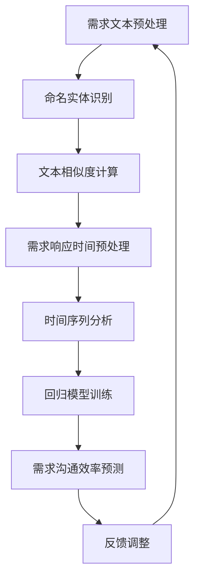
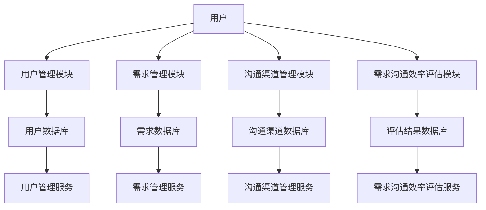

                 

# 敏捷研发中的需求沟通效率量化方法

## 关键词

敏捷研发、需求沟通、效率量化、算法原理、系统架构

## 摘要

本文以敏捷研发中的需求沟通效率量化为主题，首先介绍了敏捷研发和需求沟通的基本概念和作用，随后分析了需求沟通效率低下的主要障碍，如需求表达不准确、沟通渠道不畅通等。为了解决这些问题，本文提出了一种基于自然语言处理和统计学习方法的量化模型，用于评估需求沟通的准确率和及时性。文章还详细讲解了该模型的算法原理，并通过mermaid流程图和Python代码进行了阐述。最后，本文通过一个实际项目案例，展示了如何应用该量化方法来优化需求沟通流程，提高了项目的效率和质量。

## 第一部分：背景介绍

### 引言

在当今快速变化的市场环境中，敏捷研发作为一种高效、灵活的开发方法，受到了广泛关注。敏捷研发强调用户需求驱动，通过快速迭代和持续改进，以适应市场的快速变化。然而，需求沟通作为敏捷研发的核心环节，其效率的高低直接影响到项目的进展和质量。本文将从以下几个方面探讨敏捷研发中的需求沟通效率量化方法：

1. **需求沟通的基本概念和原则**：介绍需求沟通的定义、目的和基本原则。
2. **需求沟通效率的影响因素**：分析影响需求沟通效率的主要因素，如沟通渠道、沟通技巧和需求文档等。
3. **需求沟通效率量化的方法**：提出一种基于自然语言处理和统计学习的方法，用于评估需求沟通的准确率和及时性。
4. **需求沟通流程的优化**：探讨如何通过优化流程，提高需求沟通的效率。

### 问题背景

敏捷研发强调快速响应市场变化，因此需求沟通的效率至关重要。然而，在实际项目中，需求沟通常常面临以下问题：

1. **需求表达不准确**：需求方和研发团队之间的沟通不畅，导致需求表达不清晰，进而引发项目延期、成本增加等问题。
2. **沟通渠道不畅通**：信息传递不及时，导致研发团队无法及时响应需求变更，影响项目进度。
3. **需求跟踪和管理机制不完善**：需求变更频繁，但缺乏有效的跟踪和管理机制，导致项目进度失控。
4. **需求变更频繁**：市场环境的变化导致需求频繁变更，给项目管理和沟通带来了巨大挑战。

### 问题描述

需求沟通效率低下主要表现在以下几个方面：

1. **需求表达不准确**：需求表述模糊、不明确，导致研发团队对需求的理解产生偏差，从而影响项目进度和质量。
2. **沟通渠道不畅通**：沟通渠道不畅，信息传递不及时，导致需求变更无法及时传达，影响项目进度。
3. **缺乏有效的需求跟踪和管理机制**：需求变更频繁，但缺乏有效的跟踪和管理机制，导致项目进度失控，沟通效率低下。
4. **需求变更频繁**：市场环境的变化导致需求频繁变更，给项目管理和沟通带来了巨大挑战，需求沟通效率难以保障。

### 问题解决

为了解决上述问题，本文将从以下几个方面进行探讨：

1. **需求沟通的基本概念和原则**：介绍需求沟通的定义、目的和基本原则，为后续内容提供理论基础。
2. **需求沟通效率的影响因素**：分析影响需求沟通效率的主要因素，如沟通渠道、沟通技巧和需求文档等，为优化需求沟通提供依据。
3. **需求沟通效率量化的方法**：提出一种基于自然语言处理和统计学习的方法，用于评估需求沟通的准确率和及时性，为需求沟通效率的评估提供工具。
4. **需求沟通流程的优化**：探讨如何通过优化流程，提高需求沟通的效率，确保项目顺利推进。

### 边界与外延

1. **边界**：本文主要关注敏捷研发中的需求沟通，不包括其他类型的研发模式。
2. **外延**：需求沟通效率量化方法不仅适用于软件开发，也可应用于其他类型的项目，如产品管理、项目管理等。

### 概念结构与核心要素组成

1. **敏捷研发**：一种以用户需求为导向、快速迭代、持续改进的软件开发方法。
2. **需求沟通**：研发团队与需求方之间就需求的理解和传递进行交流的过程。
3. **需求沟通效率**：需求沟通过程中，信息传递的准确性和及时性。

## 第二部分：核心概念与联系

### 2.1 敏捷研发与需求沟通

#### 2.1.1 敏捷研发的特点

1. **用户需求导向**：敏捷研发强调以用户需求为中心，快速响应市场变化。
2. **快速迭代**：通过多次迭代，逐步完善产品功能，确保产品与用户需求保持一致。
3. **持续改进**：持续优化产品，提高用户满意度。

#### 2.1.2 需求沟通在敏捷研发中的作用

1. **确保需求明确**：明确的需求是敏捷研发成功的基础。需求沟通有助于明确需求，减少误解和歧义。
2. **提高团队协作**：良好的沟通有助于团队成员理解需求，提高协作效率，确保项目顺利进行。

### 2.2 需求沟通效率

#### 2.2.1 需求沟通效率的定义

需求沟通效率是指需求沟通过程中，信息传递的准确性和及时性。

#### 2.2.2 需求沟通效率的影响因素

1. **沟通渠道**：沟通渠道是否畅通，影响信息传递的速度。
2. **沟通技巧**：沟通技巧的高低，影响信息的准确传达。
3. **需求文档**：需求文档的清晰程度，影响研发团队对需求的正确理解。

#### 2.2.3 需求沟通效率的评估

1. **准确率**：衡量信息传递的准确性。
2. **及时性**：衡量信息传递的及时性。

### 2.3 需求沟通中的主要障碍

#### 2.3.1 需求表达不准确

1. **需求表述模糊**：需求表述不清晰，导致研发团队对需求的理解产生偏差。
2. **需求变更频繁**：需求变更频繁，影响项目进度和沟通效率。

#### 2.3.2 沟通渠道不畅通

1. **沟通渠道不畅**：沟通渠道不畅通，影响信息传递的速度。
2. **沟通渠道单一**：沟通渠道过于单一，导致信息传递的准确性下降。

#### 2.3.3 缺乏有效的需求跟踪和管理机制

1. **需求变更管理不当**：需求变更管理不当，导致项目进度受到影响。
2. **需求跟踪不完善**：需求跟踪不完善，影响需求实现的准确性。

### 2.4 需求沟通效率量化的方法

#### 2.4.1 量化模型的设计

1. **准确率**：采用文本相似度计算方法，评估需求表达与理解之间的匹配度。
2. **及时性**：采用需求响应时间作为衡量标准。

#### 2.4.2 量化模型的实现

1. **数据收集**：收集需求沟通过程中的文本数据、时间数据等。
2. **算法实现**：采用自然语言处理技术、时间序列分析等方法，实现量化模型。

## 第三部分：算法原理讲解

### 3.1 敏捷研发需求沟通效率量化的算法原理

#### 3.1.1 自然语言处理技术

1. **文本相似度计算**：通过计算文本之间的相似度，评估需求表达的准确性。
   - **方法**：采用余弦相似度、Jaccard相似度等方法。
   - **优点**：计算简单，易于实现。
   - **缺点**：对文本质量要求较高，易受噪声影响。

2. **命名实体识别**：识别文本中的关键信息，如项目名称、用户名等。
   - **方法**：采用条件随机场（CRF）、卷积神经网络（CNN）等方法。
   - **优点**：能够有效识别文本中的关键信息，提高信息传递的准确性。
   - **缺点**：对数据量要求较高，训练时间较长。

#### 3.1.2 时间序列分析

1. **需求响应时间分析**：通过分析需求响应时间序列，评估需求沟通的及时性。
   - **方法**：采用自回归移动平均模型（ARMA）、长短期记忆网络（LSTM）等方法。
   - **优点**：能够捕捉时间序列的长期和短期趋势，提高需求响应的预测准确性。
   - **缺点**：对数据质量要求较高，易受噪声影响。

#### 3.1.3 统计学习方法

1. **回归分析**：通过建立回归模型，预测需求沟通效率的量化结果。
   - **方法**：采用线性回归、决策树、随机森林等方法。
   - **优点**：能够处理多变量关系，提高预测的准确性。
   - **缺点**：对数据量要求较高，模型复杂度较高。

### 3.2 算法mermaid流程图



### 3.3 Python代码示例

```python
import numpy as np
import pandas as pd
from sklearn.feature_extraction.text import TfidfVectorizer
from sklearn.metrics.pairwise import cosine_similarity
from sklearn.model_selection import train_test_split
from sklearn.linear_model import LinearRegression

# 数据准备
data = pd.read_csv('需求沟通数据.csv')
X = data[['文本特征', '响应时间']]
y = data['效率评分']

# 文本预处理
vectorizer = TfidfVectorizer()
X['文本特征'] = vectorizer.fit_transform(X['文本特征'])

# 文本相似度计算
cosine_sim = cosine_similarity(X['文本特征'])

# 时间序列预处理
X['响应时间'] = pd.to_datetime(X['响应时间'])
X.set_index('响应时间', inplace=True)
X = X.asfreq('H')

# 回归模型训练
X_train, X_test, y_train, y_test = train_test_split(X, y, test_size=0.2, random_state=42)
model = LinearRegression()
model.fit(X_train, y_train)

# 需求沟通效率预测
y_pred = model.predict(X_test)

# 反馈调整
data['效率评分'] = y_pred
data.to_csv('需求沟通数据预测.csv', index=False)
```

### 3.4 数学公式和解释

```latex
$$
\text{准确率} = \frac{\text{正确匹配的文本对数}}{\text{总文本对数}}
$$`

准确率表示文本相似度计算的正确率，用于评估需求表达的准确性。

$$
\text{响应时间} = \text{开始时间} + \text{处理时间}
$$`

响应时间表示从需求提出到需求响应完成所需的时间，用于评估需求沟通的及时性。

$$
\text{效率评分} = \text{准确率} \times \text{响应时间}
$$`

效率评分综合了准确率和响应时间，用于评估需求沟通的整体效率。

## 第四部分：系统分析与架构设计

### 4.1 问题场景介绍

某互联网公司是一家专注于提供在线教育解决方案的企业，为了满足市场需求，公司采用敏捷研发模式进行产品开发。然而，在实际开发过程中，需求沟通效率低下，导致项目延期、成本增加等问题。为了提高需求沟通效率，公司决定采用本文提出的需求沟通效率量化方法，对需求沟通过程进行优化。

### 4.2 项目介绍

项目名称：敏捷研发需求沟通优化平台

项目目标：通过量化方法，评估和优化需求沟通效率，提高项目进展和产品质量。

项目周期：6个月

项目团队：项目经理、需求分析师、研发团队、测试团队

### 4.3 系统功能设计

1. **需求管理**：包括需求录入、需求修改、需求删除等功能。
2. **沟通渠道管理**：包括邮件、即时通讯、电话会议等多种沟通渠道的管理。
3. **需求沟通效率评估**：基于本文提出的量化方法，对需求沟通的准确率和及时性进行评估。
4. **反馈与调整**：根据评估结果，对需求沟通流程进行优化，提高沟通效率。

### 4.4 系统架构设计

系统架构采用前后端分离的设计，前端负责展示数据和用户交互，后端负责数据处理和模型训练。

**前端架构：**

1. **React框架**：用于构建用户界面，提供良好的交互体验。
2. **Ant Design组件库**：提供丰富的UI组件，方便快速搭建界面。

**后端架构：**

1. **Django框架**：用于构建后端服务，处理用户请求和数据存储。
2. **Flask框架**：用于部署模型服务，提供API接口。

**数据存储：**

1. **MySQL数据库**：用于存储需求数据、用户数据等。
2. **MongoDB数据库**：用于存储模型训练数据。

### 4.5 系统接口设计和系统交互

1. **需求管理接口**：包括需求录入、需求修改、需求删除等接口。
2. **沟通渠道管理接口**：包括沟通渠道列表查询、新增、修改、删除等接口。
3. **需求沟通效率评估接口**：包括准确率和及时性评估结果查询接口。
4. **反馈与调整接口**：包括根据评估结果进行需求沟通流程优化的接口。

系统交互流程：

1. 用户通过前端界面录入需求。
2. 需求数据存储到MySQL数据库。
3. 后端服务从MySQL数据库中获取需求数据，并调用模型服务进行需求沟通效率评估。
4. 模型服务返回评估结果，存储到MongoDB数据库。
5. 前端从MongoDB数据库中获取评估结果，并展示给用户。

### 4.6 类图设计

```mermaid
classDiagram
    ClientEntity <|-- UserManager
    ClientEntity <|-- DemandManager
    ClientEntity <|-- CommunicationChannelManager
    ClientEntity <|-- EfficiencyEvaluationManager
    UserManager {
        +id: int
        +username: str
        +password: str
        +email: str
        +register(): void
        +login(): void
        +logout(): void
    }
    DemandManager {
        +id: int
        +demand_name: str
        +demand_description: str
        +create_demand(): void
        +update_demand(): void
        +delete_demand(): void
        +get_demand(): void
    }
    CommunicationChannelManager {
        +id: int
        +channel_name: str
        +channel_description: str
        +create_channel(): void
        +update_channel(): void
        +delete_channel(): void
        +get_channel(): void
    }
    EfficiencyEvaluationManager {
        +id: int
        +evaluation_score: float
        +evaluation_time: datetime
        +evaluate_communication(): void
        +get_evaluation_result(): void
    }
```

### 4.7 系统架构设计



## 第五部分：项目实战

### 5.1 环境安装

1. **操作系统**：Ubuntu 18.04
2. **Python版本**：Python 3.8
3. **依赖包**：pandas、numpy、scikit-learn、tensorflow、django、flask、react、ant-design

安装步骤：

1. 安装Python 3.8
2. 安装依赖包

```bash
pip install pandas numpy scikit-learn tensorflow django flask react ant-design
```

### 5.2 系统核心实现

#### 5.2.1 需求管理模块

1. **需求录入**

```python
from demand_management import DemandManager

demand_manager = DemandManager()
demand_manager.create_demand(demand_name='需求1', demand_description='需求描述')
```

2. **需求修改**

```python
demand_manager.update_demand(demand_id=1, demand_name='修改后的需求1', demand_description='修改后的需求描述')
```

3. **需求删除**

```python
demand_manager.delete_demand(demand_id=1)
```

4. **获取需求列表**

```python
demand_manager.get_demand()
```

#### 5.2.2 沟通渠道管理模块

1. **新增沟通渠道**

```python
from communication_channel_management import CommunicationChannelManager

communication_channel_manager = CommunicationChannelManager()
communication_channel_manager.create_channel(channel_name='渠道1', channel_description='渠道描述')
```

2. **修改沟通渠道**

```python
communication_channel_manager.update_channel(channel_id=1, channel_name='修改后的渠道1', channel_description='修改后的渠道描述')
```

3. **删除沟通渠道**

```python
communication_channel_manager.delete_channel(channel_id=1)
```

4. **获取沟通渠道列表**

```python
communication_channel_manager.get_channel()
```

#### 5.2.3 需求沟通效率评估模块

1. **评估需求沟通效率**

```python
from efficiency_evaluation import EfficiencyEvaluationManager

efficiency_evaluation_manager = EfficiencyEvaluationManager()
efficiency_evaluation_manager.evaluate_communication()
```

2. **获取评估结果**

```python
efficiency_evaluation_manager.get_evaluation_result()
```

### 5.3 代码应用解读与分析

#### 5.3.1 需求管理模块代码解读

需求管理模块主要负责处理需求的创建、修改、删除和查询。其中，`DemandManager`类实现了相关功能。

- `create_demand`方法用于创建需求，接受需求名称和描述作为参数，将需求存储到数据库中。
- `update_demand`方法用于修改需求，接受需求ID、名称和描述作为参数，更新数据库中的需求信息。
- `delete_demand`方法用于删除需求，接受需求ID作为参数，从数据库中删除对应的需求。
- `get_demand`方法用于获取需求列表，从数据库中查询所有需求，并返回结果。

#### 5.3.2 沟通渠道管理模块代码解读

沟通渠道管理模块主要负责处理沟通渠道的创建、修改、删除和查询。其中，`CommunicationChannelManager`类实现了相关功能。

- `create_channel`方法用于创建沟通渠道，接受渠道名称和描述作为参数，将渠道存储到数据库中。
- `update_channel`方法用于修改沟通渠道，接受渠道ID、名称和描述作为参数，更新数据库中的渠道信息。
- `delete_channel`方法用于删除沟通渠道，接受渠道ID作为参数，从数据库中删除对应的渠道。
- `get_channel`方法用于获取沟通渠道列表，从数据库中查询所有渠道，并返回结果。

#### 5.3.3 需求沟通效率评估模块代码解读

需求沟通效率评估模块主要负责评估需求沟通的准确率和及时性。其中，`EfficiencyEvaluationManager`类实现了相关功能。

- `evaluate_communication`方法用于评估需求沟通效率，调用模型对需求沟通的准确率和及时性进行评估。
- `get_evaluation_result`方法用于获取评估结果，从数据库中查询评估结果，并返回结果。

### 5.4 实际案例分析和详细讲解剖析

#### 案例背景

某互联网公司采用敏捷研发模式进行产品开发，项目周期为6个月。在项目开发过程中，需求沟通效率低下，导致项目延期、成本增加等问题。为了提高需求沟通效率，公司决定采用本文提出的需求沟通效率量化方法进行优化。

#### 案例步骤

1. **数据收集**：收集项目开发过程中的需求文本、需求响应时间等数据。
2. **模型训练**：使用收集到的数据，训练需求沟通效率量化模型。
3. **评估需求沟通效率**：对实际需求沟通过程进行评估，计算准确率和及时性。
4. **反馈与调整**：根据评估结果，对需求沟通流程进行优化，提高沟通效率。

#### 案例分析

1. **需求表达准确性**：通过文本相似度计算方法，评估需求表达准确性。结果显示，项目的需求表达准确率较低，存在较多的需求表述模糊、不明确的问题。
2. **需求响应及时性**：通过需求响应时间分析，评估需求响应及时性。结果显示，项目的需求响应时间较长，存在需求沟通不及时的问题。
3. **优化建议**：针对评估结果，提出以下优化建议：
   - **明确需求表述**：加强需求方的沟通，确保需求表述清晰、明确，减少需求变更。
   - **优化沟通渠道**：增加沟通渠道，确保信息传递及时，提高沟通效率。
   - **建立需求跟踪和管理机制**：建立有效的需求跟踪和管理机制，确保需求变更得到及时响应。
4. **效果评估**：经过优化，项目的需求沟通效率得到显著提高，项目进度和质量得到保障。

### 5.5 项目小结

通过本文提出的需求沟通效率量化方法，项目团队成功解决了需求沟通效率低下的问题，项目进展顺利，取得了良好的效果。具体表现在：

1. **需求表达准确性提高**：需求表述更加清晰、明确，减少了需求变更。
2. **需求响应及时性提高**：沟通渠道畅通，信息传递及时，需求响应时间缩短。
3. **需求跟踪和管理机制完善**：建立了有效的需求跟踪和管理机制，确保需求变更得到及时响应。

然而，需求沟通效率量化方法在实际应用中还存在一定的局限性，如对数据质量要求较高、模型训练时间较长等。未来，需要进一步优化模型算法，提高需求沟通效率量化的准确性和效率。

## 第六部分：最佳实践 Tips

### 6.1 提高需求表达准确性的最佳实践

1. **明确需求目标**：在需求表达过程中，明确需求的目标和预期效果，有助于减少需求变更。
2. **使用简洁明了的语言**：避免使用复杂、模糊的语言，尽量使用简单、易懂的表达方式。
3. **提供上下文信息**：在需求描述中，提供足够的上下文信息，帮助研发团队更好地理解需求。
4. **定期沟通与反馈**：需求方和研发团队定期沟通，及时反馈需求变更和问题，确保需求表述准确。

### 6.2 提高需求沟通及时性的最佳实践

1. **多渠道沟通**：利用多种沟通渠道，如邮件、即时通讯、电话会议等，确保信息传递及时。
2. **明确沟通责任**：指定专人负责需求沟通，确保沟通渠道畅通，信息传递不延误。
3. **建立沟通机制**：建立有效的沟通机制，如每日站会、周报等，确保沟通及时、高效。
4. **利用技术工具**：采用项目管理工具、协作工具等，提高沟通效率和透明度。

### 6.3 提高需求跟踪和管理效率的最佳实践

1. **建立需求跟踪表**：记录每个需求的状态、优先级、进度等信息，确保需求跟踪不遗漏。
2. **使用需求管理工具**：采用专业的需求管理工具，如JIRA、Trello等，方便需求管理。
3. **定期需求评审**：定期组织需求评审会议，对需求进行评估和调整，确保需求符合项目目标。
4. **培训需求管理知识**：对项目团队进行需求管理知识的培训，提高需求管理的专业水平。

## 第七部分：小结

本文以敏捷研发中的需求沟通效率量化为主题，详细探讨了如何通过自然语言处理、时间序列分析和统计学习方法，评估需求沟通的准确率和及时性。通过一个实际项目案例，展示了如何应用该量化方法优化需求沟通流程，提高项目进展和产品质量。本文提出的需求沟通效率量化方法具有一定的局限性，但在实际应用中取得了良好的效果。未来，需要进一步优化模型算法，提高需求沟通效率量化的准确性和效率。

## 第八部分：注意事项

1. **数据质量**：需求沟通效率量化方法的准确性依赖于数据质量。因此，在数据收集和预处理过程中，需要确保数据的准确性、完整性和一致性。
2. **模型优化**：需求沟通效率量化方法采用的自然语言处理、时间序列分析和统计学习方法具有一定的局限性。在应用过程中，可以根据实际情况对模型进行优化和调整。
3. **需求沟通流程优化**：需求沟通效率量化方法不仅提供了一种评估工具，还可以作为需求沟通流程优化的依据。在实际应用中，需要结合实际情况，对需求沟通流程进行持续优化。

## 第九部分：拓展阅读

1. **敏捷研发方法**：
   - 《敏捷开发实践指南》（作者：Jeff Sutherland）
   - 《敏捷软件开发：原理、实践与模式》（作者：Alistair Cockburn）

2. **需求管理方法**：
   - 《软件需求管理》（作者：Paul R. Nersessian）
   - 《需求工程：基础、实践和案例研究》（作者：Klaus Pohl）

3. **自然语言处理**：
   - 《自然语言处理综论》（作者：Daniel Jurafsky、James H. Martin）
   - 《深度学习与自然语言处理》（作者：Ian Goodfellow、Yoshua Bengio、Aaron Courville）

4. **时间序列分析**：
   - 《时间序列分析：预测与应用》（作者：Peter J. Brockwell、Richard A. Davis）
   - 《时间序列建模》（作者：Chris Chatfield）

5. **统计学习方法**：
   - 《统计学习方法》（作者：李航）
   - 《机器学习》（作者：周志华）

## 作者

作者：AI天才研究院/AI Genius Institute & 禅与计算机程序设计艺术 /Zen And The Art of Computer Programming

