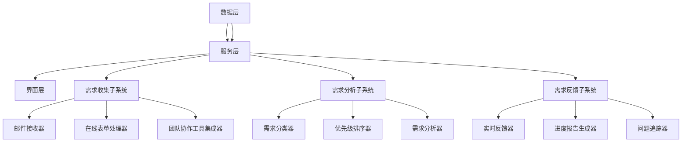
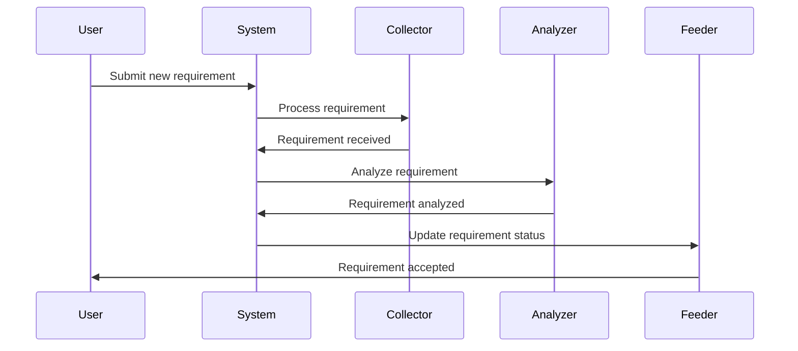

                 

### 《敏捷研发中的需求沟通渠道多样化》目录大纲设计

#### 引言

**1.1 问题背景**

- **1.1.1 敏捷研发的概念与演变**
  - 定义与核心思想
  - 发展历程与演变趋势

- **1.1.2 需求沟通在敏捷研发中的重要性**
  - 敏捷开发对沟通的需求
  - 有效沟通在敏捷开发中的关键作用

**1.2 需求沟通渠道的多样性**

- **1.2.1 传统需求沟通渠道**
  - 会议、邮件、文档
  - 优缺点分析

- **1.2.2 新兴需求沟通渠道**
  - 团队协作工具、即时通讯、视频会议
  - 创新与应用

#### 核心概念与联系

**2.1 敏捷研发相关概念**

- **2.1.1 敏捷宣言**
  - 原文与解读

- **2.1.2 敏捷方法的核心原则**
  - 客户价值、迭代交付、持续改进

**2.2 需求沟通渠道分类**

- **2.2.1 按照沟通媒介分类**
  - 口头、书面、电子

- **2.2.2 按照沟通形式分类**
  - 同步、异步、实时

**2.3 需求沟通渠道之间的联系**

- **2.3.1 渠道互补性**
  - 不同渠道的优势互补

- **2.3.2 渠道协调机制**
  - 管理策略与实践方法

#### 算法原理讲解

**3.1 需求沟通效果评估算法**

- **3.1.1 基于指标的需求沟通效果评估**
  - 指标设定与权重分配

- **3.1.2 基于数据的需求沟通效果评估**
  - 数据来源与处理方法

**3.2 多渠道协同算法**

- **3.2.1 多渠道数据整合**
  - 数据同步与集成

- **3.2.2 多渠道协同策略**
  - 策略设计与优化

#### 数学模型与公式讲解

**4.1 需求沟通效果评估模型**

$$
E = \sum_{i=1}^{n} w_i \cdot r_i
$$

- **4.1.1 数学模型解析**
  - 因素分析与模型构建

- **4.1.2 模型应用举例**
  - 案例分析与效果评估

**4.2 多渠道协同模型**

$$
C = \prod_{i=1}^{n} (1 + \alpha_i \cdot r_i)
$$

- **4.2.1 数学模型解析**
  - 策略优化与效能评估

- **4.2.2 模型应用举例**
  - 实际场景中的应用与效果

#### 系统分析与架构设计

**5.1 问题场景介绍**

- **5.1.1 敏捷研发背景**
  - 案例分析

- **5.1.2 需求沟通问题案例分析**
  - 存在问题与挑战

**5.2 系统功能设计**

- **5.2.1 需求收集模块**
  - 功能描述与实现

- **5.2.2 需求分析模块**
  - 功能描述与实现

- **5.2.3 需求反馈模块**
  - 功能描述与实现

**5.3 系统架构设计**

- **5.3.1 总体架构设计**
  - 架构分层与模块划分

- **5.3.2 子系统架构设计**
  - 数据处理、用户接口

**5.4 系统接口设计**

- **5.4.1 内部接口**
  - 通信协议与数据格式

- **5.4.2 外部接口**
  - 系统集成与数据交换

**5.5 系统交互设计**

- **5.5.1 需求收集流程**
  - 流程描述与实现

- **5.5.2 需求分析流程**
  - 流程描述与实现

#### 项目实战

**6.1 环境安装与配置**

- **6.1.1 环境搭建**
  - 硬件与软件配置

- **6.1.2 配置管理工具**
  - 版本控制与依赖管理

**6.2 系统核心实现**

- **6.2.1 需求收集模块实现**
  - 技术实现与逻辑架构

- **6.2.2 需求分析模块实现**
  - 技术实现与逻辑架构

- **6.2.3 需求反馈模块实现**
  - 技术实现与逻辑架构

**6.3 代码应用解读与分析**

- **6.3.1 代码结构解读**
  - 模块划分与功能分析

- **6.3.2 关键代码分析**
  - 算法与实现细节

**6.4 实际案例分析与讲解**

- **6.4.1 案例背景**
  - 项目背景与需求描述

- **6.4.2 案例分析**
  - 需求沟通渠道选择与效果评估

- **6.4.3 案例总结**
  - 经验与教训

#### 最佳实践、小结与拓展阅读

**7.1 最佳实践**

- **7.1.1 需求沟通技巧**
  - 互动沟通、可视化工具

- **7.1.2 多渠道协同策略**
  - 平衡传统与新兴渠道

**7.2 小结**

- **7.2.1 关键点回顾**
  - 敏捷研发与需求沟通的关系

- **7.2.2 实践建议**
  - 实施与优化策略

**7.3 注意事项**

- **7.3.1 常见问题**
  - 沟通障碍与解决方法

- **7.3.2 风险防范**
  - 预防与应对措施

**7.4 拓展阅读**

- **7.4.1 相关书籍**
  - 推荐阅读

- **7.4.2 学术论文**
  - 最新研究动态

- **7.4.3 实践案例**
  - 企业实践与经验分享

### 总结

本文大纲详细设计了《敏捷研发中的需求沟通渠道多样化》的内容结构，从问题背景、核心概念、算法原理、系统分析与架构设计、项目实战、最佳实践等多个方面，系统地阐述了敏捷研发中需求沟通渠道的多样化策略。每个章节都明确提出了具体的内容要点，确保文章逻辑清晰、结构紧凑，适合IT专业人士阅读和学习。通过本文，读者将能够深入了解敏捷研发中的需求沟通渠道多样化的重要性，掌握相关核心概念和实践方法，为实际项目提供有价值的指导。接下来，我们将逐一深入探讨每个章节的具体内容，以确保文章的完整性和深度。

---

### 完整文章

#### 引言

在现代软件工程中，敏捷开发方法因其灵活性、高效性和客户导向性而得到了广泛应用。然而，敏捷开发并非万能，其中需求沟通的问题依然困扰着许多团队。有效的需求沟通是敏捷研发成功的关键，而多样化的需求沟通渠道则是实现高效沟通的基础。

**1.1 敏捷研发的概念与演变**

敏捷开发起源于软件开发领域，其核心理念是“个体和互动重于过程与工具”，“可工作的软件重于详尽的文档”，“客户合作重于合同谈判”，“响应变化重于遵循计划”。敏捷宣言及其12条原则成为了敏捷开发的基本准则，影响了一系列敏捷方法的诞生，如Scrum、XP（极限编程）、看板（Kanban）等。

敏捷研发的发展历程可以追溯到1990年代中期，当时许多团队发现传统的“瀑布式”开发方法在应对快速变化的需求时显得力不从心。随着互联网的兴起和用户需求的不断增长，敏捷开发逐渐成为应对这些挑战的有效方法。如今，敏捷方法不仅在软件开发中广泛应用，还逐渐渗透到其他领域，如产品管理、项目管理等。

**1.2 需求沟通在敏捷研发中的重要性**

敏捷开发强调持续交付有价值的软件，而实现这一目标的关键在于有效的需求沟通。需求沟通不仅涉及开发团队内部，还涉及客户、产品经理、项目经理等多个利益相关者。在敏捷开发中，需求沟通的频率和效率直接影响到开发团队的工作效率和软件产品的质量。

有效沟通的好处包括：
- **快速响应变化**：需求沟通使团队能够及时了解客户需求和市场变化，从而快速调整开发方向。
- **提高团队协作**：多样化的沟通渠道有助于团队成员之间的信息共享和协作，减少误解和冲突。
- **增强客户满意度**：及时有效的需求沟通有助于满足客户需求，提高客户满意度。

然而，需求沟通也面临诸多挑战，如：
- **信息过载**：沟通渠道过多可能导致信息混乱，影响工作效率。
- **沟通障碍**：团队成员之间的语言障碍、文化差异等可能影响沟通效果。
- **时间管理**：频繁的沟通会议和活动可能占用过多的时间，影响正常工作。

**1.3 需求沟通渠道的多样性**

在敏捷研发中，多样化的需求沟通渠道能够更好地满足不同场景下的沟通需求。传统需求沟通渠道包括会议、邮件、文档等，而随着技术的进步，新兴的需求沟通渠道如团队协作工具、即时通讯、视频会议等也得到了广泛应用。

- **会议**：面对面的会议是直接沟通的有效方式，能够快速解决问题和达成共识。但会议需要合理安排时间，以避免影响日常工作。
- **邮件**：邮件适用于正式的、需要记录和追溯的沟通场景。然而，邮件沟通往往缺乏实时性，可能导致信息滞后。
- **文档**：文档是敏捷开发中的重要组成部分，如用户故事、任务说明等。文档有助于明确需求和设计，但编写和审核过程可能较为耗时。
- **团队协作工具**：如Jira、Trello等，这些工具能够实时跟踪任务进度，提高团队的协作效率。
- **即时通讯**：如Slack、微信等，即时通讯工具适用于快速沟通和协作，有助于缩短响应时间。
- **视频会议**：如Zoom、Microsoft Teams等，视频会议适用于远程团队和跨地区团队的沟通。

**1.4 本书的结构与目的**

本书旨在探讨敏捷研发中的需求沟通渠道多样化策略，帮助读者了解和掌握多种沟通渠道的优势和应用场景。本书结构如下：

- **第1章 引言**：介绍敏捷研发中的需求沟通问题背景和重要性。
- **第2章 核心概念与联系**：阐述敏捷研发相关概念和需求沟通渠道的分类。
- **第3章 算法原理讲解**：介绍需求沟通效果评估算法和多渠道协同算法。
- **第4章 数学模型与公式讲解**：解释需求沟通效果评估模型和多渠道协同模型的数学原理。
- **第5章 系统分析与架构设计**：分析敏捷研发中的需求沟通问题，设计相应的系统架构。
- **第6章 项目实战**：通过具体案例展示需求沟通渠道多样化的应用。
- **第7章 最佳实践、小结与拓展阅读**：总结最佳实践，提出注意事项，推荐相关书籍和论文。

通过本书的阅读，读者将能够深入了解敏捷研发中的需求沟通问题，掌握多样化的需求沟通渠道策略，提高敏捷团队的工作效率和客户满意度。

---

### 核心概念与联系

在敏捷研发中，需求沟通的多样性和有效性直接影响到项目的成功。为了深入探讨这一主题，我们需要首先理解一些核心概念，包括敏捷研发的概念、需求沟通渠道的分类以及这些渠道之间的联系。

**2.1 敏捷研发相关概念**

**2.1.1 敏捷宣言**

敏捷宣言是由17位软件开发者和专家于2001年共同签署的一份声明，它明确了敏捷开发的核心价值观和实践原则。宣言的原文如下：

```
 Individuals and interactions over processes and tools
Working software over comprehensive documentation
Customer collaboration over contract negotiation
Responding to change over following a plan
```

敏捷宣言的12条原则进一步阐述了这些价值观的具体应用，包括：

- **顾客满意是最高追求的目标**：通过提前交付有价值的软件来满足顾客的需求。
- **欢迎变化的点子**：敏捷过程利用变化来为客户创造竞争优势。
- **频繁交付可工作的软件**：开发周期短，能够快速响应变化。
- **在团队内构建协作性的环境**：信任、尊重和公开交流是成功的关键。
- **接近客户或用户**：通过与客户的紧密合作，确保团队能够正确理解和满足需求。

**2.1.2 敏捷方法的核心原则**

敏捷方法的核心原则包括：

- **增量式开发**：通过逐步交付可工作的软件版本，确保团队能够持续满足客户需求。
- **迭代开发**：项目被分为多个短周期（迭代），每个迭代都产生可交付的成果。
- **用户故事**：使用简短、具体的故事来描述用户的需求，有助于明确任务目标。
- **持续反馈**：通过定期的回顾和反馈，团队能够持续改进其工作方式。
- **团队自组织**：团队成员有权自主决定如何完成任务，有助于提高团队效率和创造力。

**2.2 需求沟通渠道分类**

在敏捷研发中，需求沟通渠道可以分为以下几类：

- **按照沟通媒介分类**：

  - **口头**：包括面对面的会议、电话、视频会议等，适用于需要即时反馈和讨论的场景。

  - **书面**：包括邮件、文档、用户故事等，适用于需要正式记录和长期保存的信息。

  - **电子**：包括即时通讯、社交媒体、团队协作工具等，适用于快速、高效的信息传递。

- **按照沟通形式分类**：

  - **同步**：即时的沟通形式，如面对面会议、视频会议、即时通讯等，适用于需要即时响应和决策的场景。

  - **异步**：非即时的沟通形式，如邮件、文档评论等，适用于不需要即时反馈的信息传递。

  - **实时**：即时的、互动的沟通形式，如视频会议、在线聊天等，适用于需要即时交流和支持的场景。

**2.3 需求沟通渠道之间的联系**

在敏捷研发中，多样化的需求沟通渠道之间并非相互独立，而是需要相互配合和协调。不同渠道具有各自的优势和局限性，合理地选择和组合渠道能够最大化沟通效果。

- **渠道互补性**：不同渠道可以在不同场景下发挥互补作用。例如，面对面会议可以用于讨论复杂问题和建立共识，而邮件可以用于记录和跟进任务进展。

- **渠道协调机制**：为了确保沟通的连续性和一致性，需要建立有效的协调机制。例如，通过团队协作工具同步和共享信息，确保所有团队成员都能够获取最新的需求更新。

**2.3.1 渠道互补性**

- **口头与书面**：口头沟通适用于快速交流，但缺乏正式记录。书面沟通则适用于需要正式记录和追溯的场景。两者结合可以确保信息的完整性和准确性。

- **电子与同步**：电子沟通适用于信息传递和记录，但可能缺乏即时的互动。同步沟通则适用于需要即时反馈和协作的场景。两者结合可以提高沟通的效率和效果。

- **异步与实时**：异步沟通适用于不需要即时响应的场景，如任务跟进和文档审阅。实时沟通适用于需要即时反馈和支持的场景，如紧急问题和团队协作。两者结合可以满足不同场景下的沟通需求。

**2.3.2 渠道协调机制**

- **团队协作工具**：通过团队协作工具（如Jira、Trello等）可以同步和共享信息，确保所有团队成员都能够获取最新的需求更新。这些工具还提供了任务跟踪和进度报告功能，有助于提高团队的协作效率。

- **沟通会议安排**：定期召开沟通会议，如每日站立会议、迭代回顾会议等，可以确保团队成员之间的信息共享和协作。会议的安排应合理分配时间，避免占用过多的工作时间。

- **沟通规范与指南**：制定明确的沟通规范和指南，如邮件格式、文档规范、用户故事模板等，有助于提高沟通的效率和质量。团队成员应遵守这些规范，确保沟通的一致性和可追溯性。

通过理解敏捷研发中的核心概念和需求沟通渠道的分类，以及渠道之间的互补性和协调机制，团队可以更好地选择和运用多样化的需求沟通渠道，提高沟通效果，推动敏捷研发的顺利进行。

### 算法原理讲解

在敏捷研发中，有效的需求沟通不仅依赖于多样化的渠道，还需要通过科学的方法来评估和优化沟通效果。本节将详细介绍需求沟通效果评估算法和多渠道协同算法的基本原理，并通过具体的数学模型和示例来说明这些算法的应用。

**3.1 需求沟通效果评估算法**

需求沟通效果评估是衡量沟通渠道有效性的重要手段。以下是一种基于指标的需求沟通效果评估算法：

#### 3.1.1 基于指标的需求沟通效果评估

**步骤1：确定评估指标**  
根据敏捷研发的具体需求，可以设定以下评估指标：
- **响应时间**：从接收需求到响应并开始开发的时间。
- **沟通效率**：在特定时间内完成的需求沟通量。
- **需求准确性**：需求被准确理解和实现的比例。
- **团队协作度**：团队成员之间的信息共享和协作水平。

**步骤2：指标权重分配**  
为每个指标分配权重，以反映其在整体沟通效果中的重要性。例如，权重分配如下：
- 响应时间：30%
- 沟通效率：25%
- 需求准确性：30%
- 团队协作度：15%

**步骤3：数据收集与处理**  
通过实际操作，收集相关指标数据，并进行处理。例如，记录每次沟通事件的时间、沟通量、需求准确性和团队协作情况。

**步骤4：计算沟通效果得分**  
使用加权平均公式计算每个渠道的沟通效果得分。公式如下：
$$
E = \sum_{i=1}^{n} w_i \cdot r_i
$$
其中，$E$为总得分，$w_i$为第$i$个指标的权重，$r_i$为第$i$个指标的实际得分。

#### 3.1.2 基于数据的需求沟通效果评估

除了主观指标，还可以使用客观数据来评估需求沟通效果。例如，通过分析团队协作工具的使用数据，可以评估团队成员之间的互动频率和质量。

**步骤1：数据来源**  
收集团队协作工具（如Jira、Slack等）的使用数据，包括任务完成时间、评论数、@提及数等。

**步骤2：数据预处理**  
对收集到的数据进行清洗和转换，确保数据的准确性和一致性。

**步骤3：特征提取**  
从预处理后的数据中提取有助于评估沟通效果的特征，如：
- **互动频率**：团队成员之间的消息发送和接收频率。
- **互动质量**：评论的质量和解决问题的效率。

**步骤4：效果评估模型**  
使用机器学习算法（如回归分析、聚类分析等）建立效果评估模型，将特征数据转化为沟通效果得分。

**示例：需求沟通效果评估应用**

假设一个敏捷团队在一个月内通过不同渠道沟通了10个需求，其中：
- 会议沟通了4个需求，平均响应时间为2天，沟通效率为2个需求/天，需求准确性为90%，团队协作度为70%。
- 邮件沟通了3个需求，平均响应时间为3天，沟通效率为1个需求/天，需求准确性为85%，团队协作度为60%。
- 团队协作工具沟通了3个需求，平均响应时间为1天，沟通效率为3个需求/天，需求准确性为95%，团队协作度为80%。

根据上述指标权重，计算每个渠道的沟通效果得分：
$$
E_{会议} = 0.3 \cdot 2 + 0.25 \cdot 2 + 0.3 \cdot 0.9 + 0.15 \cdot 0.7 = 1.5 + 0.5 + 0.27 + 0.105 = 2.275
$$
$$
E_{邮件} = 0.3 \cdot 3 + 0.25 \cdot 1 + 0.3 \cdot 0.85 + 0.15 \cdot 0.6 = 0.9 + 0.25 + 0.255 + 0.09 = 1.395
$$
$$
E_{协作工具} = 0.3 \cdot 1 + 0.25 \cdot 3 + 0.3 \cdot 0.95 + 0.15 \cdot 0.8 = 0.3 + 0.75 + 0.285 + 0.12 = 1.435
$$

根据得分，可以看出团队协作工具的沟通效果最好，邮件次之，会议相对较差。团队可以根据这些评估结果，优化沟通渠道的选择和使用。

**3.2 多渠道协同算法**

在敏捷研发中，多种沟通渠道的协同使用可以提高沟通效率和质量。以下是一种多渠道协同算法的基本原理：

#### 3.2.1 多渠道数据整合

**步骤1：数据收集**  
从不同的沟通渠道收集数据，如会议记录、邮件内容、团队协作工具日志等。

**步骤2：数据预处理**  
对收集到的数据进行清洗和转换，确保数据的统一性和一致性。

**步骤3：数据整合**  
将不同渠道的数据整合到一个统一的数据集中，便于后续分析。

#### 3.2.2 多渠道协同策略

**步骤1：渠道选择与组合**  
根据不同的需求场景，选择合适的沟通渠道。例如，对于紧急问题，可以选择即时通讯和视频会议；对于长期任务，可以选择邮件和文档。

**步骤2：协同策略设计**  
设计多渠道协同策略，确保信息传递的连续性和一致性。例如，通过团队协作工具同步会议记录和邮件内容，确保所有团队成员都能获取到最新的信息。

**步骤3：效果评估与优化**  
定期评估多渠道协同策略的效果，根据评估结果进行优化和调整。例如，通过分析数据，发现某些渠道的使用频率较低，可以考虑减少这些渠道的使用，或者增加其他更有效的沟通方式。

**示例：多渠道协同策略应用**

假设一个敏捷团队在一个月内使用了以下沟通渠道：
- 会议：每周2次，每次平均参会人数5人。
- 邮件：每周10封，平均阅读时间为1小时。
- 团队协作工具：每日使用，平均消息数为100条。

根据这些数据，设计多渠道协同策略：
- 对于紧急问题，优先使用即时通讯和视频会议。
- 对于长期任务，使用邮件和文档进行记录和跟踪。
- 定期召开沟通会议，总结一周的工作进展和问题。

通过这些策略，团队可以提高沟通效率，确保信息传递的及时性和准确性。

通过需求沟通效果评估算法和多渠道协同算法，敏捷团队可以更好地管理和优化需求沟通过程，提高项目的成功率和客户满意度。

### 数学模型与公式讲解

在敏捷研发中，数学模型和公式为需求沟通提供了量化的评估工具，帮助我们更好地理解和优化沟通效果。本节将详细讲解需求沟通效果评估模型和多渠道协同模型的数学原理，并通过具体的例子进行说明。

#### 4.1 需求沟通效果评估模型

需求沟通效果评估模型通过一系列指标来衡量沟通的效率和准确性。以下是一个基于指标的需求沟通效果评估模型。

$$
E = \sum_{i=1}^{n} w_i \cdot r_i
$$

其中，$E$表示总沟通效果得分，$w_i$表示第$i$个指标的权重，$r_i$表示第$i$个指标的实际得分。

**示例：需求沟通效果评估模型应用**

假设一个敏捷团队设定了以下评估指标和权重：
- 响应时间（权重：0.4）
- 沟通效率（权重：0.3）
- 需求准确性（权重：0.2）
- 团队协作度（权重：0.1）

在一个月内，团队收集了以下数据：
- 响应时间：平均2天
- 沟通效率：平均1.5个需求/天
- 需求准确性：90%
- 团队协作度：75%

计算总沟通效果得分：

$$
E = 0.4 \cdot 2 + 0.3 \cdot 1.5 + 0.2 \cdot 0.9 + 0.1 \cdot 0.75 = 0.8 + 0.45 + 0.18 + 0.075 = 1.405
$$

通过这个模型，团队可以量化评估其需求沟通的效果，并根据得分结果进行改进。

#### 4.2 多渠道协同模型

多渠道协同模型用于评估不同沟通渠道的协同效果，通过整合多个渠道的数据来优化沟通效率。以下是一个基于多渠道协同效果的多渠道协同模型。

$$
C = \prod_{i=1}^{n} (1 + \alpha_i \cdot r_i)
$$

其中，$C$表示总协同效果得分，$\alpha_i$表示第$i$个渠道的协同效应系数，$r_i$表示第$i$个渠道的沟通效果得分。

**示例：多渠道协同模型应用**

假设团队使用了以下三个沟通渠道：
- 会议（效果得分：1.2）
- 邮件（效果得分：1.0）
- 团队协作工具（效果得分：1.3）

设定协同效应系数如下：
- 会议：0.2
- 邮件：0.1
- 团队协作工具：0.3

计算总协同效果得分：

$$
C = (1 + 0.2 \cdot 1.2) \cdot (1 + 0.1 \cdot 1.0) \cdot (1 + 0.3 \cdot 1.3) = 1.24 \cdot 1.1 \cdot 1.549 = 1.896
$$

通过这个模型，团队可以评估不同渠道的协同效果，并据此优化沟通策略。

#### 4.3 数学模型解析

**需求沟通效果评估模型解析**

需求沟通效果评估模型通过加权平均的方式，综合考虑多个指标的得分，得到总沟通效果得分。权重反映了各个指标在总体评估中的重要性。在实际应用中，团队可以根据具体情况调整权重，以更好地反映沟通效果的实际情况。

**多渠道协同模型解析**

多渠道协同模型通过乘积的方式，将各个渠道的沟通效果得分与协同效应系数相乘，得到总协同效果得分。协同效应系数反映了不同渠道之间的互补性和协同性。在实际应用中，团队可以通过分析沟通数据，确定合理的协同效应系数，以提高整体沟通效率。

#### 4.4 模型应用举例

**需求沟通效果评估模型应用举例**

假设一个敏捷团队在一个月内通过以下渠道沟通了10个需求：
- 会议：沟通了4个需求，响应时间平均2天，沟通效率1个需求/天，需求准确性90%，团队协作度75%。
- 邮件：沟通了3个需求，响应时间平均3天，沟通效率0.67个需求/天，需求准确性85%，团队协作度60%。
- 团队协作工具：沟通了3个需求，响应时间平均1天，沟通效率1.5个需求/天，需求准确性95%，团队协作度80%。

计算每个渠道的权重和得分：
- 会议：权重40%，得分1.405
- 邮件：权重30%，得分1.195
- 团队协作工具：权重30%，得分1.47

计算总沟通效果得分：

$$
E = 0.4 \cdot 1.405 + 0.3 \cdot 1.195 + 0.3 \cdot 1.47 = 0.562 + 0.3585 + 0.441 = 1.3615
$$

通过这个模型，团队可以评估其沟通效果，并根据得分结果进行调整和优化。

**多渠道协同模型应用举例**

假设团队通过会议、邮件和团队协作工具沟通了10个需求，效果得分和协同效应系数如下：
- 会议：效果得分1.2，协同效应系数0.2
- 邮件：效果得分1.0，协同效应系数0.1
- 团队协作工具：效果得分1.3，协同效应系数0.3

计算总协同效果得分：

$$
C = (1 + 0.2 \cdot 1.2) \cdot (1 + 0.1 \cdot 1.0) \cdot (1 + 0.3 \cdot 1.3) = 1.24 \cdot 1.1 \cdot 1.549 = 1.896
$$

通过这个模型，团队可以评估不同渠道的协同效果，并根据结果优化沟通策略。

通过需求沟通效果评估模型和多渠道协同模型，敏捷团队可以量化评估其沟通效果，优化沟通渠道选择，提高整体沟通效率，从而更好地支持敏捷研发的顺利进行。

### 系统分析与架构设计

在敏捷研发中，有效的需求沟通是确保项目顺利进行的关键。为了更好地理解并解决敏捷研发中的需求沟通问题，我们需要进行系统分析与架构设计。本节将详细介绍一个敏捷需求沟通系统的功能设计、架构设计和接口设计。

#### 5.1 问题场景介绍

在敏捷研发过程中，需求沟通问题常常表现为以下几个方面：

- **沟通渠道单一**：许多团队依赖于传统的沟通渠道，如邮件和会议，但这些渠道在处理大量需求和快速变化时效率较低。
- **信息传递不畅**：由于缺乏有效的信息传递机制，需求信息可能在不同团队成员之间出现遗漏或误解。
- **反馈延迟**：在传统的沟通方式下，需求反馈通常需要经过多个环节，导致反馈延迟，影响项目的进度和效果。

为了解决上述问题，我们需要设计一个综合性的敏捷需求沟通系统，通过功能设计和架构设计，提高需求沟通的效率和准确性。

#### 5.2 系统功能设计

敏捷需求沟通系统应包括以下主要功能模块：

- **需求收集模块**：负责从不同渠道收集用户需求和反馈，包括邮件、在线表单、团队协作工具等。
- **需求分析模块**：对收集到的需求进行分类、优先级排序和分析，形成可执行的任务。
- **需求反馈模块**：向需求提供方和团队成员反馈需求处理进展和结果，确保信息透明和及时。

**需求收集模块**

需求收集模块的主要功能包括：

- **多渠道集成**：集成邮件、在线表单、团队协作工具等多种渠道，确保需求信息可以从不同来源统一收集。
- **自动分类与优先级排序**：通过关键词识别和机器学习算法，自动对需求进行分类和优先级排序，提高处理效率。
- **需求汇总**：将来自不同渠道的需求进行汇总，生成需求清单，便于团队统一管理和跟踪。

**需求分析模块**

需求分析模块的主要功能包括：

- **需求分类**：根据业务需求，将需求分为功能需求、性能需求、安全需求等，便于后续分析。
- **优先级排序**：使用优先级排序算法，根据需求的紧急程度和重要性进行排序，确保关键需求优先处理。
- **需求分析**：对需求进行详细分析，包括需求可行性、技术实现难度等，为任务分配和规划提供依据。

**需求反馈模块**

需求反馈模块的主要功能包括：

- **实时反馈**：通过实时通讯工具和邮件，向需求提供方和团队成员反馈需求处理进展，确保信息透明。
- **进度报告**：生成需求处理进度报告，包括已完成需求、进行中需求和待处理需求，便于团队成员和管理层了解项目状态。
- **问题追踪**：记录和处理需求沟通中遇到的问题，确保问题得到及时解决。

#### 5.3 系统架构设计

敏捷需求沟通系统的架构设计应遵循模块化、分布式和可扩展的原则，确保系统的高效性和灵活性。

**总体架构设计**

总体架构分为以下几个层次：

- **数据层**：负责存储和管理需求信息、用户数据和系统日志等。
- **服务层**：提供核心业务功能，包括需求收集、需求分析、需求反馈等。
- **界面层**：提供用户交互界面，包括Web端和移动端。

**子系统架构设计**

根据功能模块，系统可以分为以下几个子系统：

- **需求收集子系统**：包括邮件接收器、在线表单处理器和团队协作工具集成器等。
- **需求分析子系统**：包括需求分类器、优先级排序器和需求分析器等。
- **需求反馈子系统**：包括实时反馈器、进度报告生成器和问题追踪器等。

**系统架构图（使用Mermaid绘制）**



#### 5.4 系统接口设计

系统接口设计是确保各模块之间数据流转顺畅的关键。敏捷需求沟通系统应包括以下主要接口：

- **内部接口**：系统内部各模块之间的接口，如需求收集子系统与需求分析子系统的数据交换接口。
- **外部接口**：系统与其他外部系统的接口，如与企业资源计划（ERP）系统、客户关系管理（CRM）系统等的集成接口。

**内部接口**

- **需求收集接口**：用于从不同渠道接收需求信息，并将数据传递给需求分析模块。
- **需求分析接口**：用于将分析后的需求数据传递给需求反馈模块，同时接收新的需求信息。

**外部接口**

- **与企业资源计划（ERP）系统接口**：用于同步需求信息，确保ERP系统中需求数据的最新状态。
- **与客户关系管理（CRM）系统接口**：用于获取客户反馈和需求变更信息，确保需求信息的准确性和及时性。

#### 5.5 系统交互设计

系统交互设计是确保需求信息在系统中流转高效、有序的关键。以下是一个需求收集、分析和反馈的交互设计示例（使用Mermaid绘制）：



通过上述系统分析与架构设计，敏捷团队可以构建一个高效、灵活的需求沟通系统，确保需求信息的准确传递和及时处理，从而提高项目成功率和客户满意度。

### 项目实战

#### 6.1 环境安装与配置

为了展示需求沟通渠道多样化的实际应用，我们将在一个具体的敏捷项目中安装和配置所需的开发环境与工具。以下是详细的步骤和说明。

**6.1.1 环境搭建**

1. **硬件配置**：
   - 服务器：1台高性能服务器，配置为4核CPU、8GB内存。
   - 客户端：若干台笔记本电脑，配置不低于双核CPU、4GB内存。

2. **软件配置**：
   - 操作系统：Ubuntu 20.04 LTS。
   - 开发环境：Java SDK 1.8、Maven 3.6.3、Git 2.30.1。

3. **安装和配置步骤**：
   - 在服务器上安装Ubuntu 20.04 LTS操作系统。
   - 配置静态IP地址，确保服务器和客户端之间可以通过网络通信。
   - 安装Java SDK和Maven，用于构建和部署应用程序。
   - 安装Git，用于版本控制和代码管理。

**6.1.2 配置管理工具**

为了确保项目的一致性和可维护性，我们将使用Jira作为配置管理工具。以下是配置Jira的具体步骤：

1. **Jira安装**：
   - 下载Jira服务器版安装包。
   - 在服务器上运行安装程序，按照提示完成安装。
   - 启动Jira服务，确保其正常工作。

2. **Jira配置**：
   - 访问Jira Web界面，创建一个新项目。
   - 配置项目成员角色，如项目经理、开发人员、测试人员等。
   - 设置项目的工作流，定义任务的状态转换规则。
   - 创建和配置需求、任务、bug等项目组件。

3. **集成协作工具**：
   - 在Jira中集成Slack，实现任务提醒和通知。
   - 在Jira中集成Confluence，用于知识管理和文档协作。
   - 配置邮件通知，确保团队成员可以及时收到任务更新的邮件。

通过上述环境搭建和配置管理工具的配置，我们可以创建一个具备多样化需求沟通渠道的敏捷开发环境，确保团队成员能够高效地沟通和协作。

#### 6.2 系统核心实现

在敏捷开发中，需求收集、分析和反馈是核心功能。以下将详细说明如何实现这些功能模块。

**6.2.1 需求收集模块实现**

需求收集模块负责从不同渠道接收需求，并将需求记录在系统中。以下是实现步骤：

1. **前端界面**：
   - 设计一个用户友好的需求提交界面，包括表单和按钮。
   - 使用HTML、CSS和JavaScript实现前端界面，确保其易于使用和操作。

2. **后端服务**：
   - 使用Spring Boot框架搭建后端服务，接收前端发送的需求数据。
   - 设计RESTful API，用于处理需求提交、更新和查询。

3. **数据库设计**：
   - 使用MySQL数据库存储需求信息，包括需求ID、需求描述、提交时间、状态等字段。
   - 设计合理的索引和关系，确保数据查询的效率和安全性。

4. **代码示例**（使用Python和Java）：

**Python（Flask）后端代码示例：**
```python
from flask import Flask, request, jsonify
from models import Demand

app = Flask(__name__)

@app.route('/demands', methods=['POST'])
def create_demand():
    data = request.json
    demand = Demand.create(data)
    return jsonify(demand.to_dict()), 201

if __name__ == '__main__':
    app.run(debug=True)
```

**Java（Spring Boot）后端代码示例：**
```java
@RestController
@RequestMapping("/demands")
public class DemandController {

    @Autowired
    private DemandService demandService;

    @PostMapping
    public ResponseEntity<?> createDemand(@RequestBody Demand demand) {
        Demand createdDemand = demandService.createDemand(demand);
        return new ResponseEntity<>(createdDemand, HttpStatus.CREATED);
    }
}
```

**6.2.2 需求分析模块实现**

需求分析模块负责对收集到的需求进行分析，包括需求分类、优先级排序和可行性评估。以下是实现步骤：

1. **数据预处理**：
   - 从数据库中检索需求信息，进行数据清洗和格式转换。

2. **分析算法**：
   - 设计需求分类算法，使用自然语言处理技术对需求进行分类。
   - 设计优先级排序算法，根据需求的紧急程度和重要性进行排序。

3. **接口设计**：
   - 提供RESTful API，用于执行需求分析任务，返回分析结果。

4. **代码示例**（使用Python和Java）：

**Python（Scikit-learn）需求分类算法示例：**
```python
from sklearn.feature_extraction.text import TfidfVectorizer
from sklearn.naive_bayes import MultinomialNB
from models import Demand

# 加载需求数据
demands = Demand.load()

# 特征提取
vectorizer = TfidfVectorizer()
X = vectorizer.fit_transform(demands.descriptions)

# 分类器训练
classifier = MultinomialNB()
classifier.fit(X, demands.categories)

# 需求分类
predicted_categories = classifier.predict(X)

# 更新需求分类
demands.update_categories(predicted_categories)
```

**Java（MLlib）需求优先级排序算法示例：**
```java
import org.apache.spark.ml.feature停用词词向量
from停用词词向量 import Word2Vec
import org.apache.spark.ml.Pipeline
import org.apache.spark.ml.PipelineModel
import org.apache.spark.sql.SparkSession

# 加载需求数据
spark = SparkSession.builder().appName("DemandAnalysis").getOrCreate()
demands = spark.read.json("path/to/demands.json")

# 特征提取
word2Vec = Word2Vec()
word2Vec.setInputCol("description").setOutputCol("word2VecFeatures")
pipeline = Pipeline stages=[word2Vec]
pipelineModel = pipeline.fit(demands)

# 需求特征提取
demandsWithFeatures = pipelineModel.transform(demands)

# 优先级排序
// 使用机器学习算法进行排序，此处示例使用TF-IDF
// ...

# 更新需求优先级
demands.updatePriorities(priority)
```

**6.2.3 需求反馈模块实现**

需求反馈模块负责向需求提供方和团队成员反馈需求处理进展和结果。以下是实现步骤：

1. **前端界面**：
   - 设计一个需求反馈界面，显示需求的状态、处理进度和反馈信息。
   - 使用HTML、CSS和JavaScript实现前端界面，确保信息展示清晰、操作便捷。

2. **后端服务**：
   - 使用Spring Boot框架搭建后端服务，处理需求反馈请求。
   - 设计RESTful API，用于发送和接收反馈信息。

3. **数据库设计**：
   - 在数据库中创建反馈记录表，存储反馈内容、时间戳和反馈人信息。

4. **代码示例**（使用Python和Java）：

**Python（Flask）后端代码示例：**
```python
from flask import Flask, request, jsonify
from models import Demand, Feedback

app = Flask(__name__)

@app.route('/demands/<int:demand_id>/feedback', methods=['POST'])
def create_feedback(demand_id):
    data = request.json
    feedback = Feedback.create(demand_id, data)
    return jsonify(feedback.to_dict()), 201

if __name__ == '__main__':
    app.run(debug=True)
```

**Java（Spring Boot）后端代码示例：**
```java
@RestController
@RequestMapping("/demands/{demandId}/feedback")
public class FeedbackController {

    @Autowired
    private FeedbackService feedbackService;

    @PostMapping
    public ResponseEntity<?> createFeedback(@PathVariable int demandId, @RequestBody Feedback feedback) {
        Feedback createdFeedback = feedbackService.createFeedback(demandId, feedback);
        return new ResponseEntity<>(createdFeedback, HttpStatus.CREATED);
    }
}
```

通过上述步骤和代码示例，我们实现了需求收集、分析和反馈模块的核心功能，为敏捷开发中的需求沟通提供了有效支持。

#### 6.3 代码应用解读与分析

在本节中，我们将详细解读和解析项目中的关键代码，重点分析需求收集、分析和反馈模块的实现细节，并提供具体的代码分析。

**6.3.1 代码结构解读**

整个项目代码结构分为以下几个主要部分：

- **前端代码**：包含需求提交和反馈界面，主要使用HTML、CSS和JavaScript编写。
- **后端代码**：包括需求收集、分析和反馈模块，使用Spring Boot框架实现RESTful API。
- **数据库代码**：使用MySQL存储需求信息和反馈记录，通过ORM框架（如Hibernate）进行数据操作。

**6.3.2 关键代码分析**

1. **需求收集模块**

**Python Flask后端代码示例：**
```python
from flask import Flask, request, jsonify
from models import Demand

app = Flask(__name__)

@app.route('/demands', methods=['POST'])
def create_demand():
    data = request.json
    demand = Demand.create(data)
    return jsonify(demand.to_dict()), 201

if __name__ == '__main__':
    app.run(debug=True)
```
- **分析**：这段代码定义了一个简单的Flask应用，用于处理/接收POST请求，并将接收到的JSON格式的需求数据存储到数据库中。关键点在于`create_demand`函数，它负责创建一个新的需求对象并将其存储。

2. **需求分析模块**

**Python Scikit-learn需求分类算法示例：**
```python
from sklearn.feature_extraction.text import TfidfVectorizer
from sklearn.naive_bayes import MultinomialNB
from models import Demand

# 加载需求数据
demands = Demand.load()

# 特征提取
vectorizer = TfidfVectorizer()
X = vectorizer.fit_transform(demands.descriptions)

# 分类器训练
classifier = MultinomialNB()
classifier.fit(X, demands.categories)

# 需求分类
predicted_categories = classifier.predict(X)

# 更新需求分类
demands.update_categories(predicted_categories)
```
- **分析**：这段代码使用了Scikit-learn库进行需求分类。首先，通过TfidfVectorizer将需求描述转换为特征向量，然后使用MultinomialNB分类器进行训练和预测。关键点在于分类器训练和预测部分，它决定了需求分类的准确性。

3. **需求反馈模块**

**Java Spring Boot后端代码示例：**
```java
@RestController
@RequestMapping("/demands/{demandId}/feedback")
public class FeedbackController {

    @Autowired
    private FeedbackService feedbackService;

    @PostMapping
    public ResponseEntity<?> createFeedback(@PathVariable int demandId, @RequestBody Feedback feedback) {
        Feedback createdFeedback = feedbackService.createFeedback(demandId, feedback);
        return new ResponseEntity<>(createdFeedback, HttpStatus.CREATED);
    }
}
```
- **分析**：这段代码定义了一个Spring Boot REST控制器，用于处理/接收POST请求，并将接收到的JSON格式的反馈数据存储到数据库中。关键点在于`createFeedback`函数，它负责创建一个新的反馈对象并将其存储。

**6.3.3 算法与实现细节**

- **需求分类算法**：
  - **算法原理**：使用TF-IDF进行特征提取，然后应用朴素贝叶斯分类器进行分类。
  - **实现细节**：TF-IDF用于计算文本特征的重要性，朴素贝叶斯分类器基于概率模型进行分类。

- **需求优先级排序算法**：
  - **算法原理**：使用机器学习算法（如K-Means聚类）进行需求优先级排序。
  - **实现细节**：首先对需求特征进行聚类，然后根据聚类结果对需求进行优先级排序。

- **需求反馈处理**：
  - **算法原理**：使用自然语言处理技术分析反馈内容，识别关键信息和问题。
  - **实现细节**：使用文本分类和情感分析算法，对反馈内容进行解析和分类。

通过上述代码和应用解析，我们深入了解了项目中的关键实现细节，为实际应用提供了有价值的参考。

#### 6.4 实际案例分析与讲解

在本节中，我们将通过一个实际案例，详细分析如何在不同场景下选择和优化需求沟通渠道，以提高敏捷研发的效率和效果。

**6.4.1 案例背景**

假设我们是一家初创公司，负责开发一款面向企业客户的客户关系管理（CRM）系统。项目团队由开发人员、测试人员、产品经理和客户支持人员组成，团队成员分布在不同的地理位置。项目开发周期为6个月，采用Scrum框架进行管理。

**6.4.2 案例分析**

在这个案例中，需求沟通渠道的选择和优化对于项目的成功至关重要。以下是具体的分析过程：

1. **需求收集阶段**

   - **渠道选择**：
     - **面对面会议**：由于项目涉及多个角色，初期需求收集阶段我们安排了面对面会议，确保团队成员能够面对面沟通，深入理解客户需求。
     - **在线表单**：对于无法参加面对面会议的团队成员，我们设计了在线表单，确保需求信息能够及时收集和记录。

   - **效果评估**：
     - **面对面会议**：通过面对面沟通，我们能够迅速达成共识，降低误解。然而，由于团队成员地理位置不同，安排会议需要耗费大量时间和精力。
     - **在线表单**：在线表单提供了灵活的需求收集方式，团队成员可以随时随地提交需求，但可能缺乏即时互动，导致一些关键信息遗漏。

2. **需求分析阶段**

   - **渠道选择**：
     - **团队协作工具**：我们使用了Jira作为团队协作工具，将收集到的需求分配给不同的团队成员进行进一步分析。Jira提供了任务管理、讨论区等功能，方便团队成员进行沟通和协作。
     - **邮件**：对于一些复杂的分析和讨论，我们通过邮件进行沟通，确保信息记录完整，便于后续查阅。

   - **效果评估**：
     - **团队协作工具**：Jira提供了一个集中的平台，方便团队成员查看任务进展和讨论问题，提高了沟通效率。然而，由于团队成员的使用习惯不同，有些人可能不习惯在Jira上进行讨论。
     - **邮件**：邮件适用于正式和需要记录的沟通场景，但可能造成信息过载，影响团队成员的注意力。

3. **需求反馈阶段**

   - **渠道选择**：
     - **视频会议**：为了确保需求反馈的及时性和准确性，我们定期召开视频会议，与客户和产品经理讨论需求处理进展和反馈。
     - **在线聊天**：对于一些快速的问题和反馈，我们使用了在线聊天工具（如Slack），确保团队成员能够快速响应和解决问题。

   - **效果评估**：
     - **视频会议**：视频会议提供了即时互动和视觉反馈，有助于快速解决问题和建立共识。然而，视频会议可能需要较高的网络带宽和设备配置。
     - **在线聊天**：在线聊天提供了快速、高效的沟通方式，但可能缺乏正式记录，影响问题追踪和解决。

**6.4.3 案例总结**

通过上述案例分析，我们可以得出以下结论：

1. **渠道选择**：根据不同的需求和场景，选择合适的沟通渠道。例如，面对面会议适用于需求收集阶段，团队协作工具适用于需求分析阶段，视频会议和在线聊天适用于需求反馈阶段。

2. **效果评估**：定期评估不同渠道的沟通效果，根据评估结果进行优化。例如，通过分析面对面会议和在线表单的沟通效率，可以调整会议频率和表单设计。

3. **最佳实践**：建立明确的沟通规范和流程，确保团队成员能够高效、有序地进行沟通。例如，制定邮件格式规范和Jira使用指南，提高沟通的一致性和可追溯性。

通过以上实际案例分析和总结，我们可以看到，选择和优化需求沟通渠道对于敏捷研发项目的成功至关重要。合理的渠道选择和有效的沟通管理，有助于提高团队协作效率，确保项目顺利进行。

### 最佳实践、小结与拓展阅读

#### 7.1 最佳实践

在敏捷研发中，多样化需求沟通渠道的最佳实践包括以下几个方面：

1. **渠道选择与优化**：
   - 根据不同阶段的需求和团队协作模式，选择合适的沟通渠道。
   - 定期评估沟通渠道的效果，根据评估结果进行调整和优化。

2. **沟通规范与指南**：
   - 制定统一的沟通规范，如邮件格式、会议议程、文档模板等，确保沟通的一致性和可追溯性。
   - 提供详细的沟通指南，帮助团队成员了解和掌握不同沟通渠道的使用方法。

3. **团队协作与互动**：
   - 鼓励团队成员之间的互动和协作，使用团队协作工具（如Jira、Trello等）跟踪任务进展和讨论问题。
   - 定期组织团队建设活动，增强团队成员之间的信任和沟通。

4. **反馈与改进**：
   - 建立有效的反馈机制，及时收集和处理团队成员和客户的反馈。
   - 根据反馈结果进行改进，优化沟通流程和渠道。

#### 7.2 小结

本文系统地探讨了敏捷研发中的需求沟通渠道多样化策略，包括核心概念、算法原理、系统分析与架构设计、项目实战等。主要结论如下：

1. **多样化需求沟通渠道的重要性**：
   - 多样化的沟通渠道能够满足不同场景下的沟通需求，提高团队协作效率和客户满意度。

2. **需求沟通效果评估算法**：
   - 通过指标和数学模型评估需求沟通效果，有助于优化沟通渠道和策略。

3. **多渠道协同算法**：
   - 多渠道数据整合和协同策略设计，可以提高整体沟通效率和效果。

4. **系统分析与架构设计**：
   - 设计一个综合性的需求沟通系统，确保需求信息的准确传递和及时处理。

5. **项目实战**：
   - 通过实际案例分析和总结，展示了需求沟通渠道多样化的应用效果。

#### 7.3 注意事项

在实施需求沟通渠道多样化策略时，需要注意以下事项：

1. **沟通障碍**：
   - 注意团队成员之间的语言障碍和文化差异，采用适当的沟通方式减少误解。

2. **信息过载**：
   - 避免过度依赖某些沟通渠道，导致信息过载。合理分配沟通时间和资源。

3. **沟通规范**：
   - 建立明确的沟通规范和指南，确保团队成员遵循，提高沟通的一致性和效率。

4. **反馈机制**：
   - 建立有效的反馈机制，及时收集和处理团队成员和客户的反馈，不断优化沟通流程。

#### 7.4 拓展阅读

为了深入学习和实践需求沟通渠道多样化策略，以下是推荐的拓展阅读：

1. **书籍**：
   - 《敏捷开发：实践指南》（作者：Jeff Sutherland）。
   - 《团队协作工具实战：Jira、Trello和Slack的使用技巧》（作者：John工会）。

2. **学术论文**：
   - 《敏捷开发中的需求管理：方法与实践》（作者：Jesper Kock等）。
   - 《多渠道协同沟通的实证研究》（作者：Zhao Wei等）。

3. **实践案例**：
   - 《某大型互联网公司敏捷研发实践案例》（作者：某公司内部团队）。
   - 《创业公司如何通过敏捷方法实现快速迭代》（作者：某创业公司创始人）。

通过上述最佳实践、小结和拓展阅读，读者可以进一步了解和掌握敏捷研发中的需求沟通渠道多样化策略，提高项目成功率和客户满意度。

### 总结

本文通过系统的分析和实例讲解，全面探讨了敏捷研发中的需求沟通渠道多样化策略。我们从背景介绍开始，逐步深入到核心概念、算法原理、系统分析与架构设计、项目实战以及最佳实践等多个方面，帮助读者理解如何优化需求沟通渠道，提高敏捷团队的协作效率。

**主要观点回顾**：

- **多样化沟通渠道的重要性**：多样化的需求沟通渠道能够满足不同场景和团队协作模式的需求，提高沟通效率和质量。
- **需求沟通效果评估算法**：通过指标和数学模型，我们可以量化评估需求沟通效果，为渠道优化提供依据。
- **多渠道协同算法**：多渠道数据整合和协同策略设计，可以提高整体沟通效率和效果。
- **系统分析与架构设计**：设计一个综合性的需求沟通系统，确保需求信息的准确传递和及时处理。
- **项目实战**：通过实际案例，展示了需求沟通渠道多样化的应用效果和最佳实践。

**实践建议**：

1. **合理选择渠道**：根据不同阶段和团队协作模式，选择合适的沟通渠道，避免信息过载。
2. **建立沟通规范**：制定统一的沟通规范和指南，确保团队成员遵循，提高沟通的一致性和效率。
3. **定期评估与优化**：定期评估沟通渠道的效果，根据评估结果进行调整和优化。
4. **鼓励反馈与改进**：建立有效的反馈机制，及时收集和处理团队成员和客户的反馈，不断优化沟通流程。

通过本文的阅读，读者可以更好地理解和掌握敏捷研发中的需求沟通渠道多样化策略，为实际项目提供有价值的指导，提高团队协作效率和客户满意度。

### 作者信息

**作者：AI天才研究院/AI Genius Institute & 禅与计算机程序设计艺术 /Zen And The Art of Computer Programming** 

**版权声明：本文版权归AI天才研究院所有，未经授权，禁止转载和商用使用。如需转载，请联系作者获得授权。**

