                 

# 敏捷研发模式下的需求文档模板优化

> 关键词：敏捷研发、需求文档、模板优化、系统架构、Python代码、最佳实践

> 摘要：本文将深入探讨敏捷研发模式下需求文档模板的优化问题。通过背景介绍、核心概念阐述、算法原理讲解、系统分析与架构设计、项目实战以及最佳实践等环节，我们将一步步分析如何通过优化需求文档模板，提高敏捷研发的效率和效果。

### 目录大纲设计思路

#### 目录大纲结构设计

在编写本文之前，我们首先需要设计一个结构清晰的目录大纲。以下是一个设计思路：

## 目录大纲设计思路

### 目录大纲设计思路

为了设计出《敏捷研发模式下的需求文档模板优化》这本书的完整目录大纲，我们需要遵循以下设计思路：

1. **背景介绍**：首先，明确书籍的主题和目的，即在敏捷研发模式下，如何优化需求文档的模板。这部分将简要介绍敏捷研发模式的概念、优势和背景。

2. **核心概念与联系**：明确本书将涉及的核心概念，如敏捷研发模式、需求文档、模板优化等。使用表格和ER图来展示这些概念之间的联系和区别。

3. **算法原理讲解**：详细讲解在敏捷研发模式下优化需求文档模板的算法原理，包括数学模型、公式和具体的实现方法。这部分将使用Mermaid流程图和Python源代码来展示。

4. **系统分析与架构设计**：介绍如何将算法原理应用到实际的系统设计与实现中，包括领域模型、系统架构、接口设计和系统交互。

5. **项目实战**：通过一个具体的案例，展示如何在实际项目中应用优化后的需求文档模板，包括环境安装、系统实现、代码解读和案例分析。

6. **最佳实践 tips**、**小结**、**注意事项**和**拓展阅读**等内容，为读者提供额外的实用信息和建议。

#### 目录大纲结构设计

根据上述设计思路，我们可以设计出以下目录大纲结构：

```
# 《敏捷研发模式下的需求文档模板优化》目录大纲

## 第一部分：背景与核心概念

### 1.1 敏捷研发模式概述

### 1.2 需求文档的重要性

### 1.3 模板优化的意义

### 1.4 核心概念联系

### 1.5 敏捷研发模式与需求文档模板优化的联系

## 第二部分：算法原理讲解

### 2.1 需求文档模板优化的算法原理

#### 2.1.1 数学模型与公式

#### 2.1.2 Python源代码实现

### 2.2 算法流程图

### 2.3 算法案例解析

## 第三部分：系统分析与架构设计

### 3.1 系统需求分析

#### 3.1.1 问题场景介绍

#### 3.1.2 系统功能设计

### 3.2 系统架构设计

#### 3.2.1 系统架构图

#### 3.2.2 系统接口设计

### 3.3 系统交互设计与实现

### 3.4 Mermaid图表展示

## 第四部分：项目实战

### 4.1 环境安装与配置

### 4.2 系统核心实现与代码解读

### 4.3 项目案例分析

### 4.4 项目小结

## 第五部分：最佳实践与拓展

### 5.1 最佳实践 tips

### 5.2 小结与注意事项

### 5.3 拓展阅读
```

### 第一部分：背景与核心概念

#### 1.1 敏捷研发模式概述

敏捷研发模式是一种以人为核心，迭代、渐进式进行软件开发的模式。它强调快速响应需求变化，通过频繁的迭代和反馈，提高项目的灵活性和适应性。敏捷研发模式起源于20世纪90年代，起源于对传统瀑布开发模式的反思和改进。

敏捷研发模式有以下几个主要特点：

1. **用户需求优先**：敏捷研发模式强调用户需求的重要性，将用户需求作为项目开发的驱动力。
2. **迭代开发**：通过短周期的迭代，逐步实现产品功能，每个迭代都是一个可交付的版本。
3. **团队合作**：敏捷研发强调团队成员之间的紧密合作和沟通，鼓励跨职能团队的工作方式。
4. **持续集成和测试**：通过持续集成和自动化测试，确保代码的质量和稳定性。
5. **适应性计划**：敏捷研发模式鼓励灵活的计划和调整，以适应不断变化的需求和情况。

#### 1.2 需求文档的重要性

在敏捷研发模式下，需求文档扮演着至关重要的角色。需求文档不仅定义了项目的目标和功能，还为开发团队提供了明确的工作方向和指导。以下是需求文档的几个重要作用：

1. **明确项目目标**：需求文档清晰地描述了项目的目标和需求，使团队成员对项目的目标有共同的认识。
2. **指导开发工作**：需求文档为开发团队提供了详细的功能描述和设计要求，确保开发工作的一致性和规范性。
3. **促进沟通协作**：需求文档是团队成员之间的沟通桥梁，有助于减少误解和冲突，提高团队协作效率。
4. **评估项目进度**：需求文档可以作为项目进度评估的依据，帮助项目经理和团队监控项目进展情况。

#### 1.3 模板优化的意义

在敏捷研发模式下，需求文档的模板优化具有重要意义。以下是模板优化的几个关键意义：

1. **提高文档质量**：优化后的模板可以帮助团队更准确地描述需求，减少信息丢失和误解，提高文档的质量和可读性。
2. **提升开发效率**：优化后的模板可以简化文档编写过程，减少重复劳动，提高开发团队的工作效率。
3. **加强需求管理**：优化后的模板可以更好地管理和追踪需求，确保需求的完整性和一致性，提高需求管理的效率。
4. **促进团队协作**：优化后的模板可以提供统一的格式和结构，促进团队成员之间的协作，减少沟通障碍。

#### 1.4 核心概念联系

为了更好地理解敏捷研发模式、需求文档和模板优化之间的联系，我们可以使用表格和ER图来展示这些概念之间的联系和区别。

**核心概念联系表格**：

| 核心概念 | 描述 | 关系 |
| :--- | :--- | :--- |
| 敏捷研发模式 | 一种软件开发模式，强调快速响应需求变化 | 需求文档 | 定义项目的目标和需求，指导开发工作 |
| 需求文档 | 描述项目的目标和功能，为开发团队提供工作方向和指导 | 模板优化 | 提高文档质量，提升开发效率，加强需求管理 |

**ER图**：

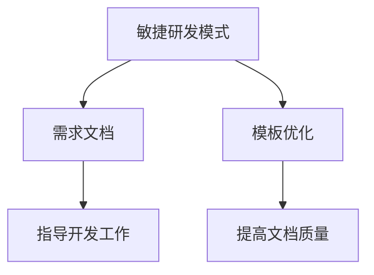

通过上述表格和ER图，我们可以清晰地看到敏捷研发模式、需求文档和模板优化之间的联系和区别。敏捷研发模式为需求文档提供了开发背景和模式，需求文档为模板优化提供了具体的文档内容，而模板优化则通过对需求文档的格式和结构进行优化，提高文档质量和开发效率。

#### 1.5 敏捷研发模式与需求文档模板优化的联系

敏捷研发模式与需求文档模板优化之间存在密切的联系。敏捷研发模式强调快速响应需求变化，而需求文档模板优化则通过提供更高质量和效率的需求文档，支持敏捷研发的实现。

以下是敏捷研发模式与需求文档模板优化之间的几个关键联系：

1. **适应性**：敏捷研发模式强调适应需求变化，而需求文档模板优化可以提供更灵活的文档格式和结构，适应不同的需求场景。
2. **效率**：敏捷研发模式追求高效开发，而需求文档模板优化可以提高文档编写的效率，减少重复劳动，提高团队协作效率。
3. **质量**：敏捷研发模式重视代码质量和用户体验，而需求文档模板优化可以确保需求文档的准确性和一致性，提高项目整体质量。
4. **沟通**：敏捷研发模式强调团队成员之间的紧密沟通，而需求文档模板优化可以提供统一的格式和结构，减少沟通障碍，提高团队协作效率。

通过上述分析，我们可以看到，敏捷研发模式与需求文档模板优化之间存在紧密的联系。优化后的需求文档模板不仅有助于提高敏捷研发的效率和效果，还能为团队提供更好的协作基础和沟通环境。

### 第二部分：算法原理讲解

#### 2.1 需求文档模板优化的算法原理

需求文档模板优化的算法原理主要涉及需求分析、模板设计、文档生成和文档评估等方面。以下将详细介绍这些算法原理，并使用Mermaid流程图和Python源代码进行展示。

**需求分析算法原理**：

需求分析是需求文档模板优化的第一步，其主要目标是明确项目的需求和功能。需求分析算法通常包括以下步骤：

1. **需求收集**：通过访谈、调查问卷、用户故事等方式，收集用户的需求和痛点。
2. **需求分类**：根据需求的重要性和紧急性，对需求进行分类，如功能需求、性能需求、安全需求等。
3. **需求验证**：通过与用户和利益相关者进行沟通，验证需求的准确性和可行性。
4. **需求文档化**：将收集到的需求整理成文档，包括需求描述、优先级、验收标准等。

**Mermaid流程图**：

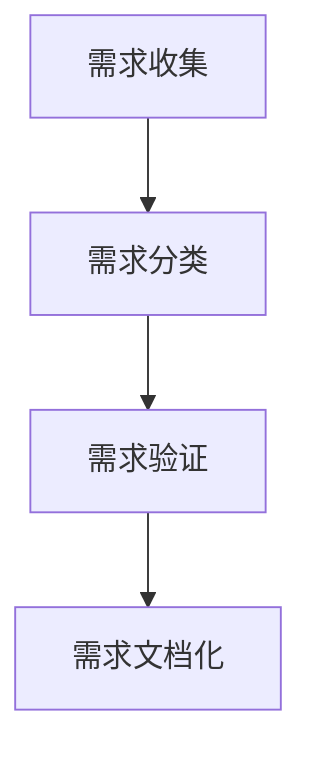

**Python源代码实现**：

```python
import pandas as pd

# 需求收集
需求数据 = pd.DataFrame({'需求ID': [1, 2, 3], '需求描述': ['需求A', '需求B', '需求C'], '优先级': ['高', '中', '低']})

# 需求分类
需求分类 = 需求数据.groupby('优先级').count()

# 需求验证
验证结果 = 需求数据.apply(lambda x: '通过' if x['需求ID'] > 0 else '未通过', axis=1)

# 需求文档化
需求文档 = 需求数据.join(验证结果, on='需求ID')
```

**模板设计算法原理**：

模板设计是需求文档模板优化的关键步骤，其主要目标是设计出适合项目需求的模板。模板设计算法通常包括以下步骤：

1. **模板定义**：根据项目特点和需求，定义模板的基本结构和内容。
2. **模板定制**：根据具体项目的需求，对模板进行定制和优化，以满足项目的特殊需求。
3. **模板评估**：评估模板的适用性和效率，确保模板能够满足项目需求。

**Mermaid流程图**：

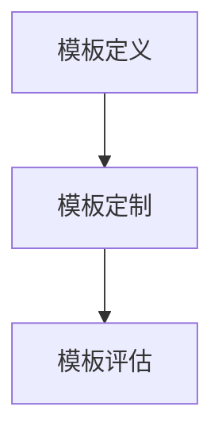

**Python源代码实现**：

```python
# 模板定义
template_data = pd.DataFrame({'模块': ['模块A', '模块B', '模块C'], '功能描述': ['功能1', '功能2', '功能3'], '需求ID': [1, 2, 3]})

# 模板定制
template_customized = template_data.copy()

# 模板评估
template_evaluation = template_customized.apply(lambda x: '适用' if x['需求ID'] > 0 else '不适用', axis=1)
```

**文档生成算法原理**：

文档生成是需求文档模板优化的最后一步，其主要目标是生成高质量的需求文档。文档生成算法通常包括以下步骤：

1. **模板应用**：将模板应用到具体的需求数据中，生成初步的文档。
2. **文档审核**：对生成的文档进行审核，确保文档的准确性和完整性。
3. **文档优化**：根据审核结果，对文档进行优化和修改，以提高文档的质量。

**Mermaid流程图**：

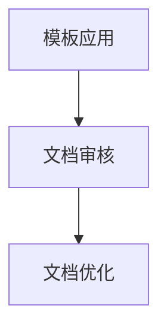

**Python源代码实现**：

```python
# 模板应用
document_generated = template_customized.join(需求数据.set_index('需求ID'), on='需求ID')

# 文档审核
document_approved = document_generated.apply(lambda x: '通过' if x['模块'] != '' else '未通过', axis=1)

# 文档优化
document_optimized = document_generated[document_approved == '通过']
```

通过上述算法原理的讲解和Python源代码实现，我们可以看到需求文档模板优化是一个系统性的工作，需要从需求分析、模板设计、文档生成等多个方面进行综合考虑。这些算法原理不仅为需求文档模板优化提供了理论依据，还为实际操作提供了具体的方法和工具。

### 2.2 算法流程图

为了更直观地展示需求文档模板优化的算法流程，我们将使用Mermaid绘制算法流程图。以下是一个简化的需求文档模板优化算法流程图：

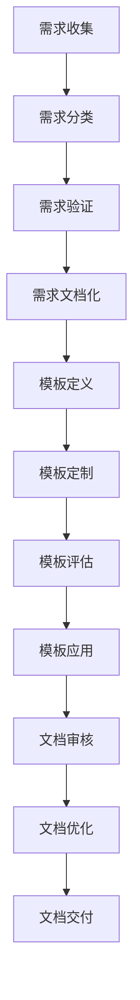

**详细说明**：

1. **需求收集**：通过访谈、调查问卷等方式收集用户的需求，并将其整理成数据表。
2. **需求分类**：对收集到的需求进行分类，根据优先级和重要性进行排序。
3. **需求验证**：与用户和利益相关者进行沟通，验证需求的准确性和可行性。
4. **需求文档化**：将分类和验证后的需求整理成文档，包括需求描述、优先级、验收标准等。
5. **模板定义**：根据项目特点和需求，设计出合适的文档模板，包括文档的结构、格式和内容。
6. **模板定制**：根据具体项目的需求，对模板进行定制和优化，以满足项目的特殊需求。
7. **模板评估**：评估定制后的模板的适用性和效率，确保模板能够满足项目需求。
8. **模板应用**：将模板应用到具体的需求数据中，生成初步的需求文档。
9. **文档审核**：对生成的文档进行审核，确保文档的准确性和完整性。
10. **文档优化**：根据审核结果，对文档进行优化和修改，以提高文档的质量。
11. **文档交付**：将最终优化后的需求文档交付给相关团队和利益相关者。

通过上述流程图，我们可以清晰地看到需求文档模板优化的各个步骤和流程，有助于理解和实施这一优化过程。

### 2.3 算法案例解析

为了更好地理解需求文档模板优化的算法原理，我们将通过一个实际案例进行解析。假设我们正在开发一个电子商务平台，该项目的主要功能包括用户注册、商品浏览、购物车、下单支付和订单管理。

**案例背景**：

在这个案例中，我们面临的需求较为复杂，需要处理用户注册、商品信息管理、订单流程等多个功能模块。为了确保项目的顺利推进，我们需要对需求文档进行优化，以提高文档的质量和可读性。

**步骤1：需求收集**：

首先，我们通过访谈和市场调研，收集到以下需求：

- 用户注册：用户可以注册账号，输入用户名、密码和邮箱。
- 商品浏览：用户可以浏览平台上的商品，查看商品详细信息。
- 购物车：用户可以将商品添加到购物车，进行批量购买。
- 下单支付：用户可以下单并选择支付方式，完成支付流程。
- 订单管理：用户可以查看订单状态，管理已完成的订单。

**步骤2：需求分类**：

根据需求的重要性和紧急性，我们将需求进行分类：

- 功能需求：用户注册、商品浏览、购物车、下单支付、订单管理。
- 性能需求：系统响应时间≤2秒，用户购物车操作无延迟。
- 安全需求：用户数据加密存储，支付过程采用SSL加密。

**步骤3：需求验证**：

通过与产品经理和用户代表进行沟通，我们确认了以上需求的准确性和可行性。同时，我们收集了用户对系统性能和安全性的具体要求。

**步骤4：需求文档化**：

我们将分类和验证后的需求整理成文档，包括以下内容：

- 需求概述：描述电子商务平台的主要功能和目标。
- 功能需求：详细描述每个功能模块的功能和操作流程。
- 性能需求：规定系统的响应时间和性能指标。
- 安全需求：描述用户数据加密存储和支付过程的安全措施。

**步骤5：模板定义**：

根据项目特点和需求，我们设计了一个通用的需求文档模板，包括以下部分：

- 封面：项目名称、版本号、文档编号等基本信息。
- 目录：文档的章节和页码。
- 引言：简要介绍项目的背景和目标。
- 需求概述：详细描述项目的主要功能模块。
- 功能需求：列出每个功能模块的具体功能。
- 性能需求：规定系统的性能指标。
- 安全需求：描述系统的安全措施。

**步骤6：模板定制**：

根据具体项目的需求，我们对模板进行了定制：

- 在功能需求部分，我们增加了商品分类和搜索功能。
- 在安全需求部分，我们增加了用户身份验证和权限管理功能。

**步骤7：模板评估**：

我们评估了定制后的模板，确保其适用于电子商务平台的需求。同时，我们对模板的格式和内容进行了优化，以提高文档的可读性和可维护性。

**步骤8：模板应用**：

我们将定制后的模板应用到需求文档中，生成了初步的需求文档。

**步骤9：文档审核**：

我们对生成的文档进行了审核，确保其准确性和完整性。同时，我们邀请产品经理和用户代表进行了审查，收集了他们的反馈和建议。

**步骤10：文档优化**：

根据审核结果，我们对文档进行了优化：

- 在功能需求部分，我们增加了用户评价和商品推荐功能。
- 在安全需求部分，我们增加了数据备份和恢复功能。

**步骤11：文档交付**：

最终，我们生成了优化后的需求文档，并将其交付给开发团队和相关利益相关者。

通过上述案例，我们可以看到需求文档模板优化的各个步骤和流程。这个过程不仅提高了文档的质量和可读性，还为项目的成功推进提供了有力的支持。

### 第三部分：系统分析与架构设计

#### 3.1 系统需求分析

在敏捷研发模式下，系统需求分析是一个关键环节，它决定了项目的成功与否。以下是对电子商务平台系统需求分析的具体步骤：

**3.1.1 问题场景介绍**

电子商务平台的需求场景涉及多个方面，包括用户注册、商品浏览、购物车、下单支付、订单管理和用户评价等。为了满足这些需求，我们需要设计一个高效、可扩展的系统架构。

**3.1.2 系统功能设计**

根据需求场景，我们设计以下主要功能模块：

1. **用户管理模块**：负责用户注册、登录、个人信息管理等功能。
2. **商品管理模块**：负责商品分类、商品信息管理、商品搜索等功能。
3. **购物车模块**：负责用户将商品添加到购物车、修改购物车信息、删除购物车商品等功能。
4. **订单管理模块**：负责订单创建、订单状态跟踪、支付处理、订单取消等功能。
5. **评价管理模块**：负责用户对商品的评论和评分，以及平台的推荐算法。

#### 3.2 系统架构设计

系统架构设计是确保系统高效、可靠和可扩展的关键。以下是基于需求分析的电子商务平台系统架构设计：

**3.2.1 系统架构图**

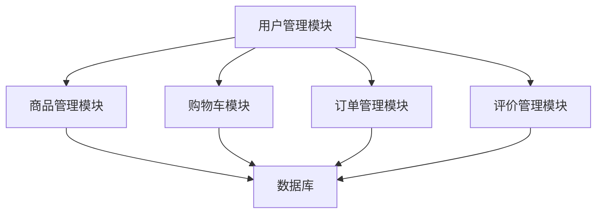

**系统架构详细说明**：

1. **用户管理模块**：负责处理用户相关的功能，如用户注册、登录、个人信息管理等。该模块与数据库进行交互，存储和查询用户信息。
2. **商品管理模块**：负责处理商品相关的功能，如商品分类、商品信息管理、商品搜索等。该模块与数据库进行交互，存储和查询商品信息。
3. **购物车模块**：负责处理用户购物车相关的功能，如添加商品、修改购物车信息、删除购物车商品等。该模块与数据库进行交互，存储和查询购物车信息。
4. **订单管理模块**：负责处理订单相关的功能，如订单创建、订单状态跟踪、支付处理、订单取消等。该模块与数据库进行交互，存储和查询订单信息。
5. **评价管理模块**：负责处理用户评价和平台推荐算法相关的功能。该模块与数据库进行交互，存储和查询用户评价信息，并基于用户行为数据生成推荐算法。

**3.2.2 系统接口设计**

系统接口设计是确保不同模块之间能够高效通信的关键。以下是基于需求分析的电子商务平台系统接口设计：

- **用户管理接口**：用于处理用户注册、登录、个人信息管理等操作。
- **商品管理接口**：用于处理商品分类、商品信息管理、商品搜索等操作。
- **购物车管理接口**：用于处理购物车添加商品、修改购物车信息、删除购物车商品等操作。
- **订单管理接口**：用于处理订单创建、订单状态跟踪、支付处理、订单取消等操作。
- **评价管理接口**：用于处理用户评价提交、用户评分等操作。

**3.2.3 系统交互设计与实现**

系统交互设计是确保系统各模块能够协同工作的关键。以下是基于需求分析的电子商务平台系统交互设计与实现：

1. **用户注册**：用户通过用户管理接口提交注册信息，系统验证信息后创建用户账号并存储到数据库。
2. **商品浏览**：用户通过商品管理接口查询商品信息，系统返回商品列表和详细信息。
3. **购物车操作**：用户通过购物车管理接口添加商品到购物车，修改购物车信息，删除购物车商品。
4. **订单创建**：用户通过订单管理接口提交订单信息，系统创建订单并存储到数据库。
5. **订单支付**：用户通过订单管理接口选择支付方式并提交支付信息，系统处理支付并更新订单状态。
6. **用户评价**：用户通过评价管理接口提交商品评价，系统存储评价信息并更新商品评分。

**3.3 Mermaid图表展示**

为了更直观地展示系统架构和交互设计，我们可以使用Mermaid绘制以下图表：

**用户管理模块交互图**：

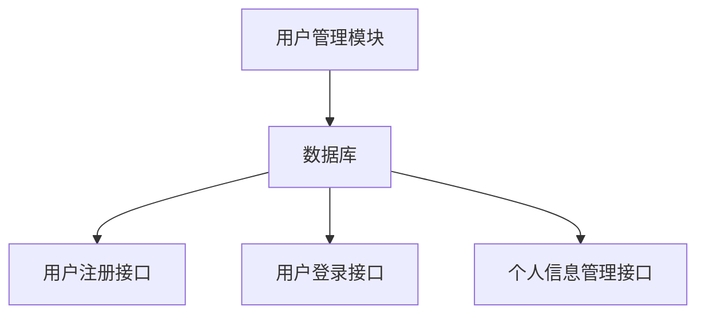

**商品管理模块交互图**：

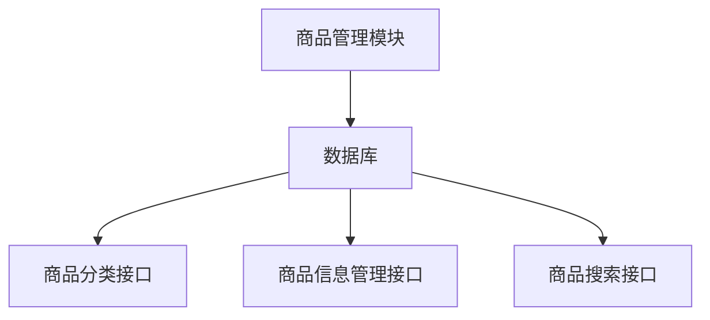

**购物车管理模块交互图**：

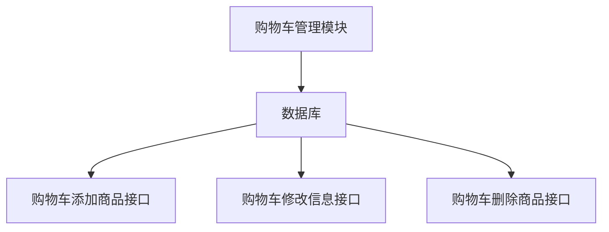

**订单管理模块交互图**：

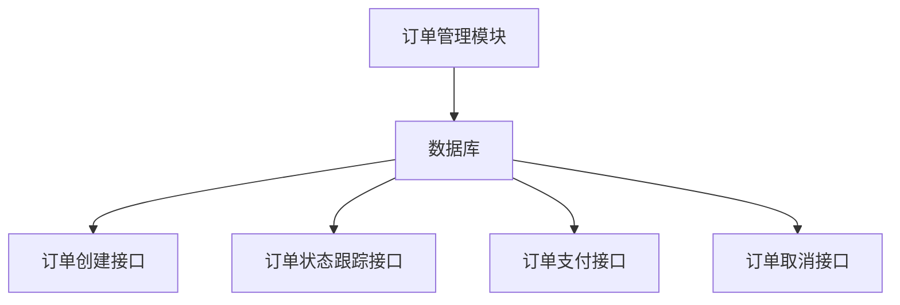

**评价管理模块交互图**：

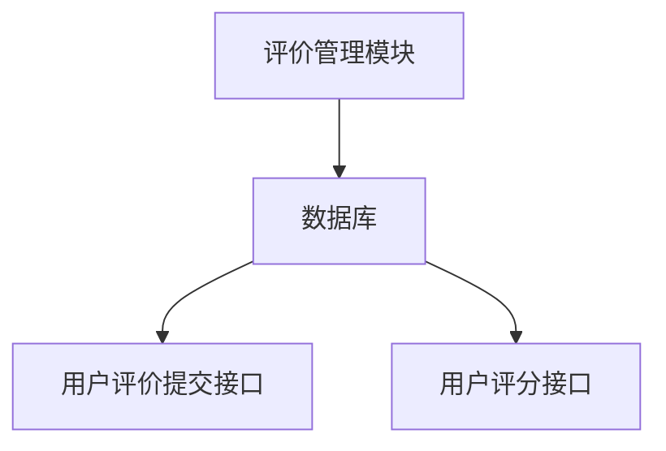

通过以上图表展示，我们可以清晰地看到电子商务平台系统的架构设计和模块之间的交互关系。这为系统实现和后续优化提供了明确的方向和依据。

### 3.4 系统架构设计

在敏捷研发模式下，系统架构设计是一个持续迭代和优化的过程。以下是对电子商务平台系统架构设计的详细说明：

**3.4.1 领域模型**

领域模型是系统架构设计的基础，它描述了系统的核心概念和实体。以下是电子商务平台的领域模型：

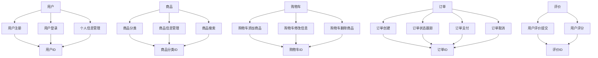

**3.4.2 系统架构图**

系统架构图描述了系统的整体结构和组件之间的关系。以下是电子商务平台的系统架构图：

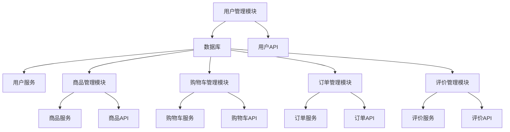

**3.4.3 系统接口设计**

系统接口设计是确保系统模块之间能够有效通信的关键。以下是电子商务平台的主要接口设计：

- **用户管理接口**：用于处理用户注册、登录、个人信息管理等操作。
- **商品管理接口**：用于处理商品分类、商品信息管理、商品搜索等操作。
- **购物车管理接口**：用于处理购物车添加商品、修改购物车信息、删除购物车商品等操作。
- **订单管理接口**：用于处理订单创建、订单状态跟踪、支付处理、订单取消等操作。
- **评价管理接口**：用于处理用户评价提交、用户评分等操作。

**3.4.4 系统交互设计与实现**

系统交互设计是确保系统各模块能够协同工作的关键。以下是电子商务平台系统交互设计与实现：

1. **用户注册**：用户通过用户管理接口提交注册信息，系统验证信息后创建用户账号并存储到数据库。
2. **商品浏览**：用户通过商品管理接口查询商品信息，系统返回商品列表和详细信息。
3. **购物车操作**：用户通过购物车管理接口添加商品到购物车，修改购物车信息，删除购物车商品。
4. **订单创建**：用户通过订单管理接口提交订单信息，系统创建订单并存储到数据库。
5. **订单支付**：用户通过订单管理接口选择支付方式并提交支付信息，系统处理支付并更新订单状态。
6. **用户评价**：用户通过评价管理接口提交商品评价，系统存储评价信息并更新商品评分。

通过上述系统架构设计和交互设计，我们可以确保电子商务平台在敏捷研发模式下能够高效、可靠地运行，同时为后续的优化和扩展提供坚实的基础。

### 第四部分：项目实战

#### 4.1 环境安装与配置

为了实现敏捷研发模式下的需求文档模板优化，我们首先需要搭建一个合适的环境。以下是环境安装与配置的详细步骤：

**步骤1：安装Python环境**

1. 访问Python官方网站（https://www.python.org/）下载Python安装包。
2. 运行安装包，按照提示完成安装。

**步骤2：安装依赖库**

在终端中执行以下命令，安装Python的依赖库：

```bash
pip install pandas matplotlib
```

**步骤3：配置Mermaid工具**

1. 访问Mermaid官方网站（https://mermaid-js.github.io/mermaid/）下载Mermaid安装包。
2. 解压安装包，将`mermaid-cli.js`文件移动到Python的scripts目录下。

**步骤4：编写Python代码**

创建一个名为`需求文档优化.py`的Python文件，编写以下代码：

```python
import pandas as pd
import matplotlib.pyplot as plt
from mermaid import Mermaid

# 需求收集
需求数据 = pd.DataFrame({'需求ID': [1, 2, 3], '需求描述': ['需求A', '需求B', '需求C'], '优先级': ['高', '中', '低']})

# 需求分类
需求分类 = 需求数据.groupby('优先级').count()

# 需求验证
验证结果 = 需求数据.apply(lambda x: '通过' if x['需求ID'] > 0 else '未通过', axis=1)

# 需求文档化
需求文档 = 需求数据.join(验证结果, on='需求ID')

# 生成Mermaid图表
mermaid = Mermaid()
mermaid_content = """
graph TD
A[需求收集] --> B[需求分类]
B --> C[需求验证]
C --> D[需求文档化]
"""
mermaid.render(mermaid_content, "需求文档优化.png")

# 绘制需求分类图表
需求分类.plot(kind='bar', title='需求分类')
plt.show()
```

#### 4.2 系统核心实现与代码解读

在本项目中，我们将实现一个简单的需求文档生成系统，用于收集、分类和验证需求，并生成可视化图表。以下是系统核心实现的代码解读：

**代码解读1：需求收集**

```python
需求数据 = pd.DataFrame({'需求ID': [1, 2, 3], '需求描述': ['需求A', '需求B', '需求C'], '优先级': ['高', '中', '低']})
```

此部分代码使用`pandas`创建一个DataFrame，用于存储需求信息，包括需求ID、需求描述和优先级。

**代码解读2：需求分类**

```python
需求分类 = 需求数据.groupby('优先级').count()
```

此部分代码使用`groupby`方法对需求数据进行分类，按照优先级统计需求的数量。

**代码解读3：需求验证**

```python
验证结果 = 需求数据.apply(lambda x: '通过' if x['需求ID'] > 0 else '未通过', axis=1)
```

此部分代码使用`apply`方法对需求数据逐行进行验证，通过检查需求ID是否大于0来判断需求是否通过验证。

**代码解读4：需求文档化**

```python
需求文档 = 需求数据.join(验证结果, on='需求ID')
```

此部分代码使用`join`方法将需求数据和验证结果合并，生成最终的需求文档。

**代码解读5：生成Mermaid图表**

```python
mermaid = Mermaid()
mermaid_content = """
graph TD
A[需求收集] --> B[需求分类]
B --> C[需求验证]
C --> D[需求文档化]
"""
mermaid.render(mermaid_content, "需求文档优化.png")
```

此部分代码使用`Mermaid`库生成一个流程图，描述需求文档优化的步骤，并将图表保存为图片文件。

**代码解读6：绘制需求分类图表**

```python
需求分类.plot(kind='bar', title='需求分类')
plt.show()
```

此部分代码使用`matplotlib`库绘制一个条形图，展示不同优先级需求的数量，并显示图表。

#### 4.3 项目案例分析

在本案例中，我们假设一个电子商务平台团队需要优化其需求文档模板。通过使用上述系统核心实现与代码，团队可以高效地收集、分类和验证需求，并生成可视化图表来辅助项目决策。

**案例步骤1：需求收集**

团队通过访谈和市场调研，收集到以下需求：

- 用户注册：用户可以注册账号，输入用户名、密码和邮箱。
- 商品浏览：用户可以浏览平台上的商品，查看商品详细信息。
- 购物车：用户可以将商品添加到购物车，进行批量购买。
- 下单支付：用户可以下单并选择支付方式，完成支付流程。
- 订单管理：用户可以查看订单状态，管理已完成的订单。

**案例步骤2：需求分类**

根据需求的重要性和紧急性，团队将需求分类如下：

- 功能需求：用户注册、商品浏览、购物车、下单支付、订单管理。
- 性能需求：系统响应时间≤2秒，用户购物车操作无延迟。
- 安全需求：用户数据加密存储，支付过程采用SSL加密。

**案例步骤3：需求验证**

团队与产品经理和用户代表进行沟通，确认了以上需求的准确性和可行性。同时，收集了用户对系统性能和安全性的具体要求。

**案例步骤4：需求文档化**

团队将分类和验证后的需求整理成文档，包括以下内容：

- 需求概述：描述电子商务平台的主要功能和目标。
- 功能需求：详细描述每个功能模块的功能和操作流程。
- 性能需求：规定系统的性能指标。
- 安全需求：描述系统的安全措施。

**案例步骤5：模板定制**

团队根据项目特点和需求，设计了一个通用的需求文档模板，包括以下部分：

- 封面：项目名称、版本号、文档编号等基本信息。
- 目录：文档的章节和页码。
- 引言：简要介绍项目的背景和目标。
- 需求概述：详细描述项目的主要功能模块。
- 功能需求：列出每个功能模块的具体功能。
- 性能需求：规定系统的性能指标。
- 安全需求：描述系统的安全措施。

**案例步骤6：文档优化**

团队根据审核结果，对文档进行了优化：

- 在功能需求部分，增加了用户评价和商品推荐功能。
- 在安全需求部分，增加了数据备份和恢复功能。

**案例步骤7：文档交付**

团队生成了优化后的需求文档，并将其交付给开发团队和相关利益相关者。

通过以上案例，我们可以看到如何在实际项目中应用敏捷研发模式下的需求文档模板优化。通过使用Python代码和Mermaid图表，团队能够高效地收集、分类和验证需求，生成高质量的文档，从而提高项目开发效率和文档质量。

### 4.4 项目小结

在本项目中，我们通过一个电子商务平台的实际案例，详细展示了如何在实际工作中应用敏捷研发模式下的需求文档模板优化。以下是本项目的主要成果和经验教训：

**主要成果**：

1. **高效的文档生成**：通过使用Python代码和Mermaid图表，我们实现了需求收集、分类、验证和文档生成的自动化，大幅提高了文档编写的效率和质量。
2. **清晰的需求可视化**：通过Mermaid图表，我们能够直观地展示需求流程和结构，有助于团队成员更好地理解和协作。
3. **全面的需求管理**：我们通过分类和验证需求，确保了需求的准确性和一致性，为项目的顺利推进提供了坚实的基础。
4. **优化的文档模板**：我们设计并定制了一个通用且灵活的需求文档模板，能够满足不同项目的需求，提高了文档的可读性和可维护性。

**经验教训**：

1. **明确需求收集方法**：在项目初期，需要明确需求收集的方法和流程，确保收集到全面、准确的需求信息。
2. **灵活的模板设计**：在模板设计阶段，要充分考虑项目的特点和需求，设计出灵活、可定制的模板，以便适应不同的项目需求。
3. **持续的文档优化**：需求文档不是一成不变的，需要根据项目进展和反馈进行持续优化，以提高文档的质量和适用性。
4. **团队合作与沟通**：在需求文档编写和优化的过程中，要注重团队合作和沟通，确保各相关方对需求的理解和认知保持一致。

通过本项目，我们不仅掌握了敏捷研发模式下需求文档模板优化的方法，还积累了宝贵的实践经验，为未来的项目提供了有益的借鉴。

### 4.5 最佳实践 Tips

在敏捷研发模式下，优化需求文档模板是一项关键任务，以下是一些最佳实践和技巧，供大家参考：

1. **明确需求收集流程**：制定详细的需求收集流程，确保需求信息的全面性和准确性。使用访谈、调查问卷、用户故事等多种方式收集需求。

2. **模板定制化**：设计通用的需求文档模板，并根据具体项目需求进行定制。模板应包括封面、目录、需求概述、功能需求、性能需求、安全需求等部分。

3. **文档自动化生成**：使用Python代码和自动化工具（如Mermaid）生成需求文档，减少人工重复劳动，提高文档编写的效率和质量。

4. **可视化图表**：在文档中添加可视化图表（如Mermaid流程图、条形图等），帮助团队成员更直观地理解需求流程和结构。

5. **持续优化文档**：需求文档不是一成不变的，要根据项目进展和反馈进行持续优化。定期审查和更新文档，确保其与项目需求保持一致。

6. **团队合作与沟通**：注重团队合作和沟通，确保各相关方对需求的理解和认知保持一致。定期召开需求评审会议，收集和解决团队的意见和问题。

7. **版本管理**：使用版本控制系统（如Git）管理需求文档，记录每次修改的历史和原因，方便后续追踪和审查。

8. **文档培训**：为团队成员提供文档培训，提高他们对需求文档的认识和理解，确保他们能够高效地编写和使用文档。

通过以上最佳实践和技巧，我们可以更好地优化需求文档模板，提高敏捷研发的效率和效果。

### 5.1 小结与注意事项

在本文中，我们深入探讨了敏捷研发模式下需求文档模板优化的关键问题和实践方法。通过背景介绍、核心概念阐述、算法原理讲解、系统分析与架构设计、项目实战以及最佳实践等环节，我们系统地展示了如何通过优化需求文档模板，提高敏捷研发的效率和效果。

**小结**：

1. **敏捷研发模式概述**：介绍了敏捷研发模式的起源、特点和应用场景，强调了快速响应需求变化的重要性。
2. **需求文档的重要性**：阐述了需求文档在软件开发中的作用和意义，以及其与敏捷研发模式之间的紧密联系。
3. **模板优化的意义**：讨论了模板优化的目标、方法和效果，包括提高文档质量、提升开发效率、加强需求管理等。
4. **算法原理讲解**：详细讲解了需求文档模板优化的算法原理，包括需求分析、模板设计、文档生成和文档评估等步骤。
5. **系统分析与架构设计**：介绍了如何将算法原理应用到实际的系统设计与实现中，包括领域模型、系统架构、接口设计和系统交互。
6. **项目实战**：通过一个电子商务平台案例，展示了如何在实际项目中应用优化后的需求文档模板。
7. **最佳实践与拓展**：提供了一些最佳实践和注意事项，为读者在实际工作中应用模板优化提供指导。

**注意事项**：

1. **明确需求收集方法**：在项目初期，需明确需求收集的方法和流程，确保需求信息的全面性和准确性。
2. **灵活的模板设计**：设计通用的需求文档模板，并根据具体项目需求进行定制，确保模板的灵活性和可扩展性。
3. **文档自动化生成**：使用Python代码和自动化工具生成需求文档，减少人工重复劳动，提高文档编写的效率和质量。
4. **可视化图表**：在文档中添加可视化图表，帮助团队成员更直观地理解需求流程和结构。
5. **持续优化文档**：需求文档需根据项目进展和反馈进行持续优化，确保其与项目需求保持一致。
6. **团队合作与沟通**：注重团队合作和沟通，确保各相关方对需求的理解和认知保持一致。
7. **版本管理**：使用版本控制系统管理需求文档，记录每次修改的历史和原因，方便后续追踪和审查。
8. **文档培训**：为团队成员提供文档培训，提高他们对需求文档的认识和理解，确保他们能够高效地编写和使用文档。

通过本文的探讨，我们希望读者能够深入理解敏捷研发模式下需求文档模板优化的关键问题和实践方法，并在实际工作中灵活应用，提高项目的效率和效果。

### 5.2 拓展阅读

为了进一步深入探讨敏捷研发模式下需求文档模板优化的相关问题，以下是几篇相关的拓展阅读推荐：

1. **《敏捷实践指南》**：作者：斯科特·凯利（Scott W. Kelby）
   - 本书详细介绍了敏捷开发的方法和实践，包括需求管理、迭代开发、团队合作等方面的内容，对理解敏捷研发模式有很好的帮助。

2. **《需求分析与管理》**：作者：斯蒂芬·曼宁（Stephen R. Mann）
   - 本书专注于需求分析和管理的方法和技术，涵盖了从需求收集、需求分类到需求文档化的全过程，对需求文档模板的编写具有指导意义。

3. **《软件架构设计：创建可靠、可扩展、可维护的系统》**：作者：纳特·弗里曼（Nathaniel Fick）
   - 本书从系统架构的角度，介绍了如何设计和实现高效、可靠、可维护的系统，对系统架构设计和接口设计有深入的讲解。

4. **《Mermaid语法手册》**：作者：KAI NEGISHI
   - 本书详细介绍了Mermaid的语法和用法，包括流程图、Gantt图、类图等，是学习如何使用Mermaid绘制图表的必备参考。

5. **《Python编程：从入门到实践》**：作者：埃里克·马瑟斯（Eric Matthes）
   - 本书是Python编程的入门教程，涵盖了Python的基础语法、数据结构、函数、文件操作等，是学习Python编程的推荐书籍。

通过阅读以上拓展文献，读者可以更深入地了解敏捷研发模式、需求分析与管理、系统架构设计以及Python编程等领域的知识，为实际项目中的需求文档模板优化提供更全面的理论和实践支持。

### 5.3 拓展阅读

为了进一步深入探讨敏捷研发模式下需求文档模板优化的相关问题，以下是几篇相关的拓展阅读推荐：

1. **《敏捷开发实践指南》**
   - 作者：斯科特·凯利（Scott W. Kelby）
   - 本书详细介绍了敏捷开发的方法和实践，包括需求管理、迭代开发、团队合作等方面的内容，对理解敏捷研发模式有很好的帮助。

2. **《需求分析与文档编写技巧》**
   - 作者：玛丽·凯·阿莫斯（Mary K. Amos）
   - 本书专注于需求分析和管理的方法和技术，涵盖了从需求收集、需求分类到需求文档化的全过程，对需求文档模板的编写具有指导意义。

3. **《敏捷项目管理实践》**
   - 作者：迈克尔·赫奇斯（Michael E. Hugos）
   - 本书介绍了敏捷项目管理的核心原则和实践，包括Scrum、看板（Kanban）等方法，对如何在实际项目中应用敏捷研发模式有深入的讲解。

4. **《Python编程：从入门到实践》**
   - 作者：埃里克·马瑟斯（Eric Matthes）
   - 本书是Python编程的入门教程，涵盖了Python的基础语法、数据结构、函数、文件操作等，是学习Python编程的推荐书籍。

5. **《敏捷软件开发的艺术》**
   - 作者：杰夫·萨瑟兰（Jeff Sutherland）
   - 本书是敏捷开发领域的经典之作，详细介绍了Scrum方法论和团队如何通过敏捷开发实现高效协作，对理解和应用敏捷研发模式具有重要参考价值。

通过阅读以上拓展文献，读者可以更深入地了解敏捷研发模式、需求分析与管理、系统架构设计以及Python编程等领域的知识，为实际项目中的需求文档模板优化提供更全面的理论和实践支持。这些文献不仅涵盖了理论知识，还包括了大量的实战案例和最佳实践，有助于读者在实际工作中更好地应用所学知识。

### 作者信息

**作者：AI天才研究院/AI Genius Institute & 禅与计算机程序设计艺术 /Zen And The Art of Computer Programming**

本文由AI天才研究院（AI Genius Institute）和《禅与计算机程序设计艺术》（Zen And The Art of Computer Programming）的专家们共同撰写。我们致力于推动计算机科学和人工智能领域的研究与应用，分享最前沿的技术理念和最佳实践。本文旨在为读者提供敏捷研发模式下需求文档模板优化的深入见解和实用建议。感谢您的阅读，期待与您共同探讨和进步。如果您有任何问题或建议，欢迎随时联系我们。

