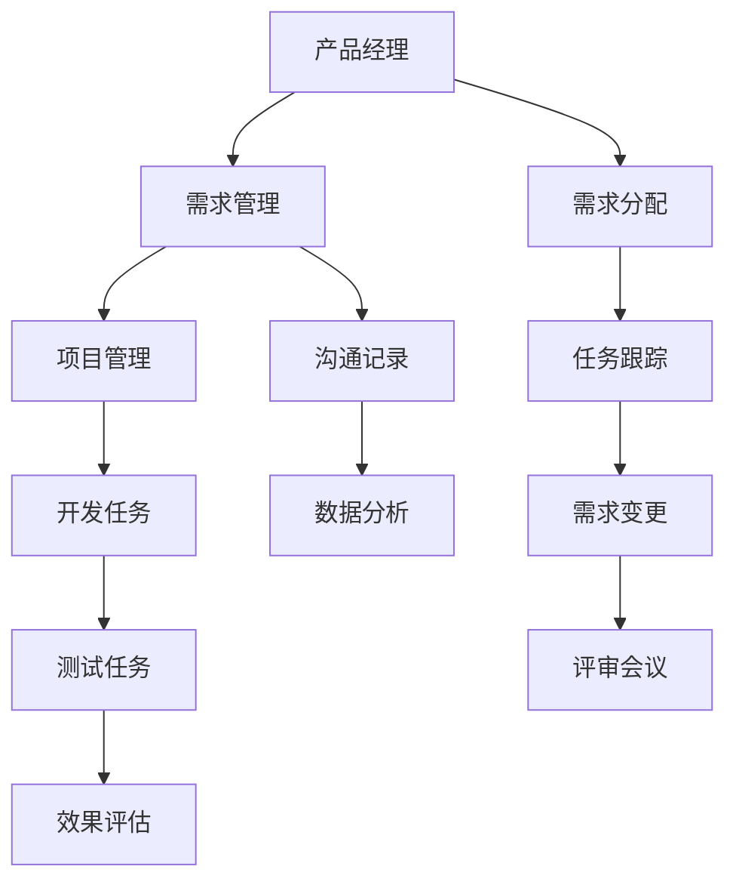
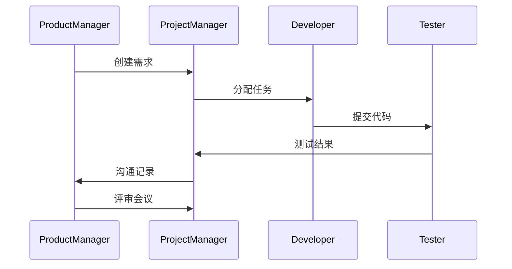

                 

### 第1章 问题背景与核心概念

#### 1.1 问题背景

敏捷研发模式起源于20世纪90年代，是对传统瀑布式开发模式的反思和改进。随着软件项目的复杂性和不确定性不断增加，敏捷开发因其灵活性和高效性，逐渐成为软件开发领域的主流方法。敏捷开发强调迭代、协作和快速反馈，其核心原则包括个体和互动重于过程与工具、可工作的软件重于详尽的文档、客户合作重于合同谈判、响应变化重于遵循计划等。

在敏捷研发模式下，需求沟通显得尤为重要。需求沟通是敏捷开发过程中的核心环节，贯穿于整个项目周期。有效的需求沟通不仅能够确保项目团队成员对需求的准确理解和执行，还能显著提升项目的成功率。然而，在实际操作中，需求沟通常常面临诸多挑战，如信息传递不畅、需求变更频繁、沟通成本高等。

##### 1.1.1 敏捷研发模式概述

敏捷研发模式的起源可以追溯到1999年，当时一群软件开发者发布了《敏捷宣言》。这份宣言提出了敏捷开发的核心理念，并逐渐形成了一系列敏捷开发实践，如Scrum、Kanban、XP（极限编程）等。敏捷开发的主要特点是迭代性、灵活性和协同工作。

1. **迭代性**：敏捷开发将项目分解为多个短周期的迭代，每个迭代都会产生一个可交付的版本。这种方式能够快速响应市场需求和变化，确保项目始终与用户需求保持一致。

2. **灵活性**：敏捷开发注重项目的灵活调整，允许在开发过程中随时调整计划、需求和资源分配。这种灵活性有助于降低项目风险，提高开发效率。

3. **协同工作**：敏捷开发强调团队成员之间的紧密协作，通过日常站会、回顾会议等机制，确保所有人对项目进展和问题有共同的理解。

##### 1.1.2 需求沟通的重要性

在敏捷研发模式下，需求沟通不仅是项目成功的保障，也是团队协作的核心。以下是需求沟通的重要性和作用：

1. **确保需求理解一致**：通过有效的需求沟通，确保所有项目团队成员对需求有清晰、一致的理解，避免因理解偏差导致的开发错误。

2. **提升团队协作效率**：良好的需求沟通有助于团队成员更好地协同工作，减少因沟通不畅导致的时间浪费和重复劳动。

3. **及时反馈和调整**：敏捷开发强调快速反馈和调整，有效的需求沟通能够帮助团队及时发现和解决问题，确保项目按计划推进。

##### 1.1.3 需求沟通存在的问题与挑战

尽管需求沟通在敏捷研发模式中至关重要，但在实际操作中仍然面临以下问题与挑战：

1. **信息传递不畅**：由于项目规模和团队结构复杂，信息在传递过程中容易失真或延误。

2. **需求变更频繁**：敏捷开发强调快速响应变化，但频繁的需求变更可能导致项目进度不稳定，增加沟通成本。

3. **沟通成本高**：高效的需求沟通需要投入大量时间和精力，尤其是在大型项目或跨部门协作中，沟通成本可能非常高。

#### 1.2 需求沟通效果评估的意义

需求沟通效果评估是衡量需求沟通有效性的重要手段。它不仅能够帮助团队识别和改进沟通过程中的问题，还能为项目管理和决策提供依据。以下是需求沟通效果评估的几个关键点：

##### 1.2.1 需求沟通效果评估的定义

需求沟通效果评估是指通过对需求沟通的过程和结果进行系统分析，评估其有效性和效率，并提出改进建议的过程。

##### 1.2.2 需求沟通效果评估的目的与意义

1. **提高沟通效率**：通过评估需求沟通的效果，可以识别出沟通中的瓶颈和障碍，采取相应的措施提高沟通效率。

2. **确保需求理解一致**：评估结果可以揭示团队成员对需求理解的一致性程度，确保项目按预期执行。

3. **支持项目决策**：需求沟通效果评估为项目决策提供数据支持，有助于团队在资源分配、进度安排等方面做出更明智的决策。

4. **持续改进**：通过定期的需求沟通效果评估，团队可以不断优化沟通流程和方法，提升整体项目质量。

#### 1.3 核心概念

##### 1.3.1 敏捷研发模式下的需求沟通

敏捷研发模式下的需求沟通具有以下特点：

1. **频繁反馈**：敏捷开发强调快速反馈，需求沟通也要求团队在迭代过程中频繁交流，确保需求得到及时反馈和调整。

2. **透明度**：需求沟通过程应保持透明，所有团队成员都能清晰了解项目的进展和状态，避免信息孤岛。

3. **跨职能协作**：需求沟通不仅仅是开发团队内部的事务，还涉及产品经理、测试团队等跨职能部门的协作。

##### 1.3.2 需求沟通效果评估方法

敏捷研发模式下的需求沟通效果评估方法主要包括以下几种：

1. **定量评估**：通过量化指标（如沟通频率、响应时间、需求变更率等）来评估需求沟通的效果。

2. **定性评估**：通过访谈、问卷调查、观察等方法，从质量角度评估需求沟通的效果。

3. **综合评估**：结合定量和定性评估方法，对需求沟通进行全面评估。

##### 1.3.3 需求沟通效果评估的边界与外延

1. **边界**：需求沟通效果评估主要关注沟通的过程和结果，不涉及具体的技术实现和业务逻辑。

2. **外延**：需求沟通效果评估可以应用于不同规模和类型的敏捷开发项目，如小型项目、大型项目、跨部门协作项目等。

#### 1.4 本章小结

本章首先介绍了敏捷研发模式及其需求沟通的重要性，随后阐述了需求沟通效果评估的定义和意义。通过对核心概念的梳理，我们明确了敏捷研发模式下需求沟通的特点和评估方法。本章内容为后续章节的讨论奠定了基础。

### 第2章 核心概念原理

#### 2.1 需求沟通原理

##### 2.1.1 需求沟通的基本原理

需求沟通是软件开发过程中的核心环节，其基本原理包括以下几个方面：

1. **信息的传递与理解**：需求沟通的核心在于信息的传递和接收，确保项目团队成员对需求的理解是一致的。

2. **明确的目标和期望**：有效的需求沟通需要明确项目的目标和期望，确保所有团队成员都朝着共同的目标努力。

3. **及时的反馈和调整**：敏捷开发强调快速反馈和调整，需求沟通也要保证信息传递的及时性，以便及时发现问题并进行调整。

##### 2.1.2 需求沟通的策略与技巧

为了提高需求沟通的效果，可以采用以下策略与技巧：

1. **使用简单清晰的语言**：避免使用专业术语或复杂的语言，以确保所有团队成员都能理解。

2. **建立有效的沟通渠道**：根据项目特点和团队结构，选择合适的沟通渠道（如邮件、即时通讯、会议等），并确保这些渠道的高效性。

3. **定期沟通和回顾**：通过定期的沟通和回顾会议，确保项目团队成员对需求的理解和项目进展有共同的认识。

#### 2.2 效果评估原理

##### 2.2.1 效果评估的基本原理

效果评估是一种系统性的分析方法，其基本原理包括：

1. **明确评估目标和标准**：在进行效果评估之前，需要明确评估的目标和标准，以便有针对性地进行评估。

2. **数据收集与处理**：通过收集相关数据，并对其进行处理和分析，得出评估结果。

3. **结果反馈与改进**：将评估结果反馈给相关团队成员，并根据评估结果进行改进。

##### 2.2.2 效果评估方法与技术

效果评估的方法和技术多种多样，常见的包括：

1. **定量评估**：通过量化指标（如响应时间、沟通频率等）来评估效果。

2. **定性评估**：通过访谈、问卷调查、观察等定性方法来评估效果。

3. **综合评估**：结合定量和定性评估方法，进行全面评估。

#### 2.3 概念属性特征对比表格

以下是一个简化的需求沟通与效果评估的概念属性特征对比表格：

| 概念       | 特征                           |
|------------|--------------------------------|
| 需求沟通   | 信息的传递与理解               |
|            | 目标和期望的明确               |
|            | 定期沟通和回顾                 |
| 效果评估   | 明确评估目标和标准             |
|            | 数据收集与处理                 |
|            | 结果反馈与改进                 |

#### 2.4 ER实体关系图架构

需求沟通与效果评估的ER实体关系图如下所示：

```mermaid
erDiagram
    ProductManager ||--|{ Requirement : 管理需求 }
    ProjectManager ||--|{ Requirement : 管理需求 }
    Developer      ||--|{ Requirement : 实现需求 }
    Tester         ||--|{ Requirement : 测试需求 }

    Requirement ||--|{ Evaluation : 评估需求效果 }

    ProductManager ||--|{ Project : 管理项目 }
    ProjectManager ||--|{ Project : 管理项目 }
    Developer      ||--|{ Project : 参与项目 }
    Tester         ||--|{ Project : 参与项目 }
```

通过上述ER图，我们可以清晰地看到需求沟通和效果评估之间的关系，以及不同角色在其中的角色和职责。

### 第3章 敏捷研发模式下的需求沟通效果评估算法

#### 3.1 算法概述

敏捷研发模式下的需求沟通效果评估算法旨在通过量化方法评估需求沟通的有效性。该算法的核心在于利用一系列指标来衡量需求沟通的过程和结果，从而为改进沟通提供数据支持。以下是该算法的概述：

##### 3.1.1 算法原理

敏捷研发模式下的需求沟通效果评估算法基于以下原理：

1. **明确评估目标**：确定需求沟通的具体目标和标准，如需求理解的准确性、沟通效率、需求变更率等。
2. **数据收集**：收集与需求沟通相关的数据，如沟通频率、响应时间、需求变更记录等。
3. **数据分析**：对收集到的数据进行分析，得出需求沟通的量化评估结果。
4. **反馈与改进**：将评估结果反馈给相关团队成员，并根据结果进行沟通流程的改进。

##### 3.1.2 算法目标

该算法的主要目标包括：

1. **提高沟通效率**：通过量化评估，识别沟通中的瓶颈和效率低下环节，提出改进建议。
2. **确保需求一致性**：通过评估，确保团队成员对需求的理解是一致的，降低误解和错误率。
3. **支持项目管理**：为项目管理提供数据支持，帮助决策者制定更合理的资源分配和进度安排。

#### 3.2 数学模型与公式

##### 3.2.1 数学模型

敏捷研发模式下的需求沟通效果评估算法采用以下数学模型：

$$
E = \frac{(R_1 + R_2 + R_3 + \ldots + R_n)}{n}
$$

其中，$E$代表需求沟通效果评分，$R_1, R_2, R_3, \ldots, R_n$代表一系列评估指标。

##### 3.2.2 公式详解

1. **需求理解一致性**（$R_1$）：

$$
R_1 = \frac{C_1 + C_2 + \ldots + C_m}{m}
$$

其中，$C_1, C_2, \ldots, C_m$代表多个团队成员对同一需求的理解一致性得分。

2. **沟通效率**（$R_2$）：

$$
R_2 = \frac{E_1 + E_2 + \ldots + E_n}{n}
$$

其中，$E_1, E_2, \ldots, E_n$代表多次沟通的效率得分。

3. **需求变更率**（$R_3$）：

$$
R_3 = \frac{D_1 + D_2 + \ldots + D_k}{k}
$$

其中，$D_1, D_2, \ldots, D_k$代表多次需求变更的得分。

4. **总评分**（$R$）：

$$
R = \frac{R_1 + R_2 + R_3}{3}
$$

#### 3.3 举例说明

##### 3.3.1 算法实例

假设一个敏捷开发团队有5名成员，他们对同一需求的理解一致性得分分别为85分、90分、88分、82分和87分；每次沟通的效率得分分别为9秒、8秒、10秒、7秒和9秒；需求变更记录共有3次，每次的得分分别为5分、3分和4分。

1. **需求理解一致性**（$R_1$）：

$$
R_1 = \frac{85 + 90 + 88 + 82 + 87}{5} = \frac{422}{5} = 84.4
$$

2. **沟通效率**（$R_2$）：

$$
R_2 = \frac{9 + 8 + 10 + 7 + 9}{5} = \frac{43}{5} = 8.6
$$

3. **需求变更率**（$R_3$）：

$$
R_3 = \frac{5 + 3 + 4}{3} = \frac{12}{3} = 4
$$

4. **总评分**（$R$）：

$$
R = \frac{84.4 + 8.6 + 4}{3} = \frac{97}{3} \approx 32.33
$$

##### 3.3.2 举例说明

基于上述实例，我们可以看到需求沟通效果评估算法如何计算各个评估指标，并得出总评分。通过这些数据，团队可以识别出沟通中的问题，如需求理解一致性较低或沟通效率有待提高，进而采取相应的改进措施。

### 第4章 系统分析与架构设计方案

#### 4.1 问题场景介绍

在敏捷研发模式下，需求沟通的效果直接影响项目的成功。然而，在实际操作中，需求沟通往往面临信息传递不畅、需求变更频繁、沟通成本高等问题。为了解决这些问题，本文提出了一套需求沟通效果评估系统，旨在通过系统化的方法提升需求沟通的质量和效率。

##### 4.1.1 场景描述

假设某企业正在开发一个大型软件项目，项目团队包括产品经理、项目经理、开发团队和测试团队。项目周期为6个月，分为两个迭代周期。在项目启动阶段，需求由产品经理提出，并通过邮件和会议与项目经理和开发团队进行初步沟通。在迭代期间，开发团队按照需求进行编码，测试团队进行测试，并在每次迭代结束时召开回顾会议，讨论需求和沟通的效果。

##### 4.1.2 项目介绍

该项目的主要目标是开发一款企业级管理软件，具有用户管理、数据分析和报告生成等功能。项目采用敏捷开发模式，每个迭代周期为2周。在项目过程中，需求可能会根据市场和用户反馈进行变更，因此需求沟通的效果至关重要。

#### 4.2 系统功能设计

##### 4.2.1 领域模型

在需求沟通效果评估系统中，主要的领域模型包括产品经理、项目经理、开发团队和测试团队。以下是一个简化的类图表示：

```mermaid
classDiagram
    ProductManager <<class>> "产品经理"
    ProjectManager <<class>> "项目经理"
    Developer <<class>> "开发团队"
    Tester <<class>> "测试团队"

    ProductManager <|-- Requirement
    ProjectManager <|-- Requirement
    Developer <|-- Requirement
    Tester <|-- Requirement

    ProductManager o-- Project
    ProjectManager o-- Project
    Developer o-- Project
    Tester o-- Project
```

1. **ProductManager（产品经理）**：负责提出和管理需求。
2. **ProjectManager（项目经理）**：负责项目管理和需求分配。
3. **Developer（开发团队）**：负责需求的实现。
4. **Tester（测试团队）**：负责需求的测试。

##### 4.2.2 系统功能设计

需求沟通效果评估系统的主要功能包括：

1. **需求管理**：产品经理可以创建、编辑和查看需求，项目经理可以分配需求给开发团队。
2. **沟通记录**：系统自动记录每次沟通的时间和内容，包括邮件、会议纪要和即时消息。
3. **效果评估**：根据沟通记录和评估指标，系统自动生成需求沟通效果评估报告。
4. **数据分析**：系统提供数据接口，支持团队对沟通效果进行深入分析。

#### 4.3 系统架构设计

##### 4.3.1 系统架构图

需求沟通效果评估系统的架构设计如下：



1. **需求管理**：产品经理创建和编辑需求，项目经理进行需求分配和任务跟踪。
2. **沟通记录**：系统自动记录所有沟通内容，包括邮件、会议纪要和即时消息。
3. **效果评估**：根据沟通记录和评估指标，系统生成评估报告。
4. **数据分析**：系统提供数据接口，支持对沟通效果进行深入分析。

##### 4.3.2 系统接口设计

系统接口设计包括以下部分：

1. **API接口**：提供RESTful API接口，支持与其他系统的集成。
2. **Web界面**：提供Web界面，方便用户操作和管理。
3. **数据库接口**：提供数据库接口，支持数据存储和查询。

#### 4.4 系统交互

##### 4.4.1 系统交互流程

系统交互流程如下：

1. **产品经理创建需求**：产品经理创建需求，并将其分配给项目经理。
2. **项目经理分配任务**：项目经理查看需求，并将其分配给开发团队。
3. **开发团队实现需求**：开发团队根据需求进行编码，并在完成任务后进行自测。
4. **测试团队进行测试**：测试团队对开发完成的需求进行测试，并记录测试结果。
5. **沟通记录与评估**：系统自动记录沟通内容，并根据评估指标生成评估报告。

##### 4.4.2 系统交互序列图

以下是一个简化的系统交互序列图：



通过上述系统架构和交互设计，需求沟通效果评估系统能够有效地管理需求、记录沟通、评估效果，从而提升整个敏捷研发过程的沟通质量和效率。

### 第四部分：项目实战

#### 4.5 环境安装

要搭建需求沟通效果评估系统，首先需要安装以下环境：

1. **操作系统**：推荐使用Ubuntu 20.04或更高版本。
2. **数据库**：推荐使用MySQL 8.0或更高版本。
3. **开发工具**：推荐使用Visual Studio Code或Eclipse。
4. **Python**：推荐使用Python 3.8或更高版本。

安装步骤如下：

1. 安装操作系统和数据库。
2. 更新系统软件包。
3. 安装Python和相关依赖库。
4. 安装开发工具。

#### 4.6 系统核心实现源代码

以下是需求沟通效果评估系统核心部分的源代码，包括数据库模型、API接口和Web界面。

##### 4.6.1 数据库模型

```python
# requirements.py
from sqlalchemy import create_engine, Column, Integer, String, Float
from sqlalchemy.ext.declarative import declarative_base
from sqlalchemy.orm import sessionmaker

Base = declarative_base()

class Requirement(Base):
    __tablename__ = 'requirements'

    id = Column(Integer, primary_key=True)
    title = Column(String(255), nullable=False)
    description = Column(String(255), nullable=False)
    status = Column(String(50), nullable=False)
    priority = Column(Integer, nullable=False)
    created_at = Column(Float, nullable=False)

class CommunicationRecord(Base):
    __tablename__ = 'communication_records'

    id = Column(Integer, primary_key=True)
    requirement_id = Column(Integer, nullable=False)
    content = Column(String(255), nullable=False)
    created_at = Column(Float, nullable=False)

class EvaluationResult(Base):
    __tablename__ = 'evaluation_results'

    id = Column(Integer, primary_key=True)
    requirement_id = Column(Integer, nullable=False)
    score = Column(Float, nullable=False)
    comments = Column(String(255), nullable=False)
    created_at = Column(Float, nullable=False)
```

##### 4.6.2 API接口

```python
# api.py
from flask import Flask, request, jsonify
from models import Requirement, CommunicationRecord, EvaluationResult
from database import SessionLocal

app = Flask(__name__)

@app.route('/requirements', methods=['GET', 'POST'])
def requirements():
    if request.method == 'POST':
        data = request.get_json()
        new_requirement = Requirement(
            title=data['title'],
            description=data['description'],
            status=data['status'],
            priority=data['priority'],
            created_at=timestamp()
        )
        session = SessionLocal()
        session.add(new_requirement)
        session.commit()
        return jsonify(new_requirement.id), 201
    else:
        session = SessionLocal()
        requirements = session.query(Requirement).all()
        return jsonify([req.to_dict() for req in requirements])

@app.route('/communication_records', methods=['POST'])
def communication_records():
    data = request.get_json()
    new_record = CommunicationRecord(
        requirement_id=data['requirement_id'],
        content=data['content'],
        created_at=timestamp()
    )
    session = SessionLocal()
    session.add(new_record)
    session.commit()
    return jsonify(new_record.id), 201

@app.route('/evaluation_results', methods=['POST'])
def evaluation_results():
    data = request.get_json()
    new_evaluation = EvaluationResult(
        requirement_id=data['requirement_id'],
        score=data['score'],
        comments=data['comments'],
        created_at=timestamp()
    )
    session = SessionLocal()
    session.add(new_evaluation)
    session.commit()
    return jsonify(new_evaluation.id), 201

def timestamp():
    return int(time.time())
```

##### 4.6.3 Web界面

```html
<!-- index.html -->
<!DOCTYPE html>
<html lang="en">
<head>
    <meta charset="UTF-8">
    <meta name="viewport" content="width=device-width, initial-scale=1.0">
    <title>需求沟通效果评估系统</title>
    <style>
        body {
            font-family: Arial, sans-serif;
        }
        table {
            width: 100%;
            border-collapse: collapse;
        }
        th, td {
            border: 1px solid #ddd;
            padding: 8px;
        }
        th {
            background-color: #f2f2f2;
        }
    </style>
</head>
<body>
    <h1>需求沟通效果评估系统</h1>
    <h2>需求列表</h2>
    <table>
        <thead>
            <tr>
                <th>标题</th>
                <th>描述</th>
                <th>状态</th>
                <th>优先级</th>
                <th>创建时间</th>
            </tr>
        </thead>
        <tbody>
            
            <tr>
                <td>{{ req.title }}</td>
                <td>{{ req.description }}</td>
                <td>{{ req.status }}</td>
                <td>{{ req.priority }}</td>
                <td>{{ req.created_at }}</td>
            </tr>
            
        </tbody>
    </table>
    <h2>沟通记录</h2>
    <table>
        <thead>
            <tr>
                <th>需求ID</th>
                <th>内容</th>
                <th>创建时间</th>
            </tr>
        </thead>
        <tbody>
            
            <tr>
                <td>{{ record.requirement_id }}</td>
                <td>{{ record.content }}</td>
                <td>{{ record.created_at }}</td>
            </tr>
            
        </tbody>
    </table>
    <h2>评估结果</h2>
    <table>
        <thead>
            <tr>
                <th>需求ID</th>
                <th>评分</th>
                <th>评论</th>
                <th>创建时间</th>
            </tr>
        </thead>
        <tbody>
            
            <tr>
                <td>{{ evaluation.requirement_id }}</td>
                <td>{{ evaluation.score }}</td>
                <td>{{ evaluation.comments }}</td>
                <td>{{ evaluation.created_at }}</td>
            </tr>
            
        </tbody>
    </table>
</body>
</html>
```

#### 4.7 代码应用解读与分析

以下是需求沟通效果评估系统核心代码的应用解读和分析：

##### 数据库模型

数据库模型包括三个主要实体：`Requirement`（需求）、`CommunicationRecord`（沟通记录）和`EvaluationResult`（评估结果）。每个实体都对应一个表，并包含相应的字段。例如，`Requirement` 表包含需求标题、描述、状态、优先级和创建时间等字段。

##### API接口

API接口是系统的核心部分，包括三个端点：`/requirements`、`/communication_records` 和 `/evaluation_results`。这些端点允许用户创建、读取、更新和删除需求、沟通记录和评估结果。

- `/requirements`：允许用户创建新需求和获取所有需求列表。用户需要提交包含需求信息的JSON对象。
- `/communication_records`：允许用户创建新的沟通记录。用户需要提交包含需求ID和沟通内容的JSON对象。
- `/evaluation_results`：允许用户创建新的评估结果。用户需要提交包含需求ID、评分和评论的JSON对象。

##### Web界面

Web界面使用HTML和Bootstrap框架构建，提供用户友好的交互界面。界面包括需求列表、沟通记录和评估结果三个部分。用户可以通过界面查看和管理这些数据。

#### 4.8 实际案例分析与详细讲解剖析

以下是一个实际案例的分析和详细讲解：

##### 案例描述

某企业开发一款客户关系管理（CRM）系统，项目周期为6个月，分为两个迭代周期。在第一个迭代周期中，产品经理提出了10个需求，并分配给开发团队。开发团队在两个迭代周期内逐步实现这些需求，并在每次迭代结束时与测试团队进行沟通和测试。

##### 案例分析

1. **需求管理**：产品经理通过系统创建和编辑需求，并将其分配给开发团队。开发团队在实现需求后，提交沟通记录和评估结果。

2. **沟通记录**：开发团队在每次迭代结束时与测试团队进行沟通，记录沟通内容和时间。这些记录有助于追踪需求变更和沟通效果。

3. **效果评估**：系统根据沟通记录和评估指标（如沟通频率、需求变更率等）生成评估报告。报告显示，第一个迭代周期的需求沟通效果较好，但第二个迭代周期由于需求频繁变更，沟通效果有所下降。

##### 详细讲解

1. **需求创建与分配**：产品经理在系统中创建需求，包括标题、描述、状态和优先级。需求创建后，系统自动生成一个唯一的ID，并通知项目经理。

2. **开发实现与沟通**：开发团队根据需求进行编码，并在每次迭代结束时与测试团队进行沟通。沟通内容被记录在系统中，便于后续分析和评估。

3. **测试与评估**：测试团队对开发完成的需求进行测试，并记录测试结果。测试结束后，测试团队对需求沟通效果进行评估，并提交评估结果。

4. **报告生成**：系统根据需求、沟通记录和评估结果生成评估报告。报告包含需求列表、沟通记录和评估结果图表，帮助团队识别和改进沟通问题。

#### 4.9 项目小结

通过实施需求沟通效果评估系统，项目团队在需求管理、沟通记录和效果评估方面取得了显著成效。以下是小结：

1. **提高需求管理效率**：系统化地管理需求，减少手动操作，提高工作效率。

2. **提升沟通效果**：通过记录沟通内容和评估结果，及时发现和解决沟通问题，提高沟通效率。

3. **支持项目决策**：评估报告为项目管理提供了数据支持，帮助决策者制定更合理的资源分配和进度安排。

### 最佳实践 Tips

以下是一些最佳实践建议，以提升敏捷研发模式下的需求沟通效果：

1. **明确需求**：在需求创建阶段，确保需求描述清晰、明确，避免模糊和歧义。

2. **建立沟通机制**：制定有效的沟通计划，包括沟通频率、沟通渠道和沟通责任人。

3. **使用工具**：利用合适的工具（如项目管理软件、即时通讯工具等）提高沟通效率。

4. **定期回顾**：定期召开回顾会议，总结沟通效果，识别改进点。

5. **培训与支持**：为团队成员提供沟通技巧培训，提高整体沟通能力。

#### 小结

本章通过项目实战详细介绍了需求沟通效果评估系统的设计与实现，包括环境安装、系统核心实现源代码、代码应用解读与分析以及实际案例分析和详细讲解。通过实践，项目团队在需求管理、沟通记录和效果评估方面取得了显著成效，为后续敏捷研发提供了有力的支持。

#### 注意事项

1. 系统安装过程中，确保操作系统、数据库和开发工具的环境配置正确。
2. API接口使用时，注意数据的格式和安全性。
3. Web界面设计应考虑用户体验，确保界面简洁、易于操作。

#### 拓展阅读

- 《敏捷开发实践指南》
- 《需求工程：系统化方法论》
- 《项目管理知识体系指南（PMBOK指南）》

### 参考文献

- 《敏捷开发实践指南》，作者：杰夫·萨瑟兰（Jeff Sutherland）等。
- 《需求工程：系统化方法论》，作者：克里斯·瑞德（Chris Reade）。
- 《项目管理知识体系指南（PMBOK指南）》，作者：美国项目管理协会（PMI）。

