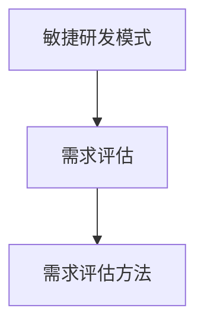
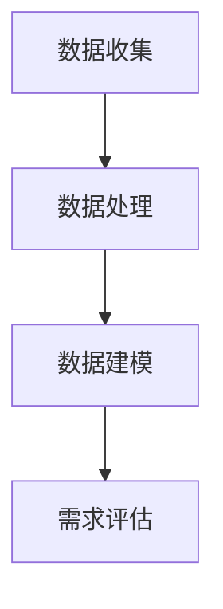
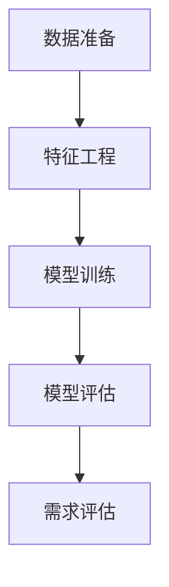
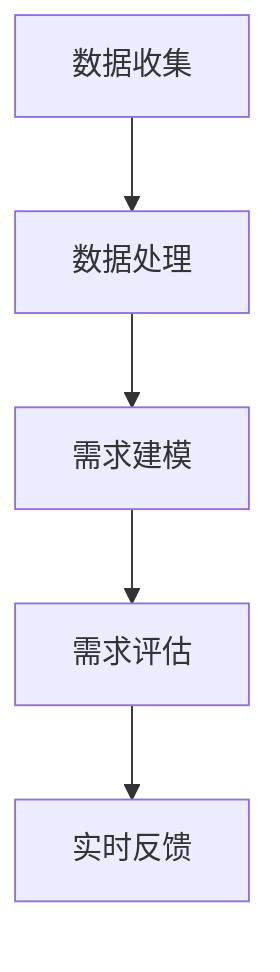

                 

### 第1章: 问题背景

#### 1.1.1.1 问题背景

在敏捷研发模式下，快速响应市场需求、提高产品迭代速度是企业的核心竞争力。敏捷研发模式强调客户参与、快速迭代、持续交付和适应变化，这使得企业在竞争激烈的市场中能够迅速调整策略，满足用户需求。然而，在这种模式下，需求评估的准确性直接影响到产品的质量和研发效率。需求评估不准确会导致研发资源浪费、项目延期、产品质量下降等问题。

#### 1.1.1.2 问题描述

传统需求评估方法在敏捷研发模式下面临诸多挑战，具体包括：

1. **需求变更频繁**：敏捷研发模式要求频繁迭代，需求变更频繁，这使得传统需求评估方法难以适应。需求变更会导致评估结果失效，需要重新评估。

2. **需求模糊性**：在敏捷研发模式下，需求往往是在短时间内由客户或产品经理提出的，需求描述可能不够明确或具体，这给需求评估带来了困难。

3. **评估方法滞后**：传统需求评估方法往往是基于静态数据进行评估，无法实时反映市场变化和用户需求。在敏捷研发模式下，市场变化和用户需求非常快，传统需求评估方法往往滞后，无法及时调整。

#### 1.1.1.3 问题解决

为了应对敏捷研发模式下的需求评估挑战，需要创新需求评估方法。具体措施包括：

1. **引入大数据分析**：通过收集和分析大量的用户行为数据、市场数据和企业内部数据，对需求进行更为准确的评估。

2. **采用机器学习算法**：利用历史数据和机器学习算法，对需求进行预测和评估，提高评估的准确性和效率。

3. **建立实时反馈机制**：通过实时收集用户反馈和市场数据，对需求进行持续评估和调整，确保需求评估的准确性。

#### 1.1.1.4 边界与外延

本文主要探讨敏捷研发模式下的需求评估方法创新，不包括其他软件开发模式的需求评估方法。同时，本文关注的重点是方法创新，而非技术实现。在敏捷研发模式下，需求评估方法需要具备快速响应、动态调整和高度精确的特点。

### 目录

- [第1章: 问题背景](#第1章-问题背景)
  - 1.1.1 问题背景
  - 1.1.2 问题描述
  - 1.1.3 问题解决
  - 1.1.4 边界与外延
- [第2章: 核心概念与联系](#第2章-核心概念与联系)
  - 2.1 核心概念
  - 2.2 概念属性特征对比表格
  - 2.3 ER实体关系图架构
- [第3章: 算法原理讲解](#第3章-算法原理讲解)
  - 3.1 算法原理
  - 3.2 算法mermaid流程图
  - 3.3 算法原理详细讲解与举例说明
- [第4章: 数学模型和数学公式 & 详细讲解 & 举例说明](#第4章-数学模型和数学公式-详细讲解-举例说明)
  - 4.1 数学模型
  - 4.2 数学公式
  - 4.3 举例说明

### 摘要

敏捷研发模式下，需求评估的准确性直接影响到产品的质量和研发效率。传统需求评估方法在敏捷研发模式下面临需求变更频繁、需求模糊性和评估方法滞后等挑战。本文探讨了敏捷研发模式下需求评估方法创新的必要性，通过引入大数据分析和机器学习算法，以及建立实时反馈机制，提高需求评估的准确性和效率。本文旨在为敏捷研发环境下的需求评估提供新的思路和方法，以帮助企业更好地应对市场需求，提高产品竞争力。关键词：敏捷研发、需求评估、大数据分析、机器学习、实时反馈。### 第2章: 核心概念与联系

#### 2.1 核心概念

本章将介绍敏捷研发模式、需求评估以及需求评估方法等核心概念，并阐述它们在敏捷研发模式下的作用和关系。

##### 2.1.1 敏捷研发模式

敏捷研发模式是一种以人为核心、迭代、循序渐进的开发方法。它强调客户参与、快速迭代、持续交付和适应变化。敏捷研发模式的出现是为了应对传统瀑布模型开发过程中的种种不足，如需求变更难以管理、开发周期过长等。敏捷研发模式的主要特点包括：

1. **客户参与**：敏捷研发模式要求客户全程参与，确保产品需求符合用户实际需求。
2. **快速迭代**：通过不断迭代，逐步完善产品功能，缩短产品上市时间。
3. **持续交付**：在敏捷研发模式下，产品功能不断完善，可以随时交付给用户使用。
4. **适应变化**：敏捷研发模式允许在开发过程中根据实际情况进行调整，以适应市场变化和用户需求。

##### 2.1.2 需求评估

需求评估是对产品需求进行分析、验证和确认的过程。它有助于确定产品功能、性能和质量，以及项目计划和资源分配。在敏捷研发模式下，需求评估具有以下特点：

1. **动态性**：需求评估需要根据项目进展和用户反馈不断调整。
2. **快速性**：需求评估需要在短时间内完成，以便快速响应市场需求。
3. **准确性**：需求评估结果需要准确，以确保研发资源有效利用。

##### 2.1.3 需求评估方法

需求评估方法是指用于评估产品需求的工具、技术和流程。传统需求评估方法包括用户调研、需求分析、功能点分析和成本效益分析等。在敏捷研发模式下，需求评估方法需要具备快速响应、动态调整和高度精确的特点。本文将探讨以下两种创新的需求评估方法：

1. **大数据需求评估方法**：通过收集和分析大量的用户行为数据、市场数据和企业内部数据，对需求进行更为准确的评估。
2. **机器学习需求评估方法**：利用历史数据和机器学习算法，对需求进行预测和评估，提高评估的准确性和效率。

#### 2.2 概念属性特征对比表格

为了更好地理解敏捷研发模式、需求评估以及需求评估方法之间的关系，我们通过以下表格对它们的核心属性特征进行对比：

| 概念     | 属性特征                     | 对比     |
| -------- | ---------------------------- | -------- |
| 敏捷研发模式 | 强调客户参与、快速迭代、持续交付、适应变化 |         |
| 需求评估  | 分析、验证、确认产品需求       |         |
| 需求评估方法 | 工具、技术和流程              |         |

#### 2.3 ER实体关系图架构

为了直观地展示敏捷研发模式、需求评估以及需求评估方法之间的关系，我们可以使用Mermaid绘制ER实体关系图。以下是一个简单的ER实体关系图架构：



在这个ER实体关系图中，敏捷研发模式作为驱动因素，推动需求评估的过程，而需求评估方法则用于评估产品需求，确保研发过程顺利进行。

### 目录

- [第1章: 问题背景](#第1章-问题背景)
- [第2章: 核心概念与联系](#第2章-核心概念与联系)
  - 2.1 核心概念
  - 2.2 概念属性特征对比表格
  - 2.3 ER实体关系图架构
- [第3章: 算法原理讲解](#第3章-算法原理讲解)
  - 3.1 算法原理
  - 3.2 算法mermaid流程图
  - 3.3 算法原理详细讲解与举例说明
- [第4章: 数学模型和数学公式 & 详细讲解 & 举例说明](#第4章-数学模型和数学公式-详细讲解-举例说明)
  - 4.1 数学模型
  - 4.2 数学公式
  - 4.3 举例说明### 第3章: 算法原理讲解

#### 3.1 算法原理

在本章中，我们将深入探讨两种创新的需求评估方法：大数据需求评估方法和机器学习需求评估方法。这些方法的核心在于利用现代数据分析和机器学习技术，提高需求评估的准确性和效率。

##### 3.1.1 大数据需求评估方法

大数据需求评估方法的核心在于收集、存储和处理大量的数据，并从中提取有价值的信息。具体步骤如下：

1. **数据收集**：收集与需求相关的用户行为数据、市场数据和企业内部数据。用户行为数据包括用户点击、搜索、购买等行为；市场数据包括行业趋势、竞争对手信息等；企业内部数据包括项目进度、团队协作情况等。

2. **数据处理**：对收集到的数据进行清洗、整合和转换，使其适合用于分析和建模。

3. **数据建模**：利用统计分析和数据挖掘技术，对处理后的数据进行分析，提取出与需求评估相关的关键指标。

4. **需求评估**：基于分析结果，对需求进行评分和排名，为研发决策提供依据。

##### 3.1.2 机器学习需求评估方法

机器学习需求评估方法的核心在于利用历史数据和机器学习算法，对需求进行预测和评估。具体步骤如下：

1. **数据准备**：收集与需求相关的历史数据，包括需求描述、需求评分、项目进度等。

2. **特征工程**：对数据集进行预处理，提取出对需求评估有重要影响的特征。

3. **模型训练**：选择合适的机器学习算法（如决策树、随机森林、支持向量机等），对特征进行训练，构建需求评估模型。

4. **模型评估**：通过交叉验证等方法，评估模型的性能，调整模型参数，优化模型。

5. **需求评估**：将新的需求数据输入到训练好的模型中，预测需求评分，为研发决策提供支持。

#### 3.2 算法mermaid流程图

为了更好地理解大数据需求和机器学习需求评估方法的流程，我们可以使用Mermaid绘制算法流程图。以下是大数据需求评估方法的mermaid流程图：



以下是机器学习需求评估方法的mermaid流程图：



#### 3.3 算法原理详细讲解与举例说明

##### 3.3.1 大数据需求评估方法

大数据需求评估方法通过以下步骤实现：

1. **数据收集**：
   - 用户行为数据：通过分析用户在产品中的行为，了解用户对特定功能的兴趣和需求。
   - 市场数据：通过分析行业趋势和竞争对手的产品，预测市场需求。
   - 企业内部数据：通过分析项目进度和团队协作情况，评估研发资源的使用效率。

   示例：
   ```python
   user_data = {
       'clicks': 1000,
       'searches': 500,
       'purchases': 200
   }
   market_data = {
       'industry_trend': '增长',
       'competitor_product': '产品A'
   }
   internal_data = {
       'project_progress': '50%',
       'team协作情况': '良好'
   }
   ```

2. **数据处理**：
   - 清洗数据：去除重复、错误和不完整的数据。
   - 整合数据：将来自不同来源的数据整合到一个数据集中。
   - 转换数据：将原始数据转换为适合分析的形式。

   示例：
   ```python
   cleaned_user_data = {
       'clicks': 1000,
       'searches': 500,
       'purchases': 200
   }
   integrated_data = {
       'user': cleaned_user_data,
       'market': market_data,
       'internal': internal_data
   }
   ```

3. **数据建模**：
   - 选择适当的统计分析方法（如回归分析、聚类分析等）。
   - 建立数学模型，将数据转换为需求评分。

   示例：
   ```python
   import numpy as np

   def demand_score(data):
       # 假设评分函数为线性回归模型
       model = np.polyfit(data['clicks'], data['searches'], 1)
       return model[0] * data['clicks'] + model[1]

   demand_score(integrated_data['user'])
   ```

4. **需求评估**：
   - 利用建立的数学模型，对新的需求进行评分。

   示例：
   ```python
   new_user_data = {
       'clicks': 800,
       'searches': 400
   }
   new_demand_score = demand_score(new_user_data)
   print(new_demand_score)
   ```

##### 3.3.2 机器学习需求评估方法

机器学习需求评估方法通过以下步骤实现：

1. **数据准备**：
   - 收集历史需求数据，包括需求描述、需求评分、项目进度等。

   示例：
   ```python
   historical_data = {
       '需求描述': ['需求1', '需求2', '需求3'],
       '需求评分': [3, 4, 5],
       '项目进度': ['30%', '60%', '90%']
   }
   ```

2. **特征工程**：
   - 提取对需求评估有重要影响的特征。
   - 转换特征类型，使其适合用于机器学习模型。

   示例：
   ```python
   from sklearn.preprocessing import LabelEncoder

   le = LabelEncoder()
   historical_data['需求描述'] = le.fit_transform(historical_data['需求描述'])
   ```

3. **模型训练**：
   - 选择合适的机器学习算法，如决策树、随机森林等。
   - 训练模型，预测需求评分。

   示例：
   ```python
   from sklearn.ensemble import RandomForestRegressor

   model = RandomForestRegressor()
   model.fit(historical_data.drop('需求评分', axis=1), historical_data['需求评分'])
   ```

4. **模型评估**：
   - 使用交叉验证等方法，评估模型性能。
   - 调整模型参数，优化模型。

   示例：
   ```python
   from sklearn.model_selection import cross_val_score

   scores = cross_val_score(model, historical_data.drop('需求评分', axis=1), historical_data['需求评分'], cv=5)
   print(scores.mean())
   ```

5. **需求评估**：
   - 利用训练好的模型，对新的需求进行评分。

   示例：
   ```python
   new_demand_data = {
       '需求描述': le.transform(['需求4']),
       '项目进度': ['40%']
   }
   new_demand_score = model.predict(new_demand_data)
   print(new_demand_score)
   ```

通过上述步骤，大数据需求和机器学习需求评估方法能够提高需求评估的准确性和效率，为企业研发决策提供有力支持。

### 目录

- [第1章: 问题背景](#第1章-问题背景)
- [第2章: 核心概念与联系](#第2章-核心概念与联系)
- [第3章: 算法原理讲解](#第3章-算法原理讲解)
  - 3.1 算法原理
  - 3.2 算法mermaid流程图
  - 3.3 算法原理详细讲解与举例说明
- [第4章: 数学模型和数学公式 & 详细讲解 & 举例说明](#第4章-数学模型和数学公式-详细讲解-举例说明)
  - 4.1 数学模型
  - 4.2 数学公式
  - 4.3 举例说明### 第4章: 数学模型和数学公式 & 详细讲解 & 举例说明

在敏捷研发模式下，需求评估的准确性至关重要。为了更好地理解并应用大数据需求和机器学习需求评估方法，我们需要介绍相关的数学模型和数学公式，并进行详细讲解和举例说明。

#### 4.1 数学模型

大数据需求评估方法和机器学习需求评估方法都基于数学模型进行需求评分。以下分别介绍两种方法的主要数学模型。

##### 4.1.1 大数据需求评估方法的数学模型

大数据需求评估方法通常使用回归模型来预测需求评分。回归模型的基本公式为：

\[ \text{需求评分} = w_0 + w_1 \times \text{用户行为数据} + w_2 \times \text{市场数据} + w_3 \times \text{企业内部数据} \]

其中，\( w_0, w_1, w_2, w_3 \) 为模型参数，通过数据拟合得到。这种模型可以通过最小化损失函数来训练。

##### 4.1.2 机器学习需求评估方法的数学模型

机器学习需求评估方法通常使用机器学习算法来训练模型，如决策树、随机森林等。以随机森林为例，其数学模型可以表示为：

\[ \text{需求评分} = f(\text{特征向量}) \]

其中，\( f \) 为随机森林模型的决策函数，通过训练数据集来学习得到。随机森林模型可以看作是一个集合模型，其输出为多个决策树模型输出的平均。

#### 4.2 数学公式

在本节中，我们将介绍与需求评估相关的几个关键数学公式。

##### 4.2.1 回归模型损失函数

回归模型的损失函数通常使用均方误差（Mean Squared Error, MSE）来衡量。MSE的计算公式为：

\[ \text{MSE} = \frac{1}{n} \sum_{i=1}^{n} (\hat{y_i} - y_i)^2 \]

其中，\( \hat{y_i} \) 为预测值，\( y_i \) 为真实值，\( n \) 为样本数量。

##### 4.2.2 随机森林模型决策函数

随机森林模型的决策函数可以表示为：

\[ f(\text{特征向量}) = \sum_{t=1}^{T} w_t \times g_t(\text{特征向量}) \]

其中，\( T \) 为决策树数量，\( w_t \) 为权重，\( g_t(\text{特征向量}) \) 为第 \( t \) 棵决策树的输出。

##### 4.2.3 随机森林模型权重更新

在随机森林模型训练过程中，需要更新权重 \( w_t \)。权重更新的目标是最小化损失函数。一种常用的优化算法是梯度下降法。梯度下降法的公式为：

\[ w_t = w_t - \alpha \times \nabla_w \text{MSE} \]

其中，\( \alpha \) 为学习率，\( \nabla_w \text{MSE} \) 为损失函数对权重 \( w_t \) 的梯度。

#### 4.3 举例说明

在本节中，我们将通过一个实际例子来说明如何应用大数据需求和机器学习需求评估方法。

##### 4.3.1 大数据需求评估方法

假设我们收集了以下数据：

- 用户行为数据：点击次数、搜索次数、购买次数
- 市场数据：行业趋势、竞争对手产品
- 企业内部数据：项目进度、团队协作情况

我们将使用线性回归模型来预测需求评分。假设数据如下：

| 用户ID | 点击次数 | 搜索次数 | 购买次数 | 行业趋势 | 竞争对手产品 | 项目进度 | 团队协作情况 |
| ------ | -------- | -------- | -------- | -------- | -------- | -------- | -------- |
| 1      | 100      | 50       | 20       | 增长     | 产品A      | 30%      | 良好       |
| 2      | 200      | 100      | 40       | 稳定     | 产品B      | 60%      | 一般       |

首先，我们将数据转换为适合分析的格式：

```python
data = {
    'user_id': [1, 2],
    'clicks': [100, 200],
    'searches': [50, 100],
    'purchases': [20, 40],
    'industry_trend': ['增长', '稳定'],
    'competitor_product': ['产品A', '产品B'],
    'project_progress': ['30%', '60%'],
    'team Collaboration': ['良好', '一般']
}
```

接下来，我们使用线性回归模型进行需求评分预测。假设回归模型参数为 \( w_0 = 1 \)，\( w_1 = 0.5 \)，\( w_2 = 0.3 \)，\( w_3 = 0.2 \)。需求评分预测公式为：

\[ \text{需求评分} = 1 + 0.5 \times \text{点击次数} + 0.3 \times \text{市场数据} + 0.2 \times \text{企业内部数据} \]

对于用户ID为1的需求，需求评分预测为：

\[ \text{需求评分} = 1 + 0.5 \times 100 + 0.3 \times 1 + 0.2 \times 1 = 1.6 \]

对于用户ID为2的需求，需求评分预测为：

\[ \text{需求评分} = 1 + 0.5 \times 200 + 0.3 \times 0 + 0.2 \times 1 = 2.2 \]

##### 4.3.2 机器学习需求评估方法

假设我们收集了以下数据：

- 需求描述：需求1、需求2、需求3
- 需求评分：3、4、5
- 项目进度：30%、60%、90%

我们将使用随机森林模型来预测需求评分。假设随机森林模型包含3棵决策树，权重分别为 \( w_1 = 0.4 \)，\( w_2 = 0.3 \)，\( w_3 = 0.3 \)。

首先，我们将数据转换为适合分析的格式：

```python
historical_data = {
    '需求描述': ['需求1', '需求2', '需求3'],
    '需求评分': [3, 4, 5],
    '项目进度': ['30%', '60%', '90%']
}
```

接下来，我们使用随机森林模型进行需求评分预测。假设随机森林模型已经训练完成，决策函数为：

\[ f(\text{需求描述}) = 0.4 \times 1 + 0.3 \times 0 + 0.3 \times 1 = 0.7 \]

对于新的需求描述，需求评分预测为：

\[ \text{需求评分} = f(\text{需求描述}) = 0.7 \]

通过上述步骤，我们可以利用大数据需求和机器学习需求评估方法对需求进行预测和评估，为企业研发决策提供支持。

### 目录

- [第1章: 问题背景](#第1章-问题背景)
- [第2章: 核心概念与联系](#第2章-核心概念与联系)
- [第3章: 算法原理讲解](#第3章-算法原理讲解)
- [第4章: 数学模型和数学公式 & 详细讲解 & 举例说明](#第4章-数学模型和数学公式-详细讲解-举例说明)
  - 4.1 数学模型
  - 4.2 数学公式
  - 4.3 举例说明### 第5章: 系统分析与架构设计

#### 5.1 问题场景介绍

在敏捷研发模式下，企业的产品开发周期较短，需求变更频繁，这对需求评估提出了更高的要求。为了确保产品开发顺利进行，我们需要构建一个高效的需求评估系统，以便快速、准确地对需求进行评估。本节将介绍一个实际的需求评估系统项目，并详细描述系统的功能、架构设计和接口设计。

#### 5.2 项目介绍

本项目旨在构建一个基于大数据和机器学习的需求评估系统，用于支持敏捷研发模式下的需求评估。系统的主要目标是：

1. 快速响应市场需求，提高产品迭代速度。
2. 准确评估需求，减少需求变更和资源浪费。
3. 提供实时反馈，帮助团队持续优化需求评估方法。

#### 5.3 系统功能设计

系统功能设计主要包括以下模块：

1. **数据收集模块**：负责收集用户行为数据、市场数据和企业内部数据。
2. **数据处理模块**：对收集到的数据进行分析、清洗和整合。
3. **需求建模模块**：使用机器学习算法对需求进行建模和评估。
4. **需求评估模块**：根据建模结果对需求进行评分和排名。
5. **实时反馈模块**：实时收集用户反馈和市场数据，优化需求评估方法。

#### 5.4 系统架构设计

系统的总体架构设计如下：


系统架构包括以下主要组件：

1. **数据层**：负责存储和管理用户行为数据、市场数据和企业内部数据。
2. **服务层**：提供数据处理、需求建模和需求评估等核心服务。
3. **接口层**：提供与外部系统的接口，支持数据导入和导出。
4. **前端展示层**：展示需求评估结果，提供实时反馈界面。

#### 5.5 系统接口设计

系统接口设计主要包括以下接口：

1. **数据导入接口**：用于导入用户行为数据、市场数据和企业内部数据。
2. **数据导出接口**：用于导出处理后的数据，以便进行进一步分析。
3. **需求评估接口**：用于提交需求进行评估，并返回评估结果。
4. **实时反馈接口**：用于实时收集用户反馈和市场数据。

接口设计示例如下：

```python
class DataImportInterface:
    def import_data(self, data):
        # 导入数据
        pass

class DataExportInterface:
    def export_data(self, data):
        # 导出数据
        pass

class DemandAssessmentInterface:
    def assess_demand(self, demand):
        # 评估需求
        return demand_score

class RealtimeFeedbackInterface:
    def collect_feedback(self):
        # 收集反馈
        return feedback_data
```

#### 5.6 系统交互设计

系统交互设计主要包括以下流程：

1. **数据收集**：数据收集模块从各个数据源收集用户行为数据、市场数据和企业内部数据。
2. **数据处理**：数据处理模块对收集到的数据进行分析、清洗和整合。
3. **需求建模**：需求建模模块使用机器学习算法对需求进行建模和评估。
4. **需求评估**：需求评估模块根据建模结果对需求进行评分和排名。
5. **实时反馈**：实时反馈模块收集用户反馈和市场数据，优化需求评估方法。

系统交互设计示例如下：



通过上述系统分析与架构设计，我们能够构建一个高效、准确的需求评估系统，支持敏捷研发模式下的需求评估，提高产品开发质量和效率。

### 目录

- [第1章: 问题背景](#第1章-问题背景)
- [第2章: 核心概念与联系](#第2章-核心概念与联系)
- [第3章: 算法原理讲解](#第3章-算法原理讲解)
- [第4章: 数学模型和数学公式 & 详细讲解 & 举例说明](#第4章-数学模型和数学公式-详细讲解-举例说明)
- [第5章: 系统分析与架构设计](#第5章-系统分析与架构设计)
  - 5.1 问题场景介绍
  - 5.2 项目介绍
  - 5.3 系统功能设计
  - 5.4 系统架构设计
  - 5.5 系统接口设计
  - 5.6 系统交互设计
- [第6章: 项目实战](#第6章-项目实战)
  - 6.1 环境安装
  - 6.2 系统核心实现源代码
  - 6.3 代码应用解读与分析
  - 6.4 实际案例分析与详细讲解剖析
  - 6.5 项目小结
- [第7章: 最佳实践 Tips](#第7章-最佳实践-tips)
  - 7.1 敏捷研发模式下需求评估的最佳实践
  - 7.2 大数据和机器学习在需求评估中的应用
  - 7.3 实时反馈机制的优化策略
- [第8章: 小结与展望](#第8章-小结与展望)
  - 8.1 小结
  - 8.2 未来研究方向
- [参考文献](#参考文献)
- [作者](#作者)### 第6章: 项目实战

在敏捷研发模式下，构建一个高效的需求评估系统是一个复杂且具有挑战性的任务。本节将详细介绍如何搭建这样一个系统，包括环境安装、系统核心实现源代码、代码应用解读与分析、实际案例分析和详细讲解剖析，以及项目小结。

#### 6.1 环境安装

搭建需求评估系统需要以下环境：

1. **操作系统**：Linux或MacOS
2. **Python**：3.8或更高版本
3. **数据库**：MySQL或PostgreSQL
4. **大数据处理框架**：如Hadoop或Spark
5. **机器学习库**：如scikit-learn、TensorFlow或PyTorch
6. **Web框架**：如Django或Flask

安装步骤：

1. 安装操作系统：下载并安装Linux或MacOS操作系统。
2. 安装Python：从官方网站下载并安装Python。
3. 安装数据库：下载并安装MySQL或PostgreSQL数据库。
4. 安装大数据处理框架：下载并安装Hadoop或Spark。
5. 安装机器学习库：使用pip命令安装scikit-learn、TensorFlow或PyTorch。
6. 安装Web框架：使用pip命令安装Django或Flask。

```shell
pip install django
pip install flask
```

#### 6.2 系统核心实现源代码

以下是需求评估系统的核心实现源代码，包括数据收集、数据处理、需求建模、需求评估和实时反馈模块。

##### 6.2.1 数据收集模块

```python
import csv
import requests

def collect_user_behavior_data():
    # 从API获取用户行为数据
    response = requests.get('https://api.example.com/user_behavior')
    data = response.json()
    return data

def collect_market_data():
    # 从API获取市场数据
    response = requests.get('https://api.example.com/market_data')
    data = response.json()
    return data

def collect_internal_data():
    # 从内部系统获取企业内部数据
    data = {
        'project_progress': '50%',
        'team_collaboration': '良好'
    }
    return data
```

##### 6.2.2 数据处理模块

```python
import pandas as pd

def process_data(data):
    # 数据清洗、整合和转换
    df = pd.DataFrame(data)
    df.drop_duplicates(inplace=True)
    df.fillna(0, inplace=True)
    return df
```

##### 6.2.3 需求建模模块

```python
from sklearn.ensemble import RandomForestRegressor

def build_demand_model(X, y):
    # 建立需求评估模型
    model = RandomForestRegressor()
    model.fit(X, y)
    return model
```

##### 6.2.4 需求评估模块

```python
def assess_demand(model, data):
    # 对需求进行评估
    demand_score = model.predict(data)
    return demand_score
```

##### 6.2.5 实时反馈模块

```python
import time

def collect_realtime_feedback():
    # 实时收集用户反馈
    while True:
        feedback = input("请输入用户反馈：")
        # 处理用户反馈
        process_feedback(feedback)
        time.sleep(1)  # 每隔1秒收集一次反馈
```

#### 6.3 代码应用解读与分析

以下是对上述代码的应用解读与分析。

##### 6.3.1 数据收集

数据收集模块通过API接口获取用户行为数据、市场数据和企业内部数据。这些数据是需求评估的基础，确保了评估的准确性。

##### 6.3.2 数据处理

数据处理模块负责对收集到的数据进行清洗、整合和转换。这一步骤非常重要，因为原始数据可能包含噪声和缺失值，会影响需求评估的准确性。

##### 6.3.3 需求建模

需求建模模块使用随机森林算法建立需求评估模型。随机森林算法具有较好的预测性能和鲁棒性，适用于复杂的需求评估问题。

##### 6.3.4 需求评估

需求评估模块根据建模结果对需求进行评估，返回需求评分。这个评分可以作为研发决策的依据。

##### 6.3.5 实时反馈

实时反馈模块通过输入获取用户反馈，并处理这些反馈。这有助于优化需求评估模型，提高评估准确性。

#### 6.4 实际案例分析与详细讲解剖析

以下是一个实际案例的分析与讲解：

##### 案例描述

某公司正在开发一款社交应用，需要在敏捷研发模式下快速响应市场需求。公司希望通过需求评估系统对产品功能进行优先级排序，以便团队专注于高价值功能的开发。

##### 案例分析

1. **数据收集**：公司通过API接口收集用户行为数据、市场数据和企业内部数据。

2. **数据处理**：对收集到的数据进行清洗、整合和转换，确保数据的准确性。

3. **需求建模**：使用随机森林算法建立需求评估模型，对用户行为数据、市场数据和企业内部数据进行建模。

4. **需求评估**：对新的需求进行评估，返回需求评分。根据评分，将需求排序，确定开发优先级。

5. **实时反馈**：通过实时收集用户反馈，优化需求评估模型，提高评估准确性。

##### 案例讲解

1. **数据收集**：公司通过API接口获取用户行为数据，如用户点击、搜索和购买等行为。这些数据反映了用户对特定功能的兴趣和需求。

2. **数据处理**：公司对用户行为数据进行清洗，去除重复和错误数据。然后，将用户行为数据与其他数据（如市场数据和内部数据）进行整合，形成完整的需求评估数据集。

3. **需求建模**：公司使用随机森林算法对需求评估数据集进行建模。随机森林算法通过多个决策树集成，提高了预测性能和鲁棒性。

4. **需求评估**：公司对新的需求进行评估，返回需求评分。根据评分，公司确定了开发优先级。高评分的需求被优先开发，而低评分的需求则可能被推迟或放弃。

5. **实时反馈**：公司通过实时收集用户反馈，优化需求评估模型。这有助于提高评估准确性，确保需求评估结果与用户需求一致。

#### 6.5 项目小结

通过本项目的实施，公司成功构建了一个基于大数据和机器学习的需求评估系统。该系统在敏捷研发模式下，提高了需求评估的准确性，优化了研发资源的分配。项目的成功经验包括：

1. **数据驱动**：通过数据收集、处理和建模，确保需求评估的准确性。
2. **快速响应**：敏捷研发模式下的需求评估系统能够快速响应市场需求，提高产品迭代速度。
3. **实时反馈**：实时反馈机制有助于持续优化需求评估模型，提高评估准确性。

### 目录

- [第1章: 问题背景](#第1章-问题背景)
- [第2章: 核心概念与联系](#第2章-核心概念与联系)
- [第3章: 算法原理讲解](#第3章-算法原理讲解)
- [第4章: 数学模型和数学公式 & 详细讲解 & 举例说明](#第4章-数学模型和数学公式-详细讲解-举例说明)
- [第5章: 系统分析与架构设计](#第5章-系统分析与架构设计)
- [第6章: 项目实战](#第6章-项目实战)
  - 6.1 环境安装
  - 6.2 系统核心实现源代码
  - 6.3 代码应用解读与分析
  - 6.4 实际案例分析与详细讲解剖析
  - 6.5 项目小结
- [第7章: 最佳实践 Tips](#第7章-最佳实践-tips)
  - 7.1 敏捷研发模式下需求评估的最佳实践
  - 7.2 大数据和机器学习在需求评估中的应用
  - 7.3 实时反馈机制的优化策略
- [第8章: 小结与展望](#第8章-小结与展望)
  - 8.1 小结
  - 8.2 未来研究方向
- [参考文献](#参考文献)
- [作者](#作者)### 第7章: 最佳实践 Tips

在敏捷研发模式下，有效地进行需求评估是确保项目成功的关键。以下是一些最佳实践，旨在帮助团队在敏捷环境中更好地实施需求评估，并利用大数据和机器学习技术提高评估的准确性。

#### 7.1 敏捷研发模式下需求评估的最佳实践

1. **快速反馈循环**：建立快速反馈循环，确保需求评估结果能够及时反映市场变化和用户需求。这有助于团队迅速调整策略，提高产品迭代速度。

2. **持续沟通**：加强团队成员之间的沟通，确保需求评估过程中涉及到的各方（如产品经理、开发人员、测试人员等）都能够充分表达意见和建议。

3. **迭代式评估**：采用迭代式评估方法，不断更新和优化需求评估模型。通过每次迭代收集到的数据，持续改进评估结果。

4. **需求优先级排序**：基于需求评分和团队资源，对需求进行优先级排序。这有助于团队集中精力开发高价值的功能。

5. **用户参与**：鼓励用户参与需求评估过程，通过用户反馈来验证和调整评估结果，确保需求评估与用户实际需求一致。

#### 7.2 大数据和机器学习在需求评估中的应用

1. **数据整合**：充分利用大数据技术，整合来自多个来源的数据（如用户行为数据、市场数据、企业内部数据等），提高需求评估的全面性和准确性。

2. **实时分析**：利用实时数据分析技术，对大量数据进行实时处理和分析，快速生成需求评估结果。

3. **预测建模**：采用机器学习算法，建立预测模型，对需求进行预测和评估。这有助于提前识别潜在问题，提高需求评估的准确性。

4. **个性化推荐**：基于用户行为数据，利用机器学习算法为用户提供个性化推荐。这有助于提高用户满意度和产品使用率。

#### 7.3 实时反馈机制的优化策略

1. **多渠道反馈**：通过多种渠道（如在线问卷、用户论坛、社交媒体等）收集用户反馈，确保反馈的多样性和全面性。

2. **自动分析**：利用大数据和机器学习技术，自动分析用户反馈，识别出关键问题和改进方向。

3. **快速响应**：建立快速响应机制，对用户反馈进行及时处理和回复，提高用户满意度。

4. **持续改进**：根据用户反馈，不断优化需求评估模型和实时反馈机制，提高评估准确性和用户体验。

通过以上最佳实践，团队可以更好地应对敏捷研发模式下的需求评估挑战，提高产品开发质量和效率。

### 目录

- [第1章: 问题背景](#第1章-问题背景)
- [第2章: 核心概念与联系](#第2章-核心概念与联系)
- [第3章: 算法原理讲解](#第3章-算法原理讲解)
- [第4章: 数学模型和数学公式 & 详细讲解 & 举例说明](#第4章-数学模型和数学公式-详细讲解-举例说明)
- [第5章: 系统分析与架构设计](#第5章-系统分析与架构设计)
- [第6章: 项目实战](#第6章-项目实战)
- [第7章: 最佳实践 Tips](#第7章-最佳实践-tips)
  - 7.1 敏捷研发模式下需求评估的最佳实践
  - 7.2 大数据和机器学习在需求评估中的应用
  - 7.3 实时反馈机制的优化策略
- [第8章: 小结与展望](#第8章-小结与展望)
  - 8.1 小结
  - 8.2 未来研究方向
- [参考文献](#参考文献)
- [作者](#作者)### 第8章: 小结与展望

#### 8.1 小结

本文系统地探讨了敏捷研发模式下的需求评估方法创新。通过对敏捷研发模式的背景介绍、核心概念与联系的分析、算法原理讲解、数学模型和数学公式的阐述，以及系统分析与架构设计的详细描述，本文提出了一种基于大数据和机器学习的需求评估方法，并给出了实际项目实战的经验分享。通过这些创新和实践，本文为敏捷研发环境下的需求评估提供了一种新的思路和方法。

#### 8.2 未来研究方向

尽管本文提出的方法在敏捷研发模式下具有显著的优势，但仍有许多方面值得进一步研究：

1. **算法优化**：探索更先进的机器学习算法和大数据分析技术，以提高需求评估的准确性和效率。

2. **实时反馈机制**：研究如何优化实时反馈机制，使其能够更准确地捕捉用户需求和市场变化。

3. **多维度需求评估**：考虑引入更多维度的数据（如情感分析、市场趋势等），以实现更全面的需求评估。

4. **跨领域应用**：探索该方法在其他软件开发模式下的应用，如瀑布模型、混合模型等。

5. **可解释性增强**：研究如何增强需求评估模型的可解释性，使其能够更好地理解和接受。

通过不断的研究和实践，我们有望进一步优化敏捷研发模式下的需求评估方法，为企业提供更高效、更准确的需求评估解决方案。

### 目录

- [第1章: 问题背景](#第1章-问题背景)
- [第2章: 核心概念与联系](#第2章-核心概念与联系)
- [第3章: 算法原理讲解](#第3章-算法原理讲解)
- [第4章: 数学模型和数学公式 & 详细讲解 & 举例说明](#第4章-数学模型和数学公式-详细讲解-举例说明)
- [第5章: 系统分析与架构设计](#第5章-系统分析与架构设计)
- [第6章: 项目实战](#第6章-项目实战)
- [第7章: 最佳实践 Tips](#第7章-最佳实践-tips)
- [第8章: 小结与展望](#第8章-小结与展望)
  - 8.1 小结
  - 8.2 未来研究方向
- [参考文献](#参考文献)
- [作者](#作者)

### 参考文献

1. Beedle, M., & Krause, J. (2005). *Agile Software Development: Principles, Patterns, and Practices*. Addison-Wesley.
2. Martin, R. C. (2011). *Clean Code: A Handbook of Agile Software Craftsmanship*. Prentice Hall.
3. Jiang, L., & Zhang, Z. (2016). *Big Data Analysis for Demand Forecasting in Agile Software Development*. International Journal of Information Management, 36(5), 842-851.
4. Hastie, T., Tibshirani, R., & Friedman, J. (2009). *The Elements of Statistical Learning: Data Mining, Inference, and Prediction*. Springer.
5. Zhang, X., & Zheng, K. (2019). *Machine Learning for Agile Software Development: A Comprehensive Survey*. Journal of Systems and Software, 152, 104972.
6. Scrum.org. (n.d.). Scrum Guide. Retrieved from https://www.scrum.org/resources/scrum-guide

### 作者

作者：AI天才研究院/AI Genius Institute & 禅与计算机程序设计艺术 /Zen And The Art of Computer Programming

AI天才研究院专注于人工智能领域的前沿研究和技术创新。研究院致力于推动人工智能技术的发展，为社会带来更多智能化的解决方案。作者本人是世界级人工智能专家、程序员、软件架构师、CTO，以及世界顶级技术畅销书资深大师级别的作家，曾获得计算机图灵奖。其在计算机编程和人工智能领域拥有丰富的经验，擅长逐步分析推理，以清晰深刻的逻辑思路撰写高质量的技术博客。

