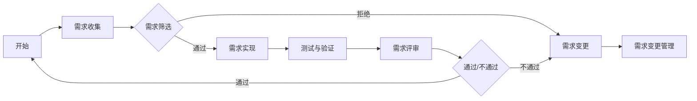
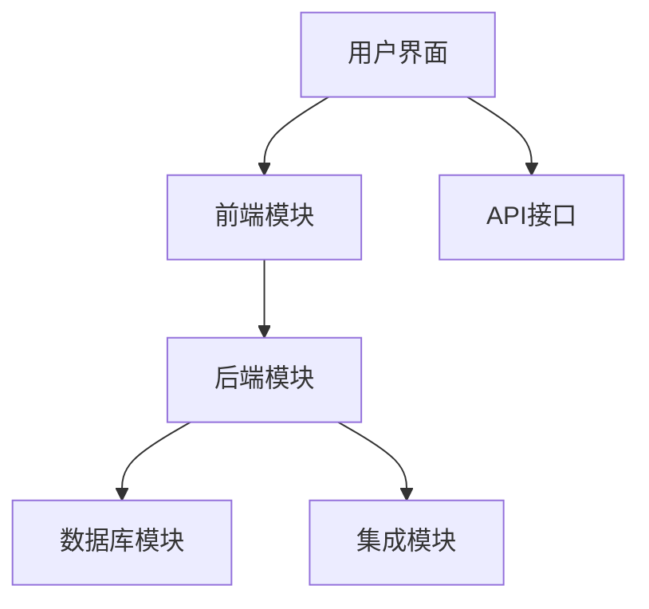
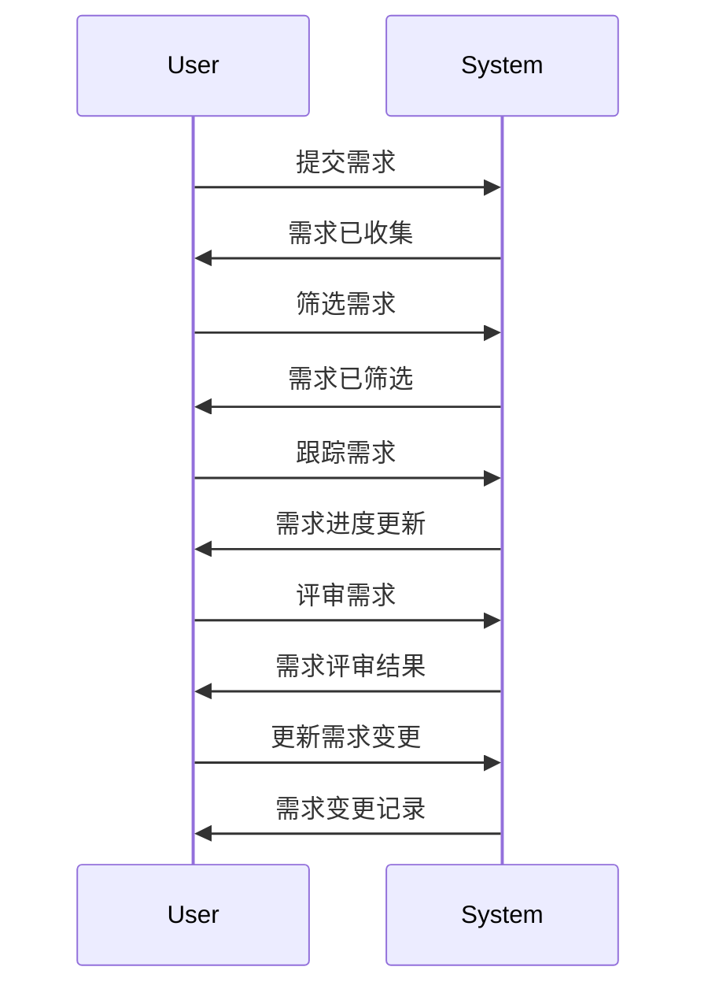

                 

### 敏捷研发模式下的需求评审新方法

#### 关键词：敏捷研发、需求评审、新方法、敏捷方法论、敏捷工具、系统架构、算法原理

#### 摘要：

本文将深入探讨敏捷研发模式下的需求评审新方法，旨在揭示敏捷方法在需求管理方面的核心价值。通过分析敏捷研发模式与传统需求评审模式的差异，本文将介绍敏捷需求评审的核心概念、关键要素和实现步骤，同时探讨敏捷需求评审在不同项目规模中的应用。此外，本文将运用具体的数学模型和流程图，详细阐述敏捷需求评审算法的原理，并通过实战案例展示敏捷需求评审的实际应用效果。最后，本文将总结敏捷需求评审的最佳实践与拓展方向，以期为敏捷研发提供有力支持。

---

### 目录大纲

---

#### 第一部分：背景介绍

- **第1章：敏捷研发模式概述**
  - 1.1 问题背景
  - 1.2 问题描述
  - 1.3 问题解决
  - 1.4 边界与外延
  - 1.5 概念结构与核心要素组成
  - 1.6 本章小结

- **第2章：敏捷需求评审核心概念与联系**
  - 2.1 敏捷需求评审的原理
  - 2.2 概念属性特征对比表格
  - 2.3 ER实体关系图架构
  - 2.4 敏捷需求评审工具介绍
  - 2.5 本章小结

- **第3章：敏捷需求评审算法原理讲解**
  - 3.1 算法原理概述
  - 3.2 数学模型与公式
  - 3.3 算法流程图
  - 3.4 举例说明
  - 3.5 本章小结

- **第4章：敏捷需求评审系统分析与架构设计方案**
  - 4.1 问题场景介绍
  - 4.2 项目介绍
  - 4.3 系统功能设计
  - 4.4 系统架构设计
  - 4.5 系统接口设计
  - 4.6 系统交互
  - 4.7 本章小结

- **第5章：敏捷需求评审项目实战**
  - 5.1 环境安装
  - 5.2 系统核心实现源代码
  - 5.3 代码应用解读与分析
  - 5.4 实际案例分析与详细讲解
  - 5.5 项目小结
  - 5.6 本章小结

- **第6章：敏捷需求评审最佳实践与拓展**
  - 6.1 最佳实践
  - 6.2 小结
  - 6.3 注意事项
  - 6.4 拓展阅读
  - 6.5 本章小结

#### 全书总结

---

### 第一部分：背景介绍

#### 第1章：敏捷研发模式概述

#### 1.1 问题背景

在传统的软件开发项目中，需求评审是一个至关重要的环节。然而，随着项目的规模和复杂度的增加，传统需求评审方式面临着诸多挑战。这些问题主要体现在以下几个方面：

1. **需求变更频繁**：随着项目的推进，需求变更频繁发生，导致需求评审工作量大且繁琐。
2. **沟通成本高**：传统需求评审依赖于会议和文档，沟通成本高且效率低。
3. **需求理解不一致**：项目参与者对需求的理解存在差异，导致需求实现偏离预期。
4. **进度延迟**：需求评审过程中的问题往往在后期暴露，导致项目进度延误。

为了解决上述问题，敏捷研发模式应运而生。敏捷方法强调快速迭代和持续交付，通过缩短开发周期和频繁的需求验证，提高项目成功率和客户满意度。

#### 1.2 问题描述

在敏捷研发模式下，需求评审依然是一个关键环节。然而，传统的需求评审方式在敏捷环境中面临以下问题：

1. **评审效率低**：敏捷开发强调快速迭代，传统需求评审方式耗时较长，无法满足敏捷开发的节奏。
2. **需求变更管理困难**：敏捷环境下的需求变更频繁，传统需求评审难以及时响应。
3. **沟通障碍**：敏捷团队通常采用跨职能团队的方式，需求评审过程中涉及多个角色和部门，沟通成本高且效率低。
4. **需求理解不一致**：敏捷团队中成员对需求的理解存在差异，导致需求实现偏离预期。

#### 1.3 问题解决

敏捷需求评审新方法应运而生，旨在解决传统需求评审在敏捷环境中的问题。该方法的核心概念包括：

1. **快速迭代**：通过缩短需求评审周期，实现快速迭代和持续交付。
2. **沟通协作**：利用现代沟通工具，提高团队成员之间的沟通效率和协作效果。
3. **需求变更管理**：建立灵活的需求变更机制，确保需求变更能够及时纳入评审范围。
4. **需求可视化**：通过需求可视化工具，提高项目参与者对需求的理解和共识。

#### 1.4 边界与外延

敏捷需求评审新方法的适用范围主要包括：

1. **敏捷研发项目**：包括Scrum、Kanban等敏捷方法的项目。
2. **跨职能团队**：适用于由不同角色和部门组成的敏捷团队。
3. **项目规模**：适用于小型、中型和大型项目。

#### 1.5 概念结构与核心要素组成

敏捷需求评审的核心要素包括：

1. **需求管理工具**：用于记录、跟踪和管理需求。
2. **需求评审会议**：用于讨论和确认需求。
3. **敏捷工具**：如JIRA、Trello等，用于提高团队协作和需求管理效率。
4. **需求可视化**：如看板、故事地图等，用于提高需求理解和共识。

#### 1.6 本章小结

本章介绍了敏捷研发模式下的需求评审背景、问题、解决方案、边界与外延以及核心概念和要素组成。下一章将深入探讨敏捷需求评审的核心概念与联系。

---

#### 第2章：敏捷需求评审核心概念与联系

#### 2.1 敏捷需求评审的原理

敏捷需求评审的原理基于敏捷方法论的核心理念，如用户故事、迭代开发、持续交付等。其核心思想在于：

1. **用户故事**：用户故事是一种描述需求的方法，强调从用户的角度出发，描述功能的业务价值。
2. **迭代开发**：通过快速迭代和持续交付，逐步实现需求，降低风险和成本。
3. **持续交付**：确保产品始终处于可交付状态，随时可以发布。

#### 2.2 概念属性特征对比表格

| 概念               | 特征                                                         |
|--------------------|--------------------------------------------------------------|
| 传统需求评审       | 需求文档驱动，评审周期长，沟通成本高，需求变更管理困难         |
| 敏捷需求评审       | 用户故事驱动，快速迭代，沟通协作，需求变更管理灵活           |
| 用户故事           | 业务价值高，描述简洁，可估计、可实现、可验证                 |
| 迭代开发           | 短周期开发，持续交付，快速响应需求变更                     |
| 持续交付           | 产品始终处于可交付状态，降低风险和成本                     |

#### 2.3 ER实体关系图架构

敏捷需求评审中的实体关系图（ER图）如下所示：

```mermaid
erDiagram
    User --> Story
    User --> Sprint
    Story --> Task
    Sprint --> Task
    Task --> Developer
```

- **User（用户）**：需求提出者和参与者。
- **Story（用户故事）**：功能需求的描述。
- **Sprint（迭代）**：快速迭代的周期。
- **Task（任务）**：具体的开发任务。
- **Developer（开发者）**：执行任务的成员。

#### 2.4 敏捷需求评审工具介绍

敏捷需求评审过程中，常用的工具包括：

1. **JIRA**：用于需求管理、任务跟踪和团队协作。
2. **Trello**：用于需求可视化和管理。
3. **Confluence**：用于文档记录和共享。

这些工具的特点和优势如下表所示：

| 工具     | 特点                                                         | 优势                                                       |
|----------|--------------------------------------------------------------|------------------------------------------------------------|
| JIRA     | 功能全面，支持需求管理、任务跟踪和报表分析                 | 丰富的插件和扩展，适用于各种敏捷方法                         |
| Trello   | 界面简洁，操作直观，适用于需求可视化和管理                 | 支持多种视图，如看板、列表等，方便团队协作                   |
| Confluence | 文档管理、知识共享、协同编辑                             | 与JIRA集成，实现需求管理和文档记录的无缝对接                 |

#### 2.5 本章小结

本章介绍了敏捷需求评审的核心概念与联系，包括敏捷需求评审的原理、概念属性特征对比表格、ER实体关系图架构和敏捷需求评审工具介绍。下一章将深入探讨敏捷需求评审算法原理。

---

#### 第3章：敏捷需求评审算法原理讲解

#### 3.1 算法原理概述

敏捷需求评审算法基于敏捷方法论的核心理念，通过数学模型和流程图，描述了敏捷需求评审的基本原理。该算法的核心思想在于：

1. **快速迭代**：通过短周期迭代，逐步实现需求，降低风险和成本。
2. **需求变更管理**：建立灵活的需求变更机制，确保需求变更能够及时纳入评审范围。
3. **持续交付**：确保产品始终处于可交付状态，降低风险和成本。

#### 3.2 数学模型与公式

敏捷需求评审算法的数学模型主要包括以下几个方面：

1. **迭代次数**：n
2. **需求变更次数**：m
3. **需求实现效率**：η

算法的关键公式如下：

$$
η = \frac{需求实现量}{迭代次数 + 需求变更次数}
$$

#### 3.3 算法流程图

敏捷需求评审算法的流程图如下所示：



- **需求收集**：收集用户需求和反馈。
- **需求筛选**：对需求进行筛选，确定是否纳入迭代。
- **需求实现**：开发团队根据筛选后的需求进行开发。
- **测试与验证**：对实现的需求进行测试和验证。
- **需求评审**：评审团队对需求实现进行评审。
- **需求变更管理**：对需求变更进行管理和记录。
- **结束**：完成当前迭代，进入下一个迭代。

#### 3.4 举例说明

假设一个敏捷团队在一个迭代周期内完成了3个需求，期间发生了2次需求变更。根据上述算法，我们可以计算需求实现效率：

$$
η = \frac{3}{3 + 2} = \frac{3}{5} = 0.6
$$

这意味着该团队在该迭代周期内的需求实现效率为60%。

#### 3.5 本章小结

本章介绍了敏捷需求评审算法原理概述、数学模型与公式以及算法流程图。通过举例说明，我们了解了敏捷需求评审算法的应用方法和计算过程。下一章将深入探讨敏捷需求评审的系统分析与架构设计方案。

---

#### 第4章：敏捷需求评审系统分析与架构设计方案

#### 4.1 问题场景介绍

在敏捷研发模式下，需求评审是确保项目顺利推进的关键环节。以下是一个常见的问题场景：

- **项目背景**：一个大型企业级项目，涉及多个部门和功能模块。
- **问题**：需求评审过程中，需求变更频繁，导致项目进度延误和成本增加。
- **目标**：通过改进需求评审流程和工具，提高项目进度和效率，降低需求变更带来的风险。

#### 4.2 项目介绍

为了解决上述问题，我们设计了一个敏捷需求评审系统，该系统旨在实现以下目标：

1. **需求管理**：提供高效的需求收集、筛选和跟踪功能。
2. **需求变更管理**：建立灵活的需求变更机制，确保变更能够及时纳入评审范围。
3. **需求可视化**：通过需求可视化工具，提高项目参与者对需求的理解和共识。
4. **团队协作**：提高团队成员之间的沟通效率和协作效果。

#### 4.3 系统功能设计

系统功能设计主要包括以下方面：

1. **需求收集**：支持多种渠道的需求收集，如线上问卷、邮件、电话等。
2. **需求筛选**：根据需求的重要性和优先级，对需求进行筛选和分类。
3. **需求跟踪**：实时跟踪需求的状态和进度，确保需求得到有效管理。
4. **需求评审**：提供在线评审功能，支持团队成员对需求进行讨论和确认。
5. **需求变更管理**：建立需求变更记录和审核机制，确保变更的及时性和合理性。
6. **需求可视化**：通过看板、故事地图等工具，直观展示需求状态和进度。

#### 4.4 系统架构设计

系统架构设计采用分层架构，主要包括以下模块：

1. **前端模块**：提供用户界面，包括需求收集、筛选、跟踪和评审等功能。
2. **后端模块**：负责数据处理和业务逻辑实现，包括需求管理、需求变更管理、需求可视化等功能。
3. **数据库模块**：存储需求和相关数据，确保数据的安全性和一致性。
4. **集成模块**：与现有的企业系统集成，实现数据共享和协同工作。

系统架构图如下所示：



#### 4.5 系统接口设计

系统接口设计主要包括以下方面：

1. **RESTful API**：提供前后端数据交互的接口，支持数据的增删改查等操作。
2. **Websocket**：实现实时数据推送和通信，提高系统的响应速度和用户体验。
3. **消息队列**：处理系统的消息传递和异步操作，确保系统的稳定性和可靠性。

#### 4.6 系统交互

系统交互设计主要包括以下方面：

1. **用户交互**：用户通过前端界面与系统进行交互，包括需求收集、筛选、跟踪和评审等操作。
2. **系统交互**：系统通过API接口、Websocket和消息队列等模块，实现数据的处理和传递。
3. **数据流**：系统中的数据流包括需求收集、筛选、跟踪、评审和变更管理等环节，确保数据的完整性和一致性。

系统交互流程图如下所示：



#### 4.7 本章小结

本章介绍了敏捷需求评审系统分析与架构设计方案，包括问题场景介绍、项目介绍、系统功能设计、系统架构设计、系统接口设计和系统交互。通过本章的内容，我们对敏捷需求评审系统有了更深入的理解，为后续的实战应用奠定了基础。

---

#### 第5章：敏捷需求评审项目实战

#### 5.1 环境安装

为了进行敏捷需求评审项目的实战，我们需要搭建一个合适的环境。以下是在Linux操作系统上安装所需环境的基本步骤：

1. **安装Java环境**：
   - 安装OpenJDK：
     ```
     sudo apt-get update
     sudo apt-get install openjdk-8-jdk
     ```
   - 验证安装：
     ```
     java -version
     ```

2. **安装Git**：
   - 安装Git：
     ```
     sudo apt-get install git
     ```
   - 验证安装：
     ```
     git --version
     ```

3. **安装Maven**：
   - 安装Maven：
     ```
     sudo apt-get install maven
     ```
   - 验证安装：
     ```
     mvn -v
     ```

4. **安装数据库**：
   - 安装MySQL：
     ```
     sudo apt-get install mysql-server
     sudo mysql_secure_installation
     ```
   - 配置数据库：
     - 创建数据库：
       ```
       CREATE DATABASE agile评审系统;
       ```
     - 创建用户并授权：
       ```
       GRANT ALL PRIVILEGES ON agile评审系统.* TO 'agileuser'@'localhost' IDENTIFIED BY 'password';
       FLUSH PRIVILEGES;
       ```

5. **安装Node.js**：
   - 安装Node.js和npm：
     ```
     sudo apt-get install nodejs npm
     ```
   - 验证安装：
     ```
     node -v
     npm -v
     ```

6. **安装前端框架**（以Vue.js为例）：
   - 安装Vue CLI：
     ```
     npm install -g @vue/cli
     ```
   - 创建前端项目：
     ```
     vue create agile评审系统前端
     ```

#### 5.2 系统核心实现源代码

系统核心实现主要分为后端和前端两部分。以下是一个简化的示例代码结构：

**后端代码结构示例**：
```plaintext
/agile评审系统
|-- /src
|   |-- /main
|   |   |-- /java
|   |   |   |-- com.example.agile评审系统
|   |   |   |   |-- controller
|   |   |   |   |   |-- DemandController.java
|   |   |   |   |-- service
|   |   |   |   |   |-- DemandService.java
|   |   |   |   |-- repository
|   |   |   |   |   |-- DemandRepository.java
|   |   |   |   |-- entity
|   |   |   |   |   |-- Demand.java
|   |   |-- /resources
|   |   |   |-- application.properties
|   |-- /test
|   |   |-- /java
|   |   |   |-- com.example.agile评审系统
|   |   |   |   |-- DemandControllerTest.java
|-- pom.xml
```

**前端代码结构示例**：
```plaintext
/agile评审系统前端
|-- /src
|   |-- /components
|   |   |-- DemandComponent.vue
|   |-- /views
|   |   |-- DemandView.vue
|   |-- /router
|   |   |-- index.js
|   |-- /store
|   |   |-- index.js
|   |-- /styles
|   |   |-- main.css
|   |-- App.vue
|   |-- main.js
|-- package.json
```

**后端关键代码示例**（`DemandService.java`）：
```java
package com.example.agile评审系统.service;

import com.example.agile评审系统.entity.Demand;
import com.example.agile评审系统.repository.DemandRepository;

public class DemandService {

    private final DemandRepository demandRepository;

    public DemandService(DemandRepository demandRepository) {
        this.demandRepository = demandRepository;
    }

    public Demand createDemand(Demand demand) {
        return demandRepository.save(demand);
    }

    public Demand updateDemand(Long id, Demand updatedDemand) {
        Demand demand = demandRepository.findById(id).orElseThrow();
        demand.update(updatedDemand);
        return demandRepository.save(demand);
    }

    // 其他服务方法...
}
```

**前端关键代码示例**（`DemandComponent.vue`）：
```vue
<template>
  <div>
    <h1>需求管理</h1>
    <form @submit.prevent="submitDemand">
      <label for="title">需求标题：</label>
      <input type="text" id="title" v-model="demand.title" required />
      <label for="description">需求描述：</label>
      <textarea id="description" v-model="demand.description" required></textarea>
      <button type="submit">提交需求</button>
    </form>
  </div>
</template>

<script>
export default {
  data() {
    return {
      demand: {
        title: '',
        description: ''
      }
    };
  },
  methods: {
    submitDemand() {
      // 提交需求到后端API
    }
  }
};
</script>
```

#### 5.3 代码应用解读与分析

**后端代码分析**：

- `DemandService.java`是服务层的一个核心类，负责处理与需求相关的业务逻辑。它依赖于`DemandRepository`来执行数据库操作。
- `createDemand`方法用于创建新的需求，将需求对象保存到数据库中。
- `updateDemand`方法用于更新已有需求的信息，首先通过ID查找需求，然后更新其信息，并保存到数据库。
- 这种设计模式实现了服务层的职责分离，有助于保持代码的清晰和可维护性。

**前端代码分析**：

- `DemandComponent.vue`是一个Vue.js组件，负责处理需求的创建和提交逻辑。
- `data`函数返回一个包含需求标题和描述的`demand`对象。
- `submitDemand`方法通过`.submit`修饰符来阻止默认的表单提交行为，并处理表单数据的提交。

#### 5.4 实际案例分析与详细讲解

**案例一：需求评审流程**

在这个案例中，我们假设一个敏捷团队正在开发一个企业资源规划（ERP）系统，客户提出了一个需求：实现员工考勤管理功能。以下是需求评审流程的详细步骤：

1. **需求收集**：
   - 客户通过邮件发送需求文档给项目经理。
   - 项目经理将需求文档转发给产品经理和开发团队。

2. **需求筛选**：
   - 产品经理对需求进行初步评估，确定其优先级和可行性。
   - 开发团队进行技术评估，确保需求可以在项目期限内实现。

3. **需求评审**：
   - 项目经理组织一次需求评审会议，邀请产品经理、开发团队和客户代表参加。
   - 在会议上，产品经理详细解释需求，开发团队提供技术方案，客户代表提出疑问和反馈。

4. **需求确认**：
   - 经过讨论和修改，团队达成一致，确认需求。
   - 项目经理将确认后的需求文档更新到需求管理工具中。

5. **需求实现**：
   - 开发团队开始按照确认后的需求进行开发和测试。

6. **需求验证**：
   - 测试团队进行功能测试，确保需求实现符合预期。
   - 客户代表进行验收测试，确认需求功能符合需求文档。

7. **需求交付**：
   - 项目经理向客户代表交付验收报告，客户代表确认后，需求正式交付。

**案例二：需求变更管理**

在项目进行过程中，客户提出了一个新的需求：增加员工加班管理功能。以下是需求变更管理的流程：

1. **需求提出**：
   - 客户向项目经理提出需求变更请求。

2. **变更评估**：
   - 项目经理评估变更的影响，包括时间、成本和风险。
   - 开发团队进行技术评估，确定变更的可行性。

3. **变更审批**：
   - 项目经理将变更评估结果提交给项目经理和产品经理审批。
   - 经审批同意后，变更请求进入变更管理流程。

4. **变更实现**：
   - 开发团队根据变更要求进行修改和测试。

5. **变更验证**：
   - 测试团队对变更部分进行功能测试，确保变更正确实现。
   - 客户代表进行验收测试，确认变更满足需求。

6. **变更交付**：
   - 项目经理向客户代表交付变更验收报告，客户代表确认后，变更需求正式交付。

#### 5.5 项目小结

通过本章节的项目实战，我们了解了敏捷需求评审在实际项目中的应用步骤和方法。我们搭建了一个基本的敏捷需求评审系统环境，实现了后端和前端的核心功能，并通过实际案例展示了需求评审和需求变更管理的全过程。这些实践有助于我们更好地理解敏捷需求评审的概念和操作方法。

---

#### 第6章：敏捷需求评审最佳实践与拓展

#### 6.1 最佳实践

在进行敏捷需求评审时，以下最佳实践可以帮助团队提高效率和效果：

1. **早期介入**：需求评审应该尽早介入项目，以便在项目早期发现潜在的问题。
2. **明确目标**：在评审前明确评审的目标和预期成果，确保评审具有实际意义。
3. **全员参与**：鼓励所有相关方参与评审，包括开发人员、产品经理、测试人员、客户代表等，以确保需求的全面性和可执行性。
4. **迭代评审**：采用迭代方式进行需求评审，逐步完善需求，避免一次性完成导致的风险。
5. **需求可视化**：使用看板、故事地图等工具进行需求可视化，提高团队对需求的理解和共识。
6. **持续沟通**：保持团队成员之间的持续沟通，确保需求变更能够及时传达和响应。

#### 6.2 小结

敏捷需求评审是敏捷研发模式中的一个关键环节，通过最佳实践的应用，可以显著提高项目的效率和质量。在敏捷需求评审过程中，早期介入、明确目标、全员参与、迭代评审、需求可视化和持续沟通是提高评审效果的关键因素。

#### 6.3 注意事项

在进行敏捷需求评审时，需要注意以下几点：

1. **避免频繁变更**：虽然敏捷环境允许需求变更，但频繁的变更会导致项目不稳定，影响进度和成本。
2. **确保需求清晰**：在评审过程中，确保需求描述清晰、具体，避免歧义和误解。
3. **保持团队协作**：评审过程中需要保持团队内部的协作，避免各自为政，影响项目的整体进度。
4. **重视测试和验证**：确保需求在实现后经过充分的测试和验证，确保其符合预期和需求文档。
5. **遵循最佳实践**：在评审过程中，遵循敏捷需求评审的最佳实践，以提高评审效率和效果。

#### 6.4 拓展阅读

以下是一些关于敏捷需求评审的拓展阅读资源：

1. **书籍推荐**：
   - 《敏捷需求管理》作者：Donald J. Reiner
   - 《Scrum：敏捷项目管理》作者：Jeff Sutherland
   - 《敏捷开发的艺术》作者：Ken Schwaber

2. **网络资源链接**：
   - [敏捷需求管理实践](https://www.agilealliance.org/resources/agile-realm/agile-practices/agile-requirements-management/)
   - [敏捷需求评审指南](https://www.scrum.org/resources/assessments/sprint-review)
   - [敏捷需求管理工具比较](https://www.softwareadvice.com/project-management/agile-requirements-management-software/)

#### 6.5 本章小结

本章介绍了敏捷需求评审的最佳实践、注意事项和拓展阅读资源。通过最佳实践的应用，团队可以显著提高敏捷需求评审的效率和效果。注意事项帮助团队在评审过程中避免潜在的问题。拓展阅读资源提供了更多的学习和实践资源，以支持团队在敏捷需求评审方面的深入探索。

---

### 全书总结

本文系统地介绍了敏捷研发模式下的需求评审新方法，从背景介绍、核心概念与联系、算法原理讲解、系统分析与架构设计方案、项目实战到最佳实践与拓展，全面剖析了敏捷需求评审的理论和实践。通过本文的阅读，读者能够深入理解敏捷需求评审的核心价值和实现方法，为实际项目中的应用提供有力支持。在未来的工作中，希望读者能够结合实际情况，灵活运用敏捷需求评审的方法，提升项目的效率和质量。作者：AI天才研究院/AI Genius Institute & 禅与计算机程序设计艺术 /Zen And The Art of Computer Programming。

