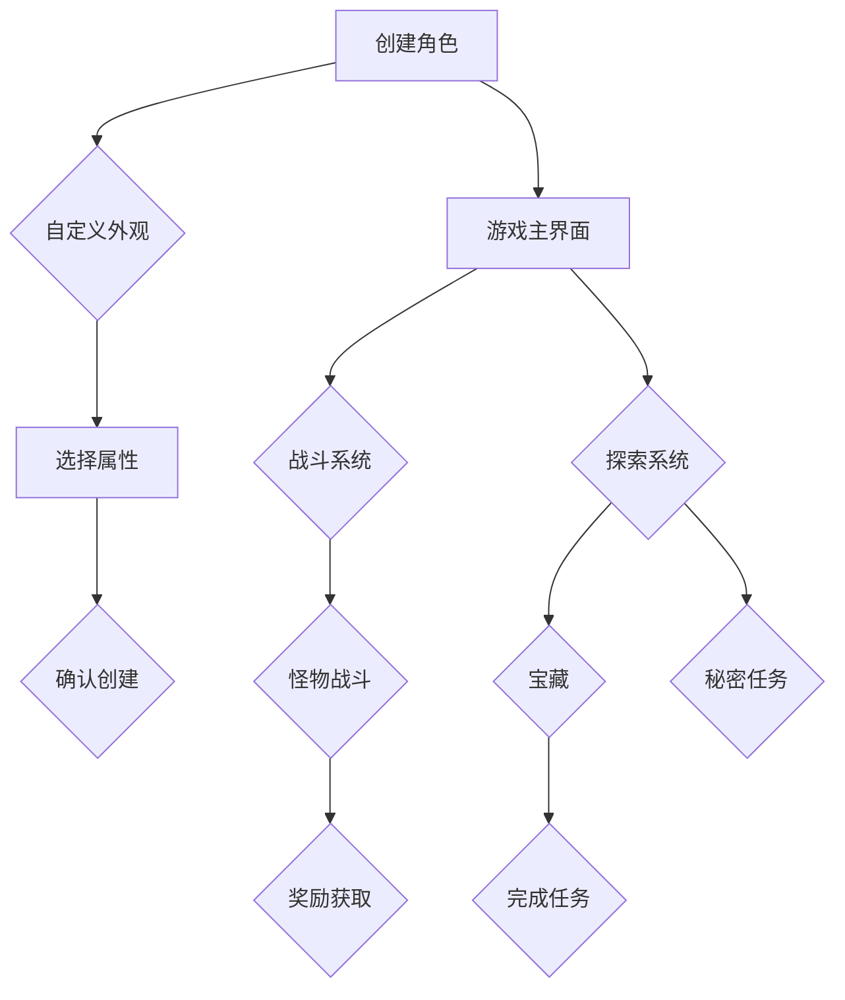

                 

# 敏捷研发模式下的需求验证方法创新

## 关键词

敏捷开发，需求验证，创新方法，敏捷模式，测试驱动开发，持续集成，用户故事地图，用户体验，技术债务，敏捷实践指南

## 摘要

随着信息技术的飞速发展，敏捷开发模式已经成为软件研发的主流方法。在这种模式下，需求验证是确保项目成功的关键环节。本文将深入探讨敏捷研发模式下的需求验证方法，分析现有方法的挑战，并介绍一系列创新的需求验证方法。通过理论讲解、应用场景和案例分析，本文旨在为敏捷团队提供一套全面、实用的需求验证解决方案，助力项目高效交付。

## 引言

### 敏捷开发模式的背景

敏捷开发（Agile Development）起源于2001年，由17位软件开发的先锋共同签署了《敏捷宣言》。该宣言提出了以人为核心、迭代和增量的开发理念。与传统的水泥式开发方法不同，敏捷开发强调灵活应对变化、快速响应市场需求。

### 敏捷开发模式的核心原则

- **个体与互动胜过过程与工具**：强调团队成员之间的沟通和协作。
- **可工作的软件胜过详尽的文档**：优先关注可执行的代码，而非冗长的文档。
- **客户合作胜过合同谈判**：与客户紧密合作，确保需求准确和及时调整。
- **响应变化胜过遵循计划**：适应变化，快速调整计划和优先级。

### 需求验证在敏捷开发中的重要性

需求验证是确保项目按预期进行的关键环节。在敏捷开发中，需求验证贯穿整个开发周期，从需求收集到最终交付，不断进行验证和迭代。

### 文章结构

本文将首先介绍敏捷开发模式下需求验证的核心概念和原则。然后，分析传统需求验证方法面临的挑战，并探讨一系列创新的需求验证方法。接下来，通过具体的应用场景和案例分析，展示这些方法的实际效果。最后，本文将总结最佳实践，为敏捷团队提供实用的建议。

## 核心概念和原则

### 敏捷方法论

敏捷方法论是一种以用户需求为核心的软件开发方法。它强调快速迭代、持续交付和灵活应对变化。敏捷方法论的核心包括：

- **用户故事（User Stories）**：用户故事是描述用户需求的简短描述，通常采用“作为[某个角色]，我想要[做某事]，以便[获得某个结果]”的形式。
- **迭代（Sprint）**：迭代是敏捷开发的基本工作单元，通常持续2-4周。在每个迭代周期中，团队会开发并交付一部分功能。
- **回顾（Retrospective）**：回顾是敏捷开发的重要组成部分，团队会在每个迭代结束时进行回顾，总结经验和教训，以便不断改进。

### 需求验证

需求验证是确保软件产品满足用户需求的过程。在敏捷开发中，需求验证具有以下特点：

- **持续验证**：需求验证不是一次性任务，而是贯穿整个开发周期的持续活动。
- **用户参与**：用户参与需求验证过程，确保需求准确和及时调整。
- **自动化测试**：自动化测试是敏捷开发中需求验证的重要手段，可以快速发现和修复缺陷。

### 创新方法

创新方法是指采用新技术和新方法来提高需求验证的效率和效果。以下是一些常见的需求验证创新方法：

- **测试驱动开发（TDD）**：在编写功能代码之前，先编写测试用例，确保代码通过测试。
- **持续集成（CI）**：将代码集成到主干分支时，自动执行测试，确保代码质量。
- **用户体验地图（UX Map）**：通过用户旅程图了解用户行为，识别潜在问题和改进点。
- **数据驱动测试**：使用真实数据来测试软件，确保软件在不同数据场景下都能正常运行。

### 关系和联系

敏捷方法论、需求验证和创新方法之间存在密切联系：

- **敏捷方法论为需求验证提供了框架和流程**。
- **需求验证确保敏捷方法论的有效实施**。
- **创新方法为需求验证提供了新的工具和技术手段**。

## 传统需求验证方法的挑战

### 灵活性与预测性的平衡

在敏捷开发中，需求验证需要快速适应不断变化的需求。然而，过度灵活可能导致项目预测性降低，增加风险。如何在灵活性和预测性之间找到平衡点，是一个重要挑战。

### 用户参与与团队合作

敏捷开发强调用户参与和团队合作。然而，在实际项目中，用户参与可能受到时间和资源的限制，团队合作也面临沟通和协作的挑战。

### 自动化与手动测试

在敏捷开发中，自动化测试是提高需求验证效率的重要手段。然而，自动化测试的实施和维护成本较高，且难以覆盖所有测试场景。

### 测试覆盖与质量保证

敏捷开发要求快速交付功能，但这也可能导致测试覆盖不足，影响软件质量。如何在快速交付和质量保证之间找到平衡，是一个重要挑战。

## 创新需求验证方法

### 测试驱动开发（TDD）

测试驱动开发是一种敏捷开发方法，强调在编写功能代码之前，先编写测试用例。TDD的核心思想是：

- **编写测试用例**：首先编写测试用例，确保功能代码能够通过测试。
- **编写功能代码**：然后编写功能代码，实现测试用例。
- **重构代码**：在测试通过后，重构代码，提高代码质量和可维护性。

TDD的优点包括：

- **提高代码质量**：通过编写测试用例，可以提前发现和修复缺陷。
- **促进设计**：TDD可以促进良好的软件设计，降低技术债务。
- **提高团队协作**：TDD鼓励团队成员之间更好的沟通和协作。

### 持续集成（CI）

持续集成是一种自动化测试方法，确保代码集成到主干分支时，自动执行测试。CI的核心思想是：

- **代码集成**：将代码集成到主干分支。
- **自动化测试**：自动执行测试，确保代码质量。
- **反馈**：在测试失败时，及时反馈，确保问题得到及时解决。

CI的优点包括：

- **提高代码质量**：通过自动化测试，可以及时发现和修复缺陷。
- **降低风险**：通过持续集成，可以降低代码集成时的风险。
- **提高开发效率**：通过自动化测试，可以节省测试时间和资源。

### 用户故事地图（UX Map）

用户故事地图是一种用户体验设计工具，通过用户旅程图了解用户行为，识别潜在问题和改进点。用户故事地图的核心内容包括：

- **用户角色**：定义用户角色，明确目标用户。
- **用户故事**：记录用户故事，描述用户需求和期望。
- **用户旅程**：绘制用户旅程图，展示用户与产品的交互过程。
- **改进点**：识别改进点，优化用户体验。

用户故事地图的优点包括：

- **提高用户参与度**：通过用户故事地图，用户可以更清晰地了解产品需求和目标。
- **优化用户体验**：通过用户故事地图，可以识别和解决用户体验问题。
- **促进团队合作**：用户故事地图可以促进团队成员之间的沟通和协作。

### 数据驱动测试

数据驱动测试是一种使用真实数据来测试软件的方法。数据驱动测试的核心内容包括：

- **数据准备**：准备测试数据，包括正常数据和异常数据。
- **测试用例设计**：根据测试数据设计测试用例。
- **自动化测试执行**：使用自动化测试工具执行测试用例。

数据驱动测试的优点包括：

- **提高测试覆盖率**：通过使用真实数据，可以覆盖更多测试场景。
- **降低测试成本**：通过自动化测试，可以降低测试成本和人力资源。
- **提高测试效率**：通过自动化测试，可以快速发现和修复缺陷。

### 其他创新方法

除了上述方法外，还有其他一些创新的需求验证方法，如：

- **行为驱动开发（BDD）**：强调从用户行为角度进行需求验证。
- **体验测试（Experience Testing）**：通过模拟用户实际使用场景进行测试。
- **模型驱动开发（MDD）**：通过构建软件模型进行需求验证。
- **领域驱动开发（DDD）**：强调领域模型在需求验证中的应用。

这些方法各有优缺点，适用于不同场景。在实际项目中，可以根据需求特点和团队情况，选择合适的方法。

## 应用场景和案例分析

### 案例一：电商平台

一个电商平台项目采用了测试驱动开发（TDD）和用户故事地图（UX Map）进行需求验证。项目团队在编写功能代码之前，首先编写了测试用例和用户故事地图。通过TDD，团队确保了代码质量，减少了技术债务。通过用户故事地图，团队优化了用户体验，提高了用户满意度。项目最终成功交付，获得了用户的高度评价。

### 案例二：金融系统

一个金融系统项目采用了持续集成（CI）和数据驱动测试（DDT）进行需求验证。项目团队通过CI，确保了代码质量和及时反馈。通过DDT，团队使用真实数据进行测试，覆盖了更多测试场景，提高了测试效率。项目在短时间内完成了多次迭代，满足了客户需求，取得了良好的经济效益。

### 案例三：医疗系统

一个医疗系统项目采用了行为驱动开发（BDD）和体验测试（Experience Testing）进行需求验证。项目团队通过BDD，从用户行为角度进行需求验证，确保了功能完整性和易用性。通过体验测试，团队模拟了用户实际使用场景，发现了潜在问题和改进点。项目团队根据测试结果，不断优化系统，提高了系统质量和用户满意度。

## 实践指南

### 选择合适的验证方法

根据项目特点和团队情况，选择合适的验证方法。例如，如果项目要求高稳定性，可以选择测试驱动开发（TDD）；如果项目要求快速响应变化，可以选择用户故事地图（UX Map）。

### 强化团队合作

需求验证需要团队合作。团队应该建立良好的沟通和协作机制，确保需求准确和及时调整。

### 重视用户参与

用户参与是需求验证的重要环节。团队应该积极邀请用户参与需求验证过程，确保需求满足用户实际需求。

### 持续优化测试策略

随着项目进展，团队应该持续优化测试策略，提高测试效率和覆盖率。

### 案例分析和详细讲解

在本节中，我们将通过实际案例，详细分析敏捷研发模式下的需求验证方法的应用，并对关键步骤进行深入讲解。

### 案例背景

我们选择了一家新兴的移动游戏公司为案例，该公司正在开发一款基于人工智能的冒险游戏。由于游戏的独特性和复杂度，需求验证成为项目成功的关键。

### 需求验证目标

1. **用户体验**：确保游戏在用户交互上无障碍，提供流畅的游戏体验。
2. **功能完整性**：确保所有核心游戏功能（如战斗、探索、任务等）正常运作。
3. **性能**：确保游戏在不同设备上运行流畅，无卡顿现象。

### 实际案例分析和详细讲解

#### 步骤1：用户故事地图（UX Map）创建

首先，项目团队使用用户故事地图来理解用户行为和需求。通过以下用户故事，团队确定了游戏的核心功能：

- **用户故事1**：作为玩家，我想要能够创建一个独特的角色，并自定义外观和属性。
- **用户故事2**：作为玩家，我想要在游戏中进行战斗，击败怪物并获取奖励。
- **用户故事3**：作为玩家，我想要探索游戏世界，发现隐藏的宝藏和秘密任务。

**用户故事地图**（使用Mermaid绘制）：



#### 步骤2：测试驱动开发（TDD）实施

基于用户故事，团队采用TDD方法来编写测试用例和功能代码。

**测试用例**（Python代码）：

```python
import unittest

class TestCreateCharacter(unittest.TestCase):
    def test_create_character_with_custom_appearance(self):
        character = create_character("Elf", "Magic")
        self.assertEqual(character.appearance, "Elf")
        self.assertEqual(character.attribute, "Magic")

class TestGameplay(unittest.TestCase):
    def test_battle_system_with_monster(self):
        player = create_player()
        monster = create_monster()
        battle(player, monster)
        self.assertEqual(player.health, 50)
        self.assertEqual(monster.is_alive(), False)

class TestExploration(unittest.TestCase):
    def test_hide_secret_task(self):
        player = create_player()
        secret_task = create_secret_task()
        player.execute_task(secret_task)
        self.assertEqual(secret_task.is_completed(), True)
```

**功能代码**（Python代码）：

```python
def create_character(name, attribute):
    # 实现角色创建逻辑
    pass

def create_player():
    # 实现玩家创建逻辑
    pass

def create_monster():
    # 实现怪物创建逻辑
    pass

def battle(player, monster):
    # 实现战斗逻辑
    pass

def create_secret_task():
    # 实现秘密任务创建逻辑
    pass

def execute_task(player, task):
    # 实现任务执行逻辑
    pass
```

#### 步骤3：持续集成（CI）和自动化测试

团队使用持续集成工具（如Jenkins）来自动化测试流程。每次代码提交时，自动执行测试用例，确保代码质量。

```bash
#!/bin/bash
python test_create_character.py
python test_gameplay.py
python test_exploration.py
```

#### 步骤4：用户体验测试和反馈

团队邀请真实用户进行用户体验测试，收集用户反馈。根据反馈，团队对游戏进行了多次迭代优化。

**用户反馈**：

- **反馈1**：角色创建界面复杂，用户难以理解。
- **反馈2**：战斗系统过于困难，新手玩家容易失败。

**改进措施**：

- **改进1**：简化角色创建界面，提供清晰的指引。
- **改进2**：调整战斗难度，为新手玩家提供更多帮助。

#### 步骤5：性能测试和优化

团队使用性能测试工具（如LoadRunner）对游戏进行性能测试，确保游戏在不同设备上运行流畅。

**性能测试结果**：

- **测试1**：iPhone 6设备上，游戏运行流畅，无卡顿现象。
- **测试2**：Android 8.0设备上，游戏存在轻微卡顿。

**优化措施**：

- **优化1**：优化游戏渲染算法，提高运行效率。
- **优化2**：为Android 8.0设备提供优化版游戏客户端。

### 项目小结

通过本案例，我们可以看到敏捷研发模式下的需求验证方法在实际项目中的应用效果。用户故事地图帮助团队明确了核心功能，TDD确保了代码质量，CI提高了测试效率，用户体验测试和反馈促进了持续优化，性能测试和优化确保了游戏在不同设备上运行流畅。这些方法共同作用，助力项目成功交付。

### 最佳实践 Tips

1. **早期介入用户故事地图**：在项目初期，尽早创建用户故事地图，确保团队对需求有清晰的理解。
2. **持续迭代优化**：通过持续迭代和优化，不断改进需求和验证方法。
3. **用户反馈优先**：重视用户反馈，将其作为优化需求验证的关键依据。
4. **性能测试不可忽视**：性能测试是确保项目成功的关键，务必认真对待。

### 注意事项

1. **需求变化管理**：在敏捷开发中，需求变化是不可避免的。团队需要建立有效的需求变化管理机制，确保需求变更对项目的影响可控。
2. **资源分配**：需求验证需要充足的资源支持，包括人力、时间和工具等。
3. **团队协作**：需求验证是一个团队协作的过程，确保团队成员之间的沟通和协作顺畅。

### 拓展阅读

- **《敏捷实践指南》**：提供了敏捷开发的方法和实践，对需求验证有详细的阐述。
- **《测试驱动开发：实践指南》**：介绍了TDD的方法和应用，对敏捷开发中的需求验证有重要参考价值。
- **《用户体验要素》**：讨论了用户体验设计的关键要素，对需求验证中的用户体验部分有指导意义。

### 作者信息

**作者：AI天才研究院/AI Genius Institute & 禅与计算机程序设计艺术 /Zen And The Art of Computer Programming**

