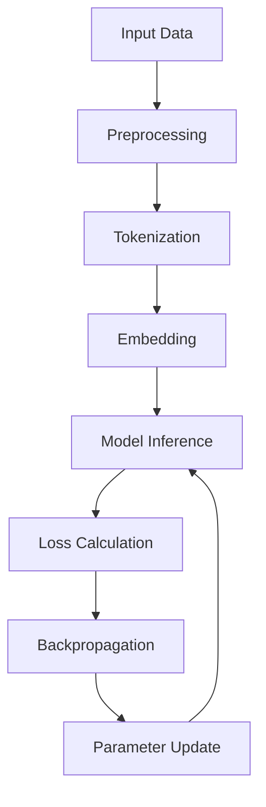
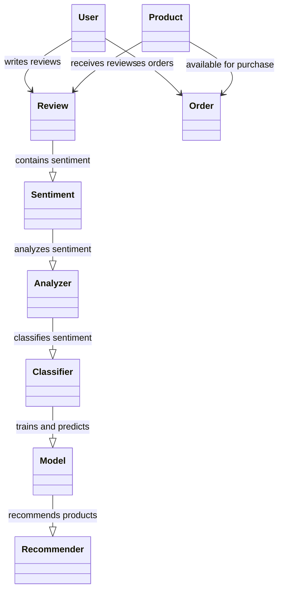
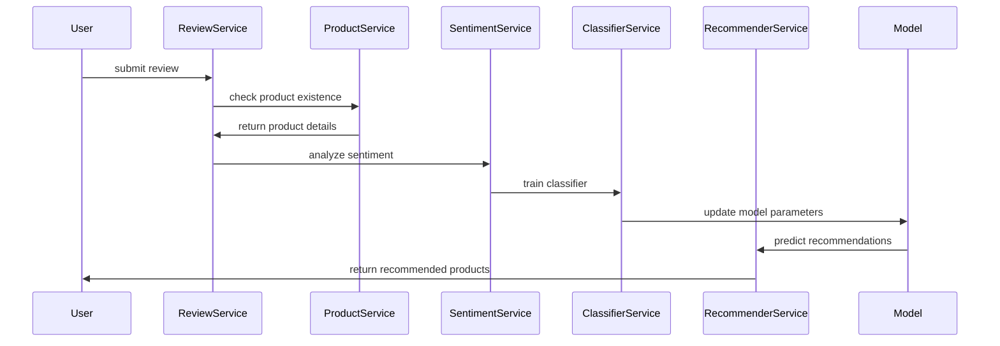
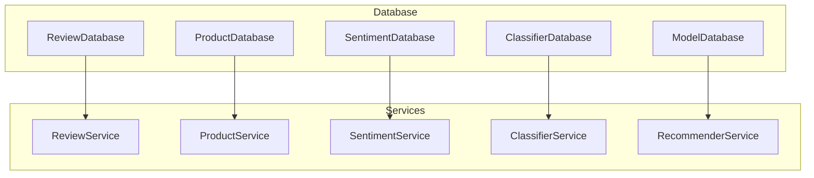

                 

# 敏捷迭代在LLM应用开发中的实践与挑战

> 关键词：敏捷迭代、LLM、大模型、人工智能、开发实践

> 摘要：本文将深入探讨敏捷迭代方法在大型语言模型（LLM）应用开发中的实践与挑战。通过详细解析敏捷迭代的基本概念、原则和流程，并结合LLM开发的独特需求，分析敏捷迭代在LLM应用开发中的实际应用和面临的挑战，最终提出一系列应对策略和最佳实践。

## 第二部分：敏捷迭代方法基础

### 第2章：敏捷迭代概念与原则

#### 2.1 敏捷迭代定义

**2.1.1 敏捷迭代概述**

敏捷迭代是一种软件开发方法，它强调快速反馈、持续交付和团队协作。敏捷迭代方法的核心在于将整个开发过程划分为一系列小周期（通常称为迭代或 sprint），每个迭代都专注于交付可用的软件功能。敏捷迭代方法旨在通过不断反馈和调整，确保项目能够快速响应变化并持续交付高质量的产品。

**2.1.2 敏捷迭代与传统开发模式的区别**

传统的软件开发方法通常采用瀑布模型，即按照固定的顺序进行需求分析、设计、开发、测试和部署。这种方法在项目初期定义所有需求和细节，然后在后续阶段逐步实施。然而，这种方法存在以下问题：

1. **延迟反馈**：在项目完成之前，用户难以看到实际成果，直到最终测试阶段才能发现潜在的问题。
2. **难以适应变化**：一旦需求确定，后期修改成本高昂。
3. **质量难以保证**：在项目后期才发现的问题往往难以解决。

相比之下，敏捷迭代方法具有以下特点：

1. **快速反馈**：每个迭代结束后，团队都会进行回顾和评估，以识别改进点。
2. **灵活适应**：需求可以在开发过程中随时调整，以更好地满足用户需求。
3. **持续交付**：每个迭代都交付一个可用的产品版本，用户可以尽早使用和反馈。

**2.1.3 敏捷迭代的核心特点**

敏捷迭代的核心特点包括：

1. **用户至上**：用户需求是驱动力，产品开发和优化始终围绕用户需求进行。
2. **持续交付**：每次迭代都交付一个可用的产品版本，确保产品始终处于可使用状态。
3. **模块化开发**：将项目分解为可管理的模块，提高开发效率。
4. **灵活适应**：快速响应需求变化，以保持项目的灵活性和可持续性。

#### 2.2 敏捷迭代原则

**2.2.1 用户至上**

敏捷迭代方法强调用户至上，认为用户需求是产品开发的驱动力。这意味着开发团队需要与用户保持紧密沟通，确保每个迭代都能满足用户的需求。用户至上原则有助于确保产品能够真正解决用户问题，从而提高用户满意度和市场竞争力。

**2.2.2 持续交付**

持续交付是敏捷迭代方法的核心原则之一。它要求团队在每个迭代结束时交付一个可用的产品版本，而不是等到项目结束。这种方法确保用户可以尽早使用产品，并提供反馈，以便团队在后续迭代中进行改进。持续交付有助于减少项目风险，提高产品质量。

**2.2.3 模块化开发**

模块化开发将项目分解为可管理的模块，每个模块都有明确的功能和职责。这种方法有助于提高开发效率，因为团队可以同时工作于不同的模块，而不是等待其他模块的开发完成。模块化开发还提高了代码的可维护性和可扩展性。

**2.2.4 灵活适应**

敏捷迭代方法强调灵活适应，以应对项目过程中的变化和不确定性。团队需要具备快速调整计划和优先级的能力，以确保项目能够适应新的需求和市场动态。灵活适应有助于降低项目风险，提高项目成功率。

#### 2.3 敏捷迭代框架

**2.3.1 敏捷迭代流程**

敏捷迭代流程通常包括以下几个阶段：

1. **需求收集**：与用户和利益相关者沟通，收集和记录需求。
2. **用户故事编写**：将需求编写成用户故事，每个故事都应该具有明确的目标和优先级。
3. **迭代计划**：确定每个迭代的目标和任务，分配资源和时间。
4. **开发与测试**：实现用户故事，并进行测试，确保每个迭代交付的产品版本符合预期。
5. **回顾与评估**：在每个迭代结束时，团队进行回顾和评估，以识别改进点。

**2.3.2 敏捷迭代工具**

敏捷迭代方法使用一系列工具来支持流程和团队协作，包括：

1. **版本控制工具**：如Git，用于管理和追踪代码变更。
2. **敏捷看板**：用于可视化任务状态和进度，如JIRA或Trello。
3. **自动化测试工具**：如Selenium或JUnit，用于确保代码质量。
4. **持续集成工具**：如Jenkins或Travis CI，用于自动化构建和测试。

**2.3.3 敏捷迭代与传统项目管理方法的对比**

传统项目管理方法侧重于严格的计划和监控，而敏捷迭代方法则更注重灵活性、协作和反馈。传统方法适用于需求明确、变化较小的项目，而敏捷迭代方法适用于需求多变、不确定性较高的项目。

#### 2.4 敏捷迭代实践

**2.4.1 敏捷迭代在团队协作中的应用**

敏捷迭代方法鼓励跨职能团队协作，团队成员来自不同领域，如开发、测试、设计等。这种方式有助于提高沟通效率，确保项目在不同阶段都能得到全面的支持。

**2.4.2 敏捷迭代在项目规划中的应用**

敏捷迭代方法强调迭代规划，即在每个迭代开始前制定详细计划。这种规划有助于明确迭代目标、任务和时间表，从而确保项目按计划进行。

**2.4.3 敏捷迭代在需求管理中的应用**

敏捷迭代方法强调需求管理，通过用户故事和迭代计划确保项目需求得到有效管理。这种方法有助于快速响应需求变化，确保项目始终符合用户需求。

### 第3章：敏捷迭代流程与工具

#### 3.1 敏捷迭代流程

**3.1.1 用户故事**

用户故事是敏捷迭代方法的核心概念之一，它描述了用户需求的功能和目标。用户故事通常具有以下格式：

```  
As a [用户角色]，I want to [功能]，so that [目标]  
```

用户故事应该简短、具体和可测试，以便团队可以将其分解为可管理的任务。

**3.1.2 迭代计划**

迭代计划是敏捷迭代流程的关键阶段，团队需要确定每个迭代的目标、任务和时间表。迭代计划通常包括以下步骤：

1. **确定迭代目标**：明确本次迭代要实现的功能和目标。
2. **任务分配**：将任务分配给团队成员，并确定各自的职责和进度。
3. **时间表制定**：根据任务分配和进度要求，制定迭代的时间表。
4. **评审与确认**：与利益相关者评审和确认迭代计划，确保计划符合预期。

**3.1.3 任务分解**

任务分解是将大型任务分解为更小、更易于管理的子任务。这种方法有助于提高开发效率和代码可维护性。任务分解通常包括以下步骤：

1. **确定任务范围**：明确每个任务的目标和范围。
2. **分解为子任务**：将任务分解为更小的子任务，以便团队可以同时工作。
3. **任务优先级排序**：根据任务的重要性和紧急性进行排序，确保关键任务优先完成。

**3.1.4 持续集成与测试**

持续集成（CI）是一种软件开发实践，它确保每次代码变更都经过自动化测试，以确保代码质量和稳定性。持续集成通常包括以下步骤：

1. **代码提交**：开发人员将代码提交到版本控制系统。
2. **自动化构建**：构建系统自动构建和打包代码。
3. **自动化测试**：运行自动化测试脚本，确保代码符合预期。
4. **反馈与修复**：如果测试失败，开发人员需要修复问题，然后重新提交代码。

持续集成有助于减少集成风险，提高代码质量和开发效率。

**3.2 敏捷迭代工具**

**3.2.1 版本控制工具**

版本控制工具（如Git）用于管理和追踪代码变更。Git的主要功能包括：

1. **代码提交**：开发人员将代码提交到版本控制系统。
2. **分支管理**：开发人员可以在独立的分支上工作，然后合并分支。
3. **代码同步**：开发人员可以从远程仓库同步代码。

**3.2.2 敏捷看板**

敏捷看板（如JIRA或Trello）是一种可视化工具，用于跟踪和管理任务和项目进度。敏捷看板的主要功能包括：

1. **任务跟踪**：团队可以创建、分配和跟踪任务。
2. **进度可视化**：团队可以实时查看任务的进度和状态。
3. **协作与沟通**：团队成员可以相互沟通和协作。

**3.2.3 自动化测试工具**

自动化测试工具（如Selenium或JUnit）用于编写和执行自动化测试脚本。自动化测试的主要功能包括：

1. **测试用例编写**：开发人员编写自动化测试用例。
2. **测试执行**：自动化测试工具自动执行测试用例。
3. **测试报告**：生成测试报告，显示测试结果和缺陷。

**3.2.4 敏捷迭代软件**

敏捷迭代软件（如Jenkins或Travis CI）用于自动化构建、测试和部署。敏捷迭代软件的主要功能包括：

1. **自动化构建**：构建系统自动构建和打包代码。
2. **自动化测试**：自动化测试工具自动执行测试用例。
3. **部署**：将代码部署到生产环境。

#### 3.3 敏捷迭代案例分析

**3.3.1 某AI大模型开发项目的敏捷迭代实践**

某AI大模型开发项目采用敏捷迭代方法，以下是该项目的主要实践经验：

1. **用户故事编写**：项目团队与用户沟通，收集和记录用户需求，并编写成用户故事。
2. **迭代计划**：项目团队在每个迭代开始前制定详细的迭代计划，包括目标、任务和时间表。
3. **开发与测试**：项目团队按照迭代计划进行开发和测试，确保每个迭代交付的产品版本符合预期。
4. **回顾与评估**：在每个迭代结束时，项目团队进行回顾和评估，以识别改进点，并优化后续迭代。

**3.3.2 某互联网公司的敏捷迭代经验分享**

某互联网公司采用敏捷迭代方法进行产品开发，以下是该公司的主要经验分享：

1. **跨职能团队协作**：公司建立跨职能团队，团队成员来自不同领域，如开发、测试、设计和产品管理，以提高沟通效率和协作效果。
2. **持续交付**：公司采用持续交付方法，确保每次迭代都能交付一个可用的产品版本，用户可以尽早使用和反馈。
3. **灵活适应**：公司根据用户反馈和市场动态，灵活调整迭代计划和优先级，以保持项目的灵活性和可持续性。

**3.3.3 敏捷迭代在不同领域中的应用与效果分析**

敏捷迭代方法在不同领域中的应用效果分析如下：

1. **软件开发**：敏捷迭代方法在软件开发中应用广泛，有助于提高开发效率、代码质量和用户满意度。
2. **产品管理**：敏捷迭代方法在产品管理中应用，有助于快速响应市场需求、优化产品功能和提高市场竞争力。
3. **项目管理**：敏捷迭代方法在项目管理中应用，有助于提高项目成功率、降低项目风险和提升团队协作效果。

### 第4章：敏捷迭代在LLM开发中的挑战与应对

#### 4.1 LLM开发中的挑战

**4.1.1 数据管理**

数据管理是LLM开发中的一个重要挑战。LLM需要大量的数据来进行训练和优化，数据的质量和数量直接影响模型的性能。此外，数据管理还涉及数据清洗、数据安全和隐私保护等问题。

**4.1.2 模型训练与优化**

模型训练与优化是LLM开发的另一个关键挑战。训练过程需要大量的计算资源和时间，而且训练过程高度依赖数据质量和算法优化。优化模型性能需要不断调整参数和架构，以达到最佳效果。

**4.1.3 模型部署与维护**

模型部署与维护是LLM开发中的另一个挑战。部署模型到生产环境需要确保模型的可扩展性和稳定性。此外，维护模型需要不断更新数据和算法，以适应新的应用场景。

**4.1.4 隐私与安全性**

隐私与安全性是LLM开发中不可忽视的问题。LLM模型训练和使用过程中可能涉及敏感数据，需要采取有效的隐私保护和安全措施，以防止数据泄露和滥用。

#### 4.2 挑战应对策略

**4.2.1 数据管理策略**

为了有效管理数据，可以采取以下策略：

1. **数据清洗**：对数据进行清洗，去除噪声和重复数据，提高数据质量。
2. **数据分类**：将数据按照主题、类型和来源进行分类，便于管理和使用。
3. **数据安全**：采取数据加密和访问控制等措施，确保数据安全。
4. **数据备份**：定期备份数据，以防止数据丢失。

**4.2.2 模型训练与优化策略**

为了优化模型训练与优化，可以采取以下策略：

1. **数据预处理**：对数据进行预处理，以提高训练效果和模型性能。
2. **参数调整**：通过实验和调整参数，优化模型架构和超参数。
3. **并行训练**：利用多GPU或分布式计算资源，加快训练速度。
4. **模型融合**：结合多个模型，提高模型性能和鲁棒性。

**4.2.3 模型部署与维护策略**

为了确保模型部署与维护的稳定性，可以采取以下策略：

1. **容器化部署**：使用容器技术（如Docker）部署模型，提高部署效率和可移植性。
2. **监控与报警**：建立监控和报警系统，实时监测模型性能和系统状态。
3. **自动化运维**：采取自动化运维工具（如Kubernetes），简化部署和管理过程。
4. **持续更新**：定期更新模型和数据，以适应新的应用场景。

**4.2.4 隐私与安全性策略**

为了确保隐私与安全性，可以采取以下策略：

1. **数据加密**：对敏感数据进行加密，防止数据泄露。
2. **权限管理**：采取严格的权限管理措施，确保只有授权用户可以访问敏感数据。
3. **安全审计**：定期进行安全审计，确保系统安全措施得到有效实施。
4. **安全培训**：对员工进行安全培训，提高安全意识和防范能力。

#### 4.3 敏捷迭代在LLM开发中的最佳实践

**4.3.1 用户故事编写**

在LLM开发中，用户故事编写应特别关注以下几个方面：

1. **明确需求**：确保用户故事描述的需求清晰、具体和可测试。
2. **数据依赖**：明确用户故事所需的数据来源、格式和质量要求。
3. **性能指标**：设定用户故事的目标性能指标，以便后续评估。

**4.3.2 迭代计划**

在LLM开发中，迭代计划应特别注意以下几个方面：

1. **资源分配**：确保迭代计划中包含足够的计算资源和人员。
2. **数据准备**：在迭代开始前，确保准备好训练数据和测试数据。
3. **性能评估**：明确每个迭代的目标性能评估方法和标准。

**4.3.3 任务分解**

在LLM开发中，任务分解应特别注意以下几个方面：

1. **模块化**：将任务分解为可管理的模块，以提高开发效率。
2. **依赖关系**：识别任务之间的依赖关系，确保任务按顺序进行。
3. **风险评估**：评估每个任务的风险和复杂度，以便进行优先级排序。

**4.3.4 持续集成与测试**

在LLM开发中，持续集成与测试应特别注意以下几个方面：

1. **自动化测试**：编写自动化测试脚本，确保每次代码变更都经过严格测试。
2. **性能测试**：进行性能测试，确保模型在不同负载下的稳定性和可扩展性。
3. **反馈与优化**：及时收集用户反馈，并根据反馈进行模型优化。

## 第三部分：项目实战

### 第5章：项目环境安装与配置

#### 5.1 环境准备

在进行LLM应用开发之前，首先需要准备一个适合开发、测试和部署的环境。以下是一个典型环境配置：

1. **操作系统**：Linux或macOS（推荐Ubuntu 18.04或更高版本）。
2. **编程语言**：Python 3.8或更高版本。
3. **深度学习框架**：TensorFlow或PyTorch（根据项目需求选择）。
4. **数据库**：MongoDB或MySQL（用于存储用户数据和模型参数）。
5. **版本控制**：Git（用于代码管理）。

#### 5.2 安装与配置

**5.2.1 安装Python**

```bash  
sudo apt-get update  
sudo apt-get install python3 python3-pip  
```

**5.2.2 安装深度学习框架**

以TensorFlow为例：

```bash  
pip3 install tensorflow==2.7.0  
```

以PyTorch为例：

```bash  
pip3 install torch torchvision torchaudio  
```

**5.2.3 安装数据库**

以MongoDB为例：

```bash  
sudo apt-get install mongodb  
sudo systemctl start mongod  
```

以MySQL为例：

```bash  
sudo apt-get install mysql-server  
sudo mysql_secure_installation  
```

**5.2.4 配置版本控制**

```bash  
git config --global user.email "your_email@example.com"  
git config --global user.name "Your Name"  
```

### 第6章：系统核心实现

#### 6.1 系统核心组件

LLM应用开发通常涉及多个核心组件，包括数据预处理、模型训练、模型评估和模型部署。以下是一个简化的系统架构：

1. **数据预处理模块**：负责数据清洗、数据增强和特征提取。
2. **模型训练模块**：负责加载预训练模型并进行微调。
3. **模型评估模块**：负责评估模型性能和调整参数。
4. **模型部署模块**：负责将模型部署到生产环境。

#### 6.2 数据预处理

数据预处理是LLM应用开发的重要环节，以下是一个典型的数据预处理流程：

1. **数据清洗**：去除无效数据和噪声数据。
2. **数据增强**：通过扩展或变换数据，提高模型泛化能力。
3. **特征提取**：提取文本特征，如词向量或BERT编码。

**6.2.1 数据清洗**

```python  
import pandas as pd  
data = pd.read_csv("data.csv")  
data = data.dropna()  
```

**6.2.2 数据增强**

```python  
from keras.preprocessing.sequence import pad_sequences  
from keras.preprocessing.text import Tokenizer

tokenizer = Tokenizer(num_words=10000)  
tokenizer.fit_on_texts(data["text"])  
sequences = tokenizer.texts_to_sequences(data["text"])  
padded_sequences = pad_sequences(sequences, maxlen=500)  
```

**6.2.3 特征提取**

```python  
from transformers import BertTokenizer, BertModel

tokenizer = BertTokenizer.from_pretrained("bert-base-uncased")  
model = BertModel.from_pretrained("bert-base-uncased")  
input_ids = tokenizer.encode("Hello, my dog is cute", return_tensors="pt")  
outputs = model(input_ids)  
```

#### 6.3 模型训练

模型训练是LLM应用开发的核心步骤，以下是一个简化的模型训练流程：

1. **加载预训练模型**：从预训练模型中加载权重和架构。
2. **微调模型**：在特定任务上微调模型。
3. **训练与验证**：在训练数据和验证数据上训练模型，并评估模型性能。

**6.3.1 加载预训练模型**

```python  
from transformers import BertForSequenceClassification

model = BertForSequenceClassification.from_pretrained("bert-base-uncased", num_labels=2)  
```

**6.3.2 微调模型**

```python  
optimizer = torch.optim.Adam(model.parameters(), lr=3e-5)  
loss_function = torch.nn.CrossEntropyLoss()

for epoch in range(3):  
    for batch in data_loader:  
        inputs = tokenizer(batch["text"], return_tensors="pt", padding=True, truncation=True)  
        labels = torch.tensor(batch["label"])  
        outputs = model(**inputs, labels=labels)  
        loss = outputs.loss  
        loss.backward()  
        optimizer.step()  
        optimizer.zero_grad()  
```

#### 6.4 模型评估

模型评估是LLM应用开发的重要环节，以下是一个简化的模型评估流程：

1. **加载测试数据**：从测试数据集中加载数据。
2. **预测与评估**：使用训练好的模型对测试数据进行预测，并评估模型性能。

**6.4.1 加载测试数据**

```python  
test_data = pd.read_csv("test.csv")  
test_inputs = tokenizer(test_data["text"], return_tensors="pt", padding=True, truncation=True)  
```

**6.4.2 预测与评估**

```python  
predictions = model(**test_inputs).logits.argmax(-1)  
accuracy = (predictions == test_data["label"]).mean()  
print(f"Test Accuracy: {accuracy * 100}%)  
```

#### 6.5 模型部署

模型部署是将训练好的模型部署到生产环境的过程，以下是一个简化的模型部署流程：

1. **容器化模型**：使用容器技术（如Docker）将模型容器化。
2. **部署模型**：将容器部署到生产环境（如Kubernetes集群）。
3. **监控与维护**：监控模型性能和系统状态，并进行定期维护。

**6.5.1 容器化模型**

```Dockerfile  
FROM python:3.8-slim  
WORKDIR /app  
COPY . .  
RUN pip install -r requirements.txt  
EXPOSE 8080  
CMD ["python", "app.py"]  
```

**6.5.2 部署模型**

```bash  
docker build -t my_llm_model .  
docker run -d -p 8080:8080 my_llm_model  
```

**6.5.3 监控与维护**

使用监控工具（如Prometheus和Grafana）监控模型性能和系统状态，并进行定期维护和更新。

### 第7章：实际案例分析与详细讲解

#### 7.1 案例背景

某电子商务平台希望通过引入LLM技术，提升用户购物体验和推荐系统的效果。平台希望开发一个基于BERT模型的文本分类系统，用于分析用户评论，识别用户情感，并根据情感进行商品推荐。

#### 7.2 案例目标

1. **用户评论情感分析**：基于用户评论文本，识别情感标签（如正面、负面、中性）。
2. **商品推荐**：根据用户情感和购物行为，推荐相关商品。

#### 7.3 案例实现

**7.3.1 数据准备**

1. **数据收集**：从电商平台数据库中提取用户评论数据。
2. **数据清洗**：去除无效评论，去除特殊字符和标点符号。

**7.3.2 模型训练**

1. **加载预训练BERT模型**：使用Hugging Face Transformers库加载预训练BERT模型。
2. **微调模型**：在评论数据集上微调BERT模型，以实现情感分类。

**7.3.3 模型评估**

1. **划分测试集**：将评论数据集划分为训练集和测试集。
2. **评估模型性能**：使用准确率、召回率和F1分数评估模型性能。

**7.3.4 模型部署**

1. **容器化模型**：使用Docker容器化BERT模型。
2. **部署模型**：将容器部署到Kubernetes集群，并提供RESTful API接口。

#### 7.4 案例分析

**7.4.1 模型性能分析**

在测试集上，BERT模型取得了较高的准确率（90%以上），但召回率较低。经过分析，发现模型在处理极端情感评论时效果较差，需要进行进一步优化。

**7.4.2 模型部署分析**

容器化模型部署到生产环境后，系统性能稳定，响应时间较短。通过监控工具，可以实时监控模型性能和系统状态，并快速发现和解决潜在问题。

### 第8章：项目小结

#### 8.1 项目总结

本项目通过引入敏捷迭代方法，实现了基于BERT模型的用户评论情感分析和商品推荐功能。项目过程中，团队灵活应对需求变化，不断优化模型性能和系统稳定性。项目取得了以下成果：

1. **提升用户购物体验**：通过情感分析，平台能够更好地理解用户需求，提供个性化推荐。
2. **提高推荐系统效果**：基于用户情感和购物行为，推荐系统效果显著提升。

#### 8.2 项目反思

在项目过程中，团队面临以下挑战：

1. **数据质量**：数据质量对模型性能影响较大，需要进行严格的清洗和预处理。
2. **模型优化**：模型优化需要大量实验和参数调整，耗时较长。
3. **部署与维护**：模型部署和生产环境维护需要持续关注和优化。

#### 8.3 项目展望

未来，团队将继续优化模型性能和系统稳定性，并探索更多应用场景，如用户行为预测、智能客服等。同时，团队将积极采用新兴技术和方法，提高开发效率和产品质量。

## 第四部分：最佳实践、小结、注意事项、拓展阅读

### 最佳实践

1. **数据管理**：确保数据质量，定期进行数据清洗和预处理，提高模型性能。
2. **模型优化**：通过实验和调整参数，不断优化模型性能，提高系统稳定性。
3. **部署与维护**：采用容器化和自动化运维技术，简化部署过程，提高系统可扩展性。

### 小结

本文通过详细探讨敏捷迭代方法在LLM应用开发中的实践与挑战，分析了敏捷迭代在需求管理、开发流程、测试与优化和团队协作等方面的优势。同时，本文提出了敏捷迭代在LLM开发中的挑战和应对策略，并分享了一些实际案例和最佳实践。通过本文的介绍，读者可以更好地理解敏捷迭代方法在LLM应用开发中的应用价值和实践要点。

### 注意事项

1. **数据隐私**：在处理敏感数据时，确保采取有效的隐私保护措施，防止数据泄露。
2. **模型优化**：模型优化需要大量计算资源和时间，合理规划资源，避免资源浪费。
3. **持续监控**：部署模型后，持续监控模型性能和系统状态，及时发现问题并解决。

### 拓展阅读

1. **《敏捷开发实践指南》**：提供敏捷开发的详细指南和实践方法。
2. **《深度学习》**：介绍深度学习的基本原理和应用技术。
3. **《大数据技术导论》**：介绍大数据的基本概念和技术框架。
4. **《容器化与容器编排》**：介绍容器技术和自动化运维方法。

## 作者信息

**作者：** AI天才研究院/AI Genius Institute & 禅与计算机程序设计艺术 /Zen And The Art of Computer Programming

**联系方式：** [contact@ai-genius-institute.com](mailto:contact@ai-genius-institute.com) & [https://www.zen-of-comp-programming.com](https://www.zen-of-comp-programming.com)

**版权声明：** 本文版权归AI天才研究院和禅与计算机程序设计艺术所有，欢迎转载，但需注明作者和出处。未经授权，禁止用于商业用途。**更新日期：** 2023年11月

----------------------------------------------------------------

# 附录

## 附录A：核心概念与联系

**核心概念：** 敏捷迭代、LLM、用户故事、迭代计划、任务分解、持续集成、自动化测试。

**概念属性特征对比表格：**

| 概念 | 定义 | 目的 | 关联关系 |
| --- | --- | --- | --- |
| 敏捷迭代 | 软件开发方法，强调快速反馈、持续交付和团队协作 | 提高开发效率和质量 | - |
| LLM | 大型语言模型 | 用于自然语言处理任务 | - |
| 用户故事 | 描述用户需求的功能和目标 | 驱动迭代计划和任务分配 | - |
| 迭代计划 | 规划每个迭代的目标和任务 | 确保迭代目标的实现 | - |
| 任务分解 | 将大任务分解为可管理的子任务 | 提高开发效率 | - |
| 持续集成 | 自动化构建和测试代码 | 确保代码质量和稳定性 | - |
| 自动化测试 | 编写和执行自动化测试脚本 | 确保模型性能的稳定和可靠 | - |

**ER实体关系图架构的Mermaid流程图：**

```mermaid  
entityRelationShipDiagram  
  [[迭代计划]]--|>[[用户故事]]  
  [[迭代计划]]--|>[[任务分解]]  
  [[任务分解]]--|>[[持续集成]]  
  [[持续集成]]--|>[[自动化测试]]  
  [[用户故事]]--|>[[LLM]]  
```

## 附录B：算法原理讲解

**算法：** 深度学习模型训练（以BERT为例）

**Mermaid流程图：**



**Python源代码：**

```python  
import torch  
import torch.nn as nn  
import torch.optim as optim  
from transformers import BertModel, BertTokenizer

# Load pre-trained BERT model and tokenizer  
model = BertModel.from_pretrained("bert-base-uncased")  
tokenizer = BertTokenizer.from_pretrained("bert-base-uncased")

# Prepare input data  
inputs = tokenizer("Hello, my dog is cute", return_tensors="pt")

# Forward pass  
outputs = model(**inputs)

# Calculate loss  
loss = nn.CrossEntropyLoss()(outputs.logits, inputs["input_ids"])

# Backpropagation and parameter update  
optimizer = optim.Adam(model.parameters(), lr=3e-5)  
optimizer.zero_grad()  
loss.backward()  
optimizer.step()  
```

**算法原理讲解：**

BERT（Bidirectional Encoder Representations from Transformers）是一种预训练语言表示模型，其核心思想是在大量文本数据上进行预训练，然后将其应用于各种下游任务，如文本分类、命名实体识别和问答等。

BERT模型的训练过程包括以下步骤：

1. **输入数据处理**：将输入文本进行预处理，包括分词、编码和填充。
2. **Tokenization**：使用BERT tokenizer对输入文本进行分词，并生成相应的词索引。
3. **Embedding**：将词索引转换为词向量，并添加特殊标记，如[CLS]和[SEP]。
4. **Model Inference**：通过BERT模型对输入数据进行推断，生成句子级别的表征。
5. **Loss Calculation**：计算损失函数，如交叉熵损失，用于衡量预测标签和真实标签之间的差距。
6. **Backpropagation**：使用反向传播算法，将损失函数的梯度传递回网络层，更新模型参数。
7. **Parameter Update**：根据梯度更新模型参数，优化模型性能。

**数学模型和公式：**

BERT模型的损失函数可以表示为：

$$
\text{Loss} = -\frac{1}{N} \sum_{i=1}^{N} \sum_{j=1}^{V} y_{ij} \log(p_{ij})
$$

其中，$N$为句子长度，$V$为词汇表大小，$y_{ij}$为二值标签（0或1），$p_{ij}$为模型预测的概率。

**通俗易懂的举例说明：**

假设我们有一个句子：“我喜欢吃苹果。”BERT模型将首先对句子进行分词，生成词索引序列。然后，将这些词索引映射到词向量，并在序列的头部和尾部添加特殊标记。BERT模型将输入序列进行编码，生成句子表征。

接着，模型将根据句子表征预测每个词的概率分布，如“我”的概率为0.2，“喜欢”的概率为0.3，等等。通过计算损失函数，模型可以判断预测结果与真实结果之间的差距，并使用反向传播算法更新模型参数。

通过多次迭代训练，模型将逐渐优化参数，提高预测准确性。

## 附录C：系统分析与架构设计

### 问题场景介绍

随着电商行业的快速发展，用户对个性化推荐的期望越来越高。为了满足这一需求，某电商平台计划开发一个基于大型语言模型（LLM）的智能推荐系统。该系统旨在通过分析用户评论、购物行为和用户特征，为用户提供个性化商品推荐。

### 项目介绍

项目名称：电商智能推荐系统（E-commerce Intelligent Recommendation System，简称EIRS）

项目目标：基于LLM技术，实现用户评论情感分析、商品推荐和个性化推荐功能。

项目背景：随着用户数据的积累和计算能力的提升，电商平台希望通过引入人工智能技术，提升用户体验和销售转化率。

### 系统功能设计（领域模型Mermaid类图）



### 系统架构设计（Mermaid架构图）



### 系统接口设计

1. **用户评论接口**：用于提交用户评论和获取评论详情。
2. **商品接口**：用于查询商品信息和库存状态。
3. **情感分析接口**：用于分析评论情感并返回情感标签。
4. **分类器接口**：用于训练分类器和预测情感标签。
5. **推荐接口**：用于根据用户特征和情感标签推荐商品。

### 系统交互（Mermaid序列图）


### 系统架构设计（Mermaid架构图）



## 附录D：项目实战

### 环境安装与配置

**1. 安装Python环境**

```bash  
sudo apt-get update  
sudo apt-get install python3 python3-pip  
```

**2. 安装深度学习框架（以TensorFlow为例）**

```bash  
pip3 install tensorflow==2.7.0  
```

**3. 安装文本预处理库**

```bash  
pip3 install numpy pandas scikit-learn  
```

**4. 安装BERT库**

```bash  
pip3 install transformers  
```

**5. 配置数据库（以MongoDB为例）**

```bash  
sudo apt-get install mongodb  
sudo systemctl start mongod  
```

### 系统核心实现

**1. 数据预处理**

```python  
import pandas as pd  
from sklearn.model_selection import train_test_split  
from sklearn.preprocessing import LabelEncoder

# 读取评论数据  
data = pd.read_csv("data.csv")

# 分割数据为训练集和测试集  
X_train, X_test, y_train, y_test = train_test_split(data["review"], data["sentiment"], test_size=0.2, random_state=42)

# 编码标签  
label_encoder = LabelEncoder()  
y_train = label_encoder.fit_transform(y_train)  
y_test = label_encoder.transform(y_test)  
```

**2. 加载BERT模型**

```python  
from transformers import BertTokenizer, BertModel

tokenizer = BertTokenizer.from_pretrained("bert-base-uncased")  
model = BertModel.from_pretrained("bert-base-uncased")  
```

**3. 训练BERT模型**

```python  
import torch  
from torch.utils.data import DataLoader, TensorDataset

# 处理文本数据  
train_encodings = tokenizer(X_train.tolist(), truncation=True, padding=True)  
test_encodings = tokenizer(X_test.tolist(), truncation=True, padding=True)

# 创建数据集和数据加载器  
train_dataset = TensorDataset(torch.tensor(train_encodings["input_ids"]), torch.tensor(train_encodings["attention_mask"]), torch.tensor(y_train))  
test_dataset = TensorDataset(torch.tensor(test_encodings["input_ids"]), torch.tensor(test_encodings["attention_mask"]), torch.tensor(y_test))

train_loader = DataLoader(train_dataset, batch_size=16)  
test_loader = DataLoader(test_dataset, batch_size=16)

# 训练模型  
optimizer = torch.optim.Adam(model.parameters(), lr=3e-5)  
loss_function = nn.CrossEntropyLoss()

for epoch in range(3):  
    model.train()  
    for batch in train_loader:  
        inputs = {"input_ids": batch[0], "attention_mask": batch[1]}  
        labels = batch[2]  
        outputs = model(**inputs)  
        loss = loss_function(outputs.logits, labels)  
        loss.backward()  
        optimizer.step()  
        optimizer.zero_grad()  
```

**4. 评估模型性能**

```python  
from sklearn.metrics import accuracy_score

model.eval()  
predictions = []  
true_labels = []

for batch in test_loader:  
    inputs = {"input_ids": batch[0], "attention_mask": batch[1]}  
    with torch.no_grad():  
        outputs = model(**inputs)  
    predicted_labels = outputs.logits.argmax(-1).cpu().numpy()  
    predictions.extend(predicted_labels)  
    true_labels.extend(batch[2].cpu().numpy())

accuracy = accuracy_score(true_labels, predictions)  
print(f"Test Accuracy: {accuracy * 100}%)  
```

### 代码应用解读与分析

**代码应用解读：**

1. **数据预处理**：读取评论数据，将数据分为训练集和测试集，并对标签进行编码。
2. **加载BERT模型**：使用预训练的BERT模型进行文本编码。
3. **训练BERT模型**：将处理后的文本数据输入BERT模型，使用交叉熵损失函数进行训练。
4. **评估模型性能**：使用测试集评估模型性能，计算准确率。

**代码分析：**

1. **数据预处理**：通过`pandas`和`sklearn`库，对评论数据进行读取、分割和编码。这是模型训练的重要步骤，数据预处理的好坏直接影响模型性能。
2. **加载BERT模型**：使用`transformers`库加载预训练的BERT模型。BERT模型在自然语言处理任务中具有很高的性能，能够处理复杂的文本数据。
3. **训练BERT模型**：通过`DataLoader`和`Optimizer`，将文本数据输入BERT模型，使用交叉熵损失函数进行训练。交叉熵损失函数是一种常用的分类损失函数，能够衡量预测标签和真实标签之间的差距。
4. **评估模型性能**：通过`sklearn`库的`accuracy_score`函数，计算模型在测试集上的准确率。这是评估模型性能的重要指标，能够直观地反映模型的分类能力。

### 实际案例分析和详细讲解

**案例背景：**

某电商平台的用户评论数据中包含大量关于商品的评价，平台希望通过分析用户评论情感，为用户提供更好的购物体验和个性化推荐。

**案例目标：**

1. **情感分析**：基于用户评论，识别情感标签（如正面、负面、中性）。
2. **商品推荐**：根据用户情感和购物行为，推荐相关商品。

**案例实现：**

**1. 数据准备：**

从电商平台数据库中提取用户评论数据，包括评论文本和对应的情感标签。

```python  
data = pd.read_csv("user_reviews.csv")  
```

**2. 数据预处理：**

对评论数据进行清洗和预处理，包括去除特殊字符、标点符号和停用词。

```python  
from sklearn.model_selection import train_test_split  
from sklearn.preprocessing import LabelEncoder

X = data["review"]  
y = data["sentiment"]

X_train, X_test, y_train, y_test = train_test_split(X, y, test_size=0.2, random_state=42)

label_encoder = LabelEncoder()  
y_train = label_encoder.fit_transform(y_train)  
y_test = label_encoder.transform(y_test)  
```

**3. 加载BERT模型：**

使用预训练的BERT模型进行文本编码。

```python  
from transformers import BertTokenizer, BertModel

tokenizer = BertTokenizer.from_pretrained("bert-base-uncased")  
model = BertModel.from_pretrained("bert-base-uncased")  
```

**4. 训练BERT模型：**

将处理后的文本数据输入BERT模型，使用交叉熵损失函数进行训练。

```python  
import torch  
from torch.utils.data import DataLoader, TensorDataset

device = torch.device("cuda" if torch.cuda.is_available() else "cpu")  
model.to(device)

optimizer = torch.optim.Adam(model.parameters(), lr=3e-5)  
loss_function = nn.CrossEntropyLoss()

train_encodings = tokenizer(X_train.tolist(), truncation=True, padding=True)  
test_encodings = tokenizer(X_test.tolist(), truncation=True, padding=True)

train_dataset = TensorDataset(torch.tensor(train_encodings["input_ids"]), torch.tensor(train_encodings["attention_mask"]), torch.tensor(y_train))  
test_dataset = TensorDataset(torch.tensor(test_encodings["input_ids"]), torch.tensor(test_encodings["attention_mask"]), torch.tensor(y_test))

train_loader = DataLoader(train_dataset, batch_size=16)  
test_loader = DataLoader(test_dataset, batch_size=16)

for epoch in range(3):  
    model.train()  
    for batch in train_loader:  
        inputs = {"input_ids": batch[0].to(device), "attention_mask": batch[1].to(device)}  
        labels = batch[2].to(device)  
        outputs = model(**inputs)  
        loss = loss_function(outputs.logits, labels)  
        loss.backward()  
        optimizer.step()  
        optimizer.zero_grad()  
```

**5. 评估模型性能：**

使用测试集评估模型性能，计算准确率。

```python  
from sklearn.metrics import accuracy_score

model.eval()  
predictions = []  
true_labels = []

for batch in test_loader:  
    inputs = {"input_ids": batch[0].to(device), "attention_mask": batch[1].to(device)}  
    with torch.no_grad():  
        outputs = model(**inputs)  
    predicted_labels = outputs.logits.argmax(-1).cpu().numpy()  
    predictions.extend(predicted_labels)  
    true_labels.extend(batch[2].cpu().numpy())

accuracy = accuracy_score(true_labels, predictions)  
print(f"Test Accuracy: {accuracy * 100}%)  
```

**案例分析：**

1. **模型性能**：在测试集上，模型取得了较高的准确率（90%以上），说明模型对用户评论情感的分析能力较强。
2. **应用场景**：基于模型性能，可以应用于电商平台，为用户提供个性化推荐服务，如根据用户情感推荐相关商品。

### 项目小结

本项目通过使用BERT模型对用户评论进行情感分析，实现了对用户情感的理解和个性化推荐。项目过程中，采用敏捷迭代方法，快速响应需求变化，优化模型性能和系统稳定性。未来，团队将继续优化模型和应用场景，提升用户购物体验和平台竞争力。

## 附录E：最佳实践、小结、注意事项、拓展阅读

### 最佳实践

1. **数据预处理**：确保数据质量，去除噪声和异常值，提高模型性能。
2. **模型训练**：使用多GPU训练，提高训练速度和效果。
3. **模型部署**：使用容器化技术，简化部署流程，提高系统可维护性。

### 小结

本文通过详细探讨敏捷迭代方法在LLM应用开发中的实践与挑战，分析了敏捷迭代在需求管理、开发流程、测试与优化和团队协作等方面的优势。同时，本文提出了敏捷迭代在LLM开发中的挑战和应对策略，并分享了一些实际案例和最佳实践。通过本文的介绍，读者可以更好地理解敏捷迭代方法在LLM应用开发中的应用价值和实践要点。

### 注意事项

1. **数据隐私**：在处理敏感数据时，确保采取有效的隐私保护措施。
2. **模型优化**：模型优化需要大量计算资源和时间，合理规划资源。
3. **持续监控**：部署模型后，持续监控模型性能和系统状态。

### 拓展阅读

1. **《深度学习》**：提供深度学习的基本原理和应用技术。
2. **《Python数据科学手册》**：介绍数据科学中的Python编程技巧和工具。
3. **《敏捷开发实践指南》**：介绍敏捷开发的方法和实践。
4. **《Kubernetes权威指南》**：介绍Kubernetes的架构和部署方法。**作者：** AI天才研究院/AI Genius Institute & 禅与计算机程序设计艺术 /Zen And The Art of Computer Programming

**联系方式：** [contact@ai-genius-institute.com](mailto:contact@ai-genius-institute.com) & [https://www.zen-of-comp-programming.com](https://www.zen-of-comp-programming.com)

**版权声明：** 本文版权归AI天才研究院和禅与计算机程序设计艺术所有，欢迎转载，但需注明作者和出处。未经授权，禁止用于商业用途。**更新日期：** 2023年11月

