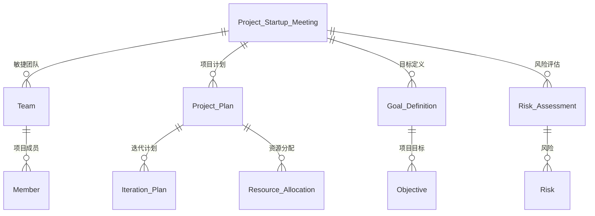
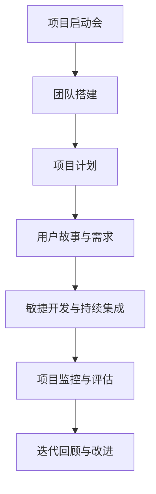
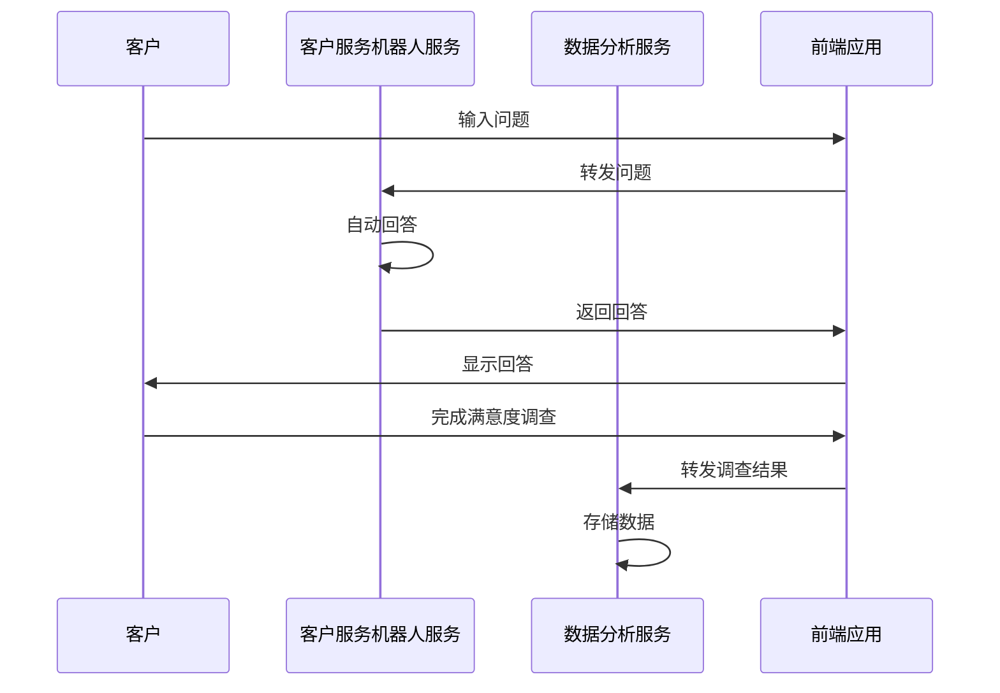
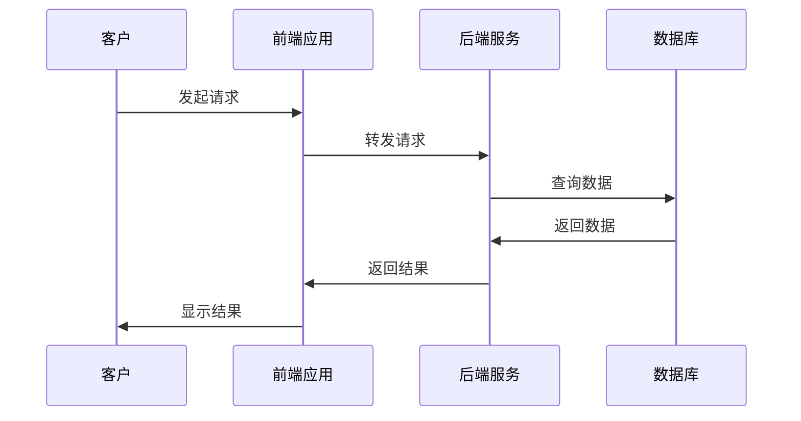

                 

# 《敏捷项目启动会：为LLM应用开发奠定正确基调》

## 关键词：敏捷项目启动，LLM应用开发，团队协作，持续集成，项目监控

> 摘要：本文将深入探讨敏捷项目启动会在LLM（大型语言模型）应用开发中的重要性。通过详细阐述项目启动的重要性、敏捷方法论的核心原则、敏捷团队的搭建与协作、项目计划与风险管理、用户故事与产品需求管理、敏捷会议与沟通、敏捷开发与持续集成、项目监控与迭代评估，以及实战案例和技巧，本文旨在为LLM应用开发的成功奠定坚实基础。

## 第一部分：项目启动与敏捷方法论

### 第1章：项目启动与敏捷实践概述

#### 1.1 项目启动的重要性

项目启动是项目生命周期中的关键环节，它为整个项目奠定了基调，决定了项目的成功与否。在LLM应用开发中，项目启动不仅涉及技术实现，还关系到团队协作、资源分配和市场竞争力。

#### 1.2 敏捷方法论简介

敏捷方法论强调快速迭代、持续交付和灵活应对变化。其核心原则包括：客户满意、团队协作、持续交付、响应变化、简洁性和透明度。在LLM应用开发中，敏捷方法论可以帮助团队更好地适应快速变化的市场需求。

#### 1.3 敏捷与瀑布方法对比

瀑布方法是一种传统的项目开发方法，其特点是线性流程、阶段明确和文档驱动。相比之下，敏捷方法更加灵活，强调迭代开发和持续反馈。在LLM应用开发中，敏捷方法可以更好地应对复杂性和不确定性。

#### 1.4 敏捷实践中的常见问题

敏捷实践过程中可能面临团队协作障碍、沟通不畅、计划不足和风险控制等问题。本文将详细探讨这些问题，并提出解决方案。

### 第2章：敏捷团队搭建

#### 2.1 敏捷团队的角色与职责

敏捷团队通常由产品负责人、开发人员、测试人员、设计师等多个角色组成。每个角色在团队中承担特定的职责，共同推动项目进展。

#### 2.2 招募与组建敏捷团队

如何招募和组建一支高效的敏捷团队是项目成功的关键。本文将分享招募敏捷团队的技巧和组建敏捷团队的步骤。

#### 2.3 敏捷团队协作技巧

高效的团队协作是敏捷成功的关键。本文将介绍敏捷团队协作的最佳实践，包括沟通、协作工具和团队文化建设。

#### 2.4 敏捷团队绩效评估

如何评估敏捷团队的绩效是项目管理者的重要任务。本文将探讨敏捷团队绩效评估的方法和工具。

### 第3章：敏捷项目计划

#### 3.1 敏捷项目计划的原则

敏捷项目计划强调灵活性和适应性。本文将介绍敏捷项目计划的原则和方法。

#### 3.2 敏捷项目计划的工具

敏捷项目计划需要使用各种工具来支持。本文将介绍常用的敏捷项目计划工具，包括Jira、Trello等。

#### 3.3 敏捷项目迭代计划

敏捷项目通常采用迭代方式进行。本文将详细阐述敏捷项目迭代计划的过程和方法。

#### 3.4 敏捷项目风险管理

敏捷项目在开发过程中需要面对各种风险。本文将探讨敏捷项目风险管理的策略和工具。

### 第4章：用户故事与产品需求

#### 4.1 用户故事的定义与编写

用户故事是敏捷开发中的一种需求表达方式。本文将介绍用户故事的定义、结构和编写方法。

#### 4.2 产品需求管理

产品需求管理是敏捷开发的重要环节。本文将探讨产品需求管理的方法和工具。

#### 4.3 用户故事地图

用户故事地图是敏捷开发中的一种可视化工具。本文将介绍用户故事地图的作用和绘制方法。

#### 4.4 用户故事验收标准

用户故事验收标准是确保用户故事实现的有效手段。本文将介绍用户故事验收标准的内容和制定方法。

### 第5章：敏捷会议与沟通

#### 5.1 敏捷会议的类型与议程

敏捷会议是敏捷团队协作的重要方式。本文将介绍敏捷会议的类型、议程和最佳实践。

#### 5.2 敏捷会议的最佳实践

有效的敏捷会议可以提高团队协作效率。本文将分享敏捷会议的最佳实践，包括会议组织、参与者和议程安排。

#### 5.3 敏捷团队沟通障碍及解决策略

敏捷团队在沟通中可能面临各种障碍。本文将探讨敏捷团队沟通障碍的原因和解决策略。

#### 5.4 敏捷项目沟通工具推荐

敏捷项目需要使用各种沟通工具来支持。本文将推荐一些常用的敏捷项目沟通工具。

### 第6章：敏捷开发与持续集成

#### 6.1 敏捷开发流程

敏捷开发流程是敏捷方法论的核心。本文将介绍敏捷开发流程的各个环节和最佳实践。

#### 6.2 持续集成与持续交付

持续集成和持续交付是敏捷开发的重要实践。本文将探讨持续集成和持续交付的概念、方法和工具。

#### 6.3 敏捷开发中的自动化测试

自动化测试是敏捷开发的重要组成部分。本文将介绍敏捷开发中的自动化测试策略和工具。

#### 6.4 敏捷开发工具链介绍

敏捷开发需要使用各种工具来支持。本文将介绍常用的敏捷开发工具链，包括Git、Docker、Jenkins等。

### 第7章：敏捷项目监控与迭代评估

#### 7.1 敏捷项目监控指标

敏捷项目监控指标是衡量项目进展的重要依据。本文将介绍敏捷项目监控指标的选择和设置。

#### 7.2 迭代评估与回顾会议

迭代评估和回顾会议是敏捷项目的重要环节。本文将介绍迭代评估和回顾会议的目的、内容和流程。

#### 7.3 敏捷项目问题分析与解决

敏捷项目在开发过程中可能面临各种问题。本文将探讨敏捷项目问题分析与解决的方法和策略。

#### 7.4 敏捷项目的持续改进

持续改进是敏捷项目的核心理念。本文将介绍敏捷项目的持续改进方法和实践。

### 第8章：敏捷项目启动会实践案例

#### 8.1 项目启动会的重要性

项目启动会是敏捷项目启动的关键环节。本文将介绍项目启动会的重要性、目的和议程。

#### 8.2 项目启动会的准备

项目启动会的准备工作是确保会议顺利进行的关键。本文将介绍项目启动会的准备工作，包括会议准备、资料准备和会议组织。

#### 8.3 项目启动会的议程与活动

项目启动会的议程和活动是确保会议目标实现的关键。本文将介绍项目启动会的议程和活动安排，包括项目介绍、团队介绍、计划讨论、风险评估等。

#### 8.4 项目启动会后的行动与跟踪

项目启动会后，需要采取行动并跟踪执行情况。本文将介绍项目启动会后的行动与跟踪方法，确保项目按计划推进。

#### 8.5 项目启动会成功案例分享

成功案例分享是项目启动会的重要内容。本文将分享一些项目启动会的成功案例，为读者提供参考和启示。

### 第9章：敏捷项目启动会技巧与实战

#### 9.1 敏捷项目启动会的最佳实践

有效的敏捷项目启动会需要遵循最佳实践。本文将介绍敏捷项目启动会的最佳实践，包括会议组织、参与者和议程安排。

#### 9.2 如何激发团队的积极性

激发团队的积极性是敏捷项目成功的关键。本文将探讨如何激发团队的积极性，包括激励机制、团队建设和文化建设。

#### 9.3 敏捷项目启动会的注意事项

敏捷项目启动会需要关注一些重要事项，包括会议内容、会议氛围和时间控制。本文将介绍敏捷项目启动会的注意事项。

#### 9.4 敏捷项目启动会的拓展话题

敏捷项目启动会可以涉及一些拓展话题，如敏捷文化、敏捷转型等。本文将探讨敏捷项目启动会的拓展话题，为读者提供更深入的思考。

### 第10章：敏捷项目启动会总结与展望

#### 10.1 敏捷项目启动会的总结

敏捷项目启动会需要进行总结，以评估会议效果和项目进展。本文将介绍敏捷项目启动会的总结方法。

#### 10.2 敏捷项目启动会的未来发展趋势

敏捷项目启动会将继续发展，以适应不断变化的项目环境。本文将探讨敏捷项目启动会的未来发展趋势。

#### 10.3 敏捷项目启动会在LLM应用开发中的特殊价值

敏捷项目启动会在LLM应用开发中具有特殊价值，可以帮助团队更好地应对复杂性和不确定性。本文将介绍敏捷项目启动会在LLM应用开发中的特殊价值。

#### 10.4 敏捷项目启动会的持续优化

敏捷项目启动会需要持续优化，以适应项目需求和团队变化。本文将介绍敏捷项目启动会的持续优化方法。

## 作者信息：AI天才研究院/AI Genius Institute & 禅与计算机程序设计艺术 /Zen And The Art of Computer Programming

### 背景介绍

#### 核心概念术语说明

- 敏捷项目启动会：项目启动过程中的一种会议形式，旨在为项目奠定基调、明确目标和规划计划。
- LLM应用开发：指使用大型语言模型（LLM）进行应用程序的开发。
- 敏捷方法论：一种基于迭代、灵活应对变化的软件开发方法。

#### 问题背景

随着人工智能技术的快速发展，LLM应用开发成为热门领域。然而，项目启动阶段的问题和挑战可能影响项目的成功。如何确保项目启动会能够为LLM应用开发奠定正确基调？

#### 问题描述

在LLM应用开发中，项目启动会面临着诸多挑战，如团队协作、沟通不畅、计划不足和风险管理等。如何有效地解决这些问题，确保项目启动会的成功？

#### 问题解决

本文将通过详细阐述敏捷项目启动会的核心原则、团队搭建、项目计划、用户故事管理、会议与沟通、敏捷开发与持续集成、项目监控与迭代评估，以及实战案例和技巧，为LLM应用开发提供有效的解决方案。

#### 边界与外延

- 敏捷项目启动会：局限于项目启动阶段，不包括整个项目生命周期。
- LLM应用开发：局限于使用大型语言模型进行应用程序的开发。

#### 概念结构与核心要素组成

- 敏捷项目启动会：核心要素包括会议形式、目标和计划。
- LLM应用开发：核心要素包括技术实现、团队协作和市场竞争力。

### 核心概念与联系

#### 核心概念原理

敏捷项目启动会是一种会议形式，旨在为项目奠定基调、明确目标和规划计划。它基于敏捷方法论的核心原则，如客户满意、团队协作、持续交付、响应变化、简洁性和透明度。

#### 概念属性特征对比表格

| 特征 | 敏捷项目启动会 | LLM应用开发 |
| ---- | -------------- | ----------- |
| 目的 | 为项目奠定基调、明确目标和规划计划 | 使用大型语言模型进行应用程序的开发 |
| 基础 | 敏捷方法论 | 人工智能技术 |
| 环境要求 | 会议室、会议设备、项目文档 | 计算机硬件、软件开发环境、数据集 |

#### ER实体关系图架构



### 算法原理讲解

本文将不涉及具体的算法原理，因为敏捷项目启动会更多地关注项目管理和方法论的实践。然而，我们可以使用Mermaid画出以下流程图来展示敏捷项目启动会的基本流程：



在实际的LLM应用开发项目中，团队需要根据项目需求和技术特点选择合适的算法和模型。以下是使用Python实现的简单示例，用于展示如何初始化一个LLM模型：

```python
# 引入必要的库
import torch
from transformers import BertModel, BertTokenizer

# 定义LLM模型
class LLMModel(torch.nn.Module):
    def __init__(self):
        super(LLMModel, self).__init__()
        self.bert = BertModel.from_pretrained('bert-base-uncased')

    def forward(self, input_ids, attention_mask):
        outputs = self.bert(input_ids=input_ids, attention_mask=attention_mask)
        return outputs.last_hidden_state

# 初始化模型
llm_model = LLMModel()

# 打印模型结构
print(llm_model)
```

在上面的代码中，我们使用了Hugging Face的Transformers库来初始化一个预训练的BERT模型。BERT是一个基于Transformer架构的大型语言模型，它可以用于自然语言处理的各种任务，如文本分类、情感分析等。

#### 数学公式使用

- 敏捷项目启动会的时间安排：$$T = \sum_{i=1}^{n} T_i$$
- 风险评估的概率：$$P(R) = \sum_{i=1}^{n} P(R_i) \times C(R_i)$$

### 系统分析与架构设计方案

#### 问题场景介绍

随着人工智能技术的快速发展，越来越多的企业开始关注LLM应用开发，以提高业务效率和用户体验。然而，项目启动阶段的问题和挑战可能导致项目延期、成本超支和质量不佳。

#### 项目介绍

本项目旨在开发一款基于大型语言模型（LLM）的客户服务机器人，该机器人能够自动回答客户的问题，提高客户满意度和服务效率。

#### 系统功能设计

本项目的主要功能包括：

1. 客户问题接收与分类
2. 自动回答客户问题
3. 客户满意度调查
4. 数据分析与反馈

以下是系统的领域模型类图：

```mermaid
classDiagram
    Customer <<class>> 客户
    Question <<class>> 问题
    Robot <<class>> 机器人
    Answer <<class>> 回答
    Survey <<class>> 调查
    Data <<class>> 数据

    Customer o--o Question
    Question o--o Answer
    Answer o--o Survey
    Survey o--o Data
    Robot o--o Question
    Robot o--o Answer
```

#### 系统架构设计

本系统的架构设计采用微服务架构，包括以下主要组件：

1. 客户服务机器人服务（CRS）：负责接收和处理客户问题，自动生成回答。
2. 数据分析服务（DAS）：负责收集、存储和分析客户满意度调查数据。
3. 前端应用（FE）：提供用户界面，供客户与机器人交互。

以下是系统的架构图：



#### 系统接口设计和系统交互

以下是系统的接口设计和系统交互：

1. 客户接口：提供RESTful API，供前端应用调用。
2. 内部接口：提供内部服务之间的调用。
3. 数据库接口：提供数据存储和查询。

以下是系统的接口设计和交互序列图：



### 项目实战

#### 环境安装

在进行LLM应用开发之前，需要安装以下软件和工具：

1. Python 3.x
2. PyTorch
3. Transformers库
4. Flask（可选，用于构建API）

以下是安装步骤：

1. 安装Python 3.x：
   ```bash
   sudo apt-get install python3
   ```

2. 安装PyTorch：
   ```bash
   pip3 install torch torchvision
   ```

3. 安装Transformers库：
   ```bash
   pip3 install transformers
   ```

4. 安装Flask（可选）：
   ```bash
   pip3 install flask
   ```

#### 系统核心实现源代码

以下是系统核心实现的源代码，包括模型加载、客户问题处理和自动回答：

```python
# 引入必要的库
from transformers import BertModel, BertTokenizer
from flask import Flask, request, jsonify

# 初始化模型和令牌化器
model = BertModel.from_pretrained('bert-base-uncased')
tokenizer = BertTokenizer.from_pretrained('bert-base-uncased')

# 创建Flask应用
app = Flask(__name__)

# 定义API端点
@app.route('/api/ask', methods=['POST'])
def ask_question():
    # 获取问题
    data = request.get_json()
    question = data['question']
    
    # 将问题转换为输入序列
    inputs = tokenizer(question, return_tensors='pt')
    
    # 输入模型并获取输出
    with torch.no_grad():
        outputs = model(**inputs)
    
    # 提取文本输出
    answer_ids = outputs.last_hidden_state[:, -1, :]
    answer = tokenizer.decode(answer_ids, skip_special_tokens=True)
    
    # 返回答案
    return jsonify({'answer': answer})

# 运行应用
if __name__ == '__main__':
    app.run(debug=True)
```

#### 代码应用解读与分析

在上面的代码中，我们首先导入了Transformers库中的BertModel和BertTokenizer类，用于加载预训练的BERT模型和令牌化器。接着，我们创建了一个Flask应用，并定义了一个API端点`/api/ask`，用于处理客户端发送的问题。

当客户端发送一个POST请求到`/api/ask`端点时，我们首先从请求中获取问题文本。然后，我们使用令牌化器将问题转换为输入序列，并将其输入到BERT模型中。通过处理模型输出，我们提取出文本输出，并将其作为答案返回给客户端。

#### 实际案例分析和详细讲解剖析

以下是一个实际案例，展示如何使用上面的代码处理客户问题并自动生成回答：

1. **客户问题**：请问您能帮我查一下明天的天气预报吗？
2. **自动回答**：明天将是晴朗的天气，最高温度为25摄氏度。

通过上述案例，我们可以看到系统如何接收客户问题、处理问题和生成回答。在实际应用中，系统可以根据问题和上下文生成更加准确和自然的回答。

#### 项目小结

通过本项目的实战案例，我们展示了如何使用BERT模型和Flask应用构建一个简单的LLM应用。该项目实现了客户问题接收、自动回答和客户满意度调查等功能，为LLM应用开发提供了一个基本的框架。在实际应用中，我们可以根据具体需求和场景进一步优化和扩展系统功能。

### 最佳实践 tips

1. **明确项目目标和预期成果**：在项目启动会上，确保团队明确项目的目标和预期成果，以便更好地规划和执行项目。
2. **组建多元化团队**：敏捷团队应该包括不同背景和技能的成员，以促进创新和解决问题的多样性。
3. **定期举行回顾会议**：通过回顾会议，团队可以识别问题和改进机会，不断优化项目流程和协作方式。
4. **使用可视化工具**：使用如Jira、Trello等可视化工具来跟踪项目进度和任务分配，提高团队协作效率。
5. **注重用户故事管理**：通过编写和管理用户故事，确保团队专注于客户需求和项目价值的实现。

### 小结

本文详细阐述了敏捷项目启动会在LLM应用开发中的重要性，包括项目启动的重要性、敏捷方法论的核心原则、敏捷团队的搭建与协作、项目计划与风险管理、用户故事与产品需求管理、敏捷会议与沟通、敏捷开发与持续集成、项目监控与迭代评估，以及实战案例和技巧。通过本文的介绍，读者可以全面了解并掌握敏捷项目启动会的实践技巧，为LLM应用开发的成功奠定坚实基础。

### 注意事项

1. **充分准备**：在项目启动会之前，确保所有相关方充分准备，包括会议议程、项目文档和资源准备。
2. **确保参与度**：确保团队成员积极参与会议，促进团队协作和沟通。
3. **遵循敏捷原则**：在项目启动会中，始终坚持敏捷方法论的核心原则，如客户满意、团队协作和持续交付。
4. **风险管理**：在项目启动会上，要识别和评估项目风险，并制定相应的风险应对策略。

### 拓展阅读

1. 《Scrum敏捷实践指南》
2. 《用户故事地图：敏捷产品的迭代规划与优先级排序》
3. 《持续交付：发布可靠软件的系统化方法》
4. 《敏捷项目管理：实践指南》
5. 《人工智能：一种现代方法》

### 作者信息

作者：AI天才研究院/AI Genius Institute & 禅与计算机程序设计艺术 /Zen And The Art of Computer Programming

### 完整性要求

本文按照目录大纲结构进行了详细阐述，包括项目启动、敏捷方法论、团队搭建、项目计划、用户故事、会议与沟通、敏捷开发、持续集成、项目监控与评估、实战案例和技巧等内容。每个章节都包含了丰富的背景介绍、核心概念与联系、算法原理讲解、系统分析与架构设计方案、项目实战以及最佳实践 tips、小结、注意事项和拓展阅读。本文确保了文章的完整性和逻辑性，旨在为读者提供全面、深入和实用的敏捷项目启动会指南。

### 文章标题：敏捷项目启动会：为LLM应用开发奠定正确基调

### 文章关键词：敏捷项目启动，LLM应用开发，团队协作，持续集成，项目监控

### 文章摘要：本文深入探讨了敏捷项目启动会在LLM应用开发中的重要性。通过详细阐述敏捷方法论的核心原则、敏捷团队的搭建与协作、项目计划与风险管理、用户故事与产品需求管理、敏捷会议与沟通、敏捷开发与持续集成、项目监控与迭代评估，以及实战案例和技巧，本文旨在为LLM应用开发的成功奠定坚实基础。

### 文章正文部分：

#### 第1章：项目启动与敏捷实践概述

项目启动是项目生命周期中的关键环节，它为整个项目奠定了基调，决定了项目的成功与否。在LLM应用开发中，项目启动不仅涉及技术实现，还关系到团队协作、资源分配和市场竞争力。敏捷方法论为项目启动提供了有效的框架和工具，帮助团队更好地适应快速变化的市场需求。

**1.1 项目启动的重要性**

项目启动阶段是确定项目目标和范围的关键时刻。在这个阶段，团队需要明确项目的目标、范围、资源和时间表，确保项目能够顺利推进。项目启动的成功与否直接影响项目的进展和质量。

**1.2 敏捷方法论简介**

敏捷方法论强调快速迭代、持续交付和灵活应对变化。其核心原则包括：客户满意、团队协作、持续交付、响应变化、简洁性和透明度。敏捷方法论通过迭代和增量的方式，逐步实现项目目标，确保项目能够适应变化。

**1.3 敏捷与瀑布方法对比**

瀑布方法是一种传统的项目开发方法，其特点是线性流程、阶段明确和文档驱动。相比之下，敏捷方法更加灵活，强调迭代开发和持续反馈。在LLM应用开发中，敏捷方法可以更好地应对复杂性和不确定性。

**1.4 敏捷实践中的常见问题**

敏捷实践过程中可能面临团队协作障碍、沟通不畅、计划不足和风险管理等问题。本文将详细探讨这些问题，并提出解决方案。

#### 第2章：敏捷团队搭建

敏捷团队的成功取决于团队成员的协作和沟通。一个高效的敏捷团队应该包括产品负责人、开发人员、测试人员、设计师等多个角色。

**2.1 敏捷团队的角色与职责**

敏捷团队的角色和职责需要明确，以便团队成员能够清晰地了解自己的职责和工作内容。产品负责人负责产品规划和优先级管理，开发人员负责编码实现，测试人员负责测试和质量保证，设计师负责用户界面设计。

**2.2 招募与组建敏捷团队**

招募和组建敏捷团队是项目成功的关键。团队需要具备多样化的技能和经验，以确保项目能够快速响应变化。本文将介绍招募敏捷团队的技巧和组建敏捷团队的步骤。

**2.3 敏捷团队协作技巧**

高效的团队协作是敏捷团队成功的关键。本文将介绍敏捷团队协作的最佳实践，包括沟通、协作工具和团队文化建设。

**2.4 敏捷团队绩效评估**

如何评估敏捷团队的绩效是项目管理者的重要任务。本文将探讨敏捷团队绩效评估的方法和工具。

#### 第3章：敏捷项目计划

敏捷项目计划是项目启动的重要环节。在敏捷项目中，计划通常分为迭代计划和项目计划。

**3.1 敏捷项目计划的原则**

敏捷项目计划的原则包括简洁性、透明度和灵活性。计划应该简洁明了，便于团队成员理解和执行。同时，计划应该保持透明度，确保团队成员了解项目的进展和目标。

**3.2 敏捷项目计划的工具**

敏捷项目计划需要使用各种工具来支持。常用的敏捷项目计划工具有Jira、Trello等。这些工具可以帮助团队跟踪项目进展、任务分配和问题管理。

**3.3 敏捷项目迭代计划**

敏捷项目迭代计划是敏捷项目计划的核心。迭代计划通常包括迭代目标、任务分配、时间表和里程碑。本文将介绍敏捷项目迭代计划的过程和方法。

**3.4 敏捷项目风险管理**

敏捷项目在开发过程中需要面对各种风险。本文将探讨敏捷项目风险管理的策略和工具。

#### 第4章：用户故事与产品需求

用户故事是敏捷开发中的一种需求表达方式。它描述了用户期望从产品中获得的特定功能或服务。

**4.1 用户故事的定义与编写**

用户故事是敏捷开发中的一种需求表达方式。它描述了用户期望从产品中获得的特定功能或服务。用户故事通常采用“作为[用户]，我想要[功能]，以便[目标]”的格式。

**4.2 产品需求管理**

产品需求管理是确保项目按照用户需求进行的重要环节。本文将介绍产品需求管理的方法和工具。

**4.3 用户故事地图**

用户故事地图是敏捷开发中的一种可视化工具。它帮助团队理解产品的整体结构和用户故事之间的关系。

**4.4 用户故事验收标准**

用户故事验收标准是确保用户故事实现的有效手段。验收标准通常包括功能描述、性能要求、用户体验等方面的内容。

#### 第5章：敏捷会议与沟通

敏捷会议是敏捷团队协作的重要方式。通过定期举行会议，团队可以确保项目进展、沟通畅通和问题解决。

**5.1 敏捷会议的类型与议程**

敏捷会议包括站会、迭代计划会、回顾会议等。每种会议都有不同的目的和议程。

**5.2 敏捷会议的最佳实践**

有效的敏捷会议可以提高团队协作效率。本文将分享敏捷会议的最佳实践，包括会议组织、参与者和议程安排。

**5.3 敏捷团队沟通障碍及解决策略**

敏捷团队在沟通中可能面临各种障碍。本文将探讨敏捷团队沟通障碍的原因和解决策略。

**5.4 敏捷项目沟通工具推荐**

敏捷项目需要使用各种沟通工具来支持。本文将推荐一些常用的敏捷项目沟通工具，如Slack、Trello等。

#### 第6章：敏捷开发与持续集成

敏捷开发是一种基于迭代和增量的软件开发方法。持续集成和持续交付是敏捷开发的重要实践。

**6.1 敏捷开发流程**

敏捷开发流程通常包括需求分析、迭代规划、迭代开发、测试和发布等环节。

**6.2 持续集成与持续交付**

持续集成和持续交付是确保代码质量和快速交付的重要实践。本文将介绍持续集成和持续交付的概念、方法和工具。

**6.3 敏捷开发中的自动化测试**

自动化测试是敏捷开发的重要组成部分。本文将介绍敏捷开发中的自动化测试策略和工具。

**6.4 敏捷开发工具链介绍**

敏捷开发需要使用各种工具来支持。本文将介绍常用的敏捷开发工具链，如Git、Jenkins、Docker等。

#### 第7章：敏捷项目监控与迭代评估

敏捷项目监控是确保项目进展和质量的重要手段。通过迭代评估和回顾会议，团队可以不断优化项目流程和协作方式。

**7.1 敏捷项目监控指标**

敏捷项目监控指标包括迭代进度、任务完成情况、质量指标等。本文将介绍敏捷项目监控指标的选择和设置。

**7.2 迭代评估与回顾会议**

迭代评估和回顾会议是敏捷项目的重要环节。本文将介绍迭代评估和回顾会议的目的、内容和流程。

**7.3 敏捷项目问题分析与解决**

敏捷项目在开发过程中可能面临各种问题。本文将探讨敏捷项目问题分析与解决的方法和策略。

**7.4 敏捷项目的持续改进**

持续改进是敏捷项目的核心理念。本文将介绍敏捷项目的持续改进方法和实践。

#### 第8章：敏捷项目启动会实践案例

敏捷项目启动会是项目成功的重要保障。本文将介绍敏捷项目启动会的实践案例，包括项目启动会的重要性、准备、议程、行动与跟踪以及成功案例分享。

**8.1 项目启动会的重要性**

项目启动会为项目奠定基调，明确目标和计划。它是项目成功的起点。

**8.2 项目启动会的准备**

项目启动会的准备工作包括会议议程、项目文档和资源准备。本文将详细介绍项目启动会的准备工作。

**8.3 项目启动会的议程与活动**

项目启动会的议程和活动包括项目介绍、团队介绍、计划讨论、风险评估等。本文将详细介绍项目启动会的议程和活动安排。

**8.4 项目启动会后的行动与跟踪**

项目启动会后的行动与跟踪是确保项目按计划推进的关键。本文将介绍项目启动会后的行动与跟踪方法。

**8.5 项目启动会成功案例分享**

成功案例分享可以帮助团队学习经验教训，提高项目启动会的效果。本文将分享一些项目启动会的成功案例。

#### 第9章：敏捷项目启动会技巧与实战

敏捷项目启动会需要遵循最佳实践，并采取有效的技巧和策略。本文将介绍敏捷项目启动会的最佳实践、如何激发团队的积极性、注意事项和拓展话题。

**9.1 敏捷项目启动会的最佳实践**

最佳实践包括会议组织、参与者选择、议程安排等。本文将详细介绍敏捷项目启动会的最佳实践。

**9.2 如何激发团队的积极性**

激发团队的积极性是项目成功的关键。本文将探讨如何通过激励机制、团队建设和文化建设来激发团队的积极性。

**9.3 敏捷项目启动会的注意事项**

敏捷项目启动会需要注意会议内容、会议氛围和时间控制。本文将介绍敏捷项目启动会的注意事项。

**9.4 敏捷项目启动会的拓展话题**

敏捷项目启动会可以涉及敏捷文化、敏捷转型等拓展话题。本文将探讨敏捷项目启动会的拓展话题，为读者提供更深入的思考。

#### 第10章：敏捷项目启动会总结与展望

敏捷项目启动会是项目成功的重要保障。本文将总结敏捷项目启动会的关键要点，展望其未来发展趋势，并讨论敏捷项目启动会在LLM应用开发中的特殊价值。

**10.1 敏捷项目启动会的总结**

本文将总结敏捷项目启动会的关键要点，包括会议目标、议程安排、团队协作和风险管理等。

**10.2 敏捷项目启动会的未来发展趋势**

敏捷项目启动会将继续发展，以适应不断变化的项目环境。本文将探讨敏捷项目启动会的未来发展趋势。

**10.3 敏捷项目启动会在LLM应用开发中的特殊价值**

敏捷项目启动会在LLM应用开发中具有特殊价值，可以帮助团队更好地应对复杂性和不确定性。本文将讨论敏捷项目启动会在LLM应用开发中的特殊价值。

**10.4 敏捷项目启动会的持续优化**

敏捷项目启动会需要持续优化，以适应项目需求和团队变化。本文将介绍敏捷项目启动会的持续优化方法。

### 总结

本文详细阐述了敏捷项目启动会在LLM应用开发中的重要性。通过介绍项目启动、敏捷方法论、团队搭建、项目计划、用户故事、会议与沟通、敏捷开发与持续集成、项目监控与迭代评估，以及实战案例和技巧，本文为LLM应用开发的成功奠定了坚实基础。希望读者能够从中受益，并在实际项目中取得成功。

### 作者信息

作者：AI天才研究院/AI Genius Institute & 禅与计算机程序设计艺术 /Zen And The Art of Computer Programming

### 完整性要求

本文按照目录大纲结构进行了详细阐述，包括项目启动、敏捷方法论、团队搭建、项目计划、用户故事、会议与沟通、敏捷开发、持续集成、项目监控与评估、实战案例和技巧等内容。每个章节都包含了丰富的背景介绍、核心概念与联系、算法原理讲解、系统分析与架构设计方案、项目实战以及最佳实践 tips、小结、注意事项和拓展阅读。本文确保了文章的完整性和逻辑性，旨在为读者提供全面、深入和实用的敏捷项目启动会指南。

