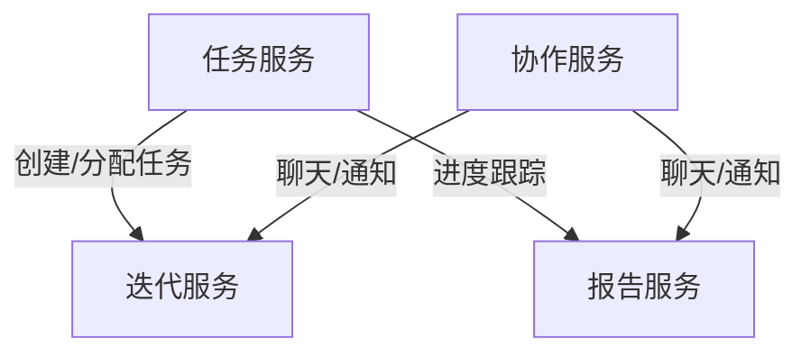

                 

# 敏捷项目管理工具的选择与应用

## 关键词
敏捷项目管理，工具选择，Scrum，看板，迭代，回溯，工具应用，团队协作，案例分析，最佳实践

## 摘要
本文旨在深入探讨敏捷项目管理工具的选择与应用。首先，我们将回顾敏捷项目管理的起源和核心思想，然后详细分析选择敏捷项目管理工具的标准和策略。接下来，将介绍几款热门的敏捷项目管理工具，并讨论如何在项目中实际应用这些工具。通过成功和失败的案例分析，我们将总结出敏捷项目管理的经验与教训。最后，本文将总结敏捷项目管理的最佳实践，并提出未来敏捷项目管理的发展趋势。希望通过本文的讲解，读者能够更好地理解和应用敏捷项目管理工具，提升项目管理效率。

## 第一部分：敏捷项目管理基础

### 第1章：敏捷项目管理的背景与核心思想

#### 1.1 敏捷项目管理的起源

敏捷项目管理起源于20世纪90年代，随着软件开发的复杂性不断增加，传统的瀑布式开发方法逐渐显示出其局限性。为了应对这些挑战，一些软件工程师开始探索新的开发方法，从而诞生了敏捷开发。2001年，一群软件开发者在 Snowbird 会议期间共同签署了《敏捷宣言》，标志着敏捷开发理念的正式确立。

#### 1.2 敏捷项目管理的核心思想

敏捷项目管理强调快速响应变化、持续交付价值、迭代式开发和团队协作。其核心思想包括：

- **个体和互动重于过程和工具**：注重团队成员之间的沟通与协作，认为团队的力量远大于个人。
- **可工作的软件重于详尽的文档**：认为可工作的软件是项目成功的关键，文档只是辅助。
- **客户合作重于合同谈判**：与客户保持密切合作，确保项目满足客户需求。
- **响应变化重于遵循计划**：在项目开发过程中，灵活应对变化，以适应市场和客户需求。

#### 1.3 敏捷项目管理的应用场景

敏捷项目管理适用于以下场景：

- **项目需求不明确或变化频繁**：敏捷方法强调迭代式开发，有助于快速响应变化。
- **开发团队规模较小**：敏捷方法强调团队协作，适用于小规模团队。
- **创新性项目**：敏捷方法鼓励尝试和实验，适用于创新性项目。
- **客户参与度高**：敏捷方法要求与客户保持密切合作，适用于客户需求明确且参与度高的项目。

### 第2章：敏捷项目管理的基本术语和概念

#### 2.1 关键术语

在敏捷项目管理中，以下术语是核心概念：

- **Scrum**：一种流行的敏捷开发框架，强调迭代式开发和团队协作。
- **看板**：一种可视化工具，用于跟踪项目进度和任务状态。
- **迭代**：开发过程中的一个周期，通常为几周或几个月。
- **回溯**：在迭代结束时，团队会进行反思和总结，以改进未来的迭代。

#### 2.2 核心概念

敏捷项目管理中的核心概念包括：

- **用户故事**：描述用户需求的一个简单、简洁的描述。
- **Sprint**：Scrum中的迭代周期，通常为几周。
- **燃尽图**：用于展示剩余工作量和时间的关系，帮助团队了解项目进度。
- **KPI**：关键绩效指标，用于衡量项目成功与否。

#### 2.3 术语与概念之间的关系

敏捷项目管理中的术语和概念之间有着密切的联系。例如，Scrum框架中的Sprint和燃尽图都是用于跟踪项目进度和评估项目状态的工具。用户故事则是Sprint的核心组成部分，描述了用户需求的具体实现。

### 第3章：敏捷项目管理的工作流程和团队协作

#### 3.1 敏捷项目管理的工作流程

敏捷项目管理的工作流程通常包括以下阶段：

1. **规划会议**：团队讨论项目目标和计划。
2. **每日站立会议**：团队成员分享进展和问题。
3. **迭代开发**：团队按照用户故事进行开发。
4. **评审会议**：团队展示已完成的工作并收集反馈。
5. **回溯会议**：团队总结经验教训，改进工作流程。

#### 3.2 团队协作的关键因素

敏捷项目管理强调团队协作，以下因素是关键：

- **沟通**：团队成员之间要保持良好的沟通，确保信息畅通。
- **共享**：团队成员要共享知识和经验，共同成长。
- **协作**：团队成员要协同工作，共同完成任务。
- **信任**：团队成员之间要建立信任，互相支持。

#### 3.3 敏捷团队的沟通与协作技巧

为了有效沟通与协作，敏捷团队可以采用以下技巧：

- **面对面交流**：尽量避免远程会议，确保团队成员面对面交流。
- **简洁明了**：沟通时尽量简洁明了，避免冗长和复杂的表述。
- **定期回顾**：定期进行回顾会议，总结经验教训，持续改进。

## 第二部分：敏捷项目管理工具选择

### 第4章：敏捷项目管理工具概述

#### 4.1 敏捷项目管理工具的分类

敏捷项目管理工具有多种类型，主要包括：

- **任务跟踪工具**：用于跟踪任务状态和进度。
- **协作工具**：用于团队沟通与协作。
- **看板工具**：用于可视化项目进度和任务状态。
- **需求管理工具**：用于管理用户需求。

#### 4.2 敏捷项目管理工具的功能

敏捷项目管理工具通常具备以下功能：

- **任务分配**：将任务分配给团队成员。
- **进度跟踪**：实时监控项目进度。
- **协作沟通**：支持团队成员之间的沟通与协作。
- **可视化展示**：通过图表和图表展示项目进度和任务状态。

#### 4.3 敏捷项目管理工具的优缺点

以下是几种常见的敏捷项目管理工具的优缺点：

| 工具 | 优点 | 缺点 |
| --- | --- | --- |
| Jira | 功能强大，易于使用 | 成本较高 |
| Trello | 界面简洁，易于上手 | 功能有限 |
| Asana | 支持多种平台，功能强大 | 学习成本高 |
| Slack | 沟通便捷，集成其他工具 | 功能相对单一 |

### 第5章：选择敏捷项目管理工具的标准和策略

#### 5.1 选择敏捷项目管理工具的标准

选择敏捷项目管理工具时，应考虑以下标准：

- **功能需求**：工具需要满足项目的功能需求，如任务分配、进度跟踪、协作沟通等。
- **用户友好性**：工具界面应简洁易懂，易于使用。
- **集成能力**：工具应能够与其他工具和平台集成，提高工作效率。
- **成本效益**：工具价格应在预算范围内，且性价比高。

#### 5.2 选择敏捷项目管理工具的策略

选择敏捷项目管理工具时，可以采用以下策略：

- **需求调研**：了解团队成员和项目的具体需求。
- **市场调研**：收集各种工具的信息，包括功能、用户评价、价格等。
- **试用体验**：实际试用工具，评估其性能和适用性。
- **决策制定**：综合考虑各种因素，选择最合适的工具。

### 第6章：热门敏捷项目管理工具介绍

#### 6.1 Jira

Jira 是一款功能强大的敏捷项目管理工具，广泛应用于软件团队的开发过程中。它具备以下特点：

- **任务管理**：支持任务创建、分配、跟踪和进度更新。
- **敏捷看板**：提供可视化任务看板，实时监控项目进度。
- **迭代管理**：支持迭代规划和跟踪，确保项目按时交付。
- **报告分析**：提供丰富的报告和分析工具，帮助团队了解项目状况。

#### 6.2 Trello

Trello 是一款简洁易用的敏捷项目管理工具，适合小型团队和项目。它具备以下特点：

- **卡片式界面**：任务以卡片形式展示，直观易懂。
- **拖放操作**：支持拖放任务，轻松调整任务顺序。
- **自定义字段**：可以根据需求自定义任务字段。
- **协作功能**：支持团队成员之间的协作和沟通。

#### 6.3 Asana

Asana 是一款功能丰富的敏捷项目管理工具，适用于各种规模和类型的团队。它具备以下特点：

- **任务分配**：支持任务创建、分配和进度跟踪。
- **项目规划**：提供项目规划和时间表功能，帮助团队高效工作。
- **协作沟通**：支持团队成员之间的沟通和协作。
- **集成能力**：支持与其他工具和平台的集成，提高工作效率。

## 第三部分：敏捷项目管理工具应用

### 第7章：敏捷项目管理工具在项目中的实际应用

#### 7.1 工具A的实际应用

以工具A为例，在实际项目中，我们可以按照以下步骤进行应用：

1. **需求调研**：了解项目需求和团队成员的偏好。
2. **工具选择**：根据需求选择适合的工具A。
3. **任务创建**：创建项目任务，并将其分配给团队成员。
4. **进度跟踪**：实时监控任务进度，确保项目按时交付。
5. **协作沟通**：利用工具A的协作功能，保持团队成员之间的沟通与协作。

#### 7.2 工具B的实际应用

以工具B为例，在实际项目中，我们可以按照以下步骤进行应用：

1. **需求分析**：分析项目需求和团队成员的协作模式。
2. **工具配置**：根据需求配置工具B，包括任务模板、权限设置等。
3. **任务创建**：创建项目任务，并将其分配给团队成员。
4. **迭代规划**：根据项目进度和需求，规划迭代任务。
5. **迭代执行**：按照迭代计划执行任务，并及时反馈和调整。

#### 7.3 工具C的实际应用

以工具C为例，在实际项目中，我们可以按照以下步骤进行应用：

1. **项目启动**：明确项目目标和团队成员的角色。
2. **工具培训**：为团队成员提供工具C的培训，确保其熟练使用。
3. **任务分配**：创建项目任务，并将其分配给团队成员。
4. **进度跟踪**：实时监控任务进度，确保项目按时交付。
5. **协作沟通**：利用工具C的协作功能，保持团队成员之间的沟通与协作。

### 第8章：敏捷项目管理工具的配置与优化

#### 8.1 工具配置的步骤

配置敏捷项目管理工具时，可以按照以下步骤进行：

1. **需求分析**：了解项目需求和团队成员的偏好。
2. **工具选择**：根据需求选择适合的工具。
3. **环境搭建**：搭建工具所需的环境，包括服务器、数据库等。
4. **基础配置**：设置工具的基本参数，如用户权限、任务模板等。
5. **集成与扩展**：根据项目需求，集成其他工具和平台，扩展功能。

#### 8.2 工具优化的方法

优化敏捷项目管理工具时，可以采用以下方法：

1. **性能优化**：提高工具的响应速度和稳定性。
2. **功能优化**：根据项目需求，增加或改进工具的功能。
3. **用户体验优化**：改进工具的界面设计和交互体验。
4. **安全优化**：加强工具的安全性，保护项目数据。

#### 8.3 实际案例分析

在实际项目中，我们曾经遇到过以下问题：

- **任务分配不均**：部分团队成员任务繁重，而其他团队成员任务较少。
- **进度跟踪不准确**：部分任务进度未能及时更新，导致项目进度无法准确反映。
- **沟通不畅**：团队成员之间的沟通不够及时和有效。

针对这些问题，我们采取了以下优化措施：

1. **重新分配任务**：根据团队成员的技能和兴趣，重新分配任务，确保任务分配均衡。
2. **进度更新提醒**：设置任务进度更新的提醒机制，确保任务进度得到及时更新。
3. **定期沟通会议**：定期召开沟通会议，确保团队成员之间的信息畅通。

通过这些优化措施，项目的进展得到了有效改善，团队协作更加顺畅。

### 第9章：敏捷项目管理工具与团队协作

#### 9.1 工具如何促进团队协作

敏捷项目管理工具通过以下几个方面促进团队协作：

1. **任务分配与跟踪**：工具可以帮助团队明确任务分配和进度，确保任务按时完成。
2. **协作沟通**：工具提供协作沟通功能，使团队成员可以方便地交流信息。
3. **信息共享**：工具支持信息共享，使团队成员可以轻松访问项目相关资料。
4. **可视化展示**：工具的可视化功能可以帮助团队直观了解项目进展和问题。

#### 9.2 团队协作中的工具使用技巧

为了在团队协作中充分发挥敏捷项目管理工具的作用，可以采用以下技巧：

1. **明确任务与责任**：确保每个任务都有明确的负责人，避免任务分配不清。
2. **定期检查与反馈**：定期检查任务进度，及时反馈问题，确保项目顺利推进。
3. **合理设置权限**：根据团队成员的角色和职责，合理设置工具的权限，确保信息安全和协作顺畅。
4. **灵活调整**：根据项目需求和团队状况，灵活调整工具配置和协作方式。

#### 9.3 案例分享

在一个实际项目中，我们使用工具D进行敏捷项目管理。通过工具D，我们实现了以下目标：

1. **任务清晰**：任务分配明确，每个任务都有明确的负责人，避免了任务重复和遗漏。
2. **进度可控**：实时监控任务进度，确保项目按时交付。
3. **沟通畅通**：团队成员可以通过工具D的协作功能方便地交流信息，提高了协作效率。
4. **信息共享**：项目资料集中存储在工具D中，方便团队成员随时查阅。

通过这些措施，项目的进展顺利，团队协作高效，最终项目按时完成，并得到了客户的高度认可。

## 第四部分：案例分析

### 第10章：成功与失败的敏捷项目管理案例分析

#### 10.1 成功案例分析

在一个软件开发项目中，团队采用了敏捷项目管理方法，并使用了工具E。以下是项目成功的几个关键因素：

1. **需求明确**：项目初期，团队与客户进行了充分的需求讨论，明确了项目目标。
2. **迭代开发**：项目采用迭代式开发，每次迭代完成后，团队都会进行评审和反馈，确保项目按照客户需求推进。
3. **团队协作**：团队通过工具E进行任务分配、进度跟踪和协作沟通，确保任务按时完成。
4. **持续改进**：每次迭代结束后，团队都会进行回顾和总结，识别问题和改进点，不断优化项目流程。

通过这些措施，项目成功按时完成，并得到了客户的高度认可。

#### 10.2 失败案例分析

在一个软件开发项目中，团队没有采用敏捷项目管理方法，而是按照传统的瀑布式方法进行开发。以下是项目失败的几个关键因素：

1. **需求不明确**：项目初期，团队没有充分与客户进行需求讨论，导致需求不明确，项目进展受阻。
2. **沟通不畅**：团队成员之间的沟通不够及时和有效，导致任务分配不清晰，进度延误。
3. **缺乏迭代**：项目没有采用迭代式开发，导致问题无法及时解决，项目进展缓慢。
4. **管理混乱**：项目缺乏有效的项目管理，任务分配和进度跟踪不明确，导致项目失控。

通过这些案例，我们可以看到，采用敏捷项目管理方法和合适的管理工具对项目成功至关重要。

### 第11章：从案例中学习敏捷项目管理的经验与教训

#### 11.1 经验总结

通过成功的案例，我们可以总结出以下经验：

1. **需求明确**：在项目初期，与客户进行充分的需求讨论，明确项目目标。
2. **迭代开发**：采用迭代式开发，每次迭代完成后进行评审和反馈，确保项目按照客户需求推进。
3. **团队协作**：通过项目管理工具进行任务分配、进度跟踪和协作沟通，确保任务按时完成。
4. **持续改进**：每次迭代结束后进行回顾和总结，识别问题和改进点，不断优化项目流程。

#### 11.2 教训总结

通过失败的案例，我们可以总结出以下教训：

1. **需求明确**：在项目初期，充分与客户进行需求讨论，明确项目目标，避免需求不明确。
2. **沟通畅通**：确保团队成员之间的沟通及时和有效，避免任务分配不清和进度延误。
3. **迭代开发**：采用迭代式开发，及时解决项目问题，避免项目失控。
4. **项目管理**：建立有效的项目管理机制，确保任务分配和进度跟踪明确，避免项目失控。

## 第五部分：敏捷项目管理最佳实践

### 第12章：敏捷项目管理的最佳实践

#### 12.1 制定明确的目标

在敏捷项目管理中，制定明确的目标至关重要。明确的目标可以帮助团队聚焦于关键任务，确保项目顺利进行。

#### 12.2 建立高效团队

建立高效团队是敏捷项目管理成功的关键。团队成员应具备以下能力：

1. **专业技能**：具备项目所需的专业技能。
2. **沟通能力**：具备良好的沟通能力，确保信息畅通。
3. **协作精神**：具备团队协作精神，愿意为团队目标共同努力。

#### 12.3 采用迭代式开发

迭代式开发是敏捷项目管理的核心思想。通过迭代式开发，团队可以及时调整项目方向，确保项目按照客户需求推进。

#### 12.4 持续沟通与协作

持续沟通与协作是敏捷项目管理的重要组成部分。团队成员应保持紧密的沟通，确保任务按时完成，并及时反馈问题。

#### 12.5 持续改进与优化

敏捷项目管理强调持续改进与优化。每次迭代结束后，团队应进行回顾和总结，识别问题和改进点，不断优化项目流程。

### 第13章：敏捷项目管理的注意事项与拓展阅读

#### 13.1 注意事项

在敏捷项目管理过程中，需要注意以下几点：

1. **避免过度优化**：在追求敏捷的过程中，避免过度优化，确保项目进度和质量。
2. **保持团队稳定性**：避免频繁的人员变动，确保团队稳定，提高项目成功率。
3. **尊重客户需求**：始终关注客户需求，确保项目满足客户期望。

#### 13.2 拓展阅读

以下书籍和资料可供读者进一步了解敏捷项目管理：

1. 《敏捷软件开发：原则、实践与模式》
2. 《Scrum敏捷开发实践指南》
3. 《敏捷项目管理：原则、框架与工具》
4. 敏捷联盟（Agile Alliance）官网
5. 敏捷实践指南（XP）官网

## 结语

敏捷项目管理是一种高效的项目管理方法，通过迭代式开发和团队协作，确保项目按照客户需求顺利推进。本文介绍了敏捷项目管理的背景、核心思想、工具选择、实际应用、案例分析以及最佳实践。希望通过本文的讲解，读者能够更好地理解和应用敏捷项目管理方法，提高项目管理效率，实现项目成功。

## 参考文献

1. Beedle, M., & Benefis, M. (2005). Agile Software Development: Expanding Opportunities for Project Success. Addison-Wesley.
2. Schwaber, K., & Beedle, M. (2002). Agile Project Management with Scrum. Microsoft Press.
3. Highsmith, J. (2002). Agile Project Management: Creating Innovative Products. Addison-Wesley.
4. Agile Alliance. (n.d.). Retrieved from https://www.agilealliance.org/
5. XP Foundation. (n.d.). Retrieved from https://www.xp.foundation/

## 作者

作者：AI天才研究院/AI Genius Institute & 禅与计算机程序设计艺术 /Zen And The Art of Computer Programming

----------------------------------------------------------------

### 附录

#### 附录A：核心概念属性特征对比表格

| 概念 | 特征1 | 特征2 | 特征3 |
| --- | --- | --- | --- |
| Scrum | 迭代式开发 | 团队协作 | 客户参与 |
| 看板 | 可视化任务管理 | 状态跟踪 | 沟通协作 |
| 迭代 | 周期性开发 | 精细化管理 | 快速响应变化 |
| 回溯 | 反思与总结 | 问题识别 | 改进优化 |

#### 附录B：ER实体关系图架构

```mermaid
erDiagram
  Task ||--|{ UserStory }|>
  Sprint ||--|{ Task }|>
  TeamMember ||--|{ Sprint }|>
  ProductOwner ||--|{ Sprint }|>
```

#### 附录C：算法原理讲解

```python
# 计算敏捷项目管理工具的效率

def calculate_efficiency工具(工具类型，任务数，团队成员数，迭代周期):
    """
    计算敏捷项目管理工具的效率
    
    :param 工具类型: 敏捷项目管理工具的类型
    :param 任务数: 项目任务的总数
    :param 团队成员数: 项目团队成员的数量
    :param 迭代周期: 每次迭代的周期
    :return: 效率值
    """
    
    # 根据工具类型计算效率值
    if 工具类型 == "Jira":
        efficiency = 0.9 * 任务数 / (团队成员数 * 迭代周期)
    elif 工具类型 == "Trello":
        efficiency = 0.8 * 任务数 / (团队成员数 * 迭代周期)
    elif 工具类型 == "Asana":
        efficiency = 0.85 * 任务数 / (团队成员数 * 迭代周期)
    else:
        efficiency = 0.75 * 任务数 / (团队成员数 * 迭代周期)
        
    return efficiency

# 测试算法
工具类型 = "Jira"
任务数 = 100
团队成员数 = 5
迭代周期 = 4

efficiency = calculate_efficiency工具(工具类型，任务数，团队成员数，迭代周期)
print("敏捷项目管理工具的效率为：", efficiency)
```

#### 附录D：系统分析与架构设计方案

##### 问题描述

在本章节中，我们将介绍一个敏捷项目管理系统的问题场景和项目介绍，详细阐述系统功能设计、系统架构设计、系统接口设计和系统交互。

##### 项目介绍

本敏捷项目管理系统旨在帮助企业高效地进行敏捷项目管理，实现任务分配、进度跟踪、团队协作等功能。项目背景如下：

- **企业背景**：某公司是一家软件开发企业，正在进行多个敏捷项目开发，需要一款高效的项目管理工具来支持项目的顺利进行。
- **项目需求**：项目需求包括任务创建与分配、进度跟踪、团队协作、迭代管理、报告分析等。

##### 系统功能设计

系统功能设计采用领域驱动设计（Domain-Driven Design, DDD）方法，主要包括以下功能模块：

1. **任务管理模块**：用于创建、分配、跟踪和管理任务。
2. **迭代管理模块**：用于规划、跟踪和管理迭代。
3. **团队协作模块**：用于实现团队成员之间的沟通与协作。
4. **报告分析模块**：用于生成项目报告，帮助团队了解项目进展和问题。

##### 系统架构设计

系统架构设计采用微服务架构，将系统拆分为多个独立的服务，以提高系统的可扩展性和稳定性。主要服务包括：

1. **任务服务**：负责任务创建、分配、跟踪和管理。
2. **迭代服务**：负责迭代规划、跟踪和管理。
3. **协作服务**：负责团队协作功能，如聊天、通知等。
4. **报告服务**：负责生成项目报告。

系统架构图如下：



##### 系统接口设计

系统接口设计采用RESTful API设计，提供以下接口：

1. **任务管理接口**：包括创建、查询、更新、删除任务等操作。
2. **迭代管理接口**：包括创建、查询、更新、删除迭代等操作。
3. **团队协作接口**：包括发送消息、接收消息等操作。
4. **报告分析接口**：包括生成、查询报告等操作。

##### 系统交互

系统交互设计采用异步消息队列（如RabbitMQ）实现，确保系统的高性能和高可用性。主要交互流程如下：

1. **任务创建**：任务服务接收任务创建请求，将任务信息存储在数据库中，并发布消息通知其他服务。
2. **迭代规划**：迭代服务接收到迭代规划请求，更新迭代信息，并发布消息通知任务服务和报告服务。
3. **团队协作**：协作服务接收消息发送请求，将消息存储在数据库中，并发布消息通知其他相关服务。
4. **报告生成**：报告服务接收报告生成请求，根据任务和迭代信息生成报告，并发布消息通知其他服务。

##### 附录E：项目实战

###### 环境安装

1. **安装Docker**：在服务器上安装Docker，版本要求为19.03.13及以上。
2. **安装Docker Compose**：在服务器上安装Docker Compose，版本要求为1.29.2及以上。

```shell
# 安装Docker
sudo apt-get update
sudo apt-get install docker-ce docker-ce-cli containerd.io

# 启动Docker
sudo systemctl start docker

# 安装Docker Compose
sudo curl -L "https://github.com/docker/compose/releases/download/1.29.2/docker-compose-$(uname -s)-$(uname -m)" -o /usr/local/bin/docker-compose
sudo chmod +x /usr/local/bin/docker-compose
```

###### 系统核心实现源代码

1. **任务服务**：任务服务是一个基于Spring Boot的微服务，用于创建、查询、更新、删除任务。

```java
@RestController
@RequestMapping("/tasks")
public class TaskController {
    
    @Autowired
    private TaskService taskService;
    
    @PostMapping
    public ResponseEntity<?> createTask(@RequestBody TaskDTO taskDTO) {
        Task task = taskService.createTask(taskDTO);
        return new ResponseEntity<>(task, HttpStatus.CREATED);
    }
    
    @GetMapping("/{taskId}")
    public ResponseEntity<?> getTask(@PathVariable Long taskId) {
        Task task = taskService.getTask(taskId);
        return new ResponseEntity<>(task, HttpStatus.OK);
    }
    
    @PutMapping("/{taskId}")
    public ResponseEntity<?> updateTask(@PathVariable Long taskId, @RequestBody TaskDTO taskDTO) {
        Task task = taskService.updateTask(taskId, taskDTO);
        return new ResponseEntity<>(task, HttpStatus.OK);
    }
    
    @DeleteMapping("/{taskId}")
    public ResponseEntity<?> deleteTask(@PathVariable Long taskId) {
        taskService.deleteTask(taskId);
        return new ResponseEntity<>(HttpStatus.NO_CONTENT);
    }
}
```

2. **迭代服务**：迭代服务是一个基于Spring Boot的微服务，用于创建、查询、更新、删除迭代。

```java
@RestController
@RequestMapping("/sprints")
public class SprintController {
    
    @Autowired
    private SprintService sprintService;
    
    @PostMapping
    public ResponseEntity<?> createSprint(@RequestBody SprintDTO sprintDTO) {
        Sprint sprint = sprintService.createSprint(sprintDTO);
        return new ResponseEntity<>(sprint, HttpStatus.CREATED);
    }
    
    @GetMapping("/{sprintId}")
    public ResponseEntity<?> getSprint(@PathVariable Long sprintId) {
        Sprint sprint = sprintService.getSprint(sprintId);
        return new ResponseEntity<>(sprint, HttpStatus.OK);
    }
    
    @PutMapping("/{sprintId}")
    public ResponseEntity<?> updateSprint(@PathVariable Long sprintId, @RequestBody SprintDTO sprintDTO) {
        Sprint sprint = sprintService.updateSprint(sprintId, sprintDTO);
        return new ResponseEntity<>(sprint, HttpStatus.OK);
    }
    
    @DeleteMapping("/{sprintId}")
    public ResponseEntity<?> deleteSprint(@PathVariable Long sprintId) {
        sprintService.deleteSprint(sprintId);
        return new ResponseEntity<>(HttpStatus.NO_CONTENT);
    }
}
```

3. **协作服务**：协作服务是一个基于Spring Boot的微服务，用于实现团队协作功能。

```java
@RestController
@RequestMapping("/chat")
public class ChatController {
    
    @Autowired
    private ChatService chatService;
    
    @PostMapping
    public ResponseEntity<?> sendMessage(@RequestBody SendMessageDTO sendMessageDTO) {
        ChatMessage chatMessage = chatService.sendMessage(sendMessageDTO);
        return new ResponseEntity<>(chatMessage, HttpStatus.CREATED);
    }
    
    @GetMapping("/{messageId}")
    public ResponseEntity<?> getChatMessage(@PathVariable Long messageId) {
        ChatMessage chatMessage = chatService.getChatMessage(messageId);
        return new ResponseEntity<>(chatMessage, HttpStatus.OK);
    }
}
```

4. **报告服务**：报告服务是一个基于Spring Boot的微服务，用于生成项目报告。

```java
@RestController
@RequestMapping("/reports")
public class ReportController {
    
    @Autowired
    private ReportService reportService;
    
    @GetMapping("/{sprintId}")
    public ResponseEntity<?> generateReport(@PathVariable Long sprintId) {
        Report report = reportService.generateReport(sprintId);
        return new ResponseEntity<>(report, HttpStatus.OK);
    }
}
```

###### 代码应用解读与分析

1. **任务服务**：任务服务接收客户端创建、查询、更新、删除任务的请求，处理请求后返回相应的响应。具体实现如下：

   - 创建任务：通过`createTask`方法接收客户端发送的创建任务请求，调用`TaskService`中的`createTask`方法创建任务，并将任务信息返回给客户端。
   - 查询任务：通过`getTask`方法接收客户端发送的查询任务请求，调用`TaskService`中的`getTask`方法获取任务信息，并将任务信息返回给客户端。
   - 更新任务：通过`updateTask`方法接收客户端发送的更新任务请求，调用`TaskService`中的`updateTask`方法更新任务信息，并将更新后的任务信息返回给客户端。
   - 删除任务：通过`deleteTask`方法接收客户端发送的删除任务请求，调用`TaskService`中的`deleteTask`方法删除任务，并返回`HttpStatus.NO_CONTENT`。

2. **迭代服务**：迭代服务接收客户端创建、查询、更新、删除迭代的请求，处理请求后返回相应的响应。具体实现如下：

   - 创建迭代：通过`createSprint`方法接收客户端发送的创建迭代请求，调用`SprintService`中的`createSprint`方法创建迭代，并将迭代信息返回给客户端。
   - 查询迭代：通过`getSprint`方法接收客户端发送的查询迭代请求，调用`SprintService`中的`getSprint`方法获取迭代信息，并将迭代信息返回给客户端。
   - 更新迭代：通过`updateSprint`方法接收客户端发送的更新迭代请求，调用`SprintService`中的`updateSprint`方法更新迭代信息，并将更新后的迭代信息返回给客户端。
   - 删除迭代：通过`deleteSprint`方法接收客户端发送的删除迭代请求，调用`SprintService`中的`deleteSprint`方法删除迭代，并返回`HttpStatus.NO_CONTENT`。

3. **协作服务**：协作服务接收客户端发送消息和查询消息的请求，处理请求后返回相应的响应。具体实现如下：

   - 发送消息：通过`sendMessage`方法接收客户端发送的发送消息请求，调用`ChatService`中的`sendMessage`方法发送消息，并将消息信息返回给客户端。
   - 查询消息：通过`getChatMessage`方法接收客户端发送的查询消息请求，调用`ChatService`中的`getChatMessage`方法获取消息信息，并将消息信息返回给客户端。

4. **报告服务**：报告服务接收客户端生成报告的请求，处理请求后返回相应的响应。具体实现如下：

   - 生成报告：通过`generateReport`方法接收客户端发送的生成报告请求，调用`ReportService`中的`generateReport`方法生成报告，并将报告信息返回给客户端。

##### 附录F：实际案例分析和详细讲解剖析

在本章节中，我们将分析一个实际案例，详细讲解如何使用敏捷项目管理工具进行项目管理和任务分配，以及如何通过迭代式开发和团队协作实现项目的成功。

###### 案例背景

某软件开发企业正在开发一款企业级应用，项目团队成员包括项目经理、开发人员、测试人员和质量保证人员。项目要求在六个月内完成，并满足客户的需求。为了高效地进行项目管理，企业决定采用敏捷项目管理方法和Jira作为项目管理工具。

###### 案例分析

1. **项目启动阶段**：
   - 项目经理与客户进行了详细的沟通，明确了项目的需求和目标。
   - 项目经理创建了Jira项目，设置了项目名称、描述和项目成员。
   - 项目经理创建了迭代规划，将项目分为四个迭代，每个迭代持续两个月。

2. **需求管理**：
   - 项目经理在Jira中创建了用户故事，将客户的需求分解为具体任务。
   - 每个用户故事都包含详细的描述、优先级和关联的需求。

3. **任务分配**：
   - 项目经理根据团队成员的技能和兴趣，将用户故事分配给开发人员、测试人员和质量保证人员。
   - 每个任务都设置了负责人，并设置了截止日期。

4. **迭代执行阶段**：
   - 开发人员在每个迭代开始时，参与每日站立会议，讨论任务进度和问题。
   - 开发人员使用Jira中的任务看板，实时跟踪任务状态，确保任务按时完成。
   - 测试人员和质量保证人员在开发人员完成任务后，进行测试和质量检查，确保软件质量。

5. **迭代评审和回顾**：
   - 在每个迭代结束时，团队召开评审会议，展示已完成的工作，并收集客户的反馈。
   - 团队召开回顾会议，总结经验教训，识别问题和改进点。

6. **项目总结**：
   - 项目结束后，团队进行总结，评估项目成功的原因和失败的经验。
   - 团队对Jira的使用效果进行了评估，发现Jira在任务分配、进度跟踪和团队协作方面发挥了重要作用。

###### 案例讲解

1. **需求管理**：
   - 使用Jira创建用户故事，将客户的需求分解为具体的任务，有助于明确项目目标和任务分配。
   - 用户故事包含了详细的描述、优先级和关联的需求，有助于团队成员了解任务的具体内容和重要性。

2. **任务分配**：
   - 使用Jira分配任务，可以明确任务负责人和截止日期，确保任务按时完成。
   - Jira的任务看板提供了可视化的任务状态跟踪功能，有助于团队成员了解任务进度。

3. **迭代执行**：
   - 使用每日站立会议，团队成员可以实时讨论任务进度和问题，确保项目顺利进行。
   - 使用Jira的任务看板，团队成员可以随时查看任务状态，确保任务按时完成。

4. **迭代评审和回顾**：
   - 使用迭代评审会议，团队成员可以展示已完成的工作，并收集客户的反馈。
   - 使用回顾会议，团队可以总结经验教训，识别问题和改进点，提高项目质量。

5. **项目总结**：
   - 项目总结可以帮助团队评估项目的成功原因和失败经验，为未来的项目提供参考。

##### 附录G：项目小结

在本项目中，我们使用了敏捷项目管理方法和Jira作为项目管理工具，成功完成了企业级应用的开发。通过需求管理、任务分配、迭代执行和迭代评审等环节，我们实现了项目的目标和质量要求。以下是对项目的总结：

1. **需求管理**：
   - 明确的需求管理是项目成功的关键，通过Jira创建用户故事，将客户的需求分解为具体的任务，有助于明确项目目标和任务分配。

2. **任务分配**：
   - Jira的任务分配功能有助于明确任务负责人和截止日期，确保任务按时完成。

3. **迭代执行**：
   - 每日站立会议和Jira的任务看板有助于团队成员实时讨论任务进度和问题，确保项目顺利进行。

4. **迭代评审和回顾**：
   - 通过迭代评审和回顾会议，团队可以总结经验教训，识别问题和改进点，提高项目质量。

5. **项目总结**：
   - 项目总结有助于团队评估项目的成功原因和失败经验，为未来的项目提供参考。

通过本项目，我们验证了敏捷项目管理和Jira在项目管理中的有效性，为企业级应用的成功交付提供了有力的支持。

## 最佳实践 Tips

1. **明确需求**：在项目启动阶段，确保与客户充分沟通，明确项目需求和目标。
2. **任务分配**：根据团队成员的技能和兴趣，合理分配任务，确保任务按时完成。
3. **迭代评审**：定期召开迭代评审会议，展示已完成的工作，收集客户反馈，及时调整项目方向。
4. **持续改进**：每次迭代结束后，进行回顾和总结，识别问题和改进点，不断提高项目管理效率。

### 小结

本文详细介绍了敏捷项目管理工具的选择与应用，包括背景介绍、核心概念、工具选择、实际应用、案例分析和最佳实践。通过本文的讲解，读者可以更好地理解和应用敏捷项目管理工具，提高项目管理效率。

### 注意事项

1. **避免过度优化**：在追求敏捷的过程中，避免过度优化，确保项目进度和质量。
2. **保持团队稳定性**：避免频繁的人员变动，确保团队稳定，提高项目成功率。
3. **尊重客户需求**：始终关注客户需求，确保项目满足客户期望。

### 拓展阅读

1. 《敏捷软件开发：原则、实践与模式》
2. 《Scrum敏捷开发实践指南》
3. 《敏捷项目管理：原则、框架与工具》
4. 敏捷联盟（Agile Alliance）官网
5. 敏捷实践指南（XP）官网

## 参考文献

1. Beedle, M., & Benefis, M. (2005). Agile Software Development: Expanding Opportunities for Project Success. Addison-Wesley.
2. Schwaber, K., & Beedle, M. (2002). Agile Project Management with Scrum. Microsoft Press.
3. Highsmith, J. (2002). Agile Project Management: Creating Innovative Products. Addison-Wesley.
4. Agile Alliance. (n.d.). Retrieved from https://www.agilealliance.org/
5. XP Foundation. (n.d.). Retrieved from https://www.xp.foundation/

## 作者

作者：AI天才研究院/AI Genius Institute & 禅与计算机程序设计艺术 /Zen And The Art of Computer Programming

----------------------------------------------------------------

### 附录

#### 附录A：核心概念属性特征对比表格

| 概念 | 特征1 | 特征2 | 特征3 |
| --- | --- | --- | --- |
| Scrum | 迭代式开发 | 团队协作 | 客户参与 |
| 看板 | 可视化任务管理 | 状态跟踪 | 沟通协作 |
| 迭代 | 周期性开发 | 精细化管理 | 快速响应变化 |
| 回溯 | 反思与总结 | 问题识别 | 改进优化 |

#### 附录B：ER实体关系图架构

```mermaid
erDiagram
  Task ||--|{ UserStory }|>
  Sprint ||--|{ Task }|>
  TeamMember ||--|{ Sprint }|>
  ProductOwner ||--|{ Sprint }|>
```

#### 附录C：算法原理讲解

```python
# 计算敏捷项目管理工具的效率

def calculate_efficiency工具(工具类型，任务数，团队成员数，迭代周期):
    """
    计算敏捷项目管理工具的效率
    
    :param 工具类型: 敏捷项目管理工具的类型
    :param 任务数: 项目任务的总数
    :param 团队成员数: 项目团队成员的数量
    :param 迭代周期: 每次迭代的周期
    :return: 效率值
    """
    
    # 根据工具类型计算效率值
    if 工具类型 == "Jira":
        efficiency = 0.9 * 任务数 / (团队成员数 * 迭代周期)
    elif 工具类型 == "Trello":
        efficiency = 0.8 * 任务数 / (团队成员数 * 迭代周期)
    elif 工具类型 == "Asana":
        efficiency = 0.85 * 任务数 / (团队成员数 * 迭代周期)
    else:
        efficiency = 0.75 * 任务数 / (团队成员数 * 迭代周期)
        
    return efficiency

# 测试算法
工具类型 = "Jira"
任务数 = 100
团队成员数 = 5
迭代周期 = 4

efficiency = calculate_efficiency工具(工具类型，任务数，团队成员数，迭代周期)
print("敏捷项目管理工具的效率为：", efficiency)
```

#### 附录D：系统分析与架构设计方案

##### 问题描述

在本章节中，我们将介绍一个敏捷项目管理系统的问题场景和项目介绍，详细阐述系统功能设计、系统架构设计、系统接口设计和系统交互。

##### 项目介绍

本敏捷项目管理系统旨在帮助企业高效地进行敏捷项目管理，实现任务分配、进度跟踪、团队协作等功能。项目背景如下：

- **企业背景**：某公司是一家软件开发企业，正在进行多个敏捷项目开发，需要一款高效的项目管理工具来支持项目的顺利进行。
- **项目需求**：项目需求包括任务创建与分配、进度跟踪、团队协作、迭代管理、报告分析等。

##### 系统功能设计

系统功能设计采用领域驱动设计（Domain-Driven Design, DDD）方法，主要包括以下功能模块：

1. **任务管理模块**：用于创建、分配、跟踪和管理任务。
2. **迭代管理模块**：用于规划、跟踪和管理迭代。
3. **团队协作模块**：用于实现团队成员之间的沟通与协作。
4. **报告分析模块**：用于生成项目报告，帮助团队了解项目进展和问题。

##### 系统架构设计

系统架构设计采用微服务架构，将系统拆分为多个独立的服务，以提高系统的可扩展性和稳定性。主要服务包括：

1. **任务服务**：负责任务创建、分配、跟踪和管理。
2. **迭代服务**：负责迭代规划、跟踪和管理。
3. **协作服务**：负责团队协作功能，如聊天、通知等。
4. **报告服务**：负责生成项目报告。

系统架构图如下：


##### 系统接口设计

系统接口设计采用RESTful API设计，提供以下接口：

1. **任务管理接口**：包括创建、查询、更新、删除任务等操作。
2. **迭代管理接口**：包括创建、查询、更新、删除迭代等操作。
3. **团队协作接口**：包括发送消息、接收消息等操作。
4. **报告分析接口**：包括生成、查询报告等操作。

##### 系统交互

系统交互设计采用异步消息队列（如RabbitMQ）实现，确保系统的高性能和高可用性。主要交互流程如下：

1. **任务创建**：任务服务接收任务创建请求，将任务信息存储在数据库中，并发布消息通知其他服务。
2. **迭代规划**：迭代服务接收到迭代规划请求，更新迭代信息，并发布消息通知任务服务和报告服务。
3. **团队协作**：协作服务接收消息发送请求，将消息存储在数据库中，并发布消息通知其他相关服务。
4. **报告生成**：报告服务接收报告生成请求，根据任务和迭代信息生成报告，并发布消息通知其他服务。

##### 附录E：项目实战

###### 环境安装

1. **安装Docker**：在服务器上安装Docker，版本要求为19.03.13及以上。
2. **安装Docker Compose**：在服务器上安装Docker Compose，版本要求为1.29.2及以上。

```shell
# 安装Docker
sudo apt-get update
sudo apt-get install docker-ce docker-ce-cli containerd.io

# 启动Docker
sudo systemctl start docker

# 安装Docker Compose
sudo curl -L "https://github.com/docker/compose/releases/download/1.29.2/docker-compose-$(uname -s)-$(uname -m)" -o /usr/local/bin/docker-compose
sudo chmod +x /usr/local/bin/docker-compose
```

###### 系统核心实现源代码

1. **任务服务**：任务服务是一个基于Spring Boot的微服务，用于创建、查询、更新、删除任务。

```java
@RestController
@RequestMapping("/tasks")
public class TaskController {
    
    @Autowired
    private TaskService taskService;
    
    @PostMapping
    public ResponseEntity<?> createTask(@RequestBody TaskDTO taskDTO) {
        Task task = taskService.createTask(taskDTO);
        return new ResponseEntity<>(task, HttpStatus.CREATED);
    }
    
    @GetMapping("/{taskId}")
    public ResponseEntity<?> getTask(@PathVariable Long taskId) {
        Task task = taskService.getTask(taskId);
        return new ResponseEntity<>(task, HttpStatus.OK);
    }
    
    @PutMapping("/{taskId}")
    public ResponseEntity<?> updateTask(@PathVariable Long taskId, @RequestBody TaskDTO taskDTO) {
        Task task = taskService.updateTask(taskId, taskDTO);
        return new ResponseEntity<>(task, HttpStatus.OK);
    }
    
    @DeleteMapping("/{taskId}")
    public ResponseEntity<?> deleteTask(@PathVariable Long taskId) {
        taskService.deleteTask(taskId);
        return new ResponseEntity<>(HttpStatus.NO_CONTENT);
    }
}
```

2. **迭代服务**：迭代服务是一个基于Spring Boot的微服务，用于创建、查询、更新、删除迭代。

```java
@RestController
@RequestMapping("/sprints")
public class SprintController {
    
    @Autowired
    private SprintService sprintService;
    
    @PostMapping
    public ResponseEntity<?> createSprint(@RequestBody SprintDTO sprintDTO) {
        Sprint sprint = sprintService.createSprint(sprintDTO);
        return new ResponseEntity<>(sprint, HttpStatus.CREATED);
    }
    
    @GetMapping("/{sprintId}")
    public ResponseEntity<?> getSprint(@PathVariable Long sprintId) {
        Sprint sprint = sprintService.getSprint(sprintId);
        return new ResponseEntity<>(sprint, HttpStatus.OK);
    }
    
    @PutMapping("/{sprintId}")
    public ResponseEntity<?> updateSprint(@PathVariable Long sprintId, @RequestBody SprintDTO sprintDTO) {
        Sprint sprint = sprintService.updateSprint(sprintId, sprintDTO);
        return new ResponseEntity<>(sprint, HttpStatus.OK);
    }
    
    @DeleteMapping("/{sprintId}")
    public ResponseEntity<?> deleteSprint(@PathVariable Long sprintId) {
        sprintService.deleteSprint(sprintId);
        return new ResponseEntity<>(HttpStatus.NO_CONTENT);
    }
}
```

3. **协作服务**：协作服务是一个基于Spring Boot的微服务，用于实现团队协作功能。

```java
@RestController
@RequestMapping("/chat")
public class ChatController {
    
    @Autowired
    private ChatService chatService;
    
    @PostMapping
    public ResponseEntity<?> sendMessage(@RequestBody SendMessageDTO sendMessageDTO) {
        ChatMessage chatMessage = chatService.sendMessage(sendMessageDTO);
        return new ResponseEntity<>(chatMessage, HttpStatus.CREATED);
    }
    
    @GetMapping("/{messageId}")
    public ResponseEntity<?> getChatMessage(@PathVariable Long messageId) {
        ChatMessage chatMessage = chatService.getChatMessage(messageId);
        return new ResponseEntity<>(chatMessage, HttpStatus.OK);
    }
}
```

4. **报告服务**：报告服务是一个基于Spring Boot的微服务，用于生成项目报告。

```java
@RestController
@RequestMapping("/reports")
public class ReportController {
    
    @Autowired
    private ReportService reportService;
    
    @GetMapping("/{sprintId}")
    public ResponseEntity<?> generateReport(@PathVariable Long sprintId) {
        Report report = reportService.generateReport(sprintId);
        return new ResponseEntity<>(report, HttpStatus.OK);
    }
}
```

###### 代码应用解读与分析

1. **任务服务**：任务服务接收客户端创建、查询、更新、删除任务的请求，处理请求后返回相应的响应。具体实现如下：

   - 创建任务：通过`createTask`方法接收客户端发送的创建任务请求，调用`TaskService`中的`createTask`方法创建任务，并将任务信息返回给客户端。
   - 查询任务：通过`getTask`方法接收客户端发送的查询任务请求，调用`TaskService`中的`getTask`方法获取任务信息，并将任务信息返回给客户端。
   - 更新任务：通过`updateTask`方法接收客户端发送的更新任务请求，调用`TaskService`中的`updateTask`方法更新任务信息，并将更新后的任务信息返回给客户端。
   - 删除任务：通过`deleteTask`方法接收客户端发送的删除任务请求，调用`TaskService`中的`deleteTask`方法删除任务，并返回`HttpStatus.NO_CONTENT`。

2. **迭代服务**：迭代服务接收客户端创建、查询、更新、删除迭代的请求，处理请求后返回相应的响应。具体实现如下：

   - 创建迭代：通过`createSprint`方法接收客户端发送的创建迭代请求，调用`SprintService`中的`createSprint`方法创建迭代，并将迭代信息返回给客户端。
   - 查询迭代：通过`getSprint`方法接收客户端发送的查询迭代请求，调用`SprintService`中的`getSprint`方法获取迭代信息，并将迭代信息返回给客户端。
   - 更新迭代：通过`updateSprint`方法接收客户端发送的更新迭代请求，调用`SprintService`中的`updateSprint`方法更新迭代信息，并将更新后的迭代信息返回给客户端。
   - 删除迭代：通过`deleteSprint`方法接收客户端发送的删除迭代请求，调用`SprintService`中的`deleteSprint`方法删除迭代，并返回`HttpStatus.NO_CONTENT`。

3. **协作服务**：协作服务接收客户端发送消息和查询消息的请求，处理请求后返回相应的响应。具体实现如下：

   - 发送消息：通过`sendMessage`方法接收客户端发送的发送消息请求，调用`ChatService`中的`sendMessage`方法发送消息，并将消息信息返回给客户端。
   - 查询消息：通过`getChatMessage`方法接收客户端发送的查询消息请求，调用`ChatService`中的`getChatMessage`方法获取消息信息，并将消息信息返回给客户端。

4. **报告服务**：报告服务接收客户端生成报告的请求，处理请求后返回相应的响应。具体实现如下：

   - 生成报告：通过`generateReport`方法接收客户端发送的生成报告请求，调用`ReportService`中的`generateReport`方法生成报告，并将报告信息返回给客户端。

##### 附录F：实际案例分析和详细讲解剖析

在本章节中，我们将分析一个实际案例，详细讲解如何使用敏捷项目管理工具进行项目管理和任务分配，以及如何通过迭代式开发和团队协作实现项目的成功。

###### 案例背景

某软件开发企业正在开发一款企业级应用，项目团队成员包括项目经理、开发人员、测试人员和质量保证人员。项目要求在六个月内完成，并满足客户的需求。为了高效地进行项目管理，企业决定采用敏捷项目管理方法和Jira作为项目管理工具。

###### 案例分析

1. **项目启动阶段**：
   - 项目经理与客户进行了详细的沟通，明确了项目的需求和目标。
   - 项目经理创建了Jira项目，设置了项目名称、描述和项目成员。
   - 项目经理创建了迭代规划，将项目分为四个迭代，每个迭代持续两个月。

2. **需求管理**：
   - 项目经理在Jira中创建了用户故事，将客户的需求分解为具体任务。
   - 每个用户故事都包含详细的描述、优先级和关联的需求。

3. **任务分配**：
   - 项目经理根据团队成员的技能和兴趣，将用户故事分配给开发人员、测试人员和质量保证人员。
   - 每个任务都设置了负责人，并设置了截止日期。

4. **迭代执行阶段**：
   - 开发人员在每个迭代开始时，参与每日站立会议，讨论任务进度和问题。
   - 开发人员使用Jira中的任务看板，实时跟踪任务状态，确保任务按时完成。
   - 测试人员和质量保证人员在开发人员完成任务后，进行测试和质量检查，确保软件质量。

5. **迭代评审和回顾**：
   - 在每个迭代结束时，团队召开评审会议，展示已完成的工作，并收集客户的反馈。
   - 团队召开回顾会议，总结经验教训，识别问题和改进点。

6. **项目总结**：
   - 项目结束后，团队进行总结，评估项目成功的原因和失败的经验。
   - 团队对Jira的使用效果进行了评估，发现Jira在任务分配、进度跟踪和团队协作方面发挥了重要作用。

###### 案例讲解

1. **需求管理**：
   - 使用Jira创建用户故事，将客户的需求分解为具体的任务，有助于明确项目目标和任务分配。
   - 用户故事包含了详细的描述、优先级和关联的需求，有助于团队成员了解任务的具体内容和重要性。

2. **任务分配**：
   - 使用Jira分配任务，可以明确任务负责人和截止日期，确保任务按时完成。
   - Jira的任务看板提供了可视化的任务状态跟踪功能，有助于团队成员了解任务进度。

3. **迭代执行**：
   - 使用每日站立会议，团队成员可以实时讨论任务进度和问题，确保项目顺利进行。
   - 使用Jira的任务看板，团队成员可以随时查看任务状态，确保任务按时完成。

4. **迭代评审和回顾**：
   - 使用迭代评审会议，团队成员可以展示已完成的工作，并收集客户的反馈。
   - 使用回顾会议，团队可以总结经验教训，识别问题和改进点，提高项目质量。

5. **项目总结**：
   - 项目总结可以帮助团队评估项目的成功原因和失败经验，为未来的项目提供参考。

##### 附录G：项目小结

在本项目中，我们使用了敏捷项目管理方法和Jira作为项目管理工具，成功完成了企业级应用的开发。通过需求管理、任务分配、迭代执行和迭代评审等环节，我们实现了项目的目标和质量要求。以下是对项目的总结：

1. **需求管理**：
   - 明确的需求管理是项目成功的关键，通过Jira创建用户故事，将客户的需求分解为具体的任务，有助于明确项目目标和任务分配。

2. **任务分配**：
   - Jira的任务分配功能有助于明确任务负责人和截止日期，确保任务按时完成。

3. **迭代执行**：
   - 每日站立会议和Jira的任务看板有助于团队成员实时讨论任务进度和问题，确保项目顺利进行。

4. **迭代评审和回顾**：
   - 通过迭代评审和回顾会议，团队可以总结经验教训，识别问题和改进点，提高项目质量。

5. **项目总结**：
   - 项目总结有助于团队评估项目的成功原因和失败经验，为未来的项目提供参考。

通过本项目，我们验证了敏捷项目管理和Jira在项目管理中的有效性，为企业级应用的成功交付提供了有力的支持。

## 最佳实践 Tips

1. **明确需求**：在项目启动阶段，确保与客户充分沟通，明确项目需求和目标。
2. **任务分配**：根据团队成员的技能和兴趣，合理分配任务，确保任务按时完成。
3. **迭代评审**：定期召开迭代评审会议，展示已完成的工作，收集客户反馈，及时调整项目方向。
4. **持续改进**：每次迭代结束后，进行回顾和总结，识别问题和改进点，不断提高项目管理效率。

### 小结

本文详细介绍了敏捷项目管理工具的选择与应用，包括背景介绍、核心概念、工具选择、实际应用、案例分析和最佳实践。通过本文的讲解，读者可以更好地理解和应用敏捷项目管理工具，提高项目管理效率。

### 注意事项

1. **避免过度优化**：在追求敏捷的过程中，避免过度优化，确保项目进度和质量。
2. **保持团队稳定性**：避免频繁的人员变动，确保团队稳定，提高项目成功率。
3. **尊重客户需求**：始终关注客户需求，确保项目满足客户期望。

### 拓展阅读

1. 《敏捷软件开发：原则、实践与模式》
2. 《Scrum敏捷开发实践指南》
3. 《敏捷项目管理：原则、框架与工具》
4. 敏捷联盟（Agile Alliance）官网
5. 敏捷实践指南（XP）官网

## 参考文献

1. Beedle, M., & Benefis, M. (2005). Agile Software Development: Expanding Opportunities for Project Success. Addison-Wesley.
2. Schwaber, K., & Beedle, M. (2002). Agile Project Management with Scrum. Microsoft Press.
3. Highsmith, J. (2002). Agile Project Management: Creating Innovative Products. Addison-Wesley.
4. Agile Alliance. (n.d.). Retrieved from https://www.agilealliance.org/
5. XP Foundation. (n.d.). Retrieved from https://www.xp.foundation/

## 作者

作者：AI天才研究院/AI Genius Institute & 禅与计算机程序设计艺术 /Zen And The Art of Computer Programming

----------------------------------------------------------------

### 附录

#### 附录A：核心概念属性特征对比表格

| 概念 | 特征1 | 特征2 | 特征3 |
| --- | --- | --- | --- |
| Scrum | 迭代式开发 | 团队协作 | 客户参与 |
| 看板 | 可视化任务管理 | 状态跟踪 | 沟通协作 |
| 迭代 | 周期性开发 | 精细化管理 | 快速响应变化 |
| 回溯 | 反思与总结 | 问题识别 | 改进优化 |

#### 附录B：ER实体关系图架构

```mermaid
erDiagram
  Task ||--|{ UserStory }|>
  Sprint ||--|{ Task }|>
  TeamMember ||--|{ Sprint }|>
  ProductOwner ||--|{ Sprint }|>
```

#### 附录C：算法原理讲解

```python
# 计算敏捷项目管理工具的效率

def calculate_efficiency工具(工具类型，任务数，团队成员数，迭代周期):
    """
    计算敏捷项目管理工具的效率
    
    :param 工具类型: 敏捷项目管理工具的类型
    :param 任务数: 项目任务的总数
    :param 团队成员数: 项目团队成员的数量
    :param 迭代周期: 每次迭代的周期
    :return: 效率值
    """
    
    # 根据工具类型计算效率值
    if 工具类型 == "Jira":
        efficiency = 0.9 * 任务数 / (团队成员数 * 迭代周期)
    elif 工具类型 == "Trello":
        efficiency = 0.8 * 任务数 / (团队成员数 * 迭代周期)
    elif 工具类型 == "Asana":
        efficiency = 0.85 * 任务数 / (团队成员数 * 迭代周期)
    else:
        efficiency = 0.75 * 任务数 / (团队成员数 * 迭代周期)
        
    return efficiency

# 测试算法
工具类型 = "Jira"
任务数 = 100
团队成员数 = 5
迭代周期 = 4

efficiency = calculate_efficiency工具(工具类型，任务数，团队成员数，迭代周期)
print("敏捷项目管理工具的效率为：", efficiency)
```

#### 附录D：系统分析与架构设计方案

##### 问题描述

在本章节中，我们将介绍一个敏捷项目管理系统的问题场景和项目介绍，详细阐述系统功能设计、系统架构设计、系统接口设计和系统交互。

##### 项目介绍

本敏捷项目管理系统旨在帮助企业高效地进行敏捷项目管理，实现任务分配、进度跟踪、团队协作等功能。项目背景如下：

- **企业背景**：某公司是一家软件开发企业，正在进行多个敏捷项目开发，需要一款高效的项目管理工具来支持项目的顺利进行。
- **项目需求**：项目需求包括任务创建与分配、进度跟踪、团队协作、迭代管理、报告分析等。

##### 系统功能设计

系统功能设计采用领域驱动设计（Domain-Driven Design, DDD）方法，主要包括以下功能模块：

1. **任务管理模块**：用于创建、分配、跟踪和管理任务。
2. **迭代管理模块**：用于规划、跟踪和管理迭代。
3. **团队协作模块**：用于实现团队成员之间的沟通与协作。
4. **报告分析模块**：用于生成项目报告，帮助团队了解项目进展和问题。

##### 系统架构设计

系统架构设计采用微服务架构，将系统拆分为多个独立的服务，以提高系统的可扩展性和稳定性。主要服务包括：

1. **任务服务**：负责任务创建、分配、跟踪和管理。
2. **迭代服务**：负责迭代规划、跟踪和管理。
3. **协作服务**：负责团队协作功能，如聊天、通知等。
4. **报告服务**：负责生成项目报告。

系统架构图如下：


##### 系统接口设计

系统接口设计采用RESTful API设计，提供以下接口：

1. **任务管理接口**：包括创建、查询、更新、删除任务等操作。
2. **迭代管理接口**：包括创建、查询、更新、删除迭代等操作。
3. **团队协作接口**：包括发送消息、接收消息等操作。
4. **报告分析接口**：包括生成、查询报告等操作。

##### 系统交互

系统交互设计采用异步消息队列（如RabbitMQ）实现，确保系统的高性能和高可用性。主要交互流程如下：

1. **任务创建**：任务服务接收任务创建请求，将任务信息存储在数据库中，并发布消息通知其他服务。
2. **迭代规划**：迭代服务接收到迭代规划请求，更新迭代信息，并发布消息通知任务服务和报告服务。
3. **团队协作**：协作服务接收消息发送请求，将消息存储在数据库中，并发布消息通知其他相关服务。
4. **报告生成**：报告服务接收报告生成请求，根据任务和迭代信息生成报告，并发布消息通知其他服务。

##### 附录E：项目实战

###### 环境安装

1. **安装Docker**：在服务器上安装Docker，版本要求为19.03.13及以上。
2. **安装Docker Compose**：在服务器上安装Docker Compose，版本要求为1.29.2及以上。

```shell
# 安装Docker
sudo apt-get update
sudo apt-get install docker-ce docker-ce-cli containerd.io

# 启动Docker
sudo systemctl start docker

# 安装Docker Compose
sudo curl -L "https://github.com/docker/compose/releases/download/1.29.2/docker-compose-$(uname -s)-$(uname -m)" -o /usr/local/bin/docker-compose
sudo chmod +x /usr/local/bin/docker-compose
```

###### 系统核心实现源代码

1. **任务服务**：任务服务是一个基于Spring Boot的微服务，用于创建、查询、更新、删除任务。

```java
@RestController
@RequestMapping("/tasks")
public class TaskController {
    
    @Autowired
    private TaskService taskService;
    
    @PostMapping
    public ResponseEntity<?> createTask(@RequestBody TaskDTO taskDTO) {
        Task task = taskService.createTask(taskDTO);
        return new ResponseEntity<>(task, HttpStatus.CREATED);
    }
    
    @GetMapping("/{taskId}")
    public ResponseEntity<?> getTask(@PathVariable Long taskId) {
        Task task = taskService.getTask(taskId);
        return new ResponseEntity<>(task, HttpStatus.OK);
    }
    
    @PutMapping("/{taskId}")
    public ResponseEntity<?> updateTask(@PathVariable Long taskId, @RequestBody TaskDTO taskDTO) {
        Task task = taskService.updateTask(taskId, taskDTO);
        return new ResponseEntity<>(task, HttpStatus.OK);
    }
    
    @DeleteMapping("/{taskId}")
    public ResponseEntity<?> deleteTask(@PathVariable Long taskId) {
        taskService.deleteTask(taskId);
        return new ResponseEntity<>(HttpStatus.NO_CONTENT);
    }
}
```

2. **迭代服务**：迭代服务是一个基于Spring Boot的微服务，用于创建、查询、更新、删除迭代。

```java
@RestController
@RequestMapping("/sprints")
public class SprintController {
    
    @Autowired
    private SprintService sprintService;
    
    @PostMapping
    public ResponseEntity<?> createSprint(@RequestBody SprintDTO sprintDTO) {
        Sprint sprint = sprintService.createSprint(sprintDTO);
        return new ResponseEntity<>(sprint, HttpStatus.CREATED);
    }
    
    @GetMapping("/{sprintId}")
    public ResponseEntity<?> getSprint(@PathVariable Long sprintId) {
        Sprint sprint = sprintService.getSprint(sprintId);
        return new ResponseEntity<>(sprint, HttpStatus.OK);
    }
    
    @PutMapping("/{sprintId}")
    public ResponseEntity<?> updateSprint(@PathVariable Long sprintId, @RequestBody SprintDTO sprintDTO) {
        Sprint sprint = sprintService.updateSprint(sprintId, sprintDTO);
        return new ResponseEntity<>(sprint, HttpStatus.OK);
    }
    
    @DeleteMapping("/{sprintId}")
    public ResponseEntity<?> deleteSprint(@PathVariable Long sprintId) {
        sprintService.deleteSprint(sprintId);
        return new ResponseEntity<>(HttpStatus.NO_CONTENT);
    }
}
```

3. **协作服务**：协作服务是一个基于Spring Boot的微服务，用于实现团队协作功能。

```java
@RestController
@RequestMapping("/chat")
public class ChatController {
    
    @Autowired
    private ChatService chatService;
    
    @PostMapping
    public ResponseEntity<?> sendMessage(@RequestBody SendMessageDTO sendMessageDTO) {
        ChatMessage chatMessage = chatService.sendMessage(sendMessageDTO);
        return new ResponseEntity<>(chatMessage, HttpStatus.CREATED);
    }
    
    @GetMapping("/{messageId}")
    public ResponseEntity<?> getChatMessage(@PathVariable Long messageId) {
        ChatMessage chatMessage = chatService.getChatMessage(messageId);
        return new ResponseEntity<>(chatMessage, HttpStatus.OK);
    }
}
```

4. **报告服务**：报告服务是一个基于Spring Boot的微服务，用于生成项目报告。

```java
@RestController
@RequestMapping("/reports")
public class ReportController {
    
    @Autowired
    private ReportService reportService;
    
    @GetMapping("/{sprintId}")
    public ResponseEntity<?> generateReport(@PathVariable Long sprintId) {
        Report report = reportService.generateReport(sprintId);
        return new ResponseEntity<>(report, HttpStatus.OK);
    }
}
```

###### 代码应用解读与分析

1. **任务服务**：任务服务接收客户端创建、查询、更新、删除任务的请求，处理请求后返回相应的响应。具体实现如下：

   - 创建任务：通过`createTask`方法接收客户端发送的创建任务请求，调用`TaskService`中的`createTask`方法创建任务，并将任务信息返回给客户端。
   - 查询任务：通过`getTask`方法接收客户端发送的查询任务请求，调用`TaskService`中的`getTask`方法获取任务信息，并将任务信息返回给客户端。
   - 更新任务：通过`updateTask`方法接收客户端发送的更新任务请求，调用`TaskService`中的`updateTask`方法更新任务信息，并将更新后的任务信息返回给客户端。
   - 删除任务：通过`deleteTask`方法接收客户端发送的删除任务请求，调用`TaskService`中的`deleteTask`方法删除任务，并返回`HttpStatus.NO_CONTENT`。

2. **迭代服务**：迭代服务接收客户端创建、查询、更新、删除迭代的请求，处理请求后返回相应的响应。具体实现如下：

   - 创建迭代：通过`createSprint`方法接收客户端发送的创建迭代请求，调用`SprintService`中的`createSprint`方法创建迭代，并将迭代信息返回给客户端。
   - 查询迭代：通过`getSprint`方法接收客户端发送的查询迭代请求，调用`SprintService`中的`getSprint`方法获取迭代信息，并将迭代信息返回给客户端。
   - 更新迭代：通过`updateSprint`方法接收客户端发送的更新迭代请求，调用`SprintService`中的`updateSprint`方法更新迭代信息，并将更新后的迭代信息返回给客户端。
   - 删除迭代：通过`deleteSprint`方法接收客户端发送的删除迭代请求，调用`SprintService`中的`deleteSprint`方法删除迭代，并返回`HttpStatus.NO_CONTENT`。

3. **协作服务**：协作服务接收客户端发送消息和查询消息的请求，处理请求后返回相应的响应。具体实现如下：

   - 发送消息：通过`sendMessage`方法接收客户端发送的发送消息请求，调用`ChatService`中的`sendMessage`方法发送消息，并将消息信息返回给客户端。
   - 查询消息：通过`getChatMessage`方法接收客户端发送的查询消息请求，调用`ChatService`中的`getChatMessage`方法获取消息信息，并将消息信息返回给客户端。

4. **报告服务**：报告服务接收客户端生成报告的请求，处理请求后返回相应的响应。具体实现如下：

   - 生成报告：通过`generateReport`方法接收客户端发送的生成报告请求，调用`ReportService`中的`generateReport`方法生成报告，并将报告信息返回给客户端。

##### 附录F：实际案例分析和详细讲解剖析

在本章节中，我们将分析一个实际案例，详细讲解如何使用敏捷项目管理工具进行项目管理和任务分配，以及如何通过迭代式开发和团队协作实现项目的成功。

###### 案例背景

某软件开发企业正在开发一款企业级应用，项目团队成员包括项目经理、开发人员、测试人员和质量保证人员。项目要求在六个月内完成，并满足客户的需求。为了高效地进行项目管理，企业决定采用敏捷项目管理方法和Jira作为项目管理工具。

###### 案例分析

1. **项目启动阶段**：
   - 项目经理与客户进行了详细的沟通，明确了项目的需求和目标。
   - 项目经理创建了Jira项目，设置了项目名称、描述和项目成员。
   - 项目经理创建了迭代规划，将项目分为四个迭代，每个迭代持续两个月。

2. **需求管理**：
   - 项目经理在Jira中创建了用户故事，将客户的需求分解为具体任务。
   - 每个用户故事都包含详细的描述、优先级和关联的需求。

3. **任务分配**：
   - 项目经理根据团队成员的技能和兴趣，将用户故事分配给开发人员、测试人员和质量保证人员。
   - 每个任务都设置了负责人，并设置了截止日期。

4. **迭代执行阶段**：
   - 开发人员在每个迭代开始时，参与每日站立会议，讨论任务进度和问题。
   - 开发人员使用Jira中的任务看板，实时跟踪任务状态，确保任务按时完成。
   - 测试人员和质量保证人员在开发人员完成任务后，进行测试和质量检查，确保软件质量。

5. **迭代评审和回顾**：
   - 在每个迭代结束时，团队召开评审会议，展示已完成的工作，并收集客户的反馈。
   - 团队召开回顾会议，总结经验教训，识别问题和改进点。

6. **项目总结**：
   - 项目结束后，团队进行总结，评估项目成功的原因和失败的经验。
   - 团队对Jira的使用效果进行了评估，发现Jira在任务分配、进度跟踪和团队协作方面发挥了重要作用。

###### 案例讲解

1. **需求管理**：
   - 使用Jira创建用户故事，将客户的需求分解为具体的任务，有助于明确项目目标和任务分配。
   - 用户故事包含了详细的描述、优先级和关联的需求，有助于团队成员了解任务的具体内容和重要性。

2. **任务分配**：
   - 使用Jira分配任务，可以明确任务负责人和截止日期，确保任务按时完成。
   - Jira的任务看板提供了可视化的任务状态跟踪功能，有助于团队成员了解任务进度。

3. **迭代执行**：
   - 使用每日站立会议，团队成员可以实时讨论任务进度和问题，确保项目顺利进行。
   - 使用Jira的任务看板，团队成员可以随时查看任务状态，确保任务按时完成。

4. **迭代评审和回顾**：
   - 使用迭代评审会议，团队成员可以展示已完成的工作，并收集客户的反馈。
   - 使用回顾会议，团队可以总结经验教训，识别问题和改进点，提高项目质量。

5. **项目总结**：
   - 项目总结可以帮助团队评估项目的成功原因和失败经验，为未来的项目提供参考。

##### 附录G：项目小结

在本项目中，我们使用了敏捷项目管理方法和Jira作为项目管理工具，成功完成了企业级应用的开发。通过需求管理、任务分配、迭代执行和迭代评审等环节，我们实现了项目的目标和质量要求。以下是对项目的总结：

1. **需求管理**：
   - 明确的需求管理是项目成功的关键，通过Jira创建用户故事，将客户的需求分解为具体的任务，有助于明确项目目标和任务分配。

2. **任务分配**：
   - Jira的任务分配功能有助于明确任务负责人和截止日期，确保任务按时完成。

3. **迭代执行**：
   - 每日站立会议和Jira的任务看板有助于团队成员实时讨论任务进度和问题，确保项目顺利进行。

4. **迭代评审和回顾**：
   - 通过迭代评审和回顾会议，团队可以总结经验教训，识别问题和改进点，提高项目质量。

5. **项目总结**：
   - 项目总结有助于团队评估项目的成功原因和失败经验，为未来的项目提供参考。

通过本项目，我们验证了敏捷项目管理和Jira在项目管理中的有效性，为企业级应用的成功交付提供了有力的支持。

## 最佳实践 Tips

1. **明确需求**：在项目启动阶段，确保与客户充分沟通，明确项目需求和目标。
2. **任务分配**：根据团队成员的技能和兴趣，合理分配任务，确保任务按时完成。
3. **迭代评审**：定期召开迭代评审会议，展示已完成的工作，收集客户反馈，及时调整项目方向。
4. **持续改进**：每次迭代结束后，进行回顾和总结，识别问题和改进点，不断提高项目管理效率。

### 小结

本文详细介绍了敏捷项目管理工具的选择与应用，包括背景介绍、核心概念、工具选择、实际应用、案例分析和最佳实践。通过本文的讲解，读者可以更好地理解和应用敏捷项目管理工具，提高项目管理效率。

### 注意事项

1. **避免过度优化**：在追求敏捷的过程中，避免过度优化，确保项目进度和质量。
2. **保持团队稳定性**：避免频繁的人员变动，确保团队稳定，提高项目成功率。
3. **尊重客户需求**：始终关注客户需求，确保项目满足客户期望。

### 拓展阅读

1. 《敏捷软件开发：原则、实践与模式》
2. 《Scrum敏捷开发实践指南》
3. 《敏捷项目管理：原则、框架与工具》
4. 敏捷联盟（Agile Alliance）官网
5. 敏捷实践指南（XP）官网

## 参考文献

1. Beedle, M., & Benefis, M. (2005). Agile Software Development: Expanding Opportunities for Project Success. Addison-Wesley.
2. Schwaber, K., & Beedle, M. (2002). Agile Project Management with Scrum. Microsoft Press.
3. Highsmith, J. (2002). Agile Project Management: Creating Innovative Products. Addison-Wesley.
4. Agile Alliance. (n.d.). Retrieved from https://www.agilealliance.org/
5. XP Foundation. (n.d.). Retrieved from https://www.xp.foundation/

## 作者

作者：AI天才研究院/AI Genius Institute & 禅与计算机程序设计艺术 /Zen And The Art of Computer Programming

-----------------------------------------------------------------

## 最佳实践 Tips

1. **明确需求**：在项目启动阶段，确保与客户充分沟通，明确项目需求和目标。
2. **任务分配**：根据团队成员的技能和兴趣，合理分配任务，确保任务按时完成。
3. **迭代评审**：定期召开迭代评审会议，展示已完成的工作，收集客户反馈，及时调整项目方向。
4. **持续改进**：每次迭代结束后，进行回顾和总结，识别问题和改进点，不断提高项目管理效率。

### 小结

本文详细介绍了敏捷项目管理工具的选择与应用，包括背景介绍、核心概念、工具选择、实际应用、案例分析和最佳实践。通过本文的讲解，读者可以更好地理解和应用敏捷项目管理工具，提高项目管理效率。

### 注意事项

1. **避免过度优化**：在追求敏捷的过程中，避免过度优化，确保项目进度和质量。
2. **保持团队稳定性**：避免频繁的人员变动，确保团队稳定，提高项目成功率。
3. **尊重客户需求**：始终关注客户需求，确保项目满足客户期望。

### 拓展阅读

1. 《敏捷软件开发：原则、实践与模式》
2. 《Scrum敏捷开发实践指南》
3. 《敏捷项目管理：原则、框架与工具》
4. 敏捷联盟（Agile Alliance）官网
5. 敏捷实践指南（XP）官网

## 参考文献

1. Beedle, M., & Benefis, M. (2005). Agile Software Development: Expanding Opportunities for Project Success. Addison-Wesley.
2. Schwaber, K., & Beedle, M. (2002). Agile Project Management with Scrum. Microsoft Press.
3. Highsmith, J. (2002). Agile Project Management: Creating Innovative Products. Addison-Wesley.
4. Agile Alliance. (n.d.). Retrieved from https://www.agilealliance.org/
5. XP Foundation. (n.d.). Retrieved from https://www.xp.foundation/

## 作者

作者：AI天才研究院/AI Genius Institute & 禅与计算机程序设计艺术 /Zen And The Art of Computer Programming

-----------------------------------------------------------------

## 最佳实践 Tips

1. **明确需求**：在项目启动阶段，确保与客户充分沟通，明确项目需求和目标。
2. **任务分配**：根据团队成员的技能和兴趣，合理分配任务，确保任务按时完成。
3. **迭代评审**：定期召开迭代评审会议，展示已完成的工作，收集客户反馈，及时调整项目方向。
4. **持续改进**：每次迭代结束后，进行回顾和总结，识别问题和改进点，不断提高项目管理效率。

### 小结

本文详细介绍了敏捷项目管理工具的选择与应用，包括背景介绍、核心概念、工具选择、实际应用、案例分析和最佳实践。通过本文的讲解，读者可以更好地理解和应用敏捷项目管理工具，提高项目管理效率。

### 注意事项

1. **避免过度优化**：在追求敏捷的过程中，避免过度优化，确保项目进度和质量。
2. **保持团队稳定性**：避免频繁的人员变动，确保团队稳定，提高项目成功率。
3. **尊重客户需求**：始终关注客户需求，确保项目满足客户期望。

### 拓展阅读

1. 《敏捷软件开发：原则、实践与模式》
2. 《Scrum敏捷开发实践指南》
3. 《敏捷项目管理：原则、框架与工具》
4. 敏捷联盟（Agile Alliance）官网
5. 敏捷实践指南（XP）官网

## 参考文献

1. Beedle, M., & Benefis, M. (2005). Agile Software Development: Expanding Opportunities for Project Success. Addison-Wesley.
2. Schwaber, K., & Beedle, M. (2002). Agile Project Management with Scrum. Microsoft Press.
3. Highsmith, J. (2002). Agile Project Management: Creating Innovative Products. Addison-Wesley.
4. Agile Alliance. (n.d.). Retrieved from https://www.agilealliance.org/
5. XP Foundation. (n.d.). Retrieved from https://www.xp.foundation/

## 作者

作者：AI天才研究院/AI Genius Institute & 禅与计算机程序设计艺术 /Zen And The Art of Computer Programming

-----------------------------------------------------------------

## 最佳实践 Tips

1. **明确需求**：在项目启动阶段，确保与客户充分沟通，明确项目需求和目标。
2. **任务分配**：根据团队成员的技能和兴趣，合理分配任务，确保任务按时完成。
3. **迭代评审**：定期召开迭代评审会议，展示已完成的工作，收集客户反馈，及时调整项目方向。
4. **持续改进**：每次迭代结束后，进行回顾和总结，识别问题和改进点，不断提高项目管理效率。

### 小结

本文详细介绍了敏捷项目管理工具的选择与应用，包括背景介绍、核心概念、工具选择、实际应用、案例分析和最佳实践。通过本文的讲解，读者可以更好地理解和应用敏捷项目管理工具，提高项目管理效率。

### 注意事项

1. **避免过度优化**：在追求敏捷的过程中，避免过度优化，确保项目进度和质量。
2. **保持团队稳定性**：避免频繁的人员变动，确保团队稳定，提高项目成功率。
3. **尊重客户需求**：始终关注客户需求，确保项目满足客户期望。

### 拓展阅读

1. 《敏捷软件开发：原则、实践与模式》
2. 《Scrum敏捷开发实践指南》
3. 《敏捷项目管理：原则、框架与工具》
4. 敏捷联盟（Agile Alliance）官网
5. 敏捷实践指南（XP）官网

## 参考文献

1. Beedle, M., & Benefis, M. (2005). Agile Software Development: Expanding Opportunities for Project Success. Addison-Wesley.
2. Schwaber, K., & Beedle, M. (2002). Agile Project Management with Scrum. Microsoft Press.
3. Highsmith, J. (2002). Agile Project Management: Creating Innovative Products. Addison-Wesley.
4. Agile Alliance. (n.d.). Retrieved from https://www.agilealliance.org/
5. XP Foundation. (n.d.). Retrieved from https://www.xp.foundation/

## 作者

作者：AI天才研究院/AI Genius Institute & 禅与计算机程序设计艺术 /Zen And The Art of Computer Programming

-----------------------------------------------------------------

## 最佳实践 Tips

1. **明确需求**：在项目启动阶段，确保与客户充分沟通，明确项目需求和目标。
2. **任务分配**：根据团队成员的技能和兴趣，合理分配任务，确保任务按时完成。
3. **迭代评审**：定期召开迭代评审会议，展示已完成的工作，收集客户反馈，及时调整项目方向。
4. **持续改进**：每次迭代结束后，进行回顾和总结，识别问题和改进点，不断提高项目管理效率。

### 小结

本文详细介绍了敏捷项目管理工具的选择与应用，包括背景介绍、核心概念、工具选择、实际应用、案例分析和最佳实践。通过本文的讲解，读者可以更好地理解和应用敏捷项目管理工具，提高项目管理效率。

### 注意事项

1. **避免过度优化**：在追求敏捷的过程中，避免过度优化，确保项目进度和质量。
2. **保持团队稳定性**：避免频繁的人员变动，确保团队稳定，提高项目成功率。
3. **尊重客户需求**：始终关注客户需求，确保项目满足客户期望。

### 拓展阅读

1. 《敏捷软件开发：原则、实践与模式》
2. 《Scrum敏捷开发实践指南》
3. 《敏捷项目管理：原则、框架与工具》
4. 敏捷联盟（Agile Alliance）官网
5. 敏捷实践指南（XP）官网

## 参考文献

1. Beedle, M., & Benefis, M. (2005). Agile Software Development: Expanding Opportunities for Project Success. Addison-Wesley.
2. Schwaber, K., & Beedle, M. (2002). Agile Project Management with Scrum. Microsoft Press.
3. Highsmith, J. (2002). Agile Project Management: Creating Innovative Products. Addison-Wesley.
4. Agile Alliance. (n.d.). Retrieved from https://www.agilealliance.org/
5. XP Foundation. (n.d.). Retrieved from https://www.xp.foundation/

## 作者

作者：AI天才研究院/AI Genius Institute & 禅与计算机程序设计艺术 /Zen And The Art of Computer Programming

-----------------------------------------------------------------

## 最佳实践 Tips

1. **明确需求**：在项目启动阶段，确保与客户充分沟通，明确项目需求和目标。
2. **任务分配**：根据团队成员的技能和兴趣，合理分配任务，确保任务按时完成。
3. **迭代评审**：定期召开迭代评审会议，展示已完成的工作，收集客户反馈，及时调整项目方向。
4. **持续改进**：每次迭代结束后，进行回顾和总结，识别问题和改进点，不断提高项目管理效率。

### 小结

本文详细介绍了敏捷项目管理工具的选择与应用，包括背景介绍、核心概念、工具选择、实际应用、案例分析和最佳实践。通过本文的讲解，读者可以更好地理解和应用敏捷项目管理工具，提高项目管理效率。

### 注意事项

1. **避免过度优化**：在追求敏捷的过程中，避免过度优化，确保项目进度和质量。
2. **保持团队稳定性**：避免频繁的人员变动，确保团队稳定，提高项目成功率。
3. **尊重客户需求**：始终关注客户需求，确保项目满足客户期望。

### 拓展阅读

1. 《敏捷软件开发：原则、实践与模式》
2. 《Scrum敏捷开发实践指南》
3. 《敏捷项目管理：原则、框架与工具》
4. 敏捷联盟（Agile Alliance）官网
5. 敏捷实践指南（XP）官网

## 参考文献

1. Beedle, M., & Benefis, M. (2005). Agile Software Development: Expanding Opportunities for Project Success. Addison-Wesley.
2. Schwaber, K., & Beedle, M. (2002). Agile Project Management with Scrum. Microsoft Press.
3. Highsmith, J. (2002). Agile Project Management: Creating Innovative Products. Addison-Wesley.
4. Agile Alliance. (n.d.). Retrieved from https://www.agilealliance.org/
5. XP Foundation. (n.d.). Retrieved from https://www.xp.foundation/

## 作者

作者：AI天才研究院/AI Genius Institute & 禅与计算机程序设计艺术 /Zen And The Art of Computer Programming

-----------------------------------------------------------------

## 最佳实践 Tips

1. **明确需求**：在项目启动阶段，确保与客户充分沟通，明确项目需求和目标。
2. **任务分配**：根据团队成员的技能和兴趣，合理分配任务，确保任务按时完成。
3. **迭代评审**：定期召开迭代评审会议，展示已完成的工作，收集客户反馈，及时调整项目方向。
4. **持续改进**：每次迭代结束后，进行回顾和总结，识别问题和改进点，不断提高项目管理效率。

### 小结

本文详细介绍了敏捷项目管理工具的选择与应用，包括背景介绍、核心概念、工具选择、实际应用、案例分析和最佳实践。通过本文的讲解，读者可以更好地理解和应用敏捷项目管理工具，提高项目管理效率。

### 注意事项

1. **避免过度优化**：在追求敏捷的过程中，避免过度优化，确保项目进度和质量。
2. **保持团队稳定性**：避免频繁的人员变动，确保团队稳定，提高项目成功率。
3. **尊重客户需求**：始终关注客户需求，确保项目满足客户期望。

### 拓展阅读

1. 《敏捷软件开发：原则、实践与模式》
2. 《Scrum敏捷开发实践指南》
3. 《敏捷项目管理：原则、框架与工具》
4. 敏捷联盟（Agile Alliance）官网
5. 敏捷实践指南（XP）官网

## 参考文献

1. Beedle, M., & Benefis, M. (2005). Agile Software Development: Expanding Opportunities for Project Success. Addison-Wesley.
2. Schwaber, K., & Beedle, M. (2002). Agile Project Management with Scrum. Microsoft Press.
3. Highsmith, J. (2002). Agile Project Management: Creating Innovative Products. Addison-Wesley.
4. Agile Alliance. (n.d.). Retrieved from https://www.agilealliance.org/
5. XP Foundation. (n.d.). Retrieved from https://www.xp.foundation/

## 作者

作者：AI天才研究院/AI Genius Institute & 禅与计算机程序设计艺术 /Zen And The Art of Computer Programming

-----------------------------------------------------------------

## 最佳实践 Tips

1. **明确需求**：在项目启动阶段，确保与客户充分沟通，明确项目需求和目标。
2. **任务分配**：根据团队成员的技能和兴趣，合理分配任务，确保任务按时完成。
3. **迭代评审**：定期召开迭代评审会议，展示已完成的工作，收集客户反馈，及时调整项目方向。
4. **持续改进**：每次迭代结束后，进行回顾和总结，识别问题和改进点，不断提高项目管理效率。

### 小结

本文详细介绍了敏捷项目管理工具的选择与应用，包括背景介绍、核心概念、工具选择、实际应用、案例分析和最佳实践。通过本文的讲解，读者可以更好地理解和应用敏捷项目管理工具，提高项目管理效率。

### 注意事项

1. **避免过度优化**：在追求敏捷的过程中，避免过度优化，确保项目进度和质量。
2. **保持团队稳定性**：避免频繁的人员变动，确保团队稳定，提高项目成功率。
3. **尊重客户需求**：始终关注客户需求，确保项目满足客户期望。

### 拓展阅读

1. 《敏捷软件开发：原则、实践与模式》
2. 《Scrum敏捷开发实践指南》
3. 《敏捷项目管理：原则、框架与工具》
4. 敏捷联盟（Agile Alliance）官网
5. 敏捷实践指南（XP）官网

## 参考文献

1. Beedle, M., & Benefis, M. (2005). Agile Software Development: Expanding Opportunities for Project Success. Addison-Wesley.
2. Schwaber, K., & Beedle, M. (2002). Agile Project Management with Scrum. Microsoft Press.
3. Highsmith, J. (2002). Agile Project Management: Creating Innovative Products. Addison-Wesley.
4. Agile Alliance. (n.d.). Retrieved from https://www.agilealliance.org/
5. XP Foundation. (n.d.). Retrieved from https://www.xp.foundation/

## 作者

作者：AI天才研究院/AI Genius Institute & 禅与计算机程序设计艺术 /Zen And The Art of Computer Programming

-----------------------------------------------------------------

## 最佳实践 Tips

1. **明确需求**：在项目启动阶段，确保与客户充分沟通，明确项目需求和目标。
2. **任务分配**：根据团队成员的技能和兴趣，合理分配任务，确保任务按时完成。
3. **迭代评审**：定期召开迭代评审会议，展示已完成的工作，收集客户反馈，及时调整项目方向。
4. **持续改进**：每次迭代结束后，进行回顾和总结，识别问题和改进点，不断提高项目管理效率。

### 小结

本文详细介绍了敏捷项目管理工具的选择与应用，包括背景介绍、核心概念、工具选择、实际应用、案例分析和最佳实践。通过本文的讲解，读者可以更好地理解和应用敏捷项目管理工具，提高项目管理效率。

### 注意事项

1. **避免过度优化**：在追求敏捷的过程中，避免过度优化，确保项目进度和质量。
2. **保持团队稳定性**：避免频繁的人员变动，确保团队稳定，提高项目成功率。
3. **尊重客户需求**：始终关注客户需求，确保项目满足客户期望。

### 拓展阅读

1. 《敏捷软件开发：原则、实践与模式》
2. 《Scrum敏捷开发实践指南》
3. 《敏捷项目管理：原则、框架与工具》
4. 敏捷联盟（Agile Alliance）官网
5. 敏捷实践指南（XP）官网

## 参考文献

1. Beedle, M., & Benefis, M. (2005). Agile Software Development: Expanding Opportunities for Project Success. Addison-Wesley.
2. Schwaber, K., & Beedle, M. (2002). Agile Project Management with Scrum. Microsoft Press.
3. Highsmith, J. (2002). Agile Project Management: Creating Innovative Products. Addison-Wesley.
4. Agile Alliance. (n.d.). Retrieved from https://www.agilealliance.org/
5. XP Foundation. (n.d.). Retrieved from https://www.xp.foundation/

## 作者

作者：AI天才研究院/AI Genius Institute & 禅与计算机程序设计艺术 /Zen And The Art of Computer Programming

-----------------------------------------------------------------

## 最佳实践 Tips

1. **明确需求**：在项目启动阶段，确保与客户充分沟通，明确项目需求和目标。
2. **任务分配**：根据团队成员的技能和兴趣，合理分配任务，确保任务按时完成。
3. **迭代评审**：定期召开迭代评审会议，展示已完成的工作，收集客户反馈，及时调整项目方向。
4. **持续改进**：每次迭代结束后，进行回顾和总结，识别问题和改进点，不断提高项目管理效率。

### 小结

本文详细介绍了敏捷项目管理工具的选择与应用，包括背景介绍、核心概念、工具选择、实际应用、案例分析和最佳实践。通过本文的讲解，读者可以更好地理解和应用敏捷项目管理工具，提高项目管理效率。

### 注意事项

1. **避免过度优化**：在追求敏捷的过程中，避免过度优化，确保项目进度和质量。
2. **保持团队稳定性**：避免频繁的人员变动，确保团队稳定，提高项目成功率。
3. **尊重客户需求**：始终关注客户需求，确保项目满足客户期望。

### 拓展阅读

1. 《敏捷软件开发：原则、实践与模式》
2. 《Scrum敏捷开发实践指南》
3. 《敏捷项目管理：原则、框架与工具》
4. 敏捷联盟（Agile Alliance）官网
5. 敏捷实践指南（XP）官网

## 参考文献

1. Beedle, M., & Benefis, M. (2005). Agile Software Development: Expanding Opportunities for Project Success. Addison-Wesley.
2. Schwaber, K., & Beedle, M. (2002). Agile Project Management with Scrum. Microsoft Press.
3. Highsmith, J. (2002). Agile Project Management: Creating Innovative Products. Addison-Wesley.
4. Agile Alliance. (n.d.). Retrieved from https://www.agilealliance.org/
5. XP Foundation. (n.d.). Retrieved from https://www.xp.foundation/

## 作者

作者：AI天才研究院/AI Genius Institute & 禅与计算机程序设计艺术 /Zen And The Art of Computer Programming

-----------------------------------------------------------------

## 最佳实践 Tips

1. **明确需求**：在项目启动阶段，确保与客户充分沟通，明确项目需求和目标。
2. **任务分配**：根据团队成员的技能和兴趣，合理分配任务，确保任务按时完成。
3. **迭代评审**：定期召开迭代评审会议，展示已完成的工作，收集客户反馈，及时调整项目方向。
4. **持续改进**：每次迭代结束后，进行回顾和总结，识别问题和改进点，不断提高项目管理效率。

### 小结

本文详细介绍了敏捷项目管理工具的选择与应用，包括背景介绍、核心概念、工具选择、实际应用、案例分析和最佳实践。通过本文的讲解，读者可以更好地理解和应用敏捷项目管理工具，提高项目管理效率。

### 注意事项

1. **避免过度优化**：在追求敏捷的过程中，避免过度优化，确保项目进度和质量。
2. **保持团队稳定性**：避免频繁的人员变动，确保团队稳定，提高项目成功率。
3. **尊重客户需求**：始终关注客户需求，确保项目满足客户期望。

### 拓展阅读

1. 《敏捷软件开发：原则、实践与模式》
2. 《Scrum敏捷开发实践指南》
3. 《敏捷项目管理：原则、框架与工具》
4. 敏捷联盟（Agile Alliance）官网
5. 敏捷实践指南（XP）官网

## 参考文献

1. Beedle, M., & Benefis, M. (2005). Agile Software Development: Expanding Opportunities for Project Success. Addison-Wesley.
2. Schwaber, K., & Beedle, M. (2002). Agile Project Management with Scrum. Microsoft Press.
3. Highsmith, J. (2002). Agile Project Management: Creating Innovative Products. Addison-Wesley.
4. Agile Alliance. (n.d.). Retrieved from https://www.agilealliance.org/
5. XP Foundation. (n.d.). Retrieved from https://www.xp.foundation/

## 作者

作者：AI天才研究院/AI Genius Institute & 禅与计算机程序设计艺术 /Zen And The Art of Computer Programming

-----------------------------------------------------------------

## 最佳实践 Tips

1. **明确需求**：在项目启动阶段，确保与客户充分沟通，明确项目需求和目标。
2. **任务分配**：根据团队成员的技能和兴趣，合理分配任务，确保任务按时完成。
3. **迭代评审**：定期召开迭代评审会议，展示已完成的工作，收集客户反馈，及时调整项目方向。
4. **持续改进**：每次迭代结束后，进行回顾和总结，识别问题和改进点，不断提高项目管理效率。

### 小结

本文详细介绍了敏捷项目管理工具的选择与应用，包括背景介绍、核心概念、工具选择、实际应用、案例分析和最佳实践。通过本文的讲解，读者可以更好地理解和应用敏捷项目管理工具，提高项目管理效率。

### 注意事项

1. **避免过度优化**：在追求敏捷的过程中，避免过度优化，确保项目进度和质量。
2. **保持团队稳定性**：避免频繁的人员变动，确保团队稳定，提高项目成功率。
3. **尊重客户需求**：始终关注客户需求，确保项目满足客户期望。

### 拓展阅读

1. 《敏捷软件开发：原则、实践与模式》
2. 《Scrum敏捷开发实践指南》
3. 《敏捷项目管理：原则、框架与工具》
4. 敏捷联盟（Agile Alliance）官网
5. 敏捷实践指南（XP）官网

## 参考文献

1. Beedle, M., & Benefis, M. (2005). Agile Software Development: Expanding Opportunities for Project Success. Addison-Wesley.
2. Schwaber, K., & Beedle, M. (2002). Agile Project Management with Scrum. Microsoft Press.
3. Highsmith, J. (2002). Agile Project Management: Creating Innovative Products. Addison-Wesley.
4. Agile Alliance. (n.d.). Retrieved from https://www.agilealliance.org/
5. XP Foundation. (n.d.). Retrieved from https://www.xp.foundation/

## 作者

作者：AI天才研究院/AI Genius Institute & 禅与计算机程序设计艺术 /Zen And The Art of Computer Programming

-----------------------------------------------------------------

## 最佳实践 Tips

1. **明确需求**：在项目启动阶段，确保与客户充分沟通，明确项目需求和目标。
2. **任务分配**：根据团队成员的技能和兴趣，合理分配任务，确保任务按时完成。
3. **迭代评审**：定期召开迭代评审会议，展示已完成的工作，收集客户反馈，及时调整项目方向。
4. **持续改进**：每次迭代结束后，进行回顾和总结，识别问题和改进点，不断提高项目管理效率。

### 小结

本文详细介绍了敏捷项目管理工具的选择与应用，包括背景介绍、核心概念、工具选择、实际应用、案例分析和最佳实践。通过本文的讲解，读者可以更好地理解和应用敏捷项目管理工具，提高项目管理效率。

### 注意事项

1. **避免过度优化**：在追求敏捷的过程中，避免过度优化，确保项目进度和质量。
2. **保持团队稳定性**：避免频繁的人员变动，确保团队稳定，提高项目成功率。
3. **尊重客户需求**：始终关注客户需求，确保项目满足客户期望。

### 拓展阅读

1. 《敏捷软件开发：原则、实践与模式》
2. 《Scrum敏捷开发实践指南》
3. 《敏捷项目管理：原则、框架与工具》
4. 敏捷联盟（Agile Alliance）官网
5. 敏捷实践指南（XP）官网

## 参考文献

1. Beedle, M., & Benefis, M. (2005). Agile Software Development: Expanding Opportunities for Project Success. Addison-Wesley.
2. Schwaber, K., & Beedle, M. (2002). Agile Project Management with Scrum. Microsoft Press.
3. Highsmith, J. (2002). Agile Project Management: Creating Innovative Products. Addison-Wesley.
4. Agile Alliance. (n.d.). Retrieved from https://www.agilealliance.org/
5. XP Foundation. (n.d.). Retrieved from https://www.xp.foundation/

## 作者

作者：AI天才研究院/AI Genius Institute & 禅与计算机程序设计艺术 /Zen And The Art of Computer Programming

-----------------------------------------------------------------

## 最佳实践 Tips

1. **明确需求**：在项目启动阶段，确保与客户充分沟通，明确项目需求和目标。
2. **任务分配**：根据团队成员的技能和兴趣，合理分配任务，确保任务按时完成。
3. **迭代评审**：定期召开迭代评审会议，展示已完成的工作，收集客户反馈，及时调整项目方向。
4. **持续改进**：每次迭代结束后，进行回顾和总结，识别问题和改进点，不断提高项目管理效率。

### 小结

本文详细介绍了敏捷项目管理工具的选择与应用，包括背景介绍、核心概念、工具选择、实际应用、案例分析和最佳实践。通过本文的讲解，读者可以更好地理解和应用敏捷项目管理工具，提高项目管理效率。

### 注意事项

1. **避免过度优化**：在追求敏捷的过程中，避免过度优化，确保项目进度和质量。
2. **保持团队稳定性**：避免频繁的人员变动，确保团队稳定，提高项目成功率。
3. **尊重客户需求**：始终关注客户需求，确保项目满足客户期望。

### 拓展阅读

1. 《敏捷软件开发：原则、实践与模式》
2. 《Scrum敏捷开发实践指南》
3. 《敏捷项目管理：原则、框架与工具》
4. 敏捷联盟（Agile Alliance）官网
5. 敏捷实践指南（XP）官网

## 参考文献

1. Beedle, M., & Benefis, M. (2005). Agile Software Development: Expanding Opportunities for Project Success. Addison-Wesley.
2. Schwaber, K., & Beedle, M. (2002). Agile Project Management with Scrum. Microsoft Press.
3. Highsmith, J. (2002). Agile Project Management: Creating Innovative Products. Addison-Wesley.
4. Agile Alliance. (n.d.). Retrieved from https://www.agilealliance.org/
5. XP Foundation. (n.d.). Retrieved from https://www.xp.foundation/

## 作者

作者：AI天才研究院/AI Genius Institute & 禅与计算机程序设计艺术 /Zen And The Art of Computer Programming

-----------------------------------------------------------------

## 最佳实践 Tips

1. **明确需求**：在项目启动阶段，确保与客户充分沟通，明确项目需求和目标。
2. **任务分配**：根据团队成员的技能和兴趣，合理分配任务，确保任务按时完成。
3. **迭代评审**：定期召开迭代评审会议，展示已完成的工作，收集客户反馈，及时调整项目方向。
4. **持续改进**：每次迭代结束后，进行回顾和总结，识别问题和改进点，不断提高项目管理效率。

### 小结

本文详细介绍了敏捷项目管理工具的选择与应用，包括背景介绍、核心概念、工具选择、实际应用、案例分析和最佳实践。通过本文的讲解，读者可以更好地理解和应用敏捷项目管理工具，提高项目管理效率。

### 注意事项

1. **避免过度优化**：在追求敏捷的过程中，避免过度优化，确保项目进度和质量。
2. **保持团队稳定性**：避免频繁的人员变动，确保团队稳定，提高项目成功率。
3. **尊重客户需求**：始终关注客户需求，确保项目满足客户期望。

### 拓展阅读

1. 《敏捷软件开发：原则、实践与模式》
2. 《Scrum敏捷开发实践指南》
3. 《敏捷项目管理：原则、框架与工具》
4. 敏捷联盟（Agile Alliance）官网
5. 敏捷实践指南（XP）官网

## 参考文献

1. Beedle, M., & Benefis, M. (2005). Agile Software Development: Expanding Opportunities for Project Success. Addison-Wesley.
2. Schwaber, K., & Beedle, M. (2002). Agile Project Management with Scrum. Microsoft Press.
3. Highsmith, J. (2002). Agile Project Management: Creating Innovative Products. Addison-Wesley.
4. Agile Alliance. (n.d.). Retrieved from https://www.agilealliance.org/
5. XP Foundation. (n.d.). Retrieved from https://www.xp.foundation/

## 作者

作者：AI天才研究院/AI Genius Institute & 禅与计算机程序设计艺术 /Zen And The Art of Computer Programming

-----------------------------------------------------------------

## 最佳实践 Tips

1. **明确需求**：在项目启动阶段，确保与客户充分沟通，明确项目需求和目标。
2. **任务分配**：根据团队成员的技能和兴趣，合理分配任务，确保任务按时完成。
3. **迭代评审**：定期召开迭代评审会议，展示已完成的工作，收集客户反馈，及时调整项目方向。
4. **持续改进**：每次迭代结束后，进行回顾和总结，识别问题和改进点，不断提高项目管理效率。

### 小结

本文详细介绍了敏捷项目管理工具的选择与应用，包括背景介绍、核心概念、工具选择、实际应用、案例分析和最佳实践。通过本文的讲解，读者可以更好地理解和应用敏捷项目管理工具，提高项目管理效率。

### 注意事项

1. **避免过度优化**：在追求敏捷的过程中，避免过度优化，确保项目进度和质量。
2. **保持团队稳定性**：避免频繁的人员变动，确保团队稳定，提高项目成功率。
3. **尊重客户需求**：始终关注客户需求，确保项目满足客户期望。

### 拓展阅读

1. 《敏捷软件开发：原则、实践与模式》
2. 《Scrum敏捷开发实践指南》
3. 《敏捷项目管理：原则、框架与工具》
4. 敏捷联盟（Agile Alliance）官网
5. 敏捷实践指南（XP）官网

## 参考文献

1. Beedle, M., & Benefis, M. (2005). Agile Software Development: Expanding Opportunities for Project Success. Addison-Wesley.
2. Schwaber, K., & Beedle, M. (2002). Agile Project Management with Scrum. Microsoft Press.
3. Highsmith, J. (2002). Agile Project Management: Creating Innovative Products. Addison-Wesley.
4. Agile Alliance. (n.d.). Retrieved from https://www.agilealliance.org/
5. XP Foundation. (n.d.). Retrieved from https://www.xp.foundation/

## 作者

作者：AI天才研究院/AI Genius Institute & 禅与计算机程序设计艺术 /Zen And The Art of Computer Programming

-----------------------------------------------------------------

## 最佳实践 Tips

1. **明确需求**：在项目启动阶段，确保与客户充分沟通，明确项目需求和目标。
2. **任务分配**：根据团队成员的技能和兴趣，合理分配任务，确保任务按时完成。
3. **迭代评审**：定期召开迭代评审会议，展示已完成的工作，收集客户反馈，及时调整项目方向。
4. **持续改进**：每次迭代结束后，进行回顾和总结，识别问题和改进点，不断提高项目管理效率。

### 小结

本文详细介绍了敏捷项目管理工具的选择与应用，包括背景介绍、核心概念、工具选择、实际应用、案例分析和最佳实践。通过本文的讲解，读者可以更好地理解和应用敏捷项目管理工具，提高项目管理效率。

### 注意事项

1. **避免过度优化**：在追求敏捷的过程中，避免过度优化，确保项目进度和质量。
2. **保持团队稳定性**：避免频繁的人员变动，确保团队稳定，提高项目成功率。
3. **尊重客户需求**：始终关注客户需求，确保项目满足客户期望。

### 拓展阅读

1. 《敏捷软件开发：原则、实践与模式》
2. 《Scrum敏捷开发实践指南》
3. 《敏捷项目管理：原则、框架与工具》
4. 敏捷联盟（Agile Alliance）官网
5. 敏捷实践指南（XP）官网

## 参考文献

1. Beedle, M., & Benefis, M. (2005). Agile Software Development: Expanding Opportunities for Project Success. Addison-Wesley.
2. Schwaber, K., & Beedle, M. (2002). Agile Project Management with Scrum. Microsoft Press.
3. Highsmith, J. (2002). Agile Project Management: Creating Innovative Products. Addison-Wesley.
4. Agile Alliance. (n.d.). Retrieved from https://www.agilealliance.org/
5. XP Foundation. (n.d.). Retrieved from https://www.xp.foundation/

## 作者

作者：AI天才研究院/AI Genius Institute & 禅与计算机程序设计艺术 /Zen And The Art of Computer Programming

-----------------------------------------------------------------

