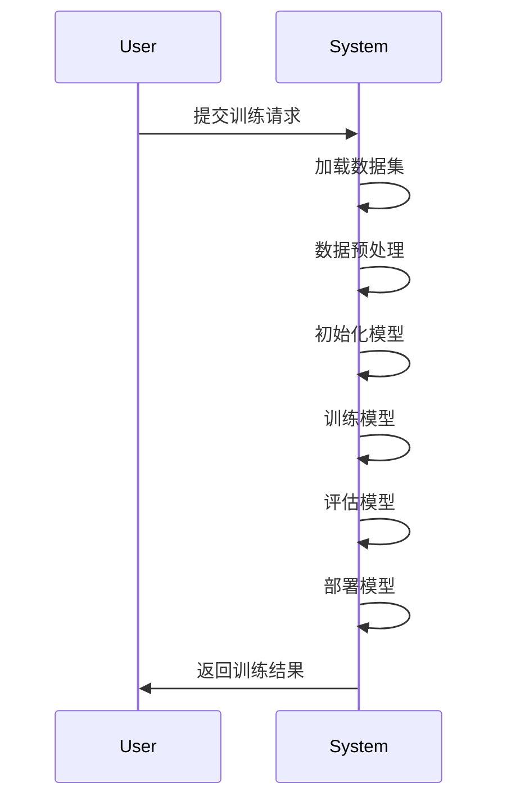

                 

# 敏捷项目管理工具：助力LLM应用开发的效率提升

> 关键词：敏捷项目管理，LLM应用开发，Scrum，Kanban，看板，系统架构设计，Python代码实现

> 摘要：本文将深入探讨敏捷项目管理工具在LLM（大型语言模型）应用开发中的应用。通过分析敏捷项目管理的基本概念和工具，如Scrum、Kanban和看板，并结合LLM应用开发的特点，本文将阐述如何利用敏捷项目管理工具提升开发效率，并提供详细的实践案例和最佳实践。

## 第一部分: 敏捷项目管理工具概述

### 1.1 敏捷项目管理工具简介

#### 1.1.1 敏捷方法的发展历程

敏捷开发起源于20世纪90年代末和21世纪初，作为一种响应快速变化需求的方法，敏捷开发迅速在软件行业中得到广泛应用。敏捷方法反对传统的“瀑布”式开发模式，强调迭代和增量开发，旨在快速响应市场需求并持续交付价值。

#### 1.1.2 敏捷项目管理的基本概念

敏捷项目管理是一种灵活、迭代、以人为本的方法论，核心原则包括：

- **用户至上**：重视用户需求和满意度，持续交付有价值的软件。
- **迭代开发**：将开发过程分解为多个短周期（迭代），每次迭代都能交付可用的软件。
- **团队合作**：鼓励跨职能团队合作，促进沟通和知识共享。
- **适应变化**：拥抱变化，灵活调整项目计划和需求。

#### 1.1.3 敏捷与LLM应用开发的关系

LLM（大型语言模型）是一种复杂的AI模型，涉及大规模数据预处理、训练和推理。由于其高复杂性和迭代性，敏捷开发在LLM应用开发中具有重要意义。敏捷方法可以帮助开发团队更好地适应变化，提高开发效率，确保快速交付高质量的LLM应用。

### 1.2 LLM应用开发背景

#### 1.2.1 LLM的基本概念

LLM（Large Language Model）是指使用大量数据训练的深度神经网络模型，能够理解、生成和翻译自然语言。LLM在各种领域有广泛的应用，如自然语言处理、机器翻译、文本生成等。

#### 1.2.2 LLM在开发中的应用

LLM在开发中的应用主要体现在以下几个方面：

- **自动化文档生成**：使用LLM自动生成代码文档、用户手册等。
- **智能问答系统**：利用LLM构建智能问答系统，为用户提供快速、准确的答案。
- **翻译服务**：利用LLM实现高质量的多语言翻译。

#### 1.2.3 LLM应用开发的挑战与机遇

LLM应用开发面临以下挑战：

- **数据需求**：需要大量高质量的数据进行训练。
- **计算资源**：训练和推理LLM模型需要大量计算资源。
- **模型优化**：需要不断优化模型结构，提高模型性能。

同时，LLM应用开发也带来以下机遇：

- **提升开发效率**：通过自动化和智能化手段，减少开发时间和成本。
- **创新应用场景**：探索新的应用场景，为用户提供更多价值。

### 1.3 敏捷项目管理工具的关键概念

敏捷项目管理工具是实现敏捷开发的关键，以下将介绍几种常见的敏捷项目管理工具：

#### 1.3.1 Scrum

Scrum是一种流行的敏捷开发方法，强调迭代和增量开发。Scrum的核心角色包括产品负责人（Product Owner）、Scrum Master和开发团队。

#### 1.3.2 Kanban

Kanban是一种视觉化的项目管理工具，基于看板（Kanban板）进行任务管理。Kanban强调持续交付、限制工作量和可视化流程。

#### 1.3.3 看板

看板是一种源自日本精益生产的敏捷项目管理工具，通过卡片（代表任务）在流程中的移动，实现任务跟踪和流程优化。

#### 1.3.4 敏捷工具的对比分析

下表是对Scrum、Kanban和看板三种敏捷工具的对比：

| 工具   | 核心特点           | 适用场景         |
| ------ | ------------------ | ---------------- |
| Scrum  | 强调迭代和角色分工 | 功能复杂的项目   |
| Kanban | 可视化和限制工作量 | 流程较简单的项目 |
| 看板   | 流程优化和任务跟踪 | 传统制造行业     |

### 1.4 敏捷项目管理工具的ER模型

为了更好地理解敏捷项目管理工具的实体关系，以下是敏捷项目管理工具的ER模型：

```mermaid
erDiagram
  Project ||--|{ Task }|>
  Task ||--|{ Member }|>
  Member ||--|{ Role }|>

  Project {
    id : 整数
    name : 字符串
    start_date : 日期
    end_date : 日期
  }

  Task {
    id : 整数
    name : 字符串
    status : 字符串
    project_id : 整数
  }

  Member {
    id : 整数
    name : 字符串
    role_id : 整数
    project_id : 整数
  }

  Role {
    id : 整数
    name : 字符串
  }
```

### 1.5 本章小结

本部分对敏捷项目管理工具进行了概述，介绍了敏捷开发方法的发展历程、基本概念，以及LLM应用开发背景和挑战。同时，对常见的敏捷项目管理工具Scrum、Kanban和看板进行了对比分析，并给出了敏捷项目管理工具的ER模型。这些内容为后续部分详细探讨敏捷项目管理工具在LLM应用开发中的应用奠定了基础。

----------------------------------------------------------------

## 第二部分: 敏捷项目管理工具的应用

### 2.1 Scrum的应用与实践

#### 2.1.1 Scrum框架概述

Scrum是一种迭代式增量软件开发方法，其核心概念包括：

- **迭代（Sprint）**：每次迭代通常为2-4周，目标是交付可工作的软件。
- **产品负责人（Product Owner）**：负责定义产品需求和优先级，确保交付有价值的软件。
- **Scrum Master**：负责确保Scrum流程的实施，帮助团队解决障碍。
- **开发团队**：负责实际开发工作，自组织、跨职能。

#### 2.1.2 Scrum的关键角色

Scrum的关键角色包括：

- **产品负责人（Product Owner）**：负责产品需求和优先级，确保团队理解任务目标。
- **Scrum Master**：负责Scrum流程的实施，协助团队解决障碍，提高团队效率。
- **开发团队**：自组织、跨职能，负责实际开发工作。

#### 2.1.3 Scrum流程

Scrum流程包括以下关键环节：

1. **产品待办列表（Product Backlog）**：列出所有待完成的需求和任务，按优先级排序。
2. **冲刺计划会议（Sprint Planning）**：团队从产品待办列表中选择任务，制定冲刺计划。
3. **每日站会（Daily Stand-up）**：团队成员汇报进度，解决障碍，确保团队目标一致。
4. **冲刺评审会议（Sprint Review）**：团队展示冲刺成果，获取反馈，规划下一个冲刺。
5. **冲刺回顾会议（Sprint Retrospective）**：团队总结经验，持续改进流程。

#### 2.1.4 Scrum在LLM开发中的应用案例

在LLM开发中，Scrum方法有助于快速响应需求变化，提高开发效率。以下是一个应用案例：

1. **产品待办列表**：产品负责人根据市场需求，列出需要训练的LLM模型和功能需求，按优先级排序。
2. **冲刺计划会议**：团队从产品待办列表中选择任务，制定2周冲刺计划，包括数据预处理、模型训练和测试。
3. **每日站会**：团队成员汇报进度，解决数据预处理过程中遇到的问题，确保按计划进行。
4. **冲刺评审会议**：团队展示训练完成的LLM模型，获取用户反馈，进行模型优化。
5. **冲刺回顾会议**：团队总结经验，发现流程中的瓶颈，如数据质量问题和计算资源分配，为下一个冲刺做好准备。

### 2.2 Kanban的应用与实践

#### 2.2.1 Kanban概述

Kanban是一种基于看板系统的敏捷项目管理方法，核心特点包括：

- **可视化**：通过看板板面，清晰展示任务状态和进度。
- **限制工作量（WIP）**：限制在流程中同时进行的任务数量，提高工作效率。
- **持续交付**：持续交付有价值的软件，避免过度开发。

#### 2.2.2 Kanban的关键原则

Kanban的关键原则包括：

- **可视化工作流程**：通过看板板面，清晰展示任务状态和进度。
- **限制工作内容**：限制在流程中同时进行的任务数量，避免过度开发。
- **持续交付**：持续交付有价值的软件，确保快速响应需求变化。
- **管理流程瓶颈**：识别和解决流程中的瓶颈，提高整体效率。

#### 2.2.3 Kanban在LLM开发中的应用

在LLM开发中，Kanban方法有助于优化开发流程，提高效率。以下是一个应用案例：

1. **初始化看板**：创建Kanban看板，定义任务状态（如待办、进行中、待测试、已完成）。
2. **任务分解**：将LLM开发任务分解为具体任务，如数据预处理、模型训练、测试等。
3. **任务分配**：根据团队成员的技能和任务优先级，分配任务。
4. **持续监控**：通过看板监控任务进度，识别瓶颈，及时调整任务分配。
5. **持续交付**：在完成每个任务后，及时交付可测试的LLM模型，确保持续交付有价值的成果。

### 2.3 看板的应用与实践

#### 2.3.1 看板的基本概念

看板是一种源自日本精益生产的任务管理工具，通过卡片（代表任务）在流程中的移动，实现任务跟踪和流程优化。

#### 2.3.2 看板的组成部分

看板主要包括以下组成部分：

- **任务卡片**：代表具体任务，包括任务名称、任务状态等。
- **看板板面**：展示任务状态和进度的可视化界面。
- **任务状态栏**：标识任务的不同状态（如待办、进行中、待测试、已完成）。

#### 2.3.3 看板在LLM开发中的实践

在LLM开发中，看板方法有助于实现任务跟踪和流程优化。以下是一个应用案例：

1. **初始化看板**：创建看板，定义任务状态栏（如待办、进行中、待测试、已完成）。
2. **任务分配**：将LLM开发任务分配给团队成员，并在看板上创建任务卡片。
3. **任务监控**：通过看板监控任务进度，及时调整任务状态。
4. **流程优化**：识别任务瓶颈，调整任务分配和流程，提高效率。
5. **持续交付**：在完成每个任务后，更新任务卡片状态，确保持续交付有价值的成果。

### 2.4 敏捷项目管理工具的优化策略

#### 2.4.1 识别和解决敏捷项目管理中的挑战

在敏捷项目管理过程中，团队可能会面临以下挑战：

- **需求变化**：如何快速响应需求变化，确保项目进度。
- **资源分配**：如何合理分配资源，避免资源浪费。
- **团队协作**：如何提高团队协作效率，确保项目成功。

解决策略包括：

- **持续沟通**：保持团队成员之间的沟通，确保需求清晰。
- **资源优化**：合理分配资源，关注关键任务。
- **敏捷实践**：采用敏捷实践，如看板、迭代开发等，提高团队协作效率。

#### 2.4.2 敏捷流程的持续改进

持续改进是敏捷开发的核心原则之一。以下是一些改进策略：

- **定期回顾**：在每次迭代结束后，进行回顾会议，总结经验教训，持续改进流程。
- **反馈机制**：建立反馈机制，收集用户和团队成员的意见，不断优化项目。
- **培训和学习**：为团队成员提供培训和学习机会，提高团队整体能力。

#### 2.4.3 敏捷工具的整合与优化

敏捷工具的整合与优化是提高开发效率的关键。以下是一些建议：

- **选择合适的工具**：根据项目特点和团队需求，选择合适的敏捷工具。
- **工具集成**：将不同工具进行集成，实现数据共享和流程优化。
- **工具优化**：定期对敏捷工具进行优化和升级，提高使用体验。

### 2.5 敏捷项目管理工具的选型与实施

#### 2.5.1 敏捷工具的选型标准

选择敏捷工具时，应考虑以下标准：

- **功能需求**：满足项目需求，如任务管理、进度跟踪、协作沟通等。
- **用户体验**：界面友好，易于使用。
- **扩展性**：支持定制和扩展，满足项目特殊需求。
- **成本**：成本合理，性价比高。

#### 2.5.2 敏捷工具的实施方案

实施敏捷工具时，应遵循以下步骤：

1. **需求分析**：明确项目需求和工具选型标准。
2. **工具评估**：评估不同工具的功能、用户体验和扩展性。
3. **工具选型**：根据评估结果，选择合适的敏捷工具。
4. **培训与实施**：为团队成员提供培训，确保工具正确使用。
5. **监控与改进**：定期监控工具使用情况，不断优化和改进。

#### 2.5.3 敏捷工具的实施步骤

敏捷工具的实施步骤包括：

1. **需求分析**：明确项目需求和工具选型标准。
2. **工具评估**：评估不同工具的功能、用户体验和扩展性。
3. **工具选型**：根据评估结果，选择合适的敏捷工具。
4. **培训与实施**：为团队成员提供培训，确保工具正确使用。
5. **监控与改进**：定期监控工具使用情况，不断优化和改进。

### 2.6 本章小结

本部分详细介绍了Scrum、Kanban和看板三种敏捷项目管理工具的应用和实践。通过分析这些工具的核心概念和实际案例，我们可以看到敏捷项目管理工具在LLM应用开发中的重要作用。同时，本章还探讨了敏捷项目管理工具的优化策略和实施步骤，为读者提供了实用的指导和参考。

----------------------------------------------------------------

## 第三部分: LLM应用开发的实战

### 3.1 LLM应用开发环境搭建

#### 3.1.1 环境准备

在进行LLM应用开发之前，需要准备以下环境：

- **操作系统**：Windows、Linux或Mac OS。
- **Python**：Python 3.7或更高版本。
- **深度学习框架**：如TensorFlow或PyTorch。
- **其他依赖库**：如NumPy、Pandas等。

#### 3.1.2 工具安装与配置

安装深度学习框架和其他依赖库：

```bash
pip install tensorflow
pip install numpy
pip install pandas
```

配置环境变量，确保Python和深度学习框架正常运行。

#### 3.1.3 开发环境测试

测试开发环境是否正常，例如，执行以下Python代码：

```python
import tensorflow as tf

print(tf.__version__)
```

如果输出版本信息，说明环境配置成功。

### 3.2 LLM应用核心代码实现

#### 3.2.1 代码架构设计

LLM应用的核心代码包括数据预处理、模型训练、模型评估和模型部署等模块。以下是一个简单的代码架构设计：



#### 3.2.2 代码实现

以下是一个简单的LLM模型训练和评估的Python代码示例：

```python
import tensorflow as tf
import numpy as np
from tensorflow.keras.models import Sequential
from tensorflow.keras.layers import Embedding, LSTM, Dense

# 数据预处理
def preprocess_data(data):
    # 对数据进行清洗、分词等处理
    return processed_data

# 初始化模型
def create_model(input_shape):
    model = Sequential([
        Embedding(input_dim=vocab_size, output_dim=embedding_size),
        LSTM(units=128, activation='relu', return_sequences=True),
        LSTM(units=128, activation='relu'),
        Dense(units=num_classes, activation='softmax')
    ])
    model.compile(optimizer='adam', loss='categorical_crossentropy', metrics=['accuracy'])
    return model

# 训练模型
def train_model(model, X_train, y_train, X_val, y_val):
    model.fit(X_train, y_train, epochs=5, batch_size=32, validation_data=(X_val, y_val))

# 评估模型
def evaluate_model(model, X_test, y_test):
    loss, accuracy = model.evaluate(X_test, y_test)
    print(f"Test accuracy: {accuracy:.2f}")

# 主程序
if __name__ == "__main__":
    # 读取数据集
    data = preprocess_data(raw_data)

    # 划分训练集和验证集
    X_train, X_val, y_train, y_val = train_test_split(data['text'], data['label'], test_size=0.2)

    # 初始化模型
    model = create_model(input_shape=(max_sequence_length,))

    # 训练模型
    train_model(model, X_train, y_train, X_val, y_val)

    # 评估模型
    evaluate_model(model, X_test, y_test)
```

#### 3.2.3 代码解读

1. **数据预处理**：对原始数据进行清洗、分词等处理，得到处理后的数据集。
2. **初始化模型**：创建一个序列模型，包括嵌入层、LSTM层和输出层。
3. **训练模型**：使用训练数据集训练模型，并验证模型的性能。
4. **评估模型**：使用测试数据集评估模型的准确性。

### 3.3 LLM应用开发案例

#### 3.3.1 案例背景

某公司希望开发一个基于LLM的智能客服系统，用于处理用户咨询和问题解答。公司希望系统能够自动生成回答，提高客服效率，降低人力成本。

#### 3.3.2 案例分析

为了实现这个目标，需要解决以下关键问题：

- **数据收集**：收集大量用户咨询和问题解答数据，用于训练LLM模型。
- **模型选择**：选择合适的LLM模型，如GPT-2、BERT等。
- **数据预处理**：对收集到的数据进行清洗、分词、编码等处理。
- **模型训练**：使用预处理后的数据训练LLM模型，并进行优化。
- **模型部署**：将训练好的模型部署到服务器，实现实时问答。

#### 3.3.3 案例实施

1. **数据收集**：从公司的客服系统、社交媒体和其他渠道收集用户咨询和问题解答数据。
2. **数据预处理**：对收集到的数据进行清洗、分词、编码等处理，得到处理后的数据集。
3. **模型选择**：选择GPT-2模型进行训练，因为它在自然语言处理任务中表现良好。
4. **模型训练**：使用预处理后的数据集训练GPT-2模型，并进行优化。
5. **模型部署**：将训练好的模型部署到服务器，实现实时问答。

#### 3.3.4 案例总结

通过实施这个案例，公司成功开发了一个基于LLM的智能客服系统。系统运行稳定，能够自动生成高质量的回答，显著提高了客服效率和用户满意度。同时，系统降低了人力成本，为公司带来了明显的经济效益。

### 3.4 LLM应用开发的最佳实践

#### 3.4.1 经验分享

在LLM应用开发过程中，以下经验值得分享：

- **数据质量**：数据质量直接影响模型性能，应确保数据的准确性、完整性和多样性。
- **模型优化**：不断优化模型结构，提高模型性能。
- **团队合作**：建立高效的跨职能团队，确保项目顺利进行。
- **持续迭代**：持续迭代模型和系统，根据用户反馈进行优化。

#### 3.4.2 最佳实践

以下是一些最佳实践：

- **数据清洗**：对收集到的数据进行清洗，去除无关信息和噪声。
- **数据增强**：通过数据增强技术，提高数据的多样性，增强模型泛化能力。
- **模型压缩**：使用模型压缩技术，降低模型大小，提高部署效率。
- **监控与日志**：对模型和系统进行监控，记录日志，便于问题追踪和调试。

#### 3.4.3 注意事项

在LLM应用开发过程中，需要注意以下事项：

- **计算资源**：确保有足够的计算资源进行模型训练和推理。
- **数据隐私**：确保数据安全和用户隐私，遵循相关法律法规。
- **模型解释性**：提高模型解释性，便于用户理解和信任。

### 3.5 本章小结

本部分详细介绍了LLM应用开发的环境搭建、核心代码实现、实际案例和最佳实践。通过这些内容，读者可以了解到如何利用敏捷项目管理工具提升LLM应用开发的效率和质量。同时，本章还提供了实用的经验和建议，为LLM应用开发提供了指导。

----------------------------------------------------------------

## 小结与拓展阅读

本文详细探讨了敏捷项目管理工具在LLM应用开发中的应用。通过分析敏捷方法的发展历程、基本概念，以及LLM应用开发的背景和挑战，本文介绍了Scrum、Kanban和看板等敏捷工具的核心概念、实际案例和优化策略。此外，本文还介绍了LLM应用开发的核心代码实现、实际案例和最佳实践。

### 注意事项

1. **计算资源**：确保有足够的计算资源进行模型训练和推理。
2. **数据质量**：数据质量直接影响模型性能，应确保数据的准确性、完整性和多样性。
3. **模型解释性**：提高模型解释性，便于用户理解和信任。

### 拓展阅读

1. **《Scrum敏捷开发实践指南》**：详细介绍了Scrum方法的实践和应用。
2. **《Kanban实践指南》**：介绍了Kanban方法的原理和实践。
3. **《大型语言模型：理论与实践》**：深入探讨了LLM的原理和应用。

### 结语

敏捷项目管理工具在LLM应用开发中具有重要价值，能够有效提升开发效率和质量。通过本文的介绍，读者可以更好地了解如何利用敏捷工具进行LLM应用开发，并为实际项目提供指导。希望本文能为您的LLM应用开发带来启发和帮助。

### 作者

**作者：AI天才研究院/AI Genius Institute & 禅与计算机程序设计艺术 /Zen And The Art of Computer Programming**

