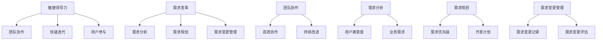

                 

### 《敏捷领导力：驱动大型应用开发的需求变革》

> **关键词：** 敏捷领导力、大型应用开发、需求变革、项目进度、团队协作

> **摘要：** 本篇文章将深入探讨敏捷领导力在驱动大型应用开发需求变革中的关键作用。文章首先介绍了传统开发模式的挑战和敏捷领导力的崛起，随后分析了需求变革的核心要素及其在大型应用开发中的应用策略。通过详细阐述敏捷领导力的核心概念和实践方法，结合大型应用开发的需求特性，本文揭示了敏捷领导力与需求变革的协同效应，并展望了未来的发展趋势。文章旨在为IT领域的专业人士提供有价值的理论和实践指导，以推动大型应用开发的高效与成功。

---

### 第一部分：背景介绍

#### 1.1 问题背景

##### 1.1.1 传统开发模式的挑战

传统开发模式，特别是瀑布模型，长期以来在大型应用开发中被广泛应用。然而，随着信息技术的迅猛发展，客户需求的多样化和快速变化，传统开发模式逐渐暴露出一系列挑战。

1. **响应速度慢：** 瀑布模型强调线性开发和严格的阶段划分，导致项目周期长，无法迅速响应市场变化。
2. **需求变更困难：** 传统模式中的需求确定过程相对固定，一旦需求发生变化，修改成本高，项目进度容易延误。
3. **质量难以保证：** 由于开发与测试阶段的分离，质量问题往往在项目后期才被发现，导致返工成本增加。

##### 1.1.2 敏捷领导力的崛起

面对传统开发模式的挑战，敏捷领导力逐渐崭露头角。敏捷领导力强调灵活、协作和持续交付，以更好地适应市场需求。

1. **快速迭代：** 敏捷方法通过持续的小周期迭代，快速交付可用的产品，使团队能够及时调整和响应变化。
2. **用户参与：** 敏捷领导力强调用户参与，确保需求与用户需求高度一致，提升产品满意度。
3. **持续改进：** 敏捷领导力倡导不断反思和改进，以优化开发流程和产品质量。

##### 1.1.3 大型应用开发的需求变革

大型应用开发的需求变革是顺应时代发展的必然趋势。这一变革主要体现在以下几个方面：

1. **需求多样化和动态化：** 大型应用往往需要满足复杂和多变的需求，传统的需求分析方法难以适应这种变化。
2. **交付模式转变：** 从一次性交付转向持续交付，缩短交付周期，提高交付频率。
3. **团队协作：** 敏捷领导力强调团队协作，打破部门壁垒，实现跨部门、跨功能的协作。

#### 1.2 问题描述

##### 1.2.1 传统开发模式的瓶颈

传统开发模式在大型应用开发中面临以下瓶颈：

1. **需求管理困难：** 需求变更频繁，但传统模式下的需求管理难以适应这种变化。
2. **沟通成本高：** 传统模式中开发与测试阶段分离，导致沟通成本高，信息传递不畅。
3. **质量难以控制：** 项目周期长，质量问题难以在早期发现和解决。

##### 1.2.2 敏捷领导力的优势

敏捷领导力在大型应用开发中展现出以下优势：

1. **快速响应：** 通过快速迭代和持续交付，敏捷领导力能够迅速响应市场需求变化。
2. **用户参与：** 敏捷领导力强调用户参与，确保需求与用户需求高度一致，提升产品满意度。
3. **持续改进：** 敏捷领导力倡导持续改进，通过不断反思和优化，提高开发效率和产品质量。

##### 1.2.3 需求变革的核心要素

需求变革在大型应用开发中的核心要素包括：

1. **需求管理：** 敏捷需求管理方法，如用户故事地图和优先级排序，帮助团队更好地理解和管理需求。
2. **团队协作：** 敏捷领导力强调跨部门、跨功能的团队协作，打破部门壁垒，实现高效协同。
3. **持续交付：** 通过持续交付，缩短交付周期，提高交付频率，确保产品及时上市。

#### 1.3 问题解决

##### 1.3.1 敏捷领导力在大型应用开发中的实践

敏捷领导力在大型应用开发中的实践包括：

1. **组织结构：** 建立敏捷团队，打破传统部门壁垒，实现高效协作。
2. **流程设计：** 设计敏捷开发流程，如迭代计划、每日站会和回顾会议，确保开发进度和问题及时反馈。
3. **文化塑造：** 塑造以用户为中心、持续改进的敏捷文化，提高团队凝聚力。

##### 1.3.2 需求变革的方法与策略

需求变革的方法与策略包括：

1. **需求分析：** 采用敏捷需求分析方法，如用户故事和优先级排序，确保需求能够快速迭代和变更。
2. **需求管理：** 建立需求跟踪机制，确保需求变更的及时记录和管理。
3. **风险管理：** 实施需求变更的风险评估和管理，确保变更带来的风险最小化。

##### 1.3.3 需求管理的重要性

需求管理在敏捷领导力中至关重要，它包括：

1. **需求定义：** 明确需求的具体内容和实现方式，确保团队能够准确理解和执行。
2. **需求变更管理：** 管理需求变更的过程，确保变更的及时性和可控性。
3. **需求优先级排序：** 根据业务优先级对需求进行排序，确保团队能够集中精力完成最重要的需求。

#### 1.4 边界与外延

##### 1.4.1 敏捷领导力的适用范围

敏捷领导力适用于以下场景：

1. **需求多变：** 适用于需求频繁变更的项目，能够快速适应需求变化。
2. **团队协作：** 适用于需要跨部门、跨功能团队协作的项目。
3. **快速交付：** 适用于需要快速交付产品的项目。

##### 1.4.2 大型应用开发的边界

大型应用开发的边界包括：

1. **规模：** 通常指大型企业级应用，涉及多个业务领域和复杂的系统架构。
2. **复杂性：** 包括高并发、大数据处理、多系统集成等复杂需求。
3. **安全性：** 需要确保系统的稳定性和数据的安全性。

##### 1.4.3 需求变革的外部影响因素

需求变革的外部影响因素包括：

1. **市场变化：** 市场需求的快速变化是需求变革的主要驱动因素。
2. **技术进步：** 技术的快速发展为需求变革提供了新的可能性。
3. **政策法规：** 相关政策法规的变化也可能影响需求变革的方向和速度。

#### 1.5 概念结构与核心要素组成

##### 1.5.1 敏捷领导力的核心概念

敏捷领导力的核心概念包括：

1. **敏捷团队：** 由多职能成员组成的团队，能够快速响应变化。
2. **迭代开发：** 通过短周期迭代，快速交付可用的产品。
3. **用户参与：** 强调用户参与，确保需求与用户需求一致。

##### 1.5.2 大型应用开发的需求要素

大型应用开发的需求要素包括：

1. **业务需求：** 涉及企业的核心业务流程和需求。
2. **用户需求：** 来自最终用户的需求和期望。
3. **功能需求：** 涉及系统的功能特性和功能点。

##### 1.5.3 敏捷领导力与大型应用开发的关联

敏捷领导力与大型应用开发的关联在于：

1. **组织结构：** 敏捷领导力通过组织结构的变革，实现跨部门、跨功能的协作。
2. **需求管理：** 敏捷需求管理方法确保需求能够快速迭代和变更。
3. **持续交付：** 通过持续交付，实现快速响应市场需求。

#### 1.6 本章小结

本文介绍了敏捷领导力在驱动大型应用开发需求变革中的重要性。传统开发模式在应对需求变化和快速交付方面存在瓶颈，而敏捷领导力通过快速迭代、用户参与和持续改进，能够有效解决这些问题。大型应用开发的需求变革是顺应时代发展的必然趋势，而敏捷领导力在这一变革中起到了关键作用。接下来的章节将进一步深入探讨敏捷领导力的核心概念和实践方法，以及需求变革的方法和策略。

---

### 第一部分：背景介绍（续）

#### 1.1 传统开发模式的挑战

传统开发模式，尤其是瀑布模型，长期以来在大型应用开发中被广泛应用。瀑布模型将软件开发过程划分为多个阶段，如需求分析、设计、编码、测试和维护，每个阶段都必须完成后再进入下一个阶段。这种方法在早期软件开发中被认为是有效和高效的，因为它提供了明确的阶段划分和严格的流程控制。

然而，随着信息技术的迅猛发展，客户需求的多样化和快速变化，传统开发模式逐渐暴露出一系列挑战：

1. **响应速度慢：** 瀑布模型强调线性开发和严格的阶段划分，导致项目周期长，无法迅速响应市场变化。一旦项目启动，需求变更往往受到严格的限制，因为任何变更都会导致整个项目的重新规划和资源分配。

2. **需求变更困难：** 在瀑布模型中，需求通常在项目初期就被确定，并在整个开发过程中保持不变。这导致需求变更的处理变得复杂和昂贵，因为任何变更都需要重新评估整个项目进度和资源分配，可能导致项目延误或成本超支。

3. **质量难以保证：** 由于开发与测试阶段的分离，质量问题往往在项目后期才被发现，导致返工成本增加。在瀑布模型中，测试通常在开发完成后进行，这使得修复错误和缺陷变得困难和昂贵。

#### 1.1.2 敏捷领导力的崛起

面对传统开发模式的挑战，敏捷领导力逐渐崭露头角。敏捷领导力起源于软件开发领域，旨在通过灵活、协作和持续交付的方式，更好地适应市场需求的变化。敏捷领导力的核心理念包括：

1. **快速迭代：** 敏捷方法通过短周期迭代（通常为2-4周）来开发产品。每次迭代都产生一个可交付的版本，使得团队能够快速响应市场变化，并及时调整开发方向。

2. **用户参与：** 敏捷领导力强调用户参与整个开发过程，确保需求与用户需求高度一致。用户可以通过持续提供反馈，帮助团队更好地理解需求，并确保产品能够满足用户期望。

3. **持续改进：** 敏捷领导力倡导持续改进，通过反思和总结每次迭代的经验，优化开发流程和产品。这种持续改进的文化有助于提高团队效率和产品质量。

敏捷领导力的崛起并非偶然，它是在软件开发实践中逐步发展起来的。早期的敏捷运动始于2001年，当时一些软件工程师和项目经理在尝试解决传统开发模式面临的问题时，共同提出了《敏捷宣言》。这份宣言强调了个体和互动、可工作的软件、客户协作和响应变化的重要性。

随着时间的推移，敏捷方法不断进化，形成了多种敏捷实践，如Scrum、Kanban、XP（极限编程）等。这些实践共同构成了敏捷领导力的核心，为软件开发团队提供了灵活、高效的开发模式。

#### 1.1.3 大型应用开发的需求变革

大型应用开发的需求变革是顺应时代发展的必然趋势。这种变革主要体现在以下几个方面：

1. **需求多样化和动态化：** 大型应用往往需要满足来自不同业务领域和用户群体的复杂需求。这些需求往往是动态变化的，因为市场和技术的快速发展不断推动需求的变化。

2. **交付模式转变：** 从一次性交付转向持续交付，是大型应用开发需求变革的一个重要方向。持续交付意味着团队能够频繁地交付可用的产品，而不是在项目完成后一次性交付。这种交付模式缩短了交付周期，提高了产品的上市速度，并使团队能够更好地适应市场需求的变化。

3. **团队协作：** 敏捷领导力强调团队协作，打破传统部门壁垒，实现跨部门、跨功能的协作。这种协作方式有助于提高团队的效率和创新能力，使团队能够更好地应对复杂需求的变化。

需求变革不仅影响了开发模式，还影响了企业的组织结构和运营方式。企业需要建立以用户为中心的文化，鼓励创新和持续改进，以适应快速变化的市场环境。

### 1.2 问题描述

#### 1.2.1 传统开发模式的瓶颈

传统开发模式在大型应用开发中面临以下瓶颈：

1. **需求管理困难：** 在传统开发模式中，需求管理通常是一个复杂和繁琐的过程。需求通常在项目初期确定，并被视为固定不变。然而，在实际开发过程中，需求往往会发生变化，尤其是在大型应用中，需求变更的频率和幅度可能很大。传统模式下的需求管理难以适应这种变化，导致需求变更的处理变得复杂和昂贵。

2. **沟通成本高：** 传统模式中，开发与测试阶段通常分离，这意味着开发团队和测试团队之间的沟通成本较高。由于信息传递不畅，开发团队可能无法及时了解测试团队的反馈，导致开发工作出现偏差。此外，不同阶段的文档和报告也可能导致信息冗余和误解。

3. **质量难以控制：** 在传统开发模式中，测试通常在开发完成后进行，这使得质量问题难以在早期发现和解决。一旦问题在测试阶段被发现，往往需要大量的返工和修复，导致项目成本的增加。

#### 1.2.2 敏捷领导力的优势

敏捷领导力在解决传统开发模式瓶颈方面展现出显著的优势：

1. **快速响应：** 敏捷方法通过短周期迭代（通常为2-4周）来开发产品。每次迭代都产生一个可交付的版本，这使得团队能够快速响应市场变化，并及时调整开发方向。敏捷领导力鼓励频繁的沟通和反馈，确保团队能够及时了解用户需求和市场动态。

2. **用户参与：** 敏捷领导力强调用户参与整个开发过程，确保需求与用户需求高度一致。用户可以通过持续提供反馈，帮助团队更好地理解需求，并确保产品能够满足用户期望。这种用户参与的方式不仅提高了产品的质量，还增强了用户的满意度和忠诚度。

3. **持续改进：** 敏捷领导力倡导持续改进，通过反思和总结每次迭代的经验，优化开发流程和产品。这种持续改进的文化有助于提高团队效率和产品质量。敏捷团队定期进行回顾会议，分析每次迭代中的优点和不足，并提出改进措施。

#### 1.2.3 需求变革的核心要素

需求变革在大型应用开发中的核心要素包括以下几个方面：

1. **需求管理：** 敏捷需求管理方法，如用户故事地图和优先级排序，帮助团队更好地理解和管理需求。用户故事地图提供了一个可视化的需求管理工具，使得团队能够清晰地了解每个用户故事的重要性。优先级排序确保团队能够集中精力完成最重要的需求，提高开发效率。

2. **团队协作：** 敏捷领导力强调跨部门、跨功能的团队协作，打破传统部门壁垒，实现高效协同。这种协作方式有助于提高团队的效率和创新能力，使团队能够更好地应对复杂需求的变化。团队成员之间建立信任和沟通，共享知识和资源，共同推动项目进展。

3. **持续交付：** 通过持续交付，缩短交付周期，提高交付频率，确保产品及时上市。持续交付意味着团队能够频繁地交付可用的产品，而不是在项目完成后一次性交付。这种交付模式不仅提高了产品的上市速度，还使团队能够更好地适应市场需求的变化。

### 1.3 问题解决

#### 1.3.1 敏捷领导力在大型应用开发中的实践

敏捷领导力在大型应用开发中的实践包括以下几个方面：

1. **组织结构：** 建立敏捷团队，打破传统部门壁垒，实现高效协作。敏捷团队通常由多职能成员组成，包括开发、测试、设计、产品管理等角色。团队成员共同工作，共同承担责任，提高团队协作效率。

2. **流程设计：** 设计敏捷开发流程，如迭代计划、每日站会和回顾会议，确保开发进度和问题及时反馈。迭代计划会议帮助团队确定每个迭代的目标和任务，每日站会确保团队成员及时沟通进度和问题，回顾会议帮助团队总结经验和改进流程。

3. **文化塑造：** 塑造以用户为中心、持续改进的敏捷文化，提高团队凝聚力。敏捷文化鼓励团队成员积极参与、开放沟通和持续学习。通过建立信任和共享的文化氛围，团队成员能够更好地合作，共同推动项目成功。

#### 1.3.2 需求变革的方法与策略

需求变革的方法与策略包括以下几个方面：

1. **需求分析：** 采用敏捷需求分析方法，如用户故事和优先级排序，确保需求能够快速迭代和变更。用户故事是一种简短、明确的需求描述，有助于团队理解和细化需求。优先级排序确保团队能够集中精力完成最重要的需求，提高开发效率。

2. **需求管理：** 建立需求跟踪机制，确保需求变更的及时记录和管理。需求跟踪工具帮助团队记录和跟踪每个需求的状态和进展，确保需求变更能够被及时识别和处理。

3. **风险管理：** 实施需求变更的风险评估和管理，确保变更带来的风险最小化。通过识别潜在的风险和影响，团队可以制定相应的应对策略，降低变更带来的负面影响。

#### 1.3.3 需求管理的重要性

需求管理在敏捷领导力中至关重要，它包括以下几个方面：

1. **需求定义：** 明确需求的具体内容和实现方式，确保团队能够准确理解和执行。需求定义的过程需要详细描述需求的功能、性能、约束和限制，以确保需求的完整性和准确性。

2. **需求变更管理：** 管理需求变更的过程，确保变更的及时性和可控性。需求变更可能会对项目进度、成本和质量产生影响，因此需要建立有效的变更管理流程，确保变更的审批、记录和追踪。

3. **需求优先级排序：** 根据业务优先级对需求进行排序，确保团队能够集中精力完成最重要的需求。需求优先级排序有助于团队集中资源，提高开发效率，确保关键需求的优先级得到满足。

### 1.4 边界与外延

#### 1.4.1 敏捷领导力的适用范围

敏捷领导力适用于以下场景：

1. **需求多变：** 适用于需求频繁变更的项目，能够快速适应需求变化。
2. **团队协作：** 适用于需要跨部门、跨功能团队协作的项目。
3. **快速交付：** 适用于需要快速交付产品的项目。

敏捷领导力不仅适用于软件开发，还适用于其他领域，如产品开发、项目管理等。其核心在于通过灵活、协作和持续交付的方式，提高团队效率和产品质量。

#### 1.4.2 大型应用开发的边界

大型应用开发的边界包括以下几个方面：

1. **规模：** 通常指大型企业级应用，涉及多个业务领域和复杂的系统架构。
2. **复杂性：** 包括高并发、大数据处理、多系统集成等复杂需求。
3. **安全性：** 需要确保系统的稳定性和数据的安全性。

大型应用开发通常涉及多个团队和部门，需要跨部门协作和协调。因此，敏捷领导力在大型应用开发中尤为重要，能够帮助团队更好地应对复杂性和多样性。

#### 1.4.3 需求变革的外部影响因素

需求变革的外部影响因素包括以下几个方面：

1. **市场变化：** 市场需求的快速变化是需求变革的主要驱动因素。市场趋势和技术进步可能导致需求的变化，因此需求管理需要具备灵活性和适应性。
2. **技术进步：** 技术的快速发展为需求变革提供了新的可能性。新技术的出现可能改变需求的形式和内容，因此需求管理需要关注技术趋势，及时调整需求。
3. **政策法规：** 相关政策法规的变化也可能影响需求变革的方向和速度。例如，数据隐私法规和安全标准的更新可能对需求产生直接影响，需求管理需要遵守相关法规和标准。

### 1.5 概念结构与核心要素组成

#### 1.5.1 敏捷领导力的核心概念

敏捷领导力的核心概念包括以下几个方面：

1. **敏捷团队：** 敏捷团队是由多职能成员组成的团队，能够快速响应变化。团队成员通常具备不同技能，如开发、测试、设计、产品管理等，能够共同完成项目任务。
2. **迭代开发：** 迭代开发是通过短周期迭代来开发产品。每次迭代都产生一个可交付的版本，团队可以根据用户反馈和市场需求，不断调整和优化产品。
3. **用户参与：** 用户参与是敏捷领导力的一个关键要素。用户在整个开发过程中提供反馈和建议，确保产品能够满足用户需求和期望。

#### 1.5.2 大型应用开发的需求要素

大型应用开发的需求要素包括以下几个方面：

1. **业务需求：** 业务需求是大型应用开发的核心，涉及企业的核心业务流程和需求。业务需求通常由业务分析师或产品经理定义，确保产品能够满足业务需求。
2. **用户需求：** 用户需求是用户对产品的期望和需求。用户需求通常通过用户访谈、问卷调查和市场调研等方式收集，确保产品能够满足用户的实际需求。
3. **功能需求：** 功能需求是产品的具体功能特性，涉及产品的功能点和技术实现。功能需求通常由开发团队根据业务需求和用户需求进行定义。

#### 1.5.3 敏捷领导力与大型应用开发的关联

敏捷领导力与大型应用开发的关联主要体现在以下几个方面：

1. **组织结构：** 敏捷领导力通过组织结构的变革，实现跨部门、跨功能的协作。敏捷团队通常由多个部门组成，能够高效协作，提高项目效率。
2. **需求管理：** 敏捷领导力通过敏捷需求管理方法，如用户故事和优先级排序，确保需求能够快速迭代和变更。这种需求管理方法能够更好地适应大型应用开发的需求变化。
3. **持续交付：** 敏捷领导力通过持续交付，缩短交付周期，提高交付频率。持续交付能够确保产品及时上市，满足市场需求。

### 1.6 本章小结

本章介绍了敏捷领导力在驱动大型应用开发需求变革中的重要性。传统开发模式在应对需求变化和快速交付方面存在瓶颈，而敏捷领导力通过快速迭代、用户参与和持续改进，能够有效解决这些问题。大型应用开发的需求变革是顺应时代发展的必然趋势，而敏捷领导力在这一变革中起到了关键作用。接下来的章节将进一步深入探讨敏捷领导力的核心概念和实践方法，以及需求变革的方法和策略。

---

### 第二部分：核心概念与联系

#### 2.1 敏捷领导力的原理

敏捷领导力是一套在快速变化的环境中指导团队和组织高效运作的方法论。其核心原理基于《敏捷宣言》和一系列敏捷实践指南，旨在通过灵活性和协作来应对复杂性和不确定性。

##### 2.1.1 敏捷领导力的定义

敏捷领导力不仅仅是管理技术，更是一种文化和哲学。根据《敏捷宣言》，敏捷领导力的定义可以概括为：

- **个体和互动重于过程与工具：** 强调团队协作和沟通，认为个人的能力和互动比具体的工具或流程更重要。
- **可工作的软件重于详尽的文档：** 关注于交付可运行的产品，认为软件的实际效果比详尽的文档更重要。
- **客户合作重于合同谈判：** 倡导与客户紧密合作，及时获取反馈，以更好地满足客户需求。
- **响应变化重于遵循计划：** 强调适应变化，通过迭代和持续交付来应对市场和技术的不确定性。

##### 2.1.2 敏捷领导力的属性特征

敏捷领导力具有以下几个显著属性特征：

1. **适应性：** 敏捷领导力能够快速适应变化，通过迭代和反馈机制，不断调整计划和目标。
2. **灵活性：** 敏捷团队在面对不确定性时，能够灵活调整资源分配和任务优先级。
3. **透明性：** 敏捷领导力倡导透明的沟通和决策过程，确保所有团队成员都能了解项目进展和问题。
4. **自主性：** 敏捷团队拥有自主决策权，能够自我管理并承担责任。
5. **可持续性：** 敏捷领导力强调长期可持续的工作节奏，避免过度工作。

##### 2.1.3 敏捷领导力的实践方法

敏捷领导力的实践方法包括一系列具体的实践，如：

1. **Scrum：** 一种迭代式增量软件开发过程，通过每日站会、迭代计划和回顾会议来管理项目进度和问题。
2. **Kanban：** 一种可视化工作流程管理方法，通过看板（Kanban板）来管理任务流动和优化工作流程。
3. **用户故事：** 一种简短的需求描述方法，通常包括用户需要解决的问题或功能，以用户的角度来描述。
4. **看板（Kanban）：** 一种可视化工作流程管理方法，通过看板（Kanban板）来管理任务流动和优化工作流程。
5. **迭代开发：** 通过短周期迭代来开发产品，每次迭代都产生一个可交付的版本。

#### 2.2 大型应用开发的需求变革

大型应用开发的需求变革是指在大型应用开发过程中，如何适应快速变化的市场需求和技术进步，以提高开发效率、质量和用户满意度。

##### 2.2.1 大型应用开发的需求特性

大型应用开发的需求特性包括：

1. **复杂性：** 大型应用通常涉及多个业务领域和复杂的系统架构，需求复杂且多变。
2. **多样性：** 大型应用需要满足来自不同用户群体的多样化需求，需求多样且相互关联。
3. **动态性：** 大型应用的需求往往随着市场和技术的变化而动态调整。

##### 2.2.2 需求变革的驱动因素

需求变革的驱动因素包括：

1. **市场变化：** 市场需求的快速变化是需求变革的主要驱动因素。
2. **技术进步：** 技术的快速发展为需求变革提供了新的可能性。
3. **用户期望：** 用户对产品功能、性能和用户体验的要求不断提高，推动需求变革。

##### 2.2.3 需求变革的实施步骤

需求变革的实施步骤包括：

1. **需求分析：** 通过用户访谈、问卷调查和市场调研等方法，收集和整理用户需求。
2. **需求规划：** 根据业务目标和用户需求，制定需求优先级和开发计划。
3. **需求变更管理：** 建立需求变更管理流程，确保需求变更的及时记录、评估和审批。
4. **持续沟通：** 保持与用户的持续沟通，确保需求的理解和实现符合用户期望。

#### 2.3 敏捷领导力与需求变革的联系

敏捷领导力与需求变革之间存在密切的联系，二者相互促进，共同推动大型应用开发的高效和成功。

##### 2.3.1 敏捷领导力在需求变革中的作用

敏捷领导力在需求变革中的作用包括：

1. **快速响应：** 敏捷领导力通过快速迭代和持续交付，能够快速响应市场需求变化。
2. **用户参与：** 敏捷领导力强调用户参与，确保需求与用户需求一致，提高用户满意度。
3. **持续改进：** 敏捷领导力倡导持续改进，通过反思和优化，提高开发效率和质量。

##### 2.3.2 需求变革对敏捷领导力的影响

需求变革对敏捷领导力的影响包括：

1. **需求多样性：** 需求变革带来了需求的多样性和动态性，要求敏捷团队具备更高的适应性和灵活性。
2. **需求变更频率：** 需求变更的频率增加，要求敏捷团队建立有效的需求变更管理流程。
3. **用户满意度：** 需求变革的目标之一是提高用户满意度，要求敏捷团队更好地理解用户需求，提供高质量的产品。

##### 2.3.3 二者之间的协同效应

敏捷领导力与需求变革之间的协同效应包括：

1. **高效协作：** 敏捷领导力通过强调团队协作，提高需求的实现效率。
2. **快速迭代：** 需求变革通过不断调整需求，支持敏捷领导力的快速迭代和持续交付。
3. **持续改进：** 敏捷领导力通过持续改进，帮助需求变革更好地适应市场和技术变化。

#### 2.4 核心概念对比表格

为了更直观地理解敏捷领导力和需求变革的核心概念，我们可以通过以下对比表格来展示二者的异同：

| 核心概念       | 敏捷领导力                 | 需求变革                          |
| -------------- | -------------------------- | --------------------------------- |
| 定义           | 团队协作、快速迭代、用户参与 | 适应市场需求、提高开发效率和质量 |
| 特性           | 适应性、灵活性、自主性、透明性 | 动态性、多样性、复杂性            |
| 实践方法       | Scrum、用户故事、迭代开发    | 需求分析、需求规划、需求变更管理  |
| 关键作用       | 快速响应、持续改进          | 提高用户满意度、满足业务需求       |
| 影响因素       | 市场变化、技术进步          | 市场变化、技术进步、用户期望      |

#### 2.5 ER实体关系图架构

为了更好地展示敏捷领导力和需求变革的实体关系，我们可以使用Mermaid流程图来绘制实体关系图。



该实体关系图展示了敏捷领导力和需求变革的核心概念及其相互关系。通过这些关系，我们可以更清晰地理解二者如何相互促进，共同推动大型应用开发的需求变革。

#### 2.6 本章小结

本章深入探讨了敏捷领导力的原理和需求变革的核心概念，并分析了二者之间的联系和协同效应。敏捷领导力通过团队协作、快速迭代和用户参与，能够有效应对市场需求变化。需求变革则通过适应市场和技术变化，提高开发效率和产品质量。通过本章的讨论，我们认识到敏捷领导力和需求变革在大型应用开发中的重要性，以及它们如何相互促进，共同推动项目的成功。

---

### 第二部分：核心概念与联系（续）

#### 2.1 敏捷领导力的原理

敏捷领导力不仅是一种管理方法，更是一种文化变革。它强调灵活、协作和持续交付，以适应快速变化的市场环境。

##### 2.1.1 敏捷领导力的定义

敏捷领导力是基于敏捷开发理念的领导方式，它强调以下核心价值观：

- **个体和互动重于过程与工具：** 强调团队成员之间的互动和协作，认为个人的经验和判断比固定的过程和工具更重要。
- **可工作的软件重于详尽的文档：** 倡导交付可运行的产品，认为软件的实际效果比详尽的文档更重要。
- **客户合作重于合同谈判：** 强调与客户的紧密合作，通过持续的沟通和反馈来确保产品满足客户需求。
- **响应变化重于遵循计划：** 认为在快速变化的环境中，灵活适应变化比严格执行计划更为重要。

敏捷领导力不仅仅关注技术层面，更强调组织文化和领导风格的变化。它要求领导者在管理团队时，具备以下特点：

1. **开放沟通：** 领导者需要建立开放、透明的沟通渠道，鼓励团队成员自由表达意见和反馈。
2. **信任和尊重：** 领导者需要建立信任和尊重的文化，鼓励团队成员自主决策和承担责任。
3. **持续学习：** 领导者需要具备持续学习的精神，不断更新知识和技能，以适应快速变化的环境。

##### 2.1.2 敏捷领导力的属性特征

敏捷领导力具有以下几个显著属性特征：

1. **适应性：** 敏捷领导力能够快速适应变化，通过迭代和反馈机制，不断调整计划和目标。
2. **灵活性：** 敏捷领导者具备应对不确定性的能力，能够灵活调整资源分配和任务优先级。
3. **透明性：** 敏捷领导力倡导透明的沟通和决策过程，确保所有团队成员都能了解项目进展和问题。
4. **自主性：** 敏捷团队拥有自主决策权，能够自我管理并承担责任。
5. **可持续性：** 敏捷领导力强调长期可持续的工作节奏，避免过度工作。

##### 2.1.3 敏捷领导力的实践方法

敏捷领导力的实践方法包括一系列具体的实践，如：

1. **Scrum：** Scrum是一种迭代式增量软件开发过程，通过每日站会、迭代计划和回顾会议来管理项目进度和问题。
2. **Kanban：** Kanban是一种可视化工作流程管理方法，通过看板（Kanban板）来管理任务流动和优化工作流程。
3. **用户故事：** 用户故事是一种简短的需求描述方法，通常包括用户需要解决的问题或功能，以用户的角度来描述。
4. **看板（Kanban）：** Kanban是一种可视化工作流程管理方法，通过看板（Kanban板）来管理任务流动和优化工作流程。
5. **迭代开发：** 通过短周期迭代来开发产品，每次迭代都产生一个可交付的版本。

Scrum框架是敏捷领导力的一个典型实践。它包括以下几个核心组件：

1. **产品待办列表（Product Backlog）：** 列出了所有待完成的工作项，通常由产品负责人（Product Owner）维护。
2. ** sprint待办列表（Sprint Backlog）：** 在每个迭代（sprint）开始时，团队从产品待办列表中选择部分工作项，形成sprint待办列表。
3. **每日站会（Daily Stand-up）：** 团队成员每天花15-30分钟时间开会，讨论各自的进展、遇到的问题和计划。
4. **迭代评审（Sprint Review）：** 在每个迭代结束时，团队与利益相关者进行评审，展示已完成的可交付成果，收集反馈。
5. **迭代回顾（Sprint Retrospective）：** 在每个迭代结束时，团队进行回顾会议，讨论成功和失败的原因，提出改进措施。

Kanban框架则是另一种敏捷实践方法。它通过看板（Kanban板）来可视化工作流程，帮助团队识别并消除流程中的瓶颈。Kanban的核心组件包括：

1. **看板（Kanban Board）：** 用于可视化工作流程，通常包含三个主要部分：待办区、进行中和已完成区。
2. **工作项（Work Items）：** 在Kanban中，工作项通过卡片（Card）来表示，每个卡片包含工作项的详细信息。
3. **限制在流程中的工作项数量（Work-in-Progress Limits）：** 通过设置每个工作流程阶段的工作项数量上限，防止过度工作和流程阻塞。
4. **持续改进（Continuous Improvement）：** 通过定期回顾和优化流程，不断提高工作效率和质量。

用户故事是敏捷需求管理的一种方法。用户故事通常以“作为…，我想要…，以便…”的格式编写，例如：“作为用户，我想要搜索功能，以便快速找到所需信息。” 用户故事不仅描述了功能需求，还包含了用户场景和预期结果。用户故事由三个核心部分组成：

1. **名称（Title）：** 描述用户故事的核心功能或场景。
2. **详细描述（Detail）：** 进一步解释用户故事的具体细节和背景。
3. **验收标准（Acceptance Criteria）：** 列出用户故事完成所需的条件和测试。

通过这些实践方法，敏捷领导力能够帮助团队更好地管理项目、提高协作效率和交付高质量的产品。

#### 2.2 大型应用开发的需求变革

在大型应用开发中，需求变革是一个至关重要的过程。它涉及到如何适应快速变化的市场需求、技术进步和用户期望，以保持产品的竞争力和满足业务目标。

##### 2.2.1 大型应用开发的需求特性

大型应用开发的需求特性通常包括以下几个方面：

1. **复杂性：** 大型应用涉及多个业务领域和复杂的系统架构，需求复杂且多变。这些需求可能包括功能需求、性能需求、安全需求等多个方面。
2. **多样性：** 大型应用需要满足来自不同用户群体的多样化需求。例如，一个电子商务平台需要同时满足商家和消费者的需求，这要求系统具有高度的可定制性和灵活性。
3. **动态性：** 大型应用的需求往往随着市场和技术的变化而动态调整。例如，新技术的出现可能会改变应用的功能和性能需求，市场趋势的变化也可能会影响用户的需求。

##### 2.2.2 需求变革的驱动因素

需求变革的驱动因素包括以下几个方面：

1. **市场变化：** 市场需求的快速变化是需求变革的主要驱动因素。企业需要不断调整产品以满足市场的需求，以保持竞争力。
2. **技术进步：** 技术的快速发展为需求变革提供了新的可能性。新技术的出现可能会改变应用的功能和性能需求，例如，人工智能和机器学习的应用可能会改变数据分析和处理的需求。
3. **用户期望：** 用户对产品功能、性能和用户体验的要求不断提高，推动需求变革。用户期望的不断提高要求企业不断创新和改进产品。

##### 2.2.3 需求变革的实施步骤

需求变革的实施步骤通常包括以下几个方面：

1. **需求分析：** 通过用户访谈、问卷调查和市场调研等方法，收集和整理用户需求。这一步骤的目的是理解用户的需求和期望，为需求规划提供基础。
2. **需求规划：** 根据业务目标和用户需求，制定需求优先级和开发计划。需求规划需要明确每个需求的重要性和实现顺序，以确保团队能够集中精力完成最重要的需求。
3. **需求变更管理：** 建立需求变更管理流程，确保需求变更的及时记录、评估和审批。需求变更管理需要定义变更的流程、标准和权限，以确保变更的合理性和可控性。
4. **持续沟通：** 保持与用户的持续沟通，确保需求的理解和实现符合用户期望。持续的沟通可以帮助团队及时发现和解决需求变更带来的问题。

在需求分析阶段，敏捷团队可以使用用户故事地图（User Story Map）来可视化需求。用户故事地图是一种直观的需求管理工具，它将用户故事按优先级和上下文组织在一起，帮助团队理解整个系统的功能和用户旅程。用户故事地图通常包括以下几个部分：

1. **核心功能区域：** 标识系统的主要功能模块和用户故事。
2. **用户角色：** 列出使用系统的用户角色，并描述他们的目标和需求。
3. **优先级：** 对用户故事进行优先级排序，确定哪些功能优先实现。
4. **故事连接：** 描述用户故事之间的关系，例如，某些用户故事是实现另一个用户故事的前提。

在需求规划阶段，敏捷团队可以使用看板（Kanban Board）来管理需求。看板可以帮助团队可视化需求的整个生命周期，从需求提出到需求实现。看板通常包括以下几个部分：

1. **需求输入区：** 用于收集新的需求。
2. **需求处理区：** 用于对需求进行优先级排序和处理。
3. **需求实现区：** 用于开发和管理正在实现的需求。
4. **需求测试区：** 用于测试和验证需求。

在需求变更管理阶段，敏捷团队需要建立一套完整的变更管理流程。这包括：

1. **变更请求：** 当需求发生变化时，提出变更请求，并描述变更的原因和影响。
2. **评估：** 评估变更对项目进度、成本和质量的影响。
3. **审批：** 审批变更请求，确保变更的合理性和可行性。
4. **实施：** 实施变更，并在实施过程中监控变更的影响。

通过这些实施步骤，敏捷团队可以更好地管理需求变革，确保需求的及时调整和实现。

#### 2.3 敏捷领导力与需求变革的联系

敏捷领导力与需求变革之间存在密切的联系。敏捷领导力为需求变革提供了方法论和实践指导，而需求变革则为敏捷领导力提供了目标和动力。

##### 2.3.1 敏捷领导力在需求变革中的作用

敏捷领导力在需求变革中发挥着关键作用，主要体现在以下几个方面：

1. **快速响应：** 敏捷领导力通过快速迭代和持续交付，能够快速响应市场需求变化。敏捷团队通过短周期迭代（通常为2-4周）来开发产品，每次迭代都产生一个可交付的版本。这种快速迭代的方式使得团队能够及时调整需求，确保产品始终满足市场需求。
2. **用户参与：** 敏捷领导力强调用户参与整个开发过程，确保需求与用户需求一致。用户可以通过持续提供反馈，帮助团队更好地理解需求，并确保产品能够满足用户期望。这种用户参与的方式不仅提高了产品的质量，还增强了用户的满意度和忠诚度。
3. **持续改进：** 敏捷领导力倡导持续改进，通过反思和总结每次迭代的经验，优化开发流程和产品。这种持续改进的文化有助于提高团队效率和产品质量。敏捷团队定期进行回顾会议，分析每次迭代中的优点和不足，并提出改进措施。

##### 2.3.2 需求变革对敏捷领导力的影响

需求变革对敏捷领导力的影响包括以下几个方面：

1. **需求多样性：** 需求变革带来了需求的多样性和动态性，要求敏捷团队具备更高的适应性和灵活性。敏捷团队需要能够快速适应不同类型的需求，并在不断变化的环境中保持高效运作。
2. **需求变更频率：** 需求变更的频率增加，要求敏捷团队建立有效的需求变更管理流程。敏捷团队需要能够快速评估和处理需求变更，确保变更对项目进度、成本和质量的影响最小。
3. **用户满意度：** 需求变革的目标之一是提高用户满意度，要求敏捷团队更好地理解用户需求，提供高质量的产品。敏捷团队需要与用户保持紧密的沟通，确保需求的实现符合用户期望。

##### 2.3.3 二者之间的协同效应

敏捷领导力与需求变革之间的协同效应包括以下几个方面：

1. **高效协作：** 敏捷领导力通过强调团队协作，提高需求的实现效率。敏捷团队通过每日站会、迭代计划和回顾会议等实践，确保团队成员之间保持高效沟通和协作，共同推动项目进展。
2. **快速迭代：** 需求变革通过不断调整需求，支持敏捷领导力的快速迭代和持续交付。敏捷团队通过短周期迭代，不断交付可用的产品，及时响应市场需求变化。
3. **持续改进：** 敏捷领导力通过持续改进，帮助需求变革更好地适应市场和技术变化。敏捷团队通过反思和总结每次迭代的经验，不断优化开发流程和产品，确保团队能够持续适应变化的环境。

为了更直观地理解敏捷领导力和需求变革之间的协同效应，我们可以使用以下Mermaid流程图：

```mermaid
graph TD
    A[敏捷领导力] --> B[团队协作]
    B --> C[用户参与]
    B --> D[持续改进]
    E[需求变革] --> F[需求分析]
    F --> G[需求规划]
    F --> H[需求变更管理]
    I[J[团队协作]] --> K[高效协作]
    I --> L[快速迭代]
    I --> M[持续改进]
    N[需求分析] --> O[用户满意度]
    N --> P[业务需求]
    Q[R[需求规划]] --> S[需求优先级]
    Q --> T[开发计划]
    U[V[需求变更管理]] --> W[需求变更记录]
    V --> X[需求变更评估]
```

该流程图展示了敏捷领导力和需求变革的核心概念及其相互关系。通过这些关系，我们可以更清晰地理解二者如何相互促进，共同推动大型应用开发的需求变革。

#### 2.4 核心概念对比表格

为了更直观地理解敏捷领导力和需求变革的核心概念，我们可以通过以下对比表格来展示二者的异同：

| 核心概念       | 敏捷领导力                 | 需求变革                          |
| -------------- | -------------------------- | --------------------------------- |
| 定义           | 团队协作、快速迭代、用户参与 | 适应市场需求、提高开发效率和质量 |
| 特性           | 适应性、灵活性、自主性、透明性 | 动态性、多样性、复杂性            |
| 实践方法       | Scrum、用户故事、迭代开发    | 需求分析、需求规划、需求变更管理  |
| 关键作用       | 快速响应、持续改进          | 提高用户满意度、满足业务需求       |
| 影响因素       | 市场变化、技术进步          | 市场变化、技术进步、用户期望      |

#### 2.5 ER实体关系图架构

为了更好地展示敏捷领导力和需求变革的实体关系，我们可以使用Mermaid流程图来绘制实体关系图。


该实体关系图展示了敏捷领导力和需求变革的核心概念及其相互关系。通过这些关系，我们可以更清晰地理解二者如何相互促进，共同推动大型应用开发的需求变革。

#### 2.6 本章小结

本章深入探讨了敏捷领导力的核心概念和需求变革的重要原理。通过对比分析，我们了解了敏捷领导力和需求变革的异同点，以及它们在大型应用开发中的协同效应。敏捷领导力通过快速响应、用户参与和持续改进，帮助团队更好地适应市场需求变化。需求变革则通过适应市场和技术进步，提高开发效率和产品质量。通过本章的讨论，我们认识到敏捷领导力和需求变革在大型应用开发中的重要性，以及它们如何相互促进，共同推动项目的成功。

---

### 第三部分：敏捷领导力的实践

#### 3.1 敏捷领导力的实施策略

敏捷领导力在实施过程中，需要采用一系列策略来确保团队的高效运作和项目的成功。以下是一些关键的敏捷领导力实施策略：

##### 3.1.1 敏捷领导力的组织结构

敏捷领导力的组织结构通常采用扁平化模式，以促进团队协作和快速决策。这种组织结构包括以下关键角色：

1. **产品负责人（Product Owner）：** 负责制定产品愿景和需求，确保团队能够集中精力实现最高优先级的需求。
2. **Scrum Master：** 负责确保团队遵循敏捷实践，解决团队遇到的障碍，促进持续改进。
3. **团队成员：** 负责具体开发任务，通常由开发人员、测试人员、设计师和产品经理等多职能角色组成。

与传统的层级式组织结构相比，敏捷团队更加灵活，能够快速响应变化。团队成员通常跨功能工作，减少了沟通成本和决策延迟。

##### 3.1.2 敏捷领导力的流程设计

敏捷领导力的流程设计是确保项目顺利进行的关键。以下是一些常见的敏捷流程设计方法：

1. **迭代开发：** 敏捷团队通常采用短周期迭代（例如2-4周）进行开发。每个迭代都产生一个可交付的版本，使团队能够快速响应市场需求。
2. **每日站会：** 每天早上团队成员会花15-30分钟时间进行站会，讨论各自的进展、遇到的问题和计划。这有助于保持团队的同步和透明性。
3. **迭代计划会议：** 在每个迭代开始时，团队会进行迭代计划会议，确定迭代目标和任务分配。
4. **迭代评审：** 在每个迭代结束时，团队会进行迭代评审，展示已完成的可交付成果，收集反馈。
5. **迭代回顾：** 在每个迭代结束时，团队会进行回顾会议，讨论成功和失败的原因，提出改进措施。

通过这些流程设计，敏捷团队可以保持高效的工作节奏，持续优化开发过程。

##### 3.1.3 敏捷领导力的文化塑造

敏捷领导力的成功不仅依赖于组织结构和流程设计，还需要在团队中塑造以用户为中心、持续改进的文化。以下是一些文化塑造的策略：

1. **开放沟通：** 鼓励团队成员之间的开放沟通，确保信息的透明和共享。
2. **自主性和责任感：** 鼓励团队成员自主决策和承担责任，提高团队的工作积极性和效率。
3. **持续学习：** 鼓励团队成员持续学习和成长，通过培训、讨论和反思来提升个人和团队的能力。
4. **用户参与：** 确保用户在整个开发过程中参与，通过持续反馈来优化产品。
5. **庆祝成功：** 鼓励团队成员庆祝每一个小的成功，增强团队的凝聚力和自信心。

通过这些文化塑造策略，团队可以建立积极的工作氛围，提高协作效率和创新能力。

#### 3.2 大型应用开发的需求管理

在大型应用开发中，需求管理是一个关键环节。以下是一些有效的需求管理策略：

##### 3.2.1 需求管理的核心流程

需求管理的核心流程包括以下步骤：

1. **需求收集：** 通过用户访谈、问卷调查、市场调研等方法收集需求。确保需求的全面性和准确性。
2. **需求分析：** 分析收集到的需求，识别关键需求和优先级，确定需求的可行性和实施策略。
3. **需求文档：** 编写需求文档，详细描述每个需求的功能、性能、约束和限制，确保需求的清晰和完整。
4. **需求评审：** 对需求文档进行评审，确保需求的准确性和可行性，以及与业务目标的符合性。
5. **需求变更管理：** 建立需求变更管理流程，确保需求变更的及时记录、评估和审批，避免需求变更对项目进度和质量的影响。

##### 3.2.2 需求收集与优先级排序

需求收集和优先级排序是需求管理的两个重要步骤。以下是一些策略：

1. **用户访谈：** 与用户进行面对面访谈，深入了解用户的需求和期望。这有助于获取真实和具体的需求信息。
2. **问卷调查：** 通过在线问卷调查收集用户需求。问卷调查可以覆盖更多的用户，收集更广泛的需求信息。
3. **市场调研：** 通过市场调研了解竞争对手的产品和市场趋势，为需求收集提供参考。
4. **优先级排序：** 使用优先级排序工具（例如MoSCoW模型），根据需求的紧急性和重要性对需求进行排序，确保团队能够集中精力完成最重要的需求。

##### 3.2.3 需求变更与风险管理

需求变更在大型应用开发中是不可避免的。以下是一些需求变更和风险管理的策略：

1. **变更管理流程：** 建立变更管理流程，确保需求变更的及时记录、评估和审批。变更管理流程应包括变更请求、评估、审批和实施等步骤。
2. **风险评估：** 对需求变更进行风险评估，评估变更对项目进度、成本和质量的影响。根据风险评估结果，制定相应的应对策略。
3. **沟通与协调：** 需求变更可能会影响项目各方，因此需要与相关利益相关者进行有效沟通和协调，确保变更得到充分理解和支持。
4. **变更记录：** 记录需求变更的详细信息，包括变更的原因、影响和实施结果。这有助于跟踪变更的历史和后续的分析。

#### 3.3 敏捷领导力在大型应用开发中的应用案例

以下是一些敏捷领导力在大型应用开发中的应用案例：

##### 3.3.1 案例一：敏捷领导力在大型电商平台的应用

某大型电商平台在开发过程中采用了敏捷领导力，取得了显著的效果。以下是该案例的关键点：

1. **组织结构：** 平台采用了扁平化的组织结构，由产品负责人、Scrum Master和团队成员组成。团队成员跨部门合作，提高了协作效率。
2. **流程设计：** 平台采用了迭代开发模式，每个迭代周期为两周。每日站会、迭代计划会议、迭代评审和迭代回顾等实践确保了项目进展的透明和可控。
3. **需求管理：** 平台建立了完善的需求收集和优先级排序机制，通过用户访谈、问卷调查和市场调研收集需求，并使用MoSCoW模型进行优先级排序。
4. **文化塑造：** 平台鼓励团队成员开放沟通、自主决策和持续学习。通过庆祝小的成功和反思失败，团队建立了积极的文化氛围。

通过这些实践，该电商平台在短时间内实现了多个功能模块的上线，用户满意度显著提升。

##### 3.3.2 案例二：敏捷领导力在大型金融系统的应用

某大型金融系统在开发过程中也采用了敏捷领导力，以下是其关键点：

1. **组织结构：** 金融系统采用了敏捷团队模式，每个团队负责特定的功能模块。团队成员包括开发、测试、设计和产品管理等角色。
2. **流程设计：** 金融系统采用了Scrum框架，每个迭代周期为一个月。每日站会、迭代计划会议、迭代评审和迭代回顾等实践确保了项目进展的透明和可控。
3. **需求管理：** 金融系统建立了严格的需求变更管理流程，确保需求变更的及时记录、评估和审批。通过用户参与和持续反馈，需求变更得到了有效管理。
4. **文化塑造：** 金融系统鼓励团队成员开放沟通、自主学习和持续改进。通过定期的培训和反思，团队不断优化开发流程和产品。

通过这些实践，该金融系统在保证质量和安全性的同时，实现了快速迭代和持续交付，提高了市场竞争力。

##### 3.3.3 案例三：敏捷领导力在大型医疗系统的应用

某大型医疗系统在开发过程中采用了敏捷领导力，以下是其关键点：

1. **组织结构：** 医疗系统采用了敏捷团队模式，每个团队负责特定的业务模块。团队成员包括开发、测试、设计和产品管理等角色。
2. **流程设计：** 医疗系统采用了Kanban框架，通过可视化工作流程管理方法，优化了任务流动和资源分配。
3. **需求管理：** 医疗系统建立了用户故事地图，通过可视化工具帮助团队理解和管理需求。用户故事的优先级排序确保了团队集中精力完成最重要的需求。
4. **文化塑造：** 医疗系统鼓励团队成员开放沟通、自主决策和持续学习。通过定期的培训和反思，团队不断优化开发流程和产品。

通过这些实践，该医疗系统在短时间内实现了多个功能模块的上线，提高了医疗服务的质量和效率。

#### 3.4 敏捷领导力的最佳实践

以下是一些敏捷领导力的最佳实践：

1. **快速响应市场需求：** 通过短周期迭代和持续交付，确保团队能够快速响应市场需求变化，提高产品竞争力。
2. **用户参与：** 确保用户在整个开发过程中参与，通过持续反馈来优化产品，提高用户满意度。
3. **持续改进：** 通过反思和总结每次迭代的经验，不断优化开发流程和产品，提高团队效率和产品质量。
4. **团队协作：** 通过建立敏捷团队和组织结构，促进跨部门、跨功能的协作，提高团队协作效率和创新能力。

#### 3.5 本章小结

本章详细介绍了敏捷领导力的实施策略和最佳实践，以及在大型应用开发中的应用案例。敏捷领导力通过组织结构、流程设计和文化塑造，确保团队的高效运作和项目的成功。在大型应用开发中，需求管理是一个关键环节，通过有效的需求收集、优先级排序和变更管理，团队能够更好地适应市场需求变化。通过本章的讨论，我们认识到敏捷领导力在提高开发效率、质量和用户满意度方面的关键作用。

