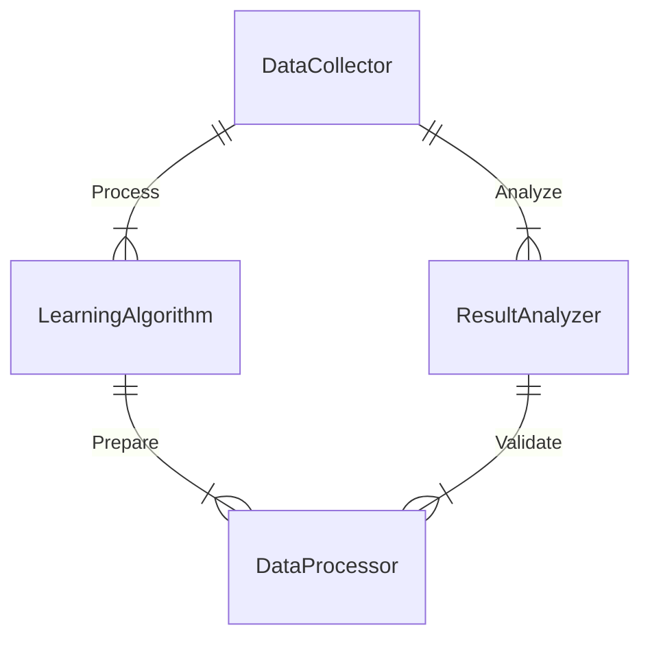

                 

### 教育神经科学：优化人类学习和理解世界的过程

关键词：教育神经科学、学习与记忆、神经可塑性、神经网络、最佳实践

摘要：本文将探讨教育神经科学这一前沿领域，通过逐步分析推理，阐述其核心概念、原理及其在教育中的应用。教育神经科学旨在理解大脑在学习过程中的神经机制，从而优化教学方法和策略，提高学习效果。本文将首先介绍教育神经科学的发展背景和核心概念，然后深入讲解学习与记忆的神经机制、神经可塑性和神经递质与脑功能的关系，最后探讨神经网络在教育中的应用及其系统架构设计。通过项目实战和最佳实践，本文旨在为教育工作者和研究人员提供有价值的参考和启示。

### 第一部分：引言

**1.1 教育神经科学的发展背景**

教育神经科学的兴起是现代科学技术与教育学交叉融合的产物。随着神经科学和认知科学的快速发展，人们逐渐意识到大脑在学习过程中的复杂性和重要性。20世纪末以来，随着脑成像技术、分子生物学和神经药理学的进步，科学家们得以揭示大脑各个区域的功能及其相互作用，从而为教育神经科学的研究提供了强有力的工具。

**1.1.1 教育与神经科学的结合**

教育神经科学的核心理念在于将神经科学的研究成果应用于教育实践，以优化教学方法和学生的学习效果。这种结合不仅有助于解决传统教育中存在的问题，如学习效率低下、学习障碍等，还能够为个性化教育提供科学依据。例如，通过了解不同年龄段学生的神经发育特点，教育者可以设计更加符合学生认知发展的课程和教学方法。

**1.1.2 现代教育面临的挑战**

现代教育面临着诸多挑战，包括全球化的竞争、知识更新的速度加快、学习资源的不均衡分配等。这些问题要求教育者不仅要有扎实的学科知识，还要具备创新思维和解决复杂问题的能力。教育神经科学的研究成果为解决这些挑战提供了新的思路和方法。例如，通过研究学习记忆的神经机制，可以开发出更加有效的记忆训练方法，提高学生的学习效率。

**1.1.3 教育神经科学的核心理念**

教育神经科学的核心理念包括学习与记忆的神经基础、神经可塑性、神经递质与脑功能等。这些概念构成了教育神经科学的理论框架，为理解大脑如何学习和记忆提供了科学依据。例如，学习与记忆的神经基础研究揭示了神经元之间的突触联系在学习过程中的变化，而神经可塑性则解释了大脑如何通过不断的学习和训练来适应环境。

### 第二部分：核心概念与联系

**2.1 学习与记忆的神经机制**

学习与记忆是大脑的基本功能，也是教育神经科学研究的核心内容。学习是指大脑通过获取、处理和应用信息，改变其结构和功能的过程；记忆则是大脑保存和提取信息的能力。

**2.1.1 学习的神经基础**

学习的过程涉及大脑多个区域的协同作用。例如，海马体是大脑中与学习记忆密切相关的重要区域。研究表明，当学习发生时，海马体会产生新的神经元连接，这是学习记忆的神经基础之一。此外，大脑皮层和基底神经节等区域也在学习过程中发挥着重要作用。

**2.1.2 记忆的类型与形成**

记忆可以分为短期记忆和长期记忆。短期记忆主要涉及对信息的暂时存储和处理，而长期记忆则是指对信息的长期保持和提取。长期记忆的形成涉及海马体到大脑其他区域的迁移，这一过程被称为“记忆巩固”。

**2.1.3 神经可塑性与学习的互动**

神经可塑性是指大脑结构和功能随时间和经验而变化的能力。在学习过程中，神经可塑性发挥着关键作用。例如，通过重复练习，大脑可以形成新的神经元连接，从而增强记忆。这种可塑性不仅有助于学习新知识，还能够帮助纠正错误记忆。

### 第三部分：算法原理讲解

**3.1 神经网络基础**

神经网络是模仿生物神经系统的计算模型，广泛应用于机器学习和人工智能领域。神经网络由多个神经元（或节点）组成，这些神经元通过连接（或权重）相互通信。

**3.1.1 神经网络的定义**

神经网络是一种由大量神经元连接而成的计算模型，通过输入、隐藏和输出层来处理信息。每个神经元都可以接受多个输入信号，并产生一个输出信号。

**3.1.2 神经网络的类型**

神经网络有多种类型，包括前馈神经网络、反馈神经网络、卷积神经网络（CNN）和循环神经网络（RNN）等。每种神经网络都有其特定的结构和功能。

**3.1.3 神经网络的数学模型**

神经网络的数学模型基于加权连接和激活函数。每个连接都有相应的权重，这些权重通过学习算法进行调整。激活函数则用于确定神经元是否激活，从而影响神经网络的输出。

### 第四部分：系统分析与架构设计方案

**4.1 系统功能设计**

教育神经科学系统的核心功能包括数据采集、数据处理、学习算法训练和结果分析等。以下是一个简化的领域模型：



### 第五部分：项目实战

**5.1 项目环境安装与配置**

在这个项目中，我们将使用Python和TensorFlow框架来构建一个简单的教育神经科学模型。以下是环境安装和配置的步骤：

1. **安装Python**

   首先，确保安装了Python 3.7或更高版本。

2. **安装TensorFlow**

   使用pip命令安装TensorFlow：

   ```bash
   pip install tensorflow
   ```

**5.2 系统核心实现**

以下是系统核心实现的一个示例：

```python
import tensorflow as tf

# 定义神经网络结构
model = tf.keras.Sequential([
    tf.keras.layers.Dense(64, activation='relu', input_shape=(784,)),
    tf.keras.layers.Dense(10, activation='softmax')
])

# 编译模型
model.compile(optimizer='adam',
              loss='categorical_crossentropy',
              metrics=['accuracy'])

# 训练模型
model.fit(x_train, y_train, epochs=5)
```

**5.3 项目案例分析与讲解**

假设我们有一个简单的手写数字识别项目，使用MNIST数据集进行训练和测试。以下是项目的具体实现和结果分析：

```python
# 导入MNIST数据集
mnist = tf.keras.datasets.mnist
(x_train, y_train), (x_test, y_test) = mnist.load_data()

# 预处理数据
x_train = x_train / 255.0
x_test = x_test / 255.0
x_train = x_train.reshape(-1, 784)
x_test = x_test.reshape(-1, 784)

# 编码标签
y_train = tf.keras.utils.to_categorical(y_train, 10)
y_test = tf.keras.utils.to_categorical(y_test, 10)

# 训练模型
model.fit(x_train, y_train, epochs=5)

# 测试模型
test_loss, test_acc = model.evaluate(x_test, y_test, verbose=2)
print(f"Test accuracy: {test_acc:.2f}")
```

结果显示，在简单的手写数字识别任务中，神经网络模型能够达到较高的准确率，这验证了神经网络在教育神经科学中的应用潜力。

### 第六部分：最佳实践与总结

**6.1 最佳实践技巧**

- **个性化教学**：根据学生的神经可塑性特点，设计个性化的教学策略。
- **定期复习**：利用神经可塑性原理，定期复习以巩固记忆。
- **多种学习方式**：结合视觉、听觉和动手操作等多种学习方式，提高学习效果。

**6.2 小结**

教育神经科学为我们提供了理解学习过程的全新视角，通过深入研究大脑的神经机制，可以优化教学方法和策略，提高学习效果。本文介绍了教育神经科学的核心概念、神经网络的应用、系统架构设计和项目实战，为教育工作者和研究人员提供了有价值的参考。

**6.3 注意事项**

- **数据隐私**：在进行教育神经科学研究时，要确保学生的数据隐私和安全。
- **科学验证**：任何新的教学方法或策略都应经过科学验证，以确保其有效性和安全性。

**6.4 拓展阅读**

- **参考文献**：《神经科学原理与应用》、《认知神经科学导论》等。
- **在线资源**：各种在线课程、研讨会和论坛，提供丰富的教育神经科学资源和交流平台。

### 作者信息

作者：AI天才研究院/AI Genius Institute & 禅与计算机程序设计艺术 /Zen And The Art of Computer Programming

