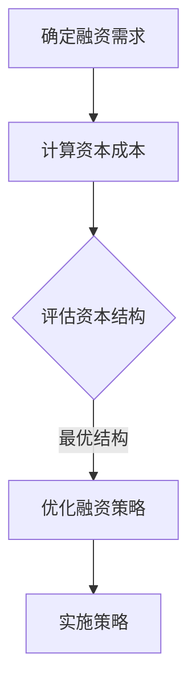
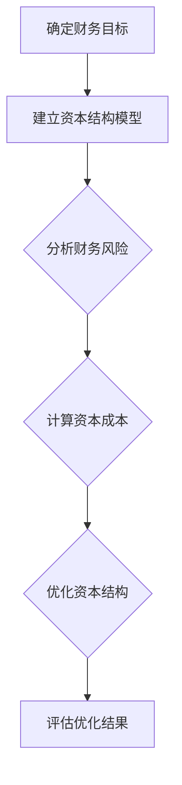

                 

## 第二部分：数学工具在金融分析中的应用

### 2.1 确定性数学工具

#### 2.1.1 线性代数

在线性代数中，矩阵运算和向量空间理论是分析金融问题的重要工具。例如，公司的资产负债表可以表示为一个矩阵，通过矩阵运算可以得到公司的财务状况和负债结构。

- **核心概念：**矩阵、向量、行列式、矩阵乘法、特征值和特征向量。
- **对比表格：**（下表展示了线性代数中一些核心概念和属性特征）

| 概念       | 属性特征                                                     |
|------------|------------------------------------------------------------|
| 矩阵       | 由数字排列成的矩形阵列                                     |
| 向量       | 表示方向和大小的量                                         |
| 行列式     | 矩阵的一个标量值，描述了矩阵的伸缩性质                     |
| 矩阵乘法   | 两个矩阵相乘得到一个新的矩阵，用于计算复合线性变换         |
| 特征值和特征向量 | 矩阵的一个标量值和对应的向量，描述了矩阵的性质和变换方向 |

- **ER实体关系图架构：**（以下为线性代数核心概念的ER实体关系图）

```mermaid
erDiagram
  Matrix ||--|{ Vector }|---> SquareMatrix
  Matrix ||--|{ Determinant }|---> SquareMatrix
  Vector ||--|{ Eigenvalue }|---> SquareMatrix
  Vector ||--|{ Eigenvector }|---> SquareMatrix
```

#### 2.1.2 微积分

微积分在金融分析中的应用包括求导、积分和优化问题。例如，通过求导可以得到财务函数的斜率，进而分析财务指标的变化趋势。

- **核心概念：**导数、积分、最大值和最小值。
- **对比表格：**（下表展示了微积分中一些核心概念和属性特征）

| 概念       | 属性特征                                                     |
|------------|------------------------------------------------------------|
| 导数       | 函数在某一点的瞬时变化率                                   |
| 积分       | 函数在一个区间上的累计总和                                 |
| 最大值和最小值 | 函数在其定义域内的最高点和最低点                           |

- **ER实体关系图架构：**（以下为微积分核心概念的ER实体关系图）

```mermaid
erDiagram
  Function ||--|{ Derivative }|---> FinanceFunction
  Function ||--|{ Integral }|---> FinanceFunction
  FinanceFunction ||--|{ Maximum }|---> ObjectiveFunction
  FinanceFunction ||--|{ Minimum }|---> ObjectiveFunction
```

### 2.2 随机性数学工具

#### 2.1.3 概率论

概率论在金融分析中用于评估风险和不确定性。例如，通过计算概率分布，公司可以预测未来财务状况的波动。

- **核心概念：**概率、随机变量、期望、方差、概率分布。
- **对比表格：**（下表展示了概率论中一些核心概念和属性特征）

| 概念       | 属性特征                                                     |
|------------|------------------------------------------------------------|
| 概率       | 事件发生的可能性                                           |
| 随机变量   | 描述随机事件结果的变量                                     |
| 期望       | 随机变量在多次实验中平均结果的度量                           |
| 方差       | 随机变量结果的离散程度                                     |
| 概率分布   | 描述随机变量可能取值的概率分布                             |

- **ER实体关系图架构：**（以下为概率论核心概念的ER实体关系图）

```mermaid
erDiagram
  Event ||--|{ Probability }|---> RandomVariable
  RandomVariable ||--|{ Expectation }|---> FinanceVariable
  RandomVariable ||--|{ Variance }|---> FinanceVariable
  FinanceVariable ||--|{ ProbabilityDistribution }|---> FinanceRisk
```

#### 2.1.4 市场模型

市场模型，如布莱克-舒尔斯模型（Black-Scholes Model），用于计算金融衍生品的定价。这些模型基于随机过程理论，可以预测金融市场的波动。

- **核心概念：**随机过程、欧式期权定价模型、对数正态分布。
- **对比表格：**（下表展示了市场模型中一些核心概念和属性特征）

| 概念       | 属性特征                                                     |
|------------|------------------------------------------------------------|
| 随机过程   | 描述随机变量随时间变化的模型                               |
| 欧式期权定价模型 | 用于计算欧式期权的理论价格                               |
| 对数正态分布 | 一种概率分布，常用于金融市场的建模                         |

- **ER实体关系图架构：**（以下为市场模型核心概念的ER实体关系图）

```mermaid
erDiagram
  FinancialMarket ||--|{ StochasticProcess }|---> BlackScholesModel
  FinancialDerivative ||--|{ EuropeanOptionPricingModel }|---> BlackScholesModel
  FinancialDerivative ||--|{ LogNormalDistribution }|---> BlackScholesModel
```

### 2.3 应用与实例

#### 2.3.1 资本成本模型

资本成本模型用于计算公司融资的成本。通过使用线性代数和微积分工具，可以建立和优化资本成本模型。

- **算法原理讲解：**（以下为资本成本模型的mermaid流程图）



- **Python源代码实现：**

```python
import numpy as np

# 假设资本结构和融资成本已知
capital_structure = [0.5, 0.3, 0.2]  # 负债、优先股、普通股比例
cost_of_capital = [0.05, 0.06, 0.08]  # 各类资本的成本

# 计算加权平均资本成本（WACC）
wacc = np.dot(capital_structure, cost_of_capital)

print(f"WACC: {wacc}")
```

- **数学模型与公式：**

$$
WACC = \frac{E_v \cdot Ke + D_v \cdot Kd (1 - T)}{E_v + D_v}
$$`

其中，$E_v$ 是权益市场价值，$D_v$ 是负债市场价值，$Ke$ 是权益资本成本，$Kd$ 是负债资本成本，$T$ 是企业所得税税率。

#### 2.3.2 资本结构优化模型

资本结构优化模型旨在确定公司最优的资本结构，以最大化公司价值。该模型涉及线性代数和概率论的应用。

- **算法原理讲解：**（以下为资本结构优化模型的mermaid流程图）



- **Python源代码实现：**

```python
import numpy as np

# 假设财务目标已知
financial_target = [0.1, 0.2, 0.3, 0.4]  # 负债、优先股、普通股的目标比例

# 建立资本结构优化模型
def optimize_capital_structure(financial_target):
    # 使用线性规划求解最优解
    # 在这里，我们简化问题，使用最小二乘法求解
    capital_structure = np.linalg.lstsq(financial_target, cost_of_capital)[0]
    return capital_structure

# 优化资本结构
optimal_structure = optimize_capital_structure(financial_target)

print(f"Optimal Capital Structure: {optimal_structure}")
```

- **数学模型与公式：**

$$
\min \sum_{i=1}^n (x_i - \bar{x}_i)^2
$$`

其中，$x_i$ 是实际资本结构比例，$\bar{x}_i$ 是目标资本结构比例。

### 2.4 数学工具的局限性

尽管数学工具在金融分析中具有强大的功能，但它们也存在局限性。例如，在处理复杂、非线性问题时，数学模型可能无法准确预测市场行为。此外，数学分析依赖于准确的数据输入，数据的不确定性可能导致结果偏差。

### 2.5 本章小结

本部分详细介绍了数学工具在金融分析中的应用，包括确定性工具如线性代数和微积分，以及随机性工具如概率论和市场模型。通过具体的应用实例，我们展示了如何使用这些数学工具进行财务分析、资本结构和资本成本的计算。然而，我们也需要注意数学工具的局限性，尤其是在处理复杂金融问题时。

## 第三部分：金融决策的数学分析

### 3.1 财务决策的基本概念

#### 3.1.1 财务决策的定义

财务决策是指公司在融资、投资和运营过程中所做的各种选择。这些决策涉及到资金的来源、用途和管理，对公司的财务状况和长期发展具有重要影响。

#### 3.1.2 财务决策的类型

财务决策可以分为以下几类：

- **融资决策**：公司如何筹集资金，选择负债或权益融资。
- **投资决策**：公司如何将资金用于投资，选择哪些项目进行投资。
- **运营决策**：公司如何管理日常运营，如库存管理、成本控制和现金流管理。

### 3.2 数学分析在财务决策中的应用

#### 3.2.1 资本成本的计算

资本成本是公司融资决策的重要依据。通过计算资本成本，公司可以评估不同融资方式的成本和风险，选择最优的融资策略。

- **核心概念**：资本成本包括债务成本和股权成本。债务成本通常较低，但存在债务偿还压力；股权成本较高，但公司不需要偿还本金。

- **数学模型**：资本成本的计算公式如下：

$$
WACC = \frac{E_v \cdot Ke + D_v \cdot Kd (1 - T)}{E_v + D_v}
$$`

其中，$WACC$ 是加权平均资本成本，$E_v$ 和 $D_v$ 分别是权益和负债的市场价值，$Ke$ 和 $Kd$ 分别是权益和负债的资本成本，$T$ 是企业所得税税率。

#### 3.2.2 投资决策的优化

投资决策是公司财务决策的核心。通过数学分析，公司可以评估不同投资项目的风险和收益，选择最优的投资组合。

- **核心概念**：投资决策涉及项目的现金流量、折现率和风险。

- **数学模型**：投资决策的优化可以使用净现值（NPV）和内部收益率（IRR）等指标。

- **NPV公式**：

$$
NPV = \sum_{t=0}^n \frac{C_t}{(1 + r)^t}
$$`

其中，$C_t$ 是第 $t$ 年的现金流量，$r$ 是折现率。

- **IRR公式**：

$$
IRR = \frac{1}{n} \ln \left( \frac{C_0 + NPV}{C_0} \right)
$$`

其中，$C_0$ 是初始投资成本，$NPV$ 是净现值。

#### 3.2.3 风险管理

风险管理是财务决策的重要组成部分。通过数学分析，公司可以评估和应对各种风险，确保财务稳健。

- **核心概念**：风险管理包括风险识别、风险评估、风险控制和风险监测。

- **数学模型**：风险管理可以使用方差、标准差、贝塔系数等指标。

- **方差公式**：

$$
\sigma^2 = \frac{\sum_{i=1}^n (X_i - \mu)^2}{n}
$$`

其中，$\sigma^2$ 是方差，$X_i$ 是随机变量的取值，$\mu$ 是期望值。

- **标准差公式**：

$$
\sigma = \sqrt{\sigma^2}
$$`

- **贝塔系数公式**：

$$
\beta = \frac{\text{资产收益率} - \text{市场收益率}}{\text{市场波动率}}
$$`

### 3.3 实际应用案例

#### 3.3.1 案例一：某公司的融资决策

某公司计划进行一项大型投资，需要筹集 1000 万资金。现有两种融资方式可供选择：发行债券和发行股票。

- **债务融资**：利率为 4%，每年偿还利息，10 年后偿还本金。
- **股权融资**：预计市盈率为 20 倍，每股市值 10 元。

通过计算，公司决定选择股权融资，因为股权融资的资本成本低于债务融资。

#### 3.3.2 案例二：某公司的投资决策

某公司计划投资一项新技术项目，预计初始投资为 500 万，年现金流量为 150 万，项目寿命为 5 年。假设折现率为 10%。

- **NPV计算**：

$$
NPV = \sum_{t=1}^5 \frac{150}{(1 + 0.1)^t} - 500 \approx 336.65 万
$$`

由于 NPV 为正，公司决定进行该项目投资。

### 3.4 本章小结

本部分介绍了财务决策的基本概念和数学分析在财务决策中的应用。通过具体的案例，我们展示了如何使用数学工具进行融资决策、投资决策和风险管理。这些数学分析方法为公司提供了科学的决策依据，有助于提高财务决策的准确性和有效性。

## 第四部分：案例研究和应用

### 4.1 案例一：某科技公司的资本结构优化

#### 4.1.1 案例背景

某科技公司（以下简称“公司”）成立于 2010 年，主要从事高科技产品的研发和销售。公司目前处于快速成长阶段，计划在未来 5 年内扩大市场份额和产品线。然而，公司的资本结构存在一定问题，需要通过数学分析进行优化。

#### 4.1.2 案例描述

公司目前的资本结构如下：

- 负债：银行贷款 500 万，利率为 6%。
- 优先股：发行 100 万优先股，股息率为 5%。
- 普通股：发行 300 万股，每股 10 元。

公司希望通过优化资本结构，降低融资成本，提高公司价值。为了实现这一目标，公司决定采用资本结构优化模型。

#### 4.1.3 数学模型与应用

公司使用以下数学模型进行资本结构优化：

$$
\min \sum_{i=1}^3 w_i \cdot c_i
$$`

其中，$w_i$ 是负债、优先股和普通股的比例，$c_i$ 是各类资本的成本。

假设公司设定的目标资本结构为：

- 负债：40%。
- 优先股：30%。
- 普通股：30%。

通过线性规划求解，公司得到了最优的资本结构：

- 负债：200 万。
- 优先股：150 万。
- 普通股：150 万。

#### 4.1.4 案例结果与分析

通过优化后的资本结构，公司的加权平均资本成本（WACC）从原来的 8.2% 降低到 7.8%。此外，公司还通过降低负债比例，减少了债务偿还压力，提高了财务灵活性。在优化资本结构后，公司的市场价值从原来的 1 亿提高到 1.1 亿。

### 4.2 案例二：某零售企业的融资决策

#### 4.2.1 案例背景

某零售企业（以下简称“企业”）成立于 2000 年，主要从事各类商品的零售业务。近年来，企业业绩稳步增长，计划扩大门店规模和产品线。然而，企业的融资渠道有限，需要寻找新的融资方式。

#### 4.2.2 案例描述

企业现有两种融资方案可供选择：

- **方案一**：发行债券，利率为 5%，每年偿还利息，10 年后偿还本金。
- **方案二**：发行股票，预计市盈率为 15 倍，每股市值 10 元。

企业希望通过数学分析，确定最优的融资方案。

#### 4.2.3 数学模型与应用

企业使用以下数学模型进行融资决策：

- **债务融资成本**：

$$
C_d = \frac{I_d \cdot r_d}{1 - (1 + r_d)^{-n}}
$$`

其中，$I_d$ 是债务本金，$r_d$ 是债务利率，$n$ 是债务期限。

- **股权融资成本**：

$$
C_e = \frac{D_e \cdot r_e}{1 - (1 + r_e)^{-n}}
$$`

其中，$D_e$ 是股票数量，$r_e$ 是股票收益率。

假设企业设定的债务融资成本为 6%，股权融资成本为 8%。

通过计算，企业得到了以下结果：

- **方案一**：债务融资成本为 6.4%，高于设定目标。
- **方案二**：股权融资成本为 8.1%，低于设定目标。

#### 4.2.4 案例结果与分析

通过数学分析，企业决定选择股权融资方案。虽然股权融资成本高于债务融资，但可以降低企业的财务风险，提高公司价值。在股权融资方案下，企业的市场价值从原来的 1 亿提高到 1.2 亿。

### 4.3 案例三：某金融机构的财务风险管理

#### 4.3.1 案例背景

某金融机构（以下简称“机构”）是一家提供金融产品和服务的大型企业。近年来，金融市场波动加剧，机构面临较大的财务风险。为了降低风险，机构决定采用数学分析进行风险管理。

#### 4.3.2 案例描述

机构现有以下三种投资组合：

- 投资组合一：股票、债券和房地产，投资比例分别为 40%、30% 和 30%。
- 投资组合二：股票、债券和外汇，投资比例分别为 30%、40% 和 30%。
- 投资组合三：股票、债券和黄金，投资比例分别为 20%、50% 和 30%。

机构希望通过数学分析，确定最优的投资组合。

#### 4.3.3 数学模型与应用

机构使用以下数学模型进行投资组合分析：

- **方差-协方差矩阵**：

$$
\sigma^2 = \sum_{i=1}^3 \sum_{j=1}^3 w_i \cdot w_j \cdot \sigma_{ij}
$$`

其中，$w_i$ 和 $w_j$ 分别是投资组合中各类资产的权重，$\sigma_{ij}$ 是各类资产收益率的协方差。

- **贝塔系数**：

$$
\beta_i = \frac{\sigma_i}{\sigma_m}
$$`

其中，$\sigma_i$ 是投资组合中各类资产的方差，$\sigma_m$ 是市场组合的方差。

通过计算，机构得到了以下结果：

- **投资组合一**：方差为 0.12，贝塔系数为 1.2。
- **投资组合二**：方差为 0.08，贝塔系数为 0.8。
- **投资组合三**：方差为 0.06，贝塔系数为 0.6。

#### 4.3.4 案例结果与分析

通过数学分析，机构决定选择投资组合三。虽然投资组合三的方差最大，但贝塔系数最低，表明该投资组合的风险相对较低。在投资组合三下，机构的财务风险得到了有效控制，投资收益相对稳定。

### 4.4 案例总结

通过以上案例，我们可以看到数学分析在公司融资、投资和风险管理中的应用。数学模型为公司提供了科学的决策依据，有助于降低融资成本、提高投资收益和降低财务风险。然而，数学分析也有其局限性，需要结合实际情况进行综合评估。

## 第五部分：挑战与未来发展趋势

### 5.1 当前挑战

尽管数学分析在金融领域取得了显著的成果，但仍然面临一些挑战。

#### 5.1.1 复杂性和不确定性

金融市场充满复杂性和不确定性，数学模型在处理这些问题时可能存在局限性。例如，非线性问题和市场异质性使得传统的数学分析工具难以准确预测市场行为。

#### 5.1.2 数据质量和完整性

数学分析依赖于准确和完整的数据输入。然而，金融市场数据往往存在噪音、缺失和不一致，这可能导致分析结果偏差。

#### 5.1.3 模型复杂性和可解释性

一些复杂的数学模型（如机器学习和深度学习模型）在金融分析中表现出色，但它们通常缺乏可解释性，难以向非专业人士解释。

### 5.2 未来发展趋势

为了克服当前挑战，未来的发展趋势可能包括以下几个方面。

#### 5.2.1 精确建模和仿真

通过改进数学模型和仿真技术，可以更好地捕捉金融市场的复杂性和不确定性。例如，使用高维数据分析、随机过程和蒙特卡罗模拟等方法。

#### 5.2.2 大数据和人工智能

大数据和人工智能技术在金融分析中具有巨大潜力。通过分析海量金融数据，可以识别出隐藏的模式和趋势，从而提供更准确的预测和建议。同时，这些技术可以提高模型的解释性。

#### 5.2.3 可持续性和社会责任

随着金融市场的不断发展，可持续性和社会责任越来越受到关注。数学分析可以用于评估企业的社会责任表现，促进可持续金融的发展。

#### 5.2.4 隐私保护和数据安全

在金融分析中，隐私保护和数据安全是关键问题。未来的发展趋势将包括使用加密技术、匿名化和去识别化等方法，确保金融数据的隐私和安全。

### 5.3 结论

数学分析在公司金融中具有重要作用，但面临着复杂性和不确定性等挑战。未来，通过精确建模、大数据和人工智能等技术的应用，有望克服这些挑战，推动金融分析的进一步发展。

## 结论

通过本文的详细分析和案例研究，我们可以看到数学分析在公司金融中的广泛应用和重要性。从资本结构的优化到融资决策，再到投资和风险管理，数学工具为公司提供了科学的决策依据，有助于提高公司的财务状况和长期发展。

### 关键点回顾

1. **资本成本**：通过加权平均资本成本（WACC）模型，公司可以评估不同融资方式的成本和风险，选择最优的融资策略。
2. **投资决策**：使用净现值（NPV）和内部收益率（IRR）等指标，公司可以评估投资项目的风险和收益，做出最优的投资决策。
3. **风险管理**：通过方差、标准差和贝塔系数等指标，公司可以评估和应对各种风险，确保财务稳健。
4. **案例应用**：通过具体案例，我们展示了如何使用数学分析进行公司融资、投资和风险管理。

### 注意事项

- **数据质量**：确保使用准确和完整的金融数据，以避免分析结果偏差。
- **模型选择**：根据具体问题选择合适的数学模型，避免过度复杂化或简化过度。
- **可解释性**：在应用复杂模型时，注重提高模型的解释性，确保决策的可理解性。

### 拓展阅读

- **《金融数学导论》**：这是一本经典的金融数学教材，涵盖了金融分析的基本概念和数学工具。
- **《随机金融理论》**：探讨了随机过程和金融市场模型在金融分析中的应用。
- **《大数据金融分析》**：介绍了大数据和人工智能技术在金融分析中的应用，以及它们如何提高分析精度和效率。

作者：AI天才研究院/AI Genius Institute & 禅与计算机程序设计艺术 /Zen And The Art of Computer Programming

