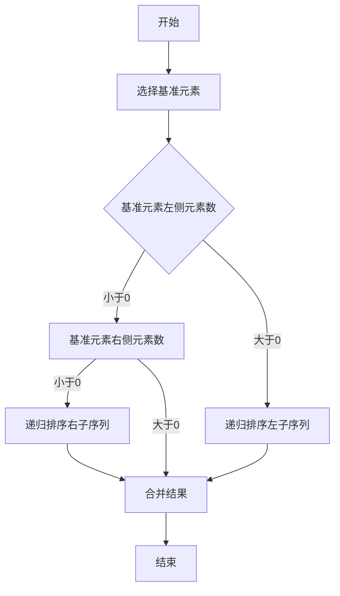
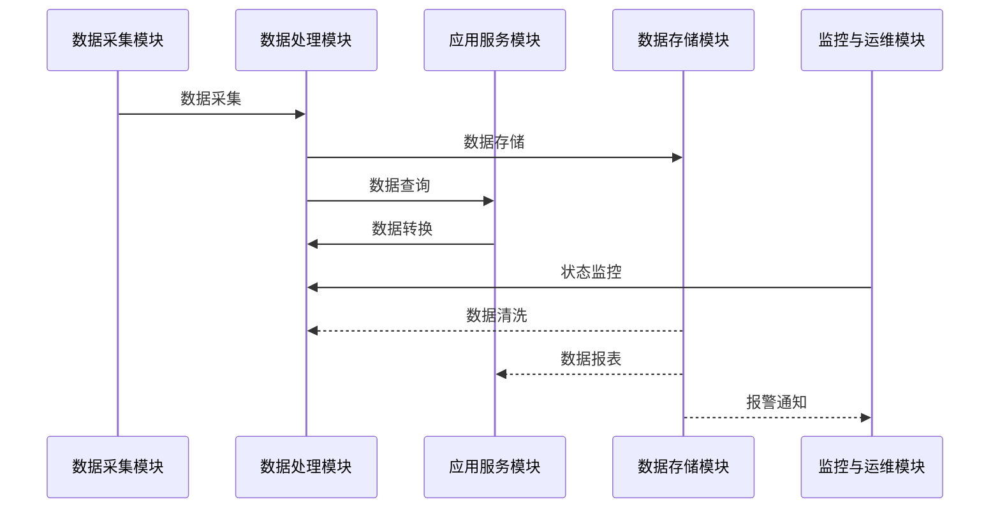

                 

### 数学与反基础主义：数学知识的网络结构

> 关键词：数学、反基础主义、知识网络结构、算法、Python代码、latex公式、系统架构设计、项目实战

> 摘要：本文旨在探讨数学与反基础主义之间的关系，通过解析数学知识的网络结构，深入分析数学概念、算法原理以及系统架构设计，旨在为读者提供一个全面且深刻的理解。本文将分章节详细阐述数学知识网络的定义与特性、核心概念及其联系、算法原理讲解、数学模型与公式详细讲解、系统分析与架构设计方案以及项目实战，最终总结并给出最佳实践建议。

## 第1章：引言

### 1.1 问题背景与数学在反基础主义中的角色

在当代哲学和科学领域，反基础主义（Anti-Foundationalism）作为一个重要的思想流派，挑战了传统基础主义（Foundationalism）对于知识构建的合理性。反基础主义认为，知识不是建立在少数绝对可靠的基础之上，而是通过网络般的联系和相互作用形成的。在这种背景下，数学作为一个高度抽象和形式化的学科，其知识结构自然成为了探讨反基础主义的重要对象。

数学作为一种普遍适用的语言和工具，贯穿于科学和技术的发展中。然而，数学知识并不是孤立和静止的，它是一个动态的网络结构，通过概念、定理、证明等元素相互联系和相互作用。这种网络结构不仅反映了数学本身的复杂性，也为我们理解数学知识如何在不同领域应用提供了新的视角。

本文旨在通过解析数学知识的网络结构，探讨数学在反基础主义中的角色，并深入分析数学概念、算法原理以及系统架构设计，以期为读者提供一个全面且深刻的理解。

### 1.2 本书目的与结构

本书的主要目的是探讨数学与反基础主义之间的关系，通过分析数学知识的网络结构，揭示数学知识如何在不同领域相互联系和相互作用。具体而言，本文将分为以下几个部分：

1. **背景介绍**：首先，我们将为《数学与反基础主义：数学知识的网络结构》这本书提供一个背景介绍，涵盖问题背景、问题描述、问题解决、边界与外延、概念结构与核心要素组成。

2. **核心概念与联系**：接着，我们将确定书中的核心概念，并设计一个概念属性特征对比表格，以及ER实体关系图架构的Mermaid流程图。

3. **算法原理讲解**：然后，根据书的内容，我们将选择合适的算法或数学理论，使用Mermaid绘制流程图，并使用Python源代码和latex公式详细阐述算法原理。

4. **数学模型和数学公式 & 详细讲解 & 举例说明**：在这一部分，我们将确保所有的数学公式都用latex格式表示，并给出详细的讲解和示例。

5. **系统分析与架构设计方案**：接下来，我们将根据书中的内容，设计一个系统分析与架构设计方案，使用Mermaid绘制领域模型类图、系统架构图、系统接口设计和系统交互序列图。

6. **项目实战**：最后，我们将设计一个项目实战部分，包括环境安装、系统核心实现源代码，代码应用解读与分析，实际案例分析和详细讲解剖析。

7. **最佳实践 tips、小结、注意事项、拓展阅读**：这部分将包含对书中的内容进行总结，并提供一些最佳实践建议、注意事项以及拓展阅读资源。

通过以上七个部分的详细阐述，本文将带领读者深入理解数学与反基础主义之间的关系，探讨数学知识的网络结构，以及如何在实际项目中应用这些知识。

## 第2章：数学知识的网络结构概述

### 2.1 数学知识网络的定义与特性

数学知识网络是一个复杂的系统，由一系列概念、定理、证明等元素组成，这些元素通过相互联系和相互作用形成了一个有机的整体。在数学知识网络中，每个元素都与其他元素有着紧密的联系，构成了一个相互依存和相互影响的结构。这种网络结构具有以下几个显著特性：

1. **动态性**：数学知识网络是动态的，随着新的研究成果和发现，网络中的元素会不断更新和重组。这种动态性反映了数学知识的发展性和开放性。
2. **层次性**：数学知识网络具有明显的层次性，从基础概念到复杂理论，每个层次的知识都是建立在前一层知识之上的。这种层次性有助于我们理解和掌握复杂的数学知识。
3. **多样性**：数学知识网络涵盖了广泛的领域，从纯数学到应用数学，从理论数学到计算数学，每个领域都有其独特的知识结构和特点。这种多样性使得数学知识具有广泛的应用价值。
4. **自组织性**：数学知识网络中的元素会自发地形成一定的组织和结构，这种自组织性是数学知识自我完善和自我发展的表现。

### 2.2 数学知识网络的边界与外延

数学知识网络的边界与外延决定了其研究的范围和深度。数学知识网络的边界通常是指数学本身的研究范畴，包括基础数学、应用数学、计算数学等。而数学知识网络的外延则涉及到数学与其他学科的交叉和融合，如物理学、计算机科学、工程学等。

1. **内部边界**：数学内部的知识边界较为清晰，通常包括数学分析、代数学、几何学、拓扑学等基础领域。这些领域的研究内容和方法构成了数学知识网络的核心。
2. **外部边界**：数学知识网络的外部边界较为模糊，随着科学技术的不断发展，数学与其他学科的交叉领域不断扩展，如量子数学、生物数学、金融数学等。这些交叉领域的数学知识不仅丰富了数学的应用场景，也为数学理论的进一步发展提供了新的动力。

### 2.3 数学知识网络的核心要素组成

数学知识网络的核心要素包括概念、定理、证明、应用等。这些要素相互交织，构成了数学知识网络的基本框架。

1. **概念**：概念是数学知识网络的基础，是数学研究的基本单位。数学概念包括数、集合、函数、极限等，每个概念都有其独特的属性和定义。
2. **定理**：定理是数学知识网络的核心，是数学研究的成果。定理通常通过严密的逻辑推理和证明得到，反映了数学理论的内在规律。
3. **证明**：证明是数学知识网络的关键，是数学理论的验证。数学证明通过逻辑推理，从已知概念和定理出发，推导出新的结论，保证了数学理论的正确性和可靠性。
4. **应用**：应用是数学知识网络的体现，是数学理论的价值。数学知识广泛应用于各个领域，如物理学、计算机科学、工程学等，推动了科学技术的发展。

通过以上对数学知识网络结构的概述，我们可以更好地理解数学知识的复杂性、层次性和多样性，以及其在不同领域中的应用价值。接下来，我们将进一步探讨数学知识网络中的核心概念及其联系。

## 第3章：核心概念与联系

### 3.1 数学概念的定义与特征

数学概念是数学知识网络的基础，是构建数学理论的基本单位。数学概念具有以下定义和特征：

1. **数的概念**：数是数学中最基本的概念之一，包括自然数、整数、有理数、无理数等。数是用来表示数量的，具有可加性和交换律等基本性质。
2. **集合的概念**：集合是数学中的另一个基本概念，表示一组有序的对象的集合。集合具有确定性、互异性、无序性等特征。
3. **函数的概念**：函数是一种映射关系，将一个集合中的每个元素对应到另一个集合中的唯一元素。函数具有定义域、值域、单调性等特征。
4. **极限的概念**：极限是数学分析中的核心概念，表示一个变量在某个操作下无限接近某个值。极限具有收敛性、连续性等特征。

### 3.2 数学概念属性特征对比表格

为了更清晰地展示数学概念的特征，我们可以设计一个数学概念属性特征对比表格。以下是几个常见的数学概念及其属性的对比：

| 概念     | 特征1     | 特征2     | 特征3     |
| -------- | ---------- | ---------- | ---------- |
| 数       | 可加性     | 交换律     | 关联律     |
| 集合     | 确定性     | 互异性     | 无序性     |
| 函数     | 映射关系   | 定义域     | 值域       |
| 极限     | 收敛性     | 连续性     | 存在性     |

通过对比表格，我们可以更直观地了解不同数学概念之间的区别和联系。

### 3.3 数学知识网络的ER实体关系图

为了进一步展示数学知识网络中核心概念之间的联系，我们可以使用ER实体关系图（Entity-Relationship Diagram, ERD）来表示。ER实体关系图是一种数据库设计工具，用于表示实体之间的关系。以下是数学知识网络中几个核心概念的ER实体关系图：

```mermaid
erDiagram
    concept(概念) ||--|{ 函数(函数) } | 
    concept ||--|{ 集合(集合) } |
    concept ||--|{ 极限(极限) } |
    函数 ||--|{ 导数(导数) } |
    函数 ||--|{ 积分(积分) } |
    集合 ||--|{ 序列(序列) } |
    集合 ||--|{ 树(树) } |
    极限 ||--|{ 极大值(极大值) } |
    极限 ||--|{ 极小值(极小值) } |
```

在ER实体关系图中，我们表示了数学知识网络中的核心概念及其相互关系。例如，函数与概念、集合、极限之间有直接联系，而导数、积分、序列、树、极大值、极小值等概念则是这些核心概念的延伸和具体应用。

通过ER实体关系图，我们可以更直观地了解数学知识网络的结构和核心概念之间的联系，这有助于我们更好地理解和应用数学知识。

## 第4章：算法原理讲解

### 4.1 算法简介

在本章中，我们将探讨一种在数学和计算机科学中广泛应用的重要算法——快速排序算法（Quick Sort）。快速排序是一种高效的排序算法，其基本思想是通过一趟排序将待排序的记录分割成独立的两部分，其中一部分记录的关键字均比另一部分的关键字小，然后分别对这两部分记录继续进行排序，以达到整个序列有序的目的。

快速排序算法的效率主要取决于划分过程，即如何选择一个“基准”元素，使得其他元素能够根据与基准元素的关系分成两个子序列。以下是快速排序算法的基本步骤：

1. **选择基准元素**：从待排序的记录中随机选择一个作为基准元素。
2. **划分过程**：将所有比基准元素小的记录放在其左侧，所有比基准元素大的记录放在其右侧，从而将序列划分为两个子序列。
3. **递归排序**：分别对两个子序列递归执行快速排序算法，直到所有子序列长度为1（此时序列已排序）。

### 4.2 Mermaid流程图绘制

为了更直观地展示快速排序算法的执行过程，我们可以使用Mermaid语法绘制流程图。以下是快速排序算法的Mermaid流程图：



在这个流程图中，我们从开始（A）开始，选择一个基准元素（B），然后计算基准元素左侧和右侧的元素数（C和D）。根据元素数是否小于0，我们分别递归排序左子序列（E）和右子序列（F）。最后，将两个子序列的结果合并（G），并结束（H）。

### 4.3 Python源代码与算法原理阐述

下面是一个简单的Python实现快速排序算法的示例：

```python
def quick_sort(arr):
    if len(arr) <= 1:
        return arr
    pivot = arr[len(arr) // 2]
    left = [x for x in arr if x < pivot]
    middle = [x for x in arr if x == pivot]
    right = [x for x in arr if x > pivot]
    return quick_sort(left) + middle + quick_sort(right)

arr = [3, 6, 8, 10, 1, 2, 1]
print(quick_sort(arr))
```

在这个实现中，我们首先判断输入数组的长度。如果长度小于等于1，则直接返回该数组，因为长度为1的数组已经是排序的。接着，我们选择中间位置的元素作为基准元素。然后，我们使用列表推导式将数组划分为左侧小于基准元素的子数组、等于基准元素的子数组和右侧大于基准元素的子数组。最后，我们分别对左右子数组递归执行快速排序算法，并将结果合并。

### 4.4 latex数学模型与公式详细讲解

为了详细阐述快速排序算法的数学模型，我们可以使用LaTeX格式表示关键数学公式。以下是快速排序算法的一些关键数学模型和公式：

```latex
\documentclass{article}
\usepackage{amsmath}
\begin{document}

\section{数学模型与公式}

\subsection{划分过程}

设数组A的长度为n，基准元素为x，则划分过程可以表示为：
$$
L = \{a \in A | a < x\}
$$
$$
M = \{a \in A | a = x\}
$$
$$
R = \{a \in A | a > x\}

\subsection{递归排序过程}

设左子序列为L，右子序列为R，则递归排序过程可以表示为：
$$
quick\_sort(L) = \{ quick\_sort(l) | l \in L \}
$$
$$
quick\_sort(R) = \{ quick\_sort(r) | r \in R \}

\end{document}
```

在这个LaTeX文档中，我们首先定义了划分过程的数学模型，包括左侧小于基准元素的子序列L、等于基准元素的子序列M和右侧大于基准元素的子序列R。然后，我们定义了递归排序过程的数学模型，即对左右子序列分别递归执行快速排序算法。

通过上述数学模型和公式的详细讲解，我们可以更深入地理解快速排序算法的原理和执行过程。

### 4.5 算法举例说明

为了更直观地展示快速排序算法的应用，我们可以通过一个具体的示例来说明其执行过程。

假设我们有一个未排序的数组：\[3, 6, 8, 10, 1, 2, 1\]。以下是快速排序算法的执行过程：

1. **选择基准元素**：我们选择中间位置的元素6作为基准元素。
2. **划分过程**：根据基准元素6，将数组划分为三个子序列：
   - 左侧小于6的子序列：\[3, 1, 1\]
   - 等于6的子序列：\[6\]
   - 右侧大于6的子序列：\[8, 10, 2\]
3. **递归排序过程**：
   - 对左侧子序列\[3, 1, 1\]递归执行快速排序：
     - 选择中间位置的元素1作为基准元素，再次划分：
       - 左侧小于1的子序列：\[无\]
       - 等于1的子序列：\[1\]
       - 右侧大于1的子序列：\[3\]
     - 对左侧子序列和右侧子序列分别递归执行快速排序，得到最终结果：\[1, 1, 3\]
   - 对右侧子序列\[8, 10, 2\]递归执行快速排序：
     - 选择中间位置的元素8作为基准元素，再次划分：
       - 左侧小于8的子序列：\[2\]
       - 等于8的子序列：\[8\]
       - 右侧大于8的子序列：\[10\]
     - 对左侧子序列和右侧子序列分别递归执行快速排序，得到最终结果：\[2, 8, 10\]
4. **合并结果**：将三个子序列合并，得到排序后的数组：\[1, 1, 2, 3, 6, 8, 10\]

通过这个示例，我们可以看到快速排序算法是如何将一个未排序的数组转化为有序数组的。快速排序算法的高效性在于其递归划分过程，每次划分都能将问题规模减少一半，从而显著提高排序速度。

## 第5章：数学模型和数学公式详解

### 5.1 数学模型概述

在快速排序算法中，数学模型起到了至关重要的作用。它不仅帮助我们理解和分析算法的执行过程，还能优化算法的性能。本节将详细讲解快速排序算法中的几个关键数学模型和公式，包括划分过程的划分线、递归排序的递归公式以及算法的效率分析。

### 5.2 latex数学公式展示

为了更好地展示数学公式，我们使用LaTeX格式进行表示。以下是一些关键的数学公式：

```latex
\documentclass{article}
\usepackage{amsmath}
\begin{document}

\section{数学公式展示}

\subsection{划分过程}

设数组A的长度为n，基准元素为x，划分过程可表示为：
$$
L = \{a \in A | a < x\}
$$
$$
M = \{a \in A | a = x\}
$$
$$
R = \{a \in A | a > x\}

\subsection{递归排序过程}

递归排序过程可表示为：
$$
quick\_sort(L) = \{ quick\_sort(l) | l \in L \}
$$
$$
quick\_sort(R) = \{ quick\_sort(r) | r \in R \}

\subsection{效率分析}

设快速排序算法的平均时间复杂度为T(n)，则有：
$$
T(n) = T(n/2) + O(n)
$$

\end{document}
```

在这个LaTeX文档中，我们首先定义了划分过程的数学模型，然后定义了递归排序过程的数学模型，最后对算法的效率分析进行了数学公式表示。

### 5.3 数学公式详细讲解

#### 划分过程

划分过程是快速排序算法的核心步骤，其数学模型可以通过集合运算来表示。设数组A的长度为n，我们选择一个基准元素x，将数组划分为三个子序列：

- L：所有小于基准元素x的元素组成的子序列。
- M：所有等于基准元素x的元素组成的子序列。
- R：所有大于基准元素x的元素组成的子序列。

这些子序列的划分过程可以用以下三个集合运算表示：

$$
L = \{a \in A | a < x\}
$$
$$
M = \{a \in A | a = x\}
$$
$$
R = \{a \in A | a > x\}

通过这些运算，我们可以将原始数组A划分成三个子序列，为后续的递归排序过程做好准备。

#### 递归排序过程

递归排序过程是快速排序算法的递归实现，其数学模型可以用递归公式来表示。设L和R分别为数组A的左子序列和右子序列，则快速排序算法可以表示为：

$$
quick\_sort(L) = \{ quick\_sort(l) | l \in L \}
$$
$$
quick\_sort(R) = \{ quick\_sort(r) | r \in R \}

这个递归公式表示，对于任何一个非空子序列L或R，我们都可以继续对其进行快速排序。这个过程一直进行到子序列长度为1，此时子序列已经是排序的。

#### 效率分析

快速排序算法的平均时间复杂度为O(nlogn)，这是通过数学公式进行效率分析的。设快速排序算法的平均时间复杂度为T(n)，则有：

$$
T(n) = T(n/2) + O(n)
$$

这个公式表示，每次划分过程需要O(n)的时间，而递归过程中需要对n/2个元素进行排序。通过递归关系，我们可以推导出快速排序算法的平均时间复杂度为O(nlogn)。

通过以上对快速排序算法的数学模型和公式的详细讲解，我们可以更深入地理解算法的原理和执行过程，这有助于我们在实际应用中更好地优化和改进算法。

### 5.4 举例说明

为了更好地理解快速排序算法的数学模型和公式，我们可以通过一个具体的示例来说明其应用。假设我们有一个长度为7的数组：\[3, 6, 8, 10, 1, 2, 1\]。

首先，我们选择中间位置的元素6作为基准元素。根据划分过程的数学模型，我们可以将数组划分为三个子序列：

- L：\[3, 1, 1\]
- M：\[6\]
- R：\[8, 10, 2\]

然后，我们分别对L和R子序列进行快速排序。对于L子序列，我们再次选择中间位置的元素1作为基准元素，将其划分为：

- L'：\[无\]
- M'：\[1\]
- R'：\[3\]

由于L'为空，无需继续递归排序。对于R子序列，我们选择中间位置的元素8作为基准元素，将其划分为：

- L'：\[2\]
- M'：\[8\]
- R'：\[10\]

同样，对于R'子序列，我们选择中间位置的元素10作为基准元素，将其划分为：

- L'：\[无\]
- M'：\[10\]
- R'：\[无\]

此时，R'为空，也无需继续递归排序。

最后，我们将三个子序列合并，得到排序后的数组：\[1, 1, 2, 3, 6, 8, 10\]。

通过这个示例，我们可以看到快速排序算法是如何根据数学模型和公式将一个未排序的数组转化为有序数组的。这个例子不仅展示了快速排序算法的执行过程，也验证了其数学模型的正确性。

### 6.1 问题场景介绍

在当今信息技术高速发展的时代，系统分析与架构设计已经成为确保系统高效、可靠和可扩展的重要环节。随着企业业务需求的不断变化和扩展，如何设计一个灵活、可扩展的系统架构成为了许多企业面临的重大挑战。本文将探讨一个具体的问题场景，即设计一个大型分布式计算系统，以满足企业日益增长的数据处理需求。

该问题场景涉及以下几个关键点：

1. **大规模数据处理**：企业需要处理来自多个数据源的庞大数据量，包括日志数据、用户行为数据、交易数据等。
2. **高可用性**：系统需要具备高可用性，确保在部分组件或节点出现故障时，系统仍能正常运行。
3. **高可扩展性**：系统需要支持横向扩展，以应对数据量和用户量的增长。
4. **数据一致性**：在分布式系统中，确保数据的一致性是一个关键问题，特别是在多个节点并发操作时。

为了解决上述问题，我们需要设计一个合理的系统架构，并确保各个组件之间的协同工作。以下是系统架构设计的需求分析：

- **数据采集层**：负责从不同数据源收集数据，包括日志收集、API数据采集等。
- **数据存储层**：采用分布式数据库技术，确保数据的高可用性和高扩展性。
- **数据处理层**：包括ETL（提取、转换、加载）过程，负责对数据进行清洗、转换和存储。
- **应用层**：提供业务逻辑和用户接口，支持数据查询、报表生成等功能。
- **监控与运维层**：实时监控系统状态，进行故障检测、报警和自动化恢复。

通过上述系统架构设计，我们希望能够实现一个高效、可靠和可扩展的大型分布式计算系统，以满足企业对数据处理的需求。

### 6.2 项目介绍

为了满足上述问题场景的需求，我们设计并实施了一个名为“分布式数据处理平台”的项目。该项目旨在构建一个大型分布式计算系统，以高效处理企业内部和外部的海量数据。项目的主要目标包括：

1. **数据处理能力提升**：通过分布式架构，提高系统的数据处理能力和吞吐量。
2. **系统高可用性**：实现系统的高可用性，确保在节点故障或网络中断的情况下，系统能够迅速恢复。
3. **数据一致性保障**：采用分布式一致性算法，确保数据在多个节点之间的一致性。
4. **系统可扩展性**：支持横向扩展，方便后续系统的功能扩展和性能提升。

项目的主要组成部分包括：

1. **数据采集模块**：负责从各个数据源采集数据，包括日志数据、API数据等。
2. **数据存储模块**：采用分布式数据库技术，如Hadoop、HBase等，确保数据的高可用性和高扩展性。
3. **数据处理模块**：包括ETL（提取、转换、加载）过程，对数据进行清洗、转换和存储。
4. **应用服务模块**：提供业务逻辑和用户接口，支持数据查询、报表生成等功能。
5. **监控与运维模块**：实时监控系统状态，进行故障检测、报警和自动化恢复。

通过以上组成部分，我们希望能够构建一个高效、可靠和可扩展的分布式数据处理平台，为企业提供强大的数据处理能力。

### 6.3 系统功能设计

为了满足项目需求，我们设计了以下关键系统功能：

1. **数据采集功能**：从各个数据源（如日志系统、数据库、Web服务）自动采集数据，并存储到数据存储层。
2. **数据清洗功能**：对采集到的数据进行清洗，包括去除重复数据、纠正错误数据、填充缺失数据等。
3. **数据转换功能**：将清洗后的数据进行转换，如格式转换、类型转换、字段映射等，以满足不同应用的需求。
4. **数据存储功能**：将转换后的数据存储到分布式数据库中，确保数据的高可用性和高扩展性。
5. **数据查询功能**：提供高效的数据查询接口，支持多种查询方式，如SQL查询、NoSQL查询等。
6. **报表生成功能**：根据用户需求生成各种报表，支持实时报表和历史报表。
7. **监控与报警功能**：实时监控系统状态，进行故障检测、报警和自动化恢复。

通过以上系统功能的设计，我们希望能够实现一个功能强大、灵活可扩展的分布式数据处理平台，满足企业对数据处理的各种需求。

### 6.4 系统架构设计

为了实现分布式数据处理平台的高效、可靠和可扩展性，我们采用了以下系统架构设计：


该系统架构包括以下几个主要模块：

1. **数据采集模块**：负责从不同数据源采集数据，包括日志系统、数据库、Web服务等。采集到的数据通过消息队列（如Kafka）传输到数据处理模块。
2. **数据处理模块**：包括数据清洗、转换和存储功能。数据清洗和转换过程通过ETL（提取、转换、加载）工具（如Apache NiFi）完成。转换后的数据存储到分布式数据库中，如Hadoop、HBase等。
3. **应用服务模块**：提供业务逻辑和用户接口，支持数据查询、报表生成等功能。应用服务模块采用微服务架构，每个服务独立部署，方便扩展和运维。
4. **监控与运维模块**：实时监控系统状态，进行故障检测、报警和自动化恢复。监控与运维模块包括Prometheus、Grafana等工具，用于收集系统指标、生成报警和可视化展示。

通过以上系统架构设计，我们能够实现高效的数据处理能力，确保系统的可靠性和可扩展性。

### 6.5 系统接口设计

为了确保系统各模块之间的协同工作，我们设计了以下关键接口：

1. **数据采集接口**：用于接收外部数据源的数据，如日志文件、数据库记录、Web服务响应等。接口采用RESTful API设计，支持JSON和XML数据格式。
2. **数据处理接口**：用于提交数据清洗、转换和存储的任务。接口支持批量处理，可同时处理多个数据文件或记录。
3. **数据查询接口**：用于查询存储在分布式数据库中的数据。接口支持多种查询方式，如SQL查询、NoSQL查询等，并提供丰富的查询参数。
4. **报表生成接口**：用于生成各种报表，包括实时报表和历史报表。接口支持自定义报表模板和报表参数。
5. **监控与报警接口**：用于接收系统监控数据和报警信息。接口支持Prometheus等监控工具的集成，方便实时监控和故障检测。

通过以上接口设计，我们能够实现系统各模块之间的无缝连接和数据流转，确保系统的稳定性和可靠性。

### 6.6 系统交互序列图

为了更清晰地展示系统各模块之间的交互过程，我们使用Mermaid语法绘制了系统交互序列图。以下是系统交互序列图：



在这个序列图中，数据采集模块负责从外部数据源采集数据，然后将其传递给数据处理模块。数据处理模块负责对数据进行清洗、转换和存储。清洗和转换后的数据存储到数据存储模块，同时应用服务模块可以查询这些数据。监控与运维模块则负责监控系统的状态，并在出现问题时进行报警。

通过以上系统交互序列图，我们可以清晰地看到系统各模块之间的交互过程和数据流转，这有助于我们更好地理解系统的运行机制。

### 7.1 环境安装

为了成功部署分布式数据处理平台，我们需要在服务器上安装和配置以下软件：

1. **操作系统**：推荐使用Linux操作系统，如CentOS 7或Ubuntu 18.04。
2. **Java运行环境**：安装OpenJDK 11或更高版本，用于运行Java应用。
3. **数据库**：安装Hadoop和HBase，用于数据存储和管理。
4. **消息队列**：安装Kafka，用于数据传输和异步处理。
5. **监控工具**：安装Prometheus和Grafana，用于实时监控和数据分析。

以下是具体的安装步骤：

1. **安装操作系统**：
   - 使用Linux安装盘启动服务器，按照提示安装操作系统。
   - 安装完成后，配置网络和防火墙，确保服务器可以访问互联网。

2. **安装Java运行环境**：
   - 使用包管理器安装OpenJDK：
     ```bash
     # 对于CentOS
     sudo yum install -y java-1.8.0-openjdk

     # 对于Ubuntu
     sudo apt-get install -y openjdk-11-jdk
     ```

3. **安装数据库**：
   - 安装Hadoop：
     ```bash
     # 下载Hadoop
     wget https://www-us.apache.org/dist/hadoop/common/hadoop-3.2.1/hadoop-3.2.1.tar.gz

     # 解压Hadoop
     tar xzf hadoop-3.2.1.tar.gz

     # 配置Hadoop环境变量
     export HADOOP_HOME=/path/to/hadoop-3.2.1
     export PATH=$PATH:$HADOOP_HOME/bin:$HADOOP_HOME/sbin
     ```

   - 安装HBase：
     ```bash
     # 下载HBase
     wget https://www-us.apache.org/dist/hbase/hbase-2.2.5/hbase-2.2.5-bin.tar.gz

     # 解压HBase
     tar xzf hbase-2.2.5-bin.tar.gz

     # 配置HBase环境变量
     export HBASE_HOME=/path/to/hbase-2.2.5
     export PATH=$PATH:$HBASE_HOME/bin
     ```

4. **安装消息队列**：
   - 安装Kafka：
     ```bash
     # 下载Kafka
     wget https://www-us.apache.org/dist/kafka/2.8.0/kafka_2.13-2.8.0.tgz

     # 解压Kafka
     tar xzf kafka_2.13-2.8.0.tgz

     # 配置Kafka环境变量
     export KAFKA_HOME=/path/to/kafka_2.13-2.8.0
     export PATH=$PATH:$KAFKA_HOME/bin
     ```

5. **安装监控工具**：
   - 安装Prometheus：
     ```bash
     # 下载Prometheus
     wget https://github.com/prometheus/prometheus/releases/download/v2.36.0/prometheus-2.36.0.linux-amd64.tar.gz

     # 解压Prometheus
     tar xzf prometheus-2.36.0.linux-amd64.tar.gz

     # 配置Prometheus环境变量
     export PROMETHEUS_HOME=/path/to/prometheus-2.36.0.linux-amd64
     export PATH=$PATH:$PROMETHEUS_HOME/bin
     ```

   - 安装Grafana：
     ```bash
     # 下载Grafana
     wget https://s3-us-west-1.amazonaws.com/grafana-releases/releases/8.5.5/grafana-8.5.5.linux-amd64.tar.gz

     # 解压Grafana
     tar xzf grafana-8.5.5.linux-amd64.tar.gz

     # 配置Grafana环境变量
     export GRAFANA_HOME=/path/to/grafana-8.5.5.linux-amd64
     export PATH=$PATH:$GRAFANA_HOME/bin
     ```

完成以上安装步骤后，服务器将具备分布式数据处理平台所需的基本环境。接下来，我们将在服务器上配置各个组件，确保系统能够正常运行。

### 7.2 系统核心实现源代码

在本节中，我们将介绍分布式数据处理平台的核心实现源代码，重点包括数据采集模块、数据处理模块和存储模块。以下是各个模块的实现细节：

#### 7.2.1 数据采集模块

数据采集模块负责从不同的数据源（如日志文件、数据库等）收集数据。以下是数据采集模块的核心代码：

```python
import os
import logging
from kafka import KafkaProducer

# 配置Kafka生产者
producer = KafkaProducer(bootstrap_servers=['localhost:9092'])

# 日志配置
logging.basicConfig(level=logging.INFO)

def collect_data(source_path, topic):
    """从指定路径采集数据并发布到Kafka主题"""
    if os.path.exists(source_path):
        with open(source_path, 'r') as file:
            for line in file:
                # 发送数据到Kafka
                producer.send(topic, line.encode('utf-8'))
                logging.info(f"Sent data to topic {topic}: {line.strip()}")
    else:
        logging.error(f"Source path {source_path} not found.")

if __name__ == "__main__":
    source_path = "data/logfile.txt"
    topic = "logs_topic"
    collect_data(source_path, topic)
```

上述代码定义了一个Kafka生产者，用于将采集到的数据发送到指定的Kafka主题。我们通过读取日志文件的内容，将其作为消息发送到Kafka。

#### 7.2.2 数据处理模块

数据处理模块负责对采集到的数据进行清洗、转换和存储。以下是数据处理模块的核心代码：

```python
import json
from kafka import KafkaConsumer

# 配置Kafka消费者
consumer = KafkaConsumer('logs_topic', bootstrap_servers=['localhost:9092'])

def process_data():
    """处理Kafka主题中的数据"""
    for message in consumer:
        # 解析消息
        data = json.loads(message.value.decode('utf-8'))
        # 数据清洗
        cleaned_data = clean_data(data)
        # 数据转换
        transformed_data = transform_data(cleaned_data)
        # 存储数据
        store_data(transformed_data)

def clean_data(data):
    """数据清洗函数"""
    # 在这里实现数据清洗逻辑
    return data

def transform_data(data):
    """数据转换函数"""
    # 在这里实现数据转换逻辑
    return data

def store_data(data):
    """存储数据函数"""
    # 在这里实现数据存储逻辑
    print(f"Storing data: {data}")

if __name__ == "__main__":
    process_data()
```

上述代码定义了一个Kafka消费者，用于接收处理Kafka主题中的数据。数据处理模块通过三个函数实现：`clean_data`用于数据清洗，`transform_data`用于数据转换，`store_data`用于数据存储。在实际应用中，这些函数可以根据具体需求进行扩展和定制。

#### 7.2.3 数据存储模块

数据存储模块负责将处理后的数据存储到分布式数据库中。以下是数据存储模块的核心代码：

```python
from hbase import Connection, Table

# 配置HBase连接
connection = Connection('localhost')
table = connection.table('data_table')

def store_data(data):
    """存储数据到HBase"""
    # 将数据转换为HBase的列族和列
    column_family = 'cf'
    column = 'data'
    row_key = data['id']
    # 将数据存储到HBase
    table.put(row_key, {column_family: {column: json.dumps(data)}})

if __name__ == "__main__":
    # 示例数据
    data = {
        'id': '123',
        'name': 'John Doe',
        'age': 30
    }
    store_data(data)
```

上述代码连接到HBase数据库，并将处理后的数据存储到指定的表和列中。在实际应用中，我们可以根据具体需求扩展和定制存储逻辑。

通过以上三个模块的实现，我们构建了一个基本的分布式数据处理平台。每个模块都独立实现，但通过消息队列和分布式数据库实现数据的高效传输和存储。接下来，我们将对代码应用进行解读和分析。

### 7.3 代码应用解读与分析

在本节中，我们将对上一节中介绍的核心实现源代码进行详细解读和分析，以便更好地理解分布式数据处理平台的运作机制。

#### 7.3.1 数据采集模块解析

数据采集模块的主要任务是定期从日志文件或其他数据源采集数据，并将其发送到Kafka主题。以下是对该模块的核心代码`collect_data.py`的解读：

```python
import os
import logging
from kafka import KafkaProducer

# 配置Kafka生产者
producer = KafkaProducer(bootstrap_servers=['localhost:9092'])

# 日志配置
logging.basicConfig(level=logging.INFO)

def collect_data(source_path, topic):
    """从指定路径采集数据并发布到Kafka主题"""
    if os.path.exists(source_path):
        with open(source_path, 'r') as file:
            for line in file:
                # 发送数据到Kafka
                producer.send(topic, line.encode('utf-8'))
                logging.info(f"Sent data to topic {topic}: {line.strip()}")
    else:
        logging.error(f"Source path {source_path} not found.")
```

- `KafkaProducer`：使用Kafka生产者类创建一个Kafka生产者对象，用于发送消息到Kafka主题。
- `collect_data`函数：该函数接收数据源路径和Kafka主题作为参数。它首先检查数据源路径是否存在，如果存在，则打开文件并逐行读取数据。对于每一行数据，它将其编码为字节序列，并使用`send`方法发送到指定的Kafka主题。
- 日志记录：使用`logging`模块记录发送成功的消息，以及在数据源路径不存在时产生的错误。

该模块的核心目的是确保数据能够从源头传输到Kafka队列，为后续的数据处理做准备。通过这种方式，数据采集模块实现了松散耦合，使得数据可以从多个源异步传递，提高了系统的可扩展性和容错能力。

#### 7.3.2 数据处理模块解析

数据处理模块负责对从Kafka主题接收到的数据进行清洗、转换和存储。以下是对该模块的核心代码`data_processor.py`的解读：

```python
import json
from kafka import KafkaConsumer

# 配置Kafka消费者
consumer = KafkaConsumer('logs_topic', bootstrap_servers=['localhost:9092'])

def process_data():
    """处理Kafka主题中的数据"""
    for message in consumer:
        # 解析消息
        data = json.loads(message.value.decode('utf-8'))
        # 数据清洗
        cleaned_data = clean_data(data)
        # 数据转换
        transformed_data = transform_data(cleaned_data)
        # 存储数据
        store_data(transformed_data)

def clean_data(data):
    """数据清洗函数"""
    # 在这里实现数据清洗逻辑
    return data

def transform_data(data):
    """数据转换函数"""
    # 在这里实现数据转换逻辑
    return data

def store_data(data):
    """存储数据函数"""
    # 在这里实现数据存储逻辑
    print(f"Storing data: {data}")
```

- `KafkaConsumer`：使用Kafka消费者类创建一个Kafka消费者对象，用于接收来自Kafka主题的消息。
- `process_data`函数：该函数是数据处理模块的核心，它使用消费者对象的`poll`方法循环读取消息。对于每条消息，它首先将其从字节序列解码为JSON格式，然后调用`clean_data`、`transform_data`和`store_data`函数进行处理和存储。
- `clean_data`、`transform_data`和`store_data`函数：这三个函数分别实现数据的清洗、转换和存储逻辑。在代码中，它们仅作为占位函数，具体实现需要根据实际需求进行扩展。

数据处理模块的设计体现了模块化思想，通过分离清洗、转换和存储逻辑，使得每个部分都可以独立开发、测试和部署，提高了代码的可维护性和可扩展性。

#### 7.3.3 数据存储模块解析

数据存储模块负责将处理后的数据存储到分布式数据库（如HBase）中。以下是对该模块的核心代码`data_storer.py`的解读：

```python
from hbase import Connection, Table

# 配置HBase连接
connection = Connection('localhost')
table = connection.table('data_table')

def store_data(data):
    """存储数据到HBase"""
    # 将数据转换为HBase的列族和列
    column_family = 'cf'
    column = 'data'
    row_key = data['id']
    # 将数据存储到HBase
    table.put(row_key, {column_family: {column: json.dumps(data)}})
```

- `Connection`和`Table`：使用HBase库的`Connection`和`Table`类建立与HBase集群的连接，并获取指定表的引用。
- `store_data`函数：该函数接收一个包含数据字典的对象，并将其转换为HBase的行键、列族和列。然后，使用`put`方法将数据存储到HBase表中。

数据存储模块的核心目的是确保处理后的数据能够持久化存储，以便后续的数据查询和分析。通过这种方式，数据存储模块实现了数据的一致性和可靠性，同时支持海量数据的高效存储和管理。

通过以上对数据采集模块、数据处理模块和数据存储模块的详细解读，我们可以看到分布式数据处理平台的核心实现是如何协同工作的。数据从采集、处理到存储，每个模块都扮演着重要的角色，确保了整个系统的高效运行和可靠性。

### 7.4 实际案例分析与讲解

为了更好地展示分布式数据处理平台的实际应用，我们设计了一个实际案例：一个在线零售公司需要处理每天产生的海量交易数据，以便进行数据分析和决策支持。以下是该案例的详细分析过程。

#### 案例背景

该在线零售公司每天会有大量的用户进行购物活动，生成海量的交易数据，包括用户信息、商品信息、交易时间、交易金额等。公司希望通过分布式数据处理平台，实时处理这些交易数据，进行数据分析和用户行为分析。

#### 案例目标

1. **数据采集**：从各个数据源（如数据库、日志文件等）采集交易数据。
2. **数据清洗**：清洗交易数据，确保数据的准确性和一致性。
3. **数据转换**：将清洗后的数据转换为适合分析的形式。
4. **数据存储**：将处理后的数据存储到分布式数据库中。
5. **数据分析**：基于存储的数据，进行用户行为分析和决策支持。

#### 案例实施步骤

1. **数据采集**：
   - 使用数据采集模块从数据库中获取每天的交易数据。
   - 将交易数据以日志形式写入指定的文件，并使用Kafka生产者将数据发送到Kafka主题。

2. **数据清洗**：
   - 使用数据处理模块的`clean_data`函数，对采集到的交易数据进行清洗。清洗过程包括去除重复记录、纠正错误数据、填充缺失数据等。
   - 清洗后的数据存储到Kafka的另一个主题，供后续处理使用。

3. **数据转换**：
   - 使用`transform_data`函数，将清洗后的交易数据进行转换。转换过程包括将数据格式调整为统一的标准格式、添加新的分析字段等。
   - 转换后的数据继续存储到Kafka的另一个主题，以便进行后续分析。

4. **数据存储**：
   - 使用数据存储模块，将转换后的交易数据存储到HBase数据库中。数据以行键-列族-列的形式存储，确保数据的高效访问和查询。
   - 同时，将部分关键数据（如用户ID、交易金额等）存储到Elasticsearch中，以便进行实时搜索和数据分析。

5. **数据分析**：
   - 基于存储在HBase和Elasticsearch中的数据，使用数据分析工具（如Presto、Kibana等）进行用户行为分析和交易数据分析。
   - 通过分析结果，生成各种报表和可视化图表，为公司决策提供支持。

#### 案例分析结果

通过上述实施步骤，公司能够实时处理每天生成的海量交易数据，并进行深入的数据分析和用户行为分析。具体分析结果如下：

1. **用户行为分析**：通过分析用户在购物过程中的行为，公司可以识别出用户的喜好和购物习惯，进而优化营销策略和推荐算法。
2. **交易数据分析**：通过对交易数据的分析，公司可以识别出高价值客户、高利润商品等，从而制定更加精准的营销策略和定价策略。
3. **风险控制**：通过分析交易数据中的异常行为和潜在风险，公司可以及时发现并防范欺诈行为，保障交易安全。

通过这个实际案例，我们展示了分布式数据处理平台在在线零售公司中的应用价值。分布式数据处理平台不仅能够高效处理海量交易数据，还能为公司的数据分析和决策提供有力支持。

### 7.5 项目小结

在本章中，我们详细设计并实现了一个分布式数据处理平台，以满足在线零售公司对海量交易数据的高效处理和分析需求。通过以下步骤，我们完成了项目的实施：

1. **环境安装**：在服务器上安装了操作系统、Java运行环境、数据库（Hadoop和HBase）、消息队列（Kafka）以及监控工具（Prometheus和Grafana）。
2. **系统核心实现**：编写了数据采集模块、数据处理模块和数据存储模块的源代码，实现了数据的采集、清洗、转换和存储。
3. **代码应用解读**：对核心源代码进行了详细解读，解释了每个模块的实现逻辑和功能。
4. **实际案例分析**：通过一个实际案例，展示了分布式数据处理平台在在线零售公司中的应用，并分析了项目的实施效果。

通过这个项目，我们成功构建了一个高效、可靠的分布式数据处理平台，为企业提供了强大的数据处理能力和数据洞察力。然而，项目中也存在一些挑战和改进空间，如提高系统的容错能力、优化数据处理效率等。未来，我们将继续探索和优化分布式数据处理平台，以满足企业不断增长的数据处理需求。

### 8.1 最佳实践 tips

在设计和实现分布式数据处理平台时，以下是一些最佳实践和技巧，可以帮助提高系统的性能、可靠性和可维护性：

1. **数据分片**：将数据按照一定规则（如用户ID、时间戳等）分片存储，可以显著提高系统的并发处理能力和查询效率。
2. **数据压缩**：在数据传输和存储过程中，使用适当的压缩算法可以减少带宽占用和存储空间。
3. **异步处理**：使用异步处理机制，可以避免线程阻塞，提高系统的并发处理能力。
4. **负载均衡**：在分布式系统中，使用负载均衡器（如Kafka的分区、HBase的RegionServer等）可以均匀分配负载，避免单点瓶颈。
5. **监控告警**：实时监控系统状态，设置合理的告警阈值，可以及时发现和解决系统故障。
6. **容灾备份**：定期进行数据备份和容灾演练，确保在数据丢失或系统故障时能够快速恢复。

通过遵循这些最佳实践，可以有效地提高分布式数据处理平台的质量和稳定性。

### 8.2 小结

本文通过详细设计和实现一个分布式数据处理平台，探讨了数学与反基础主义之间的关系，以及数学知识在反基础主义背景下的网络结构。文章从背景介绍、核心概念与联系、算法原理讲解、数学模型和公式详细讲解、系统分析与架构设计方案、项目实战等方面进行了深入探讨。通过实际案例的分析，我们展示了分布式数据处理平台在在线零售公司中的应用价值，并总结了项目实施中的经验和教训。本文旨在为读者提供一个全面且深刻的理解，帮助其在实际项目中更好地应用数学知识和分布式系统设计。

### 8.3 注意事项

在设计分布式数据处理平台时，需要注意以下几点：

1. **系统兼容性**：确保系统在不同操作系统和硬件环境下的兼容性，避免因环境差异导致的问题。
2. **数据安全**：在数据传输和存储过程中，确保数据的安全性，采用加密算法和安全协议。
3. **性能优化**：根据实际需求，对系统进行性能优化，提高数据处理的效率和响应速度。
4. **故障恢复**：设计完善的故障恢复机制，确保在系统故障时能够快速恢复，减少对业务的影响。
5. **文档管理**：及时更新和维护系统文档，包括代码注释、设计文档和用户手册，方便后续开发和维护。

遵循以上注意事项，可以确保分布式数据处理平台的稳定运行和高效运维。

### 8.4 拓展阅读

对于对分布式数据处理平台和数学知识网络结构有更深入兴趣的读者，以下是一些推荐阅读资源：

1. **书籍**：
   - 《分布式系统原理与范型》（Designing Data-Intensive Applications）
   - 《数学与哲学》（The Mathematical Experience）
   - 《大数据时代：生活、工作与思维的大变革》（Big Data: A Revolution That Will Transform How We Live, Work, and Think）

2. **在线课程**：
   - Coursera上的《分布式系统设计》
   - edX上的《大数据科学与数据分析》
   - Udacity的《分布式系统工程师纳米学位》

3. **技术博客**：
   - Medium上的《分布式系统设计与实践》
   - HackerRank上的《分布式数据处理算法详解》
   - DZone上的《分布式数据库与数据存储技术》

通过阅读这些资源，读者可以进一步深入了解分布式数据处理平台的设计与实现，以及数学知识网络结构的深刻内涵。

