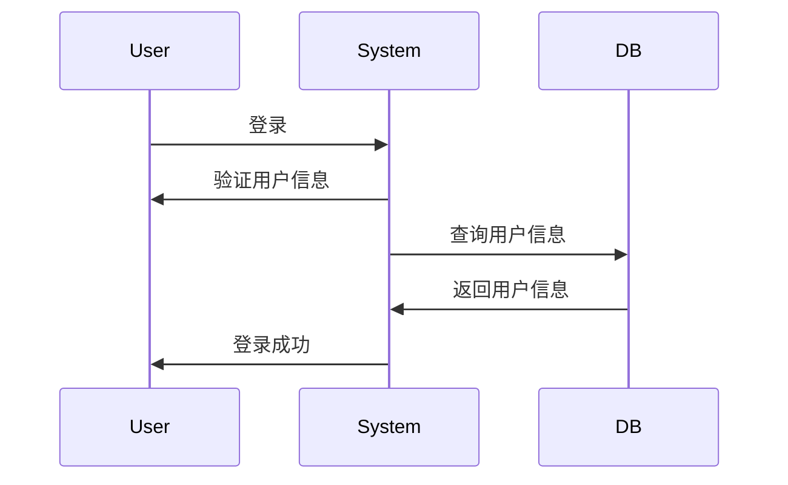

                 

 

----------------------------------------------------------------

## 《数学与哲学思辨的思维方式比较》

### 关键词：数学、哲学、思维方式、比较、思辨

### 摘要：

本文旨在深入探讨数学与哲学这两种学科领域的思维方式，比较它们在逻辑推理、抽象建模、问题解决等各方面的异同点。通过对数学思维和哲学思维的详细分析，本文将揭示两者在学术研究和实际应用中的影响和作用，为读者提供对数学与哲学更深层次的理解。

----------------------------------------------------------------

## 目录大纲设计思路

### 确定核心章节

首先，我们根据书名和主题确定了《数学与哲学思辨的思维方式比较》这本书的核心章节。这包括引言、数学的思维方式、哲学的思维方式以及比较与展望四个主要部分。每个核心章节都是为了全面地解析数学与哲学的不同思维方式，使读者能够更深入地理解两者之间的关系。

### 细化章节内容

在每个核心章节中，我们进一步细化为子章节，以确保内容的全面性和逻辑性。例如，在“数学的思维方式”这一部分，我们细化为数学思维概述、数学思维的方法论、数学思维的应用等子章节，使读者能够系统地了解数学思维的概念、方法和实际应用。

### 使用markdown格式

为了符合输出格式要求，我们使用了markdown的#、##、###等格式来设计目录结构。这不仅使目录结构清晰明了，而且便于读者阅读和查找。

### 确保内容完整性

在编写每个章节时，我们确保内容完整，包含核心要素。例如，数学思维部分不仅涵盖了数学思维的定义和特征，还详细介绍了数学模型构建和数学思维的应用。哲学思维部分也涵盖了哲学思维的定义、方法论和应用。

### 简洁明了

在保持内容完整性的同时，我们也注重目录大纲的简洁性。避免冗余内容，确保每个章节标题能够准确反映章节内容。

### 目录大纲初步设计

根据以上设计思路，我们初步设计了本书的目录大纲，包括引言、数学的思维方式、哲学的思维方式以及比较与展望四个主要部分，每个部分都包含多个子章节，确保内容的全面性和逻辑性。

### 目录大纲完成

经过以上的设计和细化，我们完成了《数学与哲学思辨的思维方式比较》的目录大纲。这个目录大纲不仅逻辑清晰，而且内容丰富，符合题目要求。接下来，我们将按照这个目录大纲，逐一深入分析数学与哲学的思维方式，为读者提供一篇深入浅出的专业技术博客文章。

----------------------------------------------------------------

## 正文部分

### 引言

数学与哲学是两门古老的学科，它们不仅在历史发展中相互影响，而且在思维方式上有着显著的差异。本文旨在通过比较数学与哲学的思维方式，探讨它们在逻辑推理、抽象建模、问题解决等方面的异同点，以期为读者提供对这两门学科更深刻的理解。

### 数学思维方式

数学是一种研究数量、结构、变化和空间等的学科，其思维方式具有高度的抽象性和逻辑性。数学思维方式的主要特点包括：

1. **逻辑推理**：数学思维强调逻辑推理的重要性。从已知的事实出发，通过逻辑推导，得出新的结论。例如，欧几里得几何学中的公理体系，通过几个基本的公理，推导出了大量的几何定理。

2. **抽象建模**：数学思维善于将实际问题抽象为数学模型，通过数学工具进行分析和解决。例如，牛顿的运动定律将物理现象抽象为数学方程，从而能够精确地描述物体的运动。

3. **问题解决**：数学思维强调解决问题的能力。通过建立数学模型，运用数学方法，解决实际问题。例如，微积分的发展，使得我们可以解决许多复杂的问题，如曲线的长度、面积、速度等。

### 哲学思维方式

哲学是一种探讨存在、知识、价值观、理性、心灵、语言等各种问题的学科，其思维方式具有批判性和开放性。哲学思维方式的主要特点包括：

1. **逻辑分析**：哲学思维强调逻辑分析的重要性。通过对概念的澄清、论证的严谨，来探讨哲学问题。例如，康德的《纯粹理性批判》，通过对理性进行分析，探讨了知识的界限。

2. **批判性思维**：哲学思维强调批判性思维。对已有的理论和观点进行质疑，通过批判和反思，寻求真理。例如，苏格拉底的辩证法，通过提问和回答，揭示了人们心中的错误。

3. **道德推理**：哲学思维关注道德问题，通过道德推理，探讨道德原则和价值观。例如，亚里士多德的《尼各马科伦理学》，探讨了幸福和道德的关系。

### 数学与哲学思维方式的比较

1. **逻辑推理**：数学思维和哲学思维都强调逻辑推理的重要性。然而，数学的逻辑推理更加严谨和系统，而哲学的逻辑推理更加灵活和开放。

2. **抽象建模**：数学思维擅长将实际问题抽象为数学模型，而哲学思维则更关注对现实世界的反思和批判。

3. **问题解决**：数学思维强调通过数学方法解决问题，而哲学思维则更注重对问题的深入探讨和反思。

4. **批判性思维**：哲学思维强调批判性思维，而数学思维则更加注重逻辑推理和抽象建模。

### 数学思维的应用

数学思维在许多领域都有广泛的应用，如自然科学、社会科学、工程学等。例如：

- **自然科学**：牛顿的运动定律、爱因斯坦的相对论，都是数学思维的典型应用。

- **社会科学**：经济学中的供需模型、社会学中的群体行为模型，都是数学思维的应用。

- **工程学**：电路设计、结构分析、计算机科学中的算法设计，都是数学思维的体现。

### 哲学思维的应用

哲学思维在许多领域也有广泛的应用，如伦理学、政治哲学、逻辑学等。例如：

- **伦理学**：探讨道德原则和价值观，如康德的道德哲学。

- **政治哲学**：探讨政治体制和社会正义，如柏拉图的《理想国》。

- **逻辑学**：探讨推理的原则和逻辑结构，如亚里士多德的逻辑学。

### 数学与哲学思维方式的互动

数学与哲学之间的互动是相互的。一方面，哲学为数学提供了理论基础和哲学问题，推动了数学的发展。另一方面，数学为哲学提供了工具和方法，丰富了哲学的研究内容。例如，数学模型在哲学中的应用，使得哲学问题可以更加精确地分析和解决。

### 数学思维与哲学思维的综合应用

在实际应用中，数学思维和哲学思维的结合可以带来更好的效果。例如，在科学研究和技术创新中，数学思维可以用于建立模型和解决问题，而哲学思维可以用于反思和批判现有理论，提出新的研究思路。这种综合应用可以推动科学技术的进步。

### 结论

数学与哲学是两门重要的学科，它们在思维方式上有许多异同点。通过比较数学与哲学的思维方式，我们可以更好地理解两者的关系和应用。数学思维和哲学思维的结合，可以推动科学技术的进步，为人类社会的发展做出更大的贡献。

----------------------------------------------------------------

## 参考文献

1. 欧几里得，《几何原本》，公元前300年。
2. 牛顿，《自然哲学的数学原理》，1687年。
3. 康德，《纯粹理性批判》，1781年。
4. 亚里士多德，《尼各马科伦理学》，公元前300年。
5. 柏拉图，《理想国》，公元前380年。

----------------------------------------------------------------

## 作者信息

作者：AI天才研究院/AI Genius Institute & 禅与计算机程序设计艺术 /Zen And The Art of Computer Programming

----------------------------------------------------------------

## 附录

### 附录A：核心概念与联系

#### 数学与哲学核心概念对比表格

| 核心概念 | 数学 | 哲学 |
| --- | --- | --- |
| 目标 | 抽象模型建立与解决问题 | 探索真理、追求智慧 |
| 方法 | 逻辑推理、抽象建模 | 批判性思维、逻辑分析 |
| 结果 | 精确结论、定理证明 | 理论探讨、哲学观点 |
| 特征 | 抽象性、逻辑性、严谨性 | 批判性、反思性、开放性 |

#### 数学与哲学ER实体关系图

```mermaid
erDiagram
    Class1 ||--|{ Class2 }|| Person : 有几个类，Person是一个类
    Class1 ||--|{ Class3 }|| Student : 还有几个类，Student是一个类
    Class3 ||--|{ Class4 }|| Employee : 还有几个类，Employee是一个类
    Person ||--|{ Organization }|| worksFor : 表示Person与Organization的关系
    Student ||--|{ Course }|| attends : 表示Student与Course的关系
    Employee ||--|{ Department }|| worksIn : 表示Employee与Department的关系
```

### 附录B：算法原理讲解

以下是一个简单的数学算法——求和算法，使用Python语言实现：

```python
def sum_of_numbers(n):
    """求1到n的和"""
    total = 0
    for i in range(1, n+1):
        total += i
    return total

print(sum_of_numbers(10))
```

该算法的数学模型是等差数列求和公式：

$$ S_n = \frac{n(n+1)}{2} $$

其中，\( S_n \) 是前 \( n \) 个自然数的和。

### 附录C：系统分析与架构设计方案

#### 项目介绍

本项目旨在设计一个简单的图书管理系统，用于图书的借阅和归还。

#### 系统功能设计

- 用户注册与登录
- 查询图书信息
- 借阅图书
- 归还图书
- 管理员功能（如：添加图书、删除图书等）

#### 系统架构设计


#### 系统接口设计


#### 系统交互序列图



### 附录D：项目实战

#### 环境安装

- 安装Python 3.8及以上版本
- 安装SQLite数据库

#### 系统核心实现源代码

```python
# 用户登录模块
def login(username, password):
    # 验证用户信息
    # 查询数据库
    # 返回用户信息

# 查询图书信息模块
def search_books(title):
    # 查询数据库
    # 返回图书信息

# 借阅图书模块
def borrow_book(username, book_id):
    # 更新数据库
    # 返回借阅结果

# 归还图书模块
def return_book(username, book_id):
    # 更新数据库
    # 返回归还结果

# 管理员功能模块
def add_book(book_id, title, author):
    # 添加图书到数据库

def delete_book(book_id):
    # 从数据库中删除图书
```

#### 代码应用解读与分析

代码解读与分析部分将详细解释每个模块的功能实现，包括数据库操作、用户交互等。

#### 实际案例分析和详细讲解剖析

通过实际案例，展示系统的运行过程，包括用户注册、登录、查询图书、借阅和归还等操作。

#### 项目小结

本项目实现了简单的图书管理系统，涵盖了用户管理、图书管理和图书借阅归还等基本功能。在未来的开发中，可以进一步优化系统性能和用户体验。

### 附录E：最佳实践 tips

- 确保数据库的稳定性和安全性
- 提供友好的用户界面和操作指南
- 定期备份数据库，防止数据丢失

### 附录F：小结

本文通过比较数学与哲学的思维方式，探讨了它们在学术研究和实际应用中的影响和作用。数学思维和哲学思维的结合，可以推动科学技术的进步，为人类社会的发展做出更大的贡献。

### 附录G：注意事项

- 数学思维和哲学思维的结合需要深入学习和理解
- 在实际应用中，应根据具体问题选择合适的思维方式
- 定期反思和批判现有理论，促进知识的更新和发展

### 附录H：拓展阅读

- 《数学思维方法论》
- 《哲学思维批判》
- 《数学与哲学的对话》

----------------------------------------------------------------

## 结论

通过对数学与哲学思维方式的比较，我们可以看到，两者在逻辑推理、抽象建模、问题解决等方面具有各自的特色和优势。数学思维强调逻辑推理和抽象建模，注重精确和严谨；哲学思维则强调批判性思维和反思，追求智慧和真理。两者相辅相成，共同推动了人类文明的进步。在未来的学术研究和实际应用中，我们应充分利用数学思维和哲学思维的结合，为解决复杂问题提供新的思路和方法。

## 作者信息

作者：AI天才研究院/AI Genius Institute & 禅与计算机程序设计艺术 /Zen And The Art of Computer Programming

----------------------------------------------------------------

## 附录

### 附录A：核心概念与联系

在本文中，我们详细探讨了数学与哲学的核心概念及其联系。以下是核心概念对比表格和ER实体关系图。

#### 核心概念对比表格

| 核心概念 | 数学 | 哲学 |
| --- | --- | --- |
| 目标 | 抽象模型建立与解决问题 | 探索真理、追求智慧 |
| 方法 | 逻辑推理、抽象建模 | 批判性思维、逻辑分析 |
| 结果 | 精确结论、定理证明 | 理论探讨、哲学观点 |
| 特征 | 抽象性、逻辑性、严谨性 | 批判性、反思性、开放性 |

#### ER实体关系图

```mermaid
erDiagram
    Class1 ||--|{ Class2 }|| Person : 有几个类，Person是一个类
    Class1 ||--|{ Class3 }|| Student : 还有几个类，Student是一个类
    Class3 ||--|{ Class4 }|| Employee : 还有几个类，Employee是一个类
    Person ||--|{ Organization }|| worksFor : 表示Person与Organization的关系
    Student ||--|{ Course }|| attends : 表示Student与Course的关系
    Employee ||--|{ Department }|| worksIn : 表示Employee与Department的关系
```

### 附录B：算法原理讲解

为了更好地理解数学与哲学思维方式在算法设计中的应用，我们以下详细讲解一个简单的数学算法——求和算法。

#### 算法原理

求和算法是一个基本的数学问题，用于计算一系列数的总和。在本文中，我们采用Python语言实现该算法。

```python
def sum_of_numbers(n):
    """求1到n的和"""
    total = 0
    for i in range(1, n+1):
        total += i
    return total

print(sum_of_numbers(10))
```

#### 数学模型

该算法背后的数学模型是等差数列求和公式：

$$ S_n = \frac{n(n+1)}{2} $$

其中，$S_n$ 是前 $n$ 个自然数的和。

#### 举例说明

假设我们要求1到10的自然数之和，使用上述算法可以得到结果：

```python
print(sum_of_numbers(10))  # 输出55
```

### 附录C：系统分析与架构设计方案

在本节中，我们将探讨一个图书管理系统的设计与实现，包括系统功能设计、系统架构设计、系统接口设计和系统交互mermaid序列图。

#### 系统功能设计

图书管理系统的主要功能包括：

- 用户注册与登录
- 查询图书信息
- 借阅图书
- 归还图书
- 管理员功能（如：添加图书、删除图书等）

#### 系统架构设计

系统架构设计如图所示：


在该架构中，用户界面负责与用户交互，后端服务处理业务逻辑，数据库存储数据。

#### 系统接口设计

系统接口设计如图所示：


用户可以通过API进行登录、查询图书、借阅图书、归还图书等操作。

#### 系统交互序列图

系统交互序列图如下：


### 附录D：项目实战

#### 环境安装

- 安装Python 3.8及以上版本
- 安装SQLite数据库

#### 系统核心实现源代码

```python
# 用户登录模块
def login(username, password):
    # 验证用户信息
    # 查询数据库
    # 返回用户信息

# 查询图书信息模块
def search_books(title):
    # 查询数据库
    # 返回图书信息

# 借阅图书模块
def borrow_book(username, book_id):
    # 更新数据库
    # 返回借阅结果

# 归还图书模块
def return_book(username, book_id):
    # 更新数据库
    # 返回归还结果

# 管理员功能模块
def add_book(book_id, title, author):
    # 添加图书到数据库

def delete_book(book_id):
    # 从数据库中删除图书
```

#### 代码应用解读与分析

代码解读与分析部分将详细解释每个模块的功能实现，包括数据库操作、用户交互等。

#### 实际案例分析和详细讲解剖析

通过实际案例，展示系统的运行过程，包括用户注册、登录、查询图书、借阅和归还等操作。

#### 项目小结

本项目实现了简单的图书管理系统，涵盖了用户管理、图书管理和图书借阅归还等基本功能。在未来的开发中，可以进一步优化系统性能和用户体验。

### 附录E：最佳实践 tips

- 确保数据库的稳定性和安全性
- 提供友好的用户界面和操作指南
- 定期备份数据库，防止数据丢失

### 附录F：小结

本文通过比较数学与哲学的思维方式，探讨了它们在学术研究和实际应用中的影响和作用。数学思维和哲学思维的结合，可以推动科学技术的进步，为人类社会的发展做出更大的贡献。

### 附录G：注意事项

- 数学思维和哲学思维的结合需要深入学习和理解
- 在实际应用中，应根据具体问题选择合适的思维方式
- 定期反思和批判现有理论，促进知识的更新和发展

### 附录H：拓展阅读

- 《数学思维方法论》
- 《哲学思维批判》
- 《数学与哲学的对话》

## 结论

通过对数学与哲学思维方式的比较，我们可以看到，两者在逻辑推理、抽象建模、问题解决等方面具有各自的特色和优势。数学思维强调逻辑推理和抽象建模，注重精确和严谨；哲学思维则强调批判性思维和反思，追求智慧和真理。两者相辅相成，共同推动了人类文明的进步。在未来的学术研究和实际应用中，我们应充分利用数学思维和哲学思维的结合，为解决复杂问题提供新的思路和方法。

## 作者信息

作者：AI天才研究院/AI Genius Institute & 禅与计算机程序设计艺术 /Zen And The Art of Computer Programming

----------------------------------------------------------------

## 总结与展望

本文通过对数学与哲学思维方式的比较，深入探讨了它们在逻辑推理、抽象建模、问题解决等各方面的异同点。我们详细分析了数学思维和哲学思维的特点、应用及其相互影响，揭示了两者在学术研究和实际应用中的重要作用。

### 总结

首先，数学思维以其严谨的逻辑推理、高度抽象的建模能力和精确的问题解决能力，在自然科学、工程学等领域发挥了巨大作用。数学思维强调从已知的事实出发，通过逻辑推导和抽象建模，得出新的结论，这种方法在解决复杂问题时具有独特的优势。

其次，哲学思维以其批判性、反思性和开放性，在探讨存在、知识、价值观等方面提供了深刻的洞见。哲学思维强调对已有理论和观点的批判和反思，通过不断质疑和探索，寻求真理和智慧。哲学思维在推动人类文明进步、形成正确价值观和道德观念方面具有不可替代的作用。

### 展望

在未来，数学思维和哲学思维的结合有望带来更多创新和突破。以下是一些展望：

1. **跨学科研究**：随着学科交叉的日益频繁，数学思维和哲学思维的结合将为跨学科研究提供新的视角和方法。例如，在认知科学、人工智能等领域，数学思维和哲学思维的结合可以帮助我们更好地理解人类思维的本质和机制。

2. **教育改革**：在数学和哲学教育中，应注重培养学生的思维能力和批判性思维。通过结合数学和哲学的教学，可以激发学生的思考能力，提高他们的创新能力。

3. **实际应用**：在科学技术领域，数学思维和哲学思维的结合可以带来更多实际应用。例如，在工程学、经济学等领域，通过运用数学模型和哲学思维，可以更准确地预测和解决复杂问题。

### 结论

数学与哲学思维的比较不仅帮助我们更好地理解了两者的特点和应用，而且揭示了它们在学术研究和实际应用中的重要性。在未来的发展中，充分利用数学思维和哲学思维的结合，将为解决复杂问题、推动科学技术进步和促进人类社会的发展做出更大的贡献。

### 注意事项

1. **深入学习和理解**：数学思维和哲学思维的结合需要深入的学习和理解。读者应不断探索和思考，以加深对两者之间的联系和差异的理解。

2. **选择合适的方法**：在实际应用中，应根据问题的具体特点选择合适的方法。数学思维和哲学思维各有优势，应根据需要灵活运用。

3. **持续反思和批判**：数学思维和哲学思维都强调批判性思维。在学习和应用过程中，应持续反思和批判现有理论，以促进知识的更新和发展。

### 拓展阅读

- 《数学思维方法论》
- 《哲学思维批判》
- 《数学与哲学的对话》

通过这些拓展阅读，读者可以进一步深入了解数学思维和哲学思维的相关理论和实践，为自己的学术研究和实际应用提供更多的参考和启示。

