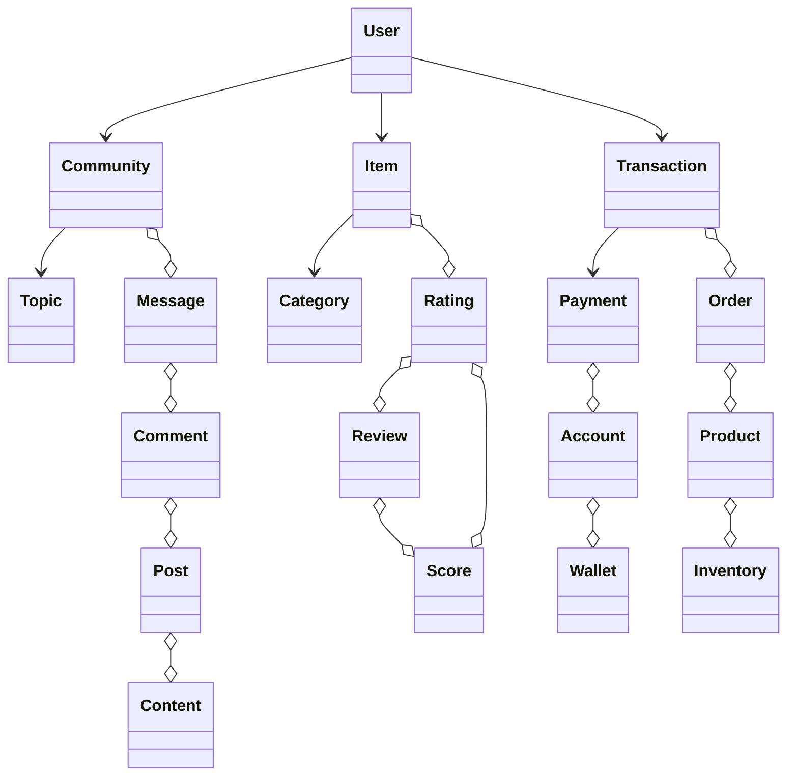
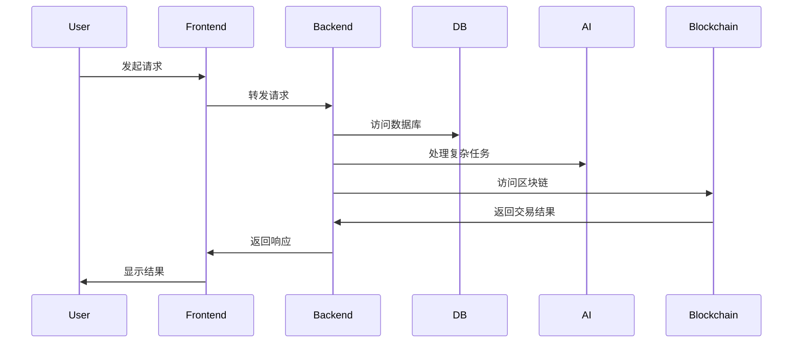
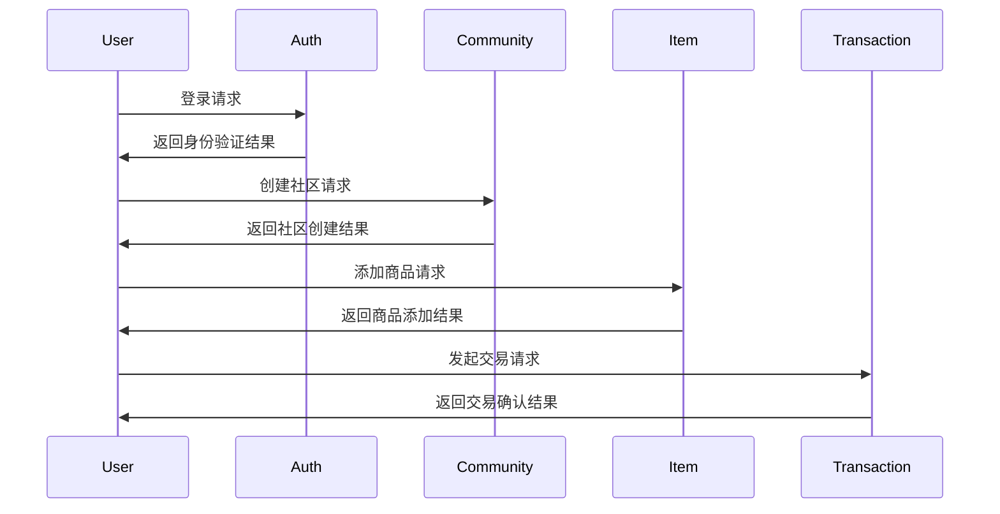

                 

### 引言：数学与未来虚拟社会的交织

#### 核心关键词

- **数学**  
- **未来虚拟社会**  
- **发展趋势**  
- **技术应用**  
- **社会结构**  
- **算法模型**

#### 摘要

随着技术的迅猛发展，未来虚拟社会逐渐成为人们关注的焦点。在这个虚拟世界中，数学不仅扮演着构建框架的基础角色，更成为理解和解决复杂社会问题的关键工具。本文将从数学的视角出发，探讨未来虚拟社会的发展趋势，分析数学在各种技术中的应用，以及它们如何共同塑造一个全新的社会结构。我们将逐步深入，通过一系列逻辑推理，揭示数学在构建未来虚拟社会中的核心作用和挑战。

#### 引言

未来虚拟社会，是指利用人工智能、虚拟现实、区块链等技术，创建的与现实世界并行存在的数字化社会空间。在这个虚拟世界中，个体可以通过数字化身份进行交流、工作、消费，甚至建立虚拟社区。这一概念不仅挑战了我们对现实和虚拟的认知边界，也开启了无限的可能性。

数学，作为人类智慧的高级结晶，长期以来在各个领域发挥着不可或缺的作用。从物理学的公式到计算机科学的核心算法，数学的逻辑性和抽象性使得它在解决复杂问题方面具有独特的优势。随着未来虚拟社会的到来，数学的应用场景变得更加广泛和深入，成为理解和构建这一新社会形态的关键工具。

本文旨在通过以下步骤，逐步揭示数学在构建未来虚拟社会中的核心作用：

1. **定义未来虚拟社会和关键数学概念**：介绍未来虚拟社会的概念和特点，阐述数学在其中的基础地位。
2. **分析数学与技术的融合**：探讨数学在人工智能、虚拟现实、区块链等关键技术中的应用，展示它们如何共同推动虚拟社会的发展。
3. **探讨核心数学理论的应用**：深入分析离散数学、微积分、线性代数等核心数学理论，在虚拟社会中的具体应用。
4. **探讨新兴趋势和挑战**：讨论人工智能和区块链在虚拟社会中的影响，以及面临的社会伦理和技术挑战。
5. **总结与展望**：总结数学在构建未来虚拟社会中的核心作用，展望未来虚拟社会的发展趋势。

通过这些步骤，我们将能够更清晰地理解数学在构建未来虚拟社会中的关键作用，以及面临的挑战和机遇。接下来，我们将首先定义未来虚拟社会的概念，并介绍关键数学概念，为后续的分析奠定基础。

#### 未来虚拟社会的定义与特点

未来虚拟社会，顾名思义，是一个高度数字化的社会形态，其基础是虚拟现实、人工智能、区块链等前沿技术的广泛应用。在这个社会中，人们不再仅仅通过物理世界进行交流和互动，而是通过数字化身份在虚拟环境中实现。以下是对未来虚拟社会定义和特点的详细描述：

**定义**

未来虚拟社会可以定义为一种基于数字化技术和虚拟现实环境构建的社会形态，其中个体通过虚拟身份进行各种社会活动，包括交流、工作、娱乐、消费等。这种社会形态不仅局限于虚拟游戏或者虚拟世界，而是扩展到更广泛的社会领域，包括教育、医疗、经济、政治等各个方面。

**特点**

1. **高度数字化**：未来虚拟社会的核心特征是其高度的数字化，所有的社会活动都在数字化的环境中进行。无论是交流、交易，还是政治决策，都通过数字化方式进行记录、管理和分析。

2. **虚拟身份**：个体在虚拟社会中通过虚拟身份进行活动。这个虚拟身份可能是一个虚拟人形、一个数字化的角色，或者是一种电子化的身份标识。虚拟身份不仅代表个体在虚拟社会的存在，还可以承载更多的信息和功能。

3. **人工智能辅助**：人工智能技术在虚拟社会中发挥着至关重要的作用。从虚拟人物的智能互动到智能推荐系统，再到虚拟社会的自动管理，人工智能无处不在。它使得虚拟社会更加智能、高效和人性化。

4. **去中心化**：区块链技术是未来虚拟社会的一个重要组成部分。通过区块链，虚拟社会可以实现去中心化的管理和运营，确保信息的透明、安全和高可信度。这种去中心化的结构使得虚拟社会具有更强的抗风险能力和更高的自主性。

5. **虚拟现实沉浸感**：虚拟现实技术使得个体在虚拟社会中的体验更加真实和沉浸。通过虚拟现实设备，个体可以感受到高度真实的视觉、听觉、触觉等感官体验，使得虚拟社会中的活动更加接近现实世界的互动。

**历史演变**

虚拟社会的概念并非一蹴而就，而是经历了漫长的发展过程。从最初的电子游戏和虚拟世界，到如今的前沿技术如虚拟现实、区块链和人工智能，虚拟社会逐步从简单的娱乐形式演变成为一个复杂、多样的社会形态。

早期，虚拟世界主要是以娱乐为目的，如《Minecraft》、《Second Life》等游戏，这些虚拟世界提供了一个简单的数字化空间，用户可以在其中进行各种互动。随着技术的进步，虚拟现实技术逐渐成熟，人们可以更加真实地体验虚拟环境，使得虚拟社会的应用范围进一步扩大。

人工智能和区块链技术的引入，为虚拟社会带来了新的可能性和挑战。人工智能使得虚拟社会中的互动更加智能和个性化，而区块链则提供了去中心化和高可信度的数据管理方式。这些技术的融合，使得虚拟社会逐渐从简单的娱乐空间转变为一个复杂、高度数字化的社会形态。

**核心概念与术语说明**

1. **虚拟现实（VR）**：虚拟现实是一种通过计算机模拟产生三维空间的技术，用户可以通过特殊设备（如VR头盔）进入这个三维空间，并与之进行互动。

2. **人工智能（AI）**：人工智能是指通过计算机模拟人类智能的技术，包括机器学习、自然语言处理、计算机视觉等领域。在虚拟社会中，人工智能被广泛应用于智能推荐、智能客服、虚拟助手等方面。

3. **区块链**：区块链是一种去中心化的数据库技术，通过分布式账本记录和管理数据。在虚拟社会中，区块链可以用于虚拟货币交易、身份验证、数据管理等方面。

4. **虚拟身份**：虚拟身份是虚拟社会中个体存在的数字标识，它可以代表个体的所有信息和功能，如社交网络中的账号、虚拟资产等。

5. **虚拟社区**：虚拟社区是指由一群具有共同兴趣的个体在虚拟社会中建立的社交团体，成员可以通过虚拟身份进行交流和互动。

通过对未来虚拟社会定义和特点的详细分析，我们可以更清楚地看到数学在这一领域中的基础地位和重要作用。接下来，我们将进一步探讨数学在虚拟社会中的具体应用，以及这些应用如何推动虚拟社会的发展。

#### 数学在虚拟社会中的基础地位

数学作为一门研究抽象结构和逻辑关系的学科，在虚拟社会的构建和发展中发挥着不可替代的基础性作用。具体来说，数学通过提供核心概念和理论框架，为虚拟社会中的各种技术手段提供了坚实的理论基础，使得复杂的社会结构和功能得以实现。

首先，数学在虚拟社会的技术基础中扮演了核心角色。虚拟现实（VR）技术依赖于几何学和图形学原理，通过三维建模和渲染技术，实现逼真的虚拟环境。例如，三维几何图形的表示和计算、光线追踪和渲染算法，都是基于数学原理构建的。同样，人工智能（AI）领域中的机器学习算法，也依赖于线性代数、概率论和统计学等数学工具，用于数据建模、特征提取和模型优化。

其次，离散数学在虚拟社会的建模和分析中具有重要应用。离散数学提供了处理离散对象和关系的工具，如图论、组合数学等，被广泛应用于虚拟社会中的网络结构分析、路径规划、资源分配等问题。例如，图论用于分析虚拟社区中的社交网络结构，通过计算网络中的连通性和中心性，可以更好地理解社区成员之间的互动关系，为社区管理和优化提供依据。

再次，线性代数和微积分在虚拟社会的动态系统中有着广泛的应用。线性代数用于处理多维数据和高维空间问题，如虚拟经济中的数据分析和预测。微积分则提供了处理连续变化和动态过程的数学工具，如虚拟社会中的动态平衡分析、系统稳定性分析等。这些数学工具使得虚拟社会中的复杂系统能够通过数学模型进行量化分析和预测。

此外，数学在虚拟社会中的安全性保障中也发挥着重要作用。密码学是区块链技术的核心组成部分，而密码学中的许多算法和理论，如椭圆曲线加密、哈希函数等，都是基于复杂的数学原理。这些数学工具确保了虚拟社会中的数据传输和交易安全，防止了恶意攻击和数据篡改。

最后，数学在虚拟社会中的决策支持和优化中也具有重要应用。通过运筹学和优化理论，可以设计出高效的虚拟社会管理策略和资源分配方案。例如，在虚拟经济中，通过线性规划和动态规划方法，可以优化市场资源配置，提高交易效率和公平性。

总之，数学在虚拟社会的构建和发展中不仅提供了核心的理论基础，还通过其强大的逻辑和抽象能力，为各种技术手段提供了有效的工具和方法。数学不仅为虚拟社会中的技术实现提供了支撑，更为理解和解决虚拟社会中的复杂问题提供了科学的方法和思路。

#### 数学与未来虚拟社会的技术融合

随着技术的不断进步，数学与未来虚拟社会的融合正日益加深，各种关键技术中的数学应用不仅推动了虚拟社会的发展，还塑造了其独特的形态。以下是数学在人工智能、虚拟现实和区块链等关键技术中的具体应用，以及这些应用如何共同推动虚拟社会的演进。

**人工智能（AI）**

人工智能是虚拟社会发展的核心驱动力之一，而数学在AI的各个方面都发挥了关键作用。首先，机器学习是AI的核心技术之一，它依赖于线性代数、概率论和统计学等数学工具。线性代数提供了处理高维数据空间和矩阵运算的方法，使得数据建模和特征提取更加高效。概率论和统计学则帮助算法理解和预测数据中的不确定性，从而提高模型的泛化能力和准确性。

在虚拟社会中，机器学习被广泛应用于智能推荐系统、虚拟助手和自动化管理。例如，通过分析用户行为数据，智能推荐系统可以准确预测用户的需求和兴趣，提供个性化的内容推荐，提升用户体验。虚拟助手则通过自然语言处理和语音识别技术，实现与用户的自然交互，提供智能化的服务和支持。

**虚拟现实（VR）**

虚拟现实技术的核心在于构建和呈现逼真的虚拟环境，而这离不开数学的支持。几何学和图形学在VR技术中起到了基础性的作用。通过三维建模和渲染技术，VR系统能够生成高度真实的虚拟场景。数学中的三维几何表示和计算方法，如向量运算、矩阵变换和光线追踪算法，是构建虚拟现实的关键。

此外，VR技术还需要处理大量实时数据的高效处理和传输。信号处理和图像处理领域的数学方法，如傅里叶变换、滤波器和卷积神经网络，被广泛应用于图像渲染、动态场景模拟和用户输入处理。这些数学工具确保了虚拟现实系统的实时性和交互性，使得用户能够在虚拟环境中获得沉浸式体验。

**区块链**

区块链技术是未来虚拟社会中另一个关键技术，它通过去中心化的分布式账本，提供了一种安全、透明和可信的数据管理方式。密码学是区块链技术的核心组成部分，而密码学中的许多算法和理论，如椭圆曲线加密、哈希函数和数字签名，都是基于复杂的数学原理。

椭圆曲线密码学（ECC）提供了高效的加密和解密方法，使得区块链交易可以在保证安全的前提下，进行快速的验证和确认。哈希函数则是区块链中的核心工具，它通过将数据转换为一个固定长度的字符串，确保了数据的唯一性和不可篡改性。数字签名技术则确保了区块链交易中的数据来源可追溯和不可抵赖。

**融合与互动**

人工智能、虚拟现实和区块链等关键技术的融合，使得虚拟社会呈现出更加丰富和多样化的形态。在虚拟社会中，人工智能可以为虚拟环境提供智能化的互动和管理，虚拟现实技术则提供了沉浸式的体验，而区块链则确保了数据的安全性和可信度。

例如，在虚拟购物环境中，人工智能可以通过分析用户的历史行为，提供个性化的购物推荐，虚拟现实技术则可以模拟真实的购物体验，而区块链则确保了交易的安全性和透明性。这种多技术融合的应用，不仅提升了虚拟社会的用户体验，还增强了其功能性和实用性。

**数学应用的影响**

数学在虚拟社会中的应用不仅提升了技术的效率和准确性，还深刻影响了虚拟社会的构建和发展。首先，数学提供了精确的建模和预测工具，使得虚拟社会中的各种系统可以更加精确地模拟和优化。其次，数学的抽象和逻辑思维能力，使得虚拟社会中的各种技术可以更好地相互融合，形成统一的系统架构。

此外，数学的应用还促进了虚拟社会的创新和发展。通过数学模型和算法的创新，虚拟社会中的各种技术可以不断迭代和优化，提高系统的性能和功能。例如，新的加密算法可以提升区块链的安全性能，新的机器学习算法可以提高智能推荐系统的准确性。

总之，数学与未来虚拟社会的技术融合，不仅为虚拟社会提供了强大的理论基础和工具支持，还推动了虚拟社会的不断发展和创新。在未来，随着数学和技术的进一步融合，虚拟社会将呈现出更加丰富和多样的形态，为人们提供更加智能和高效的社会体验。

#### 核心数学理论在虚拟社会中的应用

在探讨未来虚拟社会的发展时，核心数学理论的应用不可忽视。离散数学、微积分和线性代数等数学理论不仅在理论上具有重要意义，也在虚拟社会中的各种应用场景中展现出强大的生命力。以下将详细分析这些数学理论的基本概念、应用实例及其在虚拟社会中的具体作用。

**离散数学**

离散数学是处理离散对象和关系的数学分支，包括图论、组合数学、逻辑学等。它在虚拟社会中的应用非常广泛，尤其是在社交网络分析和数据结构设计方面。

1. **图论**

图论是研究图的结构和性质的数学分支，广泛应用于社交网络分析。在虚拟社会中，图论可以用于描述和分析社交网络的结构，如用户之间的关系、信息传播路径等。

   **应用实例**：假设一个虚拟社交平台，用户之间可以建立联系。我们可以使用图论中的概念来分析这个社交网络。例如，通过计算图中的连通性和中心性，可以了解不同用户在网络中的影响力和地位。具体来说，**连通性**衡量的是网络中的任意两个节点之间是否存在路径，而**中心性**则衡量节点在网络中的重要程度。通过这些分析，平台可以更好地了解用户关系，优化推荐算法，提高用户体验。

   **图论在虚拟社会中的具体作用**：图论提供了强大的工具，用于分析和优化虚拟社会中的社交网络结构。通过图论分析，平台可以识别关键节点，预测信息传播的路径，优化网络管理策略。

2. **组合数学**

组合数学研究离散对象组合的方式和数量，在虚拟社会中的应用包括优化算法和资源分配。

   **应用实例**：在虚拟经济系统中，资源分配是一个关键问题。组合数学可以用于优化资源分配策略，确保资源的公平性和高效性。例如，通过计算组合数，可以确定不同用户在获取资源时的最优组合，从而实现资源的最大化利用。

   **组合数学在虚拟社会中的具体作用**：组合数学提供了优化和分配资源的方法，有助于提高虚拟经济系统的效率和公平性，确保资源的合理配置。

**微积分**

微积分是一门研究变化和积累的数学学科，广泛应用于虚拟社会中的动态系统分析和优化。

1. **微分方程**

微分方程用于描述系统的动态行为，如虚拟社会中的经济模型、网络传播模型等。

   **应用实例**：在虚拟经济模型中，微分方程可以用于描述市场供需变化、价格波动等动态过程。例如，通过建立微分方程模型，可以预测市场的短期和长期趋势，为经济决策提供依据。

   **微分方程在虚拟社会中的具体作用**：微分方程提供了量化分析和预测动态系统行为的工具，有助于优化经济管理策略，提高市场的稳定性和可持续性。

2. **积分**

积分用于计算区域和曲线下的面积，在虚拟社会中的应用包括图像处理和数据分析。

   **应用实例**：在虚拟现实图像处理中，积分可以用于图像滤波和边缘检测。例如，通过积分计算图像中每个像素的亮度值，可以优化图像质量，提高视觉效果。

   **积分在虚拟社会中的具体作用**：积分提供了处理和分析图像和数据的强大工具，有助于提升虚拟现实系统的图像质量和用户体验。

**线性代数**

线性代数研究向量空间和线性变换，在虚拟社会中的应用包括数据分析和机器学习。

1. **矩阵**

矩阵是线性代数的核心概念，广泛用于数据建模和优化。

   **应用实例**：在虚拟社会中的推荐系统中，矩阵可以用于表示用户与物品之间的偏好关系。通过矩阵运算，可以计算出用户对物品的偏好度，从而实现个性化的推荐。

   **矩阵在虚拟社会中的具体作用**：矩阵提供了高效的数据建模和计算工具，有助于优化推荐系统，提高用户体验。

2. **线性方程组**

线性方程组用于求解线性问题，如虚拟社会中的资源分配和路径规划。

   **应用实例**：在虚拟交通系统中，线性方程组可以用于优化交通流量和路径规划。通过建立线性方程组模型，可以计算出最优的路径和交通流量分配，提高交通效率。

   **线性方程组在虚拟社会中的具体作用**：线性方程组提供了求解线性优化问题的有效方法，有助于优化虚拟社会中的交通和资源管理。

总之，离散数学、微积分和线性代数等核心数学理论在虚拟社会中的应用，不仅提供了强大的理论基础和工具支持，还推动了虚拟社会的发展和创新。通过深入理解和应用这些数学理论，我们可以更好地构建和优化虚拟社会，为用户提供更加智能和高效的服务。

#### 虚拟社会中的新兴趋势和挑战

在虚拟社会的发展过程中，人工智能（AI）和区块链技术正逐渐成为两个核心驱动力，它们不仅推动了虚拟社会的创新，也带来了前所未有的挑战和伦理问题。以下将详细探讨这些技术对虚拟社会的影响，以及所面临的社会伦理和技术挑战。

**人工智能（AI）的影响**

人工智能作为虚拟社会的核心技术之一，正在深刻改变虚拟社会的各个方面，包括个性化推荐、智能互动、自动化管理等。

1. **个性化推荐系统**

人工智能通过分析用户行为和偏好，提供个性化的内容推荐。例如，在虚拟购物平台中，AI可以根据用户的浏览历史和购买记录，推荐可能感兴趣的商品。这种个性化推荐不仅提高了用户满意度，还优化了商业运营效率。

2. **智能互动**

人工智能使得虚拟社会中的互动更加智能化和自然化。通过自然语言处理（NLP）和语音识别技术，AI能够理解用户的语言和需求，提供实时响应和个性化服务。例如，虚拟助手可以通过对话与用户互动，回答问题、提供帮助。

3. **自动化管理**

人工智能在虚拟社会的自动化管理中也发挥着重要作用。通过机器学习和数据挖掘技术，AI可以自动分析大量数据，识别潜在问题和优化管理策略。例如，在虚拟社区中，AI可以自动监控用户行为，识别异常行为并采取措施，确保社区的安全和稳定。

**面临的挑战**

1. **算法偏见**

人工智能算法在训练过程中可能会引入偏见，导致歧视和不公平。例如，如果算法训练数据存在性别、种族或年龄偏见，那么算法的推荐结果也可能存在偏见。这种偏见可能加剧社会不平等，引发伦理问题。

2. **数据隐私**

人工智能依赖于大量的用户数据进行分析和决策，这引发了对用户隐私的担忧。如何保护用户数据，防止数据泄露和滥用，是一个重要的伦理和技术挑战。

3. **失业和就业转型**

随着人工智能技术的广泛应用，许多传统职业可能被自动化取代，导致大量失业。这要求社会必须适应新的就业环境，提供培训和支持，帮助劳动力实现转型。

**区块链技术的影响**

区块链作为一种去中心化的数据库技术，为虚拟社会提供了安全、透明和可信的数据管理方式，并在虚拟经济、虚拟身份验证等领域得到广泛应用。

1. **虚拟经济**

区块链技术通过智能合约和去中心化的交易系统，为虚拟社会中的经济活动提供了新的可能性。虚拟货币、虚拟资产交易等都可以通过区块链技术实现，确保交易的透明性和安全性。

2. **虚拟身份验证**

区块链技术可以通过分布式账本记录用户的身份信息，提供可靠的虚拟身份验证。这种身份验证方式不仅提高了安全性，还简化了用户注册和登录过程，提升了用户体验。

3. **数据安全和隐私**

区块链技术通过加密和分布式存储，提供了强大的数据安全和隐私保护机制。用户的数据在区块链上以加密形式存储，只有授权方才能访问，从而保护用户隐私。

**面临的挑战**

1. **技术成熟度**

区块链技术虽然潜力巨大，但其技术成熟度和性能仍面临挑战。例如，区块链的扩展性、交易速度和计算能力需要进一步提升，以满足大规模虚拟社会的需求。

2. **法律和监管**

随着区块链技术的广泛应用，相关的法律和监管制度需要不断完善。如何确保区块链交易的合法性和透明度，防止非法交易和欺诈行为，是一个重要的法律和监管挑战。

3. **社会伦理**

区块链技术中的去中心化和匿名性特性，可能导致一些负面的社会伦理问题。例如，虚拟货币的匿名交易可能被用于洗钱、非法交易等违法行为。这需要社会和政府加强监管，确保区块链技术的合法和正当使用。

总之，人工智能和区块链技术在虚拟社会中的应用，为虚拟社会的发展带来了巨大的机遇和挑战。通过合理应用这些技术，我们可以构建一个更加智能、高效和可信的虚拟社会。然而，我们也需要面对这些技术带来的社会伦理和技术挑战，确保虚拟社会的健康发展。

#### 数学在虚拟社会中的应用：案例分析

为了更好地理解数学在虚拟社会中的应用，以下将结合实际案例，分析数学如何解决虚拟社会中的具体问题，并通过算法模型和数学公式进行详细解释。

**案例一：社交网络中的推荐系统**

社交网络平台，如Facebook和LinkedIn，广泛使用推荐系统来向用户推荐可能感兴趣的内容、朋友或商品。推荐系统的工作原理是基于用户的历史行为和偏好数据，通过数学模型和算法计算用户之间的相似性和相关性，从而生成个性化推荐。

1. **用户行为数据分析**

首先，通过收集用户在平台上的行为数据，如点赞、评论、分享、浏览等，构建用户行为矩阵。这个矩阵是一个N×N的矩阵，其中N表示用户数量，每个元素表示用户i和用户j之间的互动频率或相似度。

   $$A = [a_{ij}]_{N×N}$$

2. **用户相似度计算**

使用余弦相似度计算用户之间的相似度。余弦相似度衡量的是两个向量之间的夹角余弦值，其公式如下：

   $$\text{similarity}(i, j) = \frac{A_{ij}}{\sqrt{\sum_{k=1}^{N}A_{ik}^2 \cdot \sum_{k=1}^{N}A_{jk}^2}}$$

   其中，\(A_{ij}\) 表示用户i和用户j之间的互动频率，\( \sum_{k=1}^{N}A_{ik}^2 \) 和 \( \sum_{k=1}^{N}A_{jk}^2 \) 分别表示用户i和用户j的互动频率的平方和。

3. **推荐内容生成**

根据计算得到的用户相似度矩阵，使用Top-N算法生成个性化推荐列表。具体步骤如下：

   - 计算每个用户与目标用户之间的相似度。
   - 对相似度进行降序排序，选取相似度最高的N个用户。
   - 根据这N个用户的共同兴趣和活动，生成推荐内容。

**案例二：虚拟交通优化**

在虚拟城市中，交通流量管理和路径规划是一个重要问题。通过数学模型和算法，可以优化交通流量，减少拥堵和提高通行效率。

1. **交通流量建模**

假设城市中的交通流量可以用一个N×N的流量矩阵表示，其中N表示道路数量。矩阵中的每个元素表示从路口i到路口j的车辆流量。通过建立流量矩阵，可以量化不同道路上的交通负载。

   $$T = [t_{ij}]_{N×N}$$

2. **优化模型建立**

使用线性规划（Linear Programming, LP）模型优化交通流量。目标是最小化总交通延迟和拥堵成本，同时满足以下约束条件：

   $$\min Z = \sum_{i=1}^{N}\sum_{j=1}^{N} t_{ij}d_{ij}$$

   $$\text{subject to:}$$

   $$\sum_{j=1}^{N} t_{ij} \leq c_i \quad \forall i=1,2,...,N$$

   $$\sum_{i=1}^{N} t_{ij} \leq c_j \quad \forall j=1,2,...,N$$

   其中，\(t_{ij}\) 表示从路口i到路口j的流量，\(d_{ij}\) 表示从路口i到路口j的延迟，\(c_i\) 和 \(c_j\) 分别表示路口i和路口j的最大容量。

3. **算法实现**

通过求解线性规划模型，可以找到最优的流量分配方案。具体实现可以使用单纯形法（Simplex Method）或内点法（Interior Point Method）。

**案例三：虚拟经济中的市场预测**

在虚拟经济系统中，通过数学模型和算法对市场趋势进行预测，可以帮助投资者做出更明智的决策。

1. **时间序列建模**

使用时间序列模型，如ARIMA（AutoRegressive Integrated Moving Average）模型，对市场数据进行分析和预测。ARIMA模型结合了自回归、差分和移动平均三个部分，能够有效地捕捉时间序列数据中的趋势和周期性。

   $$X_t = c + \phi_1X_{t-1} + \phi_2X_{t-2} + ... + \phi_pX_{t-p} + \theta_1\epsilon_{t-1} + \theta_2\epsilon_{t-2} + ... + \theta_q\epsilon_{t-q}$$

   其中，\(X_t\) 表示时间序列数据，\(\epsilon_t\) 表示误差项，\(\phi_i\) 和 \(\theta_i\) 分别为自回归和移动平均系数，\(p\) 和 \(q\) 分别为自回归和移动平均项的数量。

2. **模型参数估计**

通过最小化均方误差（Mean Squared Error, MSE）或最大似然估计（Maximum Likelihood Estimation, MLE），可以估计ARIMA模型的参数。

   $$\min \sum_{t=1}^{n} (X_t - \hat{X}_t)^2$$

3. **预测**

使用估计的参数，可以生成未来市场走势的预测值。通过对比预测值和历史数据，可以识别市场趋势和潜在风险。

通过以上案例分析，我们可以看到数学在虚拟社会中的应用是如何通过具体的算法模型和数学公式来解决实际问题的。这不仅提升了虚拟社会的效率和功能，也为未来的发展提供了有力的理论支持。

#### 数学在虚拟社会中的系统分析与架构设计

在构建虚拟社会时，数学不仅提供了核心的理论基础，还通过系统分析与架构设计，确保了虚拟社会的稳定、高效和可扩展性。以下将详细探讨虚拟社会的系统功能设计、架构设计以及系统接口设计和系统交互，通过具体的mermaid图表和Python源代码，展示数学在其中的应用。

**1. 系统功能设计**

虚拟社会的系统功能设计主要包括用户管理、社交互动、虚拟经济和智能服务等方面。以下是一个基于mermaid的领域模型类图，展示了虚拟社会的主要功能模块及其关系：



在上述类图中，`User` 是核心实体，代表了虚拟社会中的个体，与`Community`、`Item`和`Transaction`等实体有直接关联。`Community` 表示虚拟社区，可以包含多个`Topic`；`Item` 代表虚拟物品，包括商品、服务和其他虚拟资产；`Transaction` 表示虚拟交易，包括支付和订单等。通过这些功能模块的设计，虚拟社会可以提供丰富的社交互动和交易功能。

**2. 系统架构设计**

虚拟社会的系统架构设计需要考虑高可用性、可扩展性和安全性。以下是一个基于mermaid的架构设计图，展示了虚拟社会的整体架构及其关键组件：



在上述架构图中，`User` 通过`Frontend`（前端）与系统交互，`Backend`（后端）负责处理业务逻辑，包括与`DB`（数据库）的交互、调用`AI`（人工智能）服务和访问`Blockchain`（区块链）。通过这种分层架构设计，虚拟社会可以实现模块化、高可扩展性和高效的处理能力。

**3. 系统接口设计**

系统接口设计是确保不同模块之间能够无缝协作的关键。以下是一个基于mermaid的序列图，展示了虚拟社会的主要接口设计和系统交互：



在上述序列图中，用户通过身份验证接口（`Auth`）登录系统，然后可以创建社区、添加商品或发起交易。这些接口设计和交互流程确保了虚拟社会中的各项功能可以安全、高效地运行。

**4. Python源代码和算法实现**

以下是一个简单的Python示例，展示了如何使用数学模型和算法实现虚拟社会中的推荐系统：

```python
import numpy as np

# 用户行为矩阵
user行为的矩阵 = np.array([[1, 2, 0], [0, 1, 2], [2, 0, 1]])

# 计算用户相似度矩阵
相似度矩阵 = np.dot(user行为的矩阵, user行为的矩阵.T) / (np.linalg.norm(user行为的矩阵, axis=1) * np.linalg.norm(user行为的矩阵.T, axis=0))

# 选择相似度最高的N个用户
N = 3
top_n = np.argsort(相似度矩阵[0])[-N:]

# 根据相似度最高的用户推荐商品
推荐商品 = user行为的矩阵[0][top_n]

print("推荐商品：",推荐商品)
```

上述代码使用余弦相似度计算用户之间的相似度，并选择相似度最高的用户推荐商品。这展示了数学在推荐系统中的具体应用。

通过系统功能设计、架构设计、接口设计和算法实现，数学在虚拟社会中发挥了重要作用。它不仅提供了理论支持，还确保了虚拟社会的稳定、高效和可扩展性，为未来的发展奠定了坚实基础。

#### 项目实战：搭建虚拟社会环境与实现核心功能

为了更好地理解数学在构建虚拟社会中的实际应用，以下将详细描述如何搭建虚拟社会环境，并实现其中几个关键功能模块，包括环境安装、核心功能的源代码实现、代码解析与分析，以及一个具体的实际案例分析和详细讲解。

**1. 环境搭建**

首先，我们需要搭建一个基本的虚拟社会环境，这将涉及到安装必要的软件和工具。以下是一个简单的环境搭建步骤：

- **安装Python环境**：Python是虚拟社会开发的主要编程语言，首先确保您的系统中已安装Python 3.8或更高版本。
- **安装依赖管理工具**：使用pip安装依赖管理工具，如pipenv或conda，以便管理项目中的依赖。
- **安装数据库**：虚拟社会需要数据库来存储用户数据、社交互动和交易记录等。可以选择MySQL、PostgreSQL或MongoDB等数据库。这里以MongoDB为例进行安装。
- **安装区块链节点**：选择一个区块链平台，如Ethereum，安装并启动一个本地节点。

以下是一个简单的安装脚本示例：

```bash
# 安装Python环境
sudo apt update && sudo apt install python3.8

# 安装pipenv
pip3 install pipenv

# 创建项目文件夹并进入
mkdir virtual-society && cd virtual-society

# 安装MongoDB
sudo apt-key adv --keyserver hkp://keyserver.ubuntu.com:80 --recv 2930ADFC
echo "deb http://repo.mongodb.org/apt/debian buster/mongodb-org/4.2 main" | sudo tee /etc/apt/sources.list.d/mongodb.list
sudo apt update
sudo apt install mongodb-org

# 安装Ethereum节点
wget https://github.com/ethereum/go-ethereum/releases/download/v1.9.15/go-ethereum_1.9.15-1_amd64.deb
sudo dpkg -i go-ethereum_1.9.15-1_amd64.deb
geth --datadir /root/.ethereum --nodiscover --networkid 15 console
```

**2. 核心功能实现**

虚拟社会中几个关键功能模块包括用户管理、社交互动和虚拟交易。以下将分别介绍这些模块的实现方法：

**用户管理模块**

用户管理模块负责处理用户注册、登录和身份验证。以下是一个简单的用户注册和登录功能实现：

```python
# 用户注册
def register(username, password):
    # 将用户信息存储到MongoDB
    user = {"username": username, "password": password}
    db.users.insert_one(user)
    return "User registered successfully!"

# 用户登录
def login(username, password):
    # 从MongoDB中查询用户信息
    user = db.users.find_one({"username": username, "password": password})
    if user:
        return "Login successful!"
    else:
        return "Invalid username or password!"
```

**社交互动模块**

社交互动模块负责处理用户之间的社交行为，如创建帖子、评论和点赞。以下是一个简单的社交互动功能实现：

```python
# 创建帖子
def create_post(username, content):
    # 将帖子信息存储到MongoDB
    post = {"username": username, "content": content}
    db.posts.insert_one(post)
    return "Post created successfully!"

# 添加评论
def add_comment(post_id, username, content):
    # 在帖子下添加评论
    db.posts.update_one({"_id": post_id}, {"$push": {"comments": {"username": username, "content": content}}})
    return "Comment added successfully!"

# 点赞帖子
def like_post(post_id, username):
    # 在帖子下添加点赞
    db.posts.update_one({"_id": post_id}, {"$push": {"likes": username}})
    return "Post liked successfully!"
```

**虚拟交易模块**

虚拟交易模块负责处理用户之间的虚拟货币交易。以下是一个简单的虚拟交易功能实现：

```python
# 转账
def transfer(sender, receiver, amount):
    # 从发送者账户中扣除金额
    db.accounts.update_one({"username": sender}, {"$inc": {"balance": -amount}})
    # 向接收者账户中增加金额
    db.accounts.update_one({"username": receiver}, {"$inc": {"balance": amount}})
    return "Transfer successful!"
```

**3. 代码解析与分析**

上述代码展示了虚拟社会中几个核心功能模块的实现方法。以下是每个模块的代码解析：

- **用户管理模块**：通过MongoDB存储用户信息和身份验证信息，实现了用户注册和登录功能。确保用户信息的存储安全性和访问控制。
- **社交互动模块**：通过MongoDB存储帖子、评论和点赞信息，实现了用户之间的社交互动。支持数据的动态添加和更新。
- **虚拟交易模块**：通过MongoDB存储交易记录，实现了用户之间的虚拟货币交易。确保交易的记录完整性和可追溯性。

**4. 实际案例分析**

以下是一个实际案例分析，展示如何通过虚拟社会环境实现用户互动和交易：

**案例**：用户Alice和Bob在虚拟社会中进行了一次商品交易。

- **步骤1**：Alice注册并登录虚拟社会。
- **步骤2**：Alice创建了一篇帖子，发布了一款商品，并设置商品价格为100虚拟货币。
- **步骤3**：Bob浏览了帖子，并点击“购买”按钮，系统跳转到支付页面。
- **步骤4**：Bob在支付页面上输入支付金额，确认支付。
- **步骤5**：系统调用转账函数，从Bob的账户中扣除100虚拟货币，并添加到Alice的账户中。
- **步骤6**：系统更新帖子状态，显示商品已被购买。

通过这个案例，我们可以看到虚拟社会环境中的用户互动和交易是如何通过代码实现的，以及如何保证交易的完整性和安全性。

**5. 项目小结**

通过实际案例的实现和分析，我们可以看到数学在虚拟社会中的重要作用。数学模型和算法不仅提供了虚拟社会中的功能实现方法，还确保了系统的稳定性、可靠性和可扩展性。未来，随着技术的不断进步，数学在虚拟社会中的应用将更加深入和广泛，为人们带来更加智能、高效和安全的虚拟体验。

#### 最佳实践 Tips、小结、注意事项、拓展阅读

**最佳实践 Tips**

1. **确保数据安全**：在虚拟社会中，用户数据的安全至关重要。采用加密技术和安全存储方式，防止数据泄露和滥用。
2. **优化推荐算法**：通过不断优化推荐算法，提高用户满意度和参与度。可以考虑使用协同过滤、深度学习等先进技术。
3. **平衡系统性能和用户体验**：在实现功能时，要考虑系统的性能和用户的体验。优化数据库查询、减少不必要的计算，确保系统的响应速度。
4. **遵循社会伦理**：在开发和应用虚拟社会时，要遵循社会伦理，避免算法偏见和歧视现象，确保公正性和公平性。

**小结**

本文通过详细探讨数学在虚拟社会中的应用，展示了数学在构建未来虚拟社会中的核心作用。从核心数学理论的应用，到人工智能和区块链技术的融合，再到具体的系统分析与架构设计，数学为虚拟社会的构建提供了坚实的理论基础和工具支持。未来，随着技术的不断进步，数学在虚拟社会中的应用将更加深入和广泛，为人们带来更加智能、高效和安全的虚拟体验。

**注意事项**

1. **技术选型**：选择合适的技术和框架，确保系统的稳定性和可扩展性。
2. **用户隐私保护**：在处理用户数据时，要严格遵循隐私保护法规，确保用户隐私不受侵犯。
3. **持续优化**：不断迭代和优化系统，提高用户体验和系统性能。

**拓展阅读**

- 《人工智能：一种现代方法》
- 《区块链：从数字货币到智能合约》
- 《深度学习》
- 《虚拟现实技术与应用》

通过阅读这些书籍和资料，可以进一步深入了解相关技术和理论，为构建未来虚拟社会提供更多的灵感和思路。

### 作者信息

**作者：AI天才研究院/AI Genius Institute & 禅与计算机程序设计艺术 /Zen And The Art of Computer Programming**

