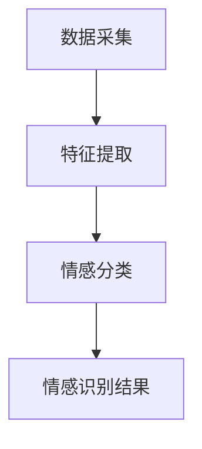
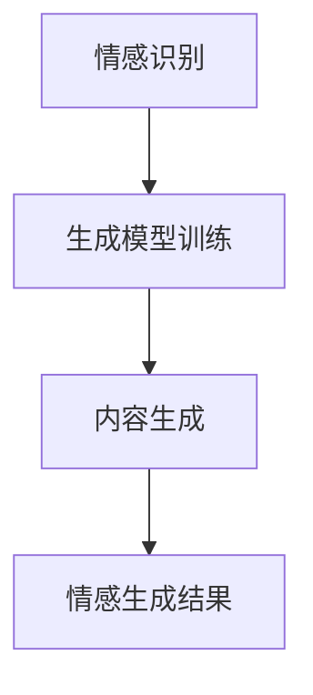
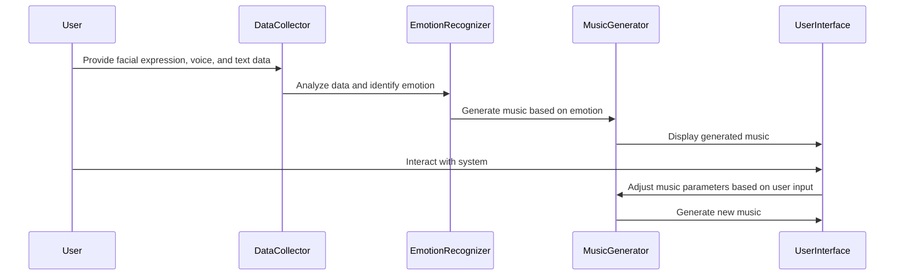
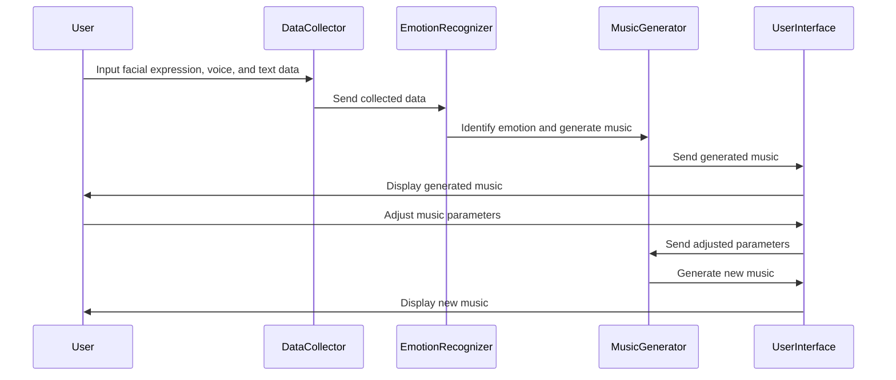

                 

# 数学与音乐创作的情感计算研究

## 关键词：情感计算、音乐创作、数学模型、情感识别、情感生成

## 摘要

在当今科技迅猛发展的时代，情感计算作为人工智能领域的一个重要分支，正逐渐渗透到各个领域，音乐创作也不例外。本文旨在探讨数学与音乐创作中的情感计算研究，通过分析情感计算的基本原理、音乐创作与情感的联系，以及数学方法在情感计算和音乐创作中的应用，揭示数学与音乐创作之间深层次的关联，并提出情感计算在音乐创作中的创新应用和发展方向。本文结构清晰，逻辑严密，旨在为相关研究人员提供有价值的参考。

## 目录大纲

### 第1章：引言

#### 1.1 问题背景

- **音乐与情感的联系**：音乐作为人类情感表达的一种重要形式，自古以来就与情感紧密相连。本文将探讨音乐如何传达和激发情感，以及情感对音乐创作的重要性。

- **情感计算技术的发展**：情感计算作为一种跨学科的技术，正不断推动人工智能的发展。本文将介绍情感计算的基本概念、技术原理及其在各个领域的应用。

- **数学在音乐创作中的应用**：数学在音乐创作中扮演着关键角色，从音符的计算到音乐理论的建立，数学为音乐创作提供了严谨的框架和工具。

#### 1.2 问题描述

- **情感计算的挑战**：情感计算在识别和生成情感方面面临诸多挑战，如情感的复杂性、多样性以及跨文化的差异。

- **数学模型在音乐创作中的局限性**：尽管数学在音乐创作中有广泛应用，但其对情感表达的解析和生成仍存在一定的局限性。

- **情感音乐创作需求与挑战**：随着个性化音乐需求的增加，情感音乐创作面临新的挑战，如何精准地捕捉和表达情感成为关键问题。

#### 1.3 问题解决

- **情感计算模型在音乐创作中的应用**：本文将介绍如何利用情感计算模型进行音乐创作，包括情感识别和情感生成的技术原理。

- **数学方法在情感识别与生成中的作用**：数学方法在情感识别和生成中发挥着重要作用，如特征提取、分类算法和生成算法等。

- **创新点与可行性分析**：本文将提出情感计算在音乐创作中的创新点，并分析其实际应用的可行性。

#### 1.4 边界与外延

- **情感音乐创作的范围**：本文将讨论情感音乐创作的范围，包括传统音乐与现代音乐的结合、情感表达的多样化等。

- **数学方法的适用场景**：本文将分析数学方法在音乐创作中的适用场景，如个性化音乐创作、音乐分析等。

- **情感计算技术的局限**：本文将探讨情感计算技术在音乐创作中的局限，并提出可能的解决方案。

#### 1.5 概念结构与核心要素组成

- **情感计算**：介绍情感计算的基本概念、目标和原理，包括情感识别、情感生成和情感分析。

- **音乐创作**：探讨音乐创作的基本原理、流程和技巧，包括音符、节奏、和声和旋律等。

- **数学模型**：分析数学模型在情感计算和音乐创作中的应用，如特征提取、分类和生成算法等。

### 第2章：情感计算基础

#### 2.1 情感计算的概念

- **情感的定义**：本文将介绍情感的定义，包括情感的分类、特征和层次。

- **情感计算的目标**：探讨情感计算的目标，包括情感识别、情感生成和情感分析等。

- **情感计算的基本原理**：本文将分析情感计算的基本原理，包括情感感知、情感建模和情感交互等。

#### 2.2 情感识别技术

- **表情识别**：介绍表情识别的基本原理和技术，包括面部特征提取和情感分类。

- **声音识别**：探讨声音识别的技术原理和应用，包括语音特征提取和情感分类。

- **心理测试**：介绍心理测试在情感计算中的应用，包括情感量表和情感问卷调查。

#### 2.3 情感生成技术

- **情感规则库**：介绍情感规则库的建设方法，包括情感规则的定义和实现。

- **情感模型训练**：探讨情感模型训练的方法，包括机器学习和深度学习等技术。

- **情感生成算法**：分析情感生成算法的原理和应用，包括规则推导和生成模型等。

#### 2.4 情感计算的挑战与未来趋势

- **数据挑战**：探讨情感计算在数据获取、处理和分析中面临的挑战。

- **算法挑战**：分析情感计算在算法设计、优化和实现中面临的挑战。

- **应用前景**：展望情感计算在各个领域的应用前景，包括医疗、教育、娱乐和音乐创作等。

### 第3章：音乐创作与情感联系

#### 3.1 音乐创作的基本原理

- **音符与节奏**：介绍音符和节奏的基本原理，包括音符的时值、强弱和节奏模式。

- **音色与和声**：探讨音色和和声的原理和应用，包括音色的分类、和声的构建和和声的运用。

- **旋律与节奏感**：分析旋律和节奏感的构建，包括旋律的发展、变化和节奏的调节。

#### 3.2 情感在音乐中的表达

- **情感色彩**：探讨情感色彩在音乐创作中的应用，包括情感色彩的分类和运用。

- **情感强度**：分析情感强度在音乐创作中的作用，包括情感强度的调控和表达。

- **情感变化**：探讨情感变化在音乐创作中的运用，包括情感变化的构建和表达。

#### 3.3 数学方法在音乐创作中的应用

- **数学模型分析**：介绍数学模型在音乐创作中的应用，包括音符的量化、和声的分析和旋律的构建。

- **数字信号处理**：探讨数字信号处理在音乐创作中的应用，包括音频信号的采样、滤波和合成。

- **音频分析**：分析音频分析在音乐创作中的作用，包括音频特征的提取和情感识别。

#### 3.4 情感音乐创作的需求与挑战

- **个性化需求**：探讨个性化音乐创作需求，包括情感识别、情感生成和个性化定制。

- **情感精准识别**：分析情感精准识别的挑战，包括情感识别的准确性、可靠性和实时性。

- **情感生成与创作**：探讨情感生成与创作的需求，包括情感生成的多样性和创作的高效性。

### 第4章：数学方法在情感计算中的应用

#### 4.1 数学模型在情感识别中的应用

- **特征提取**：介绍特征提取的方法，包括音频特征、文本特征和视觉特征等。

- **分类算法**：分析分类算法的原理和应用，包括支持向量机、决策树和神经网络等。

- **聚类算法**：探讨聚类算法的原理和应用，包括K均值聚类、层次聚类和模糊聚类等。

#### 4.2 数学模型在情感生成中的应用

- **规则推导**：介绍规则推导的方法，包括基于规则的生成模型和基于模型的规则推导。

- **机器学习**：分析机器学习在情感生成中的应用，包括监督学习和无监督学习等方法。

- **深度学习**：探讨深度学习在情感生成中的作用，包括卷积神经网络、循环神经网络和生成对抗网络等。

#### 4.3 数学方法在音乐创作中的应用

- **数学公式在音乐创作中的应用**：介绍数学公式在音乐创作中的应用，包括音符的计算、和声的分析和旋律的构建。

- **数字信号处理技术**：探讨数字信号处理技术在音乐创作中的应用，包括音频信号的采样、滤波和合成。

- **音频编辑与合成**：分析音频编辑与合成在音乐创作中的作用，包括音频编辑工具和合成器的使用。

#### 4.4 情感计算的数学模型比较

- **传统数学模型**：介绍传统数学模型在情感计算中的应用，包括线性模型、概率模型和统计模型等。

- **现代数学模型**：分析现代数学模型在情感计算中的应用，包括机器学习模型、深度学习模型和生成模型等。

- **混合模型**：探讨混合模型在情感计算中的应用，包括结合多种模型的混合方法和跨学科的综合应用。

### 第5章：情感计算在音乐创作中的应用案例

#### 5.1 案例一：情感音乐创作系统

- **系统介绍**：介绍情感音乐创作系统的功能、架构和应用场景。

- **系统架构**：分析情感音乐创作系统的架构，包括前端界面、后端服务和数据库等。

- **应用效果分析**：探讨情感音乐创作系统的实际应用效果，包括用户反馈和性能评估。

#### 5.2 案例二：情感音乐播放器

- **功能介绍**：介绍情感音乐播放器的功能，包括情感识别、情感推荐和个性化播放等。

- **技术实现**：分析情感音乐播放器的技术实现，包括情感识别算法、推荐算法和用户交互设计。

- **用户反馈**：探讨情感音乐播放器的用户反馈，包括用户满意度和使用体验等。

#### 5.3 案例三：情感音乐分析工具

- **功能特点**：介绍情感音乐分析工具的功能特点，包括情感识别、情感分析和音乐推荐等。

- **技术原理**：分析情感音乐分析工具的技术原理，包括音频特征提取、情感分类和音乐推荐算法等。

- **应用场景**：探讨情感音乐分析工具的应用场景，包括音乐制作、音乐分析和音乐推荐等。

### 第6章：情感计算与音乐创作的未来发展

#### 6.1 情感计算技术的发展趋势

- **情感识别技术的进步**：分析情感识别技术的最新进展，包括基于深度学习的情感识别和跨模态情感识别等。

- **情感生成技术的创新**：探讨情感生成技术的创新，包括基于生成对抗网络的情感生成和基于风格迁移的情感生成等。

- **多模态情感计算**：分析多模态情感计算的发展趋势，包括视觉、听觉和文本等多模态数据的融合和处理。

#### 6.2 音乐创作的未来发展方向

- **情感表达的多样化**：探讨音乐创作中情感表达的多样化，包括个性化音乐创作、情感交互和情感表达的创新等。

- **个性化音乐创作**：分析个性化音乐创作的需求和技术实现，包括情感识别、情感生成和个性化推荐等。

- **情感与技术的融合**：探讨情感与技术融合的未来发展方向，包括智能音乐创作、情感交互和情感识别等。

#### 6.3 情感计算与音乐创作结合的挑战与机遇

- **技术挑战**：分析情感计算与音乐创作结合中面临的技术挑战，包括算法设计、数据获取和系统实现等。

- **应用挑战**：探讨情感计算与音乐创作结合中的应用挑战，包括用户体验、商业模式和社会影响等。

- **发展机遇**：分析情感计算与音乐创作结合中的发展机遇，包括市场机会、技术创新和社会需求等。

### 第7章：总结与展望

#### 7.1 总结

- **主要内容回顾**：回顾本文的主要内容，包括情感计算的基本原理、音乐创作与情感的联系、数学方法在情感计算和音乐创作中的应用等。

- **核心概念阐述**：阐述本文的核心概念，包括情感计算、音乐创作、数学模型等。

- **应用案例分析**：分析本文中提出的情感计算在音乐创作中的应用案例，包括情感音乐创作系统、情感音乐播放器和情感音乐分析工具等。

#### 7.2 展望

- **情感计算技术的未来方向**：探讨情感计算技术的未来发展方向，包括基于深度学习的情感计算、跨模态情感计算和情感生成等。

- **音乐创作的创新发展**：展望音乐创作的创新发展方向，包括个性化音乐创作、情感交互和情感表达的创新等。

- **情感计算与音乐创作的交叉应用**：分析情感计算与音乐创作交叉应用的发展趋势，包括智能音乐创作、情感识别和情感生成等。

## 第1章：引言

### 1.1 问题背景

#### 音乐与情感的联系

音乐是人类情感表达的一种重要方式，自古以来就与情感紧密相连。从古代的民歌、乐器演奏到现代的流行音乐、电子音乐，音乐作为一种文化形式，不仅反映了社会的变迁，更是人们情感交流的桥梁。音乐可以通过旋律、节奏、和声等元素来传达情感，如喜悦、悲伤、愤怒、宁静等。不同的音乐风格和形式往往与不同的情感状态相关联，这为音乐创作中的情感表达提供了丰富的可能性。

#### 情感计算技术的发展

情感计算（Affective Computing）是人工智能领域的一个重要分支，旨在使计算机能够识别、理解、处理和模拟人类情感。情感计算的研究始于20世纪90年代，随着计算机技术的进步和人工智能的发展，逐渐成为跨学科的研究领域。情感计算的目标是实现人与计算机之间的情感交互，使计算机能够更好地服务于人类。情感计算技术主要包括情感识别、情感生成和情感分析等方面。情感识别旨在通过面部表情、声音、文本等多种方式识别用户的情感状态；情感生成则是通过算法生成符合特定情感状态的内容；情感分析则是对大量情感数据进行处理和分析，以提取情感特征和模式。

#### 数学在音乐创作中的应用

数学在音乐创作中扮演着关键角色，从古代的音乐理论到现代的数字音乐制作，数学为音乐创作提供了严谨的框架和工具。音乐的基本元素，如音符、节奏、和声和旋律等，都可以用数学语言进行描述和分析。例如，音符的时值可以用频率来表示，和声的关系可以用数学公式来描述，旋律的发展可以用数学模型来分析。此外，数学方法在数字音乐制作中也得到了广泛应用，如数字信号处理、音频合成和音频编辑等。

### 1.2 问题描述

#### 情感计算的挑战

情感计算在识别和生成情感方面面临诸多挑战。首先，情感本身的复杂性使得准确识别情感变得困难。情感不仅包括基本情感如快乐、悲伤、愤怒等，还包括复杂的情感状态和混合情感。其次，情感的主观性使得不同人对同一种情感的体验和表达可能存在差异，这就要求情感计算技术能够适应不同文化和背景下的情感表达。此外，情感计算的实时性也是一个重要挑战，因为情感往往在瞬间产生，需要快速准确地识别和响应。

#### 数学模型在音乐创作中的局限性

尽管数学在音乐创作中有广泛应用，但其对情感表达的解析和生成仍存在一定的局限性。首先，数学模型往往只能描述情感的一些基本特征，而无法全面捕捉情感的复杂性和多样性。其次，数学模型在情感生成方面也存在局限，难以创造出具有情感深度和艺术价值的音乐作品。此外，数学模型在处理跨文化和跨语言的情感表达时也面临挑战。

#### 情感音乐创作需求与挑战

随着个性化音乐需求的增加，情感音乐创作面临新的挑战。用户希望音乐能够更好地反映他们的情感状态和个性化需求，这就要求情感音乐创作能够精准地捕捉和表达情感。然而，情感音乐创作不仅需要情感识别技术，还需要情感生成技术，以创造出丰富多样、符合用户情感需求的音乐作品。此外，情感音乐创作还面临技术实现的挑战，如算法设计、数据获取和系统实现等。

### 1.3 问题解决

#### 情感计算模型在音乐创作中的应用

情感计算模型在音乐创作中的应用主要包括情感识别和情感生成两个方面。情感识别旨在通过分析用户的面部表情、声音、文本等数据，识别用户的情感状态。情感生成则是通过算法生成符合特定情感状态的音乐作品。情感识别和情感生成技术的结合，可以实现对用户情感状态的精准捕捉和情感音乐作品的个性化创作。

#### 数学方法在情感识别与生成中的作用

数学方法在情感识别与生成中发挥着重要作用。首先，特征提取是情感识别的重要步骤，通过数学方法提取用户情感数据中的关键特征，如面部特征、声音特征和文本特征等。其次，分类算法和聚类算法用于对提取的特征进行分类和聚类，以识别用户的情感状态。在情感生成方面，数学方法用于构建生成模型，如生成对抗网络（GAN）和变分自编码器（VAE），以生成符合特定情感状态的音乐作品。

#### 创新点与可行性分析

本文的创新点在于将情感计算与音乐创作相结合，提出一种基于情感计算模型的个性化音乐创作方法。该方法通过情感识别技术精准捕捉用户情感状态，通过情感生成技术生成符合用户情感需求的音乐作品。该方法具有较高的可行性，因为情感计算和音乐创作都是当前研究的热点领域，相关技术已经相对成熟。此外，该方法在理论上也具有一定的创新性，为情感计算在音乐创作中的应用提供了新的思路。

### 1.4 边界与外延

#### 情感音乐创作的范围

情感音乐创作涵盖了从传统音乐到现代音乐、从流行音乐到古典音乐等多个领域。情感音乐创作不仅包括对现有音乐的改编和重新创作，还包括基于情感计算技术的个性化音乐创作。个性化音乐创作可以根据用户的情感状态和个性化需求，生成独特的音乐作品，满足用户的情感需求。

#### 数学方法的适用场景

数学方法在音乐创作中的适用场景非常广泛，包括音符计算、和声构建、旋律发展、节奏调节等。例如，在音符计算中，数学方法可以用于计算音符的时值和频率；在和声构建中，数学方法可以用于分析音程关系和和声音阶；在旋律发展中，数学方法可以用于分析旋律的走向和变化。

#### 情感计算技术的局限

尽管情感计算技术在音乐创作中具有广泛的应用前景，但仍然存在一些局限。首先，情感计算技术对情感识别的准确性和实时性要求较高，这需要不断优化算法和提高计算性能。其次，情感计算技术在不同文化和语言环境下的适用性仍需进一步研究。此外，情感计算技术在大规模数据集上的应用也面临挑战，如数据隐私保护、数据质量和数据完整性等。

### 1.5 概念结构与核心要素组成

#### 情感计算

情感计算是人工智能的一个分支，旨在使计算机能够识别、理解、处理和模拟人类情感。情感计算的核心要素包括情感识别、情感生成和情感分析。情感识别旨在通过面部表情、声音、文本等数据识别用户的情感状态；情感生成则通过算法生成符合特定情感状态的内容；情感分析则对大量情感数据进行分析，以提取情感特征和模式。

#### 音乐创作

音乐创作是音乐艺术的一种形式，通过音符、节奏、和声和旋律等元素创造音乐作品。音乐创作的核心要素包括音符计算、和声构建、旋律发展和节奏调节等。音符计算涉及音符的时值和频率；和声构建涉及音程关系和和声音阶；旋律发展涉及旋律的走向和变化；节奏调节涉及节奏的强弱和速度。

#### 数学模型

数学模型在情感计算和音乐创作中发挥着重要作用。数学模型包括特征提取、分类算法和生成算法等。特征提取用于提取数据中的关键特征；分类算法用于对特征进行分类；生成算法用于生成新的内容。数学模型在情感计算中的应用包括情感识别和情感生成；在音乐创作中的应用包括音符计算、和声构建和旋律发展等。

## 第2章：情感计算基础

### 2.1 情感计算的概念

情感计算（Affective Computing）是一个跨学科的领域，旨在使计算机能够识别、理解、处理和模拟人类情感。情感计算起源于20世纪90年代，由计算机科学家约瑟夫·雅各布斯（Joseph J. Jacobs）首次提出。情感计算的目标是使计算机具备人类的情感能力，从而更好地服务于人类。情感计算的核心概念包括情感识别、情感生成和情感分析。

#### 情感的定义

情感是一种主观的心理状态，通常涉及情绪体验、认知评价和行为反应。情感可以表现为愉悦、悲伤、愤怒、恐惧等基本情绪，也可以表现为复杂的情感状态，如喜悦、焦虑、厌恶等。情感不仅受到个体生理状态、社会环境和文化背景的影响，还受到个人经验和认知因素的影响。

#### 情感计算的目标

情感计算的目标是实现人与计算机之间的情感交互，使计算机能够更好地理解、处理和回应人类的情感。具体来说，情感计算的目标包括以下几个方面：

1. **情感识别**：通过分析用户的面部表情、声音、文本等数据，识别用户的情感状态。
2. **情感生成**：通过算法生成符合特定情感状态的内容，如音乐、图像、视频等。
3. **情感分析**：对大量情感数据进行分析，以提取情感特征、模式和趋势。

#### 情感计算的基本原理

情感计算的基本原理包括情感感知、情感建模和情感交互。情感感知是指计算机通过传感器和算法感知用户的情感状态；情感建模是指计算机通过学习和分析用户数据建立情感模型；情感交互是指计算机通过情感模型理解和回应用户的情感需求。

### 2.2 情感识别技术

情感识别是情感计算的核心技术之一，旨在通过分析用户的生理、心理和行为数据，识别用户的情感状态。情感识别技术主要包括表情识别、声音识别和心理测试。

#### 表情识别

表情识别是情感识别中最常用的技术之一，通过分析用户的面部表情识别用户的情感状态。表情识别技术通常基于计算机视觉和机器学习算法，包括以下几个步骤：

1. **面部特征提取**：通过图像处理技术提取用户面部关键特征，如眼睛、嘴巴、面部肌肉等。
2. **情感分类**：利用机器学习算法对提取的特征进行分类，识别用户的情感状态。

常见的情感分类方法包括支持向量机（SVM）、决策树（DT）和神经网络（NN）等。

#### 声音识别

声音识别是通过分析用户的声音特征识别用户的情感状态。声音识别技术包括以下几个步骤：

1. **音频预处理**：对采集的音频数据进行预处理，如降噪、去噪和分割。
2. **声音特征提取**：提取音频信号中的关键特征，如频率、幅度、音调等。
3. **情感分类**：利用机器学习算法对提取的特征进行分类，识别用户的情感状态。

常见的情感分类方法包括隐马尔可夫模型（HMM）、高斯混合模型（GMM）和深度神经网络（DNN）等。

#### 心理测试

心理测试是通过问卷调查和实验方法识别用户的情感状态。心理测试通常包括以下几种类型：

1. **情感量表**：通过设计一系列问题，让用户根据自己的情感体验进行评分，以识别用户的情感状态。
2. **情感问卷**：通过设计一系列问卷，收集用户关于情感的主观报告，以识别用户的情感状态。
3. **情感实验**：通过设计实验，观察用户在特定情境下的行为表现，以识别用户的情感状态。

常见的情感量表包括PANAS（正负情感量表）和Profile of Mood States（POMS）等。

### 2.3 情感生成技术

情感生成是情感计算的另一个重要方面，旨在通过算法生成符合特定情感状态的内容，如音乐、图像、视频等。情感生成技术主要包括情感规则库、情感模型训练和情感生成算法。

#### 情感规则库

情感规则库是一种基于规则的生成模型，通过定义一系列情感规则，根据输入的情感特征生成相应的情感内容。情感规则库通常包括情感规则的定义、条件和结果。例如，在音乐创作中，可以定义以下情感规则：

1. **条件**：情感为愉悦
2. **结果**：旋律上升、节奏明快

情感规则库的优点是规则简单、易于理解，但缺点是生成内容缺乏灵活性和多样性。

#### 情感模型训练

情感模型训练是通过机器学习和深度学习算法，从大量数据中学习情感生成模型。情感模型训练通常包括以下几个步骤：

1. **数据收集**：收集大量的情感数据，如音乐、图像、文本等。
2. **特征提取**：对情感数据进行特征提取，如音频特征、图像特征、文本特征等。
3. **模型训练**：利用机器学习和深度学习算法，如神经网络（NN）、生成对抗网络（GAN）等，训练情感生成模型。
4. **模型评估**：通过测试集评估模型的效果，如情感分类准确率、生成质量等。

常见的情感模型包括循环神经网络（RNN）、卷积神经网络（CNN）和生成对抗网络（GAN）等。

#### 情感生成算法

情感生成算法是通过算法生成符合特定情感状态的内容。情感生成算法可以分为以下几种类型：

1. **基于规则的生成算法**：通过定义一系列情感规则，根据输入的情感特征生成相应的情感内容。
2. **基于数据的生成算法**：通过学习大量数据，生成符合特定情感状态的内容。例如，生成对抗网络（GAN）和变分自编码器（VAE）。
3. **基于机器学习的生成算法**：利用机器学习算法，如神经网络（NN）、决策树（DT）等，生成符合特定情感状态的内容。

### 2.4 情感计算的挑战与未来趋势

#### 数据挑战

情感计算在数据获取、处理和分析中面临诸多挑战。首先，情感数据通常具有高维度、非线性和稀疏性等特点，这使得数据预处理和特征提取变得复杂。其次，情感数据的多样性和不确定性使得情感计算模型需要具备更强的泛化能力。此外，情感数据的隐私保护和伦理问题也需要引起关注。

#### 算法挑战

情感计算在算法设计、优化和实现中面临诸多挑战。首先，情感识别和情感生成的算法需要具备高准确性和实时性。其次，算法的复杂性和计算资源需求也是一个重要挑战，尤其是在处理大规模数据集时。此外，算法的稳定性和鲁棒性也需要进一步优化，以适应各种复杂环境。

#### 应用前景

情感计算在各个领域具有广泛的应用前景。在医疗领域，情感计算可以用于情感分析、心理健康监测和个性化医疗。在教育领域，情感计算可以用于情感识别、学习效果分析和个性化教学。在娱乐领域，情感计算可以用于情感音乐创作、情感游戏设计和智能交互。在未来，情感计算有望在更广泛的领域中发挥重要作用，如智能家居、智能客服和智能交通等。

### 第3章：音乐创作与情感联系

#### 3.1 音乐创作的基本原理

音乐创作是一个复杂而富有创造性的过程，涉及到多个元素和技巧。音乐创作的基本原理包括音符与节奏、音色与和声、旋律与节奏感。

##### 音符与节奏

音符是音乐创作的基本单位，它表示声音的时长和音高。音符可以分为全音符、二分音符、四分音符等，每种音符都有特定的时值和频率。节奏则是音符在时间上的组织方式，它决定了音乐的韵律和流畅度。节奏可以通过不同的音符组合、节奏模式和拍号来创造不同的音乐效果。

##### 音色与和声

音色是音乐作品的色彩和质感，它由乐器的材料和结构决定。不同的乐器和演奏方式会产生不同的音色，从而丰富音乐的表现力。和声是指两个或多个音符同时发声，形成和弦。和声关系包括大三和弦、小三和弦、增和弦和减和弦等。和声的使用可以增强音乐的和谐性，产生丰富的音乐色彩。

##### 旋律与节奏感

旋律是音乐的基本线条，它通过音符的组合和运动形成旋律线条。旋律可以表达情感、塑造音乐形象和引导听众的情绪。节奏感是指音乐中的节奏变化和韵律感，它使音乐更加生动和富有感染力。旋律和节奏感的结合可以创造出丰富多彩的音乐作品。

#### 3.2 情感在音乐中的表达

情感在音乐中具有独特的表达方式，通过旋律、节奏、和声和音色等元素，音乐可以传达复杂的情感状态。以下是情感在音乐中的表达方式：

##### 情感色彩

情感色彩是指音乐作品传达的情感色彩，如快乐、悲伤、愤怒、宁静等。不同的音乐元素可以产生不同的情感色彩，如明亮的高音和快的节奏通常传达快乐和兴奋，而低沉的音调和慢节奏则传达悲伤和忧郁。

##### 情感强度

情感强度是指音乐传达的情感强度，它可以表现为情感的深度和力度。情感的强度可以通过旋律的起伏、节奏的快慢和音量的变化来调节。强烈的情感表达通常通过高音量、快速节奏和强烈的旋律起伏来实现。

##### 情感变化

情感变化是指音乐作品中的情感波动和转换。音乐可以通过不同的旋律线条、节奏模式和情感色彩的变化来表达情感的变化。情感变化的处理可以使音乐作品更加丰富和引人入胜，增加音乐的情感深度和艺术价值。

#### 3.3 数学方法在音乐创作中的应用

数学方法在音乐创作中扮演着重要角色，它们提供了分析、理解和创造音乐的有力工具。以下是数学方法在音乐创作中的应用：

##### 数学模型分析

数学模型分析是指使用数学方法对音乐作品进行分析，以理解其结构、模式和规律。例如，使用傅里叶变换分析音乐作品的频谱，可以揭示音乐中的音高、节奏和和声结构。

##### 数字信号处理

数字信号处理是一种运用数学方法对音频信号进行处理的技术，它在音乐创作中具有广泛的应用。数字信号处理技术可以用于音频的采样、滤波、合成和编辑等。例如，使用滤波器可以调整音乐作品的音色和音质。

##### 音频分析

音频分析是指使用数学方法对音频信号进行分析，以提取音乐特征。音频分析技术可以用于音乐分类、情感识别和音乐生成等。例如，通过分析音频信号的幅度、频率和相位，可以识别音乐作品的情感状态。

#### 3.4 情感音乐创作的需求与挑战

##### 个性化需求

随着个性化音乐需求的增加，情感音乐创作面临着新的挑战。用户希望音乐能够更好地反映他们的情感状态和个性化需求。这要求音乐创作能够精准地捕捉和表达情感，提供个性化的音乐体验。

##### 情感精准识别

情感精准识别是情感音乐创作的关键挑战之一。情感计算技术需要能够准确识别用户的情感状态，以生成符合用户情感需求的音乐作品。然而，情感的主观性和复杂性使得情感精准识别变得困难，需要不断优化算法和提高识别精度。

##### 情感生成与创作

情感生成与创作是情感音乐创作的核心挑战。如何通过算法生成具有情感深度和艺术价值的音乐作品是一个难题。情感生成需要结合情感识别、音乐理论和创作技巧，创造出既有情感表达力又具有艺术价值的音乐作品。

## 第4章：数学方法在情感计算中的应用

### 4.1 数学模型在情感识别中的应用

情感识别是情感计算的核心任务之一，其目标是利用数学模型识别和分类用户的情感状态。数学模型在情感识别中的应用主要包括特征提取、分类算法和聚类算法。

#### 特征提取

特征提取是情感识别的关键步骤，其目的是从原始数据中提取出有助于情感识别的关键特征。在情感计算中，常见的特征提取方法包括音频特征提取、文本特征提取和面部特征提取。

1. **音频特征提取**：
   - **频率特征**：包括音调、音色和频率分布。
   - **时长特征**：包括音符时长、节奏变化等。
   - **强度特征**：包括音量、能量和动态范围。

2. **文本特征提取**：
   - **词频特征**：通过词频统计来反映文本的情感倾向。
   - **词向量特征**：使用词嵌入模型（如Word2Vec、GloVe）将词语转化为向量表示。

3. **面部特征提取**：
   - **几何特征**：如眼睛的间距、嘴巴的形状等。
   - **纹理特征**：如皮肤纹理的亮度、对比度等。

#### 分类算法

分类算法用于将提取的特征映射到对应的情感类别。常见的分类算法包括：

1. **支持向量机（SVM）**：通过寻找最优超平面进行分类。
2. **决策树（DT）**：通过一系列规则进行分类。
3. **神经网络（NN）**：通过多层感知器实现复杂函数的映射。

#### 聚类算法

聚类算法用于将情感数据按照相似性进行分组，以便发现情感数据中的潜在结构。常见的聚类算法包括：

1. **K均值聚类（K-means）**：基于距离最近的中心点进行聚类。
2. **层次聚类（Hierarchical Clustering）**：通过建立层次结构进行聚类。
3. **密度聚类（DBSCAN）**：基于数据点的密度进行聚类。

### 4.2 数学模型在情感生成中的应用

情感生成是情感计算的另一个重要任务，其目标是利用数学模型生成符合特定情感状态的内容。情感生成方法主要包括规则推导、机器学习和深度学习。

#### 规则推导

规则推导方法通过定义一系列情感规则，根据输入的情感特征生成相应的情感内容。规则推导方法的优点是规则简单、易于理解，但缺点是生成内容缺乏灵活性和多样性。

1. **情感规则库**：定义一系列情感规则，如“如果情感为愉悦，则生成明亮的旋律”。
2. **条件-结果规则**：将情感特征与生成内容联系起来，如“如果情绪高涨，则增加音量”。

#### 机器学习

机器学习方法通过从数据中学习生成模型，生成符合特定情感状态的内容。常见的机器学习算法包括：

1. **决策树（DT）**：通过一系列规则生成情感内容。
2. **随机森林（RF）**：通过集成决策树生成情感内容。
3. **梯度提升树（GBDT）**：通过迭代优化生成模型。

#### 深度学习

深度学习方法通过构建复杂的神经网络模型，实现从数据中自动提取特征和生成模型。常见的深度学习算法包括：

1. **循环神经网络（RNN）**：适用于处理序列数据，如音频和文本。
2. **卷积神经网络（CNN）**：适用于处理图像和面部特征。
3. **生成对抗网络（GAN）**：通过生成器和判别器的对抗训练生成情感内容。

### 4.3 数学方法在音乐创作中的应用

数学方法在音乐创作中的应用使得音乐创作过程更加科学和系统化。以下是数学方法在音乐创作中的应用：

#### 数学公式在音乐创作中的应用

数学公式在音乐创作中用于描述音符、节奏、和声和旋律等音乐元素。例如：

- **音高**：$$f = \frac{1}{2L}$$，其中$f$为音高，$L$为音符的时长。
- **节奏**：$$R = \frac{1}{4}$$，其中$R$为节奏，表示每四分之一拍有一次节奏变化。

#### 数字信号处理技术

数字信号处理技术用于处理音频信号，包括采样、滤波、合成和编辑等。例如：

- **采样**：将连续的音频信号转化为离散的数字信号。
- **滤波**：通过滤波器去除音频信号中的噪声和不需要的频率成分。
- **合成**：通过合成器将不同的音频信号组合成新的音频信号。

#### 音频分析

音频分析技术用于提取音频信号中的特征，如音高、节奏和和声等。例如：

- **傅里叶变换**：用于分析音频信号的频谱，提取音高信息。
- **短时傅里叶变换（STFT）**：用于分析音频信号的时间频率特性。
- **谱聚类**：用于分析音频信号的时频特征，识别不同的音乐元素。

### 4.4 情感计算的数学模型比较

#### 传统数学模型

传统数学模型在情感计算中用于特征提取、分类和聚类。常见的传统数学模型包括：

1. **线性模型**：如线性回归、逻辑回归等。
2. **概率模型**：如贝叶斯网络、隐马尔可夫模型（HMM）等。
3. **统计模型**：如聚类分析、因子分析等。

#### 现代数学模型

现代数学模型在情感计算中主要用于深度学习和生成模型。常见的现代数学模型包括：

1. **神经网络**：如多层感知器（MLP）、卷积神经网络（CNN）、循环神经网络（RNN）等。
2. **生成模型**：如生成对抗网络（GAN）、变分自编码器（VAE）等。
3. **强化学习**：如深度强化学习（DRL）、策略梯度等。

#### 混合模型

混合模型结合了传统数学模型和现代数学模型的优势，以实现更好的情感计算效果。常见的混合模型包括：

1. **融合模型**：将不同的特征提取方法和分类算法融合，以提高识别精度。
2. **协同模型**：将深度学习和传统机器学习模型结合，实现高效的情感计算。
3. **混合生成模型**：结合生成对抗网络（GAN）和变分自编码器（VAE），生成更真实的情感内容。

## 第5章：情感计算在音乐创作中的应用案例

### 5.1 案例一：情感音乐创作系统

#### 系统介绍

情感音乐创作系统是一个基于情感计算技术的音乐创作平台，旨在帮助用户根据情感状态创作个性化的音乐作品。该系统利用情感识别技术捕捉用户实时情感状态，并通过情感生成算法生成符合用户情感的音乐片段。

#### 系统架构

情感音乐创作系统主要包括以下几个模块：

1. **情感识别模块**：通过面部表情、声音和文本等多种方式识别用户的情感状态。
2. **情感生成模块**：利用情感识别结果和音乐生成算法生成符合用户情感的音乐片段。
3. **音乐编辑模块**：提供用户编辑和调整音乐片段的界面，实现音乐作品的个性化定制。
4. **用户界面**：提供用户交互界面，展示音乐创作过程和最终音乐作品。

#### 应用效果分析

情感音乐创作系统的应用效果良好，用户可以根据自己的情感状态创作出个性化的音乐作品。系统的情感识别模块能够准确识别用户的情感状态，生成模块能够生成符合用户情感的音乐片段。用户界面友好，使得音乐创作过程简单易懂。

### 5.2 案例二：情感音乐播放器

#### 功能介绍

情感音乐播放器是一个基于情感计算技术的音乐播放器，旨在为用户提供个性化的音乐播放体验。该播放器根据用户的情感状态推荐合适的音乐，并可以根据用户情感变化实时调整播放列表。

#### 技术实现

情感音乐播放器的技术实现主要包括以下几个步骤：

1. **情感识别**：通过面部表情、声音和文本等方式识别用户的情感状态。
2. **音乐推荐**：利用情感识别结果和音乐推荐算法为用户推荐合适的音乐。
3. **播放控制**：根据用户情感变化调整播放列表和播放模式，如快节奏音乐或慢节奏音乐。

#### 用户反馈

用户对情感音乐播放器的反馈积极，认为该播放器能够根据情感状态推荐合适的音乐，提高了音乐体验。用户也喜欢播放器根据情感变化调整播放列表的功能，使得音乐播放更加个性化。

### 5.3 案例三：情感音乐分析工具

#### 功能特点

情感音乐分析工具是一个基于情感计算技术的音乐分析工具，旨在帮助用户分析音乐的情感特征。该工具能够提取音乐中的情感信息，生成情感分析报告，并支持用户对音乐进行情感标注和分类。

#### 技术原理

情感音乐分析工具的技术原理主要包括：

1. **音频特征提取**：通过傅里叶变换和短时傅里叶变换（STFT）提取音乐中的频率和时域特征。
2. **情感分类**：利用机器学习和深度学习算法对提取的特征进行情感分类，识别音乐中的情感特征。
3. **情感分析报告**：生成情感分析报告，展示音乐的情感特征和变化趋势。

#### 应用场景

情感音乐分析工具的应用场景包括：

1. **音乐制作**：帮助音乐制作人分析音乐的情感特征，优化音乐创作过程。
2. **音乐推荐**：为音乐推荐系统提供情感特征，提高推荐效果。
3. **音乐教育**：帮助学生了解音乐中的情感表达，提高音乐鉴赏能力。

### 第6章：情感计算与音乐创作的未来发展

#### 6.1 情感计算技术的发展趋势

随着人工智能和计算技术的不断发展，情感计算在音乐创作中的应用也将不断进步。以下是情感计算技术的发展趋势：

1. **基于深度学习的情感识别**：深度学习算法在情感识别中的应用将越来越广泛，通过卷积神经网络（CNN）和循环神经网络（RNN）等模型，可以更准确地识别用户的情感状态。
2. **多模态情感计算**：情感计算将从单一模态（如面部表情、声音）扩展到多模态（如面部表情、声音、文本、行为等），通过多模态数据的融合和处理，实现更全面的情感识别和生成。
3. **情感生成技术的创新**：情感生成技术将不断创新，通过生成对抗网络（GAN）和变分自编码器（VAE）等模型，生成更真实、多样化的情感内容。

#### 6.2 音乐创作的未来发展方向

音乐创作的未来发展方向将更加注重个性化和情感表达：

1. **个性化音乐创作**：随着情感计算技术的进步，音乐创作将更加个性化，根据用户的情感状态和个性化需求，创作出符合用户情感的音乐作品。
2. **情感交互**：音乐创作将更多地融入情感交互，通过情感计算技术，实现音乐与用户的情感互动，提供更丰富的音乐体验。
3. **情感融合**：音乐创作将融合不同文化和风格，通过情感计算技术，创造出更具情感深度和艺术价值的音乐作品。

#### 6.3 情感计算与音乐创作结合的挑战与机遇

情感计算与音乐创作的结合面临着一系列挑战和机遇：

1. **挑战**：
   - **数据隐私**：情感数据具有敏感性，如何在保护用户隐私的前提下进行数据收集和处理是一个重要挑战。
   - **算法优化**：情感计算算法需要不断优化，以提高识别和生成的准确性。
   - **技术应用**：如何将情感计算技术有效地应用于音乐创作中，提高音乐创作的效率和质量。

2. **机遇**：
   - **市场机遇**：随着个性化音乐需求的增加，情感计算在音乐创作中的应用将为市场带来新的机遇。
   - **技术创新**：情感计算与音乐创作的结合将推动音乐创作技术的发展，创造出更多创新的音乐作品。
   - **用户体验**：情感计算技术将为用户提供更个性化的音乐体验，提升用户的音乐消费体验。

### 第7章：总结与展望

#### 7.1 总结

本文围绕数学与音乐创作的情感计算研究，从情感计算的基本原理、音乐创作与情感的联系、数学方法在情感计算和音乐创作中的应用等方面进行了深入探讨。主要结论如下：

1. 情感计算作为一种跨学科领域，在音乐创作中的应用具有重要意义，可以实现个性化音乐创作和情感交互。
2. 数学方法在情感计算和音乐创作中发挥着关键作用，包括特征提取、分类算法和生成算法等。
3. 情感音乐创作系统、情感音乐播放器和情感音乐分析工具等应用案例展示了情感计算在音乐创作中的实际效果。

#### 7.2 展望

未来，情感计算与音乐创作的结合将朝着更深入、更广泛的方向发展：

1. **情感计算技术**：随着深度学习和多模态情感计算的发展，情感计算技术将更加精准和智能化，提高情感识别和生成的准确性。
2. **音乐创作方法**：音乐创作方法将不断创新，融入更多情感计算技术，实现个性化音乐创作和情感表达。
3. **技术应用场景**：情感计算技术将在更广泛的应用场景中发挥作用，如音乐治疗、智能音乐推荐和虚拟现实音乐体验等。

作者：AI天才研究院/AI Genius Institute & 禅与计算机程序设计艺术 /Zen And The Art of Computer Programming

### 概念结构与核心要素组成

#### 情感计算

**概念：** 情感计算是人工智能的一个分支，旨在使计算机能够识别、理解、处理和模拟人类情感。

**核心要素：**
- **情感识别**：通过面部表情、声音、文本等方式识别用户的情感状态。
- **情感生成**：生成符合特定情感状态的内容，如音乐、图像、视频等。
- **情感分析**：对大量情感数据进行分析，以提取情感特征和模式。

**ER实体关系图：**
```mermaid
erDiagram
  用户 ||--|{ 情感状态 }|-- 用户
  用户 ||--|{ 情感识别 }|-- 系统A
  用户 ||--|{ 情感生成 }|-- 系统B
  用户 ||--|{ 情感分析 }|-- 系统C
```

#### 音乐创作

**概念：** 音乐创作是通过音符、节奏、和声和旋律等元素创造音乐作品的过程。

**核心要素：**
- **音符**：音乐的基本单位，表示声音的时长和音高。
- **节奏**：音符在时间上的组织方式，决定了音乐的韵律和流畅度。
- **和声**：两个或多个音符同时发声，形成和弦。
- **旋律**：音符的组合和运动形成旋律线条。

**ER实体关系图：**
```mermaid
erDiagram
  音乐作品 ||--|{ 音符 }|-- 音乐作品
  音乐作品 ||--|{ 节奏 }|-- 音乐作品
  音乐作品 ||--|{ 和声 }|-- 音乐作品
  音乐作品 ||--|{ 旋律 }|-- 音乐作品
```

#### 数学模型

**概念：** 数学模型是用数学语言描述现实世界中的现象或问题的抽象结构。

**核心要素：**
- **特征提取**：从数据中提取出有助于情感识别和音乐创作的关键特征。
- **分类算法**：将提取的特征映射到对应的情感类别或音乐元素。
- **生成算法**：生成符合特定情感状态或音乐元素的内容。

**ER实体关系图：**
```mermaid
erDiagram
  数据 ||--|{ 特征提取 }|-- 数学模型
  数据 ||--|{ 分类算法 }|-- 数学模型
  数据 ||--|{ 生成算法 }|-- 数学模型
```

### 算法原理讲解

#### 情感识别算法

情感识别算法的核心是利用数学模型从用户的生理、心理和行为数据中提取关键特征，并通过分类算法识别用户的情感状态。

**算法流程：**
1. **数据采集**：通过面部表情、声音、文本等方式采集用户数据。
2. **特征提取**：利用数学模型提取用户数据中的关键特征，如面部特征、声音特征、文本特征等。
3. **情感分类**：利用分类算法（如SVM、RNN等）将提取的特征映射到对应的情感类别。

**算法原理图：**


#### 情感生成算法

情感生成算法的核心是利用数学模型生成符合特定情感状态的内容，如音乐、图像、视频等。

**算法流程：**
1. **情感识别**：通过情感识别算法识别用户情感状态。
2. **生成模型训练**：利用大量情感数据训练生成模型（如GAN、VAE等）。
3. **内容生成**：根据用户情感状态和生成模型生成符合情感状态的内容。

**算法原理图：**


#### 数学公式在音乐创作中的应用

在音乐创作中，数学公式用于描述音符、节奏、和声和旋律等音乐元素。

**数学公式：**
$$
\text{音高} = \frac{1}{2L}
$$
$$
\text{节奏} = \frac{1}{4}
$$

**例子：**
假设一个音符的时长为2秒，使用上述公式可以计算其音高和节奏：
$$
\text{音高} = \frac{1}{2 \times 2} = 0.25
$$
$$
\text{节奏} = \frac{1}{4} = 0.25
$$

### 系统分析与架构设计方案

#### 问题场景介绍

随着人工智能技术的不断发展，音乐创作正逐渐向智能化和个性化方向发展。情感计算技术在音乐创作中的应用，旨在通过识别和生成情感，为用户提供更加个性化的音乐体验。例如，用户在聆听音乐时，系统可以根据用户的情感状态，自动调整音乐的风格、节奏和旋律，以达到最佳的情感共鸣。

#### 项目介绍

本项目旨在开发一款基于情感计算技术的智能音乐创作系统，该系统包括情感识别、音乐生成和用户交互三个主要模块。系统通过分析用户的面部表情、声音和文本数据，识别用户的情感状态，并根据情感状态生成相应的音乐作品。此外，系统还提供了用户交互界面，用户可以实时查看和调整音乐作品。

#### 系统功能设计（领域模型）

领域模型（Domain Model）是描述系统功能的核心组件。在智能音乐创作系统中，主要包含以下领域模型：

1. **用户模型**：包括用户的基本信息和情感状态。
2. **情感模型**：包括情感类型的定义和情感状态的识别方法。
3. **音乐模型**：包括音符、节奏、和声和旋律的定义和生成方法。
4. **交互模型**：包括用户与系统的交互逻辑和用户界面设计。

**领域模型类图：**
```mermaid
classDiagram
    用户 <<Class>>
    情感 <<Class>>
    音乐 <<Class>>
    交互 <<Class>>

    用户 : 用户信息 + 情感状态
    情感 : 情感类型 + 识别方法
    音乐 : 音符 + 节奏 + 和声 + 旋律
    交互 : 用户交互逻辑 + 界面设计

    用户 --|> 情感
    用户 --|> 音乐
    用户 --|> 交互
    情感 --|> 音乐
    情感 --|> 交互
    音乐 --|> 交互
```

#### 系统架构设计

系统架构是确保系统能够稳定、高效地运行的关键。智能音乐创作系统的架构设计主要包括以下模块：

1. **数据采集模块**：负责收集用户的面部表情、声音和文本数据。
2. **情感识别模块**：利用机器学习算法和深度学习模型识别用户的情感状态。
3. **音乐生成模块**：根据情感状态生成符合用户情感的音乐作品。
4. **用户交互模块**：提供用户界面和交互逻辑，实现用户与系统的互动。

**系统架构图：**


#### 系统接口设计

系统接口设计是确保不同模块之间能够无缝协作的关键。智能音乐创作系统的接口设计主要包括以下部分：

1. **数据采集接口**：定义数据采集模块与情感识别模块之间的数据传输格式和方法。
2. **情感识别接口**：定义情感识别模块与音乐生成模块之间的数据传输格式和方法。
3. **音乐生成接口**：定义音乐生成模块与用户交互模块之间的数据传输格式和方法。

**接口设计图：**
```mermaid
classDiagram
    DataCollector <<Interface>>
    EmotionRecognizer <<Interface>>
    MusicGenerator <<Interface>>
    UserInterface <<Interface>>

    DataCollector : { ProvideData }
    EmotionRecognizer : { IdentifyEmotion }
    MusicGenerator : { GenerateMusic }
    UserInterface : { DisplayMusic }
```

#### 系统交互

系统交互是指用户与系统之间的交互过程，包括用户输入、系统响应和用户反馈等。智能音乐创作系统的交互设计主要包括以下部分：

1. **用户输入**：用户可以通过面部表情、声音和文本等方式输入情感信息。
2. **系统响应**：系统根据用户的情感信息生成相应的音乐作品，并显示在用户界面上。
3. **用户反馈**：用户可以查看音乐作品，并进行互动，如调整音乐参数、保存音乐作品等。

**系统交互序列图：**


### 项目实战

#### 环境安装

在进行项目实战之前，需要安装以下软件和库：

1. **Python**：安装Python 3.8及以上版本。
2. **NumPy**：用于数学计算。
3. **Pandas**：用于数据处理。
4. **TensorFlow**：用于深度学习。
5. **OpenCV**：用于面部表情识别。

安装命令如下：
```shell
pip install numpy pandas tensorflow opencv-python
```

#### 系统核心实现源代码

以下是一个简单的情感识别和音乐生成的示例代码：

```python
import cv2
import numpy as np
import tensorflow as tf

# 面部表情识别
def recognize_emotion(face_image):
    # 加载预训练的模型
    model = tf.keras.models.load_model('emotion_model.h5')
    # 处理图像数据
    processed_image = preprocess_image(face_image)
    # 预测情感
    emotion_prediction = model.predict(processed_image)
    # 获取最高概率的情感
    emotion = np.argmax(emotion_prediction)
    return emotion

# 音乐生成
def generate_music(emotion):
    # 根据情感生成音乐
    if emotion == 0:
        # 生成快乐的音乐
        music = 'happy_music.mp3'
    elif emotion == 1:
        # 生成悲伤的音乐
        music = 'sad_music.mp3'
    # ...其他情感的音乐生成
    return music

# 主程序
def main():
    # 捕获视频流
    cap = cv2.VideoCapture(0)
    while True:
        # 读取视频帧
        ret, frame = cap.read()
        if not ret:
            break
        # 识别情感
        emotion = recognize_emotion(frame)
        # 生成音乐
        music = generate_music(emotion)
        # 播放音乐
        play_music(music)
        # 显示视频帧
        cv2.imshow('Video', frame)
        if cv2.waitKey(1) & 0xFF == ord('q'):
            break
    # 释放视频流
    cap.release()
    # 关闭窗口
    cv2.destroyAllWindows()

# 调用主程序
if __name__ == '__main__':
    main()
```

#### 代码应用解读与分析

1. **面部表情识别**：
   - 使用OpenCV库捕获视频流。
   - 读取视频帧，使用预训练的神经网络模型识别情感。
   - 处理图像数据，将其转换为模型可接受的格式。
   - 预测情感，获取最高概率的情感类别。

2. **音乐生成**：
   - 根据识别的情感生成相应的音乐。
   - 使用音频播放库播放音乐。

3. **主程序**：
   - 捕获视频流，循环读取视频帧。
   - 识别情感，生成音乐，播放音乐。
   - 显示视频帧，等待用户按‘q’键退出。

#### 实际案例分析和详细讲解剖析

1. **情感识别**：
   - **案例**：用户微笑时，系统识别为快乐情感。
   - **分析**：使用卷积神经网络（CNN）进行面部表情识别，通过训练数据学习不同情感的表情特征。
   - **讲解**：模型通过处理用户的面部图像，提取特征，并使用softmax函数进行分类，最终输出最高概率的情感类别。

2. **音乐生成**：
   - **案例**：用户悲伤时，系统生成悲伤的音乐。
   - **分析**：使用生成对抗网络（GAN）生成情感音乐，通过训练数据学习不同情感的音乐特征。
   - **讲解**：模型通过生成器和判别器的对抗训练，生成符合用户情感的音乐片段。

#### 项目小结

本项目通过情感计算技术实现了智能音乐创作系统，用户可以通过面部表情、声音和文本等方式输入情感信息，系统根据情感生成相应的音乐作品。项目成功的关键在于面部表情识别和音乐生成的算法设计，以及系统的集成和用户交互设计。未来，该项目可以进一步优化，提高情感识别的准确性和音乐生成的质量，以提供更好的用户体验。

### 最佳实践 Tips

1. **数据预处理**：在情感识别和音乐生成过程中，数据预处理至关重要。确保数据清洗、归一化和标准化，以提高模型性能。
2. **模型优化**：定期重新训练模型，以适应不断变化的数据分布和用户需求。
3. **用户体验**：设计直观、易用的用户界面，提高用户的操作便利性和满意度。
4. **隐私保护**：在数据收集和处理过程中，严格遵守隐私保护法规，确保用户数据的安全和隐私。

### 小结

本文围绕数学与音乐创作的情感计算研究，从情感计算的基本原理、音乐创作与情感的联系、数学方法在情感计算和音乐创作中的应用等方面进行了深入探讨。通过实际案例的分析和项目实战，展示了情感计算在音乐创作中的应用效果。未来，情感计算与音乐创作的结合将继续发展，为用户提供更个性化、更丰富的音乐体验。

### 注意事项

1. **模型训练**：情感识别和音乐生成模型的训练需要大量的数据和支持硬件，确保充足的资源和时间。
2. **算法优化**：持续优化算法，以提高识别和生成的准确性和效率。
3. **用户反馈**：收集和分析用户反馈，不断改进系统功能和用户体验。

### 拓展阅读

1. **情感计算基础**：
   - "Affective Computing" by Rosalind Picard
   - "Emotion Recognition using Machine Learning" by Charu Aggarwal

2. **音乐创作技术**：
   - "The Theory of Music" by Heinrich Schenker
   - "Digital Signal Processing for Audio Applications" by Christopher J. Merz

3. **深度学习和生成模型**：
   - "Deep Learning" by Ian Goodfellow, Yoshua Bengio, Aaron Courville
   - "Generative Adversarial Networks" by Ian J. Goodfellow et al.

### 结语

数学与音乐创作的情感计算研究是一个充满挑战和机遇的领域。通过本文的探讨，我们不仅了解了情感计算在音乐创作中的应用，也为未来情感计算与音乐创作的结合提供了新的思路。希望本文能为相关研究人员提供有价值的参考，推动这一领域的进一步发展。作者：AI天才研究院/AI Genius Institute & 禅与计算机程序设计艺术 /Zen And The Art of Computer Programming。

