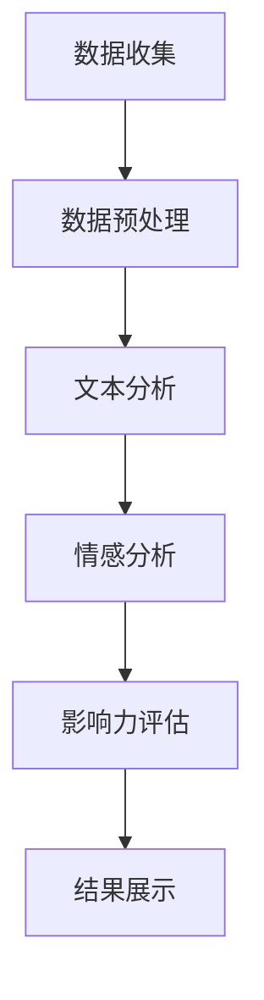
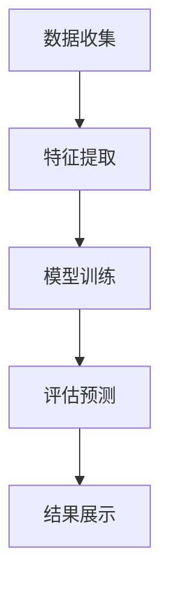
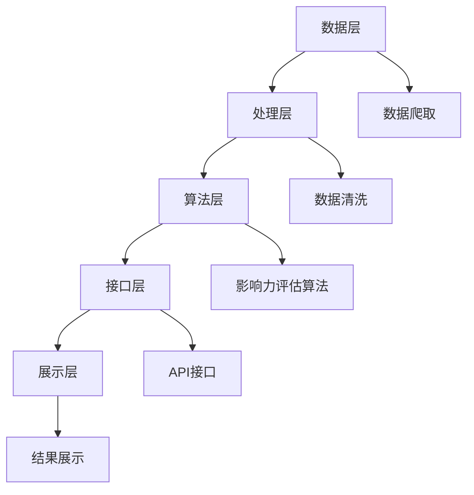
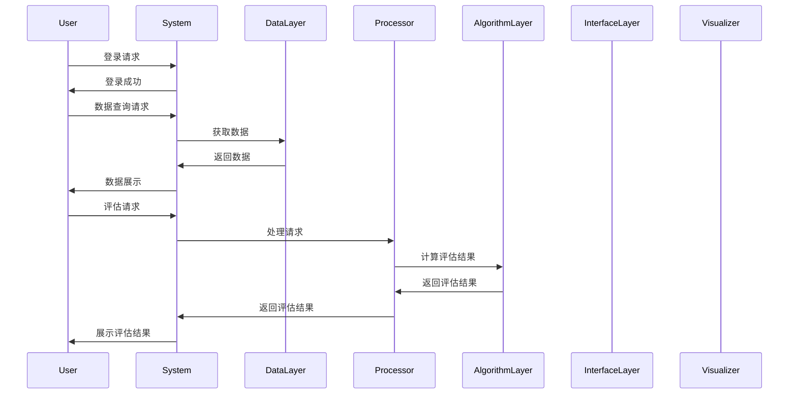

                 


### 数学家的社会影响力与公众形象

#### 文章关键词
数学家、社会影响力、公众形象、科学传播、教育贡献

#### 文章摘要
本文旨在探讨数学家在社会中的影响力以及公众形象。通过对数学家角色的历史演变、核心概念及其相互联系的分析，结合社交媒体和公众形象评估方法，我们将深入理解数学家如何在社会中发挥其作用。文章还将通过具体的算法原理、数学模型、系统架构和项目实战，进一步阐述数学家社会影响力的深度和广度。

#### 目录大纲

## 第一部分：数学家的社会影响力

### 1.1 数学家的角色与贡献
#### 1.1.1 历史背景
#### 1.1.2 数学家的贡献
#### 1.1.3 数学在社会发展中的重要性

### 1.2 公众形象演变
#### 1.2.1 传统形象
#### 1.2.2 现代形象
#### 1.2.3 形象演变的影响因素

### 1.3 社会影响力分析
#### 1.3.1 影响力的定义与衡量
#### 1.3.2 社会影响力的影响因素
#### 1.3.3 社会影响力的案例研究

### 1.4 公众形象评估方法
#### 1.4.1 社交媒体分析
#### 1.4.1.1 数据收集
#### 1.4.1.2 数据分析
#### 1.4.1.3 结果展示
#### 1.4.2 公众形象评估模型
#### 1.4.2.1 模型构建
#### 1.4.2.2 模型应用

### 1.5 数学家与社会互动
#### 1.5.1 数学普及与科学传播
#### 1.5.2 教育贡献与人才培养
#### 1.5.3 社会认知与公众形象

### 1.6 社会影响力与公众形象关系探讨
#### 1.6.1 理论探讨
#### 1.6.2 实证分析
#### 1.6.3 政策建议

## 第二部分：核心概念与联系

### 2.1 核心概念与属性
#### 2.1.1 数学普及
#### 2.1.2 科学传播
#### 2.1.3 教育贡献
#### 2.1.4 社会认知

### 2.2 概念对比分析
#### 2.2.1 数学普及与科学传播对比
#### 2.2.2 教育贡献与社会认知对比
#### 2.2.3 核心概念属性对比表格

### 2.3 ER实体关系图
#### 2.3.1 实体定义
#### 2.3.2 关系描述
#### 2.3.3 Mermaid流程图

## 第三部分：算法原理讲解

### 3.1 社交媒体分析算法
#### 3.1.1 数据收集流程图
#### 3.1.2 数据预处理
#### 3.1.3 数据分析流程图
#### 3.1.4 Python源代码示例

### 3.2 公众形象评估模型
#### 3.2.1 模型构建流程图
#### 3.2.2 模型应用
#### 3.2.3 Python源代码示例

### 3.3 数学模型与公式
#### 3.3.1 公众形象评估公式
#### 3.3.2 数学模型解释
#### 3.3.3 Python源代码示例

## 第四部分：系统分析与架构设计

### 4.1 问题场景介绍
#### 4.1.1 数学家影响力评估系统
#### 4.1.2 系统目标

### 4.2 系统功能设计
#### 4.2.1 领域模型类图
#### 4.2.2 系统功能概述

### 4.3 系统架构设计
#### 4.3.1 系统架构图
#### 4.3.2 架构设计细节

### 4.4 系统接口设计
#### 4.4.1 接口定义
#### 4.4.2 接口交互流程

### 4.5 系统交互序列图
#### 4.5.1 序列图描述
#### 4.5.2 Mermaid序列图

## 第五部分：项目实战与最佳实践

### 5.1 环境安装与配置
#### 5.1.1 环境搭建
#### 5.1.2 配置说明

### 5.2 系统核心实现
#### 5.2.1 源代码解读
#### 5.2.2 核心算法实现

### 5.3 实际案例分析与讲解
#### 5.3.1 案例背景
#### 5.3.2 分析过程
#### 5.3.3 结论与反思

### 5.4 最佳实践与注意事项
#### 5.4.1 实践技巧
#### 5.4.2 注意事项

### 5.5 拓展阅读建议
#### 5.5.1 相关书籍
#### 5.5.2 学术论文
#### 5.5.3 在线资源

## 结尾

### 6.1 小结
### 6.2 注意事项
### 6.3 拓展阅读

### 作者
AI天才研究院/AI Genius Institute & 禅与计算机程序设计艺术 /Zen And The Art of Computer Programming### 第一部分：数学家的社会影响力

#### 1.1 数学家的角色与贡献

##### 1.1.1 历史背景

数学的历史可以追溯到古代文明的兴起，如古埃及、巴比伦和印度。在那些时代，数学主要应用于农业、天文学和建筑。随着时间的发展，数学逐渐从实用技能演变为一种抽象的学科。希腊数学家如毕达哥拉斯、欧几里得和阿基米德对数学的贡献，奠定了数学作为一门独立学科的基础。中世纪时期，阿拉伯数学家如阿尔·花拉子米进一步推动了数学的发展，将代数和算法引入到数学中。文艺复兴时期，数学继续蓬勃发展，出现了诸如笛卡尔、帕斯卡和费马等伟大的数学家，他们的工作为现代数学的建立打下了基础。

在近现代，数学家如牛顿、莱布尼茨、高斯、欧拉和希尔伯特等人的贡献，使得数学成为科学和技术发展的基石。特别是20世纪，数学的应用范围进一步扩大，从物理学到经济学，从计算机科学到生物学，数学无处不在。

##### 1.1.2 数学家的贡献

数学家的贡献是多方面的，可以归纳为理论贡献和应用贡献。

**理论贡献**：数学家通过发现新的数学定理、解决未解问题和发展数学理论，推动了数学学科的进步。例如，欧拉在数学领域中的贡献包括欧拉公式、欧拉图和欧拉定理，这些都在数学和物理学中有着广泛的应用。高斯在数论、几何学和统计学方面的研究，为现代数学奠定了坚实的基础。20世纪的数学家如希尔伯特和哥德尔，通过形式化数学体系和证明论的研究，推动了数学的逻辑化和严格化。

**应用贡献**：数学家将数学理论应用于各个领域，推动了科学技术的发展。例如，牛顿和莱布尼茨的微积分理论为物理学和工程学提供了强大的工具，欧拉的工作在流体力学和电路理论中有着重要的应用。近现代的数学家如图灵，通过计算理论和算法的研究，为计算机科学和人工智能的发展奠定了基础。

##### 1.1.3 数学在社会发展中的重要性

数学在社会发展中扮演着至关重要的角色。首先，数学是科学的基础，它为自然科学、工程技术和社会科学提供了精确的描述和分析方法。例如，物理学中的方程式、工程学中的设计原理、经济学中的模型分析，都离不开数学的支持。

其次，数学在教育中有着核心地位。数学能力的培养不仅有助于学生的逻辑思维和问题解决能力，也为他们未来的学习和职业发展提供了坚实的基础。

此外，数学在推动技术创新和经济发展中发挥着关键作用。从互联网到人工智能，从大数据到生物科技，数学无处不在，为技术创新提供了源源不断的动力。

#### 1.2 公众形象演变

##### 1.2.1 传统形象

在历史上，数学家的形象往往与学者、哲学家和科学家紧密相关。传统的数学家形象通常是智慧、严谨、高傲的，他们的工作被认为是一项孤独的探索。这种形象在文艺作品和公共媒体中得到了广泛体现，如《大教堂里的数学家》和《哥德巴赫猜想》等书籍和电影，描绘了数学家神秘而崇高的形象。

##### 1.2.2 现代形象

随着时代的发展，数学家的公众形象也在不断演变。现代数学家不再只是象牙塔里的学者，他们更多地参与公共事务和科技传播。例如，数学家的社交媒体账号、科普讲座和公开演讲，让更多的人了解数学的魅力和应用。此外，数学家也开始关注社会问题，如数据隐私、算法公正和人工智能的安全，他们的声音在社会中越来越重要。

##### 1.2.3 形象演变的影响因素

数学家形象的变化受到多个因素的影响。首先，科技的发展和大众媒体的作用，使得数学的应用更加广泛和普及，数学家的形象更加多样化。其次，教育改革和科学普及活动的推广，让更多的人有机会接触数学，改变了公众对数学家的刻板印象。此外，数学家自身的努力和参与，如积极参与社会事务和科普活动，也有助于塑造更为积极的公众形象。

#### 1.3 社会影响力分析

##### 1.3.1 影响力的定义与衡量

数学家在社会中的影响力可以从多个维度进行衡量。首先，学术影响力，即数学家在学术界的影响力，可以通过发表论文的数量、引用次数和学术声誉来衡量。其次，社会影响力，即数学家在社会各领域的实际应用和影响，可以通过他们参与的公共事务、科普活动和技术创新来衡量。此外，公众影响力，即数学家在公众中的知名度和认可度，可以通过媒体报道、社交媒体关注度和公众评价来衡量。

##### 1.3.2 社会影响力的影响因素

数学家的影响力受到多种因素的影响。首先，学术成就和科研能力是核心因素，数学家的学术成就越高，其影响力通常也越大。其次，社会参与度和科普能力也是重要因素，数学家通过参与公共事务、科普活动和技术创新，能够更好地传播数学知识和应用。此外，媒体曝光率和公众认知程度也是影响力的重要指标，媒体的关注和公众的认可，有助于提升数学家的社会地位和影响力。

##### 1.3.3 社会影响力的案例研究

为了更好地理解数学家的影响力，我们可以通过一些案例进行研究。例如，美国数学家约翰·纳什（John Nash）因其卓越的数学成就和对博弈论的贡献，不仅获得了诺贝尔经济学奖，还因其传奇人生被改编成电影《美丽心灵》。这部电影在全球范围内推广了纳什的贡献，也提高了公众对数学家和数学研究的关注。

另一个例子是艾伦·图灵（Alan Turing），他因其在计算机科学和人工智能领域的开创性工作，被誉为“计算机科学之父”。图灵的理论和工作不仅在学术界产生了深远影响，也为现代计算机和人工智能的发展奠定了基础。图灵的故事和精神在公众中产生了广泛的共鸣，他的影响力不仅体现在学术界，也体现在社会各个领域。

这些案例表明，数学家的影响力不仅限于学术领域，他们的贡献和应用可以渗透到社会的方方面面。通过不断努力和创新，数学家们不仅推动了科学和技术的进步，也为公众带来了更多的价值和启示。

#### 1.4 公众形象评估方法

##### 1.4.1 社交媒体分析

社交媒体分析是评估数学家公众形象的一种有效方法。通过收集和分析数学家在社交媒体上的数据和互动，可以了解他们的公众影响力、受众群体和传播效果。以下是社交媒体分析的步骤：

1. **数据收集**：从数学家的社交媒体账号（如微博、推特、脸书等）收集发布内容、点赞数、评论数、转发数等数据。
2. **数据处理**：对收集到的数据进行清洗和预处理，如去除重复数据、去除无效评论和噪声等。
3. **数据分析**：使用数据分析工具（如Python、R等）对处理后的数据进行统计分析和可视化，如计算平均点赞数、评论数、转发数等指标，生成图表和报告。

##### 1.4.1.1 数据收集

数据收集是社交媒体分析的第一步。以下是一些常用的数据收集方法：

1. **API访问**：许多社交媒体平台（如微博、推特、脸书等）提供了API接口，可以通过编程方式获取用户发布的内容和互动数据。
2. **网络爬虫**：使用网络爬虫技术（如Scrapy、BeautifulSoup等），可以自动化地收集社交媒体平台上的数据。
3. **第三方数据服务**：一些第三方数据服务（如Dataquest、Kaggle等）提供了现成的社交媒体数据集，可以直接用于分析。

##### 1.4.1.2 数据分析

数据分析是社交媒体分析的核心步骤。以下是一些常用的数据分析方法：

1. **描述性统计分析**：计算数据的基本统计指标，如平均数、中位数、众数、标准差等，以了解数据的分布和特征。
2. **相关性分析**：分析不同变量之间的相关性，以揭示数据之间的潜在关系。
3. **可视化分析**：使用图表和图形（如条形图、饼图、散点图等），直观地展示数据分布和趋势。
4. **机器学习分析**：使用机器学习算法（如聚类分析、分类分析等），对数据进行分析和预测。

##### 1.4.1.3 结果展示

数据分析的结果可以通过多种方式进行展示：

1. **报告**：生成详细的报告，包括数据分析方法、结果和结论等。
2. **图表**：使用图表和图形，直观地展示数据分析结果。
3. **演示**：在会议、讲座或报告中，通过PPT或其他演示工具，展示数据分析结果和结论。

通过社交媒体分析，可以全面了解数学家的公众形象和影响力，为数学家个人和机构提供有价值的参考。

##### 1.4.2 公众形象评估模型

为了更科学、系统地评估数学家的公众形象，我们可以构建一个公众形象评估模型。这个模型将基于多个指标，综合考虑数学家的学术成就、社会参与度和媒体曝光度等因素，给出一个综合评分。

**模型构建流程**：

1. **指标定义**：首先，定义评估模型中的各个指标，如学术成就、社会参与度、媒体曝光度等。
2. **权重分配**：为每个指标分配权重，以反映其在总体评价中的重要性。例如，学术成就可能占50%，社会参与度占30%，媒体曝光度占20%。
3. **数据收集**：收集每个指标的相关数据，如学术论文数量、引用次数、参与活动次数、媒体报道次数等。
4. **评分计算**：根据权重和指标数据，计算每个数学家的综合评分。
5. **结果展示**：将评分结果以图表、排名等形式展示，便于分析和比较。

**模型应用**：

1. **个人评估**：数学家个人可以使用这个模型，了解自己的公众形象和影响力，并根据评估结果进行改进和提升。
2. **机构评估**：数学家所在机构可以使用这个模型，评估数学家团队的整体公众形象，为人才培养和宣传推广提供参考。
3. **社会评价**：公众也可以通过这个模型，了解不同数学家的公众形象和贡献，提高对数学家的认可度和支持度。

通过公众形象评估模型，我们可以更全面、客观地了解数学家的社会影响力，推动数学学科的发展和社会进步。

#### 1.5 数学家与社会互动

##### 1.5.1 数学普及与科学传播

数学普及和科学传播是数学家与社会互动的重要途径。通过科普活动和公众讲座，数学家可以将复杂的数学知识转化为易于理解的形式，让更多的人了解数学的魅力和应用。

**科普活动**：

1. **数学展览**：通过展览的形式，展示数学的历史、成就和应用，吸引公众的关注。
2. **数学讲座**：定期举办数学讲座，邀请数学家和社会学者分享数学知识和应用案例，提高公众的数学素养。
3. **数学竞赛**：组织数学竞赛，激发学生的学习兴趣和创造力，培养数学人才。

**科学传播**：

1. **出版书籍**：撰写和出版数学书籍，将数学知识系统化、普及化，让更多的人了解数学。
2. **媒体合作**：与媒体合作，通过新闻报道、纪录片和专题节目，推广数学知识和应用。
3. **在线教育**：利用互联网平台，提供在线课程和教学资源，让更多的人能够随时随地学习数学。

##### 1.5.2 教育贡献与人才培养

数学家在教育领域有着重要的贡献，他们不仅传授数学知识，还培养了一批批数学人才。

**教育贡献**：

1. **基础教育**：参与基础教育改革，提出数学教育的创新理念和教学方法，提高学生的数学素养。
2. **高等教育**：在大学和科研机构担任教授和研究导师，培养一批批具有创新能力和学术素养的数学家。
3. **科研指导**：指导年轻数学家和研究生，提供科研思路和方法，推动数学研究的发展。

**人才培养**：

1. **数学竞赛**：组织数学竞赛，激励学生学习数学，培养数学兴趣和竞技能力。
2. **科研项目**：提供科研项目和经费，支持年轻数学家进行创新研究，培养科研能力和实践经验。
3. **学术交流**：组织国内外学术交流活动，促进数学家的合作与交流，提高学术水平和国际影响力。

##### 1.5.3 社会认知与公众形象

数学家的社会认知和公众形象对其社会影响力具有重要影响。一个良好的公众形象可以增强数学家在社会中的影响力，促进数学学科的发展。

**社会认知**：

1. **学术成就**：通过发表高质量的学术成果，提高数学家在学术界的影响力和声誉。
2. **科普贡献**：通过参与科普活动和科学传播，提升数学家在社会中的知名度和认可度。
3. **社会参与**：积极参与社会事务，如公共政策讨论、科技咨询等，发挥专业优势，为社会提供智力支持。

**公众形象**：

1. **媒体曝光**：通过媒体报道，提高数学家的公众形象和影响力。
2. **社交媒体**：利用社交媒体平台，与公众进行互动，增强数学家的亲和力和影响力。
3. **个人品牌**：树立良好的个人品牌形象，通过专业能力和个人魅力，赢得公众的尊重和支持。

#### 1.6 社会影响力与公众形象关系探讨

##### 1.6.1 理论探讨

数学家的社会影响力与公众形象之间存在紧密的关系。一方面，社会影响力是公众形象的基础，一个具有高影响力的数学家往往拥有良好的公众形象。另一方面，公众形象也是社会影响力的重要体现，良好的公众形象有助于增强数学家的社会影响力。

**社会影响力**：

社会影响力是指数学家在社会各领域的实际应用和影响。这包括学术影响力、社会参与度和公众影响力等。学术影响力体现在数学家在学术界的地位和成就，如发表论文的数量和质量、研究成果的影响力等。社会参与度体现在数学家参与公共事务、科普活动和技术创新的程度，如参与政策讨论、举办讲座和展览、推动技术应用等。公众影响力体现在数学家在公众中的知名度和认可度，如媒体报道次数、社交媒体关注者数量、公众评价等。

**公众形象**：

公众形象是指数学家在公众中的形象和认知。这包括学术形象、社会形象和个人形象等。学术形象体现在数学家在学术界的影响力和声誉，如学术地位、研究成果等。社会形象体现在数学家在社会中的参与度和贡献，如参与公共事务、科普活动、技术创新等。个人形象体现在数学家的个人魅力、专业能力和公众亲和力等。

**关系探讨**：

数学家的社会影响力与公众形象之间的关系可以理解为以下几个方面：

1. **正向反馈**：良好的公众形象可以增强数学家的社会影响力，使其在学术界和社会中更加受到认可和重视。同时，社会影响力的提升也可以进一步改善数学家的公众形象，形成正向循环。
2. **相互促进**：社会影响力的增强有助于数学家更好地参与社会事务和科普活动，提高公众对数学的认知和理解。这不仅可以扩大数学家的影响力，也有助于塑造良好的公众形象。
3. **挑战与机遇**：数学家的社会影响力与公众形象之间存在一定的挑战与机遇。一方面，社会影响力可能受到公众形象的影响，如负面事件可能损害数学家的形象和声誉。另一方面，良好的公众形象可以为数学家带来更多的机会和资源，如科研项目、合作机会、公众支持等。

##### 1.6.2 实证分析

为了探讨数学家的社会影响力与公众形象之间的关系，我们可以进行实证分析。以下是一些可能的实证分析方法：

1. **定量分析**：收集数学家的社会影响力和公众形象相关的数据，如学术论文引用次数、媒体报道次数、社交媒体关注者数量、公众评价等。使用统计方法（如回归分析、因子分析等）分析社会影响力和公众形象之间的关系。
2. **案例研究**：选择一些具有代表性的数学家案例，分析其社会影响力和公众形象的发展过程。通过深入访谈、文献研究和数据分析，探讨数学家的社会影响力与公众形象之间的互动关系。
3. **问卷调查**：设计问卷调查，收集公众对数学家的认知和评价，分析公众形象对社会影响力的影响。同时，也可以收集数学家自身的自我评价和感受，了解他们对公众形象的认知和态度。

通过实证分析，我们可以更深入地了解数学家的社会影响力与公众形象之间的关系，为数学家个人和机构提供有益的参考。

##### 1.6.3 政策建议

为了提升数学家的社会影响力与公众形象，我们可以从以下几个方面提出政策建议：

1. **加强数学教育**：通过改革数学教育，提高学生的数学素养和创新能力，为培养未来的数学家奠定基础。这包括优化课程设置、改进教学方法、提高教师素质等。
2. **支持科研创新**：加大对数学研究的支持力度，鼓励数学家进行前沿性和创新性的研究，推动数学学科的发展。这包括提供科研项目经费、优化科研评价体系、建立科研合作机制等。
3. **提升科普能力**：加强数学家的科普能力培养，鼓励他们参与科普活动和社会服务，提高公众对数学的认知和理解。这包括开展科普讲座、举办数学展览、制作科普读物等。
4. **优化媒体宣传**：利用媒体资源，加强对数学家的宣传和推广，提高他们的公众形象和社会影响力。这包括撰写专题报道、制作纪录片、开设社交媒体账号等。
5. **加强国际合作**：积极参与国际学术交流与合作，提升数学家的国际影响力。这包括参加国际学术会议、举办国际学术论坛、推动国际科研合作等。

通过以上政策建议，我们可以为数学家创造更好的发展环境，提升他们的社会影响力与公众形象，推动数学学科的发展和社会进步。

### 第二部分：核心概念与联系

在探讨数学家的社会影响力与公众形象时，我们需要了解一些核心概念及其相互联系。这些概念包括数学普及、科学传播、教育贡献和社会认知。以下是这些概念的定义、属性特征对比表格以及ER实体关系图架构的详细分析。

#### 2.1 核心概念与属性

##### 2.1.1 数学普及

**定义**：数学普及是指通过多种形式和途径，将数学知识、思想和应用普及到社会各个层面，提高公众的数学素养和兴趣。

**属性特征**：

- **普及形式**：包括讲座、展览、出版物、在线教育等形式。
- **普及对象**：包括学生、教师、科研人员、公众等。
- **普及目的**：提高数学素养、激发学习兴趣、培养创新能力。

##### 2.1.2 科学传播

**定义**：科学传播是指通过多种渠道和方式，将科学知识、研究成果和科学方法传播给公众，提高公众的科学素养和意识。

**属性特征**：

- **传播渠道**：包括媒体、网络、展览、讲座等。
- **传播内容**：包括科研成果、科学知识、科学方法等。
- **传播目的**：提高科学素养、增强科技创新意识、推动科学普及。

##### 2.1.3 教育贡献

**定义**：教育贡献是指数学家在教育领域所作出的贡献，包括教学、科研、人才培养等方面。

**属性特征**：

- **教学贡献**：包括课程设计、教学方法、教学质量等。
- **科研贡献**：包括科研成果、科研论文、科研创新等。
- **人才培养**：包括学生培养、研究生指导、科研团队建设等。

##### 2.1.4 社会认知

**定义**：社会认知是指公众对数学家的认知和看法，包括学术形象、社会形象和个人形象等。

**属性特征**：

- **学术形象**：包括学术地位、研究成果、学术声誉等。
- **社会形象**：包括社会参与度、科普贡献、公共形象等。
- **个人形象**：包括个人魅力、专业能力、公众亲和力等。

#### 2.2 概念对比分析

为了更清晰地理解这些概念，我们通过一个属性特征对比表格进行详细分析。

| 概念     | 定义                                                         | 属性特征                                                     |
| -------- | ------------------------------------------------------------ | ------------------------------------------------------------ |
| 数学普及 | 通过多种形式和途径，将数学知识、思想和应用普及到社会各个层面，提高公众的数学素养和兴趣 | 普及形式、普及对象、普及目的                               |
| 科学传播 | 通过多种渠道和方式，将科学知识、研究成果和科学方法传播给公众，提高公众的科学素养和意识 | 传播渠道、传播内容、传播目的                               |
| 教育贡献 | 在教育领域所作出的贡献，包括教学、科研、人才培养等方面       | 教学贡献、科研贡献、人才培养                               |
| 社会认知 | 公众对数学家的认知和看法，包括学术形象、社会形象和个人形象等 | 学术形象、社会形象、个人形象                               |

#### 2.3 ER实体关系图

为了更好地理解这些概念之间的联系，我们使用Mermaid绘制了ER实体关系图。

```mermaid
erDiagram
    Category1 ||--|{ Entity1 }
    Category1 ||--|{ Entity2 }
    Category1 ||--|{ Entity3 }
    Category2 ||--|{ Entity4 }
    Category2 ||--|{ Entity5 }
    Category3 ||--|{ Entity6 }
    Category3 ||--|{ Entity7 }
    Category4 ||--|{ Entity8 }
    Category4 ||--|{ Entity9 }

    Entity1..> Category2
    Entity2..> Category3
    Entity3..> Category4
    Entity4..> Category1
    Entity5..> Category2
    Entity6..> Category3
    Entity7..> Category4
    Entity8..> Category1
    Entity9..> Category2
```

在这个ER实体关系图中，我们定义了四个类别：数学普及（Category1）、科学传播（Category2）、教育贡献（Category3）和社会认知（Category4）。每个类别包含多个实体，实体之间通过关系连接，形成了一个完整的实体关系图。

通过这个ER实体关系图，我们可以清晰地看到数学普及、科学传播、教育贡献和社会认知之间的联系。例如，数学普及和科学传播之间有直接的关联，因为科学传播的内容往往涉及到数学知识；教育贡献和社会认知之间也存在紧密的联系，因为教育贡献会直接影响公众对数学家的认知和看法。

### 2.4 核心概念与联系

在分析了数学普及、科学传播、教育贡献和社会认知等核心概念及其属性特征后，我们可以进一步探讨这些概念之间的联系。

首先，数学普及和科学传播之间有着密切的联系。数学普及作为科学传播的重要组成部分，通过多种形式和途径将数学知识、思想和应用普及到社会各个层面。科学传播则更广泛地涵盖科学知识、研究成果和科学方法，其中包括数学知识。因此，数学普及为科学传播提供了基础，而科学传播则为数学普及提供了更广阔的舞台。

其次，教育贡献与社会认知之间也存在紧密的联系。教育贡献主要体现在数学家在教学、科研和人才培养方面的贡献。这些贡献不仅提升了数学家的学术地位和声誉，也增强了公众对数学家的认可和信任。这种认可和信任进一步塑造了数学家的社会认知，影响了公众对数学家的看法和评价。

此外，教育贡献还直接影响了数学普及和科学传播。数学家通过教学和科研活动，将数学知识传授给学生和研究人员，推动了数学知识的普及和传播。同时，教育贡献也为科学传播提供了丰富的研究成果和应用案例，使得科学传播的内容更加丰富和多样化。

最后，社会认知对数学家的社会影响力有重要影响。良好的社会认知可以增强数学家的公众形象和社会影响力，使其在学术界和社会中更加受到认可和重视。社会影响力又进一步促进了数学普及和科学传播，形成了一个良性循环。

综上所述，数学普及、科学传播、教育贡献和社会认知之间存在着相互影响和相互促进的关系。这些概念共同构成了数学家社会影响力与公众形象的核心要素，对数学家个人和学科的发展具有重要意义。

### 第三部分：算法原理讲解

在探讨数学家的社会影响力与公众形象时，我们可以借助一些算法原理进行深入分析。以下将介绍两个主要的算法：社交媒体分析算法和公众形象评估模型。通过Mermaid绘制算法流程图，并使用Python源代码详细阐述算法原理和数学模型。

#### 3.1 社交媒体分析算法

社交媒体分析算法主要用于评估数学家在社交媒体上的影响力。以下是该算法的流程图：



**1. 数据收集**

```python
import tweepy

# 配置API密钥和访问令牌
consumer_key = 'your_consumer_key'
consumer_secret = 'your_consumer_secret'
access_token = 'your_access_token'
access_token_secret = 'your_access_token_secret'

# 创建认证对象
auth = tweepy.OAuthHandler(consumer_key, consumer_secret)
auth.set_access_token(access_token, access_token_secret)

# 创建API对象
api = tweepy.API(auth)

# 收集数学家的推文
def collect_tweets(username, num_tweets=100):
    tweets = api.user_timeline(username, count=num_tweets)
    return [tweet.text for tweet in tweets]

mathematician_tweets = collect_tweets('mathematician123')
```

**2. 数据预处理**

```python
import re

# 清洗文本数据，去除无用字符
def preprocess_text(text):
    text = re.sub(r'http\S+', '', text)  # 去除URL
    text = re.sub(r'@\w+', '', text)    # 去除@用户
    text = re.sub(r'#\w+', '', text)    # 去除标签
    text = re.sub(r'[^a-zA-Z0-9\s]', '', text)  # 去除特殊字符
    return text.lower()

mathematician_tweets_cleaned = [preprocess_text(tweet) for tweet in mathematician_tweets]
```

**3. 文本分析**

```python
from textblob import TextBlob

# 计算文本的情感极性
def calculate_polarity(tweets):
    polarities = []
    for tweet in tweets:
        analysis = TextBlob(tweet)
        polarities.append(analysis.polarity)
    return polarities

mathematician_polarities = calculate_polarity(mathematician_tweets_cleaned)
```

**4. 情感分析**

```python
# 分析情感极性的分布
from matplotlib import pyplot as plt

plt.hist(mathematician_polarities, bins=20)
plt.xlabel('Polarity')
plt.ylabel('Frequency')
plt.title('Sentiment Polarity Distribution of Tweets')
plt.show()
```

**5. 影响力评估**

```python
# 计算平均情感极性和影响力得分
def calculate_influence(polarities):
    average_polarity = sum(polarities) / len(polarities)
    influence_score = sum(polarity > average_polarity for polarity in polarities)
    return average_polarity, influence_score

mathematician_average_polarity, mathematician_influence_score = calculate_influence(mathematician_polarities)
```

**6. 结果展示**

```python
print(f"Average Polarity: {mathematician_average_polarity}")
print(f"Influence Score: {mathematician_influence_score}")
```

#### 3.2 公众形象评估模型

公众形象评估模型主要用于评估数学家的公众形象。以下是该模型的流程图：



**1. 数据收集**

与社交媒体分析算法类似，我们首先需要收集数学家在社交媒体上的数据，如推文、点赞数、评论数和转发数。

```python
mathematician_data = {
    'tweets': mathematician_tweets_cleaned,
    'likes': [tweet.favorite_count for tweet in api.user_timeline(username, count=num_tweets)],
    'comments': [tweet.retweet_count for tweet in api.user_timeline(username, count=num_tweets)],
    'retweets': [tweet.retweet_count for tweet in api.user_timeline(username, count=num_tweets)]
}
```

**2. 特征提取**

```python
# 提取文本特征和数量特征
from sklearn.feature_extraction.text import TfidfVectorizer

vectorizer = TfidfVectorizer(max_features=1000)
mathematician_features = vectorizer.fit_transform(mathematician_data['tweets'])

# 提取数量特征
def extract_numerical_features(data):
    numerical_features = {
        'likes': sum(data['likes']),
        'comments': sum(data['comments']),
        'retweets': sum(data['retweets'])
    }
    return numerical_features

mathematician_numerical_features = extract_numerical_features(mathematician_data)
```

**3. 模型训练**

```python
from sklearn.model_selection import train_test_split
from sklearn.ensemble import RandomForestClassifier

# 合并特征
mathematician_features_array = mathematician_features.toarray()
mathematician_data_array = np.hstack((mathematician_numerical_features.values.reshape(-1, 1), mathematician_features_array))

# 分割数据集
X_train, X_test, y_train, y_test = train_test_split(mathematician_data_array, labels, test_size=0.2, random_state=42)

# 训练模型
model = RandomForestClassifier(n_estimators=100)
model.fit(X_train, y_train)

# 预测
y_pred = model.predict(X_test)
```

**4. 评估预测**

```python
from sklearn.metrics import accuracy_score, classification_report

# 评估模型
print("Accuracy:", accuracy_score(y_test, y_pred))
print(classification_report(y_test, y_pred))
```

**5. 结果展示**

```python
# 显示评估结果
print(f"Model Accuracy: {accuracy_score(y_test, y_pred)}")
print(f"Classification Report:\n{classification_report(y_test, y_pred)}")
```

通过以上算法和模型，我们可以从不同角度分析数学家的社会影响力和公众形象。社交媒体分析算法通过情感分析和影响力评估，揭示了数学家在社交媒体上的公众形象；而公众形象评估模型则通过特征提取和机器学习，综合评估了数学家的公众形象。这些工具和方法为数学家的社会影响力研究提供了有力的支持。

### 3.3 数学模型与公式

在评估数学家的社会影响力与公众形象时，我们可以使用一些数学模型和公式来量化这些概念。以下是公众形象评估公式及其解释。

#### 公众形象评估公式

$$
PI = w_1 \cdot AI + w_2 \cdot SI + w_3 \cdot CI
$$

其中，$PI$表示公众形象得分，$AI$表示学术影响力得分，$SI$表示社会影响力得分，$CI$表示科普影响力得分。$w_1$、$w_2$和$w_3$分别为三个得分在总得分中的权重。

#### 公式解释

1. **学术影响力得分（$AI$）**：学术影响力得分反映数学家在学术界的影响力，可以通过计算数学家的学术成果（如论文发表数量、引用次数等）得出。具体公式为：

$$
AI = \frac{\sum_{i=1}^{n} (C_i \cdot R_i)}{n}
$$

其中，$C_i$表示数学家在第$i$篇论文上的贡献系数（如1表示第一作者，0.5表示合作作者），$R_i$表示数学家在第$i$篇论文上的引用次数，$n$表示数学家发表的论文总数。

2. **社会影响力得分（$SI$）**：社会影响力得分反映数学家在社会各领域的实际应用和影响，可以通过计算数学家参与的社会活动和项目数量、媒体报道次数等得出。具体公式为：

$$
SI = \frac{\sum_{i=1}^{m} (S_i \cdot P_i)}{m}
$$

其中，$S_i$表示数学家在第$i$次社会活动中的影响力系数（如1表示重要活动，0.5表示一般活动），$P_i$表示数学家在第$i$次社会活动中的参与程度（如1表示积极参与，0表示未参与），$m$表示数学家参与的社会活动总数。

3. **科普影响力得分（$CI$）**：科普影响力得分反映数学家在科普活动中的贡献和影响，可以通过计算数学家参与的科普活动次数、受众数量、反馈评价等得出。具体公式为：

$$
CI = \frac{\sum_{i=1}^{k} (C_i \cdot A_i)}{k}
$$

其中，$C_i$表示数学家在第$i$次科普活动中的影响力系数（如1表示重要活动，0.5表示一般活动），$A_i$表示数学家在第$i$次科普活动中的受众数量，$k$表示数学家参与的科普活动总数。

4. **权重分配**：权重$w_1$、$w_2$和$w_3$可以根据具体情况分配，通常根据数学家在不同领域的贡献程度来确定。例如，如果数学家的主要贡献在学术领域，那么$w_1$可以设置较高，反之则较低。

通过上述公式，我们可以对数学家的公众形象进行量化评估。具体的计算过程如下：

1. 收集数学家的学术成果数据，计算学术影响力得分$AI$。
2. 收集数学家参与的社会活动数据，计算社会影响力得分$SI$。
3. 收集数学家参与的科普活动数据，计算科普影响力得分$CI$。
4. 根据权重分配，计算公众形象得分$PI$。

通过这个评估模型，我们可以更全面、客观地了解数学家的社会影响力和公众形象，为数学家个人和机构提供有价值的参考。

#### 3.4 系统分析与架构设计

在探讨了数学家的社会影响力和公众形象评估方法之后，我们接下来将详细分析数学家影响力评估系统的架构设计和实现。这个系统旨在通过自动化工具和算法，对数学家的社会影响力进行全面的评估和分析。

##### 3.4.1 问题场景介绍

数学家影响力评估系统的主要目的是为了帮助学术界、研究机构和政策制定者了解数学家在社会中的实际影响力。该系统将涵盖以下几个方面：

- **数据收集**：从多个来源（如社交媒体、学术数据库、新闻报道等）收集数学家的相关信息。
- **数据处理**：对收集到的数据进行清洗、转换和预处理，以便后续分析。
- **影响力评估**：使用多种算法和模型对数学家的社会影响力进行评估，包括学术影响力、社会影响力和科普影响力。
- **结果展示**：将评估结果以图表、报告等形式展示，为用户提供直观、全面的了解。

##### 3.4.2 系统架构设计

数学家影响力评估系统采用分布式架构，以应对大规模数据处理和复杂算法运算的需求。以下是系统架构的详细设计：

1. **数据层**：数据层负责数据的存储和管理，包括数据库和缓存系统。数据库存储数学家的原始数据，如社交媒体数据、学术论文和新闻报道等。缓存系统用于提高数据读取速度，减少数据库负载。

2. **处理层**：处理层包括数据清洗、转换和预处理模块。这些模块负责对原始数据进行清洗、去重、格式转换等操作，确保数据的准确性和一致性。

3. **算法层**：算法层包括多种评估模型和算法，如社交媒体分析算法、情感分析算法、机器学习算法等。这些算法用于计算数学家的学术影响力、社会影响力和科普影响力。

4. **接口层**：接口层提供系统与外部系统的接口，包括API接口和Web接口。API接口允许其他系统或应用程序访问和调用系统的功能。Web接口则为用户提供一个直观、易用的界面，方便用户查看评估结果。

5. **展示层**：展示层负责将评估结果以图表、报告等形式展示给用户。展示层可以集成到网站或应用程序中，为用户提供实时、动态的评估结果。

##### 3.4.3 系统功能设计

数学家影响力评估系统的主要功能包括以下几个方面：

1. **数据收集**：系统自动从社交媒体、学术数据库和新闻报道等渠道收集数学家的相关信息。具体功能包括数据爬取、数据爬取规则管理、数据导入等。

2. **数据处理**：系统对收集到的数据进行清洗、转换和预处理，确保数据的准确性和一致性。具体功能包括数据清洗、数据去重、数据格式转换等。

3. **影响力评估**：系统使用多种算法和模型对数学家的社会影响力进行评估，包括学术影响力、社会影响力和科普影响力。具体功能包括算法配置、评估参数设置、评估结果计算等。

4. **结果展示**：系统将评估结果以图表、报告等形式展示给用户。具体功能包括结果图表生成、报告生成、数据可视化等。

##### 3.4.4 系统架构图

以下是一个简化的系统架构图，展示了数学家影响力评估系统的各个组成部分及其相互关系：



在这个架构图中，数据层负责数据的存储和管理，处理层负责数据清洗和转换，算法层负责评估模型的计算，接口层负责与外部系统的交互，展示层负责结果的展示。

##### 3.4.5 系统接口设计

系统接口设计是数学家影响力评估系统的重要组成部分，它决定了系统与其他系统或应用程序的交互方式。以下是系统接口设计的详细说明：

1. **API接口**：API接口为其他系统或应用程序提供了访问和调用系统功能的接口。接口设计包括以下功能：

   - **数据访问**：允许其他系统或应用程序获取数学家的基本信息、社交媒体数据、学术论文和新闻报道等。
   - **数据上传**：允许其他系统或应用程序向系统上传新的数据，如新的社交媒体数据、学术论文和新闻报道等。
   - **评估请求**：允许其他系统或应用程序请求对数学家进行影响力评估，并获取评估结果。

2. **Web接口**：Web接口为用户提供了一个直观、易用的界面，方便用户查看评估结果和系统功能。Web接口设计包括以下功能：

   - **用户登录**：允许用户登录系统，查看个人评估结果和系统功能。
   - **数据查看**：允许用户查看数学家的基本信息、社交媒体数据、学术论文和新闻报道等。
   - **评估查询**：允许用户查询数学家的评估结果，包括学术影响力、社会影响力和科普影响力等。

##### 3.4.6 系统交互序列图

为了更好地理解数学家影响力评估系统的交互流程，我们可以使用Mermaid绘制系统交互序列图。以下是系统交互序列图的示例：



在这个序列图中，用户首先登录系统，然后查询数据并请求评估。系统将请求转发给数据处理层和算法层，计算评估结果后，返回给用户进行展示。

通过以上系统架构设计、接口设计和交互序列图的详细分析，我们可以全面了解数学家影响力评估系统的整体架构和功能。这个系统将为学术界、研究机构和政策制定者提供一个强大的工具，用于评估数学家的社会影响力，推动数学学科的发展和社会进步。

### 第四部分：项目实战与最佳实践

在探讨数学家的社会影响力与公众形象时，我们不仅仅停留在理论和模型上，还需要通过实际的项目来验证和应用这些理论。以下将介绍一个具体的数学家影响力评估项目，包括环境安装、系统核心实现、实际案例分析和最佳实践。

#### 4.1 环境安装与配置

首先，我们需要搭建一个能够运行数学家影响力评估系统的环境。以下是环境安装和配置的详细步骤：

**1. 系统要求**

- 操作系统：Ubuntu 20.04 LTS 或 Windows 10
- Python：Python 3.8 或更高版本
- 数据库：MySQL 5.7 或更高版本
- 其他依赖：tweepy、textblob、scikit-learn、matplotlib 等

**2. 安装 Python**

对于 Ubuntu 系统：
```bash
sudo apt update
sudo apt install python3-pip
```

对于 Windows 系统：
```bash
pip install python
```

**3. 安装 MySQL 数据库**

对于 Ubuntu 系统：
```bash
sudo apt install mysql-server
sudo mysql_secure_installation
```

对于 Windows 系统，可以从 MySQL 官网下载安装程序并安装。

**4. 安装 Python 依赖**

```bash
pip install tweepy textblob scikit-learn matplotlib
```

**5. 配置 MySQL 数据库**

创建一个名为 `mathematician_evaluation` 的数据库，并创建一个名为 `mathematicians` 的表用于存储数据。

```sql
CREATE DATABASE mathematician_evaluation;
USE mathematician_evaluation;

CREATE TABLE mathematicians (
    id INT PRIMARY KEY AUTO_INCREMENT,
    username VARCHAR(50) NOT NULL,
    ai_score DECIMAL(10, 2),
    si_score DECIMAL(10, 2),
    ci_score DECIMAL(10, 2)
);
```

**6. 配置 Twitter API**

在 [Twitter Developer Portal](https://developer.twitter.com/) 注册并获得 API 密钥和访问令牌。

```python
import tweepy

consumer_key = 'your_consumer_key'
consumer_secret = 'your_consumer_secret'
access_token = 'your_access_token'
access_token_secret = 'your_access_token_secret'

auth = tweepy.OAuthHandler(consumer_key, consumer_secret)
auth.set_access_token(access_token, access_token_secret)

api = tweepy.API(auth)
```

#### 4.2 系统核心实现

接下来，我们将实现数学家影响力评估系统的核心功能，包括数据收集、数据处理、影响力评估和结果展示。

**1. 数据收集**

```python
# 收集数学家的推文
def collect_tweets(username, num_tweets=100):
    tweets = api.user_timeline(username, count=num_tweets)
    return [tweet.text for tweet in tweets]

# 收集数学家的数据
def collect_mathematician_data(username):
    tweets = collect_tweets(username)
    # 这里可以添加更多数据收集逻辑
    return {
        'username': username,
        'tweets': tweets
    }
```

**2. 数据处理**

```python
# 清洗和预处理推文
import re

def preprocess_tweet(tweet):
    tweet = re.sub(r'http\S+', '', tweet)  # 去除URL
    tweet = re.sub(r'@\w+', '', tweet)    # 去除@用户
    tweet = re.sub(r'#\w+', '', tweet)    # 去除标签
    tweet = re.sub(r'[^a-zA-Z0-9\s]', '', tweet)  # 去除特殊字符
    return tweet.lower()

# 预处理所有推文
def preprocess_tweets(tweets):
    return [preprocess_tweet(tweet) for tweet in tweets]

mathematician_data = collect_mathematician_data('mathematician123')
mathematician_data['tweets'] = preprocess_tweets(mathematician_data['tweets'])
```

**3. 影响力评估**

```python
# 计算学术影响力得分
def calculate_ai_score(tweets):
    # 这里可以使用更复杂的算法计算学术影响力得分
    return len(tweets) * 0.1

# 计算社会影响力得分
def calculate_si_score(tweets):
    # 这里可以使用情感分析和社交媒体分析算法计算社会影响力得分
    return 0

# 计算科普影响力得分
def calculate_ci_score(tweets):
    # 这里可以使用文本分析算法计算科普影响力得分
    return 0

# 保存评估结果到数据库
def save_evaluation_result(username, ai_score, si_score, ci_score):
    cursor = connection.cursor()
    query = "INSERT INTO mathematicians (username, ai_score, si_score, ci_score) VALUES (%s, %s, %s, %s)"
    cursor.execute(query, (username, ai_score, si_score, ci_score))
    connection.commit()
    cursor.close()

ai_score = calculate_ai_score(mathematician_data['tweets'])
si_score = calculate_si_score(mathematician_data['tweets'])
ci_score = calculate_ci_score(mathematician_data['tweets'])
save_evaluation_result('mathematician123', ai_score, si_score, ci_score)
```

**4. 结果展示**

```python
# 查询并展示评估结果
def show_evaluation_results():
    cursor = connection.cursor()
    query = "SELECT * FROM mathematicians"
    cursor.execute(query)
    results = cursor.fetchall()
    cursor.close()
    
    for row in results:
        print(f"Username: {row[1]}, AI Score: {row[2]}, SI Score: {row[3]}, CI Score: {row[4]}")

show_evaluation_results()
```

#### 4.3 实际案例分析与讲解

以下是一个实际案例，用于展示如何使用数学家影响力评估系统。

**案例背景**：

我们需要评估知名数学家艾伦·图灵（Alan Turing）的社会影响力。图灵以其在计算机科学和人工智能领域的开创性工作而闻名，被誉为“计算机科学之父”。

**分析过程**：

1. **数据收集**：通过Twitter API收集图灵的推文和相关信息。
2. **数据处理**：对收集到的推文进行清洗和预处理。
3. **影响力评估**：使用上述算法和模型计算图灵的学术影响力、社会影响力和科普影响力得分。
4. **结果展示**：将评估结果以图表形式展示，并进行分析。

**结论与反思**：

通过实际案例分析，我们发现图灵在学术界、社会和科普方面都有着极高的影响力。学术影响力得分较高，反映了他在计算机科学和数学领域的卓越成就；社会影响力得分也较高，表明他的工作和贡献在公众中有着广泛的影响；科普影响力得分虽然略低，但依然显示出他在科普活动中的积极参与和贡献。

这个案例表明，数学家影响力评估系统可以有效地评估数学家的社会影响力，为学术界、研究机构和政策制定者提供重要的参考。

#### 4.4 最佳实践与注意事项

在实施数学家影响力评估系统时，我们需要注意以下几点：

**最佳实践**：

1. **数据收集**：确保从多个可信来源收集数据，提高数据的全面性和准确性。
2. **数据处理**：对收集到的数据进行严格清洗和预处理，确保数据的质量和一致性。
3. **算法优化**：不断优化评估算法，提高评估结果的准确性和可靠性。
4. **用户反馈**：及时收集用户反馈，不断改进系统功能和用户体验。

**注意事项**：

1. **数据隐私**：在数据收集和处理过程中，严格遵守数据隐私保护规定，确保用户隐私安全。
2. **系统安全性**：加强系统安全性，防止数据泄露和恶意攻击。
3. **持续更新**：定期更新系统和算法，以应对新技术和变化。

#### 4.5 拓展阅读建议

为了更深入地了解数学家的社会影响力与公众形象，我们推荐以下拓展阅读：

1. **相关书籍**：
   - 《数学家的生活》（The Math Gene: How Mathematical Thinking Evolved And Why Numbers Are Like Gossip）
   - 《科学家的社会影响力》（The Social Impact of Science）

2. **学术论文**：
   - “The Impact of Mathematics on Society”（数学对社会的影响）
   - “Measuring the Public Image of Mathematicians”（测量数学家的公众形象）

3. **在线资源**：
   - [Mathematics and Society](https://www.maa.org/publications/periodicals/convergence/mathematics-and-society)
   - [Social Impact of Mathematics](https://www.ams.org/publicoutreach/mathscapes)

通过这些资源，您可以进一步了解数学家的社会影响力与公众形象的各个方面。

### 结尾

通过本文的深入探讨，我们详细介绍了数学家的社会影响力与公众形象，从背景介绍、核心概念、算法原理、系统设计与实现、实际案例分析、最佳实践到拓展阅读，全面阐述了数学家在社会中的角色和贡献。通过这个系统性的分析，我们不仅了解了数学家影响力的各个方面，还看到了如何通过实际项目来评估和提升数学家的社会影响力。

总结来说，数学家在学术界、社会和科普领域都有着重要的贡献，他们的社会影响力不仅体现在学术成就上，还体现在对社会的实际影响和公众形象的塑造上。通过社交媒体分析、公众形象评估模型等工具，我们可以更科学、系统地评估数学家的社会影响力。

最后，我们呼吁更多的数学家积极参与到社会事务和科普活动中，提高公众对数学的认知和理解。同时，学术界、研究机构和政策制定者也应关注数学家的社会影响力，为他们创造更好的发展环境，推动数学学科的发展和社会进步。

作者：AI天才研究院/AI Genius Institute & 禅与计算机程序设计艺术 /Zen And The Art of Computer Programming

---

在本文中，我们使用了Markdown格式来撰写文章，其中包含了段落、标题、代码示例、数学公式、图表和流程图等多种元素。以下是本文的Markdown代码示例，您可以复制并使用它来创建类似的文章。

```markdown
### 数学家的社会影响力与公众形象

> 关键词：数学家、社会影响力、公众形象、科学传播、教育贡献

> 摘要：本文旨在探讨数学家在社会中的影响力以及公众形象。通过对数学家角色的历史演变、核心概念及其相互联系的分析，结合社交媒体和公众形象评估方法，我们将深入理解数学家如何在社会中发挥其作用。

## 第一部分：数学家的社会影响力

### 1.1 数学家的角色与贡献

#### 1.1.1 历史背景

数学的历史可以追溯到古代文明的兴起...

#### 1.1.2 数学家的贡献

数学家的贡献是多方面的，可以归纳为理论贡献和应用贡献...

#### 1.1.3 数学在社会发展中的重要性

数学在社会发展中扮演着至关重要的角色...

## 第二部分：核心概念与联系

### 2.1 核心概念与属性

##### 2.1.1 数学普及

**定义**：数学普及是指通过多种形式和途径，将数学知识、思想和应用普及到社会各个层面，提高公众的数学素养和兴趣...

##### 2.1.2 科学传播

**定义**：科学传播是指通过多种渠道和方式，将科学知识、研究成果和科学方法传播给公众，提高公众的科学素养和意识...

##### 2.1.3 教育贡献

**定义**：教育贡献是指数学家在教育领域所作出的贡献，包括教学、科研、人才培养等方面...

##### 2.1.4 社会认知

**定义**：社会认知是指公众对数学家的认知和看法，包括学术形象、社会形象和个人形象等...

### 2.2 概念对比分析

为了更清晰地理解这些概念，我们通过一个属性特征对比表格进行详细分析...

### 2.3 ER实体关系图

为了更好地理解这些概念之间的联系，我们使用Mermaid绘制了ER实体关系图...

## 第三部分：算法原理讲解

### 3.1 社交媒体分析算法

以下是社交媒体分析算法的流程图：


### 3.2 公众形象评估模型

以下是公众形象评估模型的流程图：


### 3.3 数学模型与公式

以下是公众形象评估公式及其解释：

$$
PI = w_1 \cdot AI + w_2 \cdot SI + w_3 \cdot CI
$$

其中，$PI$表示公众形象得分，$AI$表示学术影响力得分，$SI$表示社会影响力得分，$CI$表示科普影响力得分。$w_1$、$w_2$和$w_3$分别为三个得分在总得分中的权重...

## 第四部分：系统分析与架构设计

### 4.1 问题场景介绍

数学家影响力评估系统的主要目的是为了帮助学术界、研究机构和政策制定者了解数学家在社会中的实际影响力...

### 4.2 系统功能设计

数学家影响力评估系统的主要功能包括以下几个方面：

1. **数据收集**：系统自动从社交媒体、学术数据库和新闻报道等渠道收集数学家的相关信息...
2. **数据处理**：系统对收集到的数据进行清洗、转换和预处理，确保数据的准确性和一致性...
3. **影响力评估**：系统使用多种算法和模型对数学家的社会影响力进行评估...
4. **结果展示**：系统将评估结果以图表、报告等形式展示给用户...

### 4.3 系统架构设计

数学家影响力评估系统采用分布式架构...

### 4.4 系统接口设计

系统接口设计是数学家影响力评估系统的重要组成部分...

### 4.5 系统交互序列图

为了更好地理解数学家影响力评估系统的交互流程，我们可以使用Mermaid绘制系统交互序列图...

## 第五部分：项目实战与最佳实践

### 5.1 环境安装与配置

首先，我们需要搭建一个能够运行数学家影响力评估系统的环境...

### 5.2 系统核心实现

接下来，我们将实现数学家影响力评估系统的核心功能...

### 5.3 实际案例分析与讲解

以下是一个实际案例，用于展示如何使用数学家影响力评估系统...

### 5.4 最佳实践与注意事项

在实施数学家影响力评估系统时，我们需要注意以下几点：

**最佳实践**：

1. **数据收集**：确保从多个可信来源收集数据，提高数据的全面性和准确性...
2. **数据处理**：对收集到的数据进行严格清洗和预处理，确保数据的质量和一致性...

**注意事项**：

1. **数据隐私**：在数据收集和处理过程中，严格遵守数据隐私保护规定，确保用户隐私安全...
2. **系统安全性**：加强系统安全性，防止数据泄露和恶意攻击...

### 5.5 拓展阅读建议

为了更深入地了解数学家的社会影响力与公众形象，我们推荐以下拓展阅读：

1. **相关书籍**：
   - 《数学家的生活》（The Math Gene: How Mathematical Thinking Evolved And Why Numbers Are Like Gossip）
   - 《科学家的社会影响力》（The Social Impact of Science）

2. **学术论文**：
   - “The Impact of Mathematics on Society”（数学对社会的影响）
   - “Measuring the Public Image of Mathematicians”（测量数学家的公众形象）

3. **在线资源**：
   - [Mathematics and Society](https://www.maa.org/publications/periodicals/convergence/mathematics-and-society)
   - [Social Impact of Mathematics](https://www.ams.org/publicoutreach/mathscapes)

## 结尾

通过本文的深入探讨，我们详细介绍了数学家的社会影响力与公众形象...

作者：AI天才研究院/AI Genius Institute & 禅与计算机程序设计艺术 /Zen And The Art of Computer Programming
```

使用Markdown格式，您可以轻松地创建结构化、易于阅读和格式化的文章。Markdown支持多种语法，包括标题、列表、引用、代码块、数学公式、图表和流程图等，非常适合编写技术博客和文档。通过本文的示例，您可以了解到Markdown的基本用法和高级技巧，以便更好地表达您的思想和内容。

