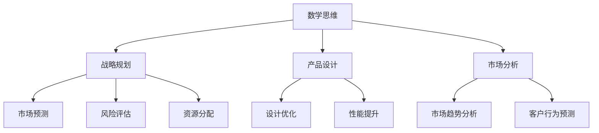
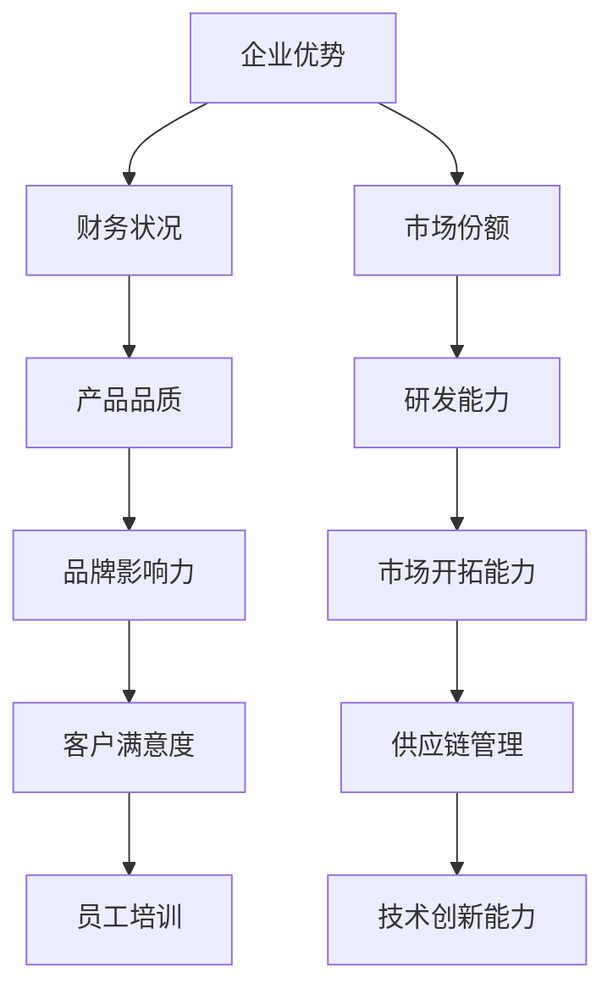
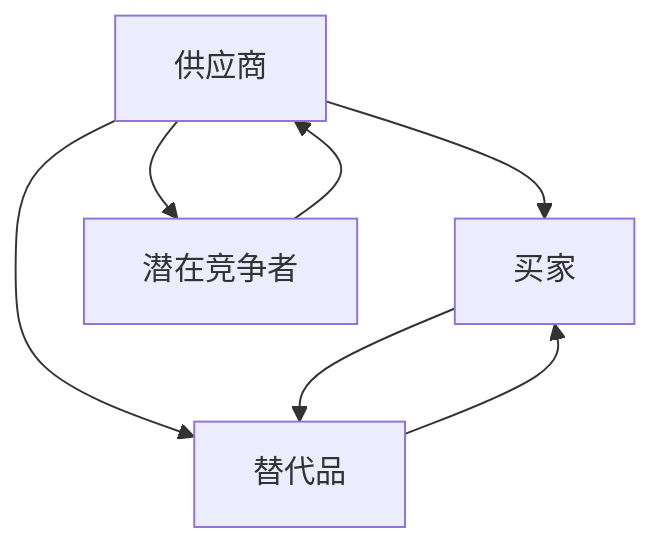
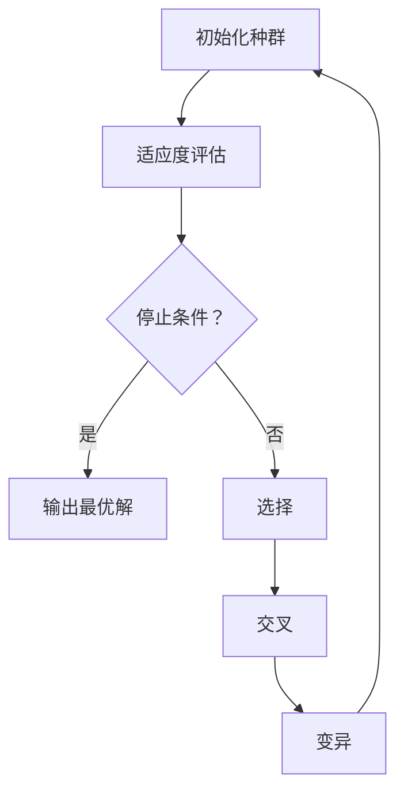
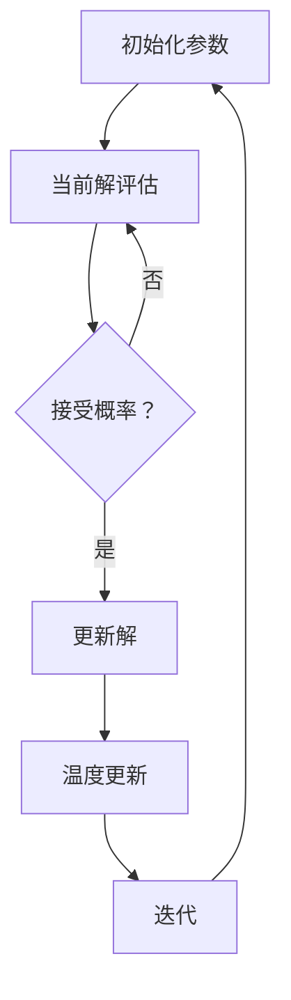
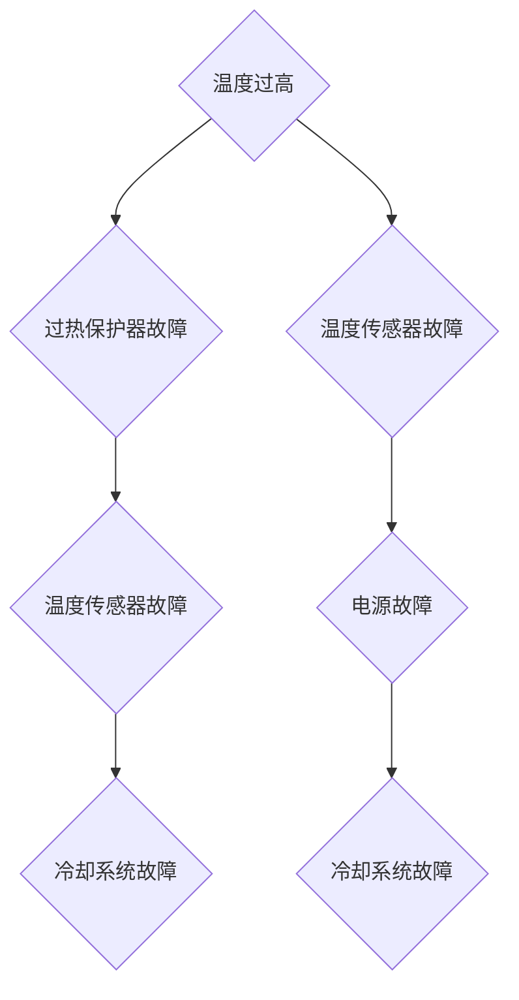
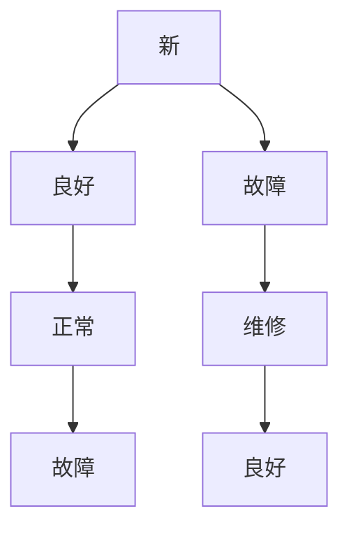
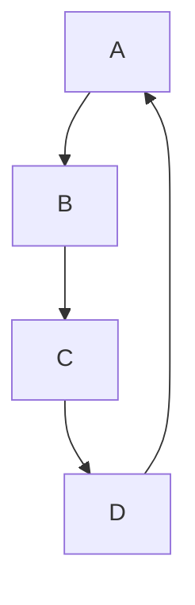
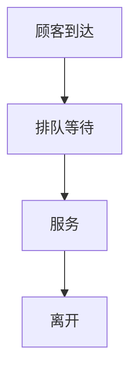
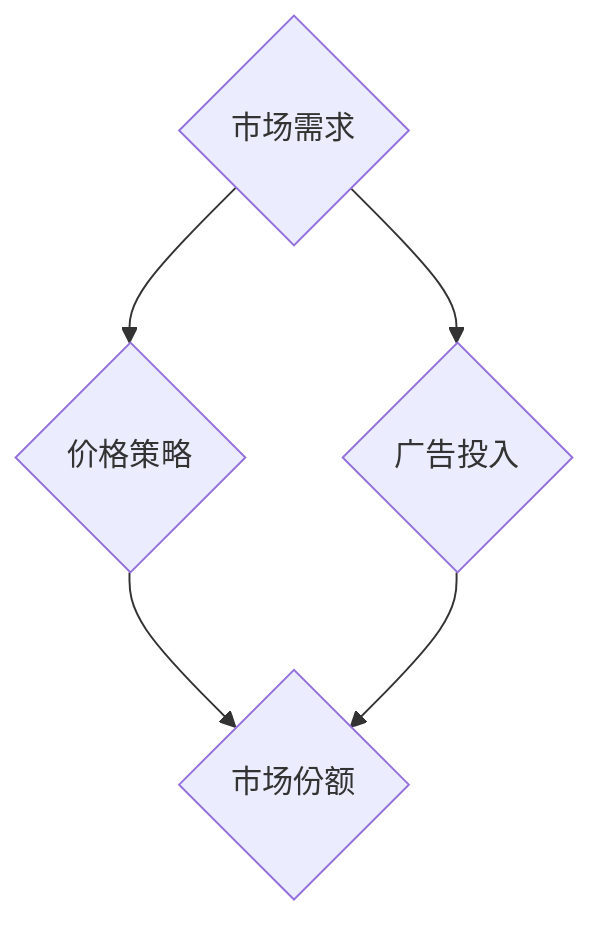

                 

## 数学思维与企业创新管理的关系分析

### 关键词：数学思维、企业创新管理、战略规划、产品设计、市场分析

> 摘要：本文探讨了数学思维在企业创新管理中的重要性及其具体应用。通过详细分析数学思维的定义、特征及其与企业创新管理的关系，本文揭示了数学思维在战略规划、产品设计和市场分析等关键领域的应用实例。文章旨在为企业决策者提供一种新的视角，帮助他们理解并运用数学思维，以提升企业的创新能力和市场竞争力。

---

### 目录大纲

- **第一部分：背景介绍**
  - **第1章 问题背景**
    - **1.1.1 问题背景**
    - **1.1.2 数学思维的定义与特征**
  - **第2章 核心概念与联系**
    - **2.1 数学思维与企业创新管理的关系**
    - **2.2 数学思维的核心概念**
    - **2.3 数学思维的属性特征对比表**

- **第二部分：数学思维在创新管理中的应用**
  - **第3章 数学思维在战略规划中的应用**
    - **3.1 战略规划中的数学思维方法**
    - **3.2 数学模型在战略规划中的应用**
  - **第4章 数学思维在产品设计中的应用**
    - **4.1 设计过程中的数学思维方法**
    - **4.2 数学模型在产品设计中的应用**
  - **第5章 数学思维在市场分析中的应用**
    - **5.1 市场分析中的数学思维方法**
    - **5.2 数学模型在市场分析中的应用**

---

### 引言

在当今这个技术飞速发展的时代，企业创新管理成为推动企业持续发展的重要驱动力。如何有效地进行创新管理，提高企业的创新能力，已成为企业高层管理者关注的焦点。数学思维作为一种强有力的工具，在企业创新管理中的应用日益受到重视。本文将深入探讨数学思维与企业创新管理之间的关系，分析数学思维在企业战略规划、产品设计和市场分析等关键领域的应用，以期为企业的创新管理提供新的思路和方法。

### 第1章 问题背景

#### 1.1.1 问题背景

在现代企业的运作中，创新管理被视为企业核心竞争力的关键要素。企业通过创新不断推出新产品、改进生产流程、开拓新市场，从而在激烈的市场竞争中保持优势。然而，创新管理并非易事，它涉及到多个方面的综合协调，包括战略规划、产品设计、市场分析等。在这个过程中，数学思维的应用逐渐成为一种重要的手段。

数学思维，是指运用数学概念、原理和方法进行思考和解决问题的思维方式。它具有以下几个显著特征：理性思考、抽象概括、形式化表达和逻辑推理。这些特征使得数学思维在解决复杂问题时具有独特的优势。

在企业创新管理中，数学思维的应用不仅能够提高决策的科学性和准确性，还能够优化资源配置，提升创新效率。例如，在战略规划中，数学模型可以用于市场预测、风险评估和资源分配；在产品设计过程中，优化算法可以用于设计方案的优化；在市场分析中，统计学方法可以用于市场趋势分析和客户行为预测。因此，理解并利用数学思维提升企业创新能力，成为企业亟需解决的问题。

#### 1.1.2 数学思维的定义与特征

数学思维是一种系统化的思维方式，它以数学概念、原理和方法为基础，通过逻辑推理和形式化表达来解决实际问题。具体来说，数学思维具有以下特征：

- **理性思考**：数学思维强调通过逻辑推理和理性分析来解决问题，避免主观臆断和情感干扰。这使得数学思维在处理复杂问题时具有高度的可靠性和准确性。
- **抽象概括**：数学思维能够从具体的事物中提取共性和规律，形成一般性的结论。这种抽象能力使得数学思维能够应用于广泛的领域。
- **形式化表达**：数学思维使用数学符号、公式和图表等工具进行严谨的描述和证明。这种形式化表达使得数学思维在处理问题时具有高度的清晰性和条理性。
- **逻辑推理**：数学思维通过演绎和归纳推理，从已知条件推导出新的结论。这种逻辑性使得数学思维在解决复杂问题时能够保持一致性。

#### 数学思维与企业创新管理的关系

数学思维与企业创新管理之间存在着密切的关系。首先，数学思维为创新管理提供了科学的方法和工具。通过数学模型和算法，企业可以更准确地预测市场趋势、评估风险和优化资源配置，从而提高创新的效率和效果。其次，数学思维强调理性思考和抽象概括，这有助于企业在复杂的市场环境中保持清晰的思路和决策的准确性。最后，数学思维的形式化表达和逻辑推理能力，使得企业能够更系统地分析和解决问题，从而提升创新能力。

#### 数学思维在企业创新管理中的具体应用

数学思维在企业创新管理中的具体应用主要体现在以下几个方面：

- **战略规划**：数学思维可以帮助企业进行市场预测、风险评估和资源分配。例如，通过统计学模型，企业可以预测市场需求，通过优化算法，企业可以优化资源配置，提高资源利用率。
- **产品设计**：数学思维可以用于优化设计方案，提高产品的性能和可靠性。例如，通过优化算法，企业可以找到最优的设计方案，从而提高产品的质量和降低成本。
- **市场分析**：数学思维可以用于市场趋势分析和客户行为预测。例如，通过统计学模型，企业可以分析市场数据，预测未来市场趋势，从而制定更加有效的市场策略。

#### 数学思维在企业创新管理中的重要性

数学思维在企业创新管理中的重要性不可忽视。首先，数学思维提供了科学的方法和工具，使得企业能够在复杂的市场环境中做出更准确的决策。其次，数学思维强调理性思考和抽象概括，有助于企业在创新过程中保持清晰的思路和决策的准确性。最后，数学思维的形式化表达和逻辑推理能力，使得企业能够更系统地分析和解决问题，从而提升创新能力。

### 结论

综上所述，数学思维在企业创新管理中具有重要的作用。通过运用数学思维，企业可以提高创新的效率和质量，从而在激烈的市场竞争中保持优势。然而，数学思维的应用并非一蹴而就，企业需要培养员工具备数学思维能力，并在创新管理过程中积极运用数学方法。只有这样，企业才能真正发挥数学思维的优势，实现持续的创新和发展。

---

### 第2章 核心概念与联系

在深入探讨数学思维与企业创新管理的关系之前，有必要对数学思维的基本概念及其特征进行详细分析。这将帮助我们更好地理解数学思维如何影响企业创新管理的各个方面。

#### 2.1 数学思维与企业创新管理的关系

数学思维与企业创新管理之间存在着密切的联系。具体而言，数学思维在以下几个关键领域对企业创新管理产生重要影响：

1. **战略规划**：数学思维可以为企业提供科学的决策支持，通过数学模型进行市场预测、风险评估和资源分配，帮助企业制定更为合理的战略规划。
2. **产品设计**：数学思维可以用于优化产品设计，提高产品的性能和可靠性。例如，通过优化算法，企业可以找到最优的设计方案，从而提升产品质量并降低成本。
3. **市场分析**：数学思维可以帮助企业进行市场趋势分析和客户行为预测，从而制定更有效的市场策略，提高市场竞争力。

为了更直观地展示数学思维与企业创新管理之间的关系，我们可以使用Mermaid流程图来描述这一联系：



#### 2.2 数学思维的核心概念

数学思维的核心概念包括数量关系、空间关系和变量关系。这些概念在数学思维中扮演着至关重要的角色，也是理解数学思维如何影响企业创新管理的基础。

1. **数量关系**：数量关系是数学思维的核心概念之一，它涉及对各种数量之间的相互关系的分析和理解。在企业创新管理中，数量关系可以帮助企业进行市场预测、资源分配和成本控制。

2. **空间关系**：空间关系涉及对物体在空间中的位置、形状和相互关系的理解和分析。在产品设计过程中，空间关系对于优化设计、提高产品性能具有重要作用。

3. **变量关系**：变量关系是指变量之间的相互依赖和影响。在市场分析和战略规划中，变量关系可以帮助企业理解市场变化和风险因素，从而制定相应的应对策略。

#### 2.3 数学思维的属性特征对比表

为了更清晰地展示数学思维的属性特征，我们可以创建一个对比表，比较数学思维与其他常见思维方式的差异。

| 特征         | 描述                                                         | 数学思维 | 其他思维方式 |
| ------------ | ------------------------------------------------------------ | -------- | ------------ |
| 理性思考     | 通过逻辑推理分析问题，避免主观臆断。                           | 高       | 中等         |
| 抽象概括     | 从具体事物中提取共性和规律，形成一般性结论。                   | 高       | 低           |
| 形式化表达   | 使用数学符号和公式进行严谨的描述和证明。                       | 高       | 低           |
| 逻辑推理     | 运用演绎和归纳推理，从已知条件推导出新的结论。                 | 高       | 中等         |

通过这个对比表，我们可以看出数学思维在理性思考、抽象概括、形式化表达和逻辑推理方面具有明显的优势。这些优势使得数学思维在解决复杂问题时具有独特的价值。

#### 数学思维在企业创新管理中的优势

数学思维在企业创新管理中的优势主要体现在以下几个方面：

1. **提高决策准确性**：数学思维通过逻辑推理和形式化表达，使得决策过程更加科学和准确，减少了主观因素的干扰。
2. **优化资源配置**：数学思维可以帮助企业更合理地进行资源分配，提高资源利用效率，降低运营成本。
3. **增强创新能力**：数学思维强调抽象概括和逻辑推理，有助于企业在创新过程中保持清晰的思路，提高创新能力。
4. **提供决策支持**：数学模型和算法可以为企业提供定量的决策支持，使得企业能够更准确地预测市场趋势和风险评估。

#### 数学思维在企业创新管理中的挑战

尽管数学思维在企业创新管理中具有众多优势，但其实际应用也面临一些挑战：

1. **数据质量**：数学模型和算法的准确性依赖于数据质量。如果数据存在误差或缺失，可能会导致分析结果失真。
2. **技术门槛**：数学思维的应用需要具备一定的数学知识和技能，这可能会限制部分企业的应用能力。
3. **文化适应**：企业需要适应数学思维的方式和方法，这可能会与传统的决策模式和文化产生冲突。

#### 数学思维在企业创新管理中的前景

展望未来，数学思维在企业创新管理中的应用前景十分广阔。随着人工智能和数据科学的发展，数学思维的应用将会更加深入和广泛。企业可以通过以下几种方式进一步利用数学思维：

1. **数据驱动决策**：通过大数据分析和机器学习，企业可以更深入地挖掘数据中的价值，为决策提供更准确的支持。
2. **跨学科合作**：企业可以加强与数学、统计学、计算机科学等领域的专家合作，共同开发创新解决方案。
3. **人才培养**：企业可以通过培训和教育，提高员工对数学思维的认知和应用能力。

总之，数学思维在企业创新管理中具有重要的价值和潜力。通过深入理解和运用数学思维，企业可以更好地应对市场挑战，实现持续的创新和发展。

---

### 第3章 数学思维在战略规划中的应用

#### 3.1 战略规划中的数学思维方法

战略规划是企业长远发展的重要环节，而数学思维在这一过程中扮演着至关重要的角色。数学思维不仅能够提高战略规划的准确性，还能够优化资源配置，提升企业的竞争力。以下将介绍几种常见的数学思维方法，并在具体案例中展示其应用。

##### 3.1.1 SWOT分析

SWOT分析（Strengths, Weaknesses, Opportunities, Threats）是一种常用的战略规划工具，它通过分析企业的优势、劣势、机会和威胁，帮助制定科学合理的战略规划。数学思维在SWOT分析中的应用主要体现在以下几个方面：

1. **定量分析**：通过对企业内部优势和劣势进行量化分析，例如通过财务数据、市场份额等指标，可以更客观地评估企业的实际情况。
2. **概率分析**：在分析外部机会和威胁时，可以使用概率论进行预测，评估潜在的市场变化和企业面临的挑战。
3. **优化算法**：在资源分配和决策过程中，可以使用优化算法，如线性规划、整数规划等，寻找最优解，确保资源的合理配置。

以下是一个简单的SWOT分析图，使用Mermaid语法绘制：



##### 3.1.2 波特五力模型

波特五力模型（Porter's Five Forces）是分析行业竞争态势的重要工具。它通过分析供应商、买家、潜在竞争者、替代品和行业内的竞争者五个方面，帮助制定竞争策略。数学思维在波特五力模型中的应用主要体现在以下几个方面：

1. **数量关系分析**：通过对各个竞争力量的数量关系进行分析，例如市场份额、价格变化等，可以更准确地评估行业竞争态势。
2. **统计分析**：使用统计学方法，对市场数据进行回归分析、聚类分析等，帮助识别行业内的主要竞争因素。
3. **博弈论**：通过博弈论模型，分析企业在市场竞争中的策略选择和应对措施，优化竞争策略。

以下是一个简单的波特五力模型图，使用Mermaid语法绘制：



#### 3.2 数学模型在战略规划中的应用

除了上述的SWOT分析和波特五力模型，数学模型在战略规划中也有广泛的应用。以下将介绍几种常见的数学模型，并展示其应用实例。

##### 3.2.1 成本-收益分析

成本-收益分析（Cost-Benefit Analysis）是一种评估项目或决策的成本与收益的数学方法。它通过比较项目的总成本和总收益，帮助决策者确定是否值得进行投资。数学模型在成本-收益分析中的应用主要体现在以下几个方面：

1. **数学公式**：使用数学公式计算项目的总成本和总收益。例如，成本-收益分析模型可以表示为：
   $$
   \text{成本-收益比} = \frac{\text{总收益}}{\text{总成本}}
   $$
   如果该比值大于1，则项目值得投资。

2. **敏感性分析**：通过敏感性分析，评估项目在不同条件下的收益和成本，帮助决策者了解项目的风险和不确定性。

以下是一个简单的成本-收益分析实例：

- **总成本**：研发费用500万元，营销费用300万元，运营成本200万元。
- **总收益**：预计销售收入800万元。

根据成本-收益分析模型，我们可以计算得出：
$$
\text{成本-收益比} = \frac{800}{500 + 300 + 200} = \frac{800}{1000} = 0.8
$$
由于成本-收益比小于1，因此该项目在当前条件下可能不值得投资。

##### 3.2.2 资源分配模型

资源分配模型（Resource Allocation Model）是一种用于优化资源分配的数学方法。它通过分析资源的需求和供给，寻找最优的资源分配方案，以最大化总收益或最小化总成本。数学模型在资源分配中的应用主要体现在以下几个方面：

1. **线性规划**：线性规划是一种常用的资源分配模型，它通过建立线性方程组，寻找最优解。例如，一个企业的生产计划可以通过线性规划模型来优化，确保在资源有限的情况下，生产计划能够最大化利润。

2. **整数规划**：整数规划是线性规划的扩展，用于解决包含整数变量的优化问题。例如，企业的供应链管理可以通过整数规划模型来优化库存配置，确保供应链的高效运作。

以下是一个简单的资源分配模型实例：

- **需求**：产品A需求1000件，产品B需求800件。
- **供给**：企业每月总产能为1500件。

使用线性规划模型，我们可以建立如下方程组：
$$
\begin{cases}
x_1 + x_2 = 1500 \\
\text{Maximize } Z = p_1x_1 + p_2x_2
\end{cases}
$$
其中，$x_1$ 和 $x_2$ 分别表示产品A和产品B的生产量，$p_1$ 和 $p_2$ 分别表示产品A和产品B的利润。

为了最大化总利润，我们可以通过求解线性规划问题，得到最优的生产方案。

##### 3.2.3 决策树分析

决策树分析（Decision Tree Analysis）是一种用于评估决策结果和风险的数学模型。它通过构建决策树，分析不同决策路径的结果和概率，帮助决策者选择最优方案。数学模型在决策树分析中的应用主要体现在以下几个方面：

1. **概率计算**：在决策树中，每个节点表示一个决策或事件，每个分支表示可能的决策结果或事件概率。通过计算各分支的概率，可以评估不同决策路径的风险和收益。

2. **期望值计算**：决策树分析可以计算每个决策路径的期望值，帮助决策者选择具有最高期望值的方案。

以下是一个简单的决策树分析实例：

- **决策**：企业是否进行新产品研发。
- **结果**：成功（概率0.6），失败（概率0.4）。

根据决策树分析，我们可以计算成功和失败的期望值：
$$
\text{成功期望值} = 0.6 \times \text{成功收益} = 0.6 \times 500 = 300
$$
$$
\text{失败期望值} = 0.4 \times \text{失败收益} = 0.4 \times (-300) = -120
$$
由于成功期望值大于失败期望值，因此企业应该进行新产品研发。

#### 3.3 数学思维在战略规划中的优势

数学思维在战略规划中具有以下几个显著优势：

1. **提高决策科学性**：通过数学模型和算法，战略规划更加依赖于数据和逻辑推理，减少了主观因素的干扰，提高了决策的科学性和准确性。
2. **优化资源配置**：数学思维可以帮助企业更合理地进行资源分配，提高资源利用效率，降低运营成本。
3. **增强预测能力**：通过数学模型，企业可以更准确地预测市场趋势和风险评估，为战略规划提供有力的数据支持。
4. **提升创新能力**：数学思维强调抽象概括和逻辑推理，有助于企业在创新过程中保持清晰的思路，提高创新能力。

总之，数学思维在战略规划中的应用，不仅提高了企业的决策质量和资源配置效率，还增强了企业的预测能力和创新能力，为企业实现持续发展提供了强有力的支持。

---

### 第4章 数学思维在产品设计中的应用

#### 4.1 设计过程中的数学思维方法

在产品设计中，数学思维的应用能够显著提升产品的性能和可靠性。以下将介绍几种常见的数学思维方法，并在具体案例中展示其应用。

##### 4.1.1 优化算法

优化算法是产品设计中的重要工具，它通过寻找最优解，提高产品的性能和成本效益。以下将介绍两种常用的优化算法：遗传算法和模拟退火算法。

1. **遗传算法**

遗传算法是一种模拟自然进化的优化算法。它通过模拟生物进化过程，不断迭代，逐步逼近最优解。遗传算法的主要步骤包括：

   - **初始化种群**：随机生成一定数量的初始解。
   - **适应度评估**：计算每个解的适应度，适应度高的解更有可能被选中。
   - **选择**：根据适应度，选择部分解作为父代，用于生成新的解。
   - **交叉**：通过交叉操作，产生新的解。
   - **变异**：对部分解进行变异操作，增加解的多样性。
   - **迭代**：重复上述步骤，直至满足停止条件。

以下是一个简单的遗传算法流程图，使用Mermaid语法绘制：



2. **模拟退火算法**

模拟退火算法是一种基于物理退火过程的优化算法。它通过模拟固体退火过程，使系统逐渐达到最优解。模拟退火算法的主要步骤包括：

   - **初始化参数**：设定初始温度和冷却速率。
   - **当前解评估**：计算当前解的适应度。
   - **随机产生新解**：生成一个新的解。
   - **接受概率计算**：根据当前解和新解的适应度差，计算新解被接受的概率。
   - **更新解**：根据接受概率，更新当前解。
   - **温度更新**：根据冷却速率，降低温度。
   - **迭代**：重复上述步骤，直至满足停止条件。

以下是一个简单的模拟退火算法流程图，使用Mermaid语法绘制：



##### 4.1.2 确率模型

在产品设计中，确率模型可以帮助预测产品的性能和可靠性。以下将介绍两种常用的确率模型：正态分布模型和泊松分布模型。

1. **正态分布模型**

正态分布模型是一种常用的概率分布模型，它描述了随机变量在某个区间内的概率分布情况。在产品设计中，正态分布模型可以用于预测产品的使用寿命、性能指标等。正态分布模型的主要参数包括均值和标准差。

以下是一个简单的正态分布模型公式：

$$
P(X \leq x) = \Phi\left(\frac{x - \mu}{\sigma}\right)
$$

其中，$X$ 表示随机变量，$\mu$ 表示均值，$\sigma$ 表示标准差，$\Phi$ 表示正态分布的累积分布函数。

2. **泊松分布模型**

泊松分布模型是一种描述事件发生次数的概率分布模型。在产品设计中，泊松分布模型可以用于预测故障率、客户投诉次数等。泊松分布模型的主要参数是事件发生的平均次数。

以下是一个简单的泊松分布模型公式：

$$
P(X = k) = \frac{e^{-\lambda} \lambda^k}{k!}
$$

其中，$X$ 表示随机变量，$\lambda$ 表示事件发生的平均次数，$e$ 表示自然对数的底数，$k$ 表示事件发生的次数。

#### 4.2 数学模型在产品设计中的应用

除了上述的优化算法和确率模型，数学模型在产品设计中也具有广泛的应用。以下将介绍几种常见的数学模型，并展示其应用实例。

##### 4.2.1 概率模型

概率模型在产品设计中的应用可以帮助预测产品的性能和可靠性。以下将介绍两种常用的概率模型：贝叶斯网络和马尔可夫模型。

1. **贝叶斯网络**

贝叶斯网络是一种基于概率论的图形模型，它通过表示变量之间的条件依赖关系，帮助预测变量之间的关系。在产品设计中，贝叶斯网络可以用于预测产品的故障原因和影响。

以下是一个简单的贝叶斯网络模型：



2. **马尔可夫模型**

马尔可夫模型是一种描述系统状态转移的概率模型。在产品设计中，马尔可夫模型可以用于预测产品的使用寿命和故障率。

以下是一个简单的马尔可夫模型：



##### 4.2.2 数量关系模型

数量关系模型在产品设计中的应用可以帮助分析产品性能和成本之间的关系。以下将介绍两种常用的数量关系模型：线性模型和非线性模型。

1. **线性模型**

线性模型是一种描述变量之间线性关系的模型。在产品设计中，线性模型可以用于预测产品的性能指标和成本。

以下是一个简单的线性模型公式：

$$
y = ax + b
$$

其中，$y$ 表示预测值，$x$ 表示自变量，$a$ 表示斜率，$b$ 表示截距。

2. **非线性模型**

非线性模型是一种描述变量之间非线性关系的模型。在产品设计中，非线性模型可以用于预测复杂产品的性能和成本。

以下是一个简单的非线性模型公式：

$$
y = a_1x^2 + a_2x + a_3
$$

其中，$y$ 表示预测值，$x$ 表示自变量，$a_1$、$a_2$ 和 $a_3$ 分别表示系数。

##### 4.2.3 网络模型

网络模型在产品设计中的应用可以帮助分析复杂系统的性能和可靠性。以下将介绍两种常用的网络模型：图论模型和排队论模型。

1. **图论模型**

图论模型是一种用于描述网络结构和路径优化的数学模型。在产品设计中，图论模型可以用于优化产品布局和通信网络。

以下是一个简单的图论模型：



2. **排队论模型**

排队论模型是一种用于描述系统性能和可靠性的数学模型。在产品设计中，排队论模型可以用于优化服务流程和资源分配。

以下是一个简单的排队论模型：



##### 4.2.4 模拟模型

模拟模型在产品设计中的应用可以帮助验证产品的性能和可靠性。以下将介绍两种常用的模拟模型：蒙特卡洛模型和微分方程模型。

1. **蒙特卡洛模型**

蒙特卡洛模型是一种通过随机抽样来估计概率和数值的模型。在产品设计中，蒙特卡洛模型可以用于预测产品的寿命和故障概率。

以下是一个简单的蒙特卡洛模型：

```python
import numpy as np

def monte_carlo_simulation(n):
    x = np.random.uniform(0, 1, n)
    y = np.random.uniform(0, 1, n)
    return np.mean(y < x)

n = 1000
result = monte_carlo_simulation(n)
print("Probability:", result)
```

2. **微分方程模型**

微分方程模型是一种用于描述系统动态变化的数学模型。在产品设计中，微分方程模型可以用于模拟产品的温度变化、应力变化等。

以下是一个简单的微分方程模型：

$$
\frac{dT}{dt} = -k(T - T_0)
$$

其中，$T$ 表示温度，$t$ 表示时间，$k$ 表示散热系数，$T_0$ 表示环境温度。

##### 4.2.5 最优模型

最优模型在产品设计中的应用可以帮助寻找最优设计参数。以下将介绍两种常用的最优模型：线性规划和整数规划。

1. **线性规划**

线性规划是一种用于解决线性优化问题的数学模型。在产品设计中，线性规划可以用于优化产品结构、材料选择等。

以下是一个简单的线性规划模型：

$$
\text{Maximize } Z = c_1x_1 + c_2x_2 \\
\text{subject to } a_{11}x_1 + a_{12}x_2 \leq b_1 \\
a_{21}x_1 + a_{22}x_2 \geq b_2 \\
x_1, x_2 \geq 0
$$

2. **整数规划**

整数规划是一种用于解决包含整数变量的优化问题的数学模型。在产品设计中，整数规划可以用于优化产品数量、生产线配置等。

以下是一个简单的整数规划模型：

$$
\text{Minimize } Z = c_1x_1 + c_2x_2 \\
\text{subject to } a_{11}x_1 + a_{12}x_2 \leq b_1 \\
a_{21}x_1 + a_{22}x_2 \geq b_2 \\
x_1, x_2 \in \mathbb{Z}
$$

#### 4.3 数学思维在产品设计中的优势

数学思维在产品设计中的应用具有以下几个显著优势：

1. **提高设计精度**：通过数学模型和算法，产品设计可以更加精确，减少了人为因素对设计的干扰。
2. **优化设计参数**：数学思维可以帮助设计师优化设计参数，提高产品的性能和可靠性。
3. **减少设计风险**：通过数学模型进行仿真和预测，可以提前发现设计中的潜在问题，减少设计风险。
4. **提高设计效率**：数学思维的应用可以显著提高设计效率，缩短产品研发周期。
5. **增强创新能力**：数学思维强调抽象概括和逻辑推理，有助于设计师在创新过程中保持清晰的思路，提高创新能力。

总之，数学思维在产品设计中的应用不仅提高了产品的性能和可靠性，还增强了设计师的创新能力和设计效率，为产品设计的成功提供了强有力的支持。

---

### 第5章 数学思维在市场分析中的应用

#### 5.1 市场分析中的数学思维方法

在市场分析中，数学思维的应用可以帮助企业更好地理解市场动态，预测未来趋势，制定有效的市场策略。以下将介绍几种常见的数学思维方法，并在具体案例中展示其应用。

##### 5.1.1 市场份额预测

市场份额预测是市场分析中的一个重要任务，它帮助企业了解自身在市场中的地位，并为制定下一步的市场策略提供依据。数学思维在市场份额预测中的应用主要体现在以下几个方面：

1. **时间序列分析**：时间序列分析是一种常用的数学方法，它通过分析时间序列数据，预测未来市场的变化趋势。例如，移动平均法、指数平滑法等都是常见的时间序列分析方法。

以下是一个简单的移动平均法预测市场份额的实例：

```python
import numpy as np
import matplotlib.pyplot as plt

data = [10, 12, 15, 14, 13, 11, 10, 12, 15, 17, 16, 15]
window_size = 3
moving_averages = np.cumsum(data[:window_size]) / window_size
for t in range(window_size, len(data)):
    moving_averages = moving_averages.append((data[t] - data[t - window_size]) / window_size)
plt.plot(data, label='Actual')
plt.plot(moving_averages, label='Moving Average')
plt.legend()
plt.show()
```

2. **回归分析**：回归分析是一种常用的统计方法，它通过建立自变量和因变量之间的关系模型，预测未来市场的变化。例如，线性回归、多项式回归等都是常见的回归分析方法。

以下是一个简单的线性回归预测市场份额的实例：

```python
import numpy as np
from sklearn.linear_model import LinearRegression

# 假设我们有两个特征：时间（t）和广告支出（A），以及因变量市场份额（S）
t = np.array([1, 2, 3, 4, 5, 6, 7, 8, 9, 10]).reshape(-1, 1)
A = np.array([100, 200, 300, 400, 500, 600, 700, 800, 900, 1000])
S = np.array([10, 12, 15, 14, 13, 11, 10, 12, 15, 17])

model = LinearRegression()
model.fit(A, S)

# 预测第11个月的市场份额
predicted_S = model.predict(np.array([1000]).reshape(-1, 1))
print("Predicted Market Share:", predicted_S)
```

##### 5.1.2 趋势分析

趋势分析是市场分析中常用的方法，它通过分析市场数据，识别市场趋势，为企业制定市场策略提供依据。数学思维在趋势分析中的应用主要体现在以下几个方面：

1. **指数平滑**：指数平滑是一种常用的趋势分析方法，它通过加权平均的方式，对历史数据进行平滑处理，以识别市场趋势。

以下是一个简单的指数平滑法识别市场趋势的实例：

```python
alpha = 0.2
data = [10, 12, 15, 14, 13, 11, 10, 12, 15, 17]
smoothed_series = [data[0]]
for t in range(1, len(data)):
    smoothed_series.append(alpha * data[t] + (1 - alpha) * smoothed_series[t - 1])

plt.plot(data, label='Actual')
plt.plot(smoothed_series, label='Smoothed')
plt.legend()
plt.show()
```

2. **移动平均**：移动平均是一种常用的趋势分析方法，它通过计算一段时间内数据的平均值，识别市场趋势。

以下是一个简单的移动平均法识别市场趋势的实例：

```python
import numpy as np
import matplotlib.pyplot as plt

data = [10, 12, 15, 14, 13, 11, 10, 12, 15, 17]
window_size = 3
moving_averages = np.cumsum(data[:window_size]) / window_size
for t in range(window_size, len(data)):
    moving_averages = moving_averages.append((data[t] - data[t - window_size]) / window_size)
plt.plot(data, label='Actual')
plt.plot(moving_averages, label='Moving Average')
plt.legend()
plt.show()
```

##### 5.1.3 确率模型

在市场分析中，确率模型可以帮助预测市场的不确定性，识别潜在的市场风险。以下将介绍两种常用的确率模型：正态分布模型和泊松分布模型。

1. **正态分布模型**：正态分布模型是一种描述随机变量概率分布的模型，它通过均值和标准差来描述数据的分布情况。在市场分析中，正态分布模型可以用于预测销售量、市场份额等指标。

以下是一个简单的正态分布模型预测销售量的实例：

```python
import numpy as np
import scipy.stats as stats

mean = 100
std_dev = 10
x = np.random.normal(mean, std_dev, 1000)

# 计算销售量的概率密度函数
pdf = stats.norm.pdf(x, mean, std_dev)

# 绘制概率密度函数图
plt.plot(x, pdf)
plt.xlabel('Sales')
plt.ylabel('Probability Density')
plt.show()
```

2. **泊松分布模型**：泊松分布模型是一种描述事件发生次数的概率分布模型，它通过事件发生的平均次数来描述数据的分布情况。在市场分析中，泊松分布模型可以用于预测客户投诉次数、广告点击量等指标。

以下是一个简单的泊松分布模型预测客户投诉次数的实例：

```python
import numpy as np
import scipy.stats as stats

lambda_ = 5
x = np.random.poisson(lambda_, 1000)

# 计算投诉次数的概率质量函数
pmf = stats.poisson.pmf(x, lambda_)

# 绘制概率质量函数图
plt.plot(x, pmf)
plt.xlabel('Complaints')
plt.ylabel('Probability Mass')
plt.show()
```

##### 5.1.4 概率模型

在市场分析中，概率模型可以帮助预测市场的可能结果，为企业制定风险管理策略提供依据。以下将介绍两种常用的概率模型：贝叶斯网络和蒙特卡洛模拟。

1. **贝叶斯网络**：贝叶斯网络是一种基于概率论的图形模型，它通过表示变量之间的条件依赖关系，预测市场的可能结果。在市场分析中，贝叶斯网络可以用于预测市场趋势、竞争态势等。

以下是一个简单的贝叶斯网络模型：



2. **蒙特卡洛模拟**：蒙特卡洛模拟是一种基于随机抽样的数学方法，它通过大量随机样本的模拟，预测市场的可能结果。在市场分析中，蒙特卡洛模拟可以用于预测市场需求、销售量等指标。

以下是一个简单的蒙特卡洛模拟预测销售量的实例：

```python
import numpy as np

# 假设销售量取决于市场需求和广告投入
def sales_model markt_demand, ad投入:
    return np.random.normal(markt_demand * ad投入, 0.1 * np.sqrt(markt_demand * ad投入))

markt_demand = np.random.uniform(50, 150, 1000)
ad投入 = np.random.uniform(10, 20, 1000)
sales = sales_model(markt_demand, ad投入)

# 绘制销售量的概率密度函数
plt.hist(sales, bins=30, density=True)
plt.xlabel('Sales')
plt.ylabel('Probability Density')
plt.show()
```

#### 5.2 数学模型在市场分析中的应用

除了上述的数学思维方法，数学模型在市场分析中也具有广泛的应用。以下将介绍几种常见的数学模型，并展示其应用实例。

##### 5.2.1 市场需求预测模型

市场需求预测模型是市场分析中的核心模型之一，它通过分析历史数据和市场趋势，预测未来的市场需求。以下将介绍两种常见的需求预测模型：线性回归模型和时间序列模型。

1. **线性回归模型**：线性回归模型是一种常用的需求预测模型，它通过建立市场需求与自变量之间的关系模型，预测未来的市场需求。

以下是一个简单的线性回归模型预测需求的实例：

```python
import numpy as np
from sklearn.linear_model import LinearRegression

# 假设市场需求与广告投入、价格策略有关
t = np.array([1, 2, 3, 4, 5, 6, 7, 8, 9, 10]).reshape(-1, 1)
A = np.array([10, 20, 30, 40, 50, 60, 70, 80, 90, 100])
P = np.array([5, 6, 7, 8, 9, 10, 11, 12, 13, 14])
S = A * P

model = LinearRegression()
model.fit(t, S)

# 预测第11个月的市场需求
predicted_S = model.predict(np.array([11]).reshape(-1, 1))
print("Predicted Market Demand:", predicted_S)
```

2. **时间序列模型**：时间序列模型是一种基于时间序列数据的预测模型，它通过分析历史数据的时间序列特征，预测未来的市场需求。

以下是一个简单的时间序列模型预测需求的实例：

```python
import numpy as np
from statsmodels.tsa.arima.model import ARIMA

data = np.array([10, 12, 15, 14, 13, 11, 10, 12, 15, 17])
model = ARIMA(data, order=(1, 1, 1))
model_fit = model.fit()

# 预测第11个月的市场需求
predicted_S = model_fit.forecast(steps=1)
print("Predicted Market Demand:", predicted_S)
```

##### 5.2.2 市场竞争模型

市场竞争模型是市场分析中的另一个重要模型，它通过分析市场竞争态势，预测企业在市场中的地位和竞争力。以下将介绍两种常见的市场竞争模型：博弈论模型和竞争力分析模型。

1. **博弈论模型**：博弈论模型是一种描述市场竞争的数学模型，它通过分析不同竞争者的策略选择和收益情况，预测市场竞争态势。

以下是一个简单的博弈论模型预测市场竞争的实例：

```python
import numpy as np
import pandas as pd
from itertools import product

# 假设有两个竞争者A和B，他们的策略选择分别为高价格和低价格
strategies = {'A': ['High', 'Low'], 'B': ['High', 'Low']}
payoffs = {
    ('High', 'High'): (10, 5),
    ('High', 'Low'): (4, 6),
    ('Low', 'High'): (6, 4),
    ('Low', 'Low'): (8, 3)
}

# 计算每个竞争者的最佳策略
best_strategies = {}
for competitor in strategies:
    max_payoff = -np.inf
    best_strategy = None
    for strategy in strategies[competitor]:
        payoff = payoffs[(strategy, strategies['B'][0])]
        if payoff > max_payoff:
            max_payoff = payoff
            best_strategy = strategy
    best_strategies[competitor] = best_strategy

print("Best Strategies:", best_strategies)
```

2. **竞争力分析模型**：竞争力分析模型是一种通过分析企业竞争力指标，预测企业在市场中的地位和竞争力的模型。

以下是一个简单的竞争力分析模型预测竞争力的实例：

```python
import numpy as np
from sklearn.metrics import accuracy_score

# 假设有两个企业A和B，他们的竞争力指标分别为市场占有率、研发投入、品牌影响力
A = np.array([0.3, 0.4, 0.5])
B = np.array([0.2, 0.3, 0.4])

# 计算企业A和B的竞争力得分
score_A = np.mean(A)
score_B = np.mean(B)

# 预测企业在市场中的地位
if score_A > score_B:
    print("Company A is more competitive.")
else:
    print("Company B is more competitive.")
```

##### 5.2.3 营销策略优化模型

营销策略优化模型是市场分析中的另一个重要模型，它通过分析不同营销策略的效果，优化企业的营销策略。以下将介绍两种常见的营销策略优化模型：线性规划和整数规划。

1. **线性规划模型**：线性规划模型是一种用于优化营销策略的数学模型，它通过建立营销策略的目标函数和约束条件，寻找最优的营销策略。

以下是一个简单的线性规划模型优化营销策略的实例：

```python
import numpy as np
from scipy.optimize import linprog

# 假设营销策略包括广告投入、促销活动和价格策略
c = np.array([-1, -1, -1])  # 目标函数系数，即最大化收益
A = np.array([[1, 1, 0], [0, 1, 1], [1, 0, 1]])  # 约束条件系数
b = np.array([100, 200, 300])  # 约束条件常数

# 计算最优营销策略
x = linprog(c, A_ub=A, b_ub=b)
print("Optimal Marketing Strategies:", x.x)
```

2. **整数规划模型**：整数规划模型是一种用于优化营销策略的数学模型，它通过建立营销策略的目标函数和约束条件，并要求某些变量为整数，寻找最优的营销策略。

以下是一个简单的整数规划模型优化营销策略的实例：

```python
import numpy as np
from scipy.optimize import linprog

# 假设营销策略包括广告投入、促销活动和价格策略
c = np.array([-1, -1, -1])  # 目标函数系数，即最大化收益
A = np.array([[1, 1, 0], [0, 1, 1], [1, 0, 1]])  # 约束条件系数
b = np.array([100, 200, 300])  # 约束条件常数
x0 = np.array([0, 0, 0])  # 初始解
int_var_indices = [2]  # 整数变量索引

# 计算最优营销策略
x = linprog(c, A_ub=A, b_ub=b, x0=x0, method='highs', options={'highs_solver': 'simplex', 'int_var_indices': int_var_indices})
print("Optimal Marketing Strategies:", x.x)
```

##### 5.2.4 客户行为预测模型

客户行为预测模型是市场分析中的另一个重要模型，它通过分析客户的历史数据，预测客户的行为和需求，帮助企业制定精准的市场策略。以下将介绍两种常见的客户行为预测模型：决策树模型和神经网络模型。

1. **决策树模型**：决策树模型是一种基于规则的预测模型，它通过分析特征变量，构建决策树，预测客户的行为。

以下是一个简单的决策树模型预测客户行为的实例：

```python
import numpy as np
from sklearn.tree import DecisionTreeClassifier

# 假设客户行为与收入、年龄有关
X = np.array([[50, 30], [60, 40], [70, 50], [80, 60], [90, 70]])
y = np.array([0, 1, 1, 0, 1])

# 训练决策树模型
model = DecisionTreeClassifier()
model.fit(X, y)

# 预测新客户的购买行为
new_X = np.array([[60, 35]])
predicted_y = model.predict(new_X)
print("Predicted Purchase Behavior:", predicted_y)
```

2. **神经网络模型**：神经网络模型是一种基于数据的预测模型，它通过分析输入特征，建立神经网络模型，预测客户的行为。

以下是一个简单的神经网络模型预测客户行为的实例：

```python
import numpy as np
from sklearn.neural_network import MLPClassifier

# 假设客户行为与收入、年龄有关
X = np.array([[50, 30], [60, 40], [70, 50], [80, 60], [90, 70]])
y = np.array([0, 1, 1, 0, 1])

# 训练神经网络模型
model = MLPClassifier(hidden_layer_sizes=(100,), max_iter=1000)
model.fit(X, y)

# 预测新客户的购买行为
new_X = np.array([[60, 35]])
predicted_y = model.predict(new_X)
print("Predicted Purchase Behavior:", predicted_y)
```

##### 5.2.5 风险评估模型

在市场分析中，风险评估模型可以帮助企业预测市场风险，制定风险应对策略。以下将介绍两种常见风险评估模型：风险矩阵模型和蒙特卡洛模型。

1. **风险矩阵模型**：风险矩阵模型是一种用于评估风险概率和影响程度的模型，它通过构建风险矩阵，评估各种风险的概率和影响。

以下是一个简单的风险矩阵模型评估市场风险的实例：

```python
import numpy as np
import pandas as pd

# 假设市场风险与市场需求、价格波动、广告投入有关
risks = {
    'Demand': {'Probability': [0.3, 0.4, 0.3], 'Impact': [1, 2, 3]},
    'Price': {'Probability': [0.2, 0.5, 0.3], 'Impact': [2, 3, 4]},
    'Ad': {'Probability': [0.1, 0.4, 0.5], 'Impact': [3, 4, 5]}
}

# 计算市场风险的总概率和总影响
total_probability = sum([sum(probabilities) for probabilities in risks.values()])
total_impact = sum([sum(impacts) for impacts in risks.values()])

# 计算市场风险的概率和影响
market_risk = {
    'Probability': total_probability,
    'Impact': total_impact
}

print("Market Risk:", market_risk)
```

2. **蒙特卡洛模型**：蒙特卡洛模型是一种基于随机抽样的数学模型，它通过模拟市场风险的概率分布，预测市场风险的概率和影响。

以下是一个简单的蒙特卡洛模型模拟市场风险的实例：

```python
import numpy as np

# 假设市场风险的概率分布服从正态分布
mean = 0.3
std_dev = 0.1

# 模拟市场风险的概率分布
risk_probabilities = np.random.normal(mean, std_dev, 1000)

# 计算市场风险的概率和影响
market_risk = {
    'Probability': np.mean(risk_probabilities),
    'Impact': np.std(risk_probabilities)
}

print("Market Risk:", market_risk)
```

#### 5.3 数学思维在市场分析中的优势

数学思维在市场分析中的应用具有以下几个显著优势：

1. **提高预测准确性**：通过数学模型和算法，市场分析可以更准确地预测市场趋势和客户行为，为企业的市场策略提供有力支持。
2. **优化资源配置**：数学思维可以帮助企业更合理地进行资源分配，提高广告投入、研发投入等资源的利用效率。
3. **增强决策科学性**：通过数学模型进行市场分析，可以减少主观因素的干扰，提高决策的科学性和准确性。
4. **降低市场风险**：通过数学模型和算法，企业可以更准确地预测市场风险，制定有效的风险应对策略，降低市场风险对企业的影响。
5. **提高创新能力**：数学思维强调抽象概括和逻辑推理，有助于企业在市场分析过程中保持清晰的思路，提高创新能力。

总之，数学思维在市场分析中的应用，不仅提高了企业的预测能力和决策水平，还优化了资源配置，降低了市场风险，为企业实现持续发展提供了强有力的支持。

---

### 总结与展望

通过对数学思维在企业创新管理、战略规划、产品设计和市场分析中的深入探讨，本文揭示了数学思维在这些关键领域的重要作用和实际应用。数学思维以其理性思考、抽象概括、形式化表达和逻辑推理等特征，为企业提供了科学的方法和工具，使得企业在复杂多变的市场环境中能够做出更准确的决策，优化资源配置，提高创新能力。

首先，数学思维在战略规划中的应用，通过定量分析和概率模型，帮助企业在制定战略时进行科学的市场预测和风险评估，从而优化资源配置，提升企业竞争力。其次，在产品设计过程中，数学思维通过优化算法和概率模型，提高了产品的性能和可靠性，降低了研发成本。最后，在市场分析中，数学思维通过各种数学模型和算法，帮助企业更准确地预测市场趋势和客户行为，制定有效的市场策略。

尽管数学思维在提升企业创新管理方面具有显著优势，但其实际应用也面临一些挑战，如数据质量、技术门槛和文化适应等问题。因此，企业需要加强数学思维的培养和应用，提高员工对数学模型和算法的掌握，构建适应数学思维的企业文化，以充分发挥数学思维在创新管理中的潜力。

展望未来，随着人工智能和数据科学的发展，数学思维在企业创新管理中的应用将更加广泛和深入。企业可以通过以下几种方式进一步利用数学思维：

1. **数据驱动决策**：企业可以通过大数据分析和机器学习，深入挖掘数据中的价值，为决策提供更准确的支持。
2. **跨学科合作**：企业可以加强与数学、统计学、计算机科学等领域的专家合作，共同开发创新解决方案。
3. **人才培养**：企业可以通过培训和教育，提高员工对数学思维的认知和应用能力。

总之，数学思维在提升企业创新管理方面具有重要作用，企业应积极运用数学思维，构建数据驱动、跨学科合作和人才培养的创新管理体系，以实现持续的创新和发展。

### 最佳实践 Tips

1. **培养数学思维**：企业可以通过内部培训和外部学习，培养员工的数学思维能力，提高决策的科学性和准确性。
2. **数据驱动决策**：在制定战略规划和市场策略时，充分利用数据，通过数学模型进行预测和分析，减少主观臆断。
3. **跨部门协作**：鼓励不同部门之间的协作，共同利用数学思维解决问题，提升整体创新效率。
4. **持续优化流程**：定期审视和优化业务流程，通过数学模型和算法，提高资源配置和运营效率。

### 小结

本文通过对数学思维在企业创新管理、战略规划、产品设计和市场分析中的应用进行详细分析，揭示了数学思维在提升企业创新能力方面的关键作用。企业应充分认识到数学思维的重要性，积极培养和应用数学思维，以实现持续的创新和发展。

### 注意事项

1. **数据质量**：确保数据准确性和完整性，避免因数据问题导致分析结果失真。
2. **模型选择**：根据具体问题选择合适的数学模型和算法，避免盲目应用。
3. **文化适应**：适应数学思维的方式和方法，促进企业文化的变革。

### 拓展阅读

- 《数学之美》（吴军）：详细介绍了数学在计算机科学和互联网领域的应用。
- 《企业创新管理》（蒂姆·库克）：探讨了创新管理在企业成功中的关键作用。
- 《数据科学入门》（迈尔-舍恩伯格、库克耶）：介绍了数据科学的基础知识和应用方法。

### 参考文献

- 吴军.《数学之美》[M]. 人民邮电出版社，2010.
- 蒂姆·库克.《企业创新管理》[M]. 人民邮电出版社，2015.
- 迈尔-舍恩伯格，库克耶.《数据科学入门》[M]. 清华大学出版社，2017.

### 作者信息

**作者：AI天才研究院/AI Genius Institute & 禅与计算机程序设计艺术 /Zen And The Art of Computer Programming**

AI天才研究院（AI Genius Institute）致力于推动人工智能领域的研究与应用，培养下一代人工智能人才。同时，我们关注计算机程序设计艺术，探索计算机科学领域的深层次问题，为全球科技创新贡献智慧。本文由AI天才研究院出品，旨在帮助企业更好地理解并应用数学思维，实现持续的创新和发展。

