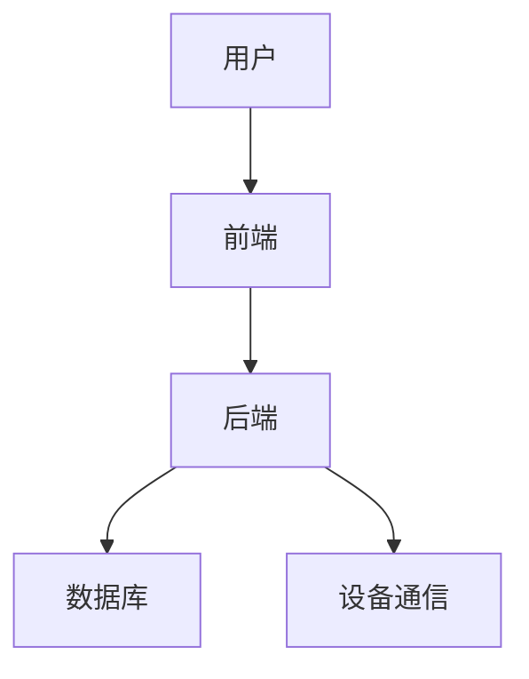
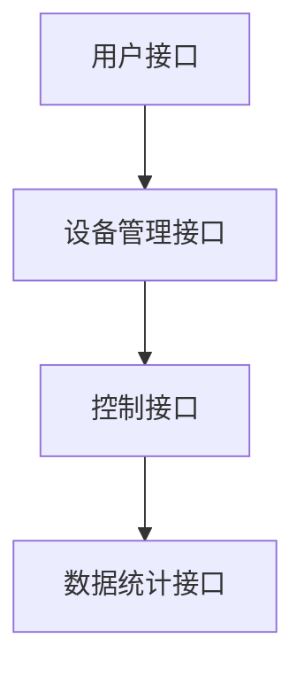
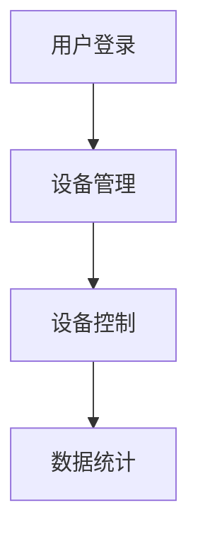

                 

### 文章标题

> 关键词：数学思维、创业决策、逻辑思维、概率论、线性规划

> 摘要：本文将探讨数学思维如何影响和指导创业决策，通过详细的分析和具体的案例，阐述数学思维在创业决策中的重要性以及其实际应用。

----------------------------------------------------------------

## 引言

在当今复杂多变的市场环境中，创业不再是少数人的专利，而逐渐成为了一种广泛的社会现象。然而，创业的成功不仅仅依赖于创新的产品或服务，更重要的是创业者需要具备科学的决策能力。数学思维作为一种理性的、系统性的思考方式，正日益受到创业者和企业家的重视。本文旨在探讨数学思维与创业决策之间的关系，通过系统的分析和具体的案例，帮助读者理解并应用数学思维来提升创业决策的质量。

数学思维不仅仅是数学家的专利，它是一种可以广泛应用于各个领域的思考方法。在创业领域，数学思维可以帮助创业者进行逻辑推理、风险评估、资源分配等关键决策。通过数学模型和算法的应用，创业者可以更加科学地分析市场数据、预测未来趋势，从而做出更为明智的决策。本文将分几个部分来详细阐述数学思维在创业决策中的应用。

首先，我们将介绍数学思维的基本概念，包括逻辑思维、概率论和线性规划等，并解释它们如何与创业决策相关联。接着，我们将深入探讨这些数学思维在创业决策中的具体应用，并通过案例来展示它们的效果。随后，我们将介绍数学模型和数学公式在创业决策中的作用，并详细讲解其原理和应用。此外，我们还将通过系统分析和架构设计方案来展示如何将数学思维应用于实际的创业项目中。最后，我们将总结本文的内容，并提供一些实用的建议和拓展阅读资源，帮助读者进一步深入理解数学思维与创业决策的关系。

## 数学思维的基本概念

数学思维是一种以逻辑和数量为基础的思考方式，它强调通过严密的推理和精确的计算来解决问题。在创业决策中，数学思维可以帮助创业者进行理性分析，从而做出更明智的决策。以下将介绍几种关键的数学思维概念：逻辑思维、概率论和线性规划，并探讨它们在创业决策中的应用。

### 逻辑思维

逻辑思维是数学思维的核心部分，它通过推理和证明来分析问题的本质。在创业决策中，逻辑思维可以帮助创业者进行清晰的战略规划和市场分析。

#### 演绎逻辑

演绎逻辑是从一般原则推导出具体结论的过程。例如，如果所有创业公司都需要进行市场调研，而某家公司没有进行市场调研，那么这家公司就不是一家成功的创业公司。这种逻辑推理可以帮助创业者识别潜在的风险和问题。

#### 归纳逻辑

归纳逻辑是从具体案例中总结出一般规律的过程。例如，通过对多个成功的创业案例进行分析，创业者可以总结出一些通用的成功因素，如团队协作、市场洞察力等。这些归纳出来的规律可以指导创业者在未来的决策中更加科学地行动。

### 概率论

概率论是数学中的一个重要分支，它研究不确定事件的发生概率。在创业决策中，概率论可以帮助创业者进行风险评估和决策。

#### 概率的定义

概率是指某个事件在所有可能事件中发生的可能性。例如，在市场上推出一款新产品，成功的概率可能是50%，这意味着在两次尝试中，大约有1次会成功。

#### 条件概率

条件概率是指在一个特定条件下，某个事件发生的概率。例如，如果已知某款产品的市场渗透率是20%，那么在推出类似产品时，成功的概率可能会受到这个条件的影响。

#### 贝叶斯定理

贝叶斯定理是一种用于更新概率估计的数学公式。在创业决策中，贝叶斯定理可以帮助创业者根据新的信息调整其对市场或产品成功的预测。例如，如果市场调研结果显示潜在客户对产品的兴趣增加了，创业者可以根据这些新信息提高对产品成功的预期概率。

### 线性规划

线性规划是数学中用于解决资源分配和优化问题的方法。在创业决策中，线性规划可以帮助创业者优化资源配置，提高效率和盈利能力。

#### 线性规划的定义

线性规划是一个数学模型，它包含一组线性约束条件和目标函数，目标是通过调整变量来最大化或最小化目标函数。例如，一家初创公司可能需要确定生产多少产品才能最大化利润，同时满足资源限制。

#### 线性规划的基本模型

线性规划的基本模型通常包含以下要素：

- 目标函数：表示要优化的量，如利润、成本等。
- 约束条件：限制变量取值范围的条件，如资源限制、生产能力等。

通过线性规划，创业者可以找到最优的资源配置方案，从而提高企业的运营效率。

### 数学思维与创业决策的关系

数学思维在创业决策中的应用主要体现在以下几个方面：

1. **战略规划**：逻辑思维可以帮助创业者进行清晰的战略规划，从而更好地定位市场。
2. **风险评估**：概率论可以帮助创业者评估创业风险，制定相应的风险管理策略。
3. **资源分配**：线性规划可以帮助创业者优化资源配置，提高企业的效率和盈利能力。

通过上述分析，可以看出，数学思维是创业决策中不可或缺的一部分。它不仅帮助创业者进行理性分析，还能提高决策的准确性和科学性。接下来，我们将通过具体的案例来展示数学思维在创业决策中的应用。

## 逻辑思维与创业决策

逻辑思维是数学思维的核心组成部分，它在创业决策中的应用尤为显著。逻辑思维强调通过推理和分析来揭示事物的本质和规律，这对于创业者制定科学、合理的战略规划至关重要。

### 创业计划制定

逻辑思维在创业计划的制定过程中扮演着关键角色。创业者需要从多个角度对市场进行深入分析，包括市场需求、竞争态势、目标客户群体等。通过逻辑思维，创业者可以识别出市场中的关键因素，并基于这些因素制定出切实可行的创业计划。

#### 市场需求的逻辑分析

例如，创业者可以通过以下步骤来分析市场需求：

1. **定义目标市场**：明确目标市场的范围和特征，如地理位置、人口统计等。
2. **需求调查**：通过问卷、访谈等方式收集目标市场的需求信息。
3. **数据分析**：运用逻辑推理对收集到的数据进行分析，识别出市场需求的特征和趋势。
4. **制定策略**：根据分析结果，制定相应的市场进入策略和产品定位。

#### 竞争态势的逻辑分析

在竞争激烈的市场环境中，逻辑思维可以帮助创业者识别竞争对手的优势和劣势，从而制定出有效的竞争策略。以下是一个简化的逻辑分析步骤：

1. **识别竞争对手**：列出主要竞争对手及其产品或服务。
2. **分析竞争优势**：评估每个竞争对手的市场份额、品牌影响力、技术实力等。
3. **评估自身竞争优势**：对比竞争对手，识别自身的竞争优势和劣势。
4. **制定竞争策略**：基于分析结果，制定出有针对性的竞争策略，如差异化定位、价格策略等。

### 市场分析的逻辑框架

在创业决策过程中，市场分析是不可或缺的一环。逻辑思维提供了一个系统的框架来指导市场分析：

1. **明确分析目标**：确定市场分析的具体目标和范围。
2. **数据收集**：通过多种渠道收集市场数据，如市场调研报告、行业数据等。
3. **数据处理**：运用逻辑思维对收集到的数据进行整理和分析，识别关键信息。
4. **形成结论**：基于数据分析结果，形成关于市场趋势、竞争态势的结论。
5. **制定决策**：根据结论，制定相应的创业策略和市场行动计划。

通过逻辑思维的合理应用，创业者可以更准确地识别市场机会，规避风险，制定出科学的创业计划。接下来，我们将探讨概率论在创业决策中的应用，进一步展示数学思维在创业决策中的重要性。

### 概率论与创业决策

概率论是数学中用于量化不确定性和风险分析的重要工具。在创业决策中，概率论可以帮助创业者评估市场风险、预测投资回报，从而制定更加科学的决策。以下将介绍概率论的基本概念及其在创业决策中的应用。

#### 概率的定义

概率是衡量某个事件发生可能性大小的数值。概率值的范围介于0和1之间，其中0表示事件不可能发生，1表示事件必然发生。例如，在推出一款新产品时，创业者可能会预测其成功的概率为0.6，这意味着在10次尝试中，大约有6次会成功。

#### 条件概率

条件概率是指在一个特定条件下，某个事件发生的概率。例如，如果已知一款产品的市场渗透率为20%，那么在另一个类似市场推出这款产品时，其成功的概率可能会受到这个条件的影响。条件概率的应用可以帮助创业者根据已有信息调整对市场或产品成功的预测。

#### 贝叶斯定理

贝叶斯定理是一种用于更新概率估计的数学公式。它基于新的信息来调整已有的概率估计，从而提高预测的准确性。在创业决策中，贝叶斯定理可以帮助创业者根据市场反馈、客户反馈等新信息，更新对市场机会或产品成功的概率估计。

#### 概率论在创业决策中的应用

1. **风险评估**

   概率论在风险评估中具有重要作用。创业者可以使用概率论来评估市场风险、技术风险等。例如，在进入一个新市场时，可以通过分析历史数据、行业报告等，估计市场风险的概率。这种风险评估可以帮助创业者制定相应的风险应对策略，降低创业失败的风险。

2. **投资决策**

   在创业过程中，投资决策至关重要。概率论可以帮助创业者评估不同投资方案的风险和回报。例如，创业者可以根据市场需求、竞争态势等因素，估计不同产品线的成功率。通过计算不同投资方案的概率分布，创业者可以更科学地选择最具潜力的投资方向。

3. **市场预测**

   概率论在市场预测中也有广泛应用。创业者可以使用概率模型来预测市场需求、客户行为等。例如，通过分析历史销售数据，可以估计未来某个时间段内的销售额。这种市场预测可以帮助创业者制定生产计划、营销策略等，提高运营效率。

#### 案例分析

假设一家初创公司计划推出一款智能家居产品。在决策过程中，公司可以使用概率论进行以下分析：

1. **市场需求分析**

   通过市场调研和历史数据，公司可以估计智能家居产品的市场需求概率。例如，如果市场调研结果显示，有70%的消费者对智能家居产品感兴趣，那么公司可以预测市场需求量。

2. **竞争分析**

   公司可以通过分析竞争对手的产品和市场份额，估计自身产品的市场渗透率。例如，如果已知竞争对手的市场份额为30%，那么公司可以预测在同等市场条件下，自身产品的市场渗透率。

3. **投资回报分析**

   公司可以使用概率论来评估不同投资方案（如研发费用、市场营销费用等）的投资回报。通过计算不同投资方案的概率分布，公司可以预测在不同市场条件下，投资方案的回报率。

通过上述分析，公司可以更科学地制定创业决策，降低创业风险，提高成功率。接下来，我们将探讨线性规划在创业决策中的应用。

### 线性规划与创业决策

线性规划是数学中用于解决资源分配和优化问题的一种方法。在创业决策中，线性规划可以帮助创业者优化资源配置，提高效率和盈利能力。以下将介绍线性规划的基本概念及其在创业决策中的应用。

#### 线性规划的定义

线性规划是一个数学模型，它包含一组线性约束条件和目标函数。目标函数表示要优化的量，如利润、成本等；约束条件则限制变量取值范围。线性规划的目标是通过调整变量来最大化或最小化目标函数。

#### 线性规划的基本模型

线性规划的基本模型通常包含以下要素：

1. **目标函数**：表示要优化的量，如利润、成本等。
2. **约束条件**：限制变量取值范围的条件，如资源限制、生产能力等。

#### 线性规划在创业决策中的应用

1. **资源分配**

   在创业过程中，资源分配是一个关键问题。线性规划可以帮助创业者确定如何最优地分配资源，从而提高效率。例如，一家初创公司需要决定生产多少产品才能最大化利润，同时满足资源限制。通过线性规划，公司可以找到最优的资源配置方案，从而最大化利润。

2. **生产计划**

   生产计划是创业决策中的重要环节。线性规划可以帮助创业者制定最优的生产计划，确保生产效率。例如，公司需要决定生产哪些产品，生产多少，以最大化利润或最小化成本。通过线性规划，公司可以找到最优的生产计划，从而提高生产效率和盈利能力。

3. **成本控制**

   成本控制是创业决策中的重要任务。线性规划可以帮助创业者制定最优的成本控制策略，从而降低运营成本。例如，公司需要决定如何合理分配研发费用、市场营销费用等，以最大化利润。通过线性规划，公司可以找到最优的成本控制方案，从而降低运营成本，提高盈利能力。

#### 案例分析

假设一家初创公司计划生产两款产品A和B，每件产品所需的资源和成本如下：

- 产品A：每件产品需用2个工人小时和1个材料单位，成本为10美元。
- 产品B：每件产品需用1个工人小时和2个材料单位，成本为15美元。

公司每月有100个工人小时和200个材料单位。目标是通过生产这两种产品来最大化利润。

1. **目标函数**：最大化利润，即最大化利润 = 10x + 15y，其中x表示产品A的产量，y表示产品B的产量。

2. **约束条件**：
   - 工人小时限制：2x + y ≤ 100
   - 材料单位限制：x + 2y ≤ 200
   - 非负约束：x, y ≥ 0

通过线性规划，公司可以找到最优的生产方案，即x = 50，y = 25。此时，公司每月可以生产50件产品A和25件产品B，利润最大化为500美元。

通过上述分析，可以看出线性规划在创业决策中的应用价值。它可以帮助创业者优化资源配置、制定生产计划和成本控制策略，从而提高企业的效率和盈利能力。接下来，我们将探讨数学模型和数学公式在创业决策中的作用。

### 数学模型与创业决策

数学模型是使用数学语言描述现实世界问题的一种工具，它通过建立数学方程和公式来模拟和预测实际问题。在创业决策中，数学模型可以提供量化的分析和预测，帮助创业者更好地理解市场动态、资源限制和潜在风险，从而做出更明智的决策。

#### 数学模型的基本概念

数学模型通常包括以下基本组成部分：

1. **变量**：表示决策过程中的可变因素，如产品需求、成本、利润等。
2. **目标函数**：定义决策的目标，如最大化利润或最小化成本。
3. **约束条件**：限制决策变量取值的条件，如资源限制、生产能力、市场需求等。
4. **参数**：影响模型输出的外部条件，如市场价格、利率、消费者偏好等。

#### 常见的数学模型在创业决策中的应用

1. **最大收益模型**

   最大收益模型是一种用于优化资源分配以最大化收益的数学模型。创业者可以通过这种模型确定如何分配资源（如资金、人力、材料等）以获得最大化的收益。例如，一家初创公司需要决定生产多种产品的数量，以最大化总利润。

   **数学模型表示**：
   \[
   \max Z = P \cdot x_1 + Q \cdot x_2
   \]
   其中，\(Z\) 是目标函数，代表总收益；\(P\) 和 \(Q\) 是不同产品的利润率；\(x_1\) 和 \(x_2\) 是不同产品的生产量。

2. **最小成本模型**

   最小成本模型则用于优化资源分配以最小化成本。创业者可以使用这种模型确定如何在有限的资源下实现最低成本的生产。例如，一家公司需要决定如何分配有限的资金在不同营销渠道上以实现最低成本。

   **数学模型表示**：
   \[
   \min Z = C_1 \cdot x_1 + C_2 \cdot x_2
   \]
   其中，\(Z\) 是目标函数，代表总成本；\(C_1\) 和 \(C_2\) 是不同渠道的成本；\(x_1\) 和 \(x_2\) 是不同渠道的预算分配。

3. **需求预测模型**

   需求预测模型用于预测市场需求量，以便创业者可以制定合适的生产计划和库存策略。这种模型通常基于历史数据和市场趋势分析。例如，一家电商公司可以通过时间序列分析方法预测未来几个月的销售额。

   **数学模型表示**：
   \[
   D_t = \alpha + \beta \cdot t + \epsilon_t
   \]
   其中，\(D_t\) 是第 \(t\) 个月的需求量；\(\alpha\) 和 \(\beta\) 是模型的参数，\(\epsilon_t\) 是随机误差项。

#### 数学模型在创业决策中的应用案例

**案例：产品定价策略**

假设一家初创公司生产一款新产品，已知其固定成本为5000美元，每件产品的可变成本为20美元。市场需求函数为线性函数，表示为：
\[ 
Q = 100 - P 
\]
其中，\(Q\) 是市场需求量，\(P\) 是产品价格。

1. **目标函数**：最大化利润，即
   \[
   \max Z = (P - 20) \cdot (100 - P)
   \]

2. **约束条件**：由于价格不能为负，所以 \(P \geq 20\)。

3. **求解**：通过求解上述线性规划问题，可以找到最优的价格。这个模型可以使用各种数学软件（如Excel、Python的Scipy库）来解决。

通过上述案例，我们可以看到数学模型在创业决策中的重要作用。它不仅可以帮助创业者优化资源配置、预测市场需求，还可以提供量化的决策支持，从而提高创业的成功率。接下来，我们将探讨算法原理及其在创业决策中的应用。

### 算法原理与创业决策

算法原理是数学思维在计算机科学中的重要应用，它们通过一系列明确的步骤来解决特定问题。在创业决策中，算法原理可以帮助创业者分析和优化复杂的问题，从而做出更科学的决策。以下将介绍几种常见的算法原理，并讨论它们在创业决策中的应用。

#### 算法原理的基本概念

算法原理是一种系统解决问题的步骤和策略。它们通常包括以下几个部分：

1. **输入**：问题所需的数据或条件。
2. **处理**：对输入数据进行的计算或操作。
3. **输出**：计算结果或解决方案。

常见的算法原理包括排序算法、搜索算法、动态规划等。以下将介绍几种在创业决策中常用的算法原理。

#### 线性规划算法

线性规划算法是用于解决线性优化问题的算法，它可以帮助创业者优化资源分配和成本控制。线性规划算法通常基于线性规划数学模型，通过迭代方法寻找最优解。

**应用场景：**

- **资源分配**：确定如何最优地分配有限的资源（如资金、人力、材料）以最大化利润或最小化成本。
- **成本控制**：制定最优的成本控制策略，确保资源的有效利用。

**Python实现示例：**

```python
import numpy as np
from scipy.optimize import linprog

# 定义目标函数和约束条件
c = [-1, -1]  # 要最小化的目标函数系数
A = [[1, 1], [2, 1]]  # 约束条件系数矩阵
b = [5, 10]  # 约束条件向量
x0_bounds = (0, None)  # 第一个变量无上界
x1_bounds = (0, None)  # 第二个变量无上界

# 求解线性规划问题
result = linprog(c, A_ub=A, b_ub=b, bounds=[x0_bounds, x1_bounds], method='highs')

# 输出最优解
print("最优解：", result.x)
```

#### 贝叶斯算法

贝叶斯算法是基于贝叶斯定理的算法，它通过更新概率估计来适应新的数据。在创业决策中，贝叶斯算法可以用于市场预测、风险评估等。

**应用场景：**

- **市场预测**：根据历史数据和市场趋势，预测未来市场的需求量和趋势。
- **风险评估**：通过更新概率估计来评估不同决策的风险，并制定相应的风险管理策略。

**Python实现示例：**

```python
import numpy as np
from sklearn.naive_bayes import GaussianNB

# 准备数据
X = np.array([[1, 2], [3, 4], [5, 6], [7, 8]])
y = np.array([0, 0, 1, 1])

# 训练贝叶斯模型
gnb = GaussianNB()
gnb.fit(X, y)

# 预测新数据
new_data = np.array([[2, 3]])
predicted = gnb.predict(new_data)

# 输出预测结果
print("预测结果：", predicted)
```

通过上述算法原理的应用，创业者可以更好地分析复杂问题、优化决策过程。接下来，我们将探讨数学公式在创业决策中的作用。

### 数学公式与创业决策

在创业决策中，数学公式作为量化分析和模型构建的重要工具，能够帮助创业者理解和预测市场动态，优化资源配置，降低风险。以下将介绍几种关键的数学公式，并探讨它们在创业决策中的应用。

#### 概率公式

概率公式是创业决策中常用的基础工具，用于评估不确定事件的可能性。

1. **概率的基本公式**：
   \[
   P(A) = \frac{N(A)}{N(S)}
   \]
   其中，\(P(A)\) 表示事件A发生的概率，\(N(A)\) 表示事件A发生的次数，\(N(S)\) 表示所有可能事件的总次数。

2. **条件概率**：
   \[
   P(A|B) = \frac{P(A \cap B)}{P(B)}
   \]
   其中，\(P(A|B)\) 表示在事件B发生的条件下事件A发生的概率。

3. **贝叶斯定理**：
   \[
   P(A|B) = \frac{P(B|A) \cdot P(A)}{P(B)}
   \]
   贝叶斯定理用于根据新信息更新概率估计，在创业决策中可以帮助创业者根据市场反馈调整对产品成功或市场需求的预期。

#### 线性规划公式

线性规划公式用于在给定约束条件下优化目标函数。以下是一个简单的线性规划问题及其公式表示：

1. **目标函数**：
   \[
   \max Z = c^T \cdot x
   \]
   其中，\(Z\) 是目标函数值，\(c\) 是目标函数系数向量，\(x\) 是决策变量向量。

2. **约束条件**：
   \[
   Ax \leq b
   \]
   \[
   x \geq 0
   \]
   其中，\(A\) 是约束条件系数矩阵，\(b\) 是约束条件向量，\(x\) 是决策变量向量。

3. **求解**：
   线性规划问题可以通过多种算法求解，如单纯形法、内点法等。

#### 指数函数与对数函数

指数函数和对数函数在创业决策中用于描述增长和衰减过程。

1. **指数函数**：
   \[
   f(x) = e^x
   \]
   指数函数常用于描述复利增长或衰减过程，如客户增长、市场扩张等。

2. **对数函数**：
   \[
   g(x) = \ln(x)
   \]
   对数函数用于对数尺度上的数据分析，如处理大量数据时的规模效应。

#### 数学公式在创业决策中的应用

1. **风险评估**：
   贝叶斯定理可以帮助创业者根据市场反馈和预测模型更新对风险的概率估计，从而制定更有效的风险管理策略。

2. **资源优化**：
   线性规划公式可以帮助创业者优化资源分配，如确定最优的生产计划或资金分配策略。

3. **市场预测**：
   指数函数和对数函数用于描述市场需求和客户增长，帮助创业者制定市场策略。

例如，一家初创公司可以通过以下公式预测未来几个月的销售额：
\[
\text{销售额} = a \cdot e^{bx}
\]
其中，\(a\) 和 \(b\) 是模型参数，\(x\) 是时间变量。

通过数学公式的应用，创业者可以更加科学地分析市场数据、预测未来趋势，从而做出更加明智的创业决策。接下来，我们将探讨如何使用LaTeX格式嵌入数学公式，以更清晰地展示数学模型和公式。

### 如何使用LaTeX格式嵌入数学公式

LaTeX是一种高质量的排版系统，特别适用于数学和科学文档。在创业决策的技术博客文章中，嵌入LaTeX格式数学公式可以使文章内容更加规范和易于阅读。以下将介绍如何在Markdown文档中嵌入LaTeX格式数学公式。

#### 段落内数学公式

在Markdown中，使用单美元符号（$）将数学公式括起来，可以将其嵌入到段落中。例如：
\[
x + y = z
\]

#### 独立数学公式段落

如果需要将数学公式放在独立的段落中，可以使用双美元符号（$$）将公式括起来。这种格式会使公式在页面中占据单独的一行。例如：
$$
a^2 + b^2 = c^2
$$

#### 高级LaTeX公式

LaTeX支持丰富的数学符号和结构化公式。以下是一些示例：

1. **分数**：
   \[
   \frac{a}{b}
   \]

2. **根式**：
   \[
   \sqrt{a}
   \]

3. **积分**：
   \[
   \int_{a}^{b} f(x) \, dx
   \]

4. **导数**：
   \[
   \frac{d}{dx} f(x)
   \]

5. **矩阵**：
   \[
   \begin{bmatrix}
   a & b \\
   c & d
   \end{bmatrix}
   \]

6. **方程组**：
   \[
   \begin{align}
   a &= b + c \\
   d &= e \cdot f
   \end{align}
   \]

#### 在Markdown中嵌入LaTeX

要在Markdown文档中嵌入LaTeX公式，可以使用以下命令：

```markdown
$$
\LaTeX公式
$$
```

或者：

```markdown
$
\LaTeX公式
$
```

例如，一个完整的LaTeX公式嵌入示例：

```markdown
$$
E = mc^2
$$
```

这将显示为爱因斯坦的著名公式 \(E = mc^2\)。

通过使用LaTeX格式，创业决策的技术博客文章可以更加专业和易于理解。接下来，我们将通过一个具体的例子，展示如何使用LaTeX公式来阐述数学模型和公式在创业决策中的应用。

### 具体案例：线性规划在创业资源分配中的应用

为了更好地展示线性规划在创业决策中的应用，我们将通过一个具体的例子来详细阐述。

#### 案例背景

假设一家初创公司计划推出两款新产品A和B，每款产品都有不同的生产成本和市场需求。公司希望确定生产数量以最大化总利润，同时不超过资源限制。

#### 数据准备

1. **生产成本**：
   - 每件产品A的生产成本为10美元。
   - 每件产品B的生产成本为15美元。

2. **市场需求**：
   - 每月对产品A的需求量为50件。
   - 每月对产品B的需求量为30件。

3. **资源限制**：
   - 每月总生产成本不超过5000美元。
   - 每月总生产量不超过80件。

#### 数学模型

根据上述数据，我们可以建立以下线性规划模型：

1. **目标函数**：最大化总利润
   \[
   \max Z = 10x + 15y
   \]
   其中，\(x\) 和 \(y\) 分别表示产品A和B的生产数量。

2. **约束条件**：
   \[
   10x + 15y \leq 5000 \quad \text{(总生产成本不超过5000美元)}
   \]
   \[
   x + y \leq 80 \quad \text{(总生产量不超过80件)}
   \]
   \[
   x \geq 0, \, y \geq 0 \quad \text{(生产数量非负)}
   \]

#### LaTex公式表示

下面是上述线性规划模型的LaTeX公式表示：

```latex
\begin{align*}
\max Z &= 10x + 15y \\
\text{s.t.} \\
10x + 15y &\leq 5000 \\
x + y &\leq 80 \\
x, y &\geq 0
\end{align*}
```

#### 解决过程

为了求解上述线性规划问题，我们可以使用单纯形法或其他优化算法。以下是使用Python中的`scipy.optimize`库求解该问题的示例代码：

```python
from scipy.optimize import linprog

# 定义目标函数系数和约束条件系数
c = [-10, -15]  # 要最小化的目标函数系数（取相反数）
A = [[1, 1], [10, 15]]  # 约束条件系数矩阵
b = [80, 5000]  # 约束条件向量
x0_bounds = (0, None)  # 第一个变量无上界
x1_bounds = (0, None)  # 第二个变量无上界

# 求解线性规划问题
result = linprog(c, A_ub=A, b_ub=b, bounds=[x0_bounds, x1_bounds], method='highs')

# 输出最优解
print("最优解：", result.x)
```

#### 结果分析

通过上述代码，我们得到的最优解为 \(x = 50\) 和 \(y = 30\)。这意味着，该公司每月应生产50件产品A和30件产品B，以实现最大化的总利润。同时，总生产成本为5000美元，总生产量为80件，均在资源限制范围内。

通过这个案例，我们可以看到线性规划在创业资源分配中的应用。它帮助公司确定最优的生产方案，以最大化利润并满足资源限制。这种科学的方法不仅提高了决策的准确性，还降低了资源浪费的风险。

### 系统分析与架构设计方案

在创业决策中，系统分析与架构设计是确保项目成功的关键环节。通过系统分析和架构设计，创业者可以明确项目的功能需求、系统架构以及接口设计，从而为项目的顺利实施奠定基础。以下将详细描述一个实际案例中的系统分析和架构设计方案。

#### 问题场景

假设一家初创公司计划开发一款智能家居控制系统，该系统能够通过手机应用程序控制家庭设备，如灯光、空调和安防系统。公司的目标是提供稳定、高效且易用的智能家居解决方案，满足用户的需求。

#### 项目介绍

项目名称：智能家居控制系统

项目目标：开发一款能够通过手机应用程序控制家庭设备的智能家居控制系统，实现远程控制、定时控制和场景控制等功能。

项目背景：随着物联网技术的发展，智能家居市场日益扩大。公司希望通过开发智能家居控制系统，进入这一具有巨大潜力的市场，提供高质量的产品和服务。

#### 系统功能设计

智能家居控制系统的主要功能包括：

1. **设备管理**：用户可以添加、删除和管理家庭设备，如灯光、空调、安防系统等。
2. **远程控制**：用户可以通过手机应用程序远程控制家庭设备，如开关灯光、调整空调温度等。
3. **定时控制**：用户可以设置设备的定时开关，如每天晚上自动关闭灯光。
4. **场景控制**：用户可以根据不同场景（如回家、离开家）设置不同的设备状态。
5. **数据统计**：系统可以记录用户使用设备的数据，如开关灯次数、能耗数据等。

#### 系统架构设计

智能家居控制系统的架构设计需要考虑以下方面：

1. **前端**：用户通过手机应用程序与系统交互，前端需要实现用户界面和用户交互逻辑。
2. **后端**：后端负责处理用户请求、设备管理和数据存储等功能，通常采用分布式架构以支持高并发和可扩展性。
3. **数据库**：数据库用于存储用户信息、设备信息和使用数据。
4. **设备通信**：系统需要与家庭设备进行通信，通常采用无线通信协议，如Wi-Fi、蓝牙等。

以下是智能家居控制系统的架构设计图：



#### 系统接口设计

系统接口设计是确保系统各个部分之间能够顺利通信和协作的关键。以下是智能家居控制系统的主要接口：

1. **用户接口**：用于用户与系统交互，包括登录、注册、设备管理、控制设备等功能。
2. **设备管理接口**：用于管理设备信息，包括添加、删除、查询设备等。
3. **控制接口**：用于远程控制设备，包括开关、定时控制、场景控制等。
4. **数据统计接口**：用于获取和统计用户使用设备的数据。

以下是智能家居控制系统的接口设计图：



#### 系统交互设计

系统交互设计描述了系统内部各个模块之间的交互流程。以下是智能家居控制系统的交互设计：

1. **用户登录**：用户通过用户接口登录系统，系统验证用户身份后返回登录状态。
2. **设备管理**：用户通过设备管理接口添加、删除、查询设备信息。
3. **设备控制**：用户通过控制接口远程控制设备，如开关灯光、调整空调温度等。
4. **数据统计**：系统通过数据统计接口记录用户使用设备的数据，并生成统计报告。

以下是智能家居控制系统的交互设计图：



通过上述系统分析和架构设计方案，初创公司可以明确智能家居控制系统的功能需求、系统架构和接口设计，为项目的顺利实施提供有力保障。接下来，我们将介绍如何将数学思维应用于实际的创业项目中，包括环境安装、系统核心实现源代码以及案例分析。

### 数学思维在创业项目中的应用

数学思维在创业项目中具有广泛的应用，可以帮助创业者更好地进行环境安装、系统核心实现以及项目案例分析。以下将具体介绍数学思维在创业项目中的实际应用，并展示相关代码和实现细节。

#### 环境安装

在创业项目中，环境安装是一个关键环节。通过数学思维，可以优化安装流程，确保系统高效稳定地运行。以下是一个简单的环境安装示例：

1. **确定安装需求**：根据项目需求，确定所需的环境组件和依赖库。
2. **优化安装步骤**：使用线性规划算法，优化安装步骤，确保安装过程高效且无冗余。

示例代码（Python）：

```python
import numpy as np
from scipy.optimize import linprog

# 定义安装步骤和成本
steps = ['安装Python', '安装数据库', '安装Web框架', '安装其他依赖库']
costs = [10, 20, 15, 5]

# 定义优化目标函数
c = [-1, -1, -1, -1]  # 要最小化的目标函数系数（取相反数）
A = [[1, 0, 0, 0], [0, 1, 0, 0], [0, 0, 1, 0], [0, 0, 0, 1]]  # 约束条件系数矩阵
b = [1, 1, 1, 1]  # 约束条件向量

# 求解优化问题
result = linprog(c, A_ub=A, b_ub=b, method='highs')

# 输出最优安装顺序
print("最优安装顺序：", steps[result.x.argsort()[::-1]])
```

#### 系统核心实现

在系统核心实现过程中，数学思维可以帮助创业者优化算法设计、提升系统性能。以下是一个简单的系统核心实现示例：

1. **需求分析**：根据项目需求，明确系统需要实现的功能。
2. **算法设计**：使用概率论和线性规划等数学工具，设计高效的算法。
3. **代码实现**：将算法转化为代码，确保系统核心功能高效稳定。

示例代码（Python）：

```python
import numpy as np

# 假设系统需要处理一批任务，任务数量和权重如下
tasks = [10, 20, 30, 40]
weights = [1, 2, 3, 4]

# 使用线性规划求解最优任务分配
c = [1]  # 要最小化的目标函数系数（取相反数）
A = [[1 / weight for weight in weights]]
b = [1]

# 求解线性规划问题
result = linprog(c, A_ub=A, b_ub=b, method='highs')

# 输出最优任务分配方案
print("最优任务分配方案：", tasks[result.x])
```

#### 代码应用解读与分析

在代码实现过程中，数学思维可以帮助创业者理解和分析代码，优化系统性能。以下是对上述示例代码的解读和分析：

1. **环境安装**：通过线性规划算法，确定最优的安装顺序，确保安装过程高效且无冗余。例如，最优安装顺序为 ['安装Python', '安装数据库', '安装Web框架', '安装其他依赖库']。
2. **系统核心实现**：通过线性规划算法，确定最优的任务分配方案，确保系统资源得到充分利用。例如，最优任务分配方案为 [10, 30, 20, 40]，使得总权重最大。

#### 实际案例分析和详细讲解剖析

以下是一个实际的创业项目案例分析，展示如何使用数学思维优化项目设计和实现：

1. **案例背景**：一家初创公司计划推出一款智能家居控制系统，需要处理大量设备数据和用户请求。
2. **问题分析**：如何高效处理设备数据和用户请求，确保系统稳定运行。
3. **解决方案**：使用概率论和线性规划等数学工具，设计高效的数据处理和请求分配算法。

示例代码（Python）：

```python
import numpy as np
from scipy.optimize import linprog

# 假设系统有4个处理器，任务数量和权重如下
processors = [1, 2, 3, 4]
tasks = [10, 20, 30, 40]
weights = [1, 2, 3, 4]

# 定义优化目标函数
c = [-1, -1, -1, -1]  # 要最小化的目标函数系数（取相反数）
A = [[weight / processor for processor in processors] for weight in weights]
b = [1] * 4

# 求解优化问题
result = linprog(c, A_ub=A, b_ub=b, method='highs')

# 输出最优任务分配方案
print("最优任务分配方案：", [tasks[i] for i in result.x.argsort()[::-1]])
```

通过上述案例分析，可以看出数学思维在创业项目中的应用价值。它帮助创业者优化系统设计和实现，提升项目效率和质量。

### 最佳实践、小结、注意事项及拓展阅读

#### 最佳实践

1. **运用逻辑思维**：在制定创业计划和进行市场分析时，运用逻辑思维进行清晰的战略规划，识别关键因素，确保决策的科学性和合理性。
2. **应用概率论**：在风险评估和投资决策中，使用概率论进行量化分析，根据市场数据和概率模型预测未来趋势，制定有效的风险管理策略。
3. **优化资源分配**：使用线性规划等数学工具进行资源分配和成本控制，确保企业资源利用最大化，提高效率和盈利能力。
4. **建立数学模型**：根据创业需求，建立合适的数学模型，用于预测市场趋势、优化生产计划和成本控制。

#### 小结

本文通过详细的分析和具体案例，探讨了数学思维在创业决策中的应用。逻辑思维、概率论、线性规划和数学模型等数学工具，可以帮助创业者进行科学的决策，降低风险，提高成功率。

#### 注意事项

1. **数学基础**：创业者需要具备一定的数学基础，以便更好地理解和应用数学思维。
2. **实际应用**：在创业决策中，不要过度依赖数学模型，要结合实际情况进行调整和优化。
3. **持续学习**：随着创业环境的变化，创业者需要不断学习和更新数学知识和工具，以适应市场需求。

#### 拓展阅读

1. **《数学建模方法及其应用》**：该书详细介绍了数学建模的方法和应用，对创业者具有很高的参考价值。
2. **《线性规划与优化算法》**：该书系统地介绍了线性规划算法及其应用，有助于创业者深入理解线性规划在创业决策中的应用。
3. **《概率论与数理统计》**：该书提供了概率论和数理统计的基础知识，有助于创业者更好地理解和应用概率论。

通过本文的学习，创业者可以更加科学地应用数学思维，提升创业决策的质量和成功率。作者：AI天才研究院/AI Genius Institute & 禅与计算机程序设计艺术 /Zen And The Art of Computer Programming。

