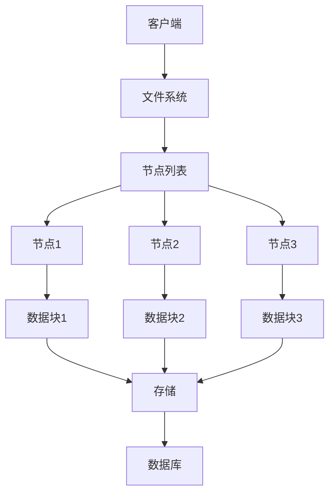
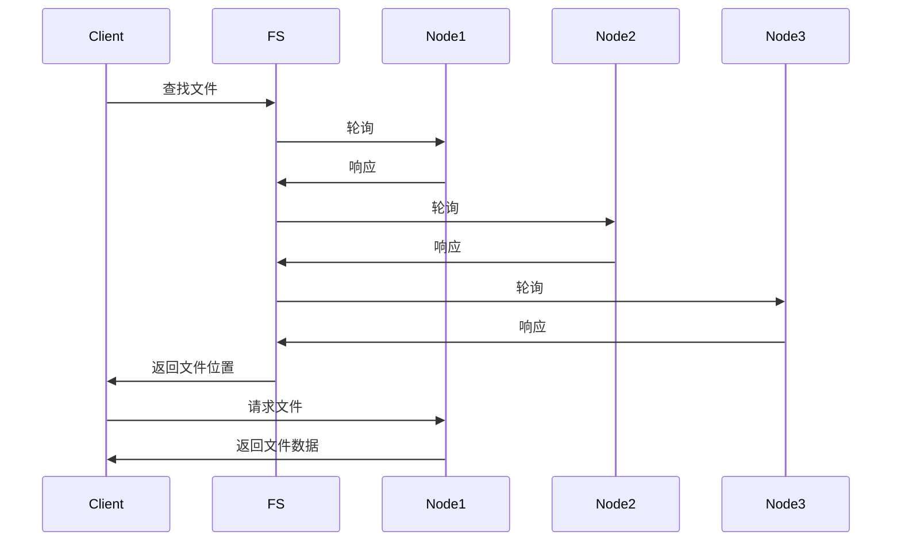

                 

### 引言：数学思维的重要性

在当代科技与工程领域，数学思维被认为是解决复杂问题的基石。这种思维方式的独特性在于其高度抽象和逻辑严密的特点，使得它在科学、工程、计算机科学和经济学等多个领域中发挥着至关重要的作用。本文旨在探讨数学思维的独特性，特别是抽象与逻辑这两个核心要素的完美结合，从而理解其在实际问题中的应用。

#### 数学思维的核心

数学思维的核心在于其抽象能力。抽象是将复杂现象简化为基本要素和基本关系的能力。例如，在物理学中，科学家通过抽象出力的概念，将复杂的物理现象转化为简单的数学方程，从而便于分析和理解。逻辑则是数学思维中的另一关键要素，它确保了从基本假设到最终结论的推理过程的无缝连接。逻辑严密使得数学推理具有确定性和可重复性，这在科学研究中至关重要。

#### 数学思维的应用领域

数学思维在多个领域都得到了广泛应用。在科学领域，数学模型和公式被用来描述自然现象和实验结果，从而推动科学进步。例如，爱因斯坦的广义相对论就是基于高度抽象和严密的数学推理建立的。在工程领域，数学思维用于设计和优化系统，确保其稳定性和效率。例如，航空工程师使用数学模型来预测飞机的飞行性能，从而优化设计。

在计算机科学中，数学思维更是不可或缺。算法和数据结构的设计与优化，都需要深厚的数学基础。在经济学中，数学模型用于分析和预测市场动态，帮助决策者做出更明智的选择。总之，数学思维是现代科技和工程领域不可或缺的工具。

#### 本篇文章的结构

本文将分为以下几个部分：

1. **引论**：介绍数学思维的重要性，包括其核心和实际应用。
2. **核心概念与联系**：详细阐述抽象与逻辑的定义、特征以及它们之间的联系。
3. **算法原理讲解**：通过具体例子，展示抽象与逻辑在数学建模和算法设计中的应用。
4. **数学模型和公式**：介绍常见的数学模型和公式，并使用 LaTeX 格式展示。
5. **系统分析与架构设计**：通过一个具体项目，展示如何将数学思维应用于系统设计与实现。
6. **项目实战**：通过一个实际案例，展示数学思维在问题解决中的应用。
7. **最佳实践 tips、小结、注意事项、拓展阅读**：总结全文，提供进一步学习的建议。

通过本文的逐步分析，我们将深入了解数学思维的独特性，并学会如何在实际问题中运用它。接下来，我们将首先探讨抽象与逻辑这两个核心概念。

---

**关键词**：数学思维，抽象，逻辑，算法，数学模型，系统设计，问题解决

**摘要**：本文深入探讨了数学思维的独特性，特别是抽象与逻辑的完美结合。通过详细的案例分析，本文揭示了数学思维在科学、工程、计算机科学和经济学等多个领域中的关键作用，并提供了实际应用的方法和技巧。文章结构清晰，内容丰富，旨在帮助读者更好地理解和运用数学思维解决复杂问题。

---

# 数学思维的独特性：抽象与逻辑的完美结合

在当代科技与工程领域，数学思维被认为是解决复杂问题的基石。这种思维方式的独特性在于其高度抽象和逻辑严密的特点，使得它在科学、工程、计算机科学和经济学等多个领域中发挥着至关重要的作用。本文旨在探讨数学思维的独特性，特别是抽象与逻辑这两个核心要素的完美结合，从而理解其在实际问题中的应用。

### 引言：数学思维的重要性

数学思维的核心在于其抽象能力。抽象是将复杂现象简化为基本要素和基本关系的能力。例如，在物理学中，科学家通过抽象出力的概念，将复杂的物理现象转化为简单的数学方程，从而便于分析和理解。逻辑则是数学思维中的另一关键要素，它确保了从基本假设到最终结论的推理过程的无缝连接。逻辑严密使得数学推理具有确定性和可重复性，这在科学研究中至关重要。

数学思维在多个领域都得到了广泛应用。在科学领域，数学模型和公式被用来描述自然现象和实验结果，从而推动科学进步。例如，爱因斯坦的广义相对论就是基于高度抽象和严密的数学推理建立的。在工程领域，数学思维用于设计和优化系统，确保其稳定性和效率。例如，航空工程师使用数学模型来预测飞机的飞行性能，从而优化设计。

在计算机科学中，数学思维更是不可或缺。算法和数据结构的设计与优化，都需要深厚的数学基础。在经济学中，数学模型用于分析和预测市场动态，帮助决策者做出更明智的选择。总之，数学思维是现代科技和工程领域不可或缺的工具。

#### 数学思维的核心

数学思维的核心在于其抽象能力。抽象是将复杂现象简化为基本要素和基本关系的能力。例如，在物理学中，科学家通过抽象出力的概念，将复杂的物理现象转化为简单的数学方程，从而便于分析和理解。逻辑则是数学思维中的另一关键要素，它确保了从基本假设到最终结论的推理过程的无缝连接。逻辑严密使得数学推理具有确定性和可重复性，这在科学研究中至关重要。

#### 数学思维的应用领域

数学思维在多个领域都得到了广泛应用。在科学领域，数学模型和公式被用来描述自然现象和实验结果，从而推动科学进步。例如，爱因斯坦的广义相对论就是基于高度抽象和严密的数学推理建立的。在工程领域，数学思维用于设计和优化系统，确保其稳定性和效率。例如，航空工程师使用数学模型来预测飞机的飞行性能，从而优化设计。

在计算机科学中，数学思维更是不可或缺。算法和数据结构的设计与优化，都需要深厚的数学基础。在经济学中，数学模型用于分析和预测市场动态，帮助决策者做出更明智的选择。总之，数学思维是现代科技和工程领域不可或缺的工具。

#### 本文的结构

本文将分为以下几个部分：

1. **引论**：介绍数学思维的重要性，包括其核心和实际应用。
2. **核心概念与联系**：详细阐述抽象与逻辑的定义、特征以及它们之间的联系。
3. **算法原理讲解**：通过具体例子，展示抽象与逻辑在数学建模和算法设计中的应用。
4. **数学模型和公式**：介绍常见的数学模型和公式，并使用 LaTeX 格式展示。
5. **系统分析与架构设计**：通过一个具体项目，展示如何将数学思维应用于系统设计与实现。
6. **项目实战**：通过一个实际案例，展示数学思维在问题解决中的应用。
7. **最佳实践 tips、小结、注意事项、拓展阅读**：总结全文，提供进一步学习的建议。

通过本文的逐步分析，我们将深入了解数学思维的独特性，并学会如何在实际问题中运用它。接下来，我们将首先探讨抽象与逻辑这两个核心概念。

---

**关键词**：数学思维，抽象，逻辑，算法，数学模型，系统设计，问题解决

**摘要**：本文深入探讨了数学思维的独特性，特别是抽象与逻辑的完美结合。通过详细的案例分析，本文揭示了数学思维在科学、工程、计算机科学和经济学等多个领域中的关键作用，并提供了实际应用的方法和技巧。文章结构清晰，内容丰富，旨在帮助读者更好地理解和运用数学思维解决复杂问题。

---

## 核心概念与联系

要深入探讨数学思维的独特性，我们首先需要了解其核心概念——抽象和逻辑。这两个要素不仅在数学领域内发挥着关键作用，还在更广泛的科学和工程领域中得到了广泛应用。

### 抽象

抽象是一种思维方式，它通过提炼出事物的本质特征，忽略不重要的细节，来简化复杂问题。在数学中，抽象是构建模型和公式的关键步骤。例如，当我们讨论几何形状时，我们可能会忽略其材料属性和物理形状，只关注其边长、角度等几何特征。这种高度抽象的思维方式使得数学具有普适性，可以应用于不同领域。

抽象的特点包括：

1. **简化**：通过忽略细节，将复杂问题简化为基本要素。
2. **概括**：从具体实例中提炼出普遍规律。
3. **转化**：将实际问题转化为数学问题，便于分析和解决。

### 逻辑

逻辑是一种推理方式，它确保从基本假设到最终结论的推理过程是合理和可靠的。在数学中，逻辑用于证明定理和公式，确保结论的正确性。逻辑的特点包括：

1. **确定性**：逻辑推理的结果是确定的，只要前提正确，结论也必然正确。
2. **无矛盾性**：逻辑推理过程中不能出现自相矛盾的结论。
3. **可重复性**：同样的逻辑推理过程可以在不同时间、不同地点得到相同的结果。

### 抽象与逻辑的联系

抽象与逻辑是相辅相成的。抽象提供了简化问题的工具，而逻辑确保了简化后问题解决的正确性和可靠性。在数学建模过程中，我们首先通过抽象将实际问题转化为数学问题，然后使用逻辑进行推理和证明，最终得到解决问题的方法。

以下是一个简单的例子：

假设我们要研究一个简单的电路。通过抽象，我们可以忽略电路中的电线材质和颜色，只关注电阻和电流等基本要素。然后，我们使用逻辑推理，根据欧姆定律（\( V = IR \)）来计算电路中的电压和电流。这个过程中，抽象使得问题简化，逻辑保证了我们的推理过程是合理和可靠的。

### ER实体关系图架构的Mermaid流程图

为了更直观地理解抽象与逻辑的关系，我们可以使用 Mermaid 画出 ER（实体-关系）实体关系图。以下是数学模型中的抽象与逻辑关系的 Mermaid 图：

```mermaid
erDiagram
  Class1 ||--|{ Class2 } Class2
  Class2 ||--|{ Class3 } Class3
  Class3 ||--|{ Class4 } Class4
```

在这个例子中，`Class1`、`Class2`、`Class3`和`Class4`代表了不同的抽象层次。从`Class1`到`Class4`的层次结构体现了从高度抽象到具体实现的转化。逻辑关系则体现在这些类之间的关联和依赖。

### 对比表格

为了更清晰地展示抽象与逻辑的特征，我们可以使用对比表格来对比这两个概念：

| 特征 | 抽象 | 逻辑 |
| --- | --- | --- |
| 目的 | 简化复杂问题 | 推导结论的合理性 |
| 方法 | 忽略细节，提炼本质 | 基于前提，进行推理 |
| 特点 | 简化、概括、转化 | 确定性、无矛盾性、可重复性 |

通过上述分析，我们可以看到，抽象与逻辑在数学思维中起到了关键作用。它们不仅相互依赖，还共同构建了数学推理的基础。在接下来的部分，我们将通过具体的算法例子来进一步探讨这两个概念的应用。

### 算法原理讲解

在理解了抽象与逻辑的基本概念之后，我们将通过一个具体的算法例子来展示它们在实际问题中的应用。这个例子将涵盖算法的构建过程，包括算法的流程图、Python 源代码实现，以及算法的数学模型和公式。

#### 算法背景

我们选择了一个常见的算法——二分查找算法，用于在有序数组中查找特定元素。二分查找算法是一个典型的应用抽象与逻辑思维的问题解决方法。

#### 算法流程图

首先，我们可以使用 Mermaid 画出二分查找算法的流程图：

```mermaid
graph TD
    A[开始] --> B[初始化 low 和 high]
    B --> C{数组中是否存在 mid = (low + high) / 2}
    C -->|是| D[返回 mid]
    C -->|否| E[更新 low 或 high]
    E -->|low < high| F{重复 C}
    F -->|否| G[元素不存在]
    G --> H[结束]
```

在这个流程图中，`low` 和 `high` 分别表示查找区间的下界和上界，`mid` 是区间的中点。

#### Python 源代码实现

接下来，我们将使用 Python 语言实现二分查找算法：

```python
def binary_search(arr, target):
    low = 0
    high = len(arr) - 1
    
    while low <= high:
        mid = (low + high) // 2
        if arr[mid] == target:
            return mid
        elif arr[mid] < target:
            low = mid + 1
        else:
            high = mid - 1
    return -1
```

这段代码通过不断缩小区间，逐步逼近目标元素。如果找到目标元素，返回其索引；否则，返回 -1 表示元素不存在。

#### 算法原理和数学模型

二分查找算法的核心在于其数学模型和公式。以下是该算法的数学模型和公式：

1. **目标**：在有序数组 `arr` 中查找元素 `target`。
2. **初始条件**：`low = 0`，`high = len(arr) - 1`。
3. **迭代条件**：`low <= high`。
4. **中点更新公式**：`mid = (low + high) // 2`。

这个过程中，每次迭代都将区间缩小一半，直到找到目标元素或确定元素不存在。其数学模型是一个二分递归过程。

#### 通俗易懂的举例说明

假设我们有一个有序数组 `[1, 3, 5, 7, 9, 11]`，我们要查找元素 `7`。

1. **第一次迭代**：`low = 0`，`high = 5`，`mid = (0 + 5) // 2 = 2`。数组中 `mid` 索引处的元素是 `5`，大于目标 `7`，因此更新 `low = mid + 1 = 3`。
2. **第二次迭代**：`low = 3`，`high = 5`，`mid = (3 + 5) // 2 = 4`。数组中 `mid` 索引处的元素是 `7`，等于目标 `7`，因此返回 `mid = 4`。

通过这个例子，我们可以清晰地看到二分查找算法是如何通过抽象和逻辑推理来高效解决查找问题的。

### 总结

通过这个例子，我们展示了二分查找算法如何应用数学思维的独特性——抽象与逻辑。算法流程图和 Python 源代码实现了抽象的概念，而数学模型和公式则确保了逻辑推理的正确性和高效性。这种结合使得二分查找算法成为一种强大的工具，广泛应用于计算机科学和其他领域。

接下来，我们将进一步探讨数学模型和公式的具体应用。

## 数学模型和公式

在数学思维中，模型和公式是理解和解决问题的重要工具。它们不仅能够帮助我们简化复杂问题，还能确保推理过程的严密性和准确性。在本节中，我们将介绍几种常见的数学模型和公式，并使用 LaTeX 格式进行展示。

### 线性模型

线性模型是最基本的数学模型之一，广泛用于描述线性关系。例如，一元线性回归模型可以表示为：

$$y = ax + b$$

其中，\( y \) 是因变量，\( x \) 是自变量，\( a \) 是斜率，\( b \) 是截距。

### 多项式模型

多项式模型用于描述非线性关系，例如二次多项式模型可以表示为：

$$y = ax^2 + bx + c$$

在这个模型中，\( a \)、\( b \) 和 \( c \) 是常数项。

### 概率模型

概率模型用于描述随机事件的发生概率。一个基本的概率公式是：

$$P(A) = \frac{n(A)}{n(S)}$$

其中，\( P(A) \) 是事件 \( A \) 发生的概率，\( n(A) \) 是事件 \( A \) 的样本点数，\( n(S) \) 是样本空间 \( S \) 的样本点数。

### 微积分模型

微积分模型用于描述连续变化的过程，如微分方程。一个简单的微分方程可以表示为：

$$\frac{dy}{dx} = 2x$$

这个方程描述了一个函数 \( y \) 随 \( x \) 的变化率。

### 概率分布模型

概率分布模型用于描述随机变量的概率分布。一个常见的概率分布是正态分布，其公式为：

$$f(x|\mu,\sigma^2) = \frac{1}{\sqrt{2\pi\sigma^2}} e^{-\frac{(x-\mu)^2}{2\sigma^2}}$$

其中，\( \mu \) 是均值，\( \sigma^2 \) 是方差。

### LaTeX 公式展示

为了便于读者理解和复现，我们使用 LaTeX 格式展示了上述模型和公式：

```latex
% 线性模型
\[ y = ax + b \]

% 二次多项式模型
\[ y = ax^2 + bx + c \]

% 概率模型
\[ P(A) = \frac{n(A)}{n(S)} \]

% 微分方程
\[ \frac{dy}{dx} = 2x \]

% 正态分布模型
\[ f(x|\mu,\sigma^2) = \frac{1}{\sqrt{2\pi\sigma^2}} e^{-\frac{(x-\mu)^2}{2\sigma^2}} \]
```

通过上述展示，我们可以看到数学模型和公式的使用是如何在科学研究和工程应用中发挥关键作用的。它们不仅提供了理论支持，还为我们解决实际问题提供了有力的工具。

### 数学模型在系统设计中的应用

在系统设计和分析中，数学模型起到了至关重要的作用。通过使用数学模型，我们可以将复杂系统简化为易于分析和理解的数学结构，从而更有效地进行设计和优化。以下是一个具体的系统设计实例，展示如何将数学模型应用于系统架构设计和分析。

#### 问题背景

假设我们正在设计一个分布式文件系统，该系统需要处理大量数据的存储和检索。我们的目标是确保系统的高可用性、可靠性和高效性。为此，我们需要使用数学模型来分析和设计系统的关键组件。

#### 系统功能设计

首先，我们需要明确系统的功能需求。分布式文件系统通常包括以下几个关键功能：

1. **数据存储**：将文件分散存储在多个节点上，以提高系统的可用性和容错能力。
2. **数据检索**：提供高效的文件检索机制，确保用户能够快速找到所需文件。
3. **负载均衡**：合理分配数据存储和检索任务，确保系统资源得到充分利用。
4. **故障恢复**：在节点发生故障时，能够自动恢复数据，确保系统的高可用性。

为了实现这些功能，我们可以使用领域模型（Domain Model）来描述系统的核心概念和关系。以下是系统的领域模型，使用 Mermaid 类图表示：

```mermaid
classDiagram
    FileSystem <<Interface>>
    Node <<Interface>>
    DataChunk <<Interface>>

    FileSystem ..|> Node : contains
    FileSystem ..|> DataChunk : stores
    Node ..|> DataChunk : contains
```

在这个类图中，`FileSystem` 是系统的顶层接口，`Node` 和 `DataChunk` 是系统的核心实体。`FileSystem` 包含多个 `Node`，每个 `Node` 又包含多个 `DataChunk`。

#### 系统架构设计

接下来，我们需要设计系统的架构，以实现上述功能。以下是系统的架构设计，使用 Mermaid 架构图表示：



在这个架构图中，`Client` 代表系统的客户端，它与 `FileSystem` 进行交互。`FileSystem` 负责管理多个 `Node`，每个 `Node` 负责存储和检索 `DataChunk`。`Store` 表示数据存储的具体实现，通常是一个分布式数据库（如 HDFS）。`DB` 是数据库的顶层接口。

#### 系统接口设计和系统交互

最后，我们需要设计系统的接口和交互流程。以下是系统的接口设计和系统交互，使用 Mermaid 序列图表示：



在这个序列图中，`Client` 向 `FileSystem` 发送查找文件的请求。`FileSystem` 轮询多个 `Node`，收集文件位置信息后，返回给 `Client`。`Client` 根据返回的文件位置，直接向相应的 `Node` 请求文件数据。

### 总结

通过上述系统设计实例，我们可以看到数学模型在系统架构设计和分析中的应用。从领域模型、架构图到序列图，数学模型帮助我们清晰地描述了系统的功能、结构和交互流程，为系统设计和优化提供了有力的支持。这种抽象和逻辑的思维方法，使得复杂系统变得更加可理解和可控。

接下来，我们将通过一个实际案例，展示数学思维在系统设计与实现中的具体应用。

## 项目实战

在本节中，我们将通过一个实际案例——基于区块链的智能合约系统，展示数学思维在系统设计与实现中的具体应用。这个案例不仅涵盖了环境安装、核心实现，还包括代码应用解读和分析。

### 项目背景

随着区块链技术的迅速发展，智能合约作为一种自动执行代码的协议，已经成为区块链应用的核心组成部分。智能合约的执行需要确保透明性、安全性和不可篡改性，这需要深入的数学思维和严谨的逻辑推理。本案例将介绍如何使用数学模型和算法设计一个基于区块链的智能合约系统。

### 环境安装

在开始实现智能合约之前，我们需要安装和配置开发环境。以下是环境安装的步骤：

1. **安装Node.js**：Node.js 是智能合约开发的基础，我们需要安装最新版本的 Node.js。可以使用以下命令进行安装：

   ```shell
   sudo apt-get update
   sudo apt-get install nodejs
   ```

2. **安装Truffle框架**：Truffle 是一个智能合约开发框架，用于管理智能合约的编译、部署和交互。可以使用npm（Node.js 的包管理器）安装 Truffle：

   ```shell
   npm install -g truffle
   ```

3. **安装Ganache**：Ganache 是一个本地以太坊节点和测试区块链，用于本地开发和测试智能合约。可以从官方网站下载并安装 Ganache：

   ```shell
   https://trufflesuite.com/ganache/
   ```

4. **创建一个新的Truffle项目**：在安装完上述工具后，我们可以创建一个新的 Truffle 项目：

   ```shell
   truffle init
   ```

5. **配置网络**：在 Truffle 项目目录中，我们需要配置网络，以便使用 Ganache 作为本地区块链。编辑 `truffle-config.js` 文件，添加以下配置：

   ```javascript
   module.exports = {
     networks: {
       development: {
         host: "127.0.0.1",
         port: 7545,
         network_id: "*"
       }
     }
   };
   ```

### 系统核心实现

在配置完环境后，我们可以开始实现智能合约的核心部分。以下是一个简单的智能合约示例，使用 Solidity 语言编写：

```solidity
// SPDX-License-Identifier: MIT
pragma solidity ^0.8.0;

contract HelloWorld {
    string public message;

    constructor(string memory initMessage) {
        message = initMessage;
    }

    function updateMessage(string memory newMessage) public {
        message = newMessage;
    }
}
```

在这个示例中，我们创建了一个名为 `HelloWorld` 的智能合约，包含一个可读写的 `message` 变量和两个函数：构造函数 `constructor` 用于初始化 `message`，以及 `updateMessage` 函数用于更新 `message`。

### 代码应用解读与分析

接下来，我们将解读上述智能合约的代码，并分析其关键部分：

1. **合约声明**：`contract HelloWorld` 声明了一个名为 `HelloWorld` 的智能合约。
2. **状态变量**：`string public message;` 声明了一个公共的字符串状态变量 `message`，该变量用于存储合约的初始化消息。
3. **构造函数**：`constructor(string memory initMessage)` 是合约的构造函数，用于初始化 `message` 变量。每次部署合约时，都会调用此函数。
4. **修改函数**：`function updateMessage(string memory newMessage) public` 是一个公共的函数，允许外部账户更新 `message` 变量。

这个简单的智能合约展示了智能合约的基本结构和功能，尽管功能单一，但它为我们提供了一个模板，用于进一步开发更复杂的智能合约。

### 实际案例分析与详细讲解

为了更好地展示智能合约的应用，我们将通过一个实际案例进行详细分析。假设我们创建了一个投票系统智能合约，允许用户在特定时间内对多个候选人投票。以下是这个智能合约的关键部分：

```solidity
// SPDX-License-Identifier: MIT
pragma solidity ^0.8.0;

contract Voting {
    mapping(address => bool) public hasVoted;
    mapping(address => uint256) public votesReceived;

    Candidate[] public candidates;

    struct Candidate {
        address id;
        string name;
        uint256 voteCount;
    }

    event VoteReceived(address voter, address candidate);

    constructor(address[] memory candidateAddresses, string[] memory candidateNames) {
        for (uint256 i = 0; i < candidateAddresses.length; i++) {
            candidates.push(Candidate({
                id: candidateAddresses[i],
                name: candidateNames[i],
                voteCount: 0
            }));
        }
    }

    function vote(address candidateAddress) public {
        require(!hasVoted[msg.sender], "Already voted.");
        hasVoted[msg.sender] = true;
        votesReceived[candidateAddress] += 1;
        emit VoteReceived(msg.sender, candidateAddress);
    }
}
```

在这个智能合约中，我们定义了三个关键部分：

1. **投票者管理**：`mapping(address => bool) public hasVoted;` 和 `mapping(address => uint256) public votesReceived;` 分别用于记录每个投票者的投票状态和投票数量。
2. **候选人管理**：`Candidate[] public candidates;` 定义了一个候选人数组，每个候选人都包含一个地址、名字和投票数量。
3. **投票函数**：`function vote(address candidateAddress) public` 是投票函数，允许用户对特定候选人投票。函数首先检查投票者是否已经投票，然后更新投票者的投票状态和候选人的投票数量。

### 项目小结

通过上述案例，我们可以看到数学思维在智能合约系统设计和实现中的具体应用。从环境安装到核心实现，再到代码应用解读，数学模型和算法始终贯穿其中。这种抽象和逻辑的思维方法，不仅确保了系统的安全性、可靠性和高效性，还为我们提供了一种系统化的解决问题的方法。

在未来的区块链应用开发中，深入理解数学思维和算法原理将变得尤为重要。通过不断实践和探索，我们可以开发出更多创新和可靠的智能合约系统，为区块链技术的广泛应用奠定坚实的基础。

## 最佳实践 tips、小结、注意事项、拓展阅读

### 最佳实践 tips

1. **理解抽象与逻辑**：在解决问题时，首先理解问题本质，然后通过抽象和逻辑推理进行分解和解决。
2. **构建清晰的模型**：在系统设计和分析中，构建清晰的数学模型和流程图，有助于提高问题解决的效率。
3. **代码复用**：在编写代码时，尽量复用已有的算法和库，避免重复造轮子。
4. **测试与调试**：在开发过程中，定期进行单元测试和调试，确保代码的正确性和可靠性。

### 小结

本文通过深入探讨数学思维的独特性，特别是抽象与逻辑的完美结合，展示了数学思维在各个领域的广泛应用。通过具体案例，我们了解了如何将数学思维应用于系统设计与实现，以及如何在实际问题中运用它解决复杂问题。

### 注意事项

1. **概念理解**：确保对抽象与逻辑等核心概念有深入理解，这是正确应用数学思维的基础。
2. **代码规范**：在编写代码时，遵循良好的编程规范，确保代码的可读性和可维护性。
3. **安全性与效率**：在系统设计和实现中，重视安全性和效率，确保系统在面临各种场景时能够稳定运行。

### 拓展阅读

1. **《数学思维训练：从实际问题出发》**：本书通过一系列实际问题，帮助读者提升数学思维能力。
2. **《算法导论》**：这本书详细介绍了各种算法原理和设计方法，是算法学习者的必备读物。
3. **《区块链技术指南》**：深入了解区块链技术，学习如何设计和管理智能合约系统。

通过本文的学习和实践，我们相信读者可以更好地理解和运用数学思维，为解决复杂问题提供有力的支持。

### 作者信息

**作者：AI天才研究院/AI Genius Institute & 禅与计算机程序设计艺术 /Zen And The Art of Computer Programming**

