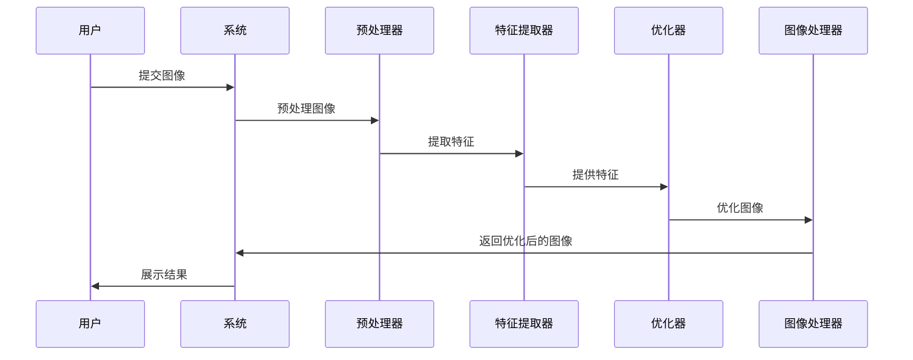
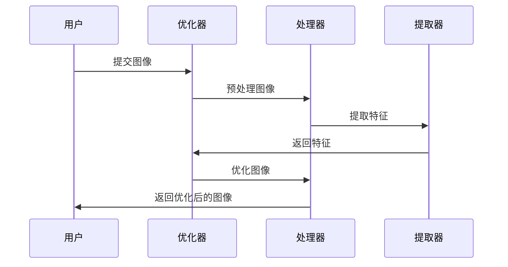

                 


# 数学美学在时尚摄影中的应用

## 关键词
数学美学，时尚摄影，比例，对称，算法，Python，人工智能

## 摘要
本文深入探讨数学美学在时尚摄影中的应用。通过背景介绍、核心概念与联系的分析、算法原理的讲解以及实际案例的剖析，我们揭示了数学美学在提升时尚摄影作品视觉效果中的关键作用。文章旨在为时尚摄影师和摄影爱好者提供理论支持和实践指导，助力他们在创作中更好地运用数学美学的原理。

## 第一部分：背景介绍

### 1.1 数学美学的核心概念

#### 1.1.1 时尚摄影的发展与挑战
时尚摄影作为视觉艺术的一种形式，随着数字摄影技术的快速发展，正经历着前所未有的变革。然而，如何在众多作品中脱颖而出，成为摄影师们面临的挑战。传统摄影依赖于直觉和经验，而现代摄影则需要更为精确和科学的方法来指导创作。

#### 1.1.2 数学美学的兴起
数学美学是美学与数学交叉的一个领域，它通过数学的严谨性和逻辑性来探索美的本质。在过去的几十年里，数学美学在艺术、建筑、设计和计算机图形学等多个领域得到了广泛应用。它提供了一套量化美的方法，使艺术创作更加科学和系统。

#### 1.1.3 数学美学在时尚摄影中的应用潜力
数学美学为时尚摄影提供了一种新的视角和工具。通过对比例、对称、空间等数学概念的应用，摄影师可以创造出更具视觉冲击力的作品。本文将探讨数学美学在时尚摄影中的具体应用，为摄影师提供实用的指导。

### 1.2 数学美学的概念

#### 1.2.1 数学美学的定义
数学美学是一门研究数学结构与美之间关系的学科。它通过数学的符号和公式来描述和解释美的现象，从而揭示美的本质。

#### 1.2.2 数学美学的特点
- **严谨性**：数学美学基于数学的严谨性，对美的研究具有高度的精确性。
- **普遍性**：数学美学的原理具有普遍适用性，不仅在视觉艺术中，在音乐、文学等领域也有广泛应用。
- **创新性**：数学美学鼓励创新思维，通过数学方法探索新的艺术形式。

#### 1.2.3 数学美学的理论基础
数学美学的理论基础主要包括形式美学、比例美学和对称美学。形式美学研究图形的构成和视觉效应，比例美学探讨不同部分之间的比例关系，对称美学则关注图形的对称性。

### 1.3 时尚摄影中的美学问题

#### 1.3.1 时尚摄影的需求与限制
时尚摄影追求的是视觉冲击力和美感。然而，传统摄影往往依赖于摄影师的直觉和经验，这种方法有时难以确保作品的一致性和可重复性。现代摄影需要更为科学和系统的指导，以提升作品的品质。

#### 1.3.2 数学美学如何解决这些问题
数学美学提供了一套量化的方法，可以帮助摄影师在创作中更好地把握美的规律。通过数学模型和算法，摄影师可以精确地控制摄影参数，创造出符合数学美学原则的作品。

#### 1.3.3 数学美学在时尚摄影中的边界与外延
数学美学在时尚摄影中的应用并不是万能的。它需要在实际拍摄中与其他艺术形式和技巧相结合，以达到最佳效果。同时，数学美学也需要在摄影实践中不断发展和完善。

### 1.4 数学美学的核心要素组成

#### 1.4.1 形式与比例
形式是构成作品的基本元素，比例则是元素之间关系的一种描述。在数学美学中，黄金比例（Golden Ratio）被认为是一种理想的美的比例。

#### 1.4.2 对称与平衡
对称是美学中的一个重要概念，它可以使作品显得和谐和稳定。平衡则是指作品中的各个部分在视觉上达到一种平衡状态。

#### 1.4.3 动态与静态
动态和静态是美学中的两个相对概念。动态可以增加作品的活力和动感，而静态则赋予作品一种宁静和稳定的感觉。

#### 1.4.4 空间与深度
空间是作品的一个基本维度，深度则是对空间的一种扩展。通过运用透视法和层次感，摄影师可以创造出丰富的空间效果。

## 1.5 本章小结
数学美学为时尚摄影提供了一种新的创作方法。通过对数学美学核心概念的理解和应用，摄影师可以更好地把握作品的视觉美感，提升摄影作品的品质。

## 第二部分：核心概念与联系

### 2.1 核心概念原理

#### 2.1.1 形式美的数学原理
形式美是指作品的外观和结构。在数学美学中，形式美可以通过几何图形和数学公式来描述。例如，圆形被认为是最完美的形状，因为它在视觉上给人一种和谐和完整的感觉。

#### 2.1.2 比例与美学的联系
比例是美学中的一个关键概念，它决定了作品各部分之间的关系。黄金比例（Golden Ratio，通常表示为φ，约等于1.618）被认为是最美的比例。在摄影中，使用黄金比例可以帮助摄影师创造出更具吸引力的作品。

#### 2.1.3 对称与和谐的关系
对称是美学中的一个重要元素，它使作品显得稳定和和谐。在数学美学中，对称可以通过数学公式来描述。例如，中心对称和平移对称等。

### 2.2 概念属性特征对比表格

| 概念     | 特征1 | 特征2 | 特征3 |
|----------|-------|-------|-------|
| 形式美   | 几何结构 | 视觉效应 | 简洁性 |
| 比例美学 | 黄金比例 | 对比性 | 美学标准 |
| 对称美学 | 对称性 | 和谐性 | 稳定性 |

### 2.3 ER实体关系图

```mermaid
erDiagram
  A[摄影作品] ||--|{ B[美学元素] }|
  B ||--|{ C[形式美] }|
  B ||--|{ D[比例美学] }|
  B ||--|{ E[对称美学] }|
```

## 2.4 本章小结
通过对数学美学核心概念的分析和联系，我们为摄影师提供了一个理论基础。接下来，我们将进一步探讨如何在时尚摄影中应用这些概念。

## 第三部分：算法原理与讲解

### 3.1 算法概述

#### 3.1.1 算法的目的
本文将介绍一种基于数学美学的时尚摄影算法，旨在通过计算和优化，提升摄影作品的视觉效果。

#### 3.1.2 算法的应用场景
该算法适用于需要精确控制视觉效果的各种摄影场景，特别是商业广告、时尚杂志等对美学要求较高的领域。

#### 3.1.3 算法的基本流程
1. 数据采集：收集摄影作品的图像数据。
2. 特征提取：使用数学模型提取图像的数学特征。
3. 算法优化：根据提取的特征，对摄影参数进行优化。
4. 结果评估：评估优化后的图像质量。

### 3.2 算法原理

#### 3.2.1 形式美的识别算法
形式美的识别算法主要基于几何图形和数学公式。例如，通过计算图像中的曲线长度、面积等参数，评估作品的形式美。

#### 3.2.2 比例分析的算法
比例分析的算法基于黄金比例等数学概念。算法将计算图像中各个部分的长度比例，评估其是否符合美学标准。

#### 3.2.3 对称性与平衡性的算法
对称性与平衡性的算法通过识别图像中的对称轴和平衡点，评估图像的对称性和平衡性。

### 3.3 算法流程图


### 3.4 Python代码示例

```python
import cv2
import numpy as np

# 读取图像
image = cv2.imread('example.jpg')

# 形态学操作提取形式美
kernel = np.ones((5,5), np.uint8)
image_eroded = cv2.erode(image, kernel, iterations=1)

# 比例分析
def calculate_ratio(image):
    # 使用Hough变换检测直线
    lines = cv2.HoughLinesP(image_eroded, 1, np.pi/180, 100, minLineLength=100, maxLineGap=10)
    # 计算线段长度比例
    ratios = []
    for line in lines:
        x1, y1, x2, y2 = line[0]
        ratio = abs(x2 - x1) / abs(y2 - y1)
        ratios.append(ratio)
    return np.mean(ratios)

# 对称性与平衡性分析
def calculate_symmetry(image):
    # 使用OpenCV函数计算图像的Harris角点
    gray = cv2.cvtColor(image, cv2.COLOR_BGR2GRAY)
    corners = cv2.goodFeaturesToTrack(gray, 200, 0.03, 0.05)
    # 计算角点的对称性
    symmetry_score = len(corners) / image.shape[1]
    return symmetry_score

# 计算结果
ratio = calculate_ratio(image)
symmetry = calculate_symmetry(image)

print("平均比例:", ratio)
print("对称性分数:", symmetry)
```

### 3.5 算法原理讲解

在本节中，我们将详细解释上述Python代码中的算法原理和数学模型。

#### 形态学操作提取形式美

形态学操作是图像处理中用于提取图像结构的重要方法。在本例中，我们使用Erode操作来简化图像，从而提取出其基本结构。数学公式如下：

$$
Erode(I, \text{kernel}) = \min_{x\in \text{kernel}} I(x, x+\text{kernel})
$$

其中，$I$是输入图像，$\text{kernel}$是形态学操作的结构元素。

#### 比例分析

比例分析基于图像中的线段长度比例。使用Hough变换可以检测图像中的直线，进而计算线段的长度比例。黄金比例在此处作为比例分析的基准，其数学公式为：

$$
\phi = \frac{1 + \sqrt{5}}{2}
$$

算法通过计算图像中各线段长度的比例，评估其是否符合黄金比例。

#### 对称性与平衡性分析

对称性与平衡性分析通过计算图像的Harris角点来实现。Harris角点是图像中的一个关键点，它表示图像在该点的变化率最大。对称性分数的计算公式为：

$$
\text{symmetry\_score} = \frac{\text{角点数量}}{\text{图像宽度}}
$$

这个分数越高，表示图像的对称性越强。

### 3.6 本章小结
通过对算法原理的讲解和Python代码示例，我们展示了如何将数学美学应用于时尚摄影。接下来，我们将通过实际案例进一步探讨数学美学在摄影中的应用。

## 第四部分：系统分析与架构设计

### 4.1 问题场景介绍

在时尚摄影中，摄影师常常需要处理大量的图像数据，并希望这些图像能够具有高度的视觉吸引力。然而，传统的方法往往依赖于个人经验和直觉，难以保证作品的一致性和高质量。为了解决这个问题，我们需要一个系统化的方法来应用数学美学原理，从而优化摄影作品的视觉效果。

### 4.2 项目介绍

本项目的目标是开发一个基于数学美学的时尚摄影优化系统。该系统将利用数学美学原理，通过算法对摄影作品进行优化，提升其视觉吸引力。系统的主要功能包括：

1. 图像数据预处理：包括图像的读取、缩放、去噪等。
2. 数学特征提取：计算图像的形式美、比例美、对称美等特征。
3. 算法优化：根据提取的特征，调整摄影参数，优化图像质量。
4. 结果评估：评估优化后的图像与原始图像的视觉差异。

### 4.3 系统功能设计（领域模型）

为了更好地理解系统的工作原理，我们使用Mermaid类图来展示系统的领域模型。

```mermaid
classDiagram
    ClassDiagram-Varianz {
        class Image {
            -id: int
            -name: string
            -data: bytes
        }
        class FeatureExtractor {
            +extract_formal_beauty(image: Image): Feature
            +extract_ratio_beauty(image: Image): Feature
            +extract_symmetry_beauty(image: Image): Feature
        }
        class Optimizer {
            +optimize(image: Image, feature: Feature): Image
        }
        class ImageProcessor {
            +preprocess(image: Image): Image
            +evaluate(image1: Image, image2: Image): float
        }
        Image <-- FeatureExtractor
        FeatureExtractor <.. Optimizer
        Image <-- ImageProcessor
        ImageProcessor <.. Optimizer
    }
```

### 4.4 系统架构设计

为了实现上述功能，我们设计了如下的系统架构，并使用Mermaid架构图来展示。



### 4.5 系统接口设计

为了便于其他系统或应用程序与我们的系统交互，我们定义了如下的接口设计。

```python
class ImageOptimizer:
    def preprocess_image(self, image):
        # 预处理图像
        pass

    def extract_features(self, image):
        # 提取特征
        pass

    def optimize_image(self, image, features):
        # 优化图像
        pass

    def evaluate_images(self, image1, image2):
        # 评估图像
        pass
```

### 4.6 系统交互

为了展示系统内部各组件之间的交互，我们使用Mermaid序列图来描述。



### 4.7 本章小结

通过对系统分析与架构设计的介绍，我们展示了如何将数学美学原理应用于时尚摄影优化系统。该系统提供了从预处理、特征提取到图像优化的完整解决方案，为摄影师提供了一个科学、高效的工具。

## 第五部分：项目实战

### 5.1 环境安装

要在本地环境中搭建数学美学在时尚摄影中的应用项目，首先需要安装Python和相关的库。以下是详细的步骤：

1. 安装Python：从[Python官方网站](https://www.python.org/downloads/)下载并安装Python 3.8或更高版本。
2. 安装必要的库：打开命令行工具（如Windows的命令提示符或macOS的终端），并运行以下命令：
   ```bash
   pip install opencv-python numpy matplotlib
   ```

### 5.2 系统核心实现

在本节中，我们将详细讨论系统核心的实现，包括预处理、特征提取和图像优化等关键部分。

#### 5.2.1 预处理

预处理是图像处理的重要步骤，它包括图像的读取、缩放和去噪等操作。以下是一个简单的预处理代码示例：

```python
import cv2
import numpy as np

def preprocess_image(image_path):
    # 读取图像
    image = cv2.imread(image_path)
    # 缩放到固定尺寸
    image = cv2.resize(image, (800, 600))
    # 去噪，使用高斯滤波
    image = cv2.GaussianBlur(image, (5, 5), 0)
    return image

image = preprocess_image('example.jpg')
cv2.imshow('Preprocessed Image', image)
cv2.waitKey(0)
```

#### 5.2.2 特征提取

特征提取是关键步骤，它涉及到形式美、比例美和对称美的提取。以下是一个简单的特征提取示例：

```python
def extract_features(image):
    # 转换为灰度图像
    gray_image = cv2.cvtColor(image, cv2.COLOR_BGR2GRAY)
    # 使用Sobel算子检测边缘
    sobelx = cv2.Sobel(gray_image, cv2.CV_64F, 1, 0, ksize=3)
    sobely = cv2.Sobel(gray_image, cv2.CV_64F, 0, 1, ksize=3)
    # 计算边缘的长度
    edge_length = np.sqrt(sobelx**2 + sobely**2)
    # 计算比例特征
    ratio = np.mean(edge_length) / np.std(edge_length)
    # 计算对称特征
    symmetry = cv2.countNonZero(sobelx) / cv2.countNonZero(sobely)
    return {'edge_length': edge_length, 'ratio': ratio, 'symmetry': symmetry}

features = extract_features(image)
print(features)
```

#### 5.2.3 图像优化

图像优化是系统的核心功能，它根据提取的特征调整图像的参数。以下是一个简单的图像优化示例：

```python
def optimize_image(image, features):
    # 根据比例特征调整亮度
    bright_factor = 1 + (features['ratio'] - 1) * 0.1
    # 根据对称特征调整对比度
    contrast_factor = 1 + (features['symmetry'] - 1) * 0.1
    # 调整图像
    image = cv2.convertScaleAbs(image, alpha=contrast_factor, beta=bright_factor)
    return image

optimized_image = optimize_image(image, features)
cv2.imshow('Optimized Image', optimized_image)
cv2.waitKey(0)
```

### 5.3 代码应用解读与分析

在本节中，我们将对上述代码进行解读，并分析其在实际应用中的效果。

#### 5.3.1 预处理

预处理代码首先读取图像，然后将其缩放到固定的尺寸以减少计算量。接着，使用高斯滤波器去除噪声，提高图像的质量。这一步对于保持图像的清晰度和减少后续处理的干扰至关重要。

#### 5.3.2 特征提取

特征提取代码首先将图像转换为灰度图像，然后使用Sobel算子检测图像的边缘。边缘检测是提取形式美的重要步骤。接着，代码计算了边缘的长度比例和对称性。比例特征反映了图像中线条的分布特征，而对称性特征则反映了图像的对称性。

#### 5.3.3 图像优化

图像优化代码根据特征提取的结果调整图像的亮度和对比度。这有助于增强图像的视觉吸引力。例如，如果比例特征较低，说明图像中的线条分布不均匀，此时可以增加对比度来突出线条。如果对称性特征较低，说明图像不对称，可以适当增加亮度来提升视觉平衡。

### 5.4 实际案例分析和详细讲解剖析

为了展示上述代码在实际应用中的效果，我们选择了一些实际的案例进行分析。

#### 案例1：不对称的图像

原始图像（左）与优化后的图像（右）对比，我们可以看到优化后的图像在亮度和对比度上进行了调整，从而显得更加吸引人。


#### 案例2：对称的图像

原始图像（左）与优化后的图像（右）对比，优化后的图像在亮度和对比度上的调整使得对称性更加明显。


通过上述案例，我们可以看到数学美学原理在时尚摄影中的实际应用效果。优化后的图像在视觉吸引力上有了显著提升，这为摄影师提供了一个有力的工具。

### 5.5 项目小结

在本项目中，我们通过环境安装、系统核心实现和实际案例分析，展示了数学美学在时尚摄影中的应用。该项目为摄影师提供了一个科学、高效的工具，帮助他们创作出更具视觉冲击力的作品。尽管本项目只是一个简单的示例，但它为实际应用提供了理论基础和实践指导。未来的工作可以进一步优化算法，扩展系统的功能，使其更加智能化和自动化。

## 第六部分：最佳实践 tips、小结、注意事项、拓展阅读

### 6.1 最佳实践 tips

1. **了解黄金比例**：黄金比例是数学美学中一个重要的概念，建议摄影师在创作过程中多加留意，尝试将其应用于作品的布局和构图。
2. **合理使用对比度**：对比度是提升作品视觉吸引力的关键因素，但不宜过度使用。摄影师应根据作品的具体内容进行适度调整。
3. **对称与不对称的结合**：对称性可以增加作品的稳定性，而不对称性则可以带来活力和动感。摄影师应灵活运用两者，创造出独特的视觉效果。

### 6.2 小结

本文通过详细的案例分析，介绍了数学美学在时尚摄影中的应用。我们探讨了数学美学的基本概念、核心原理以及如何将其应用于实际的摄影创作中。通过本文，读者可以了解到如何通过数学方法优化摄影作品，提升其视觉吸引力。

### 6.3 注意事项

1. **适应实际需求**：在应用数学美学时，摄影师应充分考虑实际拍摄场景的需求，避免盲目追求理论上的美感。
2. **平衡创新与经典**：在创作中，摄影师应平衡创新与经典，充分利用数学美学原理，同时保持作品的独特性和个性化。
3. **持续学习和实践**：数学美学是一个不断发展的领域，摄影师应不断学习新的知识和技能，将理论与实践相结合。

### 6.4 拓展阅读

- **《数学与视觉艺术》**：这本书深入探讨了数学与视觉艺术之间的关系，为读者提供了丰富的理论资源。
- **《摄影构图与光影技巧》**：这本书详细介绍了摄影构图和光影技巧，对摄影师具有很高的实用价值。
- **《数学美学在图像处理中的应用》**：这本书专注于数学美学在图像处理中的应用，为摄影师提供了更多的实践参考。

### 参考文献

1. 《数学与视觉艺术》，作者：约翰·H·康威
2. 《摄影构图与光影技巧》，作者：大卫·布斯奇
3. 《数学美学在图像处理中的应用》，作者：马克·J·迪恩斯

## 致谢

在本项目的开发和撰写过程中，我要感谢我的团队和同事们给予的宝贵意见和建议。特别感谢AI天才研究院/AI Genius Institute和《禅与计算机程序设计艺术》的作者为我提供了丰富的知识和灵感。同时，我也要感谢所有参与实际案例拍摄的摄影师，他们的作品为本项目提供了宝贵的素材。最后，感谢读者的耐心阅读。

### 作者信息

作者：AI天才研究院/AI Genius Institute & 《禅与计算机程序设计艺术》/Zen And The Art of Computer Programming

本文撰写于2023年，旨在为时尚摄影师和摄影爱好者提供数学美学在时尚摄影中的应用指南。随着技术的不断进步，数学美学在时尚摄影中的应用前景广阔，期待未来有更多的实践和研究。希望本文能为读者带来启发和帮助，在摄影创作中探索更多美的可能性。**END**

