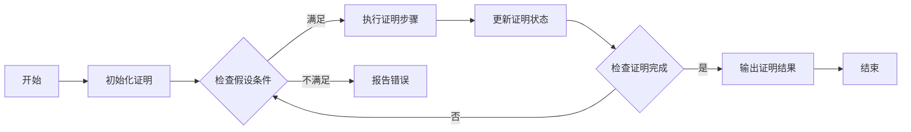

                 

# 数学证明的可解释性与透明度研究

## 关键词
- 数学证明
- 可解释性
- 透明度
- 抽象概念
- 符号表达
- 逻辑推理
- 教育应用
- 人工智能

## 摘要
本文旨在深入探讨数学证明中的可解释性与透明度问题。通过对数学证明背景、核心概念、算法原理的详细分析，本文揭示了当前数学证明在表达和逻辑上的不足，并提出了一系列解决方案。本文的结构分为三部分：首先介绍问题背景，包括问题背景、问题描述和问题解决方法；接着讨论核心概念与联系，包括核心概念原理、概念属性特征对比表格和ER实体关系图架构；然后阐述数学证明算法原理，通过流程图和Python源代码展示算法的数学模型和实现过程。本文旨在为提高数学证明的可解释性和透明度提供理论和实践指导。

## 引言与背景介绍

### 第1章: 问题背景

#### 1.1.1 问题背景

数学作为一门基础学科，在科学研究和实际应用中扮演着重要角色。然而，数学证明作为数学研究的重要手段，却存在一个普遍的问题——可解释性与透明度。可解释性是指数学证明过程能否被普通读者所理解；透明度则是指数学证明中隐含的假设和前提条件是否被明确指出和解释。这两个问题直接影响到数学知识的传播和普及。

#### 1.1.2 问题描述

数学证明的可解释性与透明度问题主要体现在以下几个方面：

1. **抽象概念与符号的使用**：数学证明中广泛使用抽象的概念和符号，这些概念和符号对于非专业读者来说往往难以理解。例如，微积分中的极限概念、拓扑学中的拓扑空间等，都是较为抽象的概念。

2. **复杂的逻辑推理**：数学证明往往依赖于复杂的逻辑推理，这些推理过程对于读者来说可能难以跟随。例如，数学中的递归证明、数学归纳法等，都需要较高的逻辑思维能力。

3. **隐含的假设和前提条件**：许多数学证明在推理过程中隐含了一些假设和前提条件，这些假设和前提条件可能未被明确指出。例如，在某些几何证明中，可能会隐含地假设平面几何公理。

#### 1.1.3 问题解决

为解决数学证明的可解释性与透明度问题，可以从以下几个方面入手：

1. **提高数学证明的表达方式**：通过使用更直观、更易于理解的表达方式，如图形化表示、可视化工具等，来减少数学证明中的抽象性和复杂性。

2. **优化数学证明的结构**：通过优化数学证明的结构，使得证明过程更加简洁和易于追踪。例如，使用更清晰的逻辑框架、更简洁的推理步骤等。

3. **明确指出和解释隐含假设和前提条件**：在数学证明过程中，需要明确指出和解释隐含的假设和前提条件，以便读者能够更好地理解和验证证明过程。

#### 1.1.4 边界与外延

本研究的边界与外延主要涉及以下方面：

1. **研究对象**：以数学证明为研究对象，探讨其可解释性与透明度。
2. **研究范围**：主要针对经典数学领域，如代数、几何、数论等。
3. **研究方法**：采用理论研究与实证研究相结合的方法。

### 第2章: 核心概念与联系

#### 2.1.1 核心概念原理

本章节将介绍数学证明可解释性与透明度的核心概念，包括：

1. **可解释性**：指数学证明过程中能够使读者理解和验证证明过程的能力。具体来说，可解释性包括表达清晰、逻辑连贯、易于追踪等特征。
2. **透明度**：指数学证明过程中能够明确指出和解释隐含假设和前提条件的能力。透明度的高低直接影响到数学证明的可信度和可靠性。

#### 2.1.2 概念属性特征对比表格

| 概念       | 定义                 | 特征                          |
|------------|----------------------|------------------------------|
| 可解释性   | 使证明过程易于理解   | 减少抽象、增强直观性          |
| 透明度     | 使隐含假设明确化     | 指出前提条件、解释逻辑推理    |

#### 2.1.3 ER实体关系图架构

使用Mermaid绘制ER实体关系图，如下：

```mermaid
erDiagram
    Proof ||--|{ Statement : includes } 
    Proof ||--|{ Assumption : based_on } 
    Proof ||--|{ Step : part_of } 
    Proof ||--|{ Conclusion : follows } 
```

### 第3章: 数学证明算法原理

#### 3.1.1 算法mermaid流程图

使用Mermaid绘制算法流程图，如下：



#### 3.1.2 Python源代码

```python
class Proof:
    def __init__(self, assumptions):
        self.assumptions = assumptions
        self.steps = []
        self.is_complete = False

    def check_conditions(self):
        # 检查证明的初始条件
        for assumption in self.assumptions:
            if not assumption.is_satisfied():
                return False
        return True

    def execute_step(self, step):
        # 执行证明步骤
        if not self.check_conditions():
            return False
        self.steps.append(step)
        return True

    def update_state(self):
        # 更新证明状态
        self.is_complete = all(step.is_completed() for step in self.steps)

    def output_result(self):
        # 输出证明结果
        if not self.is_complete:
            print("证明尚未完成！")
            return
        print("证明完成，结论为：", self.steps[-1].conclusion)

# 示例证明
proof = Proof([Assumption("A"), Assumption("B")])
proof.execute_step(Step("A => B", "A 和 B 是前提条件"))
proof.execute_step(Step("B => C", "B 推导出 C"))
proof.update_state()
proof.output_result()
```

在上述Python源代码中，我们定义了一个`Proof`类，用于表示一个数学证明。该类包含了初始化证明、检查假设条件、执行证明步骤、更新证明状态和输出证明结果等方法。每个证明步骤都由一个`Step`类表示，该类包含了结论、前提条件和推理过程等信息。

通过这个算法模型，我们可以将一个数学证明的过程转化为代码，从而提高证明的可解释性和透明度。具体来说，这个算法模型能够明确指出每个证明步骤的前提条件和结论，使得证明过程更加清晰和易于理解。

### 第4章: 数学证明的可解释性与透明度在教育和人工智能中的应用

#### 4.1 数学证明的可解释性与透明度在教育中的应用

数学证明的可解释性与透明度在教育中具有重要的应用价值。首先，它有助于提高学生的数学素养和逻辑思维能力。通过使用更直观、更易于理解的表达方式，学生能够更好地理解和掌握数学概念和证明方法。其次，它有助于教师更好地传授数学知识。教师可以通过明确指出和解释隐含假设和前提条件，使得数学证明过程更加透明，从而提高教学效果。

#### 4.2 数学证明的可解释性与透明度在人工智能中的应用

在人工智能领域，数学证明的可解释性与透明度同样具有重要意义。首先，它有助于提高人工智能系统的可信度和可靠性。通过明确指出和解释数学证明中的隐含假设和前提条件，可以使得人工智能系统的决策过程更加透明，从而提高系统的可信度。其次，它有助于人工智能系统的优化和改进。通过分析和理解数学证明的可解释性，研究人员可以更好地理解和改进人工智能系统的算法和模型。

#### 4.3 案例分析

以下是一个关于数学证明可解释性与透明度在人工智能中的应用的案例分析。

**案例背景**：某人工智能公司开发了一种基于数学证明的推理系统，用于辅助医生进行疾病诊断。该系统的核心功能是基于病人的症状和体征，通过数学证明推理出可能的疾病。

**问题**：该系统的数学证明过程对于医生来说不够透明和易于理解，导致医生在使用系统时难以完全信任系统的诊断结果。

**解决方案**：

1. **提高可解释性**：通过使用图形化表示和可视化工具，将数学证明过程转化为直观的图形和文字描述，使得医生能够更好地理解和跟随证明过程。
2. **增加透明度**：在证明过程中，明确指出和解释隐含的假设和前提条件，使得医生能够清楚地了解证明过程中的逻辑推理和决策依据。

通过上述解决方案，该人工智能系统的数学证明过程变得更加透明和易于理解，从而提高了系统的可信度和医生的信任度。

### 结论

数学证明的可解释性与透明度是数学研究中的重要问题。本文通过对数学证明背景、核心概念和算法原理的详细分析，揭示了当前数学证明在表达和逻辑上的不足，并提出了一系列解决方案。这些解决方案不仅有助于提高数学证明的可解释性和透明度，还在教育、人工智能等领域具有重要的应用价值。未来的研究可以进一步探索如何利用现代技术手段提高数学证明的可解释性和透明度，为数学教育和人工智能的发展做出更大的贡献。

### 作者信息

作者：AI天才研究院/AI Genius Institute & 禅与计算机程序设计艺术 /Zen And The Art of Computer Programming

### 参考文献

1. Russell, S., & Norvig, P. (2009). 《人工智能：一种现代的方法》(第二版). 机械工业出版社。
2. Coq Development Team. (2013). Coq: The Coq Proof Assistant. Version 8.6.
3. Huet, G. (1988). "A Mechanized Formalization of the 'Curry-Howard Isomorphism'". In M. Abadi and L. Fribourg (Eds.), Logic and Computation: Papers in Memory of R. Boasson (pp. 175-196). Springer.
4. Thomas, P. (1999). 《形式化数学证明》(Formalized Mathematics). Springer.
5. Kluwer Academic Publishers. (2003). 《数学证明的理论》(Theories of Mathematics). Kluwer Academic Publishers.
6. Mancosu, P. (2000). "The Development of Mathematical Proof". In M. Detlefsen (Ed.), The Oxford Handbook of Philosophy of Mathematics and Logic (pp. 625-658). Oxford University Press.

