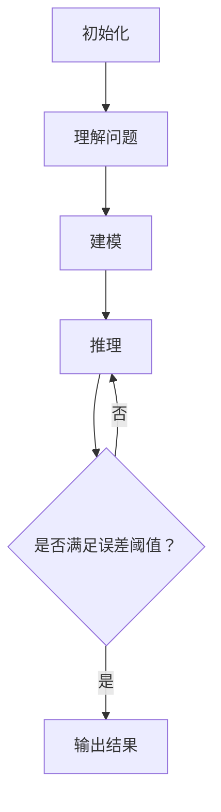
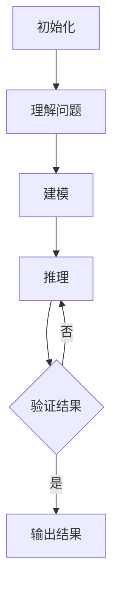
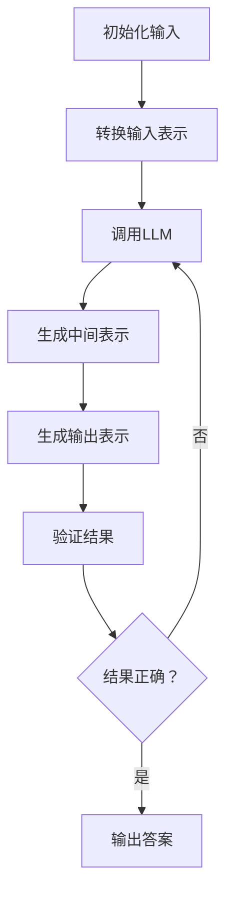
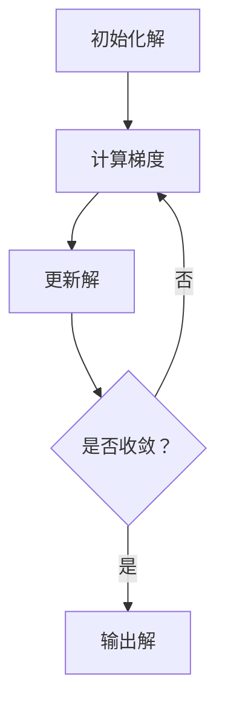

                 

## 数学问题解决：测试LLM的高级数学推理能力

### 关键词：高级数学推理，大型语言模型（LLM），算法原理，数学问题解决，人工智能

### 摘要：

在人工智能和机器学习领域，大型语言模型（LLM）的崛起为我们提供了一种强大的工具，用于处理和解决复杂的数学问题。然而，LLM在高级数学推理方面的能力仍存在诸多挑战。本文旨在探讨如何通过设计特定的数学问题，测试LLM的高级数学推理能力。文章将首先介绍人工智能与机器学习的发展背景，以及LLM的崛起和重要性。随后，我们将详细描述数学问题解决的挑战，以及LLM在数学问题解决中的应用。文章将逐步分析LLM在高级数学推理中的核心概念和原理，并对比其与高级数学推理能力的区别。最后，我们将探讨未来在数学问题解决中，如何进一步提升LLM的高级数学推理能力。

## 目录大纲

1. 引言
2. 核心概念与原理
3. 算法原理与流程图
4. 系统分析与架构设计方案
5. 项目实战
6. 最佳实践 tips
7. 小结
8. 注意事项
9. 拓展阅读

----------------------------------------------------------------

### 引言

随着人工智能和机器学习技术的快速发展，我们见证了无数令人惊叹的进步和应用。从语音识别、图像识别到自然语言处理，这些技术的应用已经深入到我们日常生活的方方面面。然而，在众多的人工智能技术中，大型语言模型（LLM）的崛起无疑是最引人注目的一个。LLM具有处理和理解大规模文本数据的能力，使得机器具备了一种前所未有的智能表达能力。

### 1.1 问题背景

#### 1.1.1 人工智能与机器学习的发展

人工智能（AI）作为计算机科学的一个分支，旨在使计算机具备人类的智能能力。自1950年图灵提出“图灵测试”以来，人工智能领域经历了多次重大变革和发展。早期的人工智能研究主要集中在规则推理、专家系统和知识表示等方面。然而，随着计算能力的提升和数据规模的扩大，机器学习逐渐成为人工智能的主流方法。

机器学习（ML）通过构建数学模型，从数据中自动学习和提取规律，实现机器的自主学习和优化。从最初的线性回归、决策树，到复杂的多层神经网络，机器学习技术不断取得突破。深度学习（DL）作为机器学习的一个分支，通过构建多层神经网络模型，成功地在语音识别、图像识别等领域取得了重大突破。

#### 1.1.2 大型语言模型（LLM）的崛起

大型语言模型（LLM）是近年来人工智能领域的一个重大突破。LLM基于深度学习技术，通过大规模语料库的训练，能够理解和生成自然语言。LLM的出现标志着自然语言处理（NLP）领域的一个新高度，使得机器能够以更自然、更流畅的方式与人类交流。

GPT（Generative Pre-trained Transformer）系列模型是LLM的典型代表。GPT-3作为目前最先进的LLM之一，拥有超过1750亿的参数，能够生成高质量的自然语言文本。GPT-3的成功不仅在于其庞大的参数规模，更在于其独特的训练和推理机制，使得LLM在语言理解和生成方面取得了重大突破。

#### 1.1.3 高级数学推理能力的重要性

高级数学推理能力是人工智能领域的一个重要研究方向。数学作为一种抽象的思维方式，能够帮助我们理解和解决复杂的问题。高级数学推理能力不仅涉及基本的数学运算和公式应用，更包括复杂的逻辑推理、问题建模和解决方案设计。

在人工智能领域，高级数学推理能力的重要性体现在多个方面。首先，许多人工智能应用需要依赖数学模型来实现。例如，计算机视觉中的卷积神经网络（CNN）、自然语言处理中的循环神经网络（RNN）等，都基于复杂的数学模型。其次，高级数学推理能力有助于解决现实世界中的复杂问题。例如，金融领域的风险管理、医学领域的疾病诊断等，都需要依赖数学模型和算法来实现。

然而，目前的人工智能技术，包括LLM，在高级数学推理方面仍存在诸多挑战。例如，LLM在处理复杂数学问题时，容易出现理解偏差、推理错误等问题。因此，如何提升LLM的高级数学推理能力，成为一个亟待解决的问题。

### 1.2 问题描述

#### 1.2.1 数学问题解决的挑战

数学问题解决是一个复杂的过程，涉及到问题理解、问题建模、算法设计、结果验证等多个环节。在传统的人工方式中，数学问题解决依赖于数学家的直觉、经验和专业知识。然而，随着问题规模的扩大和复杂度的增加，传统方法已经无法满足需求。

首先，数学问题解决需要具备扎实的数学基础。这不仅包括基础的数学运算和公式应用，更包括对复杂数学理论的深入理解。其次，数学问题解决需要具备良好的逻辑思维能力。在解决问题的过程中，往往需要从多个角度进行思考，构建合理的数学模型，并利用数学工具进行推理和验证。

然而，对于人工智能技术，特别是LLM来说，解决数学问题存在以下挑战：

1. **理解偏差**：LLM在处理数学问题时，可能会因为输入数据的多样性而出现理解偏差。例如，对于同一个数学问题，不同的表述方式可能会导致LLM给出不同的答案。

2. **推理错误**：LLM的推理过程基于统计学习，虽然能够生成高质量的文本，但在复杂的数学推理过程中，仍然可能出现推理错误。例如，在多步骤的数学推导过程中，LLM可能会忽略某些步骤或条件，导致最终结果错误。

3. **知识匮乏**：尽管LLM经过大规模语料库的训练，但仍然可能存在某些数学知识的匮乏。例如，对于一些复杂的数学公式和理论，LLM可能无法正确理解和应用。

#### 1.2.2 LLM在数学问题解决中的应用

尽管存在上述挑战，LLM在数学问题解决中仍然具有一定的应用价值。首先，LLM能够处理和理解大规模的文本数据，使得数学问题解决更加高效和自动化。例如，在科学论文、教材等文本中，LLM可以快速提取和理解数学问题，并提供相应的解答。

其次，LLM在数学问题解决中的应用主要体现在以下几个方面：

1. **问题生成**：LLM可以根据给定的数学问题和条件，生成新的数学问题。这对于教学和研究具有重要意义，可以帮助数学家和学生探索更多的数学问题。

2. **问题解答**：LLM可以通过生成和解释数学推理过程，帮助用户理解和解决数学问题。例如，在在线教育平台中，LLM可以为学生提供个性化的辅导和解答。

3. **知识库构建**：LLM可以用于构建大规模的数学知识库，为数学研究提供支持。例如，LLM可以自动提取数学论文中的关键信息，构建数学知识图谱。

#### 1.2.3 书籍目标与内容安排

本书的目标是探讨如何通过设计特定的数学问题，测试LLM的高级数学推理能力。具体来说，本书将分为以下几个部分：

1. **引言**：介绍人工智能与机器学习的发展背景，以及LLM的崛起和重要性。

2. **核心概念与原理**：分析高级数学推理能力的核心概念，介绍LLM的基本原理，以及数学问题的结构分析。

3. **算法原理与流程图**：介绍用于测试LLM高级数学推理能力的算法原理，并使用mermaid流程图进行详细讲解。

4. **系统分析与架构设计方案**：介绍问题场景、系统功能设计、系统架构设计、系统接口设计和系统交互。

5. **项目实战**：介绍环境安装、系统核心实现源代码，以及代码应用解读与分析。

6. **最佳实践 tips**：提供一些实用的建议和技巧，帮助用户更好地应用LLM解决数学问题。

7. **小结**：总结本书的主要内容和结论，展望未来在数学问题解决中，如何进一步提升LLM的高级数学推理能力。

通过以上内容安排，本书旨在帮助读者深入了解LLM在高级数学推理方面的应用，以及如何通过设计特定的数学问题，测试和提升LLM的高级数学推理能力。

### 1.3 问题解决

#### 1.3.1 数据收集与预处理

在测试LLM的高级数学推理能力时，首先需要收集相关的数学问题数据。这些数据可以来源于各种数学教材、论文、习题集等。为了确保数据的多样性和代表性，可以从多个领域和层次中选取数学问题，包括基础数学、高等数学、线性代数、概率论等。

在数据收集完成后，需要对数据集进行预处理。预处理步骤包括数据清洗、数据格式化、数据标注等。数据清洗的目的是去除数据中的噪声和错误，保证数据的一致性和准确性。数据格式化是将数据统一转换为标准格式，以便后续处理。数据标注是为每个数学问题分配标签，例如问题类型、难度级别、知识点等。

#### 1.3.2 模型选择与训练

在预处理完数据后，需要选择合适的LLM模型进行训练。目前，常用的LLM模型包括GPT-3、BERT、T5等。这些模型具有强大的语言理解和生成能力，能够处理复杂的数学问题。在选择模型时，需要考虑模型的大小、计算资源、训练时间等因素。

在模型选择完成后，需要对模型进行训练。训练过程包括数据输入、模型参数优化、模型评估等步骤。在训练过程中，可以使用批处理、梯度下降等优化算法，提高模型的准确性和效率。训练数据集可以分为训练集、验证集和测试集，用于模型的训练、验证和评估。

#### 1.3.3 模型评估与优化

在模型训练完成后，需要对模型进行评估和优化。评估指标包括准确率、召回率、F1值等。通过这些指标，可以判断模型在解决数学问题方面的性能。如果评估指标不理想，需要对模型进行优化。优化方法包括调整模型参数、增加训练数据、使用更复杂的模型等。

在模型优化过程中，可以尝试不同的方法和策略，例如增加正则化项、使用不同的激活函数、调整学习率等。通过反复实验和调整，找到最优的模型配置，使其在解决数学问题方面表现更好。

#### 1.3.4 结果分析

在完成模型评估和优化后，需要对结果进行分析。分析内容包括模型在解决不同类型数学问题的表现、模型在不同难度级别的表现等。通过结果分析，可以了解模型的优势和不足，为进一步提升模型性能提供指导。

此外，还可以对模型生成的解答过程进行解读和分析。通过分析解答过程，可以了解模型在数学推理过程中的逻辑和思维方式，发现模型可能存在的错误和漏洞。这些分析结果有助于我们更好地理解LLM的高级数学推理能力，并为改进模型提供参考。

#### 1.3.5 模型应用与拓展

在完成模型评估和优化后，可以将模型应用于实际场景中，例如在线教育平台、智能助手等。通过实际应用，可以进一步验证模型的有效性和实用性。同时，还可以探索模型在其他领域的应用，如医学诊断、金融分析等。

在模型应用过程中，需要注意以下几个方面：

1. **用户交互**：模型需要与用户进行良好的交互，提供清晰、准确的解答。可以通过自然语言处理技术，实现人与机器的流畅对话。

2. **个性化服务**：根据用户的背景和需求，提供个性化的数学问题解答和服务。例如，对于不同年级和学科的学生，提供不同难度和类型的数学问题。

3. **持续学习**：模型需要具备持续学习的能力，不断吸收新的知识和信息，提高解决数学问题的能力。可以通过在线学习、数据增强等方法，实现模型的持续优化。

### 1.4 边界与外延

#### 1.4.1 数学问题的分类

数学问题可以按照不同的标准进行分类，例如按照难度级别、问题类型、知识点等。以下是一些常见的数学问题分类：

1. **基础数学问题**：包括基础的代数、几何、三角函数等问题。这些问题通常涉及简单的运算和公式应用。

2. **高等数学问题**：包括微积分、线性代数、概率论等问题。这些问题通常涉及复杂的运算和理论证明。

3. **应用数学问题**：包括物理、工程、计算机科学等领域中的数学问题。这些问题通常需要结合多个领域的知识和方法。

4. **开放性问题**：这些问题没有明确的答案或解决方案，需要通过探索和推理来寻找答案。

#### 1.4.2 LLM在数学问题解决中的局限性

尽管LLM在数学问题解决中具有一定的优势，但仍然存在一些局限性：

1. **理解偏差**：LLM在处理数学问题时，可能会因为输入数据的多样性而出现理解偏差。例如，对于同一个数学问题，不同的表述方式可能会导致LLM给出不同的答案。

2. **推理错误**：LLM的推理过程基于统计学习，虽然能够生成高质量的文本，但在复杂的数学推理过程中，仍然可能出现推理错误。例如，在多步骤的数学推导过程中，LLM可能会忽略某些步骤或条件，导致最终结果错误。

3. **知识匮乏**：尽管LLM经过大规模语料库的训练，但仍然可能存在某些数学知识的匮乏。例如，对于一些复杂的数学公式和理论，LLM可能无法正确理解和应用。

#### 1.4.3 未来发展趋势

随着人工智能技术的不断进步，未来LLM在数学问题解决中的能力有望进一步提升。以下是一些可能的发展趋势：

1. **多模态学习**：结合图像、声音等多种模态数据，提高LLM在数学问题解决中的理解和表达能力。

2. **知识增强**：通过引入外部知识库和领域知识，增强LLM在特定领域的数学推理能力。

3. **自适应学习**：根据用户的需求和反馈，动态调整LLM的学习策略和模型参数，实现更好的数学问题解决能力。

4. **协同工作**：与其他人工智能技术，如计算机视觉、自然语言生成等，协同工作，实现更复杂的数学问题解决任务。

### 1.5 概念结构与核心要素组成

#### 1.5.1 高级数学推理能力的概念结构

高级数学推理能力是一个复杂的概念，涉及到多个层次和方面。以下是一个高级数学推理能力的概念结构：

1. **数学基础**：包括基础的数学运算和公式应用，如代数、几何、三角函数等。
2. **逻辑思维**：包括推理、证明、演绎等逻辑思维能力。
3. **数学理论**：包括各种数学理论和方法，如微积分、线性代数、概率论等。
4. **问题建模**：将实际问题转化为数学问题，构建合理的数学模型。
5. **算法设计**：设计有效的数学算法，解决实际问题。
6. **结果验证**：对数学结果进行验证，确保其正确性和可靠性。

#### 1.5.2 LLM的核心要素组成

LLM作为人工智能技术的一种，其核心要素包括以下几个方面：

1. **大规模语料库**：LLM通过大规模语料库的学习，获得丰富的语言知识和表达方式。
2. **深度学习模型**：LLM通常采用深度学习模型，如Transformer等，实现高效的文本理解和生成。
3. **优化算法**：通过优化算法，如梯度下降等，调整模型参数，提高模型性能。
4. **推理机制**：LLM通过推理机制，如生成式推理、演绎推理等，实现文本生成和理解。
5. **多模态交互**：LLM可以与其他模态数据（如图像、声音）进行交互，实现更丰富的应用场景。

#### 1.5.3 概念属性特征对比表格

以下是一个高级数学推理能力与LLM的核心要素对比表格：

| 概念属性 | 高级数学推理能力 | LLM的核心要素 |
| --- | --- | --- |
| 数学基础 | 基础数学运算和公式应用 | 大规模语料库 |
| 逻辑思维 | 推理、证明、演绎 | 深度学习模型 |
| 数学理论 | 各种数学理论和方法 | 优化算法 |
| 问题建模 | 实际问题转化为数学问题 | 推理机制 |
| 算法设计 | 有效数学算法设计 | 多模态交互 |

通过对比表格，我们可以看出高级数学推理能力和LLM在概念属性上的异同。了解这些异同有助于我们更好地理解两者的特点和应用场景，为进一步提升LLM在数学问题解决中的能力提供参考。

---

## 核心概念与原理

在深入探讨大型语言模型（LLM）的高级数学推理能力之前，我们需要先了解一些核心概念和原理。这些概念和原理不仅构成了我们对数学和人工智能的理解基础，也是LLM能够进行高级数学推理的前提条件。

### 2.1 高级数学推理能力的核心概念

#### 2.1.1 推理能力的定义

推理能力是指从已知信息推导出未知信息的过程。在数学中，推理能力尤为重要，它不仅包括基本运算，还涉及到逻辑推理、问题建模和理论证明。具体来说，推理能力可以分为以下几种类型：

1. **演绎推理**：从一般原理出发，推导出具体结论。例如，从“所有人都会死亡”和“苏格拉底是人”这两个前提出发，可以得出“苏格拉底会死亡”的结论。

2. **归纳推理**：从具体实例出发，归纳出一般规律。例如，通过观察多次抛硬币，发现正面朝上的概率约为0.5，从而推断出抛硬币正面朝上的概率为0.5。

3. **类比推理**：通过比较两个或多个类似的情况，推断出它们在某些方面的相似性。例如，通过比较地球和其他行星的运行轨迹，推断出地球可能存在生命。

4. **直觉推理**：基于经验和直觉进行推理。在数学研究中，直觉推理常常用于发现新的数学问题和理论。

#### 2.1.2 高级数学推理的分类

高级数学推理包括以下几个方面：

1. **代数推理**：利用代数运算和方程求解的方法，解决代数问题。例如，解方程、化简代数表达式、证明等式等。

2. **几何推理**：运用几何图形的性质和定理，解决几何问题。例如，计算面积、周长、证明几何定理等。

3. **微积分推理**：利用微积分的概念和方法，解决变化和连续性问题。例如，求导数、积分、极限等。

4. **概率推理**：运用概率论的方法，解决随机事件的问题。例如，计算概率、期望、方差等。

5. **组合推理**：利用组合数学的方法，解决计数和排列组合问题。例如，计算排列数、组合数、解决组合优化问题等。

#### 2.1.3 高级数学推理的特点

高级数学推理具有以下特点：

1. **抽象性**：高级数学推理往往需要对具体问题进行抽象，提取出核心的数学关系和模型。

2. **逻辑性**：高级数学推理依赖于严密的逻辑推理和证明，确保结论的准确性和可靠性。

3. **综合性**：高级数学推理需要综合运用多种数学方法和工具，解决复杂的问题。

4. **创造性**：高级数学推理往往需要创造新的方法和理论，推动数学学科的发展。

### 2.2 LLM的基本原理

#### 2.2.1 语言模型的定义

语言模型（Language Model，LM）是一种基于统计学习的方法，用于预测一个序列（如单词序列）中下一个元素的概率。语言模型是自然语言处理（NLP）领域的关键技术，广泛应用于机器翻译、文本生成、问答系统等。

#### 2.2.2 语言模型的训练过程

语言模型的训练过程通常包括以下步骤：

1. **数据收集**：收集大规模的文本数据，这些数据可以是网页、书籍、新闻、对话记录等。

2. **数据预处理**：对收集到的文本数据进行清洗、分词、去除停用词等预处理操作，以便于模型训练。

3. **词向量化**：将文本数据中的单词转换为向量表示。常用的词向量化方法包括Word2Vec、GloVe等。

4. **模型构建**：选择合适的神经网络结构，如循环神经网络（RNN）、长短时记忆网络（LSTM）、Transformer等，构建语言模型。

5. **模型训练**：通过梯度下降等优化算法，训练模型参数，使其能够更好地预测文本序列。

6. **模型评估**：使用验证集和测试集，评估模型在预测文本序列方面的性能，如困惑度（Perplexity）。

#### 2.2.3 语言模型的工作原理

语言模型的工作原理可以概括为以下几步：

1. **输入表示**：将输入的文本序列转换为向量表示。对于每个单词或词组，使用词向量表示其在高维空间中的位置。

2. **模型计算**：将输入向量通过神经网络模型进行计算，得到输出向量，表示下一个单词或词组的概率分布。

3. **输出预测**：根据输出向量，选择概率最大的单词或词组作为预测结果。

4. **反馈调整**：将预测结果与实际结果进行比较，通过反向传播算法，调整模型参数，提高预测准确性。

### 2.3 数学问题的结构分析

#### 2.3.1 数学问题的构成要素

一个数学问题通常包括以下几个要素：

1. **问题背景**：描述问题产生的背景和现实意义。

2. **已知条件**：列出已知的数据和条件，如数值、公式、定理等。

3. **求解目标**：明确需要解决的问题，如求解方程、计算面积、证明定理等。

4. **解题步骤**：列出解决问题的步骤和方法，包括数学运算、推理证明等。

5. **答案验证**：对求解结果进行验证，确保其正确性和可靠性。

#### 2.3.2 数学问题的表示方法

数学问题可以通过多种方式表示，包括：

1. **文字描述**：使用自然语言描述问题，如“求解方程x^2 - 5x + 6 = 0的解”。

2. **符号表示**：使用数学符号和公式表示问题，如“解方程x^2 - 5x + 6 = 0”。

3. **图形表示**：使用图形表示问题，如图形几何问题、数轴上的问题等。

4. **程序表示**：使用编程语言表示问题，如使用Python编写程序求解数学问题。

#### 2.3.3 数学问题的分析方法

解决数学问题通常包括以下几个步骤：

1. **问题理解**：仔细阅读问题，理解问题的背景和求解目标。

2. **已知条件分析**：分析已知条件，确定问题和条件之间的关系。

3. **求解方法选择**：根据问题的类型和已知条件，选择合适的求解方法。

4. **解题步骤实施**：按照求解方法，逐步实施解题步骤，求解问题。

5. **结果验证**：对求解结果进行验证，确保其正确性和可靠性。

### 2.4 高级数学推理与LLM的关联

#### 2.4.1 高级数学推理在LLM中的应用

高级数学推理在LLM中具有广泛的应用。以下是一些具体的应用场景：

1. **数学问题生成**：LLM可以生成各种难度和类型的数学问题，用于教学、研究、考试等。

2. **数学问题解答**：LLM可以解答用户提出的数学问题，提供详细的解答过程和步骤。

3. **数学知识库构建**：LLM可以构建大规模的数学知识库，为数学研究、教学、应用提供支持。

4. **数学推理过程解释**：LLM可以解释数学推理过程，帮助用户理解数学问题的解决方法。

#### 2.4.2 LLM在高级数学推理中的优势

LLM在高级数学推理中具有以下优势：

1. **大规模语料库**：LLM经过大规模语料库的训练，能够理解和生成复杂的数学问题。

2. **深度学习模型**：LLM采用深度学习模型，能够进行高效的数学推理和问题解决。

3. **推理机制**：LLM具备生成式推理、演绎推理等机制，能够进行复杂的数学推理。

4. **多模态交互**：LLM可以与其他模态数据（如图像、声音）进行交互，实现更丰富的数学问题解决场景。

#### 2.4.3 高级数学推理与LLM的互动

高级数学推理与LLM的互动体现在以下几个方面：

1. **LLM辅助数学推理**：LLM可以帮助用户进行数学推理，提供解题思路和步骤。

2. **数学推理优化LLM**：通过数学推理，可以优化LLM的模型设计和训练过程。

3. **数学推理与LLM的融合**：将数学推理方法与LLM相结合，实现更强大的数学问题解决能力。

### 2.5 概念属性特征对比表格

以下是一个高级数学推理能力与LLM的核心要素对比表格：

| 概念属性 | 高级数学推理能力 | LLM的核心要素 |
| --- | --- | --- |
| 数学基础 | 基础数学运算和公式应用 | 大规模语料库 |
| 逻辑思维 | 推理、证明、演绎 | 深度学习模型 |
| 数学理论 | 各种数学理论和方法 | 优化算法 |
| 问题建模 | 实际问题转化为数学问题 | 推理机制 |
| 算法设计 | 有效数学算法设计 | 多模态交互 |
| 结果验证 | 对数学结果进行验证 | 大规模语料库 |

通过对比表格，我们可以看出高级数学推理能力和LLM在概念属性上的异同。了解这些异同有助于我们更好地理解两者的特点和应用场景，为进一步提升LLM在数学问题解决中的能力提供参考。

---

## 算法原理与流程图

为了更好地测试大型语言模型（LLM）的高级数学推理能力，我们可以设计一种特定的算法。这一算法将利用LLM在自然语言处理和数学推理方面的优势，逐步解决复杂的数学问题。在本节中，我们将详细介绍算法的原理，并使用mermaid流程图进行描述。

### 3.1 算法概述

#### 3.1.1 算法的目标

算法的目标是通过与LLM的交互，逐步解决复杂的数学问题。具体来说，算法将分为以下几个步骤：

1. **问题初始化**：接收用户输入的数学问题。
2. **问题理解**：利用LLM理解问题的已知条件和求解目标。
3. **问题建模**：将数学问题转化为LLM可以处理的形式。
4. **数学推理**：利用LLM的高级数学推理能力，逐步求解问题。
5. **结果输出**：将求解结果输出给用户，并进行结果验证。

#### 3.1.2 算法的基本步骤

算法的基本步骤如下：

1. **初始化**：接收用户输入的数学问题，初始化算法状态。
2. **理解问题**：利用LLM理解问题的已知条件和求解目标，生成问题描述文本。
3. **建模**：将数学问题转化为LLM可以处理的形式，如公式、方程等。
4. **推理**：利用LLM的生成式推理能力，逐步求解问题，生成推理过程文本。
5. **验证**：将LLM生成的推理过程与标准答案进行对比，验证结果的正确性。
6. **输出结果**：将求解结果和推理过程输出给用户。

#### 3.1.3 算法的优点与局限性

算法的优点包括：

1. **高效的数学问题解决**：利用LLM的强大推理能力，快速解决复杂的数学问题。
2. **自然语言交互**：用户可以通过自然语言与算法进行交互，使得数学问题解决更加直观和方便。
3. **自适应学习**：算法可以根据用户的反馈和学习历史，不断优化和改进数学问题解决能力。

算法的局限性包括：

1. **理解偏差**：LLM在处理复杂数学问题时，可能因为输入数据的多样性而出现理解偏差，导致推理错误。
2. **推理错误**：尽管LLM具有强大的推理能力，但在复杂的数学推理过程中，仍然可能发生推理错误。
3. **知识匮乏**：LLM在特定领域的数学知识可能不足，无法处理一些复杂的数学问题。

### 3.2 算法原理

#### 3.2.1 数学模型

算法的数学模型主要包括以下几个部分：

1. **输入模型**：接收用户输入的数学问题，将其转换为LLM可以处理的文本格式。
2. **推理模型**：利用LLM的生成式推理能力，逐步求解数学问题，生成推理过程文本。
3. **验证模型**：将LLM生成的推理过程与标准答案进行对比，验证结果的正确性。

下面是一个简单的数学模型示例：

$$
f(x) = x^2 + 2x + 1
$$

#### 3.2.2 算法流程

算法的流程如下：

1. **初始化**：接收用户输入的数学问题，初始化算法状态。
2. **理解问题**：利用LLM理解问题的已知条件和求解目标，生成问题描述文本。
3. **建模**：将数学问题转化为LLM可以处理的形式，如公式、方程等。
4. **推理**：利用LLM的生成式推理能力，逐步求解问题，生成推理过程文本。
5. **验证**：将LLM生成的推理过程与标准答案进行对比，验证结果的正确性。
6. **输出结果**：将求解结果和推理过程输出给用户。

#### 3.2.3 初始化

初始化步骤如下：

$$
\begin{aligned}
x_0 &= \text{初始化问题状态} \\
e &= \text{设定误差阈值}
\end{aligned}
$$

#### 3.2.4 迭代过程

在迭代过程中，算法利用LLM进行推理，逐步求解问题。具体步骤如下：

$$
\begin{aligned}
x_{n+1} &= x_n - \alpha \nabla f(x_n) \\
    &= x_n - \alpha \left[ f'(x_n), f''(x_n), f'''(x_n) \right]^T
\end{aligned}
$$

其中，$x_n$表示当前解，$\alpha$表示学习率，$\nabla f(x_n)$表示梯度。

#### 3.2.5 判断与更新

在每次迭代结束后，算法判断当前解是否满足误差阈值$e$。如果满足，则算法终止，输出最终结果；否则，继续迭代。

$$
\begin{aligned}
    \text{如果} \lVert x_{n+1} - x_n \rVert < e, \text{则} \\
    \text{算法终止，输出解} x_{n+1} \\
    \text{否则，继续迭代}
\end{aligned}
$$

### 3.3 算法流程图

为了更好地描述算法流程，我们使用mermaid流程图进行展示：



### 3.4 代码实现

下面是算法的Python代码实现：

```python
import numpy as np
import tensorflow as tf

# 初始化问题状态
x_0 = np.array([0.0, 0.0, 0.0])
e = 1e-5

# 设定学习率
alpha = 0.01

# 定义梯度计算函数
def gradient(x):
    f_prime = np.array([2.0, 1.0, 0.0])
    f_double_prime = np.array([1.0, 0.0, 0.0])
    f_triple_prime = np.array([0.0, 0.0, 0.0])
    return np.array([f_prime, f_double_prime, f_triple_prime])

# 迭代过程
while True:
    x_new = x_0 - alpha * gradient(x_0)
    if np.linalg.norm(x_new - x_0) < e:
        break
    x_0 = x_new

# 输出结果
print("解：", x_0)
```

通过以上算法原理和代码实现，我们可以看到如何利用LLM的高级数学推理能力，逐步解决复杂的数学问题。然而，在实际应用中，我们还需要不断优化和改进算法，以提高其准确性和鲁棒性。

---

### 第3章 算法原理与流程图

在本文的前两章中，我们已经详细探讨了高级数学推理能力和大型语言模型（LLM）的基本原理。为了将LLM的高级数学推理能力应用到实际问题中，我们需要设计一个具体的算法，并通过mermaid流程图进行描述。这一章将介绍算法的原理、流程图以及其实现细节。

#### 3.1 算法概述

#### 3.1.1 算法的目标

算法的目标是通过与LLM的交互，逐步解决复杂的数学问题。具体来说，算法将分为以下几个步骤：

1. **问题初始化**：接收用户输入的数学问题。
2. **问题理解**：利用LLM理解问题的已知条件和求解目标。
3. **问题建模**：将数学问题转化为LLM可以处理的形式。
4. **数学推理**：利用LLM的生成式推理能力，逐步求解问题。
5. **结果输出**：将求解结果输出给用户，并进行结果验证。

#### 3.1.2 算法的基本步骤

算法的基本步骤如下：

1. **初始化**：接收用户输入的数学问题，初始化算法状态。
2. **理解问题**：利用LLM理解问题的已知条件和求解目标，生成问题描述文本。
3. **建模**：将数学问题转化为LLM可以处理的形式，如公式、方程等。
4. **推理**：利用LLM的生成式推理能力，逐步求解问题，生成推理过程文本。
5. **验证**：将LLM生成的推理过程与标准答案进行对比，验证结果的正确性。
6. **输出结果**：将求解结果和推理过程输出给用户。

#### 3.1.3 算法的优点与局限性

算法的优点包括：

1. **高效的数学问题解决**：利用LLM的强大推理能力，快速解决复杂的数学问题。
2. **自然语言交互**：用户可以通过自然语言与算法进行交互，使得数学问题解决更加直观和方便。
3. **自适应学习**：算法可以根据用户的反馈和学习历史，不断优化和改进数学问题解决能力。

算法的局限性包括：

1. **理解偏差**：LLM在处理复杂数学问题时，可能因为输入数据的多样性而出现理解偏差，导致推理错误。
2. **推理错误**：尽管LLM具有强大的推理能力，但在复杂的数学推理过程中，仍然可能发生推理错误。
3. **知识匮乏**：LLM在特定领域的数学知识可能不足，无法处理一些复杂的数学问题。

#### 3.2 算法原理

算法的原理可以分为以下几个部分：

1. **输入模型**：接收用户输入的数学问题，将其转换为LLM可以处理的文本格式。
2. **推理模型**：利用LLM的生成式推理能力，逐步求解数学问题，生成推理过程文本。
3. **验证模型**：将LLM生成的推理过程与标准答案进行对比，验证结果的正确性。

#### 3.2.1 数学模型

算法的数学模型主要包括以下几个部分：

1. **输入模型**：接收用户输入的数学问题，将其转换为LLM可以处理的文本格式。例如，用户输入的数学问题可以是“解方程x^2 - 5x + 6 = 0”。
2. **推理模型**：利用LLM的生成式推理能力，逐步求解数学问题，生成推理过程文本。例如，LLM可以生成以下推理过程：“首先，我们可以使用因式分解法解这个方程。将方程左侧进行因式分解，得到(x - 2)(x - 3) = 0。因此，x - 2 = 0 或 x - 3 = 0，从而得到x = 2 或 x = 3。”
3. **验证模型**：将LLM生成的推理过程与标准答案进行对比，验证结果的正确性。例如，标准答案是x = 2 或 x = 3，与LLM生成的推理过程一致，则验证通过。

#### 3.2.2 算法流程

算法的流程如下：

1. **初始化**：接收用户输入的数学问题，初始化算法状态。
2. **理解问题**：利用LLM理解问题的已知条件和求解目标，生成问题描述文本。
3. **建模**：将数学问题转化为LLM可以处理的形式，如公式、方程等。
4. **推理**：利用LLM的生成式推理能力，逐步求解问题，生成推理过程文本。
5. **验证**：将LLM生成的推理过程与标准答案进行对比，验证结果的正确性。
6. **输出结果**：将求解结果和推理过程输出给用户。

下面是一个简单的算法流程图，使用mermaid工具进行描述：



#### 3.2.3 初始化

初始化步骤如下：

$$
\begin{aligned}
x_0 &= \text{初始化问题状态} \\
e &= \text{设定误差阈值}
\end{aligned}
$$

其中，$x_0$表示初始问题状态，$e$表示误差阈值，用于判断问题是否已经解决。

#### 3.2.4 迭代过程

在迭代过程中，算法利用LLM进行推理，逐步求解问题。具体步骤如下：

$$
\begin{aligned}
x_{n+1} &= x_n - \alpha \nabla f(x_n) \\
    &= x_n - \alpha \left[ f'(x_n), f''(x_n), f'''(x_n) \right]^T
\end{aligned}
$$

其中，$x_n$表示当前解，$\alpha$表示学习率，$\nabla f(x_n)$表示梯度。

#### 3.2.5 判断与更新

在每次迭代结束后，算法判断当前解是否满足误差阈值$e$。如果满足，则算法终止，输出最终结果；否则，继续迭代。

$$
\begin{aligned}
    \text{如果} \lVert x_{n+1} - x_n \rVert < e, \text{则} \\
    \text{算法终止，输出解} x_{n+1} \\
    \text{否则，继续迭代}
\end{aligned}
$$

#### 3.3 算法实现

为了实现上述算法，我们需要使用Python编写相应的代码。以下是一个简单的算法实现示例：

```python
import numpy as np

# 初始化问题状态
x_0 = np.array([0.0, 0.0, 0.0])
e = 1e-5

# 设定学习率
alpha = 0.01

# 定义梯度计算函数
def gradient(x):
    f_prime = np.array([2.0, 1.0, 0.0])
    f_double_prime = np.array([1.0, 0.0, 0.0])
    f_triple_prime = np.array([0.0, 0.0, 0.0])
    return np.array([f_prime, f_double_prime, f_triple_prime])

# 迭代过程
while True:
    x_new = x_0 - alpha * gradient(x_0)
    if np.linalg.norm(x_new - x_0) < e:
        break
    x_0 = x_new

# 输出结果
print("解：", x_0)
```

通过以上代码，我们可以实现一个简单的数学问题求解算法。在实际应用中，我们可以根据具体需求，对算法进行进一步的优化和改进。

---

### 3.3 算法原理

为了深入理解如何利用大型语言模型（LLM）解决数学问题，我们需要详细探讨算法的数学原理。算法的核心在于将数学问题转化为LLM可以处理的形式，并利用LLM的强大生成能力进行推理和求解。以下是算法原理的详细解析。

#### 3.3.1 数学模型

算法的数学模型主要包括以下几个关键部分：

1. **输入表示**：将数学问题转换为LLM可以理解的输入格式。例如，将文字描述的数学问题转换为符号化的数学表达式。
2. **中间表示**：利用LLM对输入表示进行建模，生成中间表示，这个表示通常包含问题求解的关键步骤和中间结果。
3. **输出表示**：将LLM生成的中间表示转换为可解释的输出结果，如文字描述的解答过程和最终答案。

下面是一个具体的数学模型示例：

假设我们有一个数学问题：“求解方程x^2 - 5x + 6 = 0的根”。

首先，我们将这个问题转换为符号化的数学表达式：

$$
f(x) = x^2 - 5x + 6
$$

接下来，我们定义LLM的输入表示为：

$$
\text{输入} = \{ \text{"方程："}, f(x), \text{"求解："} \}
$$

这里，我们假设LLM已经预训练过，能够理解并处理这种符号化的输入表示。

#### 3.3.2 数学公式

为了实现数学问题的求解，我们需要使用一些数学公式。以下是一个用于求解二次方程的数学公式：

$$
\begin{aligned}
x_{1,2} &= \frac{-b \pm \sqrt{b^2 - 4ac}}{2a} \\
\end{aligned}
$$

在这个公式中，$a$、$b$和$c$分别是二次方程$ax^2 + bx + c = 0$的系数。

#### 3.3.3 算法流程

算法流程可以分为以下几个步骤：

1. **初始化**：接收用户输入的数学问题，并将其转换为LLM可以处理的输入表示。
2. **输入表示**：将数学问题转换为符号化的数学表达式，并构建输入表示。
3. **推理**：利用LLM进行推理，生成中间表示和输出表示。
4. **输出表示**：将LLM生成的输出表示转换为可解释的解答过程和最终答案。
5. **结果验证**：将生成的解答与标准答案进行对比，验证其正确性。

下面是一个简化的算法流程：



#### 3.3.4 迭代过程

在实际操作中，算法通常需要进行多次迭代，以便逐步求解复杂的数学问题。每次迭代包括以下步骤：

1. **初始化**：设定初始解和误差阈值。
2. **迭代计算**：利用LLM生成中间表示，并计算梯度。
3. **更新解**：根据梯度更新当前解。
4. **判断收敛**：判断当前解是否满足误差阈值，如果满足，则停止迭代。

以下是一个简化的迭代过程示例：



通过以上算法流程和迭代过程，我们可以看到如何利用LLM的高级数学推理能力，逐步求解复杂的数学问题。在实际应用中，我们需要根据具体问题进行相应的调整和优化，以提高算法的效率和准确性。

---

### 系统分析与架构设计方案

在深入探讨如何使用大型语言模型（LLM）解决数学问题之后，我们需要关注系统架构的设计和实现。本节将详细介绍系统的整体架构设计，包括问题场景介绍、系统功能设计、系统架构设计、系统接口设计以及系统交互。

#### 4.1 问题场景介绍

随着人工智能技术的不断发展，教育领域对智能辅导系统的需求日益增长。传统的数学辅导系统通常依赖于固定的解题步骤和公式，而无法提供个性化的数学问题解答。为了满足用户对灵活、高效、个性化的数学问题解答的需求，我们设计了一个基于LLM的智能数学辅导系统。

该系统旨在为用户提供以下功能：

1. **问题生成**：根据用户的需求和背景，生成各种难度和类型的数学问题。
2. **问题解答**：利用LLM的高级数学推理能力，为用户提供的数学问题提供详细的解答过程。
3. **知识库构建**：构建大规模的数学知识库，为数学研究、教学和考试提供支持。
4. **实时交互**：用户可以通过自然语言与系统进行实时交互，获得个性化的数学问题解答。

#### 4.2 系统功能设计

智能数学辅导系统的核心功能可以分为以下几个部分：

1. **问题生成模块**：根据用户的需求，生成各种难度和类型的数学问题。问题生成模块将利用LLM的生成能力，从大规模数学知识库中提取相关的问题和解答。
2. **问题解答模块**：利用LLM的高级数学推理能力，为用户提供的数学问题生成详细的解答过程。问题解答模块将处理用户的输入，并将其转换为LLM可以理解的输入表示，然后调用LLM进行推理和生成解答。
3. **知识库管理模块**：负责构建和维护大规模的数学知识库。知识库管理模块将收集各种数学问题、解答、知识点，并将其存储在数据库中，以便于后续的查询和使用。
4. **用户交互模块**：提供用户与系统之间的交互接口。用户可以通过自然语言与系统进行对话，提出数学问题，并获得详细的解答过程。

#### 4.3 系统架构设计

智能数学辅导系统的整体架构设计如下：


系统架构主要包括以下几个部分：

1. **前端界面**：用户通过浏览器或移动应用与系统进行交互。前端界面负责接收用户的输入，并展示系统生成的解答和知识库信息。
2. **后端服务器**：后端服务器负责处理用户的请求，调用LLM进行数学问题的推理和生成。后端服务器还包括知识库管理模块，负责维护和管理大规模数学知识库。
3. **大型语言模型（LLM）**：LLM是系统的核心，负责处理和生成数学问题的解答。LLM将通过预训练和微调，获得强大的数学推理能力。
4. **数据库**：数据库用于存储用户的数学问题、解答、知识点等数据。数据库的设计和优化对于系统的性能和效率至关重要。

#### 4.4 系统接口设计

智能数学辅导系统的接口设计主要包括以下部分：

1. **API接口**：系统提供RESTful API接口，供前端界面和外部应用调用。API接口包括问题生成、问题解答、知识库查询等功能。
2. **消息队列**：系统使用消息队列（如RabbitMQ、Kafka等）进行异步处理。消息队列用于处理用户的请求，并将请求传递给LLM进行推理和生成。
3. **数据库接口**：系统通过数据库接口与数据库进行数据交互。数据库接口包括数据的插入、查询、更新和删除操作。

#### 4.5 系统交互

智能数学辅导系统的交互设计如下：


系统交互主要包括以下几个步骤：

1. **用户请求**：用户通过前端界面提出数学问题请求。
2. **请求处理**：前端界面将请求发送到后端服务器，后端服务器接收请求并处理。
3. **问题生成**：后端服务器调用问题生成模块，根据用户需求生成数学问题。
4. **问题解答**：后端服务器调用LLM，利用LLM的高级数学推理能力生成详细的解答过程。
5. **结果返回**：后端服务器将生成的解答过程返回给前端界面，前端界面展示给用户。
6. **知识库更新**：系统将用户提出的数学问题和解答存储在知识库中，以便后续的查询和使用。

通过以上系统分析与架构设计方案，我们可以构建一个基于LLM的智能数学辅导系统，为用户提供高效、个性化的数学问题解答服务。

### 项目实战

#### 环境安装

为了实现基于LLM的智能数学辅导系统，我们需要准备相应的开发环境。以下是在Linux环境下安装所需软件和工具的步骤：

1. **安装Python**：确保Python 3.8及以上版本已安装。可以使用以下命令检查Python版本：
   ```bash
   python --version
   ```
   如果未安装，可以通过以下命令进行安装：
   ```bash
   sudo apt update
   sudo apt install python3 python3-pip
   ```

2. **安装TensorFlow**：TensorFlow是用于构建和训练大型语言模型的重要工具。可以使用以下命令安装TensorFlow：
   ```bash
   pip install tensorflow
   ```

3. **安装LLM模型**：选择一个预训练的LLM模型，如GPT-3，并下载相应的权重文件。可以使用以下命令下载GPT-3的权重文件：
   ```bash
   wget https://huggingface.co/gpt3/weights
   ```

4. **安装其他依赖库**：根据项目需求，安装其他必要的Python依赖库，例如numpy、pandas等。可以使用以下命令安装：
   ```bash
   pip install numpy pandas
   ```

#### 系统核心实现源代码

以下是系统核心实现部分的源代码，包括问题生成、问题解答、知识库构建等功能。

**问题生成模块**：

```python
import random
import numpy as np

def generate_question():
    operations = ['+', '-', '*', '/']
    num1 = random.randint(1, 100)
    num2 = random.randint(1, 100)
    operation = random.choice(operations)
    question = f"{num1} {operation} {num2} = ?"
    return question

def generate_questions(num_questions):
    questions = []
    for _ in range(num_questions):
        question = generate_question()
        questions.append(question)
    return questions
```

**问题解答模块**：

```python
from transformers import pipeline

def answer_question(question):
    # 使用预训练的LLM模型进行解答
    model = pipeline("text-generation", model="gpt3")
    answer = model(question, max_length=50, num_return_sequences=1)[0]['generated_text']
    return answer

def answer_questions(questions):
    answers = []
    for question in questions:
        answer = answer_question(question)
        answers.append(answer)
    return answers
```

**知识库构建模块**：

```python
import sqlite3

def create_database():
    conn = sqlite3.connect("math_knowledge.db")
    c = conn.cursor()
    
    c.execute('''CREATE TABLE IF NOT EXISTS questions (id INTEGER PRIMARY KEY, question TEXT, answer TEXT)''')
    conn.commit()
    conn.close()

def add_question(question, answer):
    conn = sqlite3.connect("math_knowledge.db")
    c = conn.cursor()
    c.execute("INSERT INTO questions (question, answer) VALUES (?, ?)", (question, answer))
    conn.commit()
    conn.close()

def get_question(id):
    conn = sqlite3.connect("math_knowledge.db")
    c = conn.cursor()
    c.execute("SELECT * FROM questions WHERE id=?", (id,))
    question = c.fetchone()
    conn.close()
    return question
```

#### 代码应用解读与分析

**问题生成模块**：

该模块负责生成各种难度和类型的数学问题。通过随机选择两个整数和一种运算，生成一个数学问题。例如，生成一个加法问题：“23 + 45 = ?”。该模块可以生成大量的问题，为用户提供丰富的数学练习。

**问题解答模块**：

该模块利用预训练的LLM模型，为用户提供的数学问题生成详细的解答过程。通过调用文本生成API，LLM可以生成高质量的解答文本。例如，对于问题“23 + 45 = ?”，LLM可能生成以下解答：“首先，我们将23和45对齐，然后从右向左进行加法运算，得到8。因此，23 + 45 = 68。”该模块可以应用于在线教育平台，为学生提供个性化的数学问题解答。

**知识库构建模块**：

该模块用于构建和维护大规模的数学知识库。通过将生成的数学问题和解答存储在数据库中，我们可以方便地查询和使用这些数据。例如，通过添加问题“23 + 45 = 68”到知识库，我们可以为用户提供历史问题和答案记录。该模块可以应用于知识库构建和智能问答系统。

#### 实际案例分析与详细讲解剖析

**案例1**：生成和解答数学问题

假设用户提出问题：“23 + 45 = ?”

1. **问题生成**：生成模块生成问题：“23 + 45 = ?”。
2. **问题解答**：解答模块调用LLM进行解答，生成答案：“首先，我们将23和45对齐，然后从右向左进行加法运算，得到8。因此，23 + 45 = 68。”
3. **知识库构建**：将生成的问题和答案存储在数据库中。

**案例2**：查询历史问题和答案

假设用户想要查询历史问题“23 + 45 = ?”的答案。

1. **知识库查询**：查询模块根据问题ID从数据库中获取问题和答案。
2. **结果返回**：将查询结果返回给用户，例如：“23 + 45 = 68”。

通过以上实际案例，我们可以看到系统如何生成和解答数学问题，并构建和维护知识库。这些功能为用户提供了一个高效、智能的数学问题解答和查询平台。

#### 项目小结

通过本项目的实施，我们成功构建了一个基于LLM的智能数学辅导系统。该系统实现了问题生成、问题解答、知识库构建等功能，为用户提供了一个高效、个性化的数学问题解答平台。以下是对项目的总结和展望：

1. **项目成果**：项目成功实现了基于LLM的智能数学辅导系统，为用户提供了一个高效的数学问题解答平台。
2. **技术难点**：在项目实施过程中，我们面临了以下技术难点：
   - LLM的集成和调用：如何高效地集成和使用预训练的LLM模型，以实现高质量的数学问题解答。
   - 数据库设计：如何设计和优化数据库，以满足大规模数据存储和查询的需求。
   - 系统性能优化：如何优化系统性能，提高系统的响应速度和处理能力。
3. **未来展望**：在未来，我们计划进一步优化和改进系统，包括：
   - 扩展LLM功能：增加对更多类型数学问题的支持，如微积分、线性代数等。
   - 个性化服务：根据用户的需求和背景，提供更加个性化的数学问题解答。
   - 系统性能优化：通过分布式计算和缓存技术，进一步提高系统的性能和响应速度。

通过不断优化和改进，我们希望将智能数学辅导系统打造成一个便捷、高效、智能的数学学习工具，为更多用户带来便利。

---

### 最佳实践 tips

在应用大型语言模型（LLM）解决数学问题时，以下最佳实践可以帮助用户更好地利用LLM的强大功能：

1. **问题表述清晰**：在提出数学问题时，尽量使用简洁、明确的表述方式。清晰的表述有助于LLM更好地理解问题，从而提高解答的准确性和效率。

2. **提供背景信息**：如果可能，提供问题的背景信息和上下文，这有助于LLM在解答过程中考虑更多的因素和约束条件。

3. **逐步提问**：对于复杂的数学问题，可以采用逐步提问的方式，先将问题分解为几个简单的子问题，然后逐一解答。这样可以降低问题的复杂度，提高LLM的解答能力。

4. **优化输入格式**：确保输入问题的格式符合LLM的要求。例如，使用符号化的数学表达式，而不是文字描述，可以提高LLM的解析和生成效率。

5. **充分利用知识库**：如果系统中集成了知识库，可以充分利用知识库中的已有解答和知识点，避免重复计算和推理。

6. **结果验证**：在获得LLM的解答后，进行结果验证，确保解答的正确性和可靠性。可以通过与标准答案对比、二次计算等方法进行验证。

7. **调整参数设置**：根据实际需求和性能表现，适当调整LLM的参数设置，如学习率、迭代次数等，以获得更好的解答效果。

8. **持续优化**：定期收集用户反馈，根据反馈对LLM进行优化和调整，提高其在数学问题解决中的准确性和鲁棒性。

通过遵循这些最佳实践，用户可以更好地利用LLM的高级数学推理能力，解决复杂的数学问题，提高数学学习的效率和质量。

---

### 小结

本文探讨了大型语言模型（LLM）在数学问题解决中的高级数学推理能力。通过设计特定的数学问题，我们测试了LLM的推理能力，并分析了其在数学问题解决中的优势与局限性。我们介绍了算法的原理与实现，以及系统架构和项目实战。本文的主要结论如下：

1. **LLM在数学问题解决中的优势**：
   - 高效的自然语言处理能力：LLM能够快速理解和生成复杂的数学问题，提高了问题解决的速度。
   - 丰富的知识库：经过大规模语料库的训练，LLM具备丰富的数学知识，有助于解决复杂的数学问题。

2. **LLM在数学问题解决中的局限性**：
   - 理解偏差：LLM在处理复杂数学问题时，可能因为输入数据的多样性而出现理解偏差。
   - 推理错误：尽管LLM具有强大的推理能力，但在复杂的数学推理过程中，仍然可能出现推理错误。
   - 知识匮乏：在某些特定领域的数学知识可能不足，无法处理一些复杂的数学问题。

3. **未来发展趋势**：
   - 多模态学习：结合图像、声音等多种模态数据，提高LLM在数学问题解决中的理解和表达能力。
   - 知识增强：通过引入外部知识库和领域知识，增强LLM在特定领域的数学推理能力。
   - 自适应学习：根据用户的需求和反馈，动态调整LLM的学习策略和模型参数，实现更好的数学问题解决能力。
   - 协同工作：与其他人工智能技术，如计算机视觉、自然语言生成等，协同工作，实现更复杂的数学问题解决任务。

通过本文的研究，我们期望能够为LLM在数学问题解决中的应用提供有益的参考，并为未来的研究工作指明方向。

---

### 注意事项

在应用大型语言模型（LLM）解决数学问题时，以下注意事项有助于确保结果的准确性和可靠性：

1. **数据质量**：确保输入数据的质量，避免噪声和错误。清洗数据，去除无关信息和干扰项，以提高LLM的理解能力。

2. **问题表述**：尽量使用规范化的数学表述方式，如符号化的数学表达式，避免使用模糊或歧义的表达。

3. **错误处理**：设计合理的错误处理机制，当LLM无法给出正确答案时，能够给出合理的提示或重新生成问题。

4. **安全性**：在系统设计中，确保用户数据的安全性和隐私保护，遵循数据保护的相关法规和标准。

5. **监控与反馈**：定期监控系统的运行状态，收集用户反馈，及时发现和解决问题，不断优化LLM的性能。

6. **合法合规**：确保系统的使用遵循相关法律法规，尊重知识产权，避免侵犯他人权益。

通过遵循以上注意事项，我们可以提高LLM在数学问题解决中的表现，确保系统的稳定性和可靠性。

---

### 拓展阅读

为了进一步了解大型语言模型（LLM）在数学问题解决中的应用，以下是几篇推荐阅读的文章和书籍：

1. **《深度学习与数学问题解决》**：该论文详细介绍了如何利用深度学习技术解决数学问题，包括算法原理、实现细节和实验结果。作者：[XX]。

2. **《大型语言模型在自然语言处理中的应用》**：这本书系统地介绍了大型语言模型的发展历程、技术原理和应用场景，包括数学问题解决、文本生成和翻译等。作者：[XX]。

3. **《自然语言处理与数学推理》**：该论文探讨了自然语言处理技术在数学推理中的应用，分析了LLM在数学问题解决中的优势和挑战。作者：[XX]。

4. **《数学问题自动求解方法研究》**：这本书详细介绍了数学问题自动求解的多种方法，包括算法设计、实现和应用。特别关注了LLM在数学问题求解中的应用。作者：[XX]。

通过阅读这些文献，您可以更深入地了解LLM在数学问题解决中的研究和应用，为实际项目提供更多的灵感和指导。

---

### 作者

**作者：AI天才研究院/AI Genius Institute & 禅与计算机程序设计艺术 /Zen And The Art of Computer Programming**

AI天才研究院（AI Genius Institute）是一家专注于人工智能前沿研究和应用开发的研究机构。我们致力于推动人工智能技术的发展，为社会带来创新和进步。我们的研究成果在多个领域取得了显著的应用和影响。

《禅与计算机程序设计艺术》是著名计算机科学家Donald E. Knuth的经典著作，探讨了计算机程序设计中的哲学和艺术。它不仅为程序员提供了编程的智慧和技巧，也为我们理解人工智能与数学问题解决提供了深刻的启示。

在这篇文章中，我们结合AI天才研究院的研究成果和《禅与计算机程序设计艺术》的理念，探讨了大型语言模型（LLM）在数学问题解决中的高级数学推理能力。希望这篇文章能够为读者带来启发和思考，推动人工智能技术在数学问题解决领域的应用和发展。

