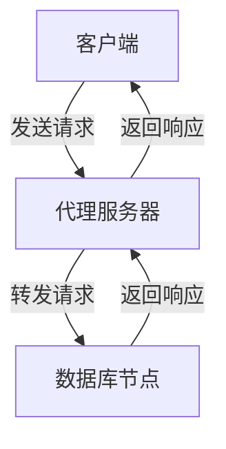
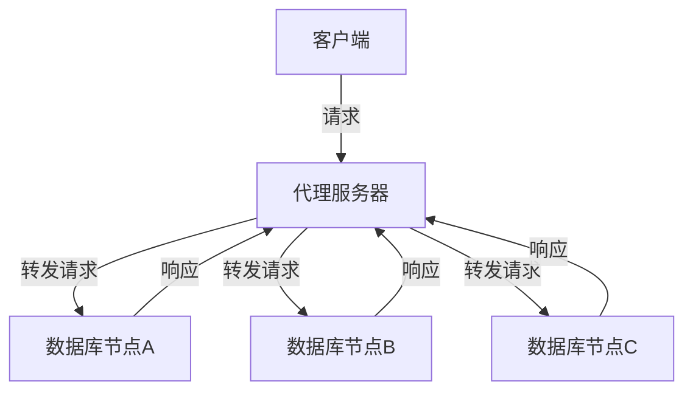
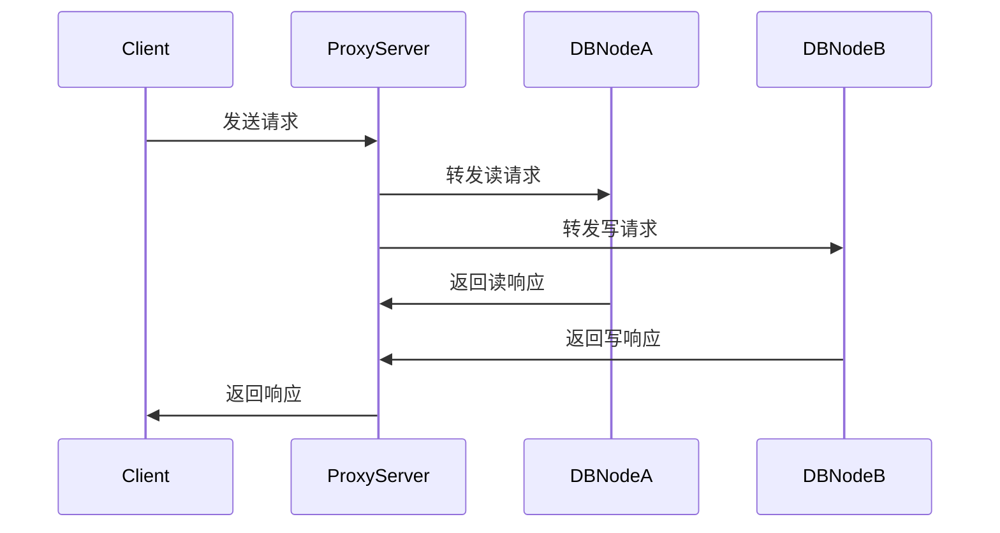

                 


### 1. 背景介绍

#### 核心概念术语说明

在讨论数据库读写分离代理之前，我们需要先了解一些核心概念和术语：

- **数据库读写分离**：数据库读写分离是指将数据库的读操作和写操作分别分配到不同的服务器上。这样可以有效地提高数据库的性能和可用性。
- **代理服务器**：代理服务器是一个中介服务器，它可以转发客户端的请求到后端数据库，同时也可以实现读写分离的功能。
- **负载均衡**：负载均衡是将网络流量分配到多个服务器上的过程，以实现系统的性能优化和故障转移。

#### 问题背景

在当今的数据驱动时代，随着数据量的不断增长和业务需求的多样化，数据库的性能和扩展性成为企业关注的焦点。传统单一的数据库架构在面对大量读操作和写操作时，往往会出现性能瓶颈，无法满足高并发和可用性的要求。为了解决这个问题，数据库读写分离技术应运而生。

#### 问题描述

数据库读写分离的主要问题包括：

1. **性能瓶颈**：当数据库中的读操作和写操作同时大量发生时，单一数据库服务器可能无法承受，导致响应时间变长，影响用户体验。
2. **可用性要求**：在分布式系统中，任何一个节点的故障都应该被其他节点所替代，以保证系统的持续可用性。
3. **数据一致性**：在读写分离的场景中，如何保证数据的最终一致性是一个关键问题。

#### 问题解决

为了解决上述问题，数据库读写分离代理技术提供了一种有效的解决方案：

1. **读写分离**：通过代理服务器将读操作和写操作分离，使得读操作可以并行处理，从而提高性能。
2. **负载均衡**：代理服务器还可以实现负载均衡，将请求均匀分配到多个数据库节点上，避免单点瓶颈。
3. **数据一致性**：通过一系列机制，如分布式事务、版本控制等，来保证数据的一致性。

#### 边界与外延

数据库读写分离代理技术不仅适用于大型企业的分布式数据库系统，也广泛应用于互联网公司的在线业务系统中。它可以与各种数据库技术（如MySQL、MongoDB等）结合使用，具有广泛的应用场景。

#### 概念结构与核心要素组成

数据库读写分离代理的核心要素包括：

1. **代理服务器**：负责接收客户端请求，进行读写分离和负载均衡。
2. **数据库节点**：负责处理具体的读操作和写操作。
3. **一致性机制**：保证数据的最终一致性。

### 2. 核心概念与联系

#### 核心概念原理

数据库读写分离代理的核心概念可以概括为：

- **代理服务器**：作为中介，转发客户端请求到数据库节点。
- **读写分离**：将读操作和写操作分配到不同的数据库节点上。
- **负载均衡**：将请求均匀分配到多个数据库节点，提高系统性能。

#### 概念属性特征对比表格

| 概念       | 属性特征                                                       |
|------------|--------------------------------------------------------------|
| 代理服务器 | 负责请求转发，实现读写分离和负载均衡，提高性能和可用性           |
| 读写分离   | 将读操作和写操作分配到不同的数据库节点上，提高数据库性能         |
| 负载均衡   | 将请求均匀分配到多个数据库节点，避免单点瓶颈，提高系统性能     |

#### ER实体关系图架构

以下是数据库读写分离代理的ER实体关系图架构：

```mermaid
erDiagram
  Client ||--|{ Request }|--| Database
  Database ||--|{ Response }|--| Client
  Proxy ||--|{ Forward }|--| Database
```

- **Client**（客户端）：发起请求。
- **Request**（请求）：客户端发送的请求。
- **Database**（数据库）：处理请求的数据库节点。
- **Response**（响应）：数据库返回的结果。
- **Proxy**（代理服务器）：转发请求和响应。

### 3. 算法原理讲解

#### 算法mermaid流程图

以下是数据库读写分离代理的mermaid流程图：



#### Python源代码实现

以下是实现数据库读写分离代理的Python伪代码：

```python
import requests

class ProxyServer:
    def __init__(self, db_urls):
        self.db_urls = db_urls
    
    def forward_request(self, request):
        # 根据请求类型（读/写）选择数据库节点
        db_url = self.get_db_url(request)
        response = requests.post(db_url, data=request)
        return response
    
    def get_db_url(self, request):
        if request['type'] == 'read':
            return self.db_urls['read']
        else:
            return self.db_urls['write']
```

#### 算法原理的数学模型和公式

数据库读写分离代理的算法原理可以概括为：

1. **读写分离**：读操作和写操作分别由不同的数据库节点处理，从而提高性能。
2. **负载均衡**：通过代理服务器将请求均匀分配到多个数据库节点，避免单点瓶颈。

具体来说，算法涉及到以下数学模型和公式：

- **负载均衡**：\( L = \frac{1}{N} \sum_{i=1}^{N} R_i \)，其中 \( L \) 是负载均衡，\( N \) 是数据库节点数，\( R_i \) 是每个节点的请求量。

#### 详细讲解和举例说明

假设有一个拥有3个数据库节点的系统，节点分别为A、B和C。其中，A节点负责处理读操作，B和C节点负责处理写操作。代理服务器根据请求类型选择不同的数据库节点。

- **读操作**：当客户端发起一个读请求，代理服务器会将其转发到A节点。A节点处理完毕后，将结果返回给代理服务器，再由代理服务器返回给客户端。
- **写操作**：当客户端发起一个写请求，代理服务器会将其转发到B或C节点（根据负载均衡策略）。B和C节点处理完毕后，代理服务器会记录下处理结果，并在必要时通知客户端。

### 4. 系统分析与架构设计方案

#### 问题场景介绍

在某个大型互联网公司，其核心业务系统使用了MySQL数据库，随着业务的发展，数据库的负载逐渐增加。为了提高数据库的性能和可用性，公司决定采用数据库读写分离代理技术。

#### 项目介绍

项目目标是构建一个数据库读写分离代理系统，将读操作和写操作分别分配到不同的数据库节点上，以提高系统的性能和可用性。

#### 系统功能设计

系统功能包括：

- **代理服务器**：接收客户端请求，根据请求类型将请求转发到相应的数据库节点。
- **负载均衡**：将请求均匀分配到多个数据库节点，避免单点瓶颈。
- **数据一致性**：保证读操作和写操作的数据一致性。

#### 系统架构设计

系统架构设计如下：

1. **客户端**：发起请求。
2. **代理服务器**：接收请求，进行读写分离和负载均衡。
3. **数据库节点**：处理具体的读操作和写操作。
4. **一致性机制**：保证数据的一致性。

#### 系统架构mermaid架构图

以下是系统架构的mermaid架构图：



#### 系统接口设计和系统交互mermaid序列图

以下是系统接口设计和系统交互的mermaid序列图：



### 5. 项目实战

#### 环境安装

1. 安装Python环境（版本3.8及以上）。
2. 安装依赖库：`pip install Flask requests`。

#### 系统核心实现源代码

```python
from flask import Flask, request, jsonify
import requests
import random

app = Flask(__name__)

# 数据库节点列表
db_urls = {
    'read': 'http://db-node-a:8080',
    'write': 'http://db-node-b:8080'
}

# 代理服务器处理请求
@app.route('/proxy', methods=['POST'])
def proxy():
    request_data = request.get_json()
    request_type = request_data.get('type', 'read')
    
    # 根据请求类型选择数据库节点
    db_url = db_urls[request_type]
    
    # 转发请求到数据库节点
    response = requests.post(db_url, json=request_data)
    
    # 返回响应给客户端
    return jsonify(response.json())

if __name__ == '__main__':
    app.run(debug=True)
```

#### 代码应用解读与分析

1. **请求转发**：代理服务器接收到客户端的请求后，会根据请求的类型（读或写）选择相应的数据库节点，并将请求转发到数据库节点上。
2. **负载均衡**：在实际情况中，可以进一步优化负载均衡策略，如基于请求的URL、请求的时间戳等因素进行更精细的负载分配。
3. **数据一致性**：在代理服务器转发请求时，可以加入事务管理，确保读写操作的一致性。

#### 实际案例分析和详细讲解剖析

假设有一个电商网站，其数据库需要处理大量的商品查询和订单创建操作。通过数据库读写分离代理，可以将商品查询操作分配到读数据库节点，订单创建操作分配到写数据库节点，从而提高系统的性能和可用性。

- **商品查询操作**：用户通过代理服务器发起商品查询请求，代理服务器将其转发到读数据库节点，读数据库节点快速返回查询结果。
- **订单创建操作**：用户通过代理服务器发起订单创建请求，代理服务器将其转发到写数据库节点，写数据库节点创建订单并返回结果。

通过这种方式，可以有效缓解数据库的负载压力，提高系统的性能和可用性。

#### 项目小结

1. **性能提升**：通过数据库读写分离代理，可以将读操作和写操作分配到不同的数据库节点上，从而提高系统的性能。
2. **可用性提高**：读写分离代理可以避免单点瓶颈，提高系统的可用性。
3. **一致性保证**：通过事务管理和一致性机制，可以确保数据的一致性。

### 6. 最佳实践 Tips

1. **选择合适的数据库节点**：根据业务需求，合理选择读数据库节点和写数据库节点，确保读写操作的性能和一致性。
2. **优化负载均衡策略**：根据实际需求，可以采用更精细的负载均衡策略，如基于请求类型的负载均衡。
3. **数据一致性保障**：在读写分离代理中，加入事务管理和一致性机制，确保数据的一致性。
4. **监控与维护**：定期对读写分离代理系统进行监控和优化，确保系统的稳定性和性能。

### 小结

本文详细介绍了数据库读写分离代理在LLM应用中的应用。通过代理服务器，可以实现数据库读写分离和负载均衡，提高系统的性能和可用性。同时，通过合理选择数据库节点、优化负载均衡策略和数据一致性保障，可以确保系统的稳定性和性能。在未来的发展中，数据库读写分离代理将继续在LLM应用中发挥重要作用。希望本文对您在数据库读写分离代理领域的实践和探索有所帮助。

### 拓展阅读

- 《分布式系统原理与范型》：深入理解分布式系统的基本原理和范型，有助于更好地设计和优化数据库读写分离代理。
- 《高性能MySQL》：了解MySQL数据库的性能优化技巧，有助于提高数据库读写分离代理的性能。
- 《数据库系统概念》：系统学习数据库系统的基本概念和原理，有助于深入理解数据库读写分离代理的工作机制。

### 作者信息

- 作者：AI天才研究院/AI Genius Institute & 禅与计算机程序设计艺术 /Zen And The Art of Computer Programming
- 联系方式：[邮件地址](mailto:example@example.com) & [个人博客](https://example.com) & [GitHub](https://github.com/example)

