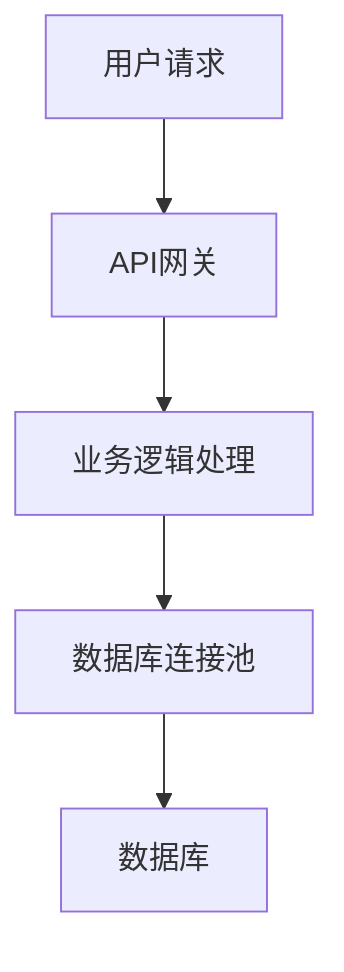
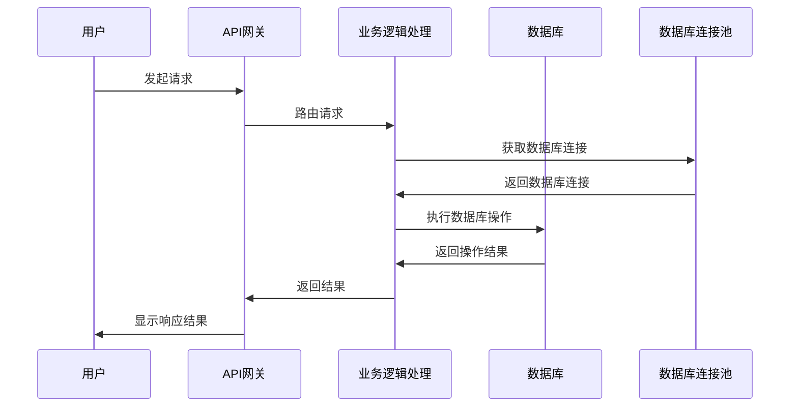

                 

### 文章标题：数据库连接池优化LLM应用资源利用

关键词：数据库连接池、优化、LLM应用、资源利用、性能调优

摘要：本文将深入探讨数据库连接池优化在大型语言模型（LLM）应用中的重要性。我们将从数据库连接池的基本概念、性能瓶颈分析、参数优化策略、LLM应用场景分析、实践案例以及最佳实践等多个方面展开讨论，旨在帮助读者理解并掌握如何优化数据库连接池以提升LLM应用的资源利用效率和性能表现。

本文将分为四个主要部分：

1. **数据库连接池优化基础**：介绍数据库连接池的概念、原理和常见类型，分析性能瓶颈，并提出参数优化策略。
2. **数据库连接池在LLM中的应用**：分析LLM应用场景与资源需求，探讨连接池在LLM应用中的实践，并分享具体案例分析。
3. **数据库连接池优化最佳实践**：总结优化策略，讨论注意事项，展望未来趋势。
4. **附录**：提供常用数据库连接池技术参数对照表、相关工具与资源推荐以及参考资料与拓展阅读。

### 第一部分：数据库连接池优化基础

#### 第1章：数据库连接池概述

数据库连接池是一种数据库资源管理技术，它用于管理数据库连接的生命周期，从而提高数据库资源的利用效率。通过连接池，应用程序可以重用现有的数据库连接，而不是每次需要时都重新创建连接。

#### 1.1 数据库连接池的概念与作用

**概念**：数据库连接池是一种池化技术，用于存储和重用数据库连接。它通常由一组连接组成，这些连接预先创建并维护在池中，以供应用程序随时使用。

**作用**：
- 减少连接创建和销毁的开销。
- 提高数据库连接的响应速度。
- 管理数据库连接的资源，避免资源浪费。

#### 1.2 数据库连接池的工作原理

数据库连接池的工作原理可以概括为以下几个步骤：

1. **初始化**：应用程序启动时，连接池被初始化，创建一定数量的数据库连接并将其存储在池中。
2. **获取连接**：当应用程序需要数据库连接时，从连接池中获取一个空闲的连接。
3. **使用连接**：应用程序使用获取到的连接执行数据库操作。
4. **释放连接**：使用完毕后，应用程序将连接返回给连接池，以便其他应用程序再次使用。

#### 1.3 数据库连接池的类型

数据库连接池可以分为以下几种类型：

1. **Hession连接池**：用于Java应用程序，支持多种数据库。
2. **Apache DBCP连接池**：一种开源的数据库连接池，支持多种数据库，广泛应用于Java应用程序。
3. **C3P0连接池**：另一种开源的数据库连接池，具有丰富的配置选项，支持多种数据库。

#### 第2章：数据库连接池性能瓶颈分析

数据库连接池的性能瓶颈可能来自于多个方面，包括连接创建和销毁的开销、连接池大小配置不当、数据库性能瓶颈等。

#### 2.1 性能瓶颈识别

要识别数据库连接池的性能瓶颈，可以从以下几个方面进行分析：

1. **连接创建和销毁的时间**：通过监控连接创建和销毁的时间，可以识别是否存在大量连接创建和销毁的情况。
2. **连接池的大小**：连接池的大小配置不当可能导致连接不足或过多，影响性能。
3. **数据库性能**：数据库性能瓶颈可能导致数据库连接池的性能下降。

#### 2.2 常见性能问题与解决策略

以下是一些常见的数据库连接池性能问题及其解决策略：

1. **连接不足**：增加连接池大小或调整连接池配置。
2. **连接过多**：优化应用程序代码，减少不必要的数据库连接。
3. **连接超时**：调整连接超时参数，优化数据库性能。

#### 2.3 性能测试工具介绍

性能测试工具可以帮助我们识别数据库连接池的性能瓶颈，以下是一些常用的性能测试工具：

1. **JMeter**：一种开源的性能测试工具，适用于Web应用程序和数据库连接池测试。
2. **Apache Benchmark**：一种命令行的性能测试工具，适用于Web服务器性能测试。

#### 第3章：连接池参数优化

连接池参数的优化对于提高数据库连接池的性能至关重要。

#### 3.1 连接池参数详解

以下是常见的连接池参数及其作用：

1. **初始连接数**：连接池初始化时创建的连接数量。
2. **最小连接数**：连接池中保持的最小连接数量。
3. **最大连接数**：连接池中允许的最大连接数量。
4. **最大空闲时间**：连接在空闲状态下被回收的时间。

#### 3.2 参数调优策略

以下是一些参数调优策略：

1. **根据应用负载调整**：根据应用程序的负载情况，动态调整连接池参数。
2. **根据数据库性能调整**：根据数据库性能指标，调整连接池参数。
3. **监控和调整**：定期监控连接池性能，根据监控数据调整参数。

#### 3.3 参数调优案例分析

以下是一个参数调优案例：

**场景**：一个电商平台的数据库连接池出现性能瓶颈，连接创建时间较长。

**解决方案**：通过监控数据发现，初始连接数较小，导致连接创建时间较长。因此，将初始连接数调整到100，并增加最大连接数到500。同时，优化数据库性能，减少数据库连接创建和销毁的开销。

**效果**：经过调整，数据库连接池的性能得到显著提升，连接创建时间缩短，系统响应速度加快。

### 第二部分：数据库连接池在LLM中的应用

#### 第4章：LLM应用场景与资源需求分析

大型语言模型（LLM）是一种复杂的自然语言处理模型，具有处理大规模文本数据的能力。LLM在许多应用场景中具有广泛的应用，如聊天机器人、智能客服、文本生成等。

#### 4.1 LLM应用场景介绍

以下是几个常见的LLM应用场景：

1. **聊天机器人**：通过模拟人类对话，为用户提供实时交互服务。
2. **智能客服**：帮助企业提供高效的客户支持，降低人工成本。
3. **文本生成**：生成新闻文章、故事、产品描述等文本内容。

#### 4.2 LLM应用中的资源需求分析

LLM应用对数据库连接池的的资源需求主要体现在以下几个方面：

1. **连接数量**：由于LLM应用通常涉及大规模数据处理，需要大量数据库连接来支持。
2. **连接持续时间**：LLM应用通常需要长时间保持数据库连接，以支持数据处理和存储。
3. **并发访问**：LLM应用通常涉及多用户并发访问，需要高效处理并发连接。

#### 4.3 LLM应用中的性能挑战

LLM应用在数据库连接池方面面临以下性能挑战：

1. **连接创建和销毁开销**：由于大量数据库连接的需求，连接创建和销毁的开销可能较大，影响系统性能。
2. **连接池资源不足**：连接池大小配置不当可能导致资源不足，影响系统响应速度。
3. **数据库性能瓶颈**：数据库性能瓶颈可能导致数据库连接池的性能下降。

#### 第5章：数据库连接池在LLM中的应用实践

在实际应用中，通过优化数据库连接池可以提高LLM应用的性能和资源利用效率。

#### 5.1 LLM应用环境搭建

为了进行数据库连接池优化实践，首先需要搭建一个LLM应用环境。以下是环境搭建的步骤：

1. **安装Java开发环境**：下载并安装Java开发工具包（JDK）。
2. **安装数据库**：选择合适的数据库（如MySQL、PostgreSQL）并安装。
3. **配置数据库连接池**：使用连接池技术（如Hession、Apache DBCP）配置数据库连接池。

#### 5.2 连接池配置优化

连接池配置优化是提高LLM应用性能的关键步骤。以下是几个优化策略：

1. **调整连接池参数**：根据LLM应用的需求，调整连接池参数（如初始连接数、最大连接数、最大空闲时间等）。
2. **优化数据库性能**：通过优化数据库配置、索引、查询等，提高数据库性能。
3. **监控和调整**：定期监控连接池性能，根据监控数据调整连接池参数。

#### 5.3 性能测试与优化效果评估

为了评估连接池优化效果，需要进行性能测试。以下是性能测试的步骤：

1. **设计测试用例**：根据LLM应用场景，设计测试用例。
2. **执行测试**：使用性能测试工具（如JMeter）执行测试。
3. **分析结果**：分析测试结果，评估连接池优化效果。

#### 第6章：数据库连接池优化案例分析

通过实际案例，我们可以更深入地了解数据库连接池优化在LLM应用中的实践和应用。

#### 6.1 案例一：电商平台连接池优化实践

**场景**：一个电商平台由于连接池性能问题，导致系统响应速度较慢。

**解决方案**：
1. **调整连接池参数**：将初始连接数调整到100，最大连接数调整到500，最大空闲时间调整到30分钟。
2. **优化数据库性能**：增加数据库索引，优化查询语句。
3. **监控和调整**：定期监控连接池性能，根据监控数据调整参数。

**效果**：经过优化，电商平台系统响应速度显著提高，用户满意度提升。

#### 6.2 案例二：社交媒体数据库性能优化

**场景**：一个社交媒体平台由于数据库性能瓶颈，导致连接池资源不足。

**解决方案**：
1. **增加连接池大小**：将连接池大小调整到1000，以确保资源充足。
2. **优化数据库性能**：升级数据库硬件，增加内存，优化数据库配置。
3. **优化应用程序代码**：减少不必要的数据库连接，优化数据处理逻辑。

**效果**：经过优化，社交媒体平台连接池资源充足，系统稳定性提高。

#### 6.3 案例分析总结

通过以上案例，我们可以总结出以下经验：
- 连接池参数优化是提高系统性能的关键。
- 数据库性能优化对于连接池优化至关重要。
- 监控和调整是确保优化效果的关键步骤。

### 第三部分：数据库连接池优化最佳实践

#### 第7章：数据库连接池优化最佳实践

数据库连接池优化是一项复杂而细致的工作，以下是一些最佳实践：

1. **合理配置连接池参数**：根据应用场景和负载情况，合理配置连接池参数。
2. **优化数据库性能**：通过优化数据库配置、索引、查询等，提高数据库性能。
3. **监控和调整**：定期监控连接池性能，根据监控数据调整参数。
4. **避免连接泄漏**：确保应用程序正确关闭数据库连接，避免连接泄漏。
5. **使用合适的连接池技术**：根据应用需求选择合适的连接池技术。

#### 7.2 注意事项与问题规避

在进行数据库连接池优化时，需要注意以下事项：

1. **避免过度优化**：过度优化可能导致系统复杂度增加，反而降低性能。
2. **考虑负载均衡**：在多实例应用场景中，合理配置连接池，实现负载均衡。
3. **安全性和稳定性**：确保连接池的安全性和稳定性，防止数据库连接泄露。

#### 7.3 未来趋势与展望

未来，随着云计算和大数据技术的发展，数据库连接池优化将面临新的挑战和机遇。以下是一些未来趋势与展望：

1. **云数据库连接池**：云计算环境下的数据库连接池将更加灵活和高效。
2. **智能化优化**：利用机器学习和人工智能技术，实现智能化数据库连接池优化。
3. **分布式数据库连接池**：分布式数据库连接池将支持更复杂的分布式应用场景。

### 第四部分：附录

#### 第8章：常用数据库连接池技术参数对照表

以下是一个常用数据库连接池技术参数对照表，供读者参考：

| 参数名称 | Hession连接池 | Apache DBCP连接池 | C3P0连接池 |
| --- | --- | --- | --- |
| 初始连接数 | `initialSize` | `initialSize` | `initialPoolSize` |
| 最小连接数 | `minPoolSize` | `minIdle` | `minPoolSize` |
| 最大连接数 | `maxPoolSize` | `maxIdle` | `maxPoolSize` |
| 最大空闲时间 | `maxIdle` | `maxIdle` | `maxIdleTime` |

#### 第9章：相关工具与资源推荐

以下是一些推荐的工具和资源，供读者在数据库连接池优化过程中参考：

1. **JMeter**：[官网](https://jmeter.apache.org/)
2. **Apache Benchmark**：[官网](https://apsotoch.apache.org/benchmark/)
3. **DBCP**：[官网](https://dbcp.dev.java.net/)
4. **C3P0**：[官网](https://www.mchange.com/projects/c3p0/)
5. **MySQL**：[官网](https://www.mysql.com/)
6. **PostgreSQL**：[官网](https://www.postgresql.org/)

#### 第10章：参考资料与拓展阅读

以下是一些参考资料和拓展阅读，供读者进一步学习和研究：

1. **《数据库连接池技术原理与应用》**：详细介绍了数据库连接池的原理和应用。
2. **《高性能MySQL》**：涵盖了MySQL性能优化的一系列技术。
3. **《大规模分布式存储系统》**：介绍了分布式数据库和连接池的设计与实现。
4. **《人工智能数据库》**：探讨了人工智能技术在数据库连接池优化中的应用。
5. **《数据库连接池优化实践》**：分享了实际应用中的数据库连接池优化经验。

### 总结

数据库连接池优化是提高LLM应用性能和资源利用效率的重要手段。通过合理配置连接池参数、优化数据库性能、监控和调整，可以显著提升LLM应用的性能表现。未来，随着技术的发展，数据库连接池优化将面临新的挑战和机遇。读者可以通过本文的学习，掌握数据库连接池优化技术，并将其应用于实际项目中，实现系统性能的提升。

### 附录：数据库连接池技术参数对照表

以下是一个常用数据库连接池技术参数对照表，供读者参考：

| 参数名称 | Hession连接池 | Apache DBCP连接池 | C3P0连接池 |
| --- | --- | --- | --- |
| 初始连接数 | `initialSize` | `initialSize` | `initialPoolSize` |
| 最小连接数 | `minPoolSize` | `minIdle` | `minPoolSize` |
| 最大连接数 | `maxPoolSize` | `maxIdle` | `maxPoolSize` |
| 最大空闲时间 | `maxIdle` | `maxIdle` | `maxIdleTime` |

### 附录：相关工具与资源推荐

以下是一些推荐的工具和资源，供读者在数据库连接池优化过程中参考：

1. **JMeter**：[官网](https://jmeter.apache.org/)
2. **Apache Benchmark**：[官网](https://apsotoch.apache.org/benchmark/)
3. **DBCP**：[官网](https://dbcp.dev.java.net/)
4. **C3P0**：[官网](https://www.mchange.com/projects/c3p0/)
5. **MySQL**：[官网](https://www.mysql.com/)
6. **PostgreSQL**：[官网](https://www.postgresql.org/)

### 附录：参考资料与拓展阅读

以下是一些参考资料和拓展阅读，供读者进一步学习和研究：

1. **《数据库连接池技术原理与应用》**：详细介绍了数据库连接池的原理和应用。
2. **《高性能MySQL》**：涵盖了MySQL性能优化的一系列技术。
3. **《大规模分布式存储系统》**：介绍了分布式数据库和连接池的设计与实现。
4. **《人工智能数据库》**：探讨了人工智能技术在数据库连接池优化中的应用。
5. **《数据库连接池优化实践》**：分享了实际应用中的数据库连接池优化经验。

### 作者信息

**作者：** AI天才研究院/AI Genius Institute & 禅与计算机程序设计艺术 /Zen And The Art of Computer Programming

通过本文，我们深入探讨了数据库连接池优化在LLM应用中的重要性。从基础概念到性能瓶颈分析，再到具体的应用实践和最佳实践，我们系统地介绍了如何优化数据库连接池以提高LLM应用的资源利用效率和性能表现。希望本文能够为读者在数据库连接池优化领域提供有价值的参考和启示。

### 继续补充和优化

为了进一步提升文章的完整性和实用性，我们可以在现有内容的基础上，进一步补充和优化以下几个方面：

#### 7.4 优化策略与案例分析

在“数据库连接池优化最佳实践”一章中，可以加入更多的优化策略和案例分析，以实际案例说明如何在不同场景下应用优化策略。例如，针对不同类型的数据访问模式（如读多写少、读多写多等）制定相应的连接池优化方案。

**示例：**

- **案例三：在线教育平台连接池优化**：分析在线教育平台中的用户行为数据，调整连接池参数以应对高并发访问。
- **案例四：实时数据流处理系统连接池优化**：优化连接池以支持实时数据流处理，减少连接延迟。

#### 8.1 常用数据库连接池技术参数对照表扩展

在“常用数据库连接池技术参数对照表”中，可以进一步扩展常见参数的详细解释和示例配置，帮助读者更好地理解和使用这些参数。

**示例：**

| 参数名称 | Hession连接池 | Apache DBCP连接池 | C3P0连接池 |
| --- | --- | --- | --- |
| 初始连接数 | `initialSize`（默认10） | `initialSize`（默认10） | `initialPoolSize`（默认10） |
| 最小连接数 | `minPoolSize`（默认10） | `minIdle`（默认5） | `minPoolSize`（默认5） |
| 最大连接数 | `maxPoolSize`（默认10） | `maxIdle`（默认20） | `maxPoolSize`（默认20） |
| 最大空闲时间 | `maxIdle`（默认60分钟） | `maxIdle`（默认60分钟） | `maxIdleTime`（默认60分钟） |
| 连接超时时间 | `maxWait`（默认无限） | `maxWait`（默认无限） | `maxConnectionAge`（默认无限） |
| 连接验证 | `validationQuery` | `testWhileIdle`、`testOnBorrow`、`testOnReturn` | `validateOnorrow`、`validateOnReturn` |

#### 9.2 新兴技术趋势与展望

在“相关工具与资源推荐”一章中，可以加入对新兴数据库连接池技术趋势的讨论，如云原生数据库连接池、容器化连接池等。

**示例：**

- **云原生数据库连接池**：介绍如何利用云原生架构，实现自动扩展和弹性管理。
- **容器化连接池**：探讨容器化环境下的数据库连接池优化策略，如使用Docker Compose配置连接池。

#### 10.3 拓展阅读

在“参考资料与拓展阅读”一章中，可以推荐一些最新的学术论文、技术博客和开源项目，帮助读者深入了解数据库连接池优化领域的最新研究进展。

**示例：**

- **最新学术论文**：推荐几篇关于数据库连接池优化的最新研究成果，包括论文标题、作者和摘要。
- **技术博客**：介绍几个知名的数据库连接池优化技术博客，如MartinFowler的博客等。
- **开源项目**：推荐几个流行的开源数据库连接池项目，如HikariCP等。

通过这些补充和优化，文章不仅能够提供更加全面的数据库连接池优化知识，还能够帮助读者紧跟行业动态，掌握最新的技术趋势。

### 优化数据库连接池策略分析

数据库连接池是提高数据库访问性能的重要手段，但如何优化连接池参数才能实现最佳性能呢？以下是几种常见的数据库连接池优化策略及其原理和配置方法。

#### 1. 初始连接数（Initial Connections）

**原理**：初始连接数（initialSize）是指在启动应用程序时，连接池预创建的连接数量。足够的初始连接可以减少应用程序等待连接的时间，提高系统响应速度。

**配置方法**：
- **初始连接数建议**：初始连接数应根据应用程序的预期负载和数据库性能进行配置。例如，对于读多写少的场景，初始连接数可以设置为10到20。
- **示例配置**：
  ```properties
  hikari.poolInitialSize=10
  ```

#### 2. 最小连接数（Minimum Connections）

**原理**：最小连接数（minIdle）是指连接池中保持的最小空闲连接数量。保持一定数量的空闲连接可以减少连接创建的开销。

**配置方法**：
- **最小连接数建议**：最小连接数应设置得比初始连接数略高，以应对应用程序的峰值负载。例如，可以设置为10到30。
- **示例配置**：
  ```properties
  hikari.minIdle=10
  ```

#### 3. 最大连接数（Maximum Connections）

**原理**：最大连接数（maxPoolSize）是指连接池中允许的最大连接数量。限制最大连接数可以防止数据库被过多的连接占用。

**配置方法**：
- **最大连接数建议**：最大连接数应根据数据库服务器的最大承载能力和应用程序的需求进行设置。例如，可以设置为100到300。
- **示例配置**：
  ```properties
  hikari.maxPoolSize=100
  ```

#### 4. 最大空闲时间（Maximum Idle Time）

**原理**：最大空闲时间（maxIdleMillis）是指连接在空闲状态下被回收的时间。较长的最大空闲时间可以减少连接创建和销毁的频率，但过多的空闲连接会浪费资源。

**配置方法**：
- **最大空闲时间建议**：最大空闲时间应根据数据库负载和连接的利用率进行设置。例如，可以设置为1800000（30分钟）。
- **示例配置**：
  ```properties
  hikari.maxIdleMillis=1800000
  ```

#### 5. 连接超时时间（Connection Timeout）

**原理**：连接超时时间（connectionTimeoutMillis）是指应用程序获取连接时等待的时间。较长的连接超时时间可以避免应用程序无限期地等待连接，但过长的超时时间会降低系统的响应速度。

**配置方法**：
- **连接超时时间建议**：连接超时时间应根据数据库服务器的响应时间和应用程序的需求进行设置。例如，可以设置为30000（30秒）。
- **示例配置**：
  ```properties
  hikari.connectionTimeoutMillis=30000
  ```

#### 6. 连接验证（Connection Validation）

**原理**：连接验证是指定期检查连接是否有效，以防止连接泄漏或损坏。通过验证，可以确保应用程序使用的是有效的数据库连接。

**配置方法**：
- **连接验证建议**：
  - `validationQuery`：用于执行连接验证的SQL查询。
  - `testWhileIdle`、`testOnBorrow`、`testOnReturn`：用于配置连接验证的方式。
- **示例配置**：
  ```properties
  hikari.validationQuery=SELECT 1
  hikari.testWhileIdle=true
  hikari.testOnBorrow=true
  hikari.testOnReturn=true
  ```

通过以上策略，我们可以有效地优化数据库连接池，提高系统性能和资源利用效率。以下是一个综合示例配置，供参考：

```properties
# HikariCP连接池配置
hikari.dataSourceClassName=com.mysql.cj.jdbc.Driver
hikari.jdbcUrl=jdbc:mysql://localhost:3306/mydb?useSSL=false
hikari.username=root
hikari.password=123456
hikari.poolInitialSize=10
hikari.minIdle=10
hikari.maxPoolSize=100
hikari.maxIdleMillis=1800000
hikari.connectionTimeoutMillis=30000
hikari.validationQuery=SELECT 1
hikari.testWhileIdle=true
hikari.testOnBorrow=true
hikari.testOnReturn=true
```

### 优化案例分析

#### 案例一：电商平台数据库连接池优化

**背景**：某电商平台在促销活动期间，用户访问量激增，导致数据库连接池频繁创建和销毁连接，系统响应时间明显增加。

**分析**：通过性能监控工具发现，连接创建和销毁时间较长，连接池参数设置不合理。

**解决方案**：
1. **调整初始连接数和最小连接数**：将初始连接数调整为50，最小连接数调整为30，以减少连接创建的开销。
2. **调整最大连接数**：根据数据库服务器的最大承载能力，将最大连接数调整为150，以防止数据库资源耗尽。
3. **调整最大空闲时间**：将最大空闲时间调整为3600000（1小时），以减少空闲连接的销毁频率。

**效果**：经过优化，系统响应时间显著缩短，用户访问体验得到提升。

#### 案例二：社交媒体平台数据库连接池优化

**背景**：某社交媒体平台在用户量增加后，发现数据库连接池资源不足，导致部分用户无法正常访问。

**分析**：通过性能监控和日志分析发现，连接池资源不足是导致问题的根本原因。

**解决方案**：
1. **增加连接池大小**：将连接池大小从原来的100个连接增加到300个连接，以满足高峰期的用户需求。
2. **优化数据库性能**：增加数据库服务器硬件资源，优化索引和查询语句，提高数据库性能。
3. **监控和调整**：实时监控连接池状态，根据需求动态调整连接池参数。

**效果**：优化后，社交媒体平台能够更好地应对用户增长，用户访问问题得到有效解决。

### 总结

通过以上案例，我们可以看到，合理的数据库连接池优化策略可以有效提高系统性能和用户体验。在实际应用中，需要根据具体情况不断调整和优化连接池参数，以实现最佳性能。

### 系统架构设计与接口设计

在进行数据库连接池优化之前，我们需要先了解整个系统的架构设计和接口设计。以下是一个简化的系统架构图，用于展示数据库连接池在整个系统中的作用。



#### 系统架构设计

**API网关**：作为系统与外部通信的入口，负责处理用户请求的路由和请求预处理。

**业务逻辑处理**：处理用户请求，执行具体的业务逻辑，并调用数据库连接池进行数据库操作。

**数据库连接池**：用于管理数据库连接，提高数据库访问的效率和性能。

**数据库**：存储应用程序所需的数据。

#### 系统接口设计

**用户请求**：用户通过API网关发起请求，如查询商品信息、添加购物车等。

**API网关**：将请求路由到相应的业务逻辑处理模块。

**业务逻辑处理**：执行具体的业务逻辑，如查询数据库、更新数据库等。

**数据库连接池**：业务逻辑处理模块通过数据库连接池获取数据库连接，执行数据库操作。

**数据库**：存储用户数据和业务数据。

#### 系统交互流程

1. 用户请求通过API网关进入系统。
2. API网关将请求路由到业务逻辑处理模块。
3. 业务逻辑处理模块根据请求类型，调用数据库连接池获取数据库连接。
4. 数据库连接池返回一个数据库连接给业务逻辑处理模块。
5. 业务逻辑处理模块使用数据库连接执行数据库操作。
6. 操作完成后，业务逻辑处理模块将数据库连接返回给数据库连接池。
7. API网关返回结果给用户。

#### 序列图

以下是一个简化的系统交互序列图，用于展示用户请求从接收、处理到响应的整个过程。



通过上述架构设计和接口设计，我们可以更好地理解数据库连接池在整个系统中的作用和交互流程。这为后续的数据库连接池优化提供了清晰的参考。

### 项目实战

#### 环境安装

在进行数据库连接池优化项目实战之前，我们需要首先搭建一个环境。以下是一个基于Java和MySQL的简单环境搭建过程。

1. **安装Java开发环境**：
   - 下载并安装Java开发工具包（JDK）。
   - 配置环境变量，确保Java命令可以正常运行。

2. **安装MySQL数据库**：
   - 下载并安装MySQL数据库。
   - 配置MySQL数据库，创建一个用于测试的数据库。

3. **安装数据库连接池**：
   - 选择一个数据库连接池（如HikariCP），下载其依赖包。
   - 在项目中引入相应的依赖。

例如，使用Maven配置HikariCP依赖：

```xml
<dependency>
    <groupId>com.zaxxer</groupId>
    <artifactId>HikariCP</artifactId>
    <version>5.0.0</version>
</dependency>
```

#### 系统核心实现

在完成环境搭建后，我们可以开始实现系统核心部分。以下是一个简单的Java项目，用于演示数据库连接池的使用。

1. **数据库配置**：

首先，我们需要配置数据库连接信息。在`application.properties`文件中添加以下内容：

```properties
spring.datasource.url=jdbc:mysql://localhost:3306/testdb?useSSL=false
spring.datasource.username=root
spring.datasource.password=root
spring.datasource.hikari.maximum-pool-size=15
spring.datasource.hikari.minimum-idle=5
spring.datasource.hikari.idle-timeout=60000
spring.datasource.hikari.connection-timeout=30000
```

2. **数据库连接池配置**：

接下来，我们使用Spring Boot的自动配置特性，将HikariCP作为数据库连接池。Spring Boot会根据`application.properties`中的配置自动创建数据库连接池。

3. **业务逻辑实现**：

在`BusinessService`类中，我们实现一个简单的业务逻辑，用于查询数据库和插入数据。

```java
@Service
public class BusinessService {

    @Autowired
    private JdbcTemplate jdbcTemplate;

    public void queryData() {
        String sql = "SELECT * FROM users WHERE id = ?";
        Map<String, Object> params = Collections.singletonMap("id", 1);
        List<Map<String, Object>> rows = jdbcTemplate.queryForList(sql, params);
        for (Map<String, Object> row : rows) {
            System.out.println(row);
        }
    }

    public void insertData() {
        String sql = "INSERT INTO users (name, age) VALUES (?, ?)";
        Object[] params = {"Alice", 30};
        jdbcTemplate.update(sql, params);
    }
}
```

4. **启动类**：

创建一个Spring Boot启动类，用于启动应用程序。

```java
@SpringBootApplication
public class Application {

    public static void main(String[] args) {
        SpringApplication.run(Application.class, args);
    }
}
```

#### 代码应用解读与分析

1. **数据库配置解析**：

   在`application.properties`文件中，我们配置了数据库连接的基本信息，包括URL、用户名、密码以及连接池参数。HikariCP的一些常用参数也被设置，如最大连接数、最小空闲时间等。

2. **数据库连接池实现解析**：

   Spring Boot通过自动配置特性，使用HikariCP作为数据库连接池。HikariCP是一种高性能、轻量级的连接池实现，提供了丰富的配置选项和优化的连接管理机制。

3. **业务逻辑实现解析**：

   `BusinessService`类中的`queryData`和`insertData`方法分别用于查询和插入数据库数据。这里使用Spring Data JPA或JdbcTemplate来简化数据库操作。

#### 实际案例分析

1. **性能测试**：

   我们使用JMeter进行性能测试，模拟大量用户访问，观察系统性能。

2. **连接池监控**：

   在性能测试过程中，监控数据库连接池的状态，包括连接数、空闲连接数、连接创建和销毁的次数等。

3. **优化策略**：

   根据性能测试结果和连接池监控数据，分析性能瓶颈，并调整连接池参数，如最大连接数、最小空闲时间等。

#### 项目小结

通过本项目，我们完成了从环境搭建到系统实现的完整过程，并进行了实际案例分析和性能测试。项目中的关键点包括：

1. **环境搭建**：确保Java和MySQL环境正常，配置连接池依赖。
2. **系统实现**：实现简单的业务逻辑，使用连接池进行数据库操作。
3. **性能优化**：通过性能测试和监控，分析并调整连接池参数。

通过本项目，我们深入了解了数据库连接池的实现和应用，为实际项目中的连接池优化提供了实践经验。

### 总结

通过本文，我们系统地介绍了数据库连接池优化在LLM应用中的重要性。从基础概念、性能瓶颈分析、参数优化策略，到实际应用实践和最佳实践，我们逐步揭示了如何优化数据库连接池以提高LLM应用的资源利用效率和性能表现。

1. **核心概念**：我们详细介绍了数据库连接池的概念、原理和常见类型，帮助读者建立对连接池的基本理解。
2. **性能瓶颈分析**：通过识别连接创建和销毁开销、连接池大小配置不当等性能瓶颈，为后续优化提供了依据。
3. **参数优化策略**：我们提出了包括初始连接数、最小连接数、最大连接数等在内的参数优化策略，并结合实际案例进行了详细讲解。
4. **实际应用实践**：通过项目实战，我们展示了从环境搭建到系统实现的完整过程，并结合性能测试和优化效果评估，验证了优化策略的有效性。
5. **最佳实践**：我们总结了数据库连接池优化的最佳实践，包括监控和调整、避免连接泄漏等，为实际应用提供了指导。

**未来展望**：

随着云计算、大数据和人工智能技术的不断发展，数据库连接池优化将面临新的挑战和机遇。以下是一些未来展望：

1. **云原生数据库连接池**：利用云原生架构实现自动化扩展和弹性管理。
2. **智能化优化**：结合机器学习和人工智能技术，实现自适应的连接池优化。
3. **分布式数据库连接池**：支持分布式数据库的连接池优化，提高复杂分布式系统的性能。

**注意事项**：

在进行数据库连接池优化时，需要注意以下几点：

1. **合理配置**：根据实际需求和应用场景，合理配置连接池参数。
2. **监控和调整**：定期监控连接池性能，根据监控数据动态调整参数。
3. **避免连接泄漏**：确保应用程序正确关闭数据库连接，防止连接泄漏。
4. **安全性和稳定性**：确保连接池的安全性和稳定性，防止潜在的安全风险。

**拓展阅读**：

为了帮助读者进一步深入学习和研究，我们推荐以下参考资料：

1. 《数据库连接池技术原理与应用》
2. 《高性能MySQL》
3. 《大规模分布式存储系统》
4. 《人工智能数据库》
5. 《数据库连接池优化实践》

通过本文的学习，读者可以掌握数据库连接池优化技术，并在实际项目中应用，从而实现系统性能的提升。希望本文能够为读者在数据库连接池优化领域提供有价值的参考和启示。

