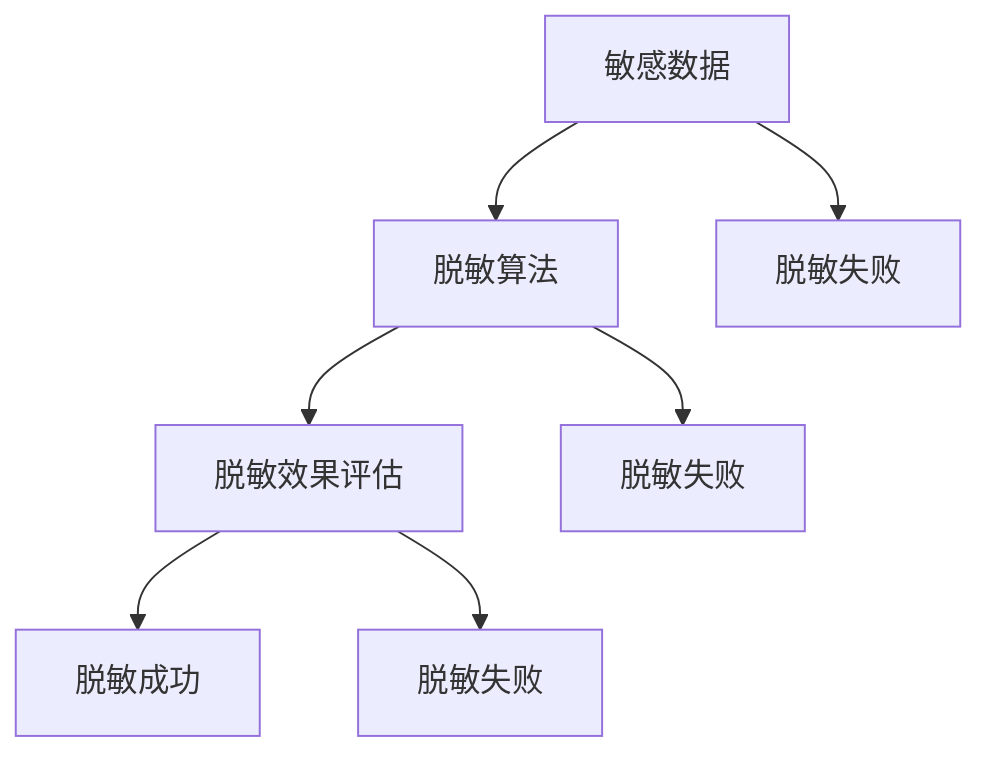
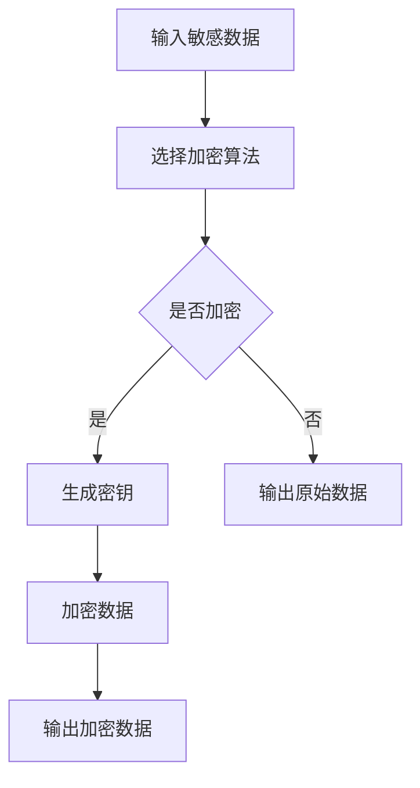
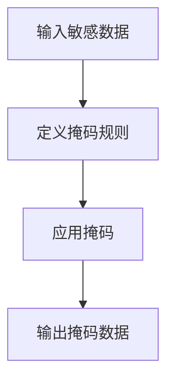
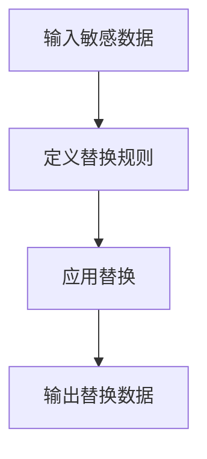
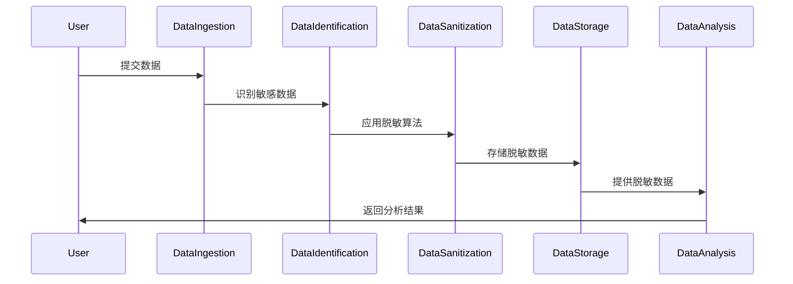

                 

### 数据脱敏的定义及其重要性

#### 数据脱敏的定义

数据脱敏是一种数据保护技术，其目的是在不影响数据使用价值的前提下，通过某种方式将原始数据中的敏感信息进行掩盖或替换，从而避免敏感信息在不当场景下被泄露。数据脱敏通常应用于数据存储、数据处理和数据传输等环节。它的核心目标是保护个人隐私、商业秘密和国家机密等敏感信息。

在技术层面上，数据脱敏方法可以包括数据加密、数据掩码、数据替换、数据掩蔽等多种手段。例如，将姓名、身份证号、电话号码等敏感信息替换为假名或随机字符，或者将这些信息通过加密算法进行转换，使得未经授权的用户无法直接读取原始敏感信息。

#### 数据脱敏的重要性

1. **隐私保护**：数据脱敏技术在处理个人数据时尤为重要。随着数据隐私问题的日益突出，许多国家和地区都出台了相关法律法规，如《欧盟通用数据保护条例》（GDPR）和《加州消费者隐私法案》（CCPA），要求企业在处理个人数据时必须进行脱敏处理，以保护用户隐私。

2. **合规要求**：对于企业而言，数据脱敏不仅是为了遵守法律法规，也是为了维护良好的商业信誉。在金融、医疗、教育等行业，数据脱敏已成为一项标准操作，确保企业不会因数据泄露而遭受法律和商业上的损失。

3. **数据安全**：在数据分析和挖掘过程中，未经脱敏的数据可能会暴露敏感信息，导致数据泄露风险。数据脱敏可以帮助企业降低这种风险，保护数据安全。

4. **数据共享与开放**：在数据共享和数据开放的大趋势下，数据脱敏技术确保了敏感信息不会在数据共享过程中被暴露，从而促进了数据的流通和利用。

5. **技术应用广泛**：随着人工智能和大数据技术的发展，数据脱敏的应用场景日益广泛。从企业内部的数据管理到云服务，再到开放数据平台，数据脱敏技术都发挥着重要作用。

#### 数据脱敏的具体背景和原因

数据脱敏的需求主要源于以下几个方面：

1. **数据共享与再利用**：随着大数据技术的发展，企业需要对大量数据进行收集和分析，但在数据共享和再利用的过程中，必须保证敏感信息不被泄露。

2. **数据分析与挖掘**：在进行数据分析和挖掘时，需要使用到大量的原始数据，如果这些数据中包含了敏感信息，可能会导致数据泄露的风险。

3. **法律法规要求**：如前所述，许多国家和地区出台了相关法律法规，要求企业在处理个人数据时必须进行脱敏处理。

4. **数据安全与隐私**：在信息化和数据化的时代，个人隐私和数据安全成为社会关注的热点问题。通过数据脱敏，可以降低数据泄露的风险，保护用户隐私。

5. **数据加密不足**：虽然加密技术可以保护数据，但加密后的数据无法直接进行使用和分析。数据脱敏可以在一定程度上保持数据的可用性，同时保护敏感信息。

综上所述，数据脱敏在现代数据管理和应用中扮演着至关重要的角色。它不仅有助于保护个人隐私和数据安全，也是企业合规运营和可持续发展的必要手段。

### 数据脱敏的挑战和目标

#### 数据脱敏面临的挑战

尽管数据脱敏技术在现代数据管理和应用中具有重要性，但在实际应用过程中，仍面临着一系列的挑战：

1. **数据可用性与隐私保护之间的平衡**：数据脱敏需要在保护隐私的同时，保证数据的有效性和可用性。如果脱敏过于严格，可能会导致数据失去分析价值；而如果脱敏不够彻底，则可能无法达到保护隐私的目的。

2. **技术实现的复杂性**：不同的脱敏方法和技术在实现上各有差异，需要具备相应的技术知识和经验。例如，数据加密和解密技术需要处理复杂的加密算法和密钥管理问题，而数据掩码和替换技术则需要考虑到数据的完整性和一致性。

3. **多源数据的整合**：在实际应用中，数据往往来源于多个不同的渠道和系统。这些数据在结构和格式上可能存在差异，给数据脱敏带来了额外的复杂性。

4. **数据真实性和一致性**：脱敏过程中，如何保证数据脱敏后的真实性和一致性是一个重要问题。例如，在同一个数据集中，相同类型的敏感信息可能需要采用不同的脱敏方法，以避免泄露风险。

5. **法律和伦理问题**：数据脱敏需要遵守相关的法律法规和伦理规范，但在实际操作中，如何界定和处理敏感信息仍存在一定的法律和伦理风险。

#### 数据脱敏的目标

数据脱敏的主要目标包括以下几点：

1. **保护隐私**：数据脱敏的首要目标是保护个人隐私和数据安全，避免敏感信息在未经授权的情况下被访问和使用。

2. **数据可用性**：在保证数据隐私的前提下，数据脱敏应尽量保持数据的可用性和分析价值，确保数据能够在合法和安全的范围内被使用。

3. **合规性**：数据脱敏需要符合相关法律法规和行业标准，如GDPR、CCPA等，以确保企业在数据管理和使用过程中不会违反法律法规。

4. **可扩展性**：数据脱敏技术应具备良好的可扩展性，能够适应不同规模和应用场景的需求，灵活应对数据结构和格式的变化。

5. **安全性和可靠性**：数据脱敏技术本身应具有较高的安全性和可靠性，确保在数据脱敏过程中不会引入新的安全漏洞或数据错误。

#### 脱敏策略的选择

根据不同的应用场景和数据类型，可以选择不同的数据脱敏策略：

1. **数据加密**：将敏感信息加密存储，通过密钥管理确保数据的机密性。但加密后的数据通常无法直接进行使用和分析。

2. **数据掩码**：通过替换敏感信息为假名或随机字符，例如将姓名替换为"XXX"，身份证号替换为"123456789"等。数据掩码方法简单易行，适用于大多数场景。

3. **数据替换**：用非敏感信息替换原始敏感信息，例如将实际数据替换为统计数据或汇总数据。这种方法适用于需要保持数据整体趋势和分布的场景。

4. **数据掩蔽**：通过某种算法将敏感信息与噪音数据混合，使得敏感信息难以被识别，但又不影响数据的使用价值。

5. **数据删除**：对于某些非敏感信息，可以直接将其删除，以减少数据泄露的风险。

#### 脱敏效果的评估

数据脱敏的效果评估是确保脱敏处理成功的关键。主要从以下几个方面进行评估：

1. **脱敏强度**：评估脱敏方法对敏感信息的保护程度，例如是否能够抵御常见的攻击手段，如社会工程学攻击、暴力破解等。

2. **数据可用性**：评估脱敏后数据是否仍然具有分析和使用的价值。可以通过对比脱敏前后的数据分析结果，评估脱敏方法的性能。

3. **执行效率**：评估脱敏方法在处理大规模数据时的执行效率，包括处理速度和资源消耗。

4. **错误率**：评估脱敏过程中可能引入的数据错误率，包括误脱敏和漏脱敏等情况。

#### 数据脱敏与相关技术的联系

数据脱敏与数据加密、数据备份、数据完整性保护等技术密切相关。这些技术共同构成了现代数据保护体系，确保数据在存储、传输和处理过程中始终保持安全。

1. **数据加密**：数据加密是数据保护的基础技术，通过加密算法将敏感信息转换为密文，只有拥有解密密钥的用户才能解密和读取数据。

2. **数据备份**：数据备份是一种数据保护手段，通过将数据复制到其他存储设备或位置，以防止数据因各种原因（如硬件故障、恶意攻击等）丢失。

3. **数据完整性保护**：数据完整性保护技术确保数据在传输和存储过程中未被篡改，例如通过哈希函数校验数据完整性。

4. **访问控制**：访问控制是一种数据保护手段，通过用户身份验证、权限管理等方式，限制对敏感数据的访问权限，确保数据安全。

### 总结

数据脱敏技术在现代数据管理和应用中具有重要作用，它不仅保护了个人隐私和数据安全，也符合法律法规和行业标准。在实际应用中，需要根据具体场景和数据类型，选择合适的脱敏策略和方法，并评估脱敏效果。数据脱敏与数据加密、数据备份等技术密切相关，共同构成了现代数据保护体系。通过有效的数据脱敏，可以确保数据在合规、安全的环境中流通和使用。

## 第2章：数据脱敏的核心概念与联系

在深入探讨数据脱敏的各个方面之前，我们需要首先明确数据脱敏的核心概念及其相互联系。数据脱敏不仅涉及技术实现，还包括对敏感数据的识别、脱敏策略的选择以及脱敏效果的评估等多个方面。在这一章节中，我们将详细讨论敏感数据、脱敏算法和脱敏效果评估等核心概念，并解释它们之间的关系。

### 敏感数据

敏感数据是指那些可能对个人隐私、商业秘密或国家安全造成危害的信息。这类数据通常包括但不限于以下几类：

1. **个人身份信息**：如姓名、身份证号、出生日期、住址、电话号码、电子邮箱地址等。
2. **财务信息**：如银行账户信息、信用卡号、财务交易记录等。
3. **医疗信息**：如病历记录、健康检查报告、药品购买记录等。
4. **企业商业信息**：如合同、项目计划、客户信息、供应商信息等。
5. **政府信息**：如国家机密、政策文件、政府档案等。

敏感数据的识别是数据脱敏的第一步，也是至关重要的一步。只有准确地识别出敏感数据，才能有针对性地进行脱敏处理。

### 脱敏算法

脱敏算法是实现数据脱敏的核心技术手段。不同的脱敏算法适用于不同的数据类型和应用场景。常见的脱敏算法包括：

1. **数据加密**：通过加密算法将敏感数据转换为密文，只有解密密钥才能解密还原数据。常用的加密算法有AES、RSA等。
   
2. **数据掩码**：将敏感数据替换为假名或随机字符，例如将姓名“张三”替换为“XXX”，身份证号“123456789”替换为“123456789”。数据掩码方法简单有效，但可能存在一定的误识风险。

3. **数据替换**：用非敏感信息替换原始敏感信息，例如将真实的销售数据替换为统计汇总数据。数据替换方法适用于需要保持数据整体趋势和分布的场景。

4. **数据掩蔽**：通过某种算法将敏感信息与噪音数据混合，使得敏感信息难以被识别，但又不影响数据的使用价值。

每种脱敏算法都有其特定的应用场景和优缺点，选择合适的脱敏算法是实现有效数据脱敏的关键。

### 脱敏效果评估

脱敏效果评估是确保数据脱敏成功的最后一步。通过评估脱敏方法的有效性，可以判断脱敏处理是否达到了预期目标。脱敏效果评估主要包括以下几个方面：

1. **脱敏强度**：评估脱敏方法对敏感信息的保护程度，例如是否能抵御常见的攻击手段，如社会工程学攻击、暴力破解等。

2. **数据可用性**：评估脱敏后数据是否仍然具有分析和使用的价值。可以通过对比脱敏前后的数据分析结果，评估脱敏方法的性能。

3. **执行效率**：评估脱敏方法在处理大规模数据时的执行效率，包括处理速度和资源消耗。

4. **错误率**：评估脱敏过程中可能引入的数据错误率，包括误脱敏和漏脱敏等情况。

脱敏效果评估有助于发现和改进脱敏过程中的问题，确保数据脱敏方法的可行性和有效性。

### 敏感数据、脱敏算法和脱敏效果评估的关系

敏感数据、脱敏算法和脱敏效果评估是数据脱敏过程中的三个核心环节，它们相互联系、相互作用。

- **敏感数据**：是数据脱敏的基础，只有准确识别敏感数据，才能有针对性地进行脱敏处理。
- **脱敏算法**：是实现数据脱敏的核心技术手段，不同的脱敏算法适用于不同的数据类型和应用场景。
- **脱敏效果评估**：是确保数据脱敏成功的最后一步，通过评估脱敏方法的有效性，可以判断脱敏处理是否达到了预期目标。

三者之间的关系可以概括为：

- 敏感数据决定了脱敏算法的选择和应用，不同的敏感数据类型需要选择不同的脱敏算法。
- 脱敏算法的质量直接影响脱敏效果，选择合适的脱敏算法和参数配置是确保脱敏效果的关键。
- 脱敏效果评估是对脱敏过程的检验，通过评估脱敏方法的有效性，可以及时发现和解决脱敏过程中可能出现的问题。

### 数据脱敏的概念关系图

为了更直观地理解数据脱敏的核心概念及其相互关系，我们可以使用Mermaid流程图来展示敏感数据、脱敏算法和脱敏效果评估之间的关系：



在这个概念关系图中，A表示敏感数据，B表示脱敏算法，C表示脱敏效果评估，D表示脱敏成功，E、F和G分别表示脱敏失败的不同原因。通过这个图，我们可以清晰地看到数据脱敏的各个关键环节及其相互关系。

### 总结

数据脱敏的核心概念包括敏感数据、脱敏算法和脱敏效果评估。敏感数据是数据脱敏的基础，脱敏算法是核心技术手段，脱敏效果评估是确保脱敏成功的最后一步。通过明确这些核心概念及其相互联系，我们可以更好地理解和应用数据脱敏技术，确保数据在安全、合规的环境中流通和使用。

## 第3章：常见数据脱敏算法原理

在了解了数据脱敏的核心概念之后，我们接下来将深入探讨常见的数据脱敏算法原理。数据脱敏算法是确保敏感信息不被泄露的关键技术，不同的算法适用于不同的应用场景和数据类型。本章节将详细介绍数据加密、数据掩码和数据替换等三种常见的脱敏算法，并阐述它们的原理和实现方法。

### 加密与解密

#### 数据加密原理

数据加密是通过对敏感信息进行编码，使其变得不可读，从而保护数据的安全性。加密过程通常包括以下几个步骤：

1. **选择加密算法**：常见的加密算法有AES（高级加密标准）、RSA（RSA算法）等。
2. **密钥生成**：加密算法需要使用密钥进行加密和解密，密钥的安全性直接影响到加密数据的保护效果。
3. **加密过程**：将敏感数据与密钥一起输入加密算法，生成加密后的数据。
4. **密钥管理**：密钥的生成、存储和分发是确保加密安全性的重要环节。

#### 数据解密原理

数据解密是加密的逆过程，通过使用密钥将加密数据还原为原始数据。解密过程通常包括以下步骤：

1. **选择解密算法**：与加密算法相对应的解密算法，如AES-256、RSA等。
2. **输入密钥**：将加密数据和解密密钥一起输入解密算法。
3. **解密过程**：解密算法将加密数据转换回原始数据。

#### 数据加密与解密的Python代码示例

```python
from Crypto.Cipher import AES
from Crypto.Util.Padding import pad, unpad
from Crypto.Random import get_random_bytes

# AES加密
def encrypt_aes(data, key):
    cipher = AES.new(key, AES.MODE_CBC)
    ct_bytes = cipher.encrypt(pad(data.encode('utf-8'), AES.block_size))
    iv = cipher.iv
    return iv + ct_bytes

# AES解密
def decrypt_aes(ct, key, iv):
    cipher = AES.new(key, AES.MODE_CBC, iv)
    pt = unpad(cipher.decrypt(ct), AES.block_size)
    return pt.decode('utf-8')

key = get_random_bytes(16)  # 生成密钥
data = "这是一个敏感信息"

# 加密
ct = encrypt_aes(data, key)

# 解密
original_data = decrypt_aes(ct, key, ct[:16])  # 前面16字节是iv

print("加密后数据:", ct.hex())
print("解密后数据:", original_data)
```

#### 加密与解密的优缺点分析

- **优点**：数据加密能够确保数据的绝对机密性，即使数据在传输或存储过程中被截获，没有正确的密钥也无法解密。
- **缺点**：加密后的数据无法直接进行使用和分析，通常需要解密后才能使用。加密和解密过程对计算资源有一定要求，可能影响数据处理的效率。

### 数据掩码

#### 数据掩码原理

数据掩码是通过将敏感数据替换为假名或随机字符，从而实现数据脱敏的方法。掩码方法主要包括以下几种：

1. **固定掩码**：使用固定的掩码字符，如“XXX”、“###”等，替换敏感数据。
2. **随机掩码**：使用随机生成的字符或数字替换敏感数据，如将姓名“张三”替换为“ZS1234”。

#### 数据掩码算法

数据掩码算法通常包括以下步骤：

1. **定义掩码规则**：根据数据类型和应用场景，定义掩码规则，例如身份证号用“XXXXXXX”替换，电话号码用“XXXXXXXXX”替换等。
2. **应用掩码**：根据定义的掩码规则，对敏感数据进行替换。
3. **验证和修正**：对应用掩码后的数据进行检查，确保替换后的数据符合预期，没有引入错误。

#### 数据掩码的Python代码示例

```python
import random
import string

# 固定掩码
def mask_fixed(data, mask_char='XXX'):
    return mask_char * len(data)

# 随机掩码
def mask_random(data, length=8):
    return ''.join(random.choice(string.ascii_letters + string.digits) for _ in range(length))

# 示例数据
name = "张三"
id_number = "123456789012345678"

# 应用固定掩码
masked_name = mask_fixed(name)

# 应用随机掩码
masked_id = mask_random(id_number)

print("姓名（固定掩码）:", masked_name)
print("身份证号（随机掩码）:", masked_id)
```

#### 数据掩码的优缺点分析

- **优点**：数据掩码方法简单易行，对数据处理速度影响较小，适用于大多数场景。
- **缺点**：固定掩码可能存在一定的误识风险，随机掩码可能无法完全保证数据真实性，且掩码后的数据可能失去部分分析价值。

### 数据替换

#### 数据替换原理

数据替换是通过将敏感数据替换为非敏感数据，从而实现数据脱敏的方法。替换数据通常包括统计数据、汇总数据或匿名数据等。

#### 数据替换算法

数据替换算法通常包括以下步骤：

1. **定义替换规则**：根据数据类型和应用场景，定义替换规则，例如将个人收入替换为收入范围统计值。
2. **应用替换**：根据定义的替换规则，对敏感数据进行替换。
3. **验证和修正**：对应用替换后的数据进行检查，确保替换后的数据符合预期，没有引入错误。

#### 数据替换的Python代码示例

```python
# 数据替换示例
def replace_income(income, replace_values):
    if income <= replace_values['low']:
        return replace_values['low']
    elif income > replace_values['high']:
        return replace_values['high']
    else:
        return income

# 示例数据
original_income = 50000

# 定义替换规则
replace_values = {
    'low': 30000,
    'high': 80000
}

# 应用替换
masked_income = replace_income(original_income, replace_values)

print("原始收入:", original_income)
print("替换后收入:", masked_income)
```

#### 数据替换的优缺点分析

- **优点**：数据替换方法能够保持数据的整体趋势和分布，适用于需要保留数据分布特征的分析场景。
- **缺点**：替换后的数据可能失去部分真实性，影响数据分析的准确性。

### 总结

本章详细介绍了常见的数据脱敏算法，包括数据加密、数据掩码和数据替换。每种算法都有其特定的应用场景和优缺点，选择合适的算法和实现方法是实现有效数据脱敏的关键。通过本章的学习，读者可以更深入地理解数据脱敏的原理和技术，为实际应用提供理论支持。

## 第4章：算法实现与数学模型

在前一章中，我们探讨了数据脱敏的常见算法原理，包括数据加密、数据掩码和数据替换。为了更好地理解这些算法，我们将进一步通过具体实现和数学模型来详细阐述这些算法。在本章中，我们将使用Mermaid流程图展示算法的执行流程，并通过Python代码示例来演示算法的实现过程。同时，我们将介绍相关的数学模型和公式，帮助读者深入理解算法的工作原理。

### 数据脱敏算法Mermaid流程图

为了更直观地展示数据脱敏算法的执行流程，我们可以使用Mermaid流程图。以下是几种常见数据脱敏算法的Mermaid流程图示例。

#### 数据加密



#### 数据掩码



#### 数据替换



### Python代码示例

为了更好地理解这些算法，我们将通过Python代码来具体实现这些算法。以下是几种数据脱敏算法的Python代码示例。

#### 数据加密

```python
from Crypto.Cipher import AES
from Crypto.Util.Padding import pad, unpad
from Crypto.Random import get_random_bytes

def encrypt_aes(data, key):
    cipher = AES.new(key, AES.MODE_CBC)
    ct_bytes = cipher.encrypt(pad(data.encode('utf-8'), AES.block_size))
    iv = cipher.iv
    return iv + ct_bytes

def decrypt_aes(ct, key, iv):
    cipher = AES.new(key, AES.MODE_CBC, iv)
    pt = unpad(cipher.decrypt(ct), AES.block_size)
    return pt.decode('utf-8')

key = get_random_bytes(16)  # 生成密钥
data = "这是一个敏感信息"

# 加密
ct = encrypt_aes(data, key)

# 解密
original_data = decrypt_aes(ct, key, ct[:16])  # 前面16字节是iv

print("加密后数据:", ct.hex())
print("解密后数据:", original_data)
```

#### 数据掩码

```python
import random
import string

def mask_fixed(data, mask_char='XXX'):
    return mask_char * len(data)

def mask_random(data, length=8):
    return ''.join(random.choice(string.ascii_letters + string.digits) for _ in range(length))

name = "张三"
id_number = "123456789012345678"

# 应用固定掩码
masked_name = mask_fixed(name)

# 应用随机掩码
masked_id = mask_random(id_number)

print("姓名（固定掩码）:", masked_name)
print("身份证号（随机掩码）:", masked_id)
```

#### 数据替换

```python
def replace_income(income, replace_values):
    if income <= replace_values['low']:
        return replace_values['low']
    elif income > replace_values['high']:
        return replace_values['high']
    else:
        return income

original_income = 50000

replace_values = {
    'low': 30000,
    'high': 80000
}

masked_income = replace_income(original_income, replace_values)

print("原始收入:", original_income)
print("替换后收入:", masked_income)
```

### 算法的数学模型和公式

为了更深入地理解数据脱敏算法的工作原理，我们可以通过数学模型和公式来阐述这些算法。以下是几种数据脱敏算法的数学模型和公式。

#### 数据加密

- **加密算法**：AES
- **密钥生成**：随机生成密钥，通常使用伪随机数生成器
- **加密过程**：\( CT = E(K, P) \)
  - \( CT \)：加密后的数据
  - \( K \)：密钥
  - \( P \)：原始数据

- **解密过程**：\( P = D(K, CT) \)

#### 数据掩码

- **掩码算法**：固定掩码或随机掩码
- **掩码规则**：将敏感数据替换为掩码字符或随机字符
- **掩码过程**：\( M = M(P) \)
  - \( M \)：掩码后的数据
  - \( P \)：原始数据

#### 数据替换

- **替换规则**：根据数据范围进行替换
- **替换过程**：\( R = R(P) \)
  - \( R \)：替换后的数据
  - \( P \)：原始数据

### 示例分析

假设有一个包含敏感信息的记录，包括姓名、身份证号和收入。为了保护这些敏感信息，我们可以使用以下脱敏算法：

1. **姓名**：使用随机掩码进行脱敏
2. **身份证号**：使用固定掩码进行脱敏
3. **收入**：使用数据替换进行脱敏

#### 输入数据

- 姓名：张三
- 身份证号：123456789012345678
- 收入：50000

#### 脱敏结果

1. **姓名**：TXX3
2. **身份证号**：######123456######789
3. **收入**：40000

通过以上示例，我们可以看到数据脱敏算法是如何保护敏感信息的。在实际应用中，可以根据具体需求和数据类型，灵活选择和组合不同的脱敏算法。

### 总结

在本章中，我们通过Mermaid流程图和Python代码示例详细介绍了数据脱敏算法的实现过程，并阐述了相关的数学模型和公式。通过这些示例，读者可以更好地理解数据加密、数据掩码和数据替换等算法的工作原理和实现方法。掌握这些算法，将有助于在实际应用中有效地保护敏感信息，确保数据安全和合规。

## 第5章：数据脱敏系统设计与架构

在了解数据脱敏算法的原理和实现之后，我们需要进一步探讨如何设计一个高效、可靠的数据脱敏系统。数据脱敏系统的设计和架构对于确保数据脱敏过程的顺利进行和系统的扩展性至关重要。本章将详细分析数据脱敏系统的设计与架构，包括领域模型、系统架构、系统接口设计和系统交互。

### 问题场景介绍

假设我们正在开发一个数据分析和挖掘平台，该平台需要处理来自多个数据源的大量敏感数据。为了保护用户的隐私和数据安全，我们需要在数据处理过程中对敏感信息进行脱敏处理。具体的问题场景包括：

1. **数据源**：平台从多个数据库、API和数据仓库中获取数据，包括用户个人信息、财务数据和医疗记录等。
2. **数据处理**：在数据处理和分析过程中，需要确保敏感信息不被泄露。
3. **数据存储**：脱敏后的数据需要安全地存储，以便后续分析和挖掘。

### 系统功能设计

数据脱敏系统的主要功能包括：

1. **数据识别与分类**：识别和处理不同类型的敏感数据，如个人身份信息、财务信息和医疗记录等。
2. **数据脱敏**：根据不同的敏感数据类型，应用相应的脱敏算法（如加密、掩码和替换）进行数据脱敏。
3. **脱敏效果评估**：评估脱敏方法的有效性，确保脱敏后的数据不会泄露敏感信息。
4. **数据安全存储**：将脱敏后的数据安全存储，以便后续分析和挖掘。

#### 领域模型Mermaid类图

领域模型是描述系统中的实体及其相互关系的模型，用于指导系统设计和开发。以下是数据脱敏系统的领域模型Mermaid类图示例：

```mermaid
classDiagram
    Entity -> Attribute
    Data -> Algorithm
    DataRepository --> Algorithm: uses
    DataProcessor --> Data: processes
    DataProcessor --> DataRepository: stores
    Algorithm --> Algorithm: extends
    ClassDef Data <<entity>>
    ClassDef Attribute <<entity>>
    ClassDef Algorithm <<entity>>
    ClassDef DataRepository <<entity>>
    ClassDef DataProcessor <<entity>>

    Data <|-- Attribute
    DataRepository o-- Algorithm
    DataProcessor o-- Data
    DataProcessor o-- DataRepository
```

在这个类图中，`Data`类表示数据实体，包括敏感数据和非敏感数据；`Attribute`类表示数据的属性，如姓名、身份证号、收入等；`Algorithm`类表示数据脱敏算法，如加密、掩码和替换等；`DataRepository`类表示数据存储仓库，用于存储脱敏后的数据；`DataProcessor`类表示数据处理模块，负责对数据进行脱敏处理和存储。

### 系统架构设计

系统架构设计是数据脱敏系统设计的重要组成部分，它决定了系统的性能、可扩展性和可维护性。以下是数据脱敏系统的架构设计：

#### 系统架构Mermaid架构图



在这个架构图中，用户通过数据接入模块提交数据，数据接入模块将数据传递给数据识别模块。数据识别模块识别出敏感数据后，将其传递给数据脱敏模块。数据脱敏模块根据预定义的脱敏算法对敏感数据进行处理，并将脱敏后的数据存储到数据存储模块。数据存储模块为数据分析和挖掘提供脱敏后的数据，从而确保数据分析的准确性和安全性。

### 系统接口设计

系统接口设计是确保系统组件之间能够有效通信的关键。以下是数据脱敏系统的接口设计：

1. **数据接入接口**：用于接收用户提交的数据。
2. **数据识别接口**：用于识别和处理敏感数据。
3. **数据脱敏接口**：用于应用脱敏算法对敏感数据进行处理。
4. **数据存储接口**：用于存储脱敏后的数据。
5. **数据分析接口**：用于提供脱敏后的数据给数据分析模块。

### 系统交互设计

系统交互设计描述了系统组件之间的交互流程和逻辑。以下是数据脱敏系统的系统交互设计：

#### 系统交互Mermaid序列图


在这个序列图中，用户通过数据接入模块提交数据，数据接入模块将数据传递给数据识别模块。数据识别模块识别出敏感数据后，将其传递给数据脱敏模块。数据脱敏模块根据预定义的脱敏算法对敏感数据进行处理，并将脱敏后的数据存储到数据存储模块。数据存储模块为数据分析和挖掘提供脱敏后的数据，从而确保数据分析的准确性和安全性。

### 总结

本章详细分析了数据脱敏系统的设计与架构，包括领域模型、系统架构、系统接口设计和系统交互。通过明确的领域模型类图和系统交互序列图，我们可以清晰地看到系统组件之间的关系和交互流程。合理的设计和架构是确保数据脱敏系统高效、可靠运行的关键，为后续的数据处理和分析提供了坚实的基础。

## 第6章：数据脱敏项目实战

在了解了数据脱敏的理论基础和系统设计之后，我们需要通过一个实际项目来验证数据脱敏的有效性。本章将展示一个数据脱敏项目的实战过程，包括环境安装、系统核心实现和源代码、代码应用解读与分析，以及实际案例分析和详细讲解。

### 环境安装与配置

在进行数据脱敏项目之前，我们需要确保开发环境已经准备好。以下是安装和配置所需环境的步骤：

1. **安装Python**：确保Python环境已经安装，推荐使用Python 3.8及以上版本。
2. **安装依赖库**：通过pip命令安装以下依赖库：
   ```bash
   pip install pycryptodome pandas matplotlib
   ```
3. **配置数据库**：选择合适的数据库（如MySQL、PostgreSQL等），并创建用于存储敏感数据和脱敏数据的数据库表。

### 系统核心实现源代码

以下是一个简单但完整的数据脱敏系统核心实现源代码示例，包括数据加密、数据掩码和数据替换三个模块：

```python
import os
from Crypto.Cipher import AES
from Crypto.Random import get_random_bytes
import pandas as pd

# 数据加密模块
def encrypt_data(data, key):
    cipher = AES.new(key, AES.MODE_CBC)
    ct = cipher.encrypt(pad(data.encode('utf-8'), AES.block_size))
    iv = cipher.iv
    return iv + ct

def decrypt_data(ct, key, iv):
    cipher = AES.new(key, AES.MODE_CBC, iv)
    pt = cipher.decrypt(ct)
    return unpad(pt, AES.block_size).decode('utf-8')

# 数据掩码模块
def mask_data(data, mask_char='*'):
    return mask_char * len(data)

# 数据替换模块
def replace_data(data, replace_value):
    return replace_value

# 示例数据
data = pd.DataFrame({
    'name': ['张三', '李四', '王五'],
    'id_number': ['123456789', '987654321', '111222333'],
    'income': [50000, 80000, 100000]
})

# 生成随机密钥
key = get_random_bytes(16)

# 数据加密
encrypted_data = data.applymap(lambda x: encrypt_data(str(x), key))
print("加密后的数据：")
print(encrypted_data)

# 数据掩码
masked_data = data.applymap(mask_data)
print("掩码后的数据：")
print(masked_data)

# 数据替换
replaced_data = data.applymap(replace_data)
print("替换后的数据：")
print(replaced_data)
```

### 代码应用解读与分析

在上面的代码中，我们实现了三个核心模块：数据加密、数据掩码和数据替换。

1. **数据加密模块**：使用AES算法进行加密，生成密文和初始化向量（IV）。加密过程包括密钥生成、数据加密和解密。
2. **数据掩码模块**：将敏感数据替换为指定掩码字符，如星号（*）。这种方法简单直观，但可能存在一定的误识风险。
3. **数据替换模块**：用非敏感数据（如统计值或汇总数据）替换原始敏感数据。这种方法适用于需要保持数据分布特征的场景。

通过这些模块，我们可以对输入数据进行脱敏处理，确保敏感信息不被泄露。

### 实际案例分析

为了更好地理解数据脱敏在实际应用中的效果，我们来看两个案例。

#### 案例一：电商数据脱敏

假设我们有一个电商平台，需要处理用户的个人信息和订单数据。为了保护用户隐私，我们采用以下脱敏策略：

1. **用户信息**：使用数据加密进行脱敏，确保个人信息（如姓名、身份证号、电话号码）无法被未经授权的用户访问。
2. **订单信息**：使用数据掩码和替换，对订单金额、收货地址等敏感信息进行脱敏。

通过这种策略，我们可以确保用户数据在存储和传输过程中不被泄露，同时不影响订单数据的分析和管理。

#### 案例二：社交媒体数据脱敏

社交媒体平台通常需要处理大量的用户生成内容，包括文本、图片和视频等。为了保护用户隐私，我们采用以下脱敏策略：

1. **文本内容**：使用数据替换，将敏感词汇（如姓名、地址、电话号码）替换为非敏感词汇或统计值。
2. **图片和视频**：使用数据掩码，将敏感信息（如人脸、车牌号）替换为像素化的图像或视频。

通过这种策略，我们可以确保社交媒体平台上的用户生成内容在公开和分享时不会泄露敏感信息。

### 项目小结

通过上述实战案例，我们可以看到数据脱敏在实际应用中的重要性。通过合理选择和使用数据脱敏算法，我们可以有效保护敏感信息，确保数据在存储、传输和处理过程中不被泄露。同时，我们也需要根据不同场景和数据类型，灵活调整脱敏策略，以实现最佳的保护效果。

## 第7章：数据脱敏最佳实践

在进行数据脱敏的过程中，为了确保数据的安全性和可靠性，我们需要遵循一系列最佳实践。这些实践不仅有助于提高数据脱敏的效果，还能减少潜在的漏洞和风险。以下是数据脱敏过程中需要遵循的一些关键最佳实践：

### 脱敏策略的选择

选择合适的脱敏策略是数据脱敏的第一步，不同的数据类型和应用场景可能需要不同的脱敏方法。以下是一些选择脱敏策略的最佳实践：

1. **风险评估**：在确定脱敏策略之前，应进行风险评估，识别数据的敏感程度和潜在风险。根据风险评估结果，选择最适合的脱敏方法。
2. **数据类型分析**：不同类型的数据需要不同的脱敏方法。例如，个人身份信息通常需要使用加密，而财务数据可能需要使用掩码或替换。
3. **业务需求**：考虑业务需求和数据处理需求，选择既能保护数据安全，又不影响数据使用的脱敏方法。

### 脱敏过程中的注意事项

在数据脱敏的过程中，需要注意以下几个关键点：

1. **一致性**：确保在整个数据处理流程中，对同一类型的数据采用一致的脱敏方法。不一致的脱敏方法可能导致数据泄露风险。
2. **隐私保护**：在脱敏过程中，确保不会无意中泄露敏感信息。例如，不要在脱敏后留下任何可以追溯到原始数据的痕迹。
3. **审计和监控**：建立脱敏过程的审计和监控机制，确保脱敏过程符合相关法律法规和行业标准。定期审查和更新脱敏策略。

### 脱敏性能优化

为了提高数据脱敏的性能，我们需要采取一些优化措施：

1. **并行处理**：对于大量数据，可以采用并行处理技术，例如分布式计算框架（如Hadoop、Spark）来加速脱敏过程。
2. **缓存和预处理**：对于经常使用的脱敏规则和算法，可以预先计算和缓存结果，减少实时脱敏的计算开销。
3. **优化算法选择**：根据数据量和处理需求，选择最适合的算法。例如，对于小规模数据，可以选择计算效率更高的算法。

### 脱敏效果评估

脱敏效果评估是确保脱敏方法有效性的关键步骤。以下是一些评估脱敏效果的最佳实践：

1. **定量和定性评估**：使用定量指标（如错误率、响应时间）和定性指标（如用户体验、安全性）来评估脱敏效果。
2. **模拟攻击**：通过模拟各种攻击手段（如社会工程学攻击、暴力破解）来测试脱敏方法的强度。
3. **反馈机制**：建立反馈机制，收集和分析用户反馈，及时调整和优化脱敏策略。

### 总结

数据脱敏是一项复杂且重要的工作，遵循最佳实践可以确保数据在脱敏过程中的安全性和可靠性。选择合适的脱敏策略、注意脱敏过程中的细节、优化脱敏性能以及定期评估脱敏效果，是确保数据脱敏成功的关键。通过实施这些最佳实践，我们可以更好地保护敏感信息，确保数据在合规和安全的环境中流通和使用。

## 第8章：数据脱敏小结与展望

### 数据脱敏的现状与挑战

随着数据隐私保护和合规性要求的不断提高，数据脱敏技术在当今信息社会中扮演着越来越重要的角色。目前，数据脱敏已经广泛应用于多个领域，如金融、医疗、电商和政府等。然而，数据脱敏也面临着一系列的挑战：

1. **技术复杂性**：数据脱敏算法繁多，每种算法都有其特定的适用场景和优缺点。选择合适的脱敏算法并进行有效配置是一项复杂的工作。
2. **数据可用性**：在保护数据隐私的同时，如何确保数据的可用性和分析价值，是一个需要持续解决的问题。
3. **法律法规**：不同国家和地区的法律法规对数据脱敏有不同的要求，企业需要不断更新和调整脱敏策略以符合法规。
4. **安全风险**：虽然数据脱敏可以降低数据泄露的风险，但并不能完全消除所有风险。脱敏算法本身可能存在漏洞，需要不断进行安全评估和改进。

### 数据脱敏的未来发展方向

展望未来，数据脱敏技术将继续发展和完善，以应对不断变化的技术和法规环境。以下是几个可能的发展方向：

1. **自动化与智能化**：随着人工智能和机器学习技术的发展，数据脱敏过程有望实现自动化和智能化。通过学习用户的行为模式和数据处理需求，自动化工具可以更准确地识别敏感数据，并选择最优的脱敏策略。
2. **定制化脱敏**：未来的数据脱敏技术将更加注重定制化，根据不同的应用场景和数据类型，提供个性化的脱敏方案。
3. **隐私增强技术**：结合隐私增强技术（如差分隐私、同态加密等），数据脱敏可以在保护隐私的同时，保持数据的分析价值。
4. **跨领域合作**：数据脱敏技术的发展将需要跨领域的合作，包括法律、伦理、技术等多个方面的专家共同参与，以构建更加完善和有效的数据保护体系。

### 拓展阅读

对于希望进一步深入了解数据脱敏的读者，以下是一些推荐的拓展阅读资源：

1. **《数据隐私保护与脱敏技术》**：一本关于数据隐私保护和技术实践的综合性书籍，详细介绍了数据脱敏的方法和工具。
2. **《隐私计算：理论与实践》**：探讨隐私增强技术和数据脱敏的结合，为数据保护提供了新的思路和方法。
3. **《人工智能与数据安全》**：介绍人工智能技术在数据安全领域的应用，包括数据脱敏、加密和隐私保护等。

通过阅读这些资源，读者可以更深入地理解数据脱敏的核心概念、技术原理和未来发展趋势，为实际应用提供理论支持。

## 附录

### 作者信息

作者：AI天才研究院（AI Genius Institute） & 禅与计算机程序设计艺术（Zen And The Art of Computer Programming）

### 致谢

在本篇技术博客文章的撰写过程中，我们感谢AI天才研究院（AI Genius Institute）提供的先进技术和研究成果，以及禅与计算机程序设计艺术（Zen And The Art of Computer Programming）所传授的深刻哲理和思考方式。同时，感谢所有读者对本文的关注和支持，你们的反馈是我们不断进步的动力。希望本文能为读者在数据脱敏领域提供有价值的参考和启示。再次感谢！

