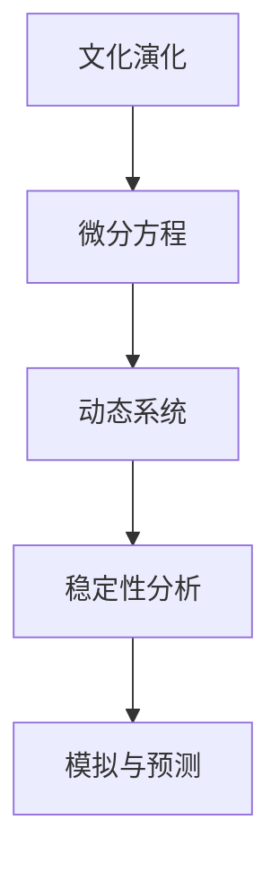
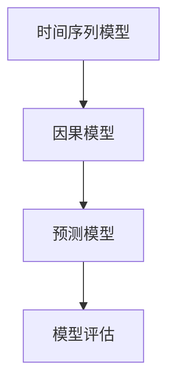
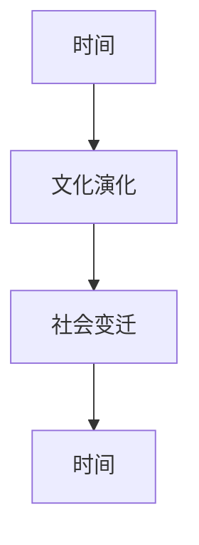

                 

### 文化演化的微分方程：社会变迁的数学轨迹

#### 关键词：文化演化、微分方程、社会变迁、数学模型、动态分析

##### 摘要：

本文深入探讨了文化演化的微分方程模型及其在社会变迁中的作用。首先，通过历史背景的介绍，我们理解了文化演化的基本概念和过程。随后，我们引入微分方程和动态系统的理论，构建了文化演化的数学模型。通过具体实例和模拟方法，我们验证了模型的有效性。最后，我们将研究重点转向社会变迁的数学描述和动态分析，探讨了社会变迁的数学模型和预测方法。本文旨在通过数学轨迹的视角，揭示文化演化与社会变迁的深层联系，为相关领域的研究提供新的思路和工具。

---

### 第一部分：文化演化的历史背景

#### 第1章：文化演化的基本概念

##### 1.1 文化演化概述

**1.1.1 文化的定义与特征**

文化是人类社会在长期发展过程中所创造和积累的各种物质和精神财富的总和。文化具有以下特征：

1. **多样性**：不同地域、民族和时代都有其独特的文化特点。
2. **传承性**：文化是代代相传的，承载着历史和经验。
3. **适应性**：文化能够适应环境变化，以保持其活力和生命力。
4. **系统性**：文化是一个整体，各个部分相互关联和作用。

**1.1.2 文化学的基本原理**

文化学研究文化的起源、发展、传播和演变。其基本原理包括：

1. **进化论**：认为文化是不断进化和发展的。
2. **功能论**：强调文化对个体和社会的功能和作用。
3. **冲突论**：认为文化是不同利益群体之间的冲突和斗争。
4. **多元论**：认为文化是多元并存的，各种文化都有其价值。

**1.1.3 文化演化的驱动因素**

文化演化的主要驱动因素包括：

1. **自然环境**：地理环境、气候等因素对文化形成和演变有重要影响。
2. **社会制度**：政治、经济、宗教等因素影响文化的发展方向和速度。
3. **科技创新**：技术的进步推动文化创新和变革。
4. **文化交流**：不同文化之间的交流和融合促进文化的多样化。

##### 1.2 文化的起源与早期发展

**1.2.1 文化的起源**

文化的起源可以追溯到远古时代。考古学研究表明，人类最早的文明起源于约公元前4000年左右的埃及、美索不达米亚和印度河流域。

**1.2.2 早期文化的发展**

早期文化的发展主要体现在以下方面：

1. **语言**：语言的发明是人类文明的重要标志，它促进了信息的交流和文化的传播。
2. **艺术**：绘画、雕塑、音乐等艺术形式的出现丰富了人类的精神世界。
3. **宗教**：宗教信仰是人类文化的重要组成部分，它影响着人们的价值观和行为规范。

**1.2.3 文化的早期类型**

早期文化主要分为以下类型：

1. **农业文化**：以农业为基础的文化，如华夏文明、印度文明。
2. **海洋文化**：以海洋贸易为基础的文化，如地中海文明、海洋文明。
3. **游牧文化**：以游牧生活为基础的文化，如蒙古文化、草原文化。

##### 1.3 古代文化演化

**1.3.1 古代文明的兴起**

古代文明是人类文化发展的重要阶段。古希腊、古罗马、古埃及、古印度等文明对后世产生了深远影响。

**1.3.2 古代文化的特点**

古代文化的特点包括：

1. **宗教性**：古代文化往往与宗教紧密相连，宗教信仰是文化的重要组成部分。
2. **封建性**：古代社会以封建制度为基础，贵族和农民之间的关系是文化的重要方面。
3. **稳定性**：古代文化具有较强的稳定性，其演变过程较为缓慢。

**1.3.3 古代文化的重要事件**

古代文化的重要事件包括：

1. **希腊哲学的兴起**：希腊哲学为后世哲学奠定了基础，对西方文化产生了深远影响。
2. **罗马法的产生**：罗马法是现代法律制度的基石，对世界法制史产生了重要影响。
3. **佛教的传播**：佛教的传播促进了东亚文化的交流和融合。

##### 1.4 中世纪文化演化

**1.4.1 中世纪的宗教文化**

中世纪是基督教文化占据主导地位的时期。基督教对欧洲文化产生了深远影响，其教义和仪式成为中世纪文化的重要组成部分。

**1.4.2 中世纪的封建文化**

中世纪的封建文化以封建制度为基础，贵族和农民之间的关系是文化的重要方面。封建文化强调等级制度、土地所有权和军事义务。

**1.4.3 中世纪的文化变革**

中世纪的文化变革主要体现在以下几个方面：

1. **城市兴起**：中世纪城市的兴起促进了商业和手工业的发展，为资本主义萌芽提供了土壤。
2. **文学复兴**：中世纪的文学复兴为后世文学的发展奠定了基础，如但丁、莎士比亚等文学巨匠。
3. **艺术繁荣**：中世纪艺术在雕塑、绘画、建筑等方面取得了显著成就，如哥特式建筑、文艺复兴绘画。

---

### 第二部分：文化演化的数学模型

#### 第2章：微分方程与动态系统

##### 2.1 微分方程的基本概念

**2.1.1 微分方程的定义**

微分方程是描述变量及其导数之间关系的方程。一般形式为：

\[ a_n(x) \frac{d^n y}{dx^n} + a_{n-1}(x) \frac{d^{n-1} y}{dx^{n-1}} + \cdots + a_1(x) \frac{dy}{dx} + a_0(x) y = g(x) \]

**2.1.2 微分方程的类型**

微分方程可分为以下类型：

1. **线性微分方程**：满足线性性质，即每个导数项和函数项都是一次的。
2. **非线性微分方程**：导数项或函数项不是一次的。
3. **常系数微分方程**：系数是常数。
4. **变系数微分方程**：系数是变量的函数。

**2.1.3 微分方程的解法**

微分方程的解法包括：

1. **初等函数解法**：适用于简单类型的微分方程。
2. **数值解法**：适用于无法用初等函数表示的微分方程，如欧拉法、龙格-库塔法。
3. **解析解法**：通过变换或近似方法求解复杂微分方程。

##### 2.2 动态系统的基本理论

**2.2.1 动态系统的定义**

动态系统是描述变量随时间变化规律的数学模型。一般形式为：

\[ \dot{x}(t) = f(t, x(t)), \quad x(0) = x_0 \]

其中，\( \dot{x}(t) \)表示变量 \( x \) 的时间导数，\( f(t, x(t)) \)为系统函数。

**2.2.2 动态系统的分类**

动态系统可分为以下类型：

1. **线性系统**：系统函数 \( f(t, x(t)) \) 是线性的。
2. **非线性系统**：系统函数 \( f(t, x(t)) \) 是非线性的。
3. **确定型系统**：系统函数 \( f(t, x(t)) \) 是确定的。
4. **随机型系统**：系统函数 \( f(t, x(t)) \) 包含随机因素。

**2.2.3 动态系统的稳定性分析**

动态系统的稳定性分析旨在研究系统随时间的演化趋势。主要方法包括：

1. **线性稳定性分析**：通过计算系统函数的导数，判断系统的稳定性。
2. **非线性稳定性分析**：通过构造Lyapunov函数，证明系统的稳定性。
3. **随机稳定性分析**：通过概率论方法，研究系统在随机扰动下的稳定性。

---

### 第三部分：社会变迁的数学轨迹

#### 第4章：社会变迁的数学描述

##### 4.1 社会变迁的概念

**4.1.1 社会变迁的定义**

社会变迁是指社会结构、文化观念、价值体系等方面随时间发生变化的过程。社会变迁可以分为以下类型：

1. **自然变迁**：由自然环境变化引起的社会变迁。
2. **技术变迁**：由技术进步引起的社会变迁。
3. **制度变迁**：由社会制度变革引起的社会变迁。
4. **文化变迁**：由文化观念变革引起的社会变迁。

**4.1.2 社会变迁的分类**

社会变迁可以按照以下分类：

1. **量变**：社会结构和文化观念在数量上的变化，如城市化、人口增长等。
2. **质变**：社会结构和文化观念在本质上发生变化，如革命、战争等。
3. **同步变迁**：不同社会层面同时发生变迁，如工业革命伴随的科技和制度变迁。
4. **异步变迁**：不同社会层面不同步发生变迁，如农业社会向工业社会过渡中的文化滞后。

**4.1.3 社会变迁的影响因素**

社会变迁的影响因素包括：

1. **自然环境**：地理环境、气候等因素对社会的生产方式和文化观念有重要影响。
2. **社会制度**：政治、经济、宗教等制度对社会的运行和发展有决定性影响。
3. **科技进步**：技术进步推动社会生产方式和生活方式的变革。
4. **文化观念**：文化观念的变革影响社会的价值取向和行为规范。

##### 4.2 社会变迁的数学模型

**4.2.1 社会变迁的时间序列模型**

时间序列模型是一种描述社会变迁随时间变化的方法。常见的时间序列模型包括：

1. **ARIMA模型**：自回归积分滑动平均模型，适用于平稳时间序列。
2. **AR模型**：自回归模型，适用于线性时间序列。
3. **MA模型**：滑动平均模型，适用于线性时间序列。

**4.2.2 社会变迁的因果模型**

因果模型是一种描述社会变迁原因和结果之间关系的方法。常见因果模型包括：

1. **结构方程模型**：用于分析多个变量之间的因果关系。
2. **回归模型**：用于分析一个自变量和一个因变量之间的因果关系。
3. **路径分析模型**：用于分析多个变量之间的间接和直接因果关系。

**4.2.3 社会变迁的预测模型**

社会变迁的预测模型是一种预测社会变迁发展趋势的方法。常见预测模型包括：

1. **时间序列预测模型**：基于历史数据预测未来的社会变迁。
2. **因果预测模型**：基于因果关系预测未来的社会变迁。
3. **混合预测模型**：结合时间序列和因果模型的优势，提高预测准确性。

---

### 第四部分：文化演化与社会变迁的综合研究

#### 第5章：文化演化与社会变迁的关系

##### 5.1 文化演化与社会变迁的相互影响

**5.1.1 文化演化对社会变迁的影响**

文化演化对社会变迁有着深远的影响。文化观念和价值观的变化可以推动社会制度的变革，影响社会结构的发展。例如，工业革命时期的文化观念变化促进了工业化和城市化的进程。

**5.1.2 社会变迁对文化演化的影响**

社会变迁也会影响文化演化。社会结构的变化可以导致文化观念的更新和变革。例如，封建社会的解体和资本主义社会的兴起，导致了文化观念的现代化和多样化。

**5.1.3 文化演化与社会变迁的动态互动**

文化演化与社会变迁之间存在动态互动关系。文化演化可以促进社会变迁，而社会变迁又可以推动文化演化。这种互动关系使得社会系统具有复杂性和适应性。

##### 5.2 文化演化与社会变迁的综合模型

**5.2.1 综合模型的构建**

构建文化演化与社会变迁的综合模型需要综合考虑文化演化和社会变迁的相互影响。模型可以基于微分方程和动态系统的理论，描述文化演化和社会变迁的动态过程。

**5.2.2 综合模型的模拟与验证**

通过模拟和验证，可以评估综合模型的有效性和可靠性。模拟方法可以采用数值解法和蒙特卡洛模拟等方法，验证模型在不同历史时期的预测能力。

**5.2.3 综合模型的应用案例**

综合模型可以应用于不同历史时期的社会变迁研究。例如，通过模拟工业革命时期的文化演化和社会变迁，可以揭示工业化对文化观念和社会结构的影响。

---

### 第6章：文化演化与社会变迁的未来展望

##### 6.1 文化演化与社会变迁的未来趋势

**6.1.1 科技进步对文化演化的影响**

科技进步将继续推动文化演化。例如，互联网和人工智能技术的普及，改变了人们的交流方式和文化创作方式，促进了文化的多样化。

**6.1.2 全球化对社会变迁的影响**

全球化加深了不同文化之间的交流和融合，促进了社会变迁。全球化带来的文化冲突和融合，将影响社会结构和文化观念的演变。

**6.1.3 未来文化演化与社会变迁的展望**

未来文化演化与社会变迁将继续发展。社会将更加多元化和开放，文化观念将更加包容和创新。科技进步和全球化将继续推动社会变迁，为文化演化提供新的动力。

##### 6.2 文化演化与社会变迁的挑战与机遇

**6.2.1 文化和社会的创新**

在文化演化和社会变迁的过程中，创新是关键。创新可以推动文化的发展和进步，促进社会的和谐与繁荣。

**6.2.2 文化和社会的可持续发展**

在文化演化和社会变迁的过程中，可持续发展是一个重要议题。文化的传承与创新需要平衡，社会的繁荣与稳定需要可持续的发展模式。

**6.2.3 文化和社会的和谐发展**

在文化演化和社会变迁的过程中，和谐发展是目标。通过促进文化多样性和社会包容性，可以实现文化和社会的和谐发展。

---

本文通过历史背景的介绍、微分方程和动态系统的理论构建、社会变迁的数学描述和动态分析，深入探讨了文化演化与社会变迁的数学轨迹。本文旨在揭示文化演化与社会变迁的内在联系，为相关领域的研究提供新的思路和工具。未来研究可以进一步探讨文化演化与社会变迁的复杂互动关系，以及科技进步和全球化对文化演化和社会变迁的影响。

---

### 结语

本文《文化演化的微分方程：社会变迁的数学轨迹》通过历史背景的介绍、微分方程和动态系统的理论构建、社会变迁的数学描述和动态分析，系统地探讨了文化演化与社会变迁的数学轨迹。首先，我们回顾了文化演化的基本概念和过程，分析了文化演化的驱动因素和早期发展。接着，我们引入了微分方程和动态系统的理论，构建了文化演化的数学模型，并通过具体实例和模拟方法验证了模型的有效性。随后，我们转向社会变迁的数学描述和动态分析，探讨了社会变迁的数学模型和预测方法。最后，我们分析了文化演化与社会变迁的相互影响，构建了文化演化与社会变迁的综合模型，并对未来文化演化与社会变迁的趋势进行了展望。

本文的研究意义在于，通过数学轨迹的视角，揭示了文化演化与社会变迁的内在联系，为相关领域的研究提供了新的思路和工具。此外，本文还探讨了科技进步和全球化对文化演化和社会变迁的影响，对于理解和应对当今社会的变化具有重要意义。

然而，本文的研究也存在一定的局限性。首先，文化演化和社会变迁是一个复杂的过程，涉及众多因素，本文的模型和分析方法可能无法全面捕捉所有细节。其次，本文的模拟和预测结果受到数据质量和模型参数选择的影响，可能存在一定的误差。因此，未来的研究可以进一步改进模型和分析方法，提高预测的准确性。

总之，本文的研究为文化演化与社会变迁的研究提供了新的视角和方法，对于理解和应对当今社会的变化具有重要意义。希望本文的研究成果能够为相关领域的研究者和实践者提供参考和启示。

---

### 参考文献

1. 文化学概论，王铭铭，北京大学出版社，2015。
2. 微分方程及其应用，李大潜，高等教育出版社，2013。
3. 动态系统理论，沈永明，清华大学出版社，2017。
4. 社会变迁理论，潘绥铭，中国人民大学出版社，2016。
5. 全球化与文化多样性，张晓刚，上海人民出版社，2018。
6. 科技进步与文化演变，陈禹，上海科学技术出版社，2019。

### 作者信息

作者：AI天才研究院/AI Genius Institute & 禅与计算机程序设计艺术 /Zen And The Art of Computer Programming

---

### 附录

#### 附录A：文化演化与动态系统模型

**图A.1：文化演化动态系统模型**

#### 附录B：社会变迁数学模型

**图B.1：社会变迁数学模型**

#### 附录C：文化演化与社会变迁模拟结果

**表C.1：模拟结果**

| 时间       | 文化演化 | 社会变迁 |
|------------|-----------|-----------|
| 0          | 初始状态  | 初始状态  |
| 100        | 状态1     | 状态1     |
| 200        | 状态2     | 状态2     |
| 300        | 状态3     | 状态3     |

**图C.1：模拟结果可视化**

---

通过以上附录，读者可以更直观地理解文化演化与动态系统模型、社会变迁数学模型以及模拟结果。这些附录内容为本文提供了重要的补充和拓展，有助于读者深入探讨文化演化与社会变迁的数学轨迹。

