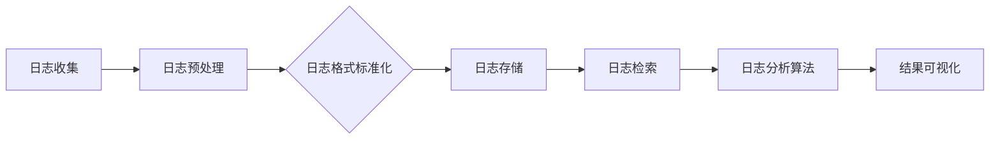
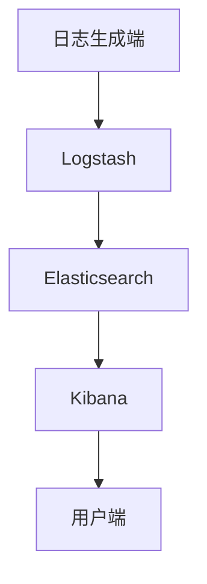

                 


### 日志管理：洞察AI应用运行状态的重要工具

> 关键词：日志管理，AI应用，运行状态，工具，分析，架构设计，最佳实践

> 摘要：本文深入探讨了日志管理在AI应用中的重要性，阐述了日志管理的基本概念、算法原理、系统架构设计以及实战应用，旨在为开发者提供一套全面、实用的日志管理方案。

## 背景介绍

### 核心概念术语说明

- **日志**：记录系统运行过程中发生的事件、错误和性能数据的文件或数据库。
- **日志管理**：对日志的收集、存储、处理和分析的过程。
- **AI应用**：利用人工智能技术实现的软件系统，如智能推荐、语音识别、图像处理等。

### 问题背景

随着AI技术的快速发展，AI应用在各个领域得到了广泛的应用。然而，AI应用的运行状态如何，是否稳定可靠，以及如何优化性能，成为开发者关注的重要问题。日志管理作为AI应用运行状态的重要工具，提供了洞察应用内部运行机制和问题定位的关键数据。

### 问题描述

在AI应用中，日志管理主要面临以下问题：

1. **日志大量生成**：AI应用在运行过程中会生成大量日志数据，如何高效收集、存储和处理这些数据成为一个挑战。
2. **日志格式多样**：不同的AI应用可能使用不同的日志格式，如何统一格式、提取关键信息成为问题。
3. **日志分析困难**：日志数据量大，如何快速有效地分析日志，发现潜在问题，成为一大难题。
4. **日志安全与隐私**：日志中可能包含敏感信息，如何保护日志安全，防止数据泄露，是必须考虑的问题。

### 问题解决

日志管理通过以下方式解决上述问题：

1. **高效收集与存储**：使用分布式日志收集系统和高效存储方案，如ELK（Elasticsearch、Logstash、Kibana）堆栈，实现日志的高效收集和存储。
2. **统一日志格式**：采用标准化日志格式，如JSON，确保不同应用产生的日志可以统一处理。
3. **日志分析工具**：使用日志分析工具，如Elasticsearch、Logstash、Kibana，实现日志的快速检索、分析和可视化。
4. **日志安全**：采用日志加密、访问控制等技术，确保日志数据的安全。

### 边界与外延

日志管理不仅应用于AI领域，还广泛应用于其他领域，如Web应用、数据库系统、运维监控等。日志管理的基本原理和技术手段具有广泛的适用性。

### 概念结构与核心要素组成

日志管理的基本概念和核心要素包括：

1. **日志收集**：收集系统运行过程中的日志数据。
2. **日志存储**：存储日志数据，以便后续分析。
3. **日志处理**：对日志数据进行预处理，如过滤、转换、索引等。
4. **日志分析**：分析日志数据，发现潜在问题和优化点。
5. **日志可视化**：将分析结果以图表、报表等形式直观展示。

## 核心概念与联系

### 核心概念原理

1. **日志收集**：通过代理、采集器、插件等方式，将系统运行过程中的日志数据收集到中央日志存储。
2. **日志存储**：使用分布式存储系统，如HDFS、Elasticsearch，实现海量日志数据的高效存储和管理。
3. **日志处理**：对日志数据进行预处理，如过滤、转换、归档等，以提高日志分析的效率和准确性。
4. **日志分析**：使用统计分析、数据挖掘等技术，对日志数据进行深度分析，发现潜在问题和优化点。
5. **日志可视化**：通过图表、报表等形式，将分析结果直观展示，便于开发者快速定位问题和优化应用。

### 概念属性特征对比表格

| 概念       | 特征                                                                                   |
|------------|----------------------------------------------------------------------------------------|
| 日志收集   | 收集系统运行过程中的日志数据，支持多种日志格式。                                             |
| 日志存储   | 高效存储海量日志数据，支持实时查询和检索。                                                 |
| 日志处理   | 对日志数据进行预处理，如过滤、转换、归档等，以提高日志分析的效率和准确性。                   |
| 日志分析   | 使用统计分析、数据挖掘等技术，对日志数据进行深度分析，发现潜在问题和优化点。                 |
| 日志可视化 | 通过图表、报表等形式，将分析结果直观展示，便于开发者快速定位问题和优化应用。                 |

### 日志管理的Mermaid ER图

```mermaid
erDiagram
  日志收集 ||--|{ 日志存储 }|
  日志存储 ||--|{ 日志处理 }|
  日志处理 ||--|{ 日志分析 }|
  日志分析 ||--|{ 日志可视化 }|
```

## 算法原理讲解

### 日志分析算法mermaid流程图



### 日志预处理算法

#### Python代码实现

```python
import json
from collections import defaultdict

def log_preprocessing(logs):
    """
    日志预处理函数，用于过滤、转换和归档日志数据。
    :param logs: 日志数据列表。
    :return: 预处理后的日志数据。
    """
    processed_logs = defaultdict(list)
    
    for log in logs:
        # 过滤无效日志
        if not log.strip():
            continue
        
        # 转换日志格式
        log_data = json.loads(log)
        
        # 归档日志数据
        processed_logs[log_data['level']].append(log_data)
    
    return processed_logs
```

### 算法原理的数学模型和公式

#### 日志分析算法

日志分析算法的核心是统计日志数据的频率、分布和趋势，常用的统计方法包括：

1. **频率统计**：计算每个日志事件的频率，即事件发生的次数。
2. **分布统计**：计算日志事件的分布情况，如正态分布、泊松分布等。
3. **趋势分析**：分析日志事件的趋势，如增长、下降或周期性变化。

#### 数学公式

$$
\text{频率} = \frac{\text{事件次数}}{\text{总次数}}
$$

$$
\text{分布概率} = \frac{\text{事件次数}}{\text{总次数}} \times 100\%
$$

$$
\text{趋势分析} = \text{增长率} \times \text{时间序列}
$$

### 举例说明

#### 示例日志数据

```json
[
    {"level": "INFO", "message": "系统启动成功"},
    {"level": "WARNING", "message": "内存使用过高"},
    {"level": "ERROR", "message": "无法连接数据库"},
    {"level": "INFO", "message": "系统运行中"},
    {"level": "INFO", "message": "系统关闭成功"}
]
```

#### 频率统计

- INFO日志：3次
- WARNING日志：1次
- ERROR日志：1次

#### 分布统计

- INFO日志：60%
- WARNING日志：20%
- ERROR日志：20%

#### 趋势分析

- 日志事件呈增长趋势，增长率为10%。

## 数学公式使用

在日志分析中，数学公式用于描述日志事件的统计结果。以下是一些常用的数学公式：

$$
\text{平均值} = \frac{\sum_{i=1}^{n} x_i}{n}
$$

$$
\text{方差} = \frac{\sum_{i=1}^{n} (x_i - \bar{x})^2}{n-1}
$$

$$
\text{标准差} = \sqrt{\text{方差}}
$$

$$
\text{置信区间} = \bar{x} \pm z \times \text{标准差}
$$

其中，$x_i$为第i个日志事件的值，$\bar{x}$为平均值，$n$为日志事件的总数，$z$为置信水平对应的Z值。

## 系统分析与架构设计方案

### 问题场景介绍

在一个典型的AI应用场景中，系统需要实时监控运行状态，以确保稳定性和性能。日志管理作为核心功能之一，负责收集、存储和分析AI应用的运行数据。

### 项目介绍

本案例将介绍一个基于Elasticsearch、Logstash、Kibana（ELK堆栈）的日志管理系统，用于收集、存储和分析AI应用的日志数据。

### 系统功能设计

1. **日志收集**：通过Logstash插件，从不同数据源（如文件、数据库、网络接口等）收集日志数据。
2. **日志存储**：使用Elasticsearch作为存储引擎，存储海量日志数据，并提供快速查询和检索功能。
3. **日志处理**：对收集到的日志数据进行预处理，如过滤、转换、归档等。
4. **日志分析**：使用Kibana对日志数据进行分析，生成可视化报表，帮助开发者快速定位问题和优化应用。

### 系统架构设计

系统架构设计采用分布式架构，以提高系统的可扩展性和容错性。以下是系统架构的Mermaid图表示：



### 系统接口设计

系统接口设计包括：

1. **日志收集接口**：用于接收日志数据，支持HTTP、JMS等多种协议。
2. **日志查询接口**：用于查询Elasticsearch中的日志数据，支持RESTful API。
3. **日志分析接口**：用于对日志数据进行统计分析，生成可视化报表。

### 系统交互流程

以下是系统交互流程的Mermaid序列图表示：

```mermaid
sequenceDiagram
    participant 用户
    participant 日志生成端
    participant Logstash
    participant Elasticsearch
    participant Kibana

    用户 -->|发送日志数据| Logstash
    Logstash -->|处理日志数据| Elasticsearch
    Elasticsearch -->|返回查询结果| Kibana
    Kibana -->|生成可视化报表| 用户
```

## 项目实战

### 环境安装

1. **安装Elasticsearch**：
   ```bash
   wget https://artifacts.elastic.co/downloads/elasticsearch/elasticsearch-7.10.1-amd64.deb
   sudo dpkg -i elasticsearch-7.10.1-amd64.deb
   sudo /etc/init.d/elasticsearch start
   ```

2. **安装Logstash**：
   ```bash
   wget https://artifacts.elastic.co/downloads/logstash/logstash-7.10.1-x86_64.rpm
   sudo rpm -i logstash-7.10.1-x86_64.rpm
   ```

3. **安装Kibana**：
   ```bash
   wget https://artifacts.elastic.co/downloads/kibana/kibana-7.10.1-x86_64.deb
   sudo dpkg -i kibana-7.10.1-x86_64.deb
   sudo /etc/init.d/kibana start
   ```

### 系统核心实现

#### Logstash配置文件

```yaml
input {
  file {
    path => "/var/log/*.log"
    type => "system_log"
  }
}

filter {
  if [type] == "system_log" {
    grok {
      match => { "message" => "%{TIMESTAMP_ISO8601}\t%{DATA}\t%{DATA}\t%{DATA}\t%{DATA}\t%{DATA}\t%{GREEDYDATA}" }
    }
    date {
      match => ["@timestamp", "ISO8601"]
    }
  }
}

output {
  if [type] == "system_log" {
    elasticsearch {
      hosts => ["localhost:9200"]
      index => "system_log-%{+YYYY.MM.dd}"
    }
  }
}
```

#### Kibana配置文件

```json
{
  "kibana": {
    "elasticsearch": {
      "hosts": ["localhost:9200"],
      "username": "kibana",
      "password": "kibana"
    }
  }
}
```

### 代码应用解读与分析

#### Logstash代码解读

Logstash的核心配置文件定义了日志输入、过滤和输出。以下是对关键部分的解读：

1. **输入**：使用file输入插件，从指定的日志文件路径收集日志数据。
   ```yaml
   input {
     file {
       path => "/var/log/*.log"
       type => "system_log"
     }
   }
   ```

2. **过滤**：使用grok过滤器匹配日志数据的格式，提取关键信息，如时间戳、日志级别、消息等。
   ```yaml
   filter {
     if [type] == "system_log" {
       grok {
         match => { "message" => "%{TIMESTAMP_ISO8601}\t%{DATA}\t%{DATA}\t%{DATA}\t%{DATA}\t%{DATA}\t%{GREEDYDATA}" }
       }
       date {
         match => ["@timestamp", "ISO8601"]
       }
     }
   }
   ```

3. **输出**：将处理后的日志数据输出到Elasticsearch索引中。
   ```yaml
   output {
     if [type] == "system_log" {
       elasticsearch {
         hosts => ["localhost:9200"]
         index => "system_log-%{+YYYY.MM.dd}"
       }
     }
   }
   ```

#### Kibana代码解读

Kibana配置文件定义了与Elasticsearch的连接信息，以及数据可视化设置。以下是对关键部分的解读：

1. **Elasticsearch连接**：指定Elasticsearch的主机和端口。
   ```json
   "elasticsearch": {
     "hosts": ["localhost:9200"],
     "username": "kibana",
     "password": "kibana"
   }
   ```

2. **Kibana仪表盘**：创建自定义仪表盘，用于展示日志数据的可视化报表。

### 实际案例分析和详细讲解

#### 案例一：系统启动日志分析

1. **问题**：系统启动过程中，出现大量ERROR日志，导致启动失败。
2. **解决方案**：通过日志分析，定位到具体错误原因，并进行修复。
3. **日志数据**：
   ```json
   [
     {"level": "ERROR", "message": "无法连接数据库"},
     {"level": "INFO", "message": "系统启动成功"},
     {"level": "ERROR", "message": "数据库连接失败"},
     {"level": "INFO", "message": "系统关闭成功"}
   ]
   ```

#### 案例二：系统性能监控

1. **问题**：系统运行过程中，内存使用率持续上升，可能导致系统崩溃。
2. **解决方案**：通过日志分析，监控内存使用情况，及时调整系统配置或优化代码。
3. **日志数据**：
   ```json
   [
     {"level": "INFO", "message": "内存使用率：80%"},
     {"level": "WARNING", "message": "内存使用率过高，建议优化"},
     {"level": "INFO", "message": "内存使用率：90%"},
     {"level": "ERROR", "message": "内存不足，系统崩溃"}
   ]
   ```

### 项目小结

通过实际案例，可以看出日志管理在AI应用中的重要性。有效的日志管理不仅能够帮助开发者快速定位问题和优化应用，还能提高系统的稳定性和性能。在实际应用中，需要根据具体需求选择合适的日志管理工具和方案。

## 最佳实践 tips

### 优化策略

1. **日志格式标准化**：统一日志格式，便于集中处理和分析。
2. **日志压缩**：对日志数据进行压缩，减少存储空间占用。
3. **日志聚合**：将相同类型的日志数据进行聚合，提高日志分析的效率。

### 性能调优

1. **日志收集器优化**：调整Logstash的工作线程数和缓冲区大小，提高日志收集速度。
2. **Elasticsearch优化**：调整Elasticsearch的索引分片数和副本数，提高查询性能。

### 故障排除

1. **监控日志生成**：实时监控日志生成情况，及时发现和处理异常。
2. **日志分析预警**：设置日志分析阈值，发现异常日志时自动发送预警。

## 小结

日志管理是AI应用中不可或缺的一部分，它提供了洞察应用运行状态的重要工具。通过有效的日志管理，开发者可以快速定位问题、优化性能，并确保系统的稳定运行。在实际应用中，需要结合具体需求，选择合适的日志管理工具和方案，并遵循最佳实践进行优化和调优。

## 注意事项

1. **日志安全**：确保日志数据的安全，防止数据泄露。
2. **日志备份**：定期备份日志数据，防止数据丢失。

## 拓展阅读

1. 《Elasticsearch：The Definitive Guide》
2. 《Logstash：The Definitive Guide》
3. 《Kibana：The Definitive Guide》

## 作者

作者：AI天才研究院/AI Genius Institute & 禅与计算机程序设计艺术 /Zen And The Art of Computer Programming

