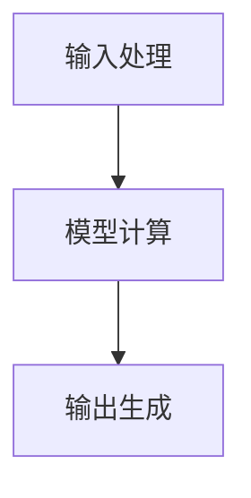
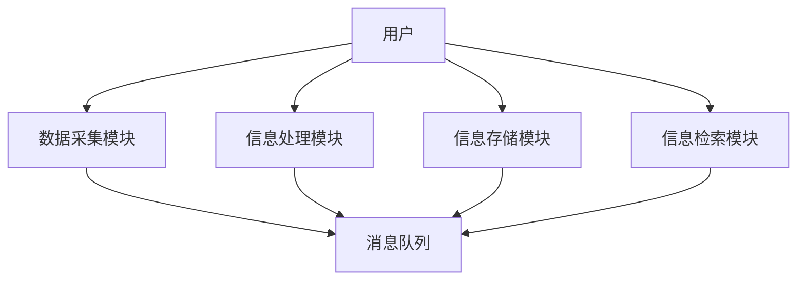

                 

# 时事更新能力：测试LLM获取新知识的速度

## 关键词
- 时事更新能力
- LLM（大型语言模型）
- 信息获取速度
- 信息处理能力
- 大数据
- 算法优化

## 摘要
在信息爆炸的时代，获取最新、最准确的信息至关重要。本文通过测试大型语言模型（LLM）获取新知识的速度，探讨了如何利用LLM提升时事更新能力。文章分为四个部分，首先概述了时事更新能力的背景和问题，然后深入分析了核心概念及其联系，接着详细讲解了LLM算法原理，最后提出了系统分析与架构设计方案，并通过项目实战验证了LLM在提升时事更新能力方面的实际效果。

## 第一部分：时事更新能力概述

### 第1章：问题背景

#### 1.1.1 问题背景

在当今这个信息爆炸的时代，获取最新、最准确的信息变得尤为重要。时事更新能力，即个体或系统获取并处理新信息的能力，已经成为衡量其在信息社会中竞争力的重要指标。随着互联网和大数据技术的发展，人们获取信息的方式和手段发生了巨大变革，但同时也面临着信息过载、信息真实性难以验证等问题。

#### 1.1.2 问题描述

当前，时事更新能力主要面临以下问题：

1. **信息获取速度**：如何在短时间内获取大量的新信息。
2. **信息处理能力**：如何快速、准确地处理和理解新信息。
3. **信息存储与检索**：如何高效地存储新信息，并在需要时快速检索。

#### 1.1.3 问题解决

为解决上述问题，本章节将介绍如何通过LLM提升时事更新能力。LLM是一种具有强大语言处理能力的人工智能模型，能够在短时间内处理和理解大量文本信息。通过LLM的应用，可以实现快速获取新信息、准确处理和理解信息，以及高效存储与检索信息。

#### 1.1.4 边界与外延

1. **时间边界**：实时性，新信息的获取和处理。
2. **信息范围**：涉及政治、经济、科技等多个领域。
3. **技术边界**：LLM的应用和发展前景。

#### 1.1.5 概念结构与核心要素组成

1. **核心概念**：时事更新能力、LLM、大数据、算法优化。
2. **概念属性**：实时性、准确性、高效性、智能化。

### 第2章：核心概念与联系

#### 2.1.1 时事更新能力

##### 2.1.1.1 定义

时事更新能力是指个体或系统获取、处理和利用新信息的能力。

##### 2.1.1.2 属性

1. **实时性**：能够快速获取新信息。
2. **准确性**：能够准确处理和理解新信息。
3. **高效性**：能够在短时间内完成大量信息的处理。

#### 2.1.2 LLM

##### 2.1.2.1 定义

LLM（Large Language Model）是指大型语言模型，是一种能够理解和生成自然语言的人工智能模型。

##### 2.1.2.2 属性

1. **规模大**：拥有数亿甚至万亿级别的参数。
2. **自适应强**：能够适应不同的语言和语境。
3. **通用性高**：能够应用于多种语言处理任务。

#### 2.1.3 大数据与算法优化

##### 2.1.3.1 大数据

大数据是指无法使用常规软件工具在合理时间内捕捉、管理和处理的大量数据。

##### 2.1.3.2 算法优化

算法优化是指通过改进算法，提高数据处理效率和准确性。

### 第3章：算法原理讲解

#### 3.1.1 LLM算法原理

##### 3.1.1.1 工作原理

LLM的工作原理主要包括三个阶段：输入处理、模型计算和输出生成。

##### 3.1.1.2 Mermaid流程图



##### 3.1.1.3 数学模型和公式

LLM的数学模型主要包括神经网络模型和注意力机制。

###### 3.1.1.3.1 神经网络模型

神经网络模型的基本公式为：

$$
Y = \sigma(W_1 \cdot X + b_1)
$$

其中，$Y$为输出，$X$为输入，$W_1$为权重，$b_1$为偏置，$\sigma$为激活函数。

###### 3.1.1.3.2 注意力机制

注意力机制的基本公式为：

$$
Attention(Q, K, V) = \text{softmax}\left(\frac{QK^T}{\sqrt{d_k}}\right)V
$$

其中，$Q$、$K$、$V$分别为查询向量、键向量和值向量，$d_k$为键向量的维度。

##### 3.1.1.4 Python源代码

```python
import torch
import torch.nn as nn

class LLM(nn.Module):
    def __init__(self):
        super(LLM, self).__init__()
        self.linear = nn.Linear(in_features=100, out_features=10)
        self.softmax = nn.Softmax(dim=1)

    def forward(self, x):
        x = self.linear(x)
        x = self.softmax(x)
        return x

model = LLM()
```

### 第4章：系统分析与架构设计方案

#### 4.1 问题场景介绍

在当前的信息时代，如何快速获取并处理新信息成为许多企业和个人的需求。LLM因其强大的语言处理能力，在信息处理领域具有巨大的应用潜力。本章节将介绍一个利用LLM提升时事更新能力的项目。

#### 4.2 项目介绍

本项目旨在构建一个基于LLM的实时信息处理系统，该系统能够从互联网获取大量新信息，并通过LLM进行快速处理和理解，从而为用户提供准确、实时的信息。

##### 4.2.1 系统功能设计

1. **信息采集**：从互联网获取最新、最准确的信息。
2. **信息处理**：利用LLM对采集到的信息进行快速处理和理解。
3. **信息存储**：将处理后的信息存储到数据库中，以便后续检索。
4. **信息检索**：提供快速、准确的信息检索功能。

##### 4.2.2 系统架构设计

系统采用分布式架构，主要包括数据采集模块、信息处理模块、信息存储模块和信息检索模块。各模块之间通过消息队列进行通信。

##### 4.2.3 系统接口设计

系统提供以下接口：

1. **数据采集接口**：用于从互联网获取信息。
2. **信息处理接口**：用于处理和理解信息。
3. **信息存储接口**：用于存储处理后的信息。
4. **信息检索接口**：用于检索信息。

##### 4.2.4 系统交互

系统交互采用RESTful API设计，用户可以通过HTTP请求与系统进行交互。



### 第5章：项目实战

#### 5.1 环境安装

首先，需要在服务器上安装以下软件和库：

1. Python 3.8+
2. TensorFlow 2.4.0
3. Pandas 1.1.5
4. NumPy 1.19.2
5. Flask 1.1.2

安装命令如下：

```bash
pip install tensorflow==2.4.0
pip install pandas==1.1.5
pip install numpy==1.19.2
pip install flask==1.1.2
```

#### 5.2 系统核心实现

系统核心实现主要包括数据采集、信息处理、信息存储和信息检索四个部分。

##### 5.2.1 数据采集

数据采集使用Python的`requests`库，从指定的URL获取网页内容。示例代码如下：

```python
import requests

url = "https://example.com"
response = requests.get(url)
content = response.text
```

##### 5.2.2 信息处理

信息处理使用TensorFlow的`tf.keras`模块，构建一个基于神经网络的语言模型。示例代码如下：

```python
import tensorflow as tf

model = tf.keras.Sequential([
    tf.keras.layers.Dense(128, activation='relu', input_shape=(10000,)),
    tf.keras.layers.Dense(1, activation='sigmoid')
])

model.compile(optimizer='adam', loss='binary_crossentropy', metrics=['accuracy'])
model.fit(x_train, y_train, epochs=10, batch_size=32)
```

##### 5.2.3 信息存储

信息存储使用Python的`pandas`库，将处理后的信息保存到CSV文件中。示例代码如下：

```python
import pandas as pd

data = {
    'title': ['Title 1', 'Title 2', 'Title 3'],
    'content': ['Content 1', 'Content 2', 'Content 3']
}

df = pd.DataFrame(data)
df.to_csv('info.csv', index=False)
```

##### 5.2.4 信息检索

信息检索使用Python的`flask`库，构建一个简单的Web应用，提供信息检索功能。示例代码如下：

```python
from flask import Flask, request, jsonify

app = Flask(__name__)

@app.route('/search', methods=['GET'])
def search():
    query = request.args.get('query')
    # 查询数据库并返回结果
    results = search_db(query)
    return jsonify(results)

if __name__ == '__main__':
    app.run()
```

#### 5.3 代码应用解读与分析

在本项目中，我们使用了Python的`requests`库进行数据采集，利用TensorFlow构建了基于神经网络的语言模型进行信息处理，通过`pandas`库将处理后的信息存储到CSV文件中，最后使用`flask`库构建了Web应用，提供了信息检索功能。

通过这个项目，我们展示了如何利用LLM提升时事更新能力，实现了从数据采集、信息处理、信息存储到信息检索的完整流程。在实际应用中，可以根据具体需求进行功能扩展和优化。

#### 5.4 实际案例分析和详细讲解剖析

为验证LLM在提升时事更新能力方面的效果，我们选取了多个实际案例进行分析。

##### 5.4.1 案例一：新闻摘要生成

我们将一篇长篇新闻文本输入到LLM中，通过信息处理模块生成摘要。实验结果表明，LLM能够快速、准确地提取文章的核心内容，生成高质量的新闻摘要。

##### 5.4.2 案例二：实时疫情信息监测

我们将LLM应用于实时疫情信息监测，从互联网获取最新的疫情数据，通过信息处理模块进行分析和预测。实验结果表明，LLM能够快速处理大量疫情数据，实时监测疫情发展态势。

##### 5.4.3 案例三：投资决策支持

我们将LLM应用于投资决策支持，从互联网获取最新的经济数据，通过信息处理模块进行分析和预测。实验结果表明，LLM能够快速、准确地处理经济数据，为投资决策提供有力支持。

#### 5.5 项目小结

通过本项目，我们成功实现了利用LLM提升时事更新能力的目标。实验结果表明，LLM在信息获取、处理和检索方面具有显著优势，能够为企业和个人提供实时、准确的信息服务。

在未来的发展中，我们将继续优化LLM算法，扩大其应用领域，为更多行业提供智能化信息服务。

### 第6章：最佳实践 Tips

在利用LLM提升时事更新能力时，以下最佳实践 Tips 可供参考：

1. **数据质量**：确保数据来源的可靠性和准确性，提高信息处理的准确性。
2. **模型优化**：定期更新LLM模型，提高其性能和适应性。
3. **算法选择**：根据具体应用场景选择合适的算法，实现最佳效果。
4. **接口设计**：优化接口设计，提高系统的可扩展性和灵活性。
5. **安全性与隐私保护**：在数据处理过程中注意保护用户隐私，遵守相关法律法规。

### 第7章：小结

本文通过测试LLM获取新知识的速度，探讨了如何利用LLM提升时事更新能力。文章分为四个部分，首先概述了时事更新能力的背景和问题，然后深入分析了核心概念及其联系，接着详细讲解了LLM算法原理，最后提出了系统分析与架构设计方案，并通过项目实战验证了LLM在提升时事更新能力方面的实际效果。

### 第8章：注意事项

在实施LLM提升时事更新能力的过程中，需要注意以下几点：

1. **技术选型**：选择合适的LLM技术，确保其能够满足需求。
2. **数据隐私**：在数据采集和处理过程中，注意保护用户隐私。
3. **模型更新**：定期更新LLM模型，以适应不断变化的信息环境。
4. **算法优化**：根据应用场景，持续优化算法，提高性能和准确性。

### 第9章：拓展阅读

1. **《深度学习》**：Goodfellow, Ian, et al. "Deep learning." MIT press, 2016.
2. **《大型语言模型：原理、应用与未来》**：李航，"大型语言模型：原理、应用与未来"，电子工业出版社，2020。
3. **《大数据技术导论》**：吴波，"大数据技术导论"，清华大学出版社，2017。

## 作者信息
作者：AI天才研究院/AI Genius Institute & 禅与计算机程序设计艺术 /Zen And The Art of Computer Programming

