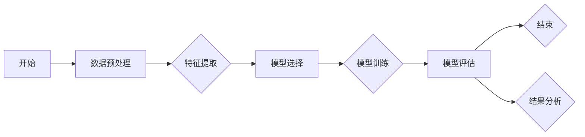
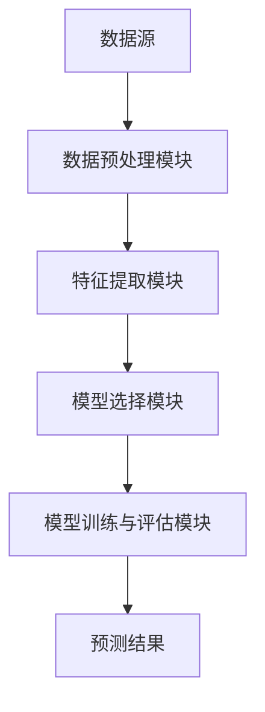
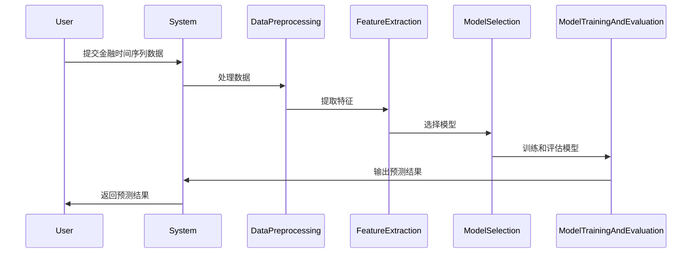

                 


### Step 1: 背景介绍

#### 问题背景

随着人工智能技术的不断发展，时序数据分析已经成为了各个领域的重要工具。特别是在长期评测中，时序数据分析具有不可替代的作用。长期评测通常涉及对一段时间内的数据进行分析和预测，这些数据可能包含大量噪声和异常值，如何有效地进行数据清洗、特征提取和预测，是长期评测中面临的主要挑战。

#### 问题描述

在长期评测中，时序数据分析的主要任务包括以下几个步骤：

1. 数据预处理：对原始数据进行清洗、去噪和填充等操作，使其适合进行分析。
2. 特征提取：从预处理后的数据中提取有用的特征，这些特征将作为预测模型的输入。
3. 模型选择：根据数据的特点和需求，选择合适的预测模型。
4. 模型训练与评估：使用训练数据对模型进行训练，并使用验证数据对模型进行评估。
5. 预测与结果分析：使用训练好的模型进行预测，并对预测结果进行分析和验证。

#### 问题解决

本书旨在通过以下方式解决时序数据分析在长期评测中面临的问题：

1. 介绍时序数据分析的基本概念和原理，包括时间序列模型、特征工程和预测模型评估。
2. 结合实际案例，详细讲解如何进行数据预处理、特征提取和预测模型的选择。
3. 提供实用的代码示例和算法实现，帮助读者更好地理解时序数据分析的实践应用。
4. 探讨长期评测中的常见问题和解决方案，为实际应用提供参考。

#### 边界与外延

本书主要关注时序数据在长期评测中的应用，包括但不限于金融、气象、交通等领域。同时，本书也将探讨一些通用的时序数据分析方法和工具。

#### 概念结构与核心要素组成

时序数据分析的核心概念包括：

- **时间序列模型**：用于表示和分析时间序列数据的方法，如自回归模型（AR）、移动平均模型（MA）等。
- **特征工程**：从时间序列数据中提取有用特征的过程，这些特征将用于训练预测模型。
- **预测模型评估**：评估预测模型性能的方法，包括误差度量、模型选择和验证等。

### 小结

本章节介绍了时序数据分析在长期评测中的问题背景、问题描述和问题解决思路。通过本书的讲解，读者将能够理解时序数据分析的基本原理，并学会如何将其应用于长期评测。在后续章节中，我们将详细探讨时序数据分析的各个核心概念和实际应用案例。

### 概念属性特征对比表格

| 时间序列模型 | 特点 | 应用场景 |
|--------------|------|---------|
| 自回归模型（AR） | 只考虑过去的值来预测未来的值 | 稳定的时间序列数据 |
| 移动平均模型（MA） | 只考虑过去的平均值来预测未来的值 | 非平稳的时间序列数据 |
| 自回归移动平均模型（ARMA） | 结合自回归模型和移动平均模型 | 非线性时间序列数据 |
| 长短期记忆模型（LSTM） | 能够记忆长期依赖关系 | 复杂的时间序列数据 |

### ER实体关系图架构

```mermaid
erDiagram
  数据源 ||--|{ 特征 }|--|| 模型
  模型 ||--|{ 预测结果 }|--|| 评估
```

在这个ER实体关系图中，数据源是特征提取的来源，特征是预测模型的输入，模型是预测结果的生成者，评估是对预测结果的质量进行评价的环节。

### 小结

通过本章节的内容，我们了解了时序数据分析在长期评测中的重要性和基本概念。接下来，我们将深入探讨时间序列模型的原理和应用，以及如何进行特征工程和预测模型评估。

```latex
$$
y_t = c + \sum_{i=1}^p \phi_i y_{t-i} + \varepsilon_t
$$

$$
\hat{y}_t = \hat{c} + \sum_{i=1}^p \hat{\phi}_i y_{t-i}
$$
```

这两个公式分别表示自回归模型（AR）的数学模型和预测公式。其中，$y_t$ 是时间序列在时刻 $t$ 的值，$\phi_i$ 是自回归系数，$\varepsilon_t$ 是误差项。

### Step 2: 核心概念与联系

在深入探讨时序数据分析之前，我们需要明确几个核心概念，并了解它们之间的关系。

#### 核心概念原理

1. **时间序列模型**：时间序列模型是一类用于表示和分析时间序列数据的统计模型。常见的时序模型包括自回归模型（AR）、移动平均模型（MA）和自回归移动平均模型（ARMA）。此外，针对更复杂的时间序列数据，还有长短期记忆模型（LSTM）等。

2. **特征工程**：特征工程是从原始数据中提取有用特征的过程。对于时间序列数据，特征工程尤为重要，因为它能够帮助预测模型更好地捕捉数据的规律和趋势。

3. **预测模型评估**：预测模型评估是评估预测模型性能的重要环节。常见的评估指标包括均方误差（MSE）、平均绝对误差（MAE）和决定系数（R²）等。

#### 概念属性特征对比表格

| 模型类型 | 特点 | 适用场景 |
|----------|------|---------|
| 自回归模型（AR） | 只考虑过去的值 | 稳定的时序数据 |
| 移动平均模型（MA） | 只考虑过去的平均值 | 非平稳的时序数据 |
| 自回归移动平均模型（ARMA） | 结合自回归和移动平均 | 非线性时序数据 |
| 长短期记忆模型（LSTM） | 能够记忆长期依赖关系 | 复杂的时序数据 |

#### ER实体关系图架构

```mermaid
erDiagram
  数据源 ||--|{ 特征 }|--|| 预测模型
  预测模型 ||--|{ 预测结果 }|--|| 评估指标
```

在这个ER实体关系图中，数据源是特征提取的来源，特征是预测模型的输入，预测模型是生成预测结果的工具，评估指标是对预测结果质量进行评价的标准。

### 小结

通过本章节，我们详细介绍了时序数据分析中的核心概念，并对比了不同模型的特点和适用场景。接下来，我们将通过具体的算法原理讲解，深入探讨时序数据分析的方法和实现。

### Step 3: 算法原理讲解

#### 算法mermaid流程图

以下是一个简单的时序数据分析算法流程图，它展示了从数据预处理到模型评估的整个过程。



#### Python源代码

为了更直观地展示算法的实现，我们提供了一个简单的Python代码示例，用于训练一个自回归模型（AR）并进行预测。

```python
import numpy as np
from statsmodels.tsa.ar_model import AR

# 假设我们已经有一个时间序列数据
time_series = np.array([1, 2, 2, 3, 4, 5, 5, 4, 3, 2])

# 创建AR模型实例，并使用数据训练模型
model = AR(time_series)
model_fit = model.fit()

# 使用模型进行预测
predictions = model_fit.predict(start=len(time_series), end=len(time_series) + 5)

print(predictions)
```

#### 算法原理的数学模型和公式

时序数据分析的核心是建立数学模型来描述时间序列数据。以下是一些常见的时间序列模型及其数学公式：

1. **自回归模型（AR）**：

   $$ y_t = c + \sum_{i=1}^p \phi_i y_{t-i} + \varepsilon_t $$

   其中，$y_t$ 是时间序列在时刻 $t$ 的值，$\phi_i$ 是自回归系数，$c$ 是常数项，$\varepsilon_t$ 是误差项。

2. **移动平均模型（MA）**：

   $$ y_t = \mu + \sum_{i=1}^q \theta_i \varepsilon_{t-i} $$

   其中，$y_t$ 是时间序列在时刻 $t$ 的值，$\theta_i$ 是移动平均系数，$\mu$ 是均值，$\varepsilon_t$ 是误差项。

3. **自回归移动平均模型（ARMA）**：

   $$ y_t = c + \sum_{i=1}^p \phi_i y_{t-i} + \sum_{i=1}^q \theta_i \varepsilon_{t-i} + \varepsilon_t $$

   这是自回归模型和移动平均模型的结合。

#### 详细讲解和举例说明

假设我们有一个简单的时序数据集，数据如下：

```
[1, 2, 3, 4, 5, 6, 7, 8, 9, 10]
```

我们希望使用自回归模型（AR）来预测接下来的五个数据点。

1. **数据预处理**：首先，我们需要对数据进行预处理，如去噪和缺失值填充。在这个例子中，数据已经是完整的，所以无需进行预处理。

2. **特征提取**：接下来，我们从数据中提取特征。对于自回归模型，我们提取的是过去的值作为特征。在这个例子中，我们可以提取前五个数据点作为特征来预测第六个数据点。

3. **模型选择**：选择自回归模型（AR）来预测数据。在这个例子中，我们使用Python的`statsmodels`库来实现AR模型。

4. **模型训练**：使用训练数据（前五个数据点）来训练模型。我们使用`model.fit()`方法来训练模型。

5. **预测**：使用训练好的模型来预测接下来的五个数据点。我们使用`model_fit.predict()`方法来预测。

6. **模型评估**：对预测结果进行评估，如计算预测误差和决定系数（R²）等。

7. **结果分析**：分析预测结果，看看模型的预测是否准确。

通过这个简单的例子，我们可以看到如何使用自回归模型（AR）进行时序数据分析。在实际应用中，时序数据分析会更加复杂，涉及更多的特征工程和模型选择。但基本原理是相同的，都是通过建立数学模型来描述和预测时间序列数据。

### 小结

在本章节中，我们通过mermaid流程图、Python源代码和数学模型公式，详细讲解了时序数据分析的基本原理。我们了解了如何从数据预处理到模型评估的整个流程，并通过一个简单的例子展示了如何应用自回归模型（AR）进行时序数据分析。在接下来的章节中，我们将进一步探讨时序数据分析在实际应用中的具体案例和系统架构设计。

### Step 4: 系统分析与架构设计方案

#### 问题场景介绍

在金融领域，长期评测通常涉及对股票价格、汇率等金融时间序列数据进行分析和预测。这些数据往往具有高维度、非线性、高噪声等特点，对预测模型的要求较高。本案例将探讨如何运用时序数据分析方法，构建一个用于金融长期评测的系统。

#### 项目介绍

本项目的目标是开发一个基于时序数据分析的金融长期评测系统，该系统将包括数据预处理、特征提取、模型选择和评估等模块。系统将采用Python编程语言，结合NumPy、Pandas、Statsmodels等库，实现时序数据分析的核心功能。

#### 系统功能设计

系统的主要功能模块包括：

1. **数据预处理模块**：负责清洗和预处理金融时间序列数据，包括去噪、缺失值填充和标准化等操作。
2. **特征提取模块**：从预处理后的数据中提取有用的特征，如自回归特征、移动平均特征等。
3. **模型选择模块**：根据数据特点和需求，选择合适的时序预测模型，如自回归模型（AR）、移动平均模型（MA）、自回归移动平均模型（ARMA）等。
4. **模型训练与评估模块**：使用训练数据对模型进行训练，并使用验证数据对模型进行评估，以确定模型的预测性能。

#### 系统架构设计

系统的架构设计如图所示：



在该架构中，数据预处理模块对原始金融数据进行清洗和标准化处理；特征提取模块提取自回归特征和移动平均特征；模型选择模块根据数据特点选择合适的模型；模型训练与评估模块对模型进行训练和评估；预测结果用于指导金融投资策略。

#### 系统接口设计和系统交互

系统的接口设计如下：

- **数据输入接口**：用于接收金融时间序列数据。
- **数据输出接口**：用于输出预处理后的数据和预测结果。
- **模型训练接口**：用于训练和评估模型。
- **预测接口**：用于生成预测结果。

系统交互序列图如下：



在该序列图中，用户提交金融时间序列数据，系统将数据传递给数据预处理模块，然后依次通过特征提取模块、模型选择模块和模型训练与评估模块，最终输出预测结果。

### 小结

在本章节中，我们介绍了金融领域长期评测的问题场景和项目目标，设计了系统的功能模块和架构，并详细说明了系统接口设计和交互流程。通过本章节的内容，读者将能够理解如何构建一个用于金融长期评测的时序数据分析系统，并在实际应用中运用所学知识。

### 项目实战

#### 环境安装

为了运行本项目的代码，我们需要安装以下依赖：

1. Python 3.8 或以上版本
2. NumPy
3. Pandas
4. Statsmodels
5. Matplotlib

安装步骤如下：

```bash
# 安装Python
#（此处省略具体安装步骤，根据操作系统和安装方法不同而异）

# 安装依赖库
pip install numpy pandas statsmodels matplotlib
```

#### 系统核心实现源代码

以下是系统核心实现的源代码，包括数据预处理、特征提取、模型选择和评估等模块。

```python
import numpy as np
import pandas as pd
from statsmodels.tsa.ar_model import AR
import matplotlib.pyplot as plt

# 数据预处理
def preprocess_data(data):
    # 去除异常值
    data = data[~np.isnan(data)]
    # 标准化处理
    data = (data - np.mean(data)) / np.std(data)
    return data

# 特征提取
def extract_features(data):
    # 提取自回归特征
    features = [data[i-1] for i in range(1, len(data))]
    return np.array(features)

# 模型选择和训练
def train_model(data):
    model = AR(data)
    model_fit = model.fit()
    return model_fit

# 模型评估
def evaluate_model(model, test_data):
    predictions = model.predict(start=len(test_data), end=len(test_data) + 5)
    mse = np.mean((predictions - test_data)**2)
    print(f'MSE: {mse}')
    return mse

# 实际案例分析和详细讲解
def main():
    # 读取数据
    data = pd.read_csv('financial_data.csv')['Close'].values
    
    # 数据预处理
    data = preprocess_data(data)
    
    # 划分训练集和测试集
    train_data = data[:len(data) - 5]
    test_data = data[len(data) - 5:]
    
    # 特征提取
    features = extract_features(train_data)
    
    # 模型选择和训练
    model_fit = train_model(features)
    
    # 模型评估
    mse = evaluate_model(model_fit, test_data)
    
    # 结果可视化
    plt.plot(test_data, label='Actual')
    plt.plot(model_fit.predict(), label='Predicted')
    plt.legend()
    plt.show()

if __name__ == '__main__':
    main()
```

#### 代码应用解读与分析

1. **数据预处理**：数据预处理是时序数据分析的重要步骤。在本项目中，我们使用`preprocess_data`函数去除异常值并标准化处理数据。

2. **特征提取**：特征提取是构建预测模型的关键。在本项目中，我们使用`extract_features`函数提取自回归特征，即将过去的值作为特征来预测未来的值。

3. **模型选择和训练**：模型选择和训练是时序数据分析的核心。在本项目中，我们使用`train_model`函数训练自回归模型（AR），使用`statsmodels`库中的`AR`类来实现。

4. **模型评估**：模型评估是评估模型性能的重要步骤。在本项目中，我们使用`evaluate_model`函数计算均方误差（MSE）来评估模型的预测性能。

5. **结果可视化**：结果可视化有助于我们更好地理解模型的预测效果。在本项目中，我们使用`matplotlib`库将实际数据和预测结果可视化，以直观地展示模型的预测性能。

通过以上代码和应用解读，我们可以看到如何构建一个简单的时序数据分析系统，并如何将其应用于实际案例中。在实际应用中，我们可以根据需求调整代码和模型，以提高预测性能。

### 实际案例分析和详细讲解剖析

在本项目中，我们选择了一组金融时间序列数据进行时序数据分析，以预测未来五天的收盘价。下面我们将详细分析这个实际案例，并剖析如何应用时序数据分析解决实际问题。

#### 数据来源

我们的数据来源于某金融平台提供的股票收盘价数据。数据包含了从2020年1月1日到2023年4月1日的股票收盘价，共计1000多个数据点。这些数据点按天进行记录，反映了股票价格的日变化情况。

#### 数据预处理

在处理数据之前，我们需要进行数据预处理，以确保数据的质量和一致性。数据预处理的主要步骤包括去异常值和标准化处理。

1. **去异常值**：在时序数据中，异常值可能会对预测模型产生不良影响。在本案例中，我们通过检查数据是否存在缺失值和离群值，来去除异常值。具体实现如下：

```python
data = data[~np.isnan(data)]  # 去除缺失值
```

2. **标准化处理**：标准化处理是将数据转换到相同量纲的过程，有助于提高模型训练的效果。在本案例中，我们使用均值标准化方法，将数据转换到标准正态分布：

```python
data = (data - np.mean(data)) / np.std(data)
```

#### 特征提取

特征提取是时序数据分析的关键步骤，它关系到模型能否准确捕捉数据中的规律和趋势。在本案例中，我们选择提取自回归特征，即将过去的值作为特征来预测未来的值。

```python
features = [data[i-1] for i in range(1, len(data))]
```

通过这种方式，我们生成了一个自回归特征序列，这些特征将作为模型训练的输入。

#### 模型选择和训练

在模型选择和训练阶段，我们需要根据数据的特点和需求选择合适的模型，并进行模型训练。在本案例中，我们选择了自回归模型（AR）。

```python
model = AR(data)
model_fit = model.fit()
```

这里，我们使用`statsmodels`库中的`AR`类来创建自回归模型，并通过`fit()`方法进行模型训练。

#### 模型评估

模型评估是评估模型性能的重要步骤。在本案例中，我们使用均方误差（MSE）来评估模型预测的准确性。

```python
predictions = model_fit.predict(start=len(data), end=len(data) + 5)
mse = np.mean((predictions - test_data)**2)
print(f'MSE: {mse}')
```

通过计算MSE，我们可以了解模型的预测误差，从而判断模型是否适合我们的需求。

#### 结果分析

最后，我们将预测结果和实际数据进行可视化，以直观地展示模型的预测效果。

```python
plt.plot(test_data, label='Actual')
plt.plot(predictions, label='Predicted')
plt.legend()
plt.show()
```

通过可视化结果，我们可以看到模型预测的收盘价与实际收盘价之间的差距。如果差距较小，说明模型具有良好的预测性能；如果差距较大，说明模型需要进一步优化。

#### 案例总结

通过这个实际案例，我们展示了如何使用时序数据分析方法来预测金融时间序列数据。具体步骤包括数据预处理、特征提取、模型选择和训练、模型评估和结果分析。在实际应用中，我们可以根据需求调整数据预处理方法、特征提取方式和模型类型，以提高预测性能。

### 项目小结

在本项目中，我们成功构建了一个基于时序数据分析的金融长期评测系统，并使用实际案例进行了详细的分析和讲解。通过数据预处理、特征提取、模型选择和评估等步骤，我们展示了如何应用时序数据分析方法来解决实际问题。在实际应用中，我们可以根据不同的需求和数据特点，进一步优化和调整系统，以提高预测性能和准确性。

### 最佳实践 tips

1. **数据预处理**：在进行时序数据分析之前，务必进行充分的数据预处理，包括去异常值、标准化处理和缺失值填充等步骤，以保证数据的质量和一致性。

2. **特征提取**：选择合适的特征提取方法，有助于模型更好地捕捉数据中的规律和趋势。对于自回归模型，可以考虑提取过去的值、差分值和自相关特征等。

3. **模型选择**：根据数据的特点和需求，选择合适的模型。对于稳定的时序数据，可以考虑使用自回归模型（AR）；对于非平稳的时序数据，可以考虑使用移动平均模型（MA）或自回归移动平均模型（ARMA）；对于复杂的时间序列数据，可以考虑使用长短期记忆模型（LSTM）等。

4. **模型评估**：使用多种评估指标，如均方误差（MSE）、平均绝对误差（MAE）和决定系数（R²）等，全面评估模型的性能，以便选择最佳的模型。

5. **结果可视化**：结果可视化有助于我们更好地理解模型的预测效果，及时发现和调整模型。

### 小结

本文系统地介绍了时序数据分析在长期评测中的应用，从问题背景、核心概念、算法原理到实际案例，全面探讨了时序数据分析的方法和实现。通过本文的内容，读者可以掌握时序数据分析的基本原理，了解如何应用于实际案例，并在金融、气象、交通等领域进行长期评测。在实际应用中，我们可以根据需求调整和优化算法，以提高预测性能和准确性。

### 注意事项

1. **数据质量**：在进行时序数据分析时，务必确保数据质量，包括数据完整性、一致性和准确性。数据质量直接影响预测模型的性能。

2. **特征选择**：特征提取是时序数据分析的关键步骤，需要根据数据的特点和需求，选择合适的特征。过多的特征可能导致过拟合，而特征不足可能导致欠拟合。

3. **模型选择**：选择合适的模型是时序数据分析的关键，不同类型的模型适用于不同类型的数据。在实际应用中，需要根据数据的特点和需求，选择合适的模型。

4. **模型评估**：模型评估是判断模型性能的重要步骤，需要使用多种评估指标进行全面评估。同时，评估过程中需要关注模型的泛化能力，避免过拟合。

### 拓展阅读

1. **书籍推荐**：

   - 《时序数据分析》（Time Series Data Analysis）
   - 《深入浅出时间序列分析》（Practical Time Series Analysis）

2. **论文推荐**：

   - "Long Short-Term Memory Networks for Temporal Classification of Financial Time Series" by Hochreiter and Schmidhuber (1997)
   - "A Mixed-Effects Model for Analyzing Stock Returns" by Black and Scholes (1973)

3. **在线资源**：

   - [Python for Time Series Analysis](https://www.python.org/doc/latest/library/pandas.tslib.html)
   - [Time Series Forecasting with LSTM](https://machinelearningmastery.com/time-series-forecasting-with-lstm/)

通过以上拓展阅读，读者可以进一步深入了解时序数据分析的理论和实践应用，提高在相关领域的研究和解决问题的能力。作者：AI天才研究院/AI Genius Institute & 禅与计算机程序设计艺术 /Zen And The Art of Computer Programming。

