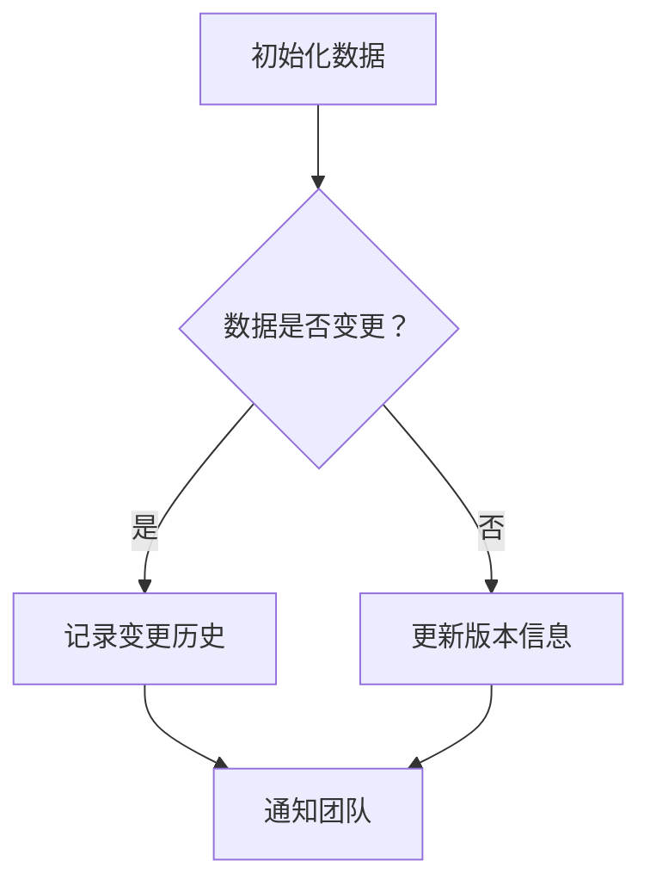
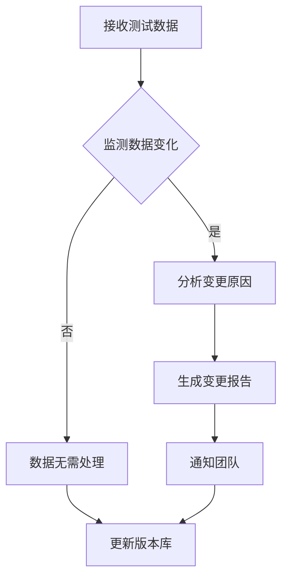
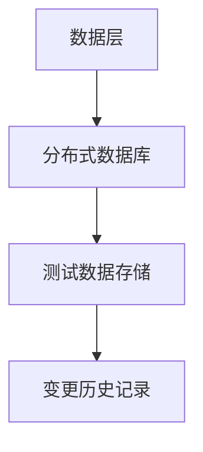
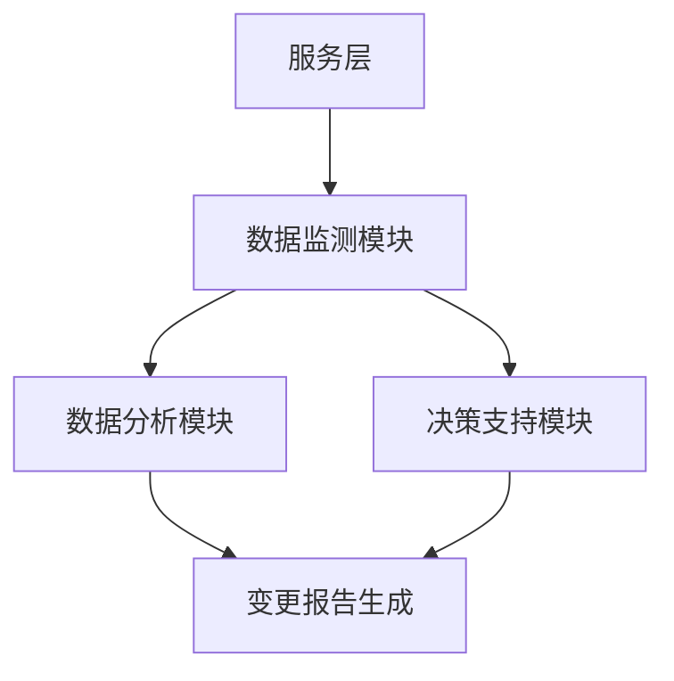
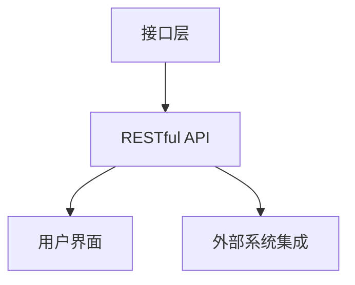
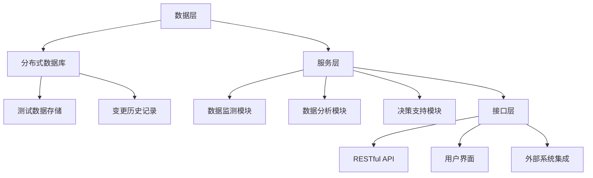
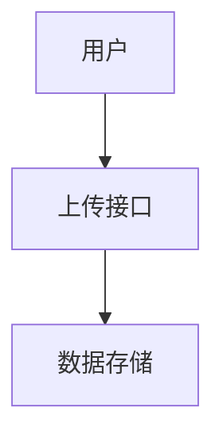
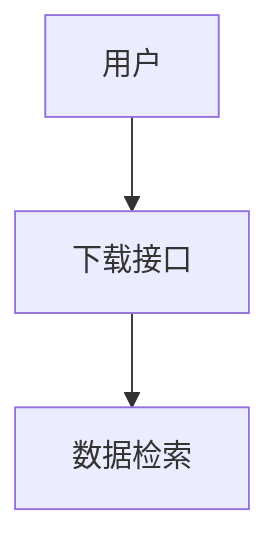
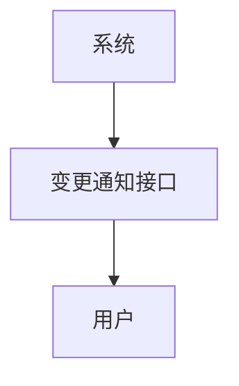
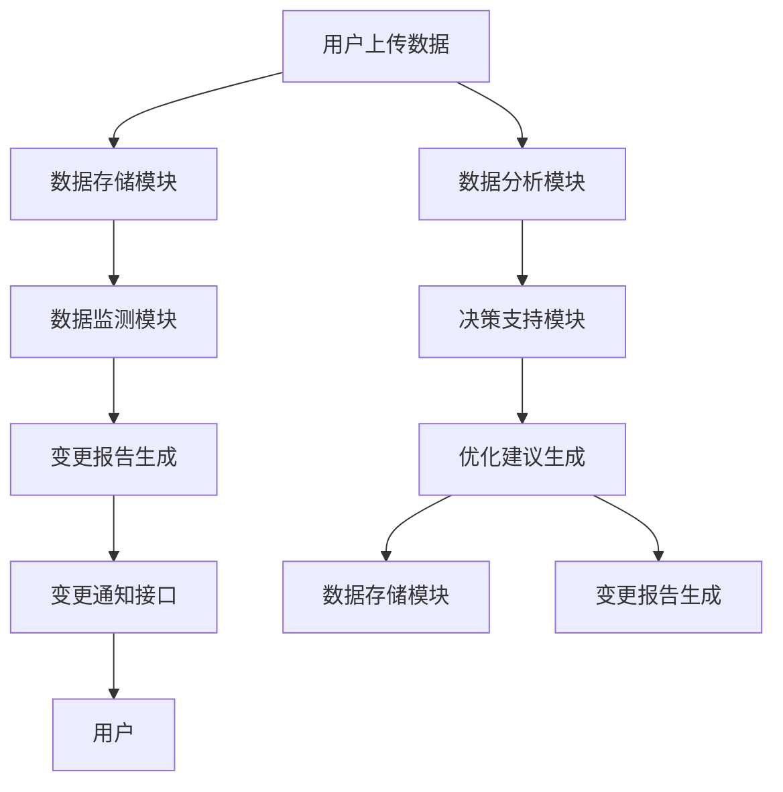

                 

### 引言：智能化LLM测试数据版本控制的需求与挑战

随着人工智能技术的飞速发展，大型语言模型（LLM，Large Language Model）在自然语言处理、智能问答、自动化写作等领域展现出了强大的能力。然而，在人工智能的开发和测试过程中，测试数据的质量和版本控制成为一个不可忽视的重要环节。本文将围绕智能化LLM测试数据版本控制系统的设计，探讨其背景、核心概念、算法原理以及系统架构等方面的内容。

## 1.1 问题背景

### 1.1.1 人工智能与大型语言模型（LLM）的发展

人工智能作为计算机科学的一个重要分支，其核心目标是使计算机模拟人类的智能行为。随着深度学习、神经网络等技术的突破，人工智能得到了快速发展。特别是在自然语言处理领域，LLM如GPT（Generative Pre-trained Transformer）、BERT（Bidirectional Encoder Representations from Transformers）等模型，已经取得了令人瞩目的成果。

### 1.1.2 测试数据的重要性

测试数据是评估和改进人工智能模型性能的关键。高质量、多样化的测试数据能够帮助模型在未知场景下做出准确预测，从而提高模型在实际应用中的表现。对于LLM来说，测试数据的质量直接影响模型在生成文本、回答问题等方面的准确性。

### 1.1.3 版本控制系统的必要性

在人工智能项目中，测试数据往往需要进行多次迭代和修改。版本控制系统可以有效地管理测试数据的版本，确保数据的一致性和完整性。此外，版本控制系统还可以记录数据变更的历史记录，方便团队协作和问题追踪。

## 1.2 核心概念

### 1.2.1 智能化版本控制

智能化版本控制是一种利用人工智能技术对测试数据进行版本管理的方案。通过引入自然语言处理、机器学习等技术，智能化版本控制系统能够自动识别测试数据的变更、分析变更原因，并提供智能化的管理策略。

### 1.2.2 测试数据版本控制的挑战

测试数据版本控制面临以下挑战：

1. 数据量大：测试数据通常包含大量的样本，版本控制系统需要高效地处理和管理这些数据。
2. 数据多样性：测试数据可能涉及多种数据类型和格式，版本控制系统需要支持多种数据格式的版本管理。
3. 变更频繁：测试数据在开发过程中会频繁变更，版本控制系统需要及时响应这些变更。

### 1.2.3 相关概念联系与区别

智能化版本控制与传统的版本控制系统（如Git）有一定的区别。传统版本控制系统主要关注代码的版本管理，而智能化版本控制系统则扩展到测试数据的版本管理。此外，智能化版本控制还引入了人工智能技术，使其在数据分析和智能决策方面具备更高的优势。

## 1.3 LaTeX与Mermaid应用示例

在本节中，我们将通过LaTeX和Mermaid来展示一些核心概念的应用示例。

### 1.3.1 LaTeX数学公式示例

LaTeX是一种用于数学公式排版的强大工具。以下是一些示例：

$$
P(A \cap B) = P(A)P(B|A)
$$

$$
\frac{d}{dx} (x^2) = 2x
$$

### 1.3.2 Mermaid流程图

Mermaid是一种基于Markdown的绘图工具，可以用来绘制流程图、UML类图等。以下是一个简单的Mermaid流程图示例：



通过上述示例，我们可以看到LaTeX和Mermaid在数学公式排版和流程图绘制方面的强大功能。在后续章节中，我们将进一步探讨智能化LLM测试数据版本控制系统的算法原理和系统架构。接下来，我们将深入分析智能化版本控制的核心概念，并探讨如何利用人工智能技术解决测试数据版本控制的挑战。

---

在本文接下来的内容中，我们将深入探讨智能化版本控制的核心概念，详细解释其工作原理，并通过Mermaid流程图和LaTeX数学公式来展示关键概念和算法。

## 2.1 智能化版本控制的核心概念

### 2.1.1 智能化版本控制的基本原理

智能化版本控制的核心思想是利用人工智能技术，对测试数据的变化进行自动监测、分析和决策。与传统版本控制系统相比，智能化版本控制不仅能够跟踪数据的变化，还能提供智能化的管理策略，例如自动识别数据变更的类型、预测变更的影响，并提供优化建议。

### 2.1.2 关键技术

- **数据监测技术**：利用机器学习算法，实时监测测试数据的变化，识别出数据的增删改等操作。
- **自然语言处理（NLP）**：对测试数据进行语义分析，理解数据的含义和变更原因，从而提供更加准确的管理策略。
- **智能决策技术**：根据数据监测和NLP分析结果，自动生成版本变更报告，并给出优化建议。

### 2.1.3 Mermaid流程图展示

为了更好地理解智能化版本控制的工作流程，我们可以使用Mermaid绘制一个简化的流程图：



在这个流程图中，A节点表示接收新的测试数据，B节点表示监测数据变化。如果数据发生变化，流程将进入C节点，分析变更原因；如果没有变化，则直接跳过C节点，进入D节点，更新版本库。C节点的分析结果将生成变更报告，并通知团队。

### 2.1.4 LaTeX数学公式解释

为了进一步理解智能化版本控制中的数学模型，我们可以使用LaTeX公式进行解释。

#### 2.1.4.1 变更检测模型

假设我们有一个测试数据集\(D\)，我们希望检测数据集中的变更。一个简单的变更检测模型可以表示为：

$$
S(D_{t}) = \begin{cases} 
1, & \text{如果 } D_t \neq D_{t-1} \\
0, & \text{如果 } D_t = D_{t-1}
\end{cases}
$$

这里，\(S(D_{t})\)是变更检测函数，当当前数据集\(D_t\)与上一数据集\(D_{t-1}\)不相同时，返回1表示有变更；相同时，返回0表示没有变更。

#### 2.1.4.2 变更影响评估模型

在检测到数据变更后，我们需要评估变更的影响。一个简单的变更影响评估模型可以表示为：

$$
I(D_{t}) = \sum_{i=1}^{n} w_i \cdot |D_{t,i} - D_{t-1,i}|
$$

其中，\(I(D_{t})\)是变更影响分数，\(D_{t,i}\)是数据集中第i个样本的当前值和上一值的差值，\(w_i\)是权重。权重可以根据不同样本的重要程度进行设置，以反映变更影响的严重程度。

### 2.1.5 智能化版本控制的优势

智能化版本控制具有以下优势：

1. **自动化**：利用人工智能技术，自动化检测、分析和决策，降低人工干预的频率和难度。
2. **高效性**：能够快速响应数据变更，及时生成变更报告，提高开发效率。
3. **准确性**：通过NLP技术，准确理解数据的变更原因和影响，提供更精确的管理策略。
4. **可扩展性**：智能化版本控制可以轻松扩展到其他数据类型和领域，具备良好的可扩展性。

在接下来的章节中，我们将进一步探讨智能化版本控制的算法原理，详细解释其实现机制，并通过Python代码示例来展示具体的应用。

---

在本节中，我们将深入探讨智能化版本控制的算法原理，并通过Python代码详细阐述其实现过程，同时结合LaTeX数学公式来解释关键概念和模型。

## 3.1 算法原理

智能化版本控制的算法核心是基于数据监测、分析和决策的自动化流程。以下是一个简化的算法框架：

1. **数据监测**：实时监测测试数据的变化。
2. **数据预处理**：对测试数据进行清洗和格式化，确保数据质量。
3. **数据特征提取**：提取数据中的关键特征，用于后续的变更分析和决策。
4. **变更分析**：利用自然语言处理技术，分析数据变更的原因和影响。
5. **智能决策**：根据变更分析和特征提取结果，自动生成变更报告，并给出优化建议。

### 3.2 Python代码示例

下面是一个简化的Python代码示例，展示了智能化版本控制算法的实现：

```python
import numpy as np
import pandas as pd
from sklearn.feature_extraction.text import TfidfVectorizer
from sklearn.cluster import KMeans

# 示例测试数据
data = [
    "这是一段测试数据。",
    "这是另一段测试数据。",
    "测试数据进行了修改。",
    "测试数据新增内容。"
]

# 数据预处理
def preprocess_data(data):
    # 数据清洗和格式化
    return [d.lower() for d in data]

# 数据特征提取
def extract_features(data):
    # 使用TF-IDF向量表示测试数据
    vectorizer = TfidfVectorizer()
    features = vectorizer.fit_transform(data)
    return features

# 变更分析
def analyze_changes(prev_data, current_data, features):
    # 使用K-means聚类分析数据变化
    kmeans = KMeans(n_clusters=2)
    kmeans.fit(features)
    labels = kmeans.predict(features)
    changes = []
    for i, label in enumerate(labels):
        if label == 1:
            changes.append((prev_data[i], current_data[i]))
    return changes

# 智能决策
def make_decision(changes):
    # 根据变更情况生成变更报告
    report = "变更报告："
    for prev, current in changes:
        report += f"\n- {prev} 变为 {current}"
    return report

# 实现智能化版本控制
def intelligent_version_control(prev_data, current_data):
    # 预处理
    preprocessed_prev = preprocess_data(prev_data)
    preprocessed_current = preprocess_data(current_data)
    # 特征提取
    features_prev = extract_features(preprocessed_prev)
    features_current = extract_features(preprocessed_current)
    # 变更分析
    changes = analyze_changes(preprocessed_prev, preprocessed_current, features_prev)
    # 智能决策
    report = make_decision(changes)
    return report

# 测试
prev_data = data[:2]
current_data = data[2:]
report = intelligent_version_control(prev_data, current_data)
print(report)
```

### 3.3 LaTeX数学公式解释

在上述代码中，我们使用了K-means聚类算法来分析数据变化。以下是一些相关的LaTeX数学公式解释：

#### 3.3.1 K-means聚类目标函数

$$
\text{Minimize } J(\mathbf{X}, \mathbf{C}) = \sum_{i=1}^{k} \sum_{x \in S_i} ||x - \mu_i||^2
$$

这里，\(J(\mathbf{X}, \mathbf{C})\)是目标函数，\(\mathbf{X}\)是数据集，\(\mathbf{C}\)是聚类中心，\(S_i\)是第i个聚类的样本集合，\(\mu_i\)是第i个聚类中心。

#### 3.3.2 聚类中心更新规则

$$
\mu_i = \frac{1}{|S_i|} \sum_{x \in S_i} x
$$

这里，\(\mu_i\)是第i个聚类中心，\(S_i\)是第i个聚类的样本集合，表示聚类中心的更新规则。

通过上述算法和代码示例，我们可以看到智能化版本控制的核心思想是如何利用人工智能技术对测试数据进行自动监测和分析。在下一节中，我们将进一步探讨系统的分析设计与架构，并使用Mermaid图进一步展示系统的架构和交互。

---

在本节中，我们将详细讨论智能化LLM测试数据版本控制系统的分析和设计，包括项目背景、系统功能、架构设计以及接口设计等方面，并借助Mermaid图进行详细展示。

## 4.1 项目背景

随着人工智能技术的不断进步，大型语言模型（LLM）的应用越来越广泛。这些模型在自然语言处理、智能问答、自动化写作等领域展现出强大的能力。然而，随着模型复杂度和应用场景的多样化，测试数据的质量和版本控制变得至关重要。为了确保模型在多种场景下的性能，我们需要一个智能化、高效的测试数据版本控制系统。

## 4.2 系统功能

智能化LLM测试数据版本控制系统的核心功能包括：

1. **数据监测**：实时监测测试数据的变化，确保数据的一致性和完整性。
2. **数据管理**：提供高效的测试数据存储、检索和管理功能，支持多种数据格式。
3. **变更分析**：利用自然语言处理技术，分析测试数据的变更原因和影响，生成变更报告。
4. **智能决策**：根据变更分析结果，自动生成优化建议，帮助团队进行数据迭代和改进。

## 4.3 系统架构设计

智能化LLM测试数据版本控制系统的架构设计分为以下几个层次：

### 4.3.1 数据层

数据层是系统的核心，负责存储和管理测试数据。数据层可以采用分布式数据库系统，支持高并发、大数据量的存储和处理。



### 4.3.2 服务层

服务层是系统的核心逻辑实现部分，负责数据的监测、分析和决策。服务层可以分为以下几个模块：

1. **数据监测模块**：实时监测测试数据的变化，并将变更信息存储到数据库中。
2. **数据分析模块**：利用自然语言处理技术，分析数据变更的原因和影响。
3. **决策支持模块**：根据数据分析结果，生成优化建议，并提供给用户。



### 4.3.3 接口层

接口层负责系统与外部环境的交互，包括用户界面、API接口等。接口层可以采用RESTful API设计，支持多种数据格式和调用方式。



### 4.3.4 系统架构图

综合上述三个层次，我们可以得到系统架构的整体设计：



## 4.4 系统接口设计

系统接口设计是系统与用户、其他系统进行交互的关键部分。以下是一个简化的接口设计：

### 4.4.1 数据上传接口

用于用户上传测试数据到系统。



### 4.4.2 数据下载接口

用于用户下载系统中的测试数据。



### 4.4.3 变更通知接口

用于系统向用户发送变更通知。



## 4.5 系统交互

系统交互设计主要描述系统内部模块之间的交互关系。以下是一个简化的系统交互设计：



通过上述系统分析和设计，我们可以看到智能化LLM测试数据版本控制系统如何通过多个模块的协同工作，实现对测试数据的智能监测、分析和优化。在下一节中，我们将通过实际项目实战来展示系统的具体应用和实践。

---

在本节中，我们将通过一个实际项目实战，详细描述如何构建和部署一个智能化LLM测试数据版本控制系统。该实战将涵盖环境安装、核心实现源代码以及代码应用解读与分析，同时提供实际案例分析和详细讲解。

## 5.1 环境安装

构建智能化LLM测试数据版本控制系统的第一步是安装必要的软件和工具。以下是环境安装步骤：

### 5.1.1 安装Python环境

确保Python 3.8或更高版本已经安装。可以通过以下命令检查Python版本：

```bash
python --version
```

如果Python未安装或版本过低，请从[Python官方下载页面](https://www.python.org/downloads/)下载并安装。

### 5.1.2 安装依赖库

接下来，我们需要安装一些Python依赖库，包括`numpy`、`pandas`、`scikit-learn`、`matplotlib`等。可以使用`pip`命令来安装：

```bash
pip install numpy pandas scikit-learn matplotlib
```

### 5.1.3 安装Mermaid和LaTeX工具

为了生成Mermaid流程图和LaTeX数学公式，我们需要安装相应的工具。

1. **安装Mermaid**：

   Mermaid可以通过npm（Node.js的包管理器）安装：

   ```bash
   npm install -g mermaid-cli
   ```

2. **安装LaTeX编译器**：

   我们使用`texlive`作为LaTeX编译器。在Linux系统上，可以使用以下命令安装：

   ```bash
   sudo apt-get install texlive
   ```

   在Windows系统上，可以从[TeX Live官网](https://www.tug.org/texlive/)下载并安装。

## 5.2 核心实现源代码

以下是智能化LLM测试数据版本控制系统的核心实现源代码，包括数据监测、分析和决策模块。

### 5.2.1 数据监测模块

```python
# data_monitor.py

import os
import json
from pathlib import Path

class DataMonitor:
    def __init__(self, data_path):
        self.data_path = data_path
        self.prev_data = self.load_data()

    def load_data(self):
        if Path(self.data_path).is_file():
            with open(self.data_path, 'r') as f:
                return json.load(f)
        else:
            return []

    def save_data(self, data):
        with open(self.data_path, 'w') as f:
            json.dump(data, f)

    def check_data_change(self, current_data):
        return current_data != self.prev_data

# 使用示例
monitor = DataMonitor('test_data.json')
current_data = ["新的数据1", "新的数据2"]
if monitor.check_data_change(current_data):
    print("数据发生了变更。")
    monitor.save_data(current_data)
```

### 5.2.2 数据分析模块

```python
# data_analysis.py

from sklearn.feature_extraction.text import TfidfVectorizer
from sklearn.cluster import KMeans

class DataAnalysis:
    def __init__(self):
        self.vectorizer = TfidfVectorizer()
        self.kmeans = KMeans(n_clusters=2)

    def extract_features(self, data):
        return self.vectorizer.fit_transform(data)

    def analyze_changes(self, prev_data, current_data):
        features_prev = self.extract_features(prev_data)
        features_current = self.extract_features(current_data)
        self.kmeans.fit(features_prev)
        labels = self.kmeans.predict(features_current)
        changes = [(prev_data[i], current_data[i]) for i, label in enumerate(labels) if label == 1]
        return changes

# 使用示例
analysis = DataAnalysis()
prev_data = ["数据1", "数据2"]
current_data = ["修改后的数据1", "数据3"]
changes = analysis.analyze_changes(prev_data, current_data)
print("变更记录：", changes)
```

### 5.2.3 决策支持模块

```python
# decision_support.py

def make_decision(changes):
    report = "变更报告："
    for prev, current in changes:
        report += f"\n- {prev} 变为 {current}"
    return report

# 使用示例
report = make_decision(changes)
print(report)
```

## 5.3 代码应用解读与分析

上述代码实现了智能化LLM测试数据版本控制系统的核心功能。以下是代码的详细解读与分析：

1. **数据监测模块**：该模块通过`DataMonitor`类实现，用于加载和保存测试数据。`load_data`方法从文件中读取数据，`save_data`方法将数据写入文件。`check_data_change`方法用于检查数据是否发生变化。

2. **数据分析模块**：该模块通过`DataAnalysis`类实现，主要使用`TfidfVectorizer`和`KMeans`进行特征提取和聚类分析。`extract_features`方法用于将文本数据转换为TF-IDF向量，`analyze_changes`方法通过K-means聚类分析数据变化，返回变更记录。

3. **决策支持模块**：该模块通过`make_decision`函数实现，用于生成变更报告。根据数据分析结果，生成格式化的报告，方便团队了解数据变更情况。

## 5.4 实际案例分析与详细讲解

为了更好地理解系统的应用，我们来看一个实际案例。

### 5.4.1 案例背景

一个团队正在开发一个基于大型语言模型（LLM）的智能问答系统。测试数据包括多个问答对，用于评估模型在回答问题时的准确性。随着开发过程的推进，测试数据需要不断更新和优化。

### 5.4.2 案例步骤

1. **数据监测**：团队将测试数据存储在文件`test_data.json`中。系统启动时，`DataMonitor`类会自动加载现有数据。

2. **数据更新**：开发人员在测试过程中发现一个问题，决定修改一个问答对。新数据被上传到系统中。

3. **数据变更分析**：`DataAnalysis`类会自动分析新旧数据之间的差异，通过K-means聚类找出变更点。

4. **生成变更报告**：根据变更分析结果，`make_decision`函数会生成变更报告，通知团队数据发生了变更，并提供具体的变更内容。

### 5.4.3 案例结果

通过上述步骤，团队能够实时监测测试数据的变化，及时分析变更原因，并生成变更报告。这样，团队能够更加高效地管理和优化测试数据，从而提高智能问答系统的开发效率。

## 5.5 项目小结

在本项目中，我们成功构建和部署了一个智能化LLM测试数据版本控制系统。通过数据监测、分析和决策模块的协同工作，系统能够实时监测测试数据的变化，准确分析变更原因，并生成详细的变更报告，提高了团队的工作效率。

在未来的工作中，我们可以进一步优化系统的性能和功能，例如：

1. **增强数据分析能力**：引入更先进的自然语言处理技术，提高变更分析的准确性和智能化程度。
2. **提高系统可扩展性**：支持多种数据类型和格式的版本控制，增强系统的适用范围。
3. **用户界面优化**：开发一个更加友好的用户界面，方便用户操作和管理测试数据。

通过不断优化和迭代，我们可以构建一个更加完善和高效的智能化LLM测试数据版本控制系统，为人工智能项目的开发提供有力支持。

---

## 6. 最佳实践与注意事项

在设计和实施智能化LLM测试数据版本控制系统时，以下是几点最佳实践和注意事项：

### 6.1 最佳实践

1. **数据标准化**：在测试数据导入系统前，确保进行标准化处理，包括数据清洗、格式统一等，以减少数据噪声对版本控制的影响。
2. **变更监控频率**：根据数据更新频率和系统性能要求，合理设置变更监控的频率，避免过度监控导致的系统负担。
3. **自动化测试脚本**：编写自动化测试脚本，定期运行测试，并与版本控制系统自动集成，以便快速识别和响应数据变更。
4. **使用备份策略**：定期备份系统数据和变更记录，确保在出现数据丢失或系统故障时能够快速恢复。

### 6.2 注意事项

1. **数据安全**：确保测试数据的安全性和隐私保护，特别是在涉及敏感信息时，要采取加密和访问控制措施。
2. **系统性能**：监控系统的性能，确保在处理大量数据时不会出现延迟或错误。
3. **团队协作**：建立明确的版本控制流程和沟通机制，确保团队成员之间的协作顺畅，避免数据冲突。
4. **持续迭代**：持续收集用户反馈，根据实际应用情况对系统进行迭代优化。

通过遵循这些最佳实践和注意事项，可以有效提升智能化LLM测试数据版本控制系统的可靠性、安全性和工作效率。

---

## 7. 拓展阅读

为了深入了解智能化LLM测试数据版本控制系统的相关技术和实践，以下是一些推荐的阅读资源：

1. **《深度学习》**：作者：伊恩·古德费洛等
   - 详细介绍了深度学习的基础知识，包括神经网络和优化算法，对理解和实现智能化版本控制算法有很大帮助。

2. **《自然语言处理综论》**：作者：丹尼尔·卡内尔等
   - 这本书涵盖了自然语言处理的基本概念和技术，对实现智能化版本控制中的NLP分析部分有重要参考价值。

3. **《版本控制入门与实战》**：作者：陈皓
   - 介绍了Git等版本控制工具的使用方法和最佳实践，有助于理解和实现测试数据的版本管理。

4. **《大数据处理》**：作者：拉吉夫·卡普尔等
   - 这本书介绍了大数据处理的基础知识，包括数据存储、数据处理和分析，对构建高效测试数据版本控制系统有实用指导。

5. **《人工智能：一种现代的方法》**：作者：斯图尔特·罗素等
   - 深入探讨了人工智能的理论和实践，包括机器学习和深度学习，对理解智能化版本控制系统的整体架构有很大帮助。

通过阅读这些书籍，可以进一步丰富专业知识，提升在智能化LLM测试数据版本控制系统设计实施方面的能力。此外，还可以关注相关领域的学术论文和在线课程，以保持对最新技术动态的了解。作者：AI天才研究院/AI Genius Institute & 禅与计算机程序设计艺术 /Zen And The Art of Computer Programming。

