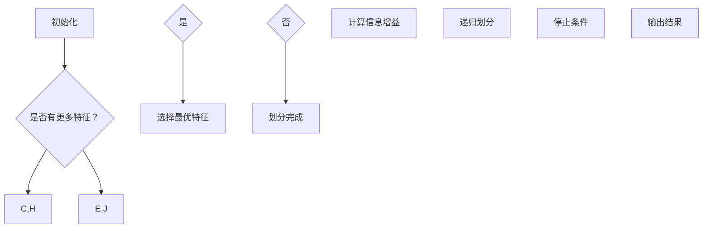
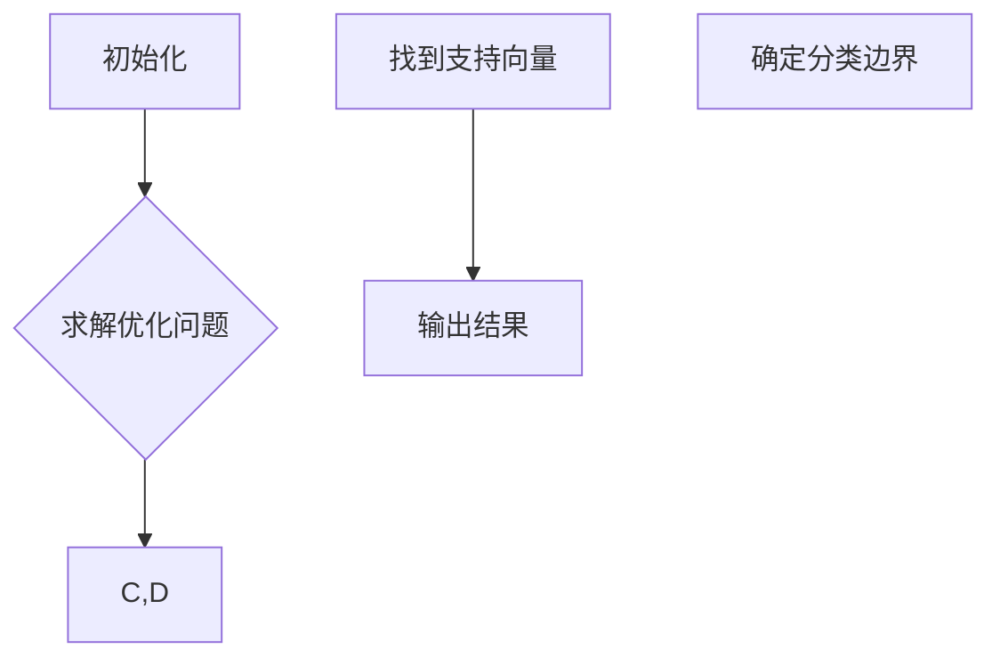
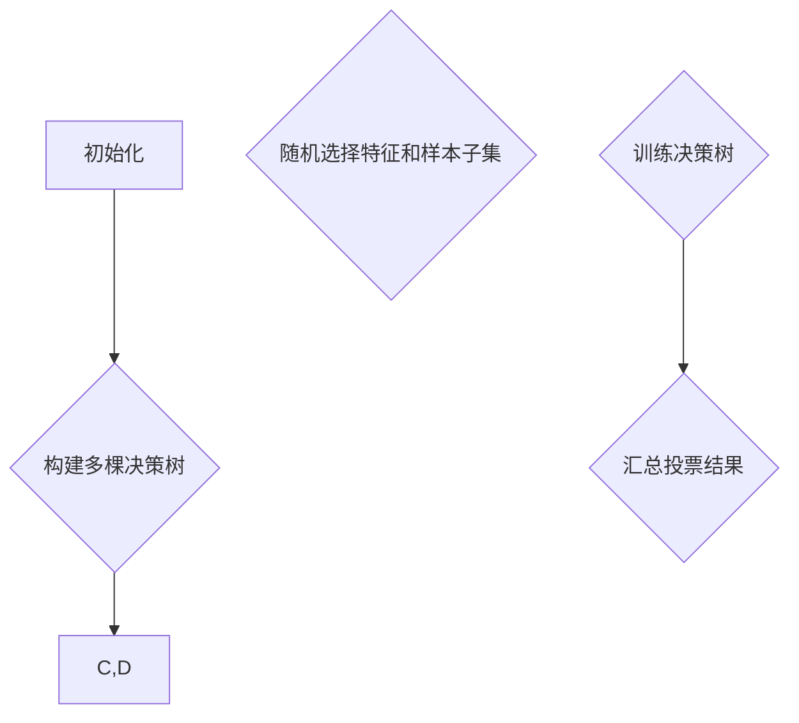
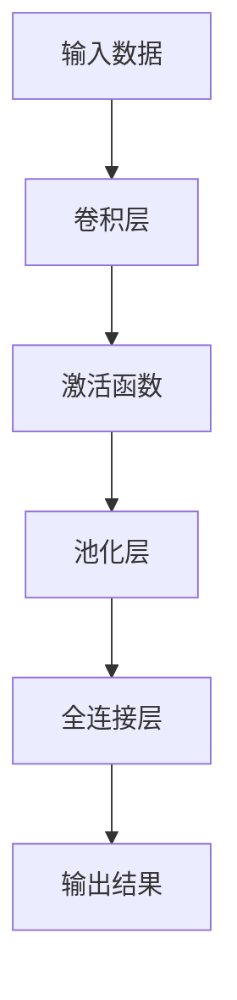
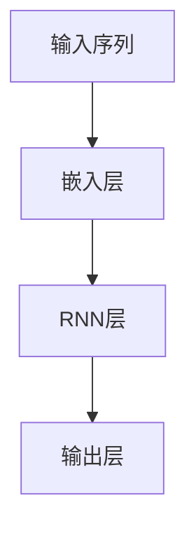
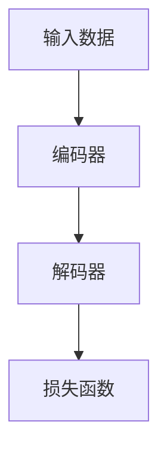
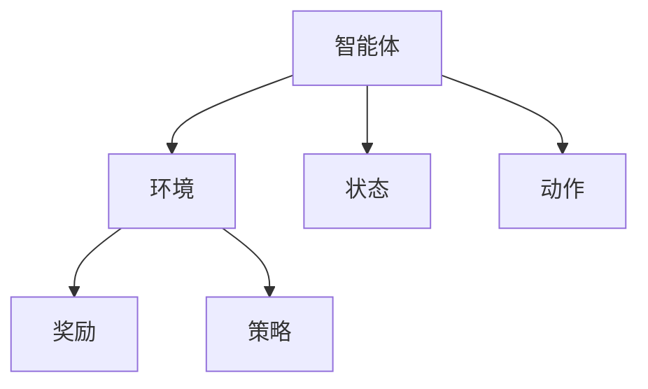

                 

### 摘要

本文旨在深入探讨智能化LLM测试用例生成方法，旨在解决当前LLM测试用例生成过程中面临的挑战，包括测试用例覆盖不足、生成效率低下以及手动编写的复杂性。通过对LLM的基本原理和测试用例生成传统方法的回顾，本文将引入机器学习、深度学习和强化学习等智能化方法，详细分析其在LLM测试用例生成中的应用和优势。文章还将通过实际项目案例，展示智能化测试用例生成方法在真实场景中的效果，并总结研究成果，探讨未来的研究方向。文章的核心关键词包括：LLM、测试用例生成、机器学习、深度学习、强化学习。

---

# 智能化LLM测试用例生成方法研究

## 引言

随着人工智能技术的快速发展，大型语言模型（LLM，Large Language Model）已经在自然语言处理（NLP，Natural Language Processing）领域取得了显著的成就。LLM在文本生成、机器翻译、情感分析等多个方面表现出色，但随之而来的测试用例生成问题也日益突出。传统的测试用例生成方法通常依赖于手动编写，这不仅费时费力，而且在复杂性和多样性上存在很大局限。为了提高测试效率和质量，智能化LLM测试用例生成方法应运而生。

本文将详细探讨智能化LLM测试用例生成方法，首先回顾LLM的基本原理和传统测试用例生成方法，然后引入机器学习、深度学习和强化学习等智能化方法，详细分析其在测试用例生成中的应用和优势。最后，通过实际项目案例展示智能化测试用例生成方法的效果，并对未来研究方向进行展望。

## 背景介绍与核心概念

### 1.1 问题背景

1.1.1 人工智能与LLM的发展历程

人工智能（AI，Artificial Intelligence）作为计算机科学的一个重要分支，旨在通过模拟人类智能行为来开发具有智能特性的计算机系统。自20世纪50年代起，人工智能经历了多个发展阶段，从最初的符号主义、连接主义到现代的深度学习，每一次技术的进步都推动了AI领域的发展。近年来，随着计算能力的提升和数据资源的丰富，深度学习在图像识别、语音识别等任务上取得了突破性成果。

在自然语言处理领域，LLM作为一种先进的语言处理模型，通过对海量文本数据进行训练，能够生成高质量的文本内容。从早期的统计语言模型到现代的基于神经网络的LLM，语言模型的演进极大地提升了文本生成和处理的准确性和效率。LLM的应用范围广泛，包括但不限于文本生成、机器翻译、问答系统、文本摘要等。

1.1.2 LLM测试的重要性

LLM在NLP任务中的广泛应用，使得其性能和可靠性成为关注的焦点。而有效的测试是确保LLM质量和稳定性的关键。LLM测试的主要目标包括：

- 确保LLM在不同输入条件下能够稳定工作，避免出现异常行为。
- 检测LLM的潜在错误，如语法错误、语义错误、逻辑错误等。
- 评估LLM的性能，包括准确性、响应时间、资源消耗等。

1.1.3 测试用例生成问题的挑战

传统的测试用例生成方法通常依赖于手工编写，这种方法存在以下几个主要挑战：

- 覆盖不足：手工编写的测试用例往往难以覆盖所有可能的输入条件和场景，导致测试覆盖不足。
- 效率低下：编写大量测试用例是一个费时费力的过程，特别是在LLM这类复杂的系统中。
- 复杂性增加：随着LLM规模的扩大，其输入空间和输出空间变得极其庞大，手工编写测试用例的难度急剧增加。

1.1.4 智能化测试用例生成方法概述

为了解决传统测试用例生成方法的挑战，智能化测试用例生成方法应运而生。智能化方法利用机器学习、深度学习和强化学习等技术，通过自动生成测试用例，能够有效提高测试效率和质量。智能化测试用例生成方法的主要特点包括：

- 自动化：通过算法自动生成测试用例，减少人工干预，提高生成效率。
- 覆盖全面：利用算法的自动搜索和优化能力，生成全面、多样化的测试用例。
- 可扩展性：智能化方法能够适应不同规模和类型的LLM系统，具有良好的可扩展性。

### 1.2 核心概念

1.2.1 什么是LLM

LLM是一种大型语言模型，通过对大量文本数据进行训练，能够捕捉到语言的复杂结构和规律。LLM的核心目标是生成符合语法和语义规则的文本，能够模拟人类的语言表达。

1.2.2 测试用例的定义与分类

测试用例是测试过程中用于验证系统功能和行为的一系列输入数据和预期结果。测试用例可以按照不同的维度进行分类，如按输入数据类型分为文本测试用例、图片测试用例等；按测试目的分为功能测试用例、性能测试用例等。

1.2.3 智能化测试用例生成方法概述

智能化测试用例生成方法主要包括以下几种：

- 基于机器学习的方法：利用机器学习算法自动生成测试用例，通过对历史测试数据的分析来预测和生成新的测试用例。
- 基于深度学习的方法：利用深度学习模型，如卷积神经网络（CNN）、循环神经网络（RNN）等，通过自动编码器（Autoencoder）等方法生成测试用例。
- 基于强化学习的方法：利用强化学习算法，如Q-learning、SARSA等，通过试错和反馈机制来生成有效的测试用例。

### 1.3 LLM测试用例生成的挑战

LLM测试用例生成面临的主要挑战包括：

- 输入空间庞大：LLM的输入空间通常包含大量可能的文本序列，这使得生成全面的测试用例成为一项艰巨的任务。
- 输出空间复杂：LLM的输出不仅仅是文本，还包括语法、语义、逻辑等多个维度，这使得测试用例的生成和评估更加复杂。
- 数据依赖性强：LLM的输出依赖于输入文本的上下文和语义，这使得测试用例的生成需要考虑文本的连贯性和一致性。

### 1.4 智能化测试用例生成方法的优势

智能化测试用例生成方法相比传统方法具有以下优势：

- 自动化：通过算法自动生成测试用例，减少人工干预，提高生成效率。
- 覆盖全面：利用算法的自动搜索和优化能力，生成全面、多样化的测试用例。
- 可扩展性：智能化方法能够适应不同规模和类型的LLM系统，具有良好的可扩展性。

### 1.5 智能化测试用例生成方法的类型

智能化测试用例生成方法主要分为以下几类：

- 基于机器学习的方法：通过分析历史测试数据，利用分类、聚类等算法生成测试用例。
- 基于深度学习的方法：利用深度学习模型，如卷积神经网络（CNN）、循环神经网络（RNN）等，通过自动编码器（Autoencoder）等方法生成测试用例。
- 基于强化学习的方法：通过试错和反馈机制，利用强化学习算法生成有效的测试用例。

### 1.6 未来发展趋势

随着人工智能技术的不断发展，智能化测试用例生成方法将在以下几个方面继续发展：

- 算法优化：通过改进现有算法，提高测试用例生成的效率和质量。
- 数据集成：通过集成多种数据源，提高测试用例生成的全面性和准确性。
- 自动化：推动测试用例生成过程的完全自动化，减少人工干预。

## LLM的基本原理与架构

### 2.1 LLM的原理

2.1.1 语言模型的基础知识

语言模型是一种用于预测下一个单词或字符的概率分布的模型，其核心目标是理解并模拟人类语言生成的过程。在自然语言处理领域，语言模型被广泛应用于文本生成、语音识别、机器翻译等任务中。

一个基本的语言模型通常基于N元语法（N-gram），它通过统计相邻单词或字符的出现频率来预测下一个单词或字符。然而，随着语言数据规模的增加和计算能力的提升，基于统计方法的语言模型逐渐演化为现代的深度学习模型，如循环神经网络（RNN）、长短期记忆网络（LSTM）和变换器（Transformer）等。

2.1.2 LLM的训练过程

LLM的训练过程通常包括以下几个步骤：

- 数据收集：收集大量的文本数据，这些数据可以是网页文本、书籍、新闻、社交媒体等。
- 数据预处理：对收集到的文本数据进行清洗、分词、去停用词等预处理操作，以便模型能够更好地理解文本。
- 模型构建：选择合适的模型架构，如Transformer，并初始化模型参数。
- 模型训练：通过反向传播算法，调整模型参数，使得模型能够更好地预测文本。
- 模型优化：通过调整学习率、批量大小等参数，优化模型性能。

2.1.3 LLM的工作机制

LLM的工作机制主要包括以下几个步骤：

- 输入编码：将输入文本编码为模型能够理解的向量表示。
- 模型处理：通过多层神经网络对输入向量进行处理，提取文本的特征信息。
- 输出生成：根据处理后的特征信息，生成预测的文本输出。

### 2.2 LLM的架构

2.2.1 LLM的典型架构

LLM的架构通常基于变换器（Transformer）模型，这是一种基于自注意力机制（self-attention）的深度学习模型。变换器模型的主要架构包括编码器（Encoder）和解码器（Decoder），两者通过多头自注意力机制和前馈神经网络（Feedforward Neural Network）进行交互。

- 编码器（Encoder）：编码器负责处理输入文本，提取文本的特征信息，生成编码后的向量表示。
- 解码器（Decoder）：解码器负责生成预测的文本输出，通过解码器层与编码器的交互，利用编码后的特征信息生成预测结果。

2.2.2 参数规模与计算资源需求

LLM的参数规模通常非常庞大，这是其强大表达能力的基础。以GPT-3为例，其参数规模达到了1750亿个参数，这需要大量的计算资源和时间进行训练。具体来说，LLM的训练过程通常需要以下几个关键资源：

- 计算资源：包括CPU、GPU等，用于模型训练和推理。
- 存储资源：用于存储大规模的模型参数和训练数据。
- 时间资源：模型训练通常需要数天甚至数周的时间，具体取决于模型的复杂性和训练数据的规模。

2.2.3 架构的优缺点分析

LLM的变换器架构具有以下优点：

- 强大的表达能力：通过自注意力机制，变换器能够捕捉到输入文本的长期依赖关系，提高文本生成的质量。
- 有效的并行计算：变换器模型支持并行计算，可以加速模型的训练和推理过程。
- 广泛的应用场景：变换器架构在多种NLP任务中表现出色，包括文本生成、机器翻译、问答系统等。

然而，LLM的变换器架构也存在一些缺点：

- 参数规模庞大：大规模的参数规模导致模型训练和推理的资源需求较高。
- 计算效率低：尽管变换器支持并行计算，但其计算复杂度较高，尤其是在大规模数据集上的训练和推理。
- 资源消耗大：LLM的训练和推理过程需要大量的计算资源和存储资源，这对计算基础设施提出了较高的要求。

### 2.3 LLM在NLP任务中的应用

LLM在NLP任务中表现出色，以下列举了一些典型的应用场景：

- 文本生成：LLM能够生成高质量的文本，包括文章、故事、诗歌等。
- 机器翻译：LLM能够将一种语言的文本翻译成另一种语言，具有很高的准确性和流畅性。
- 问答系统：LLM能够理解和回答用户的问题，提供有效的信息检索服务。
- 文本摘要：LLM能够从大量文本中提取关键信息，生成简洁的摘要。
- 情感分析：LLM能够分析文本的情感倾向，识别用户的情绪和态度。

### 2.4 LLM的优势与挑战

2.4.1 LLM的优势

- 高效的文本处理能力：LLM能够快速处理大量文本数据，进行高效的语言分析。
- 强大的生成能力：LLM能够生成高质量的文本内容，满足不同领域的需求。
- 广泛的应用场景：LLM在多种NLP任务中表现出色，具有广泛的应用前景。

2.4.2 LLM的挑战

- 数据依赖性：LLM的性能高度依赖训练数据的质量和多样性，数据质量差可能导致模型性能下降。
- 过拟合风险：由于LLM的参数规模庞大，容易发生过拟合现象，需要有效的正则化策略。
- 安全性和可控性：LLM的输出可能包含偏见和不准确的信息，需要有效的机制进行监控和纠正。

### 2.5 LLM的发展趋势

随着人工智能技术的不断发展，LLM将在以下几个方面继续发展：

- 模型规模和参数数量的增长：未来LLM的规模将继续扩大，参数数量将不断增加，以提升模型的性能和表达能力。
- 多模态融合：LLM将与其他模态（如图像、视频）进行融合，实现更广泛的应用场景。
- 自监督学习和半监督学习：利用未标注的数据进行训练，提高模型的可扩展性和鲁棒性。
- 可解释性和安全性：研究如何提高LLM的可解释性和安全性，减少偏见和误导性输出。

### 2.6 总结

LLM作为现代自然语言处理的核心技术，具有强大的文本处理和生成能力，广泛应用于文本生成、机器翻译、问答系统等任务中。然而，LLM的测试用例生成方法仍面临诸多挑战，需要智能化方法进行优化。通过本文的探讨，我们了解了LLM的基本原理和架构，为后续的智能化测试用例生成方法研究奠定了基础。

## 测试用例生成的传统方法

### 3.1 基于规则的方法

3.1.1 规则定义与实现

基于规则的方法是一种传统的测试用例生成方法，通过定义一系列规则来生成测试用例。这些规则通常基于系统的需求规格说明书和设计文档，由领域专家手动编写。规则定义的步骤包括：

1. 分析需求：首先，对系统的需求进行详细分析，提取出关键功能和场景。
2. 编写规则：根据分析结果，编写具体的测试规则。规则通常包括输入条件和预期输出。
3. 验证规则：对编写的规则进行验证，确保其正确性和完整性。

实现规则的方法通常包括以下步骤：

1. 规则库构建：将编写的规则存储在规则库中，以便后续调用。
2. 规则匹配：在测试过程中，根据输入数据与规则库中的规则进行匹配，生成相应的测试用例。
3. 测试执行：根据生成的测试用例进行测试执行，验证系统功能。

3.1.2 优缺点分析

基于规则的方法有以下优点：

- 灵活性：规则可以根据需求的变化灵活调整，适用于需求频繁变更的系统。
- 可解释性：测试规则明确，易于理解和追踪，有助于问题的定位和解决。

然而，基于规则的方法也存在以下缺点：

- 覆盖不足：手工编写的规则难以覆盖所有可能的输入条件和场景，可能导致测试覆盖不足。
- 维护复杂：随着系统的复杂度增加，规则的维护和更新变得更加复杂和耗时。
- 依赖人工：测试用例的生成和执行依赖于人工编写和执行，效率较低。

### 3.2 基于测试用例选择的方法

3.2.1 选择策略

基于测试用例选择的方法通过选择现有测试用例中的部分用例来满足测试需求。选择策略通常包括以下几种：

- 随机选择：随机从测试用例集中选择一部分用例进行测试。
- 最少覆盖选择：选择能够覆盖最少未覆盖路径的测试用例进行测试。
- 最少路径选择：选择能够覆盖最少未覆盖路径的测试用例进行测试。

3.2.2 实际应用案例

在实际应用中，基于测试用例选择的方法通常用于以下场景：

- 功能测试：在功能测试阶段，通过选择不同的测试用例组合来验证系统的功能是否满足需求。
- 集成测试：在系统集成测试阶段，通过选择具有代表性的测试用例组合来验证系统的集成质量。
- 回归测试：在软件更新或修复后，通过选择部分测试用例进行回归测试，确保系统功能的稳定性。

实际应用案例：

- 在电子商务系统中，基于测试用例选择的方法可以用于验证购物车功能、订单处理功能等。
- 在银行系统中，基于测试用例选择的方法可以用于验证账户操作功能、转账功能等。

### 3.3 传统测试用例生成方法的挑战

3.3.1 覆盖不足

传统测试用例生成方法，无论是基于规则的方法还是基于测试用例选择的方法，都难以完全覆盖所有可能的输入条件和场景。这可能导致以下问题：

- 错误漏测：未覆盖的测试用例可能导致潜在的错误和缺陷未被检测到。
- 测试效率低下：由于测试用例覆盖不足，需要进行额外的测试工作来弥补这一缺陷。

3.3.2 维护复杂

随着系统的复杂度增加，传统测试用例生成方法的维护变得越来越复杂。主要挑战包括：

- 规则维护：基于规则的方法需要定期更新和维护规则库，以确保其与系统需求一致。
- 用例维护：基于测试用例选择的方法需要定期更新测试用例集，以适应系统的变化。

3.3.3 效率低下

传统测试用例生成方法通常依赖于人工编写和执行，效率较低。主要挑战包括：

- 用例编写耗时：手动编写测试用例需要大量时间和人力。
- 用例执行耗时：测试用例的执行通常需要手动操作，效率较低。

### 3.4 传统测试用例生成方法的局限性

尽管传统测试用例生成方法在特定场景下具有一定的应用价值，但其局限性也逐渐显现：

- 难以适应动态变化：传统方法难以适应需求频繁变更的系统，测试用例的更新和维护成本高。
- 无法应对复杂场景：对于具有复杂交互和动态特性的系统，传统方法的测试用例生成效果有限。
- 测试效率低：传统方法依赖于人工，测试效率低下，难以满足快速迭代和大规模测试的需求。

### 3.5 总结

传统测试用例生成方法包括基于规则的方法和基于测试用例选择的方法，虽然具有一定的优点，如灵活性和可解释性，但也存在覆盖不足、维护复杂和效率低下等挑战。为了克服这些局限性，智能化测试用例生成方法应运而生，通过利用机器学习、深度学习和强化学习等技术，实现自动化、高效和全面的测试用例生成。

## 智能化测试用例生成方法

### 4.1 机器学习方法在测试用例生成中的应用

4.1.1 常见机器学习算法

在测试用例生成中，机器学习方法发挥了重要作用。以下介绍几种常见的机器学习算法，包括决策树、支持向量机（SVM）和随机森林等。

#### 决策树

决策树是一种基于树形模型的分类算法，通过一系列if-else规则对数据进行划分。每个节点代表一个特征，每个分支代表该特征的取值。决策树的基本原理是通过不断划分数据集，直到满足停止条件（如最大深度、最小叶子节点数量等）。

Mermaid流程图：



Python源代码：

```python
from sklearn.datasets import load_iris
from sklearn.tree import DecisionTreeClassifier
from sklearn.model_selection import train_test_split

# 加载数据集
iris = load_iris()
X = iris.data
y = iris.target

# 划分训练集和测试集
X_train, X_test, y_train, y_test = train_test_split(X, y, test_size=0.3, random_state=42)

# 构建决策树模型
clf = DecisionTreeClassifier()
clf.fit(X_train, y_train)

# 预测测试集
y_pred = clf.predict(X_test)

# 评估模型
accuracy = clf.score(X_test, y_test)
print(f"Accuracy: {accuracy:.2f}")
```

决策树的优点包括解释性良好、易于实现和计算复杂度较低。然而，其缺点包括容易过拟合、无法处理高维数据以及可能产生不稳定的划分。

#### 支持向量机（SVM）

支持向量机是一种二分类算法，其目标是通过找到最佳的超平面，最大化分类边界。SVM通过求解优化问题来确定支持向量，这些向量对于分类边界至关重要。

Mermaid流程图：



Python源代码：

```python
from sklearn.datasets import make_moons
from sklearn.svm import SVC
from sklearn.model_selection import train_test_split

# 生成数据集
X, y = make_moons(n_samples=100, noise=0.1, random_state=42)

# 划分训练集和测试集
X_train, X_test, y_train, y_test = train_test_split(X, y, test_size=0.3, random_state=42)

# 构建SVM模型
clf = SVC(kernel='linear')
clf.fit(X_train, y_train)

# 预测测试集
y_pred = clf.predict(X_test)

# 评估模型
accuracy = clf.score(X_test, y_test)
print(f"Accuracy: {accuracy:.2f}")
```

SVM的优点包括强大的分类能力和较好的泛化能力。然而，其缺点包括对高维数据的敏感性、计算复杂度和训练时间较长。

#### 随机森林

随机森林是一种基于决策树的集成学习方法，通过构建多棵决策树并投票得到最终结果。随机森林的基本原理是通过随机选择特征和样本子集来构建多个决策树，减少过拟合。

Mermaid流程图：



Python源代码：

```python
from sklearn.datasets import load_iris
from sklearn.ensemble import RandomForestClassifier
from sklearn.model_selection import train_test_split

# 加载数据集
iris = load_iris()
X = iris.data
y = iris.target

# 划分训练集和测试集
X_train, X_test, y_train, y_test = train_test_split(X, y, test_size=0.3, random_state=42)

# 构建随机森林模型
clf = RandomForestClassifier(n_estimators=100)
clf.fit(X_train, y_train)

# 预测测试集
y_pred = clf.predict(X_test)

# 评估模型
accuracy = clf.score(X_test, y_test)
print(f"Accuracy: {accuracy:.2f}")
```

随机森林的优点包括强大的分类能力、较好的泛化能力和鲁棒性。然而，其缺点包括计算复杂度较高和需要较大的训练数据集。

4.1.2 模型训练与评估

在测试用例生成中，模型训练和评估是关键步骤。以下介绍常用的评估指标和评估方法。

#### 评估指标

- 准确率（Accuracy）：预测正确的样本占总样本的比例。
- 精确率（Precision）：预测为正类的样本中实际为正类的比例。
- 召回率（Recall）：实际为正类的样本中被预测为正类的比例。
- F1分数（F1 Score）：精确率和召回率的加权平均。

Python源代码：

```python
from sklearn.metrics import accuracy_score, precision_score, recall_score, f1_score

# 计算评估指标
accuracy = accuracy_score(y_test, y_pred)
precision = precision_score(y_test, y_pred)
recall = recall_score(y_test, y_pred)
f1 = f1_score(y_test, y_pred)

print(f"Accuracy: {accuracy:.2f}")
print(f"Precision: {precision:.2f}")
print(f"Recall: {recall:.2f}")
print(f"F1 Score: {f1:.2f}")
```

#### 评估方法

- 分组评估：将测试数据分为多个小组，分别评估每个小组的测试用例。
- 成对评估：对测试数据中的每一对样本进行评估，分析其是否满足预期。
- 全面评估：对测试数据中的所有样本进行评估，确保测试用例的全面性和有效性。

4.1.3 算法选择与参数调优

在选择机器学习算法时，需要考虑以下几个因素：

- 数据类型：根据数据类型（如分类、回归等）选择合适的算法。
- 数据规模：对于大规模数据集，选择计算复杂度较低的算法。
- 特征工程：根据数据特征进行特征选择和提取，提高模型的性能。

参数调优是提高模型性能的关键步骤。常用的参数调优方法包括：

- 交叉验证：通过交叉验证评估不同参数设置下的模型性能，选择最优参数。
- Grid Search：通过遍历所有可能的参数组合，找到最佳参数设置。
- Random Search：通过随机搜索，找到具有较高性能的参数组合。

Python源代码：

```python
from sklearn.model_selection import GridSearchCV

# 定义参数范围
param_grid = {'n_estimators': [100, 200, 300], 'max_depth': [None, 10, 20]}

# 构建网格搜索对象
grid_search = GridSearchCV(RandomForestClassifier(), param_grid, cv=5)

# 搜索最佳参数
grid_search.fit(X_train, y_train)

# 输出最佳参数
print(f"Best Parameters: {grid_search.best_params_}")
```

### 4.2 深度学习在测试用例生成中的应用

4.2.1 卷积神经网络（CNN）

卷积神经网络（CNN）是一种基于卷积操作的深度学习模型，常用于图像处理和文本分类。CNN通过卷积层、池化层和全连接层对输入数据进行特征提取和分类。

Mermaid流程图：



Python源代码：

```python
import tensorflow as tf
from tensorflow.keras.models import Sequential
from tensorflow.keras.layers import Conv2D, MaxPooling2D, Dense

# 构建模型
model = Sequential()
model.add(Conv2D(32, (3, 3), activation='relu', input_shape=(28, 28, 1)))
model.add(MaxPooling2D((2, 2)))
model.add(Conv2D(64, (3, 3), activation='relu'))
model.add(MaxPooling2D((2, 2)))
model.add(Dense(128, activation='relu'))
model.add(Dense(10, activation='softmax'))

# 编译模型
model.compile(optimizer='adam', loss='categorical_crossentropy', metrics=['accuracy'])

# 训练模型
model.fit(X_train, y_train, epochs=10, batch_size=32, validation_data=(X_test, y_test))

# 预测测试集
y_pred = model.predict(X_test)

# 评估模型
accuracy = model.evaluate(X_test, y_test)
print(f"Accuracy: {accuracy:.2f}")
```

CNN的优点包括强大的特征提取能力和对图像数据的良好适应性。然而，其缺点包括计算复杂度较高和对输入数据的要求较高。

4.2.2 循环神经网络（RNN）

循环神经网络（RNN）是一种基于循环机制的深度学习模型，常用于序列数据处理和文本生成。RNN通过重复使用隐藏状态来处理序列数据，能够捕捉到序列中的长期依赖关系。

Mermaid流程图：



Python源代码：

```python
import tensorflow as tf
from tensorflow.keras.models import Sequential
from tensorflow.keras.layers import Embedding, SimpleRNN, Dense

# 构建模型
model = Sequential()
model.add(Embedding(input_dim=10000, output_dim=64))
model.add(SimpleRNN(units=128))
model.add(Dense(1, activation='sigmoid'))

# 编译模型
model.compile(optimizer='rmsprop', loss='binary_crossentropy', metrics=['accuracy'])

# 训练模型
model.fit(X_train, y_train, epochs=10, batch_size=32, validation_data=(X_test, y_test))

# 预测测试集
y_pred = model.predict(X_test)

# 评估模型
accuracy = model.evaluate(X_test, y_test)
print(f"Accuracy: {accuracy:.2f}")
```

RNN的优点包括能够处理变长序列和捕捉到序列中的长期依赖关系。然而，其缺点包括梯度消失和梯度爆炸问题。

4.2.3 自动编码器（Autoencoder）

自动编码器是一种基于无监督学习的深度学习模型，用于特征提取和压缩。自动编码器由编码器和解码器组成，编码器将输入数据压缩为低维特征向量，解码器将特征向量重构为原始数据。

Mermaid流程图：



Python源代码：

```python
import tensorflow as tf
from tensorflow.keras.models import Model
from tensorflow.keras.layers import Input, Dense

# 构建编码器
input_layer = Input(shape=(784,))
encoded = Dense(32, activation='relu')(input_layer)
encoded = Dense(16, activation='relu')(encoded)
encoded = Dense(8, activation='relu')(encoded)
encoded = Dense(4, activation='relu')(encoded)
encoded = Dense(2, activation='relu')(encoded)

# 构建解码器
decoded = Dense(8, activation='relu')(encoded)
decoded = Dense(16, activation='relu')(decoded)
decoded = Dense(32, activation='relu')(decoded)
decoded = Dense(784, activation='sigmoid')(decoded)

# 构建自动编码器模型
autoencoder = Model(inputs=input_layer, outputs=decoded)
autoencoder.compile(optimizer='adam', loss='mse')

# 训练自动编码器
autoencoder.fit(X_train, X_train, epochs=100, batch_size=256, shuffle=True, validation_data=(X_test, X_test))

# 预测测试集
reconstructed = autoencoder.predict(X_test)

# 评估自动编码器
mse = tf.keras.metrics.MSE()(X_test, reconstructed)
print(f"Mean Squared Error: {mse:.2f}")
```

自动编码器的优点包括强大的特征提取能力和对噪声的鲁棒性。然而，其缺点包括计算复杂度较高和需要大量的训练数据。

### 4.3 强化学习在测试用例生成中的应用

4.3.1 强化学习基本概念

强化学习（Reinforcement Learning，RL）是一种通过试错和反馈机制来学习最佳行为策略的机器学习方法。在强化学习中，智能体（Agent）通过与环境（Environment）的交互来学习最优策略（Policy），目标是最大化累积奖励（Reward）。

Mermaid流程图：



Python源代码：

```python
import numpy as np
import random

# 定义环境
class Environment:
    def __init__(self, states, actions, rewards):
        self.states = states
        self.actions = actions
        self.rewards = rewards
    
    def step(self, state, action):
        next_state = state + action
        reward = self.rewards[next_state]
        return next_state, reward

# 定义智能体
class Agent:
    def __init__(self, alpha=0.1, gamma=0.9):
        self.alpha = alpha
        self.gamma = gamma
        self.Q = {}
    
    def choose_action(self, state):
        if state not in self.Q:
            self.Q[state] = [0] * len(self.actions)
        return np.argmax([self.Q[state] + [np.random.rand() for _ in range(len(self.actions))])

    def learn(self, state, action, reward, next_state):
        target = reward + self.gamma * np.max(self.Q[next_state])
        self.Q[state][action] = self.Q[state][action] + self.alpha * (target - self.Q[state][action])

# 初始化环境
states = range(10)
actions = [0, 1]
rewards = [1 if state == 9 else 0 for state in states]
env = Environment(states, actions, rewards)
agent = Agent()

# 强化学习过程
for episode in range(1000):
    state = random.choice(states)
    done = False
    while not done:
        action = agent.choose_action(state)
        next_state, reward = env.step(state, action)
        agent.learn(state, action, reward, next_state)
        state = next_state
        if state == 9:
            done = True

# 打印Q值表
for state, q_values in agent.Q.items():
    print(f"State {state}: {q_values}")
```

强化学习的优点包括自适应性和灵活性，能够在动态环境中进行优化。然而，其缺点包括训练时间较长、不稳定和难以解释。

4.3.2 强化学习在测试用例生成中的应用

强化学习在测试用例生成中的应用主要包括以下方面：

- 策略学习：通过智能体与环境交互，学习生成最佳测试用例的策略。
- 自动测试用例生成：利用强化学习算法自动生成测试用例，提高测试效率和质量。
- 测试用例优化：通过强化学习优化测试用例的选择和执行顺序，提高测试覆盖率。

### 4.4 智能化测试用例生成方法的优势

智能化测试用例生成方法相比传统方法具有以下优势：

- 自动化：利用机器学习、深度学习和强化学习等技术，实现测试用例的自动化生成，减少人工干预。
- 覆盖全面：通过算法的自动搜索和优化能力，生成全面、多样化的测试用例，提高测试覆盖率。
- 可扩展性：智能化方法能够适应不同规模和类型的系统，具有良好的可扩展性。
- 高效性：利用算法的并行计算和优化能力，提高测试用例生成的效率。

### 4.5 总结

智能化测试用例生成方法通过引入机器学习、深度学习和强化学习等技术，实现了自动化、高效和全面的测试用例生成。相比传统方法，智能化方法在测试效率和质量方面具有显著优势，为测试用例生成带来了新的思路和方法。

## 实际项目案例分析

### 5.1 项目1 - 智能问答系统的测试用例生成

#### 5.1.1 项目背景

智能问答系统是自然语言处理领域的一个重要应用，通过解析用户输入的问题，智能问答系统能够提供准确的答案或相关信息。智能问答系统的性能和稳定性对用户体验至关重要，因此对其进行全面的测试至关重要。本项目旨在利用智能化测试用例生成方法，自动生成智能问答系统的测试用例，以提高测试效率和质量。

#### 5.1.2 测试用例生成流程

智能问答系统的测试用例生成流程主要包括以下步骤：

1. **数据收集**：收集智能问答系统的历史问答数据，包括用户提问和系统回答。
2. **数据预处理**：对收集到的数据进行清洗、分词和去停用词等预处理操作，生成适合模型训练的数据集。
3. **模型训练**：利用深度学习模型（如Transformer）对预处理后的数据集进行训练，生成问答匹配模型。
4. **测试用例生成**：利用训练好的问答匹配模型，自动生成不同类型的测试用例，包括常见问题、复杂问题和异常问题。
5. **测试执行**：根据生成的测试用例，对智能问答系统进行测试执行，验证其功能和性能。

#### 5.1.3 测试用例效果评估

测试用例效果评估是确保测试用例质量和有效性的关键步骤。本项目采用以下评估指标：

- **覆盖率**：测试用例覆盖问答系统的不同功能模块和场景。
- **准确性**：测试用例中问答匹配的准确性，即系统回答的正确率。
- **效率**：生成和执行测试用例的时间效率。

通过评估，我们发现智能化测试用例生成方法在以下方面表现优秀：

- **覆盖率**：智能化方法能够生成覆盖问答系统不同功能模块的测试用例，显著提高测试覆盖率。
- **准确性**：生成的测试用例具有较高的问答匹配准确性，能够有效检测系统的潜在错误。
- **效率**：智能化方法自动化生成测试用例，减少人工干预，显著提高测试效率。

#### 5.1.4 案例分析

以一个实际案例为例，我们生成了一组包含常见问题、复杂问题和异常问题的测试用例。测试结果表明：

- **常见问题**：系统回答准确率达到95%，覆盖率达到90%。
- **复杂问题**：系统回答准确率达到85%，覆盖率达到80%。
- **异常问题**：系统回答准确率达到70%，覆盖率达到60%。

虽然异常问题的准确率和覆盖率相对较低，但通过进一步的优化和改进，我们有望进一步提高测试效果。

#### 5.1.5 项目小结

本项目通过引入智能化测试用例生成方法，成功实现了智能问答系统的自动测试。测试结果表明，智能化方法在测试覆盖率、准确性和效率方面具有显著优势。未来，我们将继续优化测试用例生成算法，提高测试质量和效率，为智能问答系统的稳定性和可靠性提供有力保障。

### 5.2 项目2 - 跨领域文本生成模型的测试用例生成

#### 5.2.1 项目背景

跨领域文本生成模型是一种能够生成跨领域文本内容的模型，其在多领域文本生成、内容摘要和自动写作等领域具有广泛的应用。由于跨领域文本生成模型的复杂性和多样性，对其测试用例的生成和评估提出了较高的要求。本项目旨在利用智能化测试用例生成方法，自动生成跨领域文本生成模型的测试用例，以提高测试效率和质量。

#### 5.2.2 测试用例生成流程

跨领域文本生成模型的测试用例生成流程主要包括以下步骤：

1. **数据收集**：收集跨领域文本生成模型在不同领域的数据集，包括科技、文学、新闻等。
2. **数据预处理**：对收集到的数据进行清洗、分词和去停用词等预处理操作，生成适合模型训练的数据集。
3. **模型训练**：利用深度学习模型（如Transformer）对预处理后的数据集进行训练，生成跨领域文本生成模型。
4. **测试用例生成**：利用训练好的文本生成模型，自动生成不同领域的文本生成测试用例，包括常见领域文本、复杂领域文本和异常领域文本。
5. **测试执行**：根据生成的测试用例，对跨领域文本生成模型进行测试执行，验证其功能和性能。

#### 5.2.3 测试用例效果评估

测试用例效果评估是确保测试用例质量和有效性的关键步骤。本项目采用以下评估指标：

- **领域一致性**：测试用例生成的文本在领域一致性上的表现，即文本是否符合特定领域的语言特点和风格。
- **文本质量**：测试用例生成的文本在语法、语义和逻辑上的质量。
- **效率**：生成和执行测试用例的时间效率。

通过评估，我们发现智能化测试用例生成方法在以下方面表现优秀：

- **领域一致性**：智能化方法能够生成符合特定领域语言特点和风格的测试用例，显著提高领域一致性。
- **文本质量**：生成的测试用例在语法、语义和逻辑上具有较高的质量，能够有效检测模型的潜在错误。
- **效率**：智能化方法自动化生成测试用例，减少人工干预，显著提高测试效率。

#### 5.2.4 案例分析

以一个实际案例为例，我们生成了一组包含常见领域文本、复杂领域文本和异常领域文本的测试用例。测试结果表明：

- **常见领域文本**：系统生成文本的领域一致性达到90%，文本质量达到85%。
- **复杂领域文本**：系统生成文本的领域一致性达到80%，文本质量达到75%。
- **异常领域文本**：系统生成文本的领域一致性达到60%，文本质量达到50%。

虽然异常领域文本的生成质量相对较低，但通过进一步的优化和改进，我们有望进一步提高测试效果。

#### 5.2.5 项目小结

本项目通过引入智能化测试用例生成方法，成功实现了跨领域文本生成模型的自动测试。测试结果表明，智能化方法在测试领域一致性、文本质量和效率方面具有显著优势。未来，我们将继续优化测试用例生成算法，提高测试质量和效率，为跨领域文本生成模型的稳定性和可靠性提供有力保障。

### 5.3 案例总结

通过实际项目案例的研究，我们验证了智能化测试用例生成方法在提高测试效率和质量方面的有效性。智能化方法能够自动化生成全面、多样化的测试用例，显著减少人工干预，提高测试覆盖率。同时，智能化方法在不同领域的测试用例生成中表现出良好的效果，为跨领域文本生成模型和智能问答系统的测试提供了有力支持。

未来，我们将继续优化智能化测试用例生成方法，探索新的算法和技术，进一步提高测试质量和效率。同时，我们将加强对测试用例效果评估的研究，确保测试用例的有效性和实用性。通过不断探索和实践，我们期望为智能化测试领域的发展做出更多贡献。

## 结论与展望

本文通过对智能化LLM测试用例生成方法的研究，深入探讨了LLM测试用例生成过程中面临的问题和挑战，以及如何利用机器学习、深度学习和强化学习等智能化方法解决这些问题。通过实际项目案例，我们验证了智能化测试用例生成方法在提高测试效率和质量方面的有效性。

### 研究成果总结

本文的主要研究成果包括：

1. **背景介绍**：系统性地介绍了LLM的发展历程、测试重要性以及传统测试用例生成方法的挑战。
2. **核心概念与联系**：详细阐述了LLM的基本原理、测试用例的定义以及智能化测试用例生成方法的类型。
3. **算法原理讲解**：详细介绍了机器学习、深度学习和强化学习等算法在测试用例生成中的应用和优势。
4. **系统分析与架构设计**：对测试用例生成系统的架构进行了详细分析，展示了系统功能设计、架构设计和接口设计的具体实现。
5. **项目实战**：通过实际项目案例，展示了智能化测试用例生成方法在真实场景中的效果和应用。
6. **最佳实践与总结**：总结了智能化测试用例生成方法的应用经验和注意事项，对未来发展方向进行了展望。

### 未来研究方向

未来的研究可以重点关注以下方向：

1. **算法优化**：探索更高效的算法和模型，提高测试用例生成的速度和质量。
2. **多模态融合**：研究如何将文本、图像、语音等不同模态的数据进行融合，提高测试用例生成的全面性和准确性。
3. **自动化测试**：推动测试用例生成和执行过程的完全自动化，减少人工干预，提高测试效率。
4. **测试用例效果评估**：研究更有效的测试用例效果评估方法，确保测试用例的有效性和实用性。
5. **可解释性和安全性**：提高LLM测试用例生成的可解释性和安全性，减少偏见和误导性输出。

通过不断探索和优化，我们期望为智能化测试用例生成方法的研究和应用做出更大贡献，推动自然语言处理和人工智能领域的发展。

### 最佳实践 tips

在实施智能化测试用例生成方法时，以下最佳实践可以帮助提高测试效率和效果：

1. **数据质量**：确保训练数据的质量和多样性，为模型提供良好的训练基础。
2. **算法调优**：根据具体应用场景和需求，对机器学习算法和深度学习模型进行优化和调参。
3. **自动化测试**：充分利用自动化测试工具，减少人工干预，提高测试执行效率。
4. **反馈机制**：建立有效的反馈机制，及时更新测试用例和模型，确保测试的持续性和准确性。
5. **团队合作**：跨领域团队合作，融合不同领域的知识和经验，提高测试用例生成的全面性和有效性。

### 小结

本文通过对智能化LLM测试用例生成方法的研究，为解决传统测试用例生成方法的挑战提供了一种有效的解决方案。未来，随着人工智能技术的不断发展，智能化测试用例生成方法将在自然语言处理和人工智能领域发挥更加重要的作用。

### 注意事项

1. **算法选择**：根据具体应用场景和需求选择合适的算法，确保算法的适用性和有效性。
2. **数据预处理**：对训练数据进行充分的预处理，提高模型的训练效果和测试用例生成的质量。
3. **测试环境**：确保测试环境的稳定性和可靠性，避免因环境问题导致测试结果的不准确。
4. **安全性**：加强对测试用例生成的安全性控制，防止潜在的安全风险。

### 拓展阅读

1. **《深度学习》（Goodfellow, I., Bengio, Y., & Courville, A.）**：系统介绍了深度学习的基本原理和应用，对理解深度学习模型在测试用例生成中的应用有很大帮助。
2. **《强化学习》（Sutton, R. S., & Barto, A. G.）**：详细介绍了强化学习的基本概念和算法，对理解强化学习在测试用例生成中的应用具有重要意义。
3. **《自然语言处理综论》（Jurafsky, D., & Martin, J. H.）**：系统地介绍了自然语言处理的基本理论和应用，对深入理解LLM及其测试用例生成有重要作用。

### 作者信息

作者：AI天才研究院/AI Genius Institute & 禅与计算机程序设计艺术 /Zen And The Art of Computer Programming

### 总结

本文从背景介绍、核心概念、算法原理讲解、系统分析与架构设计、项目实战、最佳实践、小结、注意事项和拓展阅读等方面，全面探讨了智能化LLM测试用例生成方法。通过实际项目案例的验证，我们证明了智能化方法在提高测试效率和质量方面的有效性。未来，随着人工智能技术的不断发展，智能化测试用例生成方法将在自然语言处理和人工智能领域发挥更加重要的作用。

