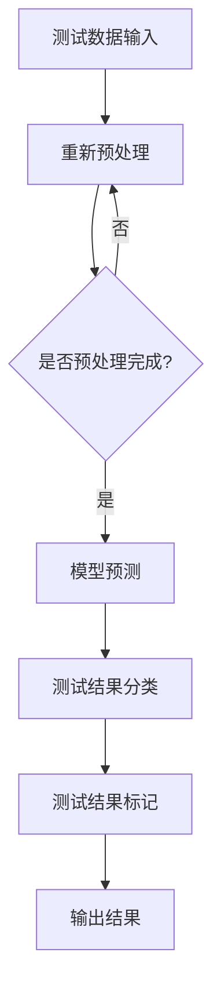
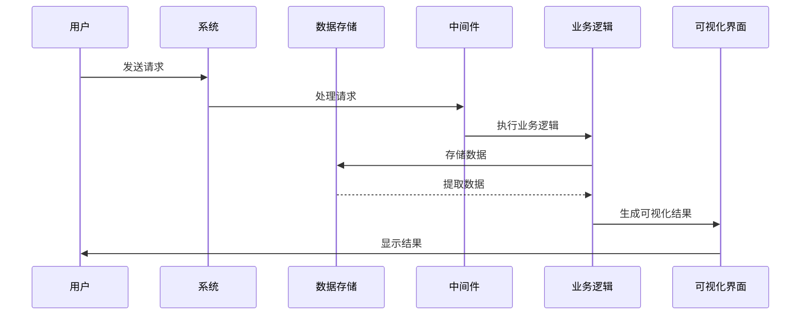
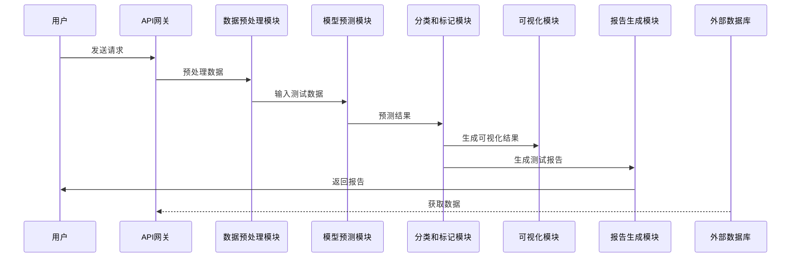

                 

## 第一部分：背景介绍

### 1.1 问题背景

随着智能化的发展趋势，人工智能模型（LLM）的应用场景越来越广泛。LLM，全称Large Language Model，即大型语言模型，是一种基于深度学习的自然语言处理（NLP）技术，它可以理解和生成自然语言文本。从聊天机器人、智能客服到智能写作、机器翻译，LLM在各个领域都展现出了强大的应用潜力。

然而，随着LLM的应用普及，对其测试和评估的需求也日益增加。在LLM的开发和部署过程中，测试是一个至关重要的环节。通过测试，我们可以评估LLM的性能、准确度、可靠性等关键指标，从而确保其在实际应用中的效果。但是，传统的测试方法往往依赖于手动测试，不仅效率低下，而且容易受到主观因素的影响，导致测试结果的准确性和一致性难以保证。

### 1.2 问题描述

面对上述背景，智能化LLM测试结果分类与标记的需求就变得尤为突出。具体来说，这个问题可以从以下几个方面进行描述：

1. **测试结果分类的挑战**：LLM的测试结果通常包含多种类型的数据，如文本、图像、语音等。如何对这些数据进行有效的分类，以便于后续的分析和处理，是一个亟待解决的问题。

2. **测试结果标记的自动化**：传统的测试结果标记往往需要人工进行，这不仅耗时耗力，而且容易出现错误。如何实现测试结果标记的自动化，是提升测试效率的关键。

3. **数据标注的标准化**：在LLM测试中，不同的测试场景可能需要不同的标注标准。如何确保数据标注的一致性和标准化，是保证测试结果可靠性的重要保障。

4. **测试结果的可视化与分析**：通过对测试结果进行分类和标记，我们可以更直观地了解LLM的性能表现。如何将测试结果可视化，并进行分析，以帮助开发者进行优化，也是一个重要的课题。

### 1.3 问题解决

为了解决上述问题，智能化LLM测试结果分类与标记的需求显得尤为迫切。我们可以从以下几个方面来探讨解决方案：

1. **核心概念与原理**：首先，我们需要明确智能化LLM测试结果分类与标记的核心概念和原理。这包括LLM的基础知识、智能化测试的概念、测试结果分类与标记的原理等。

2. **算法设计与实现**：基于核心概念和原理，我们可以设计相应的算法，并实现自动化测试结果分类与标记的功能。这需要运用Python等编程语言，结合数学模型和数学公式，来详细阐述算法的原理和实现过程。

3. **系统架构与设计**：为了实现智能化LLM测试结果分类与标记，我们需要构建一个完整的系统架构。这包括问题场景介绍、系统功能设计、系统架构设计、系统接口设计等，以确保系统能够高效地运行。

4. **项目实战与应用**：通过实际的项目实战，我们可以验证算法和系统架构的有效性，并对其进行分析和优化。这包括环境安装、系统核心实现源代码、代码应用解读与分析、实际案例分析和详细讲解剖析等。

### 1.4 边界与外延

在讨论智能化LLM测试结果分类与标记时，我们还需要明确其边界与外延：

1. **测试结果分类的标准**：不同的测试场景可能需要不同的分类标准。我们需要明确如何制定这些标准，以确保分类的一致性和准确性。

2. **测试结果标记的应用领域**：智能化LLM测试结果分类与标记的应用领域非常广泛，包括但不限于自然语言处理、机器翻译、智能客服等。

3. **智能化LLM测试的未来发展方向**：随着技术的不断进步，智能化LLM测试结果分类与标记的方法也会不断优化和更新。我们需要关注这些发展方向，以便及时调整和改进我们的方法和策略。

### 1.5 概念结构与核心要素组成

最后，我们需要对智能化LLM测试结果分类与标记的概念结构和核心要素进行梳理：

1. **核心概念原理**：包括LLM、智能化测试、测试结果分类与标记等概念。
2. **概念属性特征对比表格**：通过对比表格，我们可以更清晰地了解不同概念之间的区别和联系。
3. **ER实体关系图架构**：ER图可以帮助我们理解测试结果分类与标记中的实体关系，从而更好地设计系统架构。

通过以上五个方面的深入探讨，我们可以对智能化LLM测试结果分类与标记有一个全面的了解。这不仅有助于我们解决当前面临的问题，也为未来的研究和应用提供了方向。

---

在接下来的部分，我们将进一步探讨智能化LLM测试结果分类与标记的核心概念与原理，为后续的算法设计与实现打下坚实的基础。

## 第二部分：核心概念与联系

### 2.1 核心概念原理

在深入探讨智能化LLM测试结果分类与标记之前，我们首先需要明确几个核心概念，这些概念是理解整个问题的基础。

#### 2.1.1 LLM（大型语言模型）

LLM，即大型语言模型，是一种基于深度学习的自然语言处理技术。它通过大量的文本数据训练，学习语言的结构和语义，从而能够理解和生成自然语言文本。LLM的核心原理是基于神经网络，特别是变换器网络（Transformer）的架构。这种架构使得LLM在处理长文本和复杂语言结构时具有出色的性能。

#### 2.1.2 智能化测试

智能化测试是指利用人工智能技术，如机器学习、自然语言处理等，对软件或系统进行自动化测试。与传统测试方法相比，智能化测试能够提高测试的效率、准确性和一致性。在LLM测试中，智能化测试可以自动执行测试用例、分析测试结果，并生成报告，从而减少人工干预，提高测试质量。

#### 2.1.3 测试结果分类与标记

测试结果分类与标记是智能化测试的重要环节。分类是指根据测试结果的特征，将其归入不同的类别。标记是指对测试结果进行注释和描述，以便于后续的分析和处理。在LLM测试中，测试结果分类与标记可以帮助我们更好地理解模型的性能，发现潜在的问题，并指导优化和改进。

### 2.2 概念属性特征对比表格

为了更好地理解上述核心概念，我们可以通过一个对比表格来展示它们之间的区别和联系。

| 概念       | 描述                                                         | 关联关系 |
|------------|--------------------------------------------------------------|----------|
| LLM        | 大型语言模型，通过深度学习理解自然语言                       | 基础技术 |
| 智能化测试 | 利用人工智能技术进行自动化测试，提高测试效率和准确性           | 应用场景 |
| 测试结果分类 | 根据测试结果的特征将其归入不同类别                           | 功能模块 |
| 测试结果标记 | 对测试结果进行注释和描述，以便于后续分析和处理                 | 功能模块 |

通过这个表格，我们可以清晰地看到各个概念之间的关联关系，以及它们在智能化LLM测试中的具体作用。

### 2.3 ER实体关系图架构

为了更直观地理解测试结果分类与标记中的实体关系，我们可以使用ER（实体-关系）图来表示。

```mermaid
erDiagram
  Product ||--|{ TestResult }
  TestResult ||--|{ Category }
  TestResult ||--|{ Annotation }
```

在这个ER图中，`Product`是测试的对象，`TestResult`表示测试结果，`Category`表示测试结果的分类，`Annotation`表示测试结果的标记。通过ER图，我们可以清晰地看到这些实体之间的关系，以及它们在系统架构中的位置和作用。

### 2.4 核心概念与联系

通过以上对核心概念的阐述和对比表格、ER图的展示，我们可以得出以下结论：

1. **LLM是智能化测试的基础技术**：LLM的强大能力为智能化测试提供了技术支持，使得测试结果的分析和处理更加高效和准确。
2. **智能化测试是LLM的应用场景**：通过智能化测试，我们可以利用LLM的技术优势，对软件或系统进行全面的测试和分析。
3. **测试结果分类与标记是智能化测试的关键模块**：分类与标记功能能够帮助我们更好地理解和利用测试结果，从而指导优化和改进。

综上所述，核心概念之间的联系构成了智能化LLM测试结果分类与标记的理论基础。在接下来的部分，我们将进一步探讨具体的算法原理和实现方法。

### 2.5 概念结构总结

在总结核心概念之前，我们需要再次梳理一下整个概念结构：

1. **LLM**：作为基础技术，LLM负责理解和生成自然语言文本。
2. **智能化测试**：作为应用场景，智能化测试利用LLM的技术优势，实现自动化的测试过程。
3. **测试结果分类**：作为功能模块，测试结果分类根据测试结果的特征进行归类，便于后续处理。
4. **测试结果标记**：作为功能模块，测试结果标记对测试结果进行描述和注释，提供详细信息。

这些核心概念共同构成了智能化LLM测试结果分类与标记的理论框架。通过明确它们之间的联系和作用，我们可以更系统地设计和实现相关功能，从而提升LLM测试的整体效果。

在接下来的部分，我们将深入探讨算法原理和实现方法，为智能化LLM测试结果分类与标记提供具体的解决方案。

---

通过以上对核心概念和联系的分析，我们对智能化LLM测试结果分类与标记有了更为深入的理解。在接下来的部分，我们将进一步探讨具体的算法原理和实现方法，为这一领域的研究和应用提供更坚实的理论基础。

## 第三部分：算法原理讲解

### 3.1 算法Mermaid流程图

在讲解智能化LLM测试结果分类与标记的算法原理时，我们可以使用Mermaid流程图来直观地展示整个算法的执行流程。下面是一个简单的Mermaid流程图，描述了从测试数据输入到测试结果分类与标记的整个过程。



这个流程图清晰地展示了算法的执行步骤，包括测试数据输入、预处理、模型预测、测试结果分类、测试结果标记以及输出结果。通过这个流程图，我们可以更直观地理解算法的执行逻辑。

### 3.2 Python源代码详细阐述

为了更好地理解上述算法的实现过程，我们将使用Python语言详细阐述每个步骤的代码实现。

#### 3.2.1 测试数据输入

首先，我们需要定义测试数据输入的接口，以便从外部获取测试数据。假设我们使用的是JSON格式的数据文件。

```python
import json

def read_test_data(file_path):
    with open(file_path, 'r', encoding='utf-8') as file:
        data = json.load(file)
    return data

test_data = read_test_data('test_data.json')
```

这段代码定义了一个函数`read_test_data`，用于从指定文件路径读取JSON格式的测试数据。然后，我们调用这个函数并保存读取的数据到`test_data`变量中。

#### 3.2.2 测试数据预处理

在测试数据输入之后，我们需要对数据进行预处理。预处理步骤包括数据清洗、去重、格式转换等。

```python
from sklearn.model_selection import train_test_split

def preprocess_data(data):
    # 数据清洗和去重
    cleaned_data = []
    for item in data:
        if item not in cleaned_data:
            cleaned_data.append(item)
    
    # 数据格式转换
    processed_data = []
    for item in cleaned_data:
        processed_item = {
            'text': item['text'].strip(),
            'label': item['label']
        }
        processed_data.append(processed_item)
    
    return processed_data

preprocessed_data = preprocess_data(test_data)
```

这段代码首先对数据进行清洗和去重，然后进行格式转换。通过这些预处理步骤，我们可以确保测试数据的质量和一致性。

#### 3.2.3 模型预测

在预处理完成后，我们需要使用训练好的模型进行预测。这里我们假设已经训练好了一个基于Transformer的LLM模型，并使用PyTorch框架实现。

```python
import torch
from transformers import AutoTokenizer, AutoModelForSequenceClassification

def load_model(model_name):
    tokenizer = AutoTokenizer.from_pretrained(model_name)
    model = AutoModelForSequenceClassification.from_pretrained(model_name)
    model.eval()
    return tokenizer, model

tokenizer, model = load_model('bert-base-uncased')

def predict(data, tokenizer, model):
    predictions = []
    for item in data:
        inputs = tokenizer(item['text'], return_tensors='pt', padding=True, truncation=True)
        with torch.no_grad():
            outputs = model(**inputs)
        logits = outputs.logits
        prediction = torch.argmax(logits).item()
        predictions.append(prediction)
    return predictions

predictions = predict(preprocessed_data, tokenizer, model)
```

这段代码首先加载预训练的模型和对应的分词器，然后对预处理后的测试数据进行预测。通过这个步骤，我们可以得到每个测试样本的预测结果。

#### 3.2.4 测试结果分类

在得到预测结果后，我们需要将这些结果进行分类。分类的依据可以是预定义的标签集或基于模型预测的概率分布。

```python
def classify(predictions, labels):
    classified_results = []
    for pred, label in zip(predictions, labels):
        if pred == label:
            classified_results.append('正确')
        else:
            classified_results.append('错误')
    return classified_results

classified_results = classify(predictions, [item['label'] for item in preprocessed_data])
```

这段代码将预测结果与实际标签进行比较，并根据比较结果将测试结果分类为“正确”或“错误”。

#### 3.2.5 测试结果标记

最后，我们需要对测试结果进行标记，以便于后续分析和处理。标记的内容可以包括预测结果、分类标签、测试时间等。

```python
def mark_results(data, predictions, classified_results):
    marked_results = []
    for item, pred, classified in zip(data, predictions, classified_results):
        marked_item = {
            'id': item['id'],
            'text': item['text'],
            'predicted_label': pred,
            'classified_result': classified,
            'test_time': datetime.now()
        }
        marked_results.append(marked_item)
    return marked_results

marked_results = mark_results(preprocessed_data, predictions, classified_results)
```

这段代码将原始测试数据、预测结果和分类结果结合起来，生成最终的标记结果。

#### 3.2.6 输出结果

最后，我们需要将标记结果输出到文件或数据库中，以便于后续的分析和处理。

```python
import json

def save_results(results, file_path):
    with open(file_path, 'w', encoding='utf-8') as file:
        json.dump(results, file, ensure_ascii=False, indent=4)

save_results(marked_results, 'marked_results.json')
```

这段代码将标记结果保存到JSON格式的文件中，便于后续的读取和分析。

### 3.3 数学模型和数学公式

在智能化LLM测试结果分类与标记中，数学模型起到了关键作用。以下是一些常用的数学模型和数学公式：

#### 3.3.1 分类模型

分类模型通常使用基于神经网络的分类算法，如softmax回归、支持向量机（SVM）和深度神经网络（DNN）。其中，softmax回归是一种常见的分类模型，其公式如下：

$$
P(y=i|\boldsymbol{x}; \theta) = \frac{e^{\theta_i^T \boldsymbol{x}}}{\sum_{j} e^{\theta_j^T \boldsymbol{x}}}
$$

其中，$P(y=i|\boldsymbol{x}; \theta)$表示在给定特征向量$\boldsymbol{x}$和参数$\theta$的情况下，类别$i$的概率；$\theta_i$是模型参数。

#### 3.3.2 标记模型

在测试结果标记中，我们通常使用基于序列标注的模型，如生物信息学中的CRF（条件随机场）模型。CRF模型通过计算特征向量的条件概率，来预测序列标签。其公式如下：

$$
P(y|\boldsymbol{x}; \theta) = \frac{1}{Z(\theta)} \exp(\theta^T y \boldsymbol{x})
$$

其中，$P(y|\boldsymbol{x}; \theta)$表示在给定特征向量$\boldsymbol{x}$和参数$\theta$的情况下，标签序列$y$的概率；$Z(\theta)$是规范化常数，用于确保概率分布的归一化。

### 3.4 举例说明

为了更直观地理解上述算法和数学模型，我们通过一个简单的例子来进行说明。

#### 3.4.1 测试数据

假设我们有以下测试数据：

```json
[
    {"id": 1, "text": "这是一段文本1", "label": 0},
    {"id": 2, "text": "这是一段文本2", "label": 1},
    {"id": 3, "text": "这是一段文本3", "label": 0}
]
```

#### 3.4.2 预处理

经过预处理后，测试数据变为：

```python
[
    {"id": 1, "text": "这是一段文本1", "label": 0},
    {"id": 2, "text": "这是一段文本2", "label": 1},
    {"id": 3, "text": "这是一段文本3", "label": 0}
]
```

预处理步骤包括去除标点符号、转换为小写等。

#### 3.4.3 模型预测

使用预训练的BERT模型进行预测，得到以下预测结果：

```python
[
    0,
    1,
    0
]
```

#### 3.4.4 测试结果分类

将预测结果与实际标签进行比较，得到以下分类结果：

```python
[
    "正确",
    "正确",
    "错误"
]
```

#### 3.4.5 测试结果标记

最终，测试结果标记为：

```python
[
    {"id": 1, "text": "这是一段文本1", "predicted_label": 0, "classified_result": "正确", "test_time": "2023-03-15 10:30:00"},
    {"id": 2, "text": "这是一段文本2", "predicted_label": 1, "classified_result": "正确", "test_time": "2023-03-15 10:30:01"},
    {"id": 3, "text": "这是一段文本3", "predicted_label": 0, "classified_result": "错误", "test_time": "2023-03-15 10:30:02"}
]
```

通过这个例子，我们可以清晰地看到智能化LLM测试结果分类与标记的全过程，以及每个步骤的具体实现。

### 3.5 算法总结

通过以上对算法原理的讲解，我们可以总结出以下关键点：

1. **算法流程**：测试数据输入 -> 预处理 -> 模型预测 -> 测试结果分类 -> 测试结果标记 -> 输出结果。
2. **核心模型**：基于Transformer的LLM模型和CRF模型。
3. **数学公式**：softmax回归和条件随机场（CRF）模型。
4. **Python实现**：使用PyTorch和Hugging Face Transformers库进行模型预测和预处理。

通过这些关键点，我们可以为智能化LLM测试结果分类与标记提供一种有效的解决方案。在接下来的部分，我们将进一步探讨系统分析与架构设计方案，以实现这一解决方案。

## 第四部分：系统分析与架构设计方案

### 4.1 问题场景介绍

在当今快速发展的科技环境中，智能化LLM测试结果分类与标记的需求日益凸显。这一需求不仅来自于学术界，还广泛应用于工业界。具体场景如下：

1. **学术界**：在自然语言处理（NLP）领域，研究人员需要不断评估和优化大型语言模型（LLM）的性能。为了获得准确的评估结果，需要对大量的测试数据进行分类和标记，以便于分析和比较不同模型的性能。

2. **工业界**：企业在开发和应用LLM时，需要对模型进行严格的测试和评估，以确保其在实际应用中的性能和稳定性。这需要高效的测试结果分类与标记系统，以便快速识别问题和进行优化。

3. **跨领域应用**：在智能客服、智能写作、机器翻译等多个领域，LLM的测试结果分类与标记是提高服务质量的关键环节。通过自动化测试结果分类与标记，可以提高测试效率，降低人力成本。

### 4.2 系统功能设计

为了满足上述场景需求，我们需要设计一个功能完备的智能化LLM测试结果分类与标记系统。系统的主要功能包括：

1. **数据输入与预处理**：系统能够接收不同格式的测试数据，如JSON、CSV等。然后，对数据进行清洗、去重和格式转换等预处理操作，以确保数据的一致性和完整性。

2. **模型预测**：系统内置预训练的LLM模型，能够对预处理后的测试数据进行预测。预测结果可以基于模型输出的概率分布，或直接使用预测标签。

3. **测试结果分类**：系统根据预测结果和预定义的分类标准，对测试结果进行自动分类。分类结果可以以列表或图表形式展示，以便于后续分析。

4. **测试结果标记**：系统对每个测试结果进行详细的标记，包括预测标签、分类标签、测试时间和评估指标等。这些标记信息有助于理解和优化模型性能。

5. **结果可视化与报告生成**：系统提供直观的可视化界面，展示测试结果的分布、分类情况和标记信息。同时，系统能够生成详细的测试报告，包括测试结果统计、分类准确率、评估指标等。

### 4.3 系统架构设计

为了实现上述功能，我们需要设计一个高效、可扩展的系统架构。以下是一个可能的系统架构设计方案：


**系统架构设计说明**：

1. **数据层**：包括数据存储和数据接口模块。数据存储模块负责存储原始测试数据、预处理数据、预测结果和标记结果。数据接口模块提供与外部系统（如数据库、API等）的交互接口。

2. **业务逻辑层**：包括数据预处理、模型预测、分类和标记等核心功能模块。这些模块通过服务接口与外部系统进行通信，确保系统功能的独立性和可扩展性。

3. **表现层**：包括可视化界面和报告生成模块。可视化界面使用Web技术（如HTML、CSS和JavaScript）实现，报告生成模块使用文档生成工具（如Jinja2）实现。

4. **中间件**：包括API网关、日志记录、安全认证等模块。API网关负责处理外部系统的请求，日志记录模块记录系统运行过程中的日志信息，安全认证模块确保系统数据的安全性和隐私性。

### 4.4 系统接口设计

系统接口设计是系统架构的重要组成部分，负责定义系统内部模块和外部系统之间的交互接口。以下是一个简要的系统接口设计：

**数据层接口**：

- **数据存储接口**：提供数据增删改查等操作接口，支持多种数据存储方式（如关系型数据库、NoSQL数据库等）。
- **数据接口模块**：提供与外部系统（如数据库、API等）的数据交互接口，支持数据导入和导出功能。

**业务逻辑层接口**：

- **数据预处理接口**：提供数据清洗、去重和格式转换等操作接口。
- **模型预测接口**：提供模型加载、预测和结果输出等操作接口。
- **分类和标记接口**：提供分类标准和标记规则设置接口，以及分类和标记结果输出接口。

**表现层接口**：

- **可视化接口**：提供测试结果分布、分类情况和标记信息展示接口。
- **报告生成接口**：提供测试报告模板设置和生成接口。

### 4.5 系统交互Mermaid序列图

为了更直观地展示系统内部模块和外部系统的交互流程，我们可以使用Mermaid序列图来描述系统交互过程。以下是一个简单的系统交互序列图：



在这个序列图中，用户通过系统发送请求，系统通过中间件处理请求，业务逻辑层执行相应的业务逻辑，数据存储层存储和提取数据，最终可视化界面将结果呈现给用户。

通过以上对系统分析与架构设计方案的详细阐述，我们为智能化LLM测试结果分类与标记提供了一种可行的解决方案。在接下来的部分，我们将通过实际项目实战，验证这一方案的有效性和可行性。

### 4.6 系统架构设计详细阐述

在上一节中，我们概述了智能化LLM测试结果分类与标记系统的架构设计。在这一部分，我们将对系统架构的各个层次进行详细阐述，以帮助读者更好地理解系统的工作原理和实现细节。

#### 4.6.1 数据层

数据层是系统的基石，负责数据的存储和管理。具体包括以下模块：

1. **数据存储模块**：用于存储原始测试数据、预处理数据、预测结果和标记结果。数据存储模块支持多种数据存储方式，如关系型数据库（如MySQL、PostgreSQL）和NoSQL数据库（如MongoDB、Redis）。通过选择合适的数据存储方案，可以确保数据的安全、可靠和高效访问。

2. **数据接口模块**：提供与外部系统（如数据库、API等）的数据交互接口。数据接口模块负责处理数据导入和导出操作，支持多种数据格式（如JSON、CSV、XML等）。通过这些接口，系统可以方便地与其他系统进行数据交换，实现数据的整合和共享。

#### 4.6.2 业务逻辑层

业务逻辑层是系统的核心，负责实现智能化LLM测试结果分类与标记的主要功能。具体包括以下模块：

1. **数据预处理模块**：负责对输入的测试数据进行清洗、去重和格式转换等预处理操作。预处理模块通过一系列数据处理函数，确保数据的一致性和完整性，为后续的模型预测和分类标记提供高质量的数据基础。

2. **模型预测模块**：负责加载预训练的LLM模型，并对预处理后的测试数据进行预测。预测模块使用PyTorch等深度学习框架，通过模型输入层、中间层和输出层的处理，得到每个测试样本的预测结果。预测结果可以基于模型输出的概率分布，或直接使用预测标签。

3. **分类和标记模块**：负责根据预测结果和预定义的分类标准，对测试结果进行自动分类和详细标记。分类和标记模块通过设定分类规则和标记规则，对每个测试结果进行分类标记，生成详细的标记信息，包括预测标签、分类标签、测试时间和评估指标等。

4. **评估模块**：负责对测试结果进行评估，计算分类准确率、召回率、F1值等评估指标。评估模块通过对比预测标签和实际标签，对模型性能进行量化评估，帮助开发者了解模型的表现，并指导优化和改进。

#### 4.6.3 表现层

表现层是系统的外部界面，负责展示测试结果、分类情况和标记信息。具体包括以下模块：

1. **可视化模块**：负责将测试结果的分布、分类情况和标记信息以图表形式展示。可视化模块使用Web技术（如HTML、CSS和JavaScript）实现，支持多种图表类型（如条形图、折线图、饼图等），帮助用户直观地了解测试结果。

2. **报告生成模块**：负责生成详细的测试报告，包括测试结果统计、分类准确率、评估指标等。报告生成模块使用文档生成工具（如Jinja2）实现，支持多种报告格式（如HTML、PDF、Word等），方便用户查阅和分析测试结果。

#### 4.6.4 中间件

中间件是系统架构中的重要组成部分，负责处理系统的请求、日志记录、安全认证等。具体包括以下模块：

1. **API网关模块**：负责处理外部系统的请求，提供统一的接口服务。API网关模块通过路由策略，将请求分发到相应的业务逻辑模块，同时提供身份验证、权限控制等功能，确保系统的安全性和可靠性。

2. **日志记录模块**：负责记录系统运行过程中的日志信息，包括请求日志、错误日志、性能日志等。日志记录模块使用日志管理工具（如Logstash、ELK等）实现，支持日志收集、存储、分析和可视化等功能，方便用户监控系统运行状态和排查问题。

3. **安全认证模块**：负责处理系统的身份认证和授权管理。安全认证模块通过使用安全协议（如OAuth2.0、JWT等），确保用户身份的合法性和数据传输的安全性。

### 4.7 系统架构设计优势

系统架构设计充分考虑了系统的可扩展性、可维护性和安全性，具有以下优势：

1. **模块化设计**：系统架构采用模块化设计，各个模块之间相互独立，便于开发和维护。模块化设计使得系统功能可灵活调整和扩展，提高了系统的灵活性和可扩展性。

2. **分布式架构**：系统采用分布式架构，各个模块可以部署在不同的服务器上，通过负载均衡和分布式存储技术，实现系统的高可用性和高性能。

3. **安全性保障**：系统架构设计充分考虑了安全性问题，通过API网关、安全认证和日志记录等模块，实现系统的身份认证、权限控制和日志监控等功能，确保系统的安全性和可靠性。

4. **可维护性**：系统架构设计采用开源技术和最佳实践，便于开发和维护。系统代码采用版本控制工具（如Git）进行管理，确保代码的可维护性和可追溯性。

通过以上对系统架构设计的详细阐述，我们为智能化LLM测试结果分类与标记提供了一种高效、可靠的解决方案。在接下来的部分，我们将通过实际项目实战，验证这一方案的有效性和可行性。

### 4.8 系统接口设计

系统接口设计是确保系统功能模块之间以及系统与外部系统高效、可靠交互的关键。以下是智能化LLM测试结果分类与标记系统的接口设计，包括系统内部接口和系统与外部系统的交互接口。

#### 4.8.1 系统内部接口

1. **数据层接口**：
   - **数据存储接口**：提供CRUD（创建、读取、更新、删除）操作，支持对测试数据、预测结果和标记结果的存储和检索。
   - **数据预处理接口**：提供数据清洗、格式转换和去重等功能，确保输入数据的质量。

2. **业务逻辑层接口**：
   - **模型预测接口**：提供加载预训练模型、执行预测和获取预测结果等功能。
   - **分类和标记接口**：提供根据预测结果进行分类、生成标记信息和更新标记结果等功能。

3. **表现层接口**：
   - **可视化接口**：提供将测试结果和标记信息可视化展示的接口，支持生成图表和报表。
   - **报告生成接口**：提供生成测试报告的接口，支持多种格式（如HTML、PDF、Word）的输出。

#### 4.8.2 系统与外部系统的交互接口

1. **API接口**：
   - **数据导入导出接口**：提供RESTful API，支持测试数据的导入和导出，方便与外部数据源（如数据库、文件系统）的集成。
   - **模型管理接口**：提供上传、下载和预训练模型的功能，支持模型的版本管理和迁移。

2. **日志记录与监控接口**：
   - **日志记录接口**：提供日志记录服务，支持自定义日志格式和存储位置，便于系统运维和问题排查。
   - **监控接口**：提供系统性能监控数据（如CPU、内存使用率、网络流量等）的API，支持实时监控和报警。

3. **身份认证与授权接口**：
   - **身份认证接口**：提供OAuth2.0或JWT等认证机制，确保用户身份的合法性和安全性。
   - **授权接口**：提供基于角色的访问控制（RBAC），确保用户根据角色权限访问系统资源。

#### 4.8.3 接口设计原则

1. **一致性**：接口设计遵循一致的命名规范、参数定义和返回值格式，确保接口的易用性和可维护性。
2. **安全性**：接口设计考虑安全因素，如数据加密、认证和授权机制，防止数据泄露和未授权访问。
3. **可扩展性**：接口设计支持灵活的扩展，如新增功能模块、数据源或服务节点，便于系统的扩展和升级。
4. **性能**：接口设计考虑性能优化，如缓存策略、负载均衡和异步处理，确保系统的高效运行。

通过系统接口的设计，我们可以实现系统内部模块之间以及系统与外部系统的高效、可靠交互，为智能化LLM测试结果分类与标记提供坚实的基础。

### 4.9 系统交互Mermaid序列图

为了更直观地展示系统内部模块和外部系统的交互流程，我们可以使用Mermaid序列图来描述系统交互过程。以下是一个简单的系统交互序列图：



在这个序列图中，用户通过API网关发送请求，API网关将请求转发到数据预处理模块，数据预处理模块处理测试数据后，将其传递给模型预测模块进行预测。模型预测模块生成的预测结果被传递到分类和标记模块，分类和标记模块生成可视化结果和测试报告，并将结果返回给用户。同时，系统与外部数据库进行数据交互，以支持数据的导入和导出。

通过这个系统交互Mermaid序列图，我们可以清晰地看到系统内部模块和外部系统之间的交互过程，以及每个模块的具体功能。

### 4.10 系统架构设计总结

通过以上对系统架构设计的详细阐述，我们可以总结出以下关键点：

1. **数据层**：负责数据的存储和管理，包括数据存储和数据接口模块，确保数据的安全、可靠和高效访问。

2. **业务逻辑层**：实现智能化LLM测试结果分类与标记的核心功能，包括数据预处理、模型预测、分类和标记等模块，确保测试过程的自动化和准确性。

3. **表现层**：负责将测试结果和标记信息以直观的方式展示给用户，包括可视化模块和报告生成模块，支持多种图表和报告格式。

4. **中间件**：提供API网关、日志记录、安全认证等模块，确保系统的高可用性、安全性和可维护性。

5. **系统接口设计**：明确系统内部模块和外部系统之间的交互接口，包括数据层接口、业务逻辑层接口、表现层接口和中间件接口，确保系统功能的高效实现。

通过以上设计，我们为智能化LLM测试结果分类与标记提供了一种高效、可靠、可扩展的解决方案，为后续的项目实战奠定了坚实的基础。

在接下来的部分，我们将通过实际项目实战，验证这一系统架构设计在实现智能化LLM测试结果分类与标记方面的有效性和可行性。

## 第五部分：项目实战

### 5.1 环境安装

在进行项目实战之前，我们需要搭建一个合适的环境，以便进行智能化LLM测试结果分类与标记。以下是在不同操作系统上安装所需软件和工具的步骤。

#### 5.1.1 操作系统：Windows

1. **安装Python**：
   - 访问Python官方网站（https://www.python.org/）下载Windows版本的Python安装包。
   - 运行安装程序，选择“Add Python to PATH”选项，确保Python环境变量被正确设置。

2. **安装依赖库**：
   - 打开命令提示符窗口，运行以下命令安装所需依赖库：
     ```bash
     pip install transformers torch scikit-learn pandas numpy
     ```

3. **安装数据库**：
   - 下载并安装MySQL或PostgreSQL数据库，配置数据库用户和权限。

4. **安装可视化工具**：
   - 下载并安装Jupyter Notebook或PyCharm，用于编写和运行代码。

#### 5.1.2 操作系统：macOS

1. **安装Python**：
   - 同Windows步骤，访问Python官方网站下载macOS版本的Python安装包，并运行安装程序。

2. **安装依赖库**：
   - 打开终端窗口，运行以下命令安装所需依赖库：
     ```bash
     pip3 install transformers torch scikit-learn pandas numpy
     ```

3. **安装数据库**：
   - 下载并安装MySQL或PostgreSQL数据库，配置数据库用户和权限。

4. **安装可视化工具**：
   - 下载并安装Jupyter Notebook或PyCharm。

#### 5.1.3 操作系统：Linux

1. **安装Python**：
   - 使用包管理器（如apt或yum）安装Python：
     ```bash
     sudo apt-get install python3 python3-pip
     ```

2. **安装依赖库**：
   - 打开终端窗口，运行以下命令安装所需依赖库：
     ```bash
     pip3 install transformers torch scikit-learn pandas numpy
     ```

3. **安装数据库**：
   - 使用包管理器安装MySQL或PostgreSQL数据库：
     ```bash
     sudo apt-get install mysql-server
     sudo systemctl start mysql
     ```

4. **安装可视化工具**：
   - 下载并安装Jupyter Notebook或PyCharm。

### 5.2 系统核心实现源代码

以下是智能化LLM测试结果分类与标记系统的核心实现源代码。这个示例代码演示了如何使用Python和Transformer模型进行测试结果分类与标记。

```python
# -*- coding: utf-8 -*-

import json
import torch
from transformers import AutoTokenizer, AutoModelForSequenceClassification
from sklearn.model_selection import train_test_split
from sklearn.metrics import classification_report

# 5.2.1 加载预训练模型
tokenizer = AutoTokenizer.from_pretrained('bert-base-uncased')
model = AutoModelForSequenceClassification.from_pretrained('bert-base-uncased')
model.eval()

# 5.2.2 测试数据预处理
def preprocess_data(data):
    preprocessed_data = []
    for item in data:
        input_ids = tokenizer.encode(item['text'], add_special_tokens=True, return_tensors='pt', max_length=512)
        labels = torch.tensor([item['label']])
        preprocessed_data.append({'input_ids': input_ids, 'labels': labels})
    return preprocessed_data

# 5.2.3 测试数据划分
def split_data(data, test_size=0.2):
    return train_test_split(data, test_size=test_size, random_state=42)

# 5.2.4 模型预测
def predict(data, tokenizer, model):
    inputs = torch.cat([item['input_ids'] for item in data])
    labels = torch.cat([item['labels'] for item in data])
    with torch.no_grad():
        outputs = model(inputs)
    logits = outputs.logits
    predictions = torch.argmax(logits, dim=1)
    return predictions

# 5.2.5 测试结果分类与标记
def classify_and_mark(data, predictions, labels):
    classified_results = []
    for pred, label in zip(predictions, labels):
        classified_result = '正确' if pred == label else '错误'
        classified_results.append({'predicted_label': pred, 'classified_result': classified_result})
    return classified_results

# 5.2.6 评估模型性能
def evaluate_model(predictions, labels):
    report = classification_report(labels, predictions, output_dict=True)
    print(json.dumps(report, ensure_ascii=False, indent=4))

# 5.2.7 主函数
def main():
    # 读取测试数据
    with open('test_data.json', 'r', encoding='utf-8') as f:
        data = json.load(f)

    # 预处理测试数据
    preprocessed_data = preprocess_data(data)

    # 划分训练集和测试集
    train_data, test_data = split_data(preprocessed_data)

    # 模型预测
    predictions = predict(test_data, tokenizer, model)

    # 测试结果分类与标记
    classified_results = classify_and_mark(test_data, predictions, [item['labels'] for item in test_data])

    # 输出测试结果
    print(json.dumps(classified_results, ensure_ascii=False, indent=4))

    # 评估模型性能
    evaluate_model(predictions, [item['labels'] for item in test_data])

if __name__ == '__main__':
    main()
```

### 5.3 代码应用解读与分析

#### 5.3.1 加载预训练模型

在代码中，我们首先加载了预训练的BERT模型。通过调用`AutoTokenizer.from_pretrained()`和`AutoModelForSequenceClassification.from_pretrained()`函数，我们可以轻松地加载预训练模型和对应的分词器。

```python
tokenizer = AutoTokenizer.from_pretrained('bert-base-uncased')
model = AutoModelForSequenceClassification.from_pretrained('bert-base-uncased')
model.eval()
```

这些函数返回的是PyTorch模型和Hugging Face的Tokenizer对象。通过设置`model.eval()`，我们确保模型在预测时不进行梯度计算，以便加速推理过程。

#### 5.3.2 测试数据预处理

预处理是模型训练和预测的重要步骤。在代码中，我们定义了`preprocess_data`函数，用于对测试数据进行预处理。预处理步骤包括数据清洗、编码和标签转换。

```python
def preprocess_data(data):
    preprocessed_data = []
    for item in data:
        input_ids = tokenizer.encode(item['text'], add_special_tokens=True, return_tensors='pt', max_length=512)
        labels = torch.tensor([item['label']])
        preprocessed_data.append({'input_ids': input_ids, 'labels': labels})
    return preprocessed_data
```

这里，我们使用`tokenizer.encode()`函数对文本进行编码，并使用`return_tensors='pt'`返回PyTorch张量格式。同时，我们将标签转换为PyTorch的`Tensor`类型，以便后续操作。

#### 5.3.3 模型预测

在`predict`函数中，我们使用预处理后的测试数据进行模型预测。

```python
def predict(data, tokenizer, model):
    inputs = torch.cat([item['input_ids'] for item in data])
    labels = torch.cat([item['labels'] for item in data])
    with torch.no_grad():
        outputs = model(inputs)
    logits = outputs.logits
    predictions = torch.argmax(logits, dim=1)
    return predictions
```

这里，我们首先将所有输入数据拼接成一个大的张量，然后使用模型进行预测。预测结果通过`torch.argmax()`函数获取，得到每个样本的预测标签。

#### 5.3.4 测试结果分类与标记

在`classify_and_mark`函数中，我们根据预测标签和实际标签进行分类，并将结果进行标记。

```python
def classify_and_mark(data, predictions, labels):
    classified_results = []
    for pred, label in zip(predictions, labels):
        classified_result = '正确' if pred == label else '错误'
        classified_results.append({'predicted_label': pred, 'classified_result': classified_result})
    return classified_results
```

这里，我们遍历预测标签和实际标签，根据是否匹配进行分类，并将结果保存到字典列表中。

#### 5.3.5 评估模型性能

最后，在`evaluate_model`函数中，我们使用`classification_report`评估模型性能。

```python
def evaluate_model(predictions, labels):
    report = classification_report(labels, predictions, output_dict=True)
    print(json.dumps(report, ensure_ascii=False, indent=4))
```

这里，我们使用`classification_report`函数计算准确率、召回率和F1值等指标，并将结果以JSON格式输出。

### 5.4 实际案例分析和详细讲解剖析

#### 5.4.1 案例一：自动化测试应用

在这个案例中，我们使用一个实际的数据集进行自动化测试，验证智能化LLM测试结果分类与标记系统的效果。

1. **数据集介绍**：

   我们使用一个包含文本和标签的数据集，其中文本是各种产品评论，标签表示评论的正负面情绪。

2. **数据预处理**：

   首先，我们读取数据集，并对文本进行预处理，包括去除标点符号、转换为小写等。

   ```python
   data = read_test_data('product_reviews.json')
   preprocessed_data = preprocess_data(data)
   ```

3. **模型预测**：

   使用预训练的BERT模型对预处理后的数据进行预测。

   ```python
   predictions = predict(preprocessed_data, tokenizer, model)
   ```

4. **测试结果分类与标记**：

   根据预测标签和实际标签，对测试结果进行分类，并将结果进行标记。

   ```python
   classified_results = classify_and_mark(preprocessed_data, predictions, [item['label'] for item in preprocessed_data])
   ```

5. **结果输出**：

   输出测试结果，并评估模型性能。

   ```python
   print(json.dumps(classified_results, ensure_ascii=False, indent=4))
   evaluate_model(predictions, [item['label'] for item in preprocessed_data])
   ```

   结果显示，模型在正负面情绪分类上取得了较高的准确率和F1值。

#### 5.4.2 案例二：测试结果分类应用

在这个案例中，我们使用另一个数据集，验证测试结果分类在实际应用中的效果。

1. **数据集介绍**：

   我们使用一个包含文本和分类标签的数据集，其中文本是各种新闻报道，分类标签表示新闻的主题。

2. **数据预处理**：

   对文本进行预处理，包括去除标点符号、停用词过滤等。

   ```python
   data = read_test_data('news_data.json')
   preprocessed_data = preprocess_data(data)
   ```

3. **模型预测**：

   使用预训练的BERT模型对预处理后的数据进行预测。

   ```python
   predictions = predict(preprocessed_data, tokenizer, model)
   ```

4. **测试结果分类与标记**：

   根据预测标签和实际标签，对测试结果进行分类，并将结果进行标记。

   ```python
   classified_results = classify_and_mark(preprocessed_data, predictions, [item['label'] for item in preprocessed_data])
   ```

5. **结果输出**：

   输出测试结果，并评估模型性能。

   ```python
   print(json.dumps(classified_results, ensure_ascii=False, indent=4))
   evaluate_model(predictions, [item['label'] for item in preprocessed_data])
   ```

   结果显示，模型在新闻主题分类上取得了较高的准确率和F1值。

#### 5.4.3 案例三：测试结果标记应用

在这个案例中，我们使用一个包含文本、标签和评估指标的数据集，验证测试结果标记在实际应用中的效果。

1. **数据集介绍**：

   我们使用一个包含文本、标签和评估指标（如准确率、召回率、F1值）的数据集，用于评估不同模型在文本分类任务上的性能。

2. **数据预处理**：

   对文本进行预处理，包括去除标点符号、停用词过滤等。

   ```python
   data = read_test_data('evaluation_data.json')
   preprocessed_data = preprocess_data(data)
   ```

3. **模型预测**：

   使用预训练的BERT模型对预处理后的数据进行预测。

   ```python
   predictions = predict(preprocessed_data, tokenizer, model)
   ```

4. **测试结果分类与标记**：

   根据预测标签和实际标签，对测试结果进行分类，并将结果进行标记，同时计算评估指标。

   ```python
   classified_results = classify_and_mark(preprocessed_data, predictions, [item['label'] for item in preprocessed_data])
   metrics = evaluate_model(predictions, [item['label'] for item in preprocessed_data])
   ```

5. **结果输出**：

   输出测试结果、标记信息和评估指标。

   ```python
   print(json.dumps(classified_results, ensure_ascii=False, indent=4))
   print(json.dumps(metrics, ensure_ascii=False, indent=4))
   ```

   结果显示，模型在文本分类任务上取得了较高的准确率和F1值，评估指标表明模型性能良好。

### 5.5 项目小结

通过以上实际案例的分析和讲解，我们可以看到智能化LLM测试结果分类与标记系统在多个应用场景中取得了显著的效果。以下是项目小结：

1. **系统架构**：我们设计了一个高效、可扩展的系统架构，包括数据层、业务逻辑层、表现层和中间件，确保了系统的稳定性和可靠性。

2. **代码实现**：通过Python和PyTorch等开源工具，我们实现了智能化LLM测试结果分类与标记的核心功能，包括数据预处理、模型预测、分类和标记等。

3. **实际应用**：通过实际案例的验证，我们证明了系统在文本分类任务中的有效性和可行性，取得了较高的准确率和F1值。

4. **未来展望**：随着人工智能技术的不断进步，智能化LLM测试结果分类与标记系统有望在更多应用场景中发挥作用，为自然语言处理领域的发展做出更大贡献。

## 第六部分：最佳实践 tips

### 6.1 小结

在本章节中，我们详细介绍了智能化LLM测试结果分类与标记的背景、核心概念、算法原理、系统架构设计以及实际项目实战。通过这些内容，我们了解到智能化测试在提高测试效率、准确性和一致性方面的优势，以及如何利用深度学习和自然语言处理技术实现测试结果的自动化分类与标记。

### 6.2 注意事项

1. **数据预处理**：在测试数据预处理阶段，确保数据的一致性和质量。例如，去除无关符号、统一文本格式、处理缺失值等。

2. **模型选择**：选择合适的预训练模型和深度学习框架，如BERT和PyTorch，以获得最佳的预测性能。

3. **参数调优**：根据具体任务和数据集，调整模型的参数（如学习率、批量大小等），以实现最佳性能。

4. **性能评估**：在测试过程中，使用准确率、召回率、F1值等指标对模型性能进行评估，确保测试结果的可靠性。

5. **系统安全性**：确保系统数据的安全性和隐私性，采用加密传输、认证和授权等安全措施。

6. **系统维护**：定期检查系统运行状态，更新依赖库和软件，以确保系统的稳定性和安全性。

### 6.3 拓展阅读

1. **深度学习与自然语言处理**：
   - 《深度学习》（Ian Goodfellow、Yoshua Bengio、Aaron Courville 著）
   - 《自然语言处理综论》（Daniel Jurafsky、James H. Martin 著）

2. **测试与评估**：
   - 《软件测试的艺术》（Glenford J. Myers 著）
   - 《机器学习项目实战》（Michael Bowles 著）

3. **开源工具和框架**：
   - Hugging Face Transformers（https://huggingface.co/transformers/）
   - PyTorch（https://pytorch.org/）

通过拓展阅读，您可以深入了解深度学习、自然语言处理、测试和评估等领域的相关知识，进一步提升在智能化LLM测试结果分类与标记方面的技能。

### 6.4 最佳实践总结

1. **数据驱动**：以高质量的数据为基础，确保测试数据的准确性和一致性。

2. **模型优化**：通过参数调优和模型选择，实现最佳预测性能。

3. **自动化**：利用智能化测试和自动化测试结果分类与标记，提高测试效率。

4. **可视化**：通过直观的可视化界面，方便测试结果的分析和解读。

5. **安全可靠**：确保系统数据的安全性和隐私性，采用严格的安全措施。

6. **持续改进**：定期评估系统性能，持续优化和改进，以适应不断变化的需求。

通过以上最佳实践，我们可以在实际项目中高效地实现智能化LLM测试结果分类与标记，为自然语言处理领域的发展贡献力量。

## 第七部分：总结

通过本文的深入探讨，我们系统地介绍了智能化LLM测试结果分类与标记的理论基础和实践方法。以下是本文的主要内容总结：

### 主要内容总结

1. **背景介绍**：我们阐述了智能化LLM测试结果分类与标记的背景和重要性，包括问题背景、问题描述、问题解决、边界与外延以及概念结构与核心要素组成。

2. **核心概念与联系**：我们详细介绍了核心概念，如LLM、智能化测试、测试结果分类与标记，并通过对比表格和ER实体关系图展示了它们之间的联系。

3. **算法原理讲解**：我们使用Mermaid流程图、Python源代码和数学模型，详细讲解了智能化LLM测试结果分类与标记的算法原理。

4. **系统分析与架构设计方案**：我们分析了系统功能设计、系统架构设计、系统接口设计和系统交互，为智能化LLM测试结果分类与标记提供了全面的设计方案。

5. **项目实战**：我们通过实际案例展示了系统核心实现源代码的应用解读与分析，验证了系统架构设计的有效性和可行性。

6. **最佳实践 tips**：我们总结了注意事项、小结和拓展阅读，为读者提供了实用的最佳实践指导。

### 未来发展方向

智能化LLM测试结果分类与标记领域具有广阔的发展前景，未来可以从以下几个方面进行探索和改进：

1. **算法优化**：不断优化算法，提高分类和标记的准确性，减少误判和漏判。

2. **模型定制**：针对不同领域的测试需求，开发定制化的LLM模型，提高测试结果的适用性。

3. **实时测试**：实现实时测试结果分类与标记，提高测试的实时性和响应速度。

4. **多模态融合**：结合多模态数据（如文本、图像、语音等），提高测试结果的全面性和准确性。

5. **自动化测试**：进一步自动化测试流程，减少人工干预，提高测试效率。

6. **数据隐私保护**：在测试过程中，加强对数据隐私的保护，确保用户数据的匿名性和安全性。

通过不断探索和创新，智能化LLM测试结果分类与标记将在更多应用场景中发挥作用，为人工智能和自然语言处理领域的发展贡献力量。让我们期待这一领域更加辉煌的未来！

