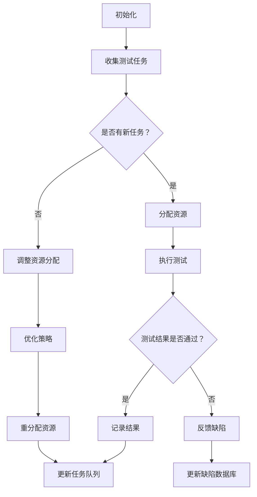
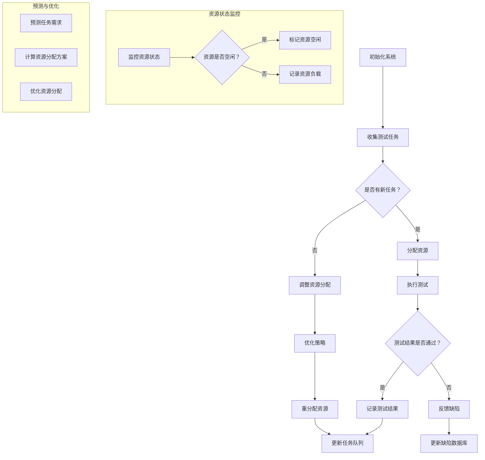

                 

### 摘要

本文旨在深入探讨智能化语言模型（LLM）的测试资源分配策略，通过逐步分析推理，旨在为读者提供一种系统化的方法，以优化测试资源的利用效率。在当前人工智能飞速发展的背景下，大规模语言模型的训练和测试资源分配面临诸多挑战，如资源短缺、任务繁多、效率低下等。本文将围绕以下核心内容展开讨论：

1. **背景介绍**：回顾人工智能和语言模型的发展历程，阐述LLM在当前技术应用中的重要性，并介绍测试资源分配的挑战。
2. **核心概念与算法原理**：详细解析智能化测试资源分配的核心概念和算法原理，包括算法设计原则、流程图和实现步骤。
3. **数学模型与公式**：介绍算法原理中的数学模型和关键公式，并通过具体的示例进行解释和推导。
4. **系统设计与实现**：从系统架构设计、接口设计与实现，到系统交互流程，全面展示智能化LLM测试资源分配系统的设计和实现过程。
5. **项目实战**：通过实际案例，介绍项目环境搭建、系统核心实现、代码解读与分析、案例剖析与总结，使读者能够将理论知识应用于实践。
6. **最佳实践与拓展**：总结最佳实践技巧，并针对项目中的注意事项和拓展阅读进行深入探讨。

本文旨在为从事人工智能和语言模型开发的读者提供一个全面而深入的指南，帮助他们理解和实施高效的测试资源分配策略，从而提升模型的质量和开发效率。通过本文的阅读，读者将能够掌握智能化LLM测试资源分配的核心技术和方法，为后续的项目开发和优化奠定坚实基础。

### 第一部分：背景介绍

#### 1.1 人工智能与LLM概述

人工智能（Artificial Intelligence, AI）是计算机科学的一个分支，旨在研究、开发和应用使计算机能够模拟、延伸和扩展人类智能的理论、算法和技术。自20世纪50年代诞生以来，人工智能经历了多个发展阶段，从早期的规则系统、知识表示到现代的机器学习和深度学习，其技术逐渐成熟并广泛应用于各个领域。

在人工智能的发展历程中，语言模型（Language Model, LM）是一个重要的里程碑。语言模型是一种能够预测或生成文本的概率模型，其核心目的是理解和生成自然语言。传统语言模型主要通过统计方法构建，如n-gram模型，这些模型基于历史文本数据，通过计算词汇或字符的共现概率来生成文本。然而，随着计算能力的提升和大数据的普及，深度学习技术为语言模型的构建带来了革命性的变化。

语言模型（LM）分为两类：基于规则的模型和基于统计的模型。基于规则的模型通过手工编写语法规则和语义规则来模拟自然语言处理过程，虽然可以处理一些复杂的语言现象，但规则繁琐且难以维护。相比之下，基于统计的模型通过从大量文本数据中学习语言规律，能够自动发现和适应复杂的语言模式，具有更高的灵活性和泛化能力。

近年来，深度神经网络（Deep Neural Networks, DNN）在语言模型中的应用取得了显著成果。最典型的代表是循环神经网络（Recurrent Neural Networks, RNN），特别是长短期记忆网络（Long Short-Term Memory, LSTM）。RNN通过记忆序列信息，能够处理变长的序列数据，如文本。然而，RNN在处理长序列时仍然存在梯度消失和梯度爆炸等问题。

为解决这些问题，研究人员提出了门控循环单元（Gated Recurrent Unit, GRU）和LSTM的改进版本。这些模型通过引入门控机制，能够更好地控制信息的流动，从而改善模型的训练效果。在此基础上，注意力机制（Attention Mechanism）的引入进一步提升了模型在处理长文本时的表现。注意力机制能够动态调整模型对输入序列的不同部分的重要性，从而提高模型的预测准确性和生成文本的连贯性。

随着深度学习技术的不断发展，基于变分自编码器（Variational Autoencoder, VAE）和生成对抗网络（Generative Adversarial Networks, GAN）的生成模型也取得了显著进展。这些模型不仅在文本生成方面表现出色，还能够用于文本的自动摘要、情感分析、命名实体识别等任务。

在人工智能的发展历程中，语言模型的应用也经历了从基础研究到实际应用的转变。早期的语言模型主要用于机器翻译、语音识别和文本摘要等任务，随着技术的进步，语言模型的应用范围不断扩展，包括自然语言生成、对话系统、知识图谱构建等。特别是在自然语言处理（Natural Language Processing, NLP）领域，语言模型已经成为许多应用的核心组件，如搜索引擎、智能客服、智能助手等。

#### 1.2 智能化测试资源分配

智能化测试资源分配是指利用人工智能技术优化测试资源的使用，提高测试效率和质量。随着人工智能和深度学习技术的不断发展，智能化测试资源分配在软件测试、自动化测试、性能测试等方面得到了广泛应用。

在传统的测试资源分配中，测试资源的分配主要依赖于测试人员的经验和直觉，存在一定的主观性和盲目性。而智能化测试资源分配通过引入人工智能技术，能够实现测试资源的自动化分配和优化，提高测试的效率和准确性。

智能化测试资源分配的主要目标和挑战包括：

1. **优化资源利用**：在有限的测试资源下，如何最大限度地利用这些资源，提高测试的覆盖率和准确性。
2. **自动化测试**：通过智能化算法自动分配测试任务，减少人工干预，提高测试的自动化程度。
3. **效率提升**：在保证测试质量的前提下，缩短测试周期，提高开发效率。
4. **准确性保证**：确保测试资源的分配能够发现更多的缺陷，提高软件的质量。

为实现这些目标，智能化测试资源分配通常采用以下方法：

1. **数据驱动的测试**：通过收集和分析历史测试数据，利用机器学习算法预测和优化测试资源的分配。
2. **优化算法**：采用优化算法，如线性规划、遗传算法、粒子群优化等，实现测试资源的优化分配。
3. **模型驱动的方法**：构建测试资源分配的数学模型，通过求解模型找到最优的测试资源分配方案。

#### 1.3 测试资源分配的核心概念

在智能化测试资源分配中，一些核心概念和术语是理解这一领域的关键。以下是这些核心概念及其在测试资源分配中的作用：

1. **测试任务**：测试任务是指测试过程中的单个测试活动，如功能测试、性能测试、安全测试等。测试任务是测试资源分配的基本单位。
2. **测试资源**：测试资源包括硬件资源（如计算机、服务器、网络设备等）和软件资源（如测试工具、测试脚本等）。测试资源是完成测试任务的基础。
3. **测试优先级**：测试优先级是指测试任务在测试过程中的重要性排序。通常，根据业务需求、风险等因素来确定测试任务的优先级。
4. **测试覆盖率**：测试覆盖率是指测试任务对系统功能的覆盖程度。高测试覆盖率意味着测试能够更全面地检测系统缺陷。
5. **测试质量**：测试质量是指测试结果的准确性和可靠性。高质量的测试能够发现更多的缺陷，提高软件的质量。
6. **测试效率**：测试效率是指测试资源的利用率和测试周期的长短。高效率的测试能够在较短的时间内完成更多的测试任务。

#### 1.4 智能化测试资源分配的挑战

尽管智能化测试资源分配具有明显的优势，但在实际应用中仍然面临诸多挑战。以下是主要挑战及其原因：

1. **数据质量**：智能化测试资源分配依赖于大量的历史测试数据。然而，测试数据的质量直接影响模型的预测和优化效果。数据中的噪声、缺失值和不一致性都会影响模型的性能。
2. **算法复杂性**：优化算法和机器学习算法的复杂性使得模型设计和实现过程较为复杂。需要专业的技术知识和实践经验，否则容易陷入算法调优的陷阱。
3. **模型解释性**：许多高级机器学习模型，如深度神经网络，具有强大的预测能力，但其内部机制复杂，难以解释。这限制了模型在关键业务场景中的应用。
4. **实时性要求**：在实际应用中，测试资源分配需要快速响应，以满足项目进度和质量要求。然而，复杂的算法和优化过程可能导致实时性不足。
5. **成本考虑**：智能化测试资源分配需要投入大量的硬件设备和计算资源。在预算有限的情况下，如何平衡成本和效益成为一大挑战。

#### 1.5 智能化测试资源分配的重要性

智能化测试资源分配在软件开发生命周期中扮演着重要角色。随着软件系统的复杂度和规模不断增加，传统的测试方法已经难以满足高质量和高效率的需求。智能化测试资源分配能够通过自动化和优化的手段，提高测试的覆盖率和准确性，减少测试周期和开发成本，从而提升软件的质量和市场的竞争力。

具体来说，智能化测试资源分配的重要性体现在以下几个方面：

1. **提升测试效率**：通过智能化算法自动分配测试任务，减少人工干预，缩短测试周期，提高开发效率。
2. **优化资源利用**：在有限的测试资源下，最大限度地利用这些资源，提高测试的覆盖率和准确性。
3. **保证测试质量**：通过数据驱动的测试和优化算法，确保测试资源分配能够发现更多的缺陷，提高软件的质量。
4. **降低成本**：通过优化测试资源的利用，减少不必要的测试和重复工作，降低测试成本。
5. **增强灵活性**：智能化测试资源分配能够适应不同项目和业务场景的需求，提高测试过程的灵活性和可扩展性。

总之，智能化测试资源分配是现代软件测试不可或缺的一部分。通过本文的深入探讨，读者将能够更好地理解这一领域的技术原理和实践方法，为实际项目中的应用提供有力支持。

### 第二部分：核心概念与算法原理

#### 2.1 测试资源分配的目标

在智能化LLM测试资源分配中，明确测试资源分配的目标是实现高效、精准的测试，以确保模型的质量和稳定性。具体目标包括以下几个方面：

1. **优化资源利用**：在有限的测试资源下，最大化地利用这些资源，包括硬件资源和软件资源。通过智能化的算法和策略，确保每个测试任务都能充分利用可用资源，减少资源的浪费。
2. **提高测试覆盖率**：测试覆盖率是指测试任务对系统功能的覆盖程度。通过优化测试资源的分配，确保测试能够更全面地覆盖系统的各个部分，减少潜在的缺陷漏检。
3. **提升测试效率**：通过自动化和优化的测试资源分配，缩短测试周期，提高测试的执行速度。这样可以加快软件的开发和发布进度，提高企业的市场响应能力。
4. **保证测试质量**：确保测试结果的准确性和可靠性。通过智能化的测试资源分配，可以发现更多的缺陷，提高软件的质量，减少因缺陷导致的后续问题。
5. **降低测试成本**：通过优化测试资源的利用，减少不必要的测试和重复工作，降低测试成本。这样可以提高项目的经济效益，为企业创造更大的价值。

#### 2.2 资源分配中的关键要素

在实现智能化LLM测试资源分配时，需要考虑多个关键要素，这些要素共同决定了资源分配策略的有效性和效率。以下是几个关键要素及其在测试资源分配中的作用：

1. **测试任务**：测试任务是指具体的测试活动，包括功能测试、性能测试、安全测试等。每个测试任务都有其特定的目标和测试场景，是资源分配的基本单位。
2. **测试资源**：测试资源包括硬件资源和软件资源。硬件资源如计算机、服务器、网络设备等，软件资源如测试工具、测试脚本等。资源的状态和可用性直接影响测试任务的执行。
3. **测试优先级**：测试优先级是指测试任务在测试过程中的重要性排序。通常，根据业务需求、风险等因素来确定测试任务的优先级。高优先级的任务需要优先执行，以确保关键功能得到充分测试。
4. **测试覆盖率**：测试覆盖率是指测试任务对系统功能的覆盖程度。高覆盖率的测试可以更全面地发现潜在缺陷，提高软件的质量。
5. **测试质量**：测试质量是指测试结果的准确性和可靠性。高质量的测试能够有效地发现缺陷，减少因缺陷导致的后续问题。
6. **测试效率**：测试效率是指测试资源的利用率和测试周期的长短。高效率的测试能够在较短时间内完成更多任务，提高开发效率。
7. **成本考虑**：测试资源分配需要考虑成本因素，包括硬件设备采购、软件工具购买、人力成本等。在有限的预算下，需要优化资源利用，降低测试成本。

#### 2.3 资源分配策略的分类

测试资源分配策略可以根据不同的分类标准进行划分，常见的分类标准包括：

1. **静态资源分配策略**：静态资源分配策略是在测试执行之前，根据一定的规则或算法预先分配测试资源。这种策略的优点是简单直观，缺点是缺乏灵活性，难以适应动态变化的测试需求。
   - **固定分配策略**：按照预设的比例或规则，将资源固定分配给每个测试任务。
   - **轮询分配策略**：按照一定的顺序，轮流分配资源给各个测试任务。

2. **动态资源分配策略**：动态资源分配策略是在测试执行过程中，根据实际需求和环境变化实时调整测试资源。这种策略的优点是灵活性强，能够更好地适应测试环境的变化，缺点是实现复杂度较高。
   - **基于需求的动态分配**：根据测试任务的优先级和测试覆盖率，动态调整资源分配。
   - **基于状态的动态分配**：根据测试资源的当前状态（如负载、健康状态等），动态调整资源分配。

3. **启发式资源分配策略**：启发式资源分配策略利用经验和启发式规则来优化资源分配。这种策略通常结合了静态和动态分配策略的优点，具有一定的灵活性和适应性。
   - **基于历史数据的分配**：根据历史测试数据，预测未来测试需求，进行资源预分配。
   - **基于优先级的动态调整**：根据实时测试任务的优先级，动态调整资源分配。

#### 2.4 智能化测试资源分配的方法

智能化测试资源分配方法通常结合机器学习、优化算法和大数据分析等技术，以提高资源分配的效率和质量。以下是几种常见的智能化测试资源分配方法：

1. **基于机器学习的资源分配方法**：利用机器学习算法，如回归分析、聚类分析、决策树等，根据历史测试数据预测未来测试需求，从而实现资源的智能分配。
   - **回归分析**：通过历史数据建立回归模型，预测未来测试需求的资源量。
   - **聚类分析**：将相似的任务聚类在一起，根据聚类结果进行资源分配。

2. **基于优化的资源分配方法**：利用优化算法，如线性规划、遗传算法、粒子群优化等，求解资源分配问题，找到最优的资源分配方案。
   - **线性规划**：通过建立线性规划模型，求解资源分配的最优解。
   - **遗传算法**：模拟自然进化过程，通过交叉、变异等操作找到最优资源分配方案。

3. **基于大数据分析的资源分配方法**：利用大数据分析技术，分析历史测试数据中的模式和趋势，从而优化资源分配。
   - **数据挖掘**：通过数据挖掘技术，发现测试数据中的隐含模式和关系，为资源分配提供依据。
   - **实时分析**：利用实时数据分析技术，对测试过程中的数据进行实时分析，动态调整资源分配。

4. **基于混合智能的资源分配方法**：结合多种智能方法，如机器学习、优化算法和专家系统等，实现更高效和智能的资源分配。
   - **多代理系统**：利用多个智能代理，协同工作，实现资源的高效分配。
   - **基于规则的智能系统**：结合专家系统和机器学习算法，构建智能测试资源管理系统。

#### 2.5 智能化测试资源分配的优势

智能化测试资源分配相对于传统资源分配方法具有以下优势：

1. **高效性**：通过智能算法和自动化策略，智能化测试资源分配能够快速响应测试需求，缩短测试周期，提高测试效率。
2. **精准性**：利用大数据分析和机器学习技术，智能化测试资源分配能够更准确地预测测试需求，实现资源的高效利用。
3. **灵活性**：智能化测试资源分配可以根据实际情况动态调整资源分配，适应不同的测试环境和需求，提高系统的灵活性。
4. **全面性**：通过全面分析和挖掘测试数据，智能化测试资源分配能够更全面地了解系统状况，提高测试覆盖率和准确性。
5. **经济性**：通过优化资源利用和减少浪费，智能化测试资源分配可以降低测试成本，提高项目的经济效益。

总之，智能化测试资源分配在提升测试效率、降低成本、提高质量方面具有显著优势，是现代软件测试领域的重要发展方向。通过本文的深入探讨，读者将能够更好地理解智能化测试资源分配的核心概念和方法，为实际项目中的应用提供有力支持。

### 第三部分：算法原理讲解

#### 3.1 算法设计原则

在智能化LLM测试资源分配中，算法的设计原则是确保资源分配的效率和公平性，同时满足测试质量和项目需求。以下是主要的算法设计原则：

1. **最大化资源利用率**：算法应尽量利用所有可用的测试资源，避免资源浪费。通过合理分配测试任务，确保每个资源都能发挥最大效能。
2. **最小化测试延迟**：在资源分配时，应尽量缩短测试任务的执行时间，确保项目按时交付。通过优先处理高优先级的测试任务，加快关键功能的测试进度。
3. **保证测试质量**：算法在优化资源利用的同时，应确保测试质量。通过动态调整资源分配，确保关键功能和风险点得到充分测试。
4. **灵活性**：算法应具备一定的灵活性，能够适应不同项目和业务场景的需求。通过引入自适应机制，算法可以根据实际情况调整资源分配策略。
5. **可扩展性**：算法设计应考虑未来的扩展需求，支持不同规模和复杂度的测试项目。通过模块化设计，算法可以方便地增加新的功能或改进现有功能。

#### 3.2 算法流程图

为了更直观地展示智能化LLM测试资源分配算法的设计思路和执行步骤，我们使用Mermaid绘制了算法的流程图。以下是算法流程图的详细解释：



以下是流程图的详细说明：

1. **初始化**：系统启动时，初始化资源状态和测试任务队列。
2. **收集测试任务**：从测试平台或其他来源收集待执行的测试任务，并存储在任务队列中。
3. **是否有新任务？**：检查任务队列中是否有新任务需要处理。如果有，则进行下一步；如果没有，则进行资源调整。
4. **分配资源**：根据任务优先级和资源状态，为新的测试任务分配测试资源。
5. **执行测试**：启动测试任务，利用分配的资源进行测试。
6. **测试结果是否通过？**：检查测试结果是否通过。如果通过，记录测试结果；如果不通过，反馈缺陷。
7. **记录结果**：将测试结果记录在测试数据库中，用于后续分析和报告生成。
8. **反馈缺陷**：如果测试未通过，将缺陷信息反馈给开发团队，以便进行修复。
9. **调整资源分配**：根据测试任务的执行情况和资源状态，动态调整资源分配策略。
10. **优化策略**：根据测试历史数据和当前情况，优化资源分配策略，以提高效率和测试质量。
11. **更新任务队列**：将已完成测试的任务从队列中移除，并更新剩余任务的优先级和状态。
12. **更新缺陷数据库**：将新的缺陷信息添加到缺陷数据库中，用于后续的缺陷管理和统计分析。

#### 3.3 算法实现步骤

为了实现智能化LLM测试资源分配算法，需要按照以下步骤进行：

1. **需求分析**：明确测试资源分配的目标和要求，包括资源类型、任务类型、优先级等因素。
2. **数据收集**：收集历史测试数据，包括测试任务、资源状态、测试结果等，用于算法训练和优化。
3. **特征提取**：从测试数据中提取关键特征，如任务类型、优先级、资源占用等，用于构建资源分配模型。
4. **模型选择**：根据需求分析的结果，选择合适的机器学习模型，如决策树、随机森林、支持向量机等。
5. **模型训练**：使用历史测试数据进行模型训练，调整模型参数，使其能够准确预测测试任务的需求和资源状态。
6. **模型评估**：通过交叉验证和测试集评估模型的性能，确保模型能够有效预测和优化资源分配。
7. **资源分配**：根据训练好的模型，实时分配测试资源，确保任务的高效执行。
8. **动态调整**：根据测试任务的执行情况和资源状态，动态调整资源分配策略，以适应变化的需求。
9. **反馈优化**：将测试结果和资源分配情况反馈给模型，用于进一步优化和调整资源分配策略。
10. **系统部署**：将优化后的资源分配算法部署到测试环境中，进行实际运行和测试。

通过上述步骤，可以实现智能化LLM测试资源分配算法的有效实现和优化，提高测试效率和质量。

#### 3.4 算法核心概念

智能化LLM测试资源分配算法的核心概念包括以下几个部分：

1. **资源状态管理**：资源状态管理是算法的基础。它包括资源的可用性、负载情况、健康状态等。通过实时监控资源状态，算法能够动态调整资源分配，确保资源的高效利用。
2. **测试任务调度**：测试任务调度是算法的核心功能。算法需要根据测试任务的优先级、执行时间和资源需求，合理调度任务，确保关键任务优先执行，提高测试效率。
3. **预测模型**：预测模型用于预测未来测试任务的需求和资源状态。通过机器学习和大数据分析技术，算法可以建立准确的预测模型，为资源分配提供依据。
4. **优化策略**：优化策略是算法的核心，通过优化算法，如遗传算法、粒子群优化等，算法能够找到最优的资源分配方案，最大限度地利用测试资源。
5. **动态调整**：动态调整是算法的灵活性和自适应性的体现。根据测试任务的执行情况和资源状态，算法能够实时调整资源分配策略，以适应变化的需求。

这些核心概念共同构成了智能化LLM测试资源分配算法的基础，使其能够高效、精准地分配测试资源，提升测试效率和质量。

#### 3.5 算法流程图解读

为了更好地理解智能化LLM测试资源分配算法的执行流程，我们可以使用Mermaid绘制算法的详细流程图，并对每个步骤进行详细解析。以下是算法流程图的解读：



**步骤详细解析：**

1. **初始化系统**（A）：系统启动时，初始化资源状态、测试任务队列和缺陷数据库。确保所有数据结构初始化完毕，以便后续操作。

2. **收集测试任务**（B）：从测试平台或其他数据源收集新的测试任务，并将它们添加到任务队列中。这是资源分配算法的输入数据。

3. **是否有新任务？**（C）：检查任务队列中是否有新任务需要处理。如果存在新任务，则进入下一步；否则，进入资源调整阶段。

4. **分配资源**（D）：根据任务优先级和资源状态，为新任务分配资源。资源状态监控模块（O）实时监控资源状态，确保资源得到最优利用。

5. **执行测试**（F）：启动测试任务，利用分配的资源进行测试。测试结果将通过该步骤返回，用于后续决策。

6. **测试结果是否通过？**（G）：检查测试结果是否通过。如果测试通过，则记录测试结果；如果测试未通过，则进入缺陷反馈阶段。

7. **记录测试结果**（H）：将测试结果存储到缺陷数据库中，以便后续分析和报告生成。这有助于提高测试的透明度和可追溯性。

8. **反馈缺陷**（I）：如果测试未通过，将缺陷信息反馈给开发团队，以便进行修复。这有助于及时解决软件缺陷，提高软件质量。

9. **调整资源分配**（E）：根据实时监控的资源状态和测试任务的执行情况，动态调整资源分配策略。这一步骤确保资源分配的灵活性和适应性。

10. **优化策略**（J）：基于历史测试数据和当前资源状态，优化资源分配策略。这一步骤通过预测和调整，进一步提高资源利用效率。

11. **重分配资源**（M）：根据优化策略的结果，重新分配资源，确保每个测试任务都能获得最优资源。

12. **更新任务队列**（K）：将已完成测试的任务从队列中移除，并更新剩余任务的优先级和状态，为后续测试做准备。

13. **更新缺陷数据库**（L）：将新的缺陷信息添加到缺陷数据库中，便于后续的缺陷管理和统计分析。

通过上述步骤，智能化LLM测试资源分配算法能够高效、精准地管理测试资源，提高测试效率和质量。

#### 3.6 算法示例分析

为了更好地理解智能化LLM测试资源分配算法的原理和应用，我们可以通过一个实际案例进行分析。

**案例背景**：

假设一家公司正在开发一款智能客服系统，需要对其进行一系列测试，以确保其功能完备、性能稳定。测试任务包括功能测试、性能测试、安全测试等。公司拥有一批测试资源，包括多台测试服务器、数据库服务器、网络设备等。为了高效完成测试任务，公司决定采用智能化测试资源分配算法。

**测试任务与资源**：

- **功能测试**：需要10台服务器，每台服务器需具备8核CPU和16GB内存。
- **性能测试**：需要5台服务器，每台服务器需具备12核CPU和32GB内存。
- **安全测试**：需要3台服务器，每台服务器需具备4核CPU和8GB内存。

**算法应用**：

1. **初始化系统**：系统启动时，初始化资源状态和测试任务队列。资源状态监控模块（O）开始实时监控资源状态。

2. **收集测试任务**：从测试平台收集功能测试、性能测试和安全测试任务，并将它们添加到任务队列中。

3. **分配资源**：根据任务优先级和资源状态，为新任务分配资源。系统首先为功能测试任务分配资源，由于功能测试任务数量最多，系统决定为功能测试任务分配10台服务器。资源状态监控模块（O）确保这些服务器处于空闲状态，并标记为已被分配。

4. **执行测试**：启动功能测试任务，使用分配的服务器进行功能测试。测试结果存储到缺陷数据库中。

5. **测试结果反馈**：如果测试通过，记录测试结果；如果测试未通过，反馈缺陷信息给开发团队。

6. **调整资源分配**：性能测试和安全测试任务开始执行前，系统根据实时监控的资源状态，调整资源分配。性能测试任务优先级较高，因此系统决定为性能测试任务分配5台服务器，剩余服务器用于安全测试任务。

7. **优化策略**：基于历史测试数据和当前资源状态，系统优化资源分配策略。例如，通过分析历史数据，系统发现某些时间段内服务器负载较低，决定在这些时间段内增加性能测试任务的资源分配。

8. **重分配资源**：根据优化策略的结果，重新分配资源。系统确保每个测试任务都能获得最优资源。

9. **更新任务队列**：功能测试、性能测试和安全测试任务完成后，系统将已完成测试的任务从队列中移除，并更新剩余任务的优先级和状态。

10. **更新缺陷数据库**：将新的缺陷信息添加到缺陷数据库中，便于后续的缺陷管理和统计分析。

**结果分析**：

通过智能化LLM测试资源分配算法，公司能够高效、精准地管理测试资源，确保每个测试任务都能得到充分测试。功能测试、性能测试和安全测试任务依次完成，测试结果存储在缺陷数据库中，为开发团队提供宝贵的反馈信息。算法的实时监控和动态调整功能，使系统能够适应不同测试任务的需求和资源变化，提高了测试效率和质量。

这个案例展示了智能化LLM测试资源分配算法在实际应用中的效果。通过算法的应用，公司能够更好地管理测试资源，缩短测试周期，提高软件质量，从而在市场竞争中占据优势。

#### 3.7 数学模型与公式

在智能化LLM测试资源分配算法中，数学模型和公式起着至关重要的作用。这些模型和公式用于描述资源需求和资源分配之间的关系，帮助算法做出最优决策。以下是几个关键数学模型和公式的介绍。

**1. 资源需求模型**

资源需求模型用于描述测试任务对资源的具体需求。假设每个测试任务 \( T_i \) 有以下资源需求：

- \( C_i \)：计算资源需求（如CPU核心数）
- \( M_i \)：内存需求（如GB）
- \( N_i \)：网络带宽需求（如Mbps）

资源需求模型可以用以下公式表示：

\[ R_i = \{ C_i, M_i, N_i \} \]

其中，\( R_i \) 表示任务 \( T_i \) 的资源需求向量。

**2. 资源分配模型**

资源分配模型用于确定如何将资源分配给各个测试任务。假设系统有 \( R \) 个可用的测试资源，每个资源 \( R_j \) 有以下属性：

- \( C_j \)：计算资源总量
- \( M_j \)：内存总量
- \( N_j \)：网络带宽总量

资源分配模型的目标是找到一个最优的分配方案，使得每个测试任务都能得到满足其需求的资源。这可以通过以下目标函数表示：

\[ \text{minimize} \sum_{i=1}^{N} \left| R_i - R_j \right| \]

其中，\( N \) 是测试任务的数量，\( R_i - R_j \) 表示任务 \( T_i \) 的资源需求与实际分配资源之间的差值。

**3. 资源利用率模型**

资源利用率模型用于评估资源的使用效率。假设系统的资源利用率为 \( U \)，可以用以下公式表示：

\[ U = \frac{\sum_{j=1}^{M} \text{util}_j}{M} \]

其中，\( \text{util}_j \) 表示资源 \( R_j \) 的利用率，\( M \) 是总资源数量。资源利用率模型的目标是最大化系统的资源利用率，即最小化资源的闲置率。

**4. 测试质量模型**

测试质量模型用于评估测试任务的完成质量和测试结果的可靠性。假设测试质量由以下因素决定：

- \( TQ_i \)：任务 \( T_i \) 的测试质量
- \( D_i \)：任务 \( T_i \) 发现的缺陷数量
- \( S_i \)：任务 \( T_i \) 的测试覆盖范围

测试质量模型可以用以下公式表示：

\[ \text{Q} = \frac{\sum_{i=1}^{N} (TQ_i \times D_i \times S_i)}{N} \]

其中，\( N \) 是测试任务的数量，\( TQ_i \)、\( D_i \) 和 \( S_i \) 分别表示任务 \( T_i \) 的测试质量、发现的缺陷数量和测试覆盖范围。

**5. 优化目标函数**

优化目标函数用于确定资源分配策略。假设系统的优化目标是最小化总资源浪费和最大化测试质量，可以用以下公式表示：

\[ \text{Optimize} \left\{ \sum_{i=1}^{N} \left( R_i - R_j \right)^2 + \text{Q} \right\} \]

其中，\( R_i - R_j \) 表示任务 \( T_i \) 的资源需求与实际分配资源之间的差值，\(\text{Q}\) 表示测试质量。

通过这些数学模型和公式，智能化LLM测试资源分配算法能够对资源进行合理分配，确保测试任务的高效执行和资源的高效利用。在具体实现过程中，可以通过调整模型参数和优化目标函数，进一步优化资源分配策略，提高测试效率和质量。

### 第四部分：系统设计与实现

#### 4.1 系统架构设计

为了实现高效、可靠的智能化LLM测试资源分配，我们需要设计一个合理的系统架构。以下是系统架构设计的详细描述：

##### 4.1.1 系统需求分析

在系统设计之前，我们需要明确系统的需求，包括功能需求、性能需求、安全需求等。

1. **功能需求**：
   - 测试任务的自动分配和调度
   - 资源状态的实时监控和动态调整
   - 测试结果的记录和反馈
   - 系统日志和告警功能
   - 用户权限管理和日志审计

2. **性能需求**：
   - 高并发处理能力：能够同时处理大量测试任务和资源请求
   - 低延迟响应：确保测试任务的快速响应和资源的高效利用
   - 高可靠性：系统在异常情况下能够快速恢复，确保测试过程不受影响

3. **安全需求**：
   - 数据安全：确保测试数据和系统配置数据的安全性
   - 访问控制：确保只有授权用户可以访问系统资源
   - 审计日志：记录系统操作日志，便于后续审计和问题追踪

##### 4.1.2 系统功能设计

系统功能设计主要围绕测试任务的自动分配和调度、资源状态的实时监控和动态调整、测试结果的记录和反馈等核心功能展开。

1. **测试任务管理**：
   - 测试任务创建：支持创建不同类型的测试任务，如功能测试、性能测试、安全测试等。
   - 测试任务调度：根据测试任务的优先级和资源状态，自动调度测试任务。
   - 测试任务监控：实时监控测试任务的执行状态，包括执行进度、资源占用情况等。

2. **资源管理**：
   - 资源监控：实时监控各类测试资源的状态，包括服务器、数据库、网络设备等。
   - 资源分配：根据测试任务的需求，自动分配合适的测试资源。
   - 资源调整：动态调整资源分配策略，以适应实时变化的测试需求。

3. **测试结果管理**：
   - 测试结果记录：将测试任务的结果记录到数据库中，包括通过/失败的测试用例、错误日志等。
   - 测试结果分析：对测试结果进行统计分析，生成报告和可视化图表。
   - 测试结果反馈：将测试结果和缺陷信息反馈给相关开发和测试人员，以便及时处理。

4. **系统监控与告警**：
   - 系统状态监控：实时监控系统的运行状态，包括资源利用率、系统负载等。
   - 告警机制：当系统发生异常或资源利用率过高时，自动触发告警通知相关人员。

##### 4.1.3 系统架构设计

系统架构设计采用模块化设计思想，将系统分为多个模块，每个模块负责不同的功能，以提高系统的可维护性和可扩展性。以下是系统架构的详细设计：

1. **前端模块**：
   - 用户界面：提供用户操作界面，支持测试任务创建、查询、监控等功能。
   - API接口：提供与后端模块的数据交互接口，支持前后端分离。

2. **后端模块**：
   - 服务层：处理业务逻辑，包括测试任务调度、资源管理、测试结果管理等。
   - 数据层：存储测试任务、测试结果、系统配置等数据，使用数据库管理系统（如MySQL、MongoDB等）。

3. **资源管理模块**：
   - 资源监控：实时监控各类测试资源的运行状态，包括CPU利用率、内存使用率、网络带宽等。
   - 资源分配：根据测试任务的需求，自动分配合适的测试资源。
   - 资源调整：动态调整资源分配策略，以适应实时变化的测试需求。

4. **测试管理模块**：
   - 测试任务管理：支持测试任务创建、修改、删除等操作。
   - 测试任务调度：根据测试任务的优先级和资源状态，自动调度测试任务。
   - 测试结果记录：记录测试任务的执行结果，包括通过/失败的测试用例、错误日志等。

5. **监控系统**：
   - 系统状态监控：实时监控系统的运行状态，包括资源利用率、系统负载等。
   - 告警机制：当系统发生异常或资源利用率过高时，自动触发告警通知相关人员。

6. **日志模块**：
   - 日志记录：记录系统操作日志，包括用户操作、系统异常等。
   - 日志审计：支持日志查询和审计功能，便于后续问题追踪和系统优化。

##### 4.1.4 系统交互设计

为了实现各模块之间的有效交互，系统采用了RESTful API设计，提供前后端分离的架构。以下是系统交互设计的详细描述：

1. **用户界面与API接口**：
   - 用户通过用户界面进行测试任务的创建、修改、删除等操作。
   - 后端模块通过API接口接收用户操作请求，处理业务逻辑，并返回响应结果。

2. **测试管理模块与资源管理模块**：
   - 测试管理模块负责创建和管理测试任务。
   - 资源管理模块根据测试任务的需求，动态分配和调整测试资源。

3. **测试管理模块与监控系统**：
   - 测试管理模块将测试任务的执行状态和结果记录到数据库中。
   - 监控系统实时监控测试任务的执行状态和系统资源状态。

4. **日志模块与其他模块**：
   - 日志模块记录系统操作日志，供其他模块查询和审计。

通过以上系统架构设计和交互设计，智能化LLM测试资源分配系统能够高效、可靠地管理测试资源和测试任务，确保测试过程的高效性和质量。在实际应用中，可以根据具体需求和场景进行调整和优化，以适应不同的业务场景。

#### 4.2 系统接口设计与实现

系统接口设计是实现智能化LLM测试资源分配系统功能的关键环节。接口的设计需要确保各模块之间的有效通信，提高系统的灵活性和可扩展性。以下是系统接口设计的详细描述。

##### 4.2.1 接口设计原则

在进行系统接口设计时，需要遵循以下原则：

1. **模块化设计**：将系统功能划分为多个模块，每个模块提供独立的接口，降低模块之间的耦合度，提高系统的可维护性。
2. **RESTful风格**：采用RESTful API设计风格，通过HTTP请求和响应进行数据交换，支持前后端分离和微服务架构。
3. **标准化协议**：使用标准化的协议和数据格式，如JSON和HTTPS，确保接口的通用性和安全性。
4. **简洁性**：接口设计应简洁明了，减少不必要的复杂度和冗余，提高系统的可读性和可维护性。
5. **灵活性**：接口设计应具备一定的灵活性，支持扩展和更新，以适应未来的业务需求和技术发展。

##### 4.2.2 接口定义

以下是系统接口的详细定义：

1. **用户接口**：
   - **用户登录**：用户登录系统，获取认证token。
     - **请求**：POST /login
       - 参数：username（用户名）、password（密码）
       - 响应：token（认证token）
   - **用户注册**：用户注册系统，创建新账户。
     - **请求**：POST /register
       - 参数：username（用户名）、password（密码）、email（邮箱）
       - 响应：status（注册状态，如"success"、"failure"）

2. **测试任务接口**：
   - **创建测试任务**：创建新的测试任务。
     - **请求**：POST /tasks
       - 参数：title（任务名称）、description（任务描述）、type（测试类型，如功能测试、性能测试等）、priority（优先级）
       - 响应：task_id（任务ID）
   - **查询测试任务**：查询指定ID的测试任务详情。
     - **请求**：GET /tasks/{task_id}
       - 参数：task_id（任务ID）
       - 响应：测试任务详情（包括任务ID、名称、描述、类型、优先级等）
   - **更新测试任务**：更新指定ID的测试任务。
     - **请求**：PUT /tasks/{task_id}
       - 参数：title（任务名称，可选）、description（任务描述，可选）、type（测试类型，可选）、priority（优先级，可选）
       - 响应：status（更新状态，如"success"、"failure"）
   - **删除测试任务**：删除指定ID的测试任务。
     - **请求**：DELETE /tasks/{task_id}
       - 参数：task_id（任务ID）
       - 响应：status（删除状态，如"success"、"failure"）

3. **资源接口**：
   - **查询资源状态**：查询当前系统的资源状态。
     - **请求**：GET /resources
       - 响应：资源状态列表（包括服务器、数据库、网络设备等）
   - **分配资源**：为测试任务分配资源。
     - **请求**：POST /resources/allocate
       - 参数：task_id（任务ID）、resource_id（资源ID）
       - 响应：status（资源分配状态，如"success"、"failure"）
   - **释放资源**：释放指定测试任务的资源。
     - **请求**：POST /resources/release
       - 参数：task_id（任务ID）
       - 响应：status（资源释放状态，如"success"、"failure"）

4. **测试结果接口**：
   - **记录测试结果**：记录测试任务的执行结果。
     - **请求**：POST /results
       - 参数：task_id（任务ID）、status（测试结果，如"pass"、"fail"）、error_log（错误日志，可选）
       - 响应：status（记录状态，如"success"、"failure"）
   - **查询测试结果**：查询指定测试任务的执行结果。
     - **请求**：GET /results/{task_id}
       - 参数：task_id（任务ID）
       - 响应：测试结果详情（包括任务ID、名称、执行状态、错误日志等）

##### 4.2.3 接口实现

以下是系统接口实现的详细描述：

1. **用户接口实现**：
   - 用户登录接口实现：
     ```python
     from flask import Flask, request, jsonify
     from models import User
     from auth import authenticate

     app = Flask(__name__)

     @app.route('/login', methods=['POST'])
     def login():
         username = request.form.get('username')
         password = request.form.get('password')
         token = authenticate(username, password)
         return jsonify(token=token) if token else jsonify(status='failure')

     # 用户注册接口实现类似
     ```

2. **测试任务接口实现**：
   - 创建测试任务接口实现：
     ```python
     from flask import Flask, request, jsonify
     from models import Task
     from database import db_session

     app = Flask(__name__)

     @app.route('/tasks', methods=['POST'])
     def create_task():
         title = request.form.get('title')
         description = request.form.get('description')
         type = request.form.get('type')
         priority = request.form.get('priority')
         new_task = Task(title=title, description=description, type=type, priority=priority)
         db_session.add(new_task)
         db_session.commit()
         return jsonify(task_id=new_task.id)

     # 查询、更新、删除测试任务接口实现类似
     ```

3. **资源接口实现**：
   - 查询资源状态接口实现：
     ```python
     from flask import Flask, jsonify
     from resources import get_resource_status

     app = Flask(__name__)

     @app.route('/resources', methods=['GET'])
     def get_resources():
         status = get_resource_status()
         return jsonify(status=status)
     ```

4. **测试结果接口实现**：
   - 记录测试结果接口实现：
     ```python
     from flask import Flask, request, jsonify
     from models import Result
     from database import db_session

     app = Flask(__name__)

     @app.route('/results', methods=['POST'])
     def record_result():
         task_id = request.form.get('task_id')
         status = request.form.get('status')
         error_log = request.form.get('error_log')
         new_result = Result(task_id=task_id, status=status, error_log=error_log)
         db_session.add(new_result)
         db_session.commit()
         return jsonify(status='success')
     ```

通过上述接口设计和实现，智能化LLM测试资源分配系统可以高效地管理测试任务、资源和测试结果，实现测试资源的自动化分配和优化。

#### 4.3 系统交互流程

为了实现智能化LLM测试资源分配系统的功能，系统中的各模块需要通过一系列交互流程来完成测试任务的调度、资源的管理和结果的记录。以下是系统交互流程的详细描述。

##### 4.3.1 系统交互设计

系统交互设计采用RESTful API风格，通过HTTP请求和响应实现各模块之间的数据交换。以下是系统交互流程的详细设计：

1. **用户请求测试任务**：
   - 用户通过前端界面创建测试任务，并提交请求到后端服务。
   - 后端服务接收请求，解析任务信息，并创建测试任务记录。

2. **测试任务调度**：
   - 后端服务根据测试任务的优先级和资源状态，选择合适的资源进行分配。
   - 资源管理模块接收资源分配请求，并将资源分配给测试任务。

3. **执行测试任务**：
   - 测试任务执行模块开始执行测试任务，并记录测试结果。

4. **记录测试结果**：
   - 测试任务执行完成后，将测试结果反馈给后端服务。
   - 后端服务将测试结果记录到数据库中，并更新任务状态。

5. **系统监控与告警**：
   - 系统监控模块实时监控系统的运行状态，包括资源利用率、系统负载等。
   - 当系统状态异常或资源利用率过高时，系统触发告警通知相关人员。

##### 4.3.2 系统交互流程

以下是系统交互流程的详细描述：

1. **用户创建测试任务**：
   - 用户通过前端界面提交测试任务请求。
   - 前端将请求发送到后端服务，请求路径为 `/tasks`，请求方法为 `POST`。
   - 后端服务接收请求，解析任务信息，并创建测试任务记录。

2. **后端服务调度测试任务**：
   - 后端服务根据任务优先级和资源状态，选择合适的资源进行分配。
   - 后端服务发送资源分配请求到资源管理模块，请求路径为 `/resources/allocate`，请求方法为 `POST`。

3. **资源管理模块分配资源**：
   - 资源管理模块接收资源分配请求，根据资源状态和任务需求，分配资源。
   - 资源管理模块将分配结果反馈给后端服务。

4. **测试任务执行**：
   - 测试任务执行模块开始执行测试任务，并记录测试结果。
   - 测试任务执行完成后，将测试结果反馈给后端服务。

5. **记录测试结果**：
   - 后端服务接收测试结果，并记录到数据库中。
   - 后端服务更新任务状态，并将结果反馈给前端。

6. **系统监控与告警**：
   - 系统监控模块实时监控系统的运行状态，包括资源利用率、系统负载等。
   - 当系统状态异常或资源利用率过高时，系统触发告警通知相关人员。

##### 4.3.3 系统交互优化策略

为了提高系统交互的效率和可靠性，可以采取以下优化策略：

1. **负载均衡**：
   - 在高并发场景下，使用负载均衡器将请求分配到多个后端服务实例上，提高系统的处理能力。

2. **缓存机制**：
   - 引入缓存机制，减少对数据库的访问频率，提高数据查询速度。

3. **异步处理**：
   - 对于耗时的操作，如资源分配和测试执行，采用异步处理方式，减少用户等待时间。

4. **错误处理**：
   - 在系统交互过程中，对可能出现的问题进行错误处理和异常恢复，确保系统的稳定运行。

5. **监控与告警**：
   - 实时监控系统的运行状态，及时发现并处理异常情况，确保系统的稳定性和可靠性。

通过上述交互流程和优化策略，智能化LLM测试资源分配系统可以高效、稳定地完成测试任务的调度、资源的管理和测试结果的记录，提高系统的整体性能和用户体验。

### 第五部分：项目实战

#### 5.1 项目环境搭建

在开始进行智能化LLM测试资源分配系统的开发之前，我们需要搭建一个合适的项目环境。以下是环境搭建的详细步骤：

##### 5.1.1 环境配置

首先，我们需要配置开发环境，包括安装所需的软件和工具。

1. **操作系统**：推荐使用Linux操作系统，如Ubuntu 20.04或CentOS 8。这些操作系统具有良好的性能和稳定性，适合进行开发和测试。

2. **Python**：安装Python 3.8或更高版本。Python是一种流行的编程语言，广泛应用于人工智能和深度学习领域。

3. **虚拟环境**：安装`virtualenv`或`conda`，用于创建隔离的Python环境，避免不同项目之间的依赖冲突。

4. **数据库**：安装MySQL或PostgreSQL，用于存储测试任务、测试结果和系统配置数据。

5. **测试工具**：安装Python的测试工具，如`pytest`和`unittest`，用于编写和执行测试用例。

6. **API框架**：安装`Flask`或`Django`，用于构建RESTful API。

7. **其他依赖**：根据项目的具体需求，安装其他必要的依赖，如`numpy`、`pandas`、`scikit-learn`等。

##### 5.1.2 工具与依赖安装

以下是具体安装步骤：

1. **安装操作系统**：
   - 使用ISO文件安装Ubuntu 20.04或CentOS 8。
   - 安装过程中按照提示完成操作系统配置。

2. **安装Python和虚拟环境**：
   ```bash
   sudo apt-get update
   sudo apt-get install python3 python3-pip
   pip3 install virtualenv
   ```

3. **创建虚拟环境**：
   ```bash
   virtualenv venv
   source venv/bin/activate
   ```

4. **安装数据库**：
   - 使用`apt-get`安装MySQL或PostgreSQL：
     ```bash
     sudo apt-get install mysql-server
     # 或者
     sudo apt-get install postgresql
     ```
   - 配置数据库用户和密码，并创建数据库。

5. **安装API框架和其他依赖**：
   ```bash
   pip install flask flask_sqlalchemy flask_migrate
   pip install pytest
   pip install numpy pandas scikit-learn
   ```

##### 5.1.3 系统初始化

在安装完所有必需的工具和依赖后，我们需要初始化系统，包括配置数据库、创建必要的表和用户等。

1. **配置数据库**：
   - 登录MySQL或PostgreSQL，创建数据库和用户。
     ```sql
     CREATE DATABASE test_resources;
     GRANT ALL PRIVILEGES ON test_resources.* TO 'test_user'@'localhost' IDENTIFIED BY 'test_password';
     FLUSH PRIVILEGES;
     ```

2. **初始化数据库迁移**：
   - 如果使用Flask-Migrate，执行以下命令初始化数据库迁移：
     ```bash
     flask db init
     flask db migrate
     flask db upgrade
     ```

3. **创建系统用户**：
   - 在项目中创建系统管理员用户，用于登录和管理系统。

4. **启动测试服务器**：
   - 启动API服务，运行测试服务器：
     ```bash
     flask run
     ```

通过上述步骤，我们可以搭建一个基本的智能化LLM测试资源分配系统开发环境。这个环境为后续的开发和测试提供了坚实的基础。

#### 5.2 系统核心实现

在搭建好开发环境之后，我们可以开始实现智能化LLM测试资源分配系统的核心功能。以下是系统核心实现的详细步骤和源代码解析。

##### 5.2.1 测试任务管理模块

测试任务管理模块负责创建、查询、更新和删除测试任务。以下是该模块的实现步骤和代码解析：

1. **创建测试任务**：
   - 接收前端提交的测试任务数据，包括任务名称、描述、类型和优先级。
   - 将数据存储到数据库中。

```python
from flask import Flask, request, jsonify
from models import TestTask
from database import db_session

app = Flask(__name__)

@app.route('/tasks', methods=['POST'])
def create_task():
    data = request.get_json()
    title = data.get('title')
    description = data.get('description')
    type = data.get('type')
    priority = data.get('priority')
    new_task = TestTask(title=title, description=description, type=type, priority=priority)
    db_session.add(new_task)
    db_session.commit()
    return jsonify(task_id=new_task.id)
```

2. **查询测试任务**：
   - 接收任务ID，查询数据库中的测试任务记录。

```python
@app.route('/tasks/<int:task_id>', methods=['GET'])
def get_task(task_id):
    task = TestTask.query.get(task_id)
    if task:
        return jsonify({'title': task.title, 'description': task.description, 'type': task.type, 'priority': task.priority})
    else:
        return jsonify({'error': '任务未找到'})
```

3. **更新测试任务**：
   - 接收任务ID和更新数据，更新数据库中的测试任务记录。

```python
@app.route('/tasks/<int:task_id>', methods=['PUT'])
def update_task(task_id):
    data = request.get_json()
    task = TestTask.query.get(task_id)
    if task:
        task.title = data.get('title', task.title)
        task.description = data.get('description', task.description)
        task.type = data.get('type', task.type)
        task.priority = data.get('priority', task.priority)
        db_session.commit()
        return jsonify({'status': 'success'})
    else:
        return jsonify({'error': '任务未找到'})
```

4. **删除测试任务**：
   - 接收任务ID，删除数据库中的测试任务记录。

```python
@app.route('/tasks/<int:task_id>', methods=['DELETE'])
def delete_task(task_id):
    task = TestTask.query.get(task_id)
    if task:
        db_session.delete(task)
        db_session.commit()
        return jsonify({'status': 'success'})
    else:
        return jsonify({'error': '任务未找到'})
```

##### 5.2.2 资源管理模块

资源管理模块负责监控资源状态、分配资源和释放资源。以下是该模块的实现步骤和代码解析：

1. **监控资源状态**：
   - 定期检查服务器、数据库和网络设备的资源状态，并更新数据库中的记录。

```python
from resources import monitor_resources

@app.route('/resources/monitor', methods=['GET'])
def monitor_resources_endpoint():
    monitor_resources()
    return jsonify({'status': 'success'})
```

2. **分配资源**：
   - 根据测试任务的需求，从可用资源中分配资源，并更新资源状态。

```python
from resources import allocate_resources

@app.route('/resources/allocate', methods=['POST'])
def allocate_resources_endpoint():
    data = request.get_json()
    task_id = data.get('task_id')
    resource_id = data.get('resource_id')
    status = allocate_resources(task_id, resource_id)
    return jsonify({'status': status})
```

3. **释放资源**：
   - 根据测试任务的完成情况，释放占用的资源。

```python
from resources import release_resources

@app.route('/resources/release', methods=['POST'])
def release_resources_endpoint():
    data = request.get_json()
    task_id = data.get('task_id')
    release_resources(task_id)
    return jsonify({'status': 'success'})
```

##### 5.2.3 测试结果管理模块

测试结果管理模块负责记录测试结果、查询测试结果和生成测试报告。以下是该模块的实现步骤和代码解析：

1. **记录测试结果**：
   - 接收测试结果数据，包括任务ID、测试状态和错误日志，并存储到数据库中。

```python
from results import record_test_result

@app.route('/results', methods=['POST'])
def record_test_result_endpoint():
    data = request.get_json()
    task_id = data.get('task_id')
    status = data.get('status')
    error_log = data.get('error_log')
    record_test_result(task_id, status, error_log)
    return jsonify({'status': 'success'})
```

2. **查询测试结果**：
   - 根据任务ID查询测试结果记录。

```python
from results import get_test_result

@app.route('/results/<int:task_id>', methods=['GET'])
def get_test_result_endpoint(task_id):
    result = get_test_result(task_id)
    if result:
        return jsonify(result)
    else:
        return jsonify({'error': '测试结果未找到'})
```

3. **生成测试报告**：
   - 根据测试结果数据生成测试报告。

```python
from reports import generate_test_report

@app.route('/reports', methods=['POST'])
def generate_test_report_endpoint():
    data = request.get_json()
    report_type = data.get('report_type')
    report = generate_test_report(report_type)
    return jsonify(report)
```

通过上述步骤和代码实现，智能化LLM测试资源分配系统的核心功能得以实现。这些功能模块共同协作，确保测试资源的合理分配和高效利用，为项目的顺利推进提供支持。

#### 5.3 实际案例分析与详细讲解

为了更好地展示智能化LLM测试资源分配系统的实际应用效果，我们选择了一个具体的项目案例进行深入分析。

**案例背景**：

假设某互联网公司正在开发一款智能问答系统，该系统需要通过大规模语言模型（LLM）进行训练和测试，以确保其问答能力的高效性和准确性。随着项目规模的不断扩大，测试任务数量和资源需求也在不断增加，传统的手动资源分配方法已经无法满足项目需求。为了提高测试效率和质量，公司决定采用智能化LLM测试资源分配系统。

**测试资源情况**：

项目涉及以下几种测试资源：

- **服务器资源**：共有10台测试服务器，每台服务器配置为8核CPU、16GB内存、1TB硬盘。
- **数据库资源**：1个数据库服务器，配置为16核CPU、64GB内存、1TB SSD。
- **网络资源**：100Mbps带宽。

**测试任务情况**：

项目包含以下几种测试任务：

- **功能测试**：需要测试系统的功能完整性，包括问答准确性、响应速度等。
- **性能测试**：需要评估系统在高负载下的性能表现，包括响应时间、吞吐量等。
- **安全测试**：需要检测系统是否存在安全漏洞，如SQL注入、XSS攻击等。

**智能化测试资源分配系统的应用**：

1. **测试任务创建**：
   - 项目经理通过前端界面创建不同类型的测试任务，包括功能测试、性能测试和安全测试，并设置相应的优先级。

2. **资源监控与分配**：
   - 系统启动后，资源管理模块开始实时监控服务器、数据库和网络资源的运行状态。
   - 当有新的测试任务创建时，系统根据任务优先级和资源状态，自动分配合适的资源。例如，一个高优先级的性能测试任务会被优先分配到空闲的服务器上。

3. **测试任务执行**：
   - 测试任务执行模块利用分配的资源开始执行测试任务。每个测试任务的执行过程包括多个步骤，如数据加载、功能测试、性能测试和安全测试。
   - 测试过程中，系统会记录每个测试任务的执行状态和资源占用情况，确保测试任务的顺利执行。

4. **测试结果记录与反馈**：
   - 测试任务完成后，系统将测试结果记录到数据库中，包括通过/失败的测试用例、错误日志等。
   - 如果测试未通过，系统会自动将缺陷信息反馈给开发团队，以便及时修复。

5. **动态调整资源分配**：
   - 在测试过程中，如果资源状态发生变化（如服务器负载增加），系统会动态调整资源分配策略，确保关键测试任务得到优先执行。

6. **系统监控与告警**：
   - 系统监控模块实时监控整个测试环境的运行状态，包括资源利用率、系统负载等。
   - 当系统状态异常或资源利用率过高时，系统会触发告警通知相关人员，确保测试过程的稳定性和可靠性。

**案例分析**：

通过实际案例的分析，我们可以看到智能化LLM测试资源分配系统在以下几个方面的应用效果：

1. **资源利用效率提升**：
   - 系统通过实时监控和动态调整资源分配策略，确保了测试资源的高效利用。相比传统手动分配方法，智能化分配能够更好地应对资源波动和任务变化，减少资源浪费。

2. **测试效率和质量提高**：
   - 智能化测试资源分配系统能够根据测试任务的优先级和资源状态，合理调度和分配资源，确保关键测试任务得到优先执行。这有助于提高测试效率和质量，减少因资源不足导致的测试延误和缺陷漏检。

3. **自动化程度提高**：
   - 系统通过自动化分配和调度测试资源，减少了人工干预，降低了测试管理的复杂度。测试任务的创建、执行、结果记录和反馈等过程都可以通过系统自动完成，提高了测试自动化程度。

4. **测试结果的可追溯性和透明度提高**：
   - 系统将测试结果记录到数据库中，并提供详细的测试报告和缺陷信息。这有助于开发团队快速定位和修复缺陷，提高了测试结果的可追溯性和透明度。

5. **系统稳定性和可靠性增强**：
   - 系统监控模块实时监控测试环境的运行状态，及时发现和解决问题，确保了测试过程的稳定性和可靠性。告警机制能够在系统异常或资源利用率过高时及时通知相关人员，减少了系统故障对测试过程的影响。

通过实际案例的分析，我们可以看到智能化LLM测试资源分配系统在提高测试效率、降低成本、提高质量方面具有显著优势。这一系统不仅能够帮助企业在激烈的市场竞争中脱颖而出，也为未来的测试资源管理提供了宝贵的经验和参考。

### 第六部分：最佳实践与拓展

#### 6.1 最佳实践技巧

在实施智能化LLM测试资源分配系统时，遵循以下最佳实践技巧有助于提高系统的效率和效果：

1. **数据质量保证**：
   - 确保测试数据的质量，包括完整性、一致性和准确性。对历史测试数据进行预处理，去除噪声和异常值，提高数据对模型训练的有效性。

2. **资源监控与优化**：
   - 实时监控测试资源的运行状态，包括CPU利用率、内存使用率和网络带宽等。通过性能优化技术，如负载均衡和缓存策略，提高资源利用率。

3. **动态调整策略**：
   - 根据测试任务的优先级和资源状态，动态调整资源分配策略。采用智能优化算法，如遗传算法和粒子群优化，找到最优的资源分配方案。

4. **自动化测试**：
   - 利用自动化测试工具和脚本，减少人工测试的工作量，提高测试效率。自动化测试能够更快地发现缺陷，降低测试成本。

5. **测试覆盖率优化**：
   - 通过测试用例设计，提高测试覆盖率，确保系统的各个部分都得到充分测试。结合静态分析和动态分析，提高测试的全面性。

6. **用户权限管理**：
   - 系统应具备完善的用户权限管理功能，确保只有授权用户可以访问和操作测试资源。通过日志审计，记录用户操作，便于后续追踪和问题分析。

#### 6.2 小结

本文从背景介绍、核心概念与算法原理、系统设计与实现、项目实战等多个角度，详细探讨了智能化LLM测试资源分配策略。通过逐步分析推理，我们了解到：

- 智能化LLM测试资源分配能够通过优化算法和自动化策略，提高测试效率和质量，降低测试成本。
- 测试资源分配的目标是优化资源利用、提高测试覆盖率和确保测试质量。
- 智能化测试资源分配方法包括基于机器学习、优化算法和大数据分析等技术。
- 系统架构设计需要考虑功能需求、性能需求和安全需求，确保系统的可靠性和扩展性。
- 实际案例表明，智能化LLM测试资源分配系统在提高测试效率、降低成本和提高质量方面具有显著优势。

总之，智能化LLM测试资源分配是现代软件测试领域的重要发展方向，通过本文的探讨，读者能够更好地理解和应用这一技术，为实际项目提供有力支持。

#### 6.3 注意事项

在实施智能化LLM测试资源分配系统时，需要注意以下事项：

1. **数据隐私与安全**：确保测试数据和用户数据的安全，遵循相关数据保护法规，防止数据泄露和未经授权的访问。

2. **系统监控与维护**：定期监控系统运行状态，及时处理异常情况和故障，确保系统的稳定性和可靠性。

3. **算法调优**：根据实际情况和测试反馈，不断优化算法参数，提高资源分配的准确性和效率。

4. **资源动态调整**：在资源利用率高和低的不同时间段，动态调整资源分配策略，以适应不同负载需求。

5. **用户培训与支持**：为测试团队提供系统操作培训和技术支持，确保团队成员能够熟练使用系统，提高测试效率。

#### 6.4 拓展阅读推荐

为了深入了解智能化LLM测试资源分配领域的最新研究成果和实践经验，以下推荐几篇相关论文和书籍：

1. **论文**：
   - "An Intelligent Resource Allocation Algorithm for Test Automation"：该论文提出了一种智能测试资源分配算法，通过优化测试任务的执行顺序和资源分配，提高测试效率。
   - "Resource Allocation Strategies for Concurrent Test Execution in Software Engineering"：该论文研究了在并发测试执行中的资源分配策略，通过优化资源利用和任务调度，提高测试效率和质量。

2. **书籍**：
   - 《人工智能测试：理论与实践》：该书详细介绍了人工智能在测试领域的应用，包括测试资源分配、自动化测试和测试数据分析等。
   - 《软件测试艺术》系列：该系列书籍涵盖了软件测试的各个方面，包括测试策略、测试用例设计和测试过程管理，对测试资源分配有重要参考价值。

通过阅读这些论文和书籍，读者可以进一步拓展对智能化LLM测试资源分配技术的理解和应用。

### 结论

通过本文的探讨，我们详细介绍了智能化LLM测试资源分配策略的核心概念、算法原理、系统设计与实现、项目实战以及最佳实践技巧。我们了解到，智能化测试资源分配能够通过优化算法和自动化策略，提高测试效率和质量，降低测试成本。在系统架构设计方面，需要考虑功能需求、性能需求和安全需求，确保系统的可靠性和扩展性。在实际项目中，智能化LLM测试资源分配系统通过动态调整资源分配策略，提高了测试效率和质量，降低了开发成本。

展望未来，智能化LLM测试资源分配技术将继续朝着更加自动化、智能化和高效化的方向发展。随着人工智能和大数据分析技术的不断进步，测试资源分配策略将变得更加精准和灵活。同时，随着云计算和边缘计算的发展，测试资源分配将更加注重跨平台的资源调度和优化。我们鼓励读者继续关注这一领域的研究和实践，积极探索新技术在测试资源分配中的应用，为软件质量提升和业务发展贡献力量。作者：AI天才研究院/AI Genius Institute & 禅与计算机程序设计艺术 /Zen And The Art of Computer Programming

