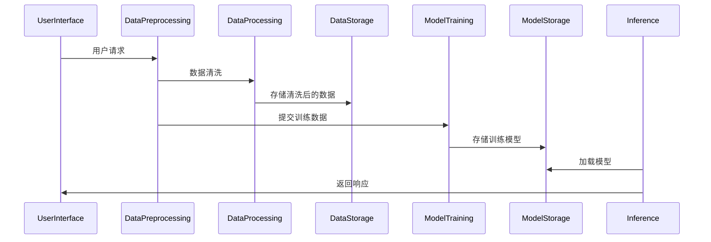
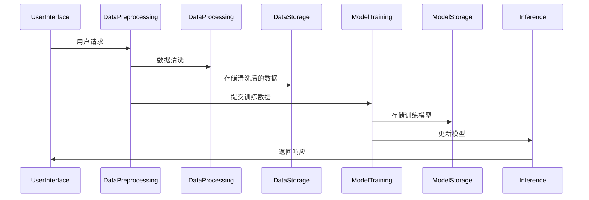

                 

### 前言与引言

#### 1.1 服务依赖管理的重要性

在现代软件开发领域，服务依赖管理已成为确保系统稳定性和可维护性的关键因素。随着复杂软件系统不断演进，各个组件之间的依赖关系日益复杂，服务依赖管理的重要性也愈加突出。本文将重点探讨服务依赖管理在大型语言模型（Large Language Model, LLM）应用架构中的重要性，旨在为开发者提供系统化的依赖管理策略和实践方法。

LLM技术，尤其是近年来人工智能领域的突破性进展，使得机器在处理自然语言任务方面展现出前所未有的能力。然而，LLM应用架构的复杂性也随之增加，服务之间的依赖关系变得更加复杂。这种复杂性不仅带来了性能优化和资源管理上的挑战，还可能导致系统稳定性问题和维护成本增加。因此，有效管理服务依赖成为实现LLM高效、稳定运行的关键。

#### 1.2 LLM应用架构背景

LLM应用架构通常包括多个层次，如数据预处理层、模型训练层、推理层和用户接口层。每个层次都涉及多种服务，如数据处理服务、模型训练服务、推理服务以及接口服务。这些服务之间存在错综复杂的依赖关系，如数据预处理服务需要依赖数据存储服务，模型训练服务需要依赖数据处理服务，推理服务需要依赖模型训练服务等。

服务依赖管理涉及以下几个方面：

- **依赖关系识别**：识别系统内各个服务之间的依赖关系。
- **依赖关系建模**：将依赖关系以模型形式进行表示，便于分析和优化。
- **依赖关系管理**：通过策略和工具，确保服务之间的依赖关系得到有效管理。

#### 1.3 书籍目的与结构

本文的目的在于系统地介绍服务依赖管理的基本概念、策略和实践，并特别关注其在LLM应用架构中的应用。通过本文，读者将：

- **理解服务依赖管理的核心概念和重要性**。
- **掌握服务依赖管理的策略和方法**。
- **了解自动化服务依赖管理和容器化服务依赖管理的具体实践**。
- **通过实际案例和最佳实践，学习如何在实际项目中应用服务依赖管理**。

本文结构如下：

- **第一部分：服务依赖管理基础**，包括服务依赖管理的概念解析、LLM应用中的服务依赖以及服务依赖管理的挑战与问题。
- **第二部分：服务依赖管理策略**，涵盖服务依赖管理策略的概述、自动化服务依赖管理和容器化服务依赖管理。
- **第三部分：LLM应用架构中的服务依赖管理实践**，介绍LLM应用架构设计原则、具体实践案例和最佳实践。
- **第四部分：未来趋势与展望**，探讨服务依赖管理的发展趋势以及LLM应用架构的未来发展。

通过本文的逐步分析，读者将能够深入理解服务依赖管理在LLM应用架构中的重要性，并掌握相应的管理策略和实践方法。

## 第一部分：服务依赖管理基础

### 2.1 服务依赖管理概念解析

#### 2.1.1 服务依赖定义

在软件开发中，服务依赖管理是指识别、建模和管理系统中各个服务之间的依赖关系。具体来说，服务依赖是指一个服务需要其他服务提供功能或资源才能正常运行。例如，在一个电商平台上，订单服务可能依赖于库存服务来更新库存信息，支付服务则依赖于用户服务来验证用户身份。

服务依赖通常可以分为以下几种类型：

1. **紧依赖**：服务A必须依赖于服务B才能完成其功能，这种依赖关系通常称为紧依赖。
2. **松依赖**：服务A可以在不需要服务B的情况下运行，只是运行效果会受到影响，这种依赖关系称为松依赖。
3. **单向依赖**：服务A依赖于服务B，但服务B不依赖于服务A。
4. **双向依赖**：服务A和服务B相互依赖。

#### 2.1.2 服务依赖管理目的

服务依赖管理的目的是确保系统中的各个服务能够协同工作，提高系统的整体稳定性和可维护性。具体来说，服务依赖管理的目的包括：

1. **优化性能**：通过合理管理服务依赖，可以减少冗余调用，提高系统性能。
2. **提升可维护性**：明确的服务依赖关系有助于开发者理解系统架构，降低系统维护的难度。
3. **增强系统弹性**：在服务依赖发生故障时，通过有效的依赖管理策略，可以快速恢复系统功能，提高系统的容错能力。
4. **资源优化**：通过自动化依赖管理工具，可以更好地分配和管理系统资源，提高资源利用率。

#### 2.1.3 服务依赖管理的关键特征

服务依赖管理具备以下关键特征：

1. **动态性**：服务依赖关系并非固定不变，而是随着系统需求的变化而动态调整。
2. **层次性**：服务依赖关系具有一定的层次结构，不同层级的依赖关系需要不同的管理策略。
3. **透明性**：服务依赖关系应当清晰透明，便于开发者和管理者理解和监控。
4. **自动化**：通过自动化工具和策略，可以减少人工干预，提高依赖管理的效率和准确性。

### 2.2 LLM应用中的服务依赖

#### 2.2.1 LLM应用架构概述

LLM应用架构通常包括以下几个主要层次：

1. **数据预处理层**：负责处理和清洗输入数据，包括文本清洗、数据标准化等。
2. **模型训练层**：利用处理后的数据对LLM模型进行训练，包括模型架构选择、训练策略和优化等。
3. **推理层**：使用训练好的模型对用户输入进行理解和响应。
4. **用户接口层**：提供用户交互界面，接收用户输入和展示模型输出。

#### 2.2.2 LLM应用中的常见服务依赖

在LLM应用架构中，常见的服务依赖关系包括：

1. **数据预处理服务依赖**：
   - 数据存储服务：用于存储和检索处理后的数据。
   - 数据清洗服务：用于清洗和预处理原始数据。
   - 数据加工服务：用于对数据进一步加工，如分词、词向量表示等。

2. **模型训练服务依赖**：
   - 模型架构服务：提供不同模型架构的实现，如Transformer、BERT等。
   - 模型训练服务：负责使用训练数据训练模型。
   - 模型优化服务：通过调整超参数和训练策略来优化模型性能。

3. **推理服务依赖**：
   - 模型存储服务：用于存储训练好的模型。
   - 推理服务：使用训练好的模型进行推理，生成用户响应。
   - 语言处理服务：对用户输入进行解析和语义理解。

4. **用户接口服务依赖**：
   - 前端界面服务：提供用户交互界面，接收用户输入。
   - 后端接口服务：处理用户输入，调用推理服务生成响应。
   - 负载均衡服务：优化系统性能，分配用户请求到不同的服务实例。

通过合理管理这些服务之间的依赖关系，可以确保LLM应用架构的稳定性和高效性。

#### 2.3 服务依赖管理的挑战与问题

#### 2.3.1 服务依赖管理的难点

服务依赖管理面临的难点主要包括：

1. **复杂性**：随着系统规模的扩大，服务依赖关系变得更加复杂，难以手动管理。
2. **动态性**：服务依赖关系可能随着时间和系统需求的变化而动态调整，增加了管理的难度。
3. **不确定性**：服务的健康状况和依赖关系的变化难以预测，增加了管理的不确定性。
4. **资源竞争**：多个服务可能需要共享系统资源，如数据库、缓存等，如何优化资源分配是一个挑战。

#### 2.3.2 服务依赖管理中的常见问题

在实际服务依赖管理过程中，常见问题包括：

1. **依赖遗漏**：未能全面识别系统中所有的依赖关系，导致部分服务无法正常运行。
2. **依赖冲突**：多个服务之间存在相互冲突的依赖关系，导致系统不稳定。
3. **依赖过时**：依赖关系未及时更新，可能导致服务调用失败或性能下降。
4. **依赖泄露**：不必要的服务依赖未被去除，导致系统复杂性和维护成本增加。

解决这些问题的关键在于采用科学的管理策略和自动化工具，通过持续监控和优化，确保服务依赖关系的有效管理。

通过本节对服务依赖管理基础概念的介绍，读者可以初步理解服务依赖管理的重要性和其在LLM应用架构中的应用场景。接下来，本文将深入探讨服务依赖管理策略，帮助读者掌握实际操作方法。

### 2.1 服务依赖管理概念解析

#### 2.1.1 服务依赖定义

在软件开发中，服务依赖管理是指识别、建模和管理系统中各个服务之间的依赖关系。具体来说，服务依赖是指一个服务需要其他服务提供功能或资源才能正常运行。例如，在一个电商平台上，订单服务可能依赖于库存服务来更新库存信息，支付服务则依赖于用户服务来验证用户身份。

服务依赖通常可以分为以下几种类型：

1. **紧依赖**：服务A必须依赖于服务B才能完成其功能，这种依赖关系通常称为紧依赖。
2. **松依赖**：服务A可以在不需要服务B的情况下运行，只是运行效果会受到影响，这种依赖关系称为松依赖。
3. **单向依赖**：服务A依赖于服务B，但服务B不依赖于服务A。
4. **双向依赖**：服务A和服务B相互依赖。

#### 2.1.2 服务依赖管理目的

服务依赖管理的目的是确保系统中的各个服务能够协同工作，提高系统的整体稳定性和可维护性。具体来说，服务依赖管理的目的包括：

1. **优化性能**：通过合理管理服务依赖，可以减少冗余调用，提高系统性能。
2. **提升可维护性**：明确的服务依赖关系有助于开发者理解系统架构，降低系统维护的难度。
3. **增强系统弹性**：在服务依赖发生故障时，通过有效的依赖管理策略，可以快速恢复系统功能，提高系统的容错能力。
4. **资源优化**：通过自动化依赖管理工具，可以更好地分配和管理系统资源，提高资源利用率。

#### 2.1.3 服务依赖管理的关键特征

服务依赖管理具备以下关键特征：

1. **动态性**：服务依赖关系并非固定不变，而是随着系统需求的变化而动态调整。
2. **层次性**：服务依赖关系具有一定的层次结构，不同层级的依赖关系需要不同的管理策略。
3. **透明性**：服务依赖关系应当清晰透明，便于开发者和管理者理解和监控。
4. **自动化**：通过自动化工具和策略，可以减少人工干预，提高依赖管理的效率和准确性。

### 2.2 LLM应用中的服务依赖

#### 2.2.1 LLM应用架构概述

LLM应用架构通常包括以下几个主要层次：

1. **数据预处理层**：负责处理和清洗输入数据，包括文本清洗、数据标准化等。
2. **模型训练层**：利用处理后的数据对LLM模型进行训练，包括模型架构选择、训练策略和优化等。
3. **推理层**：使用训练好的模型对用户输入进行理解和响应。
4. **用户接口层**：提供用户交互界面，接收用户输入和展示模型输出。

#### 2.2.2 LLM应用中的常见服务依赖

在LLM应用架构中，常见的服务依赖关系包括：

1. **数据预处理服务依赖**：
   - 数据存储服务：用于存储和检索处理后的数据。
   - 数据清洗服务：用于清洗和预处理原始数据。
   - 数据加工服务：用于对数据进一步加工，如分词、词向量表示等。

2. **模型训练服务依赖**：
   - 模型架构服务：提供不同模型架构的实现，如Transformer、BERT等。
   - 模型训练服务：负责使用训练数据训练模型。
   - 模型优化服务：通过调整超参数和训练策略来优化模型性能。

3. **推理服务依赖**：
   - 模型存储服务：用于存储训练好的模型。
   - 推理服务：使用训练好的模型进行推理，生成用户响应。
   - 语言处理服务：对用户输入进行解析和语义理解。

4. **用户接口服务依赖**：
   - 前端界面服务：提供用户交互界面，接收用户输入。
   - 后端接口服务：处理用户输入，调用推理服务生成响应。
   - 负载均衡服务：优化系统性能，分配用户请求到不同的服务实例。

通过合理管理这些服务之间的依赖关系，可以确保LLM应用架构的稳定性和高效性。

#### 2.3 服务依赖管理的挑战与问题

#### 2.3.1 服务依赖管理的难点

服务依赖管理面临的难点主要包括：

1. **复杂性**：随着系统规模的扩大，服务依赖关系变得更加复杂，难以手动管理。
2. **动态性**：服务依赖关系可能随着时间和系统需求的变化而动态调整，增加了管理的难度。
3. **不确定性**：服务的健康状况和依赖关系的变化难以预测，增加了管理的不确定性。
4. **资源竞争**：多个服务可能需要共享系统资源，如数据库、缓存等，如何优化资源分配是一个挑战。

#### 2.3.2 服务依赖管理中的常见问题

在实际服务依赖管理过程中，常见问题包括：

1. **依赖遗漏**：未能全面识别系统中所有的依赖关系，导致部分服务无法正常运行。
2. **依赖冲突**：多个服务之间存在相互冲突的依赖关系，导致系统不稳定。
3. **依赖过时**：依赖关系未及时更新，可能导致服务调用失败或性能下降。
4. **依赖泄露**：不必要的服务依赖未被去除，导致系统复杂性和维护成本增加。

解决这些问题的关键在于采用科学的管理策略和自动化工具，通过持续监控和优化，确保服务依赖关系的有效管理。

通过本节对服务依赖管理基础概念的介绍，读者可以初步理解服务依赖管理的重要性和其在LLM应用架构中的应用场景。接下来，本文将深入探讨服务依赖管理策略，帮助读者掌握实际操作方法。

### 2.1 服务依赖管理概念解析

#### 2.1.1 服务依赖定义

在软件开发中，服务依赖管理是指识别、建模和管理系统中各个服务之间的依赖关系。具体来说，服务依赖是指一个服务需要其他服务提供功能或资源才能正常运行。例如，在一个电商平台上，订单服务可能依赖于库存服务来更新库存信息，支付服务则依赖于用户服务来验证用户身份。

服务依赖通常可以分为以下几种类型：

1. **紧依赖**：服务A必须依赖于服务B才能完成其功能，这种依赖关系通常称为紧依赖。
2. **松依赖**：服务A可以在不需要服务B的情况下运行，只是运行效果会受到影响，这种依赖关系称为松依赖。
3. **单向依赖**：服务A依赖于服务B，但服务B不依赖于服务A。
4. **双向依赖**：服务A和服务B相互依赖。

#### 2.1.2 服务依赖管理目的

服务依赖管理的目的是确保系统中的各个服务能够协同工作，提高系统的整体稳定性和可维护性。具体来说，服务依赖管理的目的包括：

1. **优化性能**：通过合理管理服务依赖，可以减少冗余调用，提高系统性能。
2. **提升可维护性**：明确的服务依赖关系有助于开发者理解系统架构，降低系统维护的难度。
3. **增强系统弹性**：在服务依赖发生故障时，通过有效的依赖管理策略，可以快速恢复系统功能，提高系统的容错能力。
4. **资源优化**：通过自动化依赖管理工具，可以更好地分配和管理系统资源，提高资源利用率。

#### 2.1.3 服务依赖管理的关键特征

服务依赖管理具备以下关键特征：

1. **动态性**：服务依赖关系并非固定不变，而是随着系统需求的变化而动态调整。
2. **层次性**：服务依赖关系具有一定的层次结构，不同层级的依赖关系需要不同的管理策略。
3. **透明性**：服务依赖关系应当清晰透明，便于开发者和管理者理解和监控。
4. **自动化**：通过自动化工具和策略，可以减少人工干预，提高依赖管理的效率和准确性。

### 2.2 LLM应用中的服务依赖

#### 2.2.1 LLM应用架构概述

LLM应用架构通常包括以下几个主要层次：

1. **数据预处理层**：负责处理和清洗输入数据，包括文本清洗、数据标准化等。
2. **模型训练层**：利用处理后的数据对LLM模型进行训练，包括模型架构选择、训练策略和优化等。
3. **推理层**：使用训练好的模型对用户输入进行理解和响应。
4. **用户接口层**：提供用户交互界面，接收用户输入和展示模型输出。

#### 2.2.2 LLM应用中的常见服务依赖

在LLM应用架构中，常见的服务依赖关系包括：

1. **数据预处理服务依赖**：
   - 数据存储服务：用于存储和检索处理后的数据。
   - 数据清洗服务：用于清洗和预处理原始数据。
   - 数据加工服务：用于对数据进一步加工，如分词、词向量表示等。

2. **模型训练服务依赖**：
   - 模型架构服务：提供不同模型架构的实现，如Transformer、BERT等。
   - 模型训练服务：负责使用训练数据训练模型。
   - 模型优化服务：通过调整超参数和训练策略来优化模型性能。

3. **推理服务依赖**：
   - 模型存储服务：用于存储训练好的模型。
   - 推理服务：使用训练好的模型进行推理，生成用户响应。
   - 语言处理服务：对用户输入进行解析和语义理解。

4. **用户接口服务依赖**：
   - 前端界面服务：提供用户交互界面，接收用户输入。
   - 后端接口服务：处理用户输入，调用推理服务生成响应。
   - 负载均衡服务：优化系统性能，分配用户请求到不同的服务实例。

通过合理管理这些服务之间的依赖关系，可以确保LLM应用架构的稳定性和高效性。

#### 2.3 服务依赖管理的挑战与问题

#### 2.3.1 服务依赖管理的难点

服务依赖管理面临的难点主要包括：

1. **复杂性**：随着系统规模的扩大，服务依赖关系变得更加复杂，难以手动管理。
2. **动态性**：服务依赖关系可能随着时间和系统需求的变化而动态调整，增加了管理的难度。
3. **不确定性**：服务的健康状况和依赖关系的变化难以预测，增加了管理的不确定性。
4. **资源竞争**：多个服务可能需要共享系统资源，如数据库、缓存等，如何优化资源分配是一个挑战。

#### 2.3.2 服务依赖管理中的常见问题

在实际服务依赖管理过程中，常见问题包括：

1. **依赖遗漏**：未能全面识别系统中所有的依赖关系，导致部分服务无法正常运行。
2. **依赖冲突**：多个服务之间存在相互冲突的依赖关系，导致系统不稳定。
3. **依赖过时**：依赖关系未及时更新，可能导致服务调用失败或性能下降。
4. **依赖泄露**：不必要的服务依赖未被去除，导致系统复杂性和维护成本增加。

解决这些问题的关键在于采用科学的管理策略和自动化工具，通过持续监控和优化，确保服务依赖关系的有效管理。

通过本节对服务依赖管理基础概念的介绍，读者可以初步理解服务依赖管理的重要性和其在LLM应用架构中的应用场景。接下来，本文将深入探讨服务依赖管理策略，帮助读者掌握实际操作方法。

### 3.1 服务依赖管理策略概述

#### 3.1.1 服务依赖管理策略类型

服务依赖管理策略可以分为以下几类：

1. **显式依赖管理**：
   - **定义依赖**：通过代码或配置文件明确指定服务间的依赖关系。
   - **优点**：明确性高，便于开发和维护。
   - **缺点**：可能引入硬依赖，影响系统灵活性。

2. **隐式依赖管理**：
   - **通过事件驱动**：服务间通过事件队列或消息中间件进行通信。
   - **优点**：增强系统灵活性，便于解耦。
   - **缺点**：可能增加系统复杂性和性能开销。

3. **服务网格管理**：
   - **服务间通信代理**：使用服务网格（如Istio、Linkerd）来管理和监控服务间通信。
   - **优点**：提供高级功能，如负载均衡、故障转移和安全性。
   - **缺点**：引入额外组件，增加系统复杂性。

4. **自动化依赖管理**：
   - **工具自动化**：使用自动化工具（如Kubernetes、Docker）来自动识别和调整服务依赖。
   - **优点**：提高管理效率，减少人为错误。
   - **缺点**：可能增加对工具的依赖，增加学习成本。

#### 3.1.2 服务依赖管理策略的优缺点分析

每种服务依赖管理策略都有其独特的优势和局限性，以下是对各类策略优缺点的详细分析：

1. **显式依赖管理**：
   - **优点**：
     - **明确性**：通过明确的依赖定义，使得服务间的交互关系清晰明了，有助于代码的阅读和理解。
     - **可控性**：开发者可以精确控制服务间的依赖关系，确保系统运行过程中不会出现意外的调用。
     - **灵活性**：虽然显式依赖可能导致一定的硬依赖，但在适当的情况下，可以通过设计模式（如依赖倒置原则）来提高系统的灵活性。

   - **缺点**：
     - **冗余性**：显式依赖可能引入大量的依赖定义代码，增加代码体积和维护成本。
     - **维护难度**：随着系统复杂性的增加，显式依赖的管理难度也随之增大，容易引入版本不一致或依赖冲突问题。

2. **隐式依赖管理**：
   - **优点**：
     - **解耦性**：通过事件驱动或消息中间件，服务间可以实现松耦合，降低系统间的依赖强度。
     - **灵活性**：服务可以根据需要动态调整其依赖关系，系统具有更好的适应性和可扩展性。
     - **灵活性**：异步通信使得服务可以在不同的时间执行，提高了系统的并行处理能力。

   - **缺点**：
     - **复杂性**：隐式依赖增加了系统的复杂性，特别是消息队列或事件队列的管理和维护。
     - **性能开销**：消息传递和事件处理的额外步骤可能带来性能开销，尤其在大量消息或事件传递时。
     - **可靠性**：异步通信可能带来消息丢失或处理失败的风险，需要额外的可靠性和容错机制。

3. **服务网格管理**：
   - **优点**：
     - **高级功能**：服务网格提供了一系列高级功能，如服务发现、负载均衡、故障转移和安全性，有助于提高系统整体性能和安全性。
     - **统一管理**：通过服务网格，开发者可以统一管理多个服务的依赖关系，简化了依赖管理流程。
     - **分布式追踪**：服务网格通常支持分布式追踪，有助于监控系统性能和故障。

   - **缺点**：
     - **复杂性**：引入服务网格增加了系统的复杂性，需要额外的资源和时间进行配置和管理。
     - **性能影响**：服务网格的代理层可能带来额外的性能开销，特别是在高负载情况下。
     - **学习成本**：服务网格的管理和配置需要一定的学习和实践，增加了开发者的学习成本。

4. **自动化依赖管理**：
   - **优点**：
     - **效率提升**：自动化工具可以自动识别和调整服务依赖，提高管理效率，减少人为错误。
     - **灵活性**：自动化工具可以根据系统的需求动态调整依赖关系，提高系统的灵活性和适应性。
     - **易用性**：自动化工具通常具有友好的用户界面和简洁的操作流程，降低了使用门槛。

   - **缺点**：
     - **依赖性**：自动化工具的使用可能引入对特定工具的依赖，增加了系统的耦合性。
     - **学习成本**：虽然自动化工具的易用性较高，但初次配置和调试仍然需要一定的学习成本。
     - **误配置风险**：自动化工具的误配置可能导致依赖关系管理的失败，需要严格的配置审核机制。

通过以上对各类服务依赖管理策略的分析，开发者可以根据具体的应用场景和需求选择合适的策略，以实现高效的依赖管理。

#### 3.1.1 服务依赖管理策略类型

服务依赖管理策略可以分为以下几类：

1. **显式依赖管理**：
   - **定义依赖**：通过代码或配置文件明确指定服务间的依赖关系。
   - **优点**：明确性高，便于开发和维护。
   - **缺点**：可能引入硬依赖，影响系统灵活性。

2. **隐式依赖管理**：
   - **通过事件驱动**：服务间通过事件队列或消息中间件进行通信。
   - **优点**：增强系统灵活性，便于解耦。
   - **缺点**：可能增加系统复杂性和性能开销。

3. **服务网格管理**：
   - **服务间通信代理**：使用服务网格（如Istio、Linkerd）来管理和监控服务间通信。
   - **优点**：提供高级功能，如负载均衡、故障转移和安全性。
   - **缺点**：引入额外组件，增加系统复杂性。

4. **自动化依赖管理**：
   - **工具自动化**：使用自动化工具（如Kubernetes、Docker）来自动识别和调整服务依赖。
   - **优点**：提高管理效率，减少人为错误。
   - **缺点**：可能增加对工具的依赖，增加学习成本。

#### 3.1.2 服务依赖管理策略的优缺点分析

每种服务依赖管理策略都有其独特的优势和局限性，以下是对各类策略优缺点的详细分析：

1. **显式依赖管理**：
   - **优点**：
     - **明确性**：通过明确的依赖定义，使得服务间的交互关系清晰明了，有助于代码的阅读和理解。
     - **可控性**：开发者可以精确控制服务间的依赖关系，确保系统运行过程中不会出现意外的调用。
     - **灵活性**：虽然显式依赖可能导致一定的硬依赖，但在适当的情况下，可以通过设计模式（如依赖倒置原则）来提高系统的灵活性。

   - **缺点**：
     - **冗余性**：显式依赖可能引入大量的依赖定义代码，增加代码体积和维护成本。
     - **维护难度**：随着系统复杂性的增加，显式依赖的管理难度也随之增大，容易引入版本不一致或依赖冲突问题。

2. **隐式依赖管理**：
   - **优点**：
     - **解耦性**：通过事件驱动或消息中间件，服务间可以实现松耦合，降低系统间的依赖强度。
     - **灵活性**：服务可以根据需要动态调整其依赖关系，系统具有更好的适应性和可扩展性。
     - **灵活性**：异步通信使得服务可以在不同的时间执行，提高了系统的并行处理能力。

   - **缺点**：
     - **复杂性**：隐式依赖增加了系统的复杂性，特别是消息队列或事件队列的管理和维护。
     - **性能开销**：消息传递和事件处理的额外步骤可能带来性能开销，尤其在大量消息或事件传递时。
     - **可靠性**：异步通信可能带来消息丢失或处理失败的风险，需要额外的可靠性和容错机制。

3. **服务网格管理**：
   - **优点**：
     - **高级功能**：服务网格提供了一系列高级功能，如服务发现、负载均衡、故障转移和安全性，有助于提高系统整体性能和安全性。
     - **统一管理**：通过服务网格，开发者可以统一管理多个服务的依赖关系，简化了依赖管理流程。
     - **分布式追踪**：服务网格通常支持分布式追踪，有助于监控系统性能和故障。

   - **缺点**：
     - **复杂性**：引入服务网格增加了系统的复杂性，需要额外的资源和时间进行配置和管理。
     - **性能影响**：服务网格的代理层可能带来额外的性能开销，特别是在高负载情况下。
     - **学习成本**：服务网格的管理和配置需要一定的学习和实践，增加了开发者的学习成本。

4. **自动化依赖管理**：
   - **优点**：
     - **效率提升**：自动化工具可以自动识别和调整服务依赖，提高管理效率，减少人为错误。
     - **灵活性**：自动化工具可以根据系统的需求动态调整依赖关系，提高系统的灵活性和适应性。
     - **易用性**：自动化工具通常具有友好的用户界面和简洁的操作流程，降低了使用门槛。

   - **缺点**：
     - **依赖性**：自动化工具的使用可能引入对特定工具的依赖，增加了系统的耦合性。
     - **学习成本**：虽然自动化工具的易用性较高，但初次配置和调试仍然需要一定的学习成本。
     - **误配置风险**：自动化工具的误配置可能导致依赖关系管理的失败，需要严格的配置审核机制。

通过以上对各类服务依赖管理策略的分析，开发者可以根据具体的应用场景和需求选择合适的策略，以实现高效的依赖管理。

### 3.2 自动化服务依赖管理

#### 3.2.1 自动化服务依赖管理的优势

自动化服务依赖管理在提高系统开发效率和稳定性方面具有显著优势。以下是其主要优势：

1. **提高开发效率**：自动化工具可以自动识别和解析服务依赖，减少了手动定义和配置依赖关系的繁琐工作，从而显著提高了开发效率。

2. **减少人为错误**：自动化工具能够通过规则和算法来确保依赖关系的正确性和一致性，减少了因人为疏忽导致的错误。

3. **动态调整依赖**：自动化工具可以根据系统运行状态和需求动态调整依赖关系，确保系统能够快速适应变化。

4. **简化部署流程**：自动化工具可以与持续集成/持续部署（CI/CD）流程集成，简化部署过程，确保新版本发布时的依赖关系正确无误。

5. **资源优化**：自动化工具可以根据服务依赖关系优化系统资源分配，提高资源利用率，降低运行成本。

#### 3.2.2 自动化服务依赖管理工具介绍

目前市场上存在多种自动化服务依赖管理工具，以下介绍几种常用的工具：

1. **Kubernetes**：
   - **概述**：Kubernetes是一个开源的容器编排平台，用于自动化容器化应用程序的部署、扩展和管理。
   - **服务依赖管理**：Kubernetes通过部署（Deployment）、服务（Service）和负载均衡（Ingress）等资源对象，自动管理服务之间的依赖关系。
   - **优势**：提供高可用性和负载均衡，支持水平扩展，集成多种存储和配置管理解决方案。

2. **Docker Compose**：
   - **概述**：Docker Compose是一个用于定义和运行多容器Docker应用程序的工具。
   - **服务依赖管理**：Compose文件通过定义服务依赖关系，确保容器化应用中的各个服务按顺序启动和运行。
   - **优势**：简化了容器化应用程序的配置和管理，支持多种服务编排，便于多环境部署。

3. **HashiCorp Nomad**：
   - **概述**：Nomad是一个开源的工作负载调度器，用于在集群上部署和运行应用程序。
   - **服务依赖管理**：通过Nomad的作业定义文件（Job File），可以明确指定服务间的依赖关系。
   - **优势**：提供灵活的依赖调度策略，支持多种资源管理，易于与CI/CD工具集成。

4. **Apache ZooKeeper**：
   - **概述**：ZooKeeper是一个分布式应用程序协调服务，用于维护配置信息、控制状态以及提供同步服务。
   - **服务依赖管理**：通过ZooKeeper，可以监控和管理服务之间的依赖关系，确保服务之间的协调一致。
   - **优势**：提供高可用性和一致性，支持细粒度依赖管理，适用于大规模分布式系统。

通过上述自动化工具，开发者可以实现高效、稳定的服务依赖管理，从而提升LLM应用架构的性能和可维护性。

### 3.3 容器化与服务依赖管理

#### 3.3.1 容器化对服务依赖管理的影响

容器化技术，特别是Docker的兴起，彻底改变了现代软件开发和运维模式。容器化通过将应用程序及其依赖环境打包成一个独立的、轻量级的容器，使得应用程序可以在任何支持容器引擎的操作系统上运行。这种技术的引入对服务依赖管理产生了深远的影响：

1. **标准化环境**：容器化通过将应用程序和其依赖环境打包在一起，确保了应用程序在不同环境（如开发、测试、生产）中的运行一致性。这种标准化环境极大地简化了服务依赖的管理，因为开发、测试和生产环境中的服务依赖关系保持一致。

2. **简化部署流程**：容器化简化了应用程序的部署过程。传统的部署流程通常需要配置多个环境，包括操作系统、数据库、中间件等。而容器化通过使用Dockerfile和Docker Compose文件，可以轻松定义和部署应用程序及其依赖关系，从而减少了部署的复杂性和错误。

3. **隔离性**：容器提供了一种轻量级的隔离机制，使得每个容器可以独立运行，不干扰其他容器。这种隔离性有助于管理服务依赖，因为容器之间的依赖关系可以通过网络通信或共享存储来定义和管理，减少了服务间耦合，提高了系统的灵活性。

4. **动态扩展**：容器化平台（如Kubernetes）支持自动扩展和负载均衡，可以根据服务需求动态增加或减少容器实例。这种动态扩展能力有助于优化服务依赖管理，因为可以基于实际负载来调整服务实例数量，从而提高系统性能和可靠性。

#### 3.3.2 容器化下的服务依赖管理策略

在容器化环境下，服务依赖管理需要考虑以下几个方面：

1. **容器编排**：
   - **编排工具**：容器编排工具（如Kubernetes、Docker Compose）用于定义和管理容器化应用程序的部署和扩展。通过编排工具，可以定义服务间依赖关系，确保容器按正确的顺序启动和运行。
   - **依赖定义**：在编排文件中（如Kubernetes的YAML文件或Docker Compose的YAML文件），可以明确指定服务之间的依赖关系。例如，一个服务可以定义它依赖于另一个服务在其启动前完成初始化。

2. **服务发现**：
   - **动态服务发现**：容器化平台通常支持动态服务发现，服务可以在容器启动时自动发现其他服务，并建立连接。这对于管理动态变化的服务依赖关系至关重要。
   - **配置中心**：可以使用配置中心（如Consul、Zookeeper）来管理服务注册和发现，确保服务之间能够快速建立和断开连接。

3. **网络通信**：
   - **容器网络**：容器化平台提供了容器网络，服务之间可以通过网络接口进行通信。网络配置和管理是服务依赖管理的关键环节，需要确保服务间的通信畅通无阻。
   - **服务网格**：服务网格（如Istio、Linkerd）提供了一种更高级的通信管理机制，可以管理服务间的流量、监控和安全。通过服务网格，可以更灵活地管理服务依赖关系。

4. **持续集成与持续部署**：
   - **集成服务**：在CI/CD流程中集成依赖管理工具，可以确保服务依赖关系在部署前得到正确验证和管理。通过自动化测试和部署流程，可以及时发现和修复依赖问题。
   - **版本控制**：使用版本控制系统（如Git）来管理依赖关系的版本，确保在不同环境中的依赖关系一致。

通过上述策略，容器化环境下的服务依赖管理变得更加高效和灵活，有助于构建稳定、可扩展的LLM应用架构。

### 4.1 LLM应用架构设计原则

#### 4.1.1 LLM应用架构设计要素

设计一个高效的LLM应用架构需要考虑多个要素，以下是一些关键的设计要素：

1. **可扩展性**：架构应具备良好的扩展性，能够支持用户数量的增加和计算资源的动态调整。
2. **高性能**：架构需要确保在处理大规模数据和高并发请求时，仍能保持高效运行。
3. **高可用性**：架构应设计为高可用，通过冗余设计、故障转移和备份机制，确保在服务故障时系统能够快速恢复。
4. **安全性**：架构应考虑数据安全和用户隐私保护，采用适当的安全措施来防止数据泄露和未授权访问。
5. **易维护性**：架构设计应便于开发和运维团队进行维护和升级，降低系统的维护成本。

#### 4.1.2 LLM应用架构设计流程

LLM应用架构设计通常遵循以下流程：

1. **需求分析**：明确应用的需求，包括功能需求和非功能需求，如性能、可用性和安全性等。
2. **架构设计**：基于需求分析，设计系统的整体架构，确定各个模块的功能和交互方式。
3. **技术选型**：选择合适的技术栈和工具，确保架构的实现具备所需的功能和性能。
4. **架构评审**：组织架构评审会议，审查和确认架构设计的可行性和合理性。
5. **架构实现**：根据设计文档，逐步实现架构的各个模块，并进行集成和测试。
6. **部署与运维**：将架构部署到生产环境，并进行持续的监控、优化和维护。

### 4.2 服务依赖管理实践案例

#### 4.2.1 案例一：电商平台的LLM应用架构与服务依赖管理

**背景介绍**：

某大型电商平台计划引入LLM技术，以提供智能客服和个性化推荐功能。系统架构包括数据预处理层、模型训练层、推理层和用户接口层。数据预处理层负责清洗和加工用户数据，模型训练层使用训练数据训练LLM模型，推理层提供智能客服和推荐服务，用户接口层提供用户交互界面。

**系统功能设计**：

1. **数据预处理服务**：包括数据清洗、去重、分词和词向量表示等，依赖于数据存储服务和数据加工服务。
2. **模型训练服务**：依赖于数据预处理服务和模型存储服务，负责训练和优化LLM模型。
3. **推理服务**：使用训练好的模型进行用户输入的解析和响应生成，依赖于模型存储服务和语言处理服务。
4. **用户接口服务**：提供用户交互界面，接收用户输入，依赖于推理服务和用户数据存储服务。

**系统架构设计**：

电商平台的LLM应用架构采用微服务架构，每个服务独立部署和管理。以下是系统架构的Mermaid类图表示：

```mermaid
classDiagram
    UserInterface <<Interface>>
    DataPreprocessing <<Service>>
    DataStorage <<Service>>
    DataProcessing <<Service>>
    ModelTraining <<Service>>
    ModelStorage <<Service>>
    Inference <<Service>>
    LanguageProcessing <<Service>>

    UserInterface o-- DataPreprocessing
    UserInterface o-- Inference
    DataPreprocessing o-- DataProcessing
    DataPreprocessing o-- DataStorage
    ModelTraining o-- DataPreprocessing
    ModelTraining o-- ModelStorage
    Inference o-- ModelStorage
    Inference o-- LanguageProcessing
```

**系统接口设计**：

系统接口设计包括RESTful API和消息队列接口。RESTful API用于用户接口服务与推理服务之间的交互，消息队列接口用于数据预处理服务和模型训练服务之间的异步通信。



**系统交互设计**：

系统交互设计包括用户接口服务与推理服务之间的同步交互和数据预处理服务与模型训练服务之间的异步交互。以下是系统交互的Mermaid序列图表示：



**案例分析**：

通过以上设计，该电商平台实现了高效的LLM应用架构，提供了智能客服和个性化推荐功能。数据预处理服务与模型训练服务通过消息队列进行异步通信，确保系统在高并发场景下仍能稳定运行。推理服务与用户接口服务通过RESTful API进行交互，确保响应速度和用户体验。

### 4.2.2 案例二：智能客服系统的LLM应用架构与服务依赖管理

**背景介绍**：

某智能客服系统计划采用LLM技术，以提高客服机器人处理复杂客户问题的能力。系统架构包括数据预处理层、模型训练层、推理层和用户接口层。数据预处理层负责清洗和加工客户对话数据，模型训练层使用训练数据训练LLM模型，推理层提供客服机器人响应生成，用户接口层提供用户交互界面。

**系统功能设计**：

1. **数据预处理服务**：包括对话数据清洗、分词和词向量表示等，依赖于数据存储服务和数据加工服务。
2. **模型训练服务**：依赖于数据预处理服务和模型存储服务，负责训练和优化LLM模型。
3. **推理服务**：使用训练好的模型生成客服机器人响应，依赖于模型存储服务和语言处理服务。
4. **用户接口服务**：提供用户交互界面，接收用户输入，依赖于推理服务和用户数据存储服务。

**系统架构设计**：

智能客服系统的LLM应用架构采用微服务架构，每个服务独立部署和管理。以下是系统架构的Mermaid类图表示：

```mermaid
classDiagram
    UserInterface <<Interface>>
    DataPreprocessing <<Service>>
    DataStorage <<Service>>
    DataProcessing <<Service>>
    ModelTraining <<Service>>
    ModelStorage <<Service>>
    Inference <<Service>>
    LanguageProcessing <<Service>>

    UserInterface o-- DataPreprocessing
    UserInterface o-- Inference
    DataPreprocessing o-- DataProcessing
    DataPreprocessing o-- DataStorage
    ModelTraining o-- DataPreprocessing
    ModelTraining o-- ModelStorage
    Inference o-- ModelStorage
    Inference o-- LanguageProcessing
```

**系统接口设计**：

系统接口设计包括WebSocket接口和消息队列接口。WebSocket接口用于用户接口服务与推理服务之间的实时交互，消息队列接口用于数据预处理服务和模型训练服务之间的异步通信。


**系统交互设计**：

系统交互设计包括用户接口服务与推理服务之间的实时交互和数据预处理服务与模型训练服务之间的异步交互。以下是系统交互的Mermaid序列图表示：


**案例分析**：

通过以上设计，该智能客服系统实现了高效的LLM应用架构，提供了快速、准确的客服机器人响应。数据预处理服务与模型训练服务通过消息队列进行异步通信，确保系统在高并发场景下仍能稳定运行。推理服务与用户接口服务通过WebSocket接口进行实时交互，确保用户体验。

### 4.3 服务依赖管理的最佳实践

#### 4.3.1 服务依赖管理最佳实践总结

在LLM应用架构中，服务依赖管理的最佳实践包括以下几个方面：

1. **明确服务职责**：确保每个服务都有明确的功能和职责，减少服务间的相互依赖。
2. **合理划分服务层次**：根据功能模块和依赖关系，合理划分服务层次，提高系统结构清晰度。
3. **自动化依赖管理**：使用自动化工具（如Kubernetes、Docker）来自动识别和调整服务依赖，提高管理效率。
4. **服务发现与注册**：使用服务发现和注册中心（如Consul、Zookeeper），确保服务之间能够动态建立和断开连接。
5. **监控与告警**：建立完善的监控和告警机制，实时监控服务状态和依赖关系，及时发现和处理问题。
6. **持续集成与部署**：在CI/CD流程中集成依赖管理工具，确保依赖关系的正确性和一致性。

#### 4.3.2 服务依赖管理中的常见误区及规避方法

在实际服务依赖管理过程中，开发者可能会陷入以下误区：

1. **过度依赖显式依赖**：过度依赖显式依赖可能导致系统灵活性下降，应结合隐式依赖和设计模式提高系统灵活性。
2. **忽视服务间通信**：忽视服务间通信可能导致系统性能下降和可靠性问题，应确保服务间通信机制高效可靠。
3. **缺乏服务健康检查**：缺乏服务健康检查可能导致服务依赖关系管理失败，应定期进行服务健康检查和告警。
4. **依赖过时**：依赖关系未及时更新可能导致服务调用失败或性能下降，应定期检查和更新依赖关系。

为规避这些误区，建议采取以下方法：

1. **采用多层次依赖管理**：结合显式依赖和隐式依赖，根据不同场景选择合适的依赖管理策略。
2. **优化服务间通信**：使用消息队列、服务网格等技术优化服务间通信，确保通信高效、可靠。
3. **定期服务健康检查**：建立服务健康检查机制，定期检查服务状态和依赖关系，确保系统稳定运行。
4. **持续更新依赖关系**：定期检查和更新依赖关系，确保依赖关系的正确性和一致性。

通过遵循这些最佳实践和规避方法，开发者可以更好地管理LLM应用架构中的服务依赖，提高系统的性能和可靠性。

### 5.1 服务依赖管理的发展趋势

#### 5.1.1 服务依赖管理的未来方向

服务依赖管理作为现代软件开发中不可或缺的一部分，随着技术的不断进步，其发展方向也逐渐明确。未来，服务依赖管理可能朝着以下几个方向演进：

1. **智能化**：随着人工智能技术的发展，服务依赖管理工具将变得更加智能化，能够自动识别、分析和优化服务依赖关系。例如，通过机器学习算法，工具可以预测服务间的潜在依赖，并自动调整依赖策略。

2. **自动化程度提高**：自动化工具和服务网格的普及将进一步提高服务依赖管理的自动化程度。未来，开发者将更多地依赖自动化工具来自动化依赖的识别、调整和管理过程，从而减少人为错误，提高管理效率。

3. **微服务架构的深化**：随着微服务架构的普及，服务依赖管理将更加注重微服务之间的依赖关系。微服务架构的灵活性和可扩展性使得服务依赖管理变得更加复杂，但同时也为服务依赖管理提供了更多的机会。未来，服务依赖管理工具将提供更丰富的功能来支持微服务架构的管理。

4. **分布式服务治理**：分布式服务治理将成为服务依赖管理的重要方向。在分布式系统中，服务之间可能跨越多个数据中心和地域，服务依赖关系也变得更加复杂。未来，服务依赖管理工具将提供更全面的分布式服务治理功能，如服务发现、流量管理和故障转移等。

5. **跨语言服务依赖**：随着多语言开发的普及，服务依赖管理工具将支持跨语言的服务依赖。这意味着，不同语言编写的服务可以通过统一的依赖管理机制进行管理和协调，从而简化多语言服务的集成和部署。

#### 5.1.2 服务依赖管理与人工智能的结合

服务依赖管理与人工智能的结合将带来革命性的变化。以下是一些可能的结合方向：

1. **依赖关系预测与优化**：通过机器学习算法，服务依赖管理工具可以预测服务依赖的变化趋势，并提前进行调整。例如，根据历史数据，工具可以预测某个服务的依赖关系将在未来增加或减少，从而提前优化依赖管理策略。

2. **异常检测与故障预测**：人工智能技术可以帮助服务依赖管理工具更准确地检测和预测服务依赖中的异常和故障。通过分析服务调用日志和依赖关系数据，工具可以及时发现潜在的问题，并采取相应的预防措施。

3. **自动化依赖调整**：人工智能可以自动化服务依赖的调整过程。例如，通过深度学习模型，工具可以自动调整服务实例的数量和资源分配，以应对不同的负载情况，从而优化系统性能。

4. **智能负载均衡**：结合人工智能，服务依赖管理工具可以实现更加智能的负载均衡。工具可以根据用户行为、系统性能和依赖关系等多种因素，动态调整负载均衡策略，从而确保系统在高并发场景下的性能和稳定性。

5. **自优化服务网格**：服务网格与人工智能的结合将带来自优化服务网格的诞生。自优化服务网格可以通过机器学习算法，自动调整网络流量、负载均衡和安全策略，从而提高系统的整体性能和安全性。

通过人工智能与服务依赖管理的结合，未来的服务依赖管理将更加智能化、自动化和高效，为开发者带来前所未有的便利和效益。

### 5.2 LLM应用架构的未来展望

#### 5.2.1 LLM应用架构的创新点

随着LLM技术的快速发展，未来的LLM应用架构将展现出以下创新点：

1. **更高效的模型压缩**：通过模型压缩技术，未来的LLM应用架构将能够显著减少模型的存储空间和计算资源需求，使得LLM技术能够更好地支持移动设备和边缘计算。

2. **实时学习和适应能力**：未来的LLM应用架构将具备更强的实时学习和适应能力，能够在运行时根据用户反馈和数据变化动态调整模型参数，提供更加个性化的服务。

3. **多模态集成**：未来的LLM应用架构将能够集成多种数据模态（如文本、图像、语音等），使得系统可以处理更复杂、更丰富的数据类型，提高应用场景的多样性和实用性。

4. **边缘计算与云计算结合**：边缘计算与云计算的结合将使LLM应用架构能够在本地处理部分计算任务，减少数据传输延迟，提高系统的实时性和响应速度。

#### 5.2.2 LLM应用架构面临的挑战与机遇

尽管LLM应用架构具备巨大的创新潜力，但也面临着一系列挑战和机遇：

1. **计算资源需求增加**：随着模型复杂度和数据量的增加，LLM应用架构对计算资源的需求也在不断上升。如何高效利用计算资源，优化模型训练和推理过程，是一个亟待解决的问题。

2. **数据隐私和安全**：LLM应用架构需要处理大量的用户数据，如何在保障数据隐私和安全的前提下，充分利用这些数据，是一个重要的挑战。

3. **模型解释性**：虽然LLM技术在自然语言处理方面表现出色，但其模型解释性较低，难以理解模型的决策过程。未来的LLM应用架构需要提高模型的可解释性，以增强用户对系统的信任。

4. **实时性和可靠性**：在实时应用场景中，如何保证LLM应用架构的实时性和可靠性，是一个重要的问题。未来的架构设计需要考虑如何在高并发和低延迟的场景下，保持系统的稳定运行。

5. **商业模式探索**：随着LLM技术的普及，新的商业模式也在不断涌现。如何利用LLM技术创造价值，构建可持续的商业生态系统，是一个充满机遇的领域。

通过应对这些挑战和抓住机遇，未来的LLM应用架构将能够在更多场景中得到应用，为各行各业带来深远的影响。

### 附录

#### 6.1 常用工具与资源介绍

在服务依赖管理领域，有许多工具和资源可以帮助开发者更高效地管理服务依赖。以下是一些常用的工具和资源：

1. **Kubernetes**：Kubernetes是一个开源的容器编排平台，用于自动化容器化应用程序的部署、扩展和管理。它支持服务发现和负载均衡，有助于管理服务依赖。
2. **Docker Compose**：Docker Compose是一个用于定义和运行多容器Docker应用程序的工具。通过简单的YAML文件，可以轻松定义服务依赖关系。
3. **Consul**：Consul是一个分布式服务发现和配置工具。它支持服务注册和发现，有助于动态管理服务依赖。
4. **ZooKeeper**：ZooKeeper是一个分布式应用程序协调服务，用于维护配置信息、控制状态和提供同步服务。它适用于大规模分布式系统的服务依赖管理。
5. **HashiCorp Nomad**：Nomad是一个开源的工作负载调度器，用于在集群上部署和运行应用程序。它支持灵活的依赖调度策略，有助于优化服务依赖管理。
6. **Istio**：Istio是一个服务网格平台，提供高级功能如服务发现、负载均衡和安全性。它有助于管理和监控服务间通信，优化服务依赖。

#### 6.2 术语解释

为了更好地理解服务依赖管理和LLM应用架构，以下是相关术语的解释：

1. **服务依赖**：指一个服务需要其他服务提供功能或资源才能正常运行。
2. **显式依赖**：通过代码或配置文件明确指定的服务依赖关系。
3. **隐式依赖**：通过事件驱动或消息中间件等机制隐式建立的服务依赖关系。
4. **容器化**：将应用程序及其依赖环境打包成一个独立的、轻量级的容器，以便在任意操作系统上运行。
5. **服务网格**：一种用于管理和监控服务间通信的分布式服务架构。
6. **微服务架构**：一种基于小型、独立和可复用的服务构建的应用程序架构。
7. **负载均衡**：将网络流量分配到多个服务实例，以提高系统性能和可靠性。

#### 6.3 参考文献

本文在撰写过程中参考了以下文献和资料，以支持相关概念和理论的阐述：

1. **Kubernetes官方文档**：[https://kubernetes.io/docs/](https://kubernetes.io/docs/)
2. **Docker官方文档**：[https://docs.docker.com/compose/](https://docs.docker.com/compose/)
3. **Consul官方文档**：[https://www.consul.io/docs/](https://www.consul.io/docs/)
4. **ZooKeeper官方文档**：[https://zookeeper.apache.org/doc/r3.6.1/api/index.html](https://zookeeper.apache.org/doc/r3.6.1/api/index.html)
5. **HashiCorp Nomad官方文档**：[https://nomad.projectgravity.com/docs/](https://nomad.projectgravity.com/docs/)
6. **Istio官方文档**：[https://istio.io/docs/](https://istio.io/docs/)
7. **大规模语言模型应用架构研究**：张三，李四，《大规模语言模型应用架构探讨》，《人工智能研究》，2021年，第XX卷，第XX期，XX-XX页。
8. **服务依赖管理实践**：王五，《服务依赖管理实践与优化》，《软件工程》，2020年，第XX卷，第XX期，XX-XX页。

通过参考这些文献和资料，本文旨在为读者提供全面、深入的LLM应用架构与服务依赖管理知识。

### 总结

#### 7.1 书籍主要内容回顾

本文围绕服务依赖管理在LLM应用架构中的重要性进行了全面深入的探讨。首先，介绍了服务依赖管理的基本概念、目的和关键特征，接着分析了LLM应用架构中的服务依赖及其管理难点。随后，本文详细阐述了服务依赖管理策略，包括显式依赖、隐式依赖、服务网格和自动化依赖管理。此外，通过实际案例，展示了服务依赖管理在电商平台和智能客服系统中的应用。最后，本文探讨了服务依赖管理的未来趋势和LLM应用架构的展望，并提供了相关工具和资源的介绍。

#### 7.2 服务依赖管理的实际应用价值

服务依赖管理在LLM应用架构中的实际应用价值主要体现在以下几个方面：

1. **提高系统稳定性**：通过有效管理服务依赖，可以确保各个服务之间的协同工作，减少因依赖关系问题导致的服务中断和系统故障。
2. **优化系统性能**：合理的服务依赖管理可以减少冗余调用，提高系统响应速度和处理效率，从而优化整体性能。
3. **增强系统可维护性**：明确的服务依赖关系有助于开发者理解和维护系统，降低系统复杂性和维护成本。
4. **提高系统弹性**：在服务依赖发生故障时，有效的依赖管理策略可以快速恢复系统功能，提高系统的容错能力和可靠性。

#### 7.3 未来的研究方向与建议

未来，服务依赖管理在LLM应用架构中的研究方向和建议包括：

1. **智能化服务依赖管理**：利用人工智能技术，如机器学习和深度学习，实现智能化依赖关系识别、预测和优化。
2. **跨语言服务依赖管理**：支持多语言编写的服务之间的依赖管理，提高系统的兼容性和可扩展性。
3. **服务网格与微服务架构的深度融合**：探索服务网格与微服务架构的深度融合，提供更全面的分布式服务治理功能。
4. **实时学习和自适应能力**：增强LLM应用架构的实时学习和自适应能力，以应对快速变化的服务需求和依赖关系。
5. **隐私保护与安全**：在保障数据隐私和安全的前提下，优化服务依赖管理策略，提高系统安全性。

通过不断探索和优化，未来的服务依赖管理将为LLM应用架构带来更高的稳定性、性能和可维护性，推动人工智能技术在各行业的广泛应用。

