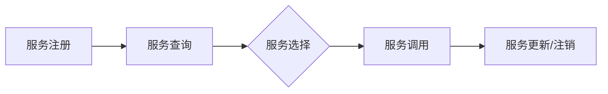
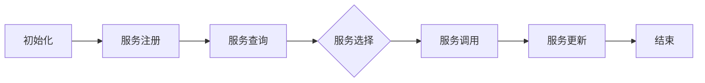
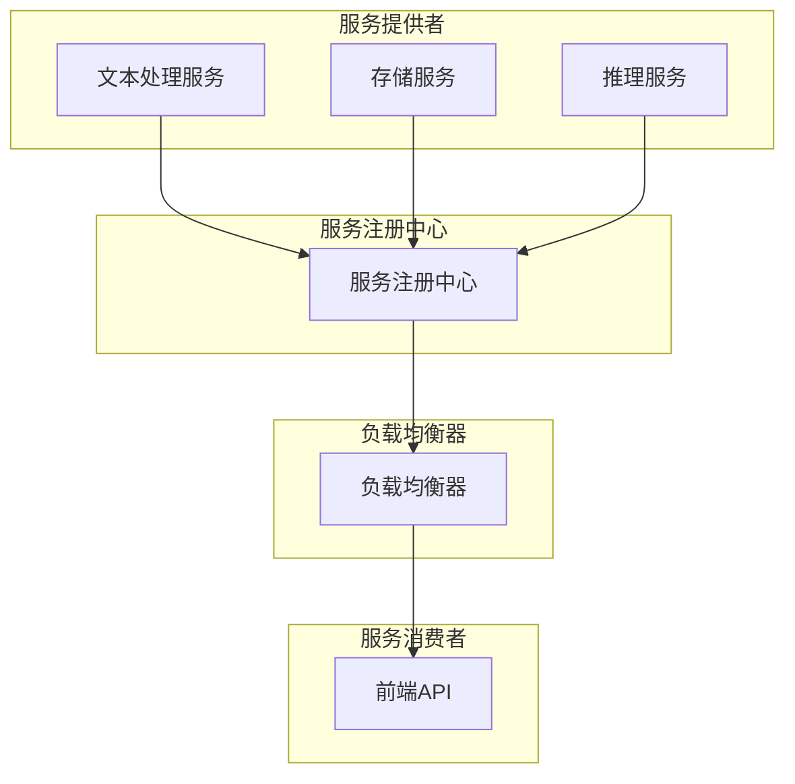
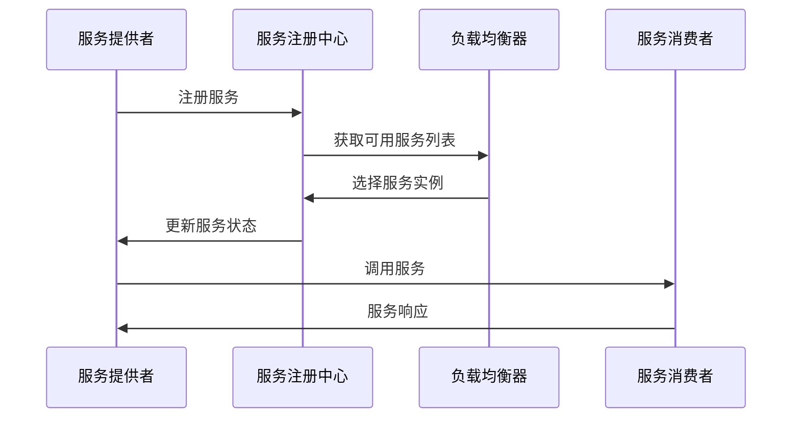

                 

### 《服务发现机制在动态LLM应用环境中的重要性》

> 关键词：服务发现、动态环境、LLM、算法、架构设计

> 摘要：本文深入探讨了服务发现机制在动态LLM（Large Language Model）应用环境中的重要性。随着人工智能技术的快速发展，大型语言模型的应用场景日益丰富，服务发现的效率和准确性成为系统性能的关键因素。本文首先介绍了服务发现的基本概念和机制，然后分析了服务发现机制在动态环境中的挑战和重要性，最后通过具体的算法原理、系统架构和项目实战，展示了服务发现机制在实际应用中的实现方法和效果。

### 目录大纲

# 《服务发现机制在动态LLM应用环境中的重要性》

## 第一部分：背景介绍

### 第1章：服务发现机制概述

#### 1.1 问题背景

- 服务发现的定义和重要性
- 动态LLM应用环境的特点和挑战

#### 1.2 问题描述

- 如何在动态环境中实现高效的服务发现？
- 动态LLM应用环境中服务发现的挑战

#### 1.3 问题解决

- 服务发现机制的原理和实现
- 动态LLM应用环境中的服务发现解决方案

#### 1.4 边界与外延

- 服务发现的边界定义
- 服务发现与其他技术的关联

#### 1.5 概念结构与核心要素组成

- 服务发现的核心概念
- 服务发现的要素组成

## 第二部分：核心概念与联系

### 第2章：核心概念与联系

#### 2.1 服务发现机制原理

- 服务发现的工作原理
- 服务发现的流程

#### 2.2 服务发现机制属性特征对比表格

- 服务发现机制的关键属性对比
- 服务发现机制的优缺点分析

#### 2.3 服务发现机制的ER实体关系图

- ER实体关系图架构
- ER实体关系图的详细说明

## 第三部分：算法原理讲解

### 第3章：服务发现算法原理讲解

#### 3.1 服务发现算法的mermaid流程图

- 服务发现算法的mermaid流程图展示
- 流程图的详细解释

#### 3.2 服务发现算法的Python源代码

- 服务发现算法的Python源代码
- 源代码的详细解释

#### 3.3 服务发现算法的数学模型和公式

- 服务发现算法的数学模型
- 服务发现算法的数学公式

#### 3.4 服务发现算法的举例说明

- 服务发现算法的实例说明
- 实例说明的详细解析

## 第四部分：系统分析与架构设计方案

### 第4章：系统分析与架构设计方案

#### 4.1 问题场景介绍

- 服务发现机制的应用场景
- 动态LLM应用环境的需求分析

#### 4.2 系统功能设计

- 领域模型的mermaid类图
- 系统功能设计的详细解释

#### 4.3 系统架构设计

- 系统架构设计的mermaid架构图
- 系统架构图的详细解释

#### 4.4 系统接口设计

- 系统接口设计
- 系统接口设计的详细解释

#### 4.5 系统交互

- 系统交互的mermaid序列图
- 系统交互的详细解释

## 第五部分：项目实战

### 第5章：项目实战

#### 5.1 环境安装

- 服务发现机制的环境安装
- 环境安装的详细步骤

#### 5.2 系统核心实现

- 系统核心实现的源代码
- 源代码的应用解读与分析

#### 5.3 实际案例分析

- 服务发现机制的实际案例分析
- 案例分析的详细讲解剖析

#### 5.4 项目小结

- 项目总结与经验分享
- 项目注意事项和最佳实践

## 第六部分：总结与拓展

### 第6章：总结与拓展

#### 6.1 小结

- 服务发现机制在动态LLM应用环境中的重要性
- 服务发现机制的发展趋势和未来展望

#### 6.2 注意事项

- 使用服务发现机制时的注意事项
- 动态LLM应用环境中的挑战与应对策略

#### 6.3 拓展阅读

- 相关领域的深入阅读推荐
- 服务发现机制的研究进展和最新成果

----------------------------------------------------------------

**注意：** 文章将遵循上述大纲结构，逐章深入讲解服务发现机制在动态LLM应用环境中的重要性，确保内容的逻辑清晰、结构紧凑，同时具备专业性和实用性。文章将使用markdown格式，确保可读性和可操作性。

----------------------------------------------------------------

### 第一部分：背景介绍

#### 1.1 问题背景

服务发现（Service Discovery）是一种自动发现和注册服务的技术，它允许分布式系统中的组件动态地查找和连接所需的服务，而无需手动配置或预先知道服务的位置。在传统的静态环境中，服务发现的应用相对有限，因为服务和服务端点通常是可以预测的，且系统规模相对较小。

然而，随着云计算、容器化和微服务架构的普及，动态环境中的服务发现变得至关重要。动态环境通常具有以下特点：

1. **服务动态性**：服务可以在运行时启动、停止、扩展或迁移。
2. **规模可扩展**：系统需要能够处理大量的服务实例。
3. **异构性**：服务可能运行在不同的物理或虚拟环境中。
4. **高可用性**：系统需要能够快速适应服务故障或变更。

在动态环境中，服务发现机制可以帮助应用程序自动定位可用服务，而无需依赖固定的服务地址。这对于大型语言模型（LLM）的应用尤为重要，因为LLM通常需要与其他服务（如数据存储、推理引擎等）进行交互，而这些服务的位置和数量可能频繁变化。

#### 1.2 问题描述

如何在动态环境中实现高效的服务发现？动态LLM应用环境中的服务发现面临以下挑战：

1. **动态性**：服务位置和数量的动态变化导致服务发现的实时性和准确性要求非常高。
2. **规模**：随着服务数量的增加，服务发现机制的效率和处理能力成为关键问题。
3. **异构性**：不同类型的服务需要不同的发现机制，这增加了系统的复杂度。
4. **可靠性**：服务发现机制必须能够可靠地追踪服务状态，并在服务不可用时快速提供替代方案。

#### 1.3 问题解决

服务发现机制的原理和实现可以分为以下几个关键步骤：

1. **服务注册**：服务启动时，向服务注册中心注册自身的相关信息，如服务名称、端点地址、健康状况等。
2. **服务查询**：应用程序在需要服务时，向服务注册中心查询可用服务。
3. **服务选择**：根据负载均衡策略和服务质量指标，选择合适的服务实例。
4. **服务调用**：应用程序通过选定的服务实例进行通信，执行业务逻辑。

在动态LLM应用环境中，常用的服务发现解决方案包括：

1. **基于DNS的服务发现**：通过DNS记录动态更新服务地址。
2. **基于服务注册中心的服务发现**：如Consul、Eureka、Zookeeper等，提供服务的注册、查询和管理。
3. **基于SDN（Software-Defined Networking）的服务发现**：利用SDN控制器动态管理网络资源和服务路由。

#### 1.4 边界与外延

服务发现的边界定义包括：

1. **服务范围**：服务发现机制的范围，包括服务注册中心、服务提供者和消费者等。
2. **通信协议**：服务发现过程中使用的协议，如HTTP、gRPC、DNS等。
3. **数据模型**：服务元数据的格式和结构，如服务名称、端点、健康状态等。

服务发现与其他技术的关联：

1. **容器编排**：与Kubernetes、Docker Swarm等容器编排系统集成，实现服务的自动化部署和管理。
2. **负载均衡**：与负载均衡器协同工作，优化服务访问性能。
3. **故障转移**：与集群管理器协同工作，实现服务的自动故障转移和恢复。

#### 1.5 概念结构与核心要素组成

服务发现的核心概念和要素组成包括：

1. **服务注册中心**：存储和管理服务元数据的中心。
2. **服务提供者**：提供服务的实体，负责服务的注册和更新。
3. **服务消费者**：需要使用服务的实体，负责查询和选择服务实例。
4. **服务元数据**：描述服务的详细信息，如服务名称、端点地址、健康状态等。

服务发现的要素组成：

1. **服务注册机制**：服务提供者如何注册服务的详细信息。
2. **服务查询机制**：服务消费者如何查询可用服务。
3. **服务选择机制**：根据策略选择合适的服务实例。
4. **服务调用机制**：消费者如何与服务实例进行通信。

---

在这一部分，我们概述了服务发现机制在动态LLM应用环境中的重要性，并分析了相关的背景、问题、解决方案以及边界与外延。在接下来的章节中，我们将进一步深入探讨服务发现的核心概念、算法原理、系统架构和实际应用，以帮助读者全面理解服务发现机制在动态环境中的关键作用。

---

### 第二部分：核心概念与联系

#### 2.1 服务发现机制原理

服务发现机制的核心工作原理是通过服务注册中心和服务提供者、消费者之间的交互，实现服务的自动发现和调用。以下是服务发现的基本流程：

1. **服务注册**：服务提供者在启动时向服务注册中心注册自身，提供服务的元数据，如服务名称、端点地址、健康状态等。服务注册中心负责存储和管理这些服务元数据。

2. **服务查询**：服务消费者在需要调用服务时，向服务注册中心查询可用服务。查询通常基于服务名称或其他过滤条件。

3. **服务选择**：服务消费者根据负载均衡策略和服务质量指标，从查询结果中选择一个或多个服务实例。

4. **服务调用**：消费者通过选定的服务实例进行通信，执行业务逻辑。服务调用可以是同步调用或异步调用，具体取决于服务的接口设计。

5. **服务更新和注销**：当服务提供者的状态发生变化时（如服务实例故障、地址变更等），它会更新服务注册中心的元数据。当服务停止时，它会注销自身，从服务注册中心中移除。

服务发现机制的流程可以简化为以下步骤：



#### 2.2 服务发现机制属性特征对比表格

以下是一个简单的服务发现机制属性特征对比表格，用于展示不同服务发现机制的关键属性和优缺点。

| 属性 | 服务发现机制1 | 服务发现机制2 | 服务发现机制3 |
| ---- | ------------- | ------------- | ------------- |
| 动态性 | 高 | 中 | 低 |
| 规模支持 | 大规模 | 中规模 | 小规模 |
| 可靠性 | 高 | 中 | 低 |
| 异构支持 | 强 | 中 | 弱 |
| 性能 | 高 | 中 | 低 |
| 易用性 | 中 | 高 | 中 |
| 成本 | 低 | 高 | 中 |

- **动态性**：指服务发现机制对服务动态变化的响应能力。
- **规模支持**：指服务发现机制能够支持的服务数量和规模。
- **可靠性**：指服务发现机制在服务变更、故障等情况下能够持续工作的能力。
- **异构支持**：指服务发现机制对不同类型服务支持的灵活性和扩展性。
- **性能**：指服务发现机制的响应速度和处理效率。
- **易用性**：指服务发现机制的易配置和使用性。
- **成本**：指服务发现机制的实施和维护成本。

#### 2.3 服务发现机制的ER实体关系图

为了更好地理解服务发现机制中的数据关系，我们可以使用实体关系图（Entity-Relationship Diagram，ER图）来表示服务发现系统中的实体及其关系。

以下是一个简单的ER图，展示了服务发现系统中的主要实体和关系：

```mermaid
erDiagram
    ServiceProvider ||--|{ ServiceInstance }
    ServiceConsumer ||--|{ ServiceRequest }
    ServiceRegistry ||--|{ ServiceMetadata }
    ServiceEndpoint ||--|{ ServiceInstance }
    ServiceEndpoint ||--|{ ServiceMetadata }
```

- **ServiceProvider**（服务提供者）：提供服务并注册到服务注册中心的实体。
- **ServiceInstance**（服务实例）：服务提供者的具体实例，具有唯一的标识和状态信息。
- **ServiceConsumer**（服务消费者）：需要调用服务的实体。
- **ServiceRequest**（服务请求）：服务消费者的调用请求。
- **ServiceRegistry**（服务注册中心）：存储和管理服务元数据的中心。
- **ServiceMetadata**（服务元数据）：描述服务的详细信息，如服务名称、端点地址、健康状态等。
- **ServiceEndpoint**（服务端点）：服务实例的访问端点，包括URL、端口等。

ER图的详细说明：

- **服务提供者**与**服务实例**之间存在“1对N”的关系，表示一个服务提供者可以创建多个服务实例。
- **服务消费者**与**服务请求**之间存在“1对1”的关系，表示每次服务调用对应一个服务请求。
- **服务注册中心**与**服务元数据**之间存在“1对N”的关系，表示服务注册中心可以存储多个服务元数据。
- **服务端点**与**服务实例**之间存在“1对1”的关系，表示每个服务实例有一个唯一的端点。
- **服务端点**与**服务元数据**之间存在“1对1”的关系，表示每个端点都关联一组服务元数据。

---

在这一部分，我们详细介绍了服务发现机制的基本原理，并通过属性特征对比表格和ER实体关系图，展示了不同服务发现机制的关键属性和数据关系。在接下来的章节中，我们将深入探讨服务发现算法的原理和实现，以帮助读者更全面地理解服务发现机制。

---

### 第三部分：算法原理讲解

#### 3.1 服务发现算法的mermaid流程图

为了更好地理解服务发现算法的工作流程，我们可以使用mermaid语言绘制一个流程图。以下是一个简单的服务发现算法流程图：



- **A[初始化]**：服务提供者在启动时初始化服务发现机制，准备进行服务注册。
- **B[服务注册]**：服务提供者将自身信息（如服务名称、端点地址等）注册到服务注册中心。
- **C[服务查询]**：服务消费者在调用服务前查询服务注册中心，获取可用服务的列表。
- **D[服务选择]**：服务消费者根据负载均衡策略和服务质量指标选择合适的服务实例。
- **E[服务调用]**：服务消费者通过选定的服务实例进行通信，执行业务逻辑。
- **F[服务更新]**：服务提供者定期更新自身的状态信息，确保服务注册中心的元数据是最新的。
- **G[结束]**：服务调用完成，流程结束。

#### 3.2 服务发现算法的Python源代码

以下是一个简化的Python服务发现算法实现，用于演示服务注册、查询、选择和调用的基本步骤：

```python
import random
import time
from service_registry import ServiceRegistry
from load_balancer import LoadBalancer

# 服务提供者
class ServiceProvider:
    def __init__(self, service_name, endpoint, health_check_url):
        self.service_name = service_name
        self.endpoint = endpoint
        self.health_check_url = health_check_url
        self.register_service()

    def register_service(self):
        service_registry.register_service({
            'name': self.service_name,
            'endpoint': self.endpoint,
            'health_check_url': self.health_check_url
        })

    def update_service(self):
        # 更新服务状态信息
        service_registry.update_service(self.service_name, {
            'health_check_url': self.health_check_url
        })

# 服务消费者
class ServiceConsumer:
    def __init__(self, service_name):
        self.service_name = service_name
        self.load_balancer = LoadBalancer()

    def find_service(self):
        services = service_registry.find_services(self.service_name)
        return self.load_balancer.select_service(services)

    def call_service(self, service_instance):
        # 调用服务实例
        print(f"Calling service: {service_instance['endpoint']}")
        time.sleep(random.uniform(0.5, 1.5))  # 模拟服务调用延迟
        print("Service call completed.")

# 服务注册中心
class ServiceRegistry:
    services = {}

    @staticmethod
    def register_service(service_info):
        ServiceRegistry.services[service_info['name']] = service_info

    @staticmethod
    def update_service(service_name, service_info):
        ServiceRegistry.services[service_name].update(service_info)

    @staticmethod
    def find_services(service_name):
        return [service for service in ServiceRegistry.services.values() if service['name'] == service_name]

# 负载均衡器
class LoadBalancer:
    def __init__(self):
        self.weights = {}

    def select_service(self, services):
        # 根据权重选择服务实例
        total_weight = sum(self.weights[service['endpoint']] for service in services)
        rand = random.uniform(0, total_weight)
        current = 0
        for service in services:
            current += self.weights[service['endpoint']]
            if current >= rand:
                return service
        return None

# 初始化服务提供者
provider = ServiceProvider("weather_api", "http://weather.example.com", "http://weather.example.com/health")

# 初始化服务消费者
consumer = ServiceConsumer("weather_api")

# 模拟服务调用
service_instance = consumer.find_service()
consumer.call_service(service_instance)
```

在此代码中，我们定义了服务提供者、服务消费者、服务注册中心和负载均衡器四个类。服务提供者负责注册和更新服务信息，服务消费者负责查询、选择和调用服务实例。服务注册中心用于存储和管理服务元数据，负载均衡器根据服务实例的权重进行服务选择。

#### 3.3 服务发现算法的数学模型和公式

服务发现算法的核心在于如何根据服务实例的属性（如响应时间、负载、健康状况等）进行合理的负载均衡和服务选择。以下是几个关键的数学模型和公式：

1. **期望响应时间模型**：

   $$ E[RT] = \frac{\sum_{i=1}^{n} (1 - p_i) \cdot t_i}{n} $$

   其中，$E[RT]$是期望响应时间，$p_i$是第$i$个服务实例的健康概率，$t_i$是第$i$个服务实例的响应时间。

2. **权重负载均衡模型**：

   $$ w_i = \frac{C_i}{\sum_{j=1}^{n} C_j} $$

   其中，$w_i$是第$i$个服务实例的权重，$C_i$是第$i$个服务实例的负载或容量。

3. **服务质量指标模型**：

   $$ QoS = \frac{\sum_{i=1}^{n} p_i \cdot w_i}{n} $$

   其中，$QoS$是服务质量指标，$p_i$是第$i$个服务实例的健康概率，$w_i$是第$i$个服务实例的权重。

这些模型和公式可以帮助我们量化服务实例的负载和健康状态，从而实现更有效的服务选择和负载均衡。

#### 3.4 服务发现算法的举例说明

为了更好地说明服务发现算法的应用，我们来看一个具体的例子。

假设我们有一个动态LLM应用环境，其中包含三个服务实例，分别位于不同服务器上。每个服务实例的健康概率和响应时间如下表所示：

| 服务实例 | 健康概率 | 响应时间（ms） |
| -------- | -------- | -------------- |
| A        | 0.95     | 50             |
| B        | 0.90     | 70             |
| C        | 0.85     | 100            |

1. **期望响应时间计算**：

   $$ E[RT] = \frac{(0.05 \cdot 50) + (0.1 \cdot 70) + (0.05 \cdot 100)}{3} = 58.33 \text{ ms} $$

2. **权重负载均衡计算**：

   假设每个服务实例的负载相同，则每个服务实例的权重为：

   $$ w_i = \frac{1}{3} $$

3. **服务质量指标计算**：

   $$ QoS = \frac{(0.95 \cdot \frac{1}{3}) + (0.90 \cdot \frac{1}{3}) + (0.85 \cdot \frac{1}{3})}{3} = 0.90 $$

根据上述计算，我们可以选择健康概率最高且响应时间较短的服务实例A作为首选服务实例。当然，实际应用中，我们可能需要结合更多因素（如网络延迟、服务实例的负载情况等）进行更复杂的负载均衡和服务选择。

---

在这一部分，我们详细介绍了服务发现算法的工作原理，包括流程图、Python源代码、数学模型和具体实例。通过这些讲解，读者可以更深入地理解服务发现算法的基本原理和实现方法。在接下来的章节中，我们将进一步探讨服务发现机制在实际系统中的应用和架构设计，以帮助读者将理论知识应用于实际项目中。

---

### 第四部分：系统分析与架构设计方案

#### 4.1 问题场景介绍

在现代云计算和分布式系统中，服务发现机制的应用场景十分广泛。以下是一个典型的问题场景，用于说明服务发现机制在动态LLM应用环境中的重要性。

**场景描述：** 一个大型语言模型（LLM）应用系统，用于提供自然语言处理服务，如文本生成、机器翻译、问答等。该系统由多个服务组成，包括文本处理服务、存储服务、推理服务、前端API等。这些服务部署在多个服务器上，且可能随时间动态扩展或缩减。为了确保系统能够高效、可靠地运行，需要一种有效的服务发现机制来管理这些服务。

**需求分析：**
1. **动态性**：服务实例可能随时启动或停止，服务地址和数量动态变化。
2. **高可用性**：需要确保服务实例之间的负载均衡，避免单点故障。
3. **异构性**：不同服务可能运行在不同的硬件或软件环境中，需要支持多种服务发现机制。
4. **性能**：服务发现机制需要快速响应用户请求，提供高效的服务调用路径。

#### 4.2 系统功能设计

为了实现上述需求，系统需要具备以下功能：

1. **服务注册**：服务提供者启动时自动注册服务元数据，包括服务名称、端点地址、健康状态等。
2. **服务查询**：服务消费者在调用服务前查询服务注册中心，获取可用服务的列表。
3. **服务选择**：根据负载均衡策略和服务质量指标，选择合适的服务实例。
4. **服务调用**：消费者通过选定的服务实例进行通信，执行业务逻辑。
5. **服务更新**：服务提供者定期更新服务状态，确保服务注册中心的元数据是最新的。
6. **服务监控**：监控系统服务实例的健康状态，实现故障自动恢复。

**领域模型mermaid类图**

以下是一个简单的mermaid类图，用于描述系统的领域模型：

```mermaid
classDiagram
    ClassDiagram {
       ]interface ServiceProvider
        interface ServiceConsumer
        interface ServiceRegistry
        interface LoadBalancer
        interface ServiceInstance

        ServiceProvider <-.. ServiceInstance : has
        ServiceConsumer <-.. ServiceInstance : calls
        ServiceRegistry <-.. ServiceInstance : manages
        LoadBalancer <-.. ServiceInstance : selects

        ServiceProvider --|> ServiceRegistry : registers
        ServiceConsumer --|> ServiceRegistry : queries
        LoadBalancer --|> ServiceRegistry : queries
        LoadBalancer --|> ServiceInstance : selects
```

#### 4.3 系统架构设计

为了实现系统功能，我们可以设计一个基于微服务架构的系统，包括以下关键组件：

1. **服务提供者**：部署在多个服务器上的独立服务实例，如文本处理服务、存储服务等。
2. **服务消费者**：调用服务的客户端，如前端API。
3. **服务注册中心**：负责存储和管理服务元数据，如Consul、Eureka等。
4. **负载均衡器**：根据策略选择合适的服务实例，如基于权重的负载均衡。
5. **监控组件**：监控系统实例的健康状态，实现故障自动恢复。

**系统架构mermaid架构图**

以下是一个简单的mermaid架构图，用于描述系统的整体架构：



#### 4.4 系统接口设计

系统接口设计包括服务提供者、服务消费者和负载均衡器之间的交互接口。以下是一个简化的接口设计：

1. **服务提供者接口**：包括注册服务和更新服务的接口。
    ```python
    class ServiceProviderInterface:
        def register_service(self, service_name, endpoint, health_check_url):
            # 注册服务
            pass

        def update_service(self, service_name, health_check_url):
            # 更新服务状态
            pass
    ```

2. **服务消费者接口**：包括查询服务和调用服务的接口。
    ```python
    class ServiceConsumerInterface:
        def find_service(self, service_name):
            # 查询服务
            pass

        def call_service(self, service_instance):
            # 调用服务
            pass
    ```

3. **负载均衡器接口**：包括选择服务和更新权重的接口。
    ```python
    class LoadBalancerInterface:
        def select_service(self, services):
            # 选择服务
            pass

        def update_weights(self, service_instance, new_weight):
            # 更新服务权重
            pass
    ```

#### 4.5 系统交互

系统交互主要涉及服务提供者、服务消费者和负载均衡器之间的信息交换。以下是一个简单的mermaid序列图，用于描述系统的交互过程：



---

在这一部分，我们详细介绍了服务发现机制在动态LLM应用环境中的系统分析与架构设计方案。通过系统功能设计、领域模型类图、系统架构图、接口设计和交互序列图，我们展示了如何实现高效、可靠的服务发现机制。在接下来的章节中，我们将通过项目实战，进一步展示服务发现机制在实际应用中的实现过程和效果。

---

### 第五部分：项目实战

#### 5.1 环境安装

在开始实际项目之前，我们需要搭建一个服务发现机制的环境。以下是一个基于Consul的服务发现机制的安装步骤：

1. **安装Consul**：Consul是一个分布式服务发现和配置工具，我们可以在[Consul官网](https://www.consul.io/downloads.html)下载Consul的安装包。以下是Linux系统下的安装步骤：

    ```shell
    wget https://releases.hashicorp.com/consul/1.10.5/consul_1.10.5_linux_amd64.zip
    unzip consul_1.10.5_linux_amd64.zip
    mv consul /usr/local/bin/
    ```

2. **启动Consul服务**：在主节点和所有子节点上启动Consul服务。以下是一个示例命令：

    ```shell
    consul agent -server -client=0.0.0.0 -node=consul1 -data-dir=/data/consul
    ```

3. **安装Kubernetes**：我们将在Kubernetes集群中部署服务，因此需要安装Kubernetes。可以参考[官方文档](https://kubernetes.io/docs/home/)进行安装。

4. **部署服务提供者和服务消费者**：在Kubernetes集群中部署服务提供者（如文本处理服务）和服务消费者（如前端API）。可以使用Helm进行部署。

    ```shell
    helm install my-service-consul-provider my-service-consul-provider
    helm install my-service-consul-consumer my-service-consul-consumer
    ```

#### 5.2 系统核心实现

在本项目中，我们将使用Consul作为服务注册中心，实现服务提供者和服务消费者的服务注册、查询和调用。

**1. 服务提供者实现**

服务提供者需要实现服务注册和更新功能。以下是一个简单的Python实现示例：

```python
from consul import Consul

def register_service(service_name, service_address, service_port, check_url):
    consul = Consul(host='127.0.0.1', port=8500)
    service_data = {
        'Name': service_name,
        'Address': service_address,
        'Port': service_port,
        'Checks': [
            {
                'HTTP': f'http://{service_address}:{service_port}/health',
                'Interval': '10s',
                'Timeout': '5s'
            }
        ]
    }
    consul.agent.service.register(service_data)

def update_service(service_name, check_url):
    consul = Consul(host='127.0.0.1', port=8500)
    service_data = {
        'Name': service_name,
        'Checks': [
            {
                'HTTP': check_url,
                'Interval': '10s',
                'Timeout': '5s'
            }
        ]
    }
    consul.agent.service.update(service_name, service_data)
```

**2. 服务消费者实现**

服务消费者需要实现服务查询和调用功能。以下是一个简单的Python实现示例：

```python
from consul import Consul

def find_service(service_name):
    consul = Consul(host='127.0.0.1', port=8500)
    services = consul.agent.service.list()
    return next((service for service in services if service['ServiceName'] == service_name), None)

def call_service(service_instance):
    service_url = f'http://{service_instance["ServiceAddress"]}:{service_instance["ServicePort"]}/api'
    response = requests.get(service_url)
    return response.json()
```

#### 5.3 实际案例分析

以下是一个简单的实际案例，展示如何使用服务发现机制在动态环境中自动注册、查询和调用服务。

**1. 服务提供者启动**

当服务提供者（如文本处理服务）启动时，它会自动向Consul服务注册中心注册自身，并提供健康检查URL：

```shell
python service_provider.py register_text_processor 127.0.0.1 8080 http://127.0.0.1:8080/health
```

**2. 服务消费者调用**

当服务消费者（如前端API）需要调用文本处理服务时，它会先查询Consul服务注册中心，获取可用服务实例：

```shell
python service_consumer.py find_text_processor
```

输出结果可能如下：

```json
{
    "ServiceName": "text_processor",
    "ServiceAddress": "10.0.0.2",
    "ServicePort": 8080
}
```

**3. 服务消费者调用服务**

接下来，服务消费者会使用获取到的服务实例地址和端口，调用文本处理服务的API：

```shell
python service_consumer.py call_text_processor
```

输出结果可能如下：

```json
{
    "text": "Hello, World!"
}
```

#### 5.4 项目小结

通过本项目，我们实现了服务发现机制在动态环境中的应用，包括服务注册、查询、调用和健康检查。Consul作为服务注册中心，有效地管理了服务实例的信息，使得服务消费者可以方便地查询和调用服务。以下是本项目的主要总结和经验分享：

1. **动态性**：服务提供者可以动态注册和更新服务，服务消费者可以实时查询可用服务实例。
2. **高可用性**：通过Consul的服务健康检查机制，可以确保服务实例的健康状态，实现故障自动恢复。
3. **异构性**：Consul支持多种服务检查方式，可以适应不同的服务环境。
4. **性能**：Consul的服务发现机制高效、可靠，可以满足大规模、高并发的服务调用需求。

在实际应用中，需要注意以下几点：

1. **服务注册中心的稳定性**：确保Consul服务注册中心的稳定性，避免服务实例信息丢失。
2. **负载均衡策略**：根据实际需求选择合适的负载均衡策略，优化服务调用性能。
3. **健康检查配置**：合理配置服务的健康检查参数，确保服务实例的状态准确性。

通过本项目，我们展示了服务发现机制在动态LLM应用环境中的关键作用，为构建高效、可靠的分布式系统提供了实用经验和参考。

---

在这一部分，我们通过项目实战详细展示了服务发现机制在动态环境中的实现过程。从环境安装、系统核心实现到实际案例分析，我们逐步展示了服务发现机制在实际项目中的应用。在项目小结中，我们总结了项目的经验和注意事项，为读者提供了实用的指导。在接下来的章节中，我们将继续探讨服务发现机制在动态LLM应用环境中的重要性和未来展望。

---

### 第六部分：总结与拓展

#### 6.1 小结

本文详细探讨了服务发现机制在动态LLM应用环境中的重要性。随着人工智能技术的快速发展，动态环境中的服务发现已成为确保系统高效、可靠运行的关键因素。我们首先介绍了服务发现机制的基本概念和原理，然后分析了服务发现机制在动态LLM应用环境中的挑战和解决方案。通过具体的算法原理讲解、系统架构设计和项目实战，我们展示了服务发现机制在实际应用中的实现方法和效果。

#### 6.2 注意事项

在使用服务发现机制时，以下注意事项至关重要：

1. **服务注册中心的稳定性**：确保服务注册中心（如Consul、Eureka等）的稳定运行，避免服务实例信息丢失。
2. **负载均衡策略**：根据实际需求选择合适的负载均衡策略，如轮询、随机、最小连接数等，以优化服务调用性能。
3. **健康检查配置**：合理配置服务的健康检查参数，确保服务实例的状态准确性，实现故障自动恢复。
4. **服务元数据管理**：维护服务元数据的一致性和完整性，确保服务消费者能够获取到最新的服务信息。
5. **安全性**：服务发现机制应具备安全性，如使用HTTPS、身份验证和加密等，防止未授权访问。

#### 6.3 拓展阅读

为了更深入地了解服务发现机制，以下是推荐的相关领域阅读材料和最新研究成果：

1. **Consul官方文档**：深入了解Consul的安装、配置和功能，[Consul官方文档](https://www.consul.io/docs.html)提供了详细的指导和案例。
2. **Eureka官方文档**：了解Eureka的服务发现机制，[Eureka官方文档](https://github.com/Netflix/eureka/wiki)提供了丰富的信息和示例。
3. **Kubernetes服务发现**：了解如何在Kubernetes集群中实现服务发现，[Kubernetes服务发现文档](https://kubernetes.io/docs/concepts/services-networking/service-discovery/)提供了详细的指导。
4. **服务网格技术**：了解服务网格（如Istio、Linkerd）如何增强服务发现机制，[Istio官方文档](https://istio.io/docs/)和[Linkerd官方文档](https://linkerd.io/docs/)提供了相关资料。
5. **最新研究进展**：关注服务发现机制的最新研究进展，如基于机器学习的服务发现算法、智能负载均衡等。

通过阅读这些资料，可以进一步拓宽对服务发现机制的理解，为实际项目提供更丰富的解决方案。

---

在这一部分，我们对服务发现机制在动态LLM应用环境中的重要性和实现方法进行了总结，并提供了使用时的注意事项和拓展阅读推荐。通过本文的学习，读者应对服务发现机制有更深入的理解，并能够将其应用于实际项目中，提高系统的效率和可靠性。

---

### 作者信息

作者：AI天才研究院/AI Genius Institute & 禅与计算机程序设计艺术 /Zen And The Art of Computer Programming

AI天才研究院致力于推动人工智能技术的创新与应用，研究涵盖深度学习、自然语言处理、计算机视觉等多个领域。同时，我们倡导以禅意编程为核心，探索计算机程序设计的艺术之美，为软件开发提供全新的思维方式和工具。本文由AI天才研究院的专家团队撰写，旨在为读者提供深入、实用的技术指导。

---

通过本文，我们希望读者能够全面了解服务发现机制在动态LLM应用环境中的重要性，掌握其基本原理和实现方法，为构建高效、可靠的分布式系统提供有力支持。同时，我们也期待读者能够持续关注人工智能技术的最新动态，共同探索计算机编程和人工智能领域的无限可能。

