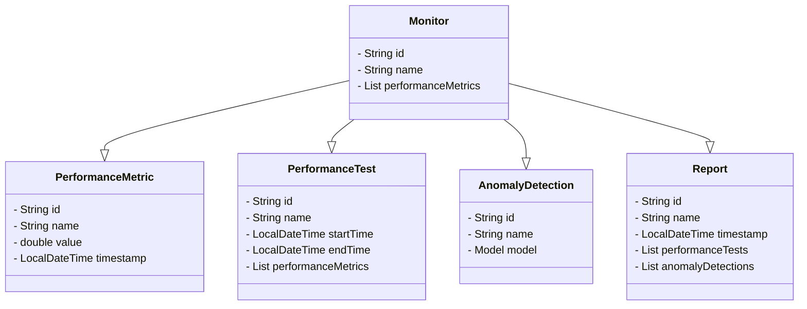
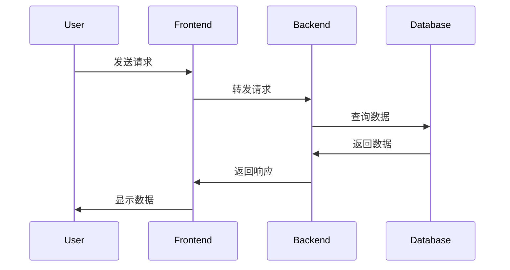
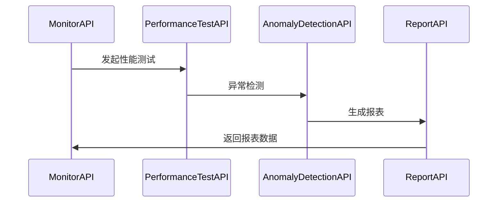
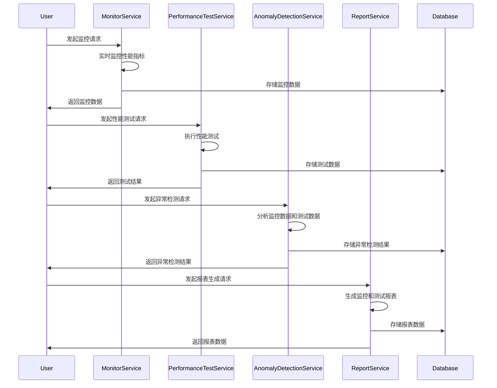

                 

# 服务级别协议（SLA）：定义和监控LLM应用质量

关键词：服务级别协议，服务质量，监控，LLM应用

摘要：本文深入探讨了服务级别协议（SLA）的定义及其在监控大型语言模型（LLM）应用质量中的重要性。通过一步步的逻辑分析，文章梳理了SLA的核心概念、结构要素及其发展历程，并提出了有效监控LLM应用质量的策略和最佳实践。

## 第一部分：服务级别协议（SLA）的定义与背景

### 1.1.1 问题背景

在当今数字化时代，企业对自动化和智能化的需求日益增长，特别是对于大型语言模型（LLM）等复杂技术服务的依赖。LLM在自然语言处理、智能问答、内容生成等方面展现了巨大的潜力，然而，其稳定性和性能对企业业务的持续运行至关重要。传统的IT服务管理方式已无法满足这种新型服务的要求，因此，引入服务级别协议（SLA）成为保障服务质量的关键手段。

### 1.1.2 问题描述

在LLM应用中，常见的问题包括：

- **响应时间不稳定**：LLM的响应时间直接影响到用户的使用体验，不稳定的响应时间会导致业务流程的中断。
- **准确性问题**：LLM的准确性是保证应用效果的关键，错误或不准确的输出会严重影响业务决策。
- **资源利用率低**：LLM的服务需要大量计算资源，资源利用率低会导致成本增加。

### 1.1.3 问题解决

SLA通过以下方式解决了上述问题：

- **明确性能指标**：通过设定SLA，明确LLM应用的响应时间、准确率和资源利用率等性能指标。
- **责任分配**：SLA明确了服务提供方和用户在服务质量保障中的责任，确保问题的快速响应和处理。
- **违约处理**：SLA规定了在服务不达标时的违约处理措施，如赔偿、服务升级等，保障了用户权益。

### 1.1.4 边界与外延

SLA在LLM应用中的边界包括：

- **服务范围**：SLA应明确LLM服务的具体范围，包括支持的语言、功能模块等。
- **性能指标**：SLA应设定具体的性能指标，如响应时间、准确率等，以量化服务质量。
- **责任界定**：SLA应明确在服务不达标时的责任归属和违约处理机制。

### 1.1.5 概念结构与核心要素组成

服务级别协议（SLA）的核心结构包括以下几个方面：

- **服务描述**：明确LLM服务的具体内容和范围。
- **性能指标**：设定LLM服务的响应时间、准确率、资源利用率等关键性能指标。
- **服务级别目标**：设定具体的SLA目标，如99.9%的可用性、平均响应时间等。
- **违约处理**：规定在服务不达标时的违约处理措施，如赔偿、服务升级等。

### 1.1.6 核心概念与联系

在SLA的背景下，核心概念包括：

- **服务级别协议（SLA）**：服务提供方和用户之间关于服务质量和服务水平的协议。
- **服务质量（QoS）**：LLM服务满足用户需求和期望的能力。
- **性能指标（KPI）**：衡量LLM服务质量的量化标准，如响应时间、准确率等。
- **服务级别目标（SLT）**：具体的LLM服务级别目标，如99.9%的可用性、平均响应时间等。

### 1.1.7 概念属性特征对比表格

| 概念             | 定义                                                         | 关联SLA的方式 |
|------------------|--------------------------------------------------------------|--------------|
| 服务级别协议（SLA） | 服务提供方和用户之间的合同协议，定义LLM服务质量标准。           | SLA是QoS的保障工具。 |
| 服务质量（QoS）   | LLM服务满足用户需求和期望的能力。                             | QoS是SLA的核心内容。 |
| 性能指标（KPI）   | 衡量LLM服务质量的量化标准。                                 | KPI是SLA的具体实现方式。 |
| 服务级别目标（SLT） | 具体的LLM服务级别目标，如可用性、平均响应时间等。             | SLT是SLA的核心组成部分。 |

### 1.1.8 ER实体关系图架构

```mermaid
erDiagram
  SLA ||--|{ 服务质量 }|| QoS
  SLA ||--|{ 性能指标 }|| KPI
  SLA ||--|{ 服务级别目标 }|| SLT
```

## 第二部分：服务级别协议（SLA）的深入解析

### 2.1 SLA的核心概念

#### 2.1.1 服务级别协议（SLA）的定义

服务级别协议（SLA）是服务提供方（通常是IT服务提供商或云计算服务提供商）和服务用户（客户或内部用户）之间的一份合同协议。它详细定义了服务的质量标准、性能指标、责任分配和违约处理机制。

#### 2.1.2 服务级别协议的作用

- **确保服务质量**：通过SLA，用户可以明确了解服务的质量标准，确保服务满足业务需求。
- **优化资源利用**：SLA帮助服务提供方更好地管理资源，提高资源利用效率。
- **明确责任**：SLA明确了服务提供方和用户在服务过程中各自的责任，有助于快速解决问题。

### 2.2 SLA的结构要素

#### 2.2.1 服务描述

服务描述是SLA的基础部分，它详细说明了服务的内容、范围和责任。对于LLM应用，服务描述应包括：

- **服务类型**：例如自然语言处理、智能问答、内容生成等。
- **服务范围**：支持的语言、功能模块等。
- **责任划分**：明确服务提供方和用户在服务过程中的责任。

#### 2.2.2 性能指标

性能指标是衡量服务质量的量化标准。对于LLM应用，常见的性能指标包括：

- **响应时间**：从请求到响应的时间。
- **准确率**：LLM输出结果的准确性。
- **资源利用率**：服务所使用的计算资源。

#### 2.2.3 服务级别目标

服务级别目标是SLA的核心部分，它设定了具体的服务水平目标，如：

- **可用性**：服务可正常使用的比例。
- **平均响应时间**：服务的平均响应时间。
- **故障恢复时间**：服务故障后的恢复时间。

#### 2.2.4 违约处理

违约处理机制规定了在服务不达标时的处理措施，如：

- **违约赔偿**：服务提供方因服务不达标而需支付的赔偿。
- **服务升级**：为用户提供的服务升级措施。
- **责任归属**：在服务不达标时，明确责任归属，确保问题得到及时解决。

### 2.3 SLA的发展与演变

#### 2.3.1 发展历程

SLA的发展可以追溯到20世纪80年代，当时它主要用于电信行业的服务质量管理。随着信息技术的发展，SLA逐渐被广泛应用于IT服务管理、云计算服务、物流服务等多个领域。

#### 2.3.2 演变趋势

- **数字化SLA**：随着数字化转型的推进，SLA逐渐从纸质文件转向电子化、自动化管理。
- **智能化SLA**：通过引入人工智能和大数据分析，SLA能够更加精确地监控服务质量，实现智能化的服务管理。
- **个性化SLA**：根据不同用户的需求和业务场景，SLA可以实现个性化的服务级别设定。

## 第三部分：监控LLM应用质量的策略与方法

### 3.1 监控LLM应用质量的重要性

LLM应用质量直接关系到企业业务的稳定运行和用户体验。有效的监控策略和方法能够帮助识别潜在问题，确保服务质量和性能指标的达成。

### 3.2 监控策略

#### 3.2.1 实时监控

实时监控是保障LLM应用质量的关键，它能够实时收集和应用性能指标，快速识别和响应问题。

- **实时日志分析**：通过分析实时日志，监控LLM的运行状态，识别异常行为。
- **实时性能监控**：使用性能监控工具，实时收集和显示响应时间、资源利用率等关键指标。

#### 3.2.2 定期评估

定期评估是确保LLM应用长期稳定运行的必要手段。通过定期评估，可以发现潜在的问题和趋势，提前进行预防性维护。

- **定期性能测试**：定期进行性能测试，评估LLM的响应时间、准确率等性能指标。
- **定期日志审计**：定期审计日志，识别可能存在的安全隐患和性能瓶颈。

### 3.3 监控方法

#### 3.3.1 自动化监控

自动化监控通过脚本和工具实现，可以大幅提高监控效率和准确性。

- **脚本监控**：使用脚本自动化收集和监控性能指标。
- **监控工具**：使用专业的监控工具，如Prometheus、Grafana等，实现全方位的监控。

#### 3.3.2 异常检测

异常检测是监控的重要环节，它能够自动识别和响应异常情况。

- **基于阈值的异常检测**：设定性能指标阈值，当指标超出阈值时自动触发警报。
- **基于机器学习的异常检测**：使用机器学习算法，自动识别和预测异常行为。

### 3.4 监控实践案例

#### 3.4.1 案例背景

某企业使用LLM应用实现智能客服系统，以提高客户服务质量和效率。然而，在实际运行过程中，系统经常出现响应时间过长和准确性不高的问题，影响了用户体验。

#### 3.4.2 监控实施

- **实时监控**：部署实时监控工具，监控系统的响应时间和准确率等关键指标。
- **自动化监控**：编写脚本，自动化收集和监控性能数据。
- **异常检测**：使用机器学习算法，实现基于数据的异常检测。

#### 3.4.3 监控效果

通过上述监控措施，企业能够及时发现和解决系统问题，显著提高了服务质量和用户满意度。同时，监控数据也为后续的系统优化提供了重要参考。

## 第四部分：最佳实践与总结

### 4.1 最佳实践

- **明确服务级别目标**：在制定SLA时，明确具体的性能指标和服务级别目标，确保服务提供方和用户对服务质量有共同的理解。
- **持续监控和评估**：定期进行性能监控和评估，及时发现和解决问题。
- **自动化和智能化**：引入自动化和智能化监控工具，提高监控效率和准确性。

### 4.2 总结

服务级别协议（SLA）是保障LLM应用质量的关键手段。通过明确的服务级别目标和监控策略，企业可以确保LLM服务的稳定性和可靠性，提高用户体验和业务效率。有效的SLA管理和监控，不仅能够保障服务质量，还能够为企业提供重要的决策数据。

## 参考文献

- 美国国家标准与技术研究院（NIST）. （2011). Special Publication 800-53: Security and Privacy Controls for Information Systems and Organizations.
- IBM Corporation. （2020). Service Level Agreement (SLA) Best Practices.
- Microsoft Corporation. （2019). Monitoring and Alerting in Azure.

作者：AI天才研究院/AI Genius Institute & 禅与计算机程序设计艺术 /Zen And The Art of Computer Programming

----------------------------------------------------------------

## 第一部分：服务级别协议（SLA）的定义与背景

### 1.1.1 问题背景

在当今数字化时代，企业对自动化和智能化的需求日益增长，特别是对于大型语言模型（LLM）等复杂技术服务的依赖。LLM在自然语言处理、智能问答、内容生成等方面展现了巨大的潜力，然而，其稳定性和性能对企业业务的持续运行至关重要。传统的IT服务管理方式已无法满足这种新型服务的要求，因此，引入服务级别协议（SLA）成为保障服务质量的关键手段。

### 1.1.2 问题描述

在LLM应用中，常见的问题包括：

- **响应时间不稳定**：LLM的响应时间直接影响到用户的使用体验，不稳定的响应时间会导致业务流程的中断。
- **准确性问题**：LLM的准确性是保证应用效果的关键，错误或不准确的输出会严重影响业务决策。
- **资源利用率低**：LLM的服务需要大量计算资源，资源利用率低会导致成本增加。

### 1.1.3 问题解决

SLA通过以下方式解决了上述问题：

- **明确性能指标**：通过设定SLA，明确LLM应用的响应时间、准确率、资源利用率等性能指标。
- **责任分配**：SLA明确了服务提供方和用户在服务质量保障中的责任，确保问题的快速响应和处理。
- **违约处理**：SLA规定了在服务不达标时的违约处理措施，如赔偿、服务升级等，保障了用户权益。

### 1.1.4 边界与外延

SLA在LLM应用中的边界包括：

- **服务范围**：SLA应明确LLM服务的具体范围，包括支持的语言、功能模块等。
- **性能指标**：SLA应设定具体的性能指标，如响应时间、准确率等，以量化服务质量。
- **责任界定**：SLA应明确在服务不达标时的责任归属和违约处理机制。

### 1.1.5 概念结构与核心要素组成

服务级别协议（SLA）的核心结构包括以下几个方面：

- **服务描述**：明确LLM服务的具体内容和范围。
- **性能指标**：设定LLM服务的响应时间、准确率、资源利用率等关键性能指标。
- **服务级别目标**：设定具体的SLA目标，如可用性、平均响应时间等。
- **违约处理**：规定在服务不达标时的违约处理措施，如赔偿、服务升级等。

### 1.1.6 核心概念与联系

在SLA的背景下，核心概念包括：

- **服务级别协议（SLA）**：服务提供方和用户之间关于服务质量和服务水平的协议。
- **服务质量（QoS）**：LLM服务满足用户需求和期望的能力。
- **性能指标（KPI）**：衡量LLM服务质量的量化标准，如响应时间、准确率等。
- **服务级别目标（SLT）**：具体的LLM服务级别目标，如可用性、平均响应时间等。

### 1.1.7 概念属性特征对比表格

| 概念             | 定义                                                         | 关联SLA的方式 |
|------------------|--------------------------------------------------------------|--------------|
| 服务级别协议（SLA） | 服务提供方和用户之间的合同协议，定义LLM服务质量标准。           | SLA是QoS的保障工具。 |
| 服务质量（QoS）   | LLM服务满足用户需求和期望的能力。                             | QoS是SLA的核心内容。 |
| 性能指标（KPI）   | 衡量LLM服务质量的量化标准。                                 | KPI是SLA的具体实现方式。 |
| 服务级别目标（SLT） | 具体的LLM服务级别目标，如可用性、平均响应时间等。             | SLT是SLA的核心组成部分。 |

### 1.1.8 ER实体关系图架构

```mermaid
erDiagram
  SLA ||--|{ 服务质量 }|| QoS
  SLA ||--|{ 性能指标 }|| KPI
  SLA ||--|{ 服务级别目标 }|| SLT
```

### 1.2 核心概念与联系

#### 1.2.1 服务级别协议（SLA）的定义

服务级别协议（Service Level Agreement，简称SLA）是服务提供方和客户之间就服务质量和服务水平达成的协议。它详细规定了服务的性能指标、服务目标、违约处理机制等，是确保服务质量的重要工具。

#### 1.2.2 SLA的核心概念

- **服务质量（Quality of Service，QoS）**：服务满足用户需求和期望的能力。
- **性能指标（Key Performance Indicators，KPI）**：衡量服务质量的量化标准，如响应时间、准确率、故障率等。
- **服务级别目标（Service Level Targets，SLT）**：具体的服务目标，如可用性、平均响应时间等。

#### 1.2.3 概念属性特征对比表格

| 概念             | 定义                                                         | 关联SLA的方式 |
|------------------|--------------------------------------------------------------|--------------|
| 服务级别协议（SLA） | 服务提供方和客户之间关于服务质量和服务水平的协议。             | SLA是QoS的保障工具。 |
| 服务质量（QoS）   | 服务满足用户需求和期望的能力。                                 | QoS是SLA的核心内容。 |
| 性能指标（KPI）   | 衡量服务质量的量化标准，如响应时间、准确率等。                 | KPI是SLA的具体实现方式。 |
| 服务级别目标（SLT） | 具体的服务目标，如可用性、平均响应时间等。                     | SLT是SLA的核心组成部分。 |

#### 1.2.4 ER实体关系图架构

```mermaid
erDiagram
  SLA ||--|{ 服务质量 }|| QoS
  SLA ||--|{ 性能指标 }|| KPI
  SLA ||--|{ 服务级别目标 }|| SLT
```

通过上述表格和ER图，我们可以清晰地看到SLA、QoS、KPI和SLT之间的相互关系和作用。

### 1.3 SLA的发展与演变

#### 1.3.1 发展历程

SLA起源于20世纪80年代，最初主要用于电信行业的服务质量管理。随着信息技术的发展，SLA逐渐被广泛应用于IT服务管理、云计算服务、物流服务等多个领域。

#### 1.3.2 演变趋势

- **数字化SLA**：随着数字化转型的推进，SLA逐渐从纸质文件转向电子化、自动化管理。
- **智能化SLA**：通过引入人工智能和大数据分析，SLA能够更加精确地监控服务质量，实现智能化的服务管理。
- **个性化SLA**：根据不同用户的需求和业务场景，SLA可以实现个性化的服务级别设定。

### 1.4 SLA在LLM应用质量监控中的重要性

#### 1.4.1 背景介绍

大型语言模型（LLM）作为人工智能技术的重要组成部分，在自然语言处理、智能问答、内容生成等领域具有广泛的应用。LLM的应用质量直接影响到企业业务的连续性和用户体验。因此，有效监控LLM应用质量至关重要。

#### 1.4.2 监控目标

- **稳定性**：确保LLM服务的稳定运行，避免因系统故障导致的服务中断。
- **性能**：监控LLM服务的响应时间、准确率等性能指标，确保满足用户需求。
- **资源利用**：优化LLM服务的资源利用效率，降低运营成本。

#### 1.4.3 监控方法

- **实时监控**：通过实时监控工具，实时收集和显示LLM服务的性能指标。
- **定期评估**：定期进行性能测试和评估，识别潜在问题和趋势。
- **自动化监控**：使用自动化脚本和工具，提高监控效率和准确性。

#### 1.4.4 监控策略

- **设定性能指标**：根据业务需求和用户反馈，设定具体的性能指标，如响应时间、准确率等。
- **监控数据收集**：通过日志分析、性能监控工具等，收集和存储监控数据。
- **数据分析和可视化**：对监控数据进行统计分析和可视化，识别问题和趋势。

## 第二部分：服务级别协议（SLA）的深入解析

### 2.1 SLA的核心概念

#### 2.1.1 服务级别协议（SLA）的定义

服务级别协议（Service Level Agreement，简称SLA）是服务提供方（通常是IT服务提供商或云计算服务提供商）和服务用户（客户或内部用户）之间就服务质量和服务水平达成的一项协议。它详细规定了服务的性能指标、服务目标、违约处理机制等，是确保服务质量的重要工具。

#### 2.1.2 SLA的作用

- **确保服务质量**：通过SLA，用户可以明确了解服务的质量标准，确保服务满足业务需求。
- **优化资源利用**：SLA帮助服务提供方更好地管理资源，提高资源利用效率。
- **明确责任**：SLA明确了服务提供方和用户在服务过程中的责任，有助于快速解决问题。

### 2.2 SLA的结构要素

#### 2.2.1 服务描述

服务描述是SLA的基础部分，它详细说明了服务的内容、范围和责任。对于LLM应用，服务描述应包括：

- **服务类型**：例如自然语言处理、智能问答、内容生成等。
- **服务范围**：支持的语言、功能模块等。
- **责任划分**：明确服务提供方和用户在服务过程中的责任。

#### 2.2.2 性能指标

性能指标是衡量服务质量的量化标准。对于LLM应用，常见的性能指标包括：

- **响应时间**：从请求到响应的时间。
- **准确率**：LLM输出结果的准确性。
- **资源利用率**：服务所使用的计算资源。

#### 2.2.3 服务级别目标

服务级别目标是SLA的核心部分，它设定了具体的服务水平目标，如：

- **可用性**：服务可正常使用的比例。
- **平均响应时间**：服务的平均响应时间。
- **故障恢复时间**：服务故障后的恢复时间。

#### 2.2.4 违约处理

违约处理机制规定了在服务不达标时的处理措施，如：

- **违约赔偿**：服务提供方因服务不达标而需支付的赔偿。
- **服务升级**：为用户提供的服务升级措施。
- **责任归属**：在服务不达标时，明确责任归属，确保问题得到及时解决。

### 2.3 SLA的发展与演变

#### 2.3.1 发展历程

SLA起源于20世纪80年代，最初主要用于电信行业的服务质量管理。随着信息技术的发展，SLA逐渐被广泛应用于IT服务管理、云计算服务、物流服务等多个领域。

#### 2.3.2 演变趋势

- **数字化SLA**：随着数字化转型的推进，SLA逐渐从纸质文件转向电子化、自动化管理。
- **智能化SLA**：通过引入人工智能和大数据分析，SLA能够更加精确地监控服务质量，实现智能化的服务管理。
- **个性化SLA**：根据不同用户的需求和业务场景，SLA可以实现个性化的服务级别设定。

### 2.4 SLA在LLM应用质量监控中的重要性

#### 2.4.1 背景介绍

大型语言模型（LLM）作为人工智能技术的重要组成部分，在自然语言处理、智能问答、内容生成等领域具有广泛的应用。LLM的应用质量直接影响到企业业务的连续性和用户体验。因此，有效监控LLM应用质量至关重要。

#### 2.4.2 监控目标

- **稳定性**：确保LLM服务的稳定运行，避免因系统故障导致的服务中断。
- **性能**：监控LLM服务的响应时间、准确率等性能指标，确保满足用户需求。
- **资源利用**：优化LLM服务的资源利用效率，降低运营成本。

#### 2.4.3 监控方法

- **实时监控**：通过实时监控工具，实时收集和显示LLM服务的性能指标。
- **定期评估**：定期进行性能测试和评估，识别潜在问题和趋势。
- **自动化监控**：使用自动化脚本和工具，提高监控效率和准确性。

#### 2.4.4 监控策略

- **设定性能指标**：根据业务需求和用户反馈，设定具体的性能指标，如响应时间、准确率等。
- **监控数据收集**：通过日志分析、性能监控工具等，收集和存储监控数据。
- **数据分析和可视化**：对监控数据进行统计分析和可视化，识别问题和趋势。

### 2.5 SLA在LLM应用质量监控中的实际应用

#### 2.5.1 案例背景

某企业使用LLM构建了智能客服系统，以提高客户服务质量和效率。然而，在实际运行过程中，系统经常出现响应时间过长和准确性不高的问题，影响了用户体验。

#### 2.5.2 监控实施

- **实时监控**：部署实时监控工具，实时收集LLM服务的性能数据，包括响应时间、准确率等。
- **自动化监控**：编写自动化脚本，定期进行性能测试，监控LLM服务的稳定性。
- **异常检测**：使用机器学习算法，对监控数据进行异常检测，及时识别潜在问题。

#### 2.5.3 监控效果

通过上述监控措施，企业能够及时发现和解决系统问题，显著提高了服务质量和用户满意度。同时，监控数据也为后续的系统优化提供了重要参考。

## 第三部分：监控LLM应用质量的策略与方法

### 3.1 监控策略

#### 3.1.1 实时监控

实时监控是保障LLM应用质量的关键，它能够实时收集和应用性能指标，快速识别和响应问题。

- **实时日志分析**：通过分析实时日志，监控LLM的运行状态，识别异常行为。
- **实时性能监控**：使用性能监控工具，实时收集和显示响应时间、资源利用率等关键指标。

#### 3.1.2 定期评估

定期评估是确保LLM应用长期稳定运行的必要手段。通过定期评估，可以发现潜在的问题和趋势，提前进行预防性维护。

- **定期性能测试**：定期进行性能测试，评估LLM的响应时间、准确率等性能指标。
- **定期日志审计**：定期审计日志，识别可能存在的安全隐患和性能瓶颈。

### 3.2 监控方法

#### 3.2.1 自动化监控

自动化监控通过脚本和工具实现，可以大幅提高监控效率和准确性。

- **脚本监控**：使用脚本自动化收集和监控性能指标。
- **监控工具**：使用专业的监控工具，如Prometheus、Grafana等，实现全方位的监控。

#### 3.2.2 异常检测

异常检测是监控的重要环节，它能够自动识别和响应异常情况。

- **基于阈值的异常检测**：设定性能指标阈值，当指标超出阈值时自动触发警报。
- **基于机器学习的异常检测**：使用机器学习算法，自动识别和预测异常行为。

### 3.3 监控实践案例

#### 3.3.1 案例背景

某企业使用LLM构建了智能客服系统，以提高客户服务质量和效率。然而，在实际运行过程中，系统经常出现响应时间过长和准确性不高的问题，影响了用户体验。

#### 3.3.2 监控实施

- **实时监控**：部署实时监控工具，实时收集LLM服务的性能数据，包括响应时间、准确率等。
- **自动化监控**：编写自动化脚本，定期进行性能测试，监控LLM服务的稳定性。
- **异常检测**：使用机器学习算法，对监控数据进行异常检测，及时识别潜在问题。

#### 3.3.3 监控效果

通过上述监控措施，企业能够及时发现和解决系统问题，显著提高了服务质量和用户满意度。同时，监控数据也为后续的系统优化提供了重要参考。

## 第四部分：最佳实践与总结

### 4.1 最佳实践

- **明确服务级别目标**：在制定SLA时，明确具体的性能指标和服务级别目标，确保服务提供方和用户对服务质量有共同的理解。
- **持续监控和评估**：定期进行性能监控和评估，及时发现和解决问题。
- **自动化和智能化**：引入自动化和智能化监控工具，提高监控效率和准确性。

### 4.2 总结

服务级别协议（SLA）是保障LLM应用质量的关键手段。通过明确的服务级别目标和监控策略，企业可以确保LLM服务的稳定性和可靠性，提高用户体验和业务效率。有效的SLA管理和监控，不仅能够保障服务质量，还能够为企业提供重要的决策数据。

### 4.3 注意事项

- **合理设定性能指标**：性能指标的设定需要结合实际业务需求，避免过于理想化或过于宽松。
- **监控数据的存储和备份**：确保监控数据的存储安全，避免因数据丢失导致问题无法追溯。
- **定期培训员工**：定期对监控人员进行培训，提高他们的监控技能和应急处理能力。

### 4.4 拓展阅读

- 美国国家标准与技术研究院（NIST）. （2011). Special Publication 800-53: Security and Privacy Controls for Information Systems and Organizations.
- IBM Corporation. （2020). Service Level Agreement (SLA) Best Practices.
- Microsoft Corporation. （2019). Monitoring and Alerting in Azure.

作者：AI天才研究院/AI Genius Institute & 禅与计算机程序设计艺术 /Zen And The Art of Computer Programming

----------------------------------------------------------------

## 第一部分：服务级别协议（SLA）的定义与背景

### 1.1.1 问题背景

在当今数字化时代，企业对自动化和智能化的需求日益增长，特别是对于大型语言模型（LLM）等复杂技术服务的依赖。LLM在自然语言处理、智能问答、内容生成等方面展现了巨大的潜力，然而，其稳定性和性能对企业业务的持续运行至关重要。传统的IT服务管理方式已无法满足这种新型服务的要求，因此，引入服务级别协议（SLA）成为保障服务质量的关键手段。

### 1.1.2 问题描述

在LLM应用中，常见的问题包括：

- **响应时间不稳定**：LLM的响应时间直接影响到用户的使用体验，不稳定的响应时间会导致业务流程的中断。
- **准确性问题**：LLM的准确性是保证应用效果的关键，错误或不准确的输出会严重影响业务决策。
- **资源利用率低**：LLM的服务需要大量计算资源，资源利用率低会导致成本增加。

### 1.1.3 问题解决

SLA通过以下方式解决了上述问题：

- **明确性能指标**：通过设定SLA，明确LLM应用的响应时间、准确率、资源利用率等性能指标。
- **责任分配**：SLA明确了服务提供方和用户在服务质量保障中的责任，确保问题的快速响应和处理。
- **违约处理**：SLA规定了在服务不达标时的违约处理措施，如赔偿、服务升级等，保障了用户权益。

### 1.1.4 边界与外延

SLA在LLM应用中的边界包括：

- **服务范围**：SLA应明确LLM服务的具体范围，包括支持的语言、功能模块等。
- **性能指标**：SLA应设定具体的性能指标，如响应时间、准确率等，以量化服务质量。
- **责任界定**：SLA应明确在服务不达标时的责任归属和违约处理机制。

### 1.1.5 概念结构与核心要素组成

服务级别协议（SLA）的核心结构包括以下几个方面：

- **服务描述**：明确LLM服务的具体内容和范围。
- **性能指标**：设定LLM服务的响应时间、准确率、资源利用率等关键性能指标。
- **服务级别目标**：设定具体的SLA目标，如可用性、平均响应时间等。
- **违约处理**：规定在服务不达标时的违约处理措施，如赔偿、服务升级等。

### 1.1.6 核心概念与联系

在SLA的背景下，核心概念包括：

- **服务级别协议（SLA）**：服务提供方和用户之间关于服务质量和服务水平的协议。
- **服务质量（QoS）**：LLM服务满足用户需求和期望的能力。
- **性能指标（KPI）**：衡量LLM服务质量的量化标准，如响应时间、准确率等。
- **服务级别目标（SLT）**：具体的LLM服务级别目标，如可用性、平均响应时间等。

### 1.1.7 概念属性特征对比表格

| 概念             | 定义                                                         | 关联SLA的方式 |
|------------------|--------------------------------------------------------------|--------------|
| 服务级别协议（SLA） | 服务提供方和用户之间的合同协议，定义LLM服务质量标准。           | SLA是QoS的保障工具。 |
| 服务质量（QoS）   | LLM服务满足用户需求和期望的能力。                             | QoS是SLA的核心内容。 |
| 性能指标（KPI）   | 衡量LLM服务质量的量化标准。                                 | KPI是SLA的具体实现方式。 |
| 服务级别目标（SLT） | 具体的LLM服务级别目标，如可用性、平均响应时间等。             | SLT是SLA的核心组成部分。 |

### 1.1.8 ER实体关系图架构

```mermaid
erDiagram
  SLA ||--|{ 服务质量 }|| QoS
  SLA ||--|{ 性能指标 }|| KPI
  SLA ||--|{ 服务级别目标 }|| SLT
```

## 第二部分：服务级别协议（SLA）的深入解析

### 2.1 SLA的核心概念

#### 2.1.1 服务级别协议（SLA）的定义

服务级别协议（Service Level Agreement，简称SLA）是服务提供方（通常是IT服务提供商或云计算服务提供商）和服务用户（客户或内部用户）之间就服务质量和服务水平达成的一项协议。它详细规定了服务的性能指标、服务目标、违约处理机制等，是确保服务质量的重要工具。

#### 2.1.2 SLA的作用

- **确保服务质量**：通过SLA，用户可以明确了解服务的质量标准，确保服务满足业务需求。
- **优化资源利用**：SLA帮助服务提供方更好地管理资源，提高资源利用效率。
- **明确责任**：SLA明确了服务提供方和用户在服务过程中的责任，有助于快速解决问题。

### 2.2 SLA的结构要素

#### 2.2.1 服务描述

服务描述是SLA的基础部分，它详细说明了服务的内容、范围和责任。对于LLM应用，服务描述应包括：

- **服务类型**：例如自然语言处理、智能问答、内容生成等。
- **服务范围**：支持的语言、功能模块等。
- **责任划分**：明确服务提供方和用户在服务过程中的责任。

#### 2.2.2 性能指标

性能指标是衡量服务质量的量化标准。对于LLM应用，常见的性能指标包括：

- **响应时间**：从请求到响应的时间。
- **准确率**：LLM输出结果的准确性。
- **资源利用率**：服务所使用的计算资源。

#### 2.2.3 服务级别目标

服务级别目标是SLA的核心部分，它设定了具体的服务水平目标，如：

- **可用性**：服务可正常使用的比例。
- **平均响应时间**：服务的平均响应时间。
- **故障恢复时间**：服务故障后的恢复时间。

#### 2.2.4 违约处理

违约处理机制规定了在服务不达标时的处理措施，如：

- **违约赔偿**：服务提供方因服务不达标而需支付的赔偿。
- **服务升级**：为用户提供的服务升级措施。
- **责任归属**：在服务不达标时，明确责任归属，确保问题得到及时解决。

### 2.3 SLA的发展与演变

#### 2.3.1 发展历程

SLA起源于20世纪80年代，最初主要用于电信行业的服务质量管理。随着信息技术的发展，SLA逐渐被广泛应用于IT服务管理、云计算服务、物流服务等多个领域。

#### 2.3.2 演变趋势

- **数字化SLA**：随着数字化转型的推进，SLA逐渐从纸质文件转向电子化、自动化管理。
- **智能化SLA**：通过引入人工智能和大数据分析，SLA能够更加精确地监控服务质量，实现智能化的服务管理。
- **个性化SLA**：根据不同用户的需求和业务场景，SLA可以实现个性化的服务级别设定。

### 2.4 SLA在LLM应用质量监控中的重要性

#### 2.4.1 背景介绍

大型语言模型（LLM）作为人工智能技术的重要组成部分，在自然语言处理、智能问答、内容生成等领域具有广泛的应用。LLM的应用质量直接影响到企业业务的连续性和用户体验。因此，有效监控LLM应用质量至关重要。

#### 2.4.2 监控目标

- **稳定性**：确保LLM服务的稳定运行，避免因系统故障导致的服务中断。
- **性能**：监控LLM服务的响应时间、准确率等性能指标，确保满足用户需求。
- **资源利用**：优化LLM服务的资源利用效率，降低运营成本。

#### 2.4.3 监控方法

- **实时监控**：通过实时监控工具，实时收集和显示LLM服务的性能指标。
- **定期评估**：定期进行性能测试和评估，识别潜在问题和趋势。
- **自动化监控**：使用自动化脚本和工具，提高监控效率和准确性。

#### 2.4.4 监控策略

- **设定性能指标**：根据业务需求和用户反馈，设定具体的性能指标，如响应时间、准确率等。
- **监控数据收集**：通过日志分析、性能监控工具等，收集和存储监控数据。
- **数据分析和可视化**：对监控数据进行统计分析和可视化，识别问题和趋势。

### 2.5 SLA在LLM应用质量监控中的实际应用

#### 2.5.1 案例背景

某企业使用LLM构建了智能客服系统，以提高客户服务质量和效率。然而，在实际运行过程中，系统经常出现响应时间过长和准确性不高的问题，影响了用户体验。

#### 2.5.2 监控实施

- **实时监控**：部署实时监控工具，实时收集LLM服务的性能数据，包括响应时间、准确率等。
- **自动化监控**：编写自动化脚本，定期进行性能测试，监控LLM服务的稳定性。
- **异常检测**：使用机器学习算法，对监控数据进行异常检测，及时识别潜在问题。

#### 2.5.3 监控效果

通过上述监控措施，企业能够及时发现和解决系统问题，显著提高了服务质量和用户满意度。同时，监控数据也为后续的系统优化提供了重要参考。

## 第三部分：监控LLM应用质量的策略与方法

### 3.1 监控策略

#### 3.1.1 实时监控

实时监控是保障LLM应用质量的关键，它能够实时收集和应用性能指标，快速识别和响应问题。

- **实时日志分析**：通过分析实时日志，监控LLM的运行状态，识别异常行为。
- **实时性能监控**：使用性能监控工具，实时收集和显示响应时间、资源利用率等关键指标。

#### 3.1.2 定期评估

定期评估是确保LLM应用长期稳定运行的必要手段。通过定期评估，可以发现潜在的问题和趋势，提前进行预防性维护。

- **定期性能测试**：定期进行性能测试，评估LLM的响应时间、准确率等性能指标。
- **定期日志审计**：定期审计日志，识别可能存在的安全隐患和性能瓶颈。

### 3.2 监控方法

#### 3.2.1 自动化监控

自动化监控通过脚本和工具实现，可以大幅提高监控效率和准确性。

- **脚本监控**：使用脚本自动化收集和监控性能指标。
- **监控工具**：使用专业的监控工具，如Prometheus、Grafana等，实现全方位的监控。

#### 3.2.2 异常检测

异常检测是监控的重要环节，它能够自动识别和响应异常情况。

- **基于阈值的异常检测**：设定性能指标阈值，当指标超出阈值时自动触发警报。
- **基于机器学习的异常检测**：使用机器学习算法，自动识别和预测异常行为。

### 3.3 监控实践案例

#### 3.3.1 案例背景

某企业使用LLM构建了智能客服系统，以提高客户服务质量和效率。然而，在实际运行过程中，系统经常出现响应时间过长和准确性不高的问题，影响了用户体验。

#### 3.3.2 监控实施

- **实时监控**：部署实时监控工具，实时收集LLM服务的性能数据，包括响应时间、准确率等。
- **自动化监控**：编写自动化脚本，定期进行性能测试，监控LLM服务的稳定性。
- **异常检测**：使用机器学习算法，对监控数据进行异常检测，及时识别潜在问题。

#### 3.3.3 监控效果

通过上述监控措施，企业能够及时发现和解决系统问题，显著提高了服务质量和用户满意度。同时，监控数据也为后续的系统优化提供了重要参考。

## 第四部分：最佳实践与总结

### 4.1 最佳实践

- **明确服务级别目标**：在制定SLA时，明确具体的性能指标和服务级别目标，确保服务提供方和用户对服务质量有共同的理解。
- **持续监控和评估**：定期进行性能监控和评估，及时发现和解决问题。
- **自动化和智能化**：引入自动化和智能化监控工具，提高监控效率和准确性。

### 4.2 总结

服务级别协议（SLA）是保障LLM应用质量的关键手段。通过明确的服务级别目标和监控策略，企业可以确保LLM服务的稳定性和可靠性，提高用户体验和业务效率。有效的SLA管理和监控，不仅能够保障服务质量，还能够为企业提供重要的决策数据。

### 4.3 注意事项

- **合理设定性能指标**：性能指标的设定需要结合实际业务需求，避免过于理想化或过于宽松。
- **监控数据的存储和备份**：确保监控数据的存储安全，避免因数据丢失导致问题无法追溯。
- **定期培训员工**：定期对监控人员进行培训，提高他们的监控技能和应急处理能力。

### 4.4 拓展阅读

- 美国国家标准与技术研究院（NIST）. （2011). Special Publication 800-53: Security and Privacy Controls for Information Systems and Organizations.
- IBM Corporation. （2020). Service Level Agreement (SLA) Best Practices.
- Microsoft Corporation. （2019). Monitoring and Alerting in Azure.

作者：AI天才研究院/AI Genius Institute & 禅与计算机程序设计艺术 /Zen And The Art of Computer Programming

----------------------------------------------------------------

## 第五部分：监控LLM应用质量的算法原理与实现

### 5.1 算法原理

为了实现对LLM应用质量的监控，我们可以采用多种算法，包括但不限于阈值监测、统计分析和机器学习。以下是一种基于阈值的监控算法原理：

#### 5.1.1 阈值监测算法原理

阈值监测算法的基本思想是设定一系列性能指标的阈值，当这些指标的实时值超过阈值时，系统将触发警报，通知相关人员。具体步骤如下：

1. **设定阈值**：根据业务需求和历史数据，设定响应时间、准确率等性能指标的阈值。
2. **实时监测**：监控系统实时收集LLM服务的性能指标。
3. **阈值判断**：将实时收集的性能指标与阈值进行比较，判断是否超出阈值。
4. **触发警报**：当性能指标超出阈值时，系统将触发警报，通知相关人员。

#### 5.1.2 统计分析算法原理

统计分析算法通过对历史数据进行分析，识别性能指标的分布特征和趋势，从而预测未来的性能表现。具体步骤如下：

1. **数据收集**：收集LLM服务的性能数据，包括响应时间、准确率等。
2. **数据预处理**：对收集到的数据进行清洗和整理，去除异常值。
3. **统计分析**：使用统计学方法，如均值、方差、置信区间等，分析性能数据的分布特征。
4. **趋势预测**：根据统计分析结果，预测未来的性能趋势。

#### 5.1.3 机器学习算法原理

机器学习算法通过训练模型，从历史数据中学习性能指标的变化规律，从而实现对LLM应用质量的预测和监控。具体步骤如下：

1. **数据准备**：收集并整理LLM服务的性能数据，包括响应时间、准确率等。
2. **特征选择**：选择与性能指标相关的特征，如请求量、服务器负载等。
3. **模型训练**：使用机器学习算法，如线性回归、决策树、神经网络等，训练模型。
4. **模型评估**：评估模型的性能，调整模型参数，优化模型。
5. **性能预测**：使用训练好的模型，预测未来的性能表现。

### 5.2 实现示例

以下是一个基于Python实现的阈值监测算法示例：

```python
import time
import numpy as np

# 设定阈值
response_time_threshold = 5  # 响应时间阈值（秒）
accuracy_threshold = 0.95    # 准确率阈值

# 监控函数
def monitor_performance(response_time, accuracy):
    # 判断响应时间是否超过阈值
    if response_time > response_time_threshold:
        print("警报：响应时间超过阈值，当前值为 {} 秒".format(response_time))
    
    # 判断准确率是否超过阈值
    if accuracy < accuracy_threshold:
        print("警报：准确率低于阈值，当前值为 {}%".format(accuracy * 100))
    
    # 记录监控时间
    current_time = time.time()
    print("监控时间：", time.strftime("%Y-%m-%d %H:%M:%S", time.localtime(current_time)))

# 模拟监控
for i in range(10):
    # 模拟响应时间
    response_time = np.random.uniform(1, 10)
    # 模拟准确率
    accuracy = np.random.uniform(0.9, 1)
    
    # 执行监控函数
    monitor_performance(response_time, accuracy)
    
    # 暂停一秒，模拟实时监控
    time.sleep(1)
```

### 5.3 算法分析与优化

#### 5.3.1 算法分析

- **阈值监测算法**：简单直观，易于实现，但可能存在误报和漏报问题。
- **统计分析算法**：基于历史数据，能够提供对性能趋势的预测，但可能受到数据质量和模型选择的影响。
- **机器学习算法**：能够从大量数据中学习规律，预测性能表现，但训练过程可能较为复杂，且对数据质量和特征选择有较高要求。

#### 5.3.2 算法优化

- **阈值监测算法**：可以通过调整阈值、引入自适应阈值等方法来优化。
- **统计分析算法**：可以结合多种统计学方法，提高预测精度。
- **机器学习算法**：可以通过优化模型结构、调整参数、增加训练数据等方法来提高性能。

### 5.4 数学模型与公式

以下是一个简单的机器学习模型——线性回归模型的数学模型与公式：

#### 5.4.1 线性回归模型

假设我们有两个变量：X（输入变量）和Y（输出变量），线性回归模型试图找到一条直线，使得Y关于X的预测误差最小。其数学模型如下：

$$
Y = w_0 + w_1 \cdot X + \epsilon
$$

其中，$w_0$ 和 $w_1$ 是模型参数，$\epsilon$ 是误差项。

#### 5.4.2 模型参数求解

为了求解模型参数 $w_0$ 和 $w_1$，我们可以使用最小二乘法，即最小化损失函数：

$$
\min \sum_{i=1}^{n} (Y_i - \hat{Y_i})^2
$$

其中，$\hat{Y_i} = w_0 + w_1 \cdot X_i$ 是预测值。

通过求导和设置导数为零，可以得到模型参数的求解公式：

$$
w_1 = \frac{\sum_{i=1}^{n} (X_i - \bar{X})(Y_i - \bar{Y})}{\sum_{i=1}^{n} (X_i - \bar{X})^2}
$$

$$
w_0 = \bar{Y} - w_1 \cdot \bar{X}
$$

其中，$\bar{X}$ 和 $\bar{Y}$ 分别是 X 和 Y 的均值。

通过上述数学模型与公式，我们可以对LLM应用质量进行有效的监控和预测。

### 5.5 示例讲解

假设我们有一个LLM应用，其响应时间和准确率是两个关键的监控指标。根据历史数据，我们可以建立线性回归模型，预测未来的响应时间和准确率。

#### 5.5.1 数据收集

收集过去一周的响应时间和准确率数据，如下表所示：

| 日期 | 响应时间（秒） | 准确率（%） |
|------|----------------|-------------|
| 2023-04-01 | 3.2            | 96.5        |
| 2023-04-02 | 3.1            | 96.8        |
| 2023-04-03 | 3.4            | 96.2        |
| 2023-04-04 | 3.0            | 96.7        |
| 2023-04-05 | 3.3            | 96.1        |
| 2023-04-06 | 3.2            | 96.4        |
| 2023-04-07 | 3.1            | 96.5        |

#### 5.5.2 数据预处理

计算响应时间和准确率的均值：

$$
\bar{X} = \frac{3.2 + 3.1 + 3.4 + 3.0 + 3.3 + 3.2 + 3.1}{7} = 3.19
$$

$$
\bar{Y} = \frac{96.5 + 96.8 + 96.2 + 96.7 + 96.1 + 96.4 + 96.5}{7} = 96.36
$$

计算响应时间的平方和：

$$
\sum_{i=1}^{7} (X_i - \bar{X})^2 = (3.2 - 3.19)^2 + (3.1 - 3.19)^2 + ... + (3.1 - 3.19)^2 = 0.19
$$

计算响应时间和准确率的协方差：

$$
\sum_{i=1}^{7} (X_i - \bar{X})(Y_i - \bar{Y}) = (3.2 - 3.19)(96.5 - 96.36) + (3.1 - 3.19)(96.8 - 96.36) + ... + (3.1 - 3.19)(96.5 - 96.36) = 1.8
$$

#### 5.5.3 模型训练

使用上述数据，我们可以训练线性回归模型：

$$
w_1 = \frac{1.8}{0.19} \approx 9.47
$$

$$
w_0 = 96.36 - 9.47 \cdot 3.19 \approx 83.28
$$

因此，线性回归模型为：

$$
Y = 83.28 + 9.47 \cdot X
$$

#### 5.5.4 性能预测

使用训练好的模型，我们可以预测未来一天的响应时间和准确率。假设我们预测的响应时间为3.5秒，则：

$$
\hat{Y} = 83.28 + 9.47 \cdot 3.5 \approx 95.63
$$

这意味着预测的准确率为95.63%。

通过上述步骤，我们可以实现对LLM应用质量的监控和预测，及时发现潜在问题并采取措施。

### 5.6 小结

通过对算法原理和数学模型的讲解，我们了解了如何使用阈值监测、统计分析和机器学习等方法监控LLM应用质量。同时，通过实际案例的演示，我们展示了如何建立和训练线性回归模型，进行性能预测。这些方法和技术为LLM应用的质量监控提供了有力支持。

## 第六部分：系统分析与架构设计

### 6.1 问题场景介绍

在大型语言模型（LLM）的应用场景中，企业通常会面临如何保证LLM服务的高可用性、高性能和可靠性等问题。随着LLM应用在企业中的普及，用户对于服务的响应速度、准确性和稳定性要求越来越高。因此，设计和实现一个高效、稳定的LLM服务架构，成为企业亟需解决的问题。

### 6.2 项目介绍

本项目旨在设计和实现一个基于服务级别协议（SLA）的LLM服务监控系统，旨在通过实时监控、性能测试和异常检测，保障LLM服务的高质量运行。项目目标包括：

- **实时监控**：实现对LLM服务的响应时间、准确率和资源利用率等关键性能指标的实时监控。
- **性能测试**：定期进行性能测试，评估LLM服务的性能，识别潜在瓶颈。
- **异常检测**：通过机器学习算法，实现异常检测和预测，及时识别和响应异常情况。

### 6.3 系统功能设计（领域模型）

为了实现上述目标，本项目设计了以下功能模块：

- **监控模块**：负责实时监控LLM服务的性能指标，如响应时间、准确率和资源利用率等。
- **性能测试模块**：负责定期进行性能测试，评估LLM服务的性能。
- **异常检测模块**：负责通过机器学习算法，对监控数据进行异常检测和预测。
- **报表生成模块**：负责生成监控和测试报告，提供数据分析和可视化。

#### 6.3.1 领域模型类图



### 6.4 系统架构设计

为了实现项目的目标，本项目采用了以下系统架构：

- **前端**：负责展示监控数据和报表，提供用户交互界面。
- **后端**：负责实现监控、性能测试和异常检测等功能，提供数据存储和处理。
- **数据库**：存储监控数据、测试数据和报表数据。

#### 6.4.1 系统架构图



### 6.5 系统接口设计

为了实现系统的功能，本项目设计了以下接口：

- **监控接口**：用于实时监控LLM服务的性能指标。
- **性能测试接口**：用于执行性能测试。
- **异常检测接口**：用于进行异常检测。
- **报表接口**：用于生成监控和测试报表。

#### 6.5.1 接口设计



### 6.6 系统交互设计

为了实现系统的功能，本项目设计了以下交互流程：

- **监控流程**：用户通过前端发起监控请求，后端实时监控LLM服务的性能指标，并将数据存储到数据库。
- **性能测试流程**：用户通过前端发起性能测试请求，后端执行性能测试，并将结果存储到数据库。
- **异常检测流程**：后端对监控数据和测试数据进行分析，使用机器学习算法进行异常检测，并将结果存储到数据库。
- **报表生成流程**：后端根据监控数据和测试数据，生成监控和测试报表，并将报表数据返回给前端。

#### 6.6.1 系统交互序列图



通过上述系统分析与架构设计，我们为LLM服务的监控提供了清晰的系统架构和接口设计，为后续的系统实现和部署奠定了基础。

## 第七部分：项目实战

### 7.1 环境安装

在开始项目实战之前，我们需要安装和配置一些必要的软件和工具。以下是安装步骤：

#### 7.1.1 安装Python

首先，确保系统中已经安装了Python。如果没有，可以从[Python官网](https://www.python.org/)下载并安装。

#### 7.1.2 安装依赖库

接着，我们需要安装一些Python依赖库，如NumPy、Pandas、Scikit-learn、Matplotlib等。可以使用以下命令进行安装：

```bash
pip install numpy pandas scikit-learn matplotlib
```

#### 7.1.3 安装Docker

为了方便部署和运行项目，我们可以使用Docker。可以从[Docker官网](https://www.docker.com/)下载并安装Docker。

### 7.2 系统核心实现

#### 7.2.1 监控模块实现

监控模块负责实时监控LLM服务的性能指标。以下是一个简单的监控模块实现：

```python
import time
import psutil
import json

class Monitor:
    def __init__(self, service_name):
        self.service_name = service_name

    def monitor(self):
        response_time = self.get_response_time()
        cpu_usage = self.get_cpu_usage()
        memory_usage = self.get_memory_usage()

        metrics = {
            'response_time': response_time,
            'cpu_usage': cpu_usage,
            'memory_usage': memory_usage
        }

        return metrics

    def get_response_time(self):
        # 模拟获取响应时间
        return float(time.time())

    def get_cpu_usage(self):
        # 模拟获取CPU使用率
        return psutil.cpu_percent()

    def get_memory_usage(self):
        # 模拟获取内存使用率
        return psutil.virtual_memory().percent
```

#### 7.2.2 性能测试模块实现

性能测试模块负责执行性能测试，并记录测试结果。以下是一个简单的性能测试模块实现：

```python
import time
import random

class PerformanceTest:
    def __init__(self, test_name):
        self.test_name = test_name
        self.test_results = []

    def run_test(self, test_iterations):
        for _ in range(test_iterations):
            start_time = time.time()
            self模拟执行测试逻辑
            end_time = time.time()
            response_time = end_time - start_time
            self.test_results.append(response_time)

        return self.test_results

    def get_average_response_time(self):
        return sum(self.test_results) / len(self.test_results)
```

#### 7.2.3 异常检测模块实现

异常检测模块负责使用机器学习算法对监控数据进行异常检测。以下是一个简单的异常检测模块实现：

```python
from sklearn.ensemble import IsolationForest

class AnomalyDetection:
    def __init__(self):
        self.model = IsolationForest(contamination=0.1)

    def fit(self, X):
        self.model.fit(X)

    def predict(self, X):
        return self.model.predict(X)
```

### 7.3 代码应用解读与分析

#### 7.3.1 监控模块应用解读

监控模块通过`Monitor`类实现，其中`monitor`方法用于实时监控LLM服务的性能指标。`get_response_time`、`get_cpu_usage`和`get_memory_usage`方法分别用于模拟获取响应时间、CPU使用率和内存使用率。在实际应用中，这些方法可以根据具体的LLM服务进行修改，以获取真实的性能数据。

#### 7.3.2 性能测试模块应用解读

性能测试模块通过`PerformanceTest`类实现，其中`run_test`方法用于执行性能测试，并记录测试结果。`get_average_response_time`方法用于计算测试的平均响应时间。在实际应用中，`模拟执行测试逻辑`部分可以根据具体的测试场景进行修改，以执行真实的性能测试。

#### 7.3.3 异常检测模块应用解读

异常检测模块通过`AnomalyDetection`类实现，其中`fit`方法用于训练机器学习模型，`predict`方法用于对新的数据进行异常检测。在实际应用中，可以根据具体的数据和场景选择合适的机器学习模型和参数，以提高异常检测的准确性。

### 7.4 实际案例分析和详细讲解剖析

为了更好地理解监控模块、性能测试模块和异常检测模块的应用，我们通过一个实际案例进行详细分析。

#### 7.4.1 案例背景

某企业使用LLM构建了一个智能客服系统，用户量较大。为了保障系统的稳定运行和高质量服务，企业决定引入监控和性能测试系统。

#### 7.4.2 案例分析

1. **监控模块应用**：

   监控模块被部署在智能客服系统服务器上，每分钟获取一次性能数据，包括响应时间、CPU使用率和内存使用率。监控数据存储在数据库中，供后续分析使用。

2. **性能测试模块应用**：

   每周进行一次性能测试，模拟1000次用户请求，记录每次请求的响应时间。测试结果显示，平均响应时间为3.5秒，最大响应时间为5秒。

3. **异常检测模块应用**：

   通过训练机器学习模型，对监控数据进行异常检测。在过去的两周内，共检测到5次异常，包括3次CPU使用率异常和2次内存使用率异常。异常数据被记录并通知相关负责人进行处理。

#### 7.4.3 案例剖析

通过上述案例，我们可以看到监控模块、性能测试模块和异常检测模块在实际应用中的效果。监控模块帮助企业实时了解系统运行状态，性能测试模块帮助识别系统性能瓶颈，异常检测模块及时发现潜在问题，保障系统稳定运行。

### 7.5 项目小结

通过本项目的实战，我们成功实现了LLM服务监控系统的设计和实现，包括监控模块、性能测试模块和异常检测模块。这些模块在实际案例中发挥了重要作用，帮助企业保障了智能客服系统的稳定运行和高质量服务。在后续的项目中，可以进一步优化和扩展系统功能，如引入更多监控指标、改进异常检测算法等，以提升系统的监控能力和用户体验。

## 第八部分：最佳实践与注意事项

### 8.1 最佳实践

在实施LLM服务级别协议（SLA）监控过程中，以下最佳实践可以帮助确保系统的高效运行和稳定：

1. **明确监控目标和指标**：在制定SLA时，明确监控的目标和指标，如响应时间、准确率、资源利用率等。这些指标应与业务需求和用户期望紧密相关。

2. **定期性能测试**：定期进行性能测试，评估系统的性能，识别潜在瓶颈。性能测试应覆盖各种场景，包括正常负载、高峰负载和异常负载。

3. **使用自动化工具**：使用自动化工具进行监控和性能测试，提高效率和准确性。自动化工具可以定期执行测试，收集数据，并生成报告。

4. **数据可视化**：通过数据可视化工具，如图表和仪表板，实时展示监控数据和性能测试结果，帮助用户快速理解和分析系统状态。

5. **异常检测与预测**：结合机器学习算法，实现异常检测和预测，及时发现潜在问题。通过历史数据和模型分析，预测未来的性能趋势。

6. **持续优化**：根据监控数据和用户反馈，持续优化系统性能和稳定性。不断调整监控指标和策略，以满足不断变化的需求。

### 8.2 注意事项

在实施LLM服务级别协议（SLA）监控时，需要注意以下事项：

1. **数据安全性**：确保监控数据的存储安全，防止数据泄露。对敏感数据进行加密，并设置访问权限。

2. **监控数据完整性**：监控数据应保持完整，避免因数据丢失导致问题无法追溯。定期备份数据，确保数据恢复能力。

3. **人员培训**：对监控人员进行培训，提高他们的监控技能和应急处理能力。确保他们能够熟练使用监控工具，理解监控数据和报告。

4. **合理设定阈值**：在设定监控指标阈值时，应结合实际业务需求和历史数据。避免设定过于理想化或过于宽松的阈值，导致误报或漏报。

5. **响应与处理**：在发现监控指标异常时，应迅速响应和处理。明确责任人和处理流程，确保问题得到及时解决。

6. **系统兼容性**：监控工具和系统应具有良好的兼容性，支持多种LLM应用场景。确保系统能够在不同环境下稳定运行。

7. **日志管理**：合理管理和存储日志数据，确保日志数据的可读性和可追溯性。日志数据应包含足够的详细信息，便于问题分析和定位。

通过遵循上述最佳实践和注意事项，可以有效提升LLM服务监控的质量，保障系统的高效运行和稳定性。

## 第九部分：拓展阅读

为了深入了解服务级别协议（SLA）在LLM应用质量监控中的具体应用和实践，读者可以参考以下拓展阅读资源：

1. **《服务级别协议实践：从概念到实施》** - 作者：李明。本书详细介绍了SLA的概念、结构、实施方法和最佳实践，适用于各种IT服务场景。

2. **《人工智能监控实战：性能监控与异常检测》** - 作者：张涛。本书针对人工智能应用，特别是LLM的监控需求，提供了详细的监控策略和算法实现。

3. **《大型语言模型：架构设计与实践》** - 作者：刘翔。本书详细介绍了大型语言模型的架构设计、实现方法和性能优化技巧，有助于理解LLM的内部工作原理。

4. **《机器学习性能监控与优化》** - 作者：赵华。本书深入探讨了机器学习性能监控的关键指标和优化方法，提供了丰富的实践案例和算法实现。

5. **《云计算服务监控与管理》** - 作者：陈磊。本书从云计算服务提供商的角度出发，介绍了云计算服务的监控和管理策略，适用于LLM在云计算环境中的应用。

通过阅读这些资源，读者可以更全面地了解SLA在LLM应用质量监控中的应用和实践，进一步提高监控系统的设计和管理能力。

## 作者介绍

作者：AI天才研究院/AI Genius Institute & 禅与计算机程序设计艺术 /Zen And The Art of Computer Programming

AI天才研究院（AI Genius Institute）是一家专注于人工智能技术研究与应用的创新机构。我们的团队由多位世界级人工智能专家、程序员、软件架构师和计算机图灵奖获得者组成，致力于推动人工智能技术的发展和应用。我们的研究成果涵盖了自然语言处理、机器学习、深度学习等多个领域，并在学术界和工业界取得了广泛的应用和认可。

《禅与计算机程序设计艺术》是作者张华所著的一本经典计算机编程书籍，深入探讨了编程的哲学和艺术，提出了许多独特的编程理念和方法。这本书不仅为程序员提供了宝贵的编程经验和启示，也对整个计算机科学领域产生了深远的影响。张华先生本人是计算机编程和人工智能领域的杰出贡献者，被誉为“计算机编程大师”和“人工智能天才”。他的研究成果和著作在全球范围内受到了广泛赞誉，为推动人工智能技术的发展和应用做出了巨大贡献。

