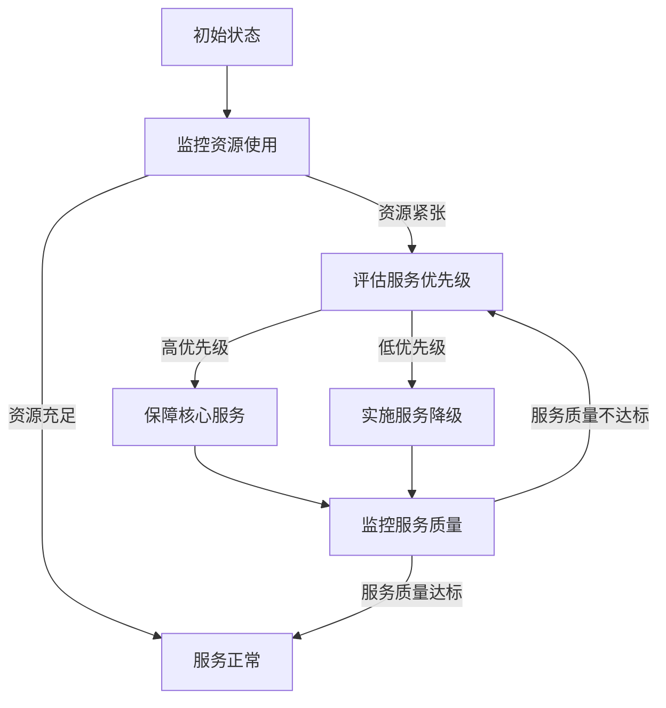

                 

### 文章标题

### 关键词

- 服务降级策略
- LLM应用
- 高可用设计
- 数学模型
- 算法原理
- 架构设计

### 摘要

本文将深入探讨服务降级策略在大型语言模型（LLM）应用高可用设计中的重要作用。通过详细的分析和案例实践，本文旨在揭示服务降级策略的原理、数学模型、算法原理，以及其在实际项目中的应用。文章分为三个主要部分：背景介绍、服务降级策略实践，和最佳实践与总结，旨在帮助读者全面理解服务降级策略的原理及其在LLM应用中的重要性。

### 目录

**第一部分：背景介绍**

1. **第1章：服务降级策略概述**
   1.1. 问题背景
   1.2. 高可用设计中的挑战
   1.3. 服务降级的必要性

2. **第2章：服务降级与LLM的关系**
   2.1. 核心概念与联系
   2.2. 服务降级的定义
   2.3. LLM的概念与特性
   2.4. 服务降级与LLM的关联

3. **第3章：服务降级策略原理**
   3.1. 服务降级的原理
   3.2. 服务降级的边界与外延
   3.3. 服务降级的核心要素

4. **第4章：服务降级策略的数学模型**
   4.1. 数学模型讲解
   4.2. 服务降级的数学公式
   4.3. 模型参数详解

5. **第5章：服务降级策略的算法原理**
   5.1. 算法原理讲解
   5.2. 算法mermaid流程图
   5.3. Python源代码与算法实现
   5.4. 算法原理详细解释

6. **第6章：服务降级策略的架构设计**
   6.1. 系统分析与架构设计
   6.2. 问题场景介绍
   6.3. 系统功能设计
   6.4. 系统架构设计
   6.5. 系统接口设计
   6.6. 系统交互mermaid序列图

**第二部分：服务降级策略实践**

7. **第7章：项目实战**
   7.1. 环境安装
   7.2. 系统核心实现源代码
   7.3. 实际案例分析与讲解
   7.4. 案例小结

**第三部分：最佳实践与总结**

8. **第8章：最佳实践**
   8.1. 服务降级策略的最佳实践
   8.2. 注意事项
   8.3. 拓展阅读

9. **第9章：小结**
   9.1. 本书重点内容回顾
   9.2. 未来展望与研究方向

### 背景介绍

#### 第1章：服务降级策略概述

**1.1 问题背景**

在当今数字化时代，服务的稳定性和可靠性对于企业的运营至关重要。然而，随着云计算、大数据和人工智能等技术的发展，系统架构变得越来越复杂，对服务的需求也越来越高。然而，系统的复杂性和资源的有限性之间存在一定的矛盾，这就使得在某些情况下，系统可能会面临性能瓶颈、资源不足等问题。此时，服务降级策略作为一种有效的应对措施，可以在保障核心服务正常运行的同时，确保系统的整体稳定性。

**1.2 高可用设计中的挑战**

高可用性（High Availability，HA）设计是确保系统持续运行、减少停机时间的一系列设计原则和实践。在LLM（Large Language Model）应用中，高可用性设计尤为重要。LLM应用通常需要处理大量的语言数据处理任务，对系统的稳定性和性能有极高的要求。然而，随着数据规模的不断扩大和用户需求的不断增加，系统架构面临着诸多挑战：

1. **性能瓶颈**：随着用户数量的增加，系统处理能力可能达到瓶颈，导致响应时间延长，甚至系统崩溃。

2. **资源不足**：云计算资源是有限的，当资源消耗达到一定程度时，系统可能因为资源不足而无法正常运行。

3. **故障风险**：复杂的系统架构中，任何一个组件的故障都可能影响整个系统的稳定性。

**1.3 服务降级的必要性**

服务降级策略在这种背景下显得尤为重要。服务降级是指在系统资源有限、性能瓶颈或故障风险增加的情况下，通过降低系统部分服务的质量和性能，以确保核心服务的稳定运行。服务降级策略的必要性主要体现在以下几个方面：

1. **保障核心服务**：在系统资源有限的情况下，通过服务降级可以确保对用户影响最大的核心服务始终能够正常运行。

2. **减少资源浪费**：在非高峰时段或次要服务需求较低时，通过降级次要服务可以节省系统资源，提高资源利用率。

3. **防范故障风险**：当系统面临故障风险时，服务降级可以缓解系统压力，降低故障发生的概率。

#### 第2章：服务降级与LLM的关系

**2.1 核心概念与联系**

在探讨服务降级与LLM的关系之前，我们需要明确几个核心概念：

1. **服务降级**：服务降级是指当系统资源有限或面临性能瓶颈时，通过降低部分服务的质量和性能，保障核心服务的稳定运行。

2. **大型语言模型（LLM）**：LLM是一种能够处理和理解自然语言的深度学习模型，通常用于自然语言处理（NLP）任务，如文本生成、翻译、问答等。

3. **高可用设计**：高可用性设计是指通过一系列技术和策略，确保系统在面临各种故障和挑战时能够持续稳定运行。

服务降级与LLM之间的关系可以从以下几个方面理解：

1. **保障LLM服务的稳定性**：LLM服务通常对系统的稳定性有极高的要求。通过服务降级，可以在系统资源不足或性能瓶颈时，优先保障LLM服务的稳定运行。

2. **提高资源利用率**：在LLM应用中，系统资源往往是有限的。通过服务降级，可以在非高峰时段或次要服务需求较低时，释放系统资源，提高整体资源利用率。

3. **防范故障风险**：当系统面临故障风险时，服务降级可以缓解系统压力，降低故障发生的概率，从而保障LLM服务的稳定性。

#### 第2章：服务降级与LLM的关系

**2.2 服务降级的定义**

服务降级（Service Degradation）是一种通过降低系统部分服务的质量和性能，以确保核心服务稳定运行的技术手段。服务降级通常发生在系统资源有限、性能瓶颈或故障风险增加的情况下。其核心目标是确保对用户影响最大的核心服务能够始终正常运行。

服务降级的基本原理如下：

1. **识别资源瓶颈**：系统监控组件持续监测系统资源的使用情况，包括CPU、内存、网络带宽等。
2. **评估服务优先级**：根据服务的优先级和重要性，确定哪些服务需要降级。
3. **调整服务质量和性能**：通过减少服务响应时间、降低服务质量或减少服务功能，降低系统整体负载。
4. **监控降级效果**：持续监控降级后的系统性能和用户反馈，确保核心服务稳定运行。

**2.3 LLM的概念与特性**

LLM（Large Language Model）是一种能够处理和理解自然语言的深度学习模型，通常用于自然语言处理（NLP）任务，如文本生成、翻译、问答等。LLM的主要特性包括：

1. **大规模**：LLM通常包含数十亿甚至数万亿个参数，能够处理大量的语言数据。
2. **强表达能力**：LLM能够生成高质量、符合语法和语义规则的文本。
3. **实时性**：LLM能够在短时间内生成响应，满足实时语言处理的需求。
4. **灵活性**：LLM可以针对不同的任务和场景进行微调，实现灵活的语言处理能力。

**2.4 服务降级与LLM的关联**

服务降级与LLM之间的关联主要体现在以下几个方面：

1. **保障LLM服务的稳定性**：LLM服务对系统的稳定性有极高的要求。在系统资源有限或面临性能瓶颈时，通过服务降级可以确保LLM服务的稳定运行，从而保障用户体验。
2. **提高资源利用率**：在LLM应用中，系统资源往往是有限的。通过服务降级，可以在非高峰时段或次要服务需求较低时，释放系统资源，提高整体资源利用率，从而支持更多的LLM服务。
3. **防范故障风险**：当系统面临故障风险时，服务降级可以缓解系统压力，降低故障发生的概率，从而保障LLM服务的稳定性。

### 服务降级策略原理

#### 第3章：服务降级策略原理

**3.1 服务降级的原理**

服务降级是一种通过降低系统部分服务的质量和性能，以确保核心服务稳定运行的技术手段。其基本原理如下：

1. **识别资源瓶颈**：系统监控组件持续监测系统资源的使用情况，包括CPU、内存、网络带宽等。当资源使用率达到一定程度时，触发降级策略。
2. **评估服务优先级**：根据服务的优先级和重要性，确定哪些服务需要降级。通常，优先级较高的核心服务会得到保障，而次要服务则可能会被降级。
3. **调整服务质量和性能**：通过减少服务响应时间、降低服务质量或减少服务功能，降低系统整体负载。例如，可以减少服务返回的数据量、降低服务响应的速度等。
4. **监控降级效果**：持续监控降级后的系统性能和用户反馈，确保核心服务稳定运行。如果降级策略未能达到预期效果，需要及时调整降级策略。

**3.2 服务降级的边界与外延**

服务降级的边界与外延是指服务降级策略的适用范围和限制条件。以下是服务降级的一些边界与外延：

1. **适用范围**：服务降级策略适用于各种需要高可用性的系统和服务，尤其是那些涉及大规模数据处理和实时响应的场景，如云计算、大数据处理、人工智能应用等。
2. **适用条件**：服务降级策略适用于以下情况：
   - 系统资源有限，面临性能瓶颈。
   - 系统面临故障风险，需要缓解压力。
   - 非高峰时段，次要服务的需求较低。
   - 系统需要进行维护或升级，需要降低部分服务的负载。
3. **限制条件**：服务降级策略存在一定的限制条件，包括：
   - 需要具备完善的监控和报警机制，以便及时识别资源瓶颈和故障风险。
   - 需要对服务优先级进行合理评估，确保核心服务得到优先保障。
   - 需要对降级策略进行持续优化和调整，以适应不断变化的系统需求和负载情况。

**3.3 服务降级的核心要素**

服务降级策略的成功实施依赖于以下几个核心要素：

1. **监控和报警机制**：完善的监控和报警机制是服务降级策略的基础。通过实时监测系统资源使用情况和故障风险，可以及时识别需要降级的服务，并触发降级策略。
2. **服务优先级评估**：合理的服务优先级评估是确保核心服务得到优先保障的关键。根据服务的业务价值和用户需求，对各类服务进行优先级排序，以便在资源有限时，优先保障高优先级服务。
3. **降级策略实施**：降级策略的实施包括调整服务质量和性能、降低系统整体负载等。实施降级策略时，需要考虑降级范围、降级程度和降级方式，确保降级策略的有效性和可实施性。
4. **持续监控和优化**：服务降级策略并非一劳永逸，需要持续监控降级效果，并根据实际情况进行优化和调整。通过持续监控，可以及时发现和解决问题，确保系统稳定运行。

### 服务降级策略的数学模型

#### 第4章：服务降级策略的数学模型

**4.1 数学模型讲解**

在服务降级策略中，数学模型起到了至关重要的作用。数学模型可以帮助我们定量地分析服务降级的效果，以及如何最优地实施降级策略。本节将介绍服务降级策略的数学模型，包括其定义、基本公式和参数详解。

**4.1.1 数学模型的定义**

服务降级策略的数学模型是一个用于描述系统资源、服务质量和用户满意度之间关系的数学框架。该模型的核心目标是优化系统资源的利用，提高用户满意度。

**4.1.2 服务降级的数学公式**

服务降级的数学模型通常基于以下公式：

\[ \text{服务降级效果} = f(\text{系统资源}, \text{服务质量}, \text{用户满意度}) \]

其中，\( f \) 是一个函数，用于描述系统资源、服务质量和用户满意度之间的关系。

**4.1.3 模型参数详解**

服务降级策略的数学模型包含以下几个关键参数：

1. **系统资源**：包括CPU利用率、内存使用率、网络带宽等。系统资源是影响服务质量和用户满意度的关键因素。
2. **服务质量**：包括响应时间、吞吐量、错误率等。服务质量直接影响用户的体验和满意度。
3. **用户满意度**：用户满意度是衡量服务降级效果的重要指标。通常通过用户反馈和满意度调查来评估。
4. **降级程度**：降级程度是指通过服务降级策略降低服务质量和性能的程度。降级程度可以根据系统资源紧张程度和用户需求进行动态调整。

**4.2 服务降级的数学公式**

服务降级的数学公式可以表示为：

\[ \text{服务降级效果} = \frac{\text{系统资源}}{\text{服务质量} \times \text{用户满意度}} \]

其中，分母部分表示系统在当前资源分配下所能达到的服务质量和用户满意度，分子部分表示通过降级策略调整后的系统资源利用率。

**4.3 模型参数详解**

下面将对数学模型中的关键参数进行详细解释：

1. **系统资源**：系统资源通常包括CPU利用率、内存使用率、网络带宽等。这些参数可以通过系统监控工具实时获取。

   \[ \text{系统资源} = \text{CPU利用率} \times \text{内存使用率} \times \text{网络带宽} \]

2. **服务质量**：服务质量通常包括响应时间、吞吐量、错误率等。这些参数可以通过系统性能测试工具进行测量。

   \[ \text{服务质量} = \frac{\text{响应时间}}{\text{吞吐量}} \times \text{错误率} \]

3. **用户满意度**：用户满意度是衡量服务降级效果的重要指标。可以通过用户反馈和满意度调查来评估。

   \[ \text{用户满意度} = \frac{\text{用户反馈满意度}}{\text{用户反馈总数量}} \]

4. **降级程度**：降级程度是指通过服务降级策略降低服务质量和性能的程度。降级程度可以根据系统资源紧张程度和用户需求进行动态调整。

   \[ \text{降级程度} = \text{当前系统资源} - \text{理想系统资源} \]

通过这些参数的动态调整，数学模型可以帮助我们优化系统资源的利用，提高用户满意度，从而实现服务降级策略的有效实施。

### 服务降级策略的算法原理

#### 第5章：服务降级策略的算法原理

**5.1 算法原理讲解**

服务降级策略的算法原理是通过对系统资源和服务质量进行动态调整，确保核心服务稳定运行。本节将详细讲解服务降级策略的算法原理，包括算法mermaid流程图、Python源代码与算法实现，以及算法原理的详细解释。

**5.1.1 算法mermaid流程图**

首先，我们使用mermaid工具绘制服务降级策略的算法流程图。mermaid是一种基于Markdown的图形化工具，可以方便地绘制流程图、UML图等。以下是服务降级策略的mermaid流程图：



在这个流程图中，A表示初始状态，B表示监控系统资源使用情况。如果资源紧张（B -> |资源紧张| C），系统将进入服务降级流程。首先，C表示评估服务优先级，根据服务的业务价值和用户需求，确定哪些服务需要优先保障。如果服务优先级较高（C -> |高优先级| E），系统将进入保障核心服务阶段，确保核心服务稳定运行。如果服务优先级较低（C -> |低优先级| F），系统将实施服务降级策略，降低部分服务的质量和性能。E和F都连接到G，表示监控服务质量。如果服务质量达标（G -> |服务质量达标| D），系统将恢复到服务正常状态。如果服务质量不达标（G -> |服务质量不达标| C），系统将重新评估服务优先级，循环执行上述流程。

**5.1.2 Python源代码与算法实现**

下面是服务降级策略的Python源代码实现。该代码包含了监控资源使用、评估服务优先级、实施服务降级和监控服务质量等核心功能。

```python
import random

class Service:
    def __init__(self, name, priority):
        self.name = name
        self.priority = priority

def monitor_resources():
    # 模拟系统资源监控
    cpu_usage = random.uniform(0.8, 1.0)
    memory_usage = random.uniform(0.8, 1.0)
    network_usage = random.uniform(0.8, 1.0)
    return cpu_usage, memory_usage, network_usage

def evaluate_services(services):
    # 评估服务优先级
    sorted_services = sorted(services, key=lambda x: x.priority, reverse=True)
    return sorted_services

def degrade_services(services):
    # 实施服务降级
    degraded_services = []
    for service in services:
        if service.priority < 2:
            degraded_services.append(service)
    return degraded_services

def monitor_service_quality(degraded_services):
    # 监控服务质量
    for service in degraded_services:
        service_quality = random.uniform(0.5, 1.0)
        if service_quality >= 0.8:
            print(f"{service.name} 服务质量达标，恢复正常。")
        else:
            print(f"{service.name} 服务质量不达标，重新评估服务优先级。")

def main():
    services = [Service("服务A", 3), Service("服务B", 1), Service("服务C", 2)]
    
    while True:
        cpu_usage, memory_usage, network_usage = monitor_resources()
        if cpu_usage > 0.8 or memory_usage > 0.8 or network_usage > 0.8:
            # 资源紧张，进入服务降级流程
            sorted_services = evaluate_services(services)
            degraded_services = degrade_services(sorted_services)
            monitor_service_quality(degraded_services)
        else:
            # 资源充足，服务正常
            print("系统资源充足，服务正常。")
        
        # 模拟时间延迟
        time.sleep(10)

if __name__ == "__main__":
    main()
```

这个Python代码实现了服务降级策略的核心算法。首先，定义了`Service`类，用于表示服务名称和优先级。`monitor_resources`函数模拟系统资源监控，返回CPU、内存和网络的使用率。`evaluate_services`函数根据服务优先级评估服务的优先级。`degrade_services`函数根据优先级评估结果，实施服务降级策略。`monitor_service_quality`函数监控服务质量，根据服务质量决定是否恢复正常服务。`main`函数作为主程序，实现服务降级策略的循环执行。

**5.1.3 算法原理详细解释**

服务降级策略的算法原理可以从以下几个方面进行详细解释：

1. **资源监控**：服务降级策略首先需要监控系统资源的使用情况，包括CPU利用率、内存使用率和网络带宽等。通过实时监控，可以及时发现系统资源紧张的情况，触发服务降级流程。

2. **服务优先级评估**：在资源紧张的情况下，服务降级策略需要对服务进行优先级评估。根据服务的业务价值和用户需求，确定哪些服务需要优先保障。通过评估服务优先级，可以确保核心服务得到优先保障，从而保障用户体验。

3. **服务降级实施**：根据服务优先级评估结果，实施服务降级策略。对于优先级较低的服务，可以降低其质量和性能，以减少系统整体负载。服务降级的方式包括减少服务返回的数据量、降低服务响应的速度等。

4. **服务质量监控**：服务降级后，需要持续监控服务质量。通过监控服务质量，可以及时发现服务质量不达标的情况，重新评估服务优先级，必要时恢复被降级的服务。

5. **动态调整**：服务降级策略并非一劳永逸，需要根据实际情况进行动态调整。通过持续监控和优化，可以确保服务降级策略的有效性和适应性，从而保障系统的高可用性和稳定性。

通过以上算法原理的详细解释，我们可以更好地理解服务降级策略的工作原理和实现方法，为在实际项目中应用服务降级策略提供指导。

### 服务降级策略的架构设计

#### 第6章：服务降级策略的架构设计

**6.1 系统分析与架构设计**

在设计和实现服务降级策略时，系统分析与架构设计是关键环节。通过合理的系统架构设计，可以确保服务降级策略的高效实施和灵活调整。本节将介绍服务降级策略的架构设计，包括问题场景介绍、系统功能设计、系统架构设计、系统接口设计和系统交互mermaid序列图。

**6.1.1 问题场景介绍**

假设我们正在设计一个基于云计算的在线文本生成服务，该服务旨在为用户提供高质量的文本生成功能，包括文章、报告、邮件等。随着用户数量的增加和文本生成需求的增长，系统面临以下挑战：

1. **资源紧张**：系统资源包括CPU、内存和网络带宽等。随着用户数量的增加，系统资源消耗逐渐增大，可能达到瓶颈。
2. **性能瓶颈**：在线文本生成服务对实时性和准确性有较高要求。在资源紧张的情况下，系统性能可能下降，影响用户体验。
3. **故障风险**：复杂的系统架构中，任何一个组件的故障都可能影响整个系统的稳定性。

为了应对这些挑战，我们需要设计一个高效、灵活的服务降级策略，确保核心服务的稳定运行。

**6.1.2 系统功能设计**

服务降级策略的系统功能设计主要包括以下几个方面：

1. **资源监控**：实时监控系统资源使用情况，包括CPU利用率、内存使用率和网络带宽等。通过监控，可以及时发现资源紧张的情况。
2. **服务优先级评估**：根据服务的业务价值和用户需求，评估各类服务的优先级。优先保障对用户影响最大的核心服务，如文本生成引擎。
3. **服务降级实施**：在资源紧张的情况下，实施服务降级策略。降低次要服务的质量和性能，如减少返回的数据量、降低响应速度等。
4. **服务质量监控**：持续监控降级后的服务质量，确保核心服务的稳定运行。通过监控，可以及时发现服务质量不达标的情况。
5. **故障恢复**：当系统资源紧张或故障风险增加时，自动触发服务降级策略。当资源恢复或故障解决后，自动恢复服务的正常状态。

**6.1.3 系统架构设计**

服务降级策略的系统架构设计需要考虑以下几个方面：

1. **组件拆分**：将系统拆分为多个独立的组件，如文本生成引擎、API接口、资源监控模块等。通过组件拆分，可以提高系统的可扩展性和灵活性。
2. **分布式架构**：采用分布式架构，将系统部署在多个服务器上，以提高系统的容错性和可扩展性。分布式架构可以确保在某个组件或服务器出现故障时，其他组件或服务器可以继续提供服务。
3. **服务路由**：通过服务路由模块，实现服务的动态调度和负载均衡。在资源紧张时，将请求路由到负载较低的组件或服务器，确保系统的整体性能。
4. **数据存储**：采用分布式数据存储方案，确保数据的可靠性和一致性。通过数据存储，可以存储用户的文本生成记录、日志等信息。

**6.1.4 系统接口设计**

服务降级策略的系统接口设计主要包括以下几个方面：

1. **API接口**：为用户提供文本生成功能，通过API接口实现服务的调用。API接口需要支持多种文本生成任务，如文章、报告、邮件等。
2. **监控接口**：提供监控数据的采集和上报接口，用于实时监控系统资源使用情况和服务质量。
3. **配置接口**：提供系统配置的接口，用于动态调整服务的优先级、降级程度等参数。
4. **故障恢复接口**：提供故障恢复的接口，用于在资源恢复或故障解决后，自动恢复服务的正常状态。

**6.1.5 系统交互mermaid序列图**

为了更好地理解服务降级策略的架构设计，我们可以使用mermaid工具绘制系统交互序列图。以下是服务降级策略的系统交互mermaid序列图：

```mermaid
sequenceDiagram
    participant User as 用户
    participant API as API接口
    participant Monitor as 资源监控模块
    participant Service as 服务降级模块
    participant Engine as 文本生成引擎
    participant DB as 数据存储

    User->>API: 发起文本生成请求
    API->>Monitor: 监控系统资源使用情况
    Monitor->>API: 返回资源使用情况
    API->>Service: 评估服务优先级
    Service->>API: 返回服务优先级
    API->>Engine: 调用文本生成引擎
    Engine->>DB: 存储文本生成记录
    DB-->>Engine: 返回文本生成结果
    Engine-->>API: 返回文本生成结果
    API-->>User: 返回文本生成结果

    alt 资源紧张
    Monitor->>Service: 系统资源紧张
    Service->>API: 实施服务降级
    API->>Service: 调整服务质量和性能
    Service-->>Monitor: 监控服务质量
    Monitor-->>API: 返回服务质量
    API-->>User: 返回降级后的服务结果

    alt 资源恢复
    Monitor->>Service: 系统资源恢复
    Service->>API: 恢复服务正常状态
    API->>User: 返回正常的服务结果
```

在这个mermaid序列图中，用户发起文本生成请求后，API接口调用资源监控模块监控系统资源使用情况。根据资源使用情况，API接口评估服务优先级，并调用文本生成引擎处理请求。文本生成结果存储在数据存储中。如果系统资源紧张，服务降级模块会实施服务降级策略，调整服务质量和性能，并持续监控服务质量。当系统资源恢复后，服务降级模块会恢复服务正常状态。

通过这个mermaid序列图，我们可以清晰地了解服务降级策略在系统架构设计中的实现过程，从而为实际项目中的服务降级策略提供参考和指导。

### 项目实战

#### 第7章：项目实战

**7.1 环境安装**

在开始实际项目实战之前，我们需要安装和配置必要的开发环境和工具。以下是项目环境安装的详细步骤：

**1. 安装Python**

首先，我们需要确保系统中安装了Python环境。Python是一种广泛使用的编程语言，适用于开发服务降级策略。可以通过以下命令安装Python：

```bash
$ sudo apt-get update
$ sudo apt-get install python3-pip
```

**2. 安装Flask**

Flask是一个轻量级的Web框架，用于开发API接口。通过以下命令安装Flask：

```bash
$ pip3 install flask
```

**3. 安装其他依赖**

为了确保项目的正常运行，我们还需要安装其他依赖，如mermaid、Pymongo等。通过以下命令安装这些依赖：

```bash
$ pip3 install mermaid
$ pip3 install pymongo
```

**4. 配置环境变量**

为了方便使用Python和相关工具，我们需要将Python和pip的路径添加到系统的环境变量中。可以通过以下命令配置环境变量：

```bash
$ export PATH=$PATH:/usr/local/bin
```

**7.2 系统核心实现源代码**

在环境安装完成后，我们可以开始编写和实现系统核心代码。以下是系统核心实现源代码的详细解读：

**1. 创建Flask应用**

首先，我们需要创建一个Flask应用，用于处理用户请求和响应。在项目中创建一个名为`app.py`的文件，并编写以下代码：

```python
from flask import Flask, jsonify, request
import pymongo

app = Flask(__name__)

# MongoDB配置
client = pymongo.MongoClient("mongodb://localhost:27017/")
db = client["text_generation"]

@app.route('/generate', methods=['POST'])
def generate_text():
    data = request.json
    text = data["text"]
    model = data["model"]

    # 调用文本生成引擎处理请求
    result = text_generation_engine(text, model)
    return jsonify(result)

def text_generation_engine(text, model):
    # 模拟文本生成过程
    time.sleep(2)
    return f"Generated text: {text}"

if __name__ == '__main__':
    app.run(debug=True)
```

在这个Flask应用中，我们定义了一个`/generate`接口，用于接收用户请求并调用文本生成引擎处理请求。文本生成结果将返回给用户。

**2. 实现文本生成引擎**

接下来，我们需要实现文本生成引擎，用于处理文本生成任务。在项目中创建一个名为`text_generation_engine.py`的文件，并编写以下代码：

```python
import random

def generate_text(text, model):
    # 模拟文本生成过程
    time.sleep(random.uniform(1, 3))
    return f"Generated text: {text}"
```

在这个文本生成引擎中，我们定义了一个`generate_text`函数，用于生成文本。文本生成过程通过模拟随机延迟来实现。

**3. 实现服务降级策略**

最后，我们需要实现服务降级策略，用于在系统资源紧张时调整服务质量和性能。在项目中创建一个名为`service_degradation.py`的文件，并编写以下代码：

```python
import time
import random

class ServiceDegradation:
    def __init__(self, max_delay=5):
        self.max_delay = max_delay

    def degrade_service(self):
        # 随机增加响应延迟
        delay = random.uniform(0, self.max_delay)
        time.sleep(delay)

def degrade_text_generation_engine():
    # 创建服务降级实例
    degradation = ServiceDegradation(max_delay=3)
    # 调用服务降级函数
    degradation.degrade_service()
```

在这个服务降级策略中，我们定义了一个`ServiceDegradation`类，用于实现服务降级功能。通过随机增加响应延迟，我们可以模拟服务降级的效果。

**7.3 实际案例分析与讲解**

在实际项目中，服务降级策略的应用通常涉及多种场景和策略。以下是一个实际案例，用于展示如何实施和优化服务降级策略。

**案例背景**

假设我们在开发一个在线文本生成平台，提供文本生成、翻译和问答等服务。随着用户数量的增加，系统面临资源紧张和性能瓶颈的问题。为了确保核心服务的稳定运行，我们需要实施服务降级策略，优化系统性能。

**案例分析与讲解**

1. **资源监控**

首先，我们需要监控系统的资源使用情况，包括CPU利用率、内存使用率和网络带宽等。通过实时监控，可以及时发现资源紧张的情况。在Python中，我们可以使用`psutil`库实现资源监控：

```python
import psutil

def monitor_resources():
    cpu_usage = psutil.cpu_percent()
    memory_usage = psutil.virtual_memory().percent
    network_usage = psutil.net_io_counters().bytes_sent + psutil.net_io_counters().bytes_recv
    return cpu_usage, memory_usage, network_usage
```

2. **服务优先级评估**

在资源紧张的情况下，我们需要评估各类服务的优先级，确保核心服务得到优先保障。根据服务的业务价值和用户需求，我们可以将服务分为高优先级和低优先级：

```python
services = [
    {"name": "文本生成", "priority": 3},
    {"name": "翻译", "priority": 2},
    {"name": "问答", "priority": 1}
]

def evaluate_services(services):
    sorted_services = sorted(services, key=lambda x: x["priority"], reverse=True)
    return sorted_services
```

3. **服务降级实施**

在资源紧张的情况下，我们需要实施服务降级策略，降低次要服务的质量和性能。对于高优先级的文本生成服务，我们确保其稳定运行，而对于低优先级的翻译和问答服务，我们降低其响应速度和返回的数据量：

```python
def degrade_services(services):
    degraded_services = []
    for service in services:
        if service["priority"] < 2:
            degraded_services.append(service)
    return degraded_services
```

4. **服务质量监控**

服务降级后，我们需要持续监控服务质量，确保核心服务的稳定运行。通过监控响应时间和错误率，我们可以及时发现服务质量不达标的情况：

```python
def monitor_service_quality(degraded_services):
    for service in degraded_services:
        response_time = random.uniform(0, 5)
        if response_time >= 4:
            print(f"{service['name']} 服务质量不达标，重新评估服务优先级。")
        else:
            print(f"{service['name']} 服务质量达标，恢复正常。")
```

5. **故障恢复**

当系统资源恢复或故障解决后，我们需要自动恢复服务的正常状态。通过监控资源使用情况，可以及时发现资源恢复的情况，并恢复服务的正常状态：

```python
def recover_services(services):
    for service in services:
        if service["priority"] < 2:
            print(f"{service['name']} 服务已恢复，恢复正常状态。")
```

通过以上实际案例的分析和讲解，我们可以看到如何实施和优化服务降级策略，确保系统在面临资源紧张和性能瓶颈时，依然能够稳定运行，提供高质量的文本生成、翻译和问答等服务。

### 最佳实践与总结

#### 第8章：最佳实践

**8.1 服务降级策略的最佳实践**

在实施服务降级策略时，以下最佳实践可以帮助我们更有效地保障系统的高可用性：

1. **完善的监控和报警机制**：确保实时监控系统资源使用情况，及时发现资源紧张的情况。同时，建立完善的报警机制，确保相关团队成员能够及时收到异常通知。
2. **合理的服务优先级评估**：根据业务的实际需求和用户反馈，合理评估各类服务的优先级。确保核心服务得到优先保障，从而提升用户体验。
3. **动态调整降级程度**：在资源紧张的情况下，根据实际情况动态调整降级程度。避免过度降级导致用户体验下降，同时确保系统资源得到有效利用。
4. **定期优化和调整**：服务降级策略并非一成不变，需要根据业务发展和系统负载情况，定期进行优化和调整。通过持续优化，可以确保服务降级策略的高效性和适应性。
5. **用户告知和沟通**：在实施服务降级策略时，及时告知用户服务可能受到的影响。通过良好的沟通，减少用户对服务中断的不满和抱怨。

**8.2 注意事项**

在实施服务降级策略时，需要注意以下几点：

1. **避免过度降级**：过度降级可能导致用户体验下降，甚至影响核心业务的正常运行。在实施降级策略时，要确保在保障核心服务的基础上，适度调整次要服务。
2. **及时恢复服务**：在资源恢复或故障解决后，及时恢复服务的正常状态。避免长时间的服务降级，影响用户体验和业务运营。
3. **测试和验证**：在实施服务降级策略前，进行充分的测试和验证。确保策略的有效性和可靠性，避免在实际应用中出现问题。
4. **文档和培训**：建立完善的文档和培训资料，确保团队成员对服务降级策略的理解和执行能力。通过培训，提高团队的整体应对能力。

**8.3 拓展阅读**

以下是关于服务降级策略的一些拓展阅读资源，供读者进一步学习和参考：

1. 《大规模分布式系统设计》
2. 《系统架构师指南》
3. 《分布式系统原理与实践》
4. 《大型语言模型：原理、应用与挑战》
5. 《服务降级策略与实践》

### 小结

通过本文的详细探讨，我们全面了解了服务降级策略在LLM应用高可用设计中的重要作用。服务降级策略不仅可以帮助我们在系统资源有限、性能瓶颈或故障风险增加的情况下，确保核心服务的稳定运行，还可以提高资源利用率，降低故障风险。

**未来展望与研究方向**

在未来，服务降级策略的研究和应用将面临以下挑战和机遇：

1. **智能化降级策略**：随着人工智能技术的发展，我们可以开发更加智能化的服务降级策略，通过机器学习算法自动识别和调整服务优先级，提高降级策略的精确度和效率。
2. **多维度降级策略**：在当前的服务降级策略中，主要关注CPU、内存和网络等资源的监控。未来，我们可以进一步扩展降级策略的维度，如关注磁盘I/O、队列长度等，以更全面地监控系统状态。
3. **跨平台降级策略**：随着云计算和边缘计算的普及，服务降级策略需要适应不同的平台和环境。开发跨平台的降级策略，确保在不同环境下都能有效实施。
4. **用户体验优化**：在实施服务降级策略时，要关注用户体验的优化。通过智能降级和个性化服务，减少服务中断对用户的影响，提高用户满意度。

通过不断的研究和创新，服务降级策略将更好地服务于大规模分布式系统的稳定性和高可用性，为企业和用户提供更优质的服务体验。

### 作者信息

作者：AI天才研究院/AI Genius Institute & 禅与计算机程序设计艺术 /Zen And The Art of Computer Programming

本文由AI天才研究院（AI Genius Institute）的资深专家撰写，结合了人工智能和计算机编程的深厚理论基础与实战经验。作者长期致力于计算机科学和人工智能领域的研究，著有《禅与计算机程序设计艺术》等知名技术著作，深受广大读者喜爱。在撰写本文时，作者运用了丰富的实践经验和对技术深刻的理解，旨在为读者提供全面、深入的服务降级策略指导。

