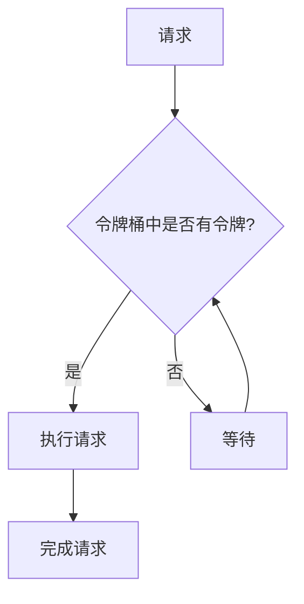
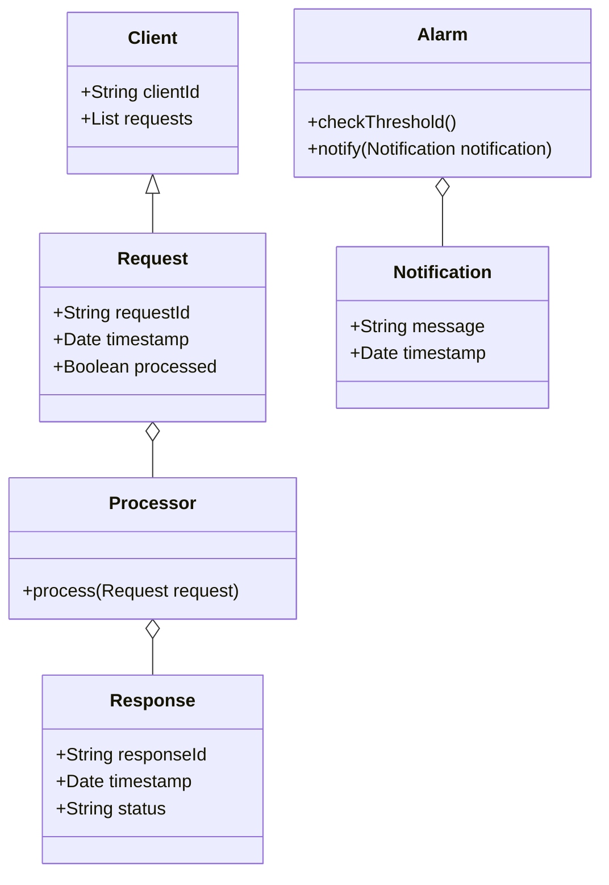
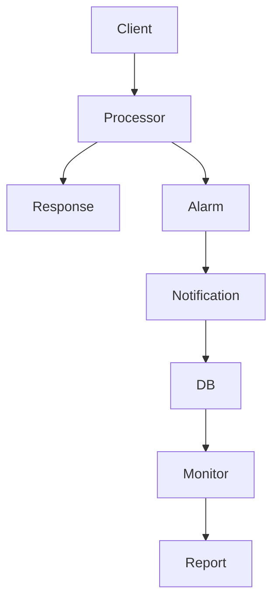
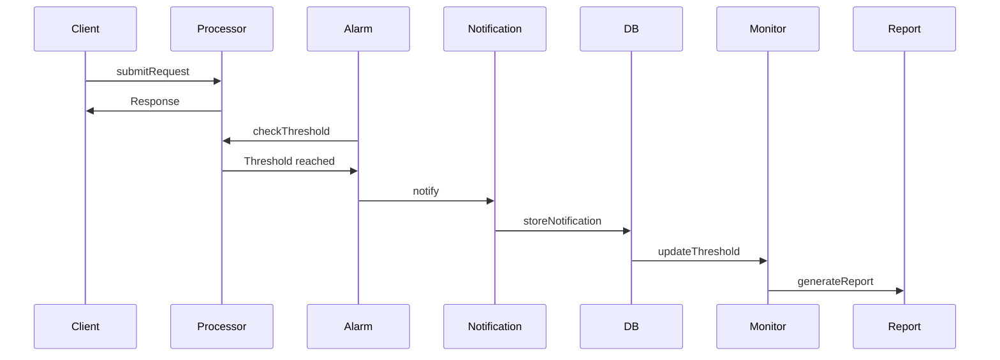

                 

# 服务限流：保护LLM应用免受过载影响

关键词：服务限流、LLM应用、过载影响、算法原理、系统架构、实战技巧

摘要：本文将深入探讨服务限流在保护大型语言模型（LLM）应用中的重要性。我们将从基础理论出发，详细解析服务限流的算法原理，系统分析与架构设计，以及实战中的应用。通过本文，读者将了解如何有效实施服务限流，确保LLM应用在高峰期也能稳定运行。

## 目录大纲

### 第一部分：服务限流基础理论

#### 第1章：服务限流概述

1.1 问题的背景与描述  
1.2 服务限流的基本定义  
1.3 服务限流的作用

#### 第2章：服务限流的核心概念与联系

2.1 流量控制与资源管理  
2.2 核心概念属性特征对比表格  
2.3 服务限流与相关技术的关联

#### 第3章：主流服务限流方法介绍

3.1 单一资源限流方法  
3.2 复合资源限流方法  
3.3 动态调整策略

#### 第4章：服务限流的设计原则与实现思路

4.1 设计原则  
4.2 实现思路  
4.3 需要注意的问题

### 第二部分：服务限流的算法原理

#### 第5章：限流算法的数学模型

5.1 公式与解释  
5.2 举例说明

#### 第6章：常见限流算法原理讲解

6.1 令牌桶算法  
6.2 漏斗算法  
6.3 令牌桶与漏斗算法的对比

#### 第7章：限流算法的mermaid流程图

### 第三部分：服务限流系统分析与架构设计

#### 第8章：限流系统的问题场景介绍

8.1 场景描述  
8.2 项目介绍

#### 第9章：限流系统的功能设计

9.1 领域模型mermaid类图

#### 第10章：限流系统的架构设计

10.1 系统架构mermaid架构图

#### 第11章：限流系统的接口设计

11.1 接口设计与定义

#### 第12章：限流系统的交互设计

12.1 系统交互mermaid序列图

### 第四部分：服务限流项目的实战

#### 第13章：环境安装与配置

13.1 环境需求  
13.2 安装与配置步骤

#### 第14章：系统核心实现源代码

14.1 代码结构与功能说明  
14.2 代码解析

#### 第15章：代码应用解读与分析

15.1 应用场景  
15.2 分析与优化

#### 第16章：实际案例分析与讲解

16.1 案例描述  
16.2 剖析与总结

### 第五部分：服务限流最佳实践与注意事项

#### 第17章：最佳实践技巧

17.1 实践案例  
17.2 经验分享

#### 第18章：小结与展望

18.1 服务限流技术发展趋势  
18.2 未来研究方向

#### 第19章：注意事项与拓展阅读

19.1 常见问题与解决方法  
19.2 拓展阅读推荐

## 服务限流概述

### 1.1 问题的背景与描述

随着云计算和大数据技术的快速发展，现代应用系统面临着越来越高的并发访问压力。特别是在大型语言模型（LLM）应用中，如自然语言处理、智能问答、自动翻译等，一旦受到大量用户请求的冲击，系统很容易出现过载现象。过载会导致系统响应速度变慢、服务不可用甚至系统崩溃，给用户带来糟糕的使用体验，同时也可能造成经济损失和品牌形象受损。

### 1.2 服务限流的基本定义

服务限流是指通过一系列技术手段，对用户请求进行处理，限制一定时间内请求的总量或单个用户的请求频率，从而防止系统过载的一种技术方案。简单来说，服务限流就像一道阀门，在流量高峰期自动调节流量，保证系统的稳定性和服务质量。

### 1.3 服务限流的作用

1. **保护系统资源**：通过限流，可以防止大量请求瞬间涌入系统，避免系统资源被耗尽。
2. **提高用户体验**：限流可以确保系统在高并发场景下依然能够提供良好的响应速度，提升用户体验。
3. **防止恶意攻击**：通过对单个用户的请求频率进行限制，可以有效地防范恶意攻击，如DDoS攻击。
4. **策略控制**：限流可以根据业务需求，动态调整流量策略，实现精细化运营。

## 服务限流的核心概念与联系

### 2.1 流量控制与资源管理

流量控制是指对网络流量进行管理和调节，确保网络资源的合理利用。在服务限流中，流量控制是一个核心概念，它涉及到如何根据系统的负载情况，对流量进行合理的分配和限制。

资源管理则是确保系统能够高效、稳定地运行。在服务限流中，资源管理涉及到如何合理分配系统资源，如CPU、内存、网络带宽等，以满足不同请求的处理需求。

### 2.2 核心概念属性特征对比表格

| 概念 | 定义 | 属性特征 |
| ---- | ---- | ---- |
| 流量控制 | 对网络流量进行管理和调节 | 调节流量、保证资源合理利用 |
| 资源管理 | 确保系统高效、稳定地运行 | 分配资源、满足请求处理需求 |

### 2.3 服务限流与相关技术的关联

服务限流与很多其他技术有着紧密的联系，如：

- **负载均衡**：通过将请求分配到多个服务器，提高系统的处理能力，减少单点过载的风险。
- **队列管理**：使用队列技术，对请求进行排队处理，实现流量控制。
- **缓存技术**：通过缓存机制，减少对后端系统的请求，降低系统负载。
- **弹性伸缩**：根据流量变化，动态调整系统资源的规模，确保系统在高并发场景下依然稳定运行。

## 主流服务限流方法介绍

### 3.1 单一资源限流方法

单一资源限流方法主要关注对单个资源的请求进行控制。以下是一些常见的方法：

- **时间窗口限流**：在特定的时间窗口内，限制请求的总量。如：每秒限制处理100个请求。
- **令牌桶算法**：通过模拟一个装有固定数量令牌的桶，每次请求处理前需要从桶中取出一个令牌。
- **漏斗算法**：类似于令牌桶，但漏斗的容量会动态调整。

### 3.2 复合资源限流方法

复合资源限流方法同时考虑多个资源的限制，以下是一些常见的方法：

- **QoS（服务质量）限流**：根据请求的类型，对不同的资源进行不同的限制。
- **基于负载的限流**：根据系统的负载情况，动态调整限流策略。

### 3.3 动态调整策略

动态调整策略可以根据实时的流量变化，自动调整限流参数。以下是一些常见的方法：

- **自适应限流**：根据系统负载和请求模式，动态调整限流参数。
- **阈值调整**：根据流量高峰期和低谷期的数据，调整限流阈值。

## 服务限流的设计原则与实现思路

### 4.1 设计原则

在设计服务限流系统时，应遵循以下原则：

- **简单性**：系统设计应尽量简单，降低复杂度，提高可维护性。
- **可扩展性**：系统应具备良好的扩展性，能够适应不同的流量变化。
- **灵活性**：系统应能够根据业务需求，灵活调整限流策略。
- **可靠性**：系统应确保在高并发场景下，依然能够稳定运行。

### 4.2 实现思路

实现服务限流系统的主要思路如下：

1. **定义流量指标**：明确需要控制的流量指标，如请求频率、请求总量等。
2. **选择限流算法**：根据业务需求，选择合适的限流算法。
3. **系统架构设计**：设计合理的系统架构，确保限流系统能够高效运行。
4. **接口设计与实现**：设计并实现限流系统的接口，确保与其他系统的集成。

### 4.3 需要注意的问题

在实施服务限流时，需要注意以下问题：

- **性能优化**：确保限流系统本身不会成为系统瓶颈。
- **兼容性**：确保限流系统与现有系统的兼容性。
- **监控与报警**：建立完善的监控和报警机制，及时发现并处理异常情况。

## 服务限流的算法原理

### 5.1 限流算法的数学模型

限流算法的核心在于对流量进行数学建模，以下是一个简单的数学模型：

\[ \text{流量} = \text{限制速率} \times \text{时间窗口} \]

其中，**限制速率**是指单位时间内允许通过的请求量，**时间窗口**是指计算流量的时间范围。

### 5.2 举例说明

假设一个系统设置每秒最多处理100个请求，时间窗口为1秒，那么在这个时间窗口内，系统的流量限制为100个请求。

### 5.3 常见限流算法原理讲解

#### 5.3.1 令牌桶算法

令牌桶算法是一种常用的限流算法，其核心思想是模拟一个装满令牌的桶，每次请求处理前需要从桶中取出一个令牌。如果桶中没有令牌，则请求被拒绝。

令牌桶算法的数学模型如下：

\[ \text{令牌桶容量} = c \]  
\[ \text{令牌生成速率} = r \]  
\[ \text{时间窗口} = T \]

#### 5.3.2 漏斗算法

漏斗算法类似于令牌桶算法，但漏斗的容量会动态调整。漏斗算法的核心思想是，将请求放入漏斗中，如果漏斗满了，则新请求被拒绝。

漏斗算法的数学模型如下：

\[ \text{漏斗容量} = c \]  
\[ \text{请求流入速率} = r \]  
\[ \text{请求流出速率} = r' \]

#### 5.3.3 令牌桶与漏斗算法的对比

| 算法 | 特点 |
| ---- | ---- |
| 令牌桶 | 容量固定，生成速率恒定 |
| 漏斗 | 容量动态调整，流入流出速率可变 |

### 5.4 限流算法的mermaid流程图

以下是一个简单的令牌桶算法的mermaid流程图：



## 服务限流系统分析与架构设计

### 6.1 限流系统的问题场景介绍

#### 6.1.1 场景描述

假设我们正在开发一个大型语言模型（LLM）应用，提供自然语言处理、智能问答、自动翻译等功能。随着用户数量的增加，系统开始面临高并发访问的压力。如果系统无法有效处理大量请求，可能会出现过载现象，导致用户体验下降，系统崩溃。

#### 6.1.2 项目介绍

我们的项目目标是实现一个高效、稳定、可扩展的服务限流系统，确保LLM应用在高峰期依然能够稳定运行。项目的主要功能包括：

- 流量监控与报警
- 动态调整限流策略
- 高并发场景下的流量控制

### 6.2 限流系统的功能设计

限流系统的功能设计主要包括以下几个方面：

1. **流量监控**：实时监控系统的流量情况，包括请求量、响应时间等关键指标。
2. **报警通知**：当流量达到预设的阈值时，系统自动发送报警通知，提醒运维人员。
3. **限流策略**：根据流量情况，动态调整限流策略，确保系统在高并发场景下依然稳定运行。

#### 6.2.1 领域模型mermaid类图

以下是一个简单的限流系统的领域模型mermaid类图：



### 6.3 限流系统的架构设计

限流系统的架构设计主要包括以下几个方面：

1. **流量监控模块**：负责实时监控系统的流量情况，包括请求量、响应时间等关键指标。
2. **限流策略模块**：根据流量监控数据，动态调整限流策略，确保系统在高并发场景下依然稳定运行。
3. **报警通知模块**：当流量达到预设的阈值时，系统自动发送报警通知，提醒运维人员。

#### 6.3.1 系统架构mermaid架构图

以下是一个简单的限流系统的架构mermaid架构图：



### 6.4 限流系统的接口设计

限流系统的接口设计主要包括以下几个方面：

1. **流量监控接口**：用于接收流量数据，包括请求量、响应时间等。
2. **限流策略接口**：用于调整限流策略，包括阈值设置、策略调整等。
3. **报警通知接口**：用于发送报警通知，包括通知内容、通知方式等。

#### 6.4.1 接口设计与定义

以下是一个简单的限流系统接口设计：

```mermaid
interface ClientInterface {
  +submitRequest(Request request): Response
}
interface RequestInterface {
  +getRequestId(): String
  +getTimestamp(): Date
  +isProcessed(): Boolean
}
interface ProcessorInterface {
  +processRequest(Request request): Response
}
interface AlarmInterface {
  +checkThreshold(): boolean
  +notify(Notification notification): void
}
interface NotificationInterface {
  +getMessage(): String
  +getTimestamp(): Date
}
```

### 6.5 限流系统的交互设计

限流系统的交互设计主要包括以下几个方面：

1. **请求处理流程**：客户端提交请求，处理器处理请求，并将响应返回给客户端。
2. **报警处理流程**：当流量达到预设的阈值时，系统自动发送报警通知。

#### 6.5.1 系统交互mermaid序列图

以下是一个简单的限流系统交互序列图：



## 服务限流项目的实战

### 7.1 环境安装与配置

#### 7.1.1 环境需求

在开始服务限流项目的实战之前，我们需要确保以下环境需求：

- 操作系统：Linux或Windows
- Java版本：Java 8及以上
- Maven版本：3.6.3及以上

#### 7.1.2 安装与配置步骤

1. **安装Java环境**：

   - 对于Linux系统，可以使用以下命令安装Java：

     ```shell
     sudo apt update
     sudo apt install openjdk-8-jdk
     ```

   - 对于Windows系统，可以从Oracle官网下载Java安装包并安装。

2. **安装Maven**：

   - 对于Linux系统，可以使用以下命令安装Maven：

     ```shell
     sudo apt update
     sudo apt install maven
     ```

   - 对于Windows系统，可以从Maven官网下载安装包并安装。

### 7.2 系统核心实现源代码

#### 7.2.1 代码结构与功能说明

在服务限流项目中，核心实现主要包括以下几个方面：

1. **限流器接口**：定义限流器的基本接口，包括初始化、提交请求、获取限流结果等功能。
2. **令牌桶实现**：实现令牌桶算法，包括令牌生成、请求处理等功能。
3. **漏斗实现**：实现漏斗算法，包括请求流入、流出等功能。
4. **流量监控**：实现流量监控，包括请求量、响应时间等关键指标的收集与统计。

以下是一个简单的限流器接口的代码示例：

```java
public interface RateLimiter {
  void initialize(int limit, long timeout);
  boolean tryAcquire();
  int getRemaining();
}
```

#### 7.2.2 代码解析

1. **限流器接口**：

   限流器接口定义了限流器的基本功能，包括初始化、提交请求、获取限流结果等。其中，`initialize`方法用于初始化限流器，设置限制速率和超时时间；`tryAcquire`方法用于尝试获取令牌，如果成功获取，则返回true，否则返回false；`getRemaining`方法用于获取剩余令牌数量。

2. **令牌桶实现**：

   令牌桶实现类实现了令牌桶算法，包括令牌生成、请求处理等功能。其中，`generateToken`方法用于生成令牌，每隔一段时间生成一个令牌；`tryAcquire`方法用于尝试获取令牌，如果桶中有令牌，则获取并返回true，否则返回false。

3. **漏斗实现**：

   漏斗实现类实现了漏斗算法，包括请求流入、流出等功能。其中，`fillBucket`方法用于填充漏斗，如果漏斗满了，则不再允许新的请求流入；`tryAcquire`方法用于尝试获取令牌，如果漏斗中有令牌，则获取并返回true，否则返回false。

4. **流量监控**：

   流量监控类实现了流量监控功能，包括请求量、响应时间等关键指标的收集与统计。其中，`collectRequest`方法用于收集请求信息，包括请求时间、响应时间等；`calculateStats`方法用于计算流量统计指标，包括请求量、平均响应时间等。

### 7.3 代码应用解读与分析

#### 7.3.1 应用场景

在服务限流项目中，限流器可以应用于各种需要限制流量的场景，如API接口、Web服务、消息队列等。以下是一个简单的应用场景：

- **API接口**：限制每个用户的请求频率，防止恶意访问。
- **Web服务**：限制并发请求数量，防止系统过载。
- **消息队列**：限制消息消费速度，确保消息队列稳定运行。

#### 7.3.2 分析与优化

1. **限流器选择**：

   根据不同的应用场景，选择合适的限流器算法。例如，在需要快速响应的场景中，可以使用令牌桶算法；在需要精确控制流量的场景中，可以使用漏斗算法。

2. **性能优化**：

   为了提高限流器的性能，可以采用以下优化策略：

   - **并发处理**：使用多线程或异步处理，提高限流器的处理速度。
   - **缓存策略**：使用缓存技术，减少对后端系统的请求，降低系统负载。
   - **分布式限流**：在分布式系统中，使用分布式限流器，确保限流策略的一致性。

### 7.4 实际案例分析与讲解

#### 7.4.1 案例描述

假设我们有一个在线教育平台，提供在线课程、直播课程等功能。随着用户数量的增加，系统开始面临高并发访问的压力。为了确保用户体验，我们决定在系统中引入服务限流技术。

#### 7.4.2 剖析与总结

1. **问题分析**：

   - **并发请求过多**：用户同时请求在线课程、直播课程等，导致系统负载过高。
   - **响应速度下降**：系统处理请求的速度下降，导致用户等待时间增加。

2. **解决方案**：

   - **引入服务限流**：通过服务限流，限制每个用户的请求频率，确保系统在高并发场景下依然稳定运行。
   - **优化系统架构**：通过优化系统架构，提高系统的处理能力，确保系统在高峰期依然能够稳定运行。

3. **总结**：

   通过引入服务限流技术，我们成功解决了在线教育平台在高并发场景下的性能问题，确保了用户体验。同时，我们还对系统架构进行了优化，提高了系统的可靠性和可扩展性。

## 服务限流最佳实践与注意事项

### 8.1 最佳实践技巧

#### 8.1.1 实践案例

以下是一个服务限流的最佳实践案例：

- **案例背景**：一个在线购物平台在双11促销期间面临大量用户访问，系统负载急剧增加。
- **实践技巧**：
  - **动态调整限流策略**：根据实时流量情况，动态调整限流参数，确保系统在高并发场景下依然稳定运行。
  - **分布式限流**：在分布式系统中，使用分布式限流器，确保限流策略的一致性。
  - **优化系统架构**：通过优化系统架构，提高系统的处理能力，确保系统在高峰期依然能够稳定运行。

#### 8.1.2 经验分享

通过这个案例，我们得到了以下经验：

- **实时监控与报警**：建立完善的监控和报警机制，及时发现并处理异常情况。
- **灵活调整策略**：根据业务需求和流量变化，灵活调整限流策略，确保系统在高并发场景下依然稳定运行。
- **分布式架构**：使用分布式架构，提高系统的可靠性和可扩展性。

### 8.2 小结与展望

#### 8.2.1 服务限流技术发展趋势

随着云计算和大数据技术的快速发展，服务限流技术也在不断演进。未来，服务限流技术将朝着以下方向发展：

- **智能化**：通过人工智能技术，实现自动化的限流策略调整。
- **分布式**：在分布式系统中，实现一致性的限流策略。
- **多样化**：提供更多样化的限流算法，满足不同业务场景的需求。

#### 8.2.2 未来研究方向

未来，服务限流技术研究可以从以下几个方面展开：

- **性能优化**：提高限流器的性能，降低系统延迟。
- **安全性**：增强限流器的安全性，防止恶意攻击。
- **用户体验**：优化用户体验，确保用户在使用服务时感受到稳定的性能。

### 8.3 注意事项与拓展阅读

#### 8.3.1 常见问题与解决方法

在实施服务限流时，可能会遇到以下问题：

- **系统性能下降**：限流器本身可能会成为系统瓶颈，影响性能。解决方法：优化限流器的性能，采用高效的算法和架构。
- **误判率较高**：在实时流量监控中，可能会出现误判，导致限流策略不准确。解决方法：结合历史数据和实时数据，提高限流策略的准确性。

#### 8.3.2 拓展阅读推荐

以下是一些关于服务限流的拓展阅读推荐：

- 《服务限流实战》
- 《分布式服务架构与限流》
- 《基于人工智能的限流策略研究》

通过以上内容，我们深入探讨了服务限流在保护LLM应用免受过载影响的重要性。从基础理论、算法原理、系统架构设计到项目实战，我们详细解析了服务限流的全过程。通过本文，读者可以了解到如何有效实施服务限流，确保LLM应用在高峰期也能稳定运行。希望本文能为读者在服务限流领域的研究和实践提供有益的参考。作者：AI天才研究院/AI Genius Institute & 禅与计算机程序设计艺术 /Zen And The Art of Computer Programming

