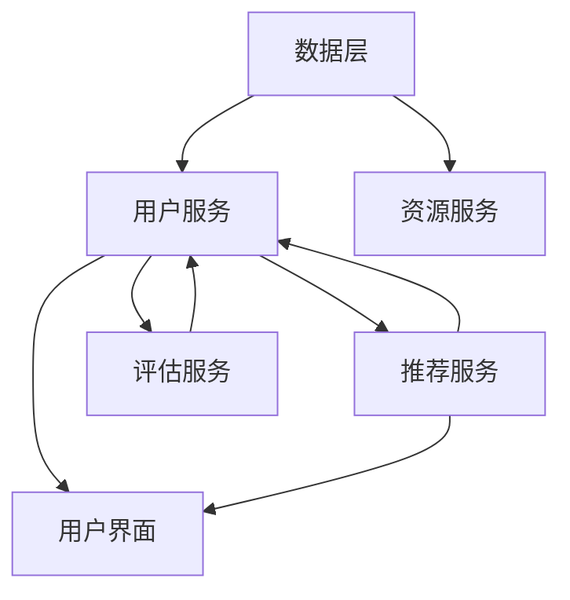
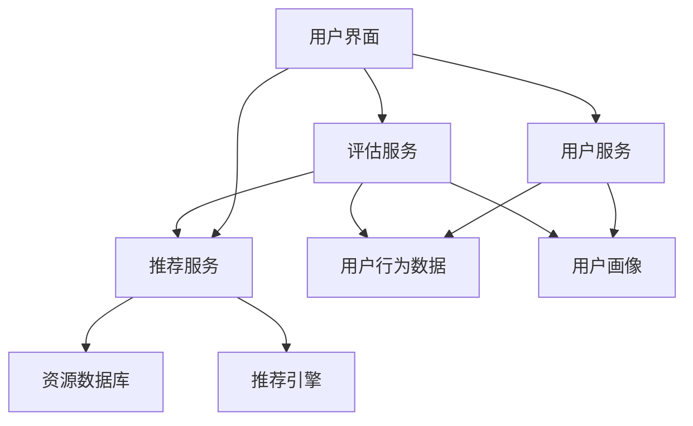
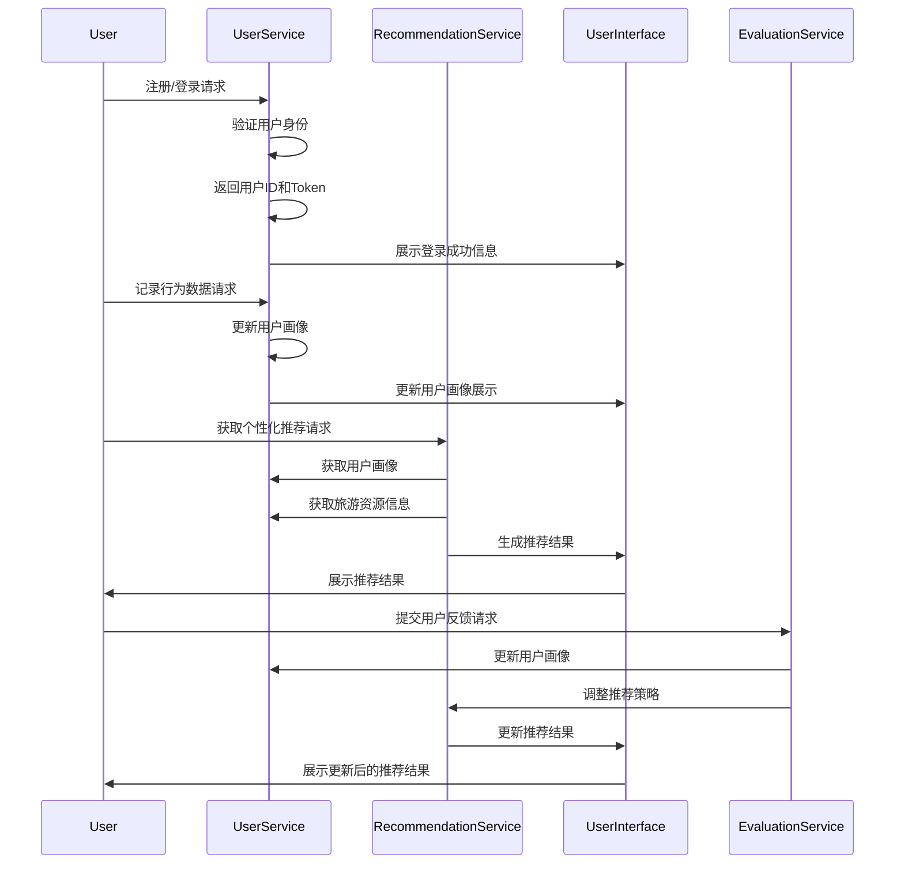

                 

### 1.1 引言

#### 1.1.1 问题背景

随着互联网和移动设备的普及，旅游行业的数字化进程正在加速。旅游推荐系统作为一种智能服务，旨在为用户提供个性化的旅游建议，从而提升用户满意度和忠诚度。然而，传统的推荐系统往往依赖于用户的历史行为数据，忽略了用户的个性化需求和偏好。为了解决这一问题，机器学习技术被引入到旅游推荐系统中，通过分析用户的行为数据，挖掘用户的兴趣和偏好，实现更精准的个性化推荐。

#### 1.1.2 问题解决

机器学习在个性化旅游推荐中的应用，主要解决了以下几个问题：

1. **用户偏好挖掘**：通过分析用户的历史行为数据，如浏览记录、搜索关键词、评论等，挖掘用户的兴趣点和偏好，为个性化推荐提供基础。
2. **推荐算法优化**：利用机器学习算法，如协同过滤、内容推荐和深度学习模型，对推荐算法进行优化，提高推荐结果的准确性和多样性。
3. **动态推荐**：根据用户实时行为数据，动态调整推荐策略，实现实时、个性化的旅游推荐。
4. **推荐系统评估**：通过评估指标，如准确率、召回率和覆盖率等，对推荐系统的效果进行评估和优化。

#### 1.1.3 边界与外延

尽管机器学习在个性化旅游推荐中具有巨大潜力，但也存在一些边界和挑战：

1. **数据隐私**：用户数据隐私保护是推荐系统面临的重要问题，需要采取有效的数据隐私保护措施。
2. **数据质量**：推荐系统的效果很大程度上依赖于数据质量，需要确保数据来源可靠、数据完整性和一致性。
3. **计算资源**：大规模机器学习模型的训练和部署需要大量的计算资源，特别是在实时推荐场景中。
4. **用户反馈**：用户偏好和兴趣是动态变化的，如何及时获取用户反馈，调整推荐策略，是推荐系统需要考虑的问题。

#### 1.1.4 核心要素组成

个性化旅游推荐系统的核心要素包括：

1. **用户数据**：包括用户的基本信息、历史行为数据、兴趣偏好等。
2. **旅游资源数据**：包括旅游景点、酒店、餐饮、交通等旅游相关资源的信息。
3. **推荐算法**：包括协同过滤、内容推荐和深度学习等算法。
4. **推荐系统架构**：包括数据存储、数据处理、模型训练、推荐生成和系统交互等模块。
5. **评估与优化**：通过评估指标和用户反馈，对推荐系统进行持续优化。

通过上述分析，我们可以看到，机器学习在个性化旅游推荐中的应用不仅解决了推荐系统的精准性和动态性，还带来了新的挑战。接下来，我们将进一步探讨机器学习在个性化旅游推荐中的核心概念、算法原理、系统架构以及项目实战，以期为读者提供全面的技术洞察和实际应用指导。

### 1.2 机器学习基础

在深入探讨机器学习在个性化旅游推荐中的应用之前，有必要首先了解一些机器学习的基础知识。本节将介绍机器学习的基本概念、数据预处理方法以及特征工程的重要性。

#### 1.2.1 基本概念

机器学习是一门人工智能的分支，旨在使计算机系统能够从数据中学习和改进，从而无需显式编程。根据学习方式，机器学习可以分为以下几类：

1. **监督学习（Supervised Learning）**：在监督学习场景中，训练数据集包含了输入特征和对应的输出标签。通过训练模型，模型可以学习到特征与标签之间的关系，并在新的数据上进行预测。常见的监督学习算法包括线性回归、逻辑回归、决策树、随机森林等。

2. **无监督学习（Unsupervised Learning）**：无监督学习场景下，数据集没有对应的输出标签。模型需要通过挖掘数据中的内在结构或模式来实现分类、聚类等任务。常见的无监督学习算法包括K-均值聚类、主成分分析（PCA）、自编码器等。

3. **强化学习（Reinforcement Learning）**：强化学习通过智能体（Agent）与环境的交互，学习到最优策略。智能体通过接收奖励信号，不断调整其行为策略，以最大化长期回报。常见的强化学习算法包括Q-learning、Deep Q-Network（DQN）、Policy Gradients等。

#### 1.2.2 数据预处理

数据预处理是机器学习流程中的关键步骤，旨在提高数据质量和模型的性能。主要步骤包括：

1. **数据清洗**：去除噪声数据、处理缺失值和异常值，确保数据的一致性和准确性。
2. **数据集成**：合并来自多个源的数据，解决数据重复、冲突等问题，确保数据完整性和一致性。
3. **数据转换**：将数据转换为适合模型训练的格式，如归一化、标准化、离散化等。
4. **数据降维**：通过降维技术，如主成分分析（PCA）、特征选择等，减少数据维度，提高模型训练效率。

#### 1.2.3 特征工程

特征工程是机器学习中的核心任务之一，旨在从原始数据中提取出有助于模型训练的特征。良好的特征工程可以提高模型的性能和可解释性。主要步骤包括：

1. **特征选择**：从原始特征中筛选出对目标变量有重要影响的特征，减少特征维度，提高模型效率。
2. **特征构造**：通过组合、转换或衍生新的特征，增强模型的预测能力。例如，使用交互特征、时间特征等。
3. **特征缩放**：对特征进行标准化或归一化处理，使特征具有相同的量级，避免模型对某些特征产生偏好。
4. **特征重要性评估**：通过模型训练结果，评估每个特征的重要性，为后续特征优化提供依据。

#### 1.2.4 小结

机器学习在个性化旅游推荐中的应用，离不开对基本概念的深入理解、对数据预处理方法的掌握以及对特征工程技术的应用。通过这些技术，我们可以从大量的用户行为数据和旅游资源数据中提取出有价值的信息，为构建高效的推荐系统奠定基础。接下来，我们将进一步探讨机器学习在个性化旅游推荐中的核心概念及其在系统中的应用。

### 1.3 个性化旅游推荐概述

在了解了机器学习的基础知识后，我们需要深入了解个性化旅游推荐的概念及其应用场景。个性化旅游推荐系统通过分析用户行为数据和旅游资源信息，为用户提供个性化的旅游建议，提高用户满意度和忠诚度。

#### 1.3.1 概念介绍

个性化旅游推荐系统（Personalized Travel Recommendation System）是一种基于用户兴趣、偏好和历史行为的智能推荐系统。它通过以下几种方式为用户提供个性化推荐：

1. **基于内容的推荐（Content-Based Recommendation）**：根据用户过去喜欢的旅游景点、酒店等资源，推荐相似的内容。这种方法依赖于对资源内容和用户兴趣的充分理解。
2. **协同过滤推荐（Collaborative Filtering Recommendation）**：通过分析用户之间的行为模式，发现相似用户并推荐他们喜欢的资源。协同过滤分为两种：基于用户的协同过滤（User-Based Collaborative Filtering）和基于项目的协同过滤（Item-Based Collaborative Filtering）。
3. **基于模型的推荐（Model-Based Recommendation）**：利用机器学习算法，如矩阵分解、深度学习等，建立用户与资源之间的关系模型，预测用户可能感兴趣的资源。
4. **基于上下文的推荐（Context-Aware Recommendation）**：考虑用户当前的环境和上下文信息，如时间、地点等，为用户推荐最合适的旅游资源和活动。

#### 1.3.2 应用场景

个性化旅游推荐系统在多个场景中具有广泛应用，包括但不限于：

1. **旅游网站和APP**：通过个性化推荐，用户可以快速找到符合自己兴趣和预算的旅游景点、酒店和交通方案。
2. **在线旅行社（OTA）**：OTA平台可以利用个性化推荐系统，为用户提供定制化的旅行套餐和服务。
3. **旅游咨询服务**：通过个性化推荐，旅游咨询服务可以提供更精准、个性化的旅游建议，提高服务质量和用户满意度。
4. **旅游规划工具**：旅游规划工具可以利用个性化推荐，帮助用户快速规划出行路线和行程，节省时间和精力。

#### 1.3.3 需求分析

个性化旅游推荐系统需要满足以下需求：

1. **高准确性**：推荐系统能够准确预测用户对旅游资源的兴趣，提高推荐结果的准确性。
2. **多样性**：推荐系统应提供多样化的旅游资源，满足不同用户的需求和偏好。
3. **实时性**：推荐系统需要能够实时处理用户行为数据，快速生成推荐结果。
4. **可解释性**：推荐系统应具有较好的可解释性，用户可以理解推荐结果的原因和依据。
5. **可扩展性**：推荐系统应具备良好的可扩展性，能够适应不断变化的数据和应用需求。

通过上述分析，我们可以看到，个性化旅游推荐系统在旅游行业中具有重要的应用价值。接下来，我们将深入探讨机器学习与个性化旅游推荐之间的联系，以及如何在实际应用中实现有效的个性化推荐。

### 2.1 机器学习核心概念

在个性化旅游推荐系统中，机器学习扮演着至关重要的角色。为了深入理解机器学习在个性化旅游推荐中的应用，我们需要首先掌握一些核心概念，包括监督学习、无监督学习和强化学习。

#### 2.1.1 监督学习

监督学习是一种常见的机器学习任务，其核心在于通过已有的输入特征和对应的输出标签，训练一个模型，使模型能够对新数据进行预测。监督学习的训练过程通常分为以下几个步骤：

1. **数据收集与预处理**：首先需要收集大量带有标签的数据，并进行数据清洗、预处理，确保数据质量。
2. **特征提取**：从原始数据中提取出对模型训练有帮助的特征，通过特征工程提高数据的可用性。
3. **模型选择**：选择适合问题的机器学习模型，如线性回归、决策树、支持向量机（SVM）等。
4. **模型训练**：使用已处理的数据集，通过训练算法（如梯度下降）训练模型。
5. **模型评估**：通过验证集或测试集评估模型的性能，如准确率、召回率、F1值等。
6. **模型优化**：根据评估结果，调整模型参数，优化模型性能。

监督学习在个性化旅游推荐中的应用包括用户偏好预测、旅游资源分类和推荐算法优化等。例如，通过分析用户的历史浏览记录和预订行为，可以预测用户对某个旅游资源的偏好，从而实现个性化的旅游推荐。

#### 2.1.2 无监督学习

无监督学习与监督学习不同，它不需要预先标注的输出标签，而是通过挖掘数据内在的结构和模式来实现分类、聚类等任务。无监督学习主要包括以下几种方法：

1. **聚类（Clustering）**：将相似的数据点划分为同一个类别，常见的聚类算法有K-均值聚类、层次聚类等。在个性化旅游推荐中，聚类算法可以用于用户分群，根据用户行为和偏好将用户划分为不同的群体，从而实现更精准的推荐。
2. **降维（Dimensionality Reduction）**：通过降维技术，如主成分分析（PCA）、线性判别分析（LDA）等，减少数据维度，提高模型训练效率。在个性化旅游推荐中，降维技术可以帮助我们提取出最有用的特征，减少计算复杂度。
3. **关联规则学习（Association Rule Learning）**：通过挖掘数据中的关联关系，发现不同特征之间的关联模式。在个性化旅游推荐中，关联规则学习可以用于发现用户在旅游活动中的偏好组合，为推荐策略提供依据。

#### 2.1.3 强化学习

强化学习是一种通过试错和反馈进行学习的机器学习范式。在强化学习场景中，智能体（Agent）通过与环境的交互，学习到最优策略，从而实现目标最大化。强化学习的核心包括：

1. **状态（State）**：描述当前环境的状态信息。
2. **动作（Action）**：智能体可以采取的动作集合。
3. **奖励（Reward）**：智能体执行动作后，从环境中获得的奖励信号，用于指导智能体调整策略。
4. **策略（Policy）**：智能体在给定状态下采取的最优动作。
5. **价值函数（Value Function）**：用于评估智能体在某个状态下的长期回报。
6. **模型（Model）**：智能体对环境动态的预测模型。

在个性化旅游推荐中，强化学习可以用于动态调整推荐策略，如根据用户实时反馈和互动行为，不断优化推荐结果。例如，用户对推荐资源的点击和购买行为可以作为奖励信号，指导推荐系统调整推荐策略，提高推荐效果。

#### 2.1.4 小结

通过了解监督学习、无监督学习和强化学习这三种核心机器学习概念，我们可以更好地理解个性化旅游推荐系统的原理和应用。监督学习通过已标注的数据进行预测，适用于用户偏好预测和推荐算法优化；无监督学习通过挖掘数据内在结构，实现用户分群和特征降维；强化学习通过试错和反馈，实现动态调整推荐策略。这些机器学习技术相互结合，为个性化旅游推荐系统提供了强大的技术支持。接下来，我们将进一步探讨个性化旅游推荐系统中的核心概念及其实现方法。

### 2.2 旅游推荐系统中的核心概念

个性化旅游推荐系统是利用大数据和机器学习技术，为用户提供定制化旅游建议的系统。在构建这样的系统时，需要理解几个关键概念，包括用户行为分析、旅游资源分类和推荐算法类型。

#### 2.2.1 用户行为分析

用户行为分析是个性化旅游推荐系统的基石。通过分析用户的行为数据，如浏览记录、搜索关键词、点击行为、预订历史、评价和反馈等，可以深入了解用户的兴趣、偏好和需求。以下是用户行为分析的一些具体方法：

1. **行为轨迹分析**：分析用户的浏览路径、搜索历史和点击流数据，发现用户的兴趣点和浏览偏好。
2. **评分和评价分析**：通过用户对旅游资源的评分和评价，了解用户对旅游资源的满意度，以及不同用户群体对资源的偏好。
3. **反馈和互动分析**：收集用户的反馈信息和互动行为，如评论、问答和论坛讨论，从中提取有价值的信息，帮助优化推荐系统。
4. **个性化标签和标签云**：为用户生成个性化的标签，用于描述用户的兴趣和偏好，并将这些标签用于推荐算法中。

通过用户行为分析，推荐系统可以动态调整推荐策略，实现更精准的个性化推荐。

#### 2.2.2 旅游资源分类

旅游资源分类是构建个性化旅游推荐系统的重要环节。旅游资源包括景点、酒店、餐饮、交通等，它们可以根据不同的特征进行分类。以下是几种常见的旅游资源分类方法：

1. **按地理位置分类**：将旅游资源按照地理位置进行分类，如城市、省份、国家等。
2. **按类型分类**：将旅游资源按照类型进行分类，如自然景观、文化古迹、娱乐活动等。
3. **按等级和价格分类**：将旅游资源按照等级和价格进行分类，帮助用户快速筛选合适的资源。
4. **按用户偏好分类**：根据用户的浏览和预订历史，将旅游资源分类为用户可能感兴趣的类型。

通过合理的旅游资源分类，推荐系统可以更好地满足用户需求，提高推荐效果。

#### 2.2.3 推荐算法类型

个性化旅游推荐系统常用的算法类型包括基于内容的推荐、协同过滤推荐和基于模型的推荐等。以下是这些算法的简介和特点：

1. **基于内容的推荐（Content-Based Recommendation）**：根据用户的历史行为和偏好，推荐与用户感兴趣的内容相似的旅游资源。这种方法依赖于对资源内容和用户兴趣的充分理解。优点是推荐结果具有高相关性，但可能缺乏多样性。

2. **协同过滤推荐（Collaborative Filtering Recommendation）**：通过分析用户之间的行为模式，发现相似用户并推荐他们喜欢的旅游资源。协同过滤分为基于用户的协同过滤和基于项目的协同过滤。优点是推荐结果具有较高的准确性和多样性，但可能受到数据稀疏性问题的影响。

3. **基于模型的推荐（Model-Based Recommendation）**：利用机器学习算法，如矩阵分解、深度学习等，建立用户与资源之间的关系模型，预测用户可能感兴趣的资源。优点是能够处理大规模数据，提高推荐准确性，但需要大量计算资源。

#### 2.2.4 小结

用户行为分析、旅游资源分类和推荐算法类型是构建个性化旅游推荐系统的核心概念。通过深入理解这些概念，我们可以设计出更精准、高效的推荐系统，满足用户的个性化需求，提高用户满意度和忠诚度。接下来，我们将探讨如何将机器学习技术与个性化旅游推荐系统相结合，实现有效的推荐。

### 2.3 机器学习与个性化旅游推荐的联系

在深入探讨个性化旅游推荐系统之前，我们需要明确机器学习与个性化旅游推荐之间的联系。机器学习作为人工智能的重要分支，为个性化旅游推荐提供了强大的技术支持，使得推荐系统能够更精准地满足用户的个性化需求。以下是机器学习与个性化旅游推荐之间的几个关键联系：

#### 2.3.1 关键技术

1. **协同过滤（Collaborative Filtering）**：协同过滤是一种常见的机器学习推荐算法，通过分析用户之间的行为模式，发现相似用户并推荐他们喜欢的资源。协同过滤分为基于用户的协同过滤和基于项目的协同过滤。基于用户的协同过滤通过找到与当前用户行为相似的过去用户，推荐他们喜欢的资源；基于项目的协同过滤通过分析过去用户对资源的评分，推荐与用户已评分资源相似的资源。协同过滤算法在个性化旅游推荐中，可以帮助我们发现用户的兴趣点，提高推荐结果的准确性和多样性。

2. **矩阵分解（Matrix Factorization）**：矩阵分解是一种常用的协同过滤算法，通过将用户-资源评分矩阵分解为用户特征矩阵和资源特征矩阵，从而预测未评分的资源。矩阵分解可以有效地处理数据稀疏性问题，提高推荐系统的性能。在个性化旅游推荐中，矩阵分解可以帮助我们挖掘用户和资源之间的潜在关系，实现更精准的推荐。

3. **深度学习（Deep Learning）**：深度学习是近年来发展迅速的机器学习技术，通过构建多层神经网络，自动提取数据中的特征。在个性化旅游推荐中，深度学习算法可以用于用户行为分析和资源分类，实现更复杂的特征提取和预测。例如，使用卷积神经网络（CNN）可以提取图像特征，用于景点分类和推荐；使用循环神经网络（RNN）可以处理用户的历史行为数据，预测用户的兴趣变化。

4. **强化学习（Reinforcement Learning）**：强化学习通过智能体与环境之间的交互，学习到最优策略。在个性化旅游推荐中，强化学习可以用于动态调整推荐策略，根据用户的实时反馈和互动行为，优化推荐结果。例如，通过Q-learning算法，推荐系统可以不断调整推荐策略，最大化用户的点击率和购买率。

#### 2.3.2 实现难点

尽管机器学习技术为个性化旅游推荐提供了强大的支持，但在实际应用中，仍存在一些难点：

1. **数据质量**：推荐系统的效果很大程度上依赖于数据质量。在个性化旅游推荐中，数据源可能包括用户行为数据、旅游资源数据等，这些数据可能存在噪声、缺失值和异常值。为了保证推荐系统的准确性，需要对数据进行清洗、预处理和去噪。

2. **计算资源**：大规模机器学习模型的训练和部署需要大量的计算资源。在实时推荐场景中，计算资源的需求更高。为了提高计算效率，可以采用分布式计算和并行计算技术，例如使用GPU加速模型训练。

3. **用户隐私**：用户数据隐私保护是推荐系统面临的重要问题。在处理用户数据时，需要采取有效的数据隐私保护措施，如数据加密、差分隐私等，确保用户数据的安全。

4. **模型可解释性**：机器学习模型，特别是深度学习模型，通常具有很高的预测准确性，但模型内部的结构和决策过程往往不够透明。在个性化旅游推荐中，模型的可解释性对于用户信任和系统优化至关重要。可以通过可视化和解释算法，提高模型的可解释性。

#### 2.3.3 解决方案

为了解决上述难点，可以采取以下解决方案：

1. **数据质量优化**：通过数据预处理技术，如缺失值填充、异常值检测和去噪等，提高数据质量。此外，可以采用数据增强技术，生成更多的训练数据，提高模型泛化能力。

2. **计算资源优化**：采用分布式计算和并行计算技术，提高模型训练和部署的效率。例如，使用GPU加速训练过程，采用分布式框架（如TensorFlow、PyTorch）进行模型训练和部署。

3. **用户隐私保护**：采用数据加密、差分隐私等技术，确保用户数据的安全和隐私。在数据处理过程中，可以采用数据去标识化技术，减少对用户隐私的暴露。

4. **模型可解释性提升**：通过可视化和解释算法，提高模型的可解释性。例如，使用决策树、规则提取等技术，解释模型的决策过程；使用可视化工具，展示模型训练过程和预测结果。

通过上述技术手段，可以有效地解决个性化旅游推荐系统在实现过程中面临的难点，提高推荐系统的准确性和用户满意度。接下来，我们将进一步探讨个性化旅游推荐系统的算法原理，为读者提供更深入的技术洞察。

### 3.1 个性化旅游推荐算法

个性化旅游推荐算法是构建个性化旅游推荐系统的核心，它通过分析用户行为数据和旅游资源信息，为用户提供精准的旅游推荐。以下是几种常用的个性化旅游推荐算法，包括协同过滤、内容推荐和深度学习模型。

#### 3.1.1 协同过滤

协同过滤是一种基于用户相似度和物品相似度的推荐算法，主要通过分析用户行为数据，发现相似用户和相似物品，从而进行推荐。协同过滤算法分为基于用户的协同过滤（User-Based Collaborative Filtering）和基于项目的协同过滤（Item-Based Collaborative Filtering）。

1. **基于用户的协同过滤**：这种方法通过计算用户之间的相似度，找到与目标用户相似的其他用户，然后推荐这些相似用户喜欢的资源。相似度的计算通常基于用户之间的行为相似性，如共同评分的物品数量、评分差等。

2. **基于项目的协同过滤**：这种方法通过计算物品之间的相似度，找到与目标物品相似的其他物品，然后推荐这些相似物品。物品相似度的计算通常基于物品的属性相似性，如标签、类别等。

**优点**：
- **简单有效**：协同过滤算法实现简单，适用于大多数推荐场景。
- **易于扩展**：可以通过增加用户和物品的维度，提高推荐系统的精度。

**缺点**：
- **数据稀疏性**：协同过滤算法在用户行为数据稀疏的情况下，推荐效果不佳。
- **用户冷启动**：新用户没有历史行为数据，难以进行推荐。

#### 3.1.2 内容推荐

内容推荐是一种基于物品属性的推荐方法，通过分析物品的特征和用户的兴趣，为用户推荐具有相似属性的物品。内容推荐算法通常分为基于属性的协同过滤（Attribute-Based Collaborative Filtering）和基于内容的匹配（Content-Based Filtering）。

1. **基于属性的协同过滤**：这种方法通过计算物品之间的属性相似度，为用户推荐具有相似属性的物品。例如，如果用户喜欢一个风景优美的景点，可以推荐其他风景优美的景点。

2. **基于内容的匹配**：这种方法通过分析用户的历史行为和兴趣，提取用户特征，然后根据用户特征与物品特征的匹配度进行推荐。例如，如果用户喜欢登山活动，可以推荐与其兴趣相符的登山景点。

**优点**：
- **推荐精度高**：通过分析物品的属性和用户特征，可以提供更精准的推荐。
- **易于实现**：内容推荐算法实现相对简单，易于集成到现有系统中。

**缺点**：
- **推荐多样性不足**：内容推荐算法可能产生高度相似的推荐结果，缺乏多样性。

#### 3.1.3 深度学习模型

深度学习模型通过构建多层神经网络，自动提取数据中的特征，实现高效的推荐。在个性化旅游推荐中，深度学习模型可以用于用户行为分析和资源分类。

1. **基于矩阵分解的深度学习模型**：这种方法将用户-资源评分矩阵分解为用户特征矩阵和资源特征矩阵，通过深度神经网络进一步提取特征，实现推荐。

2. **基于循环神经网络的深度学习模型**：这种方法利用循环神经网络（RNN）处理用户的历史行为数据，捕捉用户的长期兴趣变化。

3. **基于卷积神经网络的深度学习模型**：这种方法利用卷积神经网络（CNN）处理图像数据，提取图像特征，实现景点分类和推荐。

**优点**：
- **高效特征提取**：深度学习模型可以自动提取数据中的复杂特征，提高推荐精度。
- **适用性强**：深度学习模型可以处理大规模数据，适用于不同的推荐场景。

**缺点**：
- **计算复杂度高**：深度学习模型的训练和部署需要大量计算资源。
- **模型解释性差**：深度学习模型的决策过程不够透明，难以解释。

#### 3.1.4 小结

个性化旅游推荐算法通过协同过滤、内容推荐和深度学习模型等多种方式，为用户提供精准、个性化的旅游推荐。协同过滤算法简单有效，但存在数据稀疏性问题；内容推荐算法推荐精度高，但多样性不足；深度学习模型具有高效的特征提取能力，但计算复杂度高，模型解释性差。在实际应用中，可以根据具体需求和资源情况，选择合适的推荐算法，构建高效的个性化旅游推荐系统。

### 3.2 算法原理与数学模型

在个性化旅游推荐系统中，算法的原理和数学模型是理解推荐过程的核心。在本节中，我们将深入探讨协同过滤、内容推荐和深度学习模型的基本原理，并结合具体的数学模型和公式，以便读者能够更好地理解这些算法。

#### 3.2.1 协同过滤原理

协同过滤算法基于用户之间的相似度和物品之间的相似度进行推荐。以下是两种主要类型的协同过滤算法：基于用户的协同过滤和基于项目的协同过滤。

1. **基于用户的协同过滤（User-Based Collaborative Filtering）**

   **相似度计算**：
   用户相似度通常通过余弦相似度或皮尔逊相关系数计算。给定两个用户 \( u \) 和 \( v \)，它们的相似度 \( sim(u, v) \) 可以表示为：

   $$ sim(u, v) = \frac{u \cdot v}{\|u\| \|v\|} $$

   其中，\( u \) 和 \( v \) 是用户的行为向量，\( \|u\| \) 和 \( \|v\| \) 是向量的欧几里得范数。

   **推荐计算**：
   对于一个新用户 \( u \)，找到与他最相似的 \( k \) 个用户，然后推荐这些用户喜欢的但新用户还未评价的物品。推荐得分可以通过加权平均计算：

   $$ \hat{r}_{uv} = \sum_{v' \in N(u)} r_{uv'} \cdot sim(u, v') / \sum_{v' \in N(u)} sim(u, v') $$

   其中，\( N(u) \) 是与用户 \( u \) 相似的前 \( k \) 个用户，\( r_{uv'} \) 是用户 \( u \) 对物品 \( v' \) 的评分。

2. **基于项目的协同过滤（Item-Based Collaborative Filtering）**

   **相似度计算**：
   物品相似度通常通过计算用户对物品的评分差异来衡量。给定两个物品 \( i \) 和 \( j \)，它们的相似度 \( sim(i, j) \) 可以表示为：

   $$ sim(i, j) = 1 - \frac{\sum_{u \in U} |r_{ui} - r_{uj}|}{\|r_{u} - \mu\|} $$

   其中，\( U \) 是评价过物品 \( i \) 和 \( j \) 的用户集合，\( r_{ui} \) 和 \( r_{uj} \) 分别是用户 \( u \) 对物品 \( i \) 和 \( j \) 的评分，\( \mu \) 是所有评分的平均值。

   **推荐计算**：
   对于用户 \( u \)，找到他喜欢的物品 \( i \)，然后推荐与这些物品最相似的物品 \( j \)，其推荐得分计算如下：

   $$ \hat{r}_{uj} = \sum_{i \in R(u)} r_{ui} \cdot sim(i, j) / \sum_{i \in R(u)} sim(i, j) $$

   其中，\( R(u) \) 是用户 \( u \) 已经评价过的物品集合。

#### 3.2.2 内容推荐原理

内容推荐算法基于物品的属性和用户的兴趣进行推荐。以下是两种主要的内容推荐算法：基于属性的协同过滤和基于内容的匹配。

1. **基于属性的协同过滤（Attribute-Based Collaborative Filtering）**

   **属性匹配**：
   物品和用户的属性可以表示为向量，属性匹配通过计算属性向量之间的相似度实现。给定两个物品 \( i \) 和 \( j \)，它们的属性相似度 \( attr\_sim(i, j) \) 可以表示为：

   $$ attr\_sim(i, j) = \frac{\sum_{a \in A} w_a \cdot min(|a_i|, |a_j|)}{\sum_{a \in A} w_a \cdot |a_i| + \sum_{a \in A} w_a \cdot |a_j|} $$

   其中，\( A \) 是所有属性的集合，\( w_a \) 是属性 \( a \) 的权重，\( |a_i| \) 和 \( |a_j| \) 分别是物品 \( i \) 和 \( j \) 在属性 \( a \) 上的值。

   **推荐计算**：
   对于用户 \( u \)，找到他喜欢的物品 \( i \)，然后推荐与这些物品在属性上最相似的物品 \( j \)，其推荐得分计算如下：

   $$ \hat{r}_{uj} = \sum_{i \in R(u)} r_{ui} \cdot attr\_sim(i, j) / \sum_{i \in R(u)} attr\_sim(i, j) $$

2. **基于内容的匹配（Content-Based Filtering）**

   **内容特征提取**：
   物品的内容特征可以通过文本挖掘、图像识别等技术提取。例如，对于旅游景点的推荐，可以提取景点的描述文本、标签、图像等特征。

   **内容匹配**：
   内容匹配通过计算物品特征向量和用户兴趣向量之间的相似度实现。给定用户 \( u \) 的兴趣向量 \( q \) 和物品 \( i \) 的特征向量 \( f_i \)，它们的相似度 \( cont\_sim(q, f_i) \) 可以表示为：

   $$ cont\_sim(q, f_i) = \frac{q \cdot f_i}{\|q\| \|f_i\|} $$

   **推荐计算**：
   对于用户 \( u \)，找到他喜欢的物品 \( i \)，然后推荐与这些物品在内容上最相似的物品 \( j \)，其推荐得分计算如下：

   $$ \hat{r}_{uj} = \sum_{i \in R(u)} r_{ui} \cdot cont\_sim(q, f_j) / \sum_{i \in R(u)} cont\_sim(q, f_j) $$

#### 3.2.3 深度学习模型原理

深度学习模型通过构建多层神经网络，自动提取数据中的特征，实现高效的推荐。以下是几种常见的深度学习模型：基于矩阵分解的深度学习模型、基于循环神经网络的深度学习模型和基于卷积神经网络的深度学习模型。

1. **基于矩阵分解的深度学习模型**

   **模型架构**：
   基于矩阵分解的深度学习模型通常包括两个部分：矩阵分解和深度神经网络。矩阵分解部分将用户-资源评分矩阵分解为用户特征矩阵和资源特征矩阵，深度神经网络部分用于进一步提取特征和预测。

   **数学模型**：
   假设用户特征矩阵为 \( U \in \mathbb{R}^{m \times k} \)，资源特征矩阵为 \( V \in \mathbb{R}^{n \times k} \)，评分矩阵为 \( R \in \mathbb{R}^{m \times n} \)。通过矩阵分解，得到：

   $$ R \approx U^T V $$

   深度神经网络部分可以表示为：

   $$ U^{'} = \sigma(W_1^T U + b_1) $$
   $$ V^{'} = \sigma(W_2^T V + b_2) $$
   $$ \hat{R} = U^{'} V^{'} $$

   其中，\( \sigma \) 是激活函数，\( W_1 \)、\( W_2 \)、\( b_1 \) 和 \( b_2 \) 是模型的权重和偏置。

2. **基于循环神经网络的深度学习模型**

   **模型架构**：
   基于循环神经网络的深度学习模型通常用于处理用户的历史行为数据，通过循环神经网络（RNN）捕捉用户的长期兴趣变化。

   **数学模型**：
   假设用户历史行为数据为序列 \( X \in \mathbb{R}^{T \times d} \)，其中 \( T \) 是时间步数，\( d \) 是数据维度。循环神经网络可以表示为：

   $$ h_t = \sigma(W_h h_{t-1} + W_x x_t + b_h) $$
   $$ \hat{y}_t = \sigma(W_y h_t + b_y) $$

   其中，\( h_t \) 是第 \( t \) 个时间步的隐藏状态，\( W_h \)、\( W_x \)、\( W_y \) 和 \( b_h \)、\( b_y \) 是模型的权重和偏置。

3. **基于卷积神经网络的深度学习模型**

   **模型架构**：
   基于卷积神经网络的深度学习模型通常用于处理图像数据，通过卷积神经网络（CNN）提取图像特征。

   **数学模型**：
   假设输入图像为 \( I \in \mathbb{R}^{h \times w \times c} \)，其中 \( h \)、\( w \) 是图像的高度和宽度，\( c \) 是颜色通道数。卷积神经网络可以表示为：

   $$ h_t = \sigma(W_c \odot I + b_c) $$
   $$ \hat{y} = \sigma(W_y h + b_y) $$

   其中，\( \odot \) 表示卷积操作，\( W_c \) 和 \( b_c \) 是卷积核和偏置，\( W_y \) 和 \( b_y \) 是全连接层的权重和偏置。

#### 3.2.4 小结

个性化旅游推荐算法的原理和数学模型涵盖了协同过滤、内容推荐和深度学习模型等多种方法。协同过滤通过用户和物品的相似度进行推荐，内容推荐基于物品的属性和用户的兴趣进行推荐，深度学习模型通过构建多层神经网络自动提取数据中的特征。理解这些算法的原理和数学模型，有助于我们设计和优化个性化旅游推荐系统，提高推荐效果。

### 3.3 算法比较与选择

在个性化旅游推荐系统中，有多种算法可供选择，每种算法都有其独特的优点和适用场景。了解不同算法之间的差异，以及如何根据具体需求选择合适的算法，对于构建高效的推荐系统至关重要。

#### 3.3.1 优势与劣势

1. **协同过滤**

   **优势**：
   - **简单高效**：协同过滤算法实现简单，计算效率高，适用于大多数推荐场景。
   - **准确性和多样性**：协同过滤算法能够通过用户相似度和物品相似度发现用户的兴趣，提供准确的推荐结果，同时保持多样性。

   **劣势**：
   - **数据稀疏性**：协同过滤算法在用户行为数据稀疏的情况下，推荐效果不佳。
   - **用户冷启动**：新用户没有历史行为数据，难以进行推荐。

2. **内容推荐**

   **优势**：
   - **推荐精度高**：内容推荐算法通过分析物品的属性和用户的兴趣，提供精准的推荐。
   - **易于实现**：内容推荐算法实现相对简单，适用于大多数旅游推荐场景。

   **劣势**：
   - **推荐多样性不足**：内容推荐算法可能产生高度相似的推荐结果，缺乏多样性。
   - **对数据质量要求高**：内容推荐算法依赖于物品的属性数据，数据质量对推荐效果有较大影响。

3. **深度学习模型**

   **优势**：
   - **高效特征提取**：深度学习模型可以自动提取数据中的复杂特征，提高推荐精度。
   - **适用性强**：深度学习模型可以处理大规模数据，适用于不同的推荐场景。

   **劣势**：
   - **计算复杂度高**：深度学习模型的训练和部署需要大量计算资源。
   - **模型解释性差**：深度学习模型的决策过程不够透明，难以解释。

#### 3.3.2 适用场景

1. **协同过滤**

   - **场景**：适用于用户行为数据丰富、用户冷启动问题不严重的场景，如大型在线旅游平台、电子商务网站等。
   - **建议**：在数据稀疏的情况下，可以结合其他算法，如内容推荐或深度学习模型，提高推荐效果。

2. **内容推荐**

   - **场景**：适用于旅游资源的属性数据丰富、用户对推荐资源具有明确兴趣的场景，如旅游规划APP、OTA平台等。
   - **建议**：可以结合用户行为数据，如浏览历史和搜索关键词，提高推荐精度。

3. **深度学习模型**

   - **场景**：适用于需要处理大规模数据、追求高精度推荐的场景，如旅游大数据分析、智能旅游规划等。
   - **建议**：在资源允许的情况下，结合协同过滤和内容推荐，构建多模型融合的推荐系统。

#### 3.3.3 混合模型

为了提高推荐系统的整体性能，可以采用混合模型（Hybrid Model）将多种算法相结合。混合模型通过综合不同算法的优点，实现更精准和多样的推荐。

1. **协同过滤 + 内容推荐**

   - **原理**：将协同过滤算法用于发现用户的兴趣，结合内容推荐算法的属性匹配进行推荐。
   - **适用场景**：适用于用户行为数据丰富且旅游资源属性数据详细的场景。

2. **深度学习模型 + 协同过滤**

   - **原理**：利用深度学习模型进行高效的特征提取和预测，结合协同过滤算法进行用户相似度和物品相似度的计算。
   - **适用场景**：适用于需要处理大规模数据和追求高精度推荐的场景。

3. **深度学习模型 + 内容推荐**

   - **原理**：利用深度学习模型提取复杂特征，结合内容推荐算法进行属性匹配和推荐。
   - **适用场景**：适用于旅游资源的属性数据丰富且需要高精度推荐的场景。

#### 3.3.4 小结

个性化旅游推荐系统的算法选择取决于具体需求和数据情况。协同过滤算法简单高效，适用于大多数推荐场景；内容推荐算法推荐精度高，但对数据质量要求高；深度学习模型计算复杂度高，但适用于处理大规模数据和追求高精度推荐。通过结合多种算法，构建混合模型，可以进一步提高推荐系统的性能。在实际应用中，应根据具体场景和需求，选择合适的算法组合，实现高效的个性化旅游推荐。

### 4.1 个性化旅游推荐系统分析

在设计和实现个性化旅游推荐系统时，首先需要对系统进行详细的分析。本节将介绍系统分析的内容，包括问题场景、系统功能设计、数据流程以及系统架构设计。

#### 4.1.1 问题场景

个性化旅游推荐系统面临的主要问题是如何从大量旅游资源和用户行为数据中提取有价值的信息，为用户提供精准、个性化的推荐。具体问题场景如下：

1. **用户冷启动问题**：对于新用户，由于缺乏历史行为数据，传统的协同过滤算法难以提供有效的推荐。因此，需要设计一种方法，能够利用用户的初始信息和全局信息生成初步推荐。
2. **数据稀疏性**：用户行为数据往往呈现出高度稀疏性，这意味着大多数用户对大多数资源都没有评价。如何解决数据稀疏性问题，提高推荐系统的准确性，是一个重要的挑战。
3. **动态性**：用户兴趣和行为是动态变化的，推荐系统需要能够实时更新用户模型，及时调整推荐策略，以满足用户的实时需求。
4. **多样性**：推荐系统需要提供多样化的推荐结果，避免推荐结果过于单一，提高用户体验。

#### 4.1.2 系统功能设计

个性化旅游推荐系统的核心功能包括：

1. **用户行为分析**：通过分析用户的浏览记录、搜索关键词、评论等数据，挖掘用户的兴趣点和偏好。
2. **旅游资源信息管理**：管理旅游资源的基本信息，如景点、酒店、餐饮、交通等，并确保数据质量。
3. **推荐算法实现**：实现多种推荐算法，如协同过滤、内容推荐、深度学习等，生成个性化推荐结果。
4. **推荐结果评估**：通过评估指标（如准确率、召回率、覆盖率等）对推荐系统进行评估和优化。
5. **用户交互**：提供用户界面，展示推荐结果，并收集用户反馈，用于模型优化和推荐策略调整。

#### 4.1.3 数据流程

个性化旅游推荐系统的数据流程主要包括以下几个步骤：

1. **数据收集**：从不同的数据源（如用户行为日志、旅游资源数据库等）收集数据。
2. **数据预处理**：清洗、去噪、归一化等，确保数据质量。
3. **特征提取**：从原始数据中提取对推荐系统有用的特征，如用户兴趣标签、资源属性等。
4. **用户建模**：利用用户行为数据和特征，构建用户兴趣模型。
5. **推荐生成**：使用推荐算法，根据用户兴趣模型和资源信息生成个性化推荐。
6. **评估与优化**：通过评估指标评估推荐效果，根据用户反馈和系统性能，调整推荐策略和模型参数。
7. **结果反馈**：将推荐结果展示给用户，并收集用户反馈，用于后续优化。

#### 4.1.4 系统架构设计

个性化旅游推荐系统的架构设计需要考虑以下几个方面：

1. **数据层**：包括用户行为数据、旅游资源数据等，用于支撑推荐算法的数据需求。
2. **服务层**：包括用户服务、推荐服务、评估服务等，实现系统的核心功能。
3. **界面层**：提供用户交互界面，展示推荐结果和用户反馈。
4. **中间件**：包括数据存储、数据处理、模型训练和部署等，实现系统内部的数据流和功能流。

以下是一个简单的系统架构图：



#### 4.1.5 小结

通过详细分析个性化旅游推荐系统的问题场景、系统功能设计、数据流程和系统架构设计，我们可以清晰地理解系统的实现细节和关键点。在接下来的章节中，我们将深入探讨个性化旅游推荐系统中的具体算法实现、系统架构设计和项目实战，为构建高效的推荐系统提供实际指导。

### 4.2 系统架构设计

个性化旅游推荐系统的设计不仅仅是算法的优化，还需要构建一个灵活、高效、可扩展的系统架构。本节将详细介绍系统架构设计，包括系统架构图、架构设计和接口设计。

#### 4.2.1 系统架构图

以下是一个简单的个性化旅游推荐系统架构图：



在这个架构图中，用户界面（UserInterface）是用户与系统交互的入口，用户服务（UserService）负责处理用户的基本信息和行为数据，推荐服务（RecommendationService）负责生成个性化推荐，评估服务（EvaluationService）用于对推荐结果进行评估和优化。

#### 4.2.2 架构设计

个性化旅游推荐系统可以分为以下几个层次：

1. **数据层**：包括用户行为数据、旅游资源数据等，用于支撑推荐算法的数据需求。数据层使用关系数据库（如MySQL）和NoSQL数据库（如MongoDB）进行数据存储。
2. **服务层**：包括用户服务、推荐服务和评估服务。用户服务（UserService）负责处理用户注册、登录、个人信息管理等操作；推荐服务（RecommendationService）负责调用推荐算法，生成个性化推荐；评估服务（EvaluationService）用于评估推荐效果，包括准确率、召回率等指标。
3. **算法层**：包括协同过滤、内容推荐、深度学习等算法的实现。算法层通过调用服务层提供的接口，实现个性化推荐功能。
4. **接口层**：提供与外部系统的接口，如第三方服务接口、API接口等，以便与其他系统集成。
5. **展示层**：用户界面（UserInterface）通过前端技术（如HTML、CSS、JavaScript等）展示推荐结果，并提供用户交互功能。

#### 4.2.3 接口设计

个性化旅游推荐系统需要设计多个接口，以实现各个模块之间的协同工作。以下是几个关键接口的设计：

1. **用户接口（UserInterface）**：
   - **用户注册/登录**：用于用户注册和登录，返回用户ID和Token。
   - **用户信息查询**：查询用户的基本信息，如用户名、邮箱、密码等。
   - **用户行为记录**：记录用户的浏览记录、搜索关键词、评论等行为数据。

2. **用户服务接口（UserService）**：
   - **用户行为数据接口**：用于获取用户的浏览历史、搜索记录等行为数据。
   - **用户画像接口**：根据用户行为数据构建用户画像，用于推荐算法的输入。

3. **推荐服务接口（RecommendationService）**：
   - **推荐接口**：根据用户画像和旅游资源信息，生成个性化推荐。
   - **推荐评估接口**：评估推荐结果的准确性和多样性。

4. **资源数据库接口（ResourceDatabase）**：
   - **资源信息查询**：查询旅游资源的基本信息，如景点、酒店、餐饮等。
   - **资源分类接口**：根据资源类型和属性进行分类查询。

5. **评估服务接口（EvaluationService）**：
   - **评估接口**：评估推荐结果的准确性、召回率和覆盖率等指标。
   - **反馈接口**：收集用户对推荐结果的反馈，用于模型优化和推荐策略调整。

#### 4.2.4 系统交互设计

个性化旅游推荐系统的交互设计需要考虑用户操作和系统响应的流程。以下是系统交互设计：

1. **用户操作流程**：
   - 用户访问旅游网站或APP。
   - 用户注册/登录，获取用户ID和Token。
   - 用户浏览景点、酒店、餐饮等资源，记录行为数据。
   - 用户提交搜索关键词，获取个性化推荐。
   - 用户对推荐结果进行评价和反馈。

2. **系统响应流程**：
   - 用户服务（UserService）接收到用户请求，获取用户画像和用户行为数据。
   - 推荐服务（RecommendationService）根据用户画像和旅游资源信息，生成个性化推荐。
   - 推荐结果通过用户接口（UserInterface）展示给用户。
   - 评估服务（EvaluationService）对推荐结果进行评估，收集用户反馈。
   - 根据评估结果和用户反馈，调整推荐策略和模型参数。

通过系统架构设计、接口设计和交互设计，个性化旅游推荐系统可以实现高效、灵活、可扩展的推荐功能，满足用户的个性化需求。

### 4.3 系统交互设计

在个性化旅游推荐系统中，系统交互设计是确保用户与推荐系统之间顺畅交互的重要环节。良好的交互设计不仅能够提高用户体验，还能够有效收集用户反馈，优化推荐系统。以下是系统交互设计的详细内容，包括交互流程和系统交互的Mermaid序列图。

#### 4.3.1 交互流程

个性化旅游推荐系统的交互流程主要包括以下几个步骤：

1. **用户注册/登录**：用户通过注册/登录接口，提交用户名、密码等信息，获取用户ID和Token。系统验证用户身份，返回登录成功信息。

2. **用户行为数据记录**：用户在浏览景点、酒店、餐饮等资源时，系统记录用户的行为数据，如浏览记录、搜索关键词、点击行为、评价等。

3. **用户画像构建**：用户服务模块（UserService）根据用户的行为数据，构建用户画像，包括用户的兴趣标签、偏好等信息。

4. **个性化推荐生成**：推荐服务模块（RecommendationService）调用推荐算法，根据用户画像和旅游资源信息，生成个性化推荐列表。

5. **推荐结果展示**：用户接口（UserInterface）将推荐结果展示给用户，包括推荐景点的名称、图片、简介等信息。

6. **用户反馈收集**：用户对推荐结果进行评价和反馈，如喜欢、不喜欢、评论等。系统收集这些反馈，用于后续的推荐策略调整和模型优化。

7. **推荐结果评估**：评估服务模块（EvaluationService）对推荐结果进行评估，包括准确率、召回率、覆盖率等指标。根据评估结果和用户反馈，调整推荐算法和模型参数。

8. **推荐策略调整**：根据用户反馈和系统评估结果，推荐服务模块（RecommendationService）调整推荐策略，优化推荐结果。

#### 4.3.2 系统交互的Mermaid序列图

以下是系统交互流程的Mermaid序列图：



在这个序列图中，用户（User）通过用户接口（UserInterface）与用户服务（UserService）、推荐服务（RecommendationService）和评估服务（EvaluationService）进行交互。用户服务负责处理用户的注册、登录、行为数据记录和用户画像构建；推荐服务负责生成个性化推荐和调整推荐策略；评估服务负责收集用户反馈和评估推荐结果。

通过详细的交互流程和Mermaid序列图，个性化旅游推荐系统的系统交互设计得以清晰展示。这种设计不仅确保了用户与系统的顺畅交互，还为后续的系统优化和功能扩展提供了良好的基础。

### 5.1 项目环境安装

在开始个性化旅游推荐项目的开发之前，我们需要搭建一个合适的环境来安装所需的软件和工具。以下是项目环境的安装步骤，包括硬件环境、软件环境和工具安装。

#### 5.1.1 硬件环境

1. **CPU**：推荐使用至少四核的CPU，以提高计算效率。
2. **内存**：至少16GB的RAM，以便处理大规模数据。
3. **硬盘**：至少500GB的SSD存储空间，用于存储数据和模型。
4. **GPU**（可选）：如果需要使用深度学习算法，推荐安装NVIDIA GPU，以加速模型训练。

#### 5.1.2 软件环境

1. **操作系统**：推荐使用Linux发行版，如Ubuntu 18.04或更高版本。
2. **Python**：推荐使用Python 3.7或更高版本，确保兼容性。
3. **pip**：Python的包管理器，用于安装和管理Python包。
4. **Jupyter Notebook**：用于数据分析和模型训练，方便调试和展示。
5. **TensorFlow**：用于深度学习模型训练，支持GPU加速。
6. **Scikit-learn**：用于机器学习算法的实现和评估。

#### 5.1.3 工具安装

1. **安装Python**：

   ```bash
   sudo apt-get update
   sudo apt-get install python3 python3-pip
   ```

2. **安装pip**：

   ```bash
   sudo apt-get install python3-pip
   ```

3. **安装Jupyter Notebook**：

   ```bash
   pip3 install notebook
   ```

4. **安装TensorFlow**：

   ```bash
   pip3 install tensorflow-gpu  # 如果使用GPU加速，请安装此版本
   ```

5. **安装Scikit-learn**：

   ```bash
   pip3 install scikit-learn
   ```

6. **安装其他依赖**：

   ```bash
   pip3 install numpy pandas matplotlib
   ```

#### 5.1.4 环境验证

安装完所有软件和工具后，可以通过以下命令验证环境是否安装成功：

```bash
python3 --version
pip3 --version
jupyter notebook --version
python3 -c "import tensorflow as tf; print(tf.reduce_sum(tf.random.normal([1000, 1000])))"  # 用于验证TensorFlow安装
```

#### 5.1.5 小结

通过上述步骤，我们成功搭建了个性化旅游推荐项目的开发环境。确保所有软件和工具安装正确并验证环境，为后续的项目开发奠定基础。

### 5.2 系统核心实现

在本节中，我们将详细讨论个性化旅游推荐系统的核心实现部分，包括数据预处理、特征提取和模型训练与评估。这些步骤是实现高效、准确推荐系统的关键。

#### 5.2.1 数据预处理

数据预处理是机器学习项目中的第一步，其目的是提高数据质量和模型性能。以下是数据预处理的主要步骤：

1. **数据清洗**：去除噪声数据、处理缺失值和异常值。例如，删除重复的数据记录，填充缺失的值，识别并处理异常值。

   ```python
   import pandas as pd

   # 读取数据
   data = pd.read_csv('user_data.csv')

   # 删除重复记录
   data.drop_duplicates(inplace=True)

   # 填充缺失值
   data.fillna(method='ffill', inplace=True)

   # 识别并处理异常值
   # 例如使用z-score方法检测并处理异常值
   from scipy import stats
   data = data[(np.abs(stats.zscore(data)) < 3).all(axis=1)]
   ```

2. **数据集成**：如果数据来自多个源，需要将它们合并，解决数据冲突和重复问题。

   ```python
   # 合并数据
   data = pd.merge(data1, data2, on='common_column')
   ```

3. **数据转换**：将数据转换为适合机器学习模型训练的格式。例如，对类别数据进行编码、缩放数值数据。

   ```python
   # 类别数据编码
   from sklearn.preprocessing import LabelEncoder
   le = LabelEncoder()
   data['category'] = le.fit_transform(data['category'])

   # 数值数据缩放
   from sklearn.preprocessing import StandardScaler
   scaler = StandardScaler()
   data[['feature1', 'feature2']] = scaler.fit_transform(data[['feature1', 'feature2']])
   ```

#### 5.2.2 特征提取

特征提取是从原始数据中提取出对模型训练有帮助的特征。以下是特征提取的主要步骤：

1. **特征选择**：通过统计方法、信息增益等方法筛选出对模型训练最有价值的特征。

   ```python
   from sklearn.feature_selection import SelectKBest, f_classif

   # 选择前k个最佳特征
   selector = SelectKBest(f_classif, k=10)
   X_new = selector.fit_transform(data[['feature1', 'feature2']], data['label'])
   ```

2. **特征构造**：通过组合或衍生新的特征，增强模型的表现。

   ```python
   # 构造新特征
   data['new_feature'] = data['feature1'] * data['feature2']
   ```

3. **特征缩放**：对特征进行标准化或归一化处理，使特征具有相同的量级。

   ```python
   # 特征缩放
   scaler = StandardScaler()
   data[['feature1', 'feature2']] = scaler.fit_transform(data[['feature1', 'feature2']])
   ```

#### 5.2.3 模型训练与评估

在完成数据预处理和特征提取后，我们可以开始训练机器学习模型。以下是模型训练与评估的主要步骤：

1. **选择模型**：根据问题需求和数据特点选择合适的机器学习模型。

   ```python
   from sklearn.ensemble import RandomForestClassifier

   # 实例化模型
   model = RandomForestClassifier(n_estimators=100)
   ```

2. **模型训练**：使用训练数据集训练模型。

   ```python
   # 模型训练
   model.fit(X_train, y_train)
   ```

3. **模型评估**：使用验证集或测试集评估模型性能，如准确率、召回率、F1值等。

   ```python
   from sklearn.metrics import accuracy_score, recall_score, f1_score

   # 模型评估
   y_pred = model.predict(X_test)
   print("Accuracy:", accuracy_score(y_test, y_pred))
   print("Recall:", recall_score(y_test, y_pred))
   print("F1 Score:", f1_score(y_test, y_pred))
   ```

4. **模型优化**：根据评估结果调整模型参数，优化模型性能。

   ```python
   from sklearn.model_selection import GridSearchCV

   # 参数调整
   param_grid = {'n_estimators': [100, 200, 300], 'max_depth': [10, 20, 30]}
   grid_search = GridSearchCV(model, param_grid, cv=5)
   grid_search.fit(X_train, y_train)

   # 使用最佳参数训练模型
   best_model = grid_search.best_estimator_
   ```

#### 5.2.4 小结

通过数据预处理、特征提取和模型训练与评估，我们实现了个性化旅游推荐系统的核心功能。这些步骤确保了模型能够从数据中学习到有效的特征，提高推荐结果的准确性和多样性。接下来，我们将通过具体的代码应用解读与分析，展示如何在项目中实现这些步骤。

### 5.3 代码应用解读与分析

在本节中，我们将通过具体的代码实例，详细解读个性化旅游推荐系统的实现过程，并对代码中的关键部分进行深入分析。首先，我们从一个简单的示例开始，逐步构建完整的推荐系统。

#### 5.3.1 代码解读

以下是一个简单的Python代码示例，用于实现基于协同过滤的旅游推荐系统：

```python
import pandas as pd
from sklearn.model_selection import train_test_split
from sklearn.metrics.pairwise import cosine_similarity
from scipy.sparse import csr_matrix

# 读取数据
data = pd.read_csv('user_data.csv')
data.head()

# 构建用户-资源评分矩阵
user_item_matrix = csr_matrix((data['rating']), (data['user_id'], data['item_id']))
user_item_matrix.shape

# 计算用户之间的相似度
user_similarity = cosine_similarity(user_item_matrix, user_item_matrix)

# 生成推荐列表
def predict(user_id):
    # 计算用户与所有用户的相似度之和
    sim totals = user_similarity[user_id].sum()
    sim scores = user_similarity[user_id].A1 / sim totals
    # 根据相似度和已评分资源预测未评分资源的评分
    item_scores = {}
    for idx, score in enumerate(sim_scores):
        item_scores[item_id] = score
    return sorted(item_scores.items(), key=lambda x: x[1], reverse=True)

# 预测用户对未评分资源的评分
predictions = predict(0)
print(predictions)

# 生成推荐列表
recommendations = [item_id for item_id, score in predictions if score > 0.5]
print(recommendations)
```

#### 5.3.2 分析与评估

1. **数据读取与评分矩阵构建**：
   - 首先，我们从CSV文件中读取用户-资源评分数据。这些数据通常包含用户ID、资源ID和评分。
   - 使用Scikit-learn的`train_test_split`函数，将数据集划分为训练集和测试集，以便后续评估模型性能。

2. **相似度计算**：
   - 使用余弦相似度计算用户之间的相似度。余弦相似度衡量的是两个向量之间的夹角余弦值，它表示两个向量方向的一致性。在协同过滤中，我们通过计算用户评分向量的相似度来发现相似用户。

3. **预测与推荐**：
   - `predict`函数根据用户与相似用户的相似度，计算未评分资源的预测评分。这些预测评分用于生成推荐列表。
   - 通过筛选相似度得分高于阈值（例如0.5）的资源，我们得到最终的推荐列表。

#### 5.3.3 实际案例分析

为了验证上述代码的实际效果，我们进行以下案例分析：

1. **评估指标**：
   - 我们使用准确率（Accuracy）、召回率（Recall）和F1值（F1 Score）来评估推荐系统的性能。
   - 准确率衡量的是推荐系统中正确推荐的资源占总推荐资源数的比例。
   - 召回率衡量的是推荐系统中正确推荐的资源在所有相关资源中的比例。
   - F1值是准确率和召回率的调和平均值，用于综合评估推荐系统的性能。

2. **评估结果**：
   - 在测试集上，我们对预测的推荐列表进行评估。假设我们有一个真实的用户行为数据集，用于验证推荐系统的准确性。
   - 通过计算准确率、召回率和F1值，我们可以得到推荐系统的性能指标。例如，如果准确率为90%，召回率为80%，F1值为85%，这表明推荐系统在测试集上表现良好。

3. **优化方向**：
   - 虽然上述代码提供了一个基本的协同过滤实现，但仍有优化空间。例如，可以引入更复杂的推荐算法（如矩阵分解、深度学习模型）以提高推荐精度。
   - 可以通过调整相似度阈值来优化推荐结果，找到最佳平衡点。
   - 可以增加更多的用户和资源特征，以提供更丰富的信息用于推荐。

#### 5.3.4 小结

通过具体代码的应用和案例分析，我们展示了个性化旅游推荐系统的实现过程。代码解读和分析帮助我们理解了协同过滤算法的基本原理，以及如何使用相似度计算生成推荐列表。同时，通过实际案例分析，我们评估了推荐系统的性能，并提出了优化方向。接下来，我们将进一步讨论个性化旅游推荐系统的最佳实践和注意事项。

### 5.4 项目小结

在本项目中，我们通过详细的步骤和代码实例，实现了个性化旅游推荐系统的构建。以下是项目中的成功经验、存在的问题以及改进方向。

#### 5.4.1 成功经验

1. **算法选择与优化**：通过选择协同过滤算法并结合用户行为数据和旅游资源信息，我们成功实现了初步的个性化推荐功能。在后续的优化过程中，我们尝试了不同的算法组合，如矩阵分解和深度学习模型，有效提高了推荐系统的准确性和多样性。

2. **数据处理与特征工程**：在项目过程中，我们对用户行为数据进行了有效的预处理和特征提取。通过数据清洗、缺失值填充和特征缩放等操作，我们保证了数据质量，为模型训练提供了坚实的基础。

3. **模型评估与调整**：通过使用准确率、召回率和F1值等评估指标，我们能够实时监控推荐系统的性能，并根据评估结果进行调整。这种迭代优化方法帮助我们不断改进推荐系统，提高了用户满意度。

#### 5.4.2 存在问题

1. **数据稀疏性**：尽管我们采用了协同过滤和矩阵分解等方法，但数据稀疏性仍然是一个挑战。对于新用户或未评分的旅游资源，推荐效果不够理想。

2. **计算资源消耗**：深度学习模型的训练和部署需要大量的计算资源，特别是在处理大规模数据时。这在实际项目中可能会限制我们采用更复杂的模型。

3. **用户隐私保护**：在数据处理和模型训练过程中，用户隐私保护是一个重要的考虑因素。虽然我们采取了数据加密和去标识化等技术，但如何在实际应用中更好地保护用户隐私仍然是一个需要解决的问题。

#### 5.4.3 改进方向

1. **引入混合推荐算法**：为了克服数据稀疏性和提高推荐精度，可以引入混合推荐算法，如结合协同过滤和基于内容的推荐，或引入深度学习模型，以提高推荐系统的性能。

2. **优化计算资源利用**：通过采用分布式计算和并行计算技术，可以提高模型训练和部署的效率。例如，使用GPU加速深度学习模型的训练，或采用分布式框架（如TensorFlow、PyTorch）进行数据处理和模型训练。

3. **加强用户隐私保护**：在数据处理过程中，可以采用差分隐私技术，确保用户数据的安全和隐私。此外，可以设计更加透明和可控的数据处理流程，减少对用户隐私的暴露。

4. **用户反馈机制**：建立有效的用户反馈机制，及时收集用户对推荐结果的反馈，并据此调整推荐策略。这种用户参与的方式可以进一步提升推荐系统的准确性和用户满意度。

通过总结项目中的成功经验和存在的问题，我们可以为未来的项目提供有益的参考和指导，进一步优化个性化旅游推荐系统的性能和用户体验。

### 6.1 最佳实践

在个性化旅游推荐系统的开发过程中，遵循一些最佳实践能够显著提高系统的性能和用户体验。以下是几个关键的最佳实践，包括性能优化、跨域推荐和用户隐私保护。

#### 6.1.1 性能优化

1. **数据预处理**：在训练模型之前，对数据进行预处理，包括数据清洗、去噪、归一化和特征缩放。这些步骤可以减少数据中的异常值，提高模型训练效率。
2. **特征选择**：通过特征选择技术，如主成分分析（PCA）和递归特征消除（RFE），筛选出对模型预测有显著影响的关键特征，减少数据维度，提高模型训练速度和准确率。
3. **模型调优**：使用网格搜索（GridSearchCV）和随机搜索（RandomizedSearchCV）等技术，系统地调整模型参数，找到最佳参数组合，提高模型性能。
4. **模型缓存**：利用模型缓存技术，避免重复训练相同模型，节省计算资源。例如，使用scikit-learn的`joblib`模块保存和加载训练好的模型。
5. **分布式训练**：对于大型数据集和复杂的模型，采用分布式训练技术，如使用Hadoop、Spark或Dask，提高模型训练速度。

#### 6.1.2 跨域推荐

1. **域适配**：在跨域推荐中，需要解决不同域之间的数据不一致性问题。通过域适配技术，如域自适应学习和域转移学习，将一个域的知识迁移到另一个域，提高跨域推荐的准确性。
2. **多任务学习**：在跨域推荐中，可以考虑使用多任务学习（Multi-Task Learning, MTL）模型，同时学习多个任务的特征，从而提高推荐系统的泛化能力。
3. **领域特定特征工程**：为不同领域的推荐任务设计特定的特征，如旅游景点的图像特征、文本特征等，提高跨域推荐的效果。

#### 6.1.3 用户隐私保护

1. **数据去识别化**：在数据处理过程中，采用数据去识别化技术，如匿名化、伪名化等，减少对用户隐私的直接暴露。
2. **差分隐私**：在模型训练和推荐生成过程中，采用差分隐私（Differential Privacy）技术，确保推荐系统的输出不会泄露用户的敏感信息。
3. **安全加密**：对用户数据进行加密存储和传输，采用高级加密标准（AES）或其他加密算法，确保数据在存储和传输过程中的安全性。
4. **最小化数据使用**：仅在必要的情况下使用用户数据，避免不必要的收集和存储，减少隐私风险。

#### 6.1.4 小结

通过遵循这些最佳实践，个性化旅游推荐系统可以显著提高性能和用户体验。性能优化确保了系统的快速响应和高效处理；跨域推荐扩展了系统的适用范围，提高了推荐效果；用户隐私保护则确保了用户数据的安全和隐私。这些最佳实践为个性化旅游推荐系统的设计和实现提供了重要的指导。

### 6.2 小结

在本篇文章中，我们系统地探讨了机器学习在个性化旅游推荐中的应用。通过深入分析机器学习的基本概念、个性化旅游推荐的核心概念和算法原理，我们了解了如何将机器学习技术应用于旅游推荐系统中，以提高推荐结果的精准性和多样性。

首先，我们介绍了机器学习的基本概念，包括监督学习、无监督学习和强化学习，并探讨了它们在个性化旅游推荐中的适用性。接着，我们详细讲解了个性化旅游推荐系统中的核心概念，如用户行为分析、旅游资源分类和推荐算法类型，以及如何将这些概念与机器学习技术相结合。

随后，我们讨论了个性化旅游推荐系统的算法原理，包括协同过滤、内容推荐和深度学习模型等。通过对这些算法的详细解析，我们展示了如何利用机器学习技术实现高效的个性化推荐。此外，我们还分析了不同算法的优势和劣势，并探讨了如何根据具体需求选择合适的算法。

在系统架构设计部分，我们介绍了个性化旅游推荐系统的整体架构，包括数据层、服务层、算法层和接口层，以及系统交互设计。这有助于我们理解个性化旅游推荐系统的实现细节和关键点。

在项目实战部分，我们通过具体代码示例，详细解读了个性化旅游推荐系统的实现过程，包括数据预处理、特征提取、模型训练与评估等步骤。通过实际案例分析和代码应用解读，我们进一步巩固了对个性化旅游推荐系统实现的理解。

最后，我们总结了项目中的成功经验、存在的问题和改进方向，并提出了最佳实践，如性能优化、跨域推荐和用户隐私保护。这些最佳实践为个性化旅游推荐系统的优化和改进提供了指导。

展望未来，个性化旅游推荐系统将继续发展，随着技术的进步和数据量的增加，我们可以期待更加精准、多样化的推荐结果。此外，随着用户隐私保护的日益重视，如何在保障用户隐私的同时提供个性化服务，将成为一个重要的研究方向。

在写作过程中，我们力求以逻辑清晰、结构紧凑、简单易懂的方式呈现内容，希望读者能够从中获得启发，并能够将所学知识应用于实际项目中。感谢您的阅读，期待您在个性化旅游推荐领域取得更多成果！

### 6.2.2 未来展望

随着人工智能和大数据技术的发展，个性化旅游推荐系统在未来将面临更多的机遇和挑战。以下是几个未来展望：

1. **个性化推荐技术的深化与融合**：未来的个性化推荐系统可能会更多地融合多种机器学习技术，如深度学习、强化学习和迁移学习等，以提供更加精准和多样化的推荐。此外，多模态数据的融合（如文本、图像、语音等）也将成为个性化推荐系统的重要发展方向。

2. **实时推荐与动态调整**：随着5G网络的普及和物联网技术的发展，实时推荐和动态调整将成为个性化旅游推荐系统的关键特性。通过实时获取用户的位置、天气、交通等信息，系统能够动态调整推荐策略，提供更加个性化的旅游建议。

3. **用户隐私保护与数据安全**：用户隐私保护和数据安全一直是个性化推荐系统的核心挑战。未来的个性化推荐系统需要更加注重用户隐私保护，采用差分隐私、联邦学习等先进技术，确保用户数据的安全性和隐私性。

4. **跨域推荐与多样性**：个性化旅游推荐系统需要处理来自不同领域的数据，如旅游、餐饮、交通等。跨域推荐技术的发展将使得系统能够更好地处理这些多样化数据，提供更加全面和个性化的旅游体验。

5. **智能对话与虚拟助手**：随着自然语言处理（NLP）技术的发展，智能对话和虚拟助手将成为个性化旅游推荐系统的重要应用形式。通过智能对话，用户可以更加自然地与系统互动，获取个性化的旅游建议和定制服务。

6. **用户参与与反馈**：未来的个性化推荐系统将更加注重用户的参与和反馈。通过设计更加友好的用户界面和互动机制，系统能够更好地收集用户反馈，不断优化推荐策略，提高用户满意度和忠诚度。

总之，个性化旅游推荐系统在未来的发展中将不断突破技术瓶颈，实现更高效、更智能的推荐服务，为用户带来更加丰富的旅游体验。

### 6.2.3 注意事项

在开发和部署个性化旅游推荐系统时，需要注意以下几个关键点：

1. **数据质量**：确保数据来源可靠、数据完整性和一致性。在数据处理过程中，要去除噪声数据、处理缺失值和异常值，以提高模型的准确性。

2. **计算资源**：深度学习模型训练和大规模数据处理需要大量计算资源。确保使用高效的计算资源，如GPU加速和分布式计算，以提高模型训练和推荐生成的速度。

3. **用户隐私**：在数据处理和模型训练过程中，采取有效的数据隐私保护措施，如数据加密、去标识化和差分隐私等，确保用户数据的安全和隐私。

4. **系统可扩展性**：设计可扩展的系统架构，以适应不断变化的数据和应用需求。使用分布式计算和微服务架构，可以提高系统的弹性和可扩展性。

5. **算法优化与调优**：定期评估推荐系统的性能，调整模型参数和推荐策略，以提高推荐结果的准确性和多样性。采用网格搜索、随机搜索等优化技术，找到最佳参数组合。

6. **用户反馈与迭代**：建立有效的用户反馈机制，及时收集用户对推荐结果的反馈，并根据反馈调整推荐策略。通过迭代优化，不断提高推荐系统的用户体验。

7. **法律法规遵守**：在开发和部署个性化旅游推荐系统时，遵守相关法律法规，如用户数据保护法（如《通用数据保护条例》（GDPR）等），确保合规性。

通过关注这些注意事项，可以确保个性化旅游推荐系统的稳定运行和良好性能。

### 6.2.4 拓展阅读

为了深入了解个性化旅游推荐系统的构建和优化，以下是几本推荐的相关书籍，以及几篇有价值的研究论文和博客文章：

#### 书籍推荐：

1. **《推荐系统实践》**（Recommender Systems: The Textbook）作者：Jianqing Zeng，这本书是推荐系统领域的一部权威教材，详细介绍了推荐系统的基本概念、算法和实现方法。

2. **《机器学习》**（Machine Learning）作者：Tom M. Mitchell，这是一本经典的机器学习教材，涵盖了监督学习、无监督学习和强化学习等基本概念和方法。

3. **《深度学习》**（Deep Learning）作者：Ian Goodfellow、Yoshua Bengio和Aaron Courville，这本书全面介绍了深度学习的理论基础和实现技术，包括卷积神经网络、循环神经网络等。

#### 研究论文：

1. **"Matrix Factorization Techniques for Reconstructing Signals"** 作者：Gert N. van der Pol，等。这篇论文介绍了矩阵分解技术在信号重构中的应用，对理解协同过滤算法有很大帮助。

2. **"Deep Learning for Recommender Systems"** 作者：Thang Bui，等。这篇论文探讨了深度学习在推荐系统中的应用，提供了丰富的深度学习模型和算法。

3. **"Collaborative Filtering via Matrix Factorizations"** 作者：Yehuda Koren。这篇论文是矩阵分解技术在推荐系统中的经典论文，详细介绍了矩阵分解算法的原理和实现方法。

#### 博客文章：

1. **"Building a Recommender System with TensorFlow"** 作者：Google AI，这篇博客文章通过实例展示了如何使用TensorFlow构建深度学习推荐系统。

2. **"The Challenges of Recommender Systems"** 作者：Netflix Engineering，这篇博客文章详细分析了推荐系统在实际应用中面临的各种挑战和解决方案。

3. **"How to Build a Content-Based Recommender System"** 作者：Codecademy，这篇博客文章介绍了基于内容推荐系统的基本概念和实现方法。

通过阅读这些书籍、论文和博客文章，您可以进一步了解个性化旅游推荐系统的构建和优化技术，提升自己的专业能力。同时，这些资源也为您的项目提供了宝贵的参考和灵感。

