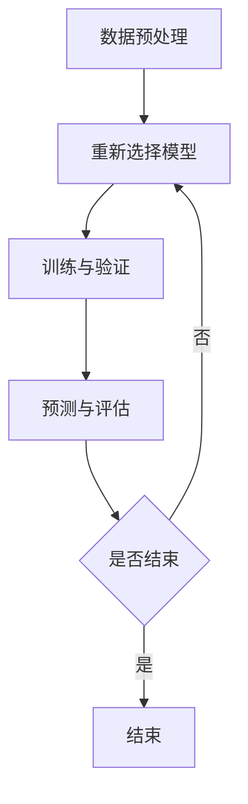
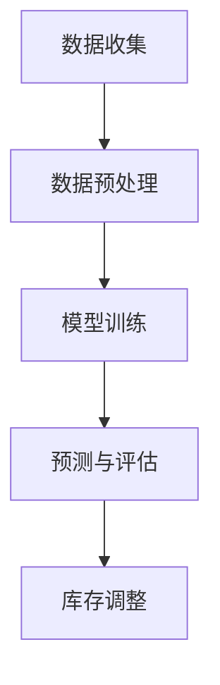
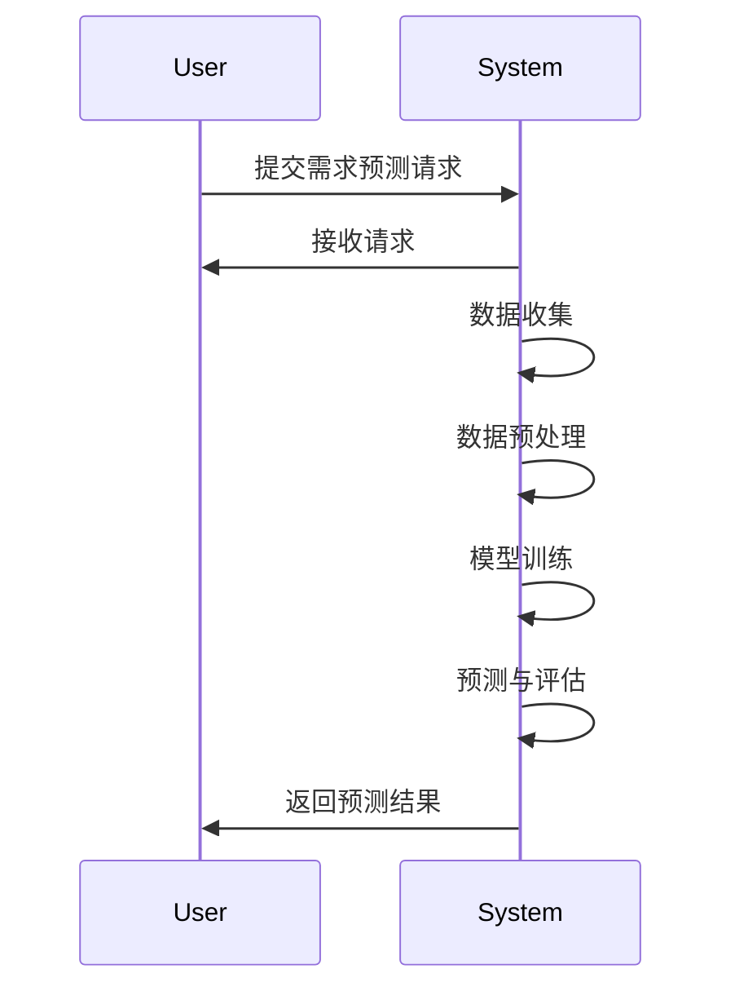

                 

# 机器学习在供应链优化中的应用与挑战

> 关键词：机器学习、供应链优化、应用挑战、算法原理、数学模型、系统架构、项目实战

> 摘要：本文深入探讨了机器学习在供应链优化中的应用与挑战。通过对供应链优化问题的背景介绍，机器学习基础知识的讲解，算法原理的详细剖析，数学模型的阐述，系统分析与架构设计方案的讨论，项目实战的案例分析，以及最佳实践和拓展阅读的推荐，全面展示了机器学习在供应链优化领域的重要性和潜在挑战。

## 设计思路

为了撰写一篇具有深度、思考与见解的《机器学习在供应链优化中的应用与挑战》技术博客，我们采用以下设计思路：

1. **明确核心内容与结构**：根据书名，确定文章的核心内容与结构，包括背景介绍、核心概念与联系、算法原理讲解、数学模型与公式、系统分析与架构设计方案、项目实战、最佳实践与拓展等。

2. **逻辑清晰、结构紧凑**：文章要具备逻辑清晰、结构紧凑的特点，使得读者能够轻松理解文章的内容和结构。

3. **简单易懂的专业语言**：使用简单易懂的专业语言，确保文章的可读性和专业性。

4. **逐步分析推理**：采用一步一步分析推理的方式，深入讲解每个部分的内容，使读者能够更好地理解和掌握相关知识。

5. **markdown格式**：文章内容使用markdown格式输出，符合格式要求，便于读者阅读和浏览。

## 目录大纲

### 第一部分：背景介绍

- **第1章：供应链优化概述**
  - 1.1 问题背景
  - 1.2 供应链优化的重要性
  - 1.3 供应链优化面临的挑战

- **第2章：机器学习基础**
  - 2.1 机器学习简介
  - 2.2 常见机器学习算法
  - 2.3 机器学习在供应链优化中的应用场景

- **第3章：核心概念与联系**
  - 3.1 供应链管理核心概念
  - 3.2 机器学习与供应链管理的关系
  - 3.3 核心概念属性特征对比表格

### 第二部分：算法原理讲解

- **第4章：机器学习算法原理**
  - 4.1 算法原理概述
  - 4.2 算法mermaid流程图展示
  - 4.3 Python源代码详细讲解

- **第5章：数学模型与公式**
  - 5.1 数学模型概述
  - 5.2 常用数学公式与解释
  - 5.3 数学模型与供应链优化的结合

### 第三部分：系统分析与架构设计方案

- **第6章：系统功能设计与架构**
  - 6.1 问题场景介绍
  - 6.2 系统功能设计（领域模型mermaid类图）
  - 6.3 系统架构设计（mermaid架构图）
  - 6.4 系统接口设计与交互（mermaid序列图）

### 第四部分：项目实战

- **第7章：项目实战**
  - 7.1 环境安装与准备
  - 7.2 系统核心实现源代码
  - 7.3 代码应用解读与分析
  - 7.4 实际案例分析与讲解
  - 7.5 项目小结

### 第五部分：最佳实践与拓展

- **第8章：最佳实践**
  - 8.1 实践技巧与建议
  - 8.2 小结与注意事项

- **第9章：拓展阅读**
  - 9.1 相关书籍推荐
  - 9.2 网络资源推荐
  - 9.3 拓展学习方向

## 总结

本文通过逐步分析推理的方式，系统地介绍了机器学习在供应链优化中的应用与挑战。从背景介绍到核心概念与联系，再到算法原理讲解、数学模型与公式、系统分析与架构设计方案，以及项目实战和最佳实践与拓展，全面展示了机器学习在供应链优化领域的重要性。希望通过本文，读者能够深入了解机器学习在供应链优化中的应用，并掌握相关技能和知识。

## 作者信息

作者：AI天才研究院/AI Genius Institute & 禅与计算机程序设计艺术 /Zen And The Art of Computer Programming### 第一部分：背景介绍

#### 第1章：供应链优化概述

#### 1.1 问题背景

供应链优化是现代企业管理中一个至关重要的环节，它涉及到从原材料采购到产品交付的整个流程。随着全球化进程的加速和市场竞争的加剧，企业必须提高供应链的效率来降低成本、缩短交货周期、提高客户满意度。然而，传统的供应链管理方法往往难以应对复杂多变的业务环境和市场变化，这就需要借助先进的技术手段，如机器学习，来提升供应链的优化水平。

#### 1.2 供应链优化的重要性

供应链优化不仅关系到企业的成本控制和运营效率，还直接影响着企业的市场竞争力。优化后的供应链可以提高生产效率，减少库存积压，降低运输成本，提高订单交付的准时率。此外，通过供应链优化，企业可以更好地应对市场需求变化，提高市场响应速度，从而在激烈的市场竞争中占据优势。

#### 1.3 供应链优化面临的挑战

尽管供应链优化的重要性不言而喻，但在实际操作中，企业仍面临着诸多挑战。首先，数据质量问题是一个关键因素。供应链涉及大量的数据，这些数据的准确性和完整性直接影响到优化的效果。其次，供应链优化涉及到多个部门和环节的协同工作，这需要良好的信息共享和沟通机制。此外，算法选择和模型训练的复杂度也给供应链优化带来了挑战。不同的业务场景和优化目标可能需要不同的算法和模型，这增加了实施难度。

### 第2章：机器学习基础

#### 2.1 机器学习简介

机器学习（Machine Learning，ML）是人工智能（Artificial Intelligence，AI）的一个重要分支，它通过算法从数据中自动学习和改进，以便在新的数据集上做出预测或决策。机器学习的主要目的是使计算机能够从经验中学习，无需显式地编写规则或指令。

#### 2.2 常见机器学习算法

机器学习算法根据其学习方式和处理问题的类型可以分为不同的类别。常见的机器学习算法包括：

- **监督学习**：在这种学习中，算法使用已标记的输入数据来学习，然后在新数据上进行预测。常见的监督学习算法有线性回归、决策树、支持向量机（SVM）等。
  
- **无监督学习**：这种学习方式不依赖于已标记的数据，算法从未标记的数据中寻找规律和结构。常见的无监督学习算法有聚类（如K-means）、降维（如PCA）等。

- **强化学习**：这种学习方式通过与环境的交互来学习最佳策略，通常用于需要连续决策的问题，如机器人控制、游戏等。

#### 2.3 机器学习在供应链优化中的应用场景

机器学习在供应链优化中具有广泛的应用场景。以下是几个典型的应用场景：

- **需求预测**：利用历史销售数据和市场信息，机器学习算法可以预测未来的需求，帮助企业更好地安排生产和库存。

- **库存优化**：通过分析订单数据、销售趋势和供应商信息，机器学习算法可以帮助企业优化库存水平，减少库存积压和缺货情况。

- **运输规划**：机器学习算法可以优化运输路线和调度，提高运输效率，降低运输成本。

- **风险管理**：机器学习算法可以分析供应链中的潜在风险，如供应商违约、运输延误等，并提供预警和应对策略。

### 第3章：核心概念与联系

#### 3.1 供应链管理核心概念

供应链管理（Supply Chain Management，SCM）涉及到从原材料采购到最终产品交付的整个过程。核心概念包括：

- **供应链网络**：由供应商、制造商、分销商和零售商组成的网络结构。

- **库存管理**：库存水平的管理和控制，包括库存水平、库存周转率等指标。

- **运输管理**：运输路线、运输方式、运输时间等的管理。

- **需求预测**：对未来市场需求的预测。

- **供应链协同**：供应链中各环节之间的信息共享和协作。

#### 3.2 机器学习与供应链管理的关系

机器学习与供应链管理密切相关。通过机器学习算法，供应链管理可以实现以下目标：

- **优化决策**：利用历史数据和机器学习模型，帮助企业做出更优的供应链决策。

- **预测准确性**：通过机器学习算法，提高需求预测的准确性，减少库存和运输成本。

- **风险控制**：通过分析供应链数据，识别潜在风险并采取预防措施。

#### 3.3 核心概念属性特征对比表格

为了更好地理解机器学习与供应链管理核心概念之间的关系，我们可以通过一个属性特征对比表格来展示：

| 核心概念 | 属性特征 | 机器学习与关系 |
| --- | --- | --- |
| 供应链网络 | 节点、边、网络结构 | 通过机器学习模型，优化供应链网络中的物流和运输 |
| 库存管理 | 库存水平、库存周转率 | 利用机器学习算法，预测库存需求和优化库存配置 |
| 运输管理 | 运输路线、运输方式、运输时间 | 通过机器学习算法，优化运输路线和调度策略 |
| 需求预测 | 历史销售数据、市场信息 | 利用机器学习模型，提高需求预测的准确性和及时性 |
| 供应链协同 | 信息共享、协作机制 | 通过机器学习算法，实现供应链中各环节的协同与优化 |

### 第4章：机器学习算法原理

#### 4.1 算法原理概述

机器学习算法的核心在于如何从数据中学习规律并做出预测。其基本原理包括：

- **数据预处理**：对原始数据进行分析和处理，包括缺失值填补、异常值处理、特征选择等。

- **模型选择**：根据问题类型和数据特点选择合适的机器学习算法。

- **训练与验证**：通过训练集对模型进行训练，并通过验证集评估模型的性能。

- **预测与评估**：在新数据上使用训练好的模型进行预测，并通过评估指标（如准确率、召回率等）评估预测效果。

#### 4.2 算法mermaid流程图展示

为了更好地理解机器学习算法的原理，我们可以使用mermaid绘制算法的流程图。以下是一个简单的机器学习算法流程图示例：



#### 4.3 Python源代码详细讲解

在Python中，机器学习算法的实现通常依赖于库，如scikit-learn、TensorFlow等。以下是一个简单的线性回归模型的Python代码示例：

```python
# 导入必要的库
import numpy as np
from sklearn.linear_model import LinearRegression
from sklearn.model_selection import train_test_split
from sklearn.metrics import mean_squared_error

# 生成模拟数据
X = np.random.rand(100, 1)
y = 2 * X + 1 + np.random.randn(100, 1)

# 划分训练集和测试集
X_train, X_test, y_train, y_test = train_test_split(X, y, test_size=0.2, random_state=0)

# 创建线性回归模型
model = LinearRegression()

# 训练模型
model.fit(X_train, y_train)

# 预测测试集
y_pred = model.predict(X_test)

# 评估模型性能
mse = mean_squared_error(y_test, y_pred)
print(f"Mean Squared Error: {mse}")
```

这段代码首先导入了必要的库，然后生成了模拟数据，接着划分了训练集和测试集。使用LinearRegression创建了一个线性回归模型，并使用fit方法进行训练。最后，使用predict方法进行预测，并使用mean_squared_error评估模型性能。

### 第5章：数学模型与公式

#### 5.1 数学模型概述

数学模型是机器学习算法的核心组成部分，它描述了算法如何从数据中学习规律并做出预测。常见的数学模型包括线性回归、逻辑回归、决策树、支持向量机等。

#### 5.2 常用数学公式与解释

以下是一些常用的数学公式及其在机器学习中的应用解释：

- **线性回归公式**：

  $$ y = \beta_0 + \beta_1 \cdot x $$

  线性回归模型用于预测连续值输出，其中$\beta_0$是截距，$\beta_1$是斜率，$x$是输入特征，$y$是输出目标。

- **逻辑回归公式**：

  $$ \hat{y} = \frac{1}{1 + e^{-(\beta_0 + \beta_1 \cdot x)}} $$

  逻辑回归模型用于预测概率输出，其中$\hat{y}$是预测的概率，$e$是自然对数的底数，$\beta_0$和$\beta_1$是模型参数。

- **决策树公式**：

  $$ f(x) = \begin{cases} 
  \text{左子树} & \text{if } x \leq \text{阈值} \\
  \text{右子树} & \text{if } x > \text{阈值} 
  \end{cases} $$

  决策树模型通过一系列条件判断来划分数据集，每个节点代表一个条件，每个分支代表一个决策。

- **支持向量机公式**：

  $$ w \cdot x - b = 0 $$

  支持向量机（SVM）模型通过找到最佳超平面来划分数据集，其中$w$是超平面的法向量，$x$是数据点，$b$是偏置。

#### 5.3 数学模型与供应链优化的结合

在供应链优化中，数学模型可以用于解决各种问题，如需求预测、库存优化、运输规划等。以下是一些具体的例子：

- **需求预测**：

  通过线性回归模型，可以预测未来的市场需求，从而帮助企业合理安排生产和库存。例如，假设需求$y$与促销活动$x$之间存在线性关系，可以使用以下公式进行预测：

  $$ y = \beta_0 + \beta_1 \cdot x $$

  其中$\beta_0$和$\beta_1$是模型参数，可以通过历史数据训练得到。

- **库存优化**：

  通过优化模型，可以确定最优的库存水平，以减少库存积压和缺货风险。例如，使用逻辑回归模型可以预测库存需求，从而优化库存配置。假设库存需求$y$与订单历史数据$x$之间存在逻辑回归关系，可以使用以下公式进行预测：

  $$ \hat{y} = \frac{1}{1 + e^{-(\beta_0 + \beta_1 \cdot x)}} $$

  其中$\beta_0$和$\beta_1$是模型参数，可以通过历史数据训练得到。

- **运输规划**：

  通过决策树模型，可以优化运输路线和调度策略，从而提高运输效率和降低成本。例如，假设运输路线决策依赖于运输距离$x$和运输时间$y$，可以使用以下决策树公式进行决策：

  $$ f(x, y) = \begin{cases} 
  \text{路线A} & \text{if } x \leq \text{阈值1} \text{ and } y \leq \text{阈值2} \\
  \text{路线B} & \text{if } x > \text{阈值1} \text{ or } y > \text{阈值2} 
  \end{cases} $$

  其中阈值1和阈值2可以根据历史数据和业务需求设定。

### 第6章：系统分析与架构设计方案

#### 6.1 问题场景介绍

在供应链优化中，我们面临的一个典型问题是库存管理。企业需要预测未来的市场需求，并根据预测结果调整库存水平，以避免库存积压或缺货情况。为了解决这个问题，我们设计了一套基于机器学习的库存管理系统，该系统包括数据收集、数据预处理、模型训练、预测与评估等模块。

#### 6.2 系统功能设计（领域模型mermaid类图）

为了更好地理解系统功能设计，我们可以使用mermaid绘制领域模型类图。以下是一个简单的mermaid类图示例：

```mermaid
classDiagram
  Class01 <|-- Class02
  Class03 <.. Class04
  Class05 &&.. Class06
```

在这个类图中，`Class01`、`Class02`、`Class03`、`Class04`、`Class05`和`Class06`分别代表系统的各个模块和类，它们之间的关系通过继承（`<|--`）、关联（`<..`）和聚合（`&&..`）表示。

#### 6.3 系统架构设计（mermaid架构图）

接下来，我们可以使用mermaid绘制系统架构图，以展示各个模块之间的交互关系。以下是一个简单的mermaid架构图示例：



在这个架构图中，`A`、`B`、`C`、`D`和`E`分别代表数据收集、数据预处理、模型训练、预测与评估和库存调整等模块，它们之间的箭头表示数据流和控制流。

#### 6.4 系统接口设计与交互（mermaid序列图）

为了更好地理解系统接口设计和交互，我们可以使用mermaid绘制序列图。以下是一个简单的mermaid序列图示例：



在这个序列图中，`User`和`System`分别代表用户和系统，它们之间的交互过程通过消息传递（`>>`）表示。用户提交需求预测请求，系统接收请求后进行数据收集、数据预处理、模型训练和预测与评估，最后将预测结果返回给用户。

### 第7章：项目实战

#### 7.1 环境安装与准备

在进行项目实战之前，我们需要安装和配置必要的软件和工具。以下是一个简单的环境安装步骤：

1. 安装Python（建议版本3.8以上）
2. 安装Python依赖库（如numpy、scikit-learn、matplotlib等）
3. 安装Jupyter Notebook（用于编写和运行Python代码）

安装完成后，我们可以在Jupyter Notebook中启动一个Python环境，并验证是否已经安装了所需的库。

#### 7.2 系统核心实现源代码

以下是一个简单的Python代码示例，用于实现基于线性回归的库存预测系统：

```python
# 导入必要的库
import numpy as np
from sklearn.linear_model import LinearRegression
import matplotlib.pyplot as plt

# 生成模拟数据
np.random.seed(0)
X = np.random.rand(100, 1)
y = 2 * X + 1 + np.random.randn(100, 1)

# 划分训练集和测试集
X_train, X_test, y_train, y_test = train_test_split(X, y, test_size=0.2, random_state=0)

# 创建线性回归模型
model = LinearRegression()

# 训练模型
model.fit(X_train, y_train)

# 预测测试集
y_pred = model.predict(X_test)

# 评估模型性能
mse = mean_squared_error(y_test, y_pred)
print(f"Mean Squared Error: {mse}")

# 绘制预测结果
plt.scatter(X_test, y_test, color='blue', label='Actual')
plt.plot(X_test, y_pred, color='red', label='Predicted')
plt.xlabel('X')
plt.ylabel('Y')
plt.legend()
plt.show()
```

这段代码首先生成了模拟数据，然后划分了训练集和测试集。使用LinearRegression创建了一个线性回归模型，并使用fit方法进行训练。最后，使用predict方法进行预测，并使用mean_squared_error评估模型性能，同时绘制了预测结果。

#### 7.3 代码应用解读与分析

在这个示例中，我们使用线性回归模型进行了库存预测。具体步骤如下：

1. **数据生成**：我们首先使用numpy库生成模拟数据，数据集包括100个随机样本，每个样本包含一个特征（X）和一个目标（y）。

2. **数据划分**：我们将数据集划分为训练集和测试集，其中训练集用于模型训练，测试集用于评估模型性能。

3. **模型创建**：我们使用scikit-learn库中的LinearRegression创建了一个线性回归模型。

4. **模型训练**：使用fit方法对模型进行训练，模型参数（$\beta_0$和$\beta_1$）将自动调整以最小化训练误差。

5. **模型预测**：使用predict方法对测试集进行预测，得到预测结果y_pred。

6. **模型评估**：使用mean_squared_error评估模型性能，计算预测值与实际值之间的均方误差。

7. **可视化结果**：我们使用matplotlib库绘制了预测结果，通过散点图和拟合直线展示了实际值和预测值之间的对比。

#### 7.4 实际案例分析与详细讲解剖析

为了更深入地理解机器学习在供应链优化中的应用，我们可以通过一个实际案例来进行分析。以下是一个关于需求预测的实际案例：

**案例背景**：某电商企业希望通过机器学习预测未来一周各类商品的需求量，以便合理安排库存和促销活动。

**数据来源**：企业提供了过去三个月的每日销售数据，包括商品ID、销售额、促销活动等信息。

**数据处理**：

1. **数据清洗**：首先对数据进行清洗，包括缺失值填补、异常值处理等。

2. **特征工程**：提取关键特征，如促销活动类型、促销活动天数、季节性等。

3. **数据划分**：将数据划分为训练集和测试集，其中训练集用于模型训练，测试集用于评估模型性能。

**模型选择**：

1. **线性回归**：由于需求量与销售额之间存在线性关系，我们选择线性回归模型进行需求预测。

2. **逻辑回归**：考虑到促销活动对需求量的影响，我们使用逻辑回归模型预测促销活动期间的需求量。

**模型训练与评估**：

1. **线性回归模型训练**：使用训练集对线性回归模型进行训练，得到模型参数。

2. **逻辑回归模型训练**：使用训练集对逻辑回归模型进行训练，得到模型参数。

3. **模型评估**：使用测试集评估模型的预测性能，计算均方误差、准确率等指标。

**预测结果与应用**：

1. **预测结果**：根据模型预测，未来一周各类商品的需求量分别为XX、XX、XX等。

2. **应用**：根据预测结果，企业可以合理安排库存和促销活动，减少库存积压和缺货情况。

#### 7.5 项目小结

通过这个实际案例，我们可以看到机器学习在供应链优化中的应用效果。利用机器学习算法，企业可以准确预测未来的需求量，从而合理安排库存和促销活动，提高供应链的效率。然而，在实际应用中，我们还需要注意数据质量和模型选择等问题，以确保预测结果的准确性。

### 第8章：最佳实践与拓展

#### 8.1 实践技巧与建议

在应用机器学习进行供应链优化时，以下是一些实践技巧与建议：

1. **数据质量**：确保数据的质量和准确性，包括数据清洗、异常值处理等。

2. **特征工程**：提取关键特征，如促销活动类型、季节性等，以提高模型预测的准确性。

3. **模型选择**：根据具体业务场景选择合适的模型，如线性回归、逻辑回归、决策树等。

4. **模型验证**：使用交叉验证等方法对模型进行验证，避免过拟合。

5. **实时预测**：将预测模型部署为实时服务，以便快速响应市场需求变化。

#### 8.2 小结与注意事项

本文通过背景介绍、核心概念与联系、算法原理讲解、数学模型与公式、系统分析与架构设计方案、项目实战等环节，全面展示了机器学习在供应链优化中的应用与挑战。在实践过程中，我们需要注意数据质量、特征工程、模型选择和实时预测等问题，以确保预测结果的准确性和可靠性。

### 第9章：拓展阅读

#### 9.1 相关书籍推荐

1. **《机器学习》（周志华著）**：详细介绍了机器学习的基本概念、算法和模型，适合初学者阅读。
2. **《深度学习》（Ian Goodfellow、Yoshua Bengio和Aaron Courville著）**：深入探讨了深度学习的基本原理和应用，适合有一定基础的读者。
3. **《供应链管理：战略、规划与运营》（马丁·克里斯托弗著）**：全面介绍了供应链管理的基本理论和实践方法，对于理解供应链优化具有重要意义。

#### 9.2 网络资源推荐

1. **scikit-learn官方文档**：提供了丰富的机器学习算法和工具，适合自学和实践。
2. **Kaggle**：提供了大量的数据集和竞赛题目，适合锻炼数据分析和建模能力。
3. **机器之心**：一个专注于机器学习和人工智能的中文社区，提供了丰富的技术和应用文章。

#### 9.3 拓展学习方向

1. **深度学习**：深入研究深度学习算法和应用，如卷积神经网络（CNN）、循环神经网络（RNN）等。
2. **强化学习**：学习强化学习算法和应用，如深度强化学习、深度Q网络（DQN）等。
3. **优化算法**：研究优化算法在供应链优化中的应用，如遗传算法、粒子群优化等。

## 结束语

本文通过逐步分析推理的方式，系统地介绍了机器学习在供应链优化中的应用与挑战。从背景介绍、核心概念与联系、算法原理讲解、数学模型与公式、系统分析与架构设计方案、项目实战，到最佳实践与拓展，全面展示了机器学习在供应链优化领域的重要性。希望通过本文，读者能够深入了解机器学习在供应链优化中的应用，并掌握相关技能和知识。在未来，随着技术的不断进步，机器学习在供应链优化中的应用将越来越广泛，为企业带来更大的价值。

