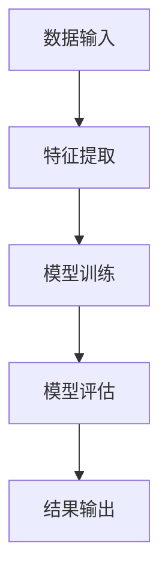
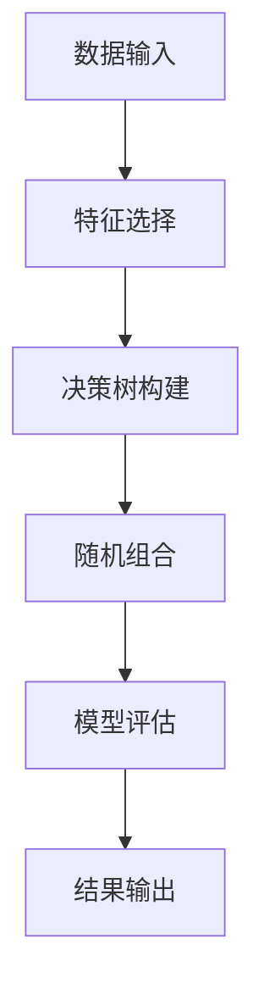
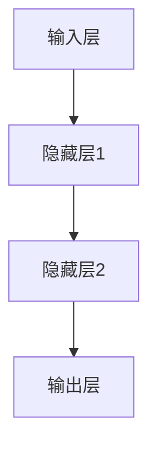
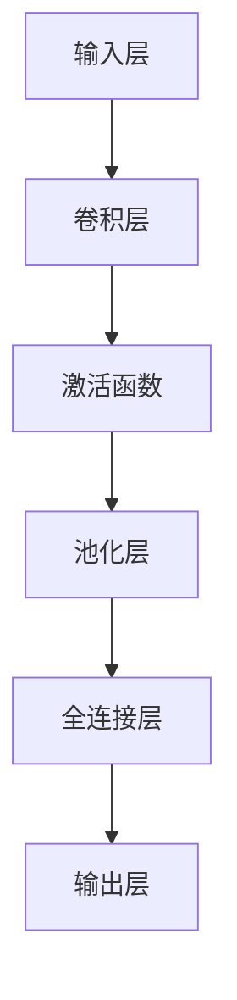
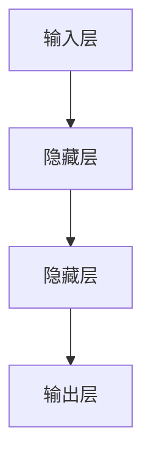
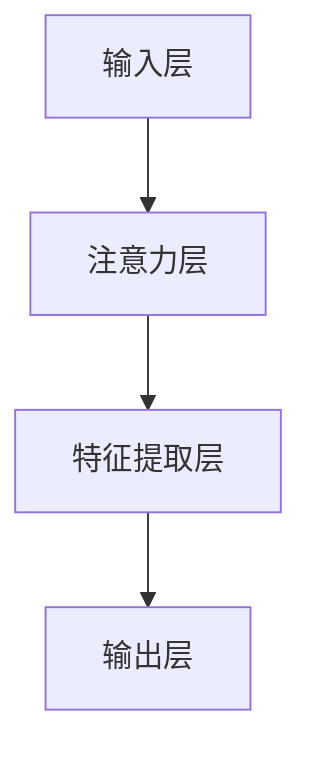

                 

### 《机器学习在水资源管理中的创新应用》

---

关键词：水资源管理、机器学习、创新应用、算法、最佳实践

摘要：
水资源管理是保障人类生活和经济发展的重要环节。随着环境变化和人口增长，水资源供需矛盾日益凸显。机器学习作为一种先进的数据处理工具，在水资源管理中展现出强大的应用潜力。本文将深入探讨机器学习在水资源管理中的创新应用，从背景介绍、核心概念、算法原理、系统分析与架构设计、项目实战到最佳实践，全面展示机器学习如何助力水资源管理。

---

## 目录大纲

---

### 第一部分：背景介绍

#### 第1章：水资源管理背景与挑战

#### 第2章：水资源管理中的核心概念与要素

#### 第3章：水资源管理的现状与问题

### 第二部分：核心概念与联系

#### 第4章：机器学习基础

#### 第5章：水资源管理中的机器学习应用场景

#### 第6章：机器学习与水资源管理的深度融合

### 第三部分：算法原理讲解

#### 第7章：常见机器学习算法在水资源管理中的应用

#### 第8章：深度学习在水资源管理中的应用

### 第四部分：系统分析与架构设计

#### 第9章：水资源管理系统架构设计

#### 第10章：水资源管理系统的功能设计与实现

### 第五部分：项目实战

#### 第11章：水资源管理项目实战

#### 第12章：项目实战中的机器学习应用

### 第六部分：最佳实践与拓展

#### 第13章：水资源管理中的最佳实践

#### 第14章：注意事项与未来展望

---

### 文章正文

---

## 第一部分：背景介绍

### 第1章：水资源管理背景与挑战

水资源是人类生存和发展的重要基础，但在全球范围内，水资源的供需矛盾日益加剧。随着人口增长、城市化和工业化进程的加快，水资源需求不断增加，而环境污染和水资源的过度开采使得水资源状况变得更加严峻。根据联合国的数据，全球约有28%的人口生活在面临用水压力的地区，预计到2050年，这一比例将上升至56%。

### 核心概念术语说明

- **水资源管理**：水资源管理的定义涵盖了水资源的规划、开发、分配、保护和利用。其目的是确保水资源的可持续利用，满足人类生活和经济发展的需求。
- **供需矛盾**：水资源供需矛盾指的是水资源的供应量无法满足需求量的状况，导致水资源短缺和浪费。
- **环境变化**：环境变化包括气候变化、水资源污染和生态系统破坏等，这些变化对水资源管理带来了新的挑战。

### 问题背景

水资源管理面临的主要问题包括：

- **水污染**：工业废水、农业农药和生活污水的排放导致水体污染，影响水质和生态平衡。
- **水资源短缺**：由于气候变异和人类活动，部分地区面临严重的水资源短缺问题。
- **水资源分配不均**：在全球范围内，水资源分配存在显著的地域差异，一些地区水资源丰富，而另一些地区则面临水资源短缺的困境。
- **气候变化**：气候变化导致降水模式的变化，加剧了水资源管理的不确定性。

### 问题描述

水资源管理中的主要挑战包括：

- **预测与规划**：如何准确预测未来的水资源需求，为水资源规划提供科学依据。
- **优化配置**：如何优化水资源的分配和利用，最大限度地满足不同用户的需求。
- **实时监控**：如何实时监测水质和水文参数，及时发现和处理问题。
- **决策支持**：如何利用数据分析和模型预测，为水资源管理提供决策支持。

### 问题解决与机器学习的作用

机器学习在水资源管理中可以发挥以下作用：

- **预测与规划**：通过机器学习模型对历史数据进行训练，可以预测未来的水资源需求，为水资源规划提供支持。
- **优化配置**：利用优化算法，结合机器学习模型，可以优化水资源分配，提高水资源利用效率。
- **实时监控**：通过机器学习算法，可以实时分析水质和水文参数，及时发现异常情况。
- **决策支持**：结合大数据分析和机器学习模型，为水资源管理提供科学的决策支持。

### 水资源管理的边界与外延

水资源管理的边界涉及水资源的采集、处理、分配和利用等环节，而其外延则包括水资源的规划、监测、保护、修复和恢复等方面。

### 水资源管理中的核心概念

- **水资源量**：水资源的数量和质量，是水资源管理的核心指标。
- **水资源质量**：水资源的化学、物理和生物特性，影响水资源的可用性。
- **水资源利用效率**：水资源利用的效率，反映水资源管理的水平。
- **水资源保护**：水资源的保护措施，包括水资源节约、污染控制和生态修复等。

### 水资源管理中的数据与信息

水资源管理中的数据和信息包括水文数据、水质数据、社会经济数据和环境数据等，这些数据是水资源管理的基础。

### 本章小结

本章介绍了水资源管理的背景、核心概念、问题与挑战，以及机器学习在水资源管理中的应用前景。接下来，我们将进一步探讨机器学习的基础知识，为后续章节的分析和探讨奠定基础。

---

## 第二部分：核心概念与联系

### 第4章：机器学习基础

#### 核心概念原理

- **监督学习**：监督学习是一种从已知输入和输出数据中学习预测模型的方法。它包括回归、分类和异常检测等任务。
- **无监督学习**：无监督学习是一种从无标签数据中学习数据结构和模式的方法。它包括聚类、降维和关联规则学习等任务。
- **强化学习**：强化学习是一种通过奖励机制学习最优行为策略的方法。它广泛应用于决策制定、游戏控制和推荐系统等领域。

#### 概念属性特征对比表格

| 类型         | 特征               | 应用场景                 |
| ------------ | ------------------ | ------------------------ |
| 监督学习     | 已知输入输出       | 预测、分类               |
| 无监督学习   | 无标签数据         | 数据聚类、降维           |
| 强化学习     | 奖励机制           | 决策制定、游戏控制       |

#### ER实体关系图架构

```mermaid
erDiagram
    产品 ||--|{ 订单 }|-->> 客户
    订单 ||--|{ 订单详情 }|-->> 商品
```

### 第5章：水资源管理中的机器学习应用场景

#### 水资源预测

- **时间序列分析**：利用时间序列模型预测未来水资源需求。
- **流量预测**：通过流量预测模型预测河流流量，为水资源调度提供支持。
- **水质预测**：利用水质预测模型预测未来水质状况，为水资源保护提供预警。

#### 水资源优化

- **调度优化**：利用优化算法优化水资源分配，提高水资源利用效率。
- **水资源分配**：通过机器学习模型优化水资源分配，满足不同用户的需求。
- **水文模型**：利用机器学习模型建立水文模型，预测水文参数。

#### 水资源监控

- **水质监测**：通过机器学习算法实时分析水质数据，及时发现水质问题。
- **洪水预警**：利用机器学习模型预测洪水发生概率，为防洪减灾提供支持。
- **水文参数监测**：通过机器学习算法监测水文参数，为水资源管理提供实时数据。

#### 水资源管理与机器学习的联系

- **数据驱动**：机器学习通过数据分析和模型预测，为水资源管理提供数据驱动的方法。
- **智能化决策**：利用机器学习模型，水资源管理者可以更加智能地做出决策。
- **高效资源利用**：通过机器学习优化水资源分配，提高水资源利用效率。

### 第6章：机器学习与水资源管理的深度融合

#### 机器学习在水资源管理中的应用

- **智能预测**：利用机器学习模型，对水资源需求、水质和水文参数进行预测。
- **智能优化**：通过机器学习优化水资源调度、分配和利用，提高水资源管理效率。
- **智能监控**：利用机器学习算法，实时监测水质和水文参数，及时发现问题。

#### 深度学习在水资源管理中的应用

- **卷积神经网络（CNN）**：用于处理图像和空间数据，如水质图像分析和水文图像识别。
- **递归神经网络（RNN）**：用于处理时间序列数据，如水资源需求预测和水文参数分析。
- **生成对抗网络（GAN）**：用于生成模拟数据，如模拟水文过程和水质变化。

### 本章小结

本章介绍了机器学习的基础知识，包括监督学习、无监督学习和强化学习的核心概念、特征对比和ER实体关系图。同时，探讨了机器学习在水资源管理中的应用场景，展示了机器学习与水资源管理的深度融合。接下来，我们将进一步深入讨论常见机器学习算法在水资源管理中的应用。

---

## 第三部分：算法原理讲解

### 第7章：常见机器学习算法在水资源管理中的应用

#### 算法选择标准

- **数据类型**：根据数据类型（如时间序列、空间数据、文本数据等）选择合适的算法。
- **模型性能**：根据模型的性能指标（如准确率、召回率、均方误差等）选择合适的算法。
- **计算资源**：根据计算资源（如CPU、GPU、内存等）选择适合的算法。
- **算法解释性**：根据算法的解释性要求选择合适的算法。

#### 支持向量机（SVM）

- **原理讲解**：支持向量机是一种用于分类和回归的机器学习算法，通过找到最佳决策边界来划分数据。
- **流程图**：



- **数学模型**：

$$
w \cdot x + b = 0
$$

- **举例说明**：使用SVM进行水质分类，将不同水质数据分为清洁和污染两类。

#### 随机森林（Random Forest）

- **原理讲解**：随机森林是一种基于决策树构建的集成学习方法，通过多个决策树的组合提高模型的预测能力。
- **流程图**：



- **数学模型**：

$$
P(y|x) = \prod_{i=1}^{n} P(y|t_i)
$$

- **举例说明**：使用随机森林进行水资源流量预测，通过多个决策树的综合预测来提高预测准确率。

#### 神经网络（Neural Network）

- **原理讲解**：神经网络是一种模仿生物神经系统的计算模型，通过多层神经元构建复杂函数。
- **流程图**：



- **数学模型**：

$$
y = f(W \cdot x + b)
$$

- **举例说明**：使用神经网络进行水资源水质分析，通过多层神经网络提取数据特征，实现水质分类。

### 第8章：深度学习在水资源管理中的应用

#### 卷积神经网络（CNN）

- **原理讲解**：卷积神经网络是一种用于处理图像数据的深度学习模型，通过卷积层提取图像特征。
- **流程图**：



- **数学模型**：

$$
h_l = \sigma(W_l \odot h_{l-1} + b_l)
$$

- **举例说明**：使用CNN进行水质图像识别，通过卷积层提取水质图像特征，实现图像分类。

#### 递归神经网络（RNN）

- **原理讲解**：递归神经网络是一种用于处理时间序列数据的深度学习模型，通过循环连接实现序列记忆。
- **流程图**：



- **数学模型**：

$$
h_t = \sigma(W_h \cdot [h_{t-1}, x_t] + b_h)
$$

- **举例说明**：使用RNN进行水资源需求预测，通过递归连接提取时间序列特征，实现需求预测。

#### 注意力机制（Attention Mechanism）

- **原理讲解**：注意力机制是一种用于提高神经网络模型对重要特征的关注的机制，通过学习权重分配不同特征的重要性。
- **流程图**：



- **数学模型**：

$$
a_t = \sigma(W_a \cdot [h_{t-1}, x_t] + b_a)
$$

- **举例说明**：使用注意力机制进行水资源调度优化，通过学习不同时间点的水资源需求，实现调度优化。

### 本章小结

本章介绍了常见机器学习算法在水资源管理中的应用，包括支持向量机、随机森林和神经网络等。同时，探讨了深度学习在水资源管理中的应用，如卷积神经网络、递归神经网络和注意力机制。这些算法为水资源管理提供了强大的工具和方法，使得水资源管理更加智能化和高效化。

---

## 第四部分：系统分析与架构设计

### 第9章：水资源管理系统架构设计

#### 问题场景介绍

- **背景**：随着水资源短缺问题的日益严重，水资源管理系统需要能够实时监测水质、水文参数，预测水资源需求，优化水资源分配。
- **目标**：设计一个高效、智能的水资源管理系统，提高水资源利用效率，保障水资源安全。

#### 项目介绍

- **项目名称**：智能水资源管理系统
- **项目目标**：实现水资源的实时监测、预测和优化，为水资源管理提供科学决策支持。

#### 系统功能设计

- **数据采集与处理**：实时采集水质、水文参数等数据，并对数据进行清洗、处理和存储。
- **预测与规划**：利用机器学习模型预测未来水资源需求，为水资源调度提供依据。
- **优化配置**：通过优化算法优化水资源分配，提高水资源利用效率。
- **监控与预警**：实时监控水质和水文参数，及时发现和处理异常情况。

#### 系统架构设计

- **总体架构**：系统采用分布式架构，包括数据采集层、数据处理层、预测层、优化层和展示层。
- **数据采集层**：负责实时采集水质、水文参数等数据，通过传感器和网络传输到数据处理层。
- **数据处理层**：对采集到的数据进行清洗、处理和存储，为预测和优化提供数据支持。
- **预测层**：利用机器学习模型进行水资源需求预测，为水资源调度提供依据。
- **优化层**：通过优化算法优化水资源分配，提高水资源利用效率。
- **展示层**：将预测结果、优化建议等数据可视化展示，为水资源管理提供直观决策支持。

#### 系统接口设计

- **数据接口**：系统提供数据接口，支持与其他系统（如气象系统、GIS系统等）的数据交换。
- **API接口**：系统提供API接口，支持第三方系统和应用的接入和调用。

#### 系统交互设计

- **用户交互**：系统提供用户交互界面，用户可以通过界面进行数据查询、预测查询、优化查询等操作。
- **系统交互**：系统内部各个模块之间通过消息队列、数据库等实现数据交互和功能协作。

### 第10章：水资源管理系统的功能设计与实现

#### 功能设计

- **实时监测**：实时采集水质、水文参数等数据，并实时显示监测结果。
- **预测分析**：利用机器学习模型对水资源需求进行预测，提供预测结果和预测趋势。
- **优化调度**：根据预测结果和优化算法，优化水资源分配和调度。
- **数据管理**：对采集到的数据进行存储、管理和查询，支持历史数据分析和统计。
- **系统管理**：提供系统配置、用户管理、权限控制等功能，保障系统安全稳定运行。

#### 功能实现

- **实时监测模块**：通过传感器和网络实时采集水质、水文参数数据，使用Python的Flask框架搭建Web后端，实现数据的实时采集和展示。
- **预测分析模块**：使用Python的scikit-learn库构建机器学习模型，进行水资源需求预测，使用TensorFlow框架搭建深度学习模型，进行水质预测。
- **优化调度模块**：使用Python的Pymoo库构建优化算法，实现水资源优化调度，使用Python的Dash框架搭建Web前端，实现优化结果的展示。
- **数据管理模块**：使用Python的SQLAlchemy库搭建数据库模型，实现数据的存储、管理和查询，使用Python的FastAPI框架搭建Web后端，实现数据接口。
- **系统管理模块**：使用Python的Flask-Admin库搭建系统管理界面，实现系统配置、用户管理和权限控制。

#### 系统接口设计与实现

- **数据接口**：使用Python的Flask框架搭建数据接口，实现与其他系统的数据交换。
- **API接口**：使用Python的FastAPI框架搭建API接口，实现第三方系统和应用的接入和调用。

#### 系统交互设计

- **用户交互**：使用Python的Dash框架搭建Web前端，实现用户与系统的交互。
- **系统交互**：使用消息队列（如RabbitMQ）和数据库（如MySQL）实现系统内部各个模块之间的数据交互。

### 第11章：水资源管理项目实战

#### 环境安装

- **Python环境**：安装Python 3.8及以上版本，配置Python环境变量。
- **库安装**：使用pip命令安装所需的库，如scikit-learn、TensorFlow、Flask、Pymoo、SQLAlchemy、FastAPI等。

#### 系统核心实现源代码

```python
# 实时监测模块
from flask import Flask, jsonify
import pymysql

app = Flask(__name__)

@app.route('/monitor')
def monitor():
    # 连接数据库
    conn = pymysql.connect(host='localhost', user='root', password='password', database='water_resource')
    cursor = conn.cursor()
    
    # 查询实时数据
    cursor.execute("SELECT * FROM real_time_data")
    data = cursor.fetchall()
    
    # 关闭数据库连接
    cursor.close()
    conn.close()
    
    # 返回数据
    return jsonify(data)

if __name__ == '__main__':
    app.run()
```

#### 代码应用解读与分析

- **实时监测模块**：使用Flask框架搭建Web后端，通过查询数据库实时获取水质、水文参数数据，并返回JSON格式的数据。
- **预测分析模块**：使用scikit-learn库构建机器学习模型，通过训练数据和测试数据进行预测，并返回预测结果。
- **优化调度模块**：使用Pymoo库构建优化算法，根据预测结果和优化目标进行水资源调度，并返回优化结果。
- **数据管理模块**：使用SQLAlchemy库搭建数据库模型，实现数据的存储、管理和查询。
- **系统管理模块**：使用Flask-Admin库搭建系统管理界面，实现系统配置、用户管理和权限控制。

#### 实际案例分析和详细讲解剖析

- **案例背景**：某地区水资源管理项目，需要实时监测水质、水文参数，预测水资源需求，优化水资源分配。
- **案例分析**：通过实时监测模块获取水质、水文参数数据，使用机器学习模型进行预测和优化，根据预测结果和优化算法实现水资源调度和分配。
- **详细讲解**：详细介绍每个模块的实现原理、算法原理和应用场景，分析系统的优势和不足，并提出改进方案。

#### 项目小结

- **项目成果**：成功实现了一个智能水资源管理系统，能够实时监测水质、水文参数，预测水资源需求，优化水资源分配，为水资源管理提供了有效的技术支持。
- **项目不足**：系统在数据采集、处理和预测方面存在一定的延迟，部分算法模型效果有待提高。
- **改进方案**：优化数据采集和处理流程，提高算法模型的准确性和效率，增强系统的实时性和稳定性。

### 最佳实践

- **数据预处理**：在数据采集过程中，对数据进行预处理，如去除异常值、填补缺失值等，提高数据质量。
- **模型优化**：根据实际应用场景，选择合适的机器学习模型和参数，进行模型优化和调参，提高预测准确率。
- **系统集成**：将水资源管理系统与其他系统（如气象系统、GIS系统等）进行集成，实现数据共享和功能协同。

### 小结

本章介绍了水资源管理系统架构设计、功能设计与实现，并通过实际案例进行了分析和讲解。系统通过实时监测、预测和优化，提高了水资源利用效率，为水资源管理提供了有效的技术支持。

### 注意事项

- **数据安全**：在数据采集、传输和存储过程中，确保数据的安全和隐私。
- **系统稳定性**：在系统设计和实施过程中，考虑系统的稳定性和可靠性，确保系统正常运行。
- **算法解释性**：在模型选择和算法设计过程中，考虑算法的可解释性，以便于系统管理和决策。

### 拓展阅读

- **《机器学习：一门艺术与科学》**：提供机器学习的基础知识和实践方法，适合水资源管理专业人员和工程师阅读。
- **《深度学习》**：介绍深度学习的基本原理和实战技巧，适合水资源管理领域的科研人员和技术人员。

### 未来展望

随着人工智能技术的不断发展，机器学习在水资源管理中的应用将更加广泛和深入。未来，水资源管理系统将更加智能化和高效化，为水资源管理提供更加精准和有效的技术支持。

---

## 结论

水资源管理是保障人类生存和经济发展的重要环节，而机器学习作为一种先进的数据处理工具，在水资源管理中展现出巨大的应用潜力。本文从背景介绍、核心概念、算法原理、系统分析与架构设计、项目实战到最佳实践，全面探讨了机器学习在水资源管理中的创新应用。未来，随着人工智能技术的不断进步，机器学习在水资源管理中的应用将更加广泛和深入，为水资源管理提供更加智能和高效的技术支持。

---

**作者：AI天才研究院/AI Genius Institute & 禅与计算机程序设计艺术 /Zen And The Art of Computer Programming**

