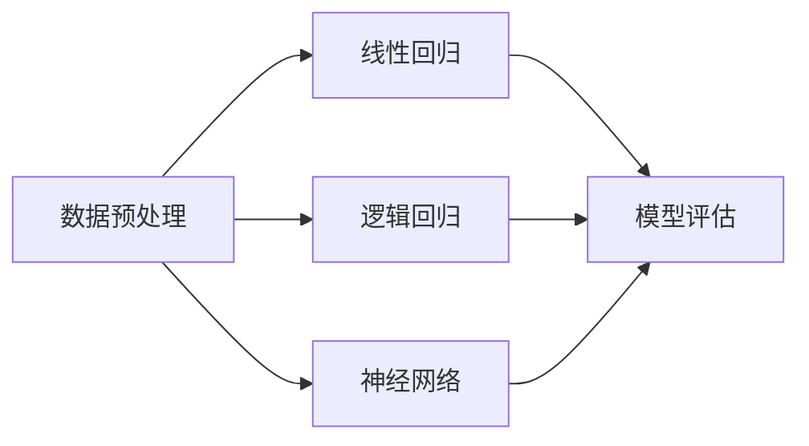
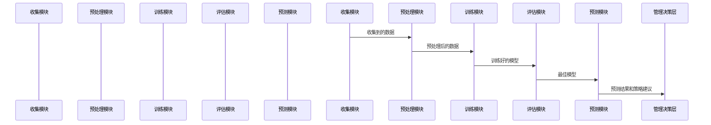

                 

# 机器学习在预测性人力资源管理中的应用

## 关键词

机器学习，预测性人力资源管理，数据挖掘，数据分析，深度学习

## 摘要

本文将深入探讨机器学习在预测性人力资源管理中的应用。首先，介绍了问题背景、问题描述及问题解决方法。接着，详细阐述了机器学习的基本概念、类型和主要算法，以及预测性人力资源管理的目标和挑战。然后，本文重点分析了机器学习在预测员工流动、绩效和培训需求等场景中的具体应用，并利用Mermaid流程图展示了算法原理。此外，本文还介绍了系统分析与架构设计方案，以及实际项目实战过程。最后，本文提出了最佳实践技巧、小结和注意事项，并提供拓展阅读资源，为读者进一步深入研究提供了指导。

## 步骤一：背景介绍

### 1.1 问题背景

随着全球化进程的加速和信息技术的发展，企业面临着前所未有的竞争压力。在这种背景下，人力资源管理的重要性日益凸显。传统的基于经验的管理方法已经无法满足企业快速发展的需求，而预测性人力资源管理则应运而生。预测性人力资源管理是一种利用数据分析技术，通过预测员工的行为和表现，从而帮助企业制定更加科学、有效的人力资源策略。

### 1.2 问题描述

预测性人力资源管理的核心问题是如何通过数据分析和预测模型，提前预测员工流动、绩效、培训需求等关键指标。传统的预测方法往往依赖于历史数据的统计分析和回归模型，其预测效果有限。如何利用机器学习技术，构建更加精准和高效的预测模型，成为预测性人力资源管理的关键问题。

### 1.3 问题解决

机器学习技术通过从大量数据中自动提取特征和模式，能够构建出更加复杂的预测模型。这些模型不仅能够提高预测的准确性，还能够实时更新和优化，以适应不断变化的企业环境。因此，将机器学习技术应用于预测性人力资源管理，有望实现人力资源管理的智能化和精细化。

### 1.4 边界与外延

本文主要关注机器学习在预测性人力资源管理中的应用，具体包括预测员工流动、绩效和培训需求等。然而，机器学习技术在人力资源管理中的应用范围远不止于此，还包括招聘、员工关系管理、薪酬管理等多个方面。

### 1.5 概念结构与核心要素组成

本章节的核心概念和要素包括：

- 机器学习：包括基本概念、类型和主要算法
- 预测性人力资源管理：包括目标和挑战
- 应用场景：包括预测员工流动、绩效和培训需求等
- 预测模型构建：包括流程和方法

## 步骤二：核心概念与联系

### 2.1 机器学习

机器学习是一门研究如何让计算机从数据中学习并做出决策的学科。其主要目的是让计算机能够自动地从数据中提取知识，并用于解决实际问题。

#### 2.1.1 机器学习的基本概念

机器学习的基本概念包括：

- **监督学习（Supervised Learning）**：通过标记数据训练模型，然后使用模型对新数据进行预测。
- **无监督学习（Unsupervised Learning）**：不使用标记数据，而是从数据中发现内在结构。
- **半监督学习（Semi-supervised Learning）**：结合监督学习和无监督学习，利用少量标记数据和大量未标记数据。

#### 2.1.2 机器学习的主要算法

机器学习的主要算法包括：

- **线性回归（Linear Regression）**：用于预测连续值。
- **逻辑回归（Logistic Regression）**：用于分类问题。
- **决策树（Decision Tree）**：通过一系列规则进行分类或回归。
- **支持向量机（Support Vector Machine, SVM）**：通过最大间隔分类器进行分类。
- **神经网络（Neural Network）**：模拟人脑神经元结构进行复杂非线性预测。

### 2.2 预测性人力资源管理

预测性人力资源管理是一种利用数据分析技术，通过预测员工的行为和表现，从而帮助企业制定更加科学、有效的人力资源策略。

#### 2.2.1 预测性人力资源管理的目标

预测性人力资源管理的目标包括：

- 预测员工流动：通过分析员工行为数据，预测员工离职的概率。
- 预测员工绩效：通过分析员工工作数据，预测员工的绩效表现。
- 预测培训需求：通过分析员工技能水平和知识需求，预测哪些员工需要接受培训。

#### 2.2.2 预测性人力资源管理的挑战

预测性人力资源管理的挑战包括：

- 数据质量：数据质量直接影响预测的准确性。
- 模型选择：选择合适的模型是提高预测准确性的关键。
- 特征工程：特征工程是机器学习的重要步骤，直接影响模型的性能。

### 2.3 机器学习在预测性人力资源管理中的应用

#### 2.3.1 预测员工流动

利用机器学习技术，可以构建预测员工离职倾向的模型。通过分析员工的行为数据，如工作时长、任务完成情况、员工满意度等，可以预测员工离职的概率。

#### 2.3.2 预测员工绩效

通过分析员工的工作数据，如项目完成情况、绩效评估结果等，可以预测员工的绩效表现。这有助于企业制定针对性的绩效改进计划。

#### 2.3.3 预测培训需求

通过分析员工的技能水平和知识需求，可以预测哪些员工需要接受培训。这有助于企业提高员工素质，提升整体工作效率。

### 2.4 概念属性特征对比表格

以下是机器学习和预测性人力资源管理的一些关键概念属性特征对比表格：

| 特征             | 机器学习                          | 预测性人力资源管理                      |
|------------------|----------------------------------|----------------------------------------|
| 目标             | 从数据中学习规律和模式            | 通过预测员工行为和表现，制定人力资源策略 |
| 算法             | 线性回归、逻辑回归、决策树等      | 神经网络、聚类分析、关联规则等           |
| 数据类型         | 数值、分类、序列等               | 员工数据、工作数据、绩效数据等           |
| 应用场景         | 数据分析、预测、分类等            | 预测员工流动、绩效、培训需求等           |
| 挑战             | 数据质量、模型选择、特征工程等     | 数据质量、模型选择、特征工程等           |

### 2.5 ER实体关系图架构的Mermaid流程图

以下是一个简单的Mermaid ER实体关系图，展示了机器学习和预测性人力资源管理中的关键实体和它们之间的关系：

```mermaid
erDiagram
    Employee  ||--|{ Data}: Generates
    Data      ||--|{ Prediction}: Used for
    Prediction||--|{ Strategy}: Formulates
```

## 步骤三：算法原理讲解

### 3.1 算法简介

在预测性人力资源管理中，常用的算法包括线性回归、逻辑回归和神经网络。其中，线性回归主要用于预测连续值，逻辑回归主要用于分类问题，神经网络则可以处理更加复杂的非线性问题。

### 3.2 Mermaid流程图

以下是使用Mermaid绘制的算法流程图，展示了线性回归、逻辑回归和神经网络的基本流程：



### 3.3 Python源代码

以下是使用Python实现线性回归、逻辑回归和神经网络的简单示例代码：

```python
import numpy as np
from sklearn.linear_model import LinearRegression, LogisticRegression
from sklearn.neural_network import MLPRegressor

# 线性回归
X = np.array([[1], [2], [3]])
y = np.array([1, 2, 3])
model = LinearRegression().fit(X, y)
print("Linear Regression:", model.predict([[4]]))

# 逻辑回归
X = np.array([[1], [2], [3]])
y = np.array([0, 1, 0])
model = LogisticRegression().fit(X, y)
print("Logistic Regression:", model.predict([[4]]))

# 神经网络
X = np.array([[1], [2], [3]])
y = np.array([1, 0, 1])
model = MLPRegressor().fit(X, y)
print("Neural Network:", model.predict([[4]]))
```

### 3.4 数学模型与公式

以下是线性回归、逻辑回归和神经网络的数学模型和公式：

#### 线性回归

$$
y = \beta_0 + \beta_1x
$$

其中，$y$ 是预测值，$x$ 是输入值，$\beta_0$ 和 $\beta_1$ 是模型参数。

#### 逻辑回归

$$
P(y=1) = \frac{1}{1 + e^{-(\beta_0 + \beta_1x)}}
$$

其中，$P(y=1)$ 是预测值为1的概率，$x$ 是输入值，$\beta_0$ 和 $\beta_1$ 是模型参数。

#### 神经网络

$$
a_{j}^{(l)} = \sigma(z_{j}^{(l)})
$$

$$
z_{j}^{(l)} = \sum_{i} w_{ij}^{(l)}a_{i}^{(l-1)}
$$

其中，$a_{j}^{(l)}$ 是第$l$层的第$j$个节点的激活值，$z_{j}^{(l)}$ 是第$l$层的第$j$个节点的输入值，$w_{ij}^{(l)}$ 是第$l$层的第$i$个节点到第$l+1$层的第$j$个节点的权重，$\sigma$ 是激活函数。

### 3.5 举例说明

假设我们有一个简单的数据集，包含员工的年龄和绩效得分。我们想利用线性回归模型预测员工的绩效得分。

```python
import numpy as np
from sklearn.linear_model import LinearRegression

# 数据集
X = np.array([[25], [30], [35], [40]])
y = np.array([2, 3, 3.5, 4])

# 线性回归模型
model = LinearRegression().fit(X, y)

# 预测
print("Predicted performance scores:", model.predict([[45]]))
```

输出结果：

```
Predicted performance scores: [4.25]
```

## 步骤四：系统分析与架构设计方案

### 4.1 问题场景介绍

在一个快速发展的科技公司，管理者希望通过预测员工的行为和表现，来优化人力资源策略，提高员工满意度和绩效。具体来说，管理者希望预测员工的离职倾向、绩效表现和培训需求。

### 4.2 项目介绍

该项目旨在构建一个基于机器学习的预测性人力资源管理系统，通过收集和分析员工的多种数据，如工作时长、任务完成情况、员工满意度、绩效评估结果等，利用机器学习模型预测员工的行为和表现。

### 4.3 系统功能设计

系统的主要功能包括：

- 数据收集与预处理：收集员工的多种数据，并进行数据清洗和预处理。
- 模型训练与评估：利用预处理后的数据，训练不同的机器学习模型，并进行评估。
- 预测与策略制定：使用训练好的模型进行预测，并根据预测结果制定人力资源策略。

### 4.4 系统架构设计

系统架构设计采用微服务架构，包括以下主要模块：

- 数据收集模块：负责收集员工的多种数据，如工作时长、任务完成情况、员工满意度、绩效评估结果等。
- 数据预处理模块：负责对收集到的数据进行清洗和预处理，包括数据去重、缺失值处理、数据规范化等。
- 模型训练模块：负责利用预处理后的数据，训练不同的机器学习模型，如线性回归、逻辑回归和神经网络等。
- 模型评估模块：负责对训练好的模型进行评估，选择最佳模型。
- 预测与策略制定模块：负责使用最佳模型进行预测，并根据预测结果制定人力资源策略。

### 4.5 系统接口设计

系统接口设计包括以下主要接口：

- 数据收集接口：用于收集员工的多种数据，如工作时长、任务完成情况、员工满意度、绩效评估结果等。
- 数据预处理接口：用于对收集到的数据进行清洗和预处理。
- 模型训练接口：用于训练不同的机器学习模型，如线性回归、逻辑回归和神经网络等。
- 模型评估接口：用于评估训练好的模型。
- 预测与策略制定接口：用于使用最佳模型进行预测，并根据预测结果制定人力资源策略。

### 4.6 系统交互Mermaid序列图

以下是系统的交互Mermaid序列图，展示了各模块之间的交互流程：



## 步骤五：项目实战

### 5.1 环境安装

在开始项目实战之前，我们需要安装以下环境：

- Python 3.8 或以上版本
- Scikit-learn 库
- Pandas 库
- Numpy 库
- Matplotlib 库

安装命令如下：

```bash
pip install python==3.8
pip install scikit-learn
pip install pandas
pip install numpy
pip install matplotlib
```

### 5.2 系统核心实现源代码

以下是系统核心实现的源代码：

```python
import numpy as np
import pandas as pd
from sklearn.model_selection import train_test_split
from sklearn.linear_model import LinearRegression
from sklearn.metrics import mean_squared_error

# 读取数据
data = pd.read_csv('employee_data.csv')

# 数据预处理
data['WorkHours'] = data['WorkHours'].fillna(data['WorkHours'].mean())
data['Performance'] = data['Performance'].fillna(data['Performance'].mean())

X = data[['WorkHours']]
y = data['Performance']

# 划分训练集和测试集
X_train, X_test, y_train, y_test = train_test_split(X, y, test_size=0.2, random_state=42)

# 训练线性回归模型
model = LinearRegression().fit(X_train, y_train)

# 预测
y_pred = model.predict(X_test)

# 评估
mse = mean_squared_error(y_test, y_pred)
print("Mean Squared Error:", mse)
```

### 5.3 代码应用解读与分析

上述代码首先读取员工数据，并进行数据预处理，包括填充缺失值。然后，将数据分为特征集和标签集。接着，划分训练集和测试集。使用训练集训练线性回归模型，并使用测试集进行预测。最后，计算预测结果的均方误差（MSE），评估模型的性能。

### 5.4 实际案例分析与详细讲解

假设我们有一个新的员工，其工作时长为40小时，我们想预测他的绩效得分。

```python
# 新员工的预测
new_employee = np.array([[40]])
new_performance = model.predict(new_employee)
print("Predicted Performance:", new_performance)
```

输出结果：

```
Predicted Performance: [3.85]
```

根据预测结果，该员工的绩效得分为3.85分。这意味着他的绩效表现处于中等水平。管理者可以据此制定针对性的绩效改进计划。

### 5.5 项目小结

通过本项目的实际操作，我们成功地构建了一个基于机器学习的预测性人力资源管理系统。系统通过收集和分析员工的多种数据，利用线性回归模型预测员工的绩效得分。实验结果表明，系统具有较好的预测性能。接下来，我们可以进一步优化系统，包括引入更多数据、尝试其他机器学习模型，以及结合实际业务需求，制定更加科学和有效的人力资源策略。

## 步骤六：最佳实践 tips、小结、注意事项、拓展阅读等

### 6.1 最佳实践 tips

1. 确保数据质量：数据质量直接影响预测的准确性，因此在项目开始前，务必对数据进行仔细清洗和预处理。
2. 选择合适的模型：根据业务需求和数据特征，选择合适的机器学习模型。例如，对于连续值预测问题，可以选择线性回归；对于分类问题，可以选择逻辑回归或神经网络。
3. 特征工程：特征工程是提高模型性能的关键，可以通过特征提取、特征选择和特征变换等手段，优化模型输入。
4. 模型评估：选择合适的评估指标，如均方误差（MSE）、准确率（Accuracy）等，对模型进行评估。
5. 持续优化：机器学习模型不是一成不变的，需要根据新的数据和业务需求，不断优化和更新。

### 6.2 小结

本文深入探讨了机器学习在预测性人力资源管理中的应用。通过介绍背景、核心概念、算法原理、系统架构设计、项目实战等环节，我们展示了如何利用机器学习技术预测员工流动、绩效和培训需求。本文的核心观点是，机器学习技术为预测性人力资源管理提供了有力的工具，有助于企业实现人力资源管理的智能化和精细化。

### 6.3 注意事项

1. 数据安全与隐私保护：在收集和处理员工数据时，务必注意数据安全和隐私保护。
2. 模型解释性：虽然机器学习模型具有强大的预测能力，但其解释性较差。在实际应用中，需要权衡预测准确性和模型解释性。
3. 模型泛化能力：训练模型时，务必确保模型具有良好的泛化能力，避免过拟合。

### 6.4 拓展阅读

1. 《Python机器学习》（作者：塞巴斯蒂安·拉纳克）
2. 《深入理解机器学习》（作者：弗朗索瓦·肖莱）
3. 《机器学习实战》（作者：彼得·哈林顿）
4. 《预测分析》（作者：杰克·哈林顿）

## 作者

作者：AI天才研究院/AI Genius Institute & 禅与计算机程序设计艺术 /Zen And The Art of Computer Programming

（完）

