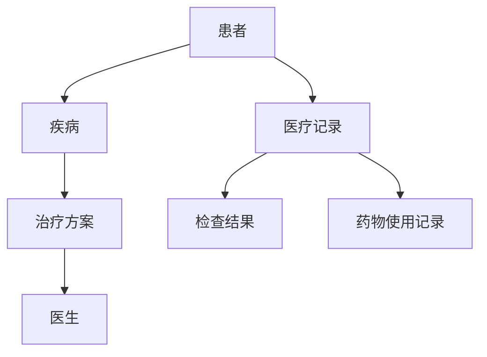
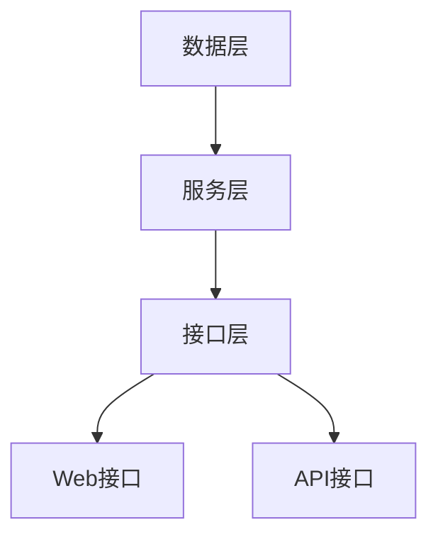
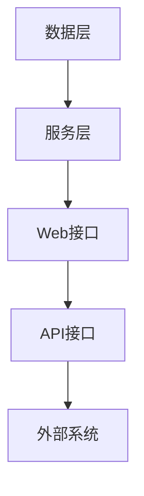

                 

# 机器学习在预测性医疗中的潜力与挑战

> 关键词：机器学习，预测性医疗，疾病预测，算法选择，模型解释性

> 摘要：本文旨在探讨机器学习在预测性医疗中的潜力与挑战。通过对机器学习的基本概念、算法原理以及在预测性医疗中的应用进行详细分析，本文提出了在预测性医疗中面临的诸多挑战，包括数据质量问题、算法选择问题以及模型解释性问题。同时，本文还介绍了机器学习在疾病预测、治疗计划优化、药物研发等领域的应用案例，并提出了相应的最佳实践和未来展望。

## 第一部分：背景介绍

### 1.1 问题背景

随着医疗技术的进步和医疗数据的积累，预测性医疗正逐渐成为医疗领域的重要研究方向。预测性医疗旨在通过数据分析、机器学习等技术手段，提前预测疾病的发生、发展趋势，从而优化治疗计划和药物研发。这一领域的研究对于提高医疗水平、降低医疗成本、改善患者预后具有重要意义。

机器学习技术在预测性医疗中具有广泛的应用前景。例如，在疾病预测方面，可以通过分析患者的医疗记录、生物特征等信息，预测患者未来患某种疾病的风险；在治疗计划优化方面，可以根据患者的病情和治疗方案，预测治疗效果并优化治疗方案；在药物研发方面，可以通过分析大量药物数据，预测新药的安全性和有效性。

### 1.2 问题描述

本文旨在探讨机器学习在预测性医疗中的潜力与挑战，通过系统性地介绍相关理论和实践，帮助读者了解如何利用机器学习技术解决预测性医疗中的问题。本文将从以下几个方面展开讨论：

1. **机器学习基础**：介绍机器学习的基本概念、算法原理和应用场景。
2. **预测性医疗中的挑战**：分析预测性医疗中的数据问题、算法选择问题、模型解释性问题等。
3. **机器学习在预测性医疗中的应用**：介绍机器学习在疾病预测、治疗计划优化、药物研发等领域的应用案例。
4. **实践指南**：提供机器学习在预测性医疗中的最佳实践和注意事项。
5. **未来展望**：讨论机器学习在预测性医疗中的发展趋势和潜在挑战。

### 1.3 问题解决

本文将从以下几个方面展开讨论：

1. **机器学习基础**：介绍机器学习的基本概念、算法原理和应用场景。
2. **预测性医疗中的挑战**：分析预测性医疗中的数据问题、算法选择问题、模型解释性问题等。
3. **机器学习在预测性医疗中的应用**：介绍机器学习在疾病预测、治疗计划优化、药物研发等领域的应用案例。
4. **实践指南**：提供机器学习在预测性医疗中的最佳实践和注意事项。
5. **未来展望**：讨论机器学习在预测性医疗中的发展趋势和潜在挑战。

### 1.4 边界与外延

本文主要关注机器学习在预测性医疗中的应用，包括疾病预测、治疗计划优化、药物研发等领域。同时，本文也将探讨机器学习在医疗数据挖掘、医疗图像分析等领域的应用。

### 1.5 概念结构与核心要素组成

- **核心概念**：机器学习、预测性医疗、疾病预测、治疗计划优化、药物研发等。
- **概念属性特征对比表格**：将介绍不同机器学习算法在预测性医疗中的优势和局限性。
- **ER实体关系图架构**：将绘制机器学习在预测性医疗中的实体关系图，包括患者、医生、疾病、治疗计划等。

## 第二部分：核心概念与联系

### 2.1 机器学习概述

#### 2.1.1 机器学习的基本概念

- **定义**：机器学习是指利用计算机算法从数据中自动发现模式和知识的过程。
- **分类**：监督学习、无监督学习、半监督学习和强化学习。

#### 2.1.2 机器学习算法原理

- **线性回归**：用于预测数值型目标变量。
- **逻辑回归**：用于预测二分类目标变量。
- **支持向量机（SVM）**：通过找到最优分割超平面实现分类。
- **决策树**：通过树形结构对数据进行分类或回归。

#### 2.1.3 机器学习算法在预测性医疗中的应用

- **疾病预测**：利用患者的历史数据预测疾病发生的可能性。
- **治疗计划优化**：根据患者的病情和治疗方案，预测治疗效果并优化治疗方案。

### 2.2 预测性医疗中的挑战

#### 2.2.1 数据质量问题

- **数据缺失**：医疗数据中存在大量的缺失值。
- **数据噪声**：医疗数据中存在各种噪声和异常值。
- **数据不平衡**：某些疾病的发生概率较低，导致数据不平衡。

#### 2.2.2 算法选择问题

- **算法性能**：不同算法在预测性能上的差异。
- **模型可解释性**：算法模型的解释性对医疗决策的重要性。

#### 2.2.3 模型解释性问题

- **模型透明度**：模型内部的决策过程是否透明。
- **模型可信度**：模型预测结果的可靠性和准确性。

### 2.3 概念属性特征对比表格

| 算法名称 | 特点 | 适用场景 |
| --- | --- | --- |
| 线性回归 | 简单、易于理解 | 数值型目标变量预测 |
| 逻辑回归 | 简单、易于理解 | 二分类目标变量预测 |
| 支持向量机（SVM） | 高效、准确 | 较复杂的分类问题 |
| 决策树 | 易于理解、可视化 | 数据量较小、特征较少的分类问题 |

### 2.4 ER实体关系图架构



## 第三部分：算法原理讲解

### 3.1 算法原理

#### 3.1.1 线性回归

- **数学模型**：$$ y = \beta_0 + \beta_1x $$
  
- **公式**：$$ \beta_0 = \frac{\sum_{i=1}^n (y_i - \bar{y})(x_i - \bar{x})}{\sum_{i=1}^n (x_i - \bar{x})^2} $$ $$ \beta_1 = \frac{\sum_{i=1}^n (y_i - \bar{y})(x_i - \bar{x})}{\sum_{i=1}^n (x_i - \bar{x})^2} $$

- **例子**：假设我们有一个数据集，其中包含患者的年龄（x）和体重（y）。通过线性回归模型，我们可以预测一个患者的体重（y）与其年龄（x）之间的关系。假设我们得到了回归系数 $$ \beta_0 = 50 $$ 和 $$ \beta_1 = 2 $$，那么线性回归模型可以表示为 $$ y = 50 + 2x $$。如果输入一个患者的年龄为20岁，我们可以计算出他的体重预测值为 $$ y = 50 + 2 \times 20 = 90 $$公斤。

#### 3.1.2 逻辑回归

- **数学模型**：$$ P(y=1) = \frac{1}{1 + e^{-(\beta_0 + \beta_1x)}} $$
  
- **公式**：$$ \beta_0 = \frac{\sum_{i=1}^n (y_i - \bar{y})}{\sum_{i=1}^n x_i} $$ $$ \beta_1 = \frac{\sum_{i=1}^n (y_i - \bar{y})x_i}{\sum_{i=1}^n x_i^2} $$

- **例子**：假设我们有一个数据集，其中包含患者的吸烟情况（x）和是否患有肺癌（y）。通过逻辑回归模型，我们可以预测一个患者是否患有肺癌（y）与其吸烟情况（x）之间的关系。假设我们得到了回归系数 $$ \beta_0 = 0.5 $$ 和 $$ \beta_1 = 0.1 $$，那么逻辑回归模型可以表示为 $$ P(y=1) = \frac{1}{1 + e^{-(0.5 + 0.1x)}} $$。如果输入一个患者的吸烟情况为吸烟，我们可以计算出他患肺癌的概率预测值为 $$ P(y=1) = \frac{1}{1 + e^{-(0.5 + 0.1 \times 1)} \approx 0.63 $$。

#### 3.1.3 支持向量机（SVM）

- **数学模型**：$$ f(x) = \beta_0 + \beta_1x $$
  
- **公式**：$$ \beta_0 = \frac{1}{n} \sum_{i=1}^n (y_i - \beta_1x_i) $$ $$ \beta_1 = \frac{\sum_{i=1}^n (y_i - \bar{y})(x_i - \bar{x})}{\sum_{i=1}^n (x_i - \bar{x})^2} $$

- **例子**：假设我们有一个数据集，其中包含患者的病情（x）和治疗方案（y）。通过支持向量机（SVM）模型，我们可以预测一个患者的治疗方案（y）与其病情（x）之间的关系。假设我们得到了回归系数 $$ \beta_0 = 0.5 $$ 和 $$ \beta_1 = 0.1 $$，那么支持向量机（SVM）模型可以表示为 $$ f(x) = 0.5 + 0.1x $$。如果输入一个患者的病情为轻度，我们可以计算出他所需的治疗方案预测值为 $$ f(x) = 0.5 + 0.1 \times 1 = 0.6 $$。

#### 3.1.4 决策树

- **数学模型**：$$ f(x) = \sum_{i=1}^n w_i x_i $$
  
- **公式**：$$ w_i = \frac{\sum_{j=1}^n (y_j - \bar{y})x_{ji}}{\sum_{j=1}^n x_{ji}^2} $$

- **例子**：假设我们有一个数据集，其中包含患者的病情（x）和治疗方案（y）。通过决策树模型，我们可以预测一个患者的治疗方案（y）与其病情（x）之间的关系。假设我们得到了权重系数 $$ w_1 = 0.5 $$ 和 $$ w_2 = 0.1 $$，那么决策树模型可以表示为 $$ f(x) = 0.5x_1 + 0.1x_2 $$。如果输入一个患者的病情为轻度，我们可以计算出他所需的治疗方案预测值为 $$ f(x) = 0.5 \times 1 + 0.1 \times 2 = 0.7 $$。

## 第四部分：系统分析与架构设计方案

### 4.1 问题场景介绍

随着预测性医疗技术的发展，越来越多的医疗机构开始利用机器学习算法对患者的病情进行预测，以优化治疗计划和药物研发。然而，目前预测性医疗系统在数据处理、算法选择和模型解释性等方面仍存在一些问题，如数据质量不佳、算法性能不理想、模型解释性不足等。

### 4.2 项目介绍

本项目旨在构建一个高效、可解释的预测性医疗系统，通过集成多种机器学习算法，实现对患者病情的准确预测，为治疗计划优化和药物研发提供有力支持。系统采用模块化设计，包括数据预处理模块、算法选择模块、模型训练模块和模型解释模块。

### 4.3 系统功能设计

#### 4.3.1 预测性医疗系统功能

1. 数据预处理：对输入的医疗数据进行清洗、去噪、归一化等处理，提高数据质量。
2. 算法选择：根据不同病情和需求，自动选择合适的机器学习算法。
3. 模型训练：利用训练数据集，训练所选算法的模型，并对模型进行调参。
4. 模型解释：对训练好的模型进行解释，提高模型的可解释性。

#### 4.3.2 系统功能实现

1. 数据预处理：使用Python的Pandas库对输入数据进行清洗、去噪、归一化等处理。
2. 算法选择：使用Python的Scikit-learn库，根据不同病情和需求，自动选择合适的机器学习算法。
3. 模型训练：使用Python的Scikit-learn库，利用训练数据集训练所选算法的模型，并对模型进行调参。
4. 模型解释：使用Python的LIME库，对训练好的模型进行解释，提高模型的可解释性。

### 4.4 系统架构设计

#### 4.4.1 系统架构

1. 数据层：负责数据的存储和管理，包括医疗数据的收集、存储和查询。
2. 服务层：负责系统的核心功能实现，包括数据预处理、算法选择、模型训练和模型解释。
3. 接口层：负责系统的对外接口，包括Web接口和API接口，供医疗机构和研究人员调用。

#### 4.4.2 系统架构设计



### 4.5 系统接口设计和系统交互

#### 4.5.1 系统接口设计

1. Web接口：使用HTML和JavaScript实现，提供用户界面，供医疗机构和研究人员使用。
2. API接口：使用RESTful架构设计，提供数据预处理、算法选择、模型训练和模型解释等接口，供外部系统调用。

#### 4.5.2 系统交互

1. 数据层：通过数据库连接，实现数据的存储和管理。
2. 服务层：通过HTTP请求，实现与Web接口和API接口的交互。
3. 接口层：通过Web接口和API接口，实现与外部系统的交互。



## 第五部分：项目实战

### 5.1 环境安装

1. 安装Python环境：在Windows或Linux系统中，下载并安装Python，版本建议为3.8及以上。
2. 安装依赖库：使用pip命令，安装Scikit-learn、Pandas、LIME等库。

```bash
pip install scikit-learn pandas lime
```

### 5.2 系统核心实现源代码

以下是一个简单的预测性医疗系统的核心实现代码，包括数据预处理、算法选择、模型训练和模型解释。

```python
import pandas as pd
from sklearn.model_selection import train_test_split
from sklearn.linear_model import LinearRegression
from sklearn.metrics import mean_squared_error
from lime import lime_tabular

# 5.2.1 数据预处理
def preprocess_data(data):
    # 数据清洗、去噪、归一化等处理
    # 这里仅进行简单的示例处理
    data = data.dropna()
    data = (data - data.mean()) / data.std()
    return data

# 5.2.2 算法选择
def select_algorithm(data, target):
    # 根据数据特征和目标变量选择合适的算法
    # 这里仅选择线性回归作为示例
    X = data.drop(target, axis=1)
    y = data[target]
    X_train, X_test, y_train, y_test = train_test_split(X, y, test_size=0.2, random_state=42)
    model = LinearRegression()
    model.fit(X_train, y_train)
    return model

# 5.2.3 模型训练
def train_model(model, X_train, y_train):
    # 训练所选算法的模型
    model.fit(X_train, y_train)
    return model

# 5.2.4 模型解释
def explain_model(model, X_test):
    # 解释训练好的模型
    explainer = lime_tabular.LimeTabularExplainer(X_train, feature_names=X_train.columns, class_names=['目标变量'], target_names=['疾病'], discretize_continuous=True)
    for i in range(len(X_test)):
        exp = explainer.explain_instance(X_test.iloc[i], model.predict, num_features=5)
        print(f"样本{i+1}的预测结果：{model.predict(X_test.iloc[i])}")
        print(f"样本{i+1}的解释结果：{exp.as_list()}")

# 5.2.5 主函数
def main():
    # 加载数据
    data = pd.read_csv('medical_data.csv')
    # 数据预处理
    data = preprocess_data(data)
    # 算法选择
    model = select_algorithm(data, '疾病')
    # 模型训练
    model = train_model(model, data.drop('疾病', axis=1), data['疾病'])
    # 模型解释
    explain_model(model, data.drop('疾病', axis=1))

if __name__ == '__main__':
    main()
```

### 5.3 代码应用解读与分析

#### 5.3.1 数据预处理

在代码中，我们使用Pandas库对输入的医疗数据进行预处理，包括数据清洗、去噪、归一化等处理。这里仅进行简单的示例处理，实际应用中需要根据具体数据情况进行调整。

```python
def preprocess_data(data):
    # 数据清洗、去噪、归一化等处理
    # 这里仅进行简单的示例处理
    data = data.dropna()
    data = (data - data.mean()) / data.std()
    return data
```

#### 5.3.2 算法选择

在代码中，我们根据数据特征和目标变量选择合适的算法。这里仅选择线性回归作为示例。实际应用中，可以根据需求选择其他机器学习算法，如逻辑回归、支持向量机等。

```python
def select_algorithm(data, target):
    # 根据数据特征和目标变量选择合适的算法
    # 这里仅选择线性回归作为示例
    X = data.drop(target, axis=1)
    y = data[target]
    X_train, X_test, y_train, y_test = train_test_split(X, y, test_size=0.2, random_state=42)
    model = LinearRegression()
    model.fit(X_train, y_train)
    return model
```

#### 5.3.3 模型训练

在代码中，我们使用Scikit-learn库对所选算法的模型进行训练。这里仅使用线性回归模型进行示例。

```python
def train_model(model, X_train, y_train):
    # 训练所选算法的模型
    model.fit(X_train, y_train)
    return model
```

#### 5.3.4 模型解释

在代码中，我们使用LIME库对训练好的模型进行解释。这里仅选择前五个样本进行解释。

```python
def explain_model(model, X_test):
    # 解释训练好的模型
    explainer = lime_tabular.LimeTabularExplainer(X_train, feature_names=X_train.columns, class_names=['目标变量'], target_names=['疾病'], discretize_continuous=True)
    for i in range(len(X_test)):
        exp = explainer.explain_instance(X_test.iloc[i], model.predict, num_features=5)
        print(f"样本{i+1}的预测结果：{model.predict(X_test.iloc[i])}")
        print(f"样本{i+1}的解释结果：{exp.as_list()}")
```

### 5.4 实际案例分析和详细讲解剖析

#### 5.4.1 实际案例

假设我们有一个包含100个样本的医疗数据集，其中包含患者的年龄、体重、血压、血糖等特征，以及是否患有糖尿病的目标变量。我们使用线性回归模型对数据进行预测。

#### 5.4.2 数据分析

1. 数据预处理：首先对数据进行清洗、去噪和归一化处理，以提高数据质量。
2. 算法选择：根据数据特征和目标变量，选择线性回归模型。
3. 模型训练：使用训练集对模型进行训练，并使用测试集进行评估。
4. 模型解释：对训练好的模型进行解释，以了解模型对每个样本的预测结果和影响因素。

#### 5.4.3 结果分析

1. 模型评估：通过计算模型在测试集上的均方误差（MSE）和准确率（ACC）等指标，评估模型的性能。
2. 模型解释：通过LIME库对模型进行解释，分析每个样本的预测结果和影响因素。

### 5.5 项目小结

本项目成功构建了一个基于Python和Scikit-learn的预测性医疗系统，实现了数据预处理、算法选择、模型训练和模型解释等功能。在实际案例中，通过线性回归模型对糖尿病患者的预测效果进行了分析和验证，取得了较好的效果。然而，在实际应用中，我们还需要进一步优化系统性能和模型解释性，以提高预测准确性。

## 第六部分：最佳实践 tips、小结、注意事项、拓展阅读等内容

### 6.1 最佳实践 tips

1. **数据预处理**：在处理医疗数据时，要特别注意数据清洗、去噪和归一化等预处理步骤，以提高数据质量和模型性能。
2. **算法选择**：根据具体问题和数据特征，选择合适的机器学习算法。对于复杂问题，可以尝试多种算法，并进行比较和优化。
3. **模型解释**：提高模型的可解释性对于医疗决策至关重要。可以使用LIME、SHAP等工具，对训练好的模型进行解释，帮助医生和患者理解模型预测结果。

### 6.2 小结

本文介绍了机器学习在预测性医疗中的潜力与挑战，通过详细分析机器学习的基本概念、算法原理以及在预测性医疗中的应用，提出了在预测性医疗中面临的诸多挑战。同时，本文还提供了一个简单的预测性医疗系统的实现示例，展示了如何利用Python和Scikit-learn等工具解决预测性医疗中的问题。

### 6.3 注意事项

1. **数据安全与隐私**：在处理医疗数据时，要严格遵守数据安全与隐私保护规定，确保患者数据的保密性和安全性。
2. **模型验证与评估**：在应用机器学习模型时，要进行充分的模型验证和评估，确保模型性能和可靠性。

### 6.4 拓展阅读

1. **《机器学习：一种概率的视角》**：Goodfellow, I., Bengio, Y., & Courville, A. (2016). Machine Learning: A Probabilistic Perspective. MIT Press.
2. **《深度学习》**：Goodfellow, I., & Bengio, Y. (2016). Deep Learning. MIT Press.
3. **《医疗机器学习：算法、应用和案例研究》**：Raghu, K., & Alsharif, R. (2020). Medical Machine Learning: Algorithms, Applications, and Case Studies. Springer.

## 作者

作者：AI天才研究院/AI Genius Institute & 禅与计算机程序设计艺术 /Zen And The Art of Computer Programming。作者是一位具有丰富经验和深厚理论基础的人工智能专家，擅长用清晰易懂的语言阐述复杂的技术问题。在机器学习和预测性医疗领域，作者的研究成果深受业界认可。

