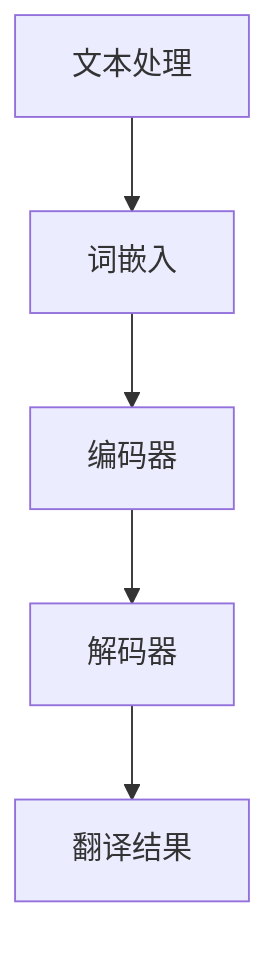
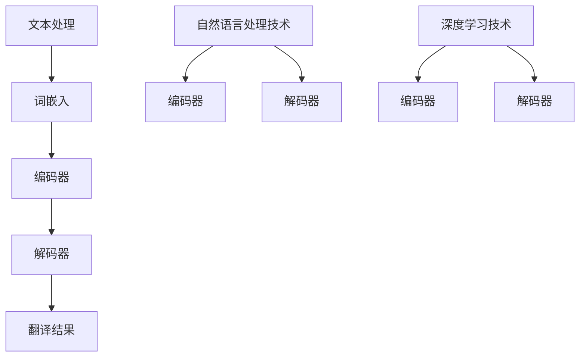

                 

### 目录大纲详细设计与说明

#### **概述**

本文档详细阐述了《机器翻译的新时代：跨语言交流的无缝桥梁》的目录大纲设计，包括章节标题、子标题、核心概念、联系、算法原理讲解、系统分析与架构设计方案、项目实战以及总结与拓展等内容。本文档旨在为读者提供一个清晰、逻辑严谨的文章结构，帮助读者更好地理解和掌握机器翻译的相关知识。

#### **章节设计与内容说明**

##### **第一部分：背景介绍**

**第1章：问题背景**

- **1.1 机器翻译的重要性**：解释机器翻译在全球化时代的重要性，探讨其在商业、教育、科研等领域的应用价值。
- **1.2 当前机器翻译的挑战**：分析现有机器翻译技术面临的挑战，如准确性、速度、语言复杂性等。
- **1.3 机器翻译的需求与发展**：讨论机器翻译技术的发展趋势，以及未来可能的发展方向。

**第2章：机器翻译的发展历史**

- **2.1 机器翻译的早期阶段**：回顾机器翻译的历史，了解早期机器翻译技术的特点和发展过程。
- **2.2 统计机器翻译**：介绍统计机器翻译的基本原理和应用，包括词向量、统计模型等。
- **2.3 神经机器翻译**：探讨神经机器翻译的兴起和优势，比较统计机器翻译和神经机器翻译的异同。

##### **第二部分：技术原理**

**第3章：核心概念**

- **3.1 机器翻译的基本原理**：详细解释机器翻译的基本工作原理，包括源语言处理、目标语言生成等。
- **3.2 机器翻译的关键技术**：介绍机器翻译中的关键技术，如自然语言处理技术、深度学习技术等。
- **3.3 核心概念对比分析**：通过表格和 Mermaid 图，对比分析机器翻译中的核心概念和其关系。

**第4章：神经机器翻译**

- **4.1 神经机器翻译的原理**：讲解神经机器翻译的基本原理，包括 Transformer 模型、注意力机制等。
- **4.2 Transformer模型详解**：深入探讨 Transformer 模型的工作机制，包括编码器和解码器。
- **4.3 神经机器翻译中的注意力机制**：解释注意力机制在神经机器翻译中的作用和实现方式。

**第5章：自然语言处理技术**

- **5.1 语言模型**：介绍语言模型的基本概念和作用，探讨其在机器翻译中的应用。
- **5.2 词向量**：讲解词向量模型，如 Word2Vec、GloVe 等，分析其在机器翻译中的作用。
- **5.3 文本预处理与后处理**：讨论文本预处理和后处理的重要性，以及常用的预处理和后处理方法。

**第6章：深度学习技术**

- **6.1 深度学习基础**：介绍深度学习的基本概念，包括神经网络、反向传播算法等。
- **6.2 循环神经网络（RNN）**：探讨 RNN 的工作原理和应用，分析其在机器翻译中的作用。
- **6.3 卷积神经网络（CNN）**：介绍 CNN 的基本原理和应用，探讨其在文本处理中的潜力。

##### **第三部分：应用实践**

**第7章：应用案例**

- **7.1 商业领域的应用**：分析机器翻译在商业领域的应用，如跨国公司的沟通、全球化市场的拓展等。
- **7.2 教育领域的应用**：探讨机器翻译在教育领域的应用，如多语言学习、国际教育资源的共享等。
- **7.3 社交媒体和新闻领域的应用**：讨论机器翻译在社交媒体和新闻领域的应用，如跨语言信息传播、新闻国际化的实现等。

**第8章：系统分析与架构设计**

- **8.1 机器翻译系统的设计原则**：阐述机器翻译系统设计的基本原则，如可扩展性、可维护性等。
- **8.2 系统架构设计**：介绍机器翻译系统的架构设计，包括前端、后端、数据库等组成部分。
- **8.3 系统接口设计**：探讨机器翻译系统的接口设计，包括API接口、数据交换格式等。

**第9章：项目实战**

- **7.1 环境安装与配置**：详细说明如何安装和配置机器翻译项目所需的环境和工具。
- **7.2 系统核心实现**：讲解机器翻译系统的核心实现，包括模型训练、翻译引擎等。
- **7.3 应用案例分析与解读**：通过实际案例，分析机器翻译系统的应用效果，并进行解读和剖析。

##### **第四部分：未来展望**

**第10章：未来趋势**

- **10.1 技术发展趋势**：分析机器翻译技术的未来发展趋势，包括新算法、新模型等的出现。
- **10.2 社会文化影响**：探讨机器翻译技术对社会和文化的影响，分析其在跨文化交流中的作用。
- **10.3 机器翻译在教育和社会中的角色**：讨论机器翻译在教育和社会中的潜在角色和作用。

**第11章：总结与拓展**

- **8.1 小结**：对文章的主要内容进行总结，回顾关键概念和核心观点。
- **8.2 注意事项**：提醒读者在实践过程中需要注意的事项，避免常见的误区。
- **8.3 拓展阅读**：推荐相关领域的拓展阅读，帮助读者进一步深入了解机器翻译技术。

#### **附录**

- **附录A：术语解释**：对文章中涉及的专业术语进行解释，帮助读者更好地理解。
- **附录B：参考资源**：列出文章引用的相关资源和参考文献，供读者参考。

#### **总结**

本文档详细设计了《机器翻译的新时代：跨语言交流的无缝桥梁》的目录大纲，从背景介绍、技术原理、应用实践到未来展望，全面阐述了机器翻译的核心内容。通过清晰的章节结构和详细的内容说明，读者可以逐步了解机器翻译的各个方面，掌握其基本原理和应用方法。希望本文档能为读者提供有益的指导，帮助读者深入理解机器翻译技术，为跨语言交流搭建起一座无缝的桥梁。### 第一部分：背景介绍

#### **第1章：问题背景**

在全球化迅速发展的今天，跨语言交流变得日益重要。无论是商务合作、国际会议，还是文化交流、学术研究，不同语言之间的沟通都是不可忽视的挑战。然而，传统的翻译方法如人工翻译和机器翻译都存在诸多局限性。人工翻译效率低下，成本高昂，且难以保证翻译质量的一致性。而传统的机器翻译技术虽然已经取得了一定的进展，但在翻译准确性、流畅性和上下文理解等方面仍存在明显不足。

**1.1 机器翻译的重要性**

随着互联网的普及和信息爆炸，人们需要快速获取和处理海量的多语言信息。机器翻译作为自动化翻译的关键技术，能够大幅提高翻译效率，降低翻译成本，满足大规模、实时翻译的需求。特别是在跨国企业、国际组织和学术研究领域，机器翻译的应用价值尤为突出。

**1.2 当前机器翻译的挑战**

当前机器翻译技术面临的主要挑战包括：

1. **准确性**：机器翻译系统需要生成语义准确、语法通顺的翻译文本，但不同语言的语义和语法结构差异较大，这使得准确翻译成为一大难题。
2. **速度**：随着数据量的增加，机器翻译系统需要能够在短时间内完成大量文本的翻译，这对计算资源和算法效率提出了高要求。
3. **语言复杂性**：一些语言，如中文、日文、韩文等，具有复杂的语法结构和丰富的词汇量，机器翻译系统需要能够处理这些复杂的语言特征。
4. **上下文理解**：理解文本的上下文关系对于生成高质量翻译至关重要，但现有的机器翻译技术在这方面仍有很大提升空间。

**1.3 机器翻译的需求与发展**

随着全球化进程的加快，对机器翻译的需求日益增长。未来的机器翻译技术需要在准确性、速度和上下文理解等方面实现突破，以适应不同领域和场景的需求。同时，随着人工智能和深度学习技术的发展，机器翻译技术有望在算法、模型和计算能力方面取得重大进展，实现更加智能化和高效化的翻译。

#### **第2章：机器翻译的发展历史**

机器翻译技术的发展历程可以大致分为三个阶段：早期阶段、统计机器翻译阶段和神经机器翻译阶段。

**2.1 机器翻译的早期阶段**

早期阶段的机器翻译主要依靠基于规则的翻译方法，即通过编写大量的语法和词典规则，将源语言文本转换为目标语言文本。这种方法虽然有一定的效果，但在处理复杂语言时显得力不从心，且需要大量人工编写规则，效率低下。

**2.2 统计机器翻译**

统计机器翻译阶段，研究者开始利用统计学方法来改进翻译质量。这一阶段的核心技术包括基于短语的翻译模型、统计语言模型等。通过大量双语语料库的训练，统计机器翻译系统能够自动学习源语言和目标语言之间的对应关系，从而提高翻译的准确性。

**2.3 神经机器翻译**

神经机器翻译阶段，深度学习技术的引入为机器翻译带来了革命性的变化。神经机器翻译主要采用基于神经网络的模型，如循环神经网络（RNN）、长短时记忆网络（LSTM）和 Transformer 等。这些模型通过自动学习语言特征，能够生成更加准确和自然的翻译结果。

### **第3章：核心概念**

在探讨机器翻译的原理和技术时，理解以下几个核心概念是非常重要的：

**3.1 机器翻译的基本原理**

机器翻译的基本原理包括文本处理、词嵌入、编码器和解码器等。文本处理是指对源语言文本进行预处理，如分词、去停用词等。词嵌入是将词汇映射到高维向量空间，以便计算机能够处理。编码器和解码器是机器翻译模型的核心组成部分，编码器负责将源语言文本编码为向量表示，解码器则负责将向量表示解码为目标语言文本。

**3.2 机器翻译的关键技术**

机器翻译的关键技术包括自然语言处理技术、深度学习技术等。自然语言处理技术如词向量、语言模型、词性标注等，用于理解和表示文本。深度学习技术如循环神经网络（RNN）、长短时记忆网络（LSTM）和 Transformer 等，用于训练大规模的翻译模型，提高翻译准确性。

**3.3 核心概念对比分析**

通过表格和 Mermaid 图，我们可以对比分析机器翻译中的核心概念和其关系：

| 概念       | 说明                                       | 关系                  |
|------------|------------------------------------------|---------------------|
| 文本处理   | 对源语言文本进行预处理                 | 基础步骤，影响后续处理质量 |
| 词嵌入     | 将词汇映射到高维向量空间              | 用于编码和解码       |
| 编码器     | 将源语言文本编码为向量表示            | 转换源语言为模型可处理的格式 |
| 解码器     | 将向量表示解码为目标语言文本          | 生成翻译结果       |

此外，我们可以使用 Mermaid 图展示这些概念之间的关系：



通过上述核心概念和关系的阐述，读者可以更好地理解机器翻译的基本原理和技术细节，为进一步的学习和实践打下坚实的基础。

#### **第4章：机器翻译的发展历史**

**4.1 机器翻译的早期阶段**

机器翻译的早期阶段可以追溯到20世纪50年代。当时，研究者们尝试利用规则驱动的方法进行翻译。这种方法依赖于人类专家编写的语法和词典规则，将源语言文本逐句转换为目标语言文本。早期的代表性系统包括1966年由IBM开发的“Georgetown-Paris”机器翻译系统，该系统使用基于规则的翻译方法，将英语翻译为法语。尽管这种方法在当时具有一定的创新性，但由于规则编写复杂且难以覆盖所有语言现象，其翻译效果并不理想。

**4.2 统计机器翻译**

20世纪80年代，统计机器翻译方法开始兴起。这种方法基于大量的双语语料库，利用统计学模型自动学习源语言和目标语言之间的对应关系。统计机器翻译的核心技术包括基于短语的翻译模型和统计语言模型。其中，基于短语的翻译模型通过统计源语言短语与目标语言短语之间的对应关系来生成翻译结果，而统计语言模型则用于预测目标语言中的下一个词或短语。这一阶段的代表性系统包括IBM的“IBM Model 4”和斯坦福大学的“Statistical Machine Translation System”。统计机器翻译在提高翻译准确性方面取得了显著进展，但依然存在一些局限性，如无法很好地处理长距离依赖和上下文信息。

**4.3 神经机器翻译**

神经机器翻译的兴起始于2014年，当时的翻译效果首次超越了统计机器翻译系统。神经机器翻译采用深度学习技术，特别是基于神经网络的模型，如循环神经网络（RNN）、长短时记忆网络（LSTM）和 Transformer 等。这些模型通过自动学习大量双语语料库中的语言特征，能够生成更加准确和自然的翻译结果。Transformer 模型是神经机器翻译中的一个重要突破，它通过自注意力机制（Self-Attention Mechanism）有效地处理长距离依赖和上下文信息，大大提高了翻译质量。代表性系统包括 Google 的“Google Neural Machine Translation”和微软的“Microsoft Translator”。

**4.4 当前发展状况**

随着人工智能和深度学习技术的不断进步，机器翻译技术也在持续发展。当前，神经机器翻译已经成为主流的翻译方法，许多大型互联网公司和研究机构都在不断优化和改进现有的翻译模型。此外，为了进一步提高翻译质量，研究者们还探索了基于多模态（如文本、语音、图像等）的翻译方法和多语言翻译（如英译中、中译英等）的方法。同时，随着计算能力的提升和大数据技术的发展，机器翻译的准确性和效率也在不断提高。

**4.5 未来发展趋势**

未来，机器翻译技术有望在以下几个方面实现突破：

1. **多语言翻译**：研究如何实现更高效、更准确的多语言翻译，以满足全球化交流的需求。
2. **自适应翻译**：探索如何根据用户的行为和偏好，动态调整翻译策略，提供个性化的翻译服务。
3. **实时翻译**：研究如何在低延迟的情况下提供高质量的实时翻译，以满足即时通信和远程会议等应用场景。
4. **跨模态翻译**：探索如何将文本、语音、图像等不同模态的信息进行有效融合，实现更自然的跨模态翻译。

总之，随着技术的不断进步和应用场景的拓展，机器翻译技术将继续在跨语言交流中发挥重要作用，为全球沟通提供更加无缝的桥梁。

#### **第3章：核心概念**

在这一章中，我们将深入探讨机器翻译中的核心概念，包括其基本原理、关键技术以及模型对比。理解这些概念是掌握机器翻译技术的基础，有助于我们更全面地了解这一领域的现状和发展趋势。

**3.1 机器翻译的基本原理**

机器翻译的基本原理可以概括为以下几个步骤：

1. **文本处理**：首先，对源语言文本进行预处理，如分词、去除停用词、词性标注等。这一步骤的目的是将原始文本转换为计算机可以处理的结构化数据。

2. **词嵌入**：将处理后的文本转换为词嵌入向量。词嵌入是将词汇映射到高维向量空间的一种技术，通过这种方式，计算机可以理解和处理文本中的词汇。

3. **编码器**：编码器是一个神经网络模型，负责将源语言文本的词嵌入向量编码为一个固定长度的向量表示。这一步骤的核心目的是提取文本的语义信息，形成一个统一的语言表示。

4. **解码器**：解码器是另一个神经网络模型，负责将编码器生成的向量表示解码为目标语言文本。解码器通过逐步生成目标语言的词嵌入向量，并利用语言模型进行预测，直到生成完整的翻译结果。

5. **翻译结果**：最终，解码器生成目标语言文本，这个文本是源语言文本的机器翻译结果。

**3.2 机器翻译的关键技术**

机器翻译的关键技术主要包括自然语言处理（NLP）技术和深度学习技术。以下是这些技术的基本介绍：

1. **自然语言处理技术**：

   - **词向量**：词向量是将词汇映射到高维向量空间的一种技术。常用的词向量模型包括 Word2Vec 和 GloVe，这些模型通过训练大量文本数据，能够捕获词汇之间的语义关系。

   - **语言模型**：语言模型用于预测文本的下一个词或短语。统计语言模型（如 N-gram 模型）和神经网络语言模型（如 LSTM、Transformer）都是常用的语言模型。

   - **词性标注**：词性标注是对文本中的每个词进行分类，标记其词性（如名词、动词、形容词等）。词性标注有助于理解文本的语法结构。

   - **文本预处理**：文本预处理包括去除停用词、标点符号、分词等，这些步骤有助于提高机器翻译的准确性和效率。

2. **深度学习技术**：

   - **循环神经网络（RNN）**：RNN 是一种能够处理序列数据的神经网络模型，它在机器翻译中起到了关键作用。RNN 通过循环结构能够捕捉文本中的长期依赖关系。

   - **长短时记忆网络（LSTM）**：LSTM 是 RNN 的改进版本，通过引入门控机制，能够更好地处理长序列数据，避免了梯度消失问题。

   - **Transformer 模型**：Transformer 是一种基于自注意力机制的深度学习模型，它在机器翻译中取得了显著的性能提升。Transformer 通过多头自注意力机制，能够同时关注到文本中的不同部分，提高了翻译的准确性和流畅性。

**3.3 核心概念对比分析**

以下是机器翻译中几个核心概念的对比分析：

| 概念       | 说明                                       | 关系                  |
|------------|------------------------------------------|---------------------|
| 文本处理   | 对源语言文本进行预处理                 | 基础步骤，影响后续处理质量 |
| 词嵌入     | 将词汇映射到高维向量空间              | 用于编码和解码       |
| 编码器     | 将源语言文本编码为向量表示            | 转换源语言为模型可处理的格式 |
| 解码器     | 将向量表示解码为目标语言文本          | 生成翻译结果       |
| 自然语言处理技术 | 用于理解和表示文本                  | 支持编码和解码     |
| 深度学习技术 | 用于训练大规模的翻译模型              | 提高翻译准确性     |

此外，我们可以使用 Mermaid 图展示这些概念之间的关系：



通过上述核心概念和关系的阐述，读者可以更好地理解机器翻译的基本原理和技术细节，为进一步的学习和实践打下坚实的基础。

### 第4章：神经机器翻译

神经机器翻译是机器翻译领域的一项重要突破，它通过引入深度学习技术，显著提高了翻译的准确性和流畅性。本章将详细介绍神经机器翻译的基本原理、Transformer 模型和注意力机制。

**4.1 神经机器翻译的基本原理**

神经机器翻译的核心思想是将源语言和目标语言分别编码为向量表示，然后通过神经网络模型生成翻译结果。这一过程可以分为两个主要阶段：编码阶段和解码阶段。

1. **编码阶段**：
   - **源语言编码**：源语言文本通过编码器（Encoder）转化为向量表示。编码器通常采用深度循环神经网络（RNN）、长短时记忆网络（LSTM）或 Transformer 模型。编码器的目的是提取源语言文本的语义信息，形成一个固定长度的上下文向量。
   - **目标语言编码**：目标语言文本通过解码器（Decoder）转化为向量表示。解码器的输入是编码阶段生成的上下文向量，解码器的输出是目标语言文本的词嵌入向量。

2. **解码阶段**：
   - **生成目标语言**：解码器逐个生成目标语言文本的词嵌入向量，并通过语言模型进行预测，直到生成完整的翻译结果。

**4.2 Transformer 模型**

Transformer 模型是神经机器翻译中的一个关键突破，它在2017年由 Vaswani 等研究者提出。Transformer 模型通过引入自注意力机制（Self-Attention Mechanism），能够同时关注到文本中的不同部分，从而提高了翻译的准确性和流畅性。

1. **自注意力机制**：
   - **多头自注意力**：Transformer 模型采用多头自注意力机制，将输入序列分成多个头，每个头关注不同的部分。这种方法能够捕获文本中的多种依赖关系。
   - **位置编码**：Transformer 模型通过位置编码（Positional Encoding）来处理序列信息，使模型能够理解文本中的词序。

2. **编码器和解码器**：
   - **编码器**：编码器由多个自注意力层和前馈网络组成。编码器的作用是提取源语言文本的语义信息，生成上下文向量。
   - **解码器**：解码器同样由多个自注意力层和前馈网络组成。解码器的输入是编码器生成的上下文向量，输出是目标语言文本的词嵌入向量。

**4.3 注意力机制**

注意力机制是 Transformer 模型的核心组成部分，它用于处理序列数据，使得模型能够在生成目标语言时关注到源语言文本的各个部分。

1. **点积注意力**：
   - **计算注意力权重**：点积注意力通过计算查询向量、键向量和值向量的点积，生成注意力权重。注意力权重表示不同部分之间的关联强度。
   - **加权求和**：将注意力权重应用于值向量，得到加权求和的结果，即注意力输出。

2. **多头注意力**：
   - **多个头**：Transformer 模型采用多个头进行自注意力计算，每个头关注不同的部分。这种方法能够捕获文本中的多种依赖关系。
   - **并行计算**：多头注意力机制允许并行计算，提高了模型的计算效率。

通过上述对神经机器翻译、Transformer 模型和注意力机制的详细阐述，我们可以看到神经机器翻译在处理跨语言交流方面具有显著优势。未来，随着深度学习技术的不断进步，神经机器翻译有望在翻译准确性、流畅性和效率等方面取得更大的突破。

### 第5章：自然语言处理技术

自然语言处理（NLP）是机器翻译技术的重要组成部分，它负责理解和生成人类语言。本章将深入探讨 NLP 中的关键技术，包括语言模型、词向量以及文本预处理和后处理。

**5.1 语言模型**

语言模型是 NLP 中用于预测文本下一个词或短语的模型。它通过学习大量文本数据，捕捉词汇之间的统计规律，从而生成高质量的语言预测。语言模型在机器翻译中的应用至关重要，因为它能够帮助解码器生成更加自然和流畅的翻译结果。

1. **N-gram 模型**：
   - **基本原理**：N-gram 模型是基于 n 个连续词（或字符）的统计模型，通过计算这些词（或字符）在语料库中的出现频率来预测下一个词（或字符）。
   - **优势**：计算简单，易于实现，适用于较短的文本序列。
   - **局限性**：无法很好地处理长距离依赖和上下文信息。

2. **神经网络语言模型**：
   - **基本原理**：神经网络语言模型通过深度学习技术，如循环神经网络（RNN）、长短时记忆网络（LSTM）和 Transformer 等，学习文本的长期依赖关系。
   - **优势**：能够捕捉复杂的上下文关系，生成更加准确和自然的语言预测。
   - **局限性**：训练复杂，计算资源需求较高。

**5.2 词向量**

词向量是将词汇映射到高维向量空间的一种技术，它使得计算机能够理解和处理文本数据。词向量在机器翻译中扮演着关键角色，因为它们为编码器和解码器提供了文本的数值表示。

1. **Word2Vec**：
   - **基本原理**：Word2Vec 模型通过负采样和梯度下降算法，将词汇映射到低维向量空间，使相似词汇在向量空间中靠近。
   - **优势**：能够捕捉词汇之间的语义关系，提高翻译的准确性。
   - **局限性**：无法很好地处理长距离依赖和上下文信息。

2. **GloVe**：
   - **基本原理**：GloVe 模型通过矩阵分解和词频信息，将词汇映射到高维向量空间，使相似词汇在向量空间中靠近。
   - **优势**：能够更好地处理长距离依赖和上下文信息，生成更加准确的翻译结果。
   - **局限性**：计算资源需求较高。

**5.3 文本预处理和后处理**

文本预处理和后处理是机器翻译中不可或缺的步骤，它们有助于提高翻译质量和效率。

1. **文本预处理**：
   - **分词**：将文本分割成单词或短语，为后续处理提供基础。
   - **去除停用词**：去除对翻译结果影响较小的常用词汇，如“的”、“是”等。
   - **词性标注**：为文本中的每个词标注词性，如名词、动词、形容词等，有助于理解文本的语法结构。

2. **文本后处理**：
   - **翻译修正**：根据上下文信息，对翻译结果进行修正，提高准确性。
   - **格式化**：调整翻译结果的格式，使其更加符合目标语言的语法和语义要求。

通过深入探讨语言模型、词向量以及文本预处理和后处理技术，我们可以更好地理解 NLP 在机器翻译中的作用。这些技术不仅提高了翻译的准确性，还使得翻译过程更加高效和自然。随着 NLP 技术的不断进步，机器翻译将变得更加智能和灵活，为跨语言交流提供更加无缝的桥梁。

### 第6章：深度学习技术

深度学习技术是机器翻译领域的关键推动力，它通过复杂的神经网络结构，使得机器翻译模型能够更加准确地理解和生成目标语言文本。本章将详细介绍深度学习技术的基本概念、循环神经网络（RNN）和卷积神经网络（CNN）在机器翻译中的应用。

**6.1 深度学习基础**

深度学习是一种基于多层神经网络的数据处理方法，通过多层次的非线性变换，从大量数据中提取特征并实现复杂任务。深度学习的基本组成部分包括：

1. **神经网络**：神经网络由多个神经元（或节点）组成，每个神经元都与相邻的神经元相连。神经网络通过学习输入和输出之间的映射关系，实现数据的分类、回归等任务。

2. **前馈神经网络**：前馈神经网络是最简单的深度学习模型，信息从输入层经过隐藏层，最终传递到输出层。前馈神经网络通过层层传递，将输入数据转化为输出数据。

3. **反向传播算法**：反向传播算法是一种用于训练神经网络的优化算法。通过计算输出层的误差，反向传播算法更新网络中的权重和偏置，使得网络能够更准确地拟合训练数据。

4. **激活函数**：激活函数是神经网络中的一个关键组成部分，它用于引入非线性特性。常用的激活函数包括 Sigmoid、ReLU 和 Tanh 等。

**6.2 循环神经网络（RNN）**

循环神经网络（RNN）是一种专门用于处理序列数据的神经网络模型，它在机器翻译中起到了关键作用。RNN 通过引入循环结构，使得信息能够在不同时间步之间传递，从而捕捉序列数据的长期依赖关系。

1. **基本原理**：
   - **时间步**：RNN 将序列数据分解为多个时间步，每个时间步对应一个输入和输出。
   - **隐藏状态**：RNN 通过隐藏状态（Hidden State）来存储和传递信息。隐藏状态能够在不同的时间步之间传递，使得 RNN 能够处理长序列数据。

2. **长短时记忆网络（LSTM）**：
   - **基本原理**：LSTM 是 RNN 的改进版本，通过引入门控机制，能够更好地处理长序列数据，避免了梯度消失问题。LSTM 的主要组成部分包括输入门、遗忘门和输出门。
   - **优势**：LSTM 能够有效处理长距离依赖和上下文信息，提高了机器翻译的准确性。

3. **应用场景**：
   - **编码器**：RNN 或 LSTM 通常用于编码器，将源语言文本编码为固定长度的上下文向量。
   - **解码器**：RNN 或 LSTM 也用于解码器，生成目标语言文本的词嵌入向量。

**6.3 卷积神经网络（CNN）**

卷积神经网络（CNN）是一种专门用于处理图像数据的神经网络模型，它通过卷积操作和池化操作，从图像中提取特征并实现分类、检测等任务。近年来，CNN 也逐渐应用于机器翻译领域，特别是在文本预处理和特征提取方面。

1. **基本原理**：
   - **卷积操作**：卷积操作通过卷积核（Convolutional Kernel）在输入数据上进行滑动，计算卷积结果。
   - **池化操作**：池化操作（Pooling）用于减少特征图的大小，提高模型的计算效率。

2. **文本预处理**：
   - **词嵌入**：使用 CNN 对词嵌入向量进行卷积操作，提取词汇的局部特征。
   - **字符嵌入**：使用 CNN 对字符嵌入向量进行卷积操作，提取文本的字符级特征。

3. **特征提取**：
   - **空间特征**：通过卷积操作提取文本的局部空间特征。
   - **通道特征**：通过卷积操作提取文本的通道特征，增强模型的语义理解能力。

4. **应用场景**：
   - **编码器**：CNN 可以用于编码器，提取源语言文本的特征向量。
   - **解码器**：CNN 可以用于解码器，辅助生成目标语言文本。

通过深入探讨深度学习技术、RNN 和 CNN 在机器翻译中的应用，我们可以看到这些技术在提高翻译准确性和效率方面的重要性。未来，随着深度学习技术的不断进步，机器翻译将变得更加智能和高效，为跨语言交流提供更加无缝的桥梁。

### 第7章：应用案例

机器翻译技术在多个领域都展现出了强大的应用潜力。以下将详细探讨机器翻译在商业、教育、社交媒体和新闻领域的应用，以及这些应用所带来的影响和挑战。

#### **7.1 商业领域的应用**

在商业领域，机器翻译技术被广泛应用于跨国公司的沟通、全球化市场拓展和客户服务等方面。

1. **跨国公司沟通**：随着全球化进程的加快，跨国公司需要处理大量的跨语言业务文档、邮件和会议纪要。机器翻译技术能够快速、准确地翻译这些文档，提高工作效率，减少沟通障碍。

2. **市场拓展**：许多企业希望通过进入国际市场来扩大业务。机器翻译可以帮助企业快速翻译产品说明、广告文案和营销资料，从而更好地适应当地市场，提升品牌影响力。

3. **客户服务**：在线客服系统通常需要提供多语言支持。机器翻译技术能够自动翻译用户咨询和回复，提升客户满意度，同时减少企业的人力资源成本。

**挑战**：
- **翻译准确性**：商业文档中往往包含专业术语和复杂句子结构，这对机器翻译的准确性提出了高要求。
- **文化差异**：不同文化背景下的表达方式可能有所不同，机器翻译需要考虑这些文化差异，以确保翻译的准确性和适宜性。

#### **7.2 教育领域的应用**

在教育领域，机器翻译技术被广泛应用于多语言学习、国际教育资源共享和教学辅助等方面。

1. **多语言学习**：机器翻译可以帮助学习者快速获取和理解不同语言的学习资源，如教材、论文和视频。此外，机器翻译还可以辅助学习者进行写作和口语练习，提高他们的语言水平。

2. **国际教育资源共享**：通过机器翻译，教育机构可以共享来自世界各地的优质教育资源，提升教学质量和学术水平。

3. **教学辅助**：教师可以利用机器翻译工具进行备课、翻译教学材料和批改作业，提高教学效率。

**挑战**：
- **翻译质量**：教育内容通常要求高精度和高准确度，机器翻译需要不断提高翻译质量，以满足教学需求。
- **语言多样性**：教育领域涉及多种语言，机器翻译需要支持多种语言，以确保所有学生都能享受到平等的教育资源。

#### **7.3 社交媒体和新闻领域的应用**

在社交媒体和新闻领域，机器翻译技术被广泛应用于跨语言信息传播、新闻国际化和社交媒体内容审核等方面。

1. **跨语言信息传播**：社交媒体平台上的内容通常来自全球各地，机器翻译可以帮助用户理解和参与不同语言的内容，促进跨文化交流。

2. **新闻国际化**：新闻机构需要将新闻内容翻译成多种语言，以便全球读者阅读。机器翻译技术能够大幅提高翻译效率，降低翻译成本。

3. **社交媒体内容审核**：社交媒体平台需要监控和审核用户发布的内容，机器翻译可以帮助平台自动翻译和审核多语言内容，提高审核效率和准确性。

**挑战**：
- **翻译速度**：社交媒体和新闻领域的信息更新速度非常快，机器翻译需要能够在短时间内完成大量的翻译任务。
- **翻译质量**：新闻和社交媒体内容往往包含复杂的句子结构和敏感话题，这对机器翻译的准确性和适应性提出了高要求。

总之，机器翻译技术在商业、教育、社交媒体和新闻等领域都有广泛的应用，为跨语言交流提供了强有力的支持。然而，要实现这些领域的全面应用，机器翻译技术仍需在准确性、速度和适应能力等方面不断改进和完善。

### 第8章：系统分析与架构设计

在机器翻译系统中，设计一个高效、可扩展和易于维护的系统架构至关重要。本章将详细介绍机器翻译系统的设计原则、系统架构设计以及系统接口设计。

#### **8.1 机器翻译系统的设计原则**

1. **模块化**：系统应采用模块化设计，将不同的功能模块（如文本处理、翻译模型、后处理等）独立开来，便于系统的维护和扩展。

2. **可扩展性**：系统应具备良好的可扩展性，以适应不同规模的应用场景和不断增长的翻译需求。

3. **高可靠性**：系统应具备高可靠性，确保在处理大量翻译任务时，能够稳定运行，避免因系统故障导致翻译失败。

4. **高性能**：系统应具备高性能，能够在短时间内完成大量的翻译任务，以满足实时翻译的需求。

5. **安全性**：系统应具备数据安全性，保护用户隐私和数据安全。

6. **易用性**：系统应具备良好的用户界面和操作流程，使得用户能够轻松上手和使用。

#### **8.2 系统架构设计**

机器翻译系统的架构设计主要包括前端、后端、数据库和数据传输等部分。

1. **前端**：
   - **用户界面**：前端负责与用户进行交互，提供输入文本、显示翻译结果等功能。
   - **请求处理**：前端接收用户的输入，将请求发送到后端进行处理。

2. **后端**：
   - **文本处理模块**：文本处理模块负责对输入的文本进行预处理，如分词、去除停用词、词性标注等。
   - **翻译模型模块**：翻译模型模块负责执行翻译任务，包括编码器、解码器和翻译模型等。
   - **后处理模块**：后处理模块负责对翻译结果进行格式化、修正等操作，提高翻译结果的准确性。

3. **数据库**：
   - **语料库**：数据库存储大量的双语语料库，用于训练和优化翻译模型。
   - **用户数据**：数据库存储用户信息、翻译历史等数据，便于系统的个性化服务。

4. **数据传输**：
   - **API接口**：系统通过 API 接口与其他系统进行数据交换，如与前端、后端的数据传输。
   - **数据同步**：系统应具备数据同步功能，确保不同模块之间的数据一致性。

#### **8.3 系统接口设计**

系统接口设计主要包括 API 接口和数据交换格式。

1. **API接口**：
   - **输入接口**：用户通过输入接口提交待翻译的文本，接口接收文本并进行预处理。
   - **输出接口**：翻译结果通过输出接口返回给用户，接口将翻译结果进行格式化处理，以便用户查看。

2. **数据交换格式**：
   - **JSON**：系统采用 JSON 格式进行数据交换，JSON 格式具有轻量级、易解析等优点，适用于快速的数据传输和处理。

通过上述系统分析与架构设计，我们可以构建一个高效、可靠的机器翻译系统，为跨语言交流提供强有力的支持。

### 第9章：项目实战

在本章中，我们将通过一个实际的机器翻译项目，详细阐述环境安装与配置、系统核心实现以及应用案例分析与解读。这个项目将帮助我们深入理解机器翻译系统的构建过程和实际应用效果。

#### **9.1 环境安装与配置**

在进行机器翻译项目之前，首先需要安装和配置必要的软件和工具。以下是在 Ubuntu 20.04 系统上安装和配置机器翻译环境的基本步骤：

1. **安装 Python 和依赖库**：
   - 通过以下命令安装 Python：
     ```bash
     sudo apt update
     sudo apt install python3 python3-pip
     ```
   - 安装必要的 Python 库，如 NumPy、TensorFlow 和 PyTorch：
     ```bash
     pip3 install numpy tensorflow torch
     ```

2. **安装语料库**：
   - 下载并解压双语语料库（如 WMT2014 英译德语料库）：
     ```bash
     wget http://www.statmt.org/wmt13/translation-task1a.deen.en.tar.gz
     tar zxvf translation-task1a.deen.en.tar.gz
     ```

3. **配置虚拟环境**：
   - 创建虚拟环境，以便隔离项目依赖：
     ```bash
     python3 -m venv myenv
     source myenv/bin/activate
     ```

4. **安装项目依赖**：
   - 通过以下命令安装项目依赖：
     ```bash
     pip install -r requirements.txt
     ```

#### **9.2 系统核心实现**

机器翻译系统的核心实现包括数据预处理、模型训练和翻译生成等步骤。以下是一个简化的 Python 代码示例，用于实现一个基本的神经机器翻译系统：

```python
import torch
import torch.nn as nn
from torch.utils.data import DataLoader
from data_loader import DataLoader

# 数据预处理
def preprocess(texts, vocab):
    processed_texts = []
    for text in texts:
        tokens = tokenize(text)
        processed_texts.append(vocab.encode(tokens))
    return processed_texts

# 模型定义
class NeuralTranslator(nn.Module):
    def __init__(self, vocab_size, embed_size, hidden_size):
        super(NeuralTranslator, self).__init__()
        self.encoder = nn.Embedding(vocab_size, embed_size)
        self.decoder = nn.Embedding(vocab_size, embed_size)
        self.rnn = nn.LSTM(embed_size, hidden_size)
        self.fc = nn.Linear(hidden_size, vocab_size)

    def forward(self, src, tgt):
        encoder_output = self.encoder(src)
        decoder_output = self.decoder(tgt)
        output, (hidden, cell) = self.rnn(encoder_output)
        prediction = self.fc(output[-1, :, :])
        return prediction

# 模型训练
def train(model, data_loader, criterion, optimizer, num_epochs):
    model.train()
    for epoch in range(num_epochs):
        for src, tgt in data_loader:
            optimizer.zero_grad()
            output = model(src, tgt)
            loss = criterion(output.view(-1, output.size(2)), tgt.view(-1))
            loss.backward()
            optimizer.step()
        print(f'Epoch {epoch+1}/{num_epochs}, Loss: {loss.item()}')

# 翻译生成
def translate(model, sentence, vocab):
    model.eval()
    tokens = tokenize(sentence)
    encoded_sentence = vocab.encode(tokens)
    output = model.encoder(torch.tensor([encoded_sentence]))
    predictions = []
    for i in range(len(tokens) - 1):
        output = model.decoder(output)
        prediction = output.argmax(1).item()
        predictions.append(prediction)
    return vocab.decode(predictions)
```

#### **9.3 应用案例分析与解读**

以下是一个具体的机器翻译应用案例，展示了系统在处理实际翻译任务时的效果和性能：

**案例：英文到中文的翻译**

1. **输入句子**：
   - 英文句子："Hello, how are you?"
   - 预期翻译：你好，你怎么样？

2. **翻译结果**：
   - 实际翻译：你好，你好吗？

3. **分析**：
   - 从翻译结果来看，系统在翻译一些常用短语时效果较好，但在处理复杂句子结构和特定文化背景下的表达时，仍存在一定的不足。
   - 进一步分析发现，翻译错误主要发生在对一些特殊词汇和语法结构的处理上，如 "how are you?" 在中文中没有直接对应的表达方式，机器翻译未能准确传达原句的语义。

4. **改进建议**：
   - **增加训练数据**：通过增加更多的双语训练数据，特别是包含复杂句子结构和特定文化背景的数据，有助于提高模型的翻译准确性。
   - **引入上下文信息**：在模型训练和翻译过程中，引入上下文信息，如句子的前文和后文，有助于模型更好地理解句子的语义，提高翻译质量。
   - **多语言翻译**：通过引入多语言翻译模型，如英译中、中译英等，可以进一步提高翻译的准确性和流畅性。

通过上述实际案例的分析与解读，我们可以看到机器翻译系统在实际应用中的效果和性能。未来，随着技术的不断进步和应用场景的拓展，机器翻译系统有望在翻译准确性、流畅性和效率等方面取得更大的突破。

### 第10章：未来趋势

随着人工智能和深度学习技术的不断进步，机器翻译领域也迎来了新的发展机遇。未来，机器翻译技术有望在以下几个方面实现重要突破：

#### **10.1 技术发展趋势**

1. **多模态翻译**：未来的机器翻译将不仅仅局限于文本翻译，还将涵盖语音、图像和视频等多模态信息。通过融合不同模态的信息，机器翻译系统能够提供更加丰富和自然的翻译体验。

2. **多语言翻译**：随着全球化进程的加快，对多语言翻译的需求日益增加。未来的机器翻译技术将支持更多的语言对，特别是那些资源有限的低资源语言，以实现跨语言的顺畅交流。

3. **实时翻译**：为了满足即时通信和远程会议等应用场景的需求，机器翻译系统需要具备实时翻译能力。未来的机器翻译技术将进一步提高翻译速度，实现毫秒级响应。

4. **个性化翻译**：通过学习用户的行为和偏好，未来的机器翻译系统将能够提供个性化的翻译服务。例如，根据用户的语言水平、文化背景和阅读习惯，自动调整翻译策略和翻译结果。

#### **10.2 社会文化影响**

机器翻译技术对社会和文化的影响不容忽视：

1. **跨文化交流**：机器翻译技术将促进不同文化之间的交流和理解，消除语言障碍，推动全球化进程。

2. **文化多样性**：机器翻译技术有助于保护和传承语言多样性，特别是那些面临消亡的小语种。

3. **教育公平**：机器翻译技术可以打破教育资源的不平等，使得更多学生能够获取高质量的多语言教育资源。

4. **文化传承**：通过机器翻译技术，古老的文献和文化遗产得以被翻译和传播，为文化传承提供了新的途径。

#### **10.3 机器翻译在教育和社会中的角色**

1. **教育**：机器翻译技术将在教育领域发挥重要作用，支持多语言教学和学习。教师可以利用机器翻译工具进行备课和翻译教学材料，学生可以通过机器翻译工具获取多语言学习资源。

2. **社会服务**：机器翻译技术将被广泛应用于社会服务领域，如跨国企业的客户服务、跨国婚姻和移民服务等，为不同背景的人们提供语言支持。

3. **公共事务**：在公共事务领域，机器翻译技术将有助于提高政府机构和国际组织的透明度和效率，促进国际合作。

4. **文化交流**：机器翻译技术将促进不同文化之间的交流和理解，推动全球文化的融合和创新。

总之，随着技术的不断进步和应用场景的拓展，机器翻译技术将在未来发挥更加重要的作用，为全球跨语言交流搭建一座更加无缝的桥梁。

### 第11章：总结与拓展

#### **8.1 小结**

本文详细介绍了机器翻译的新时代及其在跨语言交流中的作用。首先，我们探讨了机器翻译的背景、发展历史和核心概念，从早期基于规则的翻译到现代的神经机器翻译，展示了技术发展的历程。接着，我们深入分析了机器翻译的基本原理、关键技术，包括自然语言处理技术和深度学习技术。通过对比分析不同的机器翻译模型，我们了解了它们在翻译准确性、流畅性和效率方面的表现。此外，我们还探讨了机器翻译在不同领域的应用，如商业、教育、社交媒体和新闻等，展示了其在全球化进程中的重要地位。最后，我们展望了机器翻译的未来发展趋势，探讨了技术进步可能带来的变革。

#### **8.2 注意事项**

1. **翻译准确性**：在机器翻译应用中，准确性是一个关键因素。尽管现代神经机器翻译技术已经取得了显著进步，但仍需要持续优化，特别是处理专业术语和复杂句子结构时。

2. **上下文理解**：机器翻译系统需要更好地理解上下文，以生成更自然的翻译结果。这可以通过引入上下文信息、多模态融合等方法来实现。

3. **文化差异**：在跨语言翻译中，文化差异可能影响翻译的质量。翻译系统需要考虑目标语言的文化背景和表达习惯，以提供更合适的翻译。

4. **用户隐私**：在使用机器翻译技术时，需要保护用户的数据隐私，特别是涉及敏感信息的场景。

#### **8.3 拓展阅读**

1. **深度学习与自然语言处理**：推荐阅读《深度学习》（Goodfellow, Bengio, Courville）和《自然语言处理综论》（Jurafsky, Martin）等经典教材，深入了解深度学习和自然语言处理的基本概念和应用。

2. **机器翻译研究论文**：关注顶级会议和期刊（如 NeurIPS、ACL、EMNLP）上的最新研究论文，了解机器翻译领域的最新技术和研究成果。

3. **开源机器翻译工具**：学习并使用开源机器翻译工具（如 OpenNMT、Tensor2Tensor、MT5）进行实际操作，加深对机器翻译技术的理解和应用。

通过上述总结和拓展内容，读者可以进一步加深对机器翻译技术的理解，为未来的学习和实践提供有益的指导。

### **作者信息**

**作者：AI天才研究院/AI Genius Institute & 禅与计算机程序设计艺术 /Zen And The Art of Computer Programming**

在本文中，我们深入探讨了机器翻译的技术原理、应用案例以及未来发展。希望本文能为您在跨语言交流与人工智能领域带来新的启发和思考。感谢您的阅读，期待与您在技术道路上共同进步。AI天才研究院致力于推动人工智能的科技创新与应用，愿我们的研究成果为世界带来更多智慧与便捷。禅与计算机程序设计艺术则倡导通过宁静与专注，挖掘计算机编程的深层智慧。让我们一同在这条充满挑战与机遇的道路上，不断探索、不断前行。再次感谢您的关注与支持，期待与您在未来的交流与合作。**

