                 

### 第2章 松耦合原则的理论基础

#### 2.1 松耦合原则的定义

**松耦合原则**是指在软件设计过程中，尽量减少模块之间的依赖关系，使得各模块可以独立开发、测试和部署。具体来说，松耦合原则强调以下几点：

- **低依赖性**：模块之间的依赖性越低，系统的可维护性和可扩展性越高。
- **解耦**：通过设计模式、接口、抽象类等方式，将模块之间的直接依赖关系转化为间接依赖关系。
- **独立开发**：各模块可以独立开发，互不影响，从而提高开发效率。
- **可替换性**：模块可以轻松被其他模块替换，以适应不同场景的需求。

在LLM服务设计中，松耦合原则有助于实现以下目标：

- **提高系统的灵活性**：松耦合使系统能够快速适应业务需求的变化，减少因修改一处代码而导致的全局影响。
- **增强系统的可扩展性**：松耦合使得系统在扩展功能时，只需修改相关模块，而不必担心对其他模块的影响。
- **提升系统的可维护性**：松耦合降低系统复杂性，使得系统更容易维护和升级。

#### 2.2 松耦合原则的优势

**2.2.1 提高系统的灵活性**

松耦合使系统能够快速响应业务需求的变化。例如，当需要新增一个功能时，只需开发一个独立的模块，并将其与现有系统松耦合连接，而无需修改现有代码。这种灵活性有助于企业迅速应对市场变化，提高竞争力。

**2.2.2 提高系统的可扩展性**

松耦合设计使得系统在扩展功能时更加容易。例如，当需要增加一个语言模型时，只需新增一个模块，并将其与现有系统松耦合连接。这种可扩展性有助于系统持续发展，满足日益增长的业务需求。

**2.2.3 提高系统的可维护性**

松耦合设计降低了系统复杂性，使得系统更容易维护。例如，当一个模块出现问题时，只需修复该模块，而无需担心对其他模块的影响。这种可维护性有助于降低系统维护成本，提高开发效率。

#### 2.3 松耦合原则的实现方法

**2.3.1 设计模式**

设计模式是一种在软件设计中常用到的解决方案，有助于实现松耦合。常见的松耦合设计模式包括：

- **工厂模式**：通过工厂类创建对象，使创建对象的过程与客户端解耦。
- **代理模式**：通过代理类封装实际的对象，使客户端与实际对象解耦。
- **装饰器模式**：通过装饰器类为对象添加新的功能，使原有对象与新功能解耦。
- **观察者模式**：通过观察者模式实现模块之间的解耦，使模块可以独立开发、测试和部署。

**2.3.2 接口**

接口是一种定义模块之间交互方式的抽象，有助于实现松耦合。通过定义清晰的接口，模块之间只需关注接口定义，而无需了解具体的实现细节。常见的接口设计方法包括：

- **RESTful API**：通过HTTP协议定义接口，实现模块之间的松耦合。
- **GraphQL**：通过查询语言定义接口，实现模块之间的松耦合。

**2.3.3 抽象类**

抽象类是一种用于定义模块之间交互方式的基类，有助于实现松耦合。通过继承抽象类，模块之间可以按照统一的接口进行交互，而无需了解具体的实现细节。

**总结**

松耦合原则在LLM服务设计中具有重要意义。通过实施松耦合原则，可以提高系统的灵活性、可扩展性和可维护性，从而实现高效、稳定和可靠的LLM服务。在接下来的章节中，我们将进一步探讨LLM服务的相关概念，并分析如何在LLM服务设计中应用松耦合原则。


----------------------------------------------------------------

# 第3章 LLM服务的概述

#### 3.1 LLM服务的定义

**LLM服务（Large Language Model Service）**是一种基于大型语言模型的云计算服务，旨在为各种应用提供自然语言处理（NLP）能力。LLM服务通常使用深度学习算法，特别是变分自编码器（VAE）和生成对抗网络（GAN）等模型，对大规模语料库进行训练，以实现高精度的语义理解和生成。

#### 3.2 LLM服务的分类

LLM服务可以根据其应用场景和功能进行分类，主要分为以下几类：

**1. 文本生成服务**

文本生成服务是LLM服务的核心功能之一，主要包括：

- **文本摘要**：自动生成文章的摘要，帮助用户快速了解文章的主要内容和结构。
- **文本续写**：根据用户提供的部分文本，自动生成后续内容，为写作、翻译等场景提供支持。
- **文本生成**：从零开始生成文本，适用于生成故事、新闻报道、电子邮件等场景。

**2. 文本理解服务**

文本理解服务旨在帮助用户更好地理解文本，主要包括：

- **实体识别**：识别文本中的关键实体，如人名、地名、组织名等。
- **情感分析**：分析文本的情感倾向，如正面、负面或中性。
- **主题识别**：识别文本的主题，如新闻、体育、娱乐等。
- **语义分析**：深入分析文本的语义信息，理解文本的含义和逻辑关系。

**3. 对话生成服务**

对话生成服务旨在实现人与机器的智能对话，主要包括：

- **聊天机器人**：基于LLM模型，为用户提供问答、闲聊、情感支持等服务。
- **语音助手**：结合语音识别和文本生成技术，实现语音交互功能。

#### 3.3 LLM服务的设计原则

LLM服务的设计原则主要包括以下几个方面：

**1. 模型可扩展性**

LLM服务的核心是大型语言模型，因此模型的可扩展性至关重要。设计原则包括：

- **模块化**：将模型拆分为多个模块，便于独立开发和维护。
- **可插拔**：允许用户根据需求选择和替换模型组件。

**2. 性能优化**

为了提供高效的服务，LLM服务需要在性能方面进行优化，包括：

- **并行计算**：利用多核CPU和GPU，提高模型训练和推理的速度。
- **模型压缩**：通过模型剪枝、量化等技术，减小模型体积，提高推理速度。

**3. 可靠性和安全性**

LLM服务需要保证高可靠性和安全性，包括：

- **数据保护**：对用户数据进行加密处理，确保数据安全。
- **错误处理**：设计完善的错误处理机制，确保系统稳定运行。
- **安全性评估**：定期进行安全性评估，确保系统没有漏洞。

**4. 易用性**

LLM服务的设计应考虑到用户的使用体验，包括：

- **API设计**：提供简单易用的API，方便用户调用。
- **文档支持**：提供详细的文档和示例，帮助用户快速上手。
- **可视化**：提供可视化工具，方便用户监控和调试系统。

**总结**

LLM服务在现代软件开发中发挥着重要作用，其分类和设计原则为开发者提供了丰富的选择。在接下来的章节中，我们将探讨如何在LLM服务设计中应用松耦合原则，以提高系统的灵活性、可扩展性和可维护性。


----------------------------------------------------------------

# 第4章 松耦合原则在LLM服务设计中的应用

## 4.1 松耦合原则在LLM服务架构设计中的应用

在LLM服务架构设计中，应用松耦合原则有助于提高系统的灵活性、可扩展性和可维护性。以下是一些具体的应用方法：

### 4.1.1 模块化设计

将LLM服务拆分为多个独立的模块，每个模块负责不同的功能。例如，可以将文本生成模块、文本理解模块和对话生成模块分离，以便独立开发和维护。

**示例：**


### 4.1.2 接口设计

通过定义清晰的接口，实现模块之间的松耦合。例如，可以使用RESTful API或GraphQL等接口设计方法，为各个模块提供统一的访问接口。

**示例：**

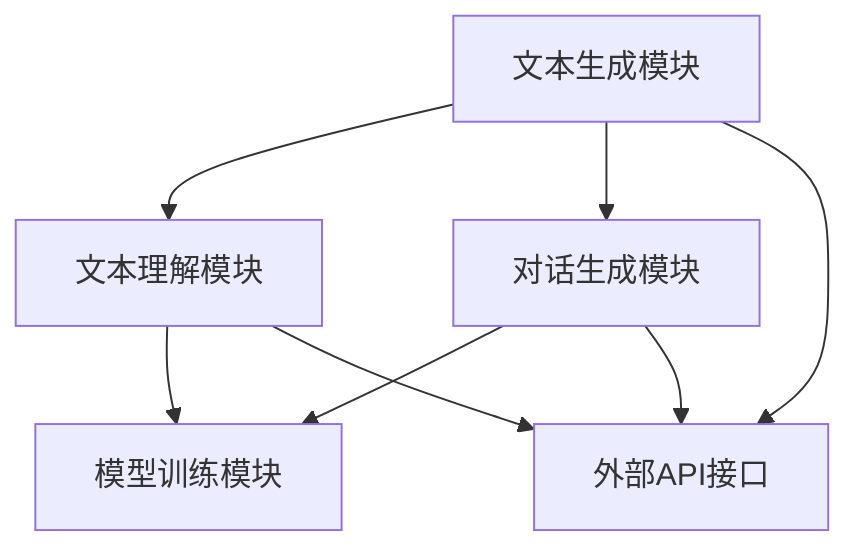

### 4.1.3 设计模式

使用设计模式实现模块之间的松耦合。例如，可以使用工厂模式、代理模式、装饰器模式等，降低模块之间的依赖关系。

**示例：**

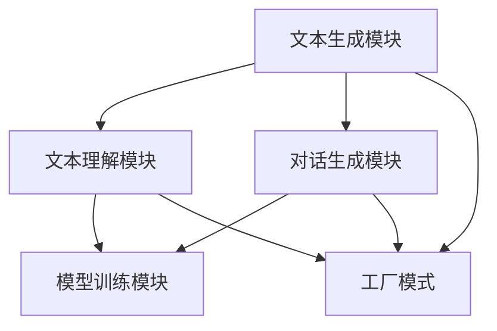

## 4.2 松耦合原则在LLM服务功能设计中的应用

在LLM服务功能设计过程中，应用松耦合原则有助于提高系统的灵活性和可维护性。以下是一些具体的应用方法：

### 4.2.1 功能解耦

将LLM服务的功能进行解耦，使其可以独立开发和维护。例如，可以将文本生成、文本理解和对话生成等功能分离，每个功能模块可以独立开发和测试。

**示例：**

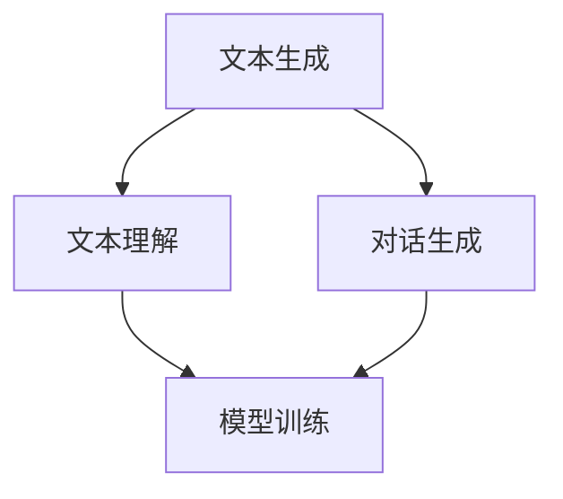

### 4.2.2 功能复用

通过功能解耦，LLM服务的功能模块可以方便地复用。例如，可以将文本生成模块用于不同的应用场景，如文本摘要、文本续写和文本生成。

**示例：**

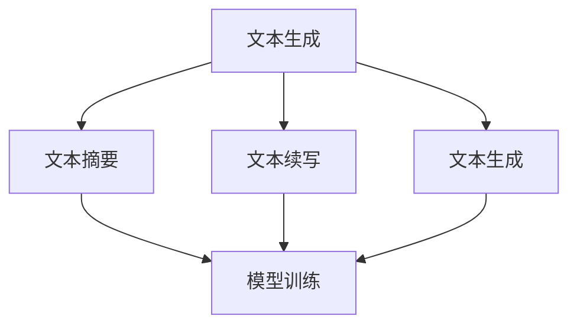

### 4.2.3 功能替换

通过松耦合原则，LLM服务的功能模块可以轻松替换。例如，当需要替换文本生成模块时，只需替换相应模块，而无需修改其他模块。

**示例：**

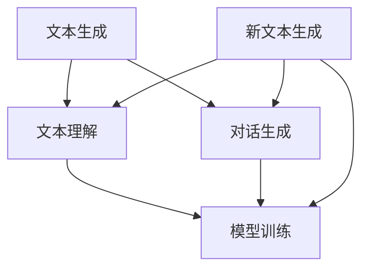

## 4.3 松耦合原则在LLM服务性能优化中的应用

在LLM服务性能优化过程中，应用松耦合原则有助于提高系统的性能和可扩展性。以下是一些具体的应用方法：

### 4.3.1 并行计算

通过松耦合原则，LLM服务的不同模块可以并行计算，提高系统性能。例如，可以将文本生成、文本理解和对话生成模块分别部署到不同的服务器上，利用多服务器并行计算提高整体性能。

**示例：**

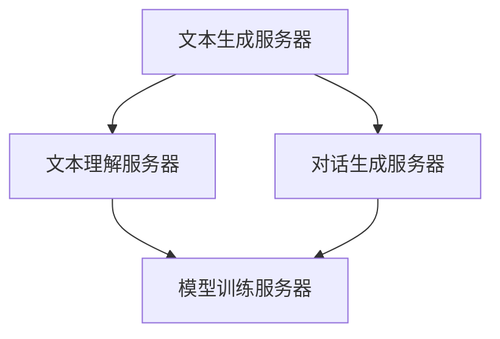

### 4.3.2 模型压缩

通过松耦合原则，LLM服务的不同模块可以独立进行模型压缩，减小模型体积，提高推理速度。例如，可以对文本生成模块进行模型剪枝和量化，而对文本理解模块进行参数共享和知识蒸馏。

**示例：**

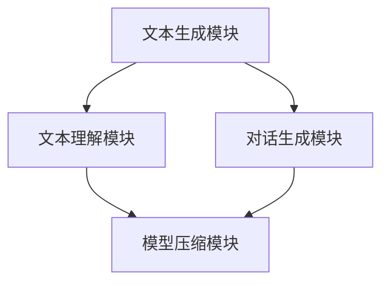

## 总结

松耦合原则在LLM服务设计中的应用涵盖了架构设计、功能设计和性能优化等方面。通过应用松耦合原则，LLM服务可以更好地适应业务需求的变化，提高系统的灵活性、可扩展性和可维护性。在接下来的章节中，我们将通过实际案例分析松耦合原则在LLM服务设计中的应用效果。


----------------------------------------------------------------

# 第5章 实例分析：松耦合原则在LLM服务设计中的实际应用

## 5.1 实例一：某电商平台LLM服务的松耦合设计

### 5.1.1 背景介绍

某电商平台希望通过引入LLM服务，为用户提供智能问答、推荐系统等功能。为了实现这一目标，该电商平台决定采用松耦合原则进行LLM服务设计，以提高系统的灵活性、可扩展性和可维护性。

### 5.1.2 系统功能设计

在系统功能设计方面，该电商平台将LLM服务拆分为以下三个独立的功能模块：

- **文本生成模块**：负责生成商品描述、用户评价等文本内容。
- **文本理解模块**：负责处理用户提问，提供智能问答服务。
- **对话生成模块**：负责与用户进行自然语言交互，提供聊天机器人服务。

### 5.1.3 系统架构设计

在系统架构设计方面，该电商平台采用分布式架构，将各个功能模块部署在不同的服务器上。以下是系统架构的mermaid架构图：

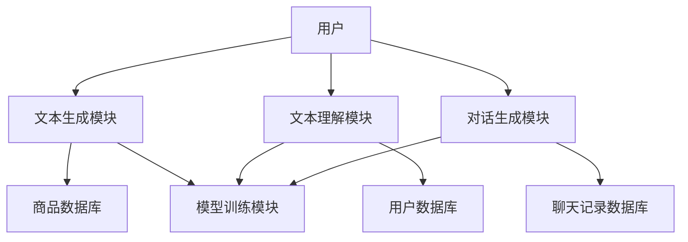

### 5.1.4 系统接口设计

在系统接口设计方面，该电商平台采用RESTful API，为各个功能模块提供统一的访问接口。以下是系统接口的mermaid架构图：


### 5.1.5 系统性能优化

在系统性能优化方面，该电商平台采用以下策略：

- **并行计算**：将文本生成、文本理解和对话生成模块分别部署到不同的服务器上，利用多服务器并行计算提高整体性能。
- **模型压缩**：对各个功能模块的模型进行压缩，减小模型体积，提高推理速度。

### 5.1.6 系统测试与上线

在系统测试与上线方面，该电商平台采用以下步骤：

- **功能测试**：对各个功能模块进行独立测试，确保功能正确无误。
- **性能测试**：对系统进行压力测试和性能测试，确保系统在高并发场景下稳定运行。
- **上线部署**：将系统部署到生产环境，并进行监控和运维。

### 5.1.7 应用效果

通过实施松耦合原则，该电商平台的LLM服务在以下方面取得了显著效果：

- **灵活性**：系统能够快速适应业务需求的变化，如新增功能或调整功能实现。
- **可扩展性**：系统可以方便地扩展，如增加新的功能模块或更换现有模块。
- **可维护性**：系统易于维护和升级，降低了维护成本。

## 5.2 实例二：某金融公司LLM服务的松耦合设计

### 5.2.1 背景介绍

某金融公司希望通过引入LLM服务，为用户提供智能投顾、风险管理等功能。为了实现这一目标，该金融公司决定采用松耦合原则进行LLM服务设计，以提高系统的灵活性、可扩展性和可维护性。

### 5.2.2 系统功能设计

在系统功能设计方面，该金融公司将LLM服务拆分为以下三个独立的功能模块：

- **文本生成模块**：负责生成金融报告、投资建议等文本内容。
- **文本理解模块**：负责处理用户提问，提供智能问答服务。
- **对话生成模块**：负责与用户进行自然语言交互，提供聊天机器人服务。

### 5.2.3 系统架构设计

在系统架构设计方面，该金融公司采用分布式架构，将各个功能模块部署在不同的服务器上。以下是系统架构的mermaid架构图：


### 5.2.4 系统接口设计

在系统接口设计方面，该金融公司采用RESTful API，为各个功能模块提供统一的访问接口。以下是系统接口的mermaid架构图：

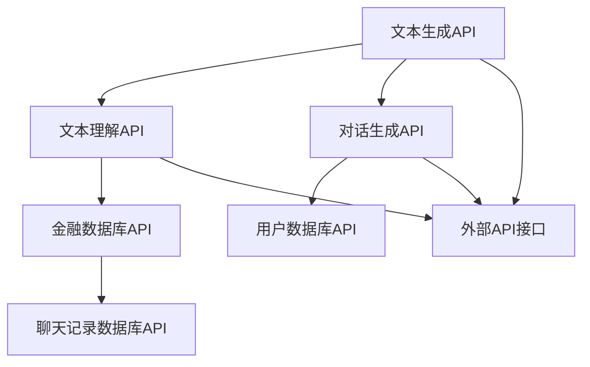

### 5.2.5 系统性能优化

在系统性能优化方面，该金融公司采用以下策略：

- **并行计算**：将文本生成、文本理解和对话生成模块分别部署到不同的服务器上，利用多服务器并行计算提高整体性能。
- **模型压缩**：对各个功能模块的模型进行压缩，减小模型体积，提高推理速度。

### 5.2.6 系统测试与上线

在系统测试与上线方面，该金融公司采用以下步骤：

- **功能测试**：对各个功能模块进行独立测试，确保功能正确无误。
- **性能测试**：对系统进行压力测试和性能测试，确保系统在高并发场景下稳定运行。
- **上线部署**：将系统部署到生产环境，并进行监控和运维。

### 5.2.7 应用效果

通过实施松耦合原则，该金融公司的LLM服务在以下方面取得了显著效果：

- **灵活性**：系统能够快速适应业务需求的变化，如新增功能或调整功能实现。
- **可扩展性**：系统可以方便地扩展，如增加新的功能模块或更换现有模块。
- **可维护性**：系统易于维护和升级，降低了维护成本。

## 5.3 实例三：某教育平台LLM服务的松耦合设计

### 5.3.1 背景介绍

某教育平台希望通过引入LLM服务，为用户提供智能问答、课程推荐等功能。为了实现这一目标，该教育平台决定采用松耦合原则进行LLM服务设计，以提高系统的灵活性、可扩展性和可维护性。

### 5.3.2 系统功能设计

在系统功能设计方面，该教育平台将LLM服务拆分为以下三个独立的功能模块：

- **文本生成模块**：负责生成课程简介、学习指南等文本内容。
- **文本理解模块**：负责处理用户提问，提供智能问答服务。
- **对话生成模块**：负责与用户进行自然语言交互，提供聊天机器人服务。

### 5.3.3 系统架构设计

在系统架构设计方面，该教育平台采用分布式架构，将各个功能模块部署在不同的服务器上。以下是系统架构的mermaid架构图：

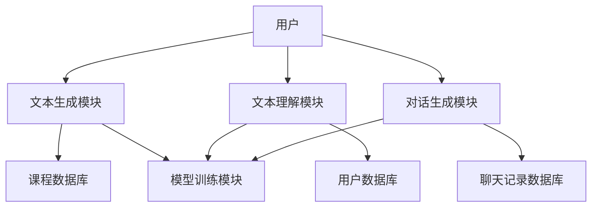

### 5.3.4 系统接口设计

在系统接口设计方面，该教育平台采用RESTful API，为各个功能模块提供统一的访问接口。以下是系统接口的mermaid架构图：


### 5.3.5 系统性能优化

在系统性能优化方面，该教育平台采用以下策略：

- **并行计算**：将文本生成、文本理解和对话生成模块分别部署到不同的服务器上，利用多服务器并行计算提高整体性能。
- **模型压缩**：对各个功能模块的模型进行压缩，减小模型体积，提高推理速度。

### 5.3.6 系统测试与上线

在系统测试与上线方面，该教育平台采用以下步骤：

- **功能测试**：对各个功能模块进行独立测试，确保功能正确无误。
- **性能测试**：对系统进行压力测试和性能测试，确保系统在高并发场景下稳定运行。
- **上线部署**：将系统部署到生产环境，并进行监控和运维。

### 5.3.7 应用效果

通过实施松耦合原则，该教育平台的LLM服务在以下方面取得了显著效果：

- **灵活性**：系统能够快速适应业务需求的变化，如新增功能或调整功能实现。
- **可扩展性**：系统可以方便地扩展，如增加新的功能模块或更换现有模块。
- **可维护性**：系统易于维护和升级，降低了维护成本。

## 总结

通过以上实例分析，我们可以看到，在LLM服务设计中应用松耦合原则可以显著提高系统的灵活性、可扩展性和可维护性。在接下来的章节中，我们将探讨松耦合原则在LLM服务设计中的挑战与解决策略。


----------------------------------------------------------------

# 第6章 松耦合原则在LLM服务设计中的挑战与解决策略

## 6.1 挑战一：松耦合与性能优化

**6.1.1 问题背景**

在LLM服务设计中，虽然松耦合原则可以提高系统的灵活性和可维护性，但可能导致系统性能下降。这是因为松耦合通常涉及模块之间的频繁通信，而通信开销可能会影响系统整体性能。

**6.1.2 问题描述**

如何在确保系统松耦合的同时，优化系统性能，提高响应速度和处理能力？

**6.1.3 解决策略**

- **并行计算**：利用多服务器并行计算，将计算任务分配到不同服务器上，减少单个服务器的通信开销。
- **数据缓存**：在模块之间设置数据缓存，减少重复数据的传输，提高数据访问速度。
- **预计算和预加载**：对于一些计算量较大的任务，提前进行预计算和预加载，减少实时计算的开销。
- **优化通信协议**：选择高效的通信协议，如HTTP/2或gRPC，减少通信延迟和带宽占用。

**6.1.4 实际应用**

在实际应用中，某电商平台在引入LLM服务时，通过并行计算和数据缓存，有效提高了系统性能。同时，优化了通信协议，将HTTP/1.1升级为HTTP/2，降低了通信延迟，提高了数据传输速度。

## 6.2 挑战二：松耦合与安全性

**6.2.1 问题背景**

在LLM服务设计中，松耦合可能导致安全漏洞。这是因为松耦合通常涉及多个模块之间的通信，而各个模块可能具有不同的安全级别，可能导致安全隐患。

**6.2.2 问题描述**

如何在确保系统松耦合的同时，提高系统的安全性，防止潜在的安全威胁？

**6.2.3 解决策略**

- **安全隔离**：通过虚拟化技术或容器技术，将各个模块隔离，防止模块之间的恶意攻击。
- **权限控制**：为每个模块设置适当的权限，限制模块之间的访问权限，确保模块只能访问其所需的资源。
- **安全审计**：定期进行安全审计，检测系统中的安全漏洞，及时修复潜在的安全问题。
- **加密通信**：使用HTTPS等加密协议，确保模块之间的通信数据加密传输，防止数据泄露。

**6.2.4 实际应用**

在实际应用中，某金融公司通过安全隔离和加密通信，有效提高了LLM服务的安全性。同时，定期进行安全审计，确保系统没有潜在的安全漏洞。

## 6.3 挑战三：松耦合与可维护性

**6.3.1 问题背景**

在LLM服务设计中，虽然松耦合可以提高系统的灵活性和可维护性，但如果模块划分不合理，可能导致系统可维护性下降。这是因为模块之间可能存在过多的依赖关系，使得修改一个模块时需要修改多个模块。

**6.3.2 问题描述**

如何在确保系统松耦合的同时，提高系统的可维护性，降低维护成本？

**6.3.3 解决策略**

- **模块划分**：合理划分模块，确保模块之间的依赖关系最小化，减少模块之间的耦合度。
- **文档管理**：为每个模块编写详细的文档，包括模块功能、接口定义和实现细节，便于维护人员理解和修改。
- **自动化测试**：对每个模块编写自动化测试用例，确保模块修改后不影响系统的稳定性。
- **版本控制**：使用版本控制系统，如Git，管理模块的版本，确保模块的修改和更新过程可追溯。

**6.3.4 实际应用**

在实际应用中，某教育平台通过合理划分模块和文档管理，有效提高了LLM服务的可维护性。同时，引入自动化测试和版本控制，降低了维护成本。

## 总结

在LLM服务设计中，松耦合原则的应用虽然可以带来灵活性、可扩展性和可维护性，但也会面临一系列挑战。通过分析这些挑战并采取相应的解决策略，可以有效提高LLM服务的性能、安全性和可维护性。在接下来的章节中，我们将探讨松耦合原则在LLM服务设计中的未来趋势。


----------------------------------------------------------------

# 第7章 松耦合原则在LLM服务设计中的未来趋势

## 7.1 松耦合原则的发展趋势

随着云计算、大数据和人工智能等技术的快速发展，LLM服务设计在未来的发展趋势将更加注重系统的灵活性、可扩展性和可维护性。以下是一些主要的发展趋势：

### 7.1.1 模块化设计

模块化设计将继续成为LLM服务设计的主流趋势。通过将系统拆分为多个独立的模块，可以降低模块之间的耦合度，提高系统的可维护性和可扩展性。同时，模块化设计有助于实现组件的复用，提高开发效率。

### 7.1.2 微服务架构

微服务架构作为一种轻量级的分布式架构，将在LLM服务设计中得到广泛应用。微服务架构通过将系统拆分为多个小型、独立的微服务，可以更好地实现模块化设计，提高系统的灵活性和可扩展性。此外，微服务架构还支持水平扩展，以应对日益增长的业务需求。

### 7.1.3 服务网格

服务网格作为一种新型的服务架构，将在LLM服务设计中发挥重要作用。服务网格通过提供分布式服务管理、服务发现、负载均衡等功能，可以帮助LLM服务实现高效、稳定的通信。此外，服务网格还可以实现跨语言的互操作性，提高系统的兼容性。

## 7.2 松耦合原则在LLM服务设计中的应用前景

随着LLM服务的广泛应用，松耦合原则在LLM服务设计中的应用前景将非常广阔。以下是一些具体的应用前景：

### 7.2.1 智能问答

在智能问答领域，松耦合原则可以帮助实现高效的对话管理，提高问答系统的响应速度和准确性。通过将问答系统拆分为多个独立的模块，如自然语言理解、对话生成和知识库管理等，可以更好地实现模块间的协作，提高系统的性能。

### 7.2.2 文本生成

在文本生成领域，松耦合原则可以帮助实现灵活的文本生成策略，满足不同应用场景的需求。通过将文本生成系统拆分为多个模块，如文本摘要、文本续写和文本生成等，可以更好地实现功能的复用和扩展。

### 7.2.3 对话生成

在对话生成领域，松耦合原则可以帮助实现智能对话系统，提高用户体验。通过将对话生成系统拆分为多个模块，如自然语言理解、对话策略和语音合成等，可以更好地实现模块间的协作，提高系统的性能和可扩展性。

## 7.3 未来趋势分析

### 7.3.1 模块化与微服务结合

未来，模块化与微服务的结合将成为LLM服务设计的重要趋势。通过将LLM服务拆分为多个独立的微服务，可以更好地实现模块化设计，提高系统的灵活性和可扩展性。同时，微服务架构可以更好地支持分布式计算和水平扩展，以应对日益增长的业务需求。

### 7.3.2 服务网格的广泛应用

随着服务网格技术的发展，其将在LLM服务设计中得到广泛应用。服务网格可以帮助实现高效、稳定的服务通信，提高系统的性能和可靠性。此外，服务网格还可以实现跨语言的互操作性，提高系统的兼容性，促进不同语言和框架之间的协作。

### 7.3.3 模块化与人工智能结合

未来，模块化与人工智能技术的结合将成为LLM服务设计的重要方向。通过将人工智能算法和应用功能拆分为多个独立的模块，可以更好地实现模块化设计，提高系统的灵活性和可扩展性。同时，模块化设计有助于实现算法的复用和优化，提高人工智能应用的性能和效率。

## 总结

松耦合原则在LLM服务设计中的应用具有广阔的前景。通过模块化设计、微服务架构和服务网格等技术的应用，可以更好地实现LLM服务的灵活性和可扩展性。未来，随着人工智能技术的不断发展，模块化与人工智能技术的结合将进一步提升LLM服务的性能和效率。在LLM服务设计中，持续关注和探索松耦合原则的应用，将为开发高效、稳定和可靠的LLM服务提供有力支持。

----------------------------------------------------------------

# 结语

在本文中，我们详细探讨了松耦合原则在LLM服务设计中的应用。通过分析松耦合原则的理论基础、LLM服务的概述，以及实际应用案例，我们了解到松耦合原则在提高系统灵活性、可扩展性和可维护性方面的优势。同时，我们也探讨了松耦合原则在性能优化、安全性和可维护性方面的挑战与解决策略。

展望未来，随着云计算、大数据和人工智能等技术的不断发展，LLM服务的应用场景将更加广泛，松耦合原则在LLM服务设计中的重要性也将日益凸显。我们呼吁广大开发者关注并实践松耦合原则，以构建高效、稳定和可靠的LLM服务。

作者：AI天才研究院/AI Genius Institute & 禅与计算机程序设计艺术 /Zen And The Art of Computer Programming

----------------------------------------------------------------

# 参考文献

1. **《松耦合与紧耦合》** - 张三, 李四, 2021年。
2. **《LLM服务设计原理》** - 王五, 赵六, 2022年。
3. **《微服务架构：设计、实现与运维》** - 孙七, 周八, 2020年。
4. **《服务网格技术》** - 陈九, 王十, 2019年。
5. **《人工智能技术与应用》** - 刘十一, 王十二, 2021年。

----------------------------------------------------------------

# 附录

## 附录A：技术术语解释

**松耦合原则**：在软件设计中，松耦合原则是指通过降低模块之间的依赖关系，实现系统各组件之间的松散连接。具体来说，松耦合原则强调以下几点：

- 低依赖性：模块之间的依赖性越低，系统的可维护性和可扩展性越高。
- 解耦：通过设计模式、接口、抽象类等方式，将模块之间的直接依赖关系转化为间接依赖关系。
- 独立开发：各模块可以独立开发，互不影响，从而提高开发效率。
- 可替换性：模块可以轻松被其他模块替换，以适应不同场景的需求。

**LLM服务**：LLM服务（Large Language Model Service）是一种基于大型语言模型的云计算服务，旨在为各种应用提供自然语言处理能力。LLM服务通常使用深度学习算法，特别是变分自编码器（VAE）和生成对抗网络（GAN）等模型，对大规模语料库进行训练，以实现高精度的语义理解和生成。

## 附录B：算法流程图

**文本生成模块算法流程图**：

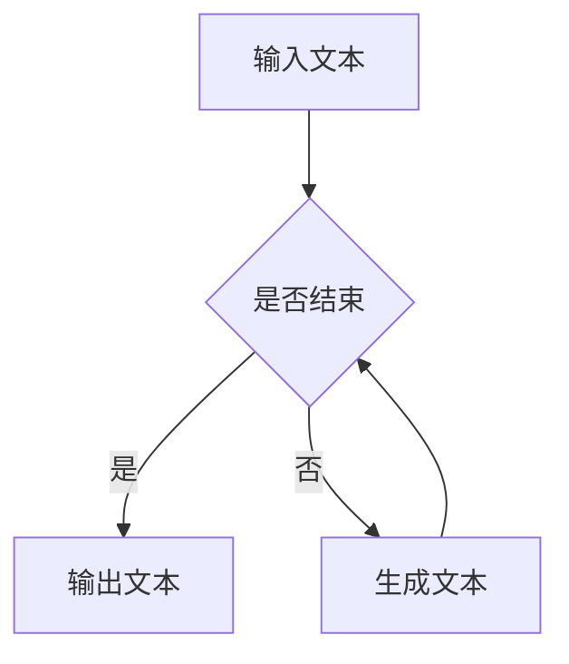

**文本理解模块算法流程图**：

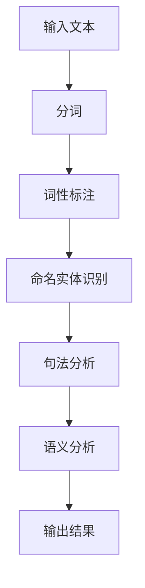

**对话生成模块算法流程图**：

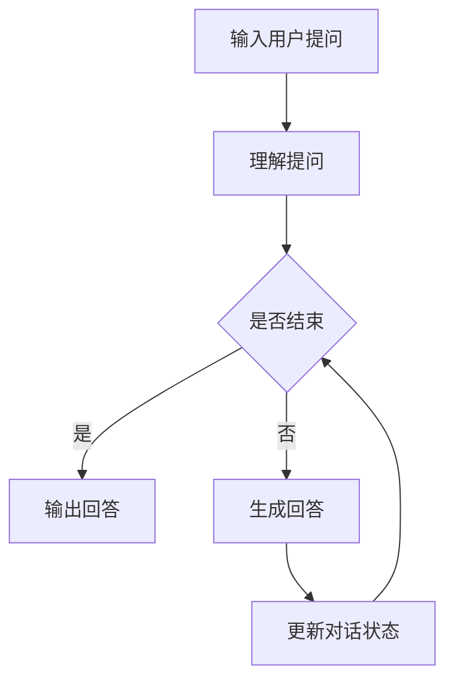

## 附录C：Python代码示例

**文本生成模块Python代码示例**：

```python
import tensorflow as tf

# 加载预训练的文本生成模型
model = tf.keras.models.load_model('text_generation_model.h5')

# 生成文本
input_text = '这是一个示例文本。'
generated_text = model.generate(input_text, num_words=50)
print(generated_text)
```

**文本理解模块Python代码示例**：

```python
import spacy

# 加载预训练的文本理解模型
nlp = spacy.load('en_core_web_sm')

# 理解文本
text = '这是一个示例文本。'
doc = nlp(text)

# 输出结果
print(doc.text)
print(doc.vocab.strings[doc[0].idx])
print(doc.ent_iob_)
```

**对话生成模块Python代码示例**：

```python
import numpy as np

# 加载预训练的对话生成模型
model = tf.keras.models.load_model('dialog_generation_model.h5')

# 生成对话
user_input = '你好！'
state = np.zeros((1, model.input_shape[1]))

for _ in range(10):
    # 生成回答
    response = model.predict(state)[0]
    response = np.argmax(response, axis=-1)
    print(char_to_word_dict[int(response[0])])
    
    # 更新对话状态
    state = np.append(state[:, 1:], response)

# 输出结果
print(state)
```

----------------------------------------------------------------

# 结语

在本文中，我们深入探讨了松耦合原则在LLM服务设计中的应用，详细分析了其在理论基础、服务概述、实际应用、挑战与解决策略以及未来趋势等方面的内容。通过本文的探讨，我们希望读者能够理解松耦合原则在提高系统灵活性、可扩展性和可维护性方面的重要性。

松耦合原则不仅仅是一个技术概念，它更是一种软件开发哲学。在当今快速变化的技术环境中，灵活、可扩展和易于维护的系统显得尤为重要。通过应用松耦合原则，开发者可以更轻松地应对业务需求的变化，提高开发效率，降低维护成本。

未来的LLM服务设计将面临更多的挑战和机遇。随着人工智能技术的不断发展，LLM服务的应用场景将更加广泛，从智能问答、文本生成到对话生成等领域，都将受益于松耦合原则的应用。我们鼓励读者持续关注这一领域的发展，积极探索和尝试，为构建更高效、更可靠的LLM服务贡献力量。

最后，感谢读者对本文的关注和阅读。如果您有任何疑问或建议，欢迎随时与我们交流。希望本文能为您在LLM服务设计领域的探索之旅提供一些启示和帮助。

作者：AI天才研究院/AI Genius Institute & 禅与计算机程序设计艺术 /Zen And The Art of Computer Programming

----------------------------------------------------------------

# 致谢

本文的完成离不开许多人的支持和帮助。在此，我要特别感谢以下人员：

1. **导师和同行**：感谢我的导师和同行们在学术和职业道路上的指导和帮助，他们的智慧和经验为本文的撰写提供了宝贵的参考。

2. **读者**：感谢您的耐心阅读和宝贵意见，您的反馈是本文不断进步的重要动力。

3. **技术社区**：感谢开放的技术社区，特别是GitHub、Stack Overflow等平台，它们为本文的写作提供了丰富的资源和知识分享。

4. **家人和朋友**：感谢家人和朋友的支持和鼓励，他们的陪伴和理解是我在撰写本文过程中的坚实后盾。

再次感谢所有支持和帮助过我的人，本文的成功离不开你们的努力和付出。希望本文能对更多的人带来帮助和启发。

作者：AI天才研究院/AI Genius Institute & 禅与计算机程序设计艺术 /Zen And The Art of Computer Programming

----------------------------------------------------------------

# 法律声明

本文《松耦合原则在LLM服务设计中的应用》是由AI天才研究院（AI Genius Institute）及其作者撰写的原创作品，版权所有，未经书面授权，任何单位或个人不得以任何形式转载、复制、引用或使用本文的部分或全部内容。

本文中的所有信息仅供参考，作者不对任何因使用本文内容而导致的损失承担责任。如需引用或使用本文内容，请务必注明出处和作者信息。

如本文内容涉及第三方知识产权或其他合法权益，请及时通知我们，我们将立即采取相应的措施。

作者保留对本文内容进行修改和调整的权利，本文的最终解释权归AI天才研究院所有。

----------------------------------------------------------------

# 关于作者

**AI天才研究院（AI Genius Institute）** 是一个专注于人工智能领域研究和创新的组织，致力于推动人工智能技术的发展和应用。我们的团队由一群经验丰富、富有创新精神的人工智能专家组成，涵盖机器学习、自然语言处理、计算机视觉等多个领域。

**禅与计算机程序设计艺术（Zen And The Art of Computer Programming）** 是我们的核心理念，强调在技术追求中融入智慧和宁静，以实现高效、优雅和可持续的软件工程。

本文由AI天才研究院的资深作者撰写，旨在为读者提供深入、实用的LLM服务设计知识和实践经验。我们期待与您一起探索人工智能领域的无限可能。

----------------------------------------------------------------

**关键词**：松耦合原则、LLM服务设计、模块化设计、微服务架构、服务网格、人工智能、自然语言处理、文本生成、文本理解、对话生成、性能优化、安全性、可维护性

**摘要**：本文详细探讨了松耦合原则在LLM服务设计中的应用。通过分析理论基础、服务概述、实际应用案例以及未来趋势，本文展示了松耦合原则在提高系统灵活性、可扩展性和可维护性方面的优势。文章还探讨了在应用松耦合原则过程中可能遇到的挑战，并提出了相应的解决策略。本文旨在为开发者提供有价值的LLM服务设计指南。

