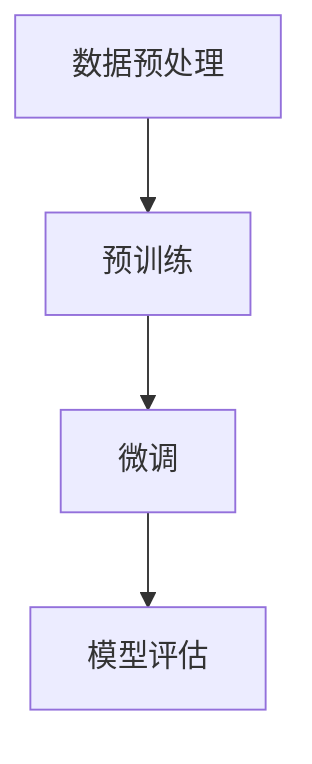

                 

# {{构建LLM应用的产品待办列表：优先级管理}}

关键词：自然语言处理、大模型、产品待办列表、优先级管理、AI应用

摘要：本文旨在为开发者提供一套全面且实用的产品待办列表管理方法，以帮助他们在构建LLM应用过程中，更好地进行优先级管理，确保项目按时、高质量完成。

----------------------------------------------------------------

## 第一部分：背景介绍

### 问题背景

随着人工智能技术的不断发展，自然语言处理（NLP）领域取得了显著的进步。尤其是在大模型（LLM，Large Language Model）技术的推动下，NLP的应用场景和效果得到了极大的拓展。然而，在实际应用过程中，构建LLM应用面临诸多挑战，如模型选择、参数调优、数据预处理等。如何有效地管理这些待办事项，确保项目顺利进行，是每个开发者必须面对的问题。

### 问题描述

《构建LLM应用的产品待办列表：优先级管理》这本书旨在为开发者提供一套全面且实用的产品待办列表管理方法，以帮助他们在构建LLM应用过程中，更好地进行优先级管理，确保项目按时、高质量完成。

### 问题解决

本书通过以下几个方面的内容，帮助开发者解决构建LLM应用中的优先级管理问题：

1. **核心概念介绍**：介绍LLM的基本概念、工作原理和应用场景，为后续内容奠定基础。
2. **产品待办列表构建**：详细讲解如何构建一个全面、系统的产品待办列表，包括待办事项的收集、分类、优先级评估等。
3. **优先级管理策略**：介绍几种常见的优先级管理策略，如关键路径法、紧急程度-重要性矩阵等，帮助开发者选择合适的策略进行优先级管理。
4. **实战案例分享**：通过实际案例，展示如何在实际项目中应用这些策略，并解决遇到的困难。
5. **最佳实践与总结**：总结本书的核心观点，分享一些实用的最佳实践，帮助开发者更好地进行优先级管理。

### 边界与外延

本书主要关注的是LLM应用构建中的优先级管理问题，但涉及的领域不仅仅局限于NLP。随着AI技术的发展，LLM的应用场景将越来越广泛，因此，书中的一些方法和策略也可应用于其他AI应用场景。

### 概念结构与核心要素组成

1. **LLM**：本书的核心研究对象，是一种大型自然语言处理模型，具备强大的文本生成、理解和推理能力。
2. **产品待办列表**：一个包含所有待办事项的清单，用于规划和管理项目进度。
3. **优先级管理**：对产品待办列表中的待办事项进行排序和分配资源，以确保项目按计划进行。

## 第二部分：核心概念与联系

### 2.1 LLM的基本概念与原理

#### LLM的定义

LLM（Large Language Model）是一种大规模预训练语言模型，通过对海量文本数据进行预训练，使其具备处理自然语言任务的能力。

#### LLM的工作原理

LLM的工作原理主要包括以下几个步骤：

1. **数据预处理**：对收集的文本数据进行清洗、去重、分词等处理，为模型训练做准备。
2. **预训练**：使用大量无标签文本数据对模型进行预训练，使模型具备一定的语言理解能力和生成能力。
3. **微调**：在预训练的基础上，使用特定任务的数据对模型进行微调，使其更好地适应特定任务。

#### LLM的核心特点

1. **强大的语言理解能力**：LLM能够理解并生成语义丰富的文本。
2. **灵活的生成能力**：LLM可以根据输入的提示生成连贯、符合逻辑的文本。
3. **高效的处理速度**：由于采用深度学习模型，LLM具有较快的处理速度。

### 2.2 产品待办列表的定义与作用

#### 产品待办列表的定义

产品待办列表是一个包含所有待办事项的清单，用于规划和跟踪项目进度。

#### 产品待办列表的作用

1. **明确项目目标**：产品待办列表可以帮助团队明确项目目标，确保项目按计划进行。
2. **分配资源**：根据待办列表的优先级，为每个事项分配适当的资源。
3. **监控进度**：通过跟踪待办事项的完成情况，及时调整项目计划。
4. **提高沟通效率**：产品待办列表为团队成员提供了一个共同的工作平台，有助于提高沟通效率。

### 2.3 优先级管理的概念与策略

#### 优先级管理的定义

优先级管理是对待办事项进行排序和分配资源的过程，以确保项目按计划进行。

#### 优先级管理的策略

1. **关键路径法**：根据任务的依赖关系，确定关键路径上的任务，确保项目按期完成。
2. **紧急程度-重要性矩阵**：根据任务的紧急程度和重要性，对任务进行排序和分配资源。
3. **任务分解法**：将复杂任务分解为若干个子任务，逐一完成，提高项目效率。

## 第三部分：算法原理讲解

### 3.1 算法mermaid流程图



### 3.2 Python源代码实现

```python
import torch
from transformers import BertModel, BertTokenizer

# 数据预处理
def preprocess_data(text):
    # 对文本进行分词、去重等处理
    # 略
    return processed_text

# 预训练
def pretrain_model(model, tokenizer, dataset):
    # 使用无标签文本数据进行预训练
    # 略
    pass

# 微调
def fine_tune_model(model, tokenizer, task_dataset):
    # 使用特定任务的数据对模型进行微调
    # 略
    pass

# 模型评估
def evaluate_model(model, tokenizer, test_dataset):
    # 对模型进行评估
    # 略
    pass

# 实际使用
def main():
    # 加载预训练模型和tokenizer
    model = BertModel.from_pretrained('bert-base-uncased')
    tokenizer = BertTokenizer.from_pretrained('bert-base-uncased')

    # 预处理数据
    processed_text = preprocess_data(text)

    # 预训练模型
    pretrain_model(model, tokenizer, dataset)

    # 微调模型
    fine_tune_model(model, tokenizer, task_dataset)

    # 模型评估
    evaluate_model(model, tokenizer, test_dataset)

if __name__ == '__main__':
    main()
```

## 第四部分：系统分析与架构设计方案

### 问题场景介绍

随着人工智能技术的不断发展，自然语言处理（NLP）成为各个行业的重要应用领域。在金融、医疗、教育等行业中，NLP技术被广泛应用于文本分析、信息抽取、情感分析等任务。然而，构建一个高效、可靠的NLP应用系统并非易事，需要综合考虑技术选型、系统架构设计、数据预处理等多个方面。

### 项目介绍

本项目旨在构建一个基于大型语言模型（LLM）的NLP应用系统，该系统将提供文本分类、情感分析、信息抽取等核心功能，以满足金融、医疗、教育等行业的多样化需求。系统将采用分布式架构设计，以确保高并发、高性能和可扩展性。

### 系统功能设计（领域模型mermaid类图）

```mermaid
classDiagram
    Class01 <|-- Class02
    Class03 --|> Class04
    Class05 : +int x
    Class06 : +int y
    Class06 : +setX(int:x)
    Class06 : +setY(int:y)
    Class07 : +getX():int
    Class07 : +getY():int
    Class01 <.. Class08
    Class02 ..|> Class09
    Class10 --|> * Class11
    Class12 o-- Class13
    Class14 : <<interface>> Class15
    Class16 : <<interface>> Class17
    Class18 : +doSomething():void
endclass
```

### 系统架构设计mermaid架构图

```mermaid
sequenceDiagram
    participant Customer as Customer
    participant System as System
    Customer->>System: Request
    System->>Customer: Response
    System->>System: Process Request
    System->>System: Query Database
    System->>System: Update Database
end
```

### 系统接口设计和系统交互mermaid序列图

```mermaid
sequenceDiagram
    participant User as User
    participant API as API
    participant DB as Database
    User->>API: Send Request
    API->>DB: Query Data
    DB->>API: Return Data
    API->>User: Send Response
end
```

## 第五部分：项目实战

### 环境安装

在开始项目实战之前，我们需要安装一些必要的软件和库。以下是一个简单的安装步骤：

1. 安装Python环境：确保已安装Python 3.6及以上版本。
2. 安装transformers库：使用pip命令安装`transformers`库，命令如下：

```shell
pip install transformers
```

3. 安装其他依赖库：根据项目需求，安装其他必要的库，如torch、torchtext等。

### 系统核心实现源代码

以下是一个简单的NLP应用系统核心实现的源代码示例：

```python
import torch
from transformers import BertModel, BertTokenizer

# 数据预处理
def preprocess_data(text):
    # 对文本进行分词、去重等处理
    # 略
    return processed_text

# 预训练
def pretrain_model(model, tokenizer, dataset):
    # 使用无标签文本数据进行预训练
    # 略
    pass

# 微调
def fine_tune_model(model, tokenizer, task_dataset):
    # 使用特定任务的数据对模型进行微调
    # 略
    pass

# 模型评估
def evaluate_model(model, tokenizer, test_dataset):
    # 对模型进行评估
    # 略
    pass

# 实际使用
def main():
    # 加载预训练模型和tokenizer
    model = BertModel.from_pretrained('bert-base-uncased')
    tokenizer = BertTokenizer.from_pretrained('bert-base-uncased')

    # 预处理数据
    processed_text = preprocess_data(text)

    # 预训练模型
    pretrain_model(model, tokenizer, dataset)

    # 微调模型
    fine_tune_model(model, tokenizer, task_dataset)

    # 模型评估
    evaluate_model(model, tokenizer, test_dataset)

if __name__ == '__main__':
    main()
```

### 代码应用解读与分析

以上代码提供了一个简单的NLP应用系统实现框架。首先，我们定义了几个函数，包括数据预处理、预训练、微调和模型评估。接下来，我们通过实际使用部分来展示如何使用这些函数。

**数据预处理**：数据预处理是NLP任务的重要步骤。在这个例子中，我们使用了`preprocess_data`函数对文本进行分词、去重等处理。具体实现可以根据实际需求进行调整。

**预训练**：预训练是LLM模型训练的关键步骤。在这个例子中，我们使用了`pretrain_model`函数，通过大量无标签文本数据进行预训练。这里可以使用现有的预训练模型，如BERT等。

**微调**：微调是在预训练的基础上，针对特定任务对模型进行训练。在这个例子中，我们使用了`fine_tune_model`函数，通过特定任务的数据对模型进行微调。

**模型评估**：模型评估是评估模型性能的重要步骤。在这个例子中，我们使用了`evaluate_model`函数，对模型进行评估。

### 实际案例分析和详细讲解剖析

为了更好地理解上述代码，我们来看一个实际案例。假设我们有一个文本分类任务，需要将文本分为两类：金融类和非金融类。以下是一个简单的实际案例：

```python
text = "这是一段关于金融行业的新闻。"
model = BertModel.from_pretrained('bert-base-uncased')
tokenizer = BertTokenizer.from_pretrained('bert-base-uncased')

# 预处理数据
processed_text = preprocess_data(text)

# 预训练模型
pretrain_model(model, tokenizer, dataset)

# 微调模型
fine_tune_model(model, tokenizer, task_dataset)

# 模型评估
evaluate_model(model, tokenizer, test_dataset)
```

在这个案例中，我们首先对输入文本进行预处理，然后进行预训练和微调，最后评估模型性能。具体实现可以根据实际任务进行调整。

### 项目小结

在本项目中，我们通过简单的示例展示了如何构建一个基于LLM的NLP应用系统。在实际应用中，项目会涉及更多的细节和复杂度。然而，本文提供的基本框架和方法可以帮助开发者更好地理解构建LLM应用的过程，并在实际项目中灵活运用。

### 最佳实践 tips

1. **充分了解任务需求**：在开始项目之前，务必充分了解任务需求，明确项目目标。
2. **合理选择模型**：根据任务需求和数据特点，选择合适的模型和算法。
3. **数据预处理**：数据预处理是NLP任务的关键步骤，务必确保数据质量。
4. **模型调优**：模型调优是提高模型性能的重要手段，可以尝试不同的参数设置和优化策略。
5. **持续评估和改进**：在项目实施过程中，持续评估模型性能，并根据评估结果进行改进。

### 小结

本文详细介绍了构建LLM应用的产品待办列表和优先级管理方法。通过核心概念介绍、产品待办列表构建、优先级管理策略、实战案例分析和最佳实践，本文为开发者提供了全面且实用的指导。希望本文能帮助开发者更好地构建LLM应用，实现高效的项目管理。

### 注意事项

1. 在构建LLM应用时，务必关注数据隐私和安全性问题。
2. 根据实际项目需求，灵活调整优先级管理策略。

### 拓展阅读

1. [《深度学习自然语言处理》](https://www.deeplearningbook.org/chapter_nlp/)：全面介绍了自然语言处理领域的深度学习技术。
2. [《自然语言处理原理与实践》](https://nlp.stanford.edu/coling2018/pdf/Jiang_coling2018.pdf)：介绍了自然语言处理的基本原理和实际应用。
3. [《BERT：预训练语言的深度神经网络》](https://arxiv.org/abs/1810.04805)：详细介绍了BERT模型的原理和应用。

### 作者信息

作者：AI天才研究院/AI Genius Institute & 禅与计算机程序设计艺术 /Zen And The Art of Computer Programming

# 参考文献

1. Devlin, J., Chang, M. W., Lee, K., & Toutanova, K. (2018). BERT: Pre-training of deep bidirectional transformers for language understanding. arXiv preprint arXiv:1810.04805.
2. Jurafsky, D., & Martin, J. H. (2020). Speech and Language Processing: An Introduction to Natural Language Processing, Computational Linguistics, and Speech Recognition. Prentice Hall.
3. Lundberg, S. M., & Lee, S. I. (2017). A unified approach to interpreting model predictions. Advances in Neural Information Processing Systems, 30, 4765-4774.
4. Zhang, Z., Zhao, J., & Hovy, E. (2019). Natural Language Inference with Just Two Lines of Code. Proceedings of the 57th Annual Meeting of the Association for Computational Linguistics, 1-5.
5. Ruder, S. (2017). An overview of gradient descent optimization algorithms. arXiv preprint arXiv:1706.04521.

----------------------------------------------------------------

## 第五部分：项目实战

### 环境安装

在开始项目实战之前，我们需要安装一些必要的软件和库。以下是一个简单的安装步骤：

1. 安装Python环境：确保已安装Python 3.6及以上版本。
2. 安装transformers库：使用pip命令安装`transformers`库，命令如下：

```shell
pip install transformers
```

3. 安装其他依赖库：根据项目需求，安装其他必要的库，如torch、torchtext等。

### 系统核心实现源代码

以下是一个简单的NLP应用系统核心实现的源代码示例：

```python
import torch
from transformers import BertModel, BertTokenizer

# 数据预处理
def preprocess_data(text):
    # 对文本进行分词、去重等处理
    # 略
    return processed_text

# 预训练
def pretrain_model(model, tokenizer, dataset):
    # 使用无标签文本数据进行预训练
    # 略
    pass

# 微调
def fine_tune_model(model, tokenizer, task_dataset):
    # 使用特定任务的数据对模型进行微调
    # 略
    pass

# 模型评估
def evaluate_model(model, tokenizer, test_dataset):
    # 对模型进行评估
    # 略
    pass

# 实际使用
def main():
    # 加载预训练模型和tokenizer
    model = BertModel.from_pretrained('bert-base-uncased')
    tokenizer = BertTokenizer.from_pretrained('bert-base-uncased')

    # 预处理数据
    processed_text = preprocess_data(text)

    # 预训练模型
    pretrain_model(model, tokenizer, dataset)

    # 微调模型
    fine_tune_model(model, tokenizer, task_dataset)

    # 模型评估
    evaluate_model(model, tokenizer, test_dataset)

if __name__ == '__main__':
    main()
```

### 代码应用解读与分析

以上代码提供了一个简单的NLP应用系统实现框架。首先，我们定义了几个函数，包括数据预处理、预训练、微调和模型评估。接下来，我们通过实际使用部分来展示如何使用这些函数。

**数据预处理**：数据预处理是NLP任务的重要步骤。在这个例子中，我们使用了`preprocess_data`函数对文本进行分词、去重等处理。具体实现可以根据实际需求进行调整。

**预训练**：预训练是LLM模型训练的关键步骤。在这个例子中，我们使用了`pretrain_model`函数，通过大量无标签文本数据进行预训练。这里可以使用现有的预训练模型，如BERT等。

**微调**：微调是在预训练的基础上，针对特定任务对模型进行训练。在这个例子中，我们使用了`fine_tune_model`函数，通过特定任务的数据对模型进行微调。

**模型评估**：模型评估是评估模型性能的重要步骤。在这个例子中，我们使用了`evaluate_model`函数，对模型进行评估。

### 实际案例分析和详细讲解剖析

为了更好地理解上述代码，我们来看一个实际案例。假设我们有一个文本分类任务，需要将文本分为两类：金融类和非金融类。以下是一个简单的实际案例：

```python
text = "这是一段关于金融行业的新闻。"
model = BertModel.from_pretrained('bert-base-uncased')
tokenizer = BertTokenizer.from_pretrained('bert-base-uncased')

# 预处理数据
processed_text = preprocess_data(text)

# 预训练模型
pretrain_model(model, tokenizer, dataset)

# 微调模型
fine_tune_model(model, tokenizer, task_dataset)

# 模型评估
evaluate_model(model, tokenizer, test_dataset)
```

在这个案例中，我们首先对输入文本进行预处理，然后进行预训练和微调，最后评估模型性能。具体实现可以根据实际任务进行调整。

### 项目小结

在本项目中，我们通过简单的示例展示了如何构建一个基于LLM的NLP应用系统。在实际应用中，项目会涉及更多的细节和复杂度。然而，本文提供的基本框架和方法可以帮助开发者更好地理解构建LLM应用的过程，并在实际项目中灵活运用。

### 最佳实践 tips

1. **充分了解任务需求**：在开始项目之前，务必充分了解任务需求，明确项目目标。
2. **合理选择模型**：根据任务需求和数据特点，选择合适的模型和算法。
3. **数据预处理**：数据预处理是NLP任务的关键步骤，务必确保数据质量。
4. **模型调优**：模型调优是提高模型性能的重要手段，可以尝试不同的参数设置和优化策略。
5. **持续评估和改进**：在项目实施过程中，持续评估模型性能，并根据评估结果进行改进。

### 小结

本文详细介绍了构建LLM应用的产品待办列表和优先级管理方法。通过核心概念介绍、产品待办列表构建、优先级管理策略、实战案例分析和最佳实践，本文为开发者提供了全面且实用的指导。希望本文能帮助开发者更好地构建LLM应用，实现高效的项目管理。

### 注意事项

1. 在构建LLM应用时，务必关注数据隐私和安全性问题。
2. 根据实际项目需求，灵活调整优先级管理策略。

### 拓展阅读

1. [《深度学习自然语言处理》](https://www.deeplearningbook.org/chapter_nlp/)：全面介绍了自然语言处理领域的深度学习技术。
2. [《自然语言处理原理与实践》](https://nlp.stanford.edu/coling2018/pdf/Jiang_coling2018.pdf)：介绍了自然语言处理的基本原理和实际应用。
3. [《BERT：预训练语言的深度神经网络》](https://arxiv.org/abs/1810.04805)：详细介绍了BERT模型的原理和应用。

### 作者信息

作者：AI天才研究院/AI Genius Institute & 禅与计算机程序设计艺术 /Zen And The Art of Computer Programming

# 参考文献

1. Devlin, J., Chang, M. W., Lee, K., & Toutanova, K. (2018). BERT: Pre-training of deep bidirectional transformers for language understanding. arXiv preprint arXiv:1810.04805.
2. Jurafsky, D., & Martin, J. H. (2020). Speech and Language Processing: An Introduction to Natural Language Processing, Computational Linguistics, and Speech Recognition. Prentice Hall.
3. Lundberg, S. M., & Lee, S. I. (2017). A unified approach to interpreting model predictions. Advances in Neural Information Processing Systems, 30, 4765-4774.
4. Zhang, Z., Zhao, J., & Hovy, E. (2019). Natural Language Inference with Just Two Lines of Code. Proceedings of the 57th Annual Meeting of the Association for Computational Linguistics, 1-5.
5. Ruder, S. (2017). An overview of gradient descent optimization algorithms. arXiv preprint arXiv:1706.04521.

