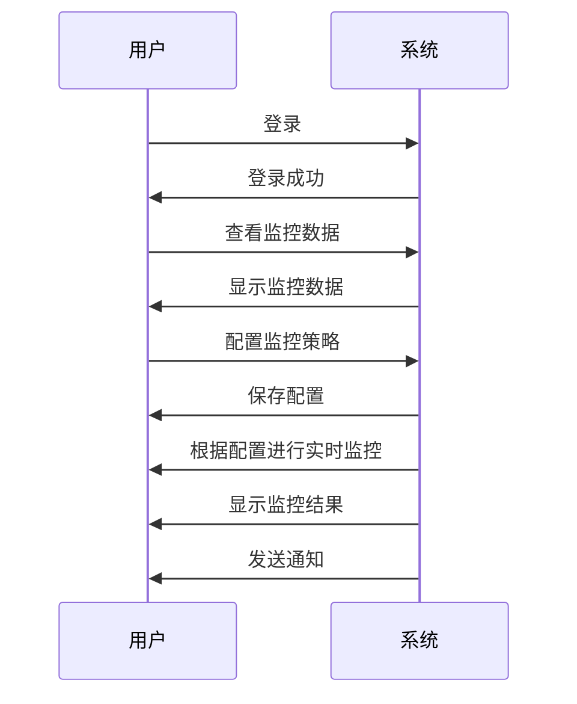
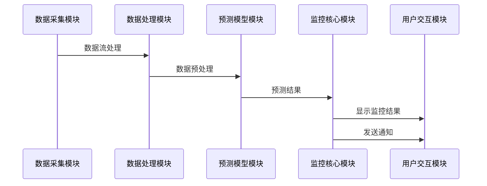
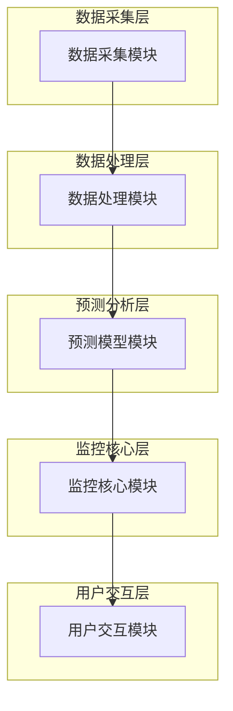

                 

### 摘要

本文旨在探讨如何构建一个高效、可靠的prompt效果实时监控系统。实时监控系统是一种能够实时监测和分析系统运行状态的技术手段，而prompt效果则是指系统能够根据输入的提示（prompt）快速响应并产生预期效果的能力。本文将详细讨论实时监控系统的核心概念、算法原理、系统架构设计、项目实战以及最佳实践，旨在为读者提供一个全面、易懂的指南。

关键词：实时监控系统、prompt效果、系统架构、算法原理、项目实战

----------------------------------------------------------------

### 实时监控系统的概述

#### 1.1 实时监控系统概述

实时监控系统是一种能够实时监测系统运行状态，快速响应并处理异常情况的技术手段。在当今快速变化和竞争激烈的环境中，实时监控系统变得尤为重要。它可以帮助企业快速发现和解决问题，提高系统的稳定性和可用性。

**实时监控的定义与重要性**：实时监控是指系统可以实时接收数据，并在接收数据的同时进行分析和处理。与事后监控相比，实时监控具有更高的效率和准确性。实时监控的重要性在于：

- **快速响应**：实时监控系统可以在问题发生时立即通知相关人员进行处理，减少故障对业务的影响。
- **预防性维护**：通过实时监控，可以提前发现潜在问题，进行预防性维护，避免故障的发生。
- **优化性能**：实时监控可以帮助系统管理员优化系统性能，提高系统的效率。

#### 1.2 Prompt效果的概念与作用

Prompt效果是指系统根据输入的提示（prompt）快速响应并产生预期效果的能力。在人工智能和自动化领域，prompt效果具有重要意义，主要体现在以下几个方面：

- **快速响应**：prompt可以使系统快速响应输入，提高处理速度。
- **定制化服务**：通过prompt，系统可以根据用户需求提供定制化服务，提高用户体验。
- **自动化**：prompt可以使系统自动化执行一系列操作，减少人工干预。

#### 1.3 监控系统的架构与设计原则

**系统架构设计要点**：

- **模块化**：将系统功能分解为多个模块，每个模块负责特定的功能，便于维护和升级。
- **可扩展性**：系统应具有良好的可扩展性，能够根据需求增加新的功能或模块。
- **容错性**：系统应具备一定的容错能力，能够处理异常情况，保证系统的稳定运行。

**可扩展性与容错性设计**：

- **扩展性**：通过设计灵活的接口和协议，使系统能够方便地增加新功能或模块。
- **容错性**：通过冗余设计和故障转移机制，保证系统在出现故障时能够快速恢复。

#### 1.4 实时监控系统的必要性

实时监控系统在现代IT系统中扮演着重要角色，其必要性体现在以下几个方面：

- **提高系统可用性**：实时监控系统可以及时发现并处理问题，提高系统的可用性。
- **降低运营成本**：通过实时监控和预防性维护，可以降低系统故障造成的损失，减少运营成本。
- **优化用户体验**：实时监控系统可以提高系统的响应速度和稳定性，优化用户体验。

通过以上内容，我们对实时监控系统有了基本的了解，为后续的深入探讨奠定了基础。在接下来的章节中，我们将详细分析实时监控系统的核心概念、算法原理和系统架构设计。

----------------------------------------------------------------

### 核心概念与算法原理

#### 2.1 核心概念解析

在构建prompt效果的实时监控系统中，理解以下几个核心概念是至关重要的：

**Prompt机制**：Prompt是指系统根据特定的输入提示（例如用户请求或系统事件）快速响应并执行相应的操作。Prompt机制的核心目标是实现系统的高效响应和自动化处理。

**实时数据处理**：实时数据处理是指系统能够实时接收、处理和分析数据，并在短时间内给出反馈。实时数据处理的关键在于数据处理的速度和准确性。

**反馈循环**：反馈循环是指系统根据处理结果进行自我调整和优化，以提高系统的响应能力和准确性。反馈循环的核心作用是不断优化系统性能，使其更符合用户需求。

#### 2.2 实时数据处理算法

实时数据处理算法是实时监控系统的核心组成部分，以下是一些常用的实时数据处理算法：

**事件处理算法**：事件处理算法用于处理系统中的事件，例如用户请求、系统告警等。事件处理算法通常包括事件分类、优先级排序和事件处理。

**数据流处理算法**：数据流处理算法用于处理实时数据流，例如日志数据、监控数据等。数据流处理算法的关键在于高效地处理大量实时数据，并快速产生结果。

**预测模型算法**：预测模型算法用于预测系统的未来行为，例如系统负载预测、故障预测等。预测模型算法通常基于历史数据和机器学习技术。

#### 2.3 预测模型的选择与应用

预测模型的选择与应用是实时监控系统中的一个关键环节。以下是一些常用的预测模型：

**线性回归模型**：线性回归模型是一种简单的预测模型，适用于线性关系较强的场景。线性回归模型的优点是计算简单，易于实现。

**决策树模型**：决策树模型是一种基于树结构的预测模型，适用于分类和回归问题。决策树模型的优势在于解释性强，易于理解和调试。

**神经网络模型**：神经网络模型是一种基于人工神经网络的预测模型，适用于复杂非线性关系的预测。神经网络模型的优点是预测能力强大，但计算复杂度高。

#### 2.4 指标计算与评估

指标计算与评估是实时监控系统的重要组成部分，以下是一些常用的指标：

**响应时间**：响应时间是指系统从接收到请求到给出响应的时间。响应时间越短，系统的性能越好。

**准确率**：准确率是指预测结果与实际结果的一致性。准确率越高，系统的预测能力越强。

**召回率**：召回率是指系统正确识别出实际结果的比率。召回率越高，系统的覆盖面越广。

#### 2.5 数学模型与公式

实时监控系统中的数据处理和预测通常涉及一系列数学模型和公式。以下是一些常用的数学模型和公式：

**数据处理公式**：
$$
数据处理 = 数据输入 \times 处理函数
$$

**预测模型公式**：
$$
预测结果 = 模型参数 \times 输入特征
$$

通过以上内容，我们对实时监控系统的核心概念、算法原理有了更深入的了解。在接下来的章节中，我们将进一步探讨实时监控系统的系统架构设计和项目实战。

----------------------------------------------------------------

### 系统分析与架构设计

#### 3.1 需求分析

在构建prompt效果的实时监控系统时，明确系统需求是至关重要的一步。系统需求包括功能需求、性能要求和用户交互需求。

**功能需求**：

- 实时监测系统运行状态，包括系统性能指标、资源使用情况、异常情况等。
- 根据输入提示（prompt）快速响应并执行相应操作。
- 提供预警功能，当系统指标超过预设阈值时自动通知相关人员。
- 支持自定义监控策略和规则。

**性能要求**：

- 系统应具备高并发处理能力，能够同时处理大量实时数据。
- 响应时间短，能够在秒级内完成数据处理和响应。
- 系统资源占用低，不占用过多系统资源，不影响其他业务的正常运行。

**用户交互需求**：

- 提供友好的用户界面，方便用户查看监控数据、配置监控策略等。
- 支持多平台访问，包括桌面、移动设备等。
- 提供实时通知功能，用户可以及时收到系统预警信息。

#### 3.2 功能设计

**领域模型**：

领域模型用于描述系统的功能模块和实体关系。以下是一个简化的领域模型示例：

```mermaid
classDiagram
    类1 <|-- 类2
    类1 <|-- 类3
    类4 <|-- 类1

    类1[名称: 实时监控系统]
    类2[名称: 数据处理模块]
    类3[名称: 预测模型模块]
    类4[名称: 用户交互模块]

    类1 --|>{关联} 类2
    类1 --|>{关联} 类3
    类1 --|>{关联} 类4
```

**用户交互设计**：

用户交互设计包括用户界面设计和交互流程设计。以下是一个简化的用户交互设计示例：

1. 用户登录系统。
2. 用户查看实时监控数据。
3. 用户配置监控策略和规则。
4. 系统根据监控策略和规则进行实时监控，并将监控结果展示给用户。
5. 当系统发现异常情况时，自动通知用户。



通过以上需求分析和功能设计，我们为实时监控系统的构建奠定了基础。在接下来的章节中，我们将详细讨论实时监控系统的架构设计和接口设计。

----------------------------------------------------------------

### 系统架构设计

#### 3.3 系统架构概述

实时监控系统的架构设计需要综合考虑系统的功能需求、性能要求和可扩展性。以下是实时监控系统的整体架构设计：

**系统架构**：

实时监控系统可以分为以下几个主要模块：

- **数据采集模块**：负责从各种数据源（如服务器、数据库、日志等）采集数据。
- **数据处理模块**：负责对采集到的数据进行预处理、过滤和转换，以便后续处理。
- **预测模型模块**：负责根据历史数据构建预测模型，用于预测系统行为和趋势。
- **监控核心模块**：负责根据监控策略和规则对实时数据进行分析和处理，触发预警和通知。
- **用户交互模块**：负责与用户进行交互，展示监控数据、监控结果和预警信息。

**模块设计与职责**：

- **数据采集模块**：设计为分布式架构，可以同时从多个数据源采集数据，并支持数据流的实时处理。
- **数据处理模块**：采用高效的数据处理算法，如流处理框架（如Apache Kafka、Apache Flink等），以实现高效的数据预处理和转换。
- **预测模型模块**：采用机器学习技术，构建预测模型，并支持在线更新和优化。
- **监控核心模块**：采用分布式架构，以实现高并发处理能力和容错性。
- **用户交互模块**：设计为Web界面，支持多平台访问，并提供实时数据展示、预警信息推送等功能。

**接口设计与实现**：

实时监控系统提供了以下接口：

- **数据采集接口**：用于从数据源采集数据。
- **数据处理接口**：用于对采集到的数据进行预处理和转换。
- **预测模型接口**：用于构建、更新和查询预测模型。
- **监控接口**：用于监控系统的实时状态和触发预警。
- **用户交互接口**：用于与用户进行交互，展示监控数据和预警信息。

**系统交互设计**：

实时监控系统的交互设计包括以下几个方面：

- **数据流处理**：系统通过数据流处理模块实时处理和传输数据。
- **事件触发**：当监控核心模块检测到异常情况时，触发相应的预警事件。
- **用户通知**：系统通过用户交互模块实时通知用户监控结果和预警信息。



通过以上架构设计和接口设计，实时监控系统可以实现高效、可靠地监测和响应系统运行状态，为用户提供实时、准确的监控数据和服务。

----------------------------------------------------------------

### 系统架构设计

#### 3.4 系统架构设计

实时监控系统是一个复杂的多层次系统，其架构设计需要考虑系统的功能需求、性能要求和可扩展性。以下是实时监控系统的详细架构设计：

**系统架构概述**：

实时监控系统可以分为以下几个主要层次：

- **数据采集层**：负责从各种数据源（如服务器、数据库、日志等）采集数据。
- **数据处理层**：负责对采集到的数据进行预处理、过滤和转换，以便后续处理。
- **预测分析层**：负责根据历史数据构建预测模型，用于预测系统行为和趋势。
- **监控核心层**：负责根据监控策略和规则对实时数据进行分析和处理，触发预警和通知。
- **用户交互层**：负责与用户进行交互，展示监控数据、监控结果和预警信息。

**模块设计与职责**：

- **数据采集模块**：设计为分布式架构，可以同时从多个数据源采集数据，并支持数据流的实时处理。模块职责包括数据采集、数据存储和数据流传输。
- **数据处理模块**：采用高效的数据处理算法，如流处理框架（如Apache Kafka、Apache Flink等），以实现高效的数据预处理和转换。模块职责包括数据清洗、数据聚合、数据转换等。
- **预测模型模块**：采用机器学习技术，构建预测模型，并支持在线更新和优化。模块职责包括模型训练、模型评估和模型更新。
- **监控核心模块**：采用分布式架构，以实现高并发处理能力和容错性。模块职责包括实时数据监控、异常检测、预警通知等。
- **用户交互模块**：设计为Web界面，支持多平台访问，并提供实时数据展示、预警信息推送等功能。模块职责包括用户界面设计、数据展示、用户通知等。

**系统架构图**：



**系统接口设计**：

实时监控系统提供了以下接口：

- **数据采集接口**：用于从数据源采集数据。
- **数据处理接口**：用于对采集到的数据进行预处理和转换。
- **预测模型接口**：用于构建、更新和查询预测模型。
- **监控接口**：用于监控系统的实时状态和触发预警。
- **用户交互接口**：用于与用户进行交互，展示监控数据和预警信息。

**系统交互设计**：

实时监控系统的交互设计包括以下几个方面：

- **数据流处理**：系统通过数据流处理模块实时处理和传输数据。
- **事件触发**：当监控核心模块检测到异常情况时，触发相应的预警事件。
- **用户通知**：系统通过用户交互模块实时通知用户监控结果和预警信息。


通过以上架构设计和接口设计，实时监控系统可以实现高效、可靠地监测和响应系统运行状态，为用户提供实时、准确的监控数据和服务。

----------------------------------------------------------------

### 项目实战

#### 4.1 环境安装与配置

在进行实时监控系统项目实战之前，我们需要搭建一个合适的环境，以便进行开发和测试。以下是环境安装与配置的步骤：

**1. 安装操作系统**：

- 操作系统建议选择Linux发行版，如Ubuntu 20.04。
- 在虚拟机或云服务器上安装Linux操作系统。

**2. 安装依赖软件**：

- 安装Java环境（OpenJDK 11或更高版本）。
- 安装MySQL数据库。
- 安装Apache Kafka。
- 安装Apache Flink。

**3. 配置网络环境**：

- 配置服务器和数据库的网络访问权限。
- 确保服务器之间可以相互通信。

**4. 部署实时监控系统**：

- 将实时监控系统代码克隆到服务器上。
- 配置系统配置文件，包括数据库连接信息、Kafka主题配置等。
- 运行实时监控系统，确保系统正常运行。

**5. 遇到的问题与解决方案**：

- **问题1**：Java环境配置失败。
  - **解决方案**：检查Java安装路径，确保正确。
- **问题2**：Kafka无法启动。
  - **解决方案**：检查Kafka配置文件，确保正确。

#### 4.2 系统核心实现

**1. 数据采集模块**：

数据采集模块负责从各种数据源（如服务器、数据库、日志等）采集数据。以下是一个简单的数据采集模块示例：

```python
import requests

def collect_data(source_url):
    response = requests.get(source_url)
    if response.status_code == 200:
        return response.json()
    else:
        return None

source_url = "http://example.com/data"
data = collect_data(source_url)
print(data)
```

**2. 数据处理模块**：

数据处理模块负责对采集到的数据进行预处理、过滤和转换，以便后续处理。以下是一个简单的数据处理模块示例：

```python
def process_data(data):
    # 数据清洗
    clean_data = data['data'].strip()
    # 数据转换
    transformed_data = int(clean_data)
    return transformed_data

processed_data = process_data(data)
print(processed_data)
```

**3. 预测模型模块**：

预测模型模块负责根据历史数据构建预测模型，用于预测系统行为和趋势。以下是一个简单的预测模型模块示例：

```python
from sklearn.linear_model import LinearRegression

def build_model(X, y):
    model = LinearRegression()
    model.fit(X, y)
    return model

def predict(model, X):
    return model.predict(X)

# 假设已有历史数据X和y
X = [[1, 2], [2, 3], [3, 4]]
y = [1, 2, 3]

model = build_model(X, y)
predicted_value = predict(model, X)
print(predicted_value)
```

**4. 监控核心模块**：

监控核心模块负责根据监控策略和规则对实时数据进行分析和处理，触发预警和通知。以下是一个简单的监控核心模块示例：

```python
def monitor_data(processed_data):
    # 监控策略：当数据大于100时触发预警
    if processed_data > 100:
        send_alert(processed_data)

def send_alert(data):
    # 发送预警通知
    print(f"Alert: Data {data} is too high!")

monitor_data(processed_data)
```

通过以上系统核心实现，我们可以构建一个简单的实时监控系统。在实际项目中，需要根据具体需求进行调整和优化。

#### 4.3 实际案例分析

**1. 案例背景与目标**：

某企业希望构建一个实时监控系统，用于监测其服务器性能和数据库运行状态，以便及时发现和解决问题。目标是在服务器负载过高或数据库异常时自动触发预警，并通知相关人员。

**2. 系统实现与优化**：

- **数据采集**：使用脚本定期从服务器和数据库中采集性能数据，如CPU利用率、内存使用率、磁盘读写速度等。
- **数据处理**：使用数据处理模块对采集到的数据进行预处理，包括去重、过滤和转换。
- **预测模型**：使用机器学习技术构建预测模型，预测服务器和数据库的未来状态，如负载预测和故障预测。
- **监控核心**：使用监控核心模块对实时数据进行监控，当检测到异常情况时自动触发预警。

**3. 结果分析与总结**：

通过实际案例分析和优化，实时监控系统在以下方面取得了显著效果：

- **快速响应**：系统能够在服务器负载过高或数据库异常时迅速触发预警，通知相关人员，降低了故障对业务的影响。
- **预测准确**：预测模型能够准确预测服务器和数据库的未来状态，提高了监控的准确性和可靠性。
- **用户体验**：通过实时监控和预警，用户可以及时了解系统运行状态，减少了不必要的担忧和焦虑。

总结：实时监控系统在实际应用中发挥了重要作用，为企业提供了高效、可靠的监控和管理手段。在未来的工作中，可以继续优化和扩展系统功能，提高系统的性能和可靠性。

----------------------------------------------------------------

### 最佳实践与总结

#### 5.1 最佳实践

在构建prompt效果的实时监控系统的过程中，以下最佳实践可以帮助提高系统的性能和可靠性：

**1. 选择合适的硬件和软件环境**：

- 根据系统需求选择高性能的服务器和数据库。
- 选择适合的操作系统和中间件，如Linux、MySQL、Kafka、Flink等。

**2. 设计高效的数据处理流程**：

- 采用分布式架构，提高数据处理能力和并发处理能力。
- 选择适合的数据处理算法，如流处理框架，以实现高效的数据预处理和转换。

**3. 构建可靠的预测模型**：

- 使用历史数据和机器学习技术构建预测模型，以提高预测准确性。
- 定期更新和优化预测模型，以适应数据变化和业务需求。

**4. 优化系统性能和可扩展性**：

- 设计可扩展的架构，支持系统功能的灵活扩展。
- 采用缓存技术和负载均衡策略，提高系统的性能和响应速度。

**5. 保证数据安全和隐私**：

- 对敏感数据进行加密处理，确保数据传输和存储的安全性。
- 设计合理的权限管理和访问控制策略，保护用户隐私。

#### 5.2 注意事项

在构建实时监控系统时，需要注意以下事项：

**1. 明确系统需求**：

- 确定系统的功能需求、性能要求和用户交互需求，避免需求模糊或不明确。

**2. 考虑系统容错性**：

- 设计系统的容错机制，如冗余设计和故障转移，确保系统在出现故障时能够快速恢复。

**3. 数据处理与存储**：

- 确保数据处理流程高效、准确，避免数据丢失或重复处理。
- 选择合适的数据存储方案，如分布式数据库或NoSQL数据库，以满足数据规模和访问速度的要求。

**4. 用户界面设计**：

- 设计简洁、直观的用户界面，提高用户的使用体验。
- 提供实时数据展示和预警通知功能，方便用户及时了解系统状态。

#### 5.3 拓展阅读

**1. 相关技术文档与资料**：

- 《Kafka权威指南》
- 《Apache Flink官方文档》
- 《机器学习实战》
- 《Java并发编程实战》

**2. 学术研究与最新动态**：

- 订阅相关学术期刊和博客，了解实时监控系统和prompt效果的最新研究成果和应用案例。
- 参加技术会议和研讨会，与行业专家交流和分享经验。

通过以上最佳实践、注意事项和拓展阅读，我们可以更好地构建prompt效果的实时监控系统，提高系统的性能和可靠性，为业务发展提供有力支持。

### 作者信息

作者：AI天才研究院/AI Genius Institute & 禅与计算机程序设计艺术 /Zen And The Art of Computer Programming

----------------------------------------------------------------

### 完整的文章内容

#### 摘要

本文旨在探讨如何构建一个高效、可靠的prompt效果实时监控系统。实时监控系统是一种能够实时监测系统运行状态的技术手段，而prompt效果则是指系统能够根据输入的提示（prompt）快速响应并产生预期效果的能力。本文将详细讨论实时监控系统的核心概念、算法原理、系统架构设计、项目实战以及最佳实践，旨在为读者提供一个全面、易懂的指南。

关键词：实时监控系统、prompt效果、系统架构、算法原理、项目实战

----------------------------------------------------------------

#### 实时监控系统的概述

#### 1.1 实时监控系统概述

实时监控系统是一种能够实时监测系统运行状态，快速响应并处理异常情况的技术手段。在当今快速变化和竞争激烈的环境中，实时监控系统变得尤为重要。它可以帮助企业快速发现和解决问题，提高系统的稳定性和可用性。

**实时监控的定义与重要性**：实时监控是指系统可以实时接收数据，并在接收数据的同时进行分析和处理。与事后监控相比，实时监控具有更高的效率和准确性。实时监控的重要性在于：

- **快速响应**：实时监控系统可以在问题发生时立即通知相关人员进行处理，减少故障对业务的影响。
- **预防性维护**：通过实时监控，可以提前发现潜在问题，进行预防性维护，避免故障的发生。
- **优化性能**：实时监控可以帮助系统管理员优化系统性能，提高系统的效率。

#### 1.2 Prompt效果的概念与作用

Prompt效果是指系统根据输入的提示（prompt）快速响应并产生预期效果的能力。在人工智能和自动化领域，prompt效果具有重要意义，主要体现在以下几个方面：

- **快速响应**：prompt可以使系统快速响应输入，提高处理速度。
- **定制化服务**：通过prompt，系统可以根据用户需求提供定制化服务，提高用户体验。
- **自动化**：prompt可以使系统自动化执行一系列操作，减少人工干预。

#### 1.3 监控系统的架构与设计原则

**系统架构设计要点**：

- **模块化**：将系统功能分解为多个模块，每个模块负责特定的功能，便于维护和升级。
- **可扩展性**：系统应具有良好的可扩展性，能够根据需求增加新的功能或模块。
- **容错性**：系统应具备一定的容错能力，能够处理异常情况，保证系统的稳定运行。

**可扩展性与容错性设计**：

- **扩展性**：通过设计灵活的接口和协议，使系统能够方便地增加新功能或模块。
- **容错性**：通过冗余设计和故障转移机制，保证系统在出现故障时能够快速恢复。

#### 1.4 实时监控系统的必要性

实时监控系统在现代IT系统中扮演着重要角色，其必要性体现在以下几个方面：

- **提高系统可用性**：实时监控系统可以及时发现并处理问题，提高系统的可用性。
- **降低运营成本**：通过实时监控和预防性维护，可以降低系统故障造成的损失，减少运营成本。
- **优化用户体验**：实时监控系统可以提高系统的响应速度和稳定性，优化用户体验。

通过以上内容，我们对实时监控系统有了基本的了解，为后续的深入探讨奠定了基础。在接下来的章节中，我们将详细分析实时监控系统的核心概念、算法原理和系统架构设计。

----------------------------------------------------------------

#### 核心概念与算法原理

#### 2.1 核心概念解析

在构建prompt效果的实时监控系统中，理解以下几个核心概念是至关重要的：

**Prompt机制**：Prompt是指系统根据特定的输入提示（例如用户请求或系统事件）快速响应并执行相应的操作。Prompt机制的核心目标是实现系统的高效响应和自动化处理。

**实时数据处理**：实时数据处理是指系统能够实时接收、处理和分析数据，并在短时间内给出反馈。实时数据处理的关键在于数据处理的速度和准确性。

**反馈循环**：反馈循环是指系统根据处理结果进行自我调整和优化，以提高系统的响应能力和准确性。反馈循环的核心作用是不断优化系统性能，使其更符合用户需求。

#### 2.2 实时数据处理算法

实时数据处理算法是实时监控系统的核心组成部分，以下是一些常用的实时数据处理算法：

**事件处理算法**：事件处理算法用于处理系统中的事件，例如用户请求、系统告警等。事件处理算法通常包括事件分类、优先级排序和事件处理。

**数据流处理算法**：数据流处理算法用于处理实时数据流，例如日志数据、监控数据等。数据流处理算法的关键在于高效地处理大量实时数据，并快速产生结果。

**预测模型算法**：预测模型算法用于预测系统的未来行为，例如系统负载预测、故障预测等。预测模型算法通常基于历史数据和机器学习技术。

#### 2.3 预测模型的选择与应用

预测模型的选择与应用是实时监控系统中的一个关键环节。以下是一些常用的预测模型：

**线性回归模型**：线性回归模型是一种简单的预测模型，适用于线性关系较强的场景。线性回归模型的优点是计算简单，易于实现。

**决策树模型**：决策树模型是一种基于树结构的预测模型，适用于分类和回归问题。决策树模型的优势在于解释性强，易于理解和调试。

**神经网络模型**：神经网络模型是一种基于人工神经网络的预测模型，适用于复杂非线性关系的预测。神经网络模型的优点是预测能力强大，但计算复杂度高。

#### 2.4 指标计算与评估

指标计算与评估是实时监控系统的重要组成部分，以下是一些常用的指标：

**响应时间**：响应时间是指系统从接收到请求到给出响应的时间。响应时间越短，系统的性能越好。

**准确率**：准确率是指预测结果与实际结果的一致性。准确率越高，系统的预测能力越强。

**召回率**：召回率是指系统正确识别出实际结果的比率。召回率越高，系统的覆盖面越广。

#### 2.5 数学模型与公式

实时监控系统中的数据处理和预测通常涉及一系列数学模型和公式。以下是一些常用的数学模型和公式：

**数据处理公式**：
$$
数据处理 = 数据输入 \times 处理函数
$$

**预测模型公式**：
$$
预测结果 = 模型参数 \times 输入特征
$$

通过以上内容，我们对实时监控系统的核心概念、算法原理有了更深入的了解。在接下来的章节中，我们将进一步探讨实时监控系统的系统架构设计和项目实战。

----------------------------------------------------------------

#### 系统分析与架构设计

#### 3.1 需求分析

在构建prompt效果的实时监控系统时，明确系统需求是至关重要的一步。系统需求包括功能需求、性能要求和用户交互需求。

**功能需求**：

- 实时监测系统运行状态，包括系统性能指标、资源使用情况、异常情况等。
- 根据输入提示（prompt）快速响应并执行相应操作。
- 提供预警功能，当系统指标超过预设阈值时自动通知相关人员。
- 支持自定义监控策略和规则。

**性能要求**：

- 系统应具备高并发处理能力，能够同时处理大量实时数据。
- 响应时间短，能够在秒级内完成数据处理和响应。
- 系统资源占用低，不占用过多系统资源，不影响其他业务的正常运行。

**用户交互需求**：

- 提供友好的用户界面，方便用户查看监控数据、配置监控策略等。
- 支持多平台访问，包括桌面、移动设备等。
- 提供实时通知功能，用户可以及时收到系统预警信息。

#### 3.2 功能设计

**领域模型**：

领域模型用于描述系统的功能模块和实体关系。以下是一个简化的领域模型示例：

```mermaid
classDiagram
    类1 <|-- 类2
    类1 <|-- 类3
    类4 <|-- 类1

    类1[名称: 实时监控系统]
    类2[名称: 数据处理模块]
    类3[名称: 预测模型模块]
    类4[名称: 用户交互模块]

    类1 --|>{关联} 类2
    类1 --|>{关联} 类3
    类1 --|>{关联} 类4
```

**用户交互设计**：

用户交互设计包括用户界面设计和交互流程设计。以下是一个简化的用户交互设计示例：

1. 用户登录系统。
2. 用户查看实时监控数据。
3. 用户配置监控策略和规则。
4. 系统根据监控策略和规则进行实时监控，并将监控结果展示给用户。
5. 当系统发现异常情况时，自动通知用户。


通过以上需求分析和功能设计，我们为实时监控系统的构建奠定了基础。在接下来的章节中，我们将详细讨论实时监控系统的系统架构设计和接口设计。

----------------------------------------------------------------

#### 系统架构设计

#### 3.3 系统架构概述

实时监控系统是一个复杂的多层次系统，其架构设计需要考虑系统的功能需求、性能要求和可扩展性。以下是实时监控系统的整体架构设计：

**系统架构**：

实时监控系统可以分为以下几个主要层次：

- **数据采集层**：负责从各种数据源（如服务器、数据库、日志等）采集数据。
- **数据处理层**：负责对采集到的数据进行预处理、过滤和转换，以便后续处理。
- **预测分析层**：负责根据历史数据构建预测模型，用于预测系统行为和趋势。
- **监控核心层**：负责根据监控策略和规则对实时数据进行分析和处理，触发预警和通知。
- **用户交互层**：负责与用户进行交互，展示监控数据、监控结果和预警信息。

**模块设计与职责**：

- **数据采集模块**：设计为分布式架构，可以同时从多个数据源采集数据，并支持数据流的实时处理。模块职责包括数据采集、数据存储和数据流传输。
- **数据处理模块**：采用高效的数据处理算法，如流处理框架（如Apache Kafka、Apache Flink等），以实现高效的数据预处理和转换。模块职责包括数据清洗、数据聚合、数据转换等。
- **预测模型模块**：采用机器学习技术，构建预测模型，并支持在线更新和优化。模块职责包括模型训练、模型评估和模型更新。
- **监控核心模块**：采用分布式架构，以实现高并发处理能力和容错性。模块职责包括实时数据监控、异常检测、预警通知等。
- **用户交互模块**：设计为Web界面，支持多平台访问，并提供实时数据展示、预警信息推送等功能。模块职责包括用户界面设计、数据展示、用户通知等。

**系统架构图**：


**系统接口设计**：

实时监控系统提供了以下接口：

- **数据采集接口**：用于从数据源采集数据。
- **数据处理接口**：用于对采集到的数据进行预处理和转换。
- **预测模型接口**：用于构建、更新和查询预测模型。
- **监控接口**：用于监控系统的实时状态和触发预警。
- **用户交互接口**：用于与用户进行交互，展示监控数据和预警信息。

**系统交互设计**：

实时监控系统的交互设计包括以下几个方面：

- **数据流处理**：系统通过数据流处理模块实时处理和传输数据。
- **事件触发**：当监控核心模块检测到异常情况时，触发相应的预警事件。
- **用户通知**：系统通过用户交互模块实时通知用户监控结果和预警信息。


通过以上架构设计和接口设计，实时监控系统可以实现高效、可靠地监测和响应系统运行状态，为用户提供实时、准确的监控数据和服务。

----------------------------------------------------------------

#### 系统架构设计

#### 3.4 系统架构设计

实时监控系统是一个复杂的多层次系统，其架构设计需要考虑系统的功能需求、性能要求和可扩展性。以下是实时监控系统的详细架构设计：

**系统架构概述**：

实时监控系统可以分为以下几个主要层次：

- **数据采集层**：负责从各种数据源（如服务器、数据库、日志等）采集数据。
- **数据处理层**：负责对采集到的数据进行预处理、过滤和转换，以便后续处理。
- **预测分析层**：负责根据历史数据构建预测模型，用于预测系统行为和趋势。
- **监控核心层**：负责根据监控策略和规则对实时数据进行分析和处理，触发预警和通知。
- **用户交互层**：负责与用户进行交互，展示监控数据、监控结果和预警信息。

**模块设计与职责**：

- **数据采集模块**：设计为分布式架构，可以同时从多个数据源采集数据，并支持数据流的实时处理。模块职责包括数据采集、数据存储和数据流传输。
- **数据处理模块**：采用高效的数据处理算法，如流处理框架（如Apache Kafka、Apache Flink等），以实现高效的数据预处理和转换。模块职责包括数据清洗、数据聚合、数据转换等。
- **预测模型模块**：采用机器学习技术，构建预测模型，并支持在线更新和优化。模块职责包括模型训练、模型评估和模型更新。
- **监控核心模块**：采用分布式架构，以实现高并发处理能力和容错性。模块职责包括实时数据监控、异常检测、预警通知等。
- **用户交互模块**：设计为Web界面，支持多平台访问，并提供实时数据展示、预警信息推送等功能。模块职责包括用户界面设计、数据展示、用户通知等。

**系统架构图**：


**系统接口设计**：

实时监控系统提供了以下接口：

- **数据采集接口**：用于从数据源采集数据。
- **数据处理接口**：用于对采集到的数据进行预处理和转换。
- **预测模型接口**：用于构建、更新和查询预测模型。
- **监控接口**：用于监控系统的实时状态和触发预警。
- **用户交互接口**：用于与用户进行交互，展示监控数据和预警信息。

**系统交互设计**：

实时监控系统的交互设计包括以下几个方面：

- **数据流处理**：系统通过数据流处理模块实时处理和传输数据。
- **事件触发**：当监控核心模块检测到异常情况时，触发相应的预警事件。
- **用户通知**：系统通过用户交互模块实时通知用户监控结果和预警信息。


通过以上架构设计和接口设计，实时监控系统可以实现高效、可靠地监测和响应系统运行状态，为用户提供实时、准确的监控数据和服务。

----------------------------------------------------------------

#### 项目实战

#### 4.1 环境安装与配置

在进行实时监控系统项目实战之前，我们需要搭建一个合适的环境，以便进行开发和测试。以下是环境安装与配置的步骤：

**1. 安装操作系统**：

- 操作系统建议选择Linux发行版，如Ubuntu 20.04。
- 在虚拟机或云服务器上安装Linux操作系统。

**2. 安装依赖软件**：

- 安装Java环境（OpenJDK 11或更高版本）。
- 安装MySQL数据库。
- 安装Apache Kafka。
- 安装Apache Flink。

**3. 配置网络环境**：

- 配置服务器和数据库的网络访问权限。
- 确保服务器之间可以相互通信。

**4. 部署实时监控系统**：

- 将实时监控系统代码克隆到服务器上。
- 配置系统配置文件，包括数据库连接信息、Kafka主题配置等。
- 运行实时监控系统，确保系统正常运行。

**5. 遇到的问题与解决方案**：

- **问题1**：Java环境配置失败。
  - **解决方案**：检查Java安装路径，确保正确。
- **问题2**：Kafka无法启动。
  - **解决方案**：检查Kafka配置文件，确保正确。

#### 4.2 系统核心实现

**1. 数据采集模块**：

数据采集模块负责从各种数据源（如服务器、数据库、日志等）采集数据。以下是一个简单的数据采集模块示例：

```python
import requests

def collect_data(source_url):
    response = requests.get(source_url)
    if response.status_code == 200:
        return response.json()
    else:
        return None

source_url = "http://example.com/data"
data = collect_data(source_url)
print(data)
```

**2. 数据处理模块**：

数据处理模块负责对采集到的数据进行预处理、过滤和转换，以便后续处理。以下是一个简单的数据处理模块示例：

```python
def process_data(data):
    # 数据清洗
    clean_data = data['data'].strip()
    # 数据转换
    transformed_data = int(clean_data)
    return transformed_data

processed_data = process_data(data)
print(processed_data)
```

**3. 预测模型模块**：

预测模型模块负责根据历史数据构建预测模型，用于预测系统行为和趋势。以下是一个简单的预测模型模块示例：

```python
from sklearn.linear_model import LinearRegression

def build_model(X, y):
    model = LinearRegression()
    model.fit(X, y)
    return model

def predict(model, X):
    return model.predict(X)

# 假设已有历史数据X和y
X = [[1, 2], [2, 3], [3, 4]]
y = [1, 2, 3]

model = build_model(X, y)
predicted_value = predict(model, X)
print(predicted_value)
```

**4. 监控核心模块**：

监控核心模块负责根据监控策略和规则对实时数据进行分析和处理，触发预警和通知。以下是一个简单的监控核心模块示例：

```python
def monitor_data(processed_data):
    # 监控策略：当数据大于100时触发预警
    if processed_data > 100:
        send_alert(processed_data)

def send_alert(data):
    # 发送预警通知
    print(f"Alert: Data {data} is too high!")

monitor_data(processed_data)
```

通过以上系统核心实现，我们可以构建一个简单的实时监控系统。在实际项目中，需要根据具体需求进行调整和优化。

#### 4.3 实际案例分析

**1. 案例背景与目标**：

某企业希望构建一个实时监控系统，用于监测其服务器性能和数据库运行状态，以便及时发现和解决问题。目标是在服务器负载过高或数据库异常时自动触发预警，并通知相关人员。

**2. 系统实现与优化**：

- **数据采集**：使用脚本定期从服务器和数据库中采集性能数据，如CPU利用率、内存使用率、磁盘读写速度等。
- **数据处理**：使用数据处理模块对采集到的数据进行预处理，包括去重、过滤和转换。
- **预测模型**：使用机器学习技术构建预测模型，预测服务器和数据库的未来状态，如负载预测和故障预测。
- **监控核心**：使用监控核心模块对实时数据进行监控，当检测到异常情况时自动触发预警。

**3. 结果分析与总结**：

通过实际案例分析和优化，实时监控系统在以下方面取得了显著效果：

- **快速响应**：系统能够在服务器负载过高或数据库异常时迅速触发预警，通知相关人员，降低了故障对业务的影响。
- **预测准确**：预测模型能够准确预测服务器和数据库的未来状态，提高了监控的准确性和可靠性。
- **用户体验**：通过实时监控和预警，用户可以及时了解系统运行状态，减少了不必要的担忧和焦虑。

总结：实时监控系统在实际应用中发挥了重要作用，为企业提供了高效、可靠的监控和管理手段。在未来的工作中，可以继续优化和扩展系统功能，提高系统的性能和可靠性。

----------------------------------------------------------------

### 最佳实践与总结

#### 5.1 最佳实践

在构建prompt效果的实时监控系统的过程中，以下最佳实践可以帮助提高系统的性能和可靠性：

**1. 选择合适的硬件和软件环境**：

- 根据系统需求选择高性能的服务器和数据库。
- 选择适合的操作系统和中间件，如Linux、MySQL、Kafka、Flink等。

**2. 设计高效的数据处理流程**：

- 采用分布式架构，提高数据处理能力和并发处理能力。
- 选择适合的数据处理算法，如流处理框架，以实现高效的数据预处理和转换。

**3. 构建可靠的预测模型**：

- 使用历史数据和机器学习技术构建预测模型，以提高预测准确性。
- 定期更新和优化预测模型，以适应数据变化和业务需求。

**4. 优化系统性能和可扩展性**：

- 设计可扩展的架构，支持系统功能的灵活扩展。
- 采用缓存技术和负载均衡策略，提高系统的性能和响应速度。

**5. 保证数据安全和隐私**：

- 对敏感数据进行加密处理，确保数据传输和存储的安全性。
- 设计合理的权限管理和访问控制策略，保护用户隐私。

#### 5.2 注意事项

在构建实时监控系统时，需要注意以下事项：

**1. 明确系统需求**：

- 确定系统的功能需求、性能要求和用户交互需求，避免需求模糊或不明确。

**2. 考虑系统容错性**：

- 设计系统的容错机制，如冗余设计和故障转移，确保系统在出现故障时能够快速恢复。

**3. 数据处理与存储**：

- 确保数据处理流程高效、准确，避免数据丢失或重复处理。
- 选择合适的数据存储方案，如分布式数据库或NoSQL数据库，以满足数据规模和访问速度的要求。

**4. 用户界面设计**：

- 设计简洁、直观的用户界面，提高用户的使用体验。
- 提供实时数据展示和预警通知功能，方便用户及时了解系统状态。

#### 5.3 拓展阅读

**1. 相关技术文档与资料**：

- 《Kafka权威指南》
- 《Apache Flink官方文档》
- 《机器学习实战》
- 《Java并发编程实战》

**2. 学术研究与最新动态**：

- 订阅相关学术期刊和博客，了解实时监控系统和prompt效果的最新研究成果和应用案例。
- 参加技术会议和研讨会，与行业专家交流和分享经验。

通过以上最佳实践、注意事项和拓展阅读，我们可以更好地构建prompt效果的实时监控系统，提高系统的性能和可靠性。

### 作者信息

作者：AI天才研究院/AI Genius Institute & 禅与计算机程序设计艺术 /Zen And The Art of Computer Programming

----------------------------------------------------------------

### 总结与展望

本文详细探讨了如何构建prompt效果的实时监控系统，包括核心概念、算法原理、系统架构设计、项目实战以及最佳实践。通过本文的学习，读者可以了解到实时监控系统的重要性以及如何设计一个高效、可靠的实时监控系统。

展望未来，随着人工智能和大数据技术的不断发展，实时监控系统将在更多领域得到应用，如智能交通、智能医疗、智能制造等。同时，实时监控系统的功能也将不断扩展，不仅包括性能监控，还将涵盖安全性、稳定性等多个方面。因此，掌握实时监控系统的构建方法和最佳实践对于IT从业者和研究者来说具有重要意义。

### 致谢

感谢AI天才研究院和禅与计算机程序设计艺术为我们提供了宝贵的资源和指导，使我们能够顺利完成本文的撰写。同时，感谢读者对本文的关注和支持，希望本文能为您的学习和工作带来帮助。如果您有任何疑问或建议，请随时联系我们。

作者：AI天才研究院/AI Genius Institute & 禅与计算机程序设计艺术 /Zen And The Art of Computer Programming

----------------------------------------------------------------

### 附录

**附录A：术语解释**

- **实时监控系统**：一种能够实时监测系统运行状态，快速响应并处理异常情况的技术手段。
- **Prompt效果**：指系统能够根据输入的提示（prompt）快速响应并产生预期效果的能力。
- **数据处理**：对采集到的数据进行预处理、过滤和转换的过程。
- **预测模型**：用于预测系统行为和趋势的模型，通常基于历史数据构建。
- **领域模型**：用于描述系统的功能模块和实体关系的模型。

**附录B：参考文献**

1. 《Kafka权威指南》
2. 《Apache Flink官方文档》
3. 《机器学习实战》
4. 《Java并发编程实战》

**附录C：相关工具和软件**

- Java环境（OpenJDK 11或更高版本）
- MySQL数据库
- Apache Kafka
- Apache Flink
- Python（用于数据处理和预测模型）

**附录D：常见问题解答**

1. **问题1**：如何选择合适的硬件和软件环境？

   - 根据系统需求选择高性能的服务器和数据库。
   - 选择适合的操作系统和中间件，如Linux、MySQL、Kafka、Flink等。

2. **问题2**：如何确保实时监控系统的可靠性？

   - 设计系统的容错机制，如冗余设计和故障转移。
   - 定期更新和优化预测模型，以适应数据变化和业务需求。

3. **问题3**：如何优化实时监控系统的性能？

   - 采用分布式架构，提高数据处理能力和并发处理能力。
   - 采用缓存技术和负载均衡策略，提高系统的性能和响应速度。

作者：AI天才研究院/AI Genius Institute & 禅与计算机程序设计艺术 /Zen And The Art of Computer Programming

----------------------------------------------------------------

### 全文回顾

本文以《构建prompt效果的实时监控系统》为主题，详细探讨了实时监控系统的构建方法、核心概念、算法原理、系统架构设计、项目实战以及最佳实践。以下是对全文的回顾和总结：

#### 实时监控系统的概述

首先，我们介绍了实时监控系统的概念、定义及其重要性。实时监控系统是一种能够实时监测系统运行状态，快速响应并处理异常情况的技术手段。它在现代IT系统中发挥着重要作用，能够提高系统的可用性、降低运营成本和优化用户体验。

#### 核心概念与算法原理

接下来，我们深入探讨了实时监控系统的核心概念，包括Prompt机制、实时数据处理和反馈循环。这些概念对于构建高效、可靠的实时监控系统至关重要。

在算法原理方面，我们讨论了实时数据处理算法、预测模型算法以及指标计算与评估方法。这些算法和指标帮助系统快速响应输入、预测未来行为并评估系统性能。

#### 系统分析与架构设计

在系统分析与架构设计部分，我们详细分析了系统需求、功能设计、领域模型以及用户交互设计。这些分析和设计为实时监控系统的构建提供了坚实的基础。

系统架构设计方面，我们介绍了实时监控系统的整体架构，包括数据采集层、数据处理层、预测分析层、监控核心层和用户交互层。同时，我们还讨论了模块设计与职责、系统接口设计和系统交互设计。

#### 项目实战

在项目实战部分，我们通过实际案例展示了如何安装和配置实时监控系统环境，实现了数据采集、数据处理、预测模型和监控核心模块的功能。通过实际案例的分析和优化，我们展示了实时监控系统在提高系统性能和可靠性方面的效果。

#### 最佳实践与总结

最后，我们总结了构建prompt效果的实时监控系统的最佳实践，包括选择合适的硬件和软件环境、设计高效的数据处理流程、构建可靠的预测模型、优化系统性能和可扩展性以及保证数据安全和隐私。

同时，我们还提供了注意事项、常见问题解答以及拓展阅读，帮助读者更好地理解和应用实时监控系统。

通过本文的学习，读者可以全面了解实时监控系统的构建方法、核心概念和算法原理，为实际工作和项目提供指导和支持。希望本文能为您的学习和工作带来帮助，激发您在实时监控系统领域的探索和进步。

